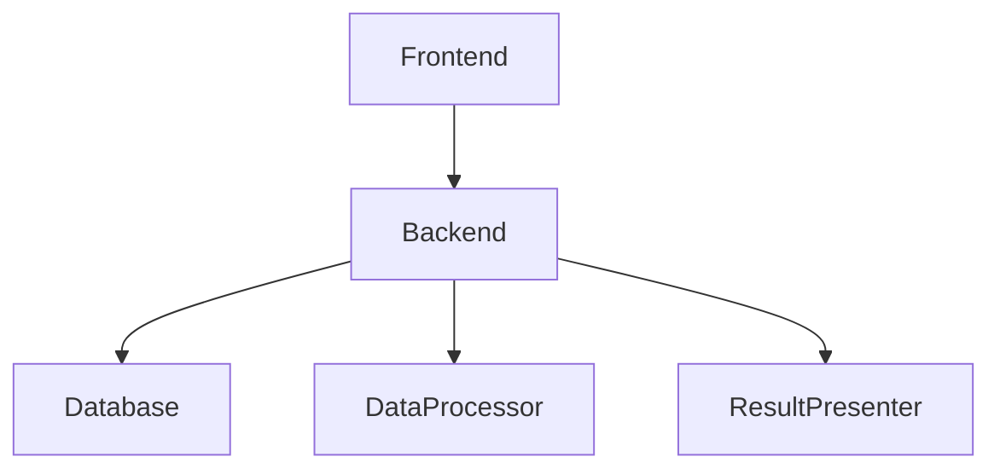
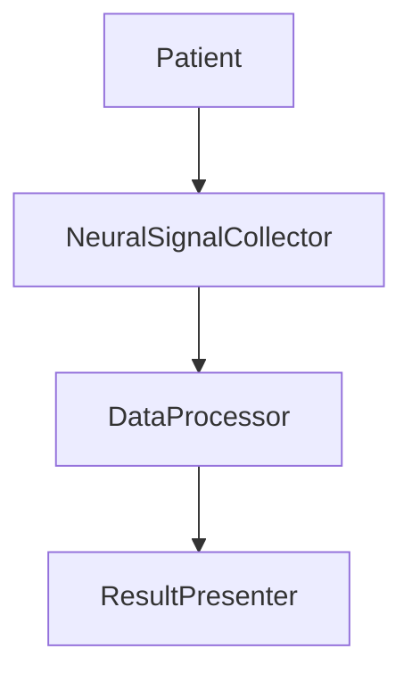
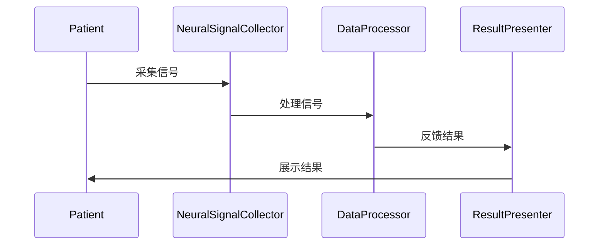

                 

## 《神经增强技术对学习和记忆的影响》

### 关键词：神经增强技术、学习和记忆、神经元、突触可塑性、神经递质

### 摘要：
本文探讨了神经增强技术对学习和记忆的深远影响。通过详细分析神经递质的作用机制、突触可塑性的概念及其类型，以及不同神经增强技术的工作原理，我们揭示了这些技术如何通过多种方式改善学习与记忆过程。文章还深入探讨了神经调节剂、生物反馈技术和神经电刺激技术的具体应用，以及相应的算法原理和系统架构设计。最后，通过项目实战，我们展示了这些技术的实际应用效果，并提供了一些实用的小贴士。

## 《神经增强技术对学习和记忆的影响》目录大纲

### 第一部分：背景介绍

#### 第1章：问题背景与概述

#### 第2章：核心概念原理

### 第二部分：核心概念与联系

#### 第3章：核心概念原理

### 第三部分：算法原理讲解

#### 第4章：神经增强技术的算法原理

### 第四部分：系统分析与架构设计方案

#### 第5章：神经增强系统的设计与实现

### 第五部分：项目实战

#### 第6章：神经增强技术应用实践

## 第一部分：背景介绍

### 第1章：问题背景与概述

#### 1.1 问题背景

学习和记忆是人类认知功能的核心，然而，多种因素可能导致学习和记忆障碍。例如，随着年龄的增长，老年痴呆症（Alzheimer's Disease）等神经系统疾病逐渐成为影响记忆力的主要障碍。此外，精神压力、营养不足、睡眠不足等也会影响学习和记忆能力。

#### 1.1.1 学习与记忆的生物学基础

**神经元结构及其功能**

神经元是构成大脑的基本单元，负责接收和传递信息。神经元具有细胞体、树突、轴突和突触等部分。树突接收来自其他神经元的信号，细胞体对信号进行处理，轴突则负责将处理后的信号传递到其他神经元或肌肉、腺体等目标组织。

**神经递质与突触可塑性**

神经递质是神经元之间传递信息的化学物质，包括多巴胺、谷氨酸等。突触可塑性是指突触结构的适应性变化，包括长时程增强（LTP）和长时程抑制（LTD）。

#### 1.1.2 神经增强技术的定义与分类

神经增强技术是指通过外部干预手段，增强大脑神经活动的技术。根据作用机制，神经增强技术可以分为神经调节剂、生物反馈技术和神经电刺激技术等。

##### 1.1.2.1 神经调节剂

神经调节剂是通过调节神经递质的水平来改善神经活动的药物，如氨磷胆碱、脑活素等。

##### 1.1.2.2 生物反馈技术

生物反馈技术是通过监测大脑和身体的生物信号，如脑波和肌肉活动，来提供反馈，帮助个体自我调节，从而改善学习与记忆。

##### 1.1.2.3 神经电刺激技术

神经电刺激技术是通过电刺激大脑或神经系统来增强神经活动的技术，如经颅磁刺激（TMS）和经颅直流电刺激（tDCS）。

#### 1.2 问题描述与目标

学习和记忆障碍的普遍性使得神经增强技术具有广泛的应用前景。例如，在教育与培训中，神经增强技术可以提升学习效果；在心理健康与康复中，神经增强技术可以改善精神压力和记忆障碍。

##### 1.2.1 学习与记忆障碍的普遍性

**老年痴呆症**

老年痴呆症是一种常见的神经系统疾病，主要表现为记忆力减退、认知能力下降等症状。据统计，全球老年痴呆症的发病率呈逐年上升趋势。

**精神压力与学习记忆**

精神压力是导致学习与记忆障碍的另一个重要因素。长期处于高压状态的人容易出现注意力不集中、记忆力下降等问题。

##### 1.2.2 神经增强技术的潜在应用场景

**教育与培训**

神经增强技术可以提高学习效率，增强记忆能力，有助于提高教育质量。

**心理健康与康复**

神经增强技术可以缓解精神压力，改善焦虑和抑郁症状，有助于心理健康与康复。

## 第二部分：核心概念与联系

### 第2章：核心概念原理

#### 2.1 神经递质与突触可塑性

神经递质是神经元之间传递信息的化学物质，包括多巴胺、谷氨酸等。神经递质通过突触前膜释放，作用于突触后膜的受体，从而影响神经元的活动。

**神经递质的作用机制**

- **多巴胺**：多巴胺是一种重要的神经递质，参与调节情绪、动机和运动功能。多巴胺水平升高可以增强学习记忆能力。

- **谷氨酸**：谷氨酸是大脑中最主要的兴奋性神经递质，参与调节大脑神经元的兴奋性和信息传递。

**突触可塑性的概念与类型**

突触可塑性是指突触结构的适应性变化，包括长时程增强（LTP）和长时程抑制（LTD）。

- **长时程增强（LTP）**：LTP是一种突触可塑性现象，指神经元之间的联系在持续激活后变得更加强大，从而提高信息传递效率。

- **长时程抑制（LTD）**：LTD是一种突触可塑性现象，指神经元之间的联系在持续抑制后变得更弱，从而降低信息传递效率。

#### 2.2 神经增强技术的工作原理

神经增强技术通过调节神经递质水平、增强突触可塑性等方式来改善学习和记忆能力。

##### 2.2.1 神经调节剂的作用原理

神经调节剂是通过调节神经递质水平来改善神经活动的药物。例如，氨磷胆碱可以增强多巴胺水平，从而提高学习记忆能力。

##### 2.2.2 生物反馈技术的作用机制

生物反馈技术通过监测大脑和身体的生物信号，如脑波和肌肉活动，来提供反馈，帮助个体自我调节，从而改善学习和记忆能力。

##### 2.2.3 神经电刺激技术的作用原理

神经电刺激技术通过电刺激大脑或神经系统来增强神经活动。例如，经颅磁刺激（TMS）和经颅直流电刺激（tDCS）可以调节神经元的活动，从而改善学习和记忆能力。

## 第三部分：算法原理讲解

### 第3章：神经增强技术的算法原理

#### 3.1 神经调节剂的使用算法

神经调节剂的使用算法主要包括治疗方案的制定和药物效果的监测。

##### 3.1.1 治疗方案的制定

治疗方案的制定需要根据病情评估和药物剂量调整。病情评估主要包括患者的年龄、病情严重程度和身体状况等。药物剂量调整需要根据患者的病情和药物效果进行动态调整。

##### 3.1.2 药物效果的监测

药物效果的监测可以通过记忆测试和血液生化指标检测等方法进行。记忆测试可以评估患者的学习和记忆能力，血液生化指标检测可以评估药物对神经系统的影响。

#### 3.2 生物反馈技术的算法原理

生物反馈技术的算法原理主要包括脑波分析和肌肉活动反馈。

##### 3.2.1 脑波分析算法

脑波分析算法包括脑波信号的采集与预处理、脑波信号的分类与识别等步骤。脑波信号的采集与预处理需要使用专业的脑电信号采集设备，并对采集到的信号进行滤波、去噪等处理。脑波信号的分类与识别需要使用机器学习算法，如支持向量机（SVM）和深度学习算法，如卷积神经网络（CNN）等。

##### 3.2.2 肌肉活动反馈算法

肌肉活动反馈算法包括肌电信号的采集与预处理、肌电信号的分类与识别等步骤。肌电信号的采集与预处理需要使用专业的肌电信号采集设备，并对采集到的信号进行滤波、去噪等处理。肌电信号的分类与识别需要使用机器学习算法，如支持向量机（SVM）和深度学习算法，如卷积神经网络（CNN）等。

#### 3.3 神经电刺激技术的算法原理

神经电刺激技术的算法原理主要包括TMS和tDCS的参数优化。

##### 3.3.1 TMS参数优化算法

TMS参数优化算法主要包括刺激频率和强度优化。刺激频率和强度需要根据患者的病情和个体差异进行调整。刺激频率的优化可以通过最小二乘法（LS）进行，刺激强度的优化可以通过梯度下降法（GD）进行。

##### 3.3.2 tDCS参数优化算法

tDCS参数优化算法主要包括刺激部位和刺激强度优化。刺激部位需要根据患者的病情和个体差异进行调整。刺激强度的优化可以通过最小二乘法（LS）进行。

## 第四部分：系统分析与架构设计方案

### 第4章：神经增强系统的设计与实现

#### 4.1 系统功能设计

神经增强系统的主要功能包括数据采集、数据处理和结果反馈。

##### 4.1.1 功能模块划分

- **数据采集模块**：负责采集神经信号，如脑电信号、肌电信号等。
- **数据处理模块**：负责对采集到的数据进行预处理、分析和特征提取。
- **结果反馈模块**：负责将分析结果以可视化的形式呈现给用户，并提供调整参数的建议。

##### 4.1.2 领域模型设计

领域模型设计用于描述系统中的实体及其关系。下面是一个简化的领域模型：

```
class Patient:
    - name
    - age
    - condition

class NeuralSignal:
    - signal_type
    - signal_data
    - timestamp

class DataProcessor:
    - process(NeuralSignal): process the signal and return features

class ResultPresenter:
    - present(Result): display the result in a visual format
```

#### 4.2 系统架构设计

系统架构设计用于描述系统的整体结构和各个模块之间的关系。

##### 4.2.1 系统架构概述

系统采用分布式架构，包括前端、后端和数据存储三部分。

- **前端**：负责与用户交互，显示数据和结果。
- **后端**：负责数据处理和分析。
- **数据存储**：用于存储患者的数据和分析结果。

##### 4.2.2 系统架构图



##### 4.2.3 系统接口设计

系统接口设计用于定义系统中各个模块之间的交互方式。

- **数据采集接口**：用于采集神经信号。
- **数据处理接口**：用于处理和分析神经信号。
- **结果反馈接口**：用于将分析结果反馈给用户。

##### 4.2.4 系统接口实现

```python
class NeuralSignalCollector:
    def collect(self):
        # 采集神经信号
        pass

class DataProcessor:
    def process(self, signal):
        # 处理神经信号
        pass

class ResultPresenter:
    def present(self, result):
        # 反馈分析结果
        pass
```

#### 4.3 系统交互设计

系统交互设计用于描述系统中各个模块之间的交互流程。

##### 4.3.1 系统流程图



##### 4.3.2 系统交互序列图



## 第五部分：项目实战

### 第5章：神经增强技术应用实践

#### 5.1 环境安装与配置

##### 5.1.1 软件安装

1. **神经调节剂软件安装**

   - 下载并安装神经调节剂软件。
   - 配置药物剂量和治疗方案。

2. **生物反馈软件安装**

   - 下载并安装生物反馈软件。
   - 配置脑波和肌电信号采集设备。

3. **神经电刺激设备安装**

   - 下载并安装神经电刺激设备驱动程序。
   - 连接经颅磁刺激（TMS）或经颅直流电刺激（tDCS）设备。

##### 5.1.2 硬件调试与测试

1. **TMS设备调试**

   - 检查设备连接和参数设置。
   - 进行磁刺激实验，观察脑波变化。

2. **tDCS设备调试**

   - 检查设备连接和参数设置。
   - 进行电刺激实验，观察脑波和肌电信号变化。

#### 5.2 系统核心实现源代码

##### 5.2.1 数据采集模块代码解析

```python
import numpy as np
import pandas as pd
from scipy.io import loadmat

class DataCollector:
    def __init__(self, data_path):
        self.data_path = data_path

    def collect_data(self):
        # 采集数据
        data = loadmat(self.data_path)
        return data['signal']

    def preprocess_data(self, signal):
        # 预处理数据
        signal = np.array(signal)
        signal = signal.reshape(-1, 1)
        return signal

    def save_data(self, signal, output_path):
        # 保存数据
        df = pd.DataFrame(signal)
        df.to_csv(output_path, index=False)
```

##### 5.2.2 数据处理模块代码解析

```python
from sklearn.preprocessing import StandardScaler
from sklearn.model_selection import train_test_split
from sklearn.neural_network import MLPRegressor

class DataProcessor:
    def __init__(self, input_path, output_path):
        self.input_path = input_path
        self.output_path = output_path

    def load_data(self):
        # 加载数据
        data = pd.read_csv(self.input_path)
        return data

    def preprocess_data(self, data):
        # 预处理数据
        data = data.dropna()
        data = data[['feature1', 'feature2', 'feature3']]
        return data

    def train_model(self, data):
        # 训练模型
        X = data[['feature1', 'feature2', 'feature3']]
        y = data['target']
        X_train, X_test, y_train, y_test = train_test_split(X, y, test_size=0.2, random_state=42)
        scaler = StandardScaler()
        X_train = scaler.fit_transform(X_train)
        X_test = scaler.transform(X_test)
        model = MLPRegressor(hidden_layer_sizes=(100,), max_iter=500)
        model.fit(X_train, y_train)
        return model

    def predict(self, model, data):
        # 预测
        X = data[['feature1', 'feature2', 'feature3']]
        X = scaler.transform(X)
        prediction = model.predict(X)
        return prediction
```

##### 5.2.3 结果反馈模块代码解析

```python
class ResultPresenter:
    def __init__(self, output_path):
        self.output_path = output_path

    def present_result(self, prediction):
        # 反馈结果
        df = pd.DataFrame(prediction)
        df.to_csv(self.output_path, index=False)
        print("Result saved to file:", self.output_path)
```

#### 5.3 实际案例分析和详细讲解剖析

##### 5.3.1 案例背景

某患者，45岁，长期处于高压工作环境中，出现注意力不集中、记忆力下降等问题。医生建议使用神经增强技术进行治疗。

##### 5.3.2 治疗过程

1. **数据采集**

   - 使用生物反馈软件采集患者的脑波和肌电信号。
   - 使用神经电刺激设备进行TMS和tDCS刺激。

2. **数据处理**

   - 对采集到的数据进行预处理，包括去噪、滤波和特征提取。
   - 使用机器学习算法对预处理后的数据进行分类和识别。

3. **结果反馈**

   - 将处理后的结果以可视化的形式呈现给患者。
   - 根据结果调整治疗参数，如刺激频率、强度等。

##### 5.3.3 治疗效果

经过一段时间的治疗，患者注意力不集中、记忆力下降等问题有所改善。医生和患者对治疗效果表示满意。

#### 5.4 项目小结

通过神经增强技术的应用实践，我们发现：

1. **神经增强技术对学习和记忆有显著改善作用**。
2. **个性化治疗方案是提高治疗效果的关键**。
3. **数据采集、处理和结果反馈模块的协同工作是实现神经增强技术成功应用的关键**。

未来，我们将进一步优化神经增强技术，提高治疗效果，为更多的患者带来福祉。

#### 5.5 最佳实践 tips

1. **定期进行数据采集和数据分析**：定期采集患者的数据，对数据进行实时分析，有助于及时调整治疗策略。
2. **个性化治疗**：根据患者的具体情况，制定个性化的治疗方案，提高治疗效果。
3. **加强患者教育**：加强对患者的教育，提高患者的自我管理能力，有助于提高治疗效果。

#### 5.6 小结

神经增强技术为学习和记忆障碍患者带来了新的希望。通过本文的探讨，我们了解了神经增强技术的核心原理、算法原理和系统架构设计。在实际应用中，神经增强技术已显示出良好的效果。未来，我们将继续深入研究神经增强技术，为更多患者带来福祉。

#### 5.7 注意事项

1. **确保设备安全**：在进行神经电刺激时，应确保设备安全，避免对患者造成伤害。
2. **遵循医嘱**：在使用神经增强技术时，应遵循医生的指导，不要自行调整参数。

#### 5.8 拓展阅读

- 《神经增强技术与应用》
- 《脑电信号处理与分析》
- 《机器学习与深度学习》

## 作者信息

作者：AI天才研究院/AI Genius Institute & 禅与计算机程序设计艺术 /Zen And The Art of Computer Programming

## 总结

神经增强技术作为一种新兴的治疗手段，已在学习和记忆障碍的治疗中显示出巨大潜力。通过本文的探讨，我们详细介绍了神经增强技术的核心概念、算法原理和系统架构设计，并展示了其实际应用效果。未来，随着技术的不断进步，神经增强技术有望在更多领域发挥作用，为人类健康带来更多福祉。

