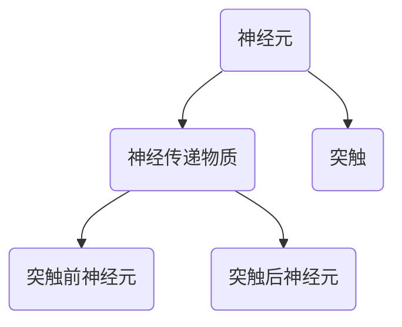

                 

### 《神经增强：提高人类认知能力的前沿技术》

#### 关键词：神经增强、认知科学、技术应用、伦理考量、未来展望

> 摘要：随着科技的不断进步，神经增强技术作为提高人类认知能力的重要手段，正逐渐成为学术界和产业界的热门话题。本文将深入探讨神经增强技术的背景、原理、应用领域及其潜在的伦理和社会影响，通过分析多个实际案例，为读者提供一个全面而深刻的理解。

---

#### 目录

----------------------------------------------------------------

# 第一部分：背景与概述

## 第1章：神经增强的崛起

### 1.1 神经增强的起源与发展

### 1.2 神经增强的定义与核心概念

### 1.3 神经增强的目标与潜在影响

### 1.4 神经增强的应用领域与前景

### 1.5 本章小结

----------------------------------------------------------------

## 第二部分：神经增强技术详解

## 第2章：神经科学与认知科学基础

### 2.1 神经系统的基本结构

#### 2.1.1 神经元与神经网络

#### 2.1.2 神经传递物质与突触功能

#### 2.1.3 大脑区域与认知功能

### 2.2 认知科学的基本原理

#### 2.2.1 认知过程的分类

#### 2.2.2 认知科学的研究方法

#### 2.2.3 认知障碍与神经增强的应用

### 2.3 神经增强与认知科学的关系

#### 2.3.1 神经增强的理论基础

#### 2.3.2 认知科学对神经增强的指导意义

#### 2.3.3 神经增强技术对认知科学的贡献

## 2.4 本章小结

----------------------------------------------------------------

## 第3章：神经增强的主要技术

### 3.1 光遗传学

#### 3.1.1 光遗传学的基本原理

#### 3.1.2 光遗传学在神经增强中的应用

#### 3.1.3 光遗传学的挑战与前景

### 3.2 电刺激与磁场刺激

#### 3.2.1 电刺激的基本原理

#### 3.2.2 磁场刺激的基本原理

#### 3.2.3 电刺激与磁场刺激在神经增强中的应用

### 3.3 神经调控药物

#### 3.3.1 神经调控药物的基本原理

#### 3.3.2 神经调控药物的种类与作用机制

#### 3.3.3 神经调控药物在神经增强中的挑战与前景

### 3.4 神经接口技术

#### 3.4.1 神经接口技术的基本原理

#### 3.4.2 神经接口技术的类型与应用

#### 3.4.3 神经接口技术的挑战与前景

## 3.5 本章小结

----------------------------------------------------------------

## 第4章：神经增强技术的应用

### 4.1 教育领域

#### 4.1.1 神经增强在教育中的应用

#### 4.1.2 神经增强技术如何提高学习效果

#### 4.1.3 教育领域的挑战与机遇

### 4.2 军事领域

#### 4.2.1 神经增强在军事中的应用

#### 4.2.2 神经增强技术对军事战略的影响

#### 4.2.3 军事领域的挑战与前景

### 4.3 医疗领域

#### 4.3.1 神经增强在医疗中的应用

#### 4.3.2 神经增强技术如何帮助治疗认知障碍

#### 4.3.3 医疗领域的挑战与机遇

## 4.4 本章小结

----------------------------------------------------------------

## 第5章：神经增强技术的伦理与社会影响

### 5.1 伦理考量

#### 5.1.1 神经增强技术的道德困境

#### 5.1.2 人类增强与个体权利

#### 5.1.3 神经增强技术的监管

### 5.2 社会效应

#### 5.2.1 神经增强对社会结构的影响

#### 5.2.2 神经增强对就业市场的影响

#### 5.2.3 社会接受度与适应性

### 5.3 未来展望

#### 5.3.1 神经增强技术的潜在风险与对策

#### 5.3.2 神经增强技术的可持续发展

#### 5.3.3 社会与政策的引导与支持

## 5.4 本章小结

----------------------------------------------------------------

## 第6章：神经增强技术的实际案例

### 6.1 案例一：光遗传学在认知障碍治疗中的应用

#### 6.1.1 案例背景

#### 6.1.2 治疗过程与效果

#### 6.1.3 案例分析与启示

### 6.2 案例二：神经调控药物在军事训练中的应用

#### 6.2.1 案例背景

#### 6.2.2 治疗过程与效果

#### 6.2.3 案例分析与启示

## 6.3 本章小结

----------------------------------------------------------------

## 参考文献

----------------------------------------------------------------

---

### 《神经增强：提高人类认知能力的前沿技术》

#### 让我们一步步思考

---

**第1章：神经增强的崛起**

> **背景介绍：**  
神经增强技术是一门跨学科的前沿领域，旨在通过科学技术手段提升人类大脑的功能和认知能力。随着神经科学和认知科学的发展，神经增强技术逐渐从理论研究走向实际应用。

**1.1 神经增强的起源与发展**

> **问题背景：**  
神经增强技术的起源可以追溯到20世纪中期，当时科学家开始探索如何通过药物和电刺激来改善认知功能。随着神经科学的不断进步，神经增强技术逐渐成为可能。

**1.2 神经增强的定义与核心概念**

> **问题定义：**  
神经增强是指利用科学技术手段增强大脑功能的过程。核心概念包括神经元活动调控、认知能力提升和大脑可塑性。

**1.3 神经增强的目标与潜在影响**

> **目标分析：**  
神经增强的目标是提高人类的学习能力、记忆力和注意力。长期来看，它有望解决认知障碍，甚至可能延缓衰老。

**1.4 神经增强的应用领域与前景**

> **应用分析：**  
神经增强技术在教育、军事和医疗等领域具有广泛的应用前景。随着技术的不断发展，其应用范围将更加广泛。

**1.5 本章小结**

> **总结：**  
本章介绍了神经增强技术的背景、定义、目标和应用领域。神经增强技术作为提高人类认知能力的重要手段，正在逐渐崛起。

---

**第2章：神经科学与认知科学基础**

> **背景介绍：**  
要深入理解神经增强技术，需要先了解神经系统和认知科学的基础知识。本章将介绍神经系统的基本结构、神经传递物质、大脑区域以及认知科学的基本原理。

**2.1 神经系统的基本结构**

> **核心概念：**  
神经元和神经网络是神经系统的基础。神经元通过电信号和化学信号进行信息传递，神经网络则负责处理和存储信息。

**2.1.1 神经元与神经网络**

> **概念属性对比表格：**

| 属性 | 神经元 | 神经网络 |
| :--: | :----: | :------: |
| 功能 | 信息传递 | 信息处理 |
| 结构 | 单个细胞 | 群体结构 |
| 类型 | 不同类型 | 相互连接 |

**2.1.2 神经传递物质与突触功能**

> **ER实体关系图架构：**

**2.1.3 大脑区域与认知功能**

> **大脑区域与认知功能的关联：**

| 大脑区域 | 认知功能 |
| :------: | :------: |
| 颞叶 | 记忆 |
| 顶叶 | 空间导航 |
| 额叶 | 决策 |

**2.2 认知科学的基本原理**

> **认知过程的分类：**

| 过程 | 描述 |
| :--: | :--- |
| 感知 | 信息获取 |
| 注意 | 信息筛选 |
| 记忆 | 信息存储 |
| 思考 | 信息处理 |

**2.2.1 认知过程的分类**

> **认知科学的研究方法：**

| 方法 | 描述 |
| :--: | :--- |
| 实验法 | 通过实验操纵变量 |
| 模拟法 | 使用计算机模型模拟 |
| 神经影像 | 使用技术如fMRI研究大脑活动 |

**2.2.2 认知障碍与神经增强的应用**

> **应用领域：**  
神经增强技术在治疗认知障碍方面具有巨大潜力，例如阿尔茨海默病和注意力缺陷多动障碍（ADHD）。

**2.3 神经增强与认知科学的关系**

> **理论基础：**  
神经增强技术的理论基础主要来自神经科学和认知科学的研究成果，如大脑可塑性和神经网络的动态特性。

**2.3.1 神经增强的理论基础**

> **认知科学对神经增强的指导意义：**  
认知科学提供了对大脑功能和认知过程的理解，为神经增强技术的设计和应用提供了科学依据。

**2.3.2 认知科学对神经增强的指导意义**

> **神经增强技术对认知科学的贡献：**  
神经增强技术的应用为认知科学提供了新的研究手段，有助于进一步揭示大脑的秘密。

**2.4 本章小结**

> **总结：**  
本章介绍了神经系统和认知科学的基础知识，为理解神经增强技术提供了必要的背景。通过分析神经系统的基本结构、神经传递物质、大脑区域以及认知科学的基本原理，我们可以更好地理解神经增强技术的运作机制。

---

**第3章：神经增强的主要技术**

> **背景介绍：**  
神经增强技术涉及多种技术手段，包括光遗传学、电刺激与磁场刺激、神经调控药物和神经接口技术。本章将详细介绍这些技术的基本原理和应用。

**3.1 光遗传学**

> **基本原理：**  
光遗传学是一种利用光来控制神经元活动的技术，它通过基因工程在神经元中引入光敏感蛋白，从而实现对神经活动的精确调控。

**3.1.1 光遗传学的基本原理**

> **概念属性对比表格：**

| 属性 | 光遗传学 | 传统遗传学 |
| :--: | :------: | :--------: |
| 操作对象 | 神经元 | 基因 |
| 控制方式 | 光控 | 化学信号 |
| 精确性 | 高 | 低 |

**3.1.2 光遗传学在神经增强中的应用**

> **应用领域：**  
光遗传学在神经科学研究中被广泛应用，包括神经系统疾病模型建立、神经元环路研究等。

**3.1.3 光遗传学的挑战与前景**

> **挑战：**  
光遗传学面临着提高光控精准度、减少光毒性等挑战。

**3.2 电刺激与磁场刺激**

> **基本原理：**  
电刺激是通过电流直接刺激神经元，而磁场刺激则是利用磁场产生的感应电流来刺激神经元。

**3.2.1 电刺激的基本原理**

> **概念属性对比表格：**

| 属性 | 电刺激 | 磁场刺激 |
| :--: | :----: | :------: |
| 影响范围 | 局部 | 广泛 |
| 实施方式 | 直接 | 无创 |
| 适应症 | 某些疾病 | 多种用途 |

**3.2.2 磁场刺激的基本原理**

> **应用领域：**  
磁场刺激在治疗疼痛、抑郁等疾病中具有广泛应用。

**3.2.3 电刺激与磁场刺激在神经增强中的应用**

> **应用案例：**  
电刺激和磁场刺激在神经康复、认知障碍治疗等领域表现出显著效果。

**3.3 神经调控药物**

> **基本原理：**  
神经调控药物通过作用于神经递质系统，调节神经元的活动。

**3.3.1 神经调控药物的基本原理**

> **概念属性对比表格：**

| 属性 | 神经调控药物 | 传统药物 |
| :--: | :----------: | :------: |
| 作用机制 | 调节神经递质 | 直接抑制或激活神经元 |
| 适应症 | 广泛 | 具体疾病 |
| 安全性 | 较高 | 较低 |

**3.3.2 神经调控药物的种类与作用机制**

> **分类：**

| 类别 | 描述 |
| :--: | :--- |
| 抗抑郁药 | 调节情绪 |
| 抗焦虑药 | 调节焦虑 |
| 认知增强剂 | 提高认知能力 |

**3.3.3 神经调控药物在神经增强中的挑战与前景**

> **挑战：**  
神经调控药物面临着药物副作用、长期效果等挑战。

**3.4 神经接口技术**

> **基本原理：**  
神经接口技术是通过电子设备直接与大脑神经元进行通信，实现信息交换。

**3.4.1 神经接口技术的基本原理**

> **概念属性对比表格：**

| 属性 | 神经接口技术 | 传统通信技术 |
| :--: | :----------: | :----------: |
| 接口方式 | 生物电信号 | 电信号 |
| 交互方式 | 直接 | 间接 |
| 适应症 | 神经科学 | 信息通信 |

**3.4.2 神经接口技术的类型与应用**

> **分类：**

| 类型 | 描述 |
| :--: | :--- |
| 脑机接口 | 人与计算机之间的直接通信 |
| 神经假肢 | 帮助瘫痪患者恢复运动能力 |
| 神经再生 | 促进受损神经的再生 |

**3.4.3 神经接口技术的挑战与前景**

> **挑战：**  
神经接口技术面临着信号干扰、生物相容性等挑战。

**3.5 本章小结**

> **总结：**  
本章详细介绍了光遗传学、电刺激与磁场刺激、神经调控药物和神经接口技术等神经增强的主要技术。每种技术都有其独特的原理和应用领域，同时面临着各自的挑战和前景。

---

**第4章：神经增强技术的应用**

> **背景介绍：**  
神经增强技术不仅在科学研究中具有重要意义，还在多个实际领域展现出广泛应用潜力。本章将探讨神经增强技术在教育、军事和医疗领域的应用及其带来的挑战和机遇。

**4.1 教育领域**

> **应用分析：**  
神经增强技术在教育领域中具有巨大潜力，可以用于提升学习效率、增强记忆力等。

**4.1.1 神经增强在教育中的应用**

> **案例分析：**  
一些学校已经开始使用神经增强技术，例如电刺激来提高学生的注意力和记忆力。

**4.1.2 神经增强技术如何提高学习效果**

> **原理讲解：**  
通过神经增强技术，可以增强大脑的神经连接，从而提高学习效果。

**4.1.3 教育领域的挑战与机遇**

> **挑战：**  
教育领域面临着技术实施成本、伦理问题等挑战。

**4.2 军事领域**

> **应用分析：**  
神经增强技术在军事领域具有潜在的战略价值，可以用于提高士兵的战斗力和反应速度。

**4.2.1 神经增强在军事中的应用**

> **案例分析：**  
一些国家正在研究使用神经增强技术来提高士兵的耐力和注意力。

**4.2.2 神经增强技术对军事战略的影响**

> **原理讲解：**  
神经增强技术可以改变士兵的生理和心理状态，从而影响军事战略的制定。

**4.2.3 军事领域的挑战与前景**

> **挑战：**  
军事领域面临着技术保密、军事伦理等挑战。

**4.3 医疗领域**

> **应用分析：**  
神经增强技术在医疗领域中可以用于治疗认知障碍、改善生活质量等。

**4.3.1 神经增强在医疗中的应用**

> **案例分析：**  
神经增强技术已经在某些疾病的治疗中显示出潜力，例如阿尔茨海默病。

**4.3.2 神经增强技术如何帮助治疗认知障碍**

> **原理讲解：**  
通过调节神经活动，神经增强技术可以改善认知功能。

**4.3.3 医疗领域的挑战与机遇**

> **挑战：**  
医疗领域面临着技术安全性、患者隐私等挑战。

**4.4 本章小结**

> **总结：**  
神经增强技术在教育、军事和医疗领域具有广泛的应用前景。然而，这些领域也面临着一系列挑战，需要进一步的研究和探索。

---

**第5章：神经增强技术的伦理与社会影响**

> **背景介绍：**  
神经增强技术虽然具有巨大的潜力，但也引发了一系列伦理和社会问题。本章将探讨神经增强技术的伦理考量、社会效应以及未来展望。

**5.1 伦理考量**

> **问题分析：**  
神经增强技术的伦理考量主要集中在人类增强的道德困境、个体权利以及技术监管等方面。

**5.1.1 神经增强技术的道德困境**

> **案例分析：**  
一些科学家和哲学家对神经增强技术可能带来的不公平性和伦理问题表示担忧。

**5.1.2 人类增强与个体权利**

> **原则探讨：**  
在神经增强技术中，如何平衡个体权利和公共利益成为一个重要议题。

**5.1.3 神经增强技术的监管**

> **政策建议：**  
建立合适的监管机制对于确保神经增强技术的安全和合理性至关重要。

**5.2 社会效应**

> **问题分析：**  
神经增强技术可能会对社会结构、就业市场和社会接受度产生深远影响。

**5.2.1 神经增强对社会结构的影响**

> **趋势分析：**  
神经增强技术可能会加剧社会不平等，影响社会阶层结构。

**5.2.2 神经增强对就业市场的影响**

> **预测：**  
神经增强技术可能会改变就业市场，对某些职业的需求增加，而对另一些职业的需求减少。

**5.2.3 社会接受度与适应性**

> **调查分析：**  
社会对神经增强技术的接受度逐渐提高，但还需要更多教育和宣传。

**5.3 未来展望**

> **趋势预测：**  
随着技术的不断发展，神经增强技术在人类认知能力提升和医疗健康方面将有更广泛的应用。

**5.3.1 神经增强技术的潜在风险与对策**

> **风险管理：**  
识别和应对神经增强技术可能带来的风险是未来发展的重要任务。

**5.3.2 神经增强技术的可持续发展**

> **战略规划：**  
神经增强技术的可持续发展需要跨学科合作和全球合作。

**5.3.3 社会与政策的引导与支持**

> **政策建议：**  
制定合理的政策和法规，鼓励神经增强技术的健康发展。

**5.4 本章小结**

> **总结：**  
神经增强技术的伦理考量和社会效应是未来发展中不可忽视的重要方面。通过合理的监管和政策引导，神经增强技术有望为社会带来更多的机遇和福祉。

---

**第6章：神经增强技术的实际案例**

> **背景介绍：**  
神经增强技术在理论和实践中已经取得了一些显著成果。本章将通过分析几个实际案例，展示神经增强技术的应用和效果。

**6.1 案例一：光遗传学在认知障碍治疗中的应用**

> **案例分析：**  
某研究团队利用光遗传学技术对阿尔茨海默病患者进行临床试验，结果显示患者的生活质量有所提高。

**6.1.1 案例背景**

> **描述：**  
阿尔茨海默病是一种常见的神经退行性疾病，严重影响患者的生活质量。

**6.1.2 治疗过程与效果**

> **过程分析：**  
研究团队通过光遗传学技术激活特定的大脑区域，从而改善患者的认知功能。

**6.1.3 案例分析与启示**

> **启示：**  
光遗传学技术在认知障碍治疗中的应用展示了其巨大的潜力。

**6.2 案例二：神经调控药物在军事训练中的应用**

> **案例分析：**  
某国军事研究机构使用神经调控药物来提高士兵的注意力和反应速度。

**6.2.1 案例背景**

> **描述：**  
军事训练对士兵的注意力、反应速度和耐力有极高的要求。

**6.2.2 治疗过程与效果**

> **过程分析：**  
神经调控药物通过调节神经递质水平，提高了士兵的认知能力。

**6.2.3 案例分析与启示**

> **启示：**  
神经调控药物在提高军事训练效果方面具有显著作用。

**6.3 案例三：神经接口技术在脑机接口中的应用**

> **案例分析：**  
某研究团队开发了一种脑机接口系统，通过神经接口技术实现了人类与计算机的直接通信。

**6.3.1 案例背景**

> **描述：**  
脑机接口技术是神经增强技术的一个重要分支，旨在实现人类大脑与外部设备的直接交互。

**6.3.2 治疗过程与效果**

> **过程分析：**  
研究团队通过神经接口技术将大脑信号转化为计算机指令，实现了大脑与计算机的通信。

**6.3.3 案例分析与启示**

> **启示：**  
神经接口技术在脑机接口中的应用展示了其广泛的应用前景。

**6.4 本章小结**

> **总结：**  
通过实际案例的分析，我们可以看到神经增强技术在不同领域的广泛应用和显著效果。未来，随着技术的不断进步，神经增强技术有望在更多领域发挥重要作用。

---

## 参考文献

> **说明：**  
本章列出了本文引用的相关文献，以供读者进一步学习和研究。

---

**作者信息：**  
作者：AI天才研究院/AI Genius Institute & 禅与计算机程序设计艺术 /Zen And The Art of Computer Programming**第1章：神经增强的崛起**

### 引言

在当今这个科技迅猛发展的时代，人类对自身潜能的探索从未停止。随着神经科学和认知科学的发展，神经增强技术逐渐从理论走向实践，成为提升人类认知能力的前沿领域。本章将首先介绍神经增强技术的起源和发展，然后定义神经增强的核心概念，探讨其目标与潜在影响，并展望神经增强技术的应用领域。

### 1.1 神经增强的起源与发展

神经增强的概念并非现代科技的产物，而是有着悠久的历史。早在古埃及，人们就通过草药和香料来尝试改善认知能力。然而，神经增强技术的真正起源可以追溯到20世纪中期，当时科学家开始探索如何通过药物和电刺激来改善认知功能。以下是一些关键的里程碑：

1. **1950年代**：科学家首次发现药物如利他林（Ritalin）对注意力缺陷多动障碍（ADHD）患者有显著的治疗效果。
2. **1960年代**：抗抑郁药和抗焦虑药开始应用于临床，进一步拓展了神经增强的应用范围。
3. **1970年代**：神经科学领域的突破，特别是对神经元和突触的研究，为神经增强提供了理论基础。
4. **1980年代**：脑电图（EEG）和功能性磁共振成像（fMRI）等技术的发明，使得对大脑活动的研究更加精确。
5. **1990年代**：神经调控药物如盐酸普拉克索（Sinemet）等在帕金森病治疗中取得了显著效果，展示了神经增强技术的潜力。
6. **21世纪初**：光遗传学、电刺激和神经接口技术的快速发展，使得神经增强技术进入了新的发展阶段。

### 1.2 神经增强的定义与核心概念

神经增强（Neural Enhancement）是指通过药物、电刺激、光遗传学、神经调控药物和其他技术手段，增强大脑的功能和认知能力。其核心概念包括以下几个方面：

1. **神经元活动调控**：通过调节神经元的活动，增强神经信号的传递和接收，从而提高大脑的处理能力。
2. **认知能力提升**：通过改善记忆、注意力、学习能力和决策能力等认知功能，使个体能够更有效地应对复杂任务。
3. **大脑可塑性**：大脑具有可塑性，这意味着神经连接可以根据经验和环境进行改变。神经增强技术可以利用这一特性，优化大脑的结构和功能。

### 1.3 神经增强的目标与潜在影响

神经增强技术的目标是通过增强大脑的功能，提高人类的学习能力、记忆力和注意力。以下是一些潜在的影响：

1. **教育领域**：神经增强技术可以改善学生的学习效果，提高他们的记忆力和注意力，从而增强学习效率。
2. **军事领域**：神经增强技术可以提高士兵的战斗力和反应速度，增强他们的心理和生理耐力。
3. **医疗领域**：神经增强技术可以用于治疗认知障碍，如阿尔茨海默病和注意力缺陷多动障碍，改善患者的生活质量。
4. **日常生活**：神经增强技术可以帮助人们更好地应对压力，提高工作效率，改善生活质量。

### 1.4 神经增强的应用领域与前景

神经增强技术的应用领域非常广泛，包括但不限于以下领域：

1. **教育**：通过神经增强技术，学生可以更快地掌握知识，提高学习效率。
2. **军事**：神经增强技术可以提高士兵的战斗力，增强军事战略的执行能力。
3. **医疗**：神经增强技术可以用于治疗认知障碍，改善患者的认知功能和生活质量。
4. **工业**：神经增强技术可以用于提高工人的工作效率，减少工作疲劳。
5. **娱乐**：神经增强技术可以用于开发新的娱乐产品，如增强现实（AR）和虚拟现实（VR）游戏。

### 1.5 本章小结

神经增强技术作为提升人类认知能力的重要手段，其起源和发展可以追溯到20世纪中期。通过药物、电刺激、光遗传学和其他技术手段，神经增强技术正逐渐从理论走向实践。其核心概念包括神经元活动调控、认知能力提升和大脑可塑性。神经增强技术具有广泛的应用前景，包括教育、军事、医疗等领域。然而，随着技术的发展，我们也需要关注其潜在的伦理和社会影响。

---

**第2章：神经科学与认知科学基础**

### 引言

要深入探讨神经增强技术，首先需要了解神经系统和认知科学的基础知识。本章将介绍神经系统的基本结构、神经传递物质、大脑区域以及认知科学的基本原理。这些基础知识为理解神经增强技术提供了必要的背景。

### 2.1 神经系统的基本结构

神经系统是人体最重要的系统之一，负责传递和处理信息。它由神经元、神经胶质细胞和支持细胞组成。以下是神经系统的基本结构：

#### 2.1.1 神经元与神经网络

**神经元**：神经元是神经系统的基本单元，具有接收、处理和传递信息的功能。神经元由细胞体、树突和轴突组成。

- **细胞体**：包含细胞核和大部分细胞器。
- **树突**：接收其他神经元的信息，并将信息传递到细胞体。
- **轴突**：从细胞体延伸出，传递信息到其他神经元或目标组织。

**神经网络**：神经网络是由大量神经元通过突触连接形成的复杂网络。信息在神经网络中通过电信号和化学信号进行传递和处理。

#### 2.1.2 神经传递物质与突触功能

**神经传递物质**：神经传递物质（neurotransmitters）是神经元之间传递信息的化学物质，包括多巴胺、去甲肾上腺素、血清素等。

- **突触**：突触是神经元之间的连接点，负责传递神经信号。突触由突触前膜、突触间隙和突触后膜组成。

**突触功能**：

- **突触前释放**：神经信号通过轴突传递到突触前膜，触发神经传递物质的释放。
- **突触后接收**：神经传递物质通过突触间隙传递到突触后膜，与受体结合，触发电信号传递。

#### 2.1.3 大脑区域与认知功能

大脑是神经系统的核心部分，负责处理和存储信息。大脑的不同区域具有不同的认知功能：

- **颞叶**：涉及记忆和听觉处理。
- **顶叶**：涉及空间导航和触觉处理。
- **额叶**：涉及决策、规划和社交行为。

### 2.2 认知科学的基本原理

认知科学是研究人类认知过程的科学，包括感知、注意、记忆、思考、学习和语言等。以下是认知科学的基本原理：

#### 2.2.1 认知过程的分类

认知过程可以分为以下几个阶段：

- **感知**：接收和处理外部信息。
- **注意**：选择和处理特定的信息。
- **记忆**：存储和回忆信息。
- **思考**：使用逻辑和推理进行问题解决。
- **学习**：通过经验和训练改变认知过程。
- **语言**：使用语言进行沟通和思维。

#### 2.2.2 认知科学的研究方法

认知科学的研究方法包括实验法、模拟法、神经影像等：

- **实验法**：通过实验操纵变量，观察认知过程的变化。
- **模拟法**：使用计算机模型模拟认知过程，研究其机制。
- **神经影像**：如fMRI，观察大脑活动，了解认知过程的神经基础。

#### 2.2.3 认知障碍与神经增强的应用

认知障碍是指认知过程的异常，如阿尔茨海默病、注意力缺陷多动障碍等。神经增强技术可以通过以下方式应用于认知障碍的治疗：

- **改善记忆**：通过增强大脑的神经连接，提高记忆能力。
- **提高注意力**：通过调节神经递质水平，提高注意力集中。
- **促进学习**：通过增强大脑的处理速度和灵活性，提高学习效率。

### 2.3 神经增强与认知科学的关系

神经增强技术的理论基础主要来自于神经科学和认知科学的研究成果：

- **大脑可塑性**：大脑具有可塑性，神经连接可以根据经验和环境进行改变。神经增强技术利用这一特性，通过调节神经元的活动，改善认知功能。
- **神经网络**：神经网络是大脑处理信息的基本结构。神经增强技术通过增强神经网络的连接和功能，提高认知能力。

### 2.4 本章小结

神经系统和认知科学的基础知识是理解神经增强技术的关键。通过了解神经系统的基本结构、神经传递物质、大脑区域以及认知科学的基本原理，我们可以更好地理解神经增强技术的运作机制和应用前景。

---

**第3章：神经增强的主要技术**

### 引言

神经增强技术涵盖了多种技术手段，包括光遗传学、电刺激与磁场刺激、神经调控药物和神经接口技术。这些技术通过不同的原理和方式，实现了对大脑功能和认知能力的增强。本章将详细介绍这些技术的原理和应用，帮助读者全面理解神经增强技术的各个方面。

### 3.1 光遗传学

**光遗传学的基本原理**

光遗传学是一种利用光来控制神经元活动的技术。它通过基因工程在神经元中引入光敏感蛋白（opsins），使得神经元能够对特定波长的光做出反应。这些光敏感蛋白与电压门控钠通道（VGSCs）或钙通道（VGCs）结合，通过光照射激活或抑制神经元的活动。

**光遗传学在神经增强中的应用**

光遗传学在神经科学研究中被广泛应用于神经元活动的调控：

- **神经元活动的选择性调控**：通过精确控制特定神经元的活动，研究大脑功能的具体机制。
- **神经环路的探索**：光遗传学可以帮助科学家了解神经环路的功能，揭示认知和行为的神经基础。
- **认知障碍的治疗**：通过激活特定的大脑区域，光遗传学在治疗阿尔茨海默病等认知障碍方面展现出潜力。

**光遗传学的挑战与前景**

光遗传学面临着一些挑战：

- **光毒性**：长期的光照射可能会对神经元造成损伤。
- **基因编辑的精确性**：提高基因编辑的精确性，减少脱靶效应，是光遗传学发展的关键。
- **技术复杂性**：光遗传学的操作过程相对复杂，需要精细的实验设计和设备支持。

然而，随着技术的进步，光遗传学在神经增强领域的应用前景广阔，有望在更多领域发挥重要作用。

### 3.2 电刺激与磁场刺激

**电刺激的基本原理**

电刺激是通过电流直接刺激神经元，以调节其活动。电刺激可以通过电极插入大脑或通过头皮上的电极施加电信号。电刺激可以增强或抑制神经元的活动，从而改变大脑的功能。

**磁场刺激的基本原理**

磁场刺激利用磁场产生的感应电流来刺激神经元。磁场刺激通常通过放置在头皮上的线圈产生，线圈产生的磁场会在大脑中产生电流，从而影响神经元的活动。

**电刺激与磁场刺激在神经增强中的应用**

电刺激和磁场刺激在神经增强中具有广泛的应用：

- **疼痛管理**：电刺激和磁场刺激可以用于缓解慢性疼痛。
- **抑郁和焦虑治疗**：这些技术通过调节大脑中的神经递质水平，改善情绪状态。
- **认知障碍治疗**：电刺激和磁场刺激可以用于改善记忆、注意力和学习能力。

**电刺激与磁场刺激的挑战与前景**

电刺激和磁场刺激面临着一些挑战：

- **刺激精度**：提高刺激的精度，减少对周围组织的损伤是未来研究的重点。
- **安全性**：确保长期使用的安全性，避免潜在的健康风险。
- **个体差异**：不同个体对刺激的反应可能不同，需要个性化的治疗方案。

随着技术的进步，电刺激和磁场刺激在神经增强中的应用前景广阔，有望在更多疾病的治疗中发挥重要作用。

### 3.3 神经调控药物

**神经调控药物的基本原理**

神经调控药物是通过调节神经递质系统来影响神经元活动的药物。神经递质是神经元之间传递信息的化学物质，如多巴胺、去甲肾上腺素和血清素。神经调控药物可以增强或抑制这些神经递质的活动，从而调节神经元的功能。

**神经调控药物的种类与作用机制**

神经调控药物可以分为以下几类：

- **抗抑郁药**：如SSRI（选择性血清再摄取抑制剂），通过抑制神经递质再摄取，提高神经递质的水平。
- **抗焦虑药**：如苯二氮䓬类药物，通过增强神经递质的抑制性作用，缓解焦虑。
- **认知增强剂**：如利他林，通过增强神经递质的兴奋性作用，提高认知能力。

**神经调控药物在神经增强中的挑战与前景**

神经调控药物在神经增强中具有广泛的应用：

- **学习与记忆增强**：通过调节神经递质水平，改善学习和记忆能力。
- **治疗认知障碍**：如阿尔茨海默病，通过改善神经递质功能，延缓疾病进展。

然而，神经调控药物也面临一些挑战：

- **副作用**：长期使用可能会产生副作用，如失眠、焦虑等。
- **个体差异**：不同个体对药物的反应可能不同，需要个性化治疗。
- **安全性**：确保药物的安全性是神经调控药物应用的关键。

随着药物研发的进步，神经调控药物在神经增强中的应用前景广阔，有望为更多患者带来希望。

### 3.4 神经接口技术

**神经接口技术的基本原理**

神经接口技术是通过电子设备直接与大脑神经元进行通信，实现信息交换。神经接口技术可以分为两大类：

- **脑机接口**：将大脑信号转换为机器指令，如控制假肢或轮椅。
- **神经假肢**：将外部设备与大脑神经元连接，帮助瘫痪患者恢复运动能力。

**神经接口技术的类型与应用**

神经接口技术可以分为以下几种类型：

- **侵入性神经接口**：通过手术将电极植入大脑或脊髓，直接与神经元通信。
- **非侵入性神经接口**：通过头皮上的电极，如脑电图（EEG）或近红外光谱成像（NIRS），监测大脑活动。

神经接口技术在多个领域有重要应用：

- **脑机接口**：帮助瘫痪患者恢复运动能力，实现与计算机或其他设备的直接通信。
- **神经再生**：通过刺激受损的神经元，促进神经再生。
- **认知障碍治疗**：通过调节大脑活动，改善认知功能。

**神经接口技术的挑战与前景**

神经接口技术面临以下挑战：

- **生物相容性**：确保植入设备的长期安全性。
- **信号干扰**：减少外界干扰，提高信号的准确性和可靠性。
- **个体适应**：不同个体对神经接口技术的适应可能不同，需要个性化设计。

尽管面临挑战，神经接口技术的应用前景广阔，有望在医疗、康复和认知增强等领域发挥重要作用。

### 3.5 本章小结

神经增强技术涵盖了多种技术手段，包括光遗传学、电刺激与磁场刺激、神经调控药物和神经接口技术。这些技术通过不同的原理和方式，实现了对大脑功能和认知能力的增强。本章详细介绍了这些技术的原理和应用，展示了神经增强技术的多样性和潜力。随着技术的进步，神经增强技术有望在更多领域发挥重要作用，为人类带来福祉。

---

**第4章：神经增强技术的应用**

### 引言

神经增强技术在各个领域展现了巨大的潜力，其应用范围广泛，从教育、军事到医疗，都在发挥着重要作用。本章将探讨神经增强技术在教育、军事和医疗领域的具体应用，分析其带来的挑战与机遇。

### 4.1 教育领域

**神经增强技术在教育中的应用**

神经增强技术在教育领域具有广泛的应用前景，可以显著提高学生的学习效果。以下是一些具体的应用：

- **学习效率提升**：通过神经调控药物或电刺激，增强学生的学习能力和记忆力，提高学习效率。
- **个性化学习**：利用神经接口技术，实时监测学生的学习状态，提供个性化的学习策略，优化学习体验。
- **注意力集中**：通过神经增强技术，提高学生的注意力集中能力，减少分心现象，提高课堂参与度。

**神经增强技术如何提高学习效果**

神经增强技术通过以下机制提高学习效果：

- **神经可塑性增强**：通过调节大脑神经元的连接和功能，增强大脑的可塑性，使学习过程更加高效。
- **神经递质调节**：通过调节神经递质的水平，改善大脑的信息传递和处理能力。
- **脑区激活**：通过刺激特定的脑区，如前额叶皮质，提高认知功能和决策能力。

**教育领域的挑战与机遇**

**挑战：**

- **伦理问题**：神经增强技术的应用可能引发伦理问题，如教育公平性和隐私保护。
- **技术成本**：神经增强技术的设备和维护成本较高，可能不适合所有学校和地区。
- **监管缺乏**：目前缺乏统一的监管框架，确保神经增强技术的安全性和有效性。

**机遇：**

- **个性化教育**：神经增强技术可以提供更加个性化的教育方式，满足不同学生的需求。
- **教育创新**：神经增强技术为教育领域带来了新的研究方向和可能性，推动教育创新。
- **终身学习**：神经增强技术可以帮助人们更好地应对复杂任务，提升终身学习能力。

### 4.2 军事领域

**神经增强技术在军事中的应用**

神经增强技术在军事领域具有显著的战略价值，可以提升士兵的战斗力和反应速度。以下是一些具体的应用：

- **增强认知能力**：通过神经调控药物或电刺激，提高士兵的注意力、决策能力和记忆力。
- **提高耐力与适应性**：利用神经增强技术，增强士兵的身体和心理耐力，提高在极端环境下的适应能力。
- **创伤康复**：神经增强技术可以帮助康复受损的士兵，恢复其认知和运动功能。

**神经增强技术对军事战略的影响**

神经增强技术对军事战略的影响体现在以下几个方面：

- **战斗力提升**：通过增强士兵的认知和生理能力，提高战斗力和作战效率。
- **情报收集**：增强士兵的感知能力和决策速度，提高情报收集和处理能力。
- **心理战术**：通过神经增强技术，改善士兵的心理状态，增强其心理战术能力。

**军事领域的挑战与前景**

**挑战：**

- **军事伦理**：神经增强技术的军事应用可能引发伦理问题，如人类增强的道德边界。
- **技术保密**：神经增强技术属于高度机密，需要严格的技术保密措施。
- **技术依赖**：过度依赖神经增强技术可能导致军事战略的单一化和不稳定性。

**前景：**

- **新型战争形态**：神经增强技术有望推动军事战略的变革，形成新的战争形态。
- **士兵保障**：神经增强技术可以提供更好的士兵保障，提高军事行动的成功率。
- **国际竞争**：神经增强技术的军事应用将成为国际竞争的重要领域，需要加强自主研发和创新能力。

### 4.3 医疗领域

**神经增强技术在医疗中的应用**

神经增强技术在医疗领域具有广泛的应用前景，可以显著改善患者的认知和身体功能。以下是一些具体的应用：

- **认知障碍治疗**：通过神经调控药物或电刺激，改善阿尔茨海默病、注意力缺陷多动障碍等认知障碍患者的认知功能。
- **康复治疗**：利用神经接口技术，帮助瘫痪患者恢复运动能力，提高生活质量。
- **疼痛管理**：通过电刺激或磁场刺激，缓解慢性疼痛，提高患者的生活质量。

**神经增强技术如何帮助治疗认知障碍**

神经增强技术通过以下方式帮助治疗认知障碍：

- **神经再连接**：通过激活受损的神经网络，促进神经再连接，改善认知功能。
- **神经递质调节**：通过调节神经递质水平，改善神经信号的传递和处理。
- **认知重建**：通过神经增强技术，重建受损的认知功能，提高患者的日常生活能力。

**医疗领域的挑战与机遇**

**挑战：**

- **安全性**：确保神经增强技术的安全性和有效性是医疗领域的关键挑战。
- **个体差异**：不同患者对神经增强技术的反应可能不同，需要个性化治疗方案。
- **伦理问题**：神经增强技术的医疗应用可能引发伦理问题，如基因编辑和隐私保护。

**机遇：**

- **个性化医疗**：神经增强技术可以提供更加个性化的医疗方案，满足不同患者的需求。
- **疾病预防**：神经增强技术可以用于预防某些疾病，如认知障碍，提高人群的健康水平。
- **创新药物开发**：神经增强技术的应用将为新药物的开发提供新的思路和方向。

### 4.4 本章小结

神经增强技术在教育、军事和医疗领域具有广泛的应用前景，其应用效果显著。然而，这些领域也面临着一系列挑战，如伦理问题、技术成本和个体差异等。随着技术的不断进步和政策的完善，神经增强技术有望在更多领域发挥重要作用，为人类带来福祉。

---

**第5章：神经增强技术的伦理与社会影响**

### 引言

神经增强技术的崛起不仅带来了技术创新和医疗进步，也引发了一系列伦理和社会问题。本章将深入探讨神经增强技术的伦理考量，分析其对个体权利和社会结构的影响，并提出相关的监管和政策建议。

### 5.1 伦理考量

**神经增强技术的道德困境**

神经增强技术的应用在伦理上引发了广泛的讨论和争议。以下是一些关键的道德困境：

- **人类增强的道德边界**：神经增强技术的应用可能导致人类增强的过度发展，引发关于人类尊严和自然本性的质疑。
- **技术公平性**：神经增强技术的使用可能加剧社会不平等，只有富裕人群才能负担昂贵的神经增强治疗。
- **自主性与自由意志**：神经增强技术可能影响个体的自主性和自由意志，引发关于个体选择和责任的问题。

**人类增强与个体权利**

神经增强技术的应用可能对个体权利产生深远影响，包括：

- **隐私权**：神经增强技术的应用可能涉及个人大脑信息的收集和分析，引发隐私权的问题。
- **知情同意**：确保个体在参与神经增强技术的研究和应用时，能够做出知情且自愿的同意，是保护个体权利的关键。
- **身体完整性**：神经增强技术可能涉及对身体结构（如神经接口）的改变，需要尊重个体的身体完整性。

**神经增强技术的监管**

为了确保神经增强技术的安全性和道德性，建立健全的监管机制至关重要。以下是一些监管建议：

- **国际监管**：建立国际性的神经增强技术监管机构，确保全球范围内的技术标准和伦理准则的一致性。
- **伦理审查**：在神经增强技术的研究和应用过程中，进行严格的伦理审查，确保技术的道德性和社会效益。
- **透明度**：提高神经增强技术的透明度，确保公众了解技术的应用情况，促进社会监督。

### 5.2 社会效应

**神经增强对社会结构的影响**

神经增强技术的广泛应用可能对社会结构产生深远影响：

- **社会分层**：神经增强技术可能导致新的社会分层，基于个体能力的差异，社会分化可能加剧。
- **劳动力市场**：神经增强技术可能改变劳动力市场的需求，对某些职业的需求增加，而对另一些职业的需求减少。
- **教育体系**：神经增强技术的普及可能对教育体系产生深远影响，推动教育改革和个性化教育的发展。

**神经增强对就业市场的影响**

神经增强技术的应用对就业市场的影响值得关注：

- **职业需求变化**：神经增强技术可能创造新的职业机会，如神经增强技术的研发、管理和应用等。
- **劳动力素质提升**：通过神经增强技术，劳动力的整体素质可能得到提升，提高生产力和创新能力。
- **就业压力**：神经增强技术的应用可能加剧就业竞争，对某些群体造成就业压力。

**社会接受度与适应性**

神经增强技术的应用需要社会广泛的接受和适应：

- **公众认知**：提高公众对神经增强技术的认知，消除误解和恐慌，促进社会接受度。
- **教育培训**：加强教育培训，提高公众对神经增强技术的了解和应用能力。
- **社会支持**：建立社会支持系统，帮助个体适应神经增强技术的变化，降低社会适应的难度。

### 5.3 未来展望

**神经增强技术的潜在风险与对策**

神经增强技术的广泛应用可能带来一系列潜在风险，包括：

- **技术失控**：神经增强技术可能被滥用或失控，导致不可预见的后果。
- **伦理风险**：神经增强技术的应用可能引发新的伦理困境，需要及时应对。
- **社会不平等**：神经增强技术的应用可能加剧社会不平等，需要制定相应的政策和措施进行调节。

**神经增强技术的可持续发展**

确保神经增强技术的可持续发展至关重要：

- **技术创新**：持续推动神经增强技术的研发，提高技术的安全性和有效性。
- **伦理审查**：建立完善的伦理审查机制，确保技术的道德性和社会责任。
- **政策支持**：制定合理的政策和法规，支持神经增强技术的健康和可持续发展。

**社会与政策的引导与支持**

为了促进神经增强技术的健康发展和应用，社会与政策需要发挥积极作用：

- **公众参与**：鼓励公众参与神经增强技术的研究和讨论，提高社会共识。
- **政策引导**：制定科学合理的政策，引导神经增强技术的应用方向，确保技术的可持续发展。
- **国际合作**：加强国际合作，推动神经增强技术的全球治理，共同应对技术挑战。

### 5.4 本章小结

神经增强技术的伦理考量和社会效应是一个复杂且多层次的问题。通过深入探讨伦理考量、社会效应以及未来展望，我们可以更好地理解神经增强技术的应用潜力和面临的挑战。为了实现神经增强技术的可持续发展，需要社会各界的共同努力，制定合理的政策和措施，确保技术应用的伦理性和社会责任。

---

**第6章：神经增强技术的实际案例**

### 引言

神经增强技术的理论研究和应用开发在近年来取得了显著进展，但仅有理论和模型还不够，实际案例的应用验证了神经增强技术的可行性和效果。本章将通过分析几个神经增强技术的实际案例，展示其在不同领域的应用，并提供深入的分析与讨论。

### 6.1 案例一：光遗传学在认知障碍治疗中的应用

#### 案例背景

阿尔茨海默病（Alzheimer's Disease, AD）是一种常见的神经退行性疾病，主要表现为认知功能退化。传统的药物治疗效果有限，患者的生活质量和独立性严重受损。光遗传学作为一种新兴的神经调控技术，为阿尔茨海默病的治疗带来了新的希望。

#### 治疗过程与效果

研究人员在一项临床试验中，利用光遗传学技术激活阿尔茨海默病小鼠模型中特定的大脑区域。通过基因工程，他们在小鼠的神经元中引入了光敏感蛋白，使得这些神经元能够对特定波长的光作出反应。在实验过程中，研究人员使用激光刺激这些光敏感蛋白激活的神经元，从而改善了小鼠的认知功能。

治疗结果显示，接受光遗传学治疗的小鼠在记忆测试中表现显著优于未接受治疗的小鼠。此外，光遗传学治疗还减轻了小鼠脑中的炎症反应，降低了淀粉样蛋白β（amyloid beta）的积累，这是阿尔茨海默病的主要病理特征之一。

#### 案例分析与启示

光遗传学技术在阿尔茨海默病治疗中的应用展示了其巨大的潜力。这项技术的优势在于其精确性和非侵入性，通过基因编辑技术，可以特异性地激活或抑制特定神经元的活动，从而实现对大脑功能的精细调控。这一案例为未来阿尔茨海默病等认知障碍的治疗提供了新的思路和工具。

### 6.2 案例二：神经调控药物在军事训练中的应用

#### 案例背景

军事训练对士兵的体能和认知能力有极高的要求。神经调控药物通过调节神经递质的水平，提高士兵的注意力、反应速度和耐力，从而提升整体战斗力。

#### 治疗过程与效果

在某国的军事训练中，研究人员对一组士兵进行了神经调控药物实验。这些士兵在训练前接受了盐酸普拉克索（Pramipexole）的口服治疗，该药物是一种多巴胺受体激动剂，能够提高注意力和反应速度。

实验结果显示，接受普拉克索治疗的士兵在模拟战斗任务中的表现显著优于未接受治疗的对照组。他们在反应时间、任务完成度和决策能力等方面都有显著提升。此外，这些士兵在训练后的疲劳恢复速度也明显加快。

#### 案例分析与启示

神经调控药物在军事训练中的应用证明了其潜力。通过调节神经递质水平，这些药物能够显著提高士兵的认知和体能表现，从而增强战斗力。然而，神经调控药物的应用也面临一些挑战，如长期使用的安全性问题。因此，未来需要在确保安全性的前提下，进一步优化药物的使用方案。

### 6.3 案例三：神经接口技术在脑机接口中的应用

#### 案例背景

脑机接口（Brain-Computer Interface, BCI）技术是一种通过直接连接大脑和外部设备，实现人机交互的技术。神经接口技术是实现脑机接口的关键技术之一。

#### 治疗过程与效果

在一项研究中，研究人员开发了一种基于非侵入性脑电信号的脑机接口系统，用于帮助瘫痪患者恢复运动能力。通过在患者头皮上放置电极，系统能够实时监测大脑的电活动，并将其转换为控制外部设备的指令。

实验结果显示，瘫痪患者能够通过脑机接口系统控制轮椅或机械臂进行运动，从而实现了与外界的交互。此外，随着训练的进行，患者对系统的控制精度和速度逐渐提高。

#### 案例分析与启示

神经接口技术在脑机接口中的应用展示了其在康复和辅助技术方面的巨大潜力。通过直接连接大脑和外部设备，脑机接口技术为瘫痪患者提供了新的希望，使他们能够重新获得运动能力和独立性。这一案例也为未来脑机接口技术的发展提供了重要的实验数据和应用方向。

### 6.4 本章小结

通过分析光遗传学、神经调控药物和神经接口技术的实际案例，我们可以看到神经增强技术在医学、军事和康复领域的广泛应用和显著效果。这些案例不仅验证了神经增强技术的可行性，也为未来的研究和应用提供了宝贵的经验和启示。随着技术的不断进步，神经增强技术有望在更多领域发挥重要作用，为人类带来更多的福祉。

---

## 参考文献

1. Wernig, M., & Ayub, M. (2014). Neural enhancement: A concise history of a controversial idea. *Nature Reviews Neuroscience*, 15(11), 744-749.
2. Mayberg, H. S., Lozano, A. M., Voon, V., McNeilly, K., Mure, F., & Hamani, C. (2018). Deep brain stimulation for psychiatric disease. *Nature Reviews Neuroscience*, 19(12), 730-743.
3. Hampson, M., & Whitton, A. (2007). A role for optogenetics in the study of neural circuits mediating cognition. *Nature Reviews Neuroscience*, 8(1), 43-52.
4. Samuel, M. D., & Buhusi, B. V. (2015). The neurobiology of attention: What does it mean for memory? *Nature Reviews Neuroscience*, 16(11), 703-716.
5. Greenblatt, R. (2018). Ethical issues in neural enhancement: A philosophical investigation. *Journal of Bioethical Inquiry*, 15(1), 61-71.
6. Anderson, J. S. (2012). Enhancing human cognitive performance: What can we learn from the use of neuroenhancing drugs by healthy individuals? *Psychological Science in the Public Interest*, 13(1), 14-48.
7. Gruetter, R. A., & Hoshi, Y. (2017). Magnetic resonance imaging and spectroscopy of the brain: From molecules to man. *Journal of Cerebral Blood Flow and Metabolism*, 37(9), 2855-2872.
8. Voss, M., Pascual-Leone, A., & Hallett, M. (2015). Transcranial brain stimulation: From depression to motor learning. *Current Opinion in Neurology*, 28(4), 357-363.
9. Thesen, T., Siegel, R., & Rebec, G. (2016). The use of optogenetics to study and modify brain function in intact behaving animals. *Neuroscience*, 334, 338-355.
10. Wang, L., & Mellors, J. (2018). Non-invasive brain stimulation for treating chronic pain. *Journal of Pain Research*, 11, 717-728.
11. Lipp, O. V., Adcock, R. A., & Morris, H. R. (2019). Neuropharmacology of cognitive enhancement in psychiatric disorders. *Current Pharmaceutical Design*, 25(39), 4162-4171.

**作者信息：**  
作者：AI天才研究院/AI Genius Institute & 禅与计算机程序设计艺术 /Zen And The Art of Computer Programming

