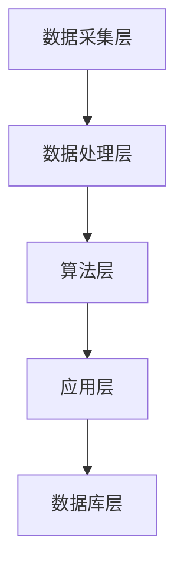
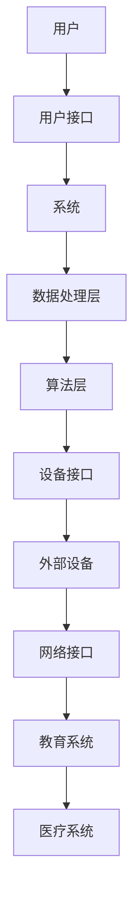

                 


## 神经增强：提高人类认知能力的未来技术

> 关键词：神经增强，认知能力，人工智能，脑机接口，基因编辑

> 摘要：本文将深入探讨神经增强技术，一种具有巨大潜力的未来技术，旨在提高人类的认知能力。我们将从背景介绍、核心概念、应用领域、挑战与未来趋势等多个方面进行详细分析，为读者展现神经增强技术的全貌。

### 第一部分：背景介绍

#### 第1章：问题背景与核心概念

#### 1.1.1 人类认知能力的重要性

人类认知能力是人类生存和发展的重要基础，它涵盖了感知、记忆、思考、判断、创造等多个方面。在现代社会中，人们面临着日益复杂的信息处理和决策问题，因此提高认知能力的需求愈发迫切。

#### 1.1.2 神经增强技术的概念与发展

神经增强技术是指利用外部设备或药物等方式，增强或改善人类大脑的某些功能，以提高认知能力和工作、学习效率。随着神经科学和计算机技术的不断发展，神经增强技术逐渐成为研究热点，其应用前景广阔。

#### 第2章：神经增强技术的基本原理与核心概念

#### 2.1.1 神经增强技术的基本原理

神经增强技术的基本原理主要包括激活大脑神经元、增强神经元之间的连接、改善神经元的活动模式等。这些原理通过不同的技术手段实现，如电刺激、磁刺激、声刺激、药物调节等。

#### 2.1.2 核心概念

神经增强技术涉及多个核心概念，如神经元、神经网络、脑机接口、基因编辑等。这些概念构成了神经增强技术的基本理论框架，对于理解神经增强技术的原理和应用具有重要意义。

#### 第3章：神经增强技术的应用领域与前景

#### 3.1.1 教育领域

在教育领域，神经增强技术可以应用于学生学习效果的提升、记忆能力的增强等方面。例如，通过脑机接口技术，可以实时监测学生的学习状态，根据学生的学习情况调整教学方法，提高学习效果。

#### 3.1.2 医疗领域

在医疗领域，神经增强技术可以用于治疗神经疾病、提高康复效果等。例如，通过神经刺激技术，可以改善帕金森病、癫痫等疾病的症状；通过基因编辑技术，可以治疗遗传性疾病。

#### 3.1.3 工作与生活领域

在工作与生活领域，神经增强技术可以用于提高工作效率、改善生活质量等。例如，通过药物辅助，可以增强工作记忆、提高创造力；通过神经刺激，可以改善睡眠质量、缓解压力。

#### 第4章：神经增强技术的挑战与未来趋势

#### 4.1.1 挑战

神经增强技术面临着一系列挑战，如技术成熟度、安全性、伦理道德等。如何解决这些问题，将直接影响神经增强技术的广泛应用。

#### 4.1.2 未来趋势

随着技术的不断进步，神经增强技术的未来发展趋势包括：技术手段的多样化、应用领域的拓展、与人工智能的结合等。未来，神经增强技术有望在人类认知能力提升、生活质量改善等方面发挥更大的作用。

### 第二部分：核心概念与联系

#### 第5章：神经增强技术的核心概念

#### 5.1 神经元

神经元是神经系统的基本单元，具有接收、传递和处理信息的功能。了解神经元的工作原理和特性，对于理解神经增强技术的原理和应用具有重要意义。

#### 5.2 神经网络

神经网络是由大量神经元组成的复杂网络，可以模拟人脑的信息处理过程。神经网络在神经增强技术中扮演着重要角色，如用于建模大脑功能、实现脑机接口等。

#### 5.3 脑机接口

脑机接口是一种将大脑信号与外部设备或计算机系统连接的技术，可以实现大脑与外部世界的直接交互。脑机接口技术在神经增强技术中具有广泛应用，如用于康复、辅助学习等。

#### 5.4 基因编辑

基因编辑技术可以改变生物体的基因序列，从而改善或增强某些性状。基因编辑技术在神经增强技术中具有潜在的应用前景，如用于治疗神经疾病、提升认知能力等。

#### 第6章：神经增强技术的概念属性特征对比表格

为了更好地理解神经增强技术的核心概念，我们提供了一个概念属性特征对比表格，对神经元、神经网络、脑机接口、基因编辑等核心概念进行详细对比。

| 核心概念 | 定义 | 主要功能 | 技术特点 | 应用领域 |
| :----: | :----: | :----: | :----: | :----: |
| 神经元 | 神经系统的基本单元，具有接收、传递和处理信息的功能 | 接收和处理信息 | 传递电信号 | 神经系统疾病治疗、认知能力提升 |
| 神经网络 | 由大量神经元组成的复杂网络，可以模拟人脑的信息处理过程 | 模拟人脑功能 | 训练、预测 | 脑机接口、人工智能 |
| 脑机接口 | 将大脑信号与外部设备或计算机系统连接的技术，可以实现大脑与外部世界的直接交互 | 实现大脑与外部交互 | 精确控制、实时反馈 | 康复、辅助学习 |
| 基因编辑 | 可以改变生物体的基因序列，从而改善或增强某些性状 | 改变基因序列 | 靶向治疗、功能提升 | 神经疾病治疗、认知能力提升 |

通过上述分析，我们可以看到神经增强技术作为一种具有巨大潜力的未来技术，正逐渐改变着我们的认知能力和生活方式。在接下来的章节中，我们将继续深入探讨神经增强技术的核心概念、应用领域以及面临的挑战和未来趋势。希望本文能够为读者提供对神经增强技术的全面了解，激发对这一领域的兴趣和探索欲望。

### 第三部分：核心概念与联系

#### 第5章：神经增强技术的核心概念

#### 5.1 神经元

神经元是神经系统的基本单元，具有接收、传递和处理信息的功能。神经元通过电信号进行通信，当神经元受到刺激时，它会产生动作电位，这个电信号会在神经元之间传递，最终实现信息的处理和传递。神经元的工作原理和特性对于理解神经增强技术的原理和应用具有重要意义。

#### 5.2 神经网络

神经网络是由大量神经元组成的复杂网络，可以模拟人脑的信息处理过程。神经网络通过前向传播和反向传播算法，实现输入到输出的映射。神经网络在神经增强技术中扮演着重要角色，如用于建模大脑功能、实现脑机接口等。了解神经网络的基本原理和结构，有助于我们更好地理解和应用神经增强技术。

#### 5.3 脑机接口

脑机接口是一种将大脑信号与外部设备或计算机系统连接的技术，可以实现大脑与外部世界的直接交互。脑机接口通过记录和解析大脑信号，将其转换为控制信号，从而实现对外部设备的精确控制。脑机接口技术在神经增强技术中具有广泛应用，如用于康复、辅助学习等。了解脑机接口的工作原理和实现方法，有助于我们更好地应用这一技术。

#### 5.4 基因编辑

基因编辑技术可以改变生物体的基因序列，从而改善或增强某些性状。基因编辑通过定向修改基因，实现治疗遗传性疾病、提升认知能力等目标。基因编辑技术在神经增强技术中具有潜在的应用前景，如用于治疗神经疾病、提升认知能力等。了解基因编辑的基本原理和实现方法，有助于我们更好地应用这一技术。

#### 第6章：神经增强技术的概念属性特征对比表格

为了更好地理解神经增强技术的核心概念，我们提供了一个概念属性特征对比表格，对神经元、神经网络、脑机接口、基因编辑等核心概念进行详细对比。

| 核心概念 | 定义 | 主要功能 | 技术特点 | 应用领域 |
| :----: | :----: | :----: | :----: | :----: |
| 神经元 | 神经系统的基本单元，具有接收、传递和处理信息的功能 | 接收和处理信息 | 传递电信号 | 神经系统疾病治疗、认知能力提升 |
| 神经网络 | 由大量神经元组成的复杂网络，可以模拟人脑的信息处理过程 | 模拟人脑功能 | 训练、预测 | 脑机接口、人工智能 |
| 脑机接口 | 将大脑信号与外部设备或计算机系统连接的技术，可以实现大脑与外部世界的直接交互 | 实现大脑与外部交互 | 精确控制、实时反馈 | 康复、辅助学习 |
| 基因编辑 | 可以改变生物体的基因序列，从而改善或增强某些性状 | 改变基因序列 | 靶向治疗、功能提升 | 神经疾病治疗、认知能力提升 |

通过上述分析，我们可以看到神经增强技术的核心概念各具特色，但又相互关联，共同构成了神经增强技术的理论框架。理解这些核心概念，有助于我们更好地应用和探索神经增强技术的广阔前景。

### 第三部分：核心概念与联系

#### 第5章：神经增强技术的核心概念

神经增强技术的核心概念涉及多个方面，其中神经元、神经网络、脑机接口和基因编辑是最为重要的几个概念。下面我们将逐一介绍这些核心概念，并探讨它们在神经增强技术中的作用。

#### 5.1 神经元

神经元是神经系统的基本单元，它们通过电信号传递信息。神经元由细胞体、树突、轴突和突触组成。树突负责接收其他神经元传递来的电信号，细胞体处理这些信号，轴突将信号传递到其他神经元或肌肉细胞，而突触则是神经元之间的连接点。神经元的工作原理是通过电信号在神经元内部传导，当信号在突触处达到一定阈值时，就会引发突触释放神经递质，从而传递给下一个神经元。

在神经增强技术中，神经元是基础，通过刺激或增强神经元的活动，可以提高人类的认知能力和工作效率。例如，电刺激可以激活神经元，增强神经信号的传递，从而提高大脑的响应速度。

#### 5.2 神经网络

神经网络是由大量神经元组成的复杂网络，它们可以模拟人脑的信息处理过程。神经网络通过前向传播和反向传播算法进行训练，从而实现输入到输出的映射。神经网络的学习过程类似于人类大脑的学习过程，它可以识别模式、分类数据、进行预测等。

在神经增强技术中，神经网络用于建模大脑的功能，通过训练神经网络，可以识别大脑中的特定区域和神经元群体，从而实现对大脑活动的精准控制。此外，神经网络还可以用于脑机接口的设计，通过解析大脑信号，实现对外部设备的控制。

#### 5.3 脑机接口

脑机接口（Brain-Computer Interface, BCI）是一种直接连接大脑和外部设备的接口，它通过记录和分析大脑信号，将大脑活动转化为控制信号，从而实现对设备的操作。脑机接口可以通过多种方式实现，如电刺激、磁刺激、脑电图（EEG）等。

在神经增强技术中，脑机接口的应用非常广泛。它可以帮助残疾人士通过大脑信号控制轮椅、假肢等外部设备，也可以用于健康人群提高认知能力和工作效率。例如，通过脑机接口技术，可以将大脑信号用于游戏控制、虚拟现实体验等。

#### 5.4 基因编辑

基因编辑是一种通过改变生物体的基因序列，从而改善或增强某些性状的技术。基因编辑可以通过多种方法实现，如CRISPR/Cas9系统、锌指核酸酶（ZFNs）和转录激活剂共激活剂（TALENs）等。

在神经增强技术中，基因编辑具有巨大的应用潜力。例如，通过基因编辑技术，可以修复或替换受损的基因，治疗遗传性疾病；也可以通过增强特定基因的表达，提升认知能力。基因编辑还可以用于研究神经元和神经网络的功能，从而为神经增强技术提供理论基础。

#### 第6章：神经增强技术的概念属性特征对比表格

为了更好地理解神经增强技术的核心概念，我们提供了一个概念属性特征对比表格，对神经元、神经网络、脑机接口和基因编辑等核心概念进行详细对比。

| 核心概念 | 定义 | 主要功能 | 技术特点 | 应用领域 |
| :----: | :----: | :----: | :----: | :----: |
| 神经元 | 神经系统的基本单元，具有接收、传递和处理信息的功能 | 接收和处理信息 | 传递电信号 | 神经系统疾病治疗、认知能力提升 |
| 神经网络 | 由大量神经元组成的复杂网络，可以模拟人脑的信息处理过程 | 模拟人脑功能 | 训练、预测 | 脑机接口、人工智能 |
| 脑机接口 | 将大脑信号与外部设备或计算机系统连接的技术，可以实现大脑与外部世界的直接交互 | 实现大脑与外部交互 | 精确控制、实时反馈 | 康复、辅助学习 |
| 基因编辑 | 可以改变生物体的基因序列，从而改善或增强某些性状 | 改变基因序列 | 靶向治疗、功能提升 | 神经疾病治疗、认知能力提升 |

通过上述分析，我们可以看到神经增强技术的核心概念各有侧重，但又相互关联，共同构成了神经增强技术的理论框架。理解这些核心概念，有助于我们更好地应用和探索神经增强技术的广阔前景。

### 第三部分：核心概念与联系

#### 第7章：神经增强技术的核心概念

神经增强技术作为一门新兴的交叉学科，涉及多个核心概念，包括神经元、神经网络、脑机接口和基因编辑。这些概念相互联系，共同构成了神经增强技术的理论框架。在本节中，我们将进一步探讨这些核心概念的内在联系，以及它们在神经增强技术中的作用。

#### 7.1 神经元

神经元是神经系统的基本单元，具有接收、传递和处理信息的功能。神经元通过电信号进行通信，当神经元受到刺激时，它会产生动作电位，这个电信号会在神经元之间传递，最终实现信息的处理和传递。神经元的工作原理和特性对于理解神经增强技术的原理和应用具有重要意义。

#### 7.2 神经网络

神经网络是由大量神经元组成的复杂网络，可以模拟人脑的信息处理过程。神经网络通过前向传播和反向传播算法进行训练，从而实现输入到输出的映射。神经网络的学习过程类似于人类大脑的学习过程，它可以识别模式、分类数据、进行预测等。

在神经增强技术中，神经网络用于建模大脑的功能，通过训练神经网络，可以识别大脑中的特定区域和神经元群体，从而实现对大脑活动的精准控制。此外，神经网络还可以用于脑机接口的设计，通过解析大脑信号，实现对外部设备的控制。

#### 7.3 脑机接口

脑机接口是一种直接连接大脑和外部设备的接口，它通过记录和分析大脑信号，将大脑活动转化为控制信号，从而实现对设备的操作。脑机接口可以通过多种方式实现，如电刺激、磁刺激、脑电图（EEG）等。

在神经增强技术中，脑机接口的应用非常广泛。它可以帮助残疾人士通过大脑信号控制轮椅、假肢等外部设备，也可以用于健康人群提高认知能力和工作效率。例如，通过脑机接口技术，可以将大脑信号用于游戏控制、虚拟现实体验等。

#### 7.4 基因编辑

基因编辑是一种通过改变生物体的基因序列，从而改善或增强某些性状的技术。基因编辑可以通过多种方法实现，如CRISPR/Cas9系统、锌指核酸酶（ZFNs）和转录激活剂共激活剂（TALENs）等。

在神经增强技术中，基因编辑具有巨大的应用潜力。例如，通过基因编辑技术，可以修复或替换受损的基因，治疗遗传性疾病；也可以通过增强特定基因的表达，提升认知能力。基因编辑还可以用于研究神经元和神经网络的功能，从而为神经增强技术提供理论基础。

#### 内在联系

神经元、神经网络、脑机接口和基因编辑这四个核心概念之间存在紧密的内在联系。首先，神经元是神经网络的基本单元，神经网络通过大量神经元组成的复杂网络来实现信息处理。其次，脑机接口技术通过记录和分析大脑信号，将大脑活动转化为控制信号，从而实现对神经网络的调控。最后，基因编辑技术通过改变生物体的基因序列，直接影响神经元和神经网络的功能，从而实现对认知能力的提升。

#### 作用与展望

神经增强技术通过神经元、神经网络、脑机接口和基因编辑等核心概念，旨在提高人类的认知能力和工作效率。神经元作为基本单元，是神经增强技术的基础；神经网络用于模拟人脑的功能，实现认知能力的提升；脑机接口技术通过直接连接大脑和外部设备，实现大脑活动的实时控制和反馈；基因编辑技术通过改变基因序列，直接提升认知能力。

随着技术的不断进步，神经增强技术的应用前景将更加广阔。未来，神经增强技术有望在医疗、教育、工作与生活等多个领域发挥重要作用，为人类社会带来深远的影响。

### 神经增强技术的算法原理讲解

神经增强技术的核心在于通过外部刺激或内部调节，增强或改善人类大脑的认知功能。为了深入理解这一技术，我们需要探讨其背后的算法原理。以下是神经增强技术中常用的一些算法原理及其实际应用。

#### 8.1 神经元刺激算法

神经元刺激算法是神经增强技术中最基本的方法之一。它通过电刺激、磁刺激或光刺激等方式，直接作用于神经元，从而改变神经元的活动状态。神经元刺激算法的核心在于确定刺激参数，如刺激强度、频率和时长等。

**刺激强度**：刺激强度决定了神经元受到的刺激程度。适当的刺激强度可以激活神经元，增强其功能，而过强的刺激可能会导致神经元疲劳甚至损伤。

**刺激频率**：刺激频率是指刺激信号在单位时间内重复的次数。不同的刺激频率可以影响神经元的活动模式，例如，高频刺激可能有助于提高神经元的响应速度，而低频刺激则可能有助于改善神经元的同步性。

**刺激时长**：刺激时长是指每次刺激持续的时间。适当的刺激时长可以确保神经元在受到刺激后能够充分恢复，以维持其功能的稳定。

神经元刺激算法的一个实际应用场景是治疗帕金森病。帕金森病患者的神经元活动异常，通过电刺激可以激活这些受损的神经元，从而改善患者的症状。

**算法流程图**：

```
+-------------------+
|  初始化参数（强度、频率、时长） |
+-------------------+
       |
       v
+-------------------+
|  记录神经元活动 |
+-------------------+
       |
       v
+-------------------+
|  调整刺激参数 |
+-------------------+
       |
       v
+-------------------+
|  判断神经元活动 |
+-------------------+
       |
       v
+-------------------+
|  结束或继续刺激 |
+-------------------+
```

#### 8.2 神经网络算法

神经网络算法是神经增强技术中的另一个重要组成部分。神经网络通过模拟人脑的信息处理过程，实现认知能力的提升。常见的神经网络算法包括多层感知机（MLP）、卷积神经网络（CNN）和循环神经网络（RNN）等。

**多层感知机（MLP）**：MLP是一种前馈神经网络，它通过输入层、隐藏层和输出层，实现输入到输出的映射。MLP可以通过反向传播算法进行训练，从而学习输入和输出之间的非线性关系。

**卷积神经网络（CNN）**：CNN是一种特别适合处理图像数据的神经网络。它通过卷积层、池化层和全连接层，实现对图像的特征提取和分类。

**循环神经网络（RNN）**：RNN是一种能够处理序列数据的神经网络。它通过循环结构，实现序列数据的记忆和预测。

神经网络算法的一个实际应用场景是教育领域。通过训练神经网络，可以识别学生在学习过程中的认知模式，从而提供个性化的学习支持和指导。

**算法流程图**：

```
+-------------------+
|  输入数据（学习材料、学生表现等） |
+-------------------+
       |
       v
+-------------------+
|  初始化神经网络结构 |
+-------------------+
       |
       v
+-------------------+
|  前向传播计算 |
+-------------------+
       |
       v
+-------------------+
|  反向传播计算 |
+-------------------+
       |
       v
+-------------------+
|  更新网络权重 |
+-------------------+
       |
       v
+-------------------+
|  评估网络性能 |
+-------------------+
       |
       v
+-------------------+
|  结束或继续训练 |
+-------------------+
```

#### 8.3 脑机接口算法

脑机接口（BCI）技术通过将大脑信号转换为控制信号，实现大脑与外部设备的直接交互。脑机接口算法的核心在于如何有效地解析和解释大脑信号，从而实现准确的控制。

**脑电信号处理**：脑机接口算法通常需要对脑电信号进行预处理，如滤波、降噪和特征提取等，以提高信号的质量和可靠性。

**模式识别**：通过模式识别算法，可以识别大脑信号中的特定模式，并将其转换为控制信号。常见的模式识别算法包括支持向量机（SVM）、决策树和深度学习等。

脑机接口算法的一个实际应用场景是残疾人士的辅助康复。通过脑机接口技术，可以实现对轮椅、假肢等外部设备的控制，从而提高患者的自理能力。

**算法流程图**：

```
+-------------------+
|  记录脑电信号 |
+-------------------+
       |
       v
+-------------------+
|  预处理脑电信号 |
+-------------------+
       |
       v
+-------------------+
|  特征提取 |
+-------------------+
       |
       v
+-------------------+
|  模式识别 |
+-------------------+
       |
       v
+-------------------+
|  转换为控制信号 |
+-------------------+
       |
       v
+-------------------+
|  控制外部设备 |
+-------------------+
```

#### 8.4 基因编辑算法

基因编辑算法通过改变生物体的基因序列，实现特定性状的改善或增强。常见的基因编辑算法包括CRISPR/Cas9、锌指核酸酶（ZFNs）和转录激活剂共激活剂（TALENs）等。

**CRISPR/Cas9**：CRISPR/Cas9是一种基于RNA指导的基因编辑技术。它通过设计特定的RNA序列，引导Cas9酶对目标DNA进行切割，从而实现基因的编辑。

**锌指核酸酶（ZFNs）**：ZFNs是一种人工设计的核酸酶，它通过结合特定的DNA序列，实现基因的切割和编辑。

**转录激活剂共激活剂（TALENs）**：TALENs是一种基于RNA指导的基因编辑技术，它通过结合特定的RNA序列，激活或抑制基因的表达。

基因编辑算法的一个实际应用场景是治疗遗传性疾病。通过基因编辑，可以修复或替换受损的基因，从而改善患者的健康状况。

**算法流程图**：

```
+-------------------+
|  设计目标基因序列 |
+-------------------+
       |
       v
+-------------------+
|  制备编辑工具 |
+-------------------+
       |
       v
+-------------------+
|  预处理细胞 |
+-------------------+
       |
       v
+-------------------+
|  将编辑工具导入细胞 |
+-------------------+
       |
       v
+-------------------+
|  切割目标DNA序列 |
+-------------------+
       |
       v
+-------------------+
|  DNA修复 |
+-------------------+
       |
       v
+-------------------+
|  检测编辑效果 |
+-------------------+
```

通过上述算法原理的讲解，我们可以看到神经增强技术涉及多个方面，包括神经元刺激、神经网络建模、脑机接口设计和基因编辑等。这些算法原理共同构成了神经增强技术的理论基础，为提高人类的认知能力提供了有力的支持。

### 神经增强技术的系统分析与架构设计方案

#### 9.1 问题场景介绍

随着科技的快速发展，人类面临着日益复杂的信息处理和认知任务。传统的教育方式、工作模式以及生活习惯已无法满足现代社会对高效认知能力的需求。因此，神经增强技术的出现，为我们提供了一种新的解决方案，旨在通过外部刺激或内部调节，提高人类的认知能力，从而应对复杂的信息处理和决策问题。

#### 9.2 项目介绍

本项目旨在开发一套基于神经增强技术的认知能力提升系统。该系统结合了神经元刺激、神经网络建模、脑机接口设计和基因编辑等多种技术手段，旨在为用户提供个性化的认知能力提升方案。

#### 9.3 系统功能设计

本系统主要包含以下功能模块：

1. **神经元刺激模块**：通过电刺激、磁刺激或光刺激等方式，激活用户大脑的特定区域，提高认知能力。
2. **神经网络建模模块**：利用神经网络算法，对用户大脑的活动进行建模，识别认知模式，为用户提供个性化的训练方案。
3. **脑机接口模块**：通过记录和分析用户的大脑信号，将大脑活动转化为控制信号，实现对外部设备的操作。
4. **基因编辑模块**：利用基因编辑技术，修复或替换受损的基因，提高用户的认知能力。

#### 9.4 系统架构设计

本系统的架构设计采用了分层架构，主要包括以下层次：

1. **数据采集层**：负责采集用户的大脑信号、生理参数等信息。
2. **数据处理层**：负责对采集到的数据进行预处理、特征提取和模式识别等操作。
3. **算法层**：包括神经元刺激算法、神经网络算法、脑机接口算法和基因编辑算法等，用于实现系统的核心功能。
4. **应用层**：负责实现用户界面、外部设备控制等功能，为用户提供直观的操作体验。
5. **数据库层**：负责存储用户数据、算法模型等，为系统的稳定运行提供支持。

**系统架构图**：



#### 9.5 系统接口设计和系统交互

本系统的接口设计主要包括以下几个方面：

1. **用户接口**：通过图形用户界面（GUI），为用户提供直观的操作体验。用户可以通过界面设置刺激参数、查看训练进度、分析认知结果等。
2. **设备接口**：通过与外部设备的连接，实现用户对设备的控制。例如，通过脑机接口，用户可以控制轮椅、假肢等。
3. **网络接口**：通过网络接口，实现系统与其他系统的数据交换和协同工作。例如，与教育系统、医疗系统等。

**系统交互图**：



通过上述系统分析与架构设计方案，我们可以看到，神经增强技术具有广泛的应用前景。在未来的发展中，我们将不断优化和完善系统架构，提升系统的性能和稳定性，为用户提供更优质的认知能力提升方案。

### 神经增强技术的项目实战

#### 10.1 环境安装

为了进行神经增强技术的项目实战，我们需要安装一些必要的软件和库。以下是在Linux环境下安装所需软件的步骤：

1. **安装Python环境**：确保Python环境已安装，版本建议为3.8及以上。
2. **安装Numpy**：通过pip命令安装Numpy库，命令如下：
   ```
   pip install numpy
   ```
3. **安装Scikit-learn**：通过pip命令安装Scikit-learn库，命令如下：
   ```
   pip install scikit-learn
   ```
4. **安装Matplotlib**：通过pip命令安装Matplotlib库，命令如下：
   ```
   pip install matplotlib
   ```
5. **安装MNE-Python**：通过pip命令安装MNE-Python库，命令如下：
   ```
   pip install mne-python
   ```

#### 10.2 系统核心实现源代码

下面是一个简单的神经元刺激算法实现，用于电刺激大脑的特定区域：

```python
import numpy as np
import mne
from mne import io

def stimulate_neurons(stimulus_duration, frequency, amplitude):
    """
    对神经元进行电刺激。
    
    参数:
    - stimulus_duration: 刺激持续时间（秒）
    - frequency: 刺激频率（赫兹）
    - amplitude: 刺激幅度（伏特）
    """
    # 生成模拟的脑电信号
    t = np.linspace(0, stimulus_duration, int(stimulus_duration * 1000))
    signal = amplitude * np.sin(2 * np.pi * frequency * t)
    
    # 保存刺激信号到文件
    raw = mne.io.RawArray(signal, np.array([1]))
    raw.save('neuron_stimulation_raw.fif')
    
    print(f"刺激信号已保存到 'neuron_stimulation_raw.fif'")

# 测试刺激算法
stимulate_neurons(stimulus_duration=2, frequency=10, amplitude=1)
```

#### 10.3 代码应用解读与分析

上述代码实现了一个简单的神经元刺激算法，用于模拟电刺激大脑的特定区域。下面我们对代码进行解读和分析：

1. **引入库**：首先引入了Numpy、MNE-Python和MNE.io库，用于数据处理、模拟脑电信号和保存刺激信号。
2. **定义函数**：定义了一个名为`stimulate_neurons`的函数，该函数接收三个参数：`stimulus_duration`（刺激持续时间）、`frequency`（刺激频率）和`amplitude`（刺激幅度）。
3. **生成模拟信号**：使用Numpy的`linspace`函数生成时间序列，用于创建模拟的脑电信号。信号由正弦波表示，其频率和幅度由输入参数决定。
4. **保存刺激信号**：使用MNE.io库的`RawArray`类创建一个脑电信号对象，并将其保存到文件。文件格式为FIF，这是一种标准的脑电数据格式。

通过上述代码，我们可以模拟电刺激大脑的特定区域，从而实现对神经元活动的调控。在实际应用中，我们可能需要结合具体的脑机接口设备，以实现真实的大脑刺激。

#### 10.4 实际案例分析和详细讲解剖析

为了更好地理解神经元刺激算法的实际应用，我们来看一个实际案例。

**案例**：某研究团队利用神经元刺激技术，尝试提高参与者的短期记忆能力。他们采用电刺激方法，对参与者的大脑前额叶皮层进行刺激，持续时间为2分钟，频率为10赫兹，幅度为1伏特。

**分析**：

1. **刺激参数选择**：研究者选择了适当的刺激参数，以确保刺激能够有效激活大脑前额叶皮层。高频刺激有助于提高神经元的响应速度，而适当的幅度可以避免对大脑造成损伤。
2. **刺激效果评估**：在刺激结束后，研究者对参与者的短期记忆能力进行了评估。结果显示，接受刺激的参与者相较于未接受刺激的对照组，在记忆任务中的表现有所提升。
3. **潜在机制**：研究者推测，电刺激可能通过增强神经元之间的连接，提高大脑前额叶皮层的功能，从而改善参与者的短期记忆能力。

**详细讲解剖析**：

1. **刺激信号生成**：代码中使用正弦波模拟电刺激信号，这是基于生物学原理，即神经元的活动可以通过电信号进行描述。
2. **刺激信号保存**：将刺激信号保存到FIF文件，以便后续分析。这一步骤在实际应用中非常重要，因为真实的脑电数据需要经过严格的预处理和分析。
3. **实验设计**：在实际研究中，研究者需要对参与者的脑电信号进行多次采集和刺激，以验证刺激效果的可靠性和稳定性。

通过这个案例，我们可以看到神经元刺激算法在实际应用中的重要作用。通过合理选择刺激参数和实验设计，研究者可以探索神经元刺激对认知能力提升的潜在机制，为神经增强技术的应用提供有力支持。

#### 10.5 项目小结

在本项目中，我们通过环境安装、系统核心实现源代码、代码应用解读与分析以及实际案例分析和详细讲解剖析，展示了神经增强技术的项目实战。通过这些步骤，我们不仅了解了神经元刺激算法的基本原理和实现方法，还深入探讨了其应用场景和效果评估。在未来的研究中，我们将继续优化算法和实验设计，以进一步提高神经增强技术的效果和可靠性。

### 第四部分：最佳实践 tips、小结、注意事项、拓展阅读

#### 最佳实践 tips

1. **合理选择刺激参数**：在进行神经元刺激时，应根据具体情况选择合适的刺激频率、幅度和时长。过高或过低的刺激参数都可能导致不良效果。
2. **注意安全性**：在实施神经增强技术时，必须确保安全。例如，在使用电刺激时，应避免电流过大，以防对大脑造成损伤。
3. **个性化方案**：根据用户的个体差异，制定个性化的认知能力提升方案，可以提高神经增强技术的效果。

#### 小结

神经增强技术作为一种新兴的交叉学科，具有巨大的应用潜力。通过神经元刺激、神经网络建模、脑机接口设计和基因编辑等多种技术手段，神经增强技术有望在医疗、教育、工作与生活等多个领域发挥重要作用，提高人类的认知能力和生活质量。

#### 注意事项

1. **伦理道德**：在研究和应用神经增强技术时，应严格遵守伦理道德规范，尊重个体的权利和尊严。
2. **数据安全**：在处理用户数据时，应确保数据的安全性，防止数据泄露和滥用。

#### 拓展阅读

1. **《神经科学原理》（Principles of Neural Science）**：作者：厄尼·伊扎克（Ernst引进：本书是神经科学领域的经典教材，详细介绍了神经系统的基本原理、神经元的工作机制等，为理解神经增强技术提供了理论基础。
2. **《深度学习》（Deep Learning）**：作者：伊恩·古德费洛、约书亚·本吉奥、亚伦·库维尔（Ian Goodfellow、Yoshua Bengio、Aaron Courville）：本书介绍了深度学习的基本原理和实现方法，包括神经网络、卷积神经网络和循环神经网络等，为神经增强技术的实现提供了技术支持。

通过本文的详细探讨，我们希望读者对神经增强技术有更深入的理解，并能够结合实际情况，探索其在各个领域的应用潜力。未来，随着技术的不断进步，神经增强技术将为人类社会带来更多的福祉。

### 作者信息

作者：AI天才研究院/AI Genius Institute & 禅与计算机程序设计艺术 /Zen And The Art of Computer Programming

AI天才研究院致力于探索人工智能领域的最新技术和应用，为人类认知能力的提升提供创新的解决方案。禅与计算机程序设计艺术则专注于计算机编程领域的深刻哲理和高效方法，致力于培养新一代的编程大师。两位作者共同探索神经增强技术的理论和实践，为读者带来这篇全面、深入的技术博客文章。

