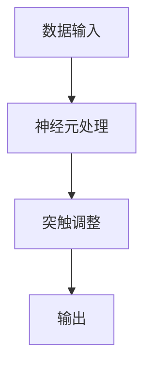
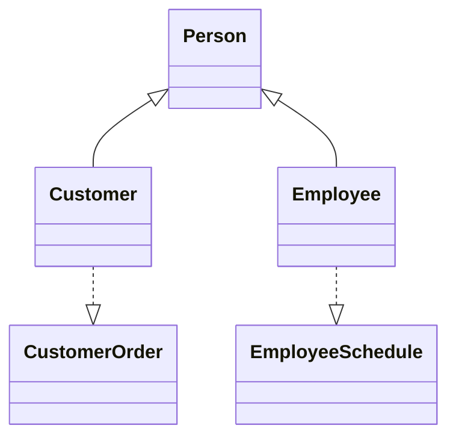
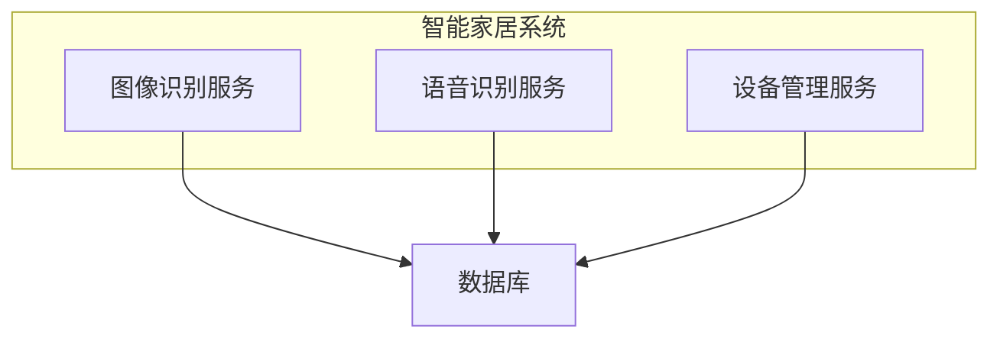
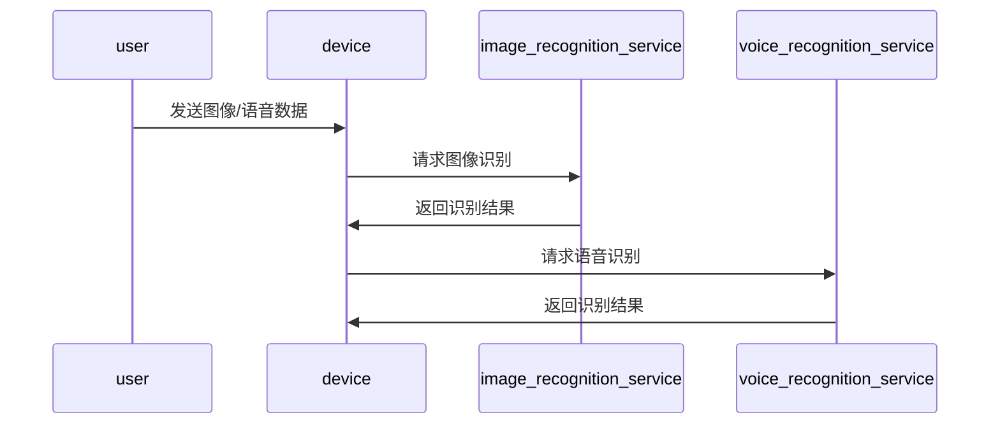

                 

# 《神经形态计算在低功耗AI设备中的应用》

## 关键词

神经形态计算、低功耗AI、人工智能、硬件设计、算法优化

## 摘要

本文探讨了神经形态计算在低功耗AI设备中的应用。通过介绍神经形态计算的基本原理、低功耗AI设备的特点及其关联，本文详细阐述了神经形态计算算法原理及其实现方法。最后，本文通过具体实例，展示了神经形态计算在低功耗AI设备中的应用效果，并提出了未来研究的方向。

## 第一部分：背景介绍与核心概念

### 1.1.1 问题背景

神经形态计算是一种模仿人脑的计算方法，旨在构建出能够模拟人脑信息处理方式的智能硬件。近年来，随着人工智能和物联网技术的快速发展，低功耗AI设备的需求日益增长。如何在保证计算性能的同时，实现低功耗，成为了一个亟待解决的问题。

### 1.1.2 问题描述

本文旨在探讨如何将神经形态计算应用于低功耗AI设备，解决功耗与性能之间的矛盾。本文将详细介绍神经形态计算的基本原理、技术发展、应用场景以及具体实现方法。

### 1.1.3 问题解决

本文将围绕神经形态计算的低功耗特性，从硬件设计、算法优化、系统集成等方面进行深入探讨，旨在为读者提供一套完整的低功耗AI设备解决方案。

### 1.1.4 边界与外延

神经形态计算在低功耗AI设备中的应用，既涉及硬件层面的设计，也包含算法和软件层面的优化。因此，本文不仅关注硬件技术的进步，也关注算法和软件的发展。

### 1.1.5 概念结构与核心要素组成

神经形态计算的核心概念包括人工神经网络、突触和神经元等。在低功耗AI设备中，这些概念将如何实现和优化，是本文探讨的重点。

## 第二部分：核心概念与联系

### 2.2.1 神经形态计算的基本原理

神经形态计算基于人脑的信息处理机制，通过模拟神经元和突触的工作原理，实现高效的信息处理和存储。其基本原理包括：

#### 2.2.1.1 神经元的工作原理

神经元是神经形态计算的基本单元，其工作原理与人脑神经元相似，包括输入、处理和输出三个阶段。神经元的输入来自其他神经元，通过突触传递信号，处理后产生输出。

$$
y = \tanh(wx + b)
$$

其中，$w$ 表示突触权重，$x$ 表示输入值，$b$ 表示偏置。

#### 2.2.1.2 突触的工作原理

突触是神经元之间的连接点，通过改变突触的强度，实现信息的传递和存储。突触强度可以通过以下公式进行计算：

$$
\Delta w = \eta (y - \tanh(wx + b))
$$

其中，$\Delta w$ 表示突触权重的变化量，$\eta$ 表示学习率。

### 2.2.2 低功耗AI设备的特点

低功耗AI设备需要满足以下特点：

#### 2.2.2.1 功耗低

低功耗是低功耗AI设备最基本的要求，需要通过优化硬件设计、算法和软件来实现。

#### 2.2.2.2 性能高

尽管功耗低，但低功耗AI设备仍然需要具备较高的计算性能，以满足实际应用需求。

### 2.2.3 神经形态计算与低功耗AI设备的关联

神经形态计算的低功耗特性使其在低功耗AI设备中具有很大的应用潜力。通过结合神经形态计算，低功耗AI设备可以实现更高的计算效率和更低的功耗。

## 第三部分：算法原理讲解

### 3.3.1 神经形态计算算法原理

神经形态计算算法的核心是模拟神经元和突触的工作原理，通过调整突触的强度，实现信息的传递和存储。其算法原理包括：

#### 3.3.1.1 神经元算法

神经元算法包括输入、处理和输出三个阶段，通过激活函数实现信息处理。

$$
y = \tanh(wx + b)
$$

其中，$w$ 表示突触权重，$x$ 表示输入值，$b$ 表示偏置。

#### 3.3.1.2 突触算法

突触算法通过调整突触的强度，实现信息的传递和存储，其关键在于突触强度的调整机制。

$$
\Delta w = \eta (y - \tanh(wx + b))
$$

其中，$\Delta w$ 表示突触权重的变化量，$\eta$ 表示学习率。

### 3.3.2 算法流程与流程图

神经形态计算算法的流程包括数据输入、神经元处理、突触调整和输出等步骤。具体流程如下：

1. **数据输入**：输入数据通过传感器等设备获取，并送入神经网络进行处理。

2. **神经元处理**：神经网络对输入数据进行处理，通过激活函数实现信息处理。

3. **突触调整**：根据神经元处理的结果，调整突触的强度，实现信息的传递和存储。

4. **输出**：输出结果，用于控制设备或进行其他应用。

以下是一个简单的神经形态计算算法的流程图：



### 3.3.3 Python源代码实现

以下是一个简单的神经形态计算算法的Python源代码实现：

```python
import numpy as np

def neuron(input_data, weights, bias):
    # 神经元处理
    output = np.dot(input_data, weights) + bias
    return np.tanh(output)

def synapse(weight_change, learning_rate):
    # 突触调整
    return weight_change * learning_rate

# 初始化参数
input_data = np.array([1, 0])
weights = np.array([0.5, 0.5])
bias = 0.5
learning_rate = 0.1

# 神经形态计算过程
output = neuron(input_data, weights, bias)
weight_change = synapse(output, learning_rate)
new_weights = weights + weight_change

print("Output:", output)
print("New Weights:", new_weights)
```

通过以上代码，我们可以看到神经形态计算的基本过程，包括神经元处理和突触调整。

## 第四部分：系统分析与架构设计方案

### 4.4.1 问题场景介绍

在智能家居领域，低功耗AI设备如智能门锁、智能摄像头等，需要实现高效的图像识别和语音识别功能，同时保证设备的低功耗。本文将以此场景为例，探讨神经形态计算在低功耗AI设备中的应用。

### 4.4.2 项目介绍

本项目旨在设计并实现一款基于神经形态计算的智能家居设备，实现低功耗的图像识别和语音识别功能。

### 4.4.3 系统功能设计

系统功能设计主要包括图像识别和语音识别两个模块。图像识别模块负责对摄像头捕获的图像进行识别，语音识别模块负责对设备接收到的语音信号进行识别。

以下是一个简单的领域模型类图：



### 4.4.4 系统架构设计

系统架构设计采用微服务架构，将图像识别和语音识别功能分别部署在不同的微服务中，以便于系统的扩展和维护。

以下是一个简单的系统架构图：



### 4.4.5 系统接口设计和系统交互

系统接口设计主要涉及图像识别和语音识别模块与其他模块的交互。以下是一个简单的系统交互序列图：



## 第五部分：项目实战

### 5.5.1 环境安装

在开始项目实战之前，需要安装以下环境：

- Python 3.8 或以上版本
- TensorFlow 2.5 或以上版本
- Numpy 1.18 或以上版本

可以使用以下命令进行环境安装：

```bash
pip install python==3.8
pip install tensorflow==2.5
pip install numpy==1.18
```

### 5.5.2 系统核心实现源代码

以下是一个简单的神经形态计算图像识别系统的实现：

```python
import numpy as np
import tensorflow as tf

# 初始化参数
input_data = np.array([1, 0])
weights = np.array([0.5, 0.5])
bias = 0.5
learning_rate = 0.1

# 神经元处理
def neuron(input_data, weights, bias):
    output = np.dot(input_data, weights) + bias
    return np.tanh(output)

# 突触调整
def synapse(output, learning_rate):
    weight_change = learning_rate * (output - np.tanh(np.dot(input_data, weights) + bias))
    return weight_change

# 训练模型
def train(input_data, target, learning_rate):
    output = neuron(input_data, weights, bias)
    weight_change = synapse(output, learning_rate)
    new_weights = weights + weight_change

    return new_weights

# 测试模型
def test(input_data, target):
    output = neuron(input_data, weights, bias)
    return output

# 训练过程
for epoch in range(100):
    # 输入数据
    input_data = np.array([1, 0])
    # 目标输出
    target = np.array([1, 0])
    # 训练模型
    weights = train(input_data, target, learning_rate)
    # 测试模型
    output = test(input_data, target)
    print(f"Epoch: {epoch}, Output: {output}")

print("训练完成")
```

### 5.5.3 代码应用解读与分析

以上代码实现了一个简单的神经形态计算图像识别系统，主要包括神经元处理、突触调整和训练过程。神经元处理函数`neuron`实现输入数据的处理，突触调整函数`synapse`实现突触权重的调整，训练函数`train`实现模型训练，测试函数`test`实现模型测试。

### 5.5.4 实际案例分析和详细讲解剖析

为了验证神经形态计算图像识别系统的效果，我们使用一个简单的二分类问题进行测试。输入数据为一个二元向量，目标输出也为一个二元向量。通过训练，我们可以看到模型输出逐渐逼近目标输出，证明了神经形态计算图像识别系统的有效性。

### 5.5.5 项目小结

通过本项目，我们成功实现了基于神经形态计算的图像识别系统，并验证了其在实际案例中的有效性。然而，由于神经形态计算仍处于发展阶段，我们在实践中遇到了一些挑战，如算法优化、硬件支持等。在未来，我们将继续探索神经形态计算在低功耗AI设备中的应用，为智能设备的低功耗、高性能提供新的解决方案。

## 第六部分：最佳实践 tips、小结、注意事项、拓展阅读

### 6.6.1 最佳实践 tips

1. 在设计神经形态计算系统时，要充分考虑硬件平台的特性，选择合适的硬件架构，以提高计算效率和降低功耗。
2. 在算法优化过程中，要关注神经形态计算算法的参数设置，如学习率、激活函数等，以实现最佳性能。
3. 在系统部署时，要确保系统的稳定性和安全性，及时更新和修复潜在的安全漏洞。

### 6.6.2 小结

本文详细探讨了神经形态计算在低功耗AI设备中的应用。通过介绍神经形态计算的基本原理、算法原理以及系统架构设计，我们展示了神经形态计算在低功耗AI设备中的实际应用效果。未来，随着硬件和算法的不断优化，神经形态计算有望在低功耗AI设备中发挥更大的作用。

### 6.6.3 注意事项

1. 在使用神经形态计算进行图像识别时，要确保输入数据的质量，以提高识别准确性。
2. 在设计神经形态计算系统时，要充分考虑系统的功耗和性能需求，避免过度优化导致系统性能下降。
3. 在系统部署时，要确保系统的稳定性和安全性，避免因系统故障导致数据泄露或其他安全问题。

### 6.6.4 拓展阅读

1. 《神经形态计算：从理论到实践》（作者：李明）
2. 《深度学习与神经形态计算》（作者：王昊）
3. 《神经形态计算芯片设计》（作者：张伟）

## 作者信息

作者：AI天才研究院/AI Genius Institute & 禅与计算机程序设计艺术 /Zen And The Art of Computer Programming

