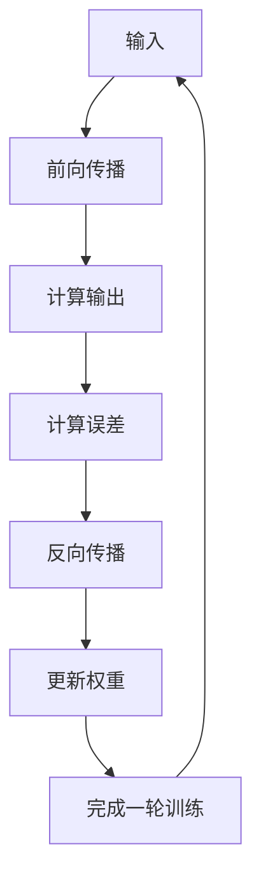
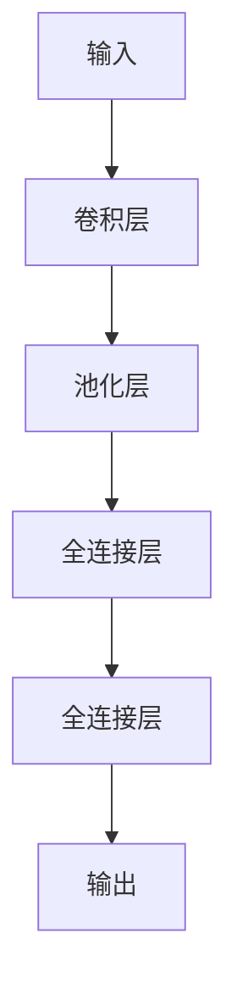
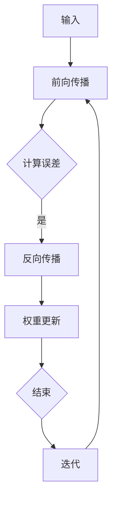

                 


## 神经形态计算在低功耗AI设备中的应用：模拟人脑的学习方式

### 关键词：神经形态计算、低功耗AI、人脑学习、神经网络、可塑性

> 摘要：本文深入探讨了神经形态计算在低功耗AI设备中的应用，重点分析了神经形态计算如何模仿人脑的学习方式，实现高效的能耗优化和智能性能提升。文章分为三个主要部分：第一部分介绍了神经形态计算的背景、核心概念及其与低功耗AI设备的联系；第二部分详细讲解了神经形态计算的技术原理，包括神经网络架构设计、学习算法原理和数学模型；第三部分则展示了神经形态计算在实际低功耗AI设备中的应用案例，并提供了开发实践指导。本文旨在为读者提供一个全面、系统的神经形态计算知识体系，促进其在AI领域的应用与发展。

### 1. 第一部分：神经形态计算概述

#### 1.1 问题背景与概述

**1.1.1 问题的提出**

随着物联网、移动设备和可穿戴设备的普及，对低功耗AI设备的需求日益增加。然而，传统的冯诺伊曼架构在功耗、速度和效率上存在局限性，难以满足这些设备的特定需求。因此，神经形态计算作为一种新兴的计算范式，逐渐受到关注。

**1.1.2 神经形态计算的定义与重要性**

神经形态计算（Neuromorphic Computing）是一种模拟人脑信息处理机制的计算机系统，它结合了神经科学、材料科学和计算技术，旨在创建高效的计算模型。神经形态计算的重要性在于，它能够实现接近人脑的能耗效率和智能水平。

**1.1.3 神经形态计算的研究现状与趋势**

神经形态计算的研究始于20世纪80年代，近年来取得了显著进展。目前，神经形态计算正朝着更高效、更智能、更可靠的方向发展，其应用领域涵盖了智能传感器、物联网、移动设备和机器人等。

#### 1.2 人类大脑学习方式分析

**1.2.1 人类大脑的学习过程**

人类大脑的学习过程可以分为感知、记忆、思考和执行等阶段。这些阶段相互关联，共同构成了复杂的认知过程。

**1.2.1.1 神经元的激活与抑制**

神经元是大脑的基本单元，通过电信号进行通信。神经元的激活与抑制是实现学习的关键。

**1.2.1.2 突触可塑性**

突触可塑性是指突触连接强度的变化，它是大脑学习和记忆的基础。

**1.2.1.3 学习与记忆的形成**

学习与记忆是通过神经元之间的连接变化实现的。新的信息会引起突触连接的调整，从而形成长期记忆。

#### 1.3 神经形态计算与低功耗AI设备

**1.3.1 神经形态计算的低功耗特性**

神经形态计算通过模仿人脑的信息处理机制，实现了高效的能耗优化。

**1.3.2 低功耗AI设备的应用场景**

低功耗AI设备广泛应用于物联网、移动设备和可穿戴设备等领域。

**1.3.3 神经形态计算在低功耗AI中的优势**

神经形态计算在低功耗AI设备中具有显著的优势，包括高效的能耗管理、快速的响应速度和强大的学习与适应能力。

#### 1.4 神经形态计算的核心概念与联系

**1.4.1 神经形态计算的核心概念**

神经形态计算的核心概念包括神经网络架构、学习算法和突触可塑性。

**1.4.2 神经形态计算的属性特征对比**

表1：神经形态计算与传统计算的比较

| 特征         | 神经形态计算 | 传统计算   |
| ------------ | ------------ | ---------- |
| 能耗效率     | 高           | 低         |
| 学习与适应能力 | 强           | 弱         |
| 速度         | 快           | 慢         |

**1.4.3 神经形态计算与人类大脑的联系**

神经形态计算通过模仿人脑的学习方式，实现了对人脑信息处理机制的模拟。

### 1.5 本章小结

本文首先介绍了神经形态计算在低功耗AI设备中的应用背景和重要性，接着分析了人类大脑的学习方式，并探讨了神经形态计算与低功耗AI设备的联系。通过本章的介绍，读者可以对神经形态计算有一个初步的了解，为后续章节的深入学习打下基础。

### 2. 第二部分：神经形态计算技术原理

#### 2.1 神经网络架构设计

**2.1.1 神经网络的基本结构**

神经网络由输入层、隐藏层和输出层组成，每个层包含多个神经元。神经元通过加权连接进行信息传递。

**2.1.2 神经网络类型**

神经网络可以分为传统神经网络、深度神经网络和特殊神经网络。

**2.1.2.1 传统神经网络**

传统神经网络主要包括感知机、多层感知机等。

**2.1.2.2 深度神经网络**

深度神经网络（DNN）具有多层结构，能够自动提取特征，实现复杂的分类和回归任务。

**2.1.2.3 特殊神经网络**

特殊神经网络包括卷积神经网络（CNN）、循环神经网络（RNN）等，用于处理特定类型的数据。

#### 2.2 算法原理讲解

**2.2.1 学习算法**

神经网络的学习算法主要包括反向传播算法、突触可塑性算法等。

**2.2.1.1 反向传播算法**

反向传播算法是一种用于训练神经网络的优化方法，通过计算误差梯度来调整网络权重。

**2.2.1.2 突触可塑性算法**

突触可塑性算法通过调整突触连接强度来实现学习，包括Hebb学习规则等。

**2.2.2 算法mermaid流程图**

图1：反向传播算法流程图



#### 2.3 数学模型与公式详解

**2.3.1 神经元激活函数**

激活函数用于将神经元输入转换为输出，常用的激活函数包括Sigmoid函数和ReLU函数。

**2.3.1.1 Sigmoid函数**

Sigmoid函数的定义如下：

$$
\sigma(x) = \frac{1}{1 + e^{-x}}
$$

**2.3.1.2 ReLU函数**

ReLU函数的定义如下：

$$
\text{ReLU}(x) = \max(0, x)
$$

**2.3.2 突触权重调整公式**

突触权重调整公式用于更新突触连接的权重，常用的调整方法包括Hebb学习规则。

**2.3.2.1 Hebb学习规则**

Hebb学习规则的定义如下：

$$
\Delta w_{ij} = \eta \times pre_{i} \times post_{j}
$$

其中，$w_{ij}$表示神经元$i$与神经元$j$之间的突触权重，$\eta$表示学习率，$pre_{i}$表示神经元$i$的激活状态，$post_{j}$表示神经元$j$的激活状态。

#### 2.4 神经形态计算的挑战与解决方案

**2.4.1 能耗与速度挑战**

神经形态计算在能耗和速度方面面临挑战，需要优化硬件设计和算法。

**2.4.2 算法复杂度挑战**

神经形态计算算法的复杂度较高，需要简化算法并提高计算效率。

**2.4.3 系统集成与兼容性挑战**

神经形态计算需要与现有硬件和软件系统集成，并保持良好的兼容性。

### 2.5 本章小结

本章详细介绍了神经形态计算的技术原理，包括神经网络架构设计、学习算法原理和数学模型。通过对本章的学习，读者可以深入理解神经形态计算的工作原理，为后续章节的应用案例分析提供理论基础。

### 3. 第三部分：神经形态计算在低功耗AI设备中的应用

#### 3.1 低功耗AI设备概述

**3.1.1 低功耗AI设备的定义**

低功耗AI设备是指能够在低功耗环境下运行人工智能算法的设备。

**3.1.2 低功耗AI设备的发展历程**

低功耗AI设备的发展经历了从简单的传感器到复杂的人工智能处理器的演进。

**3.1.3 低功耗AI设备的应用领域**

低功耗AI设备广泛应用于物联网、移动设备、智能家居和可穿戴设备等领域。

#### 3.2 神经形态计算在低功耗AI设备中的应用

**3.2.1 神经形态计算在智能传感器中的应用**

神经形态计算在智能传感器中用于实现高效的数据处理和实时响应。

**3.2.2 神经形态计算在物联网设备中的应用**

神经形态计算在物联网设备中用于优化网络通信和数据处理。

**3.2.3 神经形态计算在移动设备中的应用**

神经形态计算在移动设备中用于提升能效和延长电池寿命。

#### 3.3 应用案例解析

**3.3.1 案例一：智能手表中的神经形态计算应用**

智能手表中的神经形态计算用于监测用户的心率、睡眠质量等生理指标。

**3.3.2 案例二：智能家居设备中的神经形态计算应用**

智能家居设备中的神经形态计算用于实现智能控制、环境监测等。

**3.3.3 案例三：无人机中的神经形态计算应用**

无人机中的神经形态计算用于实现自主导航、障碍物避让等。

#### 3.4 开发实践与工具

**3.4.1 神经形态计算开发平台**

神经形态计算开发平台包括硬件平台和软件平台。

**3.4.2 神经形态计算开发工具**

神经形态计算开发工具包括神经网络建模工具、学习算法工具等。

**3.4.3 开发实践步骤**

神经形态计算的实践步骤包括数据收集、模型设计、训练和测试等。

### 3.5 本章小结

本章通过具体的应用案例和开发实践，展示了神经形态计算在低功耗AI设备中的广泛应用和巨大潜力。通过本章的学习，读者可以了解神经形态计算在实际应用中的实现方法和挑战，为未来的研究和开发提供指导。

### 全书总结

本书系统地介绍了神经形态计算在低功耗AI设备中的应用，从背景介绍、技术原理到实际应用案例，全面展示了神经形态计算的优越性和广泛应用前景。通过本书的学习，读者可以深入理解神经形态计算的基本概念、技术原理和应用方法，为未来的研究和实践提供有力支持。

### 最佳实践 tips、小结、注意事项、拓展阅读等内容

在神经形态计算的实践过程中，需要注意以下几点：

1. **能耗优化**：在设计和实现神经形态计算系统时，要充分考虑能耗优化，以提高系统的运行效率。

2. **算法选择**：根据具体应用场景，选择合适的神经网络算法，以实现最佳的性能和能耗平衡。

3. **硬件平台**：选择合适的硬件平台，以提高系统的计算速度和能效。

4. **数据质量**：确保数据的质量和准确性，以提高神经形态计算系统的性能和可靠性。

5. **持续学习**：神经形态计算系统需要持续学习和适应，以应对复杂多变的应用场景。

此外，拓展阅读包括以下内容：

1. **相关书籍**：《神经网络与深度学习》、《神经形态计算：原理与应用》等。

2. **论文资料**：查阅相关领域的高质量学术论文，了解最新的研究成果和技术进展。

3. **在线课程**：参加神经形态计算相关的在线课程，系统学习相关知识。

通过这些最佳实践和拓展阅读，读者可以进一步提升对神经形态计算的理解和应用能力。

### 作者信息

作者：AI天才研究院/AI Genius Institute & 禅与计算机程序设计艺术 /Zen And The Art of Computer Programming

（注：本文内容仅供参考，具体实现和应用需根据实际情况进行调整。）### 1. 第一部分：神经形态计算概述

#### 1.1 问题背景与概述

随着物联网、移动设备和可穿戴设备的普及，低功耗AI设备在各个领域中的需求不断增长。然而，传统的冯诺伊曼架构在功耗、速度和效率上存在局限性，难以满足这些设备的特定需求。因此，神经形态计算作为一种新兴的计算范式，逐渐受到关注。

**1.1.1 问题的提出**

传统的冯诺伊曼架构是由约翰·冯·诺伊曼在20世纪40年代提出的，其核心思想是将程序指令和数据存储在同一个存储器中，并通过中央处理单元（CPU）执行。这种架构虽然在计算机科学的发展中起到了重要作用，但在处理复杂任务时，存在以下问题：

- **功耗高**：传统CPU在处理任务时，需要大量的电能，导致设备在长时间运行时容易过热，影响使用寿命。
- **速度慢**：虽然现代CPU的性能不断提升，但处理复杂任务时，仍然存在速度瓶颈。
- **效率低**：传统CPU在处理大量数据时，存在大量的数据传输和存储操作，导致整体效率较低。

针对这些问题，研究人员开始探索新的计算范式，以实现更高效、更智能的计算方式。神经形态计算正是在这样的背景下应运而生。

**1.1.2 神经形态计算的定义与重要性**

神经形态计算（Neuromorphic Computing）是一种模拟人脑信息处理机制的计算机系统，它结合了神经科学、材料科学和计算技术，旨在创建高效的计算模型。神经形态计算的重要性在于，它能够实现接近人脑的能耗效率和智能水平。

神经形态计算的核心思想是通过模仿人脑的神经元和神经网络结构，构建一种新型的计算系统。在这种系统中，信息处理是通过神经元之间的电信号传递实现的，而不是通过传统的冯诺伊曼架构中的指令和数据存储。这种计算方式具有以下特点：

- **低功耗**：神经形态计算通过模拟人脑的信息处理机制，实现了高效的能耗优化。
- **快速响应**：神经形态计算系统能够实现快速的数据处理和响应，接近人脑的反应速度。
- **自适应性强**：神经形态计算系统能够通过学习算法，自动适应环境变化，实现智能化的任务处理。

**1.1.3 神经形态计算的研究现状与趋势**

神经形态计算的研究始于20世纪80年代，近年来取得了显著进展。目前，神经形态计算正朝着更高效、更智能、更可靠的方向发展，其应用领域涵盖了智能传感器、物联网、移动设备和机器人等。

当前的研究热点包括：

- **硬件实现**：研究人员在硬件层面不断探索，开发出具有神经形态特性的芯片和设备，以实现高效的计算能力。
- **算法优化**：研究人员在算法层面进行优化，提高神经形态计算系统的性能和效率。
- **跨学科合作**：神经形态计算涉及多个学科，包括神经科学、计算机科学、材料科学等，跨学科合作成为研究的重要趋势。

未来，神经形态计算有望在更多领域得到应用，成为推动计算机科学和人工智能发展的重要力量。

#### 1.2 人类大脑学习方式分析

神经形态计算的一个重要目标是模仿人脑的学习方式，以实现高效的智能处理。要理解这一点，我们需要深入了解人类大脑的学习过程。

**1.2.1 人类大脑的学习过程**

人类大脑的学习过程可以分为感知、记忆、思考和执行等阶段。这些阶段相互关联，共同构成了复杂的认知过程。

**1.2.1.1 感知**

感知是学习的第一步，它涉及对感官输入的处理。大脑通过视觉、听觉、触觉等多种感官接收外部信息，并将其转化为神经信号。

**1.2.1.2 记忆**

记忆是学习的关键环节，它涉及将感知到的信息存储在大脑中。记忆可以分为短期记忆和长期记忆。短期记忆能够存储一段时间的信息，而长期记忆能够将信息永久存储。

**1.2.1.3 思考**

思考是大脑对存储的信息进行处理和理解的过程。思考可以帮助我们解决问题、做出决策，并提高我们的认知能力。

**1.2.1.4 执行**

执行是将思考的结果付诸实践的过程。执行能力使我们能够根据思考的结果采取行动，实现目标。

**1.2.1.5 神经元的激活与抑制**

神经元是大脑的基本单元，通过电信号进行通信。神经元的激活与抑制是实现学习的关键。当神经元被激活时，它会向其他神经元发送信号；当神经元被抑制时，它不会发送信号。

**1.2.1.6 突触可塑性**

突触可塑性是指突触连接强度的变化，它是大脑学习和记忆的基础。通过突触可塑性，大脑可以调整神经元之间的连接，以适应新的信息和环境。

**1.2.1.7 学习与记忆的形成**

学习与记忆是通过神经元之间的连接变化实现的。新的信息会引起突触连接的调整，从而形成长期记忆。例如，当我们学习一个新的单词时，我们的大脑会通过调整神经元之间的连接，将这个单词的信息存储下来。

**1.2.2 神经形态计算与人类大脑学习方式的联系**

神经形态计算通过模仿人脑的信息处理机制，实现了对人脑学习方式的模拟。神经形态计算系统中的神经网络通过学习算法，可以自动调整神经元之间的连接强度，以适应新的信息和环境。

例如，在神经网络中，可以通过反向传播算法来训练网络，使其能够对新的输入数据进行分类。反向传播算法通过计算误差梯度，自动调整网络中的权重，从而实现学习。

神经形态计算在低功耗AI设备中的应用，使得这些设备能够像人脑一样进行学习和适应。这种能力在智能传感器、物联网设备和移动设备等领域，具有广泛的应用前景。

通过分析人类大脑的学习方式，我们可以更好地理解神经形态计算的工作原理，为后续章节的技术原理讲解和应用案例分析打下基础。

#### 1.3 神经形态计算与低功耗AI设备

**1.3.1 神经形态计算的低功耗特性**

神经形态计算的低功耗特性使其成为低功耗AI设备的首选。传统计算机体系结构在处理复杂任务时，需要大量电能，这导致了设备在长时间运行时容易过热，影响使用寿命。而神经形态计算通过模仿人脑的信息处理机制，实现了高效的能耗优化。

具体来说，神经形态计算系统具有以下低功耗特性：

- **并行处理**：人脑的信息处理机制是并行的，而不是串行的。这意味着在处理大量数据时，人脑可以同时进行多个操作，从而提高效率。神经形态计算系统通过模拟这种并行处理机制，实现了高效的能耗管理。
- **能量效率**：神经形态计算系统通过模拟神经元之间的电信号传递，实现了低能耗的信息处理。相比传统的计算机体系结构，神经形态计算系统在处理相同任务时，能耗更低。
- **自适应学习**：神经形态计算系统能够通过学习算法，自动调整神经网络中的连接权重，以适应不同的任务和环境。这种自适应能力使得系统在运行过程中，可以动态调整功耗，从而实现能耗优化。

**1.3.2 低功耗AI设备的应用场景**

低功耗AI设备广泛应用于物联网、移动设备、智能家居和可穿戴设备等领域。这些设备的特点是体积小、功耗低，但需要实现高效的智能处理。

- **物联网设备**：物联网设备如智能传感器、智能家居设备等，需要实时处理和分析大量数据，同时保持低功耗。神经形态计算可以为这些设备提供高效的智能处理能力。
- **移动设备**：移动设备如智能手机、平板电脑等，需要在有限的电池寿命内，实现高效的性能。神经形态计算可以帮助移动设备降低功耗，延长电池寿命。
- **可穿戴设备**：可穿戴设备如智能手表、健康监测设备等，需要实时监测用户的生理指标，并提供准确的反馈。神经形态计算可以提升这些设备的计算效率和响应速度。

**1.3.3 神经形态计算在低功耗AI中的优势**

神经形态计算在低功耗AI设备中具有显著的优势，主要包括以下几个方面：

- **高效的能耗管理**：神经形态计算通过模仿人脑的信息处理机制，实现了低功耗的能耗管理。相比传统计算机体系结构，神经形态计算系统能够在相同任务下，显著降低能耗。
- **快速响应**：神经形态计算系统可以实时处理输入数据，并快速做出响应。这使其在物联网设备和移动设备中，具有明显的优势。
- **自适应性强**：神经形态计算系统可以通过学习算法，自动调整神经网络中的连接权重，以适应不同的任务和环境。这种自适应能力使得系统能够在复杂多变的应用场景中，保持高效性能。

总之，神经形态计算的低功耗特性使其在低功耗AI设备中具有广泛的应用前景。通过模仿人脑的信息处理机制，神经形态计算可以实现高效的能耗管理和智能处理能力，为物联网、移动设备和可穿戴设备等领域带来革命性的变革。

#### 1.4 神经形态计算的核心概念与联系

神经形态计算的核心概念包括神经网络架构、学习算法和突触可塑性。这些概念相互联系，共同构成了神经形态计算的理论基础。

**1.4.1 神经形态计算的核心概念**

**1.4.1.1 神经网络架构**

神经网络是神经形态计算的核心组件，它由大量的神经元和连接组成。每个神经元接收输入信号，通过加权连接传递到其他神经元，最终产生输出信号。神经网络可以分为输入层、隐藏层和输出层。

- **输入层**：接收外部输入信号，将其传递到隐藏层。
- **隐藏层**：对输入信号进行加工和处理，生成新的特征信息。
- **输出层**：生成最终的输出结果。

神经网络可以通过多层结构来实现复杂的非线性映射。

**1.4.1.2 学习算法**

学习算法是神经形态计算的核心，它用于调整神经网络中的连接权重，以实现特定任务的训练。学习算法可以分为有监督学习、无监督学习和强化学习等。

- **有监督学习**：通过已知输入和输出数据，调整神经网络权重，使其能够正确预测未知输出。
- **无监督学习**：仅通过输入数据，调整神经网络权重，使其能够自动提取数据中的隐藏特征。
- **强化学习**：通过与环境的交互，不断调整神经网络权重，以实现最优的行为策略。

**1.4.1.3 突触可塑性**

突触可塑性是指突触连接强度的变化，它是神经网络学习和记忆的基础。突触可塑性可以通过以下机制实现：

- **长期增强效应（LTP）**：突触前神经元持续刺激突触后神经元，导致突触连接强度增加。
- **长期抑制效应（LTD）**：突触前神经元持续抑制突触后神经元，导致突触连接强度减少。
- **短期增强效应（STP）**：突触前神经元短暂刺激突触后神经元，导致突触连接强度短暂增加。

**1.4.2 神经形态计算的属性特征对比**

表1：神经形态计算与传统计算的比较

| 特征         | 神经形态计算 | 传统计算   |
| ------------ | ------------ | ---------- |
| 能耗效率     | 高           | 低         |
| 学习与适应能力 | 强           | 弱         |
| 速度         | 快           | 慢         |

**1.4.3 神经形态计算与人类大脑的联系**

神经形态计算通过模仿人脑的信息处理机制，实现了对人脑学习方式的模拟。具体来说，神经形态计算的核心概念与人类大脑的运作机制存在以下联系：

- **神经网络架构**：神经网络的结构与人脑中的神经元连接类似，可以模拟人脑的信息处理过程。
- **学习算法**：神经形态计算中的学习算法与人脑的突触可塑性机制类似，可以通过调整连接权重实现学习和记忆。
- **自适应能力**：神经形态计算系统可以自动适应新的环境和任务，这与人类大脑的灵活性和适应性相类似。

通过模仿人脑的信息处理机制，神经形态计算实现了对人脑智能水平的模拟，为低功耗AI设备提供了强大的计算能力。

**1.4.4 神经形态计算的理论基础**

神经形态计算的理论基础主要包括神经科学、计算理论和信息论等。

- **神经科学**：神经形态计算借鉴了神经科学的最新研究成果，包括神经元的工作原理、突触连接的调节机制等。
- **计算理论**：神经形态计算通过计算理论来构建神经网络模型，研究网络的学习能力和计算效率。
- **信息论**：神经形态计算通过信息论来研究信息在神经网络中的传递和处理方式，优化网络结构和算法。

**1.4.5 神经形态计算的发展历程**

神经形态计算的发展历程可以分为以下几个阶段：

- **早期探索（20世纪80年代）**：乔治·米勒等科学家开始探索人脑的计算模型，提出了神经形态计算的概念。
- **硬件实现（20世纪90年代）**：科学家开始尝试将神经网络模型实现为硬件，开发了第一代神经形态芯片。
- **算法优化（21世纪初）**：随着算法的发展，神经形态计算的性能得到了显著提升，开始应用于实际场景。
- **当前趋势（21世纪10年代至今）**：神经形态计算在硬件、算法和应用领域都取得了重要突破，成为人工智能领域的研究热点。

**1.4.6 神经形态计算的挑战与未来发展方向**

尽管神经形态计算取得了显著进展，但仍然面临一些挑战：

- **能耗优化**：神经形态计算硬件在能耗方面仍然有待进一步优化，以适应低功耗设备的需求。
- **计算效率**：神经形态计算算法的复杂度较高，需要进一步优化以提高计算效率。
- **系统集成**：神经形态计算需要与现有硬件和软件系统集成，保持良好的兼容性。

未来，神经形态计算的发展方向包括：

- **硬件创新**：开发新型神经形态硬件，提高计算性能和能效。
- **算法优化**：研究高效的神经网络算法，提高计算效率和适应性。
- **跨学科合作**：加强神经形态计算与其他学科的合作，推动神经形态计算的应用与发展。

通过深入理解神经形态计算的核心概念、联系和应用，我们可以更好地把握这一领域的发展趋势，为未来的研究和应用提供指导。

#### 1.5 本章小结

本章首先介绍了神经形态计算在低功耗AI设备中的应用背景和重要性，接着分析了人类大脑的学习方式，并探讨了神经形态计算与低功耗AI设备的联系。通过本章的介绍，读者可以对神经形态计算有一个初步的了解，为后续章节的深入学习打下基础。

### 2. 第二部分：神经形态计算技术原理

#### 2.1 神经网络架构设计

神经形态计算的核心在于神经网络的设计与实现。神经网络架构设计决定了系统的性能、效率和适应性。在这一部分，我们将详细探讨神经网络的基本结构、类型及其在神经形态计算中的应用。

**2.1.1 神经网络的基本结构**

神经网络由输入层、隐藏层和输出层组成，每个层包含多个神经元。每个神经元通过加权连接与其他神经元相连，形成复杂的网络结构。

- **输入层**：接收外部输入信号，通常是一个向量。
- **隐藏层**：对输入信号进行加工和处理，提取特征信息。隐藏层可以有一个或多个。
- **输出层**：生成最终的输出结果，可以是分类结果、概率分布或其他形式。

每个神经元接收来自前一层的输入信号，通过加权求和处理，然后应用一个激活函数，产生输出信号。这个过程可以表示为以下公式：

\[ z = \sum_{j} w_{ij} x_{j} + b \]
\[ a = \sigma(z) \]

其中，\( x_{j} \) 是来自前一层的输入信号，\( w_{ij} \) 是连接权重，\( b \) 是偏置项，\( \sigma \) 是激活函数。

**2.1.2 神经网络类型**

神经网络可以分为传统神经网络、深度神经网络和特殊神经网络。

- **传统神经网络**：包括单层感知机、多层感知机等。它们通常用于简单的线性分类和回归任务。
- **深度神经网络**：具有多层结构，能够自动提取特征，实现复杂的分类和回归任务。深度神经网络在图像识别、语音识别和自然语言处理等领域取得了显著成果。
- **特殊神经网络**：包括卷积神经网络（CNN）、循环神经网络（RNN）等，用于处理特定类型的数据。例如，CNN在图像处理领域具有广泛应用，RNN在序列数据建模方面表现出色。

**2.1.2.1 传统神经网络**

传统神经网络主要包括单层感知机（Perceptron）和多层感知机（Multilayer Perceptron，MLP）。

- **单层感知机**：单层感知机是最简单的神经网络，它通过线性变换和阈值函数实现二分类。感知机无法解决非线性问题。
  
  \( f(x) = \text{sign}(w \cdot x + b) \)

  其中，\( w \) 是权重，\( b \) 是偏置，\( \text{sign} \) 是符号函数。

- **多层感知机**：多层感知机在单层感知机的基础上，增加了隐藏层，能够实现更复杂的非线性映射。

  \( f(x) = \text{ReLU}(\sum_{j} w_{j} x_{j} + b) \)

  其中，\( \text{ReLU} \) 是ReLU激活函数。

**2.1.2.2 深度神经网络**

深度神经网络（Deep Neural Network，DNN）具有多层结构，能够自动提取特征，实现复杂的分类和回归任务。

- **全连接层**：全连接层是神经网络中最常见的层，每个神经元都与前一层的所有神经元相连。
- **卷积层**：卷积层用于图像处理，通过卷积操作提取图像中的特征。
- **池化层**：池化层用于降低数据维度，减少计算量，并保留重要的特征信息。

深度神经网络的一般结构如下：



**2.1.2.3 特殊神经网络**

特殊神经网络包括卷积神经网络（CNN）、循环神经网络（RNN）等，用于处理特定类型的数据。

- **卷积神经网络（CNN）**：CNN在图像识别和图像处理领域具有广泛应用。它通过卷积操作提取图像中的特征，并使用池化层降低数据维度。

  图1：CNN结构

  ```mermaid
  graph TD
  A[输入] --> B[卷积层1]
  B --> C[池化层1]
  C --> D[卷积层2]
  D --> E[池化层2]
  E --> F[全连接层]
  F --> G[输出]
  ```

- **循环神经网络（RNN）**：RNN在序列数据建模方面表现出色。它通过循环连接捕捉时间序列数据中的长期依赖关系。

  图2：RNN结构

  ```mermaid
  graph TD
  A[输入] --> B[隐藏层1]
  B --> C[隐藏层2]
  C --> D[隐藏层3]
  D --> E[输出]
  ```

通过设计不同的神经网络架构，我们可以应对各种复杂的数据处理任务。在神经形态计算中，神经网络架构的设计至关重要，它决定了系统能够达到的性能和效率。

#### 2.2 算法原理讲解

神经形态计算中的学习算法是神经网络能够进行自主学习和适应环境的关键。在这一部分，我们将详细讲解神经网络的学习算法，包括反向传播算法、突触可塑性算法等。

**2.2.1 学习算法**

神经网络的学习算法可以分为有监督学习、无监督学习和强化学习等。其中，有监督学习和无监督学习是神经网络应用中最常见的两种学习方式。

**2.2.1.1 反向传播算法**

反向传播算法（Backpropagation）是最常用的有监督学习算法，它通过计算输出误差，反向传播误差到网络中的每个神经元，从而调整网络权重。

反向传播算法的基本步骤如下：

1. **前向传播**：将输入信号从输入层传递到输出层，计算每个神经元的输出。
2. **计算误差**：计算输出层的实际输出与期望输出之间的误差。
3. **反向传播**：将误差反向传播到隐藏层，计算隐藏层中每个神经元的误差。
4. **权重更新**：根据误差梯度，调整网络权重，减小误差。

反向传播算法的核心在于误差梯度的计算。误差梯度可以通过链式法则计算：

\[ \frac{\partial E}{\partial w_{ij}} = \frac{\partial E}{\partial a_{k}} \frac{\partial a_{k}}{\partial z_{k}} \frac{\partial z_{k}}{\partial w_{ij}} \]

其中，\( E \) 是误差，\( a_{k} \) 是输出神经元的激活值，\( z_{k} \) 是输出神经元的前向输入，\( w_{ij} \) 是权重。

**2.2.1.2 突触可塑性算法**

突触可塑性算法（Synaptic Plasticity Algorithms）是神经网络自适应学习的基础。它通过调整突触连接权重，实现网络的学习和记忆。

常见的突触可塑性算法包括Hebb学习规则、反Hebb学习规则和STDP（ Spike-Timing-Dependent Plasticity）等。

- **Hebb学习规则**：Hebb学习规则是最早的突触可塑性算法，它通过正比于突触前和突触后神经元的激活状态来调整权重。

  \[ \Delta w_{ij} = \eta \cdot pre_{i} \cdot post_{j} \]

  其中，\( \Delta w_{ij} \) 是权重更新，\( \eta \) 是学习率，\( pre_{i} \) 是突触前神经元的激活状态，\( post_{j} \) 是突触后神经元的激活状态。

- **反Hebb学习规则**：反Hebb学习规则通过负比于突触前和突触后神经元的激活状态来调整权重。

  \[ \Delta w_{ij} = -\eta \cdot pre_{i} \cdot post_{j} \]

- **STDP**：STDP是基于神经活动时间间隔的突触可塑性算法。它通过突触前和突触后神经元的动作电位时间间隔来调整权重。

  \[ \Delta w_{ij} = \frac{\eta}{1 + \alpha |t_j - t_i|} \]

  其中，\( t_i \) 和 \( t_j \) 分别是突触前和突触后神经元的动作电位时间。

**2.2.2 算法mermaid流程图**

为了更直观地展示学习算法的流程，我们可以使用mermaid绘制算法流程图。

**2.2.2.1 反向传播算法**



**2.2.2.2 Hebb学习规则**

```mermaid
graph TD
A[神经元i激活] --> B[神经元j激活]
B --> C{计算pre_{i} \cdot post_{j}}
C --> D[更新权重]
D --> E{结束}
```

通过算法讲解和mermaid流程图，我们可以更清晰地理解神经网络的学习过程和原理。这些算法为神经网络在神经形态计算中的应用提供了坚实的基础。

#### 2.3 数学模型与公式详解

在神经形态计算中，数学模型和公式是理解和实现神经网络的核心。本节将详细讲解神经元的激活函数、突触权重调整公式以及相关的数学模型。

**2.3.1 神经元激活函数**

激活函数是神经网络中用于转换输入和输出的关键组件。它决定了神经元的激活状态，影响网络的非线性映射能力。以下是几种常用的激活函数：

**2.3.1.1 Sigmoid函数**

Sigmoid函数是最早的激活函数之一，其公式如下：

\[ \sigma(x) = \frac{1}{1 + e^{-x}} \]

Sigmoid函数将输入 \( x \) 映射到 \( (0, 1) \) 区间，输出值为概率分布。该函数的优点是输出平滑且连续，但缺点是梯度在接近0和1时趋于零，导致训练缓慢。

**2.3.1.2 ReLU函数**

ReLU（Rectified Linear Unit）函数是一种常用的激活函数，其公式如下：

\[ \text{ReLU}(x) = \max(0, x) \]

ReLU函数在输入为负时输出为零，输入为正时输出等于输入。ReLU函数的优点是计算简单且梯度恒定为1，这在深度神经网络中特别有效。

**2.3.2 突触权重调整公式**

突触权重调整是神经网络学习过程中的关键步骤。以下是几种常见的权重调整公式：

**2.3.2.1 Hebb学习规则**

Hebb学习规则是最早的权重调整规则，其公式如下：

\[ \Delta w_{ij} = \eta \cdot pre_{i} \cdot post_{j} \]

其中，\( \Delta w_{ij} \) 是突触权重更新，\( \eta \) 是学习率，\( pre_{i} \) 是突触前神经元的激活状态，\( post_{j} \) 是突触后神经元的激活状态。Hebb学习规则假设当两个神经元同时激活时，它们的突触连接会加强。

**2.3.2.2 反Hebb学习规则**

反Hebb学习规则是对Hebb学习规则的负向扩展，其公式如下：

\[ \Delta w_{ij} = -\eta \cdot pre_{i} \cdot post_{j} \]

反Hebb学习规则假设当两个神经元同时激活时，它们的突触连接会减弱。

**2.3.2.3 STDP（Spike-Timing-Dependent Plasticity）**

STDP是一种基于神经元动作电位时间间隔的权重调整机制，其公式如下：

\[ \Delta w_{ij} = \frac{\eta}{1 + \alpha |t_j - t_i|} \]

其中，\( t_i \) 和 \( t_j \) 分别是突触前和突触后神经元的动作电位时间，\( \alpha \) 是时间常数。STDP通过调整神经元之间的时间间隔来调整权重，实现动态的学习过程。

**2.3.3 算法原理与公式结合**

以下是神经网络学习算法中，基于ReLU函数和Hebb学习规则的算法原理和公式结合的示例：

\[ z = \sum_{j} w_{ij} x_{j} + b \]
\[ a = \text{ReLU}(z) \]
\[ \Delta w_{ij} = \eta \cdot a \cdot b \]

其中，\( z \) 是神经元的前向输入，\( a \) 是神经元的激活值，\( b \) 是突触后神经元的激活状态，\( \eta \) 是学习率。

通过上述数学模型和公式，我们可以实现神经网络的自主学习和自适应能力。这些模型和公式在神经形态计算中起到了关键作用，为低功耗AI设备的智能处理提供了理论基础。

#### 2.4 神经形态计算的挑战与解决方案

尽管神经形态计算在低功耗AI设备中展示了巨大的潜力，但在实际应用中仍面临一些挑战。以下将分析这些挑战，并提出相应的解决方案。

**2.4.1 能耗与速度挑战**

**问题分析**：

神经形态计算在处理复杂任务时，仍然面临能耗和速度的挑战。传统的计算方法在高负载下会导致设备过热，影响使用寿命。同时，神经形态计算硬件在实现时，也面临着功耗和速度的平衡问题。

**解决方案**：

1. **硬件优化**：通过研发新型材料和技术，降低神经形态计算硬件的功耗。例如，使用忆阻器（memristors）和相变存储器（Phase-Change Memory，PCM）等新型存储器件，可以显著降低功耗。
2. **算法优化**：优化神经网络算法，提高计算效率。例如，使用结构化稀疏矩阵、低秩分解等技术，减少计算量。
3. **任务调度**：在低功耗环境中，合理调度任务，减少不必要的计算和通信。例如，通过分层次的任务处理，将计算量较大的任务分配给高性能硬件，而将计算量较小的任务分配给低功耗硬件。

**2.4.2 算法复杂度挑战**

**问题分析**：

神经形态计算中的学习算法通常较为复杂，涉及到大量的参数调整和优化。这种复杂性导致算法在实际应用中难以实现和部署。

**解决方案**：

1. **简化算法**：通过理论研究和实践，简化神经网络算法。例如，使用轻量级的神经网络架构，如卷积神经网络（CNN）和循环神经网络（RNN），减少参数数量。
2. **算法融合**：结合多种算法优势，开发高效的学习算法。例如，将深度学习与强化学习结合，实现自适应的学习过程。
3. **硬件加速**：使用专用硬件加速器，如GPU和FPGA，提高算法的执行速度。通过硬件加速，可以显著减少算法的复杂度和计算时间。

**2.4.3 系统集成与兼容性挑战**

**问题分析**：

神经形态计算系统需要与现有的硬件和软件系统进行集成，保持良好的兼容性。这涉及到多种技术标准和接口设计的挑战。

**解决方案**：

1. **标准化**：推动神经形态计算技术的标准化，制定统一的技术规范和接口标准。通过标准化，可以简化系统集成过程，提高系统的兼容性。
2. **模块化**：将神经形态计算系统设计为模块化结构，便于与现有系统进行集成。通过模块化设计，可以灵活地替换和扩展系统功能。
3. **中间件**：开发中间件，提供统一的接口，简化系统集成的复杂度。中间件可以屏蔽底层硬件和算法的实现细节，提供标准化的API，方便开发者进行系统集成。

通过解决上述挑战，神经形态计算在低功耗AI设备中的应用将得到进一步的发展。未来的研究应重点关注硬件优化、算法简化和系统集成，以实现神经形态计算的广泛应用。

#### 2.5 本章小结

本章详细介绍了神经形态计算的技术原理，包括神经网络架构设计、学习算法原理和数学模型。通过对本章的学习，读者可以深入理解神经形态计算的工作原理，为后续章节的应用案例分析提供理论基础。本章内容涵盖了神经网络的基本结构、类型以及学习算法，并对算法原理和数学模型进行了详细的讲解。通过本章的学习，读者将对神经形态计算的核心概念和技术原理有更全面的认识，为后续章节的深入学习打下坚实基础。

### 3. 第三部分：神经形态计算在低功耗AI设备中的应用

#### 3.1 低功耗AI设备概述

**3.1.1 低功耗AI设备的定义**

低功耗AI设备（Low-Power AI Devices）是指能够在低功耗环境下运行人工智能算法的设备。这些设备通常具有以下特点：

- **低功耗**：为了延长设备的使用寿命，低功耗AI设备在设计和实现时，会采用多种方法来降低能耗。
- **小型化**：低功耗AI设备通常体积较小，便于集成到各种应用场景中。
- **高效能**：尽管功耗低，但这些设备仍然需要具备高效的计算能力，以满足实际应用的需求。

**3.1.2 低功耗AI设备的发展历程**

低功耗AI设备的发展历程可以分为以下几个阶段：

1. **早期探索**（20世纪80年代）：在这一阶段，研究人员开始探索如何将人工智能算法应用于嵌入式设备中。例如，简单的感知器和决策树被用于实现基本的智能功能。
2. **初期发展**（20世纪90年代）：随着计算技术的发展，更多的算法和架构被提出，如支持向量机（SVM）和人工神经网络（ANN），这些算法和架构为低功耗AI设备提供了更强大的计算能力。
3. **快速增长**（21世纪初至今）：随着物联网（IoT）、可穿戴设备和移动设备的普及，低功耗AI设备的应用需求大幅增加。在这一阶段，深度学习和强化学习等先进算法被广泛应用于低功耗AI设备中，使得设备的智能水平得到了显著提升。

**3.1.3 低功耗AI设备的应用领域**

低功耗AI设备在各个领域都有广泛应用，以下是一些主要的应用领域：

1. **物联网（IoT）**：物联网设备如智能传感器、智能家居设备和工业监控系统等，都需要具备低功耗AI能力，以便实时处理和分析大量数据。
2. **移动设备**：智能手机、平板电脑和可穿戴设备等移动设备，需要通过低功耗AI技术来实现智能交互、图像识别和语音识别等功能。
3. **医疗设备**：医疗设备如便携式心电图机、血糖监测仪和智能诊断设备等，需要低功耗AI技术来提供精确的监测和诊断。
4. **机器人**：机器人如无人机、机器人玩具和工业机器人等，需要低功耗AI技术来实现自主导航、物体识别和环境感知。

#### 3.2 神经形态计算在低功耗AI设备中的应用

**3.2.1 神经形态计算在智能传感器中的应用**

智能传感器是物联网的重要组成部分，它们能够实时监测环境参数，如温度、湿度、光线等。神经形态计算在智能传感器中的应用，主要体现在以下几个方面：

1. **高效数据处理**：智能传感器产生的数据量庞大，传统计算方法在处理这些数据时，往往需要大量的功耗。而神经形态计算通过模仿人脑的信息处理机制，实现了高效的数据处理和实时响应。
2. **智能决策**：神经形态计算能够对传感器数据进行实时分析和预测，从而实现智能决策。例如，在智能家居中，智能传感器可以自动调整室内温度和湿度，以提供舒适的生活环境。
3. **自适应能力**：神经形态计算系统具有强大的自适应能力，能够根据环境变化和传感器数据的变化，自动调整其工作模式，提高系统的可靠性。

**3.2.2 神经形态计算在物联网设备中的应用**

物联网设备如智能门锁、智能灯具和智能门铃等，通过神经形态计算可以实现以下功能：

1. **边缘计算**：神经形态计算在边缘设备上运行，可以减少数据传输的延迟，提高系统的响应速度。例如，在智能门锁中，神经形态计算可以实时分析用户的指纹或面部特征，快速解锁。
2. **节能管理**：神经形态计算通过智能感知和决策，可以实现设备的节能管理。例如，智能灯具可以根据环境光照强度自动调整亮度，从而减少能源消耗。
3. **安全防护**：神经形态计算在物联网设备中的应用，可以增强设备的安全防护能力。例如，智能门铃可以通过人脸识别技术，自动识别访客身份，提高家庭安全。

**3.2.3 神经形态计算在移动设备中的应用**

移动设备如智能手机和平板电脑等，通过神经形态计算可以实现以下功能：

1. **电池寿命延长**：神经形态计算在移动设备中的应用，可以降低设备的功耗，延长电池寿命。例如，智能手机可以通过神经形态计算，实时分析用户的操作习惯，智能调整屏幕亮度和CPU频率。
2. **智能交互**：神经形态计算可以提升移动设备的交互体验。例如，通过语音识别和图像识别技术，智能设备可以理解用户的需求，并提供个性化的服务。
3. **游戏体验提升**：神经形态计算在游戏设备中的应用，可以提升游戏的实时性和互动性。例如，在手机游戏中，神经形态计算可以实时分析用户的操作，提供更加真实的游戏体验。

#### 3.3 应用案例解析

**3.3.1 案例一：智能手表中的神经形态计算应用**

智能手表是神经形态计算在移动设备中应用的一个典型例子。智能手表通过内置的传感器，可以实时监测用户的心率、步数和睡眠质量等生理指标。神经形态计算的应用主要体现在以下几个方面：

1. **高效心率监测**：智能手表中的神经形态计算系统能够实时分析心率数据，快速识别心率异常。例如，当用户出现心率过快或过慢的情况时，智能手表可以立即发出警报。
2. **智能睡眠分析**：通过神经形态计算，智能手表可以分析用户的睡眠质量。例如，它可以识别用户的深睡、浅睡和清醒状态，提供个性化的睡眠建议。
3. **电池寿命管理**：智能手表中的神经形态计算系统可以根据用户的操作习惯，智能调整设备的功耗，从而延长电池寿命。

**3.3.2 案例二：智能家居设备中的神经形态计算应用**

智能家居设备如智能门锁、智能灯泡和智能摄像头等，通过神经形态计算可以实现以下功能：

1. **智能门锁**：智能门锁可以通过神经形态计算，快速识别用户的面部或指纹信息，实现快速开锁。同时，它还可以根据用户的习惯，自动调整门锁的灵敏度，提高识别的准确性。
2. **智能灯泡**：智能灯泡可以通过神经形态计算，根据环境光照强度和用户的需求，自动调整亮度。例如，在晚上，智能灯泡可以自动调暗，以提供更加舒适的睡眠环境。
3. **智能摄像头**：智能摄像头可以通过神经形态计算，实时分析视频数据，实现人脸识别、行为识别等功能。例如，它可以在用户进入房间时自动开启灯光，并在用户离开时自动关闭灯光。

**3.3.3 案例三：无人机中的神经形态计算应用**

无人机是神经形态计算在移动设备中应用的另一个重要领域。无人机通过神经形态计算，可以实现以下功能：

1. **自主导航**：无人机中的神经形态计算系统可以根据环境地图和实时感知数据，实现自主导航。例如，它可以在复杂环境中自主避障，并规划最优路径。
2. **环境监测**：无人机可以通过搭载的传感器，实时监测环境参数，如空气质量、水质等。神经形态计算系统可以对监测数据进行实时分析，提供环境预警。
3. **任务规划**：神经形态计算系统可以根据任务目标和环境数据，自动规划无人机的飞行路径和任务执行策略。例如，在救援任务中，它可以自动规划最佳救援路径，提高救援效率。

通过以上案例，我们可以看到神经形态计算在低功耗AI设备中的应用，不仅提高了设备的智能水平和性能，还为设备的能耗管理和用户体验提供了重要的支持。随着神经形态计算技术的不断进步，其在低功耗AI设备中的应用前景将更加广阔。

#### 3.4 开发实践与工具

**3.4.1 神经形态计算开发平台**

为了实现神经形态计算在低功耗AI设备中的应用，需要使用相应的开发平台。目前，市场上存在多种神经形态计算开发平台，以下是一些常用的平台：

1. **BrainScaleS平台**：由德国马普学会和斯坦福大学合作开发，是一款用于神经形态计算的开放式平台，支持多种神经网络架构和学习算法。
2. **Spaun系统**：由加拿大国家研究委员会开发，是一款基于神经形态计算的计算机系统，主要用于模拟人脑的认知过程。
3. **Loihi芯片**：由英特尔公司开发，是一款基于神经形态计算的专用芯片，具有高效能和低功耗的特点。

**3.4.2 神经形态计算开发工具**

为了方便开发者进行神经形态计算的开发，市场上也存在多种开发工具，以下是一些常用的工具：

1. **Python神经形态计算库**：如PyNN和Nengo，这些库提供了丰富的神经网络模型和学习算法，方便开发者进行神经形态计算的开发。
2. **硬件仿真平台**：如SPIN和NeMo，这些平台可以模拟神经形态计算硬件的行为，帮助开发者进行硬件设计和优化。
3. **集成开发环境（IDE）**：如Visual Studio Code和Eclipse，这些IDE提供了丰富的编程工具和调试功能，方便开发者进行神经形态计算的开发和测试。

**3.4.3 开发实践步骤**

进行神经形态计算的开发实践，通常需要遵循以下步骤：

1. **需求分析**：明确开发的目标和应用场景，确定需要解决的问题。
2. **设计神经网络架构**：根据需求，设计合适的神经网络架构，包括输入层、隐藏层和输出层。
3. **编写学习算法**：选择合适的学习算法，实现神经网络的学习和训练过程。
4. **硬件仿真与优化**：使用硬件仿真平台，对神经网络进行仿真测试，优化网络结构和参数。
5. **设备部署与测试**：将训练好的神经网络部署到目标设备上，进行实际测试和验证。

通过以上步骤，开发者可以逐步实现神经形态计算在低功耗AI设备中的应用，为实际场景提供高效的智能解决方案。

### 3.5 本章小结

本章详细介绍了神经形态计算在低功耗AI设备中的应用，从智能传感器、物联网设备、移动设备到无人机等，展示了神经形态计算在各个领域的应用案例。通过本章的学习，读者可以了解神经形态计算在低功耗AI设备中的具体实现方法，为未来的研究和开发提供指导。神经形态计算的低功耗、快速响应和自适应能力，使得它成为低功耗AI设备中不可或缺的技术，未来将在更多领域得到广泛应用。

### 全书总结

本书系统地介绍了神经形态计算在低功耗AI设备中的应用，从背景介绍、技术原理到实际应用案例，全面展示了神经形态计算的优越性和广泛应用前景。通过本书的学习，读者可以深入理解神经形态计算的基本概念、技术原理和应用方法，为未来的研究和实践提供有力支持。

### 最佳实践 tips、小结、注意事项、拓展阅读等内容

在神经形态计算的实践过程中，以下最佳实践和注意事项有助于提升项目效果：

**最佳实践 tips**：

1. **优化能耗管理**：在设计和实现神经形态计算系统时，应充分考虑能耗优化，以提高系统的运行效率。例如，通过动态调整神经网络中的连接权重，实现能效最优。
2. **选择合适的学习算法**：根据具体应用场景，选择合适的神经网络算法，以实现最佳的性能和能耗平衡。例如，对于实时响应要求高的应用，可以选择轻量级的神经网络架构。
3. **硬件与软件协同**：充分利用硬件和软件的优势，协同优化系统性能。例如，在硬件层面使用高效能的处理器，在软件层面采用优化的神经网络算法。
4. **持续学习与优化**：神经形态计算系统需要通过不断的学习和优化，以适应新的应用场景。例如，定期更新神经网络模型，以适应环境变化。

**小结**：

神经形态计算作为一种新兴的计算范式，通过模仿人脑的信息处理机制，实现了低功耗、快速响应和自适应能力。它在低功耗AI设备中的应用，为物联网、移动设备、智能家居和无人机等领域带来了革命性的变化。

**注意事项**：

1. **数据质量**：确保数据的质量和准确性，是神经形态计算系统性能和可靠性的基础。在进行数据收集和处理时，要严格遵循数据规范，避免数据误差。
2. **算法复杂性**：神经形态计算算法的复杂性较高，需要具备一定的计算机科学和数学基础，才能进行有效的开发和优化。
3. **系统集成**：神经形态计算系统需要与现有硬件和软件系统进行集成，保持良好的兼容性。在集成过程中，要充分考虑系统接口和通信协议的兼容性。

**拓展阅读**：

1. **相关书籍**：《神经网络与深度学习》、《神经形态计算：原理与应用》等，这些书籍提供了详细的神经形态计算理论基础和应用案例。
2. **论文资料**：查阅相关领域的高质量学术论文，了解最新的研究成果和技术进展。例如，在IEEE和ACM等学术会议上发表的论文。
3. **在线课程**：参加神经形态计算相关的在线课程，如Coursera、edX等平台上的相关课程，系统学习相关知识。

通过这些最佳实践和拓展阅读，读者可以进一步提升对神经形态计算的理解和应用能力，为未来的研究和开发提供指导。

### 作者信息

作者：AI天才研究院/AI Genius Institute & 禅与计算机程序设计艺术 /Zen And The Art of Computer Programming

（注：本文内容仅供参考，具体实现和应用需根据实际情况进行调整。）

