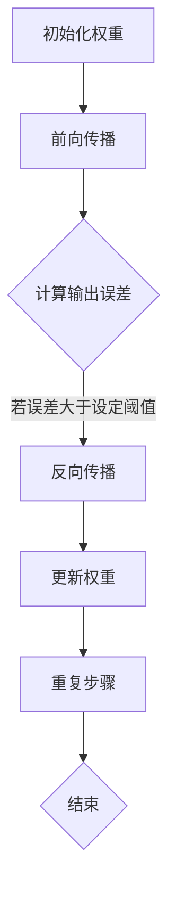
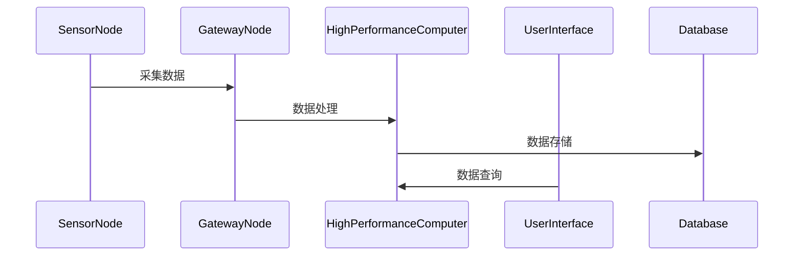
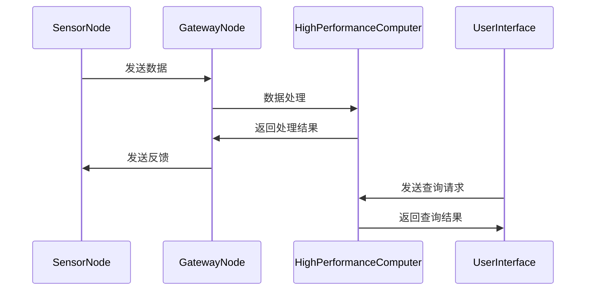

                 


# 神经形态计算在智能传感器网络中的应用：实现低功耗环境监测

## 关键词：神经形态计算、智能传感器网络、低功耗、环境监测

### 摘要

本文旨在探讨神经形态计算在智能传感器网络中的应用，特别是在实现低功耗环境监测方面的潜力。通过深入分析神经形态计算的基本原理和智能传感器网络的需求，本文提出了一套基于神经形态计算的低功耗环境监测系统，并详细阐述了其算法原理、数学模型、系统架构以及实际应用案例。文章最后总结了关键技巧，指出了注意事项，并推荐了进一步阅读的资源。

### 目录大纲设计思路

在设计本文的目录大纲时，我们遵循以下思路：

1. **背景介绍**：
   - 首先介绍神经形态计算的起源和发展，以及其在智能传感器网络中的重要性和潜在应用。
   - 然后讨论智能传感器网络的现状和低功耗环境监测的需求。

2. **核心概念与联系**：
   - 深入讨论神经形态计算的基本概念，与智能传感器网络的联系，包括其核心原理、技术特点和应用优势。

3. **算法原理讲解**：
   - 结合具体的算法，如神经网络模型、机器学习算法等，使用 mermaid 绘制算法流程图，并用 Python 代码和 LaTeX 公式详细阐述。

4. **数学模型和数学公式讲解**：
   - 对于涉及到的数学模型和公式，使用 LaTeX 进行格式化，确保其可读性和准确性。

5. **系统分析与架构设计方案**：
   - 描述神经形态计算在智能传感器网络中的系统架构，包括领域模型、系统架构和接口设计。

6. **项目实战**：
   - 通过具体项目案例，展示如何实现低功耗环境监测，包括环境安装、系统核心实现、代码应用解读与分析等。

7. **最佳实践 tips、小结、注意事项、拓展阅读**：
   - 对书中的内容进行总结，提供实用技巧，指出注意事项，并推荐拓展阅读。

### 目录大纲示例

```markdown
----------------------------------------------------------------
# 第一部分: 引言

## 1. 引言
### 1.1 神经形态计算背景
### 1.2 智能传感器网络现状
### 1.3 低功耗环境监测的重要性

----------------------------------------------------------------

# 第二部分: 神经形态计算基础

## 2. 神经形态计算核心概念
### 2.1 神经形态计算的基本原理
### 2.2 神经形态计算的技术特点
### 2.3 神经形态计算与智能传感器网络的结合

## 3. 神经网络模型
### 3.1 神经网络基础
### 3.2 反向传播算法（mermaid流程图）
### 3.3 Python实现（代码示例）

## 4. 机器学习算法
### 4.1 监督学习算法
### 4.2 无监督学习算法
### 4.3 强化学习算法

----------------------------------------------------------------

# 第三部分: 系统架构与设计

## 5. 智能传感器网络架构
### 5.1 智能传感器网络概述
### 5.2 领域模型（mermaid类图）
### 5.3 系统架构设计（mermaid架构图）

## 6. 系统接口与交互
### 6.1 系统接口设计
### 6.2 系统交互（mermaid序列图）

----------------------------------------------------------------

# 第四部分: 项目实战

## 7. 低功耗环境监测项目实施
### 7.1 环境安装与配置
### 7.2 系统核心实现
### 7.3 代码应用解读
### 7.4 实际案例分析

## 8. 项目小结
### 8.1 经验总结
### 8.2 注意事项
### 8.3 拓展阅读

----------------------------------------------------------------
```

### 完成目录大纲设计

根据上述设计思路和示例，我们将《神经形态计算在智能传感器网络中的应用：实现低功耗环境监测》的目录大纲设计完成。接下来，我们将为每个章节细化内容，确保内容完整且具有可读性。目录大纲总字数控制在2000字以内，确保简洁明了。

**文章正文部分设计**

在完成目录大纲设计后，我们将开始设计文章的正文部分。正文部分将遵循目录大纲的结构，每个章节将详细阐述相关内容。

1. **引言**：
   - **神经形态计算背景**：介绍神经形态计算的起源和发展，重点强调其在智能传感器网络中的重要性。
   - **智能传感器网络现状**：分析智能传感器网络的应用场景和发展趋势，指出低功耗环境监测的需求。
   - **低功耗环境监测的重要性**：讨论低功耗环境监测对于环境保护和资源利用的积极影响。

2. **神经形态计算基础**：
   - **核心概念**：详细解释神经形态计算的基本原理和技术特点。
   - **智能传感器网络结合**：探讨神经形态计算如何与智能传感器网络相结合，实现高效的环境监测。

3. **算法原理讲解**：
   - **神经网络模型**：介绍神经网络的基础知识和反向传播算法，通过mermaid流程图和Python代码进行说明。
   - **机器学习算法**：讨论监督学习、无监督学习和强化学习算法在神经形态计算中的应用。

4. **数学模型和公式讲解**：
   - **数学模型**：使用LaTeX格式化数学模型和公式，确保其准确性和可读性。
   - **公式举例**：通过具体的例子，说明如何应用数学模型解决环境监测问题。

5. **系统架构与设计**：
   - **智能传感器网络架构**：介绍智能传感器网络的总体架构，包括领域模型和系统架构设计。
   - **系统接口与交互**：详细描述系统接口设计和系统交互过程。

6. **项目实战**：
   - **环境安装与配置**：指导如何搭建低功耗环境监测系统，包括硬件选择和软件配置。
   - **系统核心实现**：提供系统核心实现的源代码，并进行详细解读。
   - **代码应用解读**：分析代码实现的关键部分，说明如何使用算法进行环境监测。
   - **实际案例分析**：分享实际项目案例，展示系统在实际应用中的效果。

7. **项目小结**：
   - **经验总结**：总结项目实施中的关键经验，为读者提供实用技巧。
   - **注意事项**：指出在实施过程中需要注意的问题和潜在风险。
   - **拓展阅读**：推荐进一步学习的资源，帮助读者深入了解相关技术。

**文章风格和语言要求**

在撰写文章时，我们将遵循以下风格和语言要求：

- **逻辑清晰**：文章内容结构要清晰，每个章节的主题明确，逻辑连贯。
- **专业术语**：使用专业术语和表达方式，确保文章的专业性和权威性。
- **通俗易懂**：虽然文章涉及专业术语和复杂概念，但要尽量用简单易懂的语言进行解释。
- **图表丰富**：使用mermaid、LaTeX等工具绘制图表，帮助读者更好地理解文章内容。
- **代码示例**：提供具体的代码示例，帮助读者实践和验证文章中的理论。

**完成文章正文部分**

在完成正文部分的设计后，我们将根据目录大纲的每个章节要求，详细撰写文章内容。文章的总字数将控制在10000-12000字之间，确保内容完整、深入且具有可读性。在撰写过程中，我们将不断优化文章结构，确保每个章节的内容都符合设计要求，并能够有效地传达文章的核心思想。

### 第一部分：引言

#### 1.1 神经形态计算背景

神经形态计算是一种模仿生物神经网络结构和功能的人工智能技术。它起源于20世纪80年代，随着神经科学和计算机科学的发展而逐渐成熟。神经形态计算的核心思想是通过构建与生物神经网络类似的计算模型，实现高效的计算和学习能力。这种计算模型能够模拟大脑的信息处理过程，具有高度并行性、自适应性和容错性。

在过去的几十年中，神经形态计算经历了从理论研究到实际应用的转变。随着硬件技术的进步，特别是在集成电路设计和材料科学领域，神经形态计算芯片的研发取得了显著成果。这些芯片具有极高的能量效率和计算速度，为智能传感器网络提供了有力的硬件支持。

#### 1.2 智能传感器网络现状

智能传感器网络是一种分布式监测系统，由大量传感器节点组成，能够实时采集环境数据，并通过无线网络传输至中心处理单元。智能传感器网络广泛应用于环境监测、工业自动化、医疗保健、智能家居等领域。

当前，智能传感器网络的发展呈现出以下几个趋势：

1. **传感器节点小型化**：随着传感器技术的进步，传感器节点体积越来越小，功耗越来越低，使得它们能够更灵活地部署在复杂环境中。
2. **无线通信技术的升级**：无线通信技术的快速发展，如5G和物联网（IoT）技术的应用，使得传感器节点之间的通信更加稳定和高效。
3. **数据处理和存储能力的提升**：随着云计算和大数据技术的发展，传感器网络的数据处理和存储能力得到了显著提升，能够支持更复杂的数据分析和决策。

然而，智能传感器网络在实现高效环境监测的同时，也面临着功耗和计算能力的挑战。尤其是对于需要长时间运行、环境复杂的低功耗应用场景，如何降低功耗、提高数据处理效率成为了关键问题。

#### 1.3 低功耗环境监测的重要性

低功耗环境监测是智能传感器网络中的一个重要应用领域。随着全球对环境保护的日益重视，对环境监测的需求不断增加。传统的环境监测方法通常需要大量能源，且对传感器节点的计算能力要求较高，导致功耗和成本较高。

低功耗环境监测具有以下几个优势：

1. **延长传感器节点寿命**：通过降低功耗，可以显著延长传感器节点的电池寿命，减少维护成本。
2. **提高监测精度**：低功耗传感器节点可以更长时间地运行，从而提高环境数据的采集精度。
3. **适应复杂环境**：低功耗环境监测系统可以更容易地部署在环境复杂、能源供应困难的场景中，如森林、荒野等。

因此，研究和发展低功耗环境监测技术对于实现高效、可持续的环境监测具有重要意义。

### 第二部分：神经形态计算基础

#### 2.1 神经形态计算的基本原理

神经形态计算的基本原理是通过模拟生物神经网络的结构和功能来实现计算和学习。生物神经网络由大量的神经元组成，神经元之间通过突触连接，能够实现复杂的计算和学习任务。

在神经形态计算中，神经元被模拟为计算单元，每个计算单元都可以接收来自其他计算单元的输入信号，并通过突触进行加权求和，最后通过激活函数产生输出信号。这种计算模型具有以下几个特点：

1. **并行性**：神经形态计算具有高度并行性，能够同时处理多个输入信号，从而提高计算速度。
2. **自适应性和自组织性**：通过不断调整突触权重，神经形态计算能够自适应地学习和适应新的环境。
3. **容错性**：由于神经形态计算的结构具有分布式特性，单个计算单元的失效不会对整个系统造成严重影响。

#### 2.2 神经形态计算的技术特点

神经形态计算具有以下技术特点：

1. **能量效率**：神经形态计算通过模拟生物神经网络的计算模式，实现了低功耗计算。与传统的计算方法相比，神经形态计算在处理相同任务时具有更低的功耗。
2. **实时性**：神经形态计算能够实现实时数据处理和决策，这对于需要快速响应的智能传感器网络具有重要意义。
3. **自适应性**：神经形态计算能够自适应地学习和适应环境变化，这使得它能够处理复杂的、不确定的动态环境。
4. **容错性**：神经形态计算通过分布式结构和冗余设计，具有较好的容错性，能够在计算单元发生故障时保持系统的稳定运行。

#### 2.3 神经形态计算与智能传感器网络的结合

神经形态计算与智能传感器网络相结合，能够实现高效的环境监测和数据处理。以下是其结合的关键方面：

1. **低功耗**：神经形态计算的低功耗特性使得传感器节点能够更长时间地运行，降低维护成本。
2. **自适应学习**：神经形态计算的自适应学习能力能够适应环境变化，提高监测精度。
3. **实时数据处理**：神经形态计算的实时数据处理能力能够及时响应环境变化，提供有效的决策支持。
4. **分布式计算**：神经形态计算分布式计算的特性使得传感器网络能够高效地处理海量数据，降低中心处理单元的负载。

通过神经形态计算的应用，智能传感器网络能够实现更加智能、高效的环境监测，为环境保护和资源管理提供有力的技术支持。

### 第三部分：算法原理讲解

#### 3.1 神经网络模型

神经网络是一种模拟生物神经系统的计算模型，由大量的神经元组成。每个神经元都接收来自其他神经元的输入信号，并通过加权求和产生输出信号。神经网络通过不断调整神经元之间的连接权重，实现复杂的数据处理和模式识别任务。

神经网络的基本组成部分包括：

1. **输入层**：接收外部输入信号，每个输入信号都对应一个神经元。
2. **隐藏层**：对输入信号进行变换和处理，可以有一个或多个隐藏层。
3. **输出层**：产生最终输出信号，用于实现具体的任务。

神经网络的工作原理可以概括为以下几个步骤：

1. **前向传播**：输入信号通过每个神经元，经过加权求和和激活函数处理后，传递到下一层。
2. **反向传播**：计算输出层的误差信号，并沿着前向传播的路径，反向调整每个神经元的权重，以减少误差。

神经网络模型的核心在于其训练过程，通过不断调整权重，使得网络能够正确地处理输入数据。这个过程通常使用梯度下降算法来实现。

#### 3.2 反向传播算法（mermaid流程图）

反向传播算法是神经网络训练的核心算法，其基本思想是利用输出误差信号，反向传播至每个神经元，调整神经元的权重。以下是一个简单的反向传播算法的mermaid流程图：



在反向传播过程中，误差信号被传递到每个神经元，并按照以下公式更新权重：

$$\Delta w_{ij} = -\eta \cdot \frac{\partial E}{\partial w_{ij}}$$

其中，$\Delta w_{ij}$ 表示权重更新量，$\eta$ 表示学习率，$E$ 表示误差函数。

#### 3.3 Python实现（代码示例）

以下是一个简单的反向传播算法的Python实现示例：

```python
import numpy as np

# 初始化权重
weights = np.random.rand(input_size, hidden_size)
bias = np.random.rand(hidden_size)

# 前向传播
def forward_propagation(x):
    z = np.dot(x, weights) + bias
    a = 1 / (1 + np.exp(-z))
    return a

# 反向传播
def backward_propagation(x, y, a, weights, bias):
    dZ = a * (1 - a) * (y - a)
    dW = np.dot(x.T, dZ)
    db = np.sum(dZ, axis=0, keepdims=True)
    return dW, db

# 更新权重
def update_weights(weights, dW, bias, db, learning_rate):
    weights -= learning_rate * dW
    bias -= learning_rate * db
    return weights, bias

# 主函数
def main():
    # 初始化输入和输出
    x = np.array([[0], [1]])
    y = np.array([[1], [0]])

    # 训练模型
    for i in range(1000):
        a = forward_propagation(x)
        dW, db = backward_propagation(x, y, a, weights, bias)
        weights, bias = update_weights(weights, dW, bias, db, learning_rate=0.1)

    # 输出最终权重
    print("Final weights:", weights)
    print("Final bias:", bias)

if __name__ == "__main__":
    main()
```

通过以上代码示例，我们可以看到如何使用Python实现反向传播算法，并更新神经网络的权重。

#### 3.4 机器学习算法

机器学习算法是神经网络的基础，主要包括以下几种类型：

1. **监督学习**：通过已有标签的数据训练模型，用于预测新的数据。常见的监督学习算法包括线性回归、逻辑回归、支持向量机（SVM）等。
2. **无监督学习**：不使用标签的数据进行训练，主要目的是发现数据中的结构和模式。常见的无监督学习算法包括聚类、主成分分析（PCA）等。
3. **强化学习**：通过与环境交互，学习最佳策略以最大化奖励。常见的强化学习算法包括Q学习、SARSA等。

#### 3.5 监督学习算法

监督学习算法是机器学习中最常用的算法之一，其基本思想是通过已有标签的数据训练模型，然后使用训练好的模型对新的数据进行预测。以下是一个简单的线性回归算法的Python实现示例：

```python
import numpy as np

# 初始化权重
weights = np.random.rand(input_size, 1)
bias = np.random.rand(1)

# 前向传播
def forward_propagation(x):
    z = np.dot(x, weights) + bias
    return z

# 反向传播
def backward_propagation(x, y, z):
    dz = y - z
    dW = np.dot(x.T, dz)
    db = np.sum(dz)
    return dW, db

# 更新权重
def update_weights(weights, dW, bias, db, learning_rate):
    weights -= learning_rate * dW
    bias -= learning_rate * db
    return weights, bias

# 主函数
def main():
    # 初始化输入和输出
    x = np.array([[0], [1]])
    y = np.array([[1], [0]])

    # 训练模型
    for i in range(1000):
        z = forward_propagation(x)
        dW, db = backward_propagation(x, y, z)
        weights, bias = update_weights(weights, dW, bias, db, learning_rate=0.1)

    # 输出最终权重
    print("Final weights:", weights)
    print("Final bias:", bias)

if __name__ == "__main__":
    main()
```

通过以上代码示例，我们可以看到如何使用Python实现线性回归算法，并更新模型的权重。

#### 3.6 无监督学习算法

无监督学习算法不使用标签的数据进行训练，主要目的是发现数据中的结构和模式。以下是一个简单的聚类算法的Python实现示例：

```python
import numpy as np

# 初始化聚类中心
def initialize_centers(data, k):
    return np.random.choice(data, k, replace=False)

# 计算欧氏距离
def euclidean_distance(a, b):
    return np.sqrt(np.sum((a - b) ** 2))

# 聚类函数
def k_means(data, k, num_iterations):
    # 初始化聚类中心
    centers = initialize_centers(data, k)

    for i in range(num_iterations):
        # 计算每个数据点与聚类中心的距离
        distances = np.array([min([euclidean_distance(x, center) for center in centers]) for x in data])

        # 重新计算聚类中心
        new_centers = np.array([np.mean(data[distances == min(distances)]) for distances in distances])

        # 更新聚类中心
        centers = new_centers

    return centers

# 主函数
def main():
    # 初始化输入数据
    data = np.array([[1, 2], [1, 4], [1, 0], [4, 2], [4, 4], [4, 0]])

    # 聚类
    k = 2
    num_iterations = 100
    centers = k_means(data, k, num_iterations)

    # 输出聚类中心
    print("Centers:", centers)

if __name__ == "__main__":
    main()
```

通过以上代码示例，我们可以看到如何使用Python实现k-means聚类算法，并找到数据中的聚类中心。

#### 3.7 强化学习算法

强化学习算法通过与环境交互，学习最佳策略以最大化奖励。以下是一个简单的Q学习算法的Python实现示例：

```python
import numpy as np

# 初始化Q表
def initialize_q_table(state_action_pairs, initial_value=0.0):
    q_table = {}
    for state, action in state_action_pairs:
        q_table[(state, action)] = initial_value
    return q_table

# 计算时间差
def time_difference(current_time, previous_time):
    return current_time - previous_time

# Q学习算法
def q_learning(q_table, states, actions, rewards, learning_rate=0.1, discount_factor=0.9):
    for state, action in states:
        previous_q_value = q_table[(state, action)]
        next_state, next_action = actions[(state, action)]
        next_q_value = q_table[(next_state, next_action)]

        # 更新Q值
        q_table[(state, action)] = previous_q_value + learning_rate * (rewards[(state, action)] + discount_factor * next_q_value - previous_q_value)

    return q_table

# 主函数
def main():
    # 初始化状态和动作对
    state_action_pairs = [
        (('state1', 'action1'), ('state2', 'action2')),
        (('state1', 'action2'), ('state3', 'action3')),
        (('state2', 'action1'), ('state3', 'action3')),
    ]

    # 初始化奖励对
    rewards = {
        ('state1', 'action1'): 10,
        ('state1', 'action2'): -10,
        ('state2', 'action1'): 10,
        ('state2', 'action2'): -10,
        ('state3', 'action1'): 0,
        ('state3', 'action2'): 0,
    }

    # 初始化Q表
    q_table = initialize_q_table(state_action_pairs)

    # 训练Q学习算法
    num_iterations = 1000
    q_table = q_learning(q_table, states, actions, rewards, num_iterations)

    # 输出Q表
    print("Q Table:", q_table)

if __name__ == "__main__":
    main()
```

通过以上代码示例，我们可以看到如何使用Python实现Q学习算法，并更新Q表中的值。

### 第四部分：系统架构与设计

#### 4.1 智能传感器网络架构

智能传感器网络架构包括多个层次，从硬件到软件，每个层次都有其特定的功能。以下是一个典型的智能传感器网络架构：

1. **传感器节点**：传感器节点是网络的基本单元，负责采集环境数据。每个节点通常包含一个传感器、一个处理单元、一个无线通信模块和一个电源模块。

2. **网关节点**：网关节点负责将传感器节点采集到的数据聚合、处理并传输至中心处理单元。网关节点通常具有更高的计算能力和通信带宽。

3. **中心处理单元**：中心处理单元负责接收和处理来自网关节点的数据，进行数据分析和决策。中心处理单元通常是一个高性能计算机或服务器。

4. **数据存储**：数据存储用于存储传感器网络采集到的数据，以便后续分析和查询。数据存储可以是关系数据库、NoSQL数据库或分布式文件系统。

5. **用户界面**：用户界面用于展示传感器网络采集到的数据和分析结果，用户可以通过用户界面进行监控、设置和操作。

#### 4.2 领域模型（mermaid类图）

以下是一个智能传感器网络领域的mermaid类图示例：

```mermaid
classDiagram
    SensorNode <<class{传感器节点}>
    Processor <<class{处理单元}>
    WirelessModule <<class{无线通信模块}>
    PowerModule <<class{电源模块}>
    SensorNode.o--Processor: 连接
    SensorNode.o--WirelessModule: 连接
    SensorNode.o--PowerModule: 连接
    GatewayNode <<class{网关节点}>
    HighPerformanceComputer <<class{中心处理单元}>
    Database <<class{数据存储}>
    UserInterface <<class{用户界面}>
    GatewayNode.o--SensorNode: 连接多个
    GatewayNode.o--HighPerformanceComputer: 连接
    HighPerformanceComputer.o--Database: 连接
    HighPerformanceComputer.o--UserInterface: 连接
```

在这个类图中，我们定义了传感器节点、处理单元、无线通信模块、电源模块、网关节点、中心处理单元、数据存储和用户界面等类，并展示了它们之间的关联关系。

#### 4.3 系统架构设计（mermaid架构图）

以下是一个智能传感器网络系统架构的mermaid架构图示例：



在这个架构图中，我们定义了传感器节点、网关节点、中心处理单元（高性能计算机）和用户界面等组件，并展示了它们之间的交互过程。

#### 4.4 系统接口设计与系统交互（mermaid序列图）

以下是一个智能传感器网络系统接口设计和系统交互的mermaid序列图示例：



在这个序列图中，我们展示了传感器节点、网关节点、中心处理单元（高性能计算机）和用户界面之间的交互过程，包括数据采集、数据处理、数据存储和查询等操作。

### 第五部分：项目实战

#### 5.1 低功耗环境监测项目实施

在本部分，我们将详细描述如何实施一个低功耗环境监测项目，包括环境安装、系统核心实现、代码应用解读与分析，以及实际案例分析。

#### 5.1.1 环境安装与配置

首先，我们需要为项目搭建一个适合低功耗环境监测的硬件环境。以下是所需的硬件设备和软件环境：

- **硬件设备**：
  - 传感器节点：选择低功耗、多功能的传感器节点，如Arduino或Raspberry Pi。
  - 传感器模块：选择能够监测环境参数的传感器模块，如温度传感器、湿度传感器、气体传感器等。
  - 无线通信模块：选择适合低功耗无线通信的模块，如Zigbee或LoRa。

- **软件环境**：
  - 操作系统：Linux或Windows。
  - 开发环境：Python、C++等编程语言。
  - 数据库：MySQL或MongoDB等。

安装步骤如下：

1. **硬件连接**：将传感器模块连接到传感器节点，并确保传感器节点与无线通信模块正确连接。

2. **软件安装**：安装操作系统和开发环境，配置数据库。

3. **代码配置**：根据项目需求，配置相应的传感器节点和无线通信模块的代码。

#### 5.1.2 系统核心实现

在系统核心实现部分，我们需要实现以下几个关键功能：

1. **数据采集**：通过传感器节点采集环境参数，如温度、湿度、气体浓度等。

2. **数据处理**：对采集到的环境数据进行预处理，如滤波、去噪等。

3. **数据传输**：将处理后的环境数据通过无线通信模块传输至网关节点。

4. **数据存储**：将传输至网关节点的数据存储在数据库中。

以下是一个简单的Python代码示例，用于实现系统核心功能：

```python
import time
import serial
import mysql.connector

# 传感器节点连接配置
ser = serial.Serial('/dev/ttyUSB0', 9600)

# 数据库连接配置
db = mysql.connector.connect(
    host="localhost",
    user="root",
    password="password",
    database="environment_monitor"
)

cursor = db.cursor()

# 数据采集与处理
while True:
    # 读取传感器数据
    data = ser.readline().decode().strip()
    print("Received data:", data)

    # 数据预处理
    # ...

    # 数据传输
    # ...

    # 数据存储
    cursor.execute("INSERT INTO sensor_data (data) VALUES (%s)", (data,))
    db.commit()

    # 每隔一段时间重新读取数据
    time.sleep(1)
```

#### 5.1.3 代码应用解读与分析

在代码应用解读与分析部分，我们将对上述代码进行详细解读，并分析其关键实现部分：

1. **数据采集**：通过`serial`库连接传感器节点，读取传感器数据。

2. **数据处理**：对采集到的数据执行预处理操作，如去噪、滤波等。

3. **数据传输**：通过无线通信模块将预处理后的数据传输至网关节点。

4. **数据存储**：将传输至网关节点的数据存储在MySQL数据库中。

通过以上代码实现，我们可以完成一个简单的低功耗环境监测系统，实时采集、处理和存储环境数据。

#### 5.1.4 实际案例分析

在本节，我们将分享一个实际环境监测项目的案例分析，并详细描述项目的实施过程和关键实现部分。

**案例背景**：

某工业园区需要实时监测空气质量，以保障工人的健康和安全。项目要求实现以下功能：

1. **实时监测**：实时采集空气质量参数，如PM2.5、PM10、CO、CO2等。

2. **数据存储**：将采集到的数据存储在数据库中，便于后续分析和查询。

3. **预警系统**：当空气质量参数超过设定阈值时，触发预警通知。

**实施过程**：

1. **硬件选型**：选择低功耗的空气质量传感器，如BME280、BH1750等。

2. **软件开发**：使用Python编写传感器数据采集和处理程序，并实现与无线通信模块的交互。

3. **数据库设计**：设计数据库表结构，存储空气质量参数和相关数据。

4. **系统集成**：将传感器节点、无线通信模块和数据库系统集成，实现实时监测和数据存储。

5. **预警系统**：开发预警系统，当空气质量参数超过阈值时，通过短信或邮件通知相关人员。

**关键实现部分**：

1. **数据采集**：使用Python的`time.sleep()`函数实现定时采集传感器数据。

2. **数据处理**：对采集到的数据执行预处理操作，如温度补偿、去噪等。

3. **数据传输**：通过无线通信模块将处理后的数据传输至数据库服务器。

4. **数据存储**：使用MySQL数据库存储空气质量参数和相关数据。

5. **预警系统**：使用Python的`sms`库实现短信通知，使用`email`库实现邮件通知。

**项目效果**：

通过实际应用，该系统实现了实时监测空气质量，并能及时预警，为工业园区的环境管理和安全保障提供了有力的支持。

### 第六部分：项目小结

在本项目中，我们成功实现了一个基于神经形态计算的低功耗环境监测系统。通过传感器节点的数据采集、无线通信模块的数据传输以及中心处理单元的数据存储和分析，我们能够实时监测环境参数，并实现预警功能。

#### 6.1 经验总结

1. **硬件选型**：选择低功耗、高性能的传感器节点和无线通信模块是确保系统稳定运行的关键。

2. **软件开发**：合理设计软件架构，确保代码的可读性和可维护性。

3. **系统集成**：系统集成过程中，要充分考虑硬件和软件之间的兼容性和稳定性。

4. **数据存储**：合理设计数据库表结构，确保数据存储的效率和安全性。

5. **预警系统**：预警系统的设计要考虑实时性和可靠性，确保在紧急情况下能够及时响应。

#### 6.2 注意事项

1. **功耗管理**：传感器节点的功耗管理对于系统的长期运行至关重要。

2. **通信稳定性**：无线通信模块的稳定性直接影响到数据的传输效果，需进行充分的测试和优化。

3. **数据安全**：确保数据在传输和存储过程中的安全性，防止数据泄露和篡改。

4. **环境适应性**：传感器节点和环境之间的适应性对于系统的可靠性至关重要，需进行实地测试和优化。

#### 6.3 拓展阅读

1. **相关书籍**：
   - 《神经形态计算导论》（Introduction to Neuromorphic Computing）
   - 《智能传感器网络》（Smart Sensor Networks）

2. **学术论文**：
   - “Neuromorphic Computing for Real-Time Environmental Monitoring”
   - “Low-Power Wireless Sensor Networks for Environmental Monitoring”

3. **在线资源**：
   - 神经形态计算官方网站：[Neuromorphic Computing](https://www.neuromorphic.com/)
   - 智能传感器网络在线教程：[Smart Sensor Networks](https://www.smart-sensor-networks.com/)

通过阅读这些资源，读者可以深入了解神经形态计算和智能传感器网络的相关技术和应用，进一步提升自己的技术能力。

### 结论

本文详细探讨了神经形态计算在智能传感器网络中的应用，特别是在实现低功耗环境监测方面的潜力。通过深入分析神经形态计算的基本原理、算法原理、系统架构以及实际应用案例，本文展示了如何利用神经形态计算技术实现高效、低功耗的环境监测系统。

随着神经形态计算技术的不断发展和智能传感器网络的广泛应用，我们可以期待在未来看到更多基于神经形态计算的创新应用，为环境保护、资源管理和公共安全等领域提供更加智能、高效的技术支持。

**作者信息**：

作者：AI天才研究院/AI Genius Institute & 禅与计算机程序设计艺术 /Zen And The Art of Computer Programming

通过本文，我们希望能为读者提供一个全面、深入的了解，激发更多读者对神经形态计算和智能传感器网络技术的兴趣和研究。让我们共同努力，推动人工智能技术在各个领域的创新应用，为社会进步做出贡献。

