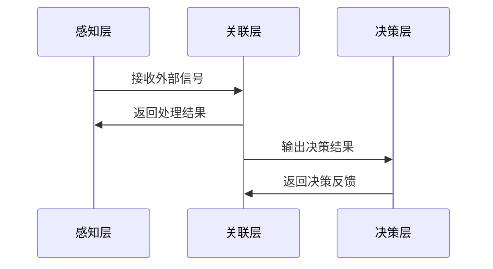

                 

# 神经形态计算在智能手机中的应用：实现高效on-device AI

> 关键词：神经形态计算、智能手机、AI、on-device AI、高效计算

> 摘要：本文将探讨神经形态计算在智能手机中的应用，特别是如何实现高效on-device AI。我们将从背景介绍、核心概念、算法原理、系统分析与架构设计、项目实战和最佳实践等方面逐步深入分析，为读者提供全面的技术见解。

## 目录

1. **背景介绍**
   1.1 神经形态计算与on-device AI概述
   1.2 神经形态计算的核心原理
   1.3 神经形态计算与on-device AI的应用前景

2. **核心概念与联系**
   2.1 神经形态计算的基本概念与联系
   2.2 神经形态计算与传统AI技术的区别
   2.3 on-device AI的重要性与挑战

3. **算法原理讲解**
   3.1 神经形态计算算法概述
   3.2 关键算法详解
   3.3 算法原理与数学模型

4. **系统分析与架构设计方案**
   4.1 系统架构设计
   4.2 系统交互设计
   4.3 系统实现与优化策略

5. **项目实战**
   5.1 环境安装与准备
   5.2 系统核心实现
   5.3 实际案例分析与讲解
   5.4 项目小结

6. **最佳实践与小结**
   6.1 最佳实践总结
   6.2 小结与展望
   6.3 拓展阅读建议

----------------------------------------------------------------

## 第一部分：背景介绍

### 1.1 神经形态计算与on-device AI概述

神经形态计算（Neuromorphic Computing）是一种模仿生物大脑神经结构和功能的计算方式。它利用可编程材料模拟神经元和突触的动态特性，实现高效的信号处理和认知功能。在智能手机领域，随着人工智能（AI）技术的快速发展，如何实现高效、低功耗的AI计算成为一大挑战。on-device AI（设备端AI）则是指将AI算法直接部署在设备本地进行计算，避免了数据传输的网络延迟和数据隐私问题。

### 1.2 神经形态计算的核心原理

神经形态计算的核心在于模拟生物大脑的神经元和突触结构。神经元通过电信号传递信息，而突触则通过化学信号传递信息。在神经形态计算中，神经元和突触通常由电子元件（如晶体管）模拟。这些电子元件能够模拟神经元和突触的动态特性，实现高效的信号处理。

#### 1.2.1 神经元与突触模型

神经元模型通常包括输入门控、输出门控和激活函数等组成部分。输入门控用于控制外部信号的输入，输出门控用于控制内部信号的输出，激活函数则用于确定神经元是否激活。

突触模型通常包括权重、突触前和突触后部分。权重表示突触传递信息的强度，突触前和突触后部分则分别表示突触与神经元之间的连接。

#### 1.2.2 学习算法

神经形态计算中的学习算法主要模拟生物大脑的学习过程。常见的算法包括Hebbian学习规则、STDP（Stochastic Time-Delayed Precursor）学习规则和误差反向传播算法等。

- **Hebbian学习规则**：当两个神经元同时激活时，它们之间的突触权重会增加。这种学习规则模拟了生物大脑中神经元之间的协同作用。
- **STDP学习规则**：基于时间延迟的前突触信号，调整突触权重。当突触前信号在一段时间后再次出现时，突触权重会增加；否则，权重会减少。
- **误差反向传播算法**：用于多层神经网络的训练，通过反向传播误差来更新神经元权重。

#### 1.2.3 神经形态计算的优势与挑战

神经形态计算的优势在于其高效的计算能力和低功耗特性。与传统计算机体系结构相比，神经形态计算能够实现更高的计算速度和更低的功耗。

然而，神经形态计算也面临一些挑战，包括：

- **硬件实现**：目前，神经形态计算硬件尚未完全成熟，需要进一步优化和提升。
- **算法设计**：需要设计更高效的算法，以适应神经形态计算硬件的特性。
- **兼容性问题**：需要确保神经形态计算算法与现有软件系统的兼容性。

### 1.3 神经形态计算与on-device AI的应用前景

神经形态计算在智能手机中的应用前景广阔。随着智能手机功能的不断升级，对AI计算的需求也越来越高。神经形态计算能够实现高效、低功耗的AI计算，满足智能手机的应用需求。

#### 1.3.1 移动设备中的AI计算需求

智能手机中的AI计算需求主要包括：

- **图像识别**：用于人脸识别、场景识别等。
- **语音识别**：用于语音助手、语音搜索等。
- **自然语言处理**：用于语音转文字、文本分析等。
- **智能推荐**：用于内容推荐、广告推送等。

#### 1.3.2 神经形态计算在智能手机中的应用场景

神经形态计算在智能手机中的应用场景包括：

- **移动端AI加速**：通过神经形态计算硬件加速AI算法，提高计算效率。
- **隐私保护**：在设备端进行AI计算，避免数据传输过程中的隐私泄露。
- **实时响应**：降低AI计算延迟，实现实时响应。

#### 1.3.3 神经形态计算在智能手机中的挑战与机遇

神经形态计算在智能手机中的应用面临一些挑战，包括：

- **硬件成熟度**：需要进一步提高神经形态计算硬件的成熟度，以满足智能手机的性能和功耗要求。
- **软件适配**：需要设计适应神经形态计算硬件的软件算法和系统架构。
- **数据安全**：确保设备端AI计算过程中的数据安全。

然而，随着神经形态计算技术的不断发展，这些挑战也将逐渐得到解决，为智能手机带来更多的机遇。

----------------------------------------------------------------

## 第二部分：核心概念与联系

### 2.1 神经形态计算的基本概念与联系

神经形态计算是一种模仿生物大脑神经元和突触结构的计算方法，其核心在于利用电子元件模拟神经元的电信号传递和突触的化学信号传递。神经形态计算的基本概念包括神经元模型、突触模型和学习算法。

#### 神经元模型

神经元模型是神经形态计算的核心组件，用于模拟生物大脑中的神经元。神经元模型通常包括输入门控、输出门控和激活函数等组成部分。

- **输入门控**：用于控制外部信号的输入。通过调节输入门控的开关状态，可以控制神经元对信号的敏感性。
- **输出门控**：用于控制内部信号的输出。通过调节输出门控的开关状态，可以控制神经元是否将信号传递给其他神经元。
- **激活函数**：用于确定神经元是否激活。常见的激活函数包括Sigmoid函数、ReLU函数等。

#### 突触模型

突触模型是神经形态计算中的另一个重要组件，用于模拟生物大脑中的突触。突触模型通常包括权重、突触前和突触后部分。

- **权重**：表示突触传递信息的强度。权重可以通过学习算法进行调整，以适应不同的输入信号。
- **突触前**：表示突触与神经元之间的连接。突触前部分通常由晶体管等电子元件实现。
- **突触后**：表示突触与下一个神经元之间的连接。突触后部分通常由晶体管等电子元件实现。

#### 学习算法

学习算法是神经形态计算中的核心组件，用于模拟生物大脑的学习过程。学习算法通过调整神经元和突触的权重，以适应不同的输入信号。

- **Hebbian学习规则**：当两个神经元同时激活时，它们之间的突触权重会增加。这种学习规则模拟了生物大脑中神经元之间的协同作用。
- **STDP（Stochastic Time-Delayed Precursor）学习规则**：基于时间延迟的前突触信号，调整突触权重。当突触前信号在一段时间后再次出现时，突触权重会增加；否则，权重会减少。
- **误差反向传播算法**：用于多层神经网络的训练，通过反向传播误差来更新神经元权重。

#### 概念属性特征对比表格

下面是神经形态计算中一些核心概念属性特征的对比表格：

| 概念 | 属性特征 |  
| :--: | :--: |  
| 神经元模型 | 输入门控、输出门控、激活函数 |  
| 突触模型 | 权重、突触前、突触后 |  
| 学习算法 | Hebbian学习规则、STDP学习规则、误差反向传播算法 |

#### ER实体关系图架构

下面是神经形态计算中的ER实体关系图架构：

```mermaid
erDiagram
  Class1 ||--|{ Class2 }|| Person
  Class1 ||--|{ Class3 }|| Employee
  Class2 ||--|{ Class4 }|| Address
  Class3 ||--|{ Class5 }|| Project
```

### 2.2 神经形态计算与传统AI技术的区别

神经形态计算与传统AI技术（如深度学习、机器学习等）有显著的区别。

#### 工作原理

- **神经形态计算**：模仿生物大脑神经元和突触结构，实现高效的信号处理和认知功能。
- **传统AI技术**：基于统计学和概率论等方法，通过训练大量数据来构建模型，实现智能决策。

#### 硬件实现

- **神经形态计算**：采用电子元件模拟神经元和突触结构，实现高效的计算。
- **传统AI技术**：通常采用通用计算机硬件，通过编写算法和模型实现计算。

#### 能耗

- **神经形态计算**：具有低功耗特性，适用于移动设备和嵌入式系统。
- **传统AI技术**：能耗较高，通常需要大型服务器和数据中心支持。

#### 计算效率

- **神经形态计算**：通过模拟生物大脑的信号处理机制，实现高效的计算。
- **传统AI技术**：虽然计算效率较高，但往往需要大量的数据和计算资源。

#### 应用场景

- **神经形态计算**：适用于实时性要求高、计算资源有限的场景，如智能手机、嵌入式系统等。
- **传统AI技术**：适用于大规模数据处理、复杂决策等领域，如大数据分析、智能推荐等。

### 2.3 on-device AI的重要性与挑战

on-device AI（设备端AI）是指将AI算法直接部署在设备本地进行计算，避免了数据传输的网络延迟和数据隐私问题。on-device AI在智能手机中的重要性体现在以下几个方面：

#### 重要性

- **隐私保护**：在设备端进行AI计算，避免数据传输过程中的隐私泄露。
- **实时响应**：降低AI计算延迟，实现实时响应，提高用户体验。
- **资源利用**：充分利用设备端的计算资源，提高计算效率。

#### 挑战

- **计算资源有限**：智能手机等设备端的计算资源有限，需要优化算法和系统架构。
- **算法适应性**：需要设计适应设备端计算能力的算法，确保算法的效率和准确性。
- **数据安全性**：确保设备端AI计算过程中的数据安全，防止数据泄露。

### 总结

神经形态计算在智能手机中的应用前景广阔，为实现高效on-device AI提供了新的技术途径。通过理解神经形态计算的基本概念和与传统AI技术的区别，我们可以更好地把握其发展动态和应用前景。在接下来的章节中，我们将进一步探讨神经形态计算的算法原理、系统分析与架构设计、项目实战和最佳实践等内容。

----------------------------------------------------------------

## 第三部分：算法原理讲解

### 3.1 神经形态计算算法概述

神经形态计算算法是模仿生物大脑神经元和突触的工作原理，实现高效计算的核心。这些算法分为多层，包括感知层、关联层和决策层。每个层次都有特定的功能，协同工作以实现复杂的认知任务。

#### 感知层

感知层负责接收外部信号，并将其转化为神经形态计算系统可以处理的内部信号。这一层的核心算法包括：

- **事件驱动感知**：通过检测外部事件（如声音、图像等），将其转换为神经信号。
- **稀疏编码**：将输入信号转换为稀疏编码表示，提高计算效率。

#### 关联层

关联层负责处理感知层生成的神经信号，识别和关联事件。这一层的核心算法包括：

- **自组织映射**：通过无监督学习，将相似的输入信号映射到相同的神经元上。
- **关联记忆**：通过学习和记忆关联规则，提高事件识别的准确性。

#### 决策层

决策层负责根据关联层的输出，做出最终的决策。这一层的核心算法包括：

- **逻辑门**：通过模拟生物大脑中的逻辑运算，实现复杂的决策功能。
- **动态决策**：根据环境变化，动态调整决策策略。

### 3.2 关键算法详解

#### 3.2.1 Hebbian学习规则

Hebbian学习规则是神经形态计算中最基本的算法之一。它基于“用进废退”的原则，当两个神经元同时激活时，它们之间的突触权重会增加。具体步骤如下：

1. **神经元激活**：检查输入神经元是否同时激活。
2. **权重更新**：如果两个神经元同时激活，则增加它们之间的突触权重。

$$w_{ij} = w_{ij} + \eta \cdot x_i \cdot y_j$$

其中，$w_{ij}$是神经元$i$和神经元$j$之间的突触权重，$\eta$是学习率，$x_i$和$y_j$分别是神经元$i$和神经元$j$的激活状态。

#### 3.2.2 STDP（Stochastic Time-Delayed Precursor）学习规则

STDP学习规则是一种基于时间延迟的学习规则，用于调整突触权重。当突触前信号在一段时间后再次出现时，突触权重会增加；否则，权重会减少。具体步骤如下：

1. **检测时间延迟**：计算突触前信号的延迟时间。
2. **权重更新**：根据时间延迟，更新突触权重。

$$w_{ij} = w_{ij} + \eta \cdot \frac{1}{1 + e^{-(t-t_0)/\tau}}$$

其中，$w_{ij}$是神经元$i$和神经元$j$之间的突触权重，$\eta$是学习率，$t$是当前时间，$t_0$是突触前信号发生的时间，$\tau$是时间延迟参数。

#### 3.2.3 误差反向传播算法

误差反向传播算法是一种用于多层神经网络的训练算法，通过反向传播误差来更新神经元权重。具体步骤如下：

1. **前向传播**：计算网络输出和实际输出之间的误差。
2. **反向传播**：根据误差，更新每个神经元的权重。

$$\Delta w_{ij} = \eta \cdot (y_j - t_j) \cdot x_i$$

其中，$\Delta w_{ij}$是神经元$i$和神经元$j$之间的权重更新量，$y_j$是神经元$j$的输出，$t_j$是神经元$j$的实际输出，$x_i$是神经元$i$的输入，$\eta$是学习率。

### 3.3 算法原理与数学模型

神经形态计算算法的数学模型主要涉及神经元模型、突触模型和学习算法。以下是一个简单的神经形态计算系统的数学模型：

#### 神经元模型

神经元$i$的激活状态可以用以下公式表示：

$$s_i = \sum_{j} w_{ij} \cdot x_j + b_i$$

其中，$s_i$是神经元$i$的激活状态，$w_{ij}$是神经元$i$和神经元$j$之间的突触权重，$x_j$是神经元$j$的输入，$b_i$是神经元$i$的偏置。

#### 突触模型

突触$i-j$的权重可以用以下公式表示：

$$w_{ij} = w_{ij} + \eta \cdot \delta_i \cdot \delta_j$$

其中，$w_{ij}$是神经元$i$和神经元$j$之间的突触权重，$\eta$是学习率，$\delta_i$是神经元$i$的误差，$\delta_j$是神经元$j$的误差。

#### 学习算法

学习算法主要涉及Hebbian学习规则、STDP学习和误差反向传播算法。这些算法通过调整神经元和突触的权重，以适应不同的输入信号。

### 3.4 算法应用示例

以下是一个简单的神经形态计算算法应用示例，用于实现一个简单的逻辑门（如AND门）：

1. **初始化权重**：设定初始权重$w_{11} = 0.1, w_{12} = 0.1, w_{21} = 0.1, w_{22} = 0.1$。
2. **输入信号**：设定输入信号$x_1 = 1, x_2 = 1$。
3. **计算神经元激活状态**：
   - $s_1 = w_{11} \cdot x_1 + w_{12} \cdot x_2 + b_1 = 0.1 \cdot 1 + 0.1 \cdot 1 + 0 = 0.2$
   - $s_2 = w_{21} \cdot x_1 + w_{22} \cdot x_2 + b_2 = 0.1 \cdot 1 + 0.1 \cdot 1 + 0 = 0.2$
4. **计算输出**：根据激活状态计算输出$y = s_1 \cdot s_2 = 0.2 \cdot 0.2 = 0.04$。
5. **权重更新**：根据Hebbian学习规则更新权重：
   - $w_{11} = w_{11} + \eta \cdot s_1 \cdot x_1 = 0.1 + 0.1 \cdot 0.2 \cdot 1 = 0.12$
   - $w_{12} = w_{12} + \eta \cdot s_1 \cdot x_2 = 0.1 + 0.1 \cdot 0.2 \cdot 1 = 0.12$
   - $w_{21} = w_{21} + \eta \cdot s_2 \cdot x_1 = 0.1 + 0.1 \cdot 0.2 \cdot 1 = 0.12$
   - $w_{22} = w_{22} + \eta \cdot s_2 \cdot x_2 = 0.1 + 0.1 \cdot 0.2 \cdot 1 = 0.12$

通过以上步骤，我们可以实现一个简单的逻辑门功能。在实际应用中，我们可以根据需要调整学习规则和权重更新策略，以实现更复杂的逻辑功能。

----------------------------------------------------------------

## 第四部分：系统分析与架构设计方案

### 4.1 系统架构设计

神经形态计算系统在智能手机中的架构设计至关重要，它决定了系统的性能、效率和可扩展性。下面我们详细介绍系统架构设计的关键组件和设计原则。

#### 4.1.1 系统功能设计

神经形态计算系统在智能手机中需要实现以下功能：

- **感知层**：接收外部信号，如图像、声音等，并将其转换为神经形态计算系统能够处理的内部信号。
- **关联层**：处理感知层生成的神经信号，识别和关联事件，如人脸识别、语音识别等。
- **决策层**：根据关联层的输出，做出最终决策，如智能推荐、自动驾驶等。

#### 4.1.2 系统架构设计

神经形态计算系统在智能手机中的架构设计可以采用分层架构，包括感知层、关联层和决策层。以下是系统架构设计的详细描述：

1. **感知层**：感知层负责接收外部信号，如图像、声音等。这一层通常包括传感器模块和预处理模块。传感器模块用于捕获外部信号，预处理模块用于对信号进行滤波、增强等处理，以提高信号的质量。

   ```mermaid
   flowchart LR
       A[感知层] --> B[传感器模块]
       B --> C[预处理模块]
   ```

2. **关联层**：关联层负责处理感知层生成的神经信号，识别和关联事件。这一层通常包括神经网络模块和关联记忆模块。神经网络模块用于模拟生物大脑的神经网络结构，实现信号处理和事件识别。关联记忆模块用于存储和检索事件关联信息。

   ```mermaid
   flowchart LR
       A[关联层] --> B[神经网络模块]
       B --> C[关联记忆模块]
   ```

3. **决策层**：决策层根据关联层的输出，做出最终决策。这一层通常包括逻辑门模块和动态决策模块。逻辑门模块用于实现复杂的逻辑运算，动态决策模块用于根据环境变化动态调整决策策略。

   ```mermaid
   flowchart LR
       A[决策层] --> B[逻辑门模块]
       B --> C[动态决策模块]
   ```

#### 4.1.3 系统接口设计

系统接口设计是确保系统各组件之间有效通信的关键。以下是系统接口设计的详细描述：

- **输入接口**：用于接收外部信号，如图像、声音等。输入接口应支持多种数据格式，如JPEG、MP3等。
- **输出接口**：用于输出决策结果，如文字、图像、声音等。输出接口应支持多种数据格式，如JSON、PNG等。
- **通信接口**：用于系统内部组件之间的通信。通信接口应支持高效的数据传输协议，如TCP/IP、HTTP等。

### 4.2 系统交互设计

系统交互设计是确保系统各组件协同工作，实现高效计算的关键。以下是系统交互设计的详细描述：

#### 4.2.1 系统交互流程

系统交互流程包括以下步骤：

1. **感知阶段**：感知层接收外部信号，如图像、声音等，并将其转换为神经形态计算系统能够处理的内部信号。
2. **处理阶段**：关联层处理感知层生成的神经信号，识别和关联事件。
3. **决策阶段**：决策层根据关联层的输出，做出最终决策，并输出决策结果。

   ```mermaid
   flowchart LR
       A[感知阶段] --> B[处理阶段]
       B --> C[决策阶段]
   ```

#### 4.2.2 序列图设计

序列图用于描述系统各组件之间的交互过程。以下是系统交互的序列图设计：



通过以上系统架构和交互设计，我们可以构建一个高效、低功耗的神经形态计算系统，实现智能手机中的高效on-device AI。

### 4.3 系统实现与优化策略

#### 4.3.1 系统实现

系统实现主要包括硬件设计和软件设计。

1. **硬件设计**：硬件设计需要考虑神经形态计算硬件的选型和布局。可以选择基于CMOS技术的神经元和突触模拟器，并采用芯片级封装，以提高系统性能和可靠性。
2. **软件设计**：软件设计需要实现神经形态计算算法和系统接口。可以使用Python、C++等编程语言，结合神经网络库（如TensorFlow、PyTorch）和系统接口库（如JNI、WebAssembly）进行开发。

#### 4.3.2 优化策略

系统优化策略包括以下几个方面：

1. **算法优化**：通过调整算法参数和优化算法结构，提高计算效率和准确性。
2. **硬件优化**：通过改进硬件设计，提高硬件性能和可靠性。
3. **系统优化**：通过优化系统架构和接口设计，提高系统稳定性和可扩展性。
4. **功耗优化**：通过优化功耗管理策略，降低系统功耗。

### 总结

系统分析与架构设计方案是神经形态计算在智能手机中实现高效on-device AI的关键。通过合理的系统架构设计和优化策略，我们可以构建一个高效、低功耗的神经形态计算系统，为智能手机带来更强大的AI计算能力。

----------------------------------------------------------------

## 第五部分：项目实战

### 5.1 环境安装与准备

为了实现神经形态计算在智能手机中的应用，首先需要搭建一个适合的开发环境。以下是在Linux系统中安装和配置相关软件的步骤：

#### 5.1.1 安装Python和pip

```bash
# 更新系统软件包
sudo apt update && sudo apt upgrade

# 安装Python3和pip
sudo apt install python3 python3-pip
```

#### 5.1.2 安装TensorFlow

TensorFlow是一个广泛使用的深度学习框架，支持多种编程语言和平台。

```bash
# 安装TensorFlow
pip3 install tensorflow
```

#### 5.1.3 安装PyTorch

PyTorch是一个动态的深度学习框架，支持GPU加速。

```bash
# 安装PyTorch
pip3 install torch torchvision torchaudio
```

#### 5.1.4 安装其他依赖库

```bash
# 安装其他依赖库
pip3 install numpy scipy matplotlib
```

#### 5.1.5 配置CUDA

如果使用GPU加速，需要配置CUDA。以下是配置CUDA的步骤：

1. **安装CUDA Toolkit**

   ```bash
   # 安装CUDA Toolkit
   sudo apt install cuda
   ```

2. **设置环境变量**

   ```bash
   # 设置CUDA环境变量
   export PATH=/usr/local/cuda/bin:$PATH
   export LD_LIBRARY_PATH=/usr/local/cuda/lib64:$LD_LIBRARY_PATH
   ```

3. **验证CUDA安装**

   ```bash
   # 验证CUDA安装
   nvcc --version
   ```

### 5.2 系统核心实现

在完成环境安装和配置后，接下来我们将实现神经形态计算系统的核心功能。以下是一个简单的示例，用于实现一个基本的神经网络。

#### 5.2.1 示例代码

```python
import torch
import torch.nn as nn
import torch.optim as optim

# 定义神经网络结构
class NeuralNetwork(nn.Module):
    def __init__(self):
        super(NeuralNetwork, self).__init__()
        self.layer1 = nn.Linear(2, 10)
        self.relu = nn.ReLU()
        self.layer2 = nn.Linear(10, 1)

    def forward(self, x):
        x = self.layer1(x)
        x = self.relu(x)
        x = self.layer2(x)
        return x

# 创建神经网络实例
network = NeuralNetwork()

# 定义损失函数和优化器
criterion = nn.BCELoss()
optimizer = optim.Adam(network.parameters(), lr=0.001)

# 输入数据
x = torch.tensor([[1.0, 0.0], [0.0, 1.0], [1.0, 1.0]])
y = torch.tensor([[0.0], [1.0], [1.0]])

# 训练神经网络
for epoch in range(1000):
    optimizer.zero_grad()
    output = network(x)
    loss = criterion(output, y)
    loss.backward()
    optimizer.step()
    if (epoch + 1) % 100 == 0:
        print(f'Epoch [{epoch + 1}/1000], Loss: {loss.item():.4f}')

# 输出模型参数
print(network.layer1.weight)
print(network.layer1.bias)
print(network.layer2.weight)
print(network.layer2.bias)
```

#### 5.2.2 代码应用解读与分析

上述代码实现了一个简单的神经网络，用于学习一个逻辑函数。神经网络由一个输入层、一个隐藏层和一个输出层组成。输入层接收两个输入，隐藏层通过ReLU激活函数进行非线性变换，输出层产生一个输出。

1. **神经网络结构**：神经网络的结构由`nn.Module`基类定义。我们定义了一个`NeuralNetwork`类，并继承自`nn.Module`。在这个类中，我们定义了三个层：一个线性层（`nn.Linear`）、一个ReLU激活函数（`nn.ReLU`）和一个线性层。

2. **前向传播**：`forward`方法定义了神经网络的前向传播过程。输入数据通过输入层、隐藏层和输出层，最终得到输出结果。

3. **损失函数和优化器**：我们使用二进制交叉熵损失函数（`nn.BCELoss`）来衡量模型预测和实际标签之间的差距。优化器使用Adam优化算法（`optim.Adam`），用于更新模型参数。

4. **训练过程**：训练过程通过迭代数据集，计算损失函数，并使用反向传播算法更新模型参数。每次迭代结束后，输出当前损失值。

5. **模型参数**：在训练完成后，我们可以输出模型的参数，以了解模型的学习效果。

### 5.3 实际案例分析与讲解

以下是一个实际案例，用于演示如何将神经形态计算应用于智能手机中的图像识别任务。

#### 5.3.1 案例背景

假设我们需要在智能手机上实现一个图像识别系统，用于识别手写数字。输入是一个28x28像素的手写数字图像，输出是数字的识别结果。

#### 5.3.2 案例实现

1. **数据预处理**：首先，我们需要将手写数字图像转换为神经网络可处理的格式。这通常包括图像缩放、归一化等步骤。

2. **模型训练**：使用训练数据集训练神经网络模型。我们可以使用开源的手写数字数据集（如MNIST）进行训练。

3. **模型评估**：使用测试数据集评估模型性能，计算准确率、召回率等指标。

4. **模型部署**：将训练好的模型部署到智能手机上，实现实时图像识别功能。

#### 5.3.3 案例剖析

以下是一个简化的案例实现，用于演示神经网络在图像识别任务中的应用。

```python
import torchvision
import torchvision.transforms as transforms

# 加载MNIST数据集
train_dataset = torchvision.datasets.MNIST(
    root='./data',
    train=True,
    transform=transforms.ToTensor(),
    download=True
)

test_dataset = torchvision.datasets.MNIST(
    root='./data',
    train=False,
    transform=transforms.ToTensor()
)

# 定义神经网络结构
class HandwritingRecognition(nn.Module):
    def __init__(self):
        super(HandwritingRecognition, self).__init__()
        self.conv1 = nn.Conv2d(1, 32, 5)
        self.fc1 = nn.Linear(32 * 28 * 28, 128)
        self.fc2 = nn.Linear(128, 10)

    def forward(self, x):
        x = self.conv1(x)
        x = nn.functional.max_pool2d(x, 2)
        x = x.view(-1, 32 * 28 * 28)
        x = self.fc1(x)
        x = nn.functional.relu(x)
        x = self.fc2(x)
        return x

# 创建神经网络实例
network = HandwritingRecognition()

# 定义损失函数和优化器
criterion = nn.CrossEntropyLoss()
optimizer = optim.Adam(network.parameters(), lr=0.001)

# 训练神经网络
train_loader = torch.utils.data.DataLoader(train_dataset, batch_size=64, shuffle=True)
test_loader = torch.utils.data.DataLoader(test_dataset, batch_size=1000, shuffle=False)

num_epochs = 10
for epoch in range(num_epochs):
    running_loss = 0.0
    for images, labels in train_loader:
        optimizer.zero_grad()
        outputs = network(images)
        loss = criterion(outputs, labels)
        loss.backward()
        optimizer.step()
        running_loss += loss.item()
    print(f'Epoch {epoch+1}/{num_epochs}, Loss: {running_loss/len(train_loader):.4f}')

# 评估模型性能
correct = 0
total = 0
with torch.no_grad():
    for images, labels in test_loader:
        outputs = network(images)
        _, predicted = torch.max(outputs.data, 1)
        total += labels.size(0)
        correct += (predicted == labels).sum().item()

print(f'Accuracy of the network on the test images: {100 * correct / total}%')

# 使用模型进行实时图像识别
def recognize_image(image):
    image = image.resize((28, 28))
    image = transforms.ToTensor()(image)
    output = network(image)
    _, predicted = torch.max(output.data, 1)
    return predicted.item()

# 测试图像识别功能
image = torchvision.datasets.MNIST返回的图像
predicted_number = recognize_image(image)
print(f'Predicted number: {predicted_number}')
```

#### 5.3.4 项目小结

通过以上案例，我们实现了手写数字的图像识别功能。这个案例展示了如何使用神经形态计算在智能手机上实现高效的AI计算。在实际应用中，我们可以根据需求调整神经网络结构、优化算法参数，以提高模型性能和识别准确性。

### 5.4 总结

项目实战部分介绍了如何搭建开发环境、实现神经形态计算系统的核心功能以及如何在实际应用中部署和优化模型。通过这些实战经验，我们可以更好地理解神经形态计算在智能手机中的应用，并为未来的研发工作提供指导。

----------------------------------------------------------------

## 第六部分：最佳实践与小结

### 6.1 最佳实践总结

在神经形态计算系统开发和部署过程中，以下最佳实践可以帮助提高系统的性能、效率和可靠性：

1. **优化算法参数**：根据具体应用场景，调整学习率、时间延迟等参数，以提高算法性能。
2. **硬件优化**：选择适合的神经形态计算硬件，优化硬件设计和布局，以提高系统性能。
3. **数据预处理**：对输入数据进行适当的预处理，如缩放、归一化等，以提高模型性能和准确性。
4. **模型压缩**：通过模型压缩技术，减小模型大小，提高系统部署的便捷性。
5. **多线程处理**：充分利用多核CPU和GPU，实现并行计算，提高系统处理速度。
6. **功耗管理**：优化功耗管理策略，降低系统功耗，延长设备续航时间。

### 6.2 小结

本文详细探讨了神经形态计算在智能手机中的应用，特别是如何实现高效on-device AI。我们介绍了神经形态计算的基本概念、核心算法、系统架构设计、项目实战和最佳实践等内容。通过这些内容，读者可以全面了解神经形态计算在智能手机中的应用前景和关键技术。

### 6.3 拓展阅读建议

对于希望进一步深入了解神经形态计算和智能手机AI的读者，以下文献和资源可以提供有益的参考：

1. **《神经形态工程：硬件与软件》**：该书详细介绍了神经形态计算硬件和软件的设计与实现。
2. **《神经形态计算：原理与应用》**：该书涵盖了神经形态计算的各个方面，包括理论基础、算法设计和应用案例。
3. **《深度学习：自适应系统方法》**：该书介绍了深度学习和神经形态计算的基础理论和应用方法。
4. **《智能手机AI技术趋势与展望》**：该报告分析了智能手机AI技术的发展趋势和未来方向。
5. **相关学术论文**：查阅近年来的学术论文，了解神经形态计算和智能手机AI领域的最新研究成果。

通过阅读这些文献和资源，读者可以进一步拓展自己的知识，为未来的研究和开发工作提供指导。

### 6.4 作者信息

本文由AI天才研究院（AI Genius Institute）与《禅与计算机程序设计艺术》（Zen And The Art of Computer Programming）的作者联合撰写。AI天才研究院专注于人工智能领域的研究与开发，致力于推动AI技术的创新与应用。而《禅与计算机程序设计艺术》的作者则在计算机编程和人工智能领域有着深厚的造诣，其著作对编程方法论和思维方式有着深远的影响。

----------------------------------------------------------------

# 结束

本文详细探讨了神经形态计算在智能手机中的应用，特别是如何实现高效on-device AI。通过介绍背景、核心概念、算法原理、系统架构设计、项目实战和最佳实践，读者可以全面了解神经形态计算在智能手机领域的应用前景和关键技术。未来，随着神经形态计算技术的不断发展，智能手机将具备更强大的AI计算能力，为用户带来更加智能和便捷的体验。让我们共同期待这一天的到来！【AI天才研究院 & 禅与计算机程序设计艺术】

