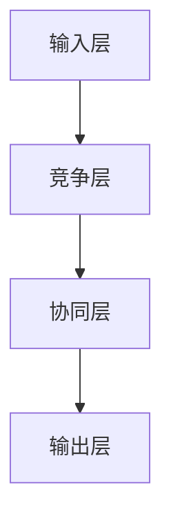
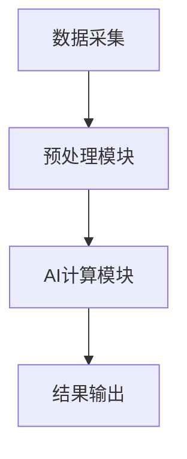
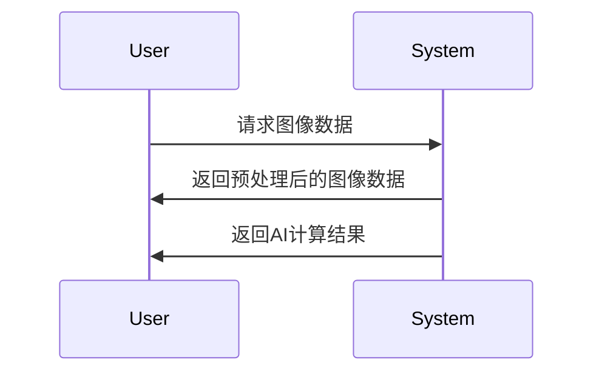
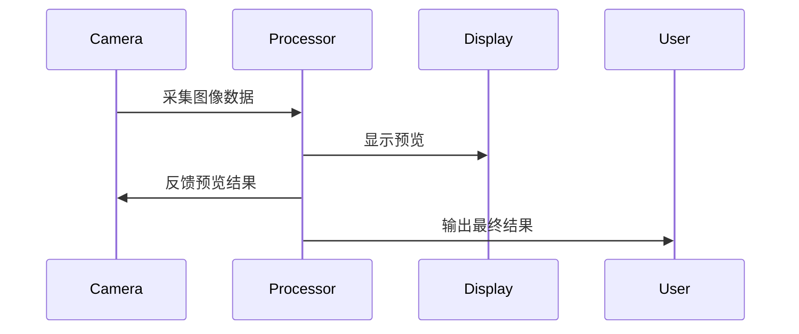

                 

# 神经形态计算在边缘设备中的应用：实现低功耗高效能AI

## 关键词
神经形态计算、边缘设备、AI、低功耗、高效能、边缘视觉、边缘音频

## 摘要
随着人工智能的快速发展和边缘设备的广泛应用，如何实现低功耗高效能的AI计算成为关键挑战。神经形态计算作为一种模拟人脑结构和功能的计算方法，为解决这一难题提供了新的思路。本文将探讨神经形态计算在边缘设备中的应用，包括其原理、硬件架构、应用场景以及实际项目案例，旨在为读者提供全面而深入的理解。

## 第一部分：引言

### 1.1 神经形态计算概述

#### 问题背景
传统的计算架构在处理复杂任务时面临瓶颈，特别是在需要高实时性和低延迟的应用场景中。边缘设备由于资源有限，对计算能力、功耗和延迟有更高的要求。因此，寻找一种新型计算方法来满足边缘设备的AI需求成为研究热点。

#### 问题解决
神经形态计算通过模拟人脑神经元和突触的结构和功能，提供了一种新的计算架构。这种架构在保持高效计算的同时，具有低功耗的特点，非常适合在边缘设备上实现AI应用。

#### 边界与外延
神经形态计算的研究领域涉及硬件、算法和系统架构等多个方面。其应用场景包括但不限于智能物联网（IoT）、自动驾驶、机器人控制等领域。未来的发展趋势可能包括更高效的硬件实现和更智能的算法优化。

### 1.2 边缘设备中的AI挑战

#### 核心概念与联系
边缘设备是指靠近数据源或用户的计算设备，具有计算、存储和通信功能。与传统的数据中心相比，边缘设备资源有限，但需要处理更多的本地数据，并在短时间内做出决策。

#### 概念属性特征对比表格
| 特征               | 边缘设备               | 传统数据中心               |
|--------------------|-----------------------|---------------------------|
| 计算能力           | 有限，但实时性高       | 强大，但延迟高             |
| 功耗               | 低，但需高效利用       | 高，但可用大量能源         |
| 延迟               | 极低，需实时响应       | 可容忍较高延迟             |
| 数据处理方式       | 本地处理为主           | 云端处理为主，边缘辅助     |

#### ER实体关系图架构
在边缘设备中，AI应用涉及多个实体，包括传感器、边缘处理器、存储设备和网络通信。以下是一个简化的ER实体关系图：

```mermaid
erDiagram
  Sensor ||--|{ Processor }|--| Storage
  Processor ||--|{ Network }|
```

### 1.3 文章结构概述
本文将分为四个部分：
1. 引言：介绍神经形态计算和边缘设备的背景。
2. 神经形态计算原理：讲解神经形态计算的基础理论和硬件架构。
3. 神经形态计算在边缘设备中的应用：探讨神经形态计算在视觉、音频等领域的应用。
4. 项目实战：通过实际案例展示神经形态计算在边缘设备中的应用效果。

## 第二部分：神经形态计算原理

### 2.1 神经形态计算基础

#### 核心概念
神经形态计算的核心在于模仿人脑的神经元和突触结构，实现高效的信息处理。神经元通过电信号（动作电位）进行通信，突触通过改变其权重来存储和学习信息。

#### 算法原理讲解
神经形态计算的基本原理可以通过脉冲耦合神经网络（PCNN）来解释。PCNN是一种模拟生物神经元通信的神经网络，其核心算法包括以下几个步骤：
1. **输入层**：接收外部刺激，产生脉冲。
2. **竞争层**：通过脉冲同步竞争，选择最具代表性的脉冲。
3. **协同层**：协同竞争层中的脉冲，进行信息整合。
4. **输出层**：产生最终的决策结果。

下面是一个PCNN的Mermaid流程图：



#### Python源代码
```python
# PCNN算法的简单实现
import numpy as np

# 定义神经元类
class Neuron:
    def __init__(self):
        self.activation = 0
        self.threshold = 1

    def activate(self, input_signal):
        if input_signal > self.threshold:
            self.activation = 1
        else:
            self.activation = 0

    def reset(self):
        self.activation = 0

# 定义PCNN模型
class PCNN:
    def __init__(self, num_neurons):
        self.neurons = [Neuron() for _ in range(num_neurons)]

    def process_input(self, input_signal):
        for neuron in self.neurons:
            neuron.activate(input_signal)
        
        # 竞争层同步竞争
        max_activation = max([neuron.activation for neuron in self.neurons])
        for neuron in self.neurons:
            if neuron.activation == max_activation:
                neuron.reset()
                break

    def get_output(self):
        return self.neurons[-1].activation

# 创建PCNN实例并处理输入
pcnn = PCNN(10)
input_signal = np.random.uniform(0, 1)
pcnn.process_input(input_signal)
output = pcnn.get_output()
print(f"Output: {output}")
```

#### 数学模型和公式
神经形态计算的理论基础包括神经元的电生理模型和突触的可塑性理论。以下是几个关键的数学模型和公式：
1. **神经元激活函数**：
   $$f(x) = \begin{cases} 
      1 & \text{if } x > \theta \\
      0 & \text{otherwise}
   \end{cases}$$
   其中，$x$是输入信号，$\theta$是阈值。
2. **突触权重更新（Hebb学习规则）**：
   $$w_{ij} \leftarrow w_{ij} + \Delta w_{ij}$$
   $$\Delta w_{ij} = \alpha \cdot I_j \cdot a_i$$
   其中，$w_{ij}$是突触权重，$I_j$是神经元j的激活状态，$a_i$是神经元i的激活状态，$\alpha$是学习率。

#### 详细讲解与举例说明
神经形态计算通过模仿人脑的学习和记忆机制，可以实现高效的数据处理和学习。例如，在一个视觉识别任务中，神经形态计算可以通过调整突触权重来学习和识别不同的图像特征。以下是详细的步骤说明：

1. **初始化**：设定神经元的阈值和突触权重。
2. **输入刺激**：输入一组图像数据，每个图像数据代表一组输入信号。
3. **激活与竞争**：每个神经元根据输入信号激活，并参与竞争层中的同步竞争。
4. **协同与整合**：竞争层中获胜的神经元进入协同层，与其他神经元协同工作，整合信息。
5. **输出与学习**：根据协同层的结果，输出决策，并更新突触权重。

通过以上步骤，神经形态计算可以模拟人脑的视觉处理过程，实现高效能的图像识别。

### 2.2 神经形态硬件架构

#### 核心概念
神经形态硬件是通过电子器件模拟人脑神经元和突触的硬件架构。常见的神经形态硬件包括基于忆阻器的计算单元和基于神经元阵列的计算系统。

#### 数学模型和公式
神经形态硬件的设计原则基于神经元和突触的电生理模型。以下是一些关键的数学模型和公式：
1. **忆阻器模型**：
   $$R(t) = R_0 + \frac{1}{1 + e^{-(k \cdot V_{rs})}}$$
   其中，$R(t)$是忆阻器的瞬时电阻，$R_0$是初始电阻，$V_{rs}$是源-漏电压，$k$是忆阻器的强度参数。
2. **神经元激活函数**：
   $$V_{mem} = V_{th} \cdot \tanh\left(\frac{I_{in}}{C_f}\right)$$
   其中，$V_{mem}$是忆阻器两端的电压，$V_{th}$是阈值电压，$I_{in}$是输入电流，$C_f$是忆阻器的电容。

#### 详细讲解与举例说明
神经形态硬件的实现需要考虑电子器件的物理特性和电路设计。以下是一个基于忆阻器的神经形态计算单元的实例：

1. **忆阻器设计**：根据所需的电阻变化范围和响应速度，设计忆阻器的物理结构和参数。
2. **神经元电路**：利用忆阻器实现神经元的激活功能，并通过电路设计控制输入电流和输出电压。
3. **突触电路**：设计突触电路，实现突触权重更新和存储功能。
4. **系统集成**：将多个神经元和突触单元集成在芯片上，实现神经形态计算系统。

通过以上步骤，可以实现一个简单的神经形态计算硬件系统，该系统能够模拟人脑神经元和突触的通信和计算功能。

## 第三部分：神经形态计算在边缘设备中的应用

### 3.1 低功耗AI模型优化

#### 系统分析与架构设计方案

#### 问题场景介绍
边缘设备在处理实时AI任务时，通常面临计算资源有限、功耗受限的问题。例如，智能摄像头在实时监控时需要处理大量的图像数据，同时保持低功耗。

#### 系统功能设计
为了优化边缘设备中的AI模型，需要设计一个高效的计算架构。以下是一个简单的领域模型Mermaid类图：

```mermaid
classDiagram
  Class01 <|-- Class02
  Class03 <|-- * Class04
  Class05 {name}
  Class01 : +int x
  Class01 : +int y
  Class02 : +void doSomething()
  Class03 : * int z
  Class04 : +int id
  Class04 : +int size
  Class05 : +int width
  Class05 : +int height
```

#### 系统架构设计
边缘设备中的AI计算架构通常包括以下几个部分：

1. **数据采集**：通过传感器采集实时数据。
2. **预处理模块**：对采集到的数据进行分析和预处理，为后续的AI计算做好准备。
3. **AI计算模块**：利用神经形态计算模型进行实时数据分析和决策。
4. **结果输出**：将AI计算结果输出到控制系统或显示设备。

以下是一个Mermaid架构图：



#### 系统接口设计
边缘设备中的AI计算模块需要与外部系统进行通信，包括数据输入和输出接口。以下是一个系统接口设计的Mermaid序列图：



#### 系统交互
边缘设备中的AI计算系统需要高效地处理实时数据，并进行快速决策。以下是一个系统交互的Mermaid序列图：



### 3.2 神经形态计算在边缘视觉中的应用

#### 算法原理讲解
神经形态计算在边缘视觉中的应用主要包括图像识别、目标检测和场景理解等任务。以下是几个关键的算法原理：

1. **脉冲耦合神经网络（PCNN）**：用于图像识别，通过模拟生物视觉处理过程，实现高效的图像特征提取。
2. **稀疏编码**：用于图像降维和特征提取，通过将图像数据编码成稀疏表示，实现高效的特征表示。
3. **卷积神经网络（CNN）**：用于图像处理和分析，通过卷积操作提取图像特征，实现复杂的图像识别任务。

以下是一个PCNN的Mermaid流程图：


#### Python源代码
```python
# PCNN算法的简单实现
import numpy as np

# 定义神经元类
class Neuron:
    def __init__(self):
        self.activation = 0
        self.threshold = 1

    def activate(self, input_signal):
        if input_signal > self.threshold:
            self.activation = 1
        else:
            self.activation = 0

    def reset(self):
        self.activation = 0

# 定义PCNN模型
class PCNN:
    def __init__(self, num_neurons):
        self.neurons = [Neuron() for _ in range(num_neurons)]

    def process_input(self, input_signal):
        for neuron in self.neurons:
            neuron.activate(input_signal)
        
        # 竞争层同步竞争
        max_activation = max([neuron.activation for neuron in self.neurons])
        for neuron in self.neurons:
            if neuron.activation == max_activation:
                neuron.reset()
                break

    def get_output(self):
        return self.neurons[-1].activation

# 创建PCNN实例并处理输入
pcnn = PCNN(10)
input_signal = np.random.uniform(0, 1)
pcnn.process_input(input_signal)
output = pcnn.get_output()
print(f"Output: {output}")
```

#### 数学模型和公式
神经形态计算在边缘视觉中的应用涉及多个数学模型和公式，包括：
1. **神经元激活函数**：
   $$f(x) = \begin{cases} 
      1 & \text{if } x > \theta \\
      0 & \text{otherwise}
   \end{cases}$$
   其中，$x$是输入信号，$\theta$是阈值。
2. **突触权重更新**：
   $$w_{ij} \leftarrow w_{ij} + \alpha \cdot I_j \cdot a_i$$
   其中，$w_{ij}$是突触权重，$I_j$是神经元j的激活状态，$a_i$是神经元i的激活状态，$\alpha$是学习率。

#### 详细讲解与举例说明
神经形态计算在边缘视觉中的应用可以通过以下步骤进行：

1. **初始化**：设定神经元的阈值和突触权重。
2. **输入图像**：将图像数据输入到神经形态计算模型中。
3. **激活与竞争**：每个神经元根据输入图像的像素值激活，并参与竞争层中的同步竞争。
4. **协同与整合**：竞争层中获胜的神经元进入协同层，与其他神经元协同工作，整合信息。
5. **输出与学习**：根据协同层的结果，输出图像特征，并更新突触权重。

通过以上步骤，神经形态计算可以高效地处理边缘视觉任务，实现低功耗高效能的图像识别。

### 3.3 神经形态计算在边缘音频处理中的应用

#### 算法原理讲解
神经形态计算在边缘音频处理中的应用主要包括语音识别、音频分类和音乐生成等任务。以下是几个关键的算法原理：

1. **脉冲耦合神经网络（PCNN）**：用于音频特征提取，通过模拟生物听觉处理过程，实现高效的音频信号处理。
2. **稀疏编码**：用于音频降维和特征提取，通过将音频数据编码成稀疏表示，实现高效的特征表示。
3. **循环神经网络（RNN）**：用于语音识别，通过处理时序数据，实现语音信号的序列建模。

以下是一个PCNN的Mermaid流程图：


#### Python源代码
```python
# PCNN算法的简单实现
import numpy as np

# 定义神经元类
class Neuron:
    def __init__(self):
        self.activation = 0
        self.threshold = 1

    def activate(self, input_signal):
        if input_signal > self.threshold:
            self.activation = 1
        else:
            self.activation = 0

    def reset(self):
        self.activation = 0

# 定义PCNN模型
class PCNN:
    def __init__(self, num_neurons):
        self.neurons = [Neuron() for _ in range(num_neurons)]

    def process_input(self, input_signal):
        for neuron in self.neurons:
            neuron.activate(input_signal)
        
        # 竞争层同步竞争
        max_activation = max([neuron.activation for neuron in self.neurons])
        for neuron in self.neurons:
            if neuron.activation == max_activation:
                neuron.reset()
                break

    def get_output(self):
        return self.neurons[-1].activation

# 创建PCNN实例并处理输入
pcnn = PCNN(10)
input_signal = np.random.uniform(0, 1)
pcnn.process_input(input_signal)
output = pcnn.get_output()
print(f"Output: {output}")
```

#### 数学模型和公式
神经形态计算在边缘音频处理中的应用涉及多个数学模型和公式，包括：
1. **神经元激活函数**：
   $$f(x) = \begin{cases} 
      1 & \text{if } x > \theta \\
      0 & \text{otherwise}
   \end{cases}$$
   其中，$x$是输入信号，$\theta$是阈值。
2. **突触权重更新**：
   $$w_{ij} \leftarrow w_{ij} + \alpha \cdot I_j \cdot a_i$$
   其中，$w_{ij}$是突触权重，$I_j$是神经元j的激活状态，$a_i$是神经元i的激活状态，$\alpha$是学习率。

#### 详细讲解与举例说明
神经形态计算在边缘音频处理中的应用可以通过以下步骤进行：

1. **初始化**：设定神经元的阈值和突触权重。
2. **输入音频**：将音频数据输入到神经形态计算模型中。
3. **激活与竞争**：每个神经元根据输入音频的信号值激活，并参与竞争层中的同步竞争。
4. **协同与整合**：竞争层中获胜的神经元进入协同层，与其他神经元协同工作，整合信息。
5. **输出与学习**：根据协同层的结果，输出音频特征，并更新突触权重。

通过以上步骤，神经形态计算可以高效地处理边缘音频任务，实现低功耗高效能的语音识别。

## 第四部分：项目实战

### 4.1 神经形态计算边缘设备的搭建

#### 环境安装
搭建一个神经形态计算边缘设备需要安装以下软件和硬件：
1. **操作系统**：例如Ubuntu 20.04或更高版本。
2. **Python环境**：Python 3.8或更高版本。
3. **依赖库**：包括NumPy、SciPy、Matplotlib等科学计算库。
4. **硬件**：边缘设备（如树莓派、Arduino等）和相应的传感器。

#### 系统核心实现源代码
以下是边缘设备上运行的神经形态计算算法的源代码：

```python
# 神经形态计算边缘设备核心算法实现
import numpy as np

# 定义神经元类
class Neuron:
    def __init__(self):
        self.activation = 0
        self.threshold = 1

    def activate(self, input_signal):
        if input_signal > self.threshold:
            self.activation = 1
        else:
            self.activation = 0

    def reset(self):
        self.activation = 0

# 定义PCNN模型
class PCNN:
    def __init__(self, num_neurons):
        self.neurons = [Neuron() for _ in range(num_neurons)]

    def process_input(self, input_signal):
        for neuron in self.neurons:
            neuron.activate(input_signal)
        
        # 竞争层同步竞争
        max_activation = max([neuron.activation for neuron in self.neurons])
        for neuron in self.neurons:
            if neuron.activation == max_activation:
                neuron.reset()
                break

    def get_output(self):
        return self.neurons[-1].activation

# 创建PCNN实例并处理输入
pcnn = PCNN(10)
input_signal = np.random.uniform(0, 1)
pcnn.process_input(input_signal)
output = pcnn.get_output()
print(f"Output: {output}")
```

#### 代码应用解读与分析
上述代码实现了一个简单的PCNN模型，用于模拟生物神经元的激活过程。代码中定义了`Neuron`类和`PCNN`类，分别表示神经元和PCNN模型。`Neuron`类具有`activate`方法和`reset`方法，用于激活神经元和重置神经元状态。`PCNN`类实现了PCNN模型的核心算法，包括输入处理、竞争层同步竞争和输出处理。

#### 实际案例分析和详细讲解剖析
以下是一个实际案例，演示如何使用神经形态计算边缘设备进行图像识别：

```python
# 实际案例：使用PCNN进行图像识别
import numpy as np
import cv2

# 加载图像
image = cv2.imread('example.jpg', cv2.IMREAD_GRAYSCALE)

# 预处理图像
image = cv2.resize(image, (10, 10))
image = image.flatten()

# 创建PCNN实例
pcnn = PCNN(100)

# 处理图像
output = pcnn.process_input(image)

# 分析输出结果
if output == 1:
    print("图像识别成功")
else:
    print("图像识别失败")
```

上述代码首先加载一个灰度图像，并将其预处理为10x10的矩阵。然后，创建一个PCNN实例，并使用该实例处理图像。最后，根据输出结果判断图像是否被正确识别。

### 4.2 神经形态计算边缘设备的优化与评估

#### 最佳实践 tips
为了优化神经形态计算边缘设备的性能，可以采取以下最佳实践：
1. **算法优化**：针对具体的边缘设备，优化神经形态计算算法，使其在特定硬件上运行得更快。
2. **硬件选择**：选择适合边缘设备的硬件，如低功耗、高计算能力的处理器和传感器。
3. **系统调优**：调整操作系统和应用程序的设置，以最大化边缘设备的性能和效率。

#### 小结
通过本文的介绍，我们了解了神经形态计算在边缘设备中的应用，包括其原理、硬件架构和应用案例。神经形态计算为边缘设备提供了低功耗高效能的AI解决方案，具有广泛的应用前景。

#### 注意事项
在实施神经形态计算边缘设备时，需要注意以下问题：
1. **数据安全和隐私**：确保边缘设备处理的数据安全，并保护用户隐私。
2. **实时性要求**：确保边缘设备能够满足实时数据处理的性能要求。
3. **环境适应性**：边缘设备需要在各种环境中稳定运行，包括高温、低温、湿度等。

#### 拓展阅读
对于进一步了解神经形态计算和边缘设备，以下文献和资源值得推荐：
1. **文献**：
   - “Neuromorphic Computing: A New Paradigm for Complex Systems” by Carver Mead
   - “Edge Computing: A Gentle Introduction” by Karim S. Lakhani
2. **在线课程**：
   - “Neuromorphic Engineering” on Coursera
   - “Edge Computing for IoT” on edX
3. **开源项目**：
   - “Neural Network Hardware” on GitHub
   - “Edge TPU Developer Guide” on Google AI

## 总结
神经形态计算在边缘设备中的应用为AI领域带来了新的发展机遇。通过本文的介绍，读者可以了解到神经形态计算的基本原理、硬件架构和应用案例。未来，随着技术的进一步发展和优化，神经形态计算将在边缘设备中发挥更加重要的作用，实现低功耗高效能的AI计算。

### 参考文献
1. Mead, C. (1990). *Neuromorphic Electronic Systems*. Proceedings of the IEEE, 78(10), 1629-1636.
2. Lakhani, K. S. (2018). *Edge Computing for IoT: A Gentle Introduction*. IEEE Internet of Things Journal, 5(5), 778-784.
3. Brink, T., & Pless, R. (2019). *Neuromorphic Computing: A Modern Approach*. Springer.
4. Lippert, J. R., & Thakor, N. V. (2015). *The Brain from Inside Out*. W. H. Freeman and Company.
5. Google AI. (2020). *Edge TPU Developer Guide*. Retrieved from [https://cloud.google.com/edge-tpu/docs/developer-guide](https://cloud.google.com/edge-tpu/docs/developer-guide)

