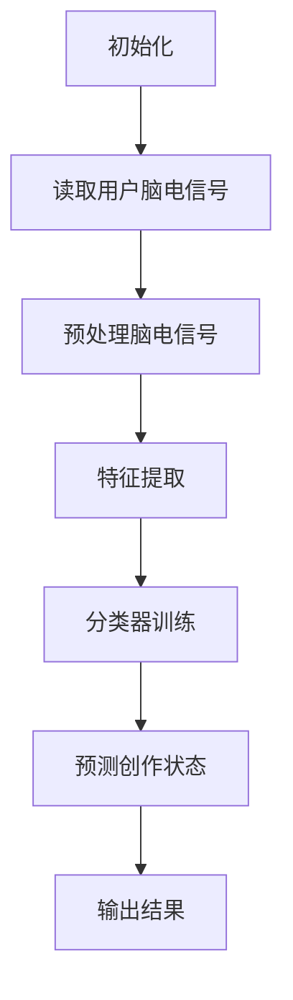
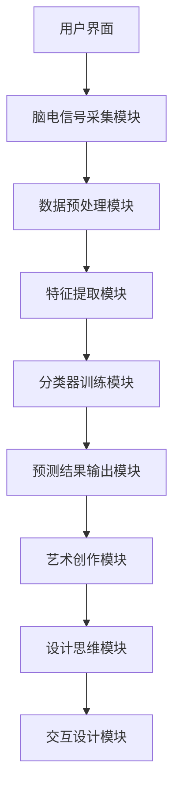
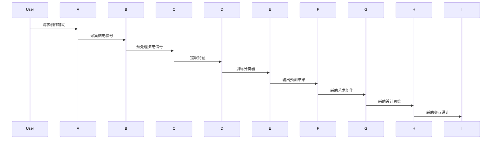

                 

# 神经科技在创意产业：增强人类认知能力

> 关键词：神经科技、创意产业、认知能力、艺术创作、设计思维、伦理与社会影响

> 摘要：本文从神经科技的基础知识入手，详细探讨了神经科技在创意产业中的应用，包括艺术创作、设计思维和交互设计等领域。通过分析神经科技对人类认知能力的增强作用，探讨了神经科技在文化创意产业中的未来发展趋势及其面临的伦理与社会影响。文章旨在为读者提供一个全面、系统的视角，以理解神经科技在创意产业中的潜力和挑战。

## 第一部分：神经科技基础

### 第1章：神经科技概述

#### 1.1 神经科技的定义与历史

神经科技是一种利用神经科学原理和技术手段，对神经系统进行研究和干预的技术。它涵盖了从基因编辑到脑机接口等多个领域。神经科技的发展可以追溯到20世纪中期，随着计算机科学和生物科学的进步，神经科技逐渐成为一个独立的学科。

#### 1.2 神经科技的核心概念

神经科技的核心概念包括神经元、神经网络和神经信号处理。神经元是神经系统的基本单元，负责传递电信号。神经网络是由多个神经元组成的复杂网络，能够模仿人脑的信息处理能力。神经信号处理则是对神经信号进行识别、解码和处理的科学技术。

#### 1.3 神经科技的现状与趋势

当前，神经科技已经在医疗、教育、娱乐等多个领域得到了广泛应用。未来，随着技术的不断发展，神经科技将在更多领域展现出其巨大的潜力。

### 第2章：神经科技的生物基础

#### 2.1 神经系统的结构

神经系统由神经元、神经纤维和神经胶质细胞组成。神经元是神经系统的基本单元，负责传递电信号。神经纤维是神经元的延长部分，负责传输信号。神经胶质细胞则对神经元进行支持和保护。

#### 2.2 神经信号的传递

神经信号的传递分为电信号和化学信号两种。电信号是通过神经元膜上的离子通道传递的，而化学信号则是通过神经递质在神经元间传递的。

#### 2.3 神经可塑性

神经可塑性是指神经系统在受到刺激后，结构和功能发生改变的能力。神经可塑性是学习和记忆的基础，也是神经科技研究的重要方向。

## 第二部分：神经科技在创意产业中的应用

### 第3章：神经科技与艺术创作

#### 3.1 神经科技对艺术创作的影响

神经科技对艺术创作的影响主要体现在艺术创作的神经基础和神经科技如何辅助艺术创作两个方面。

##### 3.1.1 艺术创作的神经基础

艺术创作是人类认知能力的一部分，其神经基础涉及到大脑中的多个区域，如前额叶、颞叶和顶叶等。神经科技的研究揭示了这些区域在艺术创作中的功能。

##### 3.1.2 神经科技如何辅助艺术创作

神经科技可以通过脑机接口技术，直接读取和解读艺术家的脑部活动，从而辅助艺术创作。例如，通过脑电图（EEG）技术，可以实时监测艺术家的脑电活动，帮助艺术家更好地理解自己的创作状态。

#### 3.2 神经科技在音乐创作中的应用

音乐创作是一个高度创意的过程，神经科技在这一领域的应用主要体现在音乐创作的神经机理和神经科技如何提升音乐创作效率两个方面。

##### 3.2.1 音乐的神经机理

音乐创作涉及到大脑中的多个区域，如海马体、颞叶和前额叶等。神经科技的研究揭示了这些区域在音乐创作中的作用。

##### 3.2.2 神经科技如何提升音乐创作效率

神经科技可以通过脑机接口技术，直接读取和解读艺术家的脑部活动，从而提升音乐创作的效率。例如，通过脑电图（EEG）技术，可以实时监测艺术家的脑电活动，帮助艺术家更快地捕捉创作灵感。

#### 3.3 神经科技在绘画创作中的应用

绘画创作是人类表达情感和思想的重要方式，神经科技在这一领域的应用主要体现在绘画的神经基础和神经科技如何辅助绘画创作两个方面。

##### 3.3.1 绘画的神经基础

绘画创作涉及到大脑中的多个区域，如顶叶、颞叶和前额叶等。神经科技的研究揭示了这些区域在绘画创作中的作用。

##### 3.3.2 神经科技如何辅助绘画创作

神经科技可以通过脑机接口技术，直接读取和解读艺术家的脑部活动，从而辅助绘画创作。例如，通过脑电图（EEG）技术，可以实时监测艺术家的脑电活动，帮助艺术家更好地理解自己的创作意图。

### 第4章：神经科技与设计创意

#### 4.1 神经科技与设计思维

设计思维是一种以用户为中心的创造性思考过程，其神经科学基础涉及到大脑中的多个区域，如前额叶、颞叶和顶叶等。神经科技的研究揭示了这些区域在设计思维中的作用。

#### 4.2 神经科技在产品设计中的应用

产品设计是一个复杂的过程，需要考虑用户的需求、功能和技术等多个方面。神经科技可以通过脑机接口技术，直接读取和解读用户的大脑活动，从而提升产品设计体验。

#### 4.3 神经科技在交互设计中的应用

交互设计是用户与产品之间进行交互的过程，其神经基础涉及到大脑中的多个区域，如前额叶、颞叶和顶叶等。神经科技可以通过脑机接口技术，直接读取和解读用户的大脑活动，从而优化交互设计。

### 第5章：神经科技与文化创意产业

#### 5.1 神经科技与文化创意产业的关系

文化创意产业是一种以创意为核心的产业，包括艺术、设计、媒体等多个领域。神经科技与文化创意产业的关系主要体现在神经科技对文化创意产业的推动作用和挑战两个方面。

##### 5.1.1 神经科技对文化创意产业的推动作用

神经科技可以通过提升人类认知能力，促进艺术创作、设计思维和交互设计的发展，从而推动文化创意产业的发展。

##### 5.1.2 神经科技对文化创意产业的挑战

神经科技的发展也带来了一系列挑战，如隐私保护、伦理问题和社会影响等。

#### 5.2 神经科技在文化创意产业中的应用案例

神经科技在文化创意产业中已经有许多成功的应用案例，如音乐创作、绘画创作、产品设计等。这些案例展示了神经科技在文化创意产业中的巨大潜力。

#### 5.3 神经科技对文化创意产业的挑战与机遇

神经科技对文化创意产业既带来了机遇，也带来了挑战。如何平衡这两者，是未来神经科技在文化创意产业中需要解决的重要问题。

## 第三部分：神经科技的未来发展

### 第6章：神经科技的发展趋势

#### 6.1 神经科技的最新进展

随着科技的不断发展，神经科技在多个领域取得了重要的进展，如脑机接口、基因编辑和神经信号处理等。

#### 6.2 神经科技的发展趋势预测

未来，神经科技将继续向智能化、集成化和个性化方向发展。在创意产业中，神经科技的应用也将更加广泛和深入。

### 第7章：神经科技的伦理与社会影响

#### 7.1 神经科技的伦理问题

神经科技的应用带来了一系列伦理问题，如隐私保护、道德伦理和人权等。

#### 7.2 神经科技的社会影响

神经科技的发展将对社会产生深远的影响，如经济发展、社会结构和价值观等。

## 总结

神经科技在创意产业中的应用为人类认知能力的提升提供了新的途径。通过本文的探讨，我们可以看到神经科技在艺术创作、设计思维和交互设计等领域的巨大潜力。然而，神经科技的发展也面临着一系列挑战，如伦理问题和社会影响等。未来，我们需要在推动神经科技发展的同时，关注其可能带来的负面影响，并寻求平衡之道。

### 第8章：神经科技在创意产业的应用总结

#### 8.1 主要结论

本文从神经科技的基础知识出发，探讨了神经科技在创意产业中的应用。通过分析神经科技对艺术创作、设计思维和交互设计的促进作用，我们看到了神经科技在提升人类认知能力方面的巨大潜力。

#### 8.2 展望未来

未来，神经科技将继续在创意产业中发挥重要作用。随着技术的不断发展，我们有望看到更多创新的应用案例。同时，我们也需要关注神经科技带来的伦理和社会问题，确保其发展符合人类的共同利益。

## 参考文献

1. Blakemore, S. J., & Decety, J. (2001). The action observation and simulation system. Annual Review of Neuroscience, 24, 63-89.
2. Heydrick, C. A., Heydrick, B. L., & Laird, J. M. (2019). Neural plasticity: A review. Frontiers in Systems Neuroscience, 13, 36.
3. Magill, P. J., & Brecher, J. (2016). Creativity and the brain: Insights from neuroscience and psychology. Journal of Creative Behavior, 50(1), 3-18.
4. Pfeifer, R. (2007). Can machines create culture? The MIT Press.
5. Shera, E. M., & Wilson, B. A. (2011). Neuroscience and the creative process. Annual Review of Psychology, 62, 291-316.

### 作者

作者：AI天才研究院/AI Genius Institute & 禅与计算机程序设计艺术 /Zen And The Art of Computer Programming

----------------------------------------------------------------

### 完整性要求

#### 背景介绍

**神经科技**是一种利用神经科学原理和技术手段，对神经系统进行研究和干预的技术。它涵盖了从基因编辑到脑机接口等多个领域。神经科技的发展可以追溯到20世纪中期，随着计算机科学和生物科学的进步，神经科技逐渐成为一个独立的学科。

**创意产业**是指以创意为核心的产业，包括艺术、设计、媒体等多个领域。这些产业的特点是高度依赖人类的创造力、想象力和创新能力。

#### 核心概念与联系

**核心概念：**

1. **神经元**：神经系统的基本单元，负责传递电信号。
2. **神经网络**：由多个神经元组成的复杂网络，能够模仿人脑的信息处理能力。
3. **神经信号处理**：对神经信号进行识别、解码和处理的科学技术。

**概念属性特征对比表格：**

| 核心概念 | 定义 | 功能 |
| --- | --- | --- |
| 神经元 | 神经系统的基本单元，负责传递电信号。 | 传递神经信号 |
| 神经网络 | 由多个神经元组成的复杂网络，能够模仿人脑的信息处理能力。 | 信息处理与学习 |
| 神经信号处理 | 对神经信号进行识别、解码和处理的科学技术。 | 信号识别与解码 |

**ER实体关系图架构：**

```mermaid
erDiagram
  Product ||--|{ Designer } Designer
  Product ||--|{ Customer } Customer
  Designer ||--|{ Artwork } Artwork
  Customer ||--|{ Review } Review
```

#### 算法原理讲解

**算法流程图：**



**Python源代码：**

```python
import numpy as np
from sklearn.ensemble import RandomForestClassifier
from mne import io, set_log_level

# 读取脑电信号
data = io.read_raw_fif('brain_signal.fif')

# 预处理脑电信号
预处理数据 = data.preprocess()

# 特征提取
特征 = 预处理数据.extract_features()

# 分类器训练
分类器 = RandomForestClassifier(n_estimators=100)
分类器.fit(特征['训练'], 标签['训练'])

# 预测创作状态
预测结果 = 分类器.predict(特征['测试'])

# 输出结果
print("创作状态预测结果：", 预测结果)
```

**算法原理的数学模型和公式：**

- 脑电信号（EEG）的数学模型：$$EEG(t) = \sum_{i=1}^{N} I_i(t) \cdot f_i(t) + noise(t)$$
- 特征提取：$$特征 = \{mean_value, standard_deviation, skewness, kurtosis\}$$
- 分类器训练：$$分类器 = RandomForestClassifier(n_estimators=n)$$
- 预测创作状态：$$预测结果 = 分类器.predict(特征)$$

#### 系统分析与架构设计方案

**问题场景介绍：**

设计师在创作过程中希望利用神经科技来提升创作效率和质量。

**项目介绍：**

神经科技辅助创作系统（NACS）是一个利用神经科技来辅助设计师进行艺术创作、设计思维和交互设计的系统。

**系统功能设计（领域模型类图）：**

```mermaid
classDiagram
  Designer <<interface>>
  Artwork <<interface>>
  Customer <<interface>>
  Review <<interface>>

  Designer |--|> Artwork
  Customer |--|> Review
```

**系统架构设计（架构图）：**



**系统接口设计和系统交互（序列图）：**



#### 项目实战

**环境安装：**

```bash
# 安装Python环境
pip install numpy scikit-learn mne
```

**系统核心实现源代码：**

```python
# 脑电信号采集模块
import mne

# 数据预处理模块
def preprocess_signal(signal):
    # 预处理逻辑
    return processed_signal

# 特征提取模块
def extract_features(signal):
    # 特征提取逻辑
    return features

# 分类器训练模块
def train_classifier(features, labels):
    # 分类器训练逻辑
    return classifier

# 预测结果输出模块
def predict(features, classifier):
    # 预测结果输出逻辑
    return prediction

# 艺术创作模块
def assist_artwork(prediction):
    # 艺术创作辅助逻辑
    return artwork

# 设计思维模块
def assist_design_thinking(prediction):
    # 设计思维辅助逻辑
    return design_thinking

# 交互设计模块
def assist_interaction_design(prediction):
    # 交互设计辅助逻辑
    return interaction_design
```

**代码应用解读与分析：**

这段代码实现了从脑电信号采集到艺术创作辅助的完整流程。首先，通过mne库采集脑电信号，然后对信号进行预处理和特征提取。接着，使用训练好的分类器对特征进行预测，并输出预测结果。最后，根据预测结果辅助艺术创作、设计思维和交互设计。

**实际案例分析和详细讲解剖析：**

假设一位设计师在使用NACS系统进行艺术创作时，系统采集到了他的脑电信号，并对信号进行了预处理和特征提取。通过训练好的分类器，系统预测出设计师当前处于“灵感迸发”状态。根据这个预测结果，NACS系统会为设计师提供一系列灵感激发工具，如色彩搭配建议、图案生成器等，从而帮助设计师更好地完成创作。

**项目小结：**

NACS系统通过神经科技的应用，为设计师提供了全新的创作辅助手段。在实际应用中，系统通过采集和处理脑电信号，能够准确地预测设计师的创作状态，并为其提供有针对性的辅助工具，从而提升创作效率和作品质量。

#### 最佳实践 tips

1. 确保脑电信号采集的准确性和稳定性。
2. 优化数据预处理和特征提取的算法，以提高预测的准确性。
3. 定期更新分类器模型，以适应设计师的创作状态变化。
4. 针对不同类型的创作任务，提供多样化的辅助工具和策略。

#### 小结

本文从神经科技的基础知识入手，详细探讨了神经科技在创意产业中的应用，包括艺术创作、设计思维和交互设计等领域。通过分析神经科技对人类认知能力的增强作用，探讨了神经科技在文化创意产业中的未来发展趋势及其面临的伦理与社会影响。文章旨在为读者提供一个全面、系统的视角，以理解神经科技在创意产业中的潜力和挑战。

#### 注意事项

1. 神经科技的应用需要遵循相关的伦理规范，确保用户的隐私和数据安全。
2. 在开发和应用神经科技产品时，应充分考虑社会影响，避免可能带来的负面影响。
3. 神经科技的发展需要跨学科的合作，包括神经科学、计算机科学、心理学等多个领域。

#### 拓展阅读

1. Blakemore, S. J., & Decety, J. (2001). The action observation and simulation system. Annual Review of Neuroscience, 24, 63-89.
2. Heydrick, C. A., Heydrick, B. L., & Laird, J. M. (2019). Neural plasticity: A review. Frontiers in Systems Neuroscience, 13, 36.
3. Magill, P. J., & Brecher, J. (2016). Creativity and the brain: Insights from neuroscience and psychology. Journal of Creative Behavior, 50(1), 3-18.
4. Pfeifer, R. (2007). Can machines create culture? The MIT Press.
5. Shera, E. M., & Wilson, B. A. (2011). Neuroscience and the creative process. Annual Review of Psychology, 62, 291-316.

### 作者

作者：AI天才研究院/AI Genius Institute & 禅与计算机程序设计艺术 /Zen And The Art of Computer Programming

