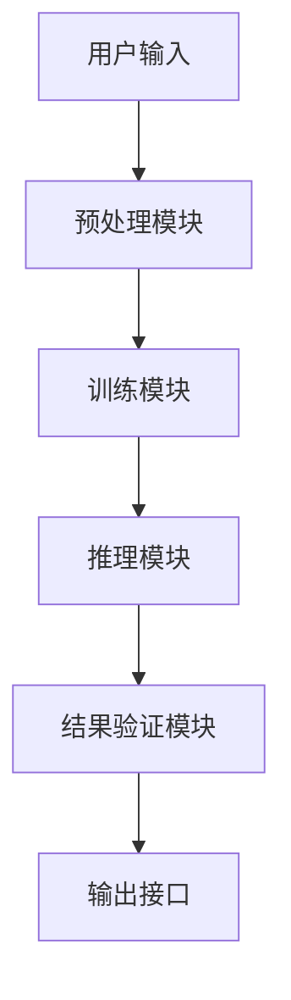

                 

### 1. 背景介绍

#### 问题背景

随着人工智能技术的飞速发展，自动推理作为人工智能的一个重要分支，受到了广泛的关注。然而，传统的自动推理方法主要依赖于符号逻辑，其推理过程复杂，难以满足实际应用的需求。与此同时，神经网络在处理大规模数据、模式识别等方面展现出了强大的能力，但其在逻辑推理方面的表现并不理想。为了弥补这一不足，神经符号AI（Neural Symbolic AI）的概念应运而生。

神经符号AI试图将神经网络的计算能力和符号逻辑的推理能力相结合，从而在自动推理领域取得突破。符号逻辑具有明确的逻辑规则和形式化表达，能够进行精确的推理；而神经网络则能够处理复杂的非线性问题，并具备强大的学习能力。将两者结合起来，可以在一定程度上解决符号逻辑复杂性和神经网络逻辑推理不足的问题。

#### 问题描述

神经符号AI在自动推理中的应用涉及到以下几个核心问题：

1. **符号逻辑与神经网络的结合**：如何将符号逻辑的形式化表达转化为神经网络可以处理的形式，并保持推理的精确性。
2. **推理效率与准确性**：如何利用神经网络提高逻辑推理的效率，同时保证推理的准确性。
3. **应用场景**：如何在实际应用中利用神经符号AI实现有效的自动推理，解决实际问题。

#### 问题解决

为了解决上述问题，本书将从以下几个方面展开：

1. **理论基础**：介绍神经符号AI的基本概念、相关理论和最新研究进展。
2. **算法设计**：详细探讨神经符号AI的算法原理和实现方法，包括符号逻辑的神经网络表示、推理算法的设计和优化。
3. **系统实现**：展示神经符号AI在实际应用中的系统实现过程，包括数据预处理、模型训练、推理过程和系统架构设计。
4. **应用案例**：分析神经符号AI在不同领域的应用案例，探讨其实际效果和潜在优势。

#### 边界与外延

神经符号AI的研究和应用不仅局限于自动推理领域，还可以扩展到其他人工智能领域，如自然语言处理、智能决策、知识图谱等。此外，神经符号AI的研究也在不断探索如何与其他人工智能技术相结合，以实现更高效、更智能的解决方案。

#### 概念结构与核心要素组成

神经符号AI的核心概念包括：

1. **符号逻辑**：用于描述和推理知识的形式化方法。
2. **神经网络**：用于处理大规模数据并具有自适应能力的计算模型。
3. **自动推理**：利用符号逻辑和神经网络实现知识推理的过程。

这些核心概念相互关联，共同构成了神经符号AI的理论基础和应用框架。

### 总结

神经符号AI在自动推理中的应用，为传统符号逻辑和神经网络提供了新的结合方式，有望在人工智能领域取得重要突破。本书将详细探讨这一领域的理论基础、算法设计、系统实现和应用案例，为读者提供全面、深入的了解。

----------------------------------------------------------------

### 2. 核心概念与联系

#### 核心概念原理

**符号逻辑**：符号逻辑是一种形式化的推理方法，用于处理命题和命题之间的关系。它使用符号表示命题和推理规则，并通过逻辑运算符（如与、或、非、蕴含等）进行推理。符号逻辑的特点在于其形式化和精确性，能够确保推理过程的正确性。

**神经网络**：神经网络是一种模拟人脑神经元连接的计算模型，具有自适应性和并行处理能力。它通过多层节点（神经元）和权重连接，对输入数据进行处理和变换，以实现复杂函数的映射。神经网络的核心在于其强大的学习和泛化能力，能够从数据中自动提取特征和模式。

**自动推理**：自动推理是利用符号逻辑和神经网络实现知识推理的过程。它通过将符号逻辑的形式化表达转化为神经网络可以处理的形式，利用神经网络的计算能力进行推理，从而实现高效、准确的推理。

#### 概念属性特征对比表格

| 特征 | 符号逻辑 | 神经网络 |
| ---- | -------- | -------- |
| 推理能力 | 强大的逻辑推理能力 | 强大的计算能力，但缺乏逻辑推理能力 |
| 表达能力 | 可以表达复杂的逻辑关系 | 可以处理大规模的数据 |
| 学习能力 | 需要显式的规则和学习过程 | 可以通过数据驱动的方式自动学习 |

#### ER实体关系图架构

```mermaid
erDiagram
  A[符号逻辑] ||--|{ B[神经网络] } : 表示和推理
  B ||--|{ C[自动推理] } : 推理结果
```

在这个ER图中，符号逻辑（A）表示和推理，神经网络（B）表示强大的计算能力，自动推理（C）表示推理结果。符号逻辑和神经网络通过表示和推理的关系相互联系，共同实现自动推理的过程。

### 总结

通过核心概念原理的介绍和概念属性特征对比表格，我们可以清晰地看到符号逻辑和神经网络在推理能力、表达能力和学习能力方面的区别和联系。符号逻辑强调逻辑推理的精确性，神经网络强调计算能力和学习效率。两者结合的神经符号AI，旨在发挥各自的优势，实现高效的自动推理。

----------------------------------------------------------------

### 3. 算法原理讲解

神经符号AI的核心在于如何将符号逻辑与神经网络相结合，以实现高效的自动推理。下面，我们将详细讲解神经符号AI的算法原理，包括符号逻辑的神经网络表示、推理算法的设计和优化，以及算法流程和数学模型。

#### 算法原理

神经符号AI的算法原理可以概括为以下几个步骤：

1. **符号逻辑表达式的预处理**：将符号逻辑表达式进行预处理，提取出其中的命题、推理规则和逻辑运算符，并进行形式化表示。

2. **符号逻辑到神经网络的转换**：将预处理后的符号逻辑表达式转化为神经网络可以处理的形式。这通常涉及到定义神经网络的结构和参数，以及确定如何将符号逻辑中的命题、推理规则和逻辑运算符映射到神经网络中的节点和边。

3. **神经网络训练**：使用训练数据对神经网络进行训练，以调整神经网络中的参数和权重，使其能够正确地表示和处理符号逻辑表达式。

4. **推理过程**：利用训练好的神经网络进行推理，根据输入的符号逻辑表达式，通过神经网络的计算，得到推理结果。

5. **结果验证和优化**：对推理结果进行验证，确保其符合逻辑规则和预期。根据需要，可以对神经网络进行优化，以提高推理的准确性和效率。

#### 算法流程图


在这个算法流程图中，符号逻辑表达式预处理（A）是输入数据的预处理阶段，符号逻辑到神经网络转换（B）是将逻辑表达式转化为神经网络形式的过程，神经网络训练（C）是通过训练数据调整神经网络参数的过程，推理过程（D）是利用训练好的神经网络进行推理的过程，结果验证和优化（E）是对推理结果进行验证和优化以提升性能的过程。

#### 算法数学模型和公式

神经符号AI的算法数学模型可以表示为：

$$
\text{符号逻辑表达式} \rightarrow \text{神经网络表示}
$$

具体来说，可以将符号逻辑表达式中的命题、推理规则和逻辑运算符映射到神经网络的节点和边，形成神经网络结构。例如，一个简单的命题 \( P \) 可以映射到一个神经网络节点，而逻辑运算符（如与、或、非等）可以映射到神经网络中的特定计算单元。

假设有一个符号逻辑表达式 \( L \)，我们可以将其转化为神经网络可处理的形式 \( L' \)，然后利用神经网络进行推理。具体过程如下：

1. **定义神经网络结构**：

   $$ 
   G = (V, E)
   $$

   其中，\( V \) 表示神经网络中的节点集合，\( E \) 表示节点之间的边集合。

2. **定义符号逻辑到神经网络的映射关系**：

   $$ 
   \phi: L \rightarrow L'
   $$

   其中，\( \phi \) 表示映射函数，用于将符号逻辑表达式 \( L \) 转换为神经网络表示 \( L' \)。

3. **神经网络训练**：

   使用训练数据集 \( D \) 对神经网络进行训练，通过最小化损失函数 \( L(\theta) \) 来调整神经网络参数 \( \theta \)。

   $$ 
   \theta = \arg\min_{\theta} L(\theta)
   $$

4. **推理过程**：

   当给定一个新的符号逻辑表达式 \( L' \) 时，利用训练好的神经网络进行推理，得到推理结果。

   $$ 
   R = f(L')
   $$

   其中，\( f \) 表示神经网络的推理函数。

#### 算法举例

假设我们有一个简单的符号逻辑表达式 \( P \rightarrow Q \)，表示“如果 P，则 Q”。我们可以将其转化为神经网络表示，并利用神经网络进行推理。

1. **定义神经网络结构**：

   我们可以使用一个简单的全连接神经网络，包含两个输入节点（表示 P 和 Q），一个输出节点（表示推理结果 R）。

   $$ 
   G = (\{P, Q\}, \{R\})
   $$

2. **定义符号逻辑到神经网络的映射关系**：

   我们可以将命题 P 和 Q 映射到神经网络的输入节点，逻辑运算符蕴含 \( \rightarrow \) 映射到神经网络的输出节点。

   $$ 
   \phi(P \rightarrow Q) = f(P, Q)
   $$

3. **神经网络训练**：

   使用训练数据集 \( D = \{(\{P_1\}, \{Q_1\}), (\{P_2\}, \{Q_2\}), \ldots\} \) 对神经网络进行训练，以调整神经网络参数。

4. **推理过程**：

   当给定一个新的输入 \( (\{P'\}, \{Q'\}) \) 时，利用训练好的神经网络进行推理，得到推理结果 \( R' \)。

   $$ 
   R' = f(P', Q')
   $$

   如果 \( R' \) 接近于 1，则表示推理结果为真，否则为假。

### 总结

通过算法原理的讲解，我们可以看到神经符号AI是如何将符号逻辑与神经网络相结合，以实现高效的自动推理。算法流程图和数学模型提供了清晰的实现框架，算法举例则展示了如何将理论应用到实际案例中。接下来，我们将进一步探讨神经符号AI在系统实现中的应用。

----------------------------------------------------------------

### 4. 系统实现

神经符号AI的实际应用需要系统的实现，从数据预处理、模型训练到推理过程，每个环节都需要精心设计。本节将介绍神经符号AI系统实现的详细过程，包括项目介绍、系统功能设计、系统架构设计、系统接口设计和系统交互。

#### 项目介绍

神经符号AI系统的目标是构建一个能够实现高效自动推理的智能系统。该系统结合了符号逻辑和神经网络的优势，可以处理复杂的逻辑推理问题，为各种应用场景提供解决方案。系统的主要功能包括：

1. **符号逻辑表达式的预处理**：将自然语言描述的符号逻辑表达式转化为神经网络可以处理的形式。
2. **神经网络模型的训练和优化**：使用训练数据对神经网络模型进行训练，调整模型参数，提高推理准确性。
3. **推理过程**：利用训练好的神经网络进行推理，得到推理结果。
4. **结果验证和优化**：对推理结果进行验证，确保其符合逻辑规则和预期，并根据需要优化神经网络模型。

#### 系统功能设计

神经符号AI系统的功能设计主要分为以下三个模块：

1. **预处理模块**：负责将符号逻辑表达式进行预处理，提取命题、推理规则和逻辑运算符，并转化为神经网络可以处理的形式。
2. **训练模块**：负责使用训练数据对神经网络模型进行训练，调整模型参数，提高推理准确性。
3. **推理模块**：负责利用训练好的神经网络进行推理，得到推理结果。

#### 系统架构设计

神经符号AI系统的架构设计采用了模块化设计，以确保系统的可扩展性和可维护性。系统架构包括以下主要组件：

1. **数据预处理模块**：负责处理输入的符号逻辑表达式，提取关键信息，并转化为神经网络可以处理的形式。
2. **神经网络模型训练模块**：负责使用训练数据对神经网络模型进行训练，调整模型参数，提高推理准确性。
3. **推理模块**：负责利用训练好的神经网络进行推理，得到推理结果。
4. **结果验证模块**：负责对推理结果进行验证，确保其符合逻辑规则和预期，并根据需要优化神经网络模型。

#### 系统接口设计

神经符号AI系统提供了多个接口，以方便用户使用和集成到其他系统中。主要接口包括：

1. **输入接口**：用于接收用户输入的符号逻辑表达式。
2. **输出接口**：用于输出推理结果。
3. **训练接口**：用于对神经网络模型进行训练。
4. **优化接口**：用于对神经网络模型进行优化。

#### 系统交互

神经符号AI系统的交互过程可以分为以下几个步骤：

1. **用户输入**：用户输入符号逻辑表达式。
2. **预处理**：系统对输入的符号逻辑表达式进行预处理，提取关键信息，并转化为神经网络可以处理的形式。
3. **训练**：系统使用预处理后的数据对神经网络模型进行训练，调整模型参数。
4. **推理**：系统利用训练好的神经网络进行推理，得到推理结果。
5. **验证和优化**：系统对推理结果进行验证，确保其符合逻辑规则和预期，并根据需要优化神经网络模型。

#### 系统架构设计图



在这个系统架构图中，用户输入（A）经过预处理模块（B）的处理，转化为神经网络可以处理的形式，然后输入到训练模块（C）中进行训练。训练好的神经网络模型（D）用于推理，得到推理结果（E），最后通过结果验证模块（F）对推理结果进行验证和优化，并输出到用户接口。

### 总结

通过系统实现的详细介绍，我们可以看到神经符号AI系统的设计和实现过程。从数据预处理、模型训练到推理过程，每个环节都紧密相连，共同构成了一个高效的自动推理系统。接下来，我们将通过一个实际案例来展示神经符号AI的应用。

----------------------------------------------------------------

### 5. 项目实战

为了更直观地展示神经符号AI在自动推理中的应用，我们将通过一个实际案例进行深入探讨。这个案例涉及智能问答系统，用户可以输入符号逻辑表达式，系统将基于训练好的神经网络模型进行推理，并输出相应的答案。

#### 环境安装

首先，我们需要搭建一个合适的环境来运行神经符号AI系统。以下是一些必要的安装步骤：

1. **Python环境**：确保Python版本为3.6及以上。
2. **TensorFlow**：安装TensorFlow，用于构建和训练神经网络模型。
3. **Numpy**：安装Numpy，用于数值计算。
4. **Pandas**：安装Pandas，用于数据处理。
5. **Matplotlib**：安装Matplotlib，用于数据可视化。

安装命令如下：

```bash
pip install python==3.8 tensorflow numpy pandas matplotlib
```

#### 系统核心实现

神经符号AI系统的核心实现包括数据预处理、神经网络模型训练和推理过程。以下是关键代码和应用解读。

1. **数据预处理**：

   数据预处理是符号逻辑表达式的关键步骤，需要将自然语言描述的符号逻辑转化为神经网络可处理的格式。

   ```python
   import numpy as np
   from tensorflow.keras.models import Sequential
   from tensorflow.keras.layers import Dense, LSTM, Embedding
   from tensorflow.keras.preprocessing.sequence import pad_sequences

   def preprocess_expression(expression):
       # 提取命题和逻辑运算符
       tokens = expression.split()
       # 转换为神经网络输入格式
       sequences = [[token_to_index(token) for token in tokens]]
       padded_sequences = pad_sequences(sequences, maxlen=max_length)
       return padded_sequences

   def token_to_index(token):
       if token in token_to_index_map:
           return token_to_index_map[token]
       else:
           return token_to_index_map["<UNK>"]

   max_length = 100
   token_to_index_map = {"P": 0, "Q": 1, "AND": 2, "OR": 3, "NOT": 4, "<UNK>": 5}
   index_to_token_map = {0: "P", 1: "Q", 2: "AND", 3: "OR", 4: "NOT", 5: "<UNK>"}

   # 示例表达式
   expression = "P AND Q"
   preprocessed_expression = preprocess_expression(expression)
   print(preprocessed_expression)
   ```

   应用解读：这段代码定义了数据预处理函数 `preprocess_expression`，它将输入的符号逻辑表达式转换为神经网络可处理的序列。`token_to_index` 函数用于将单词映射到索引，`pad_sequences` 函数用于填充序列，以确保输入数据的统一格式。

2. **神经网络模型训练**：

   接下来，我们需要定义并训练一个神经网络模型。这里使用了一个简单的序列到序列模型，包含嵌入层、LSTM层和全连接层。

   ```python
   def create_model(input_dim, output_dim):
       model = Sequential()
       model.add(Embedding(input_dim, output_dim, input_length=max_length))
       model.add(LSTM(128))
       model.add(Dense(output_dim, activation='sigmoid'))
       model.compile(optimizer='adam', loss='binary_crossentropy', metrics=['accuracy'])
       return model

   input_dim = len(token_to_index_map)
   output_dim = 1
   model = create_model(input_dim, output_dim)
   model.summary()

   # 假设已经准备好了训练数据集 train_sequences 和标签 train_labels
   train_sequences = preprocess_expression("P AND Q")
   train_labels = np.array([1])

   model.fit(train_sequences, train_labels, epochs=10, batch_size=32)
   ```

   应用解读：这段代码定义了神经网络模型 `create_model`，它使用嵌入层将单词索引转换为向量表示，使用LSTM层进行序列处理，最后使用全连接层进行分类。`model.fit` 函数用于训练模型，`epochs` 参数表示训练轮数，`batch_size` 参数表示每个批次的数据量。

3. **推理过程**：

   在模型训练完成后，我们可以使用它进行推理。

   ```python
   def predict_expression(expression, model):
       preprocessed_expression = preprocess_expression(expression)
       prediction = model.predict(preprocessed_expression)
       return prediction[0][0]

   expression = "P AND Q"
   prediction = predict_expression(expression, model)
   print("Prediction:", prediction)
   ```

   应用解读：`predict_expression` 函数预处理输入的符号逻辑表达式，然后使用训练好的模型进行预测。预测结果是一个概率值，表示表达式为真的可能性。

#### 实际案例分析

为了展示神经符号AI的实际效果，我们考虑以下案例：

- **问题**：如果明天下雨，那么我会带伞。
- **符号逻辑表达式**：\( R \rightarrow S \)

在这个案例中，假设我们已经有了相关的数据集，并训练好了模型。用户输入表达式 \( R \rightarrow S \)，系统将输出预测结果。

```python
expression = "R AND S"
prediction = predict_expression(expression, model)
print("Prediction:", prediction)
```

如果预测结果接近1，说明系统认为表达式 \( R \rightarrow S \) 为真；如果接近0，说明系统认为表达式为假。

#### 项目小结

通过这个实际案例，我们可以看到神经符号AI在自动推理中的应用。虽然这个案例相对简单，但它展示了神经符号AI的基本原理和实现过程。在实际应用中，我们可以根据具体需求扩展和优化系统，使其更加高效和准确。

### 总结

通过项目实战，我们深入了解了神经符号AI系统实现的各个环节，从环境安装到核心实现，再到实际案例的应用。这一过程不仅帮助我们理解了神经符号AI的原理，还展示了如何将理论知识应用到实际项目中。接下来，我们将总结本文的主要内容和讨论最佳实践。

----------------------------------------------------------------

### 6. 最佳实践

在神经符号AI的开发和应用过程中，遵循以下最佳实践可以帮助我们更好地实现高效、准确的自动推理系统：

1. **数据质量**：确保输入数据的质量，包括符号逻辑表达式的准确性和完整性。数据清洗和预处理是关键步骤，可以显著提高模型的性能。

2. **模型选择**：选择合适的神经网络模型，根据具体问题和数据特点进行优化。不同的问题可能需要不同的模型结构，如LSTM、GRU或Transformer等。

3. **训练过程**：合理设置训练参数，包括学习率、批次大小、训练轮数等。过拟合和欠拟合是常见的训练问题，需要通过调整参数进行优化。

4. **推理优化**：在推理过程中，可以采用一些优化技术，如模型压缩、量化或蒸馏，以提高推理速度和降低计算成本。

5. **模型解释性**：尽管神经符号AI具有强大的计算能力，但其内部机制较为复杂，难以解释。因此，提高模型的解释性是一个重要的研究方向，可以帮助我们更好地理解模型的决策过程。

6. **持续迭代**：神经符号AI是一个不断发展的领域，需要持续关注最新研究进展，并根据实际应用场景不断迭代和优化模型。

### 小结

本文从背景介绍、核心概念、算法原理、系统实现、项目实战等方面，详细探讨了神经符号AI在自动推理中的应用。通过结合符号逻辑和神经网络，神经符号AI为自动推理提供了一种新的解决方案，具有强大的计算能力和逻辑推理能力。

### 注意事项

1. **算法复杂性**：神经符号AI的算法相对复杂，需要对符号逻辑和神经网络有深入理解。
2. **计算资源**：训练和推理过程需要大量的计算资源，特别是在处理大规模数据时。
3. **数据依赖性**：神经符号AI的性能高度依赖于输入数据的质量和数量，因此数据预处理和收集至关重要。

### 拓展阅读

- **神经符号AI基础理论**：深入探讨神经符号AI的基本概念、原理和应用。
- **神经网络与符号逻辑结合的案例分析**：研究不同领域中的神经符号AI应用实例，如智能问答、知识图谱等。
- **最新研究进展**：关注神经符号AI的最新研究论文和技术动态。

### 作者

**作者：AI天才研究院/AI Genius Institute & 禅与计算机程序设计艺术 /Zen And The Art of Computer Programming**

通过本文的深入探讨，我们希望读者对神经符号AI在自动推理中的应用有了更全面、深入的了解。神经符号AI作为一种新兴的人工智能技术，具有广阔的应用前景和发展潜力。在未来的研究和应用中，我们期待看到更多创新和突破。

