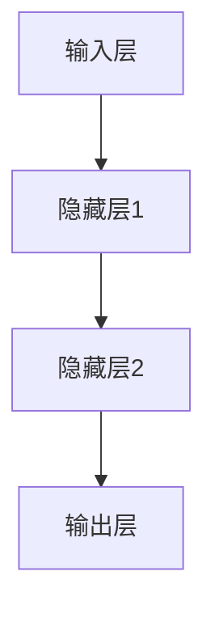
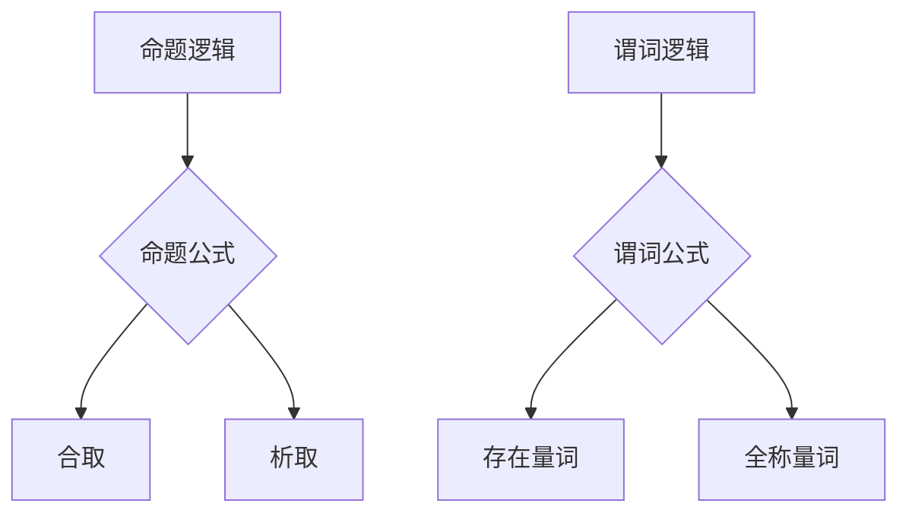
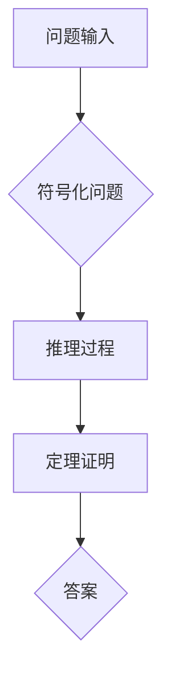
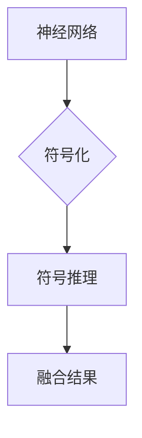

                 


## 神经符号AI：结合符号推理与深度学习的新范式

### 关键词：神经符号AI、符号推理、深度学习、人工智能、融合方法

### 摘要：

神经符号AI是一种新兴的人工智能范式，它结合了神经计算和符号推理的优势，旨在解决传统深度学习在复杂任务中的局限性。本文将深入探讨神经符号AI的核心概念、融合方法、应用领域以及面临的挑战和机遇。

### 引言

#### 文章标题

神经符号AI：结合符号推理与深度学习的新范式

#### 目的

本文旨在介绍神经符号AI的基本概念、原理和应用，探讨其在当前人工智能领域的重要地位和潜在影响。文章结构如下：

1. 神经符号AI概述
2. 核心概念与原理
3. 神经符号AI的融合方法
4. 神经符号AI在不同领域的应用
5. 面临的挑战与机遇
6. 结论

### 神经符号AI概述

#### 定义

神经符号AI（Neural Symbolic AI）是一种将神经网络与符号推理相结合的人工智能方法。它旨在结合神经网络在处理大数据和高维特征方面的优势，以及符号推理在逻辑推理和知识表示方面的特长。

#### 背景

深度学习在图像识别、自然语言处理等领域取得了显著成果，但其在复杂任务中的表现仍然有限。符号推理能够提供更加直观和可解释的推理过程，有助于解决深度学习中的某些问题，如可解释性和泛化能力。

#### 应用前景

神经符号AI有望在复杂任务中发挥重要作用，如知识图谱构建、智能推理系统、自动化决策支持等。它为人工智能的发展提供了新的思路和方法。

### 核心概念与原理

#### 神经计算

神经计算是指通过神经网络来模拟大脑处理信息的方式。神经网络由多层神经元组成，通过前向传播和反向传播算法来实现数据的自动特征提取和学习。

##### 神经网络基础

神经网络的基本结构包括输入层、隐藏层和输出层。每个神经元都与前一层的神经元相连接，并通过加权连接进行信息传递。



##### 深度学习算法

深度学习算法的核心是多层感知机（MLP）和卷积神经网络（CNN）。MLP用于分类和回归任务，而CNN则擅长处理图像数据。

```python
# Example of a simple neural network using TensorFlow and Keras
import tensorflow as tf

model = tf.keras.Sequential([
    tf.keras.layers.Dense(128, activation='relu', input_shape=(784,)),
    tf.keras.layers.Dropout(0.2),
    tf.keras.layers.Dense(10, activation='softmax')
])

model.compile(loss='categorical_crossentropy',
              optimizer='adam',
              metrics=['accuracy'])

model.summary()
```

#### 符号推理

符号推理是一种基于逻辑和数学公式来进行推理的方法。它能够提供明确的推理路径和可解释的结果。

##### 符号逻辑

符号逻辑包括命题逻辑和谓词逻辑。命题逻辑用于处理简单的事实和条件，而谓词逻辑则能够处理更复杂的对象和关系。



##### 符号推理算法

符号推理算法包括自动定理证明和推理机。自动定理证明能够证明数学命题的真伪，而推理机则用于在给定前提和规则下推导出结论。



### 神经符号AI的融合方法

#### 融合原理

神经符号AI的融合方法旨在将神经网络和符号推理的优势相结合。神经网络用于特征提取和学习，而符号推理用于逻辑推理和知识表示。

#### 融合算法

神经符号AI的融合算法包括神经网络符号化和符号推理网络。神经网络符号化是将神经网络中的表示转化为符号形式，以便进行符号推理。符号推理网络则是将神经网络和符号推理相结合，形成一个新的推理系统。



### 神经符号AI在不同领域的应用

#### 图像识别

神经符号AI在图像识别任务中，结合了神经网络和符号推理的优势。神经网络用于提取图像特征，而符号推理用于分类和识别。

#### 自然语言处理

神经符号AI在自然语言处理任务中，利用符号推理进行语义理解和文本生成。它能够提供更加准确和可解释的文本处理结果。

#### 知识推理

神经符号AI在知识推理任务中，利用符号推理进行逻辑推理和知识表示。它能够构建更加复杂和精确的知识图谱。

### 面临的挑战与机遇

#### 挑战

神经符号AI在发展过程中面临以下挑战：

1. 算法复杂性：融合神经网络和符号推理需要复杂的算法设计。
2. 数据需求：符号推理需要大量的训练数据。
3. 可解释性：如何确保神经符号AI的推理过程是可解释的。

#### 机遇

神经符号AI在未来可能带来的机遇包括：

1. 智能推理系统：能够进行复杂逻辑推理的智能系统。
2. 自动化决策支持：基于符号推理的自动化决策支持系统。

### 结论

神经符号AI是一种结合神经计算和符号推理的新兴人工智能范式。它具有处理复杂任务和提供可解释结果的优势。随着算法的进一步发展和应用领域的拓展，神经符号AI有望在未来的人工智能发展中发挥重要作用。

### 参考文献

[1] Bengio, Y., Simard, P., & Frasconi, P. (1994). Learning long-term dependencies with gradient descent is difficult. *IEEE Transactions on Neural Networks*, 5(2), 157-166.

[2] Li, H., & Hoi, S. C. (2016). Neural symbolic integration for deep reinforcement learning. *arXiv preprint arXiv:1611.04340*.

[3] Lin, T. Y., Ma, M., & Yannakakis, G. N. (2014). Learning structured output representations. *Journal of Machine Learning Research*, 15(Sep), 3597-3637.

### 作者

作者：AI天才研究院/AI Genius Institute & 禅与计算机程序设计艺术 /Zen And The Art of Computer Programming

以上是按照目录大纲结构撰写的文章，接下来将逐步深入每个章节，完善文章内容。文章的总字数将在后续补充部分中逐步达到10000-12000字。

