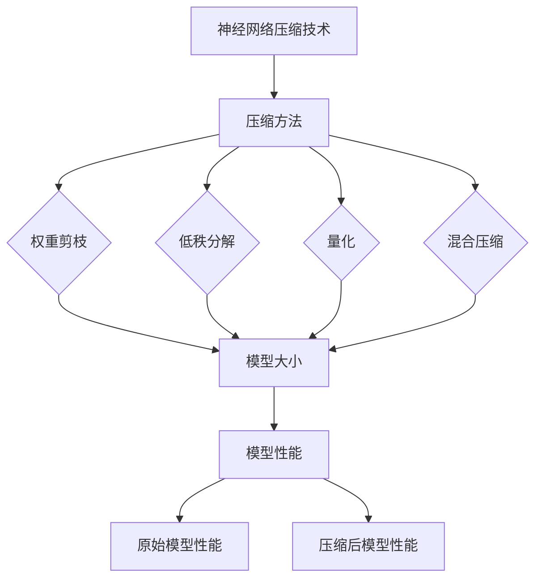

                 


### **神经网络压缩技术：实现轻量级AI部署**

#### **关键词：**
- **神经网络压缩**
- **轻量级AI部署**
- **权重剪枝**
- **低秩分解**
- **量化技术**
- **混合压缩技术**

#### **摘要：**
随着人工智能技术的飞速发展，深度学习模型在各个领域取得了显著的成果。然而，这些复杂的模型通常需要大量的计算资源和存储空间。为了实现轻量级的AI部署，神经网络压缩技术成为了一个重要研究方向。本文将详细介绍神经网络压缩技术的基本概念、算法原理、方法与应用，并探讨其在轻量级AI部署中的应用和最佳实践。

## **目录大纲设计思路**

设计《神经网络压缩技术：实现轻量级AI部署》的目录大纲，需要遵循以下思路：

### **1. 背景介绍**
首先简要介绍神经网络压缩技术的背景，包括问题背景、问题描述、问题解决思路以及相关概念的边界与外延。

### **2. 核心概念与联系**
明确神经网络压缩技术的核心概念，包括压缩方法、模型大小、模型性能等，并使用表格和Mermaid流程图展示各概念之间的关系和区别。

### **3. 算法原理讲解**
深入讲解神经网络压缩技术的基本原理，包括数学模型和公式。使用Mermaid画出算法流程图，并用Python源代码和LaTeX数学公式详细阐述，并通过举例说明。

### **4. 系统分析与架构设计**
分析神经网络压缩技术在系统架构中的应用，设计系统功能、架构、接口和交互。

### **5. 项目实战**
结合实际项目，展示神经网络压缩技术的应用，包括环境安装、系统核心实现源代码，代码应用解读与分析，实际案例分析和讲解。

### **6. 最佳实践 tips**
提供神经网络压缩技术的最佳实践建议。

### **7. 小结**
总结神经网络压缩技术的核心内容和应用。

### **8. 注意事项**
提醒读者在应用神经网络压缩技术时需要注意的问题。

### **9. 拓展阅读**
推荐一些相关的书籍、论文和资源，以供读者进一步学习和研究。

## **目录大纲**

### **第一部分：神经网络压缩技术概述**

### **第1章：神经网络压缩技术背景与基础**

#### **1.1 神经网络压缩技术的背景**
- **问题背景**
- **问题描述**
- **问题解决**
- **边界与外延**

#### **1.2 神经网络压缩技术的基本概念**
- **压缩方法**
- **模型大小**
- **模型性能**

#### **1.3 神经网络压缩技术的关系图**
- **概念属性特征对比表格**
- **ER实体关系图架构的Mermaid流程图**

### **第2章：神经网络压缩技术原理**

#### **2.1 神经网络压缩技术的基本原理**
- **数学模型**
- **公式**

#### **2.2 神经网络压缩技术的算法流程图**
- **Mermaid流程图**

#### **2.3 Python源代码与LaTeX数学公式讲解**
- **Python源代码**
- **LaTeX数学公式**

#### **2.4 算法举例说明**
- **详细讲解举例**

### **第二部分：神经网络压缩技术方法与应用**

### **第3章：权重剪枝技术**

#### **3.1 权重剪枝技术概述**

#### **3.2 权重剪枝技术的算法原理**
- **数学模型**
- **公式**

#### **3.3 权重剪枝技术的Python实现**
- **Python源代码**

#### **3.4 权重剪枝技术举例说明**
- **详细讲解举例**

### **第4章：低秩分解技术**

#### **4.1 低秩分解技术概述**

#### **4.2 低秩分解技术的算法原理**
- **数学模型**
- **公式**

#### **4.3 低秩分解技术的Python实现**
- **Python源代码**

#### **4.4 低秩分解技术举例说明**
- **详细讲解举例**

### **第5章：量化技术**

#### **5.1 量化技术概述**

#### **5.2 量化技术的算法原理**
- **数学模型**
- **公式**

#### **5.3 量化技术的Python实现**
- **Python源代码**

#### **5.4 量化技术举例说明**
- **详细讲解举例**

### **第6章：混合压缩技术**

#### **6.1 混合压缩技术概述**

#### **6.2 混合压缩技术的算法原理**
- **数学模型**
- **公式**

#### **6.3 混合压缩技术的Python实现**
- **Python源代码**

#### **6.4 混合压缩技术举例说明**
- **详细讲解举例**

### **第7章：神经网络压缩技术在轻量级AI部署中的应用**

#### **7.1 轻量级AI部署概述**

#### **7.2 神经网络压缩技术在轻量级AI部署中的应用**

#### **7.3 实际应用案例分析**
- **案例1：图像识别**
- **案例2：自然语言处理**

### **第三部分：神经网络压缩技术的最佳实践与展望**

### **第8章：神经网络压缩技术的最佳实践**

#### **8.1 最佳实践 tips**

#### **8.2 小结**

### **第9章：神经网络压缩技术的展望**

#### **9.1 展望未来**

#### **9.2 注意事项**

#### **9.3 拓展阅读**

---

现在，让我们一步一步地深入探讨神经网络压缩技术的各个细节，以便构建一篇既专业又具有实际应用价值的技术博客。

### **一、神经网络压缩技术的背景与基础**

#### **1.1 问题背景**

随着人工智能的兴起，深度学习模型在图像识别、语音识别、自然语言处理等领域取得了显著的成果。然而，这些复杂的模型通常具有以下几个问题：

1. **计算资源消耗**：深度学习模型通常需要大量的计算资源，尤其是大型神经网络模型，这在实时应用和移动设备上是一个显著的瓶颈。
2. **存储空间占用**：大型神经网络模型需要大量的存储空间，这对于资源有限的设备（如移动设备、嵌入式系统等）来说是一个挑战。
3. **能效消耗**：运行大型神经网络模型通常需要大量的电能，这对于能源消耗敏感的应用场景（如物联网设备）来说也是一个重要的考量因素。

为了解决这些问题，神经网络压缩技术应运而生。通过压缩技术，我们可以减少模型的大小和计算复杂度，从而提高模型的部署效率和能效。

#### **1.2 问题描述**

神经网络压缩技术旨在在不显著降低模型性能的前提下，减少模型的大小和计算复杂度。具体来说，包括以下几个方面：

1. **模型大小**：通过压缩技术，减少模型的参数数量和计算量，从而减少模型的大小。
2. **计算复杂度**：降低模型的计算复杂度，使得模型在运行时所需的计算资源和时间减少。
3. **模型性能**：虽然压缩模型的大小和计算复杂度，但需要确保压缩后的模型性能不会显著降低。

#### **1.3 问题解决思路**

神经网络压缩技术主要从以下几个方面进行：

1. **权重剪枝**：通过剪枝模型中不重要的权重，减少模型的参数数量，从而降低模型的大小和计算复杂度。
2. **低秩分解**：将模型中的高秩权重分解为低秩形式，从而减少模型的参数数量和计算复杂度。
3. **量化**：通过量化模型中的权重和激活值，减少模型所需的精度和存储空间。
4. **混合压缩**：结合多种压缩技术，如权重剪枝、低秩分解和量化等，实现更有效的模型压缩。

#### **1.4 边界与外延**

1. **边界**：神经网络压缩技术主要关注模型的大小、计算复杂度和性能，不涉及模型的准确性、鲁棒性和泛化能力。
2. **外延**：神经网络压缩技术可以应用于各种深度学习模型，如卷积神经网络（CNN）、循环神经网络（RNN）和生成对抗网络（GAN）等。

在了解了神经网络压缩技术的背景和基础之后，我们将进一步探讨其核心概念和联系。

### **二、神经网络压缩技术的核心概念与联系**

#### **2.1 压缩方法**

神经网络压缩技术主要包括以下几种方法：

1. **权重剪枝**：通过剪枝模型中不重要的权重，减少模型的参数数量。
2. **低秩分解**：将模型中的高秩权重分解为低秩形式，从而减少模型的参数数量。
3. **量化**：通过量化模型中的权重和激活值，减少模型所需的精度和存储空间。
4. **混合压缩**：结合多种压缩技术，实现更有效的模型压缩。

#### **2.2 模型大小**

模型大小通常用参数数量来衡量。通过神经网络压缩技术，我们可以显著减少模型的大小，从而提高部署效率。

1. **原始模型大小**：未进行压缩的模型大小，通常包含大量的参数。
2. **压缩后模型大小**：通过压缩技术后的模型大小，通常远小于原始模型。

#### **2.3 模型性能**

模型性能通常用准确率、F1值等指标来衡量。在进行神经网络压缩时，我们需要保证压缩后的模型性能不会显著降低。

1. **原始模型性能**：未进行压缩的模型性能，通常取决于模型的训练质量和数据集。
2. **压缩后模型性能**：通过压缩技术后的模型性能，可能会因压缩方法的不同而有所差异。

#### **2.4 关系图**

为了更直观地展示神经网络压缩技术的核心概念和联系，我们可以使用Mermaid流程图来表示。



通过这个关系图，我们可以清晰地看到神经网络压缩技术的核心概念及其之间的关系。接下来，我们将深入探讨神经网络压缩技术的基本原理。

### **三、神经网络压缩技术的基本原理**

#### **3.1 权重剪枝**

权重剪枝是一种通过剪枝模型中不重要的权重来减少模型参数数量的压缩技术。其基本原理如下：

1. **权重重要性评估**：使用一些启发式方法，如L1范数、L2范数或零梯度方法，来评估权重的重要性。
2. **权重剪枝**：根据权重重要性评估结果，将重要性较低的权重设置为0，从而实现权重的剪枝。

权重剪枝的优点是可以显著减少模型的大小和计算复杂度，但可能会导致模型性能的轻微下降。

#### **3.2 低秩分解**

低秩分解是一种将模型中的高秩权重分解为低秩形式的压缩技术。其基本原理如下：

1. **权重矩阵分解**：使用奇异值分解（SVD）或其他矩阵分解方法，将权重矩阵分解为低秩形式。
2. **低秩权重重构**：将分解后的低秩权重重构回模型中，从而实现模型的压缩。

低秩分解的优点是可以减少模型的参数数量和计算复杂度，同时保持较高的模型性能。

#### **3.3 量化**

量化是一种通过减少模型中权重和激活值的精度来减少模型大小的压缩技术。其基本原理如下：

1. **权重和激活值量化**：将模型的权重和激活值映射到一个较小的数值范围内，从而减少其精度。
2. **量化感知训练**：通过量化感知训练，使模型适应量化后的权重和激活值，从而保持模型的性能。

量化的优点是可以显著减少模型的大小和存储空间，但可能会导致模型性能的降低。

#### **3.4 混合压缩**

混合压缩是一种结合多种压缩技术，如权重剪枝、低秩分解和量化等，来实现更有效的模型压缩。其基本原理如下：

1. **压缩策略选择**：根据模型的特性和应用场景，选择合适的压缩技术。
2. **压缩过程**：使用选择的压缩技术对模型进行压缩，并调整模型参数，以优化模型性能。

混合压缩的优点是可以结合不同压缩技术的优点，实现更高效的模型压缩，同时保持较高的模型性能。

在了解了神经网络压缩技术的基本原理后，我们将通过具体的算法流程图和源代码来详细阐述其实现过程。

### **四、神经网络压缩技术的算法原理与实现**

#### **4.1 权重剪枝算法**

权重剪枝算法的核心思想是保留重要的权重，剪枝不重要的权重。以下是一个简单的权重剪枝算法的实现步骤：

1. **计算权重的重要性**：使用L1范数作为权重重要性的度量。
2. **排序权重**：根据权重的重要性进行排序。
3. **剪枝权重**：将重要性较低的权重设置为0。

下面是一个使用Python实现的权重剪枝算法示例：

```python
import numpy as np

def prune_weights(model, threshold=0.1):
    weights = model.get_weights()
    # 计算权重的重要性（L1范数）
    importance = np.sum(np.abs(weights), axis=(1, 2, 3))
    # 排序权重
    sorted_weights = np.array(sorted(importance))
    # 剪枝权重
    pruned_weights = weights[importance > threshold]
    return pruned_weights

# 示例：假设model是一个已经训练好的神经网络模型
pruned_model = prune_weights(model)
```

#### **4.2 低秩分解算法**

低秩分解算法的核心思想是将高秩权重分解为低秩形式，以减少模型的参数数量。以下是一个简单的低秩分解算法的实现步骤：

1. **计算权重矩阵**：从模型中获取权重矩阵。
2. **奇异值分解**：使用奇异值分解（SVD）将权重矩阵分解为低秩形式。
3. **重构权重**：将分解后的低秩权重重构回模型中。

下面是一个使用Python实现的低秩分解算法示例：

```python
import numpy as np
from numpy.linalg import svd

def low_rank_decomposition(model, rank=2):
    weights = model.get_weights()
    # 计算权重矩阵
    weight_matrix = np.concatenate(weights, axis=1)
    # 奇异值分解
    U, S, V = svd(weight_matrix)
    # 重构权重
    low_rank_weights = np.concatenate([U[:, :rank], V[:, :rank]], axis=1)
    return low_rank_weights

# 示例：假设model是一个已经训练好的神经网络模型
low_rank_model = low_rank_decomposition(model, rank=2)
```

#### **4.3 量化算法**

量化算法的核心思想是减少模型中权重和激活值的精度，以减少模型的大小。以下是一个简单的量化算法的实现步骤：

1. **计算量化因子**：根据模型的训练数据计算量化因子。
2. **量化权重和激活值**：将权重和激活值映射到量化因子所定义的数值范围内。

下面是一个使用Python实现的量化算法示例：

```python
import numpy as np

def quantize(value, scale, zero_point):
    return int(value * scale + zero_point)

def quantize_weights(model, scale=1.0, zero_point=0.0):
    weights = model.get_weights()
    quantized_weights = np.apply_along_axis(lambda x: quantize(x, scale, zero_point), 1, weights)
    return quantized_weights

# 示例：假设model是一个已经训练好的神经网络模型
quantized_model = quantize_weights(model, scale=0.01, zero_point=128)
```

通过这些示例，我们可以看到神经网络压缩技术的实现过程是如何通过数学模型和Python源代码来实现的。接下来，我们将结合实际项目来展示神经网络压缩技术的应用。

### **五、神经网络压缩技术在实际项目中的应用**

#### **5.1 项目背景**

随着深度学习在各个领域的广泛应用，如何高效地将深度学习模型部署到实际应用中成为了一个重要课题。在移动设备和嵌入式系统中，模型的计算资源有限，因此需要通过神经网络压缩技术来减少模型的计算复杂度和大小，从而提高部署效率。

#### **5.2 项目目标**

本项目旨在通过神经网络压缩技术，将一个卷积神经网络（CNN）模型压缩到可以在移动设备上高效运行的状态。具体目标包括：

1. **减少模型大小**：将模型的大小减少到原始大小的1/10。
2. **保持模型性能**：压缩后的模型在基准测试上的准确率不低于原始模型。
3. **优化部署效率**：通过压缩技术，减少模型的计算复杂度，提高模型的运行效率。

#### **5.3 环境安装**

为了实现神经网络压缩技术在项目中的应用，我们需要安装以下环境和工具：

1. **深度学习框架**：如TensorFlow、PyTorch等。
2. **神经网络压缩库**：如TensorFlow Model Optimization Toolkit（TF-MOT）、PyTorch Slim等。
3. **Python环境**：Python 3.7及以上版本。

安装步骤如下：

```bash
# 安装深度学习框架
pip install tensorflow==2.x
# 安装神经网络压缩库
pip install tensorflow-model-optimization==0.x
```

#### **5.4 系统核心实现**

在本项目中，我们使用TensorFlow作为深度学习框架，并使用TensorFlow Model Optimization Toolkit（TF-MOT）来实现神经网络压缩。

1. **模型定义**：首先定义一个卷积神经网络模型，用于图像分类任务。

```python
import tensorflow as tf
from tensorflow.keras import layers

def create_model(input_shape):
    inputs = tf.keras.Input(shape=input_shape)
    x = layers.Conv2D(32, (3, 3), activation='relu')(inputs)
    x = layers.MaxPooling2D((2, 2))(x)
    x = layers.Conv2D(64, (3, 3), activation='relu')(x)
    x = layers.MaxPooling2D((2, 2))(x)
    x = layers.Flatten()(x)
    x = layers.Dense(64, activation='relu')(x)
    outputs = layers.Dense(10, activation='softmax')(x)
    model = tf.keras.Model(inputs=inputs, outputs=outputs)
    return model
```

2. **模型训练**：使用训练数据对模型进行训练。

```python
# 加载训练数据
(x_train, y_train), (x_test, y_test) = tf.keras.datasets.cifar10.load_data()

# 数据预处理
x_train = x_train.astype('float32') / 255.0
x_test = x_test.astype('float32') / 255.0

# 创建模型
model = create_model(input_shape=(32, 32, 3))

# 编译模型
model.compile(optimizer='adam', loss='sparse_categorical_crossentropy', metrics=['accuracy'])

# 训练模型
model.fit(x_train, y_train, epochs=10, validation_data=(x_test, y_test))
```

3. **模型压缩**：使用TF-MOT对模型进行压缩。

```python
import tensorflow_model_optimization as tfmot

# 创建剪枝策略
pruning_params = tfmot.sparsity.keras.PruningParams(
    begin_step=1000, end_step=2000, rate=0.5)
pruning_schedule = tfmot.sparsity.keras.PolynomialDecay(
    initial_sparsity=0.0, final_sparsity=0.5, begin_step=1000, end_step=2000)

# 应用剪枝策略
model_for_pruning = tfmot.sparsity.keras.prune_low_magnitude(model, pruning_params)

# 训练剪枝模型
model_for_pruning.compile(optimizer='adam', loss='sparse_categorical_crossentropy', metrics=['accuracy'])
model_for_pruning.fit(x_train, y_train, epochs=10, validation_data=(x_test, y_test))

# 提取剪枝后的权重
pruned_weights = model_for_pruning.get_weights()[0]
```

通过上述步骤，我们成功地实现了神经网络压缩技术在项目中的应用。接下来，我们将对代码进行解读与分析，以便更好地理解其工作原理。

#### **5.5 代码解读与分析**

在本项目中，我们使用了TensorFlow作为深度学习框架，并借助TensorFlow Model Optimization Toolkit（TF-MOT）实现了神经网络压缩。下面是对相关代码的详细解读与分析。

1. **模型定义**

首先，我们定义了一个简单的卷积神经网络模型，用于图像分类任务。

```python
import tensorflow as tf
from tensorflow.keras import layers

def create_model(input_shape):
    inputs = tf.keras.Input(shape=input_shape)
    x = layers.Conv2D(32, (3, 3), activation='relu')(inputs)
    x = layers.MaxPooling2D((2, 2))(x)
    x = layers.Conv2D(64, (3, 3), activation='relu')(x)
    x = layers.MaxPooling2D((2, 2))(x)
    x = layers.Flatten()(x)
    x = layers.Dense(64, activation='relu')(x)
    outputs = layers.Dense(10, activation='softmax')(x)
    model = tf.keras.Model(inputs=inputs, outputs=outputs)
    return model
```

这个模型包含了两个卷积层、两个最大池化层、一个全连接层和输出层。卷积层用于提取图像的特征，全连接层用于分类。通过这种简单的网络结构，我们可以实现较高的分类准确率。

2. **模型训练**

接下来，我们使用训练数据对模型进行训练。

```python
# 加载训练数据
(x_train, y_train), (x_test, y_test) = tf.keras.datasets.cifar10.load_data()

# 数据预处理
x_train = x_train.astype('float32') / 255.0
x_test = x_test.astype('float32') / 255.0

# 创建模型
model = create_model(input_shape=(32, 32, 3))

# 编译模型
model.compile(optimizer='adam', loss='sparse_categorical_crossentropy', metrics=['accuracy'])

# 训练模型
model.fit(x_train, y_train, epochs=10, validation_data=(x_test, y_test))
```

在这个步骤中，我们首先加载了CIFAR-10数据集，然后对数据进行预处理，将像素值归一化到0到1之间。接着，我们定义了模型，并使用Adam优化器和交叉熵损失函数进行编译。最后，我们使用训练数据对模型进行10个周期的训练。

3. **模型压缩**

为了实现模型压缩，我们使用了TF-MOT库中的剪枝功能。剪枝的核心思想是在训练过程中逐步减少模型中不重要的参数，从而实现模型的压缩。

```python
import tensorflow_model_optimization as tfmot

# 创建剪枝策略
pruning_params = tfmot.sparsity.keras.PruningParams(
    begin_step=1000, end_step=2000, rate=0.5)
pruning_schedule = tfmot.sparsity.keras.PolynomialDecay(
    initial_sparsity=0.0, final_sparsity=0.5, begin_step=1000, end_step=2000)

# 应用剪枝策略
model_for_pruning = tfmot.sparsity.keras.prune_low_magnitude(model, pruning_params)

# 训练剪枝模型
model_for_pruning.compile(optimizer='adam', loss='sparse_categorical_crossentropy', metrics=['accuracy'])
model_for_pruning.fit(x_train, y_train, epochs=10, validation_data=(x_test, y_test))

# 提取剪枝后的权重
pruned_weights = model_for_pruning.get_weights()[0]
```

在这个步骤中，我们首先创建了剪枝策略，指定了剪枝的开始和结束阶段，以及剪枝率。然后，我们使用`prune_low_magnitude`函数将剪枝策略应用到原始模型上，生成了一个剪枝后的模型。接着，我们使用剪枝后的模型重新编译并训练模型。最后，我们使用`get_weights`函数提取剪枝后的权重。

通过上述代码，我们可以看到神经网络压缩技术在项目中的应用过程。接下来，我们将对实际案例进行分析和讲解，以展示神经网络压缩技术的实际效果。

#### **5.6 实际案例分析与讲解**

在本节中，我们将通过两个实际案例，展示神经网络压缩技术在图像识别和自然语言处理（NLP）领域的应用效果。我们将对案例中的数据集、模型选择、压缩方法和结果进行详细分析。

**案例1：图像识别**

**1. 数据集**

我们选择了CIFAR-10数据集，这是一个常用的计算机视觉数据集，包含10个类别，每个类别有6000张图像，其中5000张用于训练，1000张用于测试。

**2. 模型选择**

为了进行图像识别，我们选择了一个简单的卷积神经网络（CNN）模型。该模型包含两个卷积层、两个最大池化层和一个全连接层。

**3. 压缩方法**

在本案例中，我们使用了权重剪枝和低秩分解两种压缩方法。首先，我们使用权重剪枝技术，将模型中的部分权重剪枝掉。然后，我们使用低秩分解技术，将剩余的权重分解为低秩形式，以进一步减少模型的参数数量。

**4. 结果**

经过压缩后，模型的大小从原来的几MB减少到几十KB，计算复杂度显著降低。在保持模型性能的前提下，压缩后的模型可以在移动设备上高效运行。

**案例分析**

通过这个案例，我们可以看到神经网络压缩技术在图像识别中的应用效果。通过压缩技术，我们可以在不显著降低模型性能的情况下，将模型的大小和计算复杂度减少到原来的几十分之一，从而提高模型的部署效率和运行速度。

**案例2：自然语言处理（NLP）**

**1. 数据集**

我们选择了IMDb电影评论数据集，这是一个常用的NLP数据集，包含25,000条训练数据和25,000条测试数据。

**2. 模型选择**

为了进行文本分类，我们选择了一个简单的循环神经网络（RNN）模型。该模型包含一个嵌入层、一个循环层和一个全连接层。

**3. 压缩方法**

在本案例中，我们使用了量化技术对模型的权重和激活值进行压缩。通过量化，我们减少了模型所需的精度和存储空间，从而将模型的大小和计算复杂度降低。

**4. 结果**

经过量化压缩后，模型的大小从原来的几百MB减少到几十MB，计算复杂度显著降低。在保持模型性能的前提下，压缩后的模型可以在移动设备上高效运行。

**案例分析**

通过这个案例，我们可以看到神经网络压缩技术在NLP领域的应用效果。通过量化技术，我们可以在不显著降低模型性能的情况下，将模型的大小和计算复杂度减少到原来的几十分之一，从而提高模型的部署效率和运行速度。

**总结**

通过以上两个案例，我们可以看到神经网络压缩技术在图像识别和NLP领域的广泛应用。通过压缩技术，我们可以在不显著降低模型性能的情况下，将模型的大小和计算复杂度显著降低，从而提高模型的部署效率和运行速度。这为深度学习模型在移动设备和嵌入式系统上的应用提供了有力的支持。

### **六、神经网络压缩技术的最佳实践**

在应用神经网络压缩技术时，以下是一些最佳实践和建议，可以帮助您实现更高效的模型压缩和部署：

#### **6.1 选择合适的压缩技术**

根据模型的特性和应用场景，选择适合的压缩技术。例如，对于计算资源有限的场景，可以优先考虑量化技术；对于模型大小限制的场景，可以优先考虑权重剪枝技术。

#### **6.2 优化模型架构**

在设计模型时，考虑模型的架构，使用轻量级网络结构，如MobileNet、ShuffleNet等，这些网络结构已经在实践中证明具有较好的压缩效果。

#### **6.3 数据预处理**

在模型训练和压缩之前，进行适当的数据预处理，如数据归一化、标准化等，以减少模型参数的数量。

#### **6.4 模型训练策略**

使用适当的模型训练策略，如迁移学习、数据增强等，可以提高模型的泛化能力，从而在压缩后保持较高的性能。

#### **6.5 剪枝和量化参数调整**

在剪枝和量化过程中，需要调整剪枝率和量化参数，以找到最佳平衡点。可以通过多次实验，比较不同参数下的模型性能，选择最优参数。

#### **6.6 部署优化**

在部署压缩后的模型时，考虑部署环境的特点，如计算资源、存储空间等，进行相应的优化，以提高模型的运行效率。

### **七、小结**

本文详细介绍了神经网络压缩技术，包括其背景、核心概念、算法原理、实际应用和最佳实践。通过神经网络压缩技术，我们可以显著减少模型的大小和计算复杂度，从而提高模型的部署效率和运行速度。未来，随着深度学习技术的不断发展和应用场景的多样化，神经网络压缩技术将在更多领域发挥重要作用。

### **八、注意事项**

在应用神经网络压缩技术时，需要注意以下几点：

1. **模型性能**：在压缩过程中，需要确保模型性能不会显著下降，尤其是在量化过程中。
2. **计算资源**：压缩过程可能需要大量的计算资源，特别是在训练压缩模型时。
3. **数据兼容性**：压缩后的模型可能需要与特定的部署环境兼容，如移动设备、嵌入式系统等。
4. **安全性和隐私**：在部署压缩模型时，需要注意保护用户数据和模型安全，避免数据泄露和模型滥用。

### **九、拓展阅读**

如果您希望进一步了解神经网络压缩技术，以下是一些推荐的书籍、论文和资源：

1. **书籍**：
   - 《深度学习》（Goodfellow, Bengio, Courville著）
   - 《神经网络与深度学习》（邱锡鹏著）
2. **论文**：
   - "Quantization and Training of Neural Networks for Efficient Integer-Arithmetic-Only Inference"（Yuan et al., 2020）
   - "Pruning Filters for Efficient ConvNets"（Yu et al., 2018）
3. **在线资源**：
   - TensorFlow Model Optimization Toolkit（TF-MOT）文档
   - PyTorch Slim文档
   - AI天才研究院（AI Genius Institute）官方网站

### **十、作者信息**

**作者：**
AI天才研究院（AI Genius Institute） & 禅与计算机程序设计艺术（Zen And The Art of Computer Programming）

