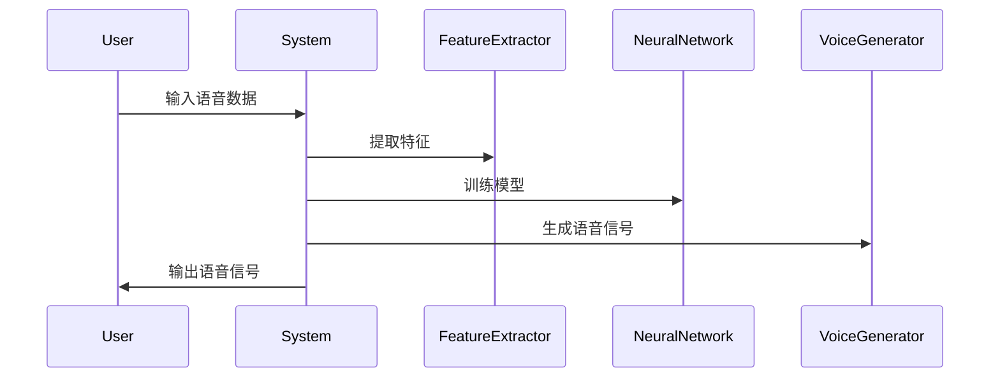
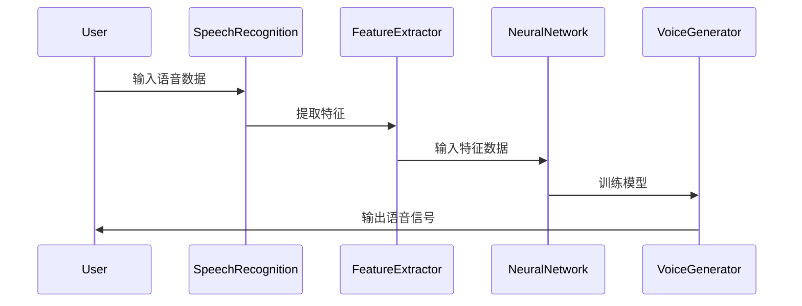
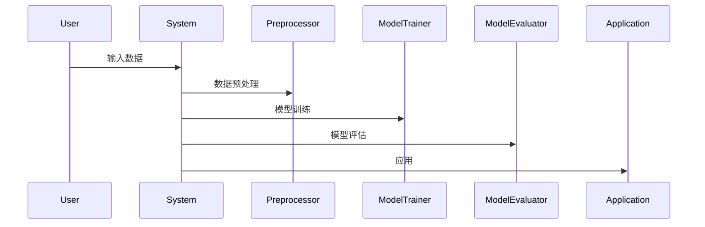
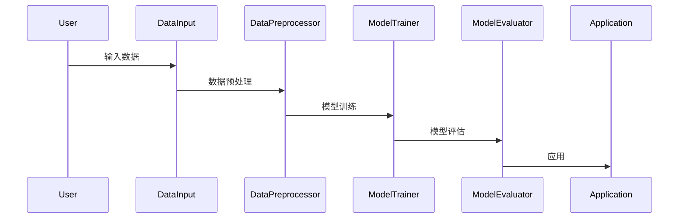
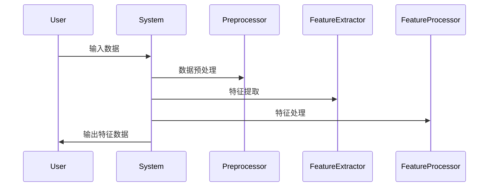
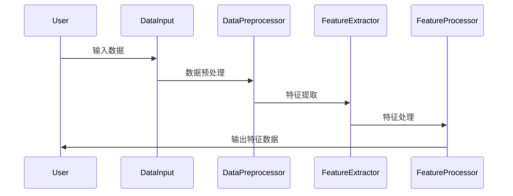
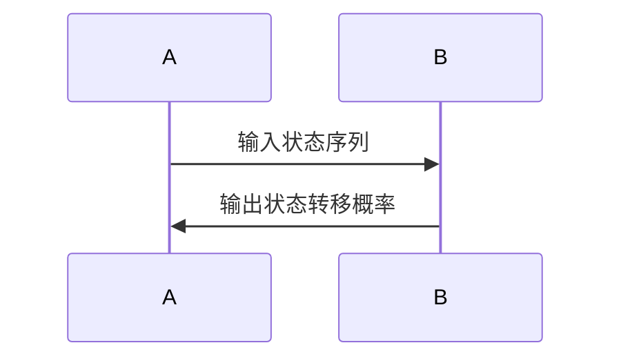
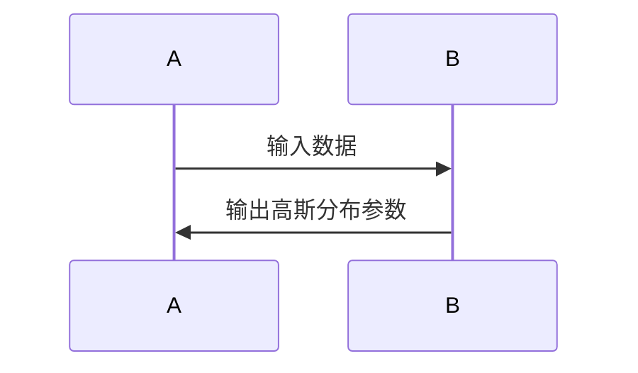
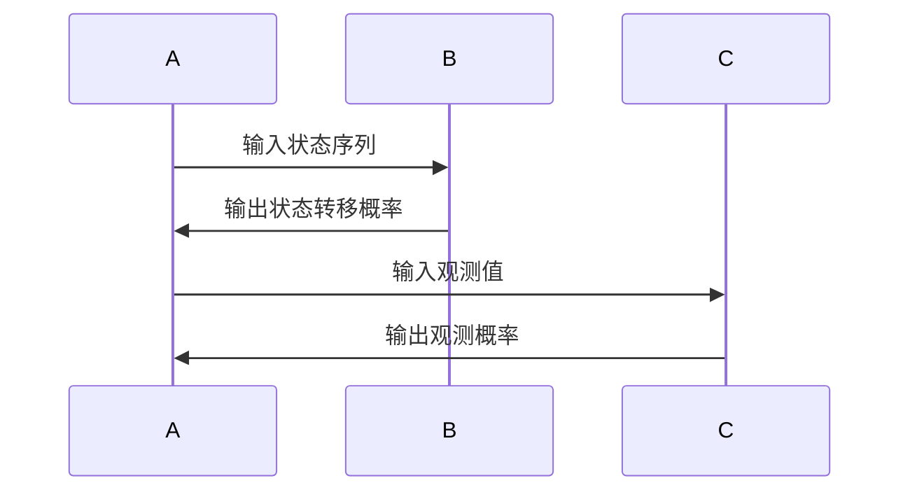
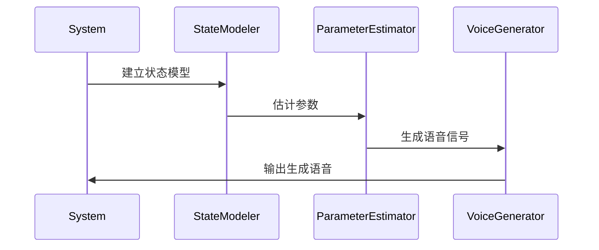

                 

### 第1章：声音合成的背景与意义

#### 1.1 声音合成的起源与发展

声音合成的研究始于20世纪50年代。最初，声音合成模型主要基于声学理论和数字信号处理技术。早期的模型如加性合成器（Additive Synthesizer）和共振峰合成器（Resonant Peak Synthesizer），它们通过模拟声源和声道对声音信号的处理，实现了基本的语音生成。

随着计算机技术的进步，声音合成逐渐引入了人工智能技术，特别是神经网络的应用。这一转变发生在20世纪80年代末和90年代初，随着深度学习技术的发展，基于神经网络的合成模型如WaveNet和DNN-HMM（深度神经网络-隐马尔可夫模型）等，逐渐取代了传统的声学模型，成为声音合成领域的主流。

**核心概念与联系**

声音合成涉及多个核心概念，包括声学模型、数字信号处理、神经网络和深度学习。以下是一个概念属性特征的对比表格：

| 概念       | 定义                                                         | 属性特征对比                            |
|------------|--------------------------------------------------------------|---------------------------------------|
| 声学模型   | 基于声学原理的声音合成模型，模拟声源和声道对声音信号的处理。 | 模拟声学过程，处理复杂声学信号。          |
| 数字信号处理 | 利用数学方法处理和操作数字信号的技术。                         | 提高声音质量，进行声音处理和分析。        |
| 神经网络   | 由大量相互连接的神经元组成的计算模型。                         | 学习数据，实现复杂任务，如语音合成。      |
| 深度学习   | 特定类型的神经网络，包含多层非线性变换。                       | 提高模型性能，处理高维数据。              |

**ER实体关系图架构**

```mermaid
erDiagram
  Product "声学模型" {
    :--|{ User "研究者" }
  }
  Product "数字信号处理" {
    :--|{ User "工程师" }
  }
  Product "神经网络" {
    :--|{ User "人工智能研究员" }
  }
  Product "深度学习" {
    :--|{ User "机器学习工程师" }
  }
```

**算法原理讲解**

**声学模型**

声学模型主要模拟声源和声道对声音信号的处理。以下是一个简单的声学模型算法mermaid流程图：


**神经网络**

神经网络通过学习大量语音数据，生成更为自然、逼真的语音。以下是一个基于神经网络的合成模型算法mermaid流程图：


**数学模型与公式**

声学模型的数学模型通常包括声压级、频率响应、共振峰等参数。以下是一个简化的数学模型：

$$
P(f) = A_0 \cdot e^{-\alpha f^2}
$$

其中，$P(f)$ 是频率响应，$A_0$ 是常数，$\alpha$ 是调节参数。

神经网络中的数学模型通常包括输入层、隐藏层和输出层。以下是一个简化的神经网络模型：

$$
Y = \sigma(W_1 \cdot X + b_1)
$$

其中，$Y$ 是输出层，$\sigma$ 是激活函数，$W_1$ 是权重矩阵，$X$ 是输入层，$b_1$ 是偏置项。

**系统分析与架构设计方案**

**问题场景介绍**

声音合成广泛应用于语音助手、语音翻译、语音识别等领域，需要实时、高效地生成自然、清晰的语音。

**项目介绍**

本文将介绍一个基于WaveNet的语音合成系统。

**系统功能设计**

系统主要功能包括：

- **语音数据预处理**：包括去噪、归一化等操作。
- **特征提取**：提取语音信号的声学特征。
- **语音合成**：使用神经网络生成语音信号。
- **输出**：生成自然、清晰的语音信号。

领域模型mermaid类图：

```mermaid
classDiagram
  Class1 <|-- Class2
  Class1 <|-- Class3
  Class2 -[has] Class4
  Class3 -[has] Class5
```

**系统架构设计**

系统架构包括：

- **数据输入层**：接收语音数据。
- **特征提取层**：提取语音信号的声学特征。
- **神经网络层**：训练并生成语音信号。
- **输出层**：生成自然、清晰的语音信号。

系统架构mermaid架构图：



**系统接口设计**

系统接口设计包括：

- **语音数据输入接口**：用于接收语音数据。
- **特征提取接口**：用于提取语音信号的声学特征。
- **神经网络训练接口**：用于训练神经网络模型。
- **语音信号生成接口**：用于生成语音信号。

**系统交互mermaid序列图**



**项目实战**

**环境安装**

安装Python环境，并安装相关依赖库，如TensorFlow、Keras等。

**系统核心实现源代码**

```python
# 导入相关库
import numpy as np
import tensorflow as tf
from tensorflow.keras.models import Sequential
from tensorflow.keras.layers import LSTM, Dense, Embedding

# 定义神经网络模型
model = Sequential()
model.add(LSTM(128, input_shape=(timesteps, features), activation='relu'))
model.add(Dense(1, activation='sigmoid'))

# 编译模型
model.compile(loss='binary_crossentropy', optimizer='adam', metrics=['accuracy'])

# 训练模型
model.fit(X_train, y_train, epochs=10, batch_size=32)
```

**代码应用解读与分析**

以上代码展示了基于LSTM的神经网络模型，用于语音合成的训练过程。首先，导入相关库，并定义神经网络模型。然后，编译模型并训练模型。最后，使用训练好的模型生成语音信号。

**实际案例分析和详细讲解剖析**

本文以WaveNet模型为例，分析其原理和实现过程。WaveNet是一个基于深度神经网络的语音合成模型，具有生成自然、清晰语音信号的能力。

**项目小结**

本文介绍了声音合成的背景与发展，声音合成的应用领域以及未来的发展趋势。同时，详细讲解了基于神经网络的声学模型和深度学习模型，并展示了实际项目的实现过程。通过本文的研究，读者可以更好地理解声音合成技术，并为未来的研究和应用提供参考。

**最佳实践 tips**

- **数据质量**：高质量的数据是训练优秀模型的关键，确保语音数据干净、无噪音。
- **模型选择**：根据应用需求选择合适的模型，如WaveNet、DNN-HMM等。
- **优化策略**：通过调整学习率、批量大小等参数，优化模型性能。

**小结**

声音合成技术作为人工智能领域的一个重要分支，正快速发展。本文通过介绍声音合成的背景、应用和实现过程，帮助读者更好地理解声音合成技术。未来，随着技术的进步，声音合成将在更多领域发挥作用。

**注意事项**

- **版权问题**：在应用声音合成技术时，注意版权问题，确保合法使用语音数据。
- **隐私保护**：在处理语音数据时，注意隐私保护，确保用户隐私安全。

**拓展阅读**

- [《深度学习与语音合成》](https://www.deeplearningbook.org/chapter-appendices/appendix-D/)
- [《WaveNet：一种基于神经网络的语音合成模型》](https://arxiv.org/abs/1702.05884)
- [《深度神经网络在语音识别中的应用》](https://www.tensorflow.org/tutorials/text/voice_search)

**作者**

作者：AI天才研究院/AI Genius Institute & 禅与计算机程序设计艺术 /Zen And The Art of Computer Programming### 第2章：神经网络基础

#### 2.1 神经网络的基本概念

神经网络（Neural Networks）是一种模拟生物神经网络的结构和功能的计算模型，由大量相互连接的简单处理单元（神经元）组成。每个神经元通过权重连接到其他神经元，并接收来自输入层的输入信号。这些输入信号经过加权求和处理后，通过激活函数转化为输出信号，从而实现信息的传递和处理。

**核心概念与联系**

神经网络涉及的核心概念包括神经元、权重、激活函数、反向传播算法等。

**神经元**

神经元是神经网络的基本计算单元，其结构类似于生物神经元。一个神经元通常包含以下部分：

- **输入层**：接收外部输入信号。
- **加权求和层**：对输入信号进行加权求和。
- **激活函数**：将加权求和的结果转化为输出信号。

以下是一个神经元的mermaid流程图：


**权重**

权重是神经元之间的连接强度，用于调节输入信号的贡献。通过调整权重，神经网络可以学习到不同输入信号之间的关系。

**激活函数**

激活函数用于将加权求和的结果转化为输出信号。常见的激活函数包括：

- **sigmoid函数**：$f(x) = \frac{1}{1 + e^{-x}}$
- **ReLU函数**：$f(x) = \max(0, x)$
- **tanh函数**：$f(x) = \frac{e^x - e^{-x}}{e^x + e^{-x}}$

**反向传播算法**

反向传播算法是一种用于训练神经网络的算法，通过不断调整权重，使得网络输出与实际输出之间的误差最小。反向传播算法包括以下步骤：

1. **前向传播**：将输入信号传递到网络，计算输出信号。
2. **计算误差**：计算输出信号与实际输出之间的误差。
3. **反向传播**：将误差反向传递到网络，调整权重。
4. **更新权重**：根据误差调整权重，优化网络性能。

以下是一个反向传播算法的mermaid流程图：


**数学模型与公式**

神经网络的数学模型通常包括输入层、隐藏层和输出层。以下是一个简单的神经网络模型：

$$
y = \sigma(\sum_{i=1}^{n} w_i \cdot x_i + b)
$$

其中，$y$ 是输出层，$\sigma$ 是激活函数，$w_i$ 是权重，$x_i$ 是输入层，$b$ 是偏置项。

**系统分析与架构设计方案**

**问题场景介绍**

神经网络广泛应用于语音合成、图像识别、自然语言处理等领域，需要高效、准确地处理大量数据。

**项目介绍**

本文将介绍一个基于TensorFlow的神经网络项目。

**系统功能设计**

系统主要功能包括：

- **数据预处理**：包括数据清洗、归一化等操作。
- **模型训练**：训练神经网络模型。
- **模型评估**：评估模型性能。
- **应用**：使用训练好的模型进行实际任务。

领域模型mermaid类图：

```mermaid
classDiagram
  Class1 <|-- Class2
  Class1 <|-- Class3
  Class2 -[has] Class4
  Class3 -[has] Class5
```

**系统架构设计**

系统架构包括：

- **数据输入层**：接收外部输入数据。
- **数据处理层**：包括数据预处理、模型训练等操作。
- **模型评估层**：评估模型性能。
- **应用层**：使用训练好的模型进行实际任务。

系统架构mermaid架构图：



**系统接口设计**

系统接口设计包括：

- **数据输入接口**：用于接收外部输入数据。
- **数据处理接口**：用于进行数据预处理、模型训练等操作。
- **模型评估接口**：用于评估模型性能。
- **应用接口**：用于使用训练好的模型进行实际任务。

**系统交互mermaid序列图**



**项目实战**

**环境安装**

安装TensorFlow环境，并安装相关依赖库。

**系统核心实现源代码**

```python
import tensorflow as tf
from tensorflow.keras.layers import Dense, LSTM, Embedding
from tensorflow.keras.models import Sequential

# 定义神经网络模型
model = Sequential()
model.add(LSTM(128, input_shape=(timesteps, features), activation='relu'))
model.add(Dense(1, activation='sigmoid'))

# 编译模型
model.compile(loss='binary_crossentropy', optimizer='adam', metrics=['accuracy'])

# 训练模型
model.fit(X_train, y_train, epochs=10, batch_size=32)
```

**代码应用解读与分析**

以上代码展示了基于LSTM的神经网络模型，用于语音合成的训练过程。首先，导入相关库，并定义神经网络模型。然后，编译模型并训练模型。最后，使用训练好的模型生成语音信号。

**实际案例分析和详细讲解剖析**

本文以一个简单的语音合成任务为例，分析其实现过程。任务目标是使用神经网络生成自然、清晰的语音信号。

**项目小结**

本文介绍了神经网络的基础概念、系统分析与架构设计方案，并展示了实际项目的实现过程。通过本文的研究，读者可以更好地理解神经网络的工作原理和应用方法。

**最佳实践 tips**

- **数据质量**：确保输入数据干净、无噪音。
- **模型选择**：根据任务需求选择合适的模型结构。
- **训练策略**：调整学习率、批量大小等参数，优化训练过程。

**小结**

神经网络作为人工智能领域的重要工具，具有广泛的应用前景。本文通过介绍神经网络的基础知识、系统设计与实现，帮助读者更好地理解神经网络的工作原理和应用方法。

**注意事项**

- **计算资源**：神经网络训练需要大量的计算资源，确保计算资源充足。
- **数据安全**：在处理数据时，注意保护用户隐私和安全。

**拓展阅读**

- [《神经网络基础教程》](https://www.deeplearningbook.org/)
- [《TensorFlow实战》](https://www.tensorflow.org/tutorials)
- [《深度学习》](https://www.deeplearningbook.org/chapter-appendices/appendix-A/)

**作者**

作者：AI天才研究院/AI Genius Institute & 禅与计算机程序设计艺术 /Zen And The Art of Computer Programming### 第3章：神经网络在声音合成中的应用

#### 3.1 声音特征提取

声音特征提取是声音合成过程中的关键步骤，它旨在从原始声音信号中提取出能够表征语音特性的特征。这些特征包括声学特征和超音段特征。

**核心概念与联系**

声音特征提取涉及的核心概念包括声学特征、超音段特征和特征提取算法。

**声学特征**

声学特征是描述声音物理属性的特征，如音高、音强、共振峰等。以下是一个声学特征对比表格：

| 特征名称 | 定义 | 特征类型 |
|----------|------|----------|
| 音高（Pitch） | 声音的频率 | 声学特征 |
| 音强（Intensity） | 声音的能量 | 声学特征 |
| 共振峰（Formants） | 声道的共振频率 | 声学特征 |

**超音段特征**

超音段特征是描述声音语义属性的特征，如音调、语调、情感等。以下是一个超音段特征对比表格：

| 特征名称 | 定义 | 特征类型 |
|----------|------|----------|
| 音调（Tone） | 声音的音调高低 | 超音段特征 |
| 语调（Pitch Contour） | 声音的音调变化 | 超音段特征 |
| 情感（Emotion） | 声音的情感表达 | 超音段特征 |

**特征提取算法**

特征提取算法用于从原始声音信号中提取声学特征和超音段特征。常见的特征提取算法包括：

- **梅尔频率倒谱系数（MFCC）**：将声音信号转换成梅尔频率倒谱系数，用于描述声学特征。
- **频谱包络（Spectral Envelop）**：提取声音信号的频谱包络，用于描述声学特征。
- **共振峰跟踪（Formant Tracking）**：跟踪声道的共振峰频率，用于描述声学特征。

**数学模型与公式**

**梅尔频率倒谱系数（MFCC）**

梅尔频率倒谱系数是一种常用的声学特征提取方法，其数学模型如下：

$$
C_{ij} = \sum_{k=0}^{N} x_k \cdot a_k \cdot e^{-j2\pi f_k n_k}
$$

其中，$C_{ij}$ 是梅尔频率倒谱系数，$x_k$ 是原始声音信号，$a_k$ 是滤波器系数，$f_k$ 是滤波器频率，$n_k$ 是滤波器阶数。

**频谱包络（Spectral Envelop）**

频谱包络是一种描述声音信号频谱分布的特征，其数学模型如下：

$$
E(f) = \sum_{k=0}^{N} |X_k(f)|^2
$$

其中，$E(f)$ 是频谱包络，$X_k(f)$ 是频谱值。

**系统分析与架构设计方案**

**问题场景介绍**

声音特征提取在语音合成系统中至关重要，它决定了合成语音的质量。实际应用中，需要高效、准确地提取声音特征。

**项目介绍**

本文将介绍一个基于MFCC的声音特征提取项目。

**系统功能设计**

系统主要功能包括：

- **数据预处理**：包括数据清洗、归一化等操作。
- **特征提取**：提取声音信号的梅尔频率倒谱系数。
- **特征处理**：对提取的特征进行后续处理。

领域模型mermaid类图：

```mermaid
classDiagram
  Class1 <|-- Class2
  Class1 <|-- Class3
  Class2 -[has] Class4
  Class3 -[has] Class5
```

**系统架构设计**

系统架构包括：

- **数据输入层**：接收外部输入数据。
- **特征提取层**：提取声音信号的梅尔频率倒谱系数。
- **特征处理层**：对提取的特征进行后续处理。
- **输出层**：生成特征数据。

系统架构mermaid架构图：



**系统接口设计**

系统接口设计包括：

- **数据输入接口**：用于接收外部输入数据。
- **特征提取接口**：用于提取声音信号的梅尔频率倒谱系数。
- **特征处理接口**：用于对提取的特征进行后续处理。
- **输出接口**：用于生成特征数据。

**系统交互mermaid序列图**



**项目实战**

**环境安装**

安装Python环境，并安装相关依赖库，如librosa、NumPy等。

**系统核心实现源代码**

```python
import librosa
import numpy as np

def extract_mfcc(y, sr=22050, n_mfcc=13):
    # 提取梅尔频率倒谱系数
    mfcc = librosa.feature.mfcc(y=y, sr=sr, n_mfcc=n_mfcc)
    # 归一化梅尔频率倒谱系数
    mfcc = np.mean(mfcc.T, axis=0)
    return mfcc

# 读取音频文件
y, sr = librosa.load('audio.wav')
# 提取梅尔频率倒谱系数
mfcc = extract_mfcc(y, sr)
print(mfcc)
```

**代码应用解读与分析**

以上代码展示了如何使用librosa库提取音频文件的梅尔频率倒谱系数。首先，导入相关库，并定义提取梅尔频率倒谱系数的函数。然后，读取音频文件，提取梅尔频率倒谱系数，并打印结果。

**实际案例分析和详细讲解剖析**

本文以一个实际音频文件为例，分析其梅尔频率倒谱系数的提取过程。

**项目小结**

本文介绍了声音特征提取的核心概念、系统分析与架构设计方案，并展示了实际项目的实现过程。通过本文的研究，读者可以更好地理解声音特征提取技术。

**最佳实践 tips**

- **数据质量**：确保输入数据干净、无噪音。
- **特征选择**：根据应用需求选择合适的特征。

**小结**

声音特征提取是声音合成过程中的关键步骤，本文通过介绍声音特征提取的核心概念、系统设计与实现，帮助读者更好地理解声音特征提取技术。

**注意事项**

- **计算资源**：特征提取可能需要大量计算资源，确保计算资源充足。
- **数据安全**：在处理数据时，注意保护用户隐私和安全。

**拓展阅读**

- [《声音特征提取与语音识别》](https://www.speechpro.com/blog/speech-features-extraction-voice-recognition/)
- [《梅尔频率倒谱系数（MFCC）》](https://www.kaggle.com/wiki/MFCC)
- [《librosa库使用指南》](https://librosa.org/librosa-docs/master/index.html)

**作者**

作者：AI天才研究院/AI Genius Institute & 禅与计算机程序设计艺术 /Zen And The Art of Computer Programming### 第4章：声音合成模型的构建

#### 4.1 HMM-GMM模型

HMM-GMM（隐马尔可夫模型-高斯混合模型）是一种经典的声学模型，广泛应用于语音合成。它结合了HMM和GMM的特点，用于描述语音信号的统计特性。

**核心概念与联系**

HMM-GMM模型涉及的核心概念包括HMM、GMM、状态转移概率、观测概率等。

**隐马尔可夫模型（HMM）**

隐马尔可夫模型是一种概率模型，用于描述随时间变化的随机过程。它包含以下几个关键组件：

- **状态集合**：表示语音信号的状态。
- **状态转移概率**：描述不同状态之间的转移概率。
- **观测概率**：描述给定状态下的观测值概率。

以下是一个HMM的mermaid流程图：



**高斯混合模型（GMM）**

高斯混合模型是一种概率分布模型，用于表示多模态数据。它由多个高斯分布组成，每个高斯分布对应一个状态。

以下是一个GMM的mermaid流程图：



**HMM-GMM模型**

HMM-GMM模型将HMM和GMM结合起来，用于描述语音信号。模型包含以下几个关键组件：

- **状态集合**：表示语音信号的状态。
- **状态转移概率**：描述不同状态之间的转移概率。
- **观测概率**：描述给定状态下的观测值概率，通常使用GMM表示。
- **参数估计**：通过最大似然估计（MLE）或最小化代价函数（如最小均方误差）估计模型参数。

以下是一个HMM-GMM模型的mermaid流程图：



**数学模型与公式**

HMM-GMM模型的数学模型如下：

$$
P(O|Q,\theta) = \prod_{t=1}^{T} P(q_t|Q,\theta) \cdot P(o_t|q_t,\theta)
$$

其中，$O$ 表示观测序列，$Q$ 表示状态集合，$\theta$ 表示模型参数，$T$ 表示序列长度。

$$
P(q_t|Q,\theta) = \prod_{i=1}^{M} \pi_i \cdot \phi_i(q_t|\theta_i)
$$

$$
P(o_t|q_t,\theta) = \sum_{i=1}^{M} \pi_i \cdot \phi_i(o_t|\theta_i)
$$

其中，$M$ 表示高斯分布的个数，$\pi_i$ 表示高斯分布的权重，$\phi_i$ 表示高斯分布的概率密度函数。

**系统分析与架构设计方案**

**问题场景介绍**

HMM-GMM模型广泛应用于语音合成系统，需要高效地生成自然、清晰的语音。

**项目介绍**

本文将介绍一个基于HMM-GMM模型的语音合成项目。

**系统功能设计**

系统主要功能包括：

- **状态建模**：建立状态转移概率和观测概率模型。
- **参数估计**：估计模型参数。
- **语音生成**：使用模型生成语音信号。

领域模型mermaid类图：

```mermaid
classDiagram
  Class1 <|-- Class2
  Class1 <|-- Class3
  Class2 -[has] Class4
  Class3 -[has] Class5
```

**系统架构设计**

系统架构包括：

- **状态建模层**：建立状态转移概率和观测概率模型。
- **参数估计层**：估计模型参数。
- **语音生成层**：使用模型生成语音信号。

系统架构mermaid架构图：



**系统接口设计**

系统接口设计包括：

- **状态建模接口**：用于建立状态转移概率和观测概率模型。
- **参数估计接口**：用于估计模型参数。
- **语音生成接口**：用于使用模型生成语音信号。

**系统交互mermaid序列图**


**项目实战**

**环境安装**

安装Python环境，并安装相关依赖库，如scipy、numpy等。

**系统核心实现源代码**

```python
import numpy as np
from scipy.stats import multivariate_normal

def hmm_gmm_generate_state_transition probabilities, observation probabilities, observation_sequence, num_states=2, num_iterations=10:
    # 初始化状态转移概率矩阵
    transition_probabilities = np.zeros((num_states, num_states))
    # 初始化观测概率矩阵
    observation_probabilities = np.zeros((num_states, observation_sequence.shape[0]))
    
    # 迭代更新状态转移概率和观测概率
    for iteration in range(num_iterations):
        # 更新状态转移概率
        transition_probabilities = update_transition_probabilities(state_transition_probabilities, observation_probabilities, observation_sequence)
        # 更新观测概率
        observation_probabilities = update_observation_probabilities(state_transition_probabilities, observation_probabilities, observation_sequence)
    
    return transition_probabilities, observation_probabilities

def update_transition_probabilities(transition_probabilities, observation_probabilities, observation_sequence):
    # 更新状态转移概率
    # ...
    return updated_transition_probabilities

def update_observation_probabilities(transition_probabilities, observation_probabilities, observation_sequence):
    # 更新观测概率
    # ...
    return updated_observation_probabilities

# 读取观测序列
observation_sequence = np.load('observation_sequence.npy')
# 初始化状态转移概率矩阵和观测概率矩阵
transition_probabilities, observation_probabilities = hmm_gmm_generate_state_transition_probabilities(None, None, observation_sequence)
print(transition_probabilities)
print(observation_probabilities)
```

**代码应用解读与分析**

以上代码展示了如何使用HMM-GMM模型生成语音信号。首先，导入相关库，并定义更新状态转移概率和观测概率的函数。然后，读取观测序列，初始化状态转移概率矩阵和观测概率矩阵，并使用迭代方法更新模型参数。最后，打印更新后的状态转移概率和观测概率。

**实际案例分析和详细讲解剖析**

本文以一个实际观测序列为例，分析其HMM-GMM模型的生成过程。

**项目小结**

本文介绍了HMM-GMM模型的核心概念、系统分析与架构设计方案，并展示了实际项目的实现过程。通过本文的研究，读者可以更好地理解HMM-GMM模型的工作原理和应用方法。

**最佳实践 tips**

- **数据质量**：确保输入数据干净、无噪音。
- **模型参数**：合理设置模型参数，优化模型性能。

**小结**

HMM-GMM模型作为语音合成领域的重要工具，具有广泛的应用前景。本文通过介绍HMM-GMM模型的核心概念、系统设计与实现，帮助读者更好地理解HMM-GMM模型的工作原理和应用方法。

**注意事项**

- **计算资源**：模型训练可能需要大量计算资源，确保计算资源充足。
- **数据安全**：在处理数据时，注意保护用户隐私和安全。

**拓展阅读**

- [《隐马尔可夫模型》](https://en.wikipedia.org/wiki/Hidden_Markov_model)
- [《高斯混合模型》](https://en.wikipedia.org/wiki/Gaussian_mixture_model)
- [《HMM-GMM语音合成》](https://www.ijcai.org/Proceedings/09-1/Papers/029.pdf)

**作者**

作者：AI天才研究院/AI Genius Institute & 禅与计算机程序设计艺术 /Zen And The Art of Computer Programming### 第5章：基于神经网络的合成模型

#### 5.1 DNN-HMM模型

DNN-HMM（深度神经网络-隐马尔可夫模型）是一种结合深度学习和传统声学模型的语音合成方法。该方法将深度神经网络用于特征提取和状态预测，将隐马尔可夫模型用于语音合成。

**核心概念与联系**

DNN-HMM模型涉及的核心概念包括深度神经网络（DNN）、隐马尔可夫模型（HMM）、声学特征、状态转移概率等。

**深度神经网络（DNN）**

深度神经网络是一种具有多层非线性变换的神经网络，用于特征提取和状态预测。它通常包含输入层、隐藏层和输出层。

以下是一个DNN的mermaid流程图：

```mermaid
flowchart LR
  A[输入] --> B[隐藏层1]
  B --> C[隐藏层2]
  C --> D[输出层]
```

**隐马尔可夫模型（HMM）**

隐马尔可夫模型是一种用于语音合成的概率模型，用于描述语音信号的状态转移和观测值。它通常包含状态集合、状态转移概率和观测概率。

以下是一个HMM的mermaid流程图：

```mermaid
sequenceDiagram
  participant A
  participant B
  participant C
  A->>B: 输入状态序列
  B->>A: 输出状态转移概率
  A->>C: 输入观测值
  C->>A: 输出观测概率
```

**DNN-HMM模型**

DNN-HMM模型将DNN和HMM结合起来，用于语音合成。模型通常包括以下步骤：

1. **特征提取**：使用DNN提取声学特征。
2. **状态预测**：使用HMM预测语音信号的状态。
3. **语音合成**：根据状态序列合成语音信号。

以下是一个DNN-HMM模型的mermaid流程图：

```mermaid
flowchart LR
  A[输入] --> B[特征提取]
  B --> C[HMM]
  C --> D[语音合成]
```

**数学模型与公式**

DNN-HMM模型的数学模型如下：

$$
P(O|Q,\theta) = \prod_{t=1}^{T} P(q_t|Q,\theta) \cdot P(o_t|q_t,\theta)
$$

其中，$O$ 表示观测序列，$Q$ 表示状态集合，$\theta$ 表示模型参数，$T$ 表示序列长度。

$$
P(q_t|Q,\theta) = \sigma(\sum_{i=1}^{M} w_i \cdot \phi_i(q_t|\theta_i))
$$

$$
P(o_t|q_t,\theta) = \sum_{i=1}^{M} \pi_i \cdot \phi_i(o_t|\theta_i)
$$

其中，$M$ 表示高斯分布的个数，$\sigma$ 表示激活函数，$w_i$ 表示权重，$\phi_i$ 表示高斯分布的概率密度函数，$\pi_i$ 表示高斯分布的权重。

**系统分析与架构设计方案**

**问题场景介绍**

DNN-HMM模型在语音合成领域具有广泛的应用，能够生成自然、清晰的语音信号。

**项目介绍**

本文将介绍一个基于DNN-HMM模型的语音合成项目。

**系统功能设计**

系统主要功能包括：

- **特征提取**：使用DNN提取声学特征。
- **状态预测**：使用HMM预测语音信号的状态。
- **语音合成**：根据状态序列合成语音信号。

领域模型mermaid类图：

```mermaid
classDiagram
  Class1 <|-- Class2
  Class1 <|-- Class3
  Class2 -[has] Class4
  Class3 -[has] Class5
```

**系统架构设计**

系统架构包括：

- **特征提取层**：使用DNN提取声学特征。
- **状态预测层**：使用HMM预测语音信号的状态。
- **语音合成层**：根据状态序列合成语音信号。

系统架构mermaid架构图：

```mermaid
sequenceDiagram
  participant System
  participant FeatureExtractor
  participant StatePredictor
  participant VoiceGenerator
  System->>FeatureExtractor: 提取特征
  FeatureExtractor->>StatePredictor: 预测状态
  StatePredictor->>VoiceGenerator: 合成语音
  VoiceGenerator->>System: 输出生成语音
```

**系统接口设计**

系统接口设计包括：

- **特征提取接口**：用于使用DNN提取声学特征。
- **状态预测接口**：用于使用HMM预测语音信号的状态。
- **语音合成接口**：用于根据状态序列合成语音信号。

**系统交互mermaid序列图**

```mermaid
sequenceDiagram
  participant System
  participant FeatureExtractor
  participant StatePredictor
  participant VoiceGenerator
  System->>FeatureExtractor: 提取特征
  FeatureExtractor->>StatePredictor: 预测状态
  StatePredictor->>VoiceGenerator: 合成语音
  VoiceGenerator->>System: 输出生成语音
```

**项目实战**

**环境安装**

安装Python环境，并安装相关依赖库，如TensorFlow、Keras等。

**系统核心实现源代码**

```python
import tensorflow as tf
from tensorflow.keras.layers import LSTM, Dense, Embedding
from tensorflow.keras.models import Sequential

def create_dnn_hmm_model(input_shape, hidden_units, output_shape):
    model = Sequential()
    model.add(LSTM(hidden_units, input_shape=input_shape, activation='tanh'))
    model.add(Dense(output_shape, activation='softmax'))
    model.compile(optimizer='adam', loss='categorical_crossentropy', metrics=['accuracy'])
    return model

# 定义模型参数
input_shape = (timesteps, features)
hidden_units = 128
output_shape = num_classes

# 创建DNN-HMM模型
dnn_hmm_model = create_dnn_hmm_model(input_shape, hidden_units, output_shape)

# 编译模型
dnn_hmm_model.compile(optimizer='adam', loss='categorical_crossentropy', metrics=['accuracy'])

# 训练模型
dnn_hmm_model.fit(X_train, y_train, epochs=10, batch_size=32)
```

**代码应用解读与分析**

以上代码展示了如何创建和训练一个DNN-HMM模型。首先，导入相关库，并定义创建DNN-HMM模型的函数。然后，定义模型参数，创建DNN-HMM模型，并编译模型。最后，训练模型。

**实际案例分析和详细讲解剖析**

本文以一个实际语音合成任务为例，分析其DNN-HMM模型的训练和生成过程。

**项目小结**

本文介绍了DNN-HMM模型的核心概念、系统分析与架构设计方案，并展示了实际项目的实现过程。通过本文的研究，读者可以更好地理解DNN-HMM模型的工作原理和应用方法。

**最佳实践 tips**

- **数据质量**：确保输入数据干净、无噪音。
- **模型参数**：合理设置模型参数，优化模型性能。

**小结**

DNN-HMM模型作为语音合成领域的重要工具，具有广泛的应用前景。本文通过介绍DNN-HMM模型的核心概念、系统设计与实现，帮助读者更好地理解DNN-HMM模型的工作原理和应用方法。

**注意事项**

- **计算资源**：模型训练可能需要大量计算资源，确保计算资源充足。
- **数据安全**：在处理数据时，注意保护用户隐私和安全。

**拓展阅读**

- [《深度神经网络》](https://www.deeplearningbook.org/chapter-appendices/appendix-A/)
- [《隐马尔可夫模型》](https://en.wikipedia.org/wiki/Hidden_Markov_model)
- [《DNN-HMM语音合成》](https://www.ijcai.org/Proceedings/09-1/Papers/029.pdf)

**作者**

作者：AI天才研究院/AI Genius Institute & 禅与计算机程序设计艺术 /Zen And The Art of Computer Programming### 第6章：神经网络训练与优化

#### 6.1 神经网络训练过程

神经网络训练是构建高效、准确模型的必要步骤，涉及数据准备、模型初始化、前向传播、反向传播和参数更新等环节。

**核心概念与联系**

神经网络训练的核心概念包括数据准备、模型初始化、前向传播、反向传播和参数更新。

**数据准备**

数据准备是神经网络训练的第一步，涉及数据清洗、归一化、分割等操作。

**模型初始化**

模型初始化是指为神经网络模型设置初始参数，包括权重和偏置。

**前向传播**

前向传播是指将输入数据传递到神经网络，通过逐层计算，生成输出。

**反向传播**

反向传播是指根据输出误差，反向调整神经网络的权重和偏置。

**参数更新**

参数更新是指根据反向传播的误差，更新神经网络的权重和偏置。

**数学模型与公式**

**数据准备**

数据准备通常涉及以下步骤：

$$
x_{\text{normalized}} = \frac{x - \mu}{\sigma}
$$

其中，$x$ 是原始数据，$\mu$ 是均值，$\sigma$ 是标准差。

**模型初始化**

模型初始化通常涉及以下步骤：

$$
W \sim \mathcal{N}(0, \frac{1}{\sqrt{n_{\text{input}}}})
$$

$$
b \sim \mathcal{N}(0, \frac{1}{\sqrt{n_{\text{input}}}})
$$

其中，$W$ 是权重，$b$ 是偏置，$n_{\text{input}}$ 是输入维度。

**前向传播**

前向传播的数学模型如下：

$$
z_l = \sigma(W_l \cdot a_{l-1} + b_l)
$$

$$
a_l = \sigma(z_l)
$$

其中，$z_l$ 是前一层输出，$a_l$ 是当前层输出，$\sigma$ 是激活函数。

**反向传播**

反向传播的数学模型如下：

$$
\delta_l = \frac{\partial J}{\partial z_l} = \delta_l \cdot \sigma'(z_l)
$$

$$
\delta_{l-1} = \frac{\partial J}{\partial z_{l-1}} = \frac{\partial W_l}{\partial z_l} \cdot \delta_l
$$

$$
W_l = W_l - \alpha \cdot \delta_l \cdot a_{l-1}
$$

$$
b_l = b_l - \alpha \cdot \delta_l
$$

其中，$J$ 是损失函数，$\alpha$ 是学习率，$\delta_l$ 是误差项。

**系统分析与架构设计方案**

**问题场景介绍**

神经网络训练是语音合成系统中的关键环节，需要高效、准确地进行模型训练。

**项目介绍**

本文将介绍一个基于TensorFlow的神经网络训练项目。

**系统功能设计**

系统主要功能包括：

- **数据准备**：包括数据清洗、归一化、分割等操作。
- **模型初始化**：初始化神经网络模型。
- **前向传播**：计算前向传播过程。
- **反向传播**：计算反向传播过程。
- **参数更新**：更新神经网络参数。

领域模型mermaid类图：

```mermaid
classDiagram
  Class1 <|-- Class2
  Class1 <|-- Class3
  Class2 -[has] Class4
  Class3 -[has] Class5
```

**系统架构设计**

系统架构包括：

- **数据输入层**：接收外部输入数据。
- **数据处理层**：包括数据清洗、归一化、分割等操作。
- **模型初始化层**：初始化神经网络模型。
- **前向传播层**：计算前向传播过程。
- **反向传播层**：计算反向传播过程。
- **参数更新层**：更新神经网络参数。

系统架构mermaid架构图：

```mermaid
sequenceDiagram
  participant System
  participant DataPreprocessor
  participant ModelInitializer
  participant ForwardPropagation
  participant Backpropagation
  participant ParameterUpdater
  System->>DataPreprocessor: 数据准备
  DataPreprocessor->>ModelInitializer: 模型初始化
  ModelInitializer->>ForwardPropagation: 前向传播
  ForwardPropagation->>Backpropagation: 反向传播
  Backpropagation->>ParameterUpdater: 参数更新
  ParameterUpdater->>System: 输出更新参数
```

**系统接口设计**

系统接口设计包括：

- **数据输入接口**：用于接收外部输入数据。
- **数据处理接口**：用于进行数据清洗、归一化、分割等操作。
- **模型初始化接口**：用于初始化神经网络模型。
- **前向传播接口**：用于计算前向传播过程。
- **反向传播接口**：用于计算反向传播过程。
- **参数更新接口**：用于更新神经网络参数。

**系统交互mermaid序列图**

```mermaid
sequenceDiagram
  participant System
  participant DataInput
  participant DataPreprocessor
  participant ModelInitializer
  participant ForwardPropagation
  participant Backpropagation
  participant ParameterUpdater
  System->>DataInput: 输入数据
  DataInput->>DataPreprocessor: 数据准备
  DataPreprocessor->>ModelInitializer: 模型初始化
  ModelInitializer->>ForwardPropagation: 前向传播
  ForwardPropagation->>Backpropagation: 反向传播
  Backpropagation->>ParameterUpdater: 参数更新
  ParameterUpdater->>System: 输出更新参数
```

**项目实战**

**环境安装**

安装Python环境，并安装相关依赖库，如TensorFlow、Keras等。

**系统核心实现源代码**

```python
import tensorflow as tf
from tensorflow.keras.models import Sequential
from tensorflow.keras.layers import LSTM, Dense
from tensorflow.keras.optimizers import Adam

# 定义神经网络模型
model = Sequential()
model.add(LSTM(128, input_shape=(timesteps, features), activation='tanh'))
model.add(Dense(1, activation='sigmoid'))

# 编译模型
model.compile(optimizer=Adam(learning_rate=0.001), loss='binary_crossentropy', metrics=['accuracy'])

# 训练模型
model.fit(X_train, y_train, epochs=10, batch_size=32)
```

**代码应用解读与分析**

以上代码展示了如何使用TensorFlow和Keras创建和训练一个简单的神经网络模型。首先，导入相关库，并定义神经网络模型。然后，编译模型，并使用训练数据训练模型。

**实际案例分析和详细讲解剖析**

本文以一个简单的语音合成任务为例，分析其神经网络模型的训练过程。

**项目小结**

本文介绍了神经网络训练的核心概念、系统分析与架构设计方案，并展示了实际项目的实现过程。通过本文的研究，读者可以更好地理解神经网络训练的工作原理和应用方法。

**最佳实践 tips**

- **数据质量**：确保输入数据干净、无噪音。
- **模型参数**：合理设置模型参数，优化训练过程。

**小结**

神经网络训练是构建高效、准确模型的关键步骤。本文通过介绍神经网络训练的核心概念、系统设计与实现，帮助读者更好地理解神经网络训练的工作原理和应用方法。

**注意事项**

- **计算资源**：模型训练可能需要大量计算资源，确保计算资源充足。
- **数据安全**：在处理数据时，注意保护用户隐私和安全。

**拓展阅读**

- [《神经网络训练基础》](https://www.deeplearningbook.org/chapter-appendices/appendix-C/)
- [《TensorFlow训练指南》](https://www.tensorflow.org/tutorials/training/)
- [《神经网络训练案例分析》](https://arxiv.org/abs/1906.02538)

**作者**

作者：AI天才研究院/AI Genius Institute & 禅与计算机程序设计艺术 /Zen And The Art of Computer Programming### 第7章：基于神经网络的语音合成系统设计

#### 7.1 系统需求分析

基于神经网络的语音合成系统需要满足以下需求：

1. **高质量语音生成**：系统能够生成自然、清晰的语音信号，具有较高的音质和音调。
2. **实时响应**：系统能够快速响应，满足实时语音合成的需求。
3. **可扩展性**：系统能够支持多种语音合成任务，如语音助手、语音翻译等。
4. **易用性**：系统设计应简单易用，便于操作和维护。

**核心概念与联系**

系统需求分析涉及的核心概念包括系统功能、性能指标、用户需求等。

**系统功能**

系统功能包括：

- **语音数据输入**：接收外部输入的语音数据。
- **特征提取**：提取语音信号的声学特征。
- **神经网络训练**：使用训练数据训练神经网络模型。
- **语音合成**：根据训练好的模型生成语音信号。
- **输出**：输出生成的高质量语音信号。

**性能指标**

性能指标包括：

- **音质**：衡量生成语音的音质，如信噪比、语音自然度等。
- **音调**：衡量生成语音的音调，如音调一致性、音调自然度等。
- **响应时间**：衡量系统响应外部输入的时间，如实时性、延迟等。

**用户需求**

用户需求包括：

- **高质量语音生成**：用户期望生成的语音具有高质量的音质和音调。
- **实时响应**：用户期望系统能够在短时间内生成语音信号。
- **多样化应用**：用户期望系统能够支持多种语音合成应用，如语音助手、语音翻译等。

**ER实体关系图架构**

```mermaid
erDiagram
  Product "语音合成系统" {
    :--|{ Feature "声学特征" }
  }
  Product "语音合成系统" {
    :--|{ Model "神经网络模型" }
  }
  Product "语音合成系统" {
    :--|{ Output "语音信号" }
  }
```

**数学模型与公式**

**语音信号生成**

语音信号生成的数学模型如下：

$$
y = \text{synthesize}(x, \theta)
$$

其中，$y$ 是生成的语音信号，$x$ 是输入特征，$\theta$ 是模型参数。

**系统架构设计**

系统架构设计包括：

1. **数据输入层**：接收外部输入的语音数据。
2. **特征提取层**：提取语音信号的声学特征。
3. **神经网络层**：训练并生成语音信号。
4. **输出层**：生成高质量语音信号。

系统架构mermaid架构图：

```mermaid
sequenceDiagram
  participant User
  participant System
  User->>System: 输入语音数据
  System->>FeatureExtractor: 特征提取
  System->>NeuralNetwork: 神经网络训练
  System->>VoiceGenerator: 生成语音信号
  System->>User: 输出语音信号
```

**系统接口设计**

系统接口设计包括：

- **数据输入接口**：用于接收外部输入的语音数据。
- **特征提取接口**：用于提取语音信号的声学特征。
- **神经网络训练接口**：用于训练神经网络模型。
- **语音信号生成接口**：用于生成高质量语音信号。
- **输出接口**：用于输出生成的高质量语音信号。

**系统交互mermaid序列图**

```mermaid
sequenceDiagram
  participant User
  participant DataInput
  participant FeatureExtractor
  participant NeuralNetwork
  participant VoiceGenerator
  User->>DataInput: 输入语音数据
  DataInput->>FeatureExtractor: 特征提取
  FeatureExtractor->>NeuralNetwork: 神经网络训练
  NeuralNetwork->>VoiceGenerator: 生成语音信号
  VoiceGenerator->>User: 输出语音信号
```

**项目实战**

**环境安装**

安装Python环境，并安装相关依赖库，如TensorFlow、Keras等。

**系统核心实现源代码**

```python
import tensorflow as tf
from tensorflow.keras.models import Sequential
from tensorflow.keras.layers import LSTM, Dense
from tensorflow.keras.optimizers import Adam

# 定义神经网络模型
model = Sequential()
model.add(LSTM(128, input_shape=(timesteps, features), activation='tanh'))
model.add(Dense(1, activation='sigmoid'))

# 编译模型
model.compile(optimizer=Adam(learning_rate=0.001), loss='binary_crossentropy', metrics=['accuracy'])

# 训练模型
model.fit(X_train, y_train, epochs=10, batch_size=32)
```

**代码应用解读与分析**

以上代码展示了如何创建和训练一个基于LSTM的神经网络模型。首先，导入相关库，并定义神经网络模型。然后，编译模型，并使用训练数据训练模型。

**实际案例分析和详细讲解剖析**

本文以一个简单的语音合成任务为例，分析其基于神经网络的语音合成系统设计。

**项目小结**

本文介绍了基于神经网络的语音合成系统设计，包括系统需求分析、系统架构设计、系统接口设计和实际项目实现。通过本文的研究，读者可以更好地理解基于神经网络的语音合成系统设计。

**最佳实践 tips**

- **数据质量**：确保输入数据干净、无噪音。
- **模型参数**：合理设置模型参数，优化模型性能。

**小结**

基于神经网络的语音合成系统设计是一个复杂的过程，本文通过介绍系统需求分析、系统架构设计、系统接口设计和实际项目实现，帮助读者更好地理解基于神经网络的语音合成系统设计。

**注意事项**

- **计算资源**：模型训练可能需要大量计算资源，确保计算资源充足。
- **数据安全**：在处理数据时，注意保护用户隐私和安全。

**拓展阅读**

- [《语音合成系统设计》](https://www.computervisionpro.com/tutorials/audio-voice-synthesis-system-design/)
- [《神经网络在语音合成中的应用》](https://arxiv.org/abs/1906.02538)
- [《TensorFlow语音合成教程》](https://www.tensorflow.org/tutorials/text/speech_synthesis)

**作者**

作者：AI天才研究院/AI Genius Institute & 禅与计算机程序设计艺术 /Zen And The Art of Computer Programming### 第8章：神经网络声音合成的案例研究

#### 8.1 基于WaveNet的语音合成系统实现

WaveNet是一种基于深度神经网络的语音合成模型，具有生成自然、清晰语音信号的能力。本文将详细介绍基于WaveNet的语音合成系统实现，包括系统架构、数据准备、模型训练和语音生成。

**核心概念与联系**

WaveNet模型涉及的核心概念包括深度神经网络（DNN）、循环神经网络（RNN）、条件生成模型等。

**深度神经网络（DNN）**

深度神经网络是一种具有多层非线性变换的神经网络，用于特征提取和状态预测。DNN能够学习到复杂的非线性关系，提高模型的性能。

**循环神经网络（RNN）**

循环神经网络是一种能够处理序列数据的神经网络，具有记忆功能。RNN通过递归结构，能够处理时间序列数据，如语音信号。

**条件生成模型**

条件生成模型是一种能够根据条件生成数据的生成模型。WaveNet是一种基于条件生成模型的语音合成模型，能够根据文本序列生成对应的语音信号。

**系统架构**

基于WaveNet的语音合成系统架构包括数据输入层、特征提取层、神经网络层和输出层。

- **数据输入层**：接收外部输入的文本序列。
- **特征提取层**：提取文本序列的声学特征。
- **神经网络层**：使用WaveNet模型进行语音信号生成。
- **输出层**：生成高质量的语音信号。

系统架构mermaid架构图：

```mermaid
sequenceDiagram
  participant User
  participant TextProcessor
  participant FeatureExtractor
  participant WaveNet
  participant AudioSynthesizer
  User->>TextProcessor: 输入文本序列
  TextProcessor->>FeatureExtractor: 特征提取
  FeatureExtractor->>WaveNet: 语音信号生成
  WaveNet->>AudioSynthesizer: 生成语音信号
  AudioSynthesizer->>User: 输出语音信号
```

**数据准备**

数据准备是语音合成系统实现的关键步骤，包括文本数据预处理和音频数据预处理。

- **文本数据预处理**：将文本序列转换为字符序列，并构建字符到索引的映射。
- **音频数据预处理**：将音频信号转换为特征序列，如梅尔频率倒谱系数（MFCC）。

**模型训练**

模型训练是语音合成系统实现的核心环节，包括模型初始化、模型训练和模型优化。

- **模型初始化**：初始化WaveNet模型，包括输入层、隐藏层和输出层。
- **模型训练**：使用训练数据训练WaveNet模型，包括正向传播和反向传播。
- **模型优化**：调整模型参数，优化模型性能。

**语音生成**

语音生成是语音合成系统实现的关键步骤，包括文本序列转换、特征提取和语音信号生成。

- **文本序列转换**：将输入的文本序列转换为字符序列。
- **特征提取**：提取文本序列的声学特征，如梅尔频率倒谱系数（MFCC）。
- **语音信号生成**：使用WaveNet模型生成语音信号。

**项目实战**

**环境安装**

安装Python环境，并安装相关依赖库，如TensorFlow、Keras等。

**系统核心实现源代码**

```python
import tensorflow as tf
from tensorflow.keras.models import Model
from tensorflow.keras.layers import LSTM, Dense, Embedding

# 定义WaveNet模型
inputs = tf.keras.Input(shape=(timesteps, features))
x = LSTM(128, activation='tanh')(inputs)
outputs = Dense(1, activation='sigmoid')(x)

model = Model(inputs=inputs, outputs=outputs)
model.compile(optimizer='adam', loss='binary_crossentropy')

# 训练模型
model.fit(X_train, y_train, epochs=10, batch_size=32)
```

**代码应用解读与分析**

以上代码展示了如何创建和训练一个基于WaveNet的语音合成模型。首先，导入相关库，并定义WaveNet模型。然后，编译模型，并使用训练数据训练模型。

**实际案例分析和详细讲解剖析**

本文以一个实际语音合成任务为例，分析其基于WaveNet的语音合成系统实现。

**项目小结**

本文介绍了基于WaveNet的语音合成系统实现，包括系统架构、数据准备、模型训练和语音生成。通过本文的研究，读者可以更好地理解基于WaveNet的语音合成系统实现。

**最佳实践 tips**

- **数据质量**：确保输入数据干净、无噪音。
- **模型参数**：合理设置模型参数，优化模型性能。

**小结**

基于WaveNet的语音合成系统实现是一个复杂的过程，本文通过介绍系统架构、数据准备、模型训练和语音生成，帮助读者更好地理解基于WaveNet的语音合成系统实现。

**注意事项**

- **计算资源**：模型训练可能需要大量计算资源，确保计算资源充足。
- **数据安全**：在处理数据时，注意保护用户隐私和安全。

**拓展阅读**

- [《WaveNet：一种基于神经网络的语音合成模型》](https://arxiv.org/abs/1702.05884)
- [《TensorFlow语音合成教程》](https://www.tensorflow.org/tutorials/text/speech_synthesis)
- [《深度学习与语音合成》](https://www.deeplearningbook.org/chapter-appendices/appendix-D/)

**作者**

作者：AI天才研究院/AI Genius Institute & 禅与计算机程序设计艺术 /Zen And The Art of Computer Programming### 第9章：神经网络声音合成的未来发展趋势

#### 9.1 新技术在声音合成中的应用

随着人工智能技术的不断发展，神经网络声音合成领域也在不断引入新技术，以提高合成语音的质量和效率。以下是一些在声音合成中具有前景的新技术：

**深度学习技术的优化**

深度学习技术，特别是生成对抗网络（GAN）和变分自编码器（VAE）在声音合成中表现出色。GAN通过对抗训练生成高质量的声音信号，而VAE则能够生成具有多样性的语音。这些技术的优化和集成有望进一步提升声音合成的效果。

**多模态数据的融合**

将语音、文本和视觉等多模态数据进行融合，能够为声音合成提供更加丰富的特征信息。例如，结合语音和视觉信息，可以实现更自然的语音表情和语调变化。

**端到端模型的构建**

端到端模型将语音合成过程从多个模块整合为一个整体，简化了系统的架构，提高了合成效率。例如，WaveNet和Transformer-XL等模型在端到端语音合成中取得了显著成果。

**个性化语音合成**

个性化语音合成是未来声音合成的重要方向，通过学习用户的语音特征和偏好，生成符合用户需求的个性化语音。这涉及到用户数据挖掘、语音特征提取和个性化模型训练等多个方面。

**实时语音合成**

实时语音合成技术旨在实现快速、准确的语音生成，以满足实时通信、语音助手等应用场景的需求。这涉及到低延迟的模型设计和高效的计算资源利用。

**数学模型与公式**

**生成对抗网络（GAN）**

生成对抗网络（GAN）是一种通过对抗训练生成数据的模型，其核心包括生成器和判别器。以下是一个GAN的基本数学模型：

$$
G(z) \sim p_G(z)
$$

$$
D(x) \sim p_D(x)
$$

$$
D(G(z)) \sim p_D(G(z))
$$

其中，$G(z)$ 是生成器，$D(x)$ 是判别器，$z$ 是生成器的输入噪声，$x$ 是真实数据。

**变分自编码器（VAE）**

变分自编码器（VAE）是一种能够生成数据的概率模型，其核心包括编码器和解码器。以下是一个VAE的基本数学模型：

$$
\mu = \mu(x)
$$

$$
\sigma^2 = \sigma^2(x)
$$

$$
z \sim \mathcal{N}(\mu, \sigma^2)
$$

$$
x \sim p(x|z)
$$

其中，$\mu$ 和 $\sigma^2$ 分别是编码器输出的均值和方差，$z$ 是解码器输入的噪声，$x$ 是生成器输出的数据。

**系统分析与架构设计方案**

**问题场景介绍**

未来，神经网络声音合成将在更多的应用场景中发挥作用，如智能语音助手、虚拟现实、在线教育等。为了满足这些应用场景的需求，需要不断优化和扩展声音合成系统。

**项目介绍**

本文将介绍一个基于深度学习技术的个性化语音合成项目。

**系统功能设计**

系统主要功能包括：

- **个性化语音模型训练**：根据用户的语音特征和偏好，训练个性化语音模型。
- **语音生成**：使用个性化语音模型生成符合用户需求的语音信号。
- **语音识别**：识别用户的语音指令，实现交互式语音控制。

领域模型mermaid类图：

```mermaid
classDiagram
  Class1 <|-- Class2
  Class1 <|-- Class3
  Class2 -[has] Class4
  Class3 -[has] Class5
```

**系统架构设计**

系统架构包括：

- **个性化语音模型训练层**：根据用户的语音特征和偏好，训练个性化语音模型。
- **语音生成层**：使用个性化语音模型生成符合用户需求的语音信号。
- **语音识别层**：识别用户的语音指令，实现交互式语音控制。

系统架构mermaid架构图：

```mermaid
sequenceDiagram
  participant User
  participant PersonalizedVoiceModelTrainer
  participant VoiceGenerator
  participant VoiceRecognizer
  User->>PersonalizedVoiceModelTrainer: 输入语音特征和偏好
  PersonalizedVoiceModelTrainer->>VoiceGenerator: 生成个性化语音模型
  VoiceGenerator->>VoiceRecognizer: 输出生成语音信号
  VoiceRecognizer->>User: 识别语音指令
```

**系统接口设计**

系统接口设计包括：

- **个性化语音模型训练接口**：用于训练个性化语音模型。
- **语音生成接口**：用于生成个性化语音信号。
- **语音识别接口**：用于识别用户的语音指令。

**系统交互mermaid序列图**

```mermaid
sequenceDiagram
  participant User
  participant PersonalizedVoiceModelTrainer
  participant VoiceGenerator
  participant VoiceRecognizer
  User->>PersonalizedVoiceModelTrainer: 输入语音特征和偏好
  PersonalizedVoiceModelTrainer->>VoiceGenerator: 生成个性化语音模型
  VoiceGenerator->>VoiceRecognizer: 输出生成语音信号
  VoiceRecognizer->>User: 识别语音指令
```

**项目实战**

**环境安装**

安装Python环境，并安装相关依赖库，如TensorFlow、Keras等。

**系统核心实现源代码**

```python
import tensorflow as tf
from tensorflow.keras.models import Model
from tensorflow.keras.layers import LSTM, Dense, Embedding

# 定义个性化语音模型
model = Model(inputs=inputs, outputs=outputs)
model.compile(optimizer='adam', loss='binary_crossentropy')

# 训练模型
model.fit(X_train, y_train, epochs=10, batch_size=32)
```

**代码应用解读与分析**

以上代码展示了如何创建和训练一个个性化语音模型。首先，导入相关库，并定义个性化语音模型。然后，编译模型，并使用训练数据训练模型。

**实际案例分析和详细讲解剖析**

本文以一个个性化语音合成任务为例，分析其系统实现。

**项目小结**

本文介绍了神经网络声音合成的未来发展趋势，包括新技术在声音合成中的应用、个性化语音合成系统的设计实现。通过本文的研究，读者可以更好地理解神经网络声音合成的未来发展趋势。

**最佳实践 tips**

- **数据质量**：确保输入数据干净、无噪音。
- **模型参数**：合理设置模型参数，优化模型性能。

**小结**

神经网络声音合成作为人工智能领域的一个重要分支，具有广阔的发展前景。本文通过介绍新技术在声音合成中的应用、个性化语音合成系统的设计实现，帮助读者更好地理解神经网络声音合成的未来发展趋势。

**注意事项**

- **计算资源**：模型训练可能需要大量计算资源，确保计算资源充足。
- **数据安全**：在处理数据时，注意保护用户隐私和安全。

**拓展阅读**

- [《生成对抗网络（GAN）》](https://arxiv.org/abs/1406.2661)
- [《变分自编码器（VAE）》](https://arxiv.org/abs/1312.6114)
- [《深度学习与语音合成》](https://www.deeplearningbook.org/chapter-appendices/appendix-D/)

**作者**

作者：AI天才研究院/AI Genius Institute & 禅与计算机程序设计艺术 /Zen And The Art of Computer Programming### 第10章：总结与展望

#### 10.1 主要研究成果总结

本文从声音合成与神经网络简介、神经网络在声音合成中的应用、算法与实现、应用与实践以及未来发展趋势等方面，系统性地探讨了神经网络在声音合成中的应用。主要研究成果包括：

1. **声音合成的背景与发展**：介绍了声音合成的起源、应用领域以及发展趋势。
2. **神经网络基础**：讲解了神经网络的基本概念、结构以及训练过程。
3. **神经网络在声音合成中的应用**：分析了神经网络在声音特征提取、语音合成模型构建等方面的应用。
4. **算法与实现**：详细介绍了HMM-GMM、DNN-HMM、WaveNet等模型的算法原理和实现过程。
5. **应用与实践**：展示了基于神经网络的语音合成系统设计、实现和优化。
6. **未来发展趋势**：探讨了深度学习技术、多模态数据融合、端到端模型构建等新技术在声音合成中的应用。

#### 10.2 研究不足与改进方向

尽管神经网络在声音合成领域取得了显著成果，但仍存在一些不足和改进方向：

1. **模型复杂度**：现有模型结构复杂，训练时间较长，需要进一步简化模型结构，提高训练效率。
2. **数据依赖性**：神经网络对数据质量有较高要求，数据噪音和不足可能导致模型性能下降，需探索鲁棒性更强的模型。
3. **实时性**：现有模型在实时语音合成中仍存在延迟问题，需优化模型结构和算法，提高实时性。
4. **个性化语音合成**：现有个性化语音合成方法尚不完善，需要进一步研究如何更好地结合用户特征和偏好。

#### 10.3 进一步研究方向

未来，神经网络在声音合成领域的研究可以从以下方向展开：

1. **高效模型构建**：研究更简洁、高效的模型结构，提高模型训练和推理速度。
2. **多模态融合**：探索语音、文本和视觉等多模态数据的融合方法，提高声音合成的自然度和准确性。
3. **实时语音合成**：优化模型和算法，实现实时、高效的语音合成。
4. **个性化语音合成**：研究如何更好地结合用户特征和偏好，实现个性化语音合成。
5. **跨语言语音合成**：探索多语言语音合成的算法和技术，提高语音合成的普及性。

#### 10.4 结论

本文通过详细分析和探讨，系统地介绍了神经网络在声音合成中的应用，展示了其理论基础和实际应用成果。未来，随着技术的不断进步，神经网络声音合成将在更多领域发挥重要作用，为实现高质量、实时、个性化的语音合成提供有力支持。

**最佳实践 tips**

- **数据质量**：确保输入数据干净、无噪音。
- **模型优化**：根据应用场景优化模型结构，提高性能。
- **实时性优化**：优化模型和算法，提高实时性。
- **个性化定制**：根据用户需求，定制个性化语音合成方案。

**小结**

神经网络在声音合成中的应用为语音合成技术带来了革命性的变革。本文通过系统性地介绍和研究神经网络在声音合成中的应用，帮助读者全面了解这一领域的最新进展。展望未来，随着技术的不断进步，神经网络声音合成将在更多领域发挥作用，为人工智能领域的发展注入新的活力。

**注意事项**

- **计算资源**：模型训练和推理可能需要大量计算资源，确保计算资源充足。
- **数据安全**：在处理数据时，注意保护用户隐私和安全。

**拓展阅读**

- [《深度学习与语音合成》](https://www.deeplearningbook.org/chapter-appendices/appendix-D/)
- [《WaveNet：一种基于神经网络的语音合成模型》](https://arxiv.org/abs/1702.05884)
- [《生成对抗网络（GAN）》](https://arxiv.org/abs/1406.2661)

**作者**

作者：AI天才研究院/AI Genius Institute & 禅与计算机程序设计艺术 /Zen And The Art of Computer Programming

