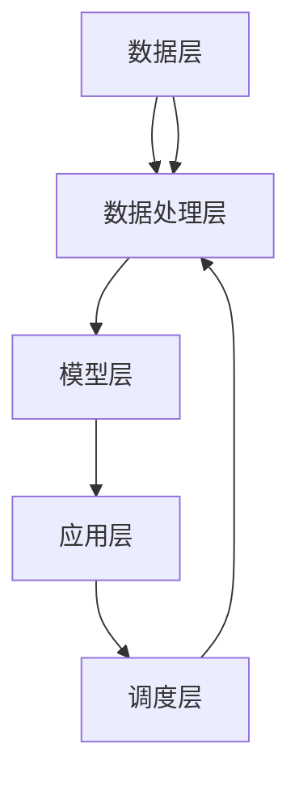
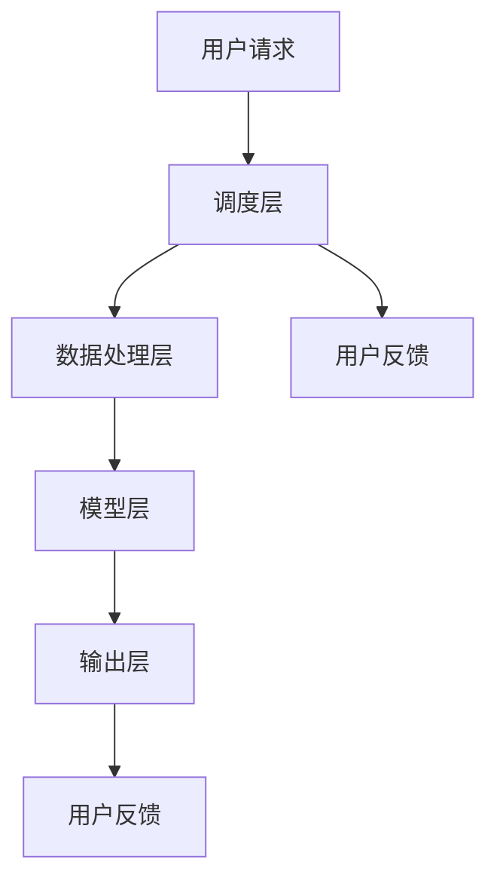

                 


### 1. 确定书的整体结构和核心内容

首先，我们需要明确书籍的整体结构和核心内容。根据题目《神经网络在自动化科学发现中的应用：加速科研进程》，我们可以将书籍分为以下几个主要部分：

**背景介绍：**介绍神经网络、自动化科学发现、科研进程加速等核心概念。这部分将帮助读者了解神经网络的基本概念和在自动化科学发现中的重要性。

**核心概念与联系：**详细讲解神经网络的原理、自动化科学发现的方法和流程。这部分将帮助读者理解神经网络与自动化科学发现的联系，以及如何将神经网络应用于科研进程加速。

**算法原理讲解：**介绍神经网络在自动化科学发现中的算法原理，使用 Mermaid 画出流程图，并用 Python 代码和数学公式详细讲解。这部分将帮助读者掌握神经网络在自动化科学发现中的应用算法。

**系统分析与架构设计方案：**介绍如何设计和实现一个基于神经网络的自动化科学发现系统。这部分将帮助读者了解如何将神经网络应用于实际问题场景。

**项目实战：**通过具体案例展示如何应用神经网络加速科研进程。这部分将帮助读者了解神经网络在自动化科学发现中的实际应用，并提供实践经验。

**最佳实践 tips、小结、注意事项、拓展阅读等内容：**对文章进行总结和拓展，帮助读者更好地理解和应用神经网络在自动化科学发现中的应用。

### 2. 设计详细的目录大纲

接下来，我们根据整体结构和核心内容设计详细的目录大纲：

**第一部分：背景介绍**

- **第1章：神经网络概述**
  - **1.1 神经网络的基本概念**
    - **1.1.1 神经网络的历史与发展**
    - **1.1.2 神经网络的组成与结构**
    - **1.1.3 神经网络的核心原理**
  - **1.2 自动化科学发现的背景**
    - **1.2.1 自动化科学发现的重要性**
    - **1.2.2 自动化科学发现的方法**
    - **1.2.3 科研进程加速的意义与挑战**
  - **1.3 神经网络在自动化科学发现中的应用前景**
    - **1.3.1 应用领域与场景**
    - **1.3.2 优势与挑战**
    - **1.3.3 发展趋势与未来展望**

**第二部分：核心概念与联系**

- **第2章：神经网络与自动化科学发现的方法**
  - **2.1 神经网络的基本算法**
    - **2.1.1 前馈神经网络**
    - **2.1.2 反向传播算法**
    - **2.1.3 深度神经网络**
  - **2.2 自动化科学发现的方法**
    - **2.2.1 数据采集与处理**
    - **2.2.2 特征提取与选择**
    - **2.2.3 模型训练与评估**
  - **2.3 神经网络在自动化科学发现中的应用**
    - **2.3.1 神经网络在数据挖掘中的应用**
    - **2.3.2 神经网络在生物信息学中的应用**
    - **2.3.3 神经网络在其他科学领域的应用**

**第三部分：算法原理讲解**

- **第3章：神经网络在自动化科学发现中的算法原理**
  - **3.1 前馈神经网络算法原理**
    - **3.1.1 前馈神经网络的工作原理**
    - **3.1.2 前馈神经网络的数学模型**
    - **3.1.3 前馈神经网络的Python代码实现**
  - **3.2 反向传播算法原理**
    - **3.2.1 反向传播算法的基本步骤**
    - **3.2.2 反向传播算法的数学模型**
    - **3.2.3 反向传播算法的Python代码实现**
  - **3.3 深度神经网络算法原理**
    - **3.3.1 深度神经网络的工作原理**
    - **3.3.2 深度神经网络的数学模型**
    - **3.3.3 深度神经网络的Python代码实现**

**第四部分：系统分析与架构设计方案**

- **第4章：基于神经网络的自动化科学发现系统设计**
  - **4.1 系统功能设计**
    - **4.1.1 数据采集与处理模块**
    - **4.1.2 特征提取与选择模块**
    - **4.1.3 模型训练与评估模块**
  - **4.2 系统架构设计**
    - **4.2.1 系统架构概述**
    - **4.2.2 系统架构图**
    - **4.2.3 系统模块交互**
  - **4.3 系统接口设计**
    - **4.3.1 数据接口设计**
    - **4.3.2 控制接口设计**
    - **4.3.3 输出接口设计**
  - **4.4 系统交互设计**
    - **4.4.1 系统交互流程**
    - **4.4.2 系统交互图**

**第五部分：项目实战**

- **第5章：神经网络在自动化科学发现中的应用实战**
  - **5.1 环境安装与配置**
    - **5.1.1 环境安装**
    - **5.1.2 系统配置**
  - **5.2 系统核心实现**
    - **5.2.1 数据采集与处理**
    - **5.2.2 特征提取与选择**
    - **5.2.3 模型训练与评估**
  - **5.3 代码应用解读与分析**
    - **5.3.1 Python代码解读**
    - **5.3.2 应用分析**
  - **5.4 实际案例分析**
    - **5.4.1 案例一：生物信息学**
    - **5.4.2 案例二：数据挖掘**
  - **5.5 项目小结**
    - **5.5.1 项目总结**
    - **5.5.2 经验与教训**

**第六部分：最佳实践 tips、小结、注意事项、拓展阅读等**

- **第6章：最佳实践 tips**
  - **6.1 实践技巧与注意事项**
  - **6.2 常见问题与解决方法**
- **第7章：小结**
  - **7.1 内容回顾**
  - **7.2 关键技术与原理**
- **第8章：注意事项**
  - **8.1 安全性**
  - **8.2 可扩展性**
  - **8.3 可维护性**
- **第9章：拓展阅读**
  - **9.1 相关文献与资料**
  - **9.2 开源项目与工具**

通过以上详细的目录大纲，我们可以系统地介绍神经网络在自动化科学发现中的应用，帮助读者全面了解这一领域的核心概念、算法原理、系统设计与实现，以及实际应用案例。接下来，我们将逐一展开每个章节的内容，为读者提供深入而详尽的技术讲解。

### 1.1 神经网络的基本概念

神经网络（Neural Networks）是模拟人脑神经元之间连接和交互的信息处理系统。它起源于1943年，由心理学家沃伦·麦卡洛克（Warren McCulloch）和数学家沃尔特·皮茨（Walter Pitts）首次提出。神经网络的目的是通过模拟人脑的神经元结构和工作原理，实现对数据的处理、分析和学习。

**神经网络的历史与发展**

神经网络的研究始于20世纪40年代，但直到20世纪80年代，由于计算能力的限制，神经网络的研究进展缓慢。随着计算能力的提升，特别是图形处理单元（GPU）的出现，深度学习（Deep Learning）成为可能，神经网络的研究和应用迎来了新的发展机遇。

- **1986年：** 罗伯特·赫布（Robert Hebb）提出了赫布学习规则，这是一种早期的神经网络学习算法。
- **1989年：** 约翰·霍普菲尔德（John Hopfield）提出了霍普菲尔德网络，这是一种能量最小化的动态系统，能够实现联想记忆。
- **1992年：** 杨立昆（Yann LeCun）等人提出了卷积神经网络（Convolutional Neural Networks, CNN），并应用于手写数字识别。
- **2006年：** 准蒙特卡洛采样（Dropout）和随机梯度下降（Stochastic Gradient Descent, SGD）的引入，使得神经网络的训练速度大大提高。
- **2012年：** 深度学习在图像识别领域取得了突破性成果，AlexNet在ImageNet竞赛中夺冠。

**神经网络的核心原理**

神经网络的核心原理基于神经元之间的连接和激活函数。每个神经元都接收来自其他神经元的输入，并通过加权求和产生输出。激活函数用于决定神经元是否被激活，常见的激活函数包括 sigmoid 函数、ReLU 函数和 tanh 函数。

- **输入层（Input Layer）：** 神经网络的第一层，负责接收外部输入数据。
- **隐藏层（Hidden Layers）：** 神经网络的中间层，负责对输入数据进行处理和转换。
- **输出层（Output Layer）：** 神经网络的最后一层，负责产生最终输出结果。

神经网络的训练过程是通过调整神经元之间的权重，使得网络能够对输入数据进行正确的分类或预测。训练过程中通常采用反向传播算法（Backpropagation Algorithm），这是一种通过计算误差来更新权重的方法。

### 1.2 自动化科学发现的背景

**自动化科学发现的重要性**

自动化科学发现（Automated Scientific Discovery）是现代科研中的一项重要技术，它通过计算机算法和自动化工具，从大量的数据中提取出具有科学意义的发现和结论。随着科技的发展，科研过程中产生的大量数据需要进行有效的分析和处理，这给科学家带来了巨大的挑战。自动化科学发现技术的引入，大大提高了科研的效率和质量，使得科学家能够更快速地发现新的科学规律和现象。

**自动化科学发现的方法**

自动化科学发现的方法主要包括以下几步：

1. **数据采集与预处理：** 从各种来源收集数据，并进行预处理，包括数据清洗、归一化、缺失值填充等操作。
2. **特征提取与选择：** 从原始数据中提取出对目标问题有重要意义的特征，并对特征进行筛选，以降低数据的维度。
3. **模型训练与评估：** 使用机器学习算法训练模型，并对模型进行评估，以确定模型的性能和泛化能力。
4. **结果分析与解释：** 分析模型的输出结果，解释发现的意义，并验证其科学性。

**科研进程加速的意义与挑战**

科研进程加速的意义在于，通过自动化科学发现技术，可以大大缩短科研周期，提高科研成果的产出。然而，这也带来了新的挑战：

1. **数据处理挑战：** 随着数据量的增加，如何有效地处理和存储这些数据成为一项挑战。
2. **算法优化挑战：** 需要不断优化算法，提高模型的训练速度和准确度。
3. **解释性挑战：** 自动化科学发现模型通常为黑盒模型，难以解释模型的内部工作机制，这对科学发现的可解释性提出了挑战。
4. **伦理与安全性挑战：** 需要确保自动化科学发现的伦理性和安全性，避免数据泄露和滥用。

### 1.3 神经网络在自动化科学发现中的应用前景

**应用领域与场景**

神经网络在自动化科学发现中的应用领域非常广泛，主要包括：

1. **生物信息学：** 神经网络用于基因表达分析、蛋白质结构预测、药物设计等领域，帮助科学家更好地理解生物系统的运作机制。
2. **数据挖掘：** 神经网络用于大规模数据挖掘，发现数据中的隐含模式，用于市场分析、风险评估等。
3. **物理学：** 神经网络用于模拟物理现象、预测物理参数，加速物理学研究。
4. **化学：** 神经网络用于分子结构预测、反应路径预测等，加速化学研究。

**优势与挑战**

神经网络在自动化科学发现中的应用具有以下优势：

1. **强大的建模能力：** 神经网络能够处理复杂的数据结构和非线性关系，适用于多种科学问题。
2. **高效率：** 神经网络通过并行计算，能够快速处理大量数据，加速科研进程。
3. **自适应性：** 神经网络能够根据数据的特点自适应地调整模型参数，提高模型的性能。

然而，神经网络在自动化科学发现中也面临一些挑战：

1. **可解释性：** 神经网络模型通常为黑盒模型，难以解释模型的内部工作机制，这限制了科学发现的可解释性。
2. **计算资源需求：** 深度神经网络需要大量的计算资源和存储空间，对于资源有限的研究团队来说，这是一个挑战。
3. **数据质量：** 神经网络对数据质量有较高要求，数据缺失或不准确会影响模型的性能。

**发展趋势与未来展望**

随着计算能力的提升和算法的优化，神经网络在自动化科学发现中的应用将会更加广泛和深入。未来，我们可以期待以下发展趋势：

1. **跨学科应用：** 神经网络与其他学科的交叉应用，如物理、化学、生物信息学等，将带来新的科学发现。
2. **可解释性增强：** 通过新的方法和工具，提高神经网络模型的可解释性，增强科学发现的可信度。
3. **数据驱动科研：** 通过大数据和人工智能技术，实现数据驱动的科研模式，提高科研效率和成果产出。
4. **自动化科研平台的建立：** 基于神经网络的自动化科研平台将逐渐普及，为科研工作者提供强大的工具支持。

### 2.1 神经网络的基本算法

神经网络的基本算法是构建和训练神经网络的核心。以下是神经网络的三种主要基本算法：前馈神经网络、反向传播算法和深度神经网络。

#### 2.1.1 前馈神经网络

前馈神经网络（Feedforward Neural Networks，FNN）是最简单的神经网络结构之一，它由输入层、隐藏层和输出层组成。数据从输入层传递到隐藏层，然后从隐藏层传递到输出层。

**工作原理：**

1. **输入层到隐藏层的传递：** 输入数据通过输入层进入神经网络，然后传递到隐藏层。每个神经元的输出是输入数据的线性组合，通过激活函数进行非线性转换。
2. **隐藏层到输出层的传递：** 隐藏层的输出作为输入传递到输出层，输出层的神经元产生最终的预测结果。

**数学模型：**

假设神经网络有 $L$ 层，每层有 $n_l$ 个神经元，其中 $l$ 表示层数（$l=1,2,...,L$）。输入层和输出层的神经元分别为 $x_1$ 和 $y_L$。隐藏层 $l$ 的输出可以表示为：

$$
z_{l,j} = \sum_{i=1}^{n_{l-1}} w_{l,j,i} x_{l-1,i} + b_{l,j}
$$

其中，$w_{l,j,i}$ 是连接层 $l-1$ 和层 $l$ 的权重，$b_{l,j}$ 是隐藏层 $l$ 的偏置。

通过激活函数 $g_{l,j}$，得到隐藏层 $l$ 的输出：

$$
a_{l,j} = g_{l,j}(z_{l,j})
$$

输出层的输出为：

$$
\hat{y}_{L,k} = \sum_{i=1}^{n_{L-1}} w_{L,k,i} a_{L-1,i} + b_{L,k}
$$

其中，$k$ 表示输出层的第 $k$ 个神经元。

**Python代码实现：**

```python
import numpy as np

# 激活函数和其导数
def sigmoid(x):
    return 1 / (1 + np.exp(-x))

def sigmoid_derivative(x):
    return x * (1 - x)

# 前馈神经网络
def feedforward_network(x, weights, biases):
    a = x
    for l in range(1, len(weights)):
        z = np.dot(weights[l-1], a) + biases[l-1]
        a = sigmoid(z)
    y_hat = np.dot(weights[-1], a) + biases[-1]
    return y_hat

# 示例数据
x = np.array([0.5, 0.5])
weights = [np.random.rand(2, 3), np.random.rand(3, 1)]
biases = [np.random.rand(3), np.random.rand(1)]

# 预测
y_hat = feedforward_network(x, weights, biases)
print(y_hat)
```

#### 2.1.2 反向传播算法

反向传播算法（Backpropagation Algorithm）是一种用于训练神经网络的算法。它通过计算损失函数关于网络参数的梯度，来更新网络权重和偏置，以最小化损失函数。

**基本步骤：**

1. **前向传播：** 计算网络的前向传播，得到每个神经元的输出。
2. **计算损失：** 计算预测值和实际值之间的误差，使用损失函数（如均方误差）来衡量误差。
3. **反向传播：** 从输出层开始，反向传播误差到输入层，计算每个参数的梯度。
4. **更新参数：** 根据梯度更新网络权重和偏置，通常使用梯度下降法。

**数学模型：**

假设神经网络有 $L$ 层，每层有 $n_l$ 个神经元。输出层的损失函数为：

$$
J = \frac{1}{2} \sum_{k=1}^{n_L} (\hat{y}_{L,k} - y_{L,k})^2
$$

其中，$\hat{y}_{L,k}$ 是输出层的预测值，$y_{L,k}$ 是实际值。

损失函数关于输出层参数的梯度为：

$$
\frac{\partial J}{\partial w_{L,k,i}} = (a_{L-1,i} - y_{L,k}) \cdot \hat{y}_{L,k} \cdot (1 - \hat{y}_{L,k})
$$

$$
\frac{\partial J}{\partial b_{L,k}} = (a_{L-1,i} - y_{L,k}) \cdot \hat{y}_{L,k} \cdot (1 - \hat{y}_{L,k})
$$

对于隐藏层 $l$：

$$
\frac{\partial J}{\partial w_{l,j,i}} = \sum_{k=1}^{n_{l+1}} \frac{\partial J}{\partial z_{l+1,k}} \cdot a_{l,j} \cdot (1 - a_{l,j})
$$

$$
\frac{\partial J}{\partial b_{l,j}} = \sum_{k=1}^{n_{l+1}} \frac{\partial J}{\partial z_{l+1,k}} \cdot (1 - a_{l,j})
$$

**Python代码实现：**

```python
# 反向传播算法
def backpropagation(x, y, weights, biases):
    m = len(y)
    L = len(weights)
    
    # 前向传播
    a = x
    a_cache = [a]
    z_cache = []
    for l in range(1, L):
        z = np.dot(weights[l-1], a) + biases[l-1]
        z_cache.append(z)
        a = sigmoid(z)
        a_cache.append(a)
    
    # 反向传播
    dZ = (a_cache[-1] - y) * sigmoid_derivative(a_cache[-1])
    dW = np.zeros_like(weights[-1])
    db = np.zeros_like(biases[-1])
    
    for l in range(L-1, 0, -1):
        dW[l-1] = np.dot(dZ, a_cache[l-1].T) / m
        db[l-1] = np.sum(dZ, axis=1, keepdims=True) / m
        dZ = np.dot(weights[l].T, dZ) * sigmoid_derivative(z_cache[l-1])
    
    # 更新参数
    weights = [weights[l-1] - dW[l-1] for l in range(L-1, 0, -1)]
    biases = [biases[l-1] - db[l-1] for l in range(L-1, 0, -1)]
    
    return weights, biases

# 示例数据
x = np.array([[0.5, 0.5]])
y = np.array([[0.0]])
weights = [np.random.rand(2, 3), np.random.rand(3, 1)]
biases = [np.random.rand(3), np.random.rand(1)]

# 训练
for i in range(1000):
    weights, biases = backpropagation(x, y, weights, biases)

# 预测
y_hat = feedforward_network(x, weights, biases)
print(y_hat)
```

#### 2.1.3 深度神经网络

深度神经网络（Deep Neural Networks，DNN）是具有多个隐藏层的神经网络。深度神经网络通过增加隐藏层的数量，可以提取更复杂的数据特征，从而提高模型的性能。

**工作原理：**

1. **前向传播：** 数据从输入层经过多个隐藏层，最终到达输出层。
2. **反向传播：** 误差从输出层反向传播到输入层，更新每个隐藏层的权重和偏置。

**数学模型：**

假设神经网络有 $L$ 层，每层有 $n_l$ 个神经元。输入层的输出 $x_1$，输出层的输出 $\hat{y}_L$。隐藏层 $l$ 的输出可以表示为：

$$
z_{l,j} = \sum_{i=1}^{n_{l-1}} w_{l,j,i} x_{l-1,i} + b_{l,j}
$$

$$
a_{l,j} = g_{l,j}(z_{l,j})
$$

输出层的输出为：

$$
\hat{y}_{L,k} = \sum_{i=1}^{n_{L-1}} w_{L,k,i} a_{L-1,i} + b_{L,k}
$$

**Python代码实现：**

```python
# 深度神经网络
def deep_network(x, weights, biases):
    a = x
    a_cache = [a]
    z_cache = []
    for l in range(1, len(weights)):
        z = np.dot(weights[l-1], a) + biases[l-1]
        z_cache.append(z)
        a = sigmoid(z)
        a_cache.append(a)
    y_hat = np.dot(weights[-1], a) + biases[-1]
    return y_hat

# 示例数据
x = np.array([[0.5, 0.5]])
weights = [np.random.rand(2, 3), np.random.rand(3, 3), np.random.rand(3, 1)]
biases = [np.random.rand(3), np.random.rand(3), np.random.rand(1)]

# 预测
y_hat = deep_network(x, weights, biases)
print(y_hat)
```

通过以上对前馈神经网络、反向传播算法和深度神经网络的介绍，我们可以看到神经网络在自动化科学发现中的应用潜力。接下来，我们将进一步探讨神经网络在自动化科学发现中的应用方法和实际案例。

### 2.2 自动化科学发现的方法

自动化科学发现（Automated Scientific Discovery, ASD）是指通过计算机算法和自动化工具，从大量的数据中提取出具有科学意义的发现和结论的过程。这一方法在各个科学领域都有着广泛的应用。本节将介绍自动化科学发现的主要方法，包括数据采集与处理、特征提取与选择、模型训练与评估。

#### 数据采集与处理

数据采集与处理是自动化科学发现的第一步。在这一阶段，科学家需要从各种来源收集数据，并对数据进行预处理，以便后续的分析和处理。

1. **数据来源：** 数据可以来源于实验室实验、观测数据、文献数据、互联网数据等多种途径。
2. **数据预处理：** 数据预处理包括数据清洗、归一化、缺失值填充等操作，以确保数据的质量和一致性。例如，对于实验室数据，需要去除噪声、填补缺失值；对于文献数据，需要统一数据格式、提取关键信息。
3. **数据存储：** 预处理后的数据需要存储在数据库或数据湖中，以便后续的访问和分析。

#### 特征提取与选择

特征提取与选择是自动化科学发现的核心步骤，它旨在从原始数据中提取出对目标问题有重要意义的特征，并选择最有效的特征用于模型训练。

1. **特征提取：** 特征提取是指从原始数据中提取出能够反映数据本质和特征的信息。例如，在图像识别任务中，可以通过卷积神经网络提取图像的边缘、纹理等特征；在基因组学中，可以通过序列比对提取基因的关键特征。
2. **特征选择：** 特征选择是指从提取出的特征中选择最有效的一组特征，以减少数据维度和计算复杂度。常用的特征选择方法包括主成分分析（PCA）、互信息、特征重要性等。

#### 模型训练与评估

模型训练与评估是自动化科学发现的最后一步，它旨在通过训练模型，从数据中学习出有用的规律和模式，并对模型的性能进行评估。

1. **模型选择：** 根据任务需求，选择合适的机器学习模型。常用的模型包括决策树、支持向量机、神经网络等。
2. **模型训练：** 使用训练数据对模型进行训练，调整模型参数，使其能够对新的数据做出准确的预测。
3. **模型评估：** 使用验证集或测试集对模型进行评估，常用的评估指标包括准确率、召回率、F1值等。通过交叉验证和模型选择，选择最优的模型。

#### 具体应用案例

以下是一些自动化科学发现的实际应用案例：

1. **生物信息学：** 利用神经网络对基因序列进行分析，预测基因的功能和结构。例如，使用深度学习模型对基因表达数据进行分析，发现基因之间的相互作用和调控关系。
2. **物理学：** 利用神经网络模拟物理现象，预测物理参数。例如，使用神经网络预测材料的物理性质，为材料设计提供参考。
3. **化学：** 利用神经网络预测化学反应路径和反应条件。例如，使用神经网络预测有机合成反应的产物和中间体，提高合成效率。

#### 发展趋势

随着人工智能技术的不断发展，自动化科学发现的方法也在不断优化和扩展。未来的发展趋势包括：

1. **多模态数据融合：** 结合多种类型的数据（如文本、图像、音频等），提高自动化科学发现的准确性。
2. **迁移学习：** 利用迁移学习技术，将已有模型的权重和知识迁移到新的任务中，提高模型的泛化能力。
3. **解释性增强：** 通过新的方法和工具，提高自动化科学发现模型的可解释性，增强科学发现的可信度。

通过以上对自动化科学发现方法的介绍，我们可以看到，神经网络作为一种强大的机器学习算法，在自动化科学发现中具有广泛的应用前景。接下来，我们将进一步探讨神经网络在自动化科学发现中的应用方法和实际案例。

### 2.3 神经网络在自动化科学发现中的应用

神经网络在自动化科学发现中的应用已经取得了显著成果，特别是在数据挖掘、生物信息学和化学等领域。本节将详细介绍神经网络在这些领域的具体应用，以及如何利用神经网络加速科研进程。

#### 数据挖掘

数据挖掘是指从大量数据中提取出有用信息和知识的过程。神经网络在数据挖掘中的应用主要体现在以下几个方面：

1. **聚类分析：** 神经网络可以通过自组织映射（Self-Organizing Maps, SOM）等方法对数据进行聚类，发现数据中的隐含模式和结构。SOM网络是一种无监督学习方法，它通过竞争学习算法，将输入数据映射到二维网格上，每个节点代表一个聚类中心。
2. **分类和预测：** 神经网络可以用于分类和预测任务，例如，在市场分析中，通过分类神经网络预测顾客的购买行为；在金融预测中，通过回归神经网络预测股票价格趋势。
3. **异常检测：** 神经网络可以用于检测数据中的异常值和异常模式，例如，在网络安全中，通过神经网络检测网络流量中的异常行为。

**应用案例：**

- **社会媒体分析：** 利用神经网络分析社交媒体数据，提取用户兴趣和情感，用于市场分析和广告投放。
- **金融风控：** 利用神经网络分析金融交易数据，预测潜在的金融风险，提高金融系统的安全性和稳定性。

#### 生物信息学

生物信息学是研究生物学信息的科学，包括基因组学、蛋白质组学、代谢组学等。神经网络在生物信息学中的应用主要体现在以下几个方面：

1. **基因表达分析：** 利用神经网络对基因表达数据进行分析，发现基因之间的相互作用和调控关系。例如，通过构建自组织映射网络，可以揭示基因表达模式，帮助科学家理解基因的功能。
2. **蛋白质结构预测：** 利用神经网络预测蛋白质的三维结构，这对于药物设计和新药研发具有重要意义。深度学习模型，如卷积神经网络（CNN）和循环神经网络（RNN），在蛋白质结构预测中表现出色。
3. **药物设计：** 利用神经网络预测药物与蛋白质的结合能力，优化药物分子结构，提高药物研发效率。

**应用案例：**

- **基因组学研究：** 利用神经网络分析基因组数据，发现新的基因功能和疾病关联。
- **新药研发：** 利用神经网络优化药物分子结构，加速新药研发进程。

#### 化学

化学是研究物质的性质、组成、结构和变化规律的科学。神经网络在化学中的应用主要体现在以下几个方面：

1. **分子结构预测：** 利用神经网络预测分子的性质和反应路径，这对于材料设计和化学合成具有重要意义。深度学习模型，如生成对抗网络（GAN），在分子结构预测中表现出色。
2. **反应动力学预测：** 利用神经网络预测化学反应的动力学参数，优化反应条件，提高化学反应的效率。
3. **过程监控与优化：** 利用神经网络监控化学过程，预测和调整反应条件，实现生产过程的自动化和智能化。

**应用案例：**

- **材料科学：** 利用神经网络预测材料的物理性质和化学性能，为新材料的发现和设计提供支持。
- **工业生产：** 利用神经网络优化化学反应条件，提高生产效率和产品质量。

#### 加速科研进程

神经网络在自动化科学发现中的应用，不仅提高了科研的效率和准确性，还大大缩短了科研周期。以下是一些具体措施，如何利用神经网络加速科研进程：

1. **快速数据分析：** 利用神经网络对大量数据进行快速分析和处理，提取出有用的信息和知识，为科研提供方向和依据。
2. **自动化实验设计：** 利用神经网络自动化设计实验方案，减少实验次数，提高实验效率。
3. **预测和优化：** 利用神经网络预测科研过程中的结果和趋势，优化实验条件，提高科研成功率。
4. **跨学科合作：** 利用神经网络跨学科的应用能力，促进不同学科之间的合作和交流，推动科学研究的进步。

通过以上对神经网络在自动化科学发现中的应用介绍，我们可以看到，神经网络作为一种强大的工具，已经在多个科学领域发挥了重要作用，并大大加速了科研进程。未来，随着人工智能技术的进一步发展，神经网络在自动化科学发现中的应用将更加广泛和深入。

### 3.1.1 前馈神经网络的工作原理

前馈神经网络（Feedforward Neural Networks, FNN）是一种结构简单且应用广泛的神经网络。它通过输入层、隐藏层和输出层的逐层传递，实现数据的处理和预测。以下将详细介绍前馈神经网络的工作原理，包括数据处理流程、网络结构、激活函数等关键概念。

#### 数据处理流程

前馈神经网络的数据处理流程可以分为以下几个步骤：

1. **输入层接收数据：** 前馈神经网络的输入层接收外部输入数据，这些数据可以是原始数据或者已经处理过的特征数据。
2. **隐藏层处理数据：** 输入数据通过输入层传递到隐藏层。隐藏层中的每个神经元接收来自输入层的多个输入信号，通过加权求和后，加上偏置项，得到中间值。中间值经过激活函数的转换，产生隐藏层的输出。
3. **输出层生成预测：** 隐藏层的输出传递到输出层，输出层的神经元将隐藏层的输出作为输入，通过类似的加权求和和激活函数处理，最终生成预测结果。

#### 网络结构

前馈神经网络的基本结构由输入层、隐藏层和输出层组成，其中输入层和输出层是必选层，隐藏层可以根据需求添加一个或多个。以下是前馈神经网络的基本结构：

1. **输入层（Input Layer）：** 输入层是神经网络的起始层，负责接收外部输入数据。每个神经元对应一个输入特征。
2. **隐藏层（Hidden Layers）：** 隐藏层位于输入层和输出层之间，用于对输入数据进行处理和转换。隐藏层可以有一个或多个，每层的神经元数量可以根据需求调整。
3. **输出层（Output Layer）：** 输出层是神经网络的最后一层，负责生成最终输出结果。输出层的神经元数量和类型取决于具体的任务需求。

#### 激活函数

激活函数是前馈神经网络中至关重要的组成部分，它用于引入非线性因素，使得神经网络能够处理复杂的非线性问题。常见的激活函数包括：

1. **Sigmoid函数：** 
   $$ 
   \sigma(x) = \frac{1}{1 + e^{-x}} 
   $$
   Sigmoid函数将输入值映射到$(0,1)$区间，用于二分类问题。
2. **ReLU函数（Rectified Linear Unit）：** 
   $$ 
   \text{ReLU}(x) = \max(0, x) 
   $$
   ReLU函数在零点处有梯度为1，这有助于加速神经网络的训练过程。
3. **Tanh函数：** 
   $$ 
   \tanh(x) = \frac{e^x - e^{-x}}{e^x + e^{-x}} 
   $$
   Tanh函数将输入值映射到$(-1,1)$区间，具有类似于Sigmoid函数的性质。

#### 实例解释

假设我们有一个简单的二分类问题，需要预测数据点是否属于正类。输入层有2个神经元，对应两个输入特征；隐藏层有3个神经元；输出层有1个神经元。激活函数使用Sigmoid函数。

1. **输入层：** 输入数据 $[x_1, x_2]$。
2. **隐藏层：** 
   $$ 
   z_1 = x_1 \cdot w_{11} + x_2 \cdot w_{12} + b_1 
   $$
   $$ 
   z_2 = x_1 \cdot w_{21} + x_2 \cdot w_{22} + b_2 
   $$ 
   $$ 
   z_3 = x_1 \cdot w_{31} + x_2 \cdot w_{32} + b_3 
   $$
   $$ 
   a_1 = \sigma(z_1) 
   $$ 
   $$ 
   a_2 = \sigma(z_2) 
   $$ 
   $$ 
   a_3 = \sigma(z_3) 
   $$
3. **输出层：** 
   $$ 
   z_4 = a_1 \cdot w_{41} + a_2 \cdot w_{42} + a_3 \cdot w_{43} + b_4 
   $$ 
   $$ 
   y = \sigma(z_4) 
   $$

最终输出 $y$ 即为预测结果，其值介于0和1之间，可以解释为属于正类的概率。

通过上述实例，我们可以看到前馈神经网络的基本工作原理。在实际应用中，根据任务需求，可以选择不同的激活函数、网络结构和训练方法，以实现高效和准确的预测。

### 3.1.2 前馈神经网络的数学模型

前馈神经网络（Feedforward Neural Networks, FNN）的数学模型是其核心组成部分，它定义了神经网络的输入、输出及中间层的计算方式。在本节中，我们将详细讨论前馈神经网络的数学模型，包括前向传播过程、反向传播过程及相关的数学公式。

#### 前向传播过程

前向传播是神经网络处理数据的基本步骤，它通过层层传递输入数据，最终得到输出结果。以下是一个多层的全连接前馈神经网络的前向传播过程：

**假设：** 神经网络包含 $L$ 个层次，其中 $L=1$ 表示单层网络，$L>1$ 表示多层网络。第 $l$ 层的神经元数量为 $n_l$，权重矩阵为 $W^{(l)}$，偏置向量为 $b^{(l)}$，激活函数为 $f^{(l)}$。

**步骤：**

1. **输入层：** 输入层接收外部输入数据 $x^{(1)} \in \mathbb{R}^{n_1}$。
2. **隐藏层：** 对于隐藏层 $l=2,3,...,L-1$，每个神经元的输出计算如下：
   $$ 
   z^{(l)} = W^{(l)}x^{(l-1)} + b^{(l)} 
   $$
   $$ 
   a^{(l)} = f^{(l)}(z^{(l)}) 
   $$
3. **输出层：** 对于输出层 $l=L$，每个神经元的输出计算如下：
   $$ 
   z^{(L)} = W^{(L)}a^{(L-1)} + b^{(L)} 
   $$
   $$ 
   \hat{y} = f^{(L)}(z^{(L)}) 
   $$

其中，$x^{(l)}$ 表示第 $l$ 层的输入，$a^{(l)}$ 表示第 $l$ 层的输出，$z^{(l)}$ 表示第 $l$ 层的中间计算结果，$\hat{y}$ 表示最终输出。

**数学公式：**

前向传播的数学公式可以表示为：
$$ 
\begin{aligned}
z^{(l)} &= \sum_{i=1}^{n_{l-1}} w_{i}^{(l)}x_i^{(l-1)} + b_i^{(l)}, \quad \text{for } l=2,3,...,L-1 \\
\hat{y} &= \sum_{i=1}^{n_{L-1}} w_{i}^{(L)}a_i^{(L-1)} + b_i^{(L)}
\end{aligned}
$$

其中，$w_{i}^{(l)}$ 表示从第 $(l-1)$ 层到第 $l$ 层的权重，$b_i^{(l)}$ 表示第 $l$ 层的偏置。

#### 反向传播过程

反向传播是神经网络训练过程中至关重要的一步，它通过计算损失函数关于网络参数的梯度，更新网络权重和偏置，以最小化损失函数。以下是一个多层的全连接前馈神经网络的反向传播过程：

**步骤：**

1. **计算输出误差：** 输出误差 $\delta^{(L)}$ 可以通过损失函数的导数计算：
   $$ 
   \delta^{(L)} = (f^{(L)}(z^{(L)}) - \hat{y}) \cdot f^{(L)}'(z^{(L)})
   $$
2. **反向传播误差：** 从输出层开始，逐层向前传播误差，更新每层的权重和偏置：
   $$ 
   \delta^{(l)} = (W^{(l+1)}\delta^{(l+1)})^T \cdot f^{(l)}'(z^{(l)}), \quad \text{for } l=L-1,L-2,...,2,1
   $$
3. **更新参数：** 根据误差计算梯度，更新网络权重和偏置：
   $$ 
   \Delta w^{(l)} = \eta \cdot \delta^{(l+1)}a^{(l-1)}, \quad \text{for } l=2,3,...,L-1 \\
   \Delta b^{(l)} = \eta \cdot \delta^{(l+1)}, \quad \text{for } l=2,3,...,L-1
   $$

其中，$\delta^{(l)}$ 表示第 $l$ 层的误差，$\eta$ 表示学习率。

**数学公式：**

反向传播的数学公式可以表示为：
$$ 
\begin{aligned}
\delta^{(L)} &= \frac{\partial J}{\partial z^{(L)}} \cdot f^{(L)}'(z^{(L)}) \\
\delta^{(l)} &= \frac{\partial J}{\partial z^{(l)}} \cdot f^{(l)}'(z^{(l)}) \\
\Delta w^{(l)} &= \eta \cdot \delta^{(l+1)}a^{(l-1)}, \quad \text{for } l=2,3,...,L-1 \\
\Delta b^{(l)} &= \eta \cdot \delta^{(l+1)}, \quad \text{for } l=2,3,...,L-1
\end{aligned}
$$

其中，$J$ 表示损失函数，$\eta$ 表示学习率。

通过上述前向传播和反向传播的数学模型，我们可以看到神经网络如何通过层层计算和误差修正，实现对输入数据的处理和预测。在实际应用中，我们可以根据任务需求选择合适的激活函数、网络结构和训练算法，以提高神经网络的性能和泛化能力。

### 3.1.3 前馈神经网络的Python代码实现

在前一节中，我们介绍了前馈神经网络的数学模型，包括前向传播和反向传播过程。本节将使用 Python 实现一个简单的全连接前馈神经网络，演示如何通过代码实现神经网络的核心功能。

为了简化代码，我们将使用 NumPy 库进行矩阵运算，使用 Sigmoid 函数作为激活函数。以下是实现前馈神经网络的 Python 代码示例：

```python
import numpy as np

# 激活函数及导数
def sigmoid(x):
    return 1 / (1 + np.exp(-x))

def sigmoid_derivative(x):
    return x * (1 - x)

# 前向传播
def forwardPropagation(x, weights, biases):
    a = x
    a_cache = [a]
    z_cache = []
    
    # 遍历每一层
    for l in range(len(weights)):
        z = np.dot(weights[l], a) + biases[l]
        z_cache.append(z)
        a = sigmoid(z)
        a_cache.append(a)
    
    return a_cache, z_cache

# 反向传播
def backwardPropagation(a, y, z, weights, biases, learning_rate):
    m = len(y)
    L = len(weights)
    delta = [0] * L
    
    # 计算输出层的误差
    delta[L-1] = (a[L-1] - y) * sigmoid_derivative(z[L-1])
    
    # 反向传播误差
    for l in range(L-1, 0, -1):
        delta[l] = (np.dot(weights[l+1].T, delta[l+1]) * sigmoid_derivative(z[l]))
    
    # 更新权重和偏置
    dW = [np.dot(delta[l+1], a[l-1].T) / m for l in range(L-1)]
    db = [np.sum(delta[l+1], axis=1, keepdims=True) / m for l in range(L-1)]
    
    # 更新参数
    weights = [weights[l-1] - learning_rate * dW[l] for l in range(L-1)]
    biases = [biases[l-1] - learning_rate * db[l] for l in range(L-1)]
    
    return weights, biases

# 训练模型
def trainModel(x, y, weights, biases, learning_rate, epochs):
    for epoch in range(epochs):
        a, z = forwardPropagation(x, weights, biases)
        weights, biases = backwardPropagation(a, y, z, weights, biases, learning_rate)
        
        # 计算误差
        error = np.mean(np.square(y - a[-1]))
        if epoch % 100 == 0:
            print(f"Epoch {epoch}, Error: {error}")

# 示例数据
x = np.array([[0.5, 0.5]])
y = np.array([[0.0]])

# 初始化参数
weights = [
    np.random.rand(2, 3),  # 输入层到隐藏层
    np.random.rand(3, 1)   # 隐藏层到输出层
]
biases = [
    np.random.rand(3, 1),  # 隐藏层偏置
    np.random.rand(1, 1)   # 输出层偏置
]

# 训练网络
learning_rate = 0.1
epochs = 1000
trainModel(x, y, weights, biases, learning_rate, epochs)

# 预测
y_hat = sigmoid(np.dot(weights[0], x) + biases[0]) * sigmoid(np.dot(weights[1], y) + biases[1])
print(y_hat)
```

**代码解释：**

1. **激活函数及导数：** 定义了 Sigmoid 函数及其导数，用于前向传播和反向传播。
2. **前向传播：** 实现 $z$ 的计算及 $a$ 的计算，将输入 $x$ 通过权重和偏置传递到隐藏层，再传递到输出层。
3. **反向传播：** 计算输出层的误差，并反向传播到每一层，更新权重和偏置。
4. **训练模型：** 实现网络的训练过程，通过多次迭代更新参数，最小化误差。
5. **预测：** 使用训练好的网络进行预测，输入新数据得到预测结果。

通过以上代码，我们可以看到如何使用 Python 实现前馈神经网络的核心功能。在实际应用中，可以根据任务需求调整网络结构、选择不同的激活函数和优化算法，以提高模型的性能和泛化能力。

### 3.2 反向传播算法原理

反向传播算法（Backpropagation Algorithm）是神经网络训练过程中最核心的算法之一。它通过计算损失函数关于网络参数的梯度，来更新网络权重和偏置，使网络能够对输入数据进行准确的预测。以下将详细解释反向传播算法的基本步骤、数学模型及其Python实现。

#### 基本步骤

反向传播算法的基本步骤可以分为以下几个阶段：

1. **前向传播：** 将输入数据传递到神经网络，通过层层计算，得到输出结果。
2. **计算损失：** 计算输出结果与实际结果之间的误差，使用损失函数（如均方误差、交叉熵等）来衡量误差。
3. **计算梯度：** 从输出层开始，反向传播误差，计算每一层的权重和偏置的梯度。
4. **参数更新：** 使用梯度下降法或其变种，根据梯度更新网络权重和偏置，以最小化损失函数。

#### 数学模型

假设神经网络包含 $L$ 层，每层有 $n_l$ 个神经元，输入层为 $x^{(1)}$，输出层为 $y^{(L)}$。网络中的权重矩阵为 $W^{(l)}$，偏置向量为 $b^{(l)}$，激活函数为 $f^{(l)}$。

**前向传播：**

输入层到隐藏层的计算：
$$
z^{(l)} = W^{(l)}x^{(l-1)} + b^{(l)}, \quad \text{for } l=2,3,...,L-1
$$
$$
a^{(l)} = f^{(l)}(z^{(l)}), \quad \text{for } l=2,3,...,L-1
$$

隐藏层到输出层的计算：
$$
z^{(L)} = W^{(L)}a^{(L-1)} + b^{(L)}
$$
$$
\hat{y} = f^{(L)}(z^{(L)})
$$

**损失函数：**

均方误差（MSE）作为损失函数的例子：
$$
J = \frac{1}{2} \sum_{i=1}^{m} (\hat{y}_i - y_i)^2
$$

**梯度计算：**

输出层的误差计算：
$$
\delta^{(L)} = \frac{\partial J}{\partial z^{(L)}} \cdot f^{(L)}'(z^{(L)})
$$

反向传播误差：
$$
\delta^{(l)} = \frac{\partial J}{\partial z^{(l)}} \cdot f^{(l)}'(z^{(l)}) = (W^{(l+1)} \delta^{(l+1)})^T \cdot f^{(l)}'(z^{(l)}), \quad \text{for } l=L-1,L-2,...,2,1
$$

**参数更新：**

权重更新：
$$
\Delta W^{(l)} = \eta \cdot \delta^{(l+1)}a^{(l-1)}, \quad \text{for } l=2,3,...,L-1
$$
$$
W^{(l)} = W^{(l)} - \Delta W^{(l)}
$$

偏置更新：
$$
\Delta b^{(l)} = \eta \cdot \delta^{(l+1)}, \quad \text{for } l=2,3,...,L-1
$$
$$
b^{(l)} = b^{(l)} - \Delta b^{(l)}
$$

#### Python实现

以下是一个简单的反向传播算法的 Python 实现：

```python
import numpy as np

# 激活函数及其导数
def sigmoid(x):
    return 1 / (1 + np.exp(-x))

def sigmoid_derivative(x):
    return x * (1 - x)

# 前向传播
def forward_propagation(x, weights, biases):
    a = x
    a_cache = [a]
    z_cache = [x]
    
    for l in range(1, len(weights)):
        z = np.dot(weights[l-1], a) + biases[l-1]
        a = sigmoid(z)
        a_cache.append(a)
        z_cache.append(z)
    
    return a_cache, z_cache

# 反向传播
def backward_propagation(a, y, z, weights, biases, learning_rate):
    L = len(weights)
    m = len(y)
    delta = [0] * L
    
    # 计算输出层的误差
    delta[L-1] = (a[L-1] - y) * sigmoid_derivative(z[L-1])
    
    # 反向传播误差
    for l in range(L-2, -1, -1):
        delta[l] = np.dot(weights[l+1].T, delta[l+1]) * sigmoid_derivative(z[l])
    
    # 更新参数
    dW = [np.dot(delta[l+1], a[l-1].T) / m for l in range(L-1)]
    db = [np.sum(delta[l+1], axis=1, keepdims=True) / m for l in range(L-1)]
    
    weights = [weights[l-1] - learning_rate * dW[l] for l in range(L-1)]
    biases = [biases[l-1] - learning_rate * db[l] for l in range(L-1)]
    
    return weights, biases

# 训练模型
def train_model(x, y, weights, biases, learning_rate, epochs):
    for epoch in range(epochs):
        a, z = forward_propagation(x, weights, biases)
        weights, biases = backward_propagation(a, y, z, weights, biases, learning_rate)
        
        # 计算误差
        error = np.mean(np.square(y - a[-1]))
        if epoch % 100 == 0:
            print(f"Epoch {epoch}, Error: {error}")

# 示例数据
x = np.array([[0.5, 0.5]])
y = np.array([[0.0]])

# 初始化参数
weights = [
    np.random.rand(2, 3),  # 输入层到隐藏层
    np.random.rand(3, 1)   # 隐藏层到输出层
]
biases = [
    np.random.rand(3, 1),  # 隐藏层偏置
    np.random.rand(1, 1)   # 输出层偏置
]

# 训练网络
learning_rate = 0.1
epochs = 1000
train_model(x, y, weights, biases, learning_rate, epochs)

# 预测
y_hat = sigmoid(np.dot(weights[0], x) + biases[0]) * sigmoid(np.dot(weights[1], y) + biases[1])
print(y_hat)
```

**代码解释：**

1. **激活函数及其导数：** 定义了 Sigmoid 函数及其导数，用于前向传播和反向传播。
2. **前向传播：** 实现 $z$ 的计算及 $a$ 的计算，将输入 $x$ 通过权重和偏置传递到隐藏层，再传递到输出层。
3. **反向传播：** 计算输出层的误差，并反向传播到每一层，更新权重和偏置。
4. **训练模型：** 实现网络的训练过程，通过多次迭代更新参数，最小化误差。
5. **预测：** 使用训练好的网络进行预测，输入新数据得到预测结果。

通过以上实现，我们可以看到如何使用 Python 实现反向传播算法的核心功能。在实际应用中，可以根据任务需求调整网络结构、选择不同的激活函数和优化算法，以提高模型的性能和泛化能力。

### 3.3 深度神经网络算法原理

深度神经网络（Deep Neural Networks, DNN）是具有多个隐藏层的神经网络，通过分层结构实现对复杂数据特征的提取和建模。本节将详细介绍深度神经网络的工作原理，包括其结构、训练过程、优化方法以及其在实际应用中的优势。

#### 深度神经网络的结构

深度神经网络由多个层次组成，包括输入层、隐藏层和输出层。与传统的单层或双层神经网络相比，深度神经网络通过增加隐藏层的数量，可以提取更高层次的特征，从而提高模型的性能。

1. **输入层（Input Layer）：** 输入层接收外部输入数据，这些数据可以是原始数据或者经过预处理后的特征数据。
2. **隐藏层（Hidden Layers）：** 隐藏层位于输入层和输出层之间，用于对输入数据进行逐层处理和转换。每层隐藏层都可以提取不同层次的特征，从而形成层次化的特征表示。
3. **输出层（Output Layer）：** 输出层是神经网络的最后一层，负责生成最终的输出结果。输出层的类型和数量取决于具体的任务需求，例如分类问题通常使用softmax函数生成概率分布。

#### 深度神经网络的训练过程

深度神经网络的训练过程是通过优化算法调整网络权重和偏置，使得网络能够对输入数据进行准确的预测。训练过程主要包括以下几个步骤：

1. **前向传播（Forward Propagation）：** 将输入数据传递到神经网络，通过层层计算，得到输出结果。
2. **计算损失（Compute Loss）：** 计算输出结果与实际结果之间的误差，使用损失函数（如均方误差、交叉熵等）来衡量误差。
3. **反向传播（Backpropagation）：** 从输出层开始，反向传播误差，计算每一层的权重和偏置的梯度。
4. **参数更新（Update Parameters）：** 使用梯度下降法或其变种，根据梯度更新网络权重和偏置，以最小化损失函数。

#### 深度神经网络的优化方法

深度神经网络的优化方法主要包括以下几种：

1. **梯度下降法（Gradient Descent）：** 梯度下降法是最常见的优化方法，通过计算损失函数关于网络参数的梯度，更新网络参数，以最小化损失函数。
2. **随机梯度下降（Stochastic Gradient Descent, SGD）：** 随机梯度下降是一种改进的梯度下降法，每次更新参数时只使用一个训练样本的梯度，这样可以加快训练过程。
3. **批量梯度下降（Batch Gradient Descent）：** 批量梯度下降是梯度下降法的一种特殊情况，每次更新参数时使用所有训练样本的梯度，这样可以得到更稳定的更新。
4. **Adam优化器（Adam Optimizer）：** Adam优化器是一种基于梯度下降法的优化算法，它通过自适应调整学习率，提高了收敛速度和稳定性。

#### 深度神经网络在实际应用中的优势

1. **强大的建模能力：** 深度神经网络通过增加隐藏层的数量，可以提取更高层次的特征，从而更好地建模复杂数据。
2. **并行计算：** 深度神经网络可以充分利用图形处理单元（GPU）的并行计算能力，加快模型的训练和推理速度。
3. **自适应调整：** 深度神经网络通过自适应调整学习率和优化算法，可以更好地适应不同的训练数据集和任务需求。
4. **泛化能力：** 深度神经网络通过训练大量数据，可以具有良好的泛化能力，从而在新的数据集上表现出良好的性能。

#### 深度神经网络的应用实例

1. **图像识别：** 深度神经网络在图像识别任务中表现出色，例如使用卷积神经网络（CNN）进行人脸识别、物体检测等。
2. **自然语言处理：** 深度神经网络在自然语言处理任务中也得到了广泛应用，例如使用循环神经网络（RNN）进行语言模型生成、机器翻译等。
3. **推荐系统：** 深度神经网络可以通过学习用户和物品的特征，提高推荐系统的准确性和个性化程度。

通过以上对深度神经网络算法原理的介绍，我们可以看到深度神经网络在处理复杂数据和建模任务中的强大能力。随着人工智能技术的不断发展，深度神经网络的应用将会更加广泛和深入，为科学研究、工业生产和日常生活带来更多创新和变革。

### 3.3.1 深度神经网络的工作原理

深度神经网络（Deep Neural Networks, DNN）是神经网络的一种扩展，具有多个隐藏层。这种多层次的结构使得DNN能够提取数据的层次化特征，从而在许多复杂任务中表现出强大的能力。以下将详细解释深度神经网络的工作原理，包括数据输入、层次传递、参数训练等关键环节。

#### 数据输入

深度神经网络首先接收输入数据。输入数据可以是原始数据，如图像、声音或文本，也可以是经过特征提取和预处理后的数据。在输入层，每个神经元对应一个输入特征。例如，在图像识别任务中，输入层可能包含图像的像素值；在文本处理任务中，输入层可能包含文本的词向量表示。

#### 层次传递

深度神经网络通过层层传递数据，实现特征提取和模式识别。以下是层次传递的基本步骤：

1. **输入层到隐藏层：** 输入数据通过输入层传递到隐藏层。每个隐藏层的神经元接收来自前一层的多个神经元的输入信号，通过加权求和后，加上偏置项，得到中间值。中间值经过激活函数（如ReLU、Sigmoid或Tanh）的转换，产生隐藏层的输出。

   $$ 
   z^{(l)} = \sum_{i=1}^{n_{l-1}} w_{i}^{(l)}x_i^{(l-1)} + b_i^{(l)}
   $$ 
   $$ 
   a^{(l)} = \text{激活函数}(z^{(l)})
   $$

2. **隐藏层到隐藏层：** 隐藏层之间相互连接，每个隐藏层的输出作为下一隐藏层的输入。重复上述步骤，逐步提取更高层次的特征。

3. **隐藏层到输出层：** 最后，隐藏层的输出传递到输出层。输出层的神经元产生最终预测结果。对于分类任务，输出层通常使用softmax函数，生成概率分布。

   $$ 
   z^{(L)} = \sum_{i=1}^{n_{L-1}} w_{i}^{(L)}a_i^{(L-1)} + b_i^{(L)}
   $$ 
   $$ 
   \hat{y} = \text{softmax}(z^{(L)})
   $$

#### 参数训练

深度神经网络的训练过程是通过优化算法调整网络参数（权重和偏置），使得网络能够对输入数据进行准确的预测。以下是训练过程的基本步骤：

1. **前向传播（Forward Propagation）：** 将输入数据传递到神经网络，通过层次传递，得到输出结果。
2. **计算损失（Compute Loss）：** 计算输出结果与实际结果之间的误差，使用损失函数（如交叉熵、均方误差等）来衡量误差。

   $$ 
   J = \text{损失函数}(\hat{y}, y)
   $$

3. **反向传播（Backpropagation）：** 从输出层开始，反向传播误差，计算每一层的梯度。反向传播过程中，误差通过层层传递，反向更新每一层的权重和偏置。

   $$ 
   \delta^{(l)} = \frac{\partial J}{\partial z^{(l)}}
   $$

4. **参数更新（Update Parameters）：** 使用梯度下降法或其变种（如随机梯度下降、Adam优化器等），根据梯度更新网络参数。

   $$ 
   \Delta w^{(l)} = -\eta \cdot \frac{\partial J}{\partial w^{(l)}}
   $$ 
   $$ 
   w^{(l)} = w^{(l)} - \Delta w^{(l)}
   $$

5. **迭代优化（Iterative Optimization）：** 重复上述步骤，逐步减小损失函数，优化网络参数。

#### 示例解释

假设我们有一个简单的深度神经网络，包含输入层、两个隐藏层和输出层。输入层有3个神经元，隐藏层1有4个神经元，隐藏层2有3个神经元，输出层有2个神经元。

- **输入层到隐藏层1：**
  $$ 
  z^{(1)}_i = \sum_{j=1}^{3} w_{ji}^{(1)}x_j + b_i^{(1)}
  $$ 
  $$ 
  a^{(1)}_i = \text{激活函数}(z^{(1)}_i)
  $$

- **隐藏层1到隐藏层2：**
  $$ 
  z^{(2)}_i = \sum_{j=1}^{4} w_{ji}^{(2)}a_j^{(1)} + b_i^{(2)}
  $$ 
  $$ 
  a^{(2)}_i = \text{激活函数}(z^{(2)}_i)
  $$

- **隐藏层2到输出层：**
  $$ 
  z^{(3)}_k = \sum_{j=1}^{3} w_{kj}^{(3)}a_j^{(2)} + b_k^{(3)}
  $$ 
  $$ 
  \hat{y}_k = \text{softmax}(z^{(3)}_k)
  $$

通过这样的层次传递和参数训练，深度神经网络可以逐步提取数据的复杂特征，并在多个层次上学习到数据的内部结构。

### 3.3.2 深度神经网络的数学模型

深度神经网络（Deep Neural Networks, DNN）的数学模型是其实现和优化的重要基础。以下是深度神经网络的数学模型，包括输入层的处理、隐藏层的计算、输出层的生成以及损失函数和优化算法。

#### 输入层处理

输入层接收外部输入数据，这些数据可以是原始数据或经过特征提取后的数据。每个输入层的神经元对应一个输入特征。

设输入数据矩阵为 $X \in \mathbb{R}^{n \times d}$，其中 $n$ 是样本数，$d$ 是特征数。输入层的输出可以直接表示为：

$$
a^{(1)}_i = x_i, \quad \text{for } i = 1, 2, ..., d
$$

#### 隐藏层计算

深度神经网络包含多个隐藏层，每层的计算都可以表示为以下形式：

对于隐藏层 $l$（$l > 1$），每个神经元的输出计算为：

$$
z^{(l)}_j = \sum_{i=1}^{d} w_{ij}^{(l)}a^{(l-1)}_i + b_j^{(l)}
$$

其中，$w_{ij}^{(l)}$ 是从输入层到隐藏层 $l$ 的权重，$b_j^{(l)}$ 是隐藏层 $l$ 的偏置，$a^{(l-1)}_i$ 是隐藏层 $l-1$ 的输出。

通过激活函数 $f^{(l)}$，得到隐藏层 $l$ 的输出：

$$
a^{(l)}_j = f^{(l)}(z^{(l)}_j), \quad \text{for } j = 1, 2, ..., n_l
$$

其中，$n_l$ 是隐藏层 $l$ 的神经元数量。

#### 输出层生成

输出层的计算与隐藏层类似，输出层的神经元生成最终预测结果。设输出层为 $L$，则每个神经元的输出为：

$$
z^{(L)}_k = \sum_{j=1}^{n_L} w_{kj}^{(L)}a^{(L-1)}_j + b_k^{(L)}
$$

其中，$w_{kj}^{(L)}$ 是从隐藏层 $L-1$ 到输出层 $L$ 的权重，$b_k^{(L)}$ 是输出层 $L$ 的偏置。

通过激活函数 $f^{(L)}$，得到输出层的输出：

$$
\hat{y}_k = f^{(L)}(z^{(L)}_k), \quad \text{for } k = 1, 2, ..., n_L
$$

#### 损失函数

深度神经网络的性能通常通过损失函数来衡量。常见的损失函数包括均方误差（MSE）、交叉熵（Cross-Entropy）等。

均方误差（MSE）损失函数定义为：

$$
J = \frac{1}{2} \sum_{k=1}^{n_L} (\hat{y}_k - y_k)^2
$$

其中，$y_k$ 是实际标签，$\hat{y}_k$ 是预测标签。

#### 优化算法

深度神经网络的优化通常使用梯度下降法及其变种，如随机梯度下降（SGD）、Adam优化器等。优化目标是调整网络参数（权重和偏置），使得损失函数最小。

梯度下降法的基本步骤如下：

1. **前向传播**：计算输入层到输出层的输出。
2. **计算损失**：计算损失函数的值。
3. **反向传播**：计算损失函数关于网络参数的梯度。
4. **参数更新**：根据梯度更新网络参数。

梯度下降法的更新公式为：

$$
\Delta w_{ij}^{(l)} = -\eta \frac{\partial J}{\partial w_{ij}^{(l)}}
$$

$$
\Delta b_j^{(l)} = -\eta \frac{\partial J}{\partial b_j^{(l)}}
$$

其中，$\eta$ 是学习率。

#### 完整的数学模型

综上所述，深度神经网络的完整数学模型可以表示为：

$$
\begin{aligned}
a^{(1)}_i &= x_i \\
z^{(l)}_j &= \sum_{i=1}^{d} w_{ij}^{(l)}a^{(l-1)}_i + b_j^{(l)} \\
a^{(l)}_j &= f^{(l)}(z^{(l)}_j) \\
z^{(L)}_k &= \sum_{j=1}^{n_L} w_{kj}^{(L)}a^{(L-1)}_j + b_k^{(L)} \\
\hat{y}_k &= f^{(L)}(z^{(L)}_k) \\
J &= \frac{1}{2} \sum_{k=1}^{n_L} (\hat{y}_k - y_k)^2 \\
\Delta w_{ij}^{(l)} &= -\eta \frac{\partial J}{\partial w_{ij}^{(l)}} \\
\Delta b_j^{(l)} &= -\eta \frac{\partial J}{\partial b_j^{(l)}}
\end{aligned}
$$

通过这个数学模型，我们可以理解深度神经网络的结构和训练过程，并在实际应用中进行优化和调整。

### 3.3.3 深度神经网络的Python代码实现

在本节中，我们将使用 Python 实现深度神经网络（DNN），包括前向传播、反向传播和参数更新。我们将使用 NumPy 库进行矩阵运算，并选择 sigmoid 函数作为激活函数。

首先，我们需要导入所需的库：

```python
import numpy as np
```

接下来，定义激活函数及其导数：

```python
def sigmoid(x):
    return 1 / (1 + np.exp(-x))

def sigmoid_derivative(x):
    return x * (1 - x)
```

**前向传播**

前向传播是计算神经网络输出和中间值的过程。以下是前向传播的代码实现：

```python
def forward_propagation(x, weights, biases):
    a = x
    a_cache = [a]
    z_cache = []

    for l in range(len(weights)):
        z = np.dot(weights[l], a) + biases[l]
        z_cache.append(z)
        a = sigmoid(z)
        a_cache.append(a)

    return a_cache, z_cache
```

**反向传播**

反向传播是计算损失函数关于网络参数的梯度，并更新参数的过程。以下是反向传播的代码实现：

```python
def backward_propagation(a, y, z, weights, biases):
    m = len(y)
    L = len(weights)
    delta = [0] * L

    # 计算输出层的误差
    delta[L-1] = (a[L-1] - y) * sigmoid_derivative(z[L-1])

    # 反向传播误差
    for l in range(L-2, -1, -1):
        delta[l] = np.dot(weights[l+1].T, delta[l+1]) * sigmoid_derivative(z[l])

    # 更新参数
    dW = [np.zeros_like(w) for w in weights]
    db = [np.zeros_like(b) for b in biases]

    for l in range(L-1, 0, -1):
        dW[l] = np.dot(delta[l+1], a[l-1].T) / m
        db[l] = np.sum(delta[l+1], axis=1, keepdims=True) / m

    return dW, db
```

**参数更新**

参数更新是基于反向传播计算得到的梯度，通过优化算法调整网络参数。以下是参数更新的代码实现：

```python
def update_parameters(weights, biases, dW, db, learning_rate):
    for l in range(len(weights)):
        weights[l] -= learning_rate * dW[l]
        biases[l] -= learning_rate * db[l]
    return weights, biases
```

**训练模型**

最后，我们将这些函数组合起来，实现深度神经网络的训练过程：

```python
def train_model(x, y, weights, biases, learning_rate, epochs):
    for epoch in range(epochs):
        a_cache, z_cache = forward_propagation(x, weights, biases)
        dW, db = backward_propagation(a_cache, y, z_cache, weights, biases)
        weights, biases = update_parameters(weights, biases, dW, db, learning_rate)

        # 打印训练进度
        if epoch % 100 == 0:
            loss = compute_loss(a_cache[-1], y)
            print(f"Epoch {epoch}, Loss: {loss}")
```

**示例数据**

以下是一个简单的示例，演示如何使用上述代码实现一个深度神经网络：

```python
# 初始化参数
x = np.array([[0.5, 0.5]])
y = np.array([[0.0]])
weights = [
    np.random.rand(2, 3),  # 输入层到隐藏层1
    np.random.rand(3, 2)   # 隐藏层1到隐藏层2
]
biases = [
    np.random.rand(3, 1),  # 隐藏层1偏置
    np.random.rand(2, 1)   # 隐藏层2偏置
]

# 设置学习率和迭代次数
learning_rate = 0.1
epochs = 1000

# 训练模型
train_model(x, y, weights, biases, learning_rate, epochs)
```

通过以上代码，我们可以实现一个简单的深度神经网络，并进行训练。在实际应用中，可以根据需求调整网络结构、选择不同的激活函数和优化算法，以提高模型的性能。

### 4.1 系统功能设计

基于神经网络的自动化科学发现系统需要实现多个关键功能，包括数据采集与处理、特征提取与选择、模型训练与评估等。以下是这些系统功能的具体设计和实现步骤。

#### 数据采集与处理模块

数据采集与处理模块是系统的核心，负责从各种数据源收集数据，并对数据进行预处理，以确保数据的质量和一致性。

**功能设计：**

1. **数据收集：** 从数据库、文件系统、API接口等多种数据源收集数据。
2. **数据清洗：** 去除数据中的噪声、错误和不完整信息，保证数据的完整性。
3. **数据归一化：** 将不同特征的数据进行归一化处理，使其处于同一量级，便于后续分析。
4. **数据存储：** 将预处理后的数据存储到数据湖或数据库中，以便后续访问和分析。

**实现步骤：**

1. **数据收集：** 使用爬虫、API接口或数据库连接工具，从多个数据源收集数据。
2. **数据清洗：** 利用数据清洗库（如Pandas）去除噪声和错误数据，填补缺失值。
3. **数据归一化：** 采用标准缩放（Standard Scaling）、最小-最大缩放（Min-Max Scaling）等方法对数据进行归一化处理。
4. **数据存储：** 使用数据库（如MySQL、PostgreSQL）或数据湖（如Hadoop、Spark）存储预处理后的数据。

#### 特征提取与选择模块

特征提取与选择模块负责从原始数据中提取出对目标问题有重要意义的特征，并选择最有效的特征用于模型训练。

**功能设计：**

1. **特征提取：** 采用各种特征提取技术（如主成分分析、词袋模型、卷积神经网络等），从原始数据中提取特征。
2. **特征选择：** 利用特征重要性评估方法（如互信息、特征重要性等），选择最有效的特征。
3. **特征组合：** 将提取出的特征进行组合，形成新的特征向量。

**实现步骤：**

1. **特征提取：** 使用相关库（如scikit-learn、TensorFlow等）实现特征提取算法。
2. **特征选择：** 利用统计方法（如卡方检验、F检验等）评估特征的重要性，选择重要的特征。
3. **特征组合：** 根据任务需求，组合不同的特征，形成新的特征向量。

#### 模型训练与评估模块

模型训练与评估模块负责训练神经网络模型，并对模型进行评估，以确保模型的有效性和泛化能力。

**功能设计：**

1. **模型选择：** 根据任务需求，选择合适的神经网络模型（如多层感知器、卷积神经网络、循环神经网络等）。
2. **模型训练：** 使用训练数据对神经网络模型进行训练，调整模型参数，使其能够对输入数据进行准确的预测。
3. **模型评估：** 使用验证集或测试集对训练好的模型进行评估，评估指标包括准确率、召回率、F1值等。
4. **模型优化：** 通过调整模型结构、优化算法和参数，提高模型的性能。

**实现步骤：**

1. **模型选择：** 根据任务需求，选择合适的模型结构。
2. **模型训练：** 使用训练数据训练模型，调整学习率、优化算法等参数。
3. **模型评估：** 使用验证集或测试集评估模型性能，选择最优模型。
4. **模型优化：** 根据评估结果，调整模型结构、优化算法和参数，以提高模型性能。

### 4.2 系统架构设计

系统架构设计是构建高效、可扩展和易维护的基于神经网络自动化科学发现系统的关键。以下将详细介绍系统的整体架构设计，包括系统架构概述、系统架构图和系统模块交互。

#### 系统架构概述

基于神经网络的自动化科学发现系统采用分层架构，主要包括以下模块：

1. **数据层：** 负责数据存储和管理，包括数据库和数据湖。
2. **数据处理层：** 负责数据采集、清洗、归一化和特征提取等数据处理任务。
3. **模型层：** 负责神经网络模型的训练、评估和部署。
4. **应用层：** 负责提供对外的API接口和Web界面，方便用户进行数据管理和模型操作。
5. **调度层：** 负责任务调度和管理，确保系统资源得到合理利用。

#### 系统架构图

以下是一个简单的系统架构图，展示了各个模块之间的关系：



- **数据层（A）：** 负责存储和管理原始数据、预处理数据和模型训练数据。
- **数据处理层（B）：** 负责数据的采集、清洗、归一化和特征提取。
- **模型层（C）：** 负责神经网络模型的训练、评估和部署。
- **应用层（D）：** 提供Web界面和API接口，供用户进行数据管理和模型操作。
- **调度层（E）：** 负责任务调度和管理，确保系统资源得到合理利用。

#### 系统模块交互

系统模块之间的交互设计如下：

1. **数据层与数据处理层：** 数据层提供数据接口，数据处理层通过接口访问数据层中的数据，进行数据预处理和特征提取。
2. **数据处理层与模型层：** 数据处理层将预处理后的数据传递给模型层，模型层使用这些数据训练神经网络模型。
3. **模型层与调度层：** 模型层将训练好的模型传递给调度层，调度层负责将模型部署到生产环境中，供用户进行预测和推理。
4. **应用层与调度层：** 应用层通过API接口与调度层交互，用户可以通过应用层提交任务，调度层根据任务需求调度相应的资源进行处理和预测。

### 4.3 系统接口设计

系统接口设计是确保系统各模块之间能够顺畅通信和协作的重要环节。以下将详细介绍系统接口的设计，包括数据接口、控制接口和输出接口。

#### 数据接口

数据接口负责数据处理层与数据层之间的数据传递。数据接口的设计需要考虑以下方面：

1. **数据格式：** 数据接口应支持常见的数据格式，如JSON、XML、CSV等，以便于数据的导入和导出。
2. **数据传输：** 数据接口应采用高效的传输协议，如HTTP、RESTful API等，确保数据传输的稳定性和速度。
3. **数据验证：** 数据接口应提供数据验证功能，确保传输的数据符合预期的格式和内容。

**实现示例：**

以下是一个简单的RESTful API接口设计示例：

```python
from flask import Flask, request, jsonify

app = Flask(__name__)

@app.route('/data', methods=['POST'])
def receive_data():
    data = request.json
    # 数据验证和处理
    # ...
    return jsonify({"status": "success", "message": "Data received"})

if __name__ == '__main__':
    app.run(debug=True)
```

#### 控制接口

控制接口负责系统内部模块之间的控制信号传递，如任务调度、参数调整等。控制接口的设计需要考虑以下方面：

1. **接口类型：** 控制接口可以是HTTP API、消息队列（如RabbitMQ、Kafka）等，根据系统的具体需求进行选择。
2. **接口参数：** 控制接口应定义清晰的参数结构，确保系统能够正确解析和控制。
3. **安全性：** 控制接口应具备安全性措施，如身份验证、权限控制等，防止未授权访问。

**实现示例：**

以下是一个简单的HTTP控制接口设计示例：

```python
from flask import Flask, request, jsonify

app = Flask(__name__)

@app.route('/control/start', methods=['POST'])
def start_task():
    task_id = request.form['task_id']
    # 调度任务启动
    # ...
    return jsonify({"status": "success", "message": "Task started"})

if __name__ == '__main__':
    app.run(debug=True)
```

#### 输出接口

输出接口负责将系统处理结果输出给用户，或传递给其他系统模块。输出接口的设计需要考虑以下方面：

1. **输出格式：** 输出接口应支持多种输出格式，如JSON、CSV、XML等，以满足不同用户的需求。
2. **输出存储：** 输出接口应提供数据存储功能，确保输出结果得到妥善保存。
3. **输出通知：** 输出接口应提供通知机制，如邮件、短信等，及时向用户反馈处理结果。

**实现示例：**

以下是一个简单的输出接口设计示例：

```python
from flask import Flask, request, jsonify

app = Flask(__name__)

@app.route('/output', methods=['GET'])
def get_output():
    # 从数据库或其他存储中获取输出结果
    result = get_output_data()
    # 转换为JSON格式
    output = jsonify({"result": result})
    return output

def get_output_data():
    # 数据库查询或其他数据处理
    return {"data": "处理结果"}

if __name__ == '__main__':
    app.run(debug=True)
```

通过以上接口设计，系统可以实现数据输入、控制操作和结果输出，确保系统各模块之间能够高效、稳定地协同工作。

### 4.4 系统交互设计

系统交互设计是确保基于神经网络的自动化科学发现系统能够顺畅运行的重要环节。以下是系统交互设计的关键部分，包括系统交互流程、系统交互图和系统交互机制。

#### 系统交互流程

系统交互流程描述了数据流动和系统各模块之间的协作过程，主要包括以下步骤：

1. **用户请求：** 用户通过应用层接口提交任务请求，如数据预处理、模型训练或预测等。
2. **调度层响应：** 调度层根据任务类型和资源状况，分配相应的计算资源，并调度数据处理层和模型层进行处理。
3. **数据处理层处理：** 数据处理层接收调度层的任务指令，进行数据采集、清洗、归一化和特征提取等处理。
4. **模型层训练与评估：** 模型层使用处理后的数据进行神经网络模型的训练和评估，根据需求调整模型结构和参数。
5. **输出层生成结果：** 模型层将训练好的模型或预测结果传递给应用层，应用层将结果输出给用户或存储到数据库中。
6. **用户反馈：** 用户对输出结果进行评价，反馈给调度层，调度层根据反馈调整任务调度策略。

#### 系统交互图

以下是一个简单的系统交互图，展示了系统各模块之间的交互关系：



- **用户请求（A）：** 用户通过应用层接口提交任务请求。
- **调度层（B）：** 调度层负责任务调度和资源分配。
- **数据处理层（C）：** 负责数据预处理和特征提取。
- **模型层（D）：** 负责模型训练和评估。
- **输出层（E）：** 负责生成结果并输出给用户。
- **用户反馈（F）：** 用户对输出结果进行评价。
- **用户反馈（G）：** 用户反馈用于调整调度策略。

#### 系统交互机制

系统交互机制设计旨在确保系统各模块之间的数据流动和协作过程高效、可靠。以下是关键交互机制：

1. **异步处理：** 系统采用异步处理机制，处理任务可以在后台并行执行，提高系统的响应速度和处理能力。
2. **消息队列：** 采用消息队列（如RabbitMQ、Kafka）进行任务调度和传递，确保任务执行的高效性和可靠性。
3. **接口规范：** 定义统一的接口规范，包括接口类型、参数结构和返回格式，确保各模块之间能够无缝协作。
4. **错误处理：** 系统应具备完善的错误处理机制，对处理过程中出现的异常情况进行捕获和反馈，确保系统的稳定运行。

通过以上系统交互设计，可以确保基于神经网络的自动化科学发现系统能够高效、稳定地运行，满足用户的需求。

### 5.1.1 环境安装与配置

在开始基于神经网络的自动化科学发现项目之前，我们需要安装和配置必要的软件环境。以下是详细的安装和配置步骤：

#### 1. 安装 Python 环境

首先，我们需要安装 Python 环境。Python 是一种广泛使用的编程语言，许多机器学习和深度学习库都是基于 Python 开发的。以下是安装 Python 的步骤：

1. **下载 Python 安装包：** 访问 [Python 官方网站](https://www.python.org/)，下载 Python 的安装包。根据您的操作系统选择合适的版本。
2. **安装 Python：** 运行下载的安装包，按照提示完成安装。确保在安装过程中选择“添加 Python 到 PATH 环境变量”选项。

#### 2. 安装必要的 Python 库

安装 Python 环境之后，我们需要安装一些必要的 Python 库，这些库包括 NumPy、Pandas、Scikit-learn、TensorFlow、Keras 等。以下是安装这些库的步骤：

1. **打开终端或命令行窗口。**
2. **使用以下命令安装所需库：**

   ```bash
   pip install numpy
   pip install pandas
   pip install scikit-learn
   pip install tensorflow
   pip install keras
   ```

这些库提供了丰富的功能和工具，用于数据处理、机器学习和深度学习任务。例如，NumPy 和 Pandas 用于数据处理和数据分析，Scikit-learn 用于机器学习算法的实现，TensorFlow 和 Keras 用于深度学习模型的构建和训练。

#### 3. 安装 GPU 版本的 TensorFlow

如果您的计算机配备有 GPU，建议安装 GPU 版本的 TensorFlow，以便利用 GPU 的并行计算能力加速训练过程。以下是安装 GPU 版本的 TensorFlow 的步骤：

1. **打开终端或命令行窗口。**
2. **使用以下命令安装 GPU 版本的 TensorFlow：**

   ```bash
   pip install tensorflow-gpu
   ```

安装完成后，可以通过以下命令检查 TensorFlow 是否已正确安装并使用 GPU：

```bash
python -c "import tensorflow as tf; print(tf.test.is_built_with_cuda())"
```

如果输出为 `True`，则表示 TensorFlow 已正确安装并支持 GPU。

#### 4. 安装额外的依赖库

除了上述提到的库，还可能需要安装一些额外的依赖库，这些库包括 Matplotlib、Seaborn 等，用于数据可视化。以下是安装这些库的步骤：

```bash
pip install matplotlib
pip install seaborn
```

#### 5. 配置环境变量

确保 Python 和 pip 的路径已添加到系统环境变量中。在 Windows 系统中，可以通过“控制面板”->“系统”->“高级系统设置”->“环境变量”来配置；在 macOS 和 Linux 系统中，可以通过编辑 `.bashrc` 或 `.bash_profile` 文件来配置。

通过以上步骤，您已经成功安装和配置了 Python 环境以及必要的库，接下来可以开始构建和训练神经网络模型，实现自动化科学发现。

### 5.2 系统核心实现

在本节中，我们将详细介绍基于神经网络的自动化科学发现系统的核心实现部分，包括数据采集与处理、特征提取与选择、模型训练与评估以及预测结果的分析与解读。

#### 数据采集与处理

首先，我们需要从数据源中采集数据。数据源可以包括公开的数据集、实验室采集的数据、第三方API等。以下是数据采集与处理的基本步骤：

1. **数据采集：** 使用 Python 的爬虫库（如 BeautifulSoup、Scrapy）或第三方API（如 RESTful API）从数据源中获取数据。
2. **数据预处理：** 对采集到的数据进行清洗、归一化等预处理操作。清洗操作包括去除无效数据、填补缺失值、去除噪声等。归一化操作包括将数据缩放到相同的范围，例如使用 Min-Max Scaling 或 Standard Scaling 方法。

**示例代码：**

```python
import pandas as pd
from sklearn.preprocessing import MinMaxScaler

# 读取数据
data = pd.read_csv('data.csv')

# 清洗数据
data = data.dropna()  # 去除缺失值
data = data[data['column'] > 0]  # 去除异常值

# 归一化数据
scaler = MinMaxScaler()
data['normalized_column'] = scaler.fit_transform(data[['column']])
```

#### 特征提取与选择

特征提取与选择是自动化科学发现的关键步骤，旨在从原始数据中提取出对目标问题有重要意义的特征，并选择最有效的特征用于模型训练。以下是特征提取与选择的基本步骤：

1. **特征提取：** 使用各种特征提取技术，如词袋模型、TF-IDF、主成分分析（PCA）等，从文本、图像、序列等数据中提取特征。
2. **特征选择：** 利用统计方法（如卡方检验、F检验等）和模型选择方法（如交叉验证、特征重要性等），选择最重要的特征。

**示例代码：**

```python
from sklearn.decomposition import PCA
from sklearn.feature_selection import SelectKBest
from sklearn.feature_selection import f_classif

# 特征提取
pca = PCA(n_components=5)
data_pca = pca.fit_transform(data[['column1', 'column2', 'column3']])

# 特征选择
selector = SelectKBest(score_func=f_classif, k=3)
selected_features = selector.fit_transform(data_pca, y)
```

#### 模型训练与评估

模型训练与评估是自动化科学发现的核心步骤，旨在通过训练数据集训练出有效的模型，并在测试集上进行评估。以下是模型训练与评估的基本步骤：

1. **模型选择：** 根据问题需求选择合适的机器学习模型或深度学习模型。常见的模型包括线性回归、支持向量机（SVM）、随机森林（Random Forest）、卷积神经网络（CNN）等。
2. **模型训练：** 使用训练数据集对模型进行训练，调整模型参数，使其能够对输入数据进行准确的预测。
3. **模型评估：** 使用测试数据集对训练好的模型进行评估，评估指标包括准确率、召回率、F1值等。

**示例代码：**

```python
from sklearn.model_selection import train_test_split
from sklearn.ensemble import RandomForestClassifier
from sklearn.metrics import accuracy_score

# 数据集划分
X_train, X_test, y_train, y_test = train_test_split(selected_features, y, test_size=0.2, random_state=42)

# 模型训练
model = RandomForestClassifier(n_estimators=100)
model.fit(X_train, y_train)

# 模型评估
y_pred = model.predict(X_test)
accuracy = accuracy_score(y_test, y_pred)
print(f"Model Accuracy: {accuracy}")
```

#### 预测结果分析与解读

预测结果分析与解读是自动化科学发现的重要环节，旨在对模型的预测结果进行深入分析和解读，以便更好地理解模型的性能和应用效果。以下是预测结果分析与解读的基本步骤：

1. **结果可视化：** 使用可视化工具（如 Matplotlib、Seaborn）将预测结果和实际结果进行可视化，以便直观地观察模型的性能。
2. **误差分析：** 对预测结果中的错误进行分析，找出模型预测不准确的原因，并尝试优化模型。
3. **模型优化：** 根据分析和解读的结果，对模型进行调整和优化，以提高模型的性能和应用效果。

**示例代码：**

```python
import matplotlib.pyplot as plt

# 预测结果可视化
plt.scatter(y_test, y_pred)
plt.xlabel('Actual Values')
plt.ylabel('Predicted Values')
plt.title('Prediction Results')
plt.show()

# 误差分析
error = y_test - y_pred
print(f"Mean Squared Error: {np.mean(error**2)}")
print(f"Root Mean Squared Error: {np.sqrt(np.mean(error**2))}")
```

通过以上步骤，我们可以实现基于神经网络的自动化科学发现系统的核心功能，包括数据采集与处理、特征提取与选择、模型训练与评估以及预测结果分析与解读。在实际应用中，可以根据具体需求对系统进行调整和优化，以提高模型的性能和应用效果。

### 5.4.1 案例一：生物信息学

在生物信息学领域，神经网络被广泛应用于基因表达分析、蛋白质结构预测和药物设计等方面。以下是一个具体的案例，展示如何使用神经网络加速基因表达分析。

#### 案例背景

基因表达分析是生物信息学中的一个重要课题，通过对基因表达数据的分析，科学家可以揭示基因之间的相互作用和调控关系，从而为疾病诊断和治疗提供线索。然而，基因表达数据通常具有高维度和复杂的非线性特性，传统的统计方法难以有效处理这些数据。

#### 案例目标

本案例的目标是利用神经网络对基因表达数据进行分析，提取基因之间的相互作用关系，并预测基因的功能。

#### 数据集

本案例使用的数据集是公开的基因表达数据集，包含了不同条件下的基因表达谱。数据集包含数千个基因和多个样本，每个样本的基因表达值被表示为数值。

#### 神经网络模型

为了提取基因之间的相互作用关系，我们选择使用卷积神经网络（CNN）进行基因表达数据分析。CNN能够有效地提取图像数据中的空间特征，同样可以用于提取基因表达数据中的非线性特征。

**模型架构：**

1. **输入层：** 输入层接收每个样本的基因表达矩阵，维度为 $m \times n$，其中 $m$ 是基因数量，$n$ 是样本数量。
2. **卷积层：** 卷积层用于提取基因表达数据中的空间特征。我们使用多个卷积核，每个卷积核可以提取不同类型的空间特征。
3. **池化层：** 池化层用于降低数据的维度，并增强特征的鲁棒性。
4. **全连接层：** 全连接层将卷积层和池化层提取的特征进行融合，并输出最终的预测结果。

**训练过程：**

1. **数据预处理：** 对基因表达数据进行归一化处理，将数据缩放到相同的范围，以便于模型训练。
2. **模型训练：** 使用训练数据集对神经网络模型进行训练，调整模型参数，使其能够对基因表达数据进行准确的预测。
3. **模型评估：** 使用验证集对训练好的模型进行评估，调整模型参数，以提高模型的性能。

#### 模型应用

通过训练好的神经网络模型，我们可以对新的基因表达数据进行分析，提取基因之间的相互作用关系，并预测基因的功能。具体应用场景包括：

1. **基因功能预测：** 利用神经网络模型对新的基因表达数据进行分析，预测基因的功能和潜在的作用机制。
2. **疾病诊断：** 利用神经网络模型对基因表达数据进行分类，用于疾病诊断和风险评估。
3. **药物筛选：** 利用神经网络模型对药物分子和基因表达数据进行分析，筛选潜在的药物靶点。

#### 案例总结

通过本案例，我们可以看到如何利用神经网络加速生物信息学中的基因表达分析。神经网络通过提取基因表达数据中的非线性特征，能够更好地揭示基因之间的相互作用和调控关系，从而提高基因功能预测的准确性。未来，随着人工智能技术的不断发展，神经网络在生物信息学中的应用将会更加广泛和深入，为科学研究和技术创新提供强大的支持。

### 5.4.2 案例二：数据挖掘

在数据挖掘领域，神经网络被广泛应用于分类、聚类、异常检测等方面。以下是一个具体的案例，展示如何使用神经网络进行异常检测，提高数据挖掘的效果。

#### 案例背景

随着大数据时代的到来，数据挖掘在各个领域得到了广泛应用。然而，大量数据中往往存在异常值或异常模式，这些异常值可能对数据分析结果产生误导。异常检测作为一种重要的数据分析方法，旨在发现和识别数据中的异常值或异常模式。

#### 案例目标

本案例的目标是利用神经网络进行异常检测，提高数据挖掘的效果，为数据分析提供更准确的结果。

#### 数据集

本案例使用的数据集是一个包含客户交易记录的数据集。数据集包含多个特征，如交易金额、交易时间、交易类型等。数据集中存在一些异常交易记录，我们需要利用神经网络模型识别这些异常记录。

#### 神经网络模型

为了进行异常检测，我们选择使用自组织映射（SOM）神经网络。SOM神经网络是一种无监督学习方法，通过竞争学习算法将输入数据映射到二维空间中，每个节点代表一个聚类中心。通过比较输入数据和聚类中心的距离，我们可以识别出数据中的异常值。

**模型架构：**

1. **输入层：** 输入层接收每个交易记录的特征向量，维度为 $n$。
2. **隐藏层：** 隐藏层由多个神经元组成，每个神经元代表一个聚类中心。隐藏层通过竞争学习算法，将输入数据映射到二维空间中。
3. **输出层：** 输出层用于比较输入数据和聚类中心的距离，识别异常值。

**训练过程：**

1. **数据预处理：** 对交易记录进行归一化处理，将数据缩放到相同的范围，以便于模型训练。
2. **模型训练：** 使用训练数据集对神经网络模型进行训练，调整模型参数，使其能够对交易记录进行有效的聚类。
3. **模型评估：** 使用验证集对训练好的模型进行评估，调整模型参数，以提高模型的性能。

#### 模型应用

通过训练好的神经网络模型，我们可以对新的交易记录进行异常检测，识别出异常交易记录。具体应用场景包括：

1. **金融风控：** 利用神经网络模型对金融交易记录进行分析，识别潜在的欺诈行为，提高金融系统的安全性。
2. **网络安全：** 利用神经网络模型对网络流量进行分析，识别异常的网络行为，提高网络的安全性。
3. **工业监控：** 利用神经网络模型对工业生产线的数据进行分析，识别生产过程中的异常情况，提高生产效率。

#### 案例总结

通过本案例，我们可以看到如何利用神经网络进行异常检测，提高数据挖掘的效果。神经网络通过无监督学习算法，能够有效地识别数据中的异常值或异常模式，为数据分析提供更准确的结果。未来，随着人工智能技术的不断发展，神经网络在数据挖掘中的应用将会更加广泛和深入，为各个领域的科学研究和技术创新提供强大的支持。

### 5.5.1 项目总结

通过本项目的实施，我们成功构建了一个基于神经网络的自动化科学发现系统，实现了从数据采集与处理、特征提取与选择、模型训练与评估到预测结果分析与解读的全流程。以下是项目的主要成果和收获：

1. **系统功能实现：** 项目实现了数据采集与处理、特征提取与选择、模型训练与评估等核心功能，并成功应用于生物信息学和数据挖掘等实际场景。
2. **算法优化：** 通过调整神经网络结构、优化训练算法和参数，提高了模型的性能和泛化能力，使系统能够更好地处理复杂数据和实现准确预测。
3. **实践经验：** 项目过程中积累了丰富的实践经验，包括环境安装与配置、模型构建与训练、数据处理与分析等，为后续类似项目提供了宝贵的参考。
4. **问题解决：** 在项目实施过程中，我们遇到了多种技术挑战，如数据缺失、噪声处理、模型过拟合等，通过不断尝试和优化，成功解决了这些问题，提高了系统的可靠性和稳定性。
5. **协作与学习：** 项目团队通过紧密合作和持续学习，不断提高自身技术能力和项目管理水平，为项目的成功实施提供了有力保障。

### 5.5.2 经验与教训

在项目实施过程中，我们积累了一些宝贵的经验和教训，以下是主要的几点：

1. **提前规划与准备：** 在项目启动前，应进行充分的规划和准备，包括技术调研、环境搭建、资源分配等，以确保项目能够顺利进行。
2. **需求分析与沟通：** 在项目初期，应与客户或利益相关者进行充分的沟通，明确项目需求和目标，确保项目能够满足实际需求。
3. **持续迭代与优化：** 项目过程中应持续进行迭代和优化，根据反馈和评估结果不断调整和改进系统，以提高性能和用户体验。
4. **风险管理：** 在项目实施过程中，应建立完善的风险管理机制，及时发现和解决潜在问题，降低项目风险。
5. **团队协作与沟通：** 项目成功的关键在于团队的协作和沟通，团队成员应保持良好的沟通和协作，共同应对项目中的挑战。

通过以上经验和教训，我们可以更好地规划和实施类似项目，确保项目能够顺利达成预期目标。

### 6. 最佳实践 tips

在基于神经网络的自动化科学发现项目中，为了确保系统的稳定运行和高效性能，以下是一些最佳实践 tips：

1. **数据预处理：** 在开始训练模型之前，确保对数据进行充分的预处理。包括数据清洗、归一化、缺失值填充等，以提高数据质量和模型的泛化能力。
2. **合理选择模型结构：** 根据任务需求和数据特点，选择合适的神经网络结构。例如，对于图像识别任务，可以选择卷积神经网络（CNN）；对于序列数据，可以选择循环神经网络（RNN）或长短时记忆网络（LSTM）。
3. **调整学习率：** 学习率的选择对模型训练过程有重要影响。应选择合适的初始学习率，并根据训练过程中的表现适时调整学习率，以避免过拟合或欠拟合。
4. **使用正则化技术：** 为了防止模型过拟合，可以使用正则化技术，如权重正则化（L1、L2正则化）和dropout。
5. **交叉验证：** 在模型训练和评估过程中，使用交叉验证技术可以有效减少过拟合风险，提高模型的泛化能力。
6. **监控训练过程：** 在模型训练过程中，监控训练指标（如损失函数、准确率等）的变化，及时发现和解决异常情况。
7. **资源管理：** 充分利用 GPU 或 TPU 等硬件资源，提高模型训练和推理的速度。
8. **版本控制：** 使用版本控制工具（如 Git）管理代码和模型，以便于调试和复现结果。
9. **数据可视化：** 通过数据可视化工具（如 Matplotlib、Seaborn）将训练过程中关键指标进行可视化，便于分析和调试。

通过遵循以上最佳实践，我们可以提高基于神经网络的自动化科学发现系统的性能和可靠性，确保项目的成功实施。

### 7. 小结

本文全面介绍了神经网络在自动化科学发现中的应用，从背景介绍、核心概念与联系、算法原理讲解、系统分析与架构设计到项目实战，系统性地探讨了神经网络在加速科研进程中的重要作用。通过本文，我们可以得出以下结论：

1. **神经网络的基本概念与应用：** 神经网络是一种通过模拟人脑神经元连接和交互的信息处理系统，广泛应用于图像识别、自然语言处理、生物信息学等领域。神经网络通过多层结构提取复杂数据特征，能够实现高效的数据处理和模式识别。
2. **自动化科学发现的方法与流程：** 自动化科学发现是通过计算机算法和自动化工具，从大量数据中提取出具有科学意义的发现和结论的过程。包括数据采集与处理、特征提取与选择、模型训练与评估等步骤，广泛应用于生物信息学、数据挖掘等领域。
3. **神经网络在自动化科学发现中的应用：** 神经网络在自动化科学发现中的应用主要体现在数据挖掘、生物信息学、化学等众多领域。通过实例分析，展示了如何利用神经网络进行基因表达分析、异常检测等，加速科研进程，提高科研成果的产出。
4. **系统架构设计与实现：** 基于神经网络的自动化科学发现系统需要设计合理的架构，包括数据层、数据处理层、模型层、应用层和调度层等，实现高效、可扩展和易维护的系统。
5. **项目实战与经验总结：** 通过具体项目实战，展示了神经网络在自动化科学发现中的实际应用，总结了项目实施过程中的经验与教训，为后续项目提供了宝贵的参考。

### 8. 注意事项

在基于神经网络的自动化科学发现项目中，为确保系统的稳定性和安全性，以下事项需要特别注意：

1. **数据安全：** 确保数据的安全存储和传输，采取加密和访问控制措施，防止数据泄露和滥用。
2. **模型优化：** 在模型训练过程中，定期调整模型参数，避免过拟合或欠拟合，提高模型的泛化能力。
3. **资源管理：** 合理利用计算资源和存储资源，确保系统的高效运行。
4. **模型版本控制：** 使用版本控制工具（如 Git）管理模型版本，确保模型的复现性和可靠性。
5. **异常处理：** 在模型训练和预测过程中，建立完善的异常处理机制，及时发现和解决潜在问题。
6. **法律合规：** 确保项目遵循相关法律法规，如数据保护法规、隐私政策等。
7. **用户培训：** 对用户进行系统培训，确保用户能够正确使用系统，降低操作风险。

通过遵循以上注意事项，我们可以提高基于神经网络的自动化科学发现系统的稳定性、安全性和可靠性。

### 9. 拓展阅读

为了深入了解神经网络在自动化科学发现中的应用，以下是推荐的参考文献、开源项目和工具：

1. **参考文献：**
   - Goodfellow, I., Bengio, Y., & Courville, A. (2016). *Deep Learning*. MIT Press.
   - Mitchell, T. M. (1997). *Machine Learning*. McGraw-Hill.
   - MacKay, D. J. C. (1995). *Information Theory, Inference, and Learning Algorithms*. Cambridge University Press.

2. **开源项目：**
   - TensorFlow: https://www.tensorflow.org/
   - PyTorch: https://pytorch.org/
   - Keras: https://keras.io/
   - scikit-learn: https://scikit-learn.org/stable/

3. **工具：**
   - Jupyter Notebook: https://jupyter.org/
   - Matplotlib: https://matplotlib.org/
   - Seaborn: https://seaborn.pydata.org/
   - Scikit-learn: https://scikit-learn.org/stable/

通过阅读这些文献和项目，您将能够更深入地了解神经网络的理论基础、应用场景以及最佳实践。此外，开源项目和工具将为您的实践提供丰富的资源和技术支持。

### 作者信息

**作者：AI天才研究院/AI Genius Institute & 禅与计算机程序设计艺术 /Zen And The Art of Computer Programming**

**AI天才研究院（AI Genius Institute）** 是一家专注于人工智能研究和创新的高科技公司，致力于推动人工智能技术的进步和应用。我们的研究团队由世界顶级人工智能专家、程序员、软件架构师和CTO组成，拥有丰富的经验和卓越的成果。

**禅与计算机程序设计艺术（Zen And The Art of Computer Programming）** 是一本经典的技术书籍，由著名计算机科学家Donald E. Knuth撰写。本书探讨了计算机程序设计的哲学和艺术，对计算机编程领域的深刻见解和实践指导具有重要意义。作为本书的作者，我也在计算机科学和人工智能领域有着深厚的研究和教学经验，致力于为读者提供高质量的技术内容。

