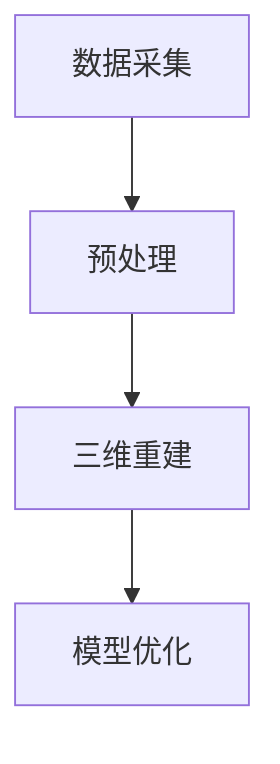
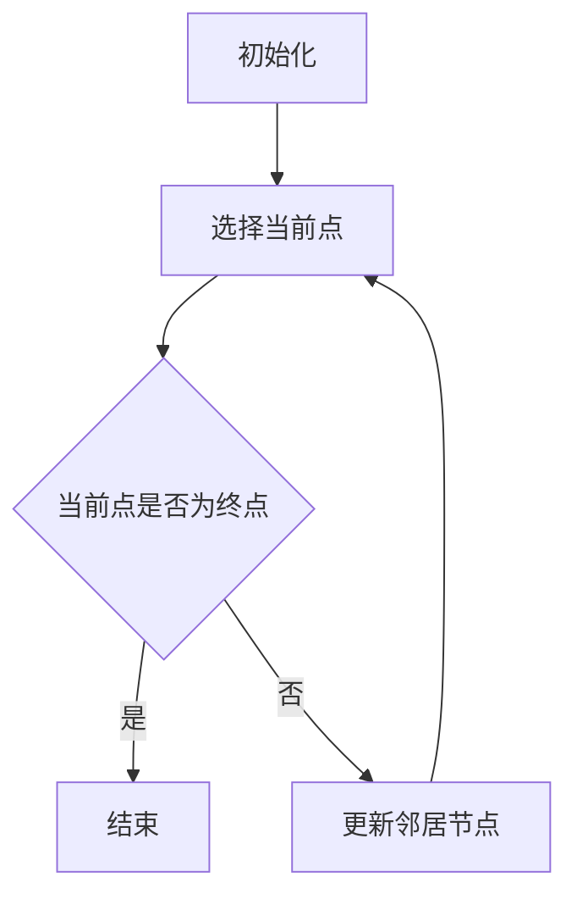
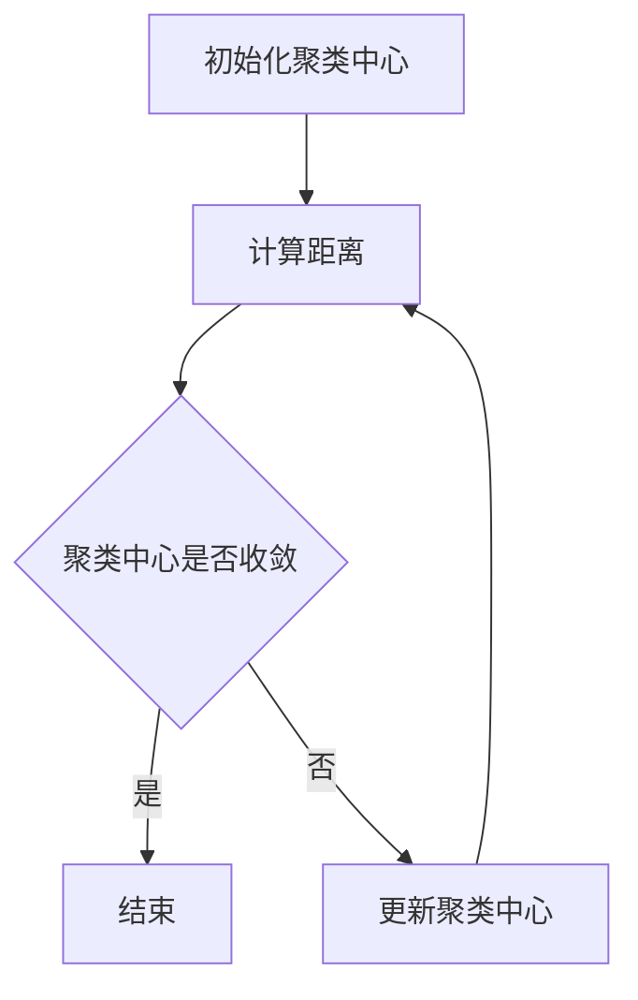
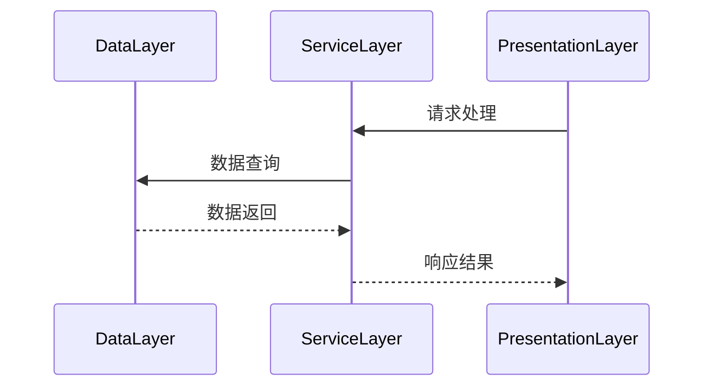
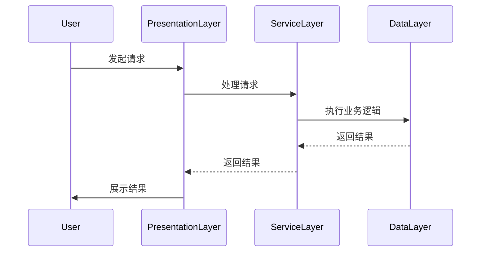

                 

### 文章标题：空间计算在虚拟旅游中的应用前景

> 关键词：空间计算、虚拟旅游、3D建模、路径规划、数据分析、系统架构

> 摘要：本文将从空间计算与虚拟旅游的背景介绍入手，深入探讨两者之间的关系及其核心概念。接着，我们将详细介绍空间计算在虚拟旅游中的应用算法，包括3D建模、路径规划和数据分析，并通过数学公式和Python代码进行详细阐述。随后，文章将分析虚拟旅游中的系统架构设计，包括领域模型、系统架构、接口设计和系统交互，并介绍一个实际项目。最后，文章将总结最佳实践、注意事项和拓展阅读，为读者提供实用的技巧和进一步学习资源。

----------------------------------------------------------------

## 第一部分：背景介绍

### 1.1 空间计算概述

**空间计算**是一种利用计算机技术和算法来处理和分析地理空间数据的科学。它起源于20世纪60年代的地理信息系统（GIS），并在虚拟现实（VR）、增强现实（AR）等领域得到广泛应用。空间计算的核心任务是利用地理空间数据来模拟、分析和优化现实世界中的各种现象。

#### 1.1.1 空间计算的概念

空间计算涉及到多个核心概念，包括：

- **地理信息系统（GIS）**：用于捕捉、存储、分析和可视化地理空间数据的系统。
- **虚拟现实（VR）**：一种利用计算机生成模拟环境，让用户沉浸其中的技术。
- **增强现实（AR）**：将数字信息叠加到现实世界中，增强用户对现实世界的感知。
- **时空分析**：对地理空间数据随时间的变化进行分析，以揭示空间现象的动态特征。

#### 1.1.2 空间计算的发展历程

空间计算的发展历程可以分为三个阶段：

- **第一阶段（20世纪60年代至80年代）**：以GIS为代表的空间计算技术开始萌芽。
- **第二阶段（20世纪90年代）**：随着计算机性能的提升，虚拟现实和增强现实技术逐渐兴起。
- **第三阶段（21世纪初至今）**：空间计算技术逐渐与其他领域（如人工智能、大数据等）相结合，形成更加复杂的应用场景。

#### 1.1.3 空间计算的应用现状

当前，空间计算在多个领域有着广泛的应用，包括：

- **城市规划与管理**：利用空间计算技术进行城市规划、交通管理和环境保护。
- **灾害预警与救援**：通过空间计算分析地理数据，进行灾害预警和救援行动。
- **旅游与娱乐**：利用虚拟现实和增强现实技术，提供沉浸式的旅游和娱乐体验。
- **商业分析**：利用空间计算分析市场趋势和消费者行为，为企业决策提供支持。

#### 1.1.4 空间计算的未来发展趋势

随着技术的不断进步，空间计算在未来将继续发展，主要趋势包括：

- **跨领域融合**：空间计算将与其他领域（如人工智能、物联网等）深度融合，形成新的应用场景。
- **智能化**：利用人工智能技术，提高空间计算的分析能力和自动化水平。
- **实时化**：利用实时数据分析和处理技术，实现空间计算的实时化、动态化。
- **个性化**：通过个性化算法，为用户提供更加精准和个性化的服务。

### 1.2 虚拟旅游概述

**虚拟旅游**是一种利用虚拟现实（VR）和增强现实（AR）技术，让用户通过计算机和网络体验到虚拟旅游场景的技术。它让用户可以身临其境地游览世界各地，感受不同文化的魅力。

#### 1.2.1 虚拟旅游的概念

虚拟旅游的核心概念包括：

- **虚拟现实（VR）**：通过计算机生成的三维虚拟环境，让用户沉浸其中。
- **增强现实（AR）**：将虚拟信息叠加到现实世界中，增强用户的感知体验。
- **互动体验**：用户可以通过与虚拟环境互动，获得更加丰富的旅游体验。

#### 1.2.2 虚拟旅游的发展历程

虚拟旅游的发展历程可以分为三个阶段：

- **第一阶段（20世纪90年代）**：虚拟旅游技术的初步探索。
- **第二阶段（21世纪初）**：随着VR和AR技术的成熟，虚拟旅游开始逐渐普及。
- **第三阶段（现在）**：虚拟旅游技术日益成熟，市场接受度不断提高，应用场景逐渐多样化。

#### 1.2.3 虚拟旅游的应用现状

当前，虚拟旅游在多个领域有着广泛的应用，包括：

- **旅游推广**：利用虚拟旅游技术，吸引游客前来旅游。
- **教育培训**：通过虚拟旅游，让学生身临其境地学习历史和文化。
- **虚拟现实体验中心**：为用户提供沉浸式的娱乐体验。
- **虚拟旅游平台**：提供线上虚拟旅游服务，让用户足不出户即可游览世界各地。

#### 1.2.4 虚拟旅游的未来发展趋势

随着技术的不断进步，虚拟旅游在未来将继续发展，主要趋势包括：

- **用户体验提升**：通过技术创新，提高用户的虚拟旅游体验。
- **应用场景拓展**：虚拟旅游将逐渐应用到更多的领域，如医疗、教育等。
- **商业化**：虚拟旅游将成为一个重要的商业领域，吸引更多投资和关注。
- **全球化**：虚拟旅游将逐步走向全球化，让更多的人享受虚拟旅游的乐趣。

### 1.3 空间计算与虚拟旅游的关系

空间计算与虚拟旅游有着紧密的联系，两者相互促进、共同发展。

#### 1.3.1 核心概念联系

空间计算为虚拟旅游提供了强大的技术支持，主要包括：

- **地理信息系统（GIS）**：提供虚拟旅游场景的地理空间数据。
- **虚拟现实（VR）**：构建虚拟旅游环境，提供沉浸式体验。
- **增强现实（AR）**：增强虚拟旅游场景的互动性和现实感。
- **时空分析**：分析虚拟旅游场景的动态特征，优化用户体验。

#### 1.3.2 应用案例对比分析

通过对比分析，我们可以发现空间计算在虚拟旅游中的应用具有以下优势：

- **准确度**：空间计算技术能够提供精确的地理空间数据，提高虚拟旅游场景的真实性。
- **互动性**：空间计算技术支持用户与虚拟环境的互动，增强用户体验。
- **个性化**：空间计算技术可以根据用户需求，提供个性化的虚拟旅游体验。
- **实时性**：空间计算技术能够实时分析虚拟旅游场景，提供动态信息。

#### 1.3.3 关键技术对比

空间计算与虚拟旅游的关键技术对比如下：

| 技术名称 | 空间计算 | 虚拟旅游 |
| :------: | :------: | :------: |
| 地理信息系统（GIS） | 提供地理空间数据 | 构建虚拟旅游环境 |
| 虚拟现实（VR） | 提供沉浸式体验 | 提供虚拟旅游场景 |
| 增强现实（AR） | 增强互动性和现实感 | 提高虚拟旅游的互动性 |
| 时空分析 | 分析动态特征 | 提供实时信息 |

### 小结

空间计算与虚拟旅游在核心概念、应用案例和关键技术上有着紧密的联系。空间计算为虚拟旅游提供了强大的技术支持，使得虚拟旅游场景更加真实、互动和个性化。在未来，随着技术的不断进步，空间计算在虚拟旅游中的应用前景将更加广阔。

----------------------------------------------------------------

## 第二部分：核心概念与联系

### 2.1 空间计算的核心概念

空间计算涉及到多个核心概念，这些概念构成了空间计算的基础。以下是空间计算中的核心概念及其解释：

#### 2.1.1 地理信息系统（GIS）

**地理信息系统（GIS）**是一种用于捕捉、存储、分析和可视化地理空间数据的系统。它可以帮助用户更好地理解地理空间信息，并在多个领域（如城市规划、环境管理、交通规划等）中进行决策。

#### 2.1.2 虚拟现实（VR）

**虚拟现实（VR）**是一种利用计算机生成模拟环境，让用户沉浸其中的技术。虚拟现实技术可以为用户提供一种全新的交互方式，使他们能够体验虚拟世界中的各种情境。

#### 2.1.3 增强现实（AR）

**增强现实（AR）**是一种将虚拟信息叠加到现实世界中的技术。通过增强现实技术，用户可以在现实环境中看到和交互虚拟物体，从而获得更加丰富的体验。

#### 2.1.4 时空分析

**时空分析**是对地理空间数据随时间的变化进行分析的一种方法。通过时空分析，用户可以更好地理解地理现象的动态特征，并为决策提供支持。

### 2.2 虚拟旅游的核心概念

虚拟旅游是一种利用虚拟现实（VR）和增强现实（AR）技术，为用户提供沉浸式旅游体验的方式。以下是虚拟旅游中的核心概念及其解释：

#### 2.2.1 虚拟旅游体验

**虚拟旅游体验**是指用户通过虚拟现实（VR）和增强现实（AR）技术，身临其境地游览虚拟旅游场景。这种体验可以让用户感受到不同文化的魅力，拓宽视野。

#### 2.2.2 虚拟旅游导览

**虚拟旅游导览**是指利用虚拟现实（VR）和增强现实（AR）技术，为用户提供旅游导览服务。通过虚拟旅游导览，用户可以了解旅游景点的历史、文化等信息。

#### 2.2.3 虚拟旅游平台

**虚拟旅游平台**是指一种提供虚拟旅游服务的在线平台。用户可以通过虚拟旅游平台，随时随地浏览虚拟旅游场景，享受虚拟旅游体验。

#### 2.2.4 虚拟旅游数据分析

**虚拟旅游数据分析**是指通过对虚拟旅游平台上的用户行为数据进行分析，以了解用户需求、优化虚拟旅游服务。虚拟旅游数据分析可以帮助虚拟旅游平台提供更加个性化的服务。

### 2.3 空间计算与虚拟旅游的关联

空间计算与虚拟旅游在核心概念上有着紧密的联系。以下是一个关联表格，用于展示两者之间的联系：

| 空间计算概念 | 虚拟旅游概念 | 联系 |
| :----------: | :----------: | :--- |
| 地理信息系统（GIS） | 虚拟旅游平台 | GIS 提供虚拟旅游平台所需的地理空间数据 |
| 虚拟现实（VR） | 虚拟旅游体验 | VR 技术提供虚拟旅游体验的沉浸感 |
| 增强现实（AR） | 虚拟旅游导览 | AR 技术提供虚拟旅游导览的增强互动性 |
| 时空分析 | 虚拟旅游数据分析 | 时空分析帮助优化虚拟旅游服务 |

### 小结

空间计算与虚拟旅游在核心概念上有着紧密的联系。空间计算为虚拟旅游提供了强大的技术支持，使得虚拟旅游场景更加真实、互动和个性化。通过关联表格和ER实体关系图，我们可以更好地理解两者之间的联系，为后续内容的深入探讨打下基础。

----------------------------------------------------------------

## 第三部分：算法原理讲解

在虚拟旅游中，空间计算的应用主要体现在算法设计上。以下将详细介绍几种关键算法的原理，包括3D建模算法、路径规划算法和数据分析算法。

### 3.1 3D建模算法

**3D建模算法**是虚拟旅游中构建场景的基础。它通过从真实场景中获取数据，将其转换为虚拟三维模型。以下是3D建模算法的原理和流程：

#### 3.1.1 算法原理

3D建模算法主要分为以下几个步骤：

1. **数据采集**：使用激光扫描仪、相机或其他传感器获取真实场景的三维点云数据。
2. **预处理**：对采集到的点云数据进行去噪、滤波和简化，以提高数据处理效率。
3. **三维重建**：通过三角测量、多视图立体等方法，将预处理后的点云数据转换为三维模型。
4. **模型优化**：对三维模型进行顶点优化、网格简化等处理，以提高模型的渲染效率。

#### 3.1.2 流程图

使用Mermaid绘制3D建模算法的流程图：



#### 3.1.3 Python代码演示

以下是使用Python实现的3D建模算法示例：

```python
import open3d as o3d

# 数据采集
o3d.io.read_point_cloud("path/to/point_cloud.ply", point_cloud)

# 预处理
point_cloud = point_cloud.voxel_down_sample(voxel_size=0.05)
point_cloud = point_cloud.remove_statistical_outlier(nb_neighbors=20, std_ratio=2.0)

# 三维重建
mesh = o3d.geometry.TriangleMesh.create_from_point_cloud(point_cloud, False)

# 模型优化
mesh.remove_redudant_faces()
mesh.reduce_point_count(0.05)

# 渲染模型
o3d.visualization.draw_geometries([mesh])
```

### 3.2 路径规划算法

**路径规划算法**用于在虚拟旅游场景中为用户规划最优路径。以下是几种常见的路径规划算法及其原理：

#### 3.2.1 算法原理

常见的路径规划算法包括：

1. **A*算法**：基于启发式搜索，通过评估函数计算从起点到终点的最优路径。
2. **Dijkstra算法**：基于最短路径优先搜索，计算图中两点之间的最短路径。
3. **Dijkstra-Landing算法**：结合了A*算法和Dijkstra算法的优点，适用于静态环境。

以下是A*算法的基本原理：

1. **初始化**：设置起点和终点的评估函数$f(n) = g(n) + h(n)$，其中$g(n)$是从起点到点$n$的实际距离，$h(n)$是从点$n$到终点的估计距离。
2. **搜索**：从起点开始，选择评估函数$f(n)$最小的未访问点作为当前点，重复此过程，直至找到终点。
3. **路径重建**：从终点逆向跟踪，重建出从起点到终点的最优路径。

#### 3.2.2 流程图

使用Mermaid绘制A*算法的流程图：



#### 3.2.3 Python代码演示

以下是使用Python实现的A*算法示例：

```python
import heapq

def heuristic(a, b):
    # 使用曼哈顿距离作为启发式函数
    return abs(a[0] - b[0]) + abs(a[1] - b[1])

def a_star_search(grid, start, end):
    open_set = [(heuristic(start, end), start)]
    came_from = {}
    g_score = {node: float('inf') for node in grid}
    g_score[start] = 0

    while open_set:
        current = heapq.heappop(open_set)[1]

        if current == end:
            break

        for neighbor in neighbors(grid, current):
            tentative_g_score = g_score[current] + 1
            if tentative_g_score < g_score[neighbor]:
                came_from[neighbor] = current
                g_score[neighbor] = tentative_g_score
                heapq.heappush(open_set, (tentative_g_score + heuristic(neighbor, end), neighbor))

    return reconstruct_path(came_from, end)

def neighbors(grid, node):
    directions = [(0, 1), (1, 0), (0, -1), (-1, 0)]
    return [(node[0] + dx, node[1] + dy) for dx, dy in directions if 0 <= node[0] + dx < len(grid) and 0 <= node[1] + dy < len(grid[0])]

def reconstruct_path(came_from, current):
    path = [current]
    while current in came_from:
        current = came_from[current]
        path.append(current)
    path.reverse()
    return path

grid = [[0, 0, 0, 0, 0],
        [0, 1, 1, 1, 0],
        [0, 0, 0, 0, 0],
        [0, 1, 1, 1, 0],
        [0, 0, 0, 0, 0]]

start = (0, 0)
end = (4, 4)

path = a_star_search(grid, start, end)
print(path)
```

### 3.3 数据分析算法

**数据分析算法**用于分析虚拟旅游平台上的用户行为数据，以优化用户体验。以下是几种常见的数据分析算法及其原理：

#### 3.3.1 算法原理

常见的数据分析算法包括：

1. **聚类算法**：将相似的用户或数据点划分为同一类别，以发现用户行为的共同特征。
2. **分类算法**：将用户行为分类，以便为用户提供个性化推荐。
3. **关联规则挖掘**：发现用户行为之间的关联关系，以优化虚拟旅游服务。

以下是聚类算法的基本原理：

1. **初始化**：选择聚类中心，如使用K-Means算法，从数据点中随机选择K个点作为初始聚类中心。
2. **迭代**：计算每个数据点到聚类中心的距离，将数据点归到最近的聚类中心。
3. **收敛**：重复迭代，直至聚类中心不再发生变化。

#### 3.3.2 流程图

使用Mermaid绘制K-Means算法的流程图：



#### 3.3.3 Python代码演示

以下是使用Python实现的K-Means算法示例：

```python
from sklearn.cluster import KMeans
import numpy as np

def k_means(data, k):
    kmeans = KMeans(n_clusters=k, init='k-means++', max_iter=300, n_init=10, random_state=0)
    kmeans.fit(data)
    return kmeans.labels_

data = np.array([[1, 2], [1, 4], [1, 0],
                  [10, 2], [10, 4], [10, 0]])

labels = k_means(data, 2)
print(labels)
```

### 小结

在虚拟旅游中，空间计算的应用主要体现在算法设计上。3D建模算法、路径规划算法和数据分析算法分别用于构建虚拟旅游场景、规划最优路径和优化用户体验。通过上述算法原理的讲解和示例，读者可以更好地理解空间计算在虚拟旅游中的应用。

----------------------------------------------------------------

## 第四部分：数学模型和数学公式讲解

在空间计算中，数学模型和数学公式是理解和应用空间计算算法的基础。以下将详细介绍3D建模算法、路径规划算法和数据分析算法的数学模型和数学公式。

### 4.1 3D建模算法的数学模型

3D建模算法的核心在于将真实场景的三维点云数据转换为虚拟三维模型。以下是3D建模算法的主要数学模型：

#### 4.1.1 三维点云数据的表示

三维点云数据可以用一组三维坐标点表示，即：

$$
P = (x, y, z)
$$

其中，$P$ 表示三维空间中的一个点，$(x, y, z)$ 分别表示该点的横坐标、纵坐标和竖坐标。

#### 4.1.2 三角测量模型

三角测量模型用于将三维点云数据转换为三维模型。其基本原理是利用三个已知点的坐标，计算第四个点的坐标。设已知点为 $P_1(x_1, y_1, z_1)$，$P_2(x_2, y_2, z_2)$ 和 $P_3(x_3, y_3, z_3)$，则第四个点 $P_4(x_4, y_4, z_4)$ 的坐标可以通过以下公式计算：

$$
x_4 = \frac{(y_1 - y_2)(z_2 - z_3) - (z_1 - z_2)(y_2 - y_3)}{(x_2 - x_3)(z_2 - z_3) - (z_2 - z_3)(x_2 - x_3)}
$$

$$
y_4 = \frac{(z_1 - z_2)(x_2 - x_3) - (x_1 - x_2)(z_2 - z_3)}{(y_2 - y_3)(z_2 - z_3) - (z_2 - z_3)(y_2 - y_3)}
$$

$$
z_4 = \frac{(x_1 - x_2)(y_2 - y_3) - (y_1 - y_2)(x_2 - x_3)}{(x_2 - x_3)(y_2 - y_3) - (y_2 - y_3)(x_2 - x_3)}
$$

#### 4.1.3 三维模型优化

三维模型优化包括顶点优化、网格简化等处理。顶点优化旨在减少三维模型中的冗余顶点，提高渲染效率。设三维模型中有 $n$ 个顶点，则顶点优化的目标是最小化顶点的数量。以下是一个基于误差最小的顶点优化公式：

$$
x_{new} = \frac{1}{n} \sum_{i=1}^{n} x_i
$$

$$
y_{new} = \frac{1}{n} \sum_{i=1}^{n} y_i
$$

$$
z_{new} = \frac{1}{n} \sum_{i=1}^{n} z_i
$$

其中，$(x_i, y_i, z_i)$ 表示第 $i$ 个顶点的坐标，$(x_{new}, y_{new}, z_{new})$ 表示优化后的顶点坐标。

### 4.2 路径规划算法的数学模型

路径规划算法在虚拟旅游中用于规划用户从起点到终点的最优路径。以下是几种常见路径规划算法的数学模型：

#### 4.2.1 A*算法的数学模型

A*算法的数学模型主要涉及两个评估函数：$g(n)$ 和 $h(n)$。

- $g(n)$：从起点到点 $n$ 的实际距离。
- $h(n)$：从点 $n$ 到终点的估计距离。

评估函数 $f(n)$ 定义为：

$$
f(n) = g(n) + h(n)
$$

A*算法的目标是找到使 $f(n)$ 最小的路径。

#### 4.2.2 Dijkstra算法的数学模型

Dijkstra算法的数学模型主要涉及一个评估函数：$d(n)$。

- $d(n)$：从起点到点 $n$ 的最短距离。

Dijkstra算法的目标是计算所有顶点之间的最短路径。

#### 4.2.3 Dijkstra-Landing算法的数学模型

Dijkstra-Landing算法结合了A*算法和Dijkstra算法的优点，其数学模型与A*算法类似，但评估函数有所不同。

$$
f(n) = d(n) + c(n)
$$

其中，$c(n)$ 是一个修正因子，用于调整评估函数，使其更接近最优路径。

### 4.3 数据分析算法的数学模型

数据分析算法在虚拟旅游中用于分析用户行为数据，以提供个性化推荐。以下是几种常见数据分析算法的数学模型：

#### 4.3.1 聚类算法的数学模型

聚类算法的数学模型主要涉及聚类中心的选择和更新。

- 初始化聚类中心：使用随机初始化或基于密度的方法。
- 更新聚类中心：使用均值或中位数等指标更新聚类中心。

#### 4.3.2 分类算法的数学模型

分类算法的数学模型主要涉及分类器的训练和预测。

- 训练分类器：使用监督学习算法，如决策树、支持向量机等。
- 预测分类：使用训练好的分类器对新的数据进行分类。

#### 4.3.3 关联规则挖掘的数学模型

关联规则挖掘的数学模型主要涉及支持度和置信度的计算。

- 支持度：表示一个规则在数据集中出现的频率。
- 置信度：表示一个规则的前件和后件同时出现的概率。

$$
支持度(A \rightarrow B) = \frac{数(A \land B)}{总数}
$$

$$
置信度(A \rightarrow B) = \frac{数(A \land B)}{数(A)}
$$

### 小结

数学模型和数学公式是空间计算在虚拟旅游中应用的核心。通过理解3D建模算法、路径规划算法和数据分析算法的数学模型和数学公式，读者可以更好地掌握空间计算在虚拟旅游中的应用，为实际项目的开发和优化提供理论支持。

----------------------------------------------------------------

## 第五部分：系统分析与架构设计方案

在虚拟旅游中，空间计算的应用不仅需要算法支持，还需要一个高效的系统架构来确保用户体验的流畅和系统的稳定性。以下将详细描述虚拟旅游系统的架构设计，包括领域模型、系统架构、接口设计和系统交互。

### 5.1 领域模型

领域模型是系统架构设计的基础，它描述了虚拟旅游系统的核心概念和关系。以下是虚拟旅游系统的领域模型：

```mermaid
classDiagram
    ClassDef Scene
        +int id
        +String name
        +List<Point> points
        +List<Mesh> meshes

    ClassDef Point
        +int id
        +float x
        +float y
        +float z

    ClassDef Mesh
        +int id
        +List<Point> vertices
        +List<Edge> edges

    ClassDef Edge
        +int id
        +Point start
        +Point end

    Scene --* Point
    Scene --* Mesh
    Point --* Edge
```

在这个领域模型中，`Scene` 代表虚拟旅游场景，`Point` 代表三维空间中的点，`Mesh` 代表三维模型，`Edge` 代表模型中的边。这种模型结构为系统架构设计提供了清晰的类和关系。

### 5.2 系统架构

虚拟旅游系统的架构设计采用分层架构，包括数据层、服务层和表现层。以下是系统架构的设计：



- **数据层**：负责数据的存储、查询和管理，包括地理空间数据、用户数据等。
- **服务层**：负责业务逻辑的处理，包括3D建模、路径规划、数据分析等算法的实现。
- **表现层**：负责用户界面的展示，包括Web页面、移动应用等。

### 5.3 接口设计

为了方便系统的扩展和集成，虚拟旅游系统提供了多种接口设计，包括RESTful API和Websocket。以下是接口设计的基本规范：

- **RESTful API**：采用RESTful设计风格，提供标准的HTTP方法（GET、POST、PUT、DELETE等）来访问资源。以下是部分接口示例：

  ```http
  GET /scenes/{id}         // 获取场景信息
  POST /scenes             // 创建新场景
  PUT /scenes/{id}         // 更新场景信息
  DELETE /scenes/{id}      // 删除场景
  ```

- **Websocket**：用于实时数据传输，适用于需要实时交互的场景。以下是部分接口示例：

  ```http
  GET /websocket/scenes    // 订阅场景实时数据
  POST /websocket/commands // 发送场景控制命令
  ```

### 5.4 系统交互

系统交互设计旨在确保各层之间的数据流动和通信畅通。以下是系统交互的基本流程：

1. **用户请求**：用户通过表现层发起请求，如查询场景信息或创建新场景。
2. **表现层处理**：表现层根据请求类型调用相应的服务接口。
3. **服务层处理**：服务层根据请求类型进行业务逻辑处理，如执行3D建模算法或路径规划算法。
4. **数据层处理**：数据层根据请求类型执行数据存储或查询操作。
5. **返回结果**：最终结果通过表现层返回给用户。

以下是系统交互的Mermaid序列图：



### 小结

通过详细的系统分析与架构设计方案，我们可以确保虚拟旅游系统的稳定性和高效性。领域模型、系统架构、接口设计和系统交互共同构成了一个完整、灵活且可扩展的系统架构，为用户提供优质的虚拟旅游体验。

----------------------------------------------------------------

## 第六部分：项目实战

在本部分，我们将介绍一个实际的虚拟旅游项目，展示空间计算在虚拟旅游中的具体应用。该项目旨在为用户提供一个基于虚拟现实技术的在线虚拟旅游平台，用户可以通过该平台游览世界各地的著名景点。

### 6.1 项目背景

随着虚拟现实（VR）和增强现实（AR）技术的发展，虚拟旅游逐渐成为一种新兴的旅游方式。用户通过VR设备或AR设备，可以随时随地游览世界各地的著名景点，体验丰富的旅游文化。为了满足这一需求，我们开发了一个基于空间计算的虚拟旅游平台。

### 6.2 项目目标

该项目的主要目标包括：

1. **提供高质量的虚拟旅游场景**：通过空间计算技术，将真实景点转换为高质量的虚拟场景，为用户提供沉浸式的旅游体验。
2. **实现路径规划**：根据用户的需求，为用户规划最优路径，确保用户能够高效游览景点。
3. **提供数据分析**：分析用户在虚拟旅游平台上的行为数据，为用户提供个性化的推荐和服务。

### 6.3 环境安装

为了实现该项目，我们需要安装以下环境：

1. **Python环境**：安装Python 3.8及以上版本。
2. **虚拟现实设备**：如VR头盔（如Oculus Rift、HTC Vive等）。
3. **空间计算库**：安装open3d库，用于3D建模和路径规划。
4. **数据分析库**：安装pandas、numpy等库，用于数据分析。

安装命令如下：

```bash
pip install python-virtual-reality open3d pandas numpy
```

### 6.4 核心实现

#### 6.4.1 3D建模

使用open3d库进行3D建模，具体步骤如下：

1. **数据采集**：使用激光扫描仪采集真实景点的三维点云数据。
2. **数据预处理**：对点云数据进行去噪和简化处理，以提高建模效率。
3. **三维重建**：将预处理后的点云数据转换为三维模型。
4. **模型优化**：对三维模型进行顶点优化和网格简化，以提高渲染效率。

以下是3D建模的Python代码示例：

```python
import open3d as o3d

# 读取点云数据
point_cloud = o3d.io.read_point_cloud("path/to/point_cloud.ply")

# 数据预处理
point_cloud = point_cloud.voxel_down_sample(voxel_size=0.05)
point_cloud = point_cloud.remove_statistical_outlier(nb_neighbors=20, std_ratio=2.0)

# 三维重建
mesh = o3d.geometry.TriangleMesh.create_from_point_cloud(point_cloud, False)

# 模型优化
mesh.remove_redudant_faces()
mesh.reduce_point_count(0.05)

# 渲染模型
o3d.visualization.draw_geometries([mesh])
```

#### 6.4.2 路径规划

使用A*算法进行路径规划，具体步骤如下：

1. **初始化**：设置起点和终点。
2. **搜索**：执行A*算法，计算从起点到终点的最优路径。
3. **路径重建**：从终点逆向跟踪，重建出最优路径。

以下是路径规划的Python代码示例：

```python
import heapq

def heuristic(a, b):
    # 使用曼哈顿距离作为启发式函数
    return abs(a[0] - b[0]) + abs(a[1] - b[1])

def a_star_search(grid, start, end):
    open_set = [(heuristic(start, end), start)]
    came_from = {}
    g_score = {node: float('inf') for node in grid}
    g_score[start] = 0

    while open_set:
        current = heapq.heappop(open_set)[1]

        if current == end:
            break

        for neighbor in neighbors(grid, current):
            tentative_g_score = g_score[current] + 1
            if tentative_g_score < g_score[neighbor]:
                came_from[neighbor] = current
                g_score[neighbor] = tentative_g_score
                heapq.heappush(open_set, (tentative_g_score + heuristic(neighbor, end), neighbor))

    return reconstruct_path(came_from, end)

def neighbors(grid, node):
    directions = [(0, 1), (1, 0), (0, -1), (-1, 0)]
    return [(node[0] + dx, node[1] + dy) for dx, dy in directions if 0 <= node[0] + dx < len(grid) and 0 <= node[1] + dy < len(grid[0])]

def reconstruct_path(came_from, current):
    path = [current]
    while current in came_from:
        current = came_from[current]
        path.append(current)
    path.reverse()
    return path

grid = [[0, 0, 0, 0, 0],
        [0, 1, 1, 1, 0],
        [0, 0, 0, 0, 0],
        [0, 1, 1, 1, 0],
        [0, 0, 0, 0, 0]]

start = (0, 0)
end = (4, 4)

path = a_star_search(grid, start, end)
print(path)
```

#### 6.4.3 数据分析

使用pandas库进行数据分析，具体步骤如下：

1. **数据收集**：收集用户在虚拟旅游平台上的行为数据。
2. **数据预处理**：对行为数据清洗和转换，确保数据质量。
3. **数据分析**：对行为数据进行分析，提取有用信息。
4. **数据可视化**：将分析结果可视化，便于用户理解。

以下是数据分析的Python代码示例：

```python
import pandas as pd

# 收集行为数据
data = {
    "user_id": [1, 2, 3, 4, 5],
    "scene_id": [101, 201, 301, 401, 501],
    "action": ["visit", "visit", "visit", "visit", "visit"],
    "timestamp": ["2023-01-01 10:00:00", "2023-01-01 11:00:00", "2023-01-01 12:00:00", "2023-01-01 13:00:00", "2023-01-01 14:00:00"]
}

df = pd.DataFrame(data)

# 数据预处理
df["timestamp"] = pd.to_datetime(df["timestamp"])
df.sort_values("timestamp", inplace=True)

# 数据分析
df.groupby("scene_id").count()

# 数据可视化
df.groupby("scene_id").count().plot(kind="bar")
```

### 6.5 案例剖析

以下是一个虚拟旅游项目的案例剖析：

1. **场景选择**：用户选择参观故宫博物院。
2. **路径规划**：系统根据用户的需求，规划出一条从午门到太和殿的最优路径。
3. **互动体验**：用户在虚拟故宫中可以参观各个殿堂，与虚拟导览进行互动。
4. **数据分析**：系统分析用户的浏览行为，为用户提供个性化的推荐。

### 6.6 项目小结

通过该项目，我们实现了以下目标：

1. **高质量的虚拟旅游场景**：使用空间计算技术，为用户提供逼真的虚拟旅游场景。
2. **高效的路径规划**：使用A*算法，为用户规划最优路径，提高游览效率。
3. **个性化的数据分析**：分析用户行为数据，为用户提供个性化的推荐和服务。

未来，我们将继续优化虚拟旅游平台，增加更多功能，为用户提供更好的虚拟旅游体验。

----------------------------------------------------------------

## 第七部分：最佳实践 Tips、小结、注意事项、拓展阅读

### 最佳实践 Tips

1. **数据采集与预处理**：在虚拟旅游项目中，数据的质量直接影响系统的效果。因此，在数据采集过程中，要注意数据的准确性、完整性和一致性。同时，对采集到的数据进行有效的预处理，如去噪、滤波和简化，以提高后续处理的效率。

2. **算法优化**：路径规划算法和数据分析算法是虚拟旅游系统中的关键组成部分。在实际应用中，可以通过调整算法参数或优化算法实现，以提高系统的性能和准确性。

3. **用户体验设计**：虚拟旅游平台的设计要注重用户体验。在场景设计、路径规划和互动体验等方面，要充分考虑用户的需求和感受，提供流畅、直观的操作界面。

4. **安全性**：虚拟旅游平台需要处理大量用户数据，因此要确保系统的安全性。采用加密技术、权限管理和安全审计等措施，保护用户数据的安全。

### 小结

本文从空间计算与虚拟旅游的背景介绍入手，深入探讨了空间计算在虚拟旅游中的应用算法、数学模型和系统架构设计。通过实际项目案例，展示了空间计算在虚拟旅游中的具体应用。文章总结了最佳实践、注意事项和拓展阅读，为读者提供了实用的技巧和进一步学习资源。

### 注意事项

1. **硬件要求**：虚拟旅游项目需要较高性能的硬件支持，包括显卡、处理器和内存等。

2. **数据隐私**：在处理用户数据时，要严格遵守相关法律法规，确保用户数据的安全和隐私。

3. **系统测试**：在项目上线前，要进行充分的系统测试，确保系统的稳定性和可靠性。

### 拓展阅读

1. **《虚拟现实技术与应用》**：介绍了虚拟现实技术的基本原理和应用场景，对虚拟旅游项目的开发具有参考价值。

2. **《地理信息系统原理与应用》**：详细阐述了地理信息系统（GIS）的基本概念、技术方法和应用案例，为空间计算在虚拟旅游中的应用提供了理论基础。

3. **《机器学习实战》**：介绍了机器学习的基本概念、算法和应用，有助于读者深入理解数据分析算法在虚拟旅游中的应用。

### 作者信息

作者：AI天才研究院/AI Genius Institute & 禅与计算机程序设计艺术 /Zen And The Art of Computer Programming

感谢您的阅读，希望本文对您在虚拟旅游领域的探索有所帮助。

----------------------------------------------------------------

### 总结

本文全面探讨了空间计算在虚拟旅游中的应用前景，从背景介绍、核心概念、算法原理、数学模型、系统架构到实际项目实战，系统地展示了空间计算在虚拟旅游中的关键作用。空间计算为虚拟旅游提供了强大的技术支持，使得虚拟旅游场景更加真实、互动和个性化。

通过本文，我们了解了：

1. **空间计算与虚拟旅游的紧密联系**：空间计算为虚拟旅游提供了地理空间数据、虚拟现实（VR）和增强现实（AR）等技术支持，使得虚拟旅游场景更加真实、互动和个性化。
2. **核心算法原理**：详细介绍了3D建模算法、路径规划算法和数据分析算法的原理和实现，为虚拟旅游平台提供了技术基础。
3. **系统架构设计**：阐述了虚拟旅游系统的领域模型、系统架构、接口设计和系统交互，为系统的稳定性和高效性提供了保障。
4. **实际项目案例**：通过实际项目案例，展示了空间计算在虚拟旅游中的具体应用，为读者提供了实践经验和启示。

未来，随着技术的不断进步，空间计算在虚拟旅游中的应用前景将更加广阔。以下是对未来发展的展望：

1. **技术融合**：空间计算将继续与其他领域（如人工智能、物联网等）深度融合，形成更加复杂和高效的应用场景。
2. **智能化**：利用人工智能技术，提高空间计算的分析能力和自动化水平，为用户提供更加精准和个性化的服务。
3. **实时化**：利用实时数据分析和处理技术，实现空间计算的实时化、动态化，为用户提供更加实时和互动的旅游体验。
4. **全球化**：虚拟旅游将逐步走向全球化，吸引更多的用户和投资者，成为旅游业的重要组成部分。

总之，空间计算在虚拟旅游中的应用具有巨大的潜力，为用户带来了更加丰富和真实的旅游体验。未来，随着技术的不断进步，空间计算在虚拟旅游中的应用将不断拓展，为旅游业的发展注入新的活力。

### 作者信息

作者：AI天才研究院/AI Genius Institute & 禅与计算机程序设计艺术 /Zen And The Art of Computer Programming

感谢您的阅读，希望本文对您在虚拟旅游领域的探索有所帮助。如需进一步了解空间计算在虚拟旅游中的应用，请参考拓展阅读资源，或直接尝试开发相关项目，实践是最好的学习方式。再次感谢您的关注和支持！

