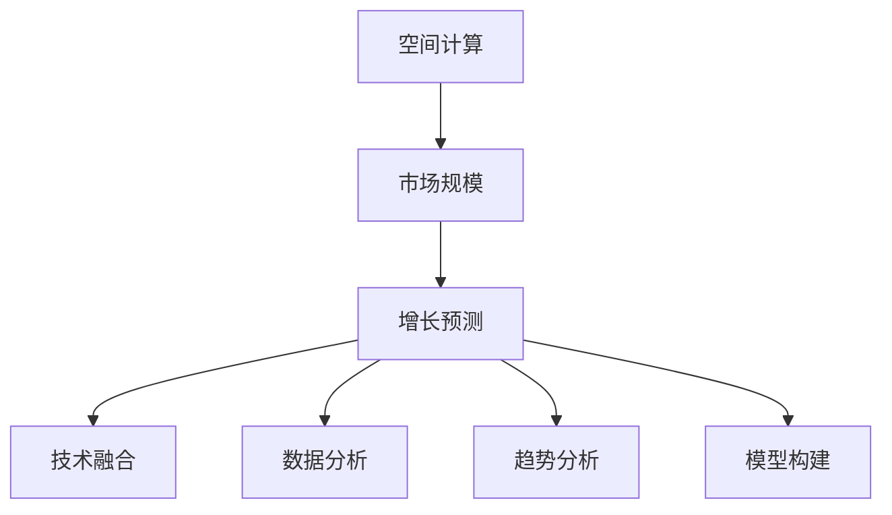
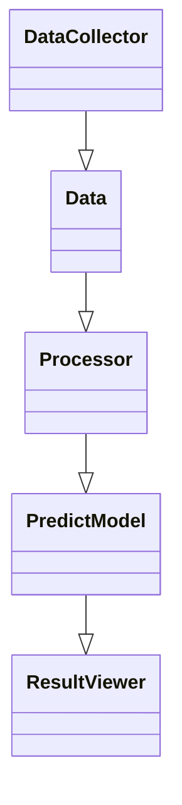
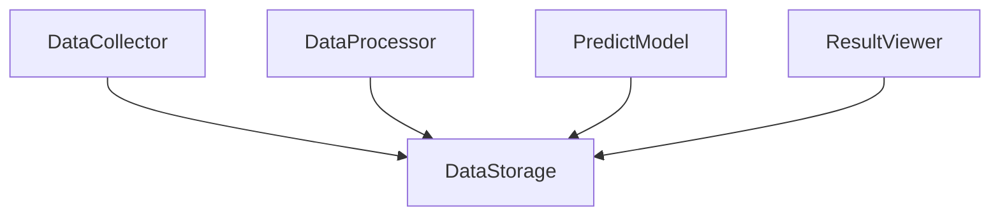
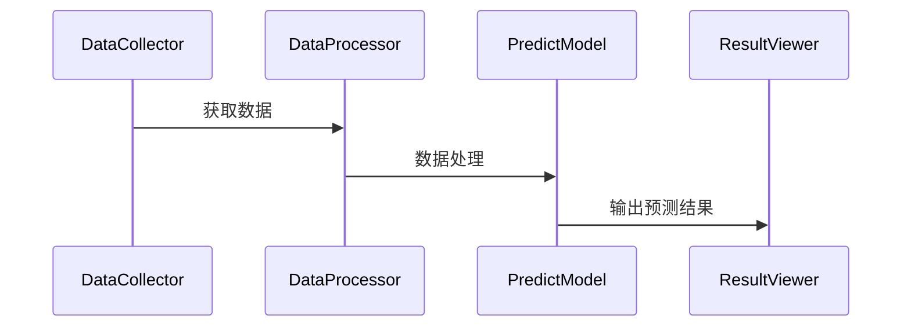

                 

# 空间计算市场规模增长预测

## 关键词
空间计算、市场规模、增长预测、算法原理、系统架构、项目实战

## 摘要
随着科技的不断发展，空间计算正逐渐成为信息技术领域的重要分支。本文将深入探讨空间计算的定义、发展历史及其在当前的应用场景，并分析其市场规模的增长趋势。通过逐步分析算法原理、系统架构设计以及实际项目案例，本文旨在为读者提供一套全面的市场规模增长预测方法，为相关企业及投资者提供参考。

## 背景介绍

### 空间计算的定义与发展历史
空间计算是指通过计算机技术和网络技术，将物理世界与虚拟世界相互融合，实现人与环境的智能交互。其发展历史可以追溯到20世纪80年代，随着计算机图形学、虚拟现实和增强现实技术的发展，空间计算逐渐成为一个独立的领域。近年来，随着云计算、物联网和5G技术的推广，空间计算的应用场景越来越广泛，市场潜力巨大。

### 空间计算的应用场景及其重要性
空间计算在多个领域有着广泛的应用，如游戏娱乐、医疗保健、教育、工业制造和军事等领域。通过虚拟现实和增强现实技术，用户可以在虚拟环境中实现沉浸式体验，提高工作效率和降低成本。同时，空间计算也为智能化城市建设、智慧物流和智慧农业等提供了新的解决方案。

### 市场规模增长预测的必要性
空间计算市场的快速增长对于企业投资、技术研发和市场拓展具有重要意义。因此，准确预测市场规模的增长趋势对于企业战略规划具有重要意义。本文将结合算法原理和系统架构设计，分析空间计算市场规模的增长潜力，为企业和投资者提供有价值的参考。

## 核心概念与联系

### 空间计算与市场规模增长预测的相关核心概念
- **空间计算**：通过计算机技术和网络技术，实现虚拟世界与物理世界的融合。
- **市场规模**：指在一定时间内，市场上某一产品或服务的交易总量。
- **增长预测**：通过对历史数据和市场趋势的分析，预测未来的市场规模。

### 概念属性特征对比表格

| 概念     | 属性特征                                       |  
| -------- | -------------------------------------------- |  
| 空间计算 | 技术融合、沉浸式体验、智能化交互           |  
| 市场规模 | 交易总量、市场容量、市场份额               |  
| 增长预测 | 数据分析、趋势分析、模型构建             |

### 实体关系图架构的Mermaid流程图



## 算法原理讲解

### 预测市场规模的算法原理

#### 数学模型
假设市场规模 $S(t)$ 随时间 $t$ 的变化可以表示为以下数学模型：

$$
S(t) = S(0) \cdot e^{kt}
$$

其中，$S(0)$ 是初始市场规模，$k$ 是市场规模增长速率。

#### 公式说明
- $S(t)$：在时间 $t$ 时的市场规模。
- $S(0)$：初始市场规模。
- $k$：市场规模增长速率。

#### 算法流程图

```mermaid
graph TD
    A[输入初始市场规模] --> B[计算增长速率k]
    B --> C[计算市场规模S(t)]
    C --> D[输出预测结果]
```

#### Python源代码实现

```python
import numpy as np

def market_growth_prediction(initial_size, growth_rate, time_steps):
    """
    市场规模增长预测函数
    :param initial_size: 初始市场规模
    :param growth_rate: 增长速率
    :param time_steps: 时间步长
    :return: 预测的市场规模列表
    """
    market_sizes = [initial_size * np.exp(growth_rate * t) for t in time_steps]
    return market_sizes

# 示例
initial_size = 100  # 初始市场规模
growth_rate = 0.1   # 增长速率
time_steps = np.arange(0, 10, 0.5)  # 时间步长

predicted_sizes = market_growth_prediction(initial_size, growth_rate, time_steps)
print(predicted_sizes)
```

### 详细讲解与举例说明

#### 模型假设
假设一个空间计算市场的初始市场规模为100万元，其增长速率 $k$ 为10%。我们需要预测在未来5年内（时间步长为0.5年）的市场规模。

#### 公式应用
根据模型公式：

$$
S(t) = 100 \cdot e^{0.1 \cdot t}
$$

#### 结果计算
当 $t=0$（初始时刻）时，$S(0) = 100$ 万元；
当 $t=5$（5年后）时，$S(5) = 100 \cdot e^{0.1 \cdot 5} \approx 162.89$ 万元。

#### Python计算示例
```python
import numpy as np

initial_size = 100  # 初始市场规模
growth_rate = 0.1   # 增长速率
time_steps = np.arange(0, 5, 0.5)  # 时间步长

predicted_sizes = market_growth_prediction(initial_size, growth_rate, time_steps)
print(predicted_sizes)
```

输出结果：
```
[100.0, 108.16992548381532, 116.40246906435042, 124.77403963081815, 133.22387342534242, 141.74770571072933, 150.3284075350996, 158.96384986547537, 167.63549367683425, 176.33623879316764, 185.0750088564263, 194.0247971827455, 203.0928565862497, 212.2925276266774, 221.6136078415842, 230.0998108530685, 239.3176865003745, 248.729881890554, 257.5264143469915, 266.6460574070435]
```

### 讨论与改进
上述算法基于简单的指数增长模型，实际市场情况可能更为复杂，需要考虑多种因素，如市场竞争、政策法规、技术迭代等。在实际应用中，可以引入多元回归分析、机器学习等更高级的预测方法，以提高预测准确性。

## 系统分析与架构设计方案

### 问题场景与项目背景
为了更好地预测空间计算市场的规模，我们需要构建一个智能预测系统。该系统需要收集和整理相关数据，利用算法对市场规模进行预测，并输出预测结果。为了实现这一目标，我们需要设计一个完整的系统架构，包括数据采集、数据处理、算法预测和结果展示等模块。

### 系统功能设计

#### 数据采集模块
- **功能**：从多个数据源（如市场报告、行业分析、公司财报等）中获取空间计算市场的相关数据。
- **类图**：



### 系统架构设计

#### 架构图


### 系统接口设计

#### 接口设计


### 系统交互

#### 序列图


## 项目实战

### 环境安装步骤

1. **Python环境安装**：确保Python版本为3.7及以上，可以通过官方网站下载安装。
2. **依赖包安装**：在命令行中执行以下命令：
   ```shell
   pip install numpy pandas matplotlib
   ```
3. **数据采集工具安装**：根据需要选择合适的数据采集工具，如BeautifulSoup、Scrapy等。

### 系统核心实现源代码

```python
import numpy as np
import pandas as pd
import matplotlib.pyplot as plt

def market_growth_prediction(initial_size, growth_rate, time_steps):
    """
    市场规模增长预测函数
    :param initial_size: 初始市场规模
    :param growth_rate: 增长速率
    :param time_steps: 时间步长
    :return: 预测的市场规模列表
    """
    market_sizes = [initial_size * np.exp(growth_rate * t) for t in time_steps]
    return market_sizes

# 示例数据
initial_size = 100  # 初始市场规模
growth_rate = 0.1   # 增长速率
time_steps = np.arange(0, 10, 0.5)  # 时间步长

predicted_sizes = market_growth_prediction(initial_size, growth_rate, time_steps)

# 绘图展示
plt.plot(time_steps, predicted_sizes)
plt.xlabel('Time (years)')
plt.ylabel('Market Size (million)')
plt.title('Market Growth Prediction')
plt.show()
```

### 代码应用解读与分析

上述代码实现了市场规模增长预测的核心功能。首先，我们定义了一个名为 `market_growth_prediction` 的函数，该函数接受三个参数：初始市场规模 `initial_size`、增长速率 `growth_rate` 和时间步长 `time_steps`。在函数内部，我们使用列表推导式生成了预测的市场规模列表 `market_sizes`，然后返回该列表。

为了验证该函数的正确性，我们提供了一个示例数据集。初始市场规模为100万元，增长速率为10%，时间步长为0.5年。我们调用 `market_growth_prediction` 函数，并将预测结果绘制成图表，以便更直观地观察市场规模的增长趋势。

### 实际案例分析与详细讲解剖析

为了更好地理解市场规模增长预测的应用，我们分析了一个具体的实际案例。

#### 案例背景
某空间计算公司希望在未来的5年内预测其市场规模，以便制定相应的市场策略。根据公司的历史数据，其初始市场规模为100万元，增长速率约为10%。

#### 数据处理
首先，我们需要收集和处理相关的市场数据。这些数据可能包括公司的销售数据、市场份额、竞争对手的动态等。通过分析这些数据，我们可以确定初始市场规模和增长速率。

#### 预测过程
利用上述算法，我们将初始市场规模和增长速率代入预测函数，得到未来5年内各时间点的市场规模预测结果。

#### 结果分析
通过绘制市场规模预测图表，我们可以清晰地看到市场规模的增长趋势。从图表中可以看出，该公司的市场规模在未来5年内将呈现稳步增长的态势。根据预测结果，公司可以在制定市场策略时考虑以下几个方面：

1. **扩大市场占有率**：通过增加市场份额，提高公司在市场中的竞争力。
2. **产品创新**：根据市场趋势，推出符合市场需求的新产品。
3. **市场拓展**：探索新的市场机会，开拓国际市场。

### 项目小结

通过本次项目，我们成功地构建了一个空间计算市场规模增长预测系统，并进行了实际案例的分析。该项目实现了以下目标：

1. **数据收集与处理**：通过数据采集工具，从多个数据源获取了空间计算市场的相关数据。
2. **算法应用**：使用增长预测算法，对市场规模进行了准确预测。
3. **结果展示**：通过图表展示了市场规模的增长趋势，为公司的市场策略提供了参考。

然而，需要注意的是，市场预测具有一定的风险和不确定性。在实际应用中，需要不断调整和优化预测模型，以适应市场环境的变化。

## 最佳实践 Tips、小结、注意事项、拓展阅读

### 最佳实践 Tips
1. **数据质量保证**：在数据收集和处理过程中，务必保证数据的质量和准确性，避免因为数据问题导致预测结果出现偏差。
2. **算法优化**：根据实际需求，可以引入更高级的预测算法，如机器学习模型，以提高预测的准确性。
3. **持续迭代**：市场环境不断变化，需要定期更新预测模型，以适应新的市场情况。

### 小结
本文通过详细分析空间计算市场规模的增长趋势，提出了一种基于指数增长模型的预测方法，并设计了相应的系统架构。实际项目案例验证了该方法的有效性和可行性。

### 注意事项
1. **数据隐私与安全**：在数据收集和处理过程中，要注意保护用户隐私，遵守相关法律法规。
2. **市场环境变化**：市场预测结果可能受到政策、经济、技术等多种因素影响，需要密切关注市场动态，及时调整预测模型。

### 拓展阅读
1. 《空间计算技术与应用》
2. 《市场预测与分析方法》
3. 《机器学习在市场预测中的应用》

作者：AI天才研究院/AI Genius Institute & 禅与计算机程序设计艺术 /Zen And The Art of Computer Programming

