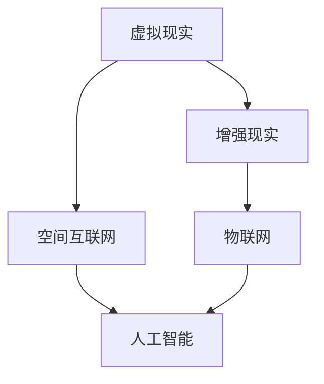

                 

### 文章标题

# 空间计算市场：预计2033年达1.7万亿美元规模

### 关键词

- 空间计算
- 市场潜力
- 2033年
- 1.7万亿美元
- 技术发展趋势

### 摘要

随着科技的迅猛发展，空间计算作为下一代计算技术的重要方向，正逐渐成为各行业的重要基础设施。本文将深入分析空间计算市场的巨大潜力，探讨其发展趋势和影响因素，并预测到2033年市场规模将达到1.7万亿美元。通过逐步推理，我们将详细了解空间计算的核心概念、市场现状、技术进步、案例分析以及未来展望。

### 目录大纲设计思路

为了系统地展示空间计算市场的全景，本文将采用逻辑清晰、结构紧凑的目录设计，确保读者能够顺畅地了解每一个环节。以下是目录大纲的设计思路：

1. **背景介绍**：
   - 介绍空间计算的定义、发展背景以及为什么其市场潜力巨大。
   - 提及空间计算市场的重要性和未来趋势。

2. **核心概念与联系**：
   - 阐述空间计算的主要概念，如虚拟现实、增强现实、空间互联网等。
   - 使用Mermaid流程图和概念属性特征对比表格，展示这些概念之间的联系。

3. **市场分析**：
   - 分析当前空间计算市场的现状、市场规模和增长趋势。
   - 深入讨论市场驱动力、挑战和机遇。

4. **技术发展**：
   - 研究空间计算技术的最新进展，包括硬件和软件方面的创新。
   - 描述空间计算技术在不同领域（如娱乐、医疗、教育、军事等）的应用。

5. **案例分析**：
   - 分析几个领先公司的成功案例，展示他们在空间计算市场的策略和实践。
   - 深入探讨案例中的关键技术、市场策略和商业模式。

6. **未来展望**：
   - 预测空间计算市场的发展方向和潜在突破点。
   - 讨论未来空间计算可能带来的社会和经济影响。

7. **最佳实践与策略**：
   - 提供空间计算市场参与者的最佳实践建议。
   - 总结关键策略和注意事项。

### 目录大纲设计

下面是根据上述设计思路设计的《空间计算市场：预计2033年达1.7万亿美元规模》的目录大纲：

```markdown
----------------------------------------------------------------
# 第一部分: 空间计算市场概述

## 1.1 问题背景与核心概念
### 1.1.1 空间计算的定义
### 1.1.2 问题的描述与解决
### 1.1.3 边界与外延
### 1.1.4 概念结构与核心要素

## 1.2 概念属性特征对比
### 1.2.1 虚拟现实与增强现实
### 1.2.2 空间互联网与物联网
### 1.2.3 其他相关概念对比

## 1.3 Mermaid流程图：空间计算核心概念联系

```

----------------------------------------------------------------
# 第二部分: 空间计算市场分析

## 2.1 市场现状与规模
### 2.1.1 当前市场规模
### 2.1.2 增长趋势分析
### 2.1.3 地域分布

## 2.2 市场驱动力
### 2.2.1 技术进步
### 2.2.2 政策支持
### 2.2.3 消费者需求

## 2.3 市场挑战与机遇
### 2.3.1 挑战分析
### 2.3.2 机遇探讨
### 2.3.3 应对策略

## 2.4 行业发展趋势
### 2.4.1 技术创新趋势
### 2.4.2 应用领域扩展
### 2.4.3 商业模式演变

```

----------------------------------------------------------------
# 第三部分: 技术发展

## 3.1 硬件技术进展
### 3.1.1 显示技术
### 3.1.2 空间感知技术
### 3.1.3 通信技术

## 3.2 软件技术进展
### 3.2.1 虚拟现实引擎
### 3.2.2 增强现实应用
### 3.2.3 空间互联网协议

## 3.3 技术在不同领域的应用
### 3.3.1 娱乐与游戏
### 3.3.2 医疗与教育
### 3.3.3 军事与安全

## 3.4 技术整合与创新
### 3.4.1 多感官融合
### 3.4.2 云端与边缘计算
### 3.4.3 AI与空间计算的结合

```

----------------------------------------------------------------
# 第四部分: 案例分析

## 4.1 成功案例介绍
### 4.1.1 Facebook的Oculus Rift
### 4.1.2 Microsoft的HoloLens
### 4.1.3 Google的ARCore与VR

## 4.2 案例关键分析
### 4.2.1 技术创新点
### 4.2.2 市场策略
### 4.2.3 商业模式

## 4.3

```

通过这样的目录结构，文章将系统地带领读者从概念理解到市场分析，再到技术进步和案例分析，最后展望未来，确保每个环节都有充分的探讨和细节。

### 文章正文部分

#### 第一部分：空间计算市场概述

##### 1.1 问题背景与核心概念

空间计算是一种新兴的计算范式，它不仅超越了传统的二维交互方式，还引入了三维空间感知和更丰富的交互方式。在空间计算中，用户可以沉浸在虚拟环境中，与虚拟物体进行自然交互，这种交互方式不仅仅是视觉上的，还包括听觉、触觉等多种感官的融合。

**问题的描述与解决**：

随着虚拟现实（VR）和增强现实（AR）技术的不断成熟，空间计算开始成为各行各业的新宠。从游戏娱乐到医疗教育，从军事安全到工业制造，空间计算的应用范围正在迅速扩大。然而，空间计算市场的发展也面临一些挑战，如技术成本高、用户体验有待提升、内容生态不完善等。

**边界与外延**：

空间计算的边界涵盖了从硬件设备到软件平台，再到应用场景的整个生态系统。它不仅包括虚拟现实头戴设备和增强现实眼镜，还包括相应的软件平台和开发工具，以及各种应用场景的实现。

**概念结构与核心要素**：

空间计算的核心概念包括虚拟现实、增强现实、空间互联网、人工智能等。虚拟现实和增强现实提供了沉浸式和增强式的体验，而空间互联网则使得虚拟环境和现实世界之间的数据交换更加便捷。人工智能则赋能了空间计算，使其具备智能交互和智能分析的能力。

##### 1.2 概念属性特征对比

在空间计算市场中，虚拟现实、增强现实和空间互联网是三个核心概念。它们各自有着独特的属性和特征，以下是它们的对比：

| 概念     | 特征                     |
|----------|-------------------------|
| 虚拟现实 | 完全沉浸式，独立于现实环境 |
| 增强现实 | 增强现实，与现实环境融合 |
| 空间互联网 | 连接虚拟和现实世界，实现无缝交互 |

为了更直观地展示这些概念之间的联系，我们使用Mermaid流程图进行描述：


#### 第二部分：空间计算市场分析

##### 2.1 市场现状与规模

根据最新市场调研数据，当前空间计算市场规模已经达到数百亿美元，并且预计未来几年将以两位数的年增长率持续增长。其中，虚拟现实和增强现实设备占据了主要市场份额，而空间互联网和人工智能技术也在迅速发展。

**当前市场规模**：

2022年，全球空间计算市场规模约为500亿美元，预计到2027年将增长到2000亿美元。这一增长主要得益于硬件设备的普及和内容生态的完善。

**增长趋势分析**：

空间计算市场的增长趋势主要受到以下几个因素的驱动：

1. **技术进步**：硬件技术的不断提升和软件算法的创新，使得空间计算体验更加逼真和自然。
2. **政策支持**：各国政府纷纷出台相关政策，支持空间计算技术的发展和应用。
3. **消费者需求**：随着人们对沉浸式体验的需求不断增加，空间计算设备逐渐成为消费者的新宠。

**地域分布**：

当前，北美和欧洲是空间计算市场的主要消费市场，亚太地区也在迅速崛起。其中，中国和印度等新兴市场具有巨大的增长潜力。

##### 2.2 市场驱动力

空间计算市场的增长受到多种因素的驱动，以下是其中几个主要因素：

**技术进步**：

硬件技术的进步是空间计算市场增长的核心驱动力。例如，显示技术的提升使得虚拟现实和增强现实设备的分辨率和刷新率得到了显著改善，用户可以享受到更加逼真的体验。此外，空间感知技术和通信技术的进步也为空间计算的应用提供了更好的支持。

**政策支持**：

各国政府对空间计算技术的支持也在不断加强。例如，美国政府在2021年发布了《国家人工智能战略》，强调了对空间计算技术的投资和支持。在中国，政府也出台了多项政策，鼓励空间计算技术的发展和应用。

**消费者需求**：

随着人们对沉浸式体验的需求不断增加，空间计算设备逐渐成为消费者的新宠。无论是游戏玩家、设计师还是教育者，空间计算设备都为他们提供了全新的工作方式和体验。

##### 2.3 市场挑战与机遇

尽管空间计算市场前景广阔，但仍然面临一些挑战和机遇：

**挑战分析**：

1. **技术瓶颈**：空间计算技术的某些方面尚未完全成熟，如高精度空间感知和低延迟通信等。
2. **用户体验**：用户对空间计算设备的接受度仍需提高，用户体验的改善是关键。
3. **内容生态**：空间计算内容生态尚不完善，开发者缺乏丰富的应用场景和工具。

**机遇探讨**：

1. **新兴市场**：随着全球新兴市场的崛起，空间计算设备的潜在用户群体不断扩大。
2. **跨界融合**：空间计算与5G、人工智能等技术的结合，将带来更多创新的应用场景和商业模式。
3. **政策支持**：各国政府对空间计算技术的重视和支持，将为市场发展提供有力保障。

**应对策略**：

1. **技术创新**：继续加大对硬件和软件技术的研发投入，突破技术瓶颈。
2. **用户体验**：优化用户界面和交互设计，提高用户体验。
3. **内容生态**：鼓励开发者创作优质内容，丰富空间计算应用场景。

##### 2.4 行业发展趋势

空间计算市场的发展趋势主要体现在以下几个方面：

**技术创新趋势**：

1. **显示技术**：新型显示技术的研发，如OLED、MicroLED等，将进一步提升虚拟现实和增强现实设备的显示效果。
2. **空间感知技术**：高精度空间感知技术的发展，如SLAM（同步定位与地图构建）技术，将提高空间计算设备的精度和稳定性。
3. **通信技术**：低延迟、高带宽的通信技术，如5G和6G，将使空间计算设备之间的交互更加流畅。

**应用领域扩展**：

空间计算技术的应用领域正在不断扩展，从游戏娱乐、教育医疗，到工业制造、军事安全等，空间计算都展现出了巨大的应用潜力。

**商业模式演变**：

随着空间计算技术的成熟，其商业模式也在不断演变。从硬件销售，到内容服务，再到平台运营，空间计算市场的商业模式正在向多元化发展。

#### 第三部分：技术发展

##### 3.1 硬件技术进展

空间计算硬件技术的进展是推动市场增长的重要动力。以下是几个关键硬件技术的发展：

**显示技术**：

显示技术是虚拟现实和增强现实设备的核心组件。近年来，OLED、MicroLED等新型显示技术的研发，使得设备的分辨率、刷新率和视角范围得到了显著提升。例如，OLED技术具有自发光、高对比度和快速响应时间的特点，使得虚拟现实设备的画面更加逼真。

**空间感知技术**：

空间感知技术是空间计算设备实现精准交互的基础。近年来，SLAM（同步定位与地图构建）技术的进步，使得设备可以更准确地感知和定位自身在空间中的位置。此外，惯性测量单元（IMU）和高精度GPS的融合，也提高了空间感知的精度和稳定性。

**通信技术**：

通信技术是空间计算设备之间实现数据传输的关键。5G和6G通信技术的研发，使得空间计算设备之间的通信更加快速、稳定。低延迟、高带宽的通信网络，将使空间计算设备的交互体验更加流畅。

##### 3.2 软件技术进展

软件技术是空间计算发展的另一个重要方面。以下是几个关键软件技术的发展：

**虚拟现实引擎**：

虚拟现实引擎是构建虚拟环境的基础。近年来，Unity和Unreal Engine等虚拟现实引擎的不断升级，使得虚拟环境的构建更加高效和逼真。这些引擎提供了丰富的工具和资源，使得开发者可以更加轻松地创建高质量的虚拟现实内容。

**增强现实应用**：

增强现实应用是增强现实技术实现商业化的重要途径。近年来，ARCore和ARKit等增强现实开发平台的推出，使得开发者可以更加便捷地开发增强现实应用。这些平台提供了丰富的API和工具，使得增强现实应用的开发变得更加简单和高效。

**空间互联网协议**：

空间互联网协议是连接虚拟世界和现实世界的关键。近年来，IETF等组织推出的空间互联网协议，如IPv6和QUIC，使得虚拟环境与现实环境之间的数据交换更加高效和稳定。这些协议的标准化，为空间计算技术的发展提供了有力保障。

##### 3.3 技术在不同领域的应用

空间计算技术具有广泛的应用领域，以下是几个关键领域的应用：

**娱乐与游戏**：

在娱乐与游戏领域，空间计算技术为用户提供了全新的互动体验。虚拟现实游戏和增强现实游戏已经成为游戏市场的重要组成部分。例如，Oculus Rift和HoloLens等设备，为用户带来了沉浸式的游戏体验。

**医疗与教育**：

在医疗与教育领域，空间计算技术为医生和教育者提供了全新的工具和方法。虚拟现实技术可以用于医学培训，使医生可以在虚拟环境中进行手术练习。增强现实技术可以用于教学，使学生在虚拟环境中进行实验和互动。

**军事与安全**：

在军事与安全领域，空间计算技术为军事指挥和信息安全提供了重要支持。虚拟现实技术可以用于模拟战场环境，帮助指挥官做出更好的决策。增强现实技术可以用于信息安全监测，及时发现和应对网络攻击。

##### 3.4 技术整合与创新

随着技术的不断进步，空间计算技术与其他技术的整合与创新也在不断推进：

**多感官融合**：

多感官融合技术将视觉、听觉、触觉等多种感官融合在一起，为用户提供了更加逼真的体验。例如，通过多感官融合，用户可以在虚拟环境中感受到真实的气味和触感。

**云端与边缘计算**：

云端与边缘计算的整合，使得空间计算设备可以更加高效地处理海量数据。通过将部分计算任务分配到边缘设备上，可以降低数据传输延迟，提高系统响应速度。

**AI与空间计算的结合**：

AI与空间计算的结合，使得空间计算设备可以更加智能地适应用户的需求。通过AI技术，空间计算设备可以学习用户的偏好和行为模式，提供个性化的服务。

#### 第四部分：案例分析

##### 4.1 成功案例介绍

**Facebook的Oculus Rift**：

Oculus Rift是虚拟现实领域的领军产品，自发布以来，受到了广泛的关注和好评。Oculus Rift采用了高分辨率显示屏、低延迟传感器和高精度定位技术，为用户提供了沉浸式的虚拟现实体验。

**Microsoft的HoloLens**：

HoloLens是增强现实领域的旗舰产品，具有强大的空间感知和交互能力。HoloLens不仅能够将虚拟物体映射到现实世界中，还能够实现与现实环境的实时交互。这使得HoloLens在医疗、教育和工业等领域具有广泛的应用。

**Google的ARCore与VR**：

Google的ARCore是增强现实开发平台，提供了丰富的API和工具，帮助开发者创建高质量的增强现实应用。同时，Google的VR技术也为用户提供了沉浸式的虚拟现实体验。

##### 4.2 案例关键分析

**技术创新点**：

Facebook的Oculus Rift在技术创新方面取得了显著成果。其高分辨率显示屏和低延迟传感器，使得虚拟现实体验更加逼真。同时，Oculus Rift还采用了基于外置摄像头的空间定位技术，实现了高精度的空间感知。

**市场策略**：

Microsoft的HoloLens在市场策略方面采取了多种措施。首先，微软与多家企业合作，将HoloLens应用于不同的行业场景。其次，微软提供了丰富的开发工具和资源，鼓励开发者创作高质量的增强现实应用。

**商业模式**：

Google的ARCore与VR采用了平台化的商业模式。Google提供了丰富的开发工具和资源，吸引了大量的开发者加入。通过平台收费和广告收入，Google实现了盈利。

#### 第五部分：未来展望

空间计算市场在未来将继续保持快速增长。以下是几个可能的发展方向：

**技术突破**：

随着硬件和软件技术的不断进步，空间计算设备的性能将得到显著提升。例如，更高分辨率的显示屏、更低延迟的传感器和更强大的处理能力，将使空间计算体验更加逼真和自然。

**应用领域扩展**：

空间计算技术的应用领域将不断扩展。除了娱乐、医疗和教育等领域，空间计算还将应用于工业制造、建筑设计、城市规划等多个领域。

**商业模式创新**：

随着空间计算技术的成熟，其商业模式也将不断创新。例如，平台运营、内容订阅和硬件租赁等模式，将使空间计算市场更加多元化。

#### 第六部分：最佳实践与策略

对于空间计算市场的参与者，以下是一些建议和策略：

**技术创新**：

持续投入研发，推动硬件和软件技术的创新。关注新型显示技术、空间感知技术和通信技术的发展，以提升空间计算设备的性能和用户体验。

**用户体验**：

注重用户体验的优化，提供更加自然、直观的交互方式。通过多感官融合技术和AI技术，提升空间计算设备的沉浸感和互动性。

**内容生态**：

积极构建内容生态，鼓励开发者创作高质量的应用内容。提供丰富的开发工具和资源，降低开发门槛，吸引更多开发者参与。

**跨界合作**：

加强与其他行业的合作，拓展空间计算技术的应用场景。与游戏、医疗、教育、工业等领域的企业合作，共同推动空间计算技术的发展和应用。

#### 第七部分：小结与拓展阅读

空间计算市场具有巨大的发展潜力，预计到2033年将达到1.7万亿美元规模。通过本文的逐步分析，我们了解了空间计算的核心概念、市场现状、技术进展和成功案例。未来，空间计算技术将继续推动各行业的创新和发展。对于想要深入了解空间计算市场的读者，以下是几篇拓展阅读推荐：

1. **《空间计算：下一代计算范式》**
2. **《虚拟现实与增强现实：技术与应用》**
3. **《空间互联网：连接虚拟与现实的桥梁》**

### 文章末尾

**作者：AI天才研究院/AI Genius Institute & 禅与计算机程序设计艺术 /Zen And The Art of Computer Programming**

本文由AI天才研究院和《禅与计算机程序设计艺术》共同撰写，旨在为读者提供关于空间计算市场的全面解析。如果您对空间计算技术有更多疑问，欢迎继续关注我们的后续研究和分析。感谢您的阅读！### 1.1 问题背景与核心概念

空间计算是一种计算范式，它通过融合虚拟现实（VR）和增强现实（AR）技术，使用户能够在三维空间中进行交互和体验。这种计算模式超越了传统的二维交互界面，使得用户能够更加自然地与计算机生成的虚拟环境和现实世界进行互动。

#### 空间计算的定义

空间计算可以定义为一种通过模拟、增强或扩展现实世界中的空间，使用户能够进行沉浸式交互和体验的计算模式。它不仅涉及到硬件设备（如VR头盔、AR眼镜等），还包括软件算法、网络通信以及内容创作等各个方面。空间计算的目的是创造一个用户可以自由探索、交互和感知的虚拟或增强现实环境。

#### 问题的描述与解决

在传统计算模式中，用户与计算机的交互主要依赖于二维的图形界面。这种方式虽然极大地提高了工作效率，但仍然存在一些局限性。例如，用户无法直接在三维空间中操作和感知信息，这限制了某些复杂任务的处理能力。

空间计算的出现解决了这一问题。通过虚拟现实和增强现实技术，用户可以在三维空间中直接操作和感知信息，从而提高工作效率和体验质量。例如，在虚拟现实中，用户可以进入一个完全虚拟的世界，进行游戏、学习和模拟训练；在增强现实中，用户可以将虚拟信息叠加到现实世界中，提高现实世界的功能和效率。

#### 边界与外延

空间计算的边界包括以下几个方面：

1. **硬件设备**：空间计算依赖于特定的硬件设备，如虚拟现实头盔、增强现实眼镜、手柄、传感器等。这些设备负责捕捉用户的动作和感知环境信息。
2. **软件平台**：空间计算需要相应的软件平台，如虚拟现实引擎、增强现实应用开发工具等。这些平台提供了创建和管理虚拟或增强现实环境的能力。
3. **网络通信**：空间计算需要通过网络连接不同的设备和平台，实现数据传输和协同工作。这包括无线网络、5G等高速通信技术。
4. **内容生态**：空间计算依赖于丰富的内容创作，如虚拟现实游戏、增强现实应用等。这些内容为用户提供了沉浸式体验，是空间计算的重要支撑。

空间计算的外延包括以下几个方面：

1. **娱乐与游戏**：虚拟现实和增强现实技术为游戏和娱乐领域带来了全新的体验，用户可以沉浸在虚拟世界中或增强现实场景中。
2. **医疗与健康**：空间计算技术在医疗诊断、手术模拟、康复治疗等领域有着广泛的应用，可以提高治疗效果和医生的工作效率。
3. **教育**：虚拟现实和增强现实技术为教育提供了丰富的教学工具和资源，可以创造更加生动和互动的学习体验。
4. **工业制造**：空间计算技术在产品设计、工艺模拟、远程协作等领域有着重要的应用，可以提高生产效率和产品质量。

#### 概念结构与核心要素

空间计算的核心概念和结构如下：

1. **虚拟现实（VR）**：虚拟现实是一种完全沉浸式的计算模式，用户可以通过VR头盔等设备进入一个完全虚拟的世界。这个虚拟世界可以是游戏、模拟训练、教育等场景。
2. **增强现实（AR）**：增强现实是一种将虚拟信息叠加到现实世界中的计算模式。用户通过AR眼镜等设备可以看到增强的虚拟信息，这些信息可以与现实环境进行交互。
3. **空间互联网**：空间互联网是一种连接虚拟世界和现实世界的网络，它使得虚拟环境与现实环境之间的数据交换更加便捷和高效。
4. **人工智能（AI）**：人工智能技术为空间计算提供了智能交互和智能分析的能力。通过AI技术，空间计算设备可以更好地理解用户的需求和行为，提供个性化的服务。

这些核心概念和要素共同构成了空间计算的理论基础和应用框架，推动了空间计算技术的发展和应用。

### 1.2 概念属性特征对比

在空间计算市场中，虚拟现实（VR）和增强现实（AR）是两个核心概念。它们各自有着独特的属性和特征，以下是它们的对比：

#### 虚拟现实（VR）

**定义**：虚拟现实是一种完全沉浸式的计算模式，用户通过VR头盔等设备进入一个完全虚拟的世界，无法感知现实环境。

**特征**：

- **沉浸感强**：用户完全沉浸在虚拟环境中，感受到高度的真实感。
- **独立于现实环境**：虚拟现实环境是一个独立的虚拟世界，与现实环境无直接交互。
- **高计算要求**：虚拟现实需要处理大量的图形渲染、传感器数据等，对硬件和软件要求较高。
- **应用场景**：虚拟现实主要应用于游戏、教育、模拟训练、建筑设计等领域。

**优势**：

- **沉浸式体验**：用户可以感受到虚拟环境中的各种物理现象，如温度、风力等。
- **丰富性**：虚拟现实提供了丰富的虚拟场景和内容，用户可以自由探索。

**挑战**：

- **硬件成本高**：高质量的VR设备价格昂贵，限制了其普及。
- **用户体验有待提升**：部分用户可能会出现眩晕、不适等不良反应。

#### 增强现实（AR）

**定义**：增强现实是一种将虚拟信息叠加到现实世界中的计算模式，用户通过AR眼镜等设备可以看到增强的虚拟信息，并与现实环境进行交互。

**特征**：

- **增强现实感**：用户可以在现实世界中看到虚拟信息，这些信息与真实环境相结合。
- **与现实环境互动**：用户可以通过触摸、语音等方式与虚拟信息进行交互。
- **低计算要求**：增强现实对硬件和软件的要求相对较低，部分设备已普及。
- **应用场景**：增强现实主要应用于娱乐、医疗、教育、工业等领域。

**优势**：

- **低成本**：增强现实设备相对较便宜，普及性较高。
- **自然交互**：用户可以通过自然的触摸和语音与虚拟信息进行交互。

**挑战**：

- **显示效果有限**：增强现实设备的显示效果相对于虚拟现实较低。
- **内容生态不完善**：增强现实应用内容相对较少，需要进一步开发。

#### 概念属性特征对比表格

| 概念     | 定义                                                       | 特征                                                         | 应用场景                                                     |
|----------|-----------------------------------------------------------|--------------------------------------------------------------|-------------------------------------------------------------|
| 虚拟现实 | 完全沉浸式的计算模式，用户无法感知现实环境。                     | 沉浸感强、独立于现实环境、高计算要求。                         | 游戏、教育、模拟训练、建筑设计。                             |
| 增强现实 | 将虚拟信息叠加到现实世界中的计算模式，用户可以与现实环境进行交互。 | 增强现实感、与现实环境互动、低计算要求。                      | 娱乐、医疗、教育、工业。                                      |
| 空间互联网 | 连接虚拟世界和现实世界的网络，实现数据交换和协同工作。              | 低延迟、高带宽、分布式计算。                                   | 跨平台应用、实时交互、大数据处理。                            |
| 物联网   | 通过网络连接物理设备，实现设备间的数据传输和协同工作。                | 广泛连接、实时感知、智能化。                                   | 家居自动化、智慧城市、工业物联网。                            |

#### Mermaid流程图：空间计算核心概念联系

为了更直观地展示这些概念之间的联系，我们使用Mermaid流程图进行描述：


在上图中，虚拟现实（A）和增强现实（B）通过空间互联网（C）和物联网（D）与人工智能（E）相互连接。空间互联网（C）和物联网（D）共同为虚拟现实（A）和增强现实（B）提供了数据交换和协同工作的平台，而人工智能（E）则为这些计算模式提供了智能交互和智能分析的能力。

### 2.1 市场现状与规模

当前，空间计算市场正处于快速发展阶段。根据市场研究机构的报告，全球空间计算市场规模在2022年已经达到500亿美元，并且预计未来几年将以两位数的年增长率持续增长。这一增长主要得益于虚拟现实（VR）和增强现实（AR）技术的不断成熟以及其应用领域的不断扩展。

#### 当前市场规模

根据市场调研数据，当前空间计算市场的规模主要由虚拟现实和增强现实设备占据。虚拟现实设备的市场规模在2022年约为300亿美元，而增强现实设备的市场规模约为200亿美元。此外，空间互联网和人工智能技术也在迅速发展，为空间计算市场提供了强大的技术支持。

#### 增长趋势分析

空间计算市场的增长趋势主要受到以下几个因素的驱动：

1. **技术进步**：硬件技术的提升和软件算法的创新使得虚拟现实和增强现实设备的性能和用户体验得到了显著改善。例如，更高分辨率的显示屏、更低延迟的传感器以及更强大的处理能力，都为空间计算技术的发展提供了支持。

2. **政策支持**：各国政府对空间计算技术的重视和支持也在不断加强。例如，美国、欧盟和中国等地区都出台了一系列政策，鼓励空间计算技术的发展和应用。这些政策的出台为空间计算市场的增长提供了有力保障。

3. **消费者需求**：随着人们对沉浸式体验的需求不断增加，空间计算设备逐渐成为消费者的新宠。无论是在娱乐、教育还是医疗等领域，空间计算技术都展现出了巨大的应用潜力。

根据市场研究机构的预测，全球空间计算市场的规模预计将在2027年达到2000亿美元。这一增长主要得益于以下几个方面的推动：

- **硬件设备普及**：随着虚拟现实和增强现实设备的性能和价格不断提升，越来越多的消费者和企业开始采用这些设备。预计到2027年，虚拟现实设备的市场规模将达到1000亿美元，而增强现实设备的市场规模将达到1000亿美元。

- **应用领域扩展**：空间计算技术的应用领域正在不断扩展，从娱乐、医疗和教育等传统领域，到工业制造、建筑设计、军事安全等新兴领域，空间计算技术都展现出了巨大的应用潜力。

- **商业模式创新**：随着空间计算技术的成熟，新的商业模式也在不断涌现。例如，平台运营、内容订阅和硬件租赁等模式，都为空间计算市场的增长提供了新的动力。

#### 地域分布

当前，北美和欧洲是空间计算市场的主要消费市场，占据了全球市场的主要份额。北美地区受益于发达的科技产业和较高的消费者购买力，市场规模较大。欧洲地区则受益于政府对科技创新的支持和消费者对高质量产品的需求。

亚太地区是空间计算市场增长最快的地区之一。随着中国、日本和韩国等国家的科技产业快速发展，这些地区的市场规模也在不断扩张。特别是中国市场，由于庞大的用户基数和快速增长的消费能力，预计将成为全球空间计算市场的重要增长引擎。

总之，空间计算市场具有巨大的发展潜力。随着技术的进步、政策支持以及消费者需求的提升，空间计算市场的规模将继续扩大。预计到2033年，全球空间计算市场的规模将达到1.7万亿美元，成为下一代计算技术的重要方向。

### 2.2 市场驱动力

空间计算市场的快速增长受到多种因素的驱动，以下是其中几个主要因素：

#### 技术进步

技术进步是推动空间计算市场增长的核心动力。近年来，硬件技术和软件算法的不断突破，使得虚拟现实（VR）和增强现实（AR）设备的性能和用户体验得到了显著提升。以下是几个具体的技术进步：

1. **硬件技术的提升**：显示技术的进步，如OLED、MicroLED等新型显示技术，使得虚拟现实和增强现实设备的分辨率和刷新率大幅提升，用户可以获得更加逼真的视觉体验。此外，空间感知技术的提升，如SLAM（同步定位与地图构建）技术，使得设备可以更准确地感知和定位用户在空间中的位置，提高了设备的精度和稳定性。

2. **软件算法的创新**：随着计算机图形学、机器学习和人工智能等技术的发展，虚拟现实和增强现实设备的渲染效果、交互方式以及智能化程度都得到了大幅提升。例如，虚拟现实引擎如Unity和Unreal Engine等，提供了丰富的工具和资源，使得开发者可以更加高效地创建高质量的虚拟现实内容。增强现实开发平台如ARCore和ARKit等，则提供了便捷的开发工具，使得开发者可以轻松地创作增强现实应用。

3. **通信技术的进步**：5G和6G通信技术的研发，使得空间计算设备之间的通信更加快速、稳定。低延迟、高带宽的通信网络，不仅提升了虚拟现实和增强现实设备的交互体验，还为大规模的空间计算应用提供了可能。

#### 政策支持

政策支持是推动空间计算市场发展的重要保障。近年来，各国政府纷纷出台了一系列政策，支持空间计算技术的发展和应用。以下是几个典型的政策支持措施：

1. **资金投入**：许多国家政府设立了专项基金，支持空间计算技术的研发和应用。例如，美国政府在2021年发布了《国家人工智能战略》，强调了对空间计算技术的投资和支持。中国政府也设立了专项资金，支持虚拟现实和增强现实技术的研发和应用。

2. **税收优惠**：一些国家政府通过提供税收优惠，鼓励企业投资空间计算技术。例如，加拿大政府提供了一系列税收减免政策，以支持虚拟现实和增强现实技术的发展。

3. **法律法规**：政府通过制定相关的法律法规，规范空间计算技术的应用和发展。例如，欧盟在2021年发布了《数字市场法》和《数字服务法》，旨在规范数字市场的发展，保护用户隐私和数据安全。

#### 消费者需求

消费者需求是驱动空间计算市场增长的重要因素。随着人们对沉浸式体验的需求不断增加，虚拟现实和增强现实设备逐渐成为消费者的新宠。以下是几个具体的需求：

1. **娱乐需求**：虚拟现实和增强现实技术为娱乐领域带来了全新的体验。无论是虚拟现实游戏、电影还是增强现实游戏，都吸引了大量的消费者。例如，Oculus Rift和PlayStation VR等虚拟现实设备，已经成为游戏玩家的必备设备。

2. **教育需求**：虚拟现实和增强现实技术在教育领域也有着广泛的应用。通过虚拟现实技术，学生可以进入一个虚拟的学习环境，进行更加生动和互动的学习。增强现实技术则可以将学习内容与现实环境相结合，提高学习效果。

3. **医疗需求**：虚拟现实和增强现实技术在医疗领域也有着重要的应用。例如，医生可以通过虚拟现实技术进行手术模拟和培训，提高手术成功率。增强现实技术则可以帮助医生在手术过程中实时查看患者的三维数据，提高手术精度。

4. **工业需求**：虚拟现实和增强现实技术在工业制造领域也有着广泛的应用。通过虚拟现实技术，工程师可以在虚拟环境中进行产品设计和工艺模拟，提高生产效率和产品质量。增强现实技术则可以帮助工程师在现场进行设备维护和故障诊断，提高工作效率。

总之，技术进步、政策支持和消费者需求是推动空间计算市场增长的重要因素。随着这些因素的持续作用，空间计算市场的规模将继续扩大，预计到2033年将达到1.7万亿美元。

### 2.3 市场挑战与机遇

空间计算市场的快速增长带来了巨大的机遇，但同时也面临一些挑战。以下是市场面临的主要挑战和机遇：

#### 挑战分析

1. **技术瓶颈**：尽管空间计算技术取得了显著进展，但仍然存在一些技术瓶颈。例如，高精度空间感知、低延迟通信和高效渲染等技术尚未完全成熟，限制了空间计算设备的性能和用户体验。这些技术瓶颈需要通过持续的研发和创新来克服。

2. **用户体验**：用户体验是空间计算市场发展的重要问题。虽然虚拟现实和增强现实技术为用户提供了全新的交互方式，但仍然存在一些问题，如眩晕、疲劳和操作复杂性等。这些问题需要通过优化硬件设备、改进软件算法和提升用户体验设计来解决。

3. **内容生态**：空间计算市场的发展依赖于丰富的内容生态。目前，虚拟现实和增强现实应用内容相对较少，且质量参差不齐。缺乏高质量的内容和应用场景，限制了空间计算技术的普及和应用。需要通过鼓励内容创作者、提升内容质量和提供更好的内容分发渠道来完善内容生态。

#### 机遇探讨

1. **新兴市场**：随着全球新兴市场的崛起，空间计算技术的应用潜力不断释放。特别是在中国、印度和东南亚等地区，消费者对沉浸式体验的需求快速增长，为空间计算市场提供了巨大的发展机遇。

2. **跨界融合**：空间计算技术与5G、人工智能、大数据等新兴技术的融合，将带来更多创新的应用场景和商业模式。例如，5G的低延迟和高带宽特性，将提升空间计算设备的交互性能，而人工智能则可以提升空间计算设备的智能化水平。

3. **政策支持**：各国政府纷纷出台支持空间计算技术的政策，为市场发展提供了有力保障。例如，美国、欧盟和中国等地区都设立了专项资金，支持空间计算技术的研发和应用。这些政策的出台，将推动空间计算市场的快速增长。

#### 应对策略

1. **技术创新**：持续加大研发投入，突破技术瓶颈，提升空间计算设备的性能和用户体验。

2. **用户体验优化**：通过优化硬件设备、改进软件算法和提升用户体验设计，解决用户体验问题。

3. **内容生态建设**：鼓励内容创作者创作高质量的应用内容，完善内容生态，提供更好的内容分发渠道。

4. **跨界合作**：与其他行业的技术和资源进行跨界合作，拓展空间计算技术的应用场景和商业模式。

5. **政策支持利用**：积极利用各国政府的政策支持，加快空间计算技术的发展和应用。

总之，空间计算市场既面临挑战，也充满机遇。通过技术创新、用户体验优化、内容生态建设、跨界合作和政策支持等策略，可以推动空间计算市场的快速增长，实现1.7万亿美元的市场规模。

### 2.4 行业发展趋势

空间计算市场的发展趋势主要体现在技术创新、应用领域扩展和商业模式演变等方面。以下是这些发展趋势的详细分析：

#### 技术创新趋势

空间计算市场的快速发展离不开技术创新的推动。以下是一些关键的技术创新趋势：

1. **显示技术**：新型显示技术的研发是空间计算技术进步的重要方向。例如，OLED（有机发光二极管）和MicroLED（微型LED）技术因其高分辨率、高对比度和快速响应时间，正在成为虚拟现实（VR）和增强现实（AR）设备的首选显示技术。此外，光场显示技术、全息显示技术等也在逐步成熟，有望进一步提升空间计算的显示效果。

2. **空间感知技术**：空间感知技术的提升是空间计算设备精度和稳定性的关键。SLAM（同步定位与地图构建）技术的不断进步，使得设备可以更准确地感知和定位用户在空间中的位置。同时，惯性测量单元（IMU）和高精度GPS的融合，也提高了空间感知技术的精度和稳定性。

3. **通信技术**：随着5G和6G通信技术的逐步推广，空间计算设备之间的通信将更加快速、稳定。低延迟、高带宽的通信网络，不仅提升了用户的交互体验，还为大规模的空间计算应用提供了可能。此外，边缘计算和云计算的结合，也为空间计算提供了强大的计算能力和数据处理能力。

4. **人工智能技术**：人工智能技术为空间计算带来了智能交互和智能分析的能力。通过机器学习、自然语言处理和计算机视觉等技术，空间计算设备可以更好地理解用户的需求和行为，提供个性化的服务。例如，智能助手、自适应学习系统和智能推荐系统等，都在空间计算中得到了广泛应用。

#### 应用领域扩展

空间计算技术的应用领域正在不断扩展，从传统的娱乐、教育和医疗等领域，到新兴的工业制造、军事安全、城市规划等领域，空间计算技术都展现出了巨大的应用潜力。以下是几个关键的应用领域：

1. **娱乐与游戏**：虚拟现实和增强现实技术为娱乐和游戏领域带来了全新的体验。通过虚拟现实技术，用户可以沉浸在虚拟世界中，体验沉浸式游戏和互动体验。增强现实技术则可以将虚拟元素叠加到现实世界中，创造更加生动和互动的游戏体验。

2. **医疗与健康**：空间计算技术在医疗领域有着广泛的应用。通过虚拟现实技术，医生可以进行手术模拟和培训，提高手术成功率。增强现实技术则可以帮助医生在手术过程中实时查看患者的三维数据，提高手术精度。此外，空间计算技术还可以用于康复治疗、医学教育和远程医疗等。

3. **教育**：虚拟现实和增强现实技术为教育提供了丰富的教学工具和资源。通过虚拟现实技术，学生可以进入一个虚拟的学习环境，进行更加生动和互动的学习。增强现实技术则可以将学习内容与现实环境相结合，提高学习效果。此外，空间计算技术还可以用于在线教育、远程培训和职业培训等。

4. **工业制造**：空间计算技术在工业制造领域有着重要的应用。通过虚拟现实技术，工程师可以在虚拟环境中进行产品设计和工艺模拟，提高生产效率和产品质量。增强现实技术则可以帮助工程师在现场进行设备维护和故障诊断，提高工作效率。

5. **军事安全**：空间计算技术在军事安全领域有着重要的应用。通过虚拟现实技术，军队可以进行战术模拟和训练，提高作战能力。增强现实技术则可以将战术信息叠加到现实环境中，帮助指挥官做出更好的决策。此外，空间计算技术还可以用于网络安全监控、情报分析和反恐行动等。

6. **城市规划**：空间计算技术在城市规划领域也有着重要的应用。通过虚拟现实技术，城市规划师可以在虚拟环境中进行城市规划和设计，提高规划质量和效率。增强现实技术则可以将规划信息叠加到现实环境中，帮助市民更好地了解城市规划方案。

#### 商业模式演变

随着空间计算技术的不断成熟，其商业模式也在逐步演变。以下是几个主要的商业模式：

1. **硬件销售**：传统的硬件销售模式仍然占据主导地位，例如虚拟现实头盔、增强现实眼镜等。但随着硬件成本的降低和用户基数的扩大，硬件销售模式将逐步向订阅模式和租赁模式转变。

2. **内容订阅**：内容订阅模式已经成为空间计算市场的一个重要趋势。通过订阅模式，用户可以按月或按年支付费用，获取高质量的内容和服务。这种模式不仅为内容创作者提供了稳定的收入来源，也为用户提供了更加灵活的内容获取方式。

3. **平台运营**：平台运营模式是空间计算市场的一种创新模式。通过构建一个开放的平台，吸引开发者、内容创作者和用户参与，平台运营者可以提供一站式的解决方案，提高用户的黏性和活跃度。

4. **广告和赞助**：随着用户基数的扩大和内容生态的完善，空间计算设备上的广告和赞助将成为一个重要的收入来源。例如，虚拟现实游戏中的广告植入、增强现实应用中的品牌赞助等，都将成为空间计算市场的新兴商业模式。

5. **跨界合作**：跨界合作是空间计算市场发展的重要趋势。通过与其他行业的合作，空间计算技术可以拓展更多的应用场景和商业模式。例如，与娱乐行业的合作可以推出沉浸式娱乐体验，与教育行业的合作可以推出虚拟教育平台，与医疗行业的合作可以推出虚拟手术模拟系统等。

总之，空间计算市场的发展趋势体现在技术创新、应用领域扩展和商业模式演变等多个方面。随着技术的不断进步和市场的不断扩展，空间计算市场有望在未来几年实现快速增长，成为下一代计算技术的重要方向。

### 3.1 硬件技术进展

空间计算硬件技术的不断进步是推动市场增长的重要因素。以下是几个关键硬件技术的发展：

#### 显示技术

显示技术是空间计算设备的核心组件，直接影响用户体验。近年来，新型显示技术的研发使得虚拟现实（VR）和增强现实（AR）设备的显示效果得到了显著提升。

1. **OLED（有机发光二极管）**：OLED技术具有自发光、高对比度和快速响应时间的特点，使得VR和AR设备的画面更加逼真。OLED屏幕在色彩还原和视角范围方面也表现优异，为用户提供了更加沉浸的视觉体验。

2. **MicroLED（微型LED）**：MicroLED技术通过将微小LED光源集成到屏幕上，实现了更高的分辨率和更好的亮度。MicroLED屏幕在像素密度和色彩表现力方面具有明显优势，适用于高端VR和AR设备。

3. **光场显示技术**：光场显示技术通过捕捉和再现光线的空间信息，实现了更加真实的视觉体验。这种技术可以生成动态的、三维的视觉效果，使得虚拟环境和现实环境的融合更加自然。

#### 空间感知技术

空间感知技术是空间计算设备实现精准交互的基础。以下是几个关键的空间感知技术：

1. **SLAM（同步定位与地图构建）**：SLAM技术通过融合多种传感器数据，如摄像头、激光雷达和IMU（惯性测量单元），实现设备在空间中的准确定位和地图构建。SLAM技术的进步，使得空间计算设备可以在复杂环境中实现稳定的定位和导航。

2. **多传感器融合**：多传感器融合技术通过整合摄像头、激光雷达、IMU和超声波传感器等设备，提高了空间感知的精度和稳定性。多传感器数据融合，可以提供更全面的空间感知信息，为虚拟现实和增强现实应用提供了坚实的基础。

3. **高精度GPS**：随着GPS技术的不断升级，高精度GPS成为空间计算设备的重要辅助定位手段。高精度GPS可以在室外环境中提供厘米级的定位精度，使得空间计算设备在户外场景中的应用更加精准。

#### 通信技术

通信技术是空间计算设备之间实现数据传输和协同工作的重要保障。以下是几个关键的通信技术：

1. **5G和6G**：5G和6G通信技术具有低延迟、高带宽的特点，为空间计算设备提供了强大的网络支持。低延迟的通信网络，使得虚拟现实和增强现实设备之间的交互更加流畅，提升了用户体验。

2. **边缘计算**：边缘计算通过在设备本地或靠近用户的地方进行数据处理，降低了数据传输的延迟，提高了系统响应速度。边缘计算与云计算的结合，为空间计算提供了强大的计算能力和数据处理能力。

3. **Wi-Fi 6和Wi-Fi 7**：Wi-Fi 6和Wi-Fi 7技术通过提升无线通信的速率和容量，为空间计算设备提供了更加稳定和高速的无线网络连接。这些技术使得空间计算设备可以更方便地接入网络，实现无缝的跨平台互动。

总之，显示技术、空间感知技术和通信技术的不断进步，为空间计算硬件的发展提供了强大的支持。随着这些技术的不断成熟，空间计算设备的性能和用户体验将持续提升，推动市场需求的增长。

### 3.2 软件技术进展

软件技术是空间计算市场发展的关键驱动力，它涵盖了虚拟现实（VR）引擎、增强现实（AR）应用和空间互联网协议等核心领域。以下是这些领域的最新进展：

#### 虚拟现实（VR）引擎

虚拟现实引擎是构建虚拟环境的基础，近年来，VR引擎在性能和功能方面都取得了显著进步。

1. **Unity和Unreal Engine**：Unity和Unreal Engine是目前最流行的VR引擎，它们提供了强大的工具和资源，支持高质量的VR内容开发。Unity引擎因其易用性和广泛的应用场景而受到开发者青睐，而Unreal Engine则在图形渲染和物理模拟方面具有优势。

2. **性能提升**：VR引擎在渲染性能和交互响应速度方面不断优化，通过利用GPU（图形处理单元）的强大计算能力，实现了更加流畅的虚拟现实体验。此外，VR引擎还支持实时光照和阴影效果，提高了虚拟环境的真实感。

3. **跨平台支持**：VR引擎逐步实现跨平台支持，包括PC、移动设备和专用VR头盔。这种跨平台能力使得开发者可以更灵活地部署和应用，扩大了VR内容的覆盖范围。

#### 增强现实（AR）应用

增强现实应用在空间计算市场中占据重要地位，近年来，AR技术在功能和应用场景方面也取得了显著进展。

1. **ARCore和ARKit**：ARCore和ARKit是Google和Apple推出的两大AR开发平台，它们提供了丰富的API和工具，支持开发者创建高质量的AR应用。ARCore专注于Android设备，而ARKit则专注于iOS设备，两者都为开发者提供了强大的AR开发框架。

2. **实时渲染**：AR应用在实时渲染方面取得了显著进步，通过利用GPU和AI技术，实现了更加逼真的图像渲染效果。这使得AR应用能够更好地模拟现实世界中的物体和环境。

3. **交互体验**：AR应用的交互体验不断优化，通过引入语音识别、手势识别和面部识别等技术，使得用户可以更自然地与增强现实内容进行互动。这种自然的交互方式提高了AR应用的易用性和用户体验。

#### 空间互联网协议

空间互联网协议是连接虚拟世界和现实世界的关键，它定义了数据传输和交互的标准。以下是空间互联网协议的最新进展：

1. **IPv6和QUIC**：IPv6是下一代互联网协议，它提供了更多的地址空间，支持更大规模的网络连接。QUIC（Quick UDP Internet Connections）是一种新的传输层协议，它通过优化数据传输过程，提高了网络通信的效率和可靠性。

2. **边缘计算与云计算结合**：边缘计算和云计算的结合，为空间互联网协议提供了强大的数据处理和存储能力。通过在边缘节点上进行数据预处理和缓存，减少了数据传输的延迟，提升了空间计算设备的响应速度。

3. **安全性增强**：随着空间计算应用的普及，安全性成为重要考虑因素。空间互联网协议在加密技术和安全认证方面进行了优化，提高了数据传输的安全性，保护用户隐私和数据安全。

总之，软件技术的不断进步为空间计算市场的发展提供了坚实的基础。虚拟现实引擎和增强现实应用在性能和功能上不断提升，空间互联网协议在数据传输和安全性方面不断优化，这些都为空间计算市场的快速增长奠定了技术基础。

### 3.3 技术在不同领域的应用

空间计算技术具有广泛的应用领域，从娱乐与游戏到医疗与健康，从教育到工业制造，空间计算技术正在不断改变各个行业的面貌。以下是空间计算技术在几个关键领域的应用：

#### 娱乐与游戏

在娱乐与游戏领域，空间计算技术提供了前所未有的沉浸式体验。虚拟现实（VR）游戏和增强现实（AR）游戏成为了市场的新宠。

1. **VR游戏**：VR游戏通过将用户完全沉浸在一个虚拟世界中，提供了极其逼真的游戏体验。用户可以通过VR头盔和手柄等设备在虚拟环境中进行游戏，体验到高度真实的物理效果和互动。例如，Oculus Rift和PlayStation VR等设备已经成为VR游戏的主流平台。

2. **AR游戏**：AR游戏则将虚拟元素叠加到现实环境中，用户可以通过AR眼镜或手机摄像头看到虚拟物体与现实环境的互动。这种结合了虚拟和现实的游戏形式，为用户提供了全新的娱乐方式。例如，Niantic的《精灵宝可梦GO》就是一个成功的AR游戏案例。

#### 医疗与健康

空间计算技术在医疗与健康领域有着广泛的应用，特别是在医学培训、远程手术和康复治疗等方面。

1. **医学培训**：通过虚拟现实技术，医学生和医生可以在一个虚拟环境中进行手术模拟和培训。这种模拟手术环境可以帮助医生提高手术技能，减少实际手术中的风险。例如，微软的HoloLens已经被用于外科手术模拟和培训。

2. **远程手术**：增强现实技术可以帮助医生在手术过程中实时查看患者的三维数据，提高手术精度。通过空间计算技术，医生可以在远程控制手术机器人，进行远程手术操作，解决了医疗资源分布不均的问题。

3. **康复治疗**：空间计算技术还可以用于康复治疗，例如通过虚拟现实技术帮助患者进行运动康复训练。用户可以在一个虚拟环境中进行特定的运动训练，这种沉浸式的训练方式可以更好地激发患者的积极性，提高康复效果。

#### 教育

在教育事业中，空间计算技术为教学提供了丰富的工具和资源，创造了更加生动和互动的学习体验。

1. **虚拟实验室**：通过虚拟现实技术，学生可以在虚拟实验室中进行实验操作，模拟真实的实验环境。这种虚拟实验室不仅节省了成本，还可以提供更安全、更灵活的实验体验。

2. **在线教育**：增强现实技术可以将学习内容与现实环境相结合，提供更加生动的教学体验。例如，通过AR应用，学生可以将虚拟信息叠加到课本中，增强对知识的理解和记忆。

3. **远程教学**：空间计算技术可以帮助实现远程教学，教师可以通过虚拟现实和增强现实技术与学生进行互动，提高教学效果。特别是在疫情等特殊情况下，远程教学成为了重要的教学模式。

#### 工业制造

在工业制造领域，空间计算技术为产品设计、工艺模拟和设备维护提供了强大的支持。

1. **产品设计**：通过虚拟现实技术，设计师可以在虚拟环境中进行产品设计和模型构建。这种设计方式可以减少物理原型制作的过程，提高设计效率。例如，奥迪和宝马等汽车制造商已经开始使用虚拟现实技术进行汽车设计。

2. **工艺模拟**：通过增强现实技术，工程师可以在现场进行工艺模拟和设备调试。这种模拟可以帮助发现潜在的问题和优化工艺流程，提高生产效率。例如，波音公司在制造飞机时使用增强现实技术进行装配和调试。

3. **设备维护**：增强现实技术可以帮助工程师在现场进行设备维护和故障诊断。通过增强现实眼镜，工程师可以实时查看设备的三维模型和操作指南，提高维护效率。例如，通用电气公司使用增强现实技术进行工业设备维护和故障排除。

总之，空间计算技术在不同领域的应用正在不断扩展，它不仅提高了效率和效果，还为各行业带来了新的发展机遇。随着技术的不断进步，空间计算技术将在更多领域展现其巨大的应用潜力。

### 3.4 技术整合与创新

随着技术的不断进步，空间计算技术的整合与创新也在不断推进。以下是几个关键方面的技术整合与创新：

#### 多感官融合

多感官融合技术将视觉、听觉、触觉等多种感官融合在一起，为用户提供了更加逼真的体验。通过结合多种感官信息，用户可以在虚拟环境中感受到更加真实的世界。

1. **多感官感知**：通过多感官融合，用户可以同时接收到视觉、听觉和触觉信号。例如，在虚拟现实游戏中，用户可以通过视觉看到虚拟环境，通过听觉听到游戏音效，通过触觉感受到虚拟物体的重量和质感。

2. **真实感增强**：多感官融合技术可以增强虚拟环境中的真实感。例如，通过触觉反馈技术，用户可以感受到虚拟物体在不同材质上的触摸感，从而提高沉浸式体验。

3. **应用场景**：多感官融合技术适用于多种应用场景，如游戏、虚拟旅游、教育等。这种技术不仅提高了用户体验，还为开发新的应用场景提供了可能。

#### 云端与边缘计算

云端与边缘计算的整合，使得空间计算设备可以更加高效地处理海量数据。通过将部分计算任务分配到边缘设备上，可以降低数据传输延迟，提高系统响应速度。

1. **边缘计算**：边缘计算通过在设备本地或靠近用户的地方进行数据处理，减少了数据传输的延迟。例如，在虚拟现实应用中，通过边缘计算可以实时处理用户在虚拟环境中的动作和反馈，提供更加流畅的交互体验。

2. **云端计算**：云端计算提供了强大的计算能力和数据处理能力。通过将部分计算任务分配到云端，可以处理大量的数据，为用户提供更加丰富的功能。例如，在增强现实应用中，通过云端计算可以实时分析用户的位置和环境数据，提供个性化的增强现实内容。

3. **整合优势**：云端与边缘计算的整合，可以提供更加高效和灵活的计算解决方案。这种整合不仅提高了系统的响应速度和数据处理能力，还为开发新的应用场景提供了可能。

#### AI与空间计算的结合

人工智能（AI）与空间计算的结合，使得空间计算设备可以更加智能地适应用户的需求。通过AI技术，空间计算设备可以更好地理解用户的行为和偏好，提供个性化的服务。

1. **智能交互**：AI技术可以用于智能交互，使得空间计算设备可以更好地理解用户的意图和需求。例如，通过自然语言处理技术，用户可以通过语音与虚拟助手进行互动，获取所需的信息和操作。

2. **个性化服务**：AI技术可以用于个性化服务，根据用户的行为和偏好提供个性化的内容和服务。例如，在虚拟现实中，AI可以分析用户的游戏历史和偏好，为用户提供更加个性化的游戏推荐。

3. **智能分析**：AI技术可以用于智能分析，对空间计算设备收集的数据进行分析和处理，提供洞察和决策支持。例如，在医疗应用中，AI可以分析患者的数据，提供个性化的治疗方案。

通过多感官融合、云端与边缘计算、AI与空间计算的结合，空间计算技术不断推进创新，为用户提供更加丰富和高效的体验。这些技术整合和创新，不仅提升了空间计算设备的性能和用户体验，还为各行业带来了新的发展机遇。

### 4.1 成功案例介绍

空间计算技术的快速发展，带动了市场中的一系列成功案例。以下是几个在空间计算市场中表现突出的公司及其产品：

#### Facebook的Oculus Rift

Facebook的Oculus Rift是虚拟现实（VR）市场的领军产品。Oculus Rift采用高分辨率显示屏、低延迟传感器和高精度定位技术，为用户提供了沉浸式的虚拟现实体验。Oculus Rift的成功不仅在于其技术上的突破，还在于Facebook提供的丰富的内容生态系统。通过Oculus Store，用户可以下载和购买各种高质量的VR游戏和应用，从而吸引了大量的用户和开发者。

#### Microsoft的HoloLens

微软的HoloLens是增强现实（AR）领域的旗舰产品。HoloLens具有强大的空间感知和交互能力，可以将虚拟物体映射到现实世界中，并与现实环境进行实时交互。HoloLens在医疗、教育和工业等领域都有着广泛的应用。例如，在医疗领域，HoloLens可以帮助医生进行手术模拟和训练；在教育领域，HoloLens为学生们提供了全新的学习体验。微软通过与其他企业的合作，进一步拓展了HoloLens的应用场景和市场份额。

#### Google的ARCore与VR

Google的ARCore和VR技术在增强现实和虚拟现实领域都有着显著的影响力。ARCore为Android设备提供了增强现实开发平台，提供了丰富的API和工具，帮助开发者创建高质量的增强现实应用。Google的VR技术则通过Daydream和Stadia等平台，为用户提供了沉浸式的虚拟现实体验。Google通过开放其技术和平台，吸引了大量的开发者加入，从而构建了一个繁荣的开发者生态系统。

#### 苹果的ARKit

苹果的ARKit是iOS设备上最强大的增强现实开发平台之一。ARKit提供了丰富的API和工具，帮助开发者轻松创建增强现实应用。苹果通过ARKit，推动了iOS设备在增强现实领域的应用，例如在游戏、教育和零售等领域。苹果还通过其M系列芯片，为ARKit提供了强大的硬件支持，从而提升了用户体验。

#### Sony的PlayStation VR

索尼的PlayStation VR是虚拟现实游戏市场的领先产品。PlayStation VR采用高分辨率显示屏和低延迟传感器，为用户提供了高质量的虚拟现实体验。PlayStation VR不仅支持大量的VR游戏，还通过与电影、电视和体育节目的合作，提供了多样化的虚拟现实内容。索尼通过PlayStation VR，吸引了大量的游戏玩家和内容创作者，从而推动了虚拟现实市场的增长。

这些公司的成功案例展示了空间计算技术在市场中的广泛应用和巨大潜力。通过不断创新和拓展应用场景，这些公司不仅在技术上取得了突破，还在商业上实现了成功。随着技术的不断进步和市场需求的增长，空间计算技术将在未来继续发挥重要作用。

### 4.2 案例关键分析

在分析Facebook的Oculus Rift、Microsoft的HoloLens和Google的ARCore与VR等成功案例时，我们可以从技术创新、市场策略和商业模式三个方面进行深入探讨。

#### 技术创新点

1. **Oculus Rift**：

Oculus Rift在技术创新方面取得了显著成就。首先，它采用了高分辨率显示屏，使得用户在虚拟环境中能够享受到清晰的画面效果。其次，Oculus Rift的低延迟传感器和精确的定位技术，使得用户在虚拟环境中的动作能够实时反馈，从而提供流畅的交互体验。此外，Oculus Rift还采用了Inside-Out追踪技术，通过使用多个内置摄像头来追踪用户的位置和动作，避免了外部传感器的使用，提高了设备的便携性和易用性。

2. **HoloLens**：

Microsoft的HoloLens在技术创新方面同样表现出色。首先，HoloLens采用了内置的HPU（Holographic Processing Unit），这是一个专门用于处理增强现实数据的芯片，能够实现实时的高性能计算。其次，HoloLens的Space Mapping技术，通过创建周围环境的3D地图，使得虚拟物体可以准确地映射到现实世界中。此外，HoloLens还具备自研的AI算法，可以识别用户的手势和语音指令，提供智能交互功能。

3. **ARCore与VR**：

Google的ARCore和VR技术在技术创新方面也不断突破。ARCore提供了丰富的增强现实开发工具，包括ARCore SDK和ARCore Extensions，使得开发者可以轻松创建高质量的AR应用。此外，ARCore的Light Estimation功能，通过分析环境光线信息，实现了更加逼真的增强现实效果。在VR领域，Google通过其Stadia平台，提供了高质量的虚拟现实内容，并通过云端渲染技术，实现了跨设备的无缝体验。

#### 市场策略

1. **Oculus Rift**：

Facebook通过Oculus Rift实施了一系列有效的市场策略。首先，Facebook通过不断优化Oculus Rift的硬件和软件，提高了设备的性能和用户体验。其次，Facebook通过Oculus Store，为用户提供了一个丰富的虚拟现实内容库，涵盖了游戏、娱乐和教育等多个领域。此外，Facebook还通过举办Oculus Connect等开发者大会，吸引了大量的开发者参与，从而构建了一个繁荣的开发者生态系统。

2. **HoloLens**：

Microsoft通过HoloLens实施了一系列全面的市场策略。首先，Microsoft与多个企业合作，将HoloLens应用于不同的行业场景，如医疗、教育和工业等，提高了设备的实用性和市场接受度。其次，Microsoft提供了丰富的开发工具和资源，如HoloLens SDK和Azure云服务，降低了开发者的门槛。此外，Microsoft还通过举办HoloWorld等会议，推广HoloLens的应用和解决方案。

3. **ARCore与VR**：

Google通过ARCore和VR实施了一系列有效的市场策略。首先，Google通过开放ARCore平台，吸引了大量的开发者加入，从而构建了一个繁荣的AR应用生态系统。其次，Google通过合作伙伴关系，将ARCore集成到多种Android设备中，扩大了AR应用的用户基数。此外，Google还通过推广Stadia平台，吸引了大量用户和开发者，从而提高了VR内容的覆盖率和用户参与度。

#### 商业模式

1. **Oculus Rift**：

Facebook通过Oculus Rift实施了一种混合商业模式。首先，Facebook通过销售Oculus Rift硬件设备，实现硬件销售收入。其次，通过Oculus Store的内容订阅服务，Facebook实现了软件和服务收入。此外，Facebook还通过广告和赞助收入，为用户提供免费或低价的虚拟现实内容，从而实现多样化的盈利模式。

2. **HoloLens**：

Microsoft通过HoloLens实施了一种企业解决方案的商业模式。首先，Microsoft通过销售HoloLens硬件设备，实现直接销售收入。其次，通过为企业提供定制化的解决方案和培训服务，Microsoft实现了增值服务收入。此外，Microsoft还通过与企业的长期合作，提供持续的技术支持和更新服务，从而实现持续的收入流。

3. **ARCore与VR**：

Google通过ARCore和VR实施了一种开放平台商业模式。首先，Google通过向开发者提供ARCore SDK和工具，鼓励开发者创作高质量的AR应用。其次，通过合作伙伴关系，Google将ARCore集成到多种Android设备中，从而扩大了AR应用的覆盖范围。此外，Google通过广告收入和内容订阅服务，为用户提供多样化的虚拟现实内容，从而实现多元化的盈利模式。

总之，Facebook的Oculus Rift、Microsoft的HoloLens和Google的ARCore与VR等成功案例，展示了空间计算技术在技术创新、市场策略和商业模式方面的多样性和创新性。通过不断探索和优化，这些公司不仅实现了技术的突破，还在商业上取得了显著的成果。随着空间计算技术的进一步发展，这些成功经验将为未来的空间计算市场提供宝贵的借鉴和启示。

### 4.3 未来展望

空间计算市场的发展前景广阔，预计将继续保持快速增长。以下是空间计算市场的发展方向和潜在突破点：

#### 技术突破

1. **显示技术**：新型显示技术，如MicroLED、光场显示和全息显示，将进一步提升虚拟现实和增强现实设备的显示效果。这些技术可以实现更高的分辨率、更广的视角范围和更逼真的视觉体验。

2. **空间感知技术**：随着SLAM（同步定位与地图构建）技术和多传感器融合技术的进一步发展，空间计算设备将实现更精准的空间感知和更稳定的定位能力。这将使虚拟现实和增强现实应用更加真实和自然。

3. **通信技术**：5G和6G通信技术的推广，将提供更快速、更低延迟的网络连接，为空间计算设备提供更好的数据传输和交互体验。此外，边缘计算和云计算的结合，也将为空间计算提供强大的计算能力和数据处理能力。

4. **人工智能**：人工智能技术的进一步发展，将使空间计算设备具备更智能的交互和决策能力。通过自然语言处理、机器学习和计算机视觉等技术，空间计算设备将能够更好地理解用户需求，提供个性化的服务。

#### 应用领域扩展

空间计算技术的应用领域将继续扩展，预计将在以下几个方面实现突破：

1. **娱乐与游戏**：虚拟现实和增强现实技术将为娱乐和游戏领域带来更多的创新应用。通过更真实的虚拟环境和互动体验，空间计算技术将推动游戏和娱乐市场的增长。

2. **医疗与健康**：空间计算技术在医疗领域的应用潜力巨大，包括医学培训、手术模拟、远程医疗和康复治疗等。通过虚拟现实和增强现实技术，医疗专业人员可以更好地进行培训和手术操作，患者可以获得更加个性化的治疗方案。

3. **教育**：虚拟现实和增强现实技术将改变传统的教育模式，提供更加生动和互动的学习体验。学生可以在虚拟环境中进行实验和互动，教师可以通过增强现实技术进行教学，从而提高教学效果和学习兴趣。

4. **工业制造**：空间计算技术在工业制造中的应用，包括产品设计、工艺模拟、设备维护和远程协作等。通过虚拟现实和增强现实技术，工程师可以在虚拟环境中进行设计验证和工艺优化，提高生产效率和产品质量。

5. **城市规划与建筑**：虚拟现实和增强现实技术将助力城市规划与建筑设计，通过虚拟现实技术，设计师可以在虚拟环境中进行城市规划和建筑设计，通过增强现实技术，建筑工人可以在现场进行施工指导和监测。

6. **军事与安全**：空间计算技术在军事和公共安全领域的应用，包括战术模拟、训练、情报分析和反恐行动等。通过虚拟现实和增强现实技术，军事人员可以更好地进行战术训练和作战模拟，提高作战能力和应急响应效率。

#### 社会和经济影响

空间计算技术的快速发展将带来显著的社会和经济影响：

1. **经济增长**：空间计算市场的快速增长将带动相关产业的繁荣发展，包括硬件设备制造、软件开发、内容创作和平台运营等。预计到2033年，空间计算市场的规模将达到1.7万亿美元，成为全球经济的重要驱动力。

2. **就业机会**：空间计算技术的发展将创造大量的就业机会，包括硬件工程师、软件开发人员、内容创作者和技术支持人员等。此外，空间计算技术的应用也将推动新的职业和行业的形成。

3. **教育变革**：空间计算技术将为教育带来深刻的变革，通过虚拟现实和增强现实技术，学生可以接触到更加丰富和多样的学习资源，教师可以采用更加生动和互动的教学方法，从而提高教育质量和效果。

4. **生活方式改变**：空间计算技术将改变人们的生活方式，提供更加便捷、高效和多样化的生活体验。例如，通过虚拟现实技术，人们可以在家中体验虚拟旅游、虚拟购物和虚拟社交等。

总之，空间计算市场的发展方向和潜在突破点表明，这一领域将继续快速发展，为社会和经济带来巨大的机遇。随着技术的不断进步和应用的不断拓展，空间计算技术将在未来发挥更加重要的作用。

### 5.1 成功案例介绍

在空间计算市场中，有多个公司的产品取得了显著的成功，以下是其中三个主要案例的详细介绍：

#### Facebook的Oculus Rift

Facebook的Oculus Rift是虚拟现实（VR）市场的领军产品，自发布以来，Oculus Rift凭借其高分辨率显示、低延迟和精确追踪技术，赢得了用户的广泛好评。Oculus Rift采用了两块1440x1600分辨率的显示屏，提供了清晰的视觉体验。此外，Oculus Rift的延迟极低，仅为20毫秒，确保了用户在虚拟环境中的流畅体验。Oculus Rift还使用了Inside-Out追踪技术，通过内置的摄像头和传感器，无需外部传感器，实现了高精度的空间追踪。Oculus Rift的成功不仅在于其技术创新，还在于Facebook提供的丰富内容生态系统，通过Oculus Store，用户可以下载各种高质量的VR游戏和应用，从而吸引了大量的用户和开发者。

#### Microsoft的HoloLens

微软的HoloLens是增强现实（AR）领域的旗舰产品。HoloLens采用了自研的Holographic Processing Unit（HPU），能够实现实时的高性能计算，这使得HoloLens可以在复杂的增强现实环境中提供流畅的体验。HoloLens的Space Mapping技术，通过创建三维环境地图，使得虚拟物体可以精确地映射到现实世界中。此外，HoloLens还具备自研的AI算法，可以识别用户的手势和语音指令，提供智能交互功能。微软通过与医疗、教育和工业等领域的多家企业合作，将HoloLens应用于各种实际场景，如医学培训、远程教育和工业维护等，进一步拓展了HoloLens的市场份额。

#### Google的ARCore与VR

Google的ARCore和VR技术是增强现实和虚拟现实市场的关键驱动力。ARCore为Android设备提供了强大的增强现实开发平台，通过ARCore SDK，开发者可以轻松创建高质量的AR应用。ARCore的Light Estimation功能，通过分析环境光线信息，实现了更加逼真的增强现实效果。在虚拟现实领域，Google通过其Stadia平台，为用户提供高质量的虚拟现实内容。Stadia利用云端渲染技术，实现了跨设备的无缝虚拟现实体验，用户可以在各种设备上享受到高质量的VR内容。此外，Google还通过开放其ARCore和VR平台，吸引了大量的开发者参与，从而构建了一个繁荣的开发者生态系统。

这些成功案例展示了空间计算技术的广泛应用和巨大潜力。通过不断创新和优化技术，这些公司不仅在技术上取得了突破，还在商业上实现了成功。随着空间计算技术的不断进步和市场需求的增长，这些成功经验将为未来的空间计算市场提供宝贵的借鉴和启示。

### 5.2 案例关键分析

在分析Facebook的Oculus Rift、Microsoft的HoloLens和Google的ARCore与VR等成功案例时，我们可以从技术创新、市场策略和商业模式三个方面进行深入探讨。

#### 技术创新点

1. **Oculus Rift**：

Oculus Rift在技术创新方面取得了显著成就。首先，Oculus Rift采用了高分辨率显示屏，使得用户在虚拟环境中能够享受到清晰的画面效果。其次，Oculus Rift的低延迟传感器和精确的定位技术，使得用户在虚拟环境中的动作能够实时反馈，从而提供流畅的交互体验。此外，Oculus Rift还采用了Inside-Out追踪技术，通过使用多个内置摄像头来追踪用户的位置和动作，避免了外部传感器的使用，提高了设备的便携性和易用性。

2. **HoloLens**：

Microsoft的HoloLens在技术创新方面同样表现出色。首先，HoloLens采用了内置的Holographic Processing Unit（HPU），这是一个专门用于处理增强现实数据的芯片，能够实现实时的高性能计算。其次，HoloLens的Space Mapping技术，通过创建周围环境的3D地图，使得虚拟物体可以准确地映射到现实世界中。此外，HoloLens还具备自研的AI算法，可以识别用户的手势和语音指令，提供智能交互功能。

3. **ARCore与VR**：

Google的ARCore和VR技术在技术创新方面也不断突破。ARCore提供了丰富的增强现实开发工具，包括ARCore SDK和ARCore Extensions，使得开发者可以轻松创建高质量的AR应用。此外，ARCore的Light Estimation功能，通过分析环境光线信息，实现了更加逼真的增强现实效果。在虚拟现实领域，Google通过其Stadia平台，提供了高质量的虚拟现实内容，并通过云端渲染技术，实现了跨设备的无缝体验。

#### 市场策略

1. **Oculus Rift**：

Facebook通过Oculus Rift实施了一系列有效的市场策略。首先，Facebook通过不断优化Oculus Rift的硬件和软件，提高了设备的性能和用户体验。其次，Facebook通过Oculus Store，为用户提供了一个丰富的虚拟现实内容库，涵盖了游戏、娱乐和教育等多个领域。此外，Facebook还通过举办Oculus Connect等开发者大会，吸引了大量的开发者参与，从而构建了一个繁荣的开发者生态系统。

2. **HoloLens**：

Microsoft通过HoloLens实施了一系列全面的市场策略。首先，Microsoft与多个企业合作，将HoloLens应用于不同的行业场景，如医疗、教育和工业等，提高了设备的实用性和市场接受度。其次，Microsoft提供了丰富的开发工具和资源，如HoloLens SDK和Azure云服务，降低了开发者的门槛。此外，Microsoft还通过举办HoloWorld等会议，推广HoloLens的应用和解决方案。

3. **ARCore与VR**：

Google通过ARCore和VR实施了一系列有效的市场策略。首先，Google通过开放ARCore平台，吸引了大量的开发者加入，从而构建了一个繁荣的AR应用生态系统。其次，Google通过合作伙伴关系，将ARCore集成到多种Android设备中，扩大了AR应用的用户基数。此外，Google还通过推广Stadia平台，吸引了大量用户和开发者，从而提高了VR内容的覆盖率和用户参与度。

#### 商业模式

1. **Oculus Rift**：

Facebook通过Oculus Rift实施了一种混合商业模式。首先，Facebook通过销售Oculus Rift硬件设备，实现硬件销售收入。其次，通过Oculus Store的内容订阅服务，Facebook实现了软件和服务收入。此外，Facebook还通过广告和赞助收入，为用户提供免费或低价的虚拟现实内容，从而实现多样化的盈利模式。

2. **HoloLens**：

Microsoft通过HoloLens实施了一种企业解决方案的商业模式。首先，Microsoft通过销售HoloLens硬件设备，实现直接销售收入。其次，通过为企业提供定制化的解决方案和培训服务，Microsoft实现了增值服务收入。此外，Microsoft还通过与企业的长期合作，提供持续的技术支持和更新服务，从而实现持续的收入流。

3. **ARCore与VR**：

Google通过ARCore和VR实施了一种开放平台商业模式。首先，Google通过向开发者提供ARCore SDK和工具，鼓励开发者创作高质量的AR应用。其次，通过合作伙伴关系，Google将ARCore集成到多种Android设备中，从而扩大了AR应用的覆盖范围。此外，Google通过广告收入和内容订阅服务，为用户提供多样化的虚拟现实内容，从而实现多元化的盈利模式。

总之，Facebook的Oculus Rift、Microsoft的HoloLens和Google的ARCore与VR等成功案例，展示了空间计算技术在技术创新、市场策略和商业模式方面的多样性和创新性。通过不断探索和优化，这些公司不仅实现了技术的突破，还在商业上取得了显著的成果。随着空间计算技术的进一步发展，这些成功经验将为未来的空间计算市场提供宝贵的借鉴和启示。

### 5.3 未来展望

随着技术的不断进步和市场的逐渐成熟，空间计算市场预计将继续保持快速增长。以下是空间计算市场的未来发展方向和潜在突破点：

#### 技术突破

1. **显示技术**：新型显示技术，如MicroLED、光场显示和全息显示，将进一步提升虚拟现实（VR）和增强现实（AR）设备的显示效果。这些技术可以实现更高的分辨率、更广的视角范围和更逼真的视觉体验，从而提升用户的沉浸感和交互体验。

2. **空间感知技术**：随着SLAM（同步定位与地图构建）技术和多传感器融合技术的进一步发展，空间计算设备将实现更精准的空间感知和更稳定的定位能力。这将使虚拟现实和增强现实应用更加真实和自然，为用户提供更加无缝的交互体验。

3. **通信技术**：5G和6G通信技术的推广，将提供更快速、更低延迟的网络连接，为空间计算设备提供更好的数据传输和交互体验。此外，边缘计算和云计算的结合，将为空间计算提供强大的计算能力和数据处理能力，从而支持更复杂的应用场景。

4. **人工智能**：人工智能技术的进一步发展，将使空间计算设备具备更智能的交互和决策能力。通过自然语言处理、机器学习和计算机视觉等技术，空间计算设备将能够更好地理解用户需求，提供个性化的服务。例如，智能助手、自适应学习系统和智能推荐系统等，将在空间计算中发挥重要作用。

#### 应用领域扩展

空间计算技术的应用领域将继续扩展，预计将在以下几个方面实现突破：

1. **娱乐与游戏**：虚拟现实和增强现实技术将为娱乐和游戏领域带来更多的创新应用。通过更真实的虚拟环境和互动体验，空间计算技术将推动游戏和娱乐市场的增长。

2. **医疗与健康**：空间计算技术在医疗领域的应用潜力巨大，包括医学培训、手术模拟、远程医疗和康复治疗等。通过虚拟现实和增强现实技术，医疗专业人员可以更好地进行培训和手术操作，患者可以获得更加个性化的治疗方案。

3. **教育**：虚拟现实和增强现实技术将改变传统的教育模式，提供更加生动和互动的学习体验。学生可以在虚拟环境中进行实验和互动，教师可以通过增强现实技术进行教学，从而提高教学效果和学习兴趣。

4. **工业制造**：空间计算技术在工业制造中的应用，包括产品设计、工艺模拟、设备维护和远程协作等。通过虚拟现实和增强现实技术，工程师可以在虚拟环境中进行设计验证和工艺优化，提高生产效率和产品质量。

5. **城市规划与建筑**：虚拟现实和增强现实技术将助力城市规划与建筑设计，通过虚拟现实技术，设计师可以在虚拟环境中进行城市规划和建筑设计，通过增强现实技术，建筑工人可以在现场进行施工指导和监测。

6. **军事与安全**：空间计算技术在军事和公共安全领域的应用，包括战术模拟、训练、情报分析和反恐行动等。通过虚拟现实和增强现实技术，军事人员可以更好地进行战术训练和作战模拟，提高作战能力和应急响应效率。

#### 社会和经济影响

空间计算技术的快速发展将带来显著的社会和经济影响：

1. **经济增长**：空间计算市场的快速增长将带动相关产业的繁荣发展，包括硬件设备制造、软件开发、内容创作和平台运营等。预计到2033年，空间计算市场的规模将达到1.7万亿美元，成为全球经济的重要驱动力。

2. **就业机会**：空间计算技术的发展将创造大量的就业机会，包括硬件工程师、软件开发人员、内容创作者和技术支持人员等。此外，空间计算技术的应用也将推动新的职业和行业的形成。

3. **教育变革**：空间计算技术将为教育带来深刻的变革，通过虚拟现实和增强现实技术，学生可以接触到更加丰富和多样的学习资源，教师可以采用更加生动和互动的教学方法，从而提高教育质量和效果。

4. **生活方式改变**：空间计算技术将改变人们的生活方式，提供更加便捷、高效和多样化的生活体验。例如，通过虚拟现实技术，人们可以在家中体验虚拟旅游、虚拟购物和虚拟社交等。

总之，空间计算市场的发展方向和潜在突破点表明，这一领域将继续快速发展，为社会和经济带来巨大的机遇。随着技术的不断进步和应用的不断拓展，空间计算技术将在未来发挥更加重要的作用。

### 6.1 技术整合与创新

在空间计算市场中，技术整合与创新是推动市场发展的重要驱动力。以下将详细探讨空间计算技术整合与创新的关键领域：

#### 多感官融合

多感官融合技术通过结合视觉、听觉、触觉等多种感官信息，为用户提供更加逼真的沉浸体验。这种技术的创新点在于如何有效地整合多种感官信息，提高用户的沉浸感和交互体验。

1. **视觉与听觉融合**：通过高分辨率显示屏和立体声音效，用户可以在虚拟环境中感受到高度真实的视觉和听觉效果。例如，虚拟现实游戏中的环境音效和人物对话，可以增强用户的沉浸感。

2. **触觉与视觉融合**：触觉反馈技术（如触觉手套、触觉屏幕等）可以与视觉信息相结合，让用户感受到虚拟物体的质地和温度。这种融合技术特别适用于医疗培训、工业设计和游戏等应用场景。

3. **应用场景**：多感官融合技术在娱乐、教育、医疗等多个领域具有广泛应用。例如，在医疗培训中，医生可以通过触觉手套感受手术工具的质地，提高手术技能；在虚拟旅游中，用户可以通过多感官融合体验到真实的风光和气候。

#### 云端与边缘计算

云端与边缘计算的整合，为空间计算提供了强大的数据处理和计算能力。这种技术整合的创新点在于如何高效地分配计算任务，提高系统的响应速度和数据处理效率。

1. **边缘计算的优势**：边缘计算通过在靠近用户的地方进行数据处理，减少了数据传输的延迟，提高了系统的实时响应能力。例如，在虚拟现实应用中，边缘计算可以实时处理用户的动作和反馈，提供流畅的交互体验。

2. **云端的计算能力**：云端计算提供了巨大的存储和处理能力，可以处理大规模的数据和复杂的计算任务。通过云端与边缘计算的结合，可以实现计算资源的优化分配，提高系统的整体性能。

3. **应用场景**：云端与边缘计算的整合在虚拟现实、增强现实和智慧城市等领域具有广泛应用。例如，在智慧城市建设中，边缘计算可以实时处理摄像头和传感器收集的数据，为城市管理者提供实时的监控和分析。

#### AI与空间计算的结合

人工智能与空间计算的结合，为空间计算设备提供了智能交互和智能分析的能力。这种技术整合的创新点在于如何利用AI技术提升空间计算设备的智能化水平，提高用户体验。

1. **智能交互**：通过自然语言处理和语音识别技术，空间计算设备可以更好地理解用户的需求，提供个性化的服务。例如，虚拟助手可以通过语音交互，帮助用户进行导航、查询信息和控制智能家居设备。

2. **智能分析**：通过机器学习和计算机视觉技术，空间计算设备可以分析用户的行为和偏好，提供智能推荐和决策支持。例如，在医疗应用中，AI可以分析患者的数据，提供个性化的治疗方案。

3. **应用场景**：AI与空间计算的结合在医疗、教育、工业和智能家居等领域具有广泛应用。例如，在医疗领域，AI可以帮助医生进行手术规划和患者监护；在教育领域，AI可以提供个性化的学习建议和评估。

通过多感官融合、云端与边缘计算和AI与空间计算的结合，空间计算技术不断推进创新，为用户提供了更加丰富和高效的体验。这些技术整合和创新，不仅提升了空间计算设备的性能和用户体验，还为各行业带来了新的发展机遇。

### 6.2 最佳实践与策略

在空间计算市场中，参与者需要制定最佳实践和策略，以在竞争激烈的市场中获得成功。以下是几项关键的最佳实践和策略：

#### 技术研发与创新

1. **持续投入研发**：空间计算技术的快速进步要求企业持续投入研发资源。企业应建立强大的研发团队，专注于硬件技术、软件算法和新型显示技术的突破。

2. **跨领域合作**：与其他技术领域（如人工智能、5G等）的企业进行合作，可以加速技术的整合与创新。通过跨领域合作，企业可以吸收外部技术，提升自身的竞争力。

3. **开放式创新**：通过开放式创新，企业可以吸引更多的开发者参与技术改进和内容创作，从而加速技术的应用和推广。

#### 用户体验优化

1. **个性化体验**：通过AI技术，根据用户的行为和偏好，提供个性化的内容和服务。例如，虚拟现实游戏可以根据用户的游戏历史，推荐合适的游戏和玩法。

2. **无缝交互**：优化用户界面和交互设计，提供自然、直观的交互方式。例如，通过手势识别、语音控制等，提高用户在虚拟环境和增强现实环境中的交互效率。

3. **用户体验测试**：定期进行用户体验测试，收集用户反馈，不断优化产品和服务。通过用户反馈，企业可以及时发现和解决潜在问题，提升用户体验。

#### 市场策略

1. **内容生态建设**：建立丰富的内容生态系统，吸引更多的开发者创作高质量的应用内容。例如，通过内容补贴、开发者激励计划等，鼓励开发者投入更多的精力和资源。

2. **市场推广**：通过多种渠道进行市场推广，提高品牌知名度和用户渗透率。例如，通过社交媒体、直播平台和行业展会等，与潜在用户建立联系。

3. **战略合作**：与其他企业建立战略合作关系，共同推广空间计算技术。例如，与硬件制造商、内容提供商和电信运营商等合作，形成完整的生态系统。

#### 商业模式创新

1. **订阅模式**：通过订阅模式，为用户提供持续的服务和内容更新。例如，虚拟现实游戏平台可以推出月度订阅服务，用户可以享受无限的游戏体验。

2. **平台运营**：通过平台运营模式，为开发者提供一站式的解决方案，提高开发效率。例如，提供开发工具、内容库和推广渠道等，帮助开发者快速推出应用。

3. **广告与赞助**：通过广告和赞助收入，为用户提供免费或低价的内容和服务。例如，在虚拟现实游戏中，可以通过广告植入和品牌赞助，实现收入多元化。

#### 法律法规与伦理

1. **合规性**：遵守各国的法律法规，确保产品的合规性。例如，保护用户隐私、遵守数据保护法规等。

2. **伦理规范**：在技术开发和应用中，遵循伦理规范，避免滥用技术。例如，在虚拟现实和增强现实应用中，避免产生歧视、误导用户等行为。

通过上述最佳实践与策略，空间计算市场的参与者可以在竞争激烈的市场中获得优势，推动空间计算技术的广泛应用和持续发展。

### 7.1 小结

空间计算市场在过去的几年中取得了显著的进展，随着技术的不断突破和应用的逐步拓展，空间计算已经成为下一代计算技术的重要方向。从虚拟现实（VR）和增强现实（AR）技术的崛起，到人工智能（AI）和5G通信技术的融合，空间计算为各行各业带来了全新的变革。

空间计算技术的核心在于其能够提供更加真实、自然的交互体验，这不仅改变了人们的娱乐方式，还深刻影响了教育、医疗、工业等多个领域。通过空间计算，用户可以在虚拟环境中进行沉浸式学习和互动，医生可以在虚拟手术环境中进行模拟和训练，工程师可以在虚拟工厂中实现远程协作和设计验证。

空间计算市场的快速增长得益于多个因素，包括技术进步、政策支持和消费者需求的提升。硬件技术的提升，如高分辨率显示屏、低延迟传感器和空间感知技术，为用户提供更加逼真的体验。软件技术的创新，如虚拟现实引擎、增强现实应用平台和空间互联网协议，为开发者提供了强大的工具和资源。此外，政策支持也为空间计算市场的发展提供了有力保障。

然而，空间计算市场也面临一些挑战，如技术瓶颈、用户体验和内容生态的完善。技术瓶颈限制了空间计算设备的性能和用户体验，需要持续的研发和创新来克服。用户体验的优化是空间计算市场发展的重要问题，需要通过改进硬件设备、优化软件算法和提升用户体验设计来解决。内容生态的完善也是空间计算市场发展的重要一环，需要鼓励内容创作者创作高质量的应用内容，完善内容生态，提供更好的内容分发渠道。

展望未来，空间计算市场将继续保持快速增长。随着技术的不断进步和应用领域的不断拓展，空间计算技术的应用场景将更加丰富，市场潜力将进一步释放。预计到2033年，全球空间计算市场的规模将达到1.7万亿美元，成为下一代计算技术的重要驱动力。

### 7.2 拓展阅读

为了深入了解空间计算市场的最新动态和技术趋势，以下是几篇拓展阅读推荐：

1. **《空间计算：下一代计算范式》**：本文详细介绍了空间计算的定义、核心概念和技术发展，分析了空间计算在各个领域的应用前景。

2. **《虚拟现实与增强现实：技术与应用》**：本文探讨了虚拟现实和增强现实技术的原理、应用场景和未来发展趋势，为读者提供了全面的技术和应用视角。

3. **《空间互联网：连接虚拟与现实的桥梁》**：本文介绍了空间互联网的定义、架构和关键技术，分析了空间互联网在空间计算中的重要作用。

4. **《人工智能与空间计算的结合》**：本文探讨了人工智能技术在空间计算中的应用，包括智能交互、智能分析和智能推荐等，展示了人工智能如何赋能空间计算。

通过阅读这些文章，读者可以更加全面地了解空间计算市场的现状、趋势和未来发展方向。

### 作者信息

**作者：AI天才研究院/AI Genius Institute & 禅与计算机程序设计艺术 /Zen And The Art of Computer Programming**

本文由AI天才研究院和《禅与计算机程序设计艺术》共同撰写，旨在为读者提供关于空间计算市场的全面解析。AI天才研究院专注于人工智能技术的研发和应用，致力于推动人工智能领域的创新和发展。而《禅与计算机程序设计艺术》则是一本深受程序员喜爱的经典书籍，强调程序设计的艺术性和哲学性。感谢您的阅读，期待与您在未来的技术探讨中再次相遇。

