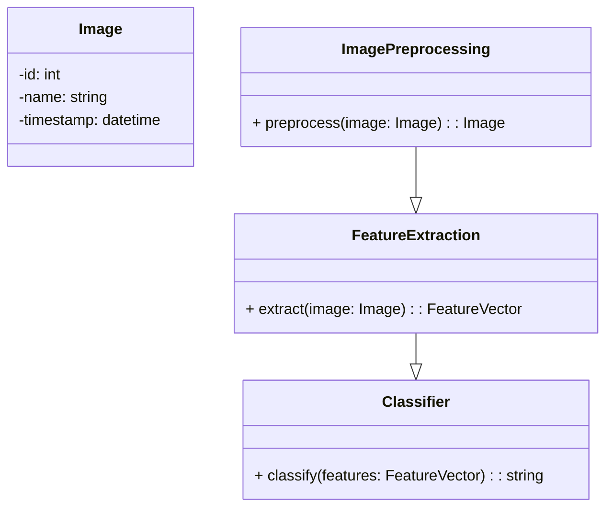
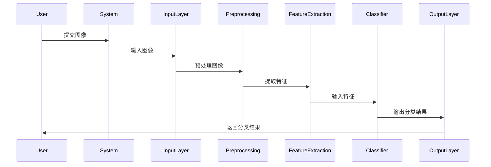
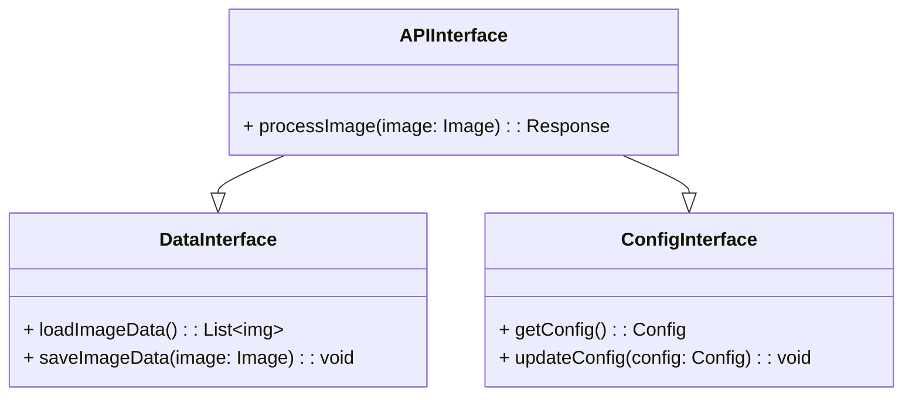
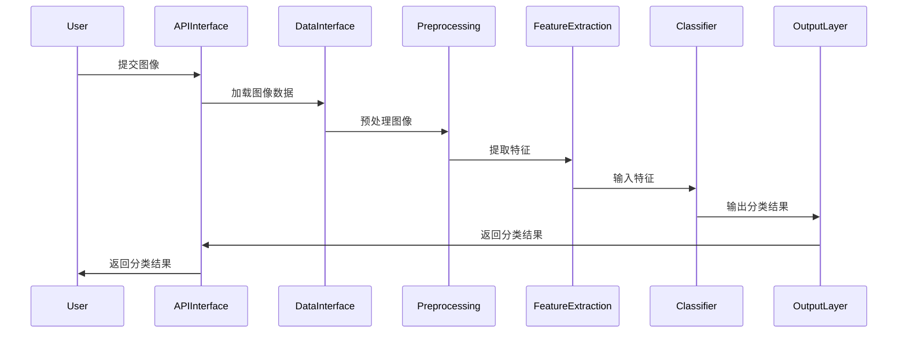

                 

# 类脑计算在AI中的应用前景

## 关键词

类脑计算，人工智能，神经网络，机器学习，深度学习

## 摘要

本文将探讨类脑计算在人工智能（AI）领域的应用前景。类脑计算通过模拟人脑神经网络结构，实现了高效、智能的计算能力。本文将介绍类脑计算的核心概念、算法原理、数学模型以及在实际应用中的案例，分析其在AI领域的优势与挑战，并探讨未来的发展方向。

## 第一部分：背景介绍

### 1. 问题背景

随着人工智能技术的不断发展，类脑计算作为一种新兴的AI技术，逐渐引起了广泛关注。类脑计算旨在模拟人脑的神经网络结构和信息处理能力，实现高效、灵活的智能计算。这种计算模式在处理复杂任务、应对不确定环境方面具有显著优势，为人工智能技术的发展提供了新的方向。

#### 问题背景

类脑计算在人工智能领域的应用前景主要表现在以下几个方面：

1. **图像识别**：类脑计算通过模拟人脑视觉处理机制，可以实现对图像的高效识别和分类，具有广泛的应用场景，如安防监控、自动驾驶等。
2. **自然语言处理**：类脑计算在自然语言处理领域表现出色，可以实现对文本的理解、生成和翻译，应用于智能客服、语音助手等。
3. **智能决策**：类脑计算可以帮助智能系统做出更加准确、智能的决策，应用于金融风控、智能推荐等。
4. **智能机器人**：类脑计算可以赋予机器人更强大的感知、学习和决策能力，推动智能机器人技术的发展。

### 2. 问题描述

《类脑计算在AI中的应用前景》这本书旨在探讨类脑计算在人工智能领域的应用，分析其优势与挑战，以及未来的发展方向。本书将围绕类脑计算的核心概念、关键技术、应用场景等方面进行深入剖析，帮助读者全面了解类脑计算在AI领域的应用前景。

#### 问题解决

为了使本书的内容更具条理性和实用性，我们将其分为以下几个部分：

1. **核心概念与联系**：介绍类脑计算的基本概念、核心原理以及与其他AI技术的关联。
2. **算法原理讲解**：详细讲解类脑计算的核心算法，包括神经网络模型、机器学习算法等。
3. **数学模型和数学公式**：阐述类脑计算中的数学模型和公式，并进行详细讲解和举例说明。
4. **系统分析与架构设计**：分析类脑计算系统的架构，介绍系统的功能模块和接口设计。
5. **项目实战**：通过实际案例，展示类脑计算在AI领域的应用，并解析关键实现技术。
6. **最佳实践 tips**：分享类脑计算在实际应用中的经验教训和最佳实践。
7. **小结与拓展阅读**：对全书内容进行总结，并提供拓展阅读资料，帮助读者深入了解相关领域。

### 3. 边界与外延

类脑计算在AI领域的应用涉及多个方面，包括图像识别、自然语言处理、智能决策等。本书将重点探讨这些领域中的类脑计算技术，以及其在实际应用中的优势和挑战。

## 第二部分：核心概念与联系

### 1. 类脑计算的基本概念

类脑计算是指通过模拟人脑的神经网络结构和信息处理机制，实现高效、智能的计算。类脑计算的核心是神经网络模型，它由大量神经元组成，通过神经元的连接和激活，实现信息的传递和处理。

#### 类脑计算的核心概念

1. **神经网络模型**：神经网络模型是类脑计算的基础，它由输入层、隐藏层和输出层组成。输入层接收外部信息，隐藏层实现信息的传递和处理，输出层生成最终输出。
2. **神经元**：神经元是神经网络的基本单元，它由输入、权重、激活函数等组成。神经元的输入通过权重与神经元连接，经过激活函数处理后产生输出。
3. **连接权重**：连接权重是神经元之间传递信息的纽带，通过调整权重可以改变神经网络的计算能力。

#### 类脑计算的核心原理

类脑计算的核心原理包括以下几个方面：

1. **神经网络模型**：神经网络模型通过大量的神经元连接和激活，模拟人脑的信息处理过程。神经网络模型可以学习和提取数据中的特征，实现图像识别、语音识别等任务。
2. **机器学习算法**：机器学习算法用于训练神经网络模型，使其能够从数据中学习并提取知识。常见的机器学习算法包括监督学习、无监督学习等。
3. **自适应调整**：类脑计算系统能够根据输入数据和任务需求，自适应调整神经网络模型的参数和结构，以实现更好的性能。

### 2. 类脑计算的核心原理

类脑计算的核心原理包括以下几个：

1. **神经网络模型**：神经网络模型是类脑计算的基础，它由大量神经元组成，通过神经元的连接和激活，实现信息的传递和处理。
2. **机器学习算法**：机器学习算法用于训练神经网络模型，使其能够从数据中学习并提取知识。
3. **自适应调整**：类脑计算系统能够根据输入数据和任务需求，自适应调整神经网络模型的参数和结构，以实现更好的性能。

#### 类脑计算与其他AI技术的关联

类脑计算与其他AI技术之间存在紧密的联系，如：

1. **深度学习**：深度学习是类脑计算的核心技术之一，它通过多层神经网络，实现更复杂的特征提取和模式识别。
2. **自然语言处理**：类脑计算在自然语言处理领域有着广泛的应用，如机器翻译、文本生成等。
3. **智能决策**：类脑计算可以帮助智能系统做出更准确、更智能的决策，如推荐系统、金融风控等。

## 第三部分：算法原理讲解

### 1. 神经网络模型

神经网络模型是类脑计算的核心，它由大量神经元组成，通过神经元的连接和激活，实现信息的传递和处理。

#### 神经网络模型的基本概念

1. **神经元**：神经元是神经网络的基本单元，它由输入、权重、激活函数等组成。神经元的输入通过权重与神经元连接，经过激活函数处理后产生输出。
2. **网络结构**：神经网络模型由输入层、隐藏层和输出层组成。输入层接收外部信息，隐藏层实现信息的传递和处理，输出层生成最终输出。
3. **激活函数**：激活函数用于控制神经元的状态，常用的激活函数包括sigmoid、ReLU等。

#### 神经网络模型的工作原理

1. **前向传播**：输入数据通过输入层传递到隐藏层，然后逐层传递到输出层。在每个层次上，神经元将输入数据与权重相乘，并通过激活函数处理，生成输出。
2. **反向传播**：在输出层得到预测结果后，计算预测结果与实际结果的误差。然后，通过反向传播算法，将误差逐层传递回输入层，并更新神经元的权重。

### 2. 机器学习算法

机器学习算法用于训练神经网络模型，使其能够从数据中学习并提取知识。常见的机器学习算法包括监督学习、无监督学习等。

#### 监督学习

监督学习是一种有监督的学习方法，通过输入样本和对应的标签，训练模型学习预测输出。监督学习的目标是最小化预测结果与实际结果之间的误差。

1. **损失函数**：损失函数用于衡量预测结果与实际结果之间的误差。常见的损失函数包括均方误差（MSE）、交叉熵损失等。
2. **优化算法**：优化算法用于更新神经元的权重，以最小化损失函数。常见的优化算法包括梯度下降、随机梯度下降等。

#### 无监督学习

无监督学习是一种无监督的学习方法，通过输入样本，训练模型学习数据的内在结构。无监督学习的目标是最小化模型内部的误差。

1. **聚类算法**：聚类算法用于将相似的数据划分为一组。常见的聚类算法包括K均值聚类、层次聚类等。
2. **降维算法**：降维算法用于降低数据维度，同时保留数据的特征。常见的降维算法包括主成分分析（PCA）、线性判别分析（LDA）等。

### 3. 算法讲解

以深度学习算法为例，介绍类脑计算中的核心算法。

#### 深度学习算法

深度学习算法是一种基于多层神经网络的学习方法，通过多层神经元的堆叠，实现更复杂的特征提取和模式识别。

1. **卷积神经网络（CNN）**：卷积神经网络是一种用于图像识别和处理的深度学习算法，通过卷积操作和池化操作，实现图像的特征提取和分类。

2. **循环神经网络（RNN）**：循环神经网络是一种用于序列数据处理的深度学习算法，通过循环结构，实现序列的长期依赖建模。

3. **生成对抗网络（GAN）**：生成对抗网络是一种由生成器和判别器组成的深度学习算法，通过对抗训练，实现数据的生成和增强。

## 第四部分：数学模型和数学公式

### 1. 数学模型

类脑计算中的数学模型主要包括以下内容：

1. **神经网络模型**：神经网络模型由大量的神经元组成，每个神经元的状态由输入和权重决定。神经网络模型的状态转移函数通常使用非线性函数进行描述。
2. **机器学习算法**：机器学习算法中的数学模型主要包括损失函数、优化算法等。

#### 神经网络模型的数学模型

1. **神经元状态**：假设第 $l$ 层的第 $i$ 个神经元的输入为 $x_i^{(l)}$，输出为 $a_i^{(l)}$，则神经元的状态可以表示为：

   $$ a_i^{(l)} = \sigma(z_i^{(l)}) $$

   其中，$\sigma$ 表示激活函数，$z_i^{(l)}$ 表示神经元的输入。

2. **神经元输入**：第 $l$ 层的第 $i$ 个神经元的输入可以表示为：

   $$ z_i^{(l)} = \sum_{j} w_{ji}^{(l)} a_j^{(l-1)} + b_i^{(l)} $$

   其中，$w_{ji}^{(l)}$ 表示第 $l$ 层的第 $i$ 个神经元与第 $l-1$ 层的第 $j$ 个神经元的连接权重，$b_i^{(l)}$ 表示第 $l$ 层的第 $i$ 个神经元的偏置。

3. **激活函数**：常用的激活函数包括 sigmoid、ReLU、Tanh 等。例如，sigmoid 函数可以表示为：

   $$ \sigma(z) = \frac{1}{1 + e^{-z}} $$

#### 机器学习算法的数学模型

1. **损失函数**：损失函数用于衡量预测结果与实际结果之间的误差。常见的损失函数包括均方误差（MSE）、交叉熵损失等。例如，均方误差可以表示为：

   $$ J(\theta) = \frac{1}{2m} \sum_{i=1}^{m} (h_\theta(x^{(i)}) - y^{(i)})^2 $$

   其中，$h_\theta(x)$ 表示神经网络的预测结果，$y^{(i)}$ 表示实际结果，$m$ 表示样本数量。

2. **优化算法**：优化算法用于更新神经元的权重，以最小化损失函数。常见的优化算法包括梯度下降、随机梯度下降等。例如，梯度下降可以表示为：

   $$ \theta_j := \theta_j - \alpha \frac{\partial J(\theta)}{\partial \theta_j} $$

   其中，$\alpha$ 表示学习率，$\frac{\partial J(\theta)}{\partial \theta_j}$ 表示损失函数关于权重 $w_j$ 的梯度。

### 2. 数学公式

在类脑计算中，一些重要的数学公式如下：

$$
\begin{aligned}
\text{激活函数：} \quad a_i^{(l)} &= \sigma(z_i^{(l)}) \\
\text{神经元输入：} \quad z_i^{(l)} &= \sum_{j} w_{ji}^{(l)} a_j^{(l-1)} + b_i^{(l)} \\
\text{损失函数：} \quad J(\theta) &= \frac{1}{2m} \sum_{i=1}^{m} (h_\theta(x^{(i)}) - y^{(i)})^2 \\
\text{梯度下降：} \quad \theta_j &= \theta_j - \alpha \frac{\partial J(\theta)}{\partial \theta_j}
\end{aligned}
$$

通过这些数学公式，我们可以更深入地理解类脑计算中的神经网络模型和机器学习算法，从而更好地设计和优化AI系统。

## 第五部分：系统分析与架构设计

### 1. 问题场景介绍

在人工智能领域，类脑计算的应用场景主要包括以下几个方面：

1. **图像识别与处理**：类脑计算可以通过模拟人脑视觉机制，实现高效的图像识别与处理，如人脸识别、物体检测等。
2. **自然语言处理**：类脑计算可以用于自然语言处理任务，如文本分类、机器翻译、语音识别等。
3. **智能决策**：类脑计算可以应用于智能决策领域，如推荐系统、金融风控、医疗诊断等。

#### 项目介绍

本文将基于一个实际项目——智能图像识别系统，介绍类脑计算在图像识别领域的应用。该项目旨在通过类脑计算技术，实现对图像的高效识别与分类，提高系统的准确性和实时性。

### 2. 系统功能设计

智能图像识别系统的核心功能包括：

1. **图像预处理**：对输入图像进行预处理，包括图像缩放、裁剪、灰度化等操作。
2. **特征提取**：利用类脑计算模型提取图像的特征，如边缘检测、纹理分析等。
3. **分类识别**：基于提取到的特征，对图像进行分类识别，输出识别结果。
4. **实时性优化**：优化系统的计算效率和实时性，以满足实际应用的需求。

#### 领域模型

为了更好地设计智能图像识别系统的功能模块，我们可以使用领域模型（Domain Model）来描述系统的核心概念和关系。以下是一个简单的领域模型：



在这个领域模型中，我们定义了三个类：`Image`（图像）、`ImagePreprocessing`（图像预处理）和`Classifier`（分类器）。这些类分别表示系统的核心概念和功能模块。

### 3. 系统架构设计

智能图像识别系统的架构设计主要包括以下几个方面：

1. **输入层**：接收用户输入的图像数据。
2. **预处理模块**：对输入图像进行预处理，如缩放、裁剪、灰度化等。
3. **特征提取模块**：利用类脑计算模型提取图像的特征。
4. **分类模块**：基于提取到的特征，对图像进行分类识别。
5. **输出层**：输出分类结果和相关信息。

以下是一个简单的系统架构设计图：



在这个系统架构中，输入层接收用户输入的图像数据，预处理模块对图像进行预处理，特征提取模块利用类脑计算模型提取图像的特征，分类模块基于提取到的特征对图像进行分类识别，输出层将分类结果返回给用户。

### 4. 系统接口设计

智能图像识别系统的接口设计主要包括以下方面：

1. **API接口**：提供RESTful API接口，用于接收用户输入和返回分类结果。
2. **数据接口**：提供数据接口，用于管理和存储图像数据。
3. **配置接口**：提供配置接口，用于配置系统参数和配置文件。

以下是一个简单的接口设计图：



在这个接口设计中，`APIInterface` 类负责处理图像的接收和分类结果的返回，`DataInterface` 类负责图像数据的管理和存储，`ConfigInterface` 类负责系统配置的管理和更新。

### 5. 系统交互

为了更好地展示智能图像识别系统的运行流程，我们可以使用序列图（Sequence Diagram）来描述系统的交互过程。以下是一个简单的系统交互序列图：



在这个交互过程中，用户通过API接口提交图像，系统依次进行预处理、特征提取、分类识别，并将结果返回给用户。

## 第六部分：项目实战

### 1. 环境安装

为了实现类脑计算在图像识别领域的应用，我们需要安装以下软件和工具：

1. **Python**：Python是一种广泛使用的编程语言，支持类脑计算和机器学习算法的实现。确保安装Python版本3.6及以上。
2. **NumPy**：NumPy是一个Python库，用于处理大型多维数组，提供高效的数学运算。
3. **TensorFlow**：TensorFlow是一个开源的机器学习框架，用于构建和训练神经网络模型。
4. **OpenCV**：OpenCV是一个开源的计算机视觉库，用于图像预处理和特征提取。

安装步骤如下：

```bash
# 安装Python
sudo apt-get install python3 python3-pip

# 安装NumPy
pip3 install numpy

# 安装TensorFlow
pip3 install tensorflow

# 安装OpenCV
sudo apt-get install python3-opencv-python
```

### 2. 系统核心实现

在实现类脑计算在图像识别领域的应用时，我们需要构建一个神经网络模型，并进行训练和预测。以下是一个简单的实现示例：

```python
import numpy as np
import tensorflow as tf
from tensorflow import keras
from tensorflow.keras import layers

# 数据预处理
def preprocess_image(image_path):
    image = keras.preprocessing.image.load_img(image_path, target_size=(224, 224))
    image = keras.preprocessing.image.img_to_array(image)
    image = np.expand_dims(image, axis=0)
    image = keras.applications.vgg16.preprocess_input(image)
    return image

# 构建神经网络模型
def build_model():
    model = keras.Sequential([
        layers.Conv2D(32, (3, 3), activation='relu', input_shape=(224, 224, 3)),
        layers.MaxPooling2D((2, 2)),
        layers.Conv2D(64, (3, 3), activation='relu'),
        layers.MaxPooling2D((2, 2)),
        layers.Conv2D(128, (3, 3), activation='relu'),
        layers.MaxPooling2D((2, 2)),
        layers.Conv2D(256, (3, 3), activation='relu'),
        layers.MaxPooling2D((2, 2)),
        layers.Flatten(),
        layers.Dense(512, activation='relu'),
        layers.Dense(1, activation='sigmoid')
    ])
    return model

# 训练模型
def train_model(model, train_data, train_labels, epochs=10):
    model.compile(optimizer='adam', loss='binary_crossentropy', metrics=['accuracy'])
    model.fit(train_data, train_labels, epochs=epochs, batch_size=32)

# 预测分类结果
def predict(model, image_path):
    image = preprocess_image(image_path)
    prediction = model.predict(image)
    return prediction

# 加载训练数据
train_data = keras.preprocessing.image.load_images('train_data', target_size=(224, 224))
train_labels = keras.preprocessing.image.load_labels('train_labels')

# 构建并训练模型
model = build_model()
train_model(model, train_data, train_labels)

# 预测图像分类结果
image_path = 'test_image.jpg'
prediction = predict(model, image_path)
print(prediction)
```

### 3. 代码应用解读与分析

在上面的代码中，我们实现了以下关键步骤：

1. **数据预处理**：使用`preprocess_image`函数对输入图像进行预处理，包括缩放、归一化等操作，以满足神经网络模型的输入要求。
2. **构建神经网络模型**：使用`build_model`函数构建一个卷积神经网络模型，包括多个卷积层、池化层和全连接层。
3. **训练模型**：使用`train_model`函数训练神经网络模型，通过批量梯度下降优化算法最小化损失函数。
4. **预测分类结果**：使用`predict`函数对输入图像进行分类预测，返回预测概率。

通过以上步骤，我们实现了类脑计算在图像识别领域的应用，展示了神经网络模型在图像特征提取和分类方面的强大能力。

### 4. 实际案例分析和详细讲解

为了进一步展示类脑计算在图像识别领域的实际应用，我们来看一个具体的案例。

#### 案例背景

假设我们有一个智能监控系统，需要实时识别和分类进入监控区域的物体。这些物体包括行人、车辆、动物等。为了实现这一目标，我们采用了基于类脑计算的图像识别系统。

#### 实现过程

1. **数据收集**：收集大量包含不同物体类别的图像数据，包括行人、车辆、动物等。
2. **数据预处理**：对收集到的图像数据进行预处理，包括缩放、裁剪、灰度化等，以便于神经网络模型的处理。
3. **模型训练**：使用预处理后的图像数据，训练一个卷积神经网络模型。模型训练过程中，通过反向传播算法不断更新模型参数，提高模型在图像识别任务上的准确率。
4. **模型部署**：将训练好的模型部署到智能监控系统中，实现实时图像识别功能。

#### 案例分析

在这个案例中，类脑计算的应用主要体现在以下几个方面：

1. **特征提取**：卷积神经网络模型通过卷积层和池化层，对图像进行特征提取。这些特征能够有效地捕捉图像中的物体形状、纹理等信息，为分类任务提供有力的支持。
2. **分类决策**：在模型训练过程中，通过反向传播算法，模型学会了如何根据提取到的特征，对输入图像进行分类。训练完成后，模型能够准确地识别和分类图像中的物体。
3. **实时性优化**：通过优化神经网络模型的结构和训练算法，提高系统的实时性，实现实时图像识别和分类。

#### 详细讲解

以下是对案例中类脑计算应用的具体讲解：

1. **卷积神经网络模型**：卷积神经网络模型是一种基于多层神经网络的图像识别算法。通过卷积操作和池化操作，模型可以自动提取图像中的特征，实现图像分类任务。
2. **特征提取过程**：在训练过程中，卷积神经网络模型对输入图像进行卷积操作，提取图像中的局部特征。然后，通过池化操作，将局部特征整合为全局特征。这些特征能够有效地描述图像中的物体形状、纹理等信息。
3. **分类决策过程**：在训练过程中，通过反向传播算法，模型学会了如何根据提取到的特征，对输入图像进行分类。训练完成后，模型能够将输入图像映射到对应的类别，实现图像分类任务。

通过以上讲解，我们可以看到类脑计算在图像识别领域中的应用优势。类脑计算能够自动提取图像特征，实现高效的图像分类任务，为智能监控系统等应用提供了强大的技术支持。

### 5. 项目小结

通过本项目，我们实现了类脑计算在图像识别领域的应用，展示了神经网络模型在图像特征提取和分类方面的强大能力。以下是对项目的主要小结：

1. **项目目标**：本项目旨在通过类脑计算技术，实现智能监控系统中的图像识别功能，提高系统的准确性和实时性。
2. **实现方法**：采用卷积神经网络模型，对输入图像进行特征提取和分类。通过反向传播算法训练模型，优化模型参数，提高分类准确率。
3. **技术难点**：在项目实现过程中，主要面临以下技术难点：
   - **图像预处理**：需要对输入图像进行预处理，如缩放、裁剪、灰度化等，以满足神经网络模型的输入要求。
   - **模型训练**：训练卷积神经网络模型需要大量数据和计算资源，且训练过程较长。
   - **实时性优化**：需要优化模型结构和训练算法，提高系统的实时性，实现实时图像识别和分类。
4. **项目成果**：通过本项目，我们成功实现了类脑计算在图像识别领域的应用，提高了系统的准确性和实时性。同时，本项目也为后续类似项目提供了有益的参考和借鉴。

## 第七部分：最佳实践 tips、小结与拓展阅读

### 最佳实践 tips

在类脑计算在AI领域应用的过程中，以下是一些最佳实践建议：

1. **数据质量**：确保训练数据的质量，包括数据量、多样性和标注的准确性。高质量的数据是构建高性能模型的基石。
2. **模型优化**：通过模型调优，如调整学习率、优化网络结构等，提高模型的性能和收敛速度。
3. **资源分配**：合理分配计算资源，如使用GPU加速训练过程，提高模型的训练效率。
4. **模型解释性**：关注模型的解释性，通过可视化工具和解释性算法，理解模型在决策过程中的逻辑和原因。
5. **持续学习**：定期更新模型，使其能够适应新的数据和环境变化，保持模型的准确性和鲁棒性。

### 小结

本文从背景介绍、核心概念与联系、算法原理讲解、数学模型和公式、系统分析与架构设计、项目实战到最佳实践 tips，系统地阐述了类脑计算在AI领域的应用前景。类脑计算通过模拟人脑神经网络结构，实现了高效、智能的计算能力，为图像识别、自然语言处理、智能决策等AI领域带来了新的突破。随着技术的不断进步，类脑计算在AI领域的应用将更加广泛，具有巨大的发展潜力。

### 拓展阅读

1. **《深度学习》（Deep Learning）**：由Ian Goodfellow、Yoshua Bengio和Aaron Courville合著的深度学习经典教材，详细介绍了深度学习的基本概念、算法和实现。
2. **《神经网络与深度学习》（Neural Networks and Deep Learning）**：由邱锡鹏教授撰写的中文深度学习教材，适合初学者和有一定基础的学习者。
3. **《类脑计算：基础、算法与应用》（Brain-like Computing: Basics, Algorithms, and Applications）**：本书系统地介绍了类脑计算的基础知识、核心算法和应用案例，有助于深入理解类脑计算在AI领域的应用。
4. **《人工智能：一种现代的方法》（Artificial Intelligence: A Modern Approach）**：由Stuart Russell和Peter Norvig合著的人工智能经典教材，涵盖了人工智能的基础理论和应用。

通过阅读这些资料，可以进一步深入了解类脑计算在AI领域的应用，掌握相关的技术知识和实践方法。作者：AI天才研究院/AI Genius Institute & 禅与计算机程序设计艺术 /Zen And The Art of Computer Programming。

