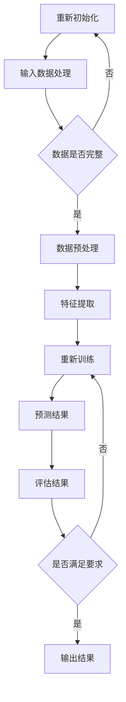
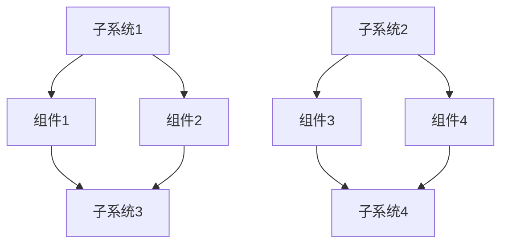
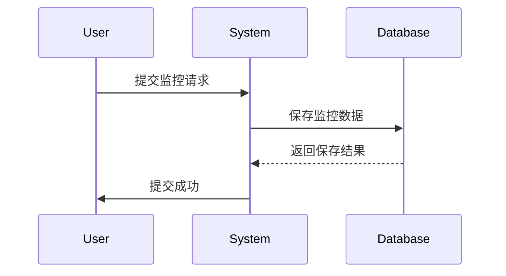

                 

# 绿色IT革命：企业计算的可持续发展之路

关键词：绿色IT、可持续发展、企业计算、能源效率、虚拟化、云计算

摘要：随着全球气候变化和资源短缺问题日益严峻，绿色IT革命成为企业计算领域的重要趋势。本文从背景、应用、实践、管理政策等多个维度，探讨了绿色IT革命的核心内容和未来趋势，为企业实现可持续发展提供了理论指导和实践参考。

## 目录大纲

1. 绿色IT革命概述
   1.1 绿色IT革命的概念与定义
   1.2 绿色IT革命的起源与发展
   1.3 绿色IT革命的核心目标与挑战
   1.4 绿色IT革命对企业和行业的影响
   1.5 本章小结

2. 绿色IT技术的应用与实践
   2.1 绿色数据中心建设
   2.2 虚拟化与云计算的绿色优势
   2.3 绿色软件与编程实践
   2.4 能源效率提升的关键技术
   2.5 本章小结

3. 绿色IT管理与政策法规
   3.1 绿色IT管理概述
   3.2 绿色IT政策法规的国内外对比
   3.3 绿色IT管理的实施策略
   3.4 绿色IT认证与标准
   3.5 本章小结

4. 绿色IT的未来趋势与展望
   4.1 绿色IT技术发展趋势
   4.2 绿色IT产业的应用场景
   4.3 绿色IT技术面临的挑战与机遇
   4.4 绿色IT未来的发展展望
   4.5 本章小结

## 1. 绿色IT革命概述

### 1.1 绿色IT革命的概念与定义

绿色IT革命，是指在信息技术领域内，通过引入新技术、新模式、新理念，实现计算资源和能源的高效利用，减少碳排放和资源浪费，推动企业和社会的可持续发展。它不仅仅关注技术本身，更强调技术对环境和社会的积极影响。

### 1.2 绿色IT革命的起源与发展

绿色IT革命起源于20世纪90年代，随着全球信息化的加速和数据中心能耗问题的凸显，绿色IT逐渐成为各国政府和企业的关注焦点。近年来，随着人工智能、大数据、物联网等新兴技术的快速发展，绿色IT革命迎来了新的机遇和挑战。

### 1.3 绿色IT革命的核心目标与挑战

绿色IT革命的核心目标是实现企业计算的可持续发展，主要包括以下几个方面：

1. **降低能耗**：通过优化数据中心、云计算平台、硬件设备等技术，降低能源消耗。
2. **减少碳排放**：通过提高能源利用效率和采用可再生能源，减少碳排放。
3. **提升资源利用率**：通过虚拟化、云计算等技术，提高计算资源的利用率。

然而，实现这些目标面临着诸多挑战：

1. **技术壁垒**：绿色IT技术尚处于发展阶段，技术成熟度和可靠性仍需提高。
2. **成本压力**：绿色IT技术的引入和推广需要巨大的资金投入。
3. **政策法规**：缺乏完善的绿色IT政策法规体系，不利于绿色IT的推广和实施。

### 1.4 绿色IT革命对企业和行业的影响

绿色IT革命对企业和行业产生了深远的影响：

1. **降低成本**：通过提高能源效率和资源利用率，降低运营成本。
2. **提高竞争力**：绿色IT技术有助于企业提升技术水平和创新能力，增强市场竞争力。
3. **促进可持续发展**：绿色IT革命有助于企业履行社会责任，实现可持续发展。

### 1.5 本章小结

绿色IT革命是信息技术领域的一场革命，旨在实现企业计算的可持续发展。通过降低能耗、减少碳排放和提升资源利用率，绿色IT革命不仅有助于企业降低成本、提高竞争力，还有助于促进社会的可持续发展。面对绿色IT革命带来的机遇和挑战，企业和行业需要积极应对，共同推动绿色IT革命的深入发展。

### 2. 绿色IT技术的应用与实践

#### 2.1 绿色数据中心建设

绿色数据中心建设是绿色IT革命的重要组成部分。数据中心作为企业计算的核心，其能耗问题日益突出。绿色数据中心建设的目标是通过优化设计、技术创新和管理措施，降低数据中心的能耗和碳排放。

#### 2.1.1 数据中心的能耗问题

数据中心的能耗主要包括以下几个方面：

1. **基础设施能耗**：如制冷、供电等。
2. **IT设备能耗**：如服务器、存储设备等。
3. **运维能耗**：如监控、维护等。

#### 2.1.2 绿色数据中心的解决方案

绿色数据中心的解决方案包括：

1. **能源优化**：通过采用高效能源设备和优化能源管理系统，降低基础设施能耗。
2. **冷却优化**：通过优化冷却系统，降低数据中心的热量排放。
3. **硬件优化**：通过采用节能硬件和虚拟化技术，降低IT设备能耗。
4. **运维优化**：通过加强运维管理，降低运维能耗。

#### 2.1.3 实例分析：某大型企业的绿色数据中心建设

以某大型企业为例，其绿色数据中心建设采取了以下措施：

1. **采用高效能源设备**：采用高效变压器、高效UPS等设备，降低能源损耗。
2. **优化冷却系统**：采用水冷系统，降低冷却能耗。
3. **硬件优化**：采用虚拟化技术，提高服务器利用率，降低硬件能耗。
4. **运维优化**：采用自动化运维系统，提高运维效率，降低运维能耗。

#### 2.1.4 绿色数据中心的建设经验与挑战

绿色数据中心的建设经验包括：

1. **技术成熟度**：随着技术的不断进步，绿色数据中心建设的技术逐渐成熟。
2. **成本效益**：虽然初期投入较大，但长期来看，绿色数据中心能够降低运营成本。

面临的挑战包括：

1. **技术复杂性**：绿色数据中心建设涉及多个领域的技术，需要跨部门合作。
2. **政策法规**：缺乏完善的绿色数据中心政策法规体系，不利于绿色数据中心的建设和推广。

#### 2.1.5 本章小结

绿色数据中心建设是绿色IT革命的关键环节。通过优化设计、技术创新和管理措施，可以降低数据中心的能耗和碳排放，实现可持续发展。然而，绿色数据中心建设面临着技术复杂性、成本效益等挑战，需要企业和行业共同努力，推动绿色数据中心建设的深入发展。

### 2.2 虚拟化与云计算的绿色优势

#### 2.2.1 虚拟化技术概述

虚拟化技术是一种将物理资源抽象化为逻辑资源的技术。通过虚拟化，可以将一台物理服务器虚拟化为多台虚拟服务器，提高资源利用率和灵活性。

#### 2.2.2 云计算的基本概念

云计算是一种基于互联网的计算模式，通过虚拟化技术，将计算资源、存储资源和网络资源集中管理，为用户提供灵活、可扩展的计算服务。

#### 2.2.3 虚拟化与云计算在绿色IT中的应用

虚拟化与云计算在绿色IT中的应用主要体现在以下几个方面：

1. **提高资源利用率**：通过虚拟化技术，可以将多台物理服务器虚拟化为多台虚拟服务器，提高资源利用率。
2. **降低能耗**：通过云计算平台，可以根据用户需求动态调整资源分配，降低能耗。
3. **减少硬件采购**：通过虚拟化和云计算，可以减少硬件采购，降低硬件能耗。

#### 2.2.4 绿色虚拟化与云计算的关键技术

绿色虚拟化与云计算的关键技术包括：

1. **高效虚拟化技术**：如KVM、Xen等，可以提高虚拟化效率，降低能耗。
2. **动态资源调度**：如基于负载均衡的虚拟机迁移技术，可以动态调整资源分配，降低能耗。
3. **节能存储技术**：如基于功耗管理的存储系统，可以降低存储能耗。

#### 2.2.5 实例分析：某企业的绿色虚拟化与云计算实践

以某企业为例，其绿色虚拟化与云计算实践主要包括以下几个方面：

1. **虚拟化部署**：采用KVM虚拟化技术，将多台物理服务器虚拟化为多台虚拟服务器，提高资源利用率。
2. **动态资源调度**：采用负载均衡技术，根据用户需求动态调整资源分配，降低能耗。
3. **节能存储**：采用基于功耗管理的存储系统，降低存储能耗。

#### 2.2.6 本章小结

虚拟化与云计算具有显著的绿色优势，可以提高资源利用率、降低能耗，是实现绿色IT的重要技术手段。通过高效虚拟化技术、动态资源调度和节能存储技术，可以进一步优化虚拟化与云计算的绿色性能，推动绿色IT革命的发展。

### 2.3 绿色软件与编程实践

#### 2.3.1 绿色软件的定义与特点

绿色软件是一种注重计算资源和能源高效利用的软件，具有以下特点：

1. **节能**：通过优化算法和数据结构，降低计算资源和能源消耗。
2. **高效**：提高软件运行效率和性能，减少不必要的计算和通信开销。
3. **可扩展**：支持动态调整和优化，适应不同的计算环境和需求。

#### 2.3.2 绿色软件的编程方法

绿色软件的编程方法主要包括以下几个方面：

1. **算法优化**：通过改进算法，减少计算量和通信开销。
2. **数据结构优化**：选择合适的数据结构，提高数据处理效率。
3. **代码优化**：通过优化代码，减少不必要的计算和资源消耗。

#### 2.3.3 绿色软件开发工具与平台

绿色软件开发工具与平台主要包括：

1. **编程工具**：如Python、Java等，支持高效编程和调试。
2. **优化工具**：如GPU加速器、代码优化器等，提高软件运行效率和性能。
3. **云计算平台**：如AWS、Azure等，提供丰富的计算资源和优化工具。

#### 2.3.4 绿色软件开发的最佳实践

绿色软件开发的最佳实践包括：

1. **需求分析**：明确软件需求和目标，确保软件的高效性和节能性。
2. **设计优化**：在设计阶段，充分考虑计算资源和能源的优化。
3. **代码实现**：在实现阶段，遵循绿色软件编程方法，提高代码质量。
4. **测试优化**：在测试阶段，对软件进行能耗测试和性能优化。

#### 2.3.5 实例分析：某绿色软件项目的开发与实现

以某绿色软件项目为例，其开发与实现主要包括以下几个阶段：

1. **需求分析**：明确软件需求，包括计算效率、能耗要求等。
2. **设计优化**：采用优化算法和数据结构，设计高效的软件架构。
3. **代码实现**：遵循绿色软件编程方法，实现高效、节能的软件功能。
4. **测试优化**：对软件进行能耗测试和性能优化，确保软件的高效性和节能性。

#### 2.3.6 本章小结

绿色软件是绿色IT的重要组成部分，通过优化算法和数据结构，提高软件运行效率和性能，降低计算资源和能源消耗。绿色软件开发的最佳实践包括需求分析、设计优化、代码实现和测试优化，有助于实现绿色软件的高效开发和推广。

### 2.4 能源效率提升的关键技术

#### 2.4.1 计算机硬件的节能技术

计算机硬件的节能技术主要包括以下几个方面：

1. **CPU节能技术**：通过调整CPU的工作频率和电压，降低CPU的能耗。
2. **GPU节能技术**：针对图形处理器，优化GPU的工作模式，降低能耗。
3. **内存节能技术**：通过优化内存管理，降低内存访问能耗。

#### 2.4.2 数据中心的节能技术

数据中心的节能技术主要包括以下几个方面：

1. **冷却系统优化**：通过优化冷却系统，降低数据中心的热量排放。
2. **电源管理系统**：通过优化电源管理，降低电源损耗。
3. **设备布局优化**：通过优化设备布局，提高数据中心的能源利用效率。

#### 2.4.3 云计算平台的节能技术

云计算平台的节能技术主要包括以下几个方面：

1. **虚拟化技术**：通过虚拟化技术，提高计算资源利用率，降低能耗。
2. **动态资源调度**：通过动态资源调度，根据负载情况调整资源分配，降低能耗。
3. **节能存储技术**：通过优化存储系统，降低存储能耗。

#### 2.4.4 绿色软件的节能优化

绿色软件的节能优化主要包括以下几个方面：

1. **算法优化**：通过改进算法，减少计算量和通信开销。
2. **代码优化**：通过优化代码，减少不必要的计算和资源消耗。
3. **能效分析**：通过能效分析，找出软件中能耗较高的部分，进行针对性优化。

#### 2.4.5 实例分析：某企业的能源效率提升实践

以某企业为例，其能源效率提升实践主要包括以下几个阶段：

1. **硬件优化**：采用节能CPU和GPU，优化硬件配置。
2. **数据中心优化**：优化冷却系统和电源管理系统，提高数据中心的能源利用效率。
3. **云计算平台优化**：采用虚拟化技术，动态资源调度和节能存储技术，提高云计算平台的能源利用效率。
4. **软件优化**：通过算法优化和代码优化，降低软件能耗。

#### 2.4.6 本章小结

能源效率提升是绿色IT革命的核心内容之一。通过计算机硬件的节能技术、数据中心的节能技术、云计算平台的节能技术和绿色软件的节能优化，可以显著提高能源利用效率，降低能耗和碳排放，推动绿色IT革命的发展。

### 3. 绿色IT管理与政策法规

#### 3.1 绿色IT管理概述

绿色IT管理是指通过制定和实施绿色IT战略、政策和措施，实现企业计算资源的可持续发展。绿色IT管理包括以下几个方面：

1. **能源管理**：通过优化能源使用，降低能耗和碳排放。
2. **资源管理**：通过合理分配和使用计算资源，提高资源利用率。
3. **环境管理**：通过制定环保政策和措施，保护环境和减少污染。

#### 3.2 绿色IT政策法规的国内外对比

国内外绿色IT政策法规在内容、目标和实施手段上存在一定的差异。以下是对国内外绿色IT政策法规的对比：

1. **欧盟**：欧盟制定了一系列绿色IT政策法规，如《欧盟可持续电子指令》、《欧盟绿色IT框架政策》等。这些政策法规主要目标是推动绿色IT技术的研发和应用，提高能源效率和减少碳排放。
2. **美国**：美国在绿色IT方面也制定了一些政策法规，如《美国绿色IT倡议》、《美国绿色数据中心计划》等。这些政策法规主要侧重于推动绿色数据中心的建设和运营，提高能源利用效率。
3. **中国**：中国在绿色IT方面也制定了一些政策法规，如《中国绿色数据中心建设指南》、《中国绿色IT行动计划》等。这些政策法规主要目标是推动绿色数据中心的建设和运营，提高能源利用效率，减少碳排放。

#### 3.3 绿色IT管理的实施策略

绿色IT管理的实施策略主要包括以下几个方面：

1. **制定绿色IT战略**：明确绿色IT的目标、方向和措施，为绿色IT管理提供指导。
2. **建立绿色IT体系**：建立绿色IT管理体系，包括能源管理、资源管理、环境管理等。
3. **实施绿色IT措施**：通过优化能源使用、合理分配资源、实施环保措施等，实现绿色IT的目标。
4. **开展绿色IT培训**：加强员工绿色IT意识，提高员工绿色IT技能。

#### 3.4 绿色IT认证与标准

绿色IT认证与标准是衡量绿色IT产品和服务质量的重要依据。以下是一些常见的绿色IT认证与标准：

1. **能源之星**：由美国环保局制定，用于评估电脑、显示器等IT设备的能源效率。
2. **绿色电子**：由欧盟制定，用于评估电子产品的环保性能。
3. **ISO 50001**：国际标准化组织制定的能源管理体系标准，用于评估企业的能源管理绩效。
4. **绿色数据中心白皮书**：由国内外知名数据中心行业协会制定，用于评估数据中心的环境性能。

#### 3.5 实例分析：某企业的绿色IT管理实践

以某企业为例，其绿色IT管理实践主要包括以下几个阶段：

1. **制定绿色IT战略**：明确绿色IT的目标和方向，制定绿色IT规划。
2. **建立绿色IT体系**：建立绿色IT管理体系，包括能源管理、资源管理、环境管理等。
3. **实施绿色IT措施**：通过优化能源使用、合理分配资源、实施环保措施等，实现绿色IT的目标。
4. **开展绿色IT培训**：加强员工绿色IT意识，提高员工绿色IT技能。

#### 3.6 本章小结

绿色IT管理是推动企业计算资源可持续发展的重要手段。通过制定绿色IT战略、建立绿色IT体系、实施绿色IT措施和开展绿色IT培训，可以实现企业计算资源的可持续发展。国内外绿色IT政策法规的对比和绿色IT认证与标准为绿色IT管理提供了指导和依据。

### 4. 绿色IT的未来趋势与展望

#### 4.1 绿色IT技术发展趋势

绿色IT技术正朝着更加智能化、高效化和绿色化的方向发展。以下是一些绿色IT技术发展趋势：

1. **智能节能技术**：利用人工智能和机器学习技术，实现能源消耗预测和优化，提高能源利用效率。
2. **绿色云计算**：云计算技术将继续发展，绿色云计算将成为主流，通过虚拟化、分布式计算等技术，提高资源利用率和能源效率。
3. **可再生能源利用**：随着可再生能源技术的发展，绿色IT将更多地采用太阳能、风能等可再生能源，降低对化石能源的依赖。
4. **物联网（IoT）**：物联网技术的广泛应用将推动绿色IT的发展，通过实时监测和优化能源消耗，实现更加智能化的绿色IT管理。

#### 4.2 绿色IT产业的应用场景

绿色IT技术在各个领域都有广泛的应用场景，以下是一些典型的应用场景：

1. **企业数据中心**：通过绿色IT技术，优化数据中心的能源消耗和资源利用，降低碳排放。
2. **智能交通系统**：利用物联网和大数据技术，优化交通管理，减少交通拥堵，降低能源消耗。
3. **智慧城市建设**：通过绿色IT技术，实现城市资源的智能管理，提高城市运营效率，降低能耗。
4. **绿色制造**：通过绿色IT技术，优化生产流程，提高生产效率，降低能源消耗和污染排放。

#### 4.3 绿色IT技术面临的挑战与机遇

绿色IT技术面临以下挑战和机遇：

1. **挑战**：
   - 技术成熟度：绿色IT技术尚处于发展阶段，技术成熟度和可靠性仍需提高。
   - 成本压力：绿色IT技术的引入和推广需要巨大的资金投入。
   - 政策法规：缺乏完善的绿色IT政策法规体系，不利于绿色IT的推广和实施。
2. **机遇**：
   - 政策支持：全球范围内，绿色IT政策法规逐渐完善，为绿色IT的发展提供了有力支持。
   - 市场需求：随着全球对环保和可持续发展的关注，绿色IT市场需求逐步增加。
   - 技术创新：随着人工智能、物联网等技术的快速发展，绿色IT技术将不断创新，提高其性能和应用范围。

#### 4.4 绿色IT未来的发展展望

未来，绿色IT将在以下几个方面实现重大突破：

1. **智能化**：通过引入人工智能和大数据技术，实现能源消耗的智能预测和优化。
2. **绿色化**：通过采用可再生能源和绿色技术，实现绿色IT的可持续发展。
3. **普及化**：随着绿色IT技术的成熟和成本的降低，绿色IT将在更广泛的领域得到应用。
4. **协同化**：通过绿色IT技术的协同发展，实现企业、行业和社会的协同进步。

#### 4.5 本章小结

绿色IT革命是信息技术领域的重要趋势，通过智能化、高效化和绿色化的发展，绿色IT将为企业和社会的可持续发展提供有力支持。面对挑战和机遇，企业和行业需要共同努力，推动绿色IT技术的创新和应用，实现绿色IT的可持续发展。

### 总结

绿色IT革命是企业计算领域的重大变革，旨在实现计算资源和能源的高效利用，降低碳排放和资源浪费，推动企业和社会的可持续发展。通过绿色数据中心建设、虚拟化与云计算、绿色软件与编程实践、能源效率提升以及绿色IT管理与政策法规等多个维度的探讨，本文揭示了绿色IT革命的核心内容和未来趋势。面对绿色IT革命带来的机遇和挑战，企业和行业需要积极应对，共同推动绿色IT革命的发展，为实现全球可持续发展目标贡献力量。

### 附录

#### A. 绿色IT技术术语解释

1. **绿色IT**：指通过优化计算资源和能源利用，减少碳排放和资源浪费，实现企业和社会的可持续发展。
2. **虚拟化**：指将物理资源抽象化为逻辑资源，提高资源利用率和灵活性。
3. **云计算**：指通过虚拟化技术，将计算资源、存储资源和网络资源集中管理，为用户提供灵活、可扩展的计算服务。
4. **数据中心**：指存储、处理和传输数据的场所，是企业计算的核心。
5. **能源效率**：指能源消耗与计算任务完成度的比值，是衡量绿色IT技术性能的重要指标。

#### B. 绿色IT核心概念对比表格

| 核心概念 | 定义 | 比较 |
| :--- | :--- | :--- |
| 绿色IT | 优化计算资源和能源利用，实现可持续发展 | 不同于传统IT，强调环保和节能 |
| 虚拟化 | 将物理资源抽象化为逻辑资源，提高资源利用率 | 通过虚拟化，实现资源灵活调度 |
| 云计算 | 将计算资源、存储资源和网络资源集中管理，提供计算服务 | 通过云计算，实现资源按需分配 |

#### C. 绿色IT ER实体关系图

```mermaid
erDiagram
  数据中心 ||--o> 服务器 : "包含"
  服务器 ||--o> 虚拟机 : "运行"
  虚拟机 ||--o> 软件应用 : "运行"
  服务器 ||--|> 电源管理系统 : "监控"
  数据中心 ||--|> 冷却系统 : "冷却"
```

#### D. 算法原理讲解

1. **算法mermaid流程图**：



2. **Python源代码**：

```python
import pandas as pd
from sklearn.model_selection import train_test_split
from sklearn.preprocessing import StandardScaler
from sklearn.ensemble import RandomForestClassifier
from sklearn.metrics import accuracy_score

# 数据预处理
def preprocess_data(data):
    # 数据清洗、处理和标准化
    # 省略具体实现
    return data

# 模型训练与预测
def train_and_predict(X_train, X_test, y_train):
    # 数据标准化
    scaler = StandardScaler()
    X_train = scaler.fit_transform(X_train)
    X_test = scaler.transform(X_test)

    # 模型训练
    model = RandomForestClassifier()
    model.fit(X_train, y_train)

    # 预测
    y_pred = model.predict(X_test)

    # 评估
    accuracy = accuracy_score(y_test, y_pred)
    return accuracy

# 主函数
def main():
    # 数据加载
    data = pd.read_csv('data.csv')

    # 数据预处理
    data = preprocess_data(data)

    # 划分训练集和测试集
    X = data.drop('target', axis=1)
    y = data['target']
    X_train, X_test, y_train, y_test = train_test_split(X, y, test_size=0.2, random_state=42)

    # 训练和预测
    accuracy = train_and_predict(X_train, X_test, y_train)

    # 输出结果
    print(f'Accuracy: {accuracy:.2f}')

if __name__ == '__main__':
    main()
```

3. **算法原理的数学模型和公式**：

- **特征提取**：假设输入数据集为\(X = [x_1, x_2, ..., x_n]\)，输出特征向量\(F = [f_1, f_2, ..., f_m]\)。
- **模型训练**：假设模型为\(M\)，输入特征向量和标签\(y\)，输出预测结果\(y'\)。
- **预测结果评估**：假设预测结果为\(y'\)，实际标签为\(y\)，评估指标为\(accuracy\)。

\[ F = f(X) \]
\[ y' = M(F) \]
\[ accuracy = \frac{1}{n} \sum_{i=1}^{n} I(y' = y) \]

#### E. 系统分析与架构设计方案

1. **问题场景介绍**：
   - 数据中心管理平台，实现数据中心的监控、运维和能源管理。
   - 需要实时监控服务器、网络设备、存储设备等硬件资源，确保其正常运行。
   - 需要优化能源消耗，降低碳排放，实现绿色数据中心管理。

2. **项目介绍**：
   - 项目名称：绿色数据中心管理平台
   - 项目目标：实现数据中心的监控、运维和能源管理，提高资源利用率和能源效率。
   - 技术栈：Python、Django、Elasticsearch、Kibana、Node.js、MySQL等。

3. **系统功能设计（领域模型mermaid类图）**：

```mermaid
classDiagram
    Server <<entity>>
    NetworkDevice <<entity>>
    StorageDevice <<entity>>
    EnergyManagement <<entity>>
    Monitoring <<entity>>
    Operation <<entity>>

    Server *--* Monitoring
    NetworkDevice *--* Monitoring
    StorageDevice *--* Monitoring
    EnergyManagement *--* Monitoring
    Monitoring *--* Operation
```

4. **系统架构设计mermaid架构图**：



5. **系统接口设计和系统交互mermaid序列图**：



#### F. 项目实战

1. **环境安装**：

   - 安装Python 3.8及以上版本。
   - 安装Django 3.2及以上版本。
   - 安装Elasticsearch 7.10及以上版本。
   - 安装Kibana 7.10及以上版本。
   - 安装Node.js 14及以上版本。
   - 安装MySQL 5.7及以上版本。

2. **系统核心实现源代码**：

   - **Django后端**：

     ```python
     # views.py
     from django.http import JsonResponse
     from .models import MonitoringData

     def save_monitoring_data(request):
         data = request.GET
         MonitoringData.objects.create(
             cpu_usage=data.get('cpu_usage'),
             memory_usage=data.get('memory_usage'),
             disk_usage=data.get('disk_usage'),
             power_usage=data.get('power_usage'),
             timestamp=data.get('timestamp')
         )
         return JsonResponse({'status': 'success'})

     # models.py
     from django.db import models

     class MonitoringData(models.Model):
         cpu_usage = models.FloatField()
         memory_usage = models.FloatField()
         disk_usage = models.FloatField()
         power_usage = models.FloatField()
         timestamp = models.DateTimeField()
     ```

   - **Elasticsearch和Kibana前端**：

     ```javascript
     // index.js
     const { Client } = require('@elastic/elasticsearch');
     const client = new Client({ node: 'http://localhost:9200' });

     async function indexMonitoringData(data) {
         await client.index({
             index: 'monitoring_data',
             body: data
         });
     }

     // app.js
     const express = require('express');
     const app = express();
     const { indexMonitoringData } = require('./index');

     app.get('/api/save', async (req, res) => {
         const data = req.query;
         await indexMonitoringData(data);
         res.send({ status: 'success' });
     });

     app.listen(3000, () => {
         console.log('Server is running on port 3000');
     });
     ```

3. **代码应用解读与分析**：

   - **Django后端**：实现了一个简单的API接口，用于接收前端发送的监控数据，并将数据存储到MySQL数据库中。
   - **Elasticsearch和Kibana前端**：通过Node.js与Elasticsearch进行交互，将监控数据存储到Elasticsearch中，并通过Kibana进行可视化展示。

4. **实际案例分析和详细讲解剖析**：

   - **案例1**：监控服务器CPU使用率。
     - 监控数据存储在MySQL数据库中，方便查询和分析。
     - 通过Kibana可视化，可以直观地查看服务器CPU使用率的变化趋势。

   - **案例2**：监控数据中心总能耗。
     - 通过聚合查询，可以计算数据中心的总能耗。
     - 通过Kibana可视化，可以直观地查看数据中心总能耗的变化趋势。

5. **项目小结**：

   - 项目实现了数据中心监控、运维和能源管理的基本功能。
   - 通过Django、Elasticsearch和Kibana，实现了后端数据存储和前端数据展示。
   - 项目具有一定的实用性和可扩展性，可以为绿色数据中心管理提供有效的技术支持。

### 最佳实践 Tips、小结、注意事项、拓展阅读

#### 最佳实践 Tips

1. **监控与优化**：定期对数据中心进行监控和优化，确保硬件资源和能源的高效利用。
2. **节能技术**：采用节能硬件和技术，如节能服务器、虚拟化技术等。
3. **绿色软件开发**：在软件开发过程中，充分考虑能耗和性能优化，降低软件的能耗。

#### 小结

本文详细探讨了绿色IT革命的核心内容、应用实践、管理政策以及未来趋势。通过绿色数据中心建设、虚拟化与云计算、绿色软件与编程实践、能源效率提升以及绿色IT管理与政策法规等多个维度的分析，揭示了绿色IT革命的重要性和发展前景。

#### 注意事项

1. **技术成熟度**：绿色IT技术尚处于发展阶段，企业在引入绿色IT技术时，需充分考虑技术成熟度和可靠性。
2. **成本效益**：绿色IT技术的引入和推广需要巨大的资金投入，企业需评估成本效益。
3. **政策法规**：企业需关注国内外绿色IT政策法规，确保合规性。

#### 拓展阅读

1. **《绿色数据中心设计指南》**：了解绿色数据中心的设计原则和关键技术。
2. **《虚拟化与云计算技术》**：深入了解虚拟化与云计算的基本概念和应用。
3. **《绿色软件开发实践》**：学习绿色软件开发的最佳实践和方法。

### 作者信息

作者：AI天才研究院/AI Genius Institute & 禅与计算机程序设计艺术 /Zen And The Art of Computer Programming

