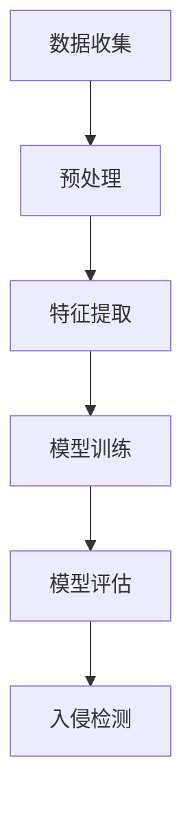

                 

### 第1章 问题背景

#### 1.1 网络安全的重要性

网络安全在现代社会中扮演着至关重要的角色。随着数字化转型的不断深入，网络成为了信息和数据交换的主要通道。无论是企业、政府机构还是个人，都依赖网络来处理日常工作和生活事务。然而，网络安全问题也日益凸显，不仅威胁到信息系统的正常运行，还可能对国家安全、社会稳定和公共利益造成严重影响。

**网络安全现状**：当前网络安全面临诸多挑战，包括但不限于以下方面：

1. **攻击手段多样**：网络攻击手段层出不穷，从传统的病毒、木马到现代的高级持续性威胁（APT），攻击者利用漏洞进行非法侵入、窃取信息、破坏系统等。
2. **攻击频率增加**：随着黑客技术不断升级，网络安全事件的发生频率逐年上升。据统计，全球平均每周都会发生数十起重大网络安全事件。
3. **防护成本高**：为了应对不断升级的网络安全威胁，企业和组织不得不投入大量资金和资源进行防护，但效果仍然有限。

**网络安全挑战**：

1. **防护技术落后**：传统的网络安全技术主要依赖于规则和签名匹配，对于新型复杂攻击手段的应对能力有限。
2. **数据量庞大**：随着网络数据的急剧增长，如何快速、准确地处理和分析海量数据成为网络安全的一大难题。
3. **跨领域协同不足**：网络安全涉及多个领域，包括计算机科学、网络技术、信息安全等，跨领域的协同能力不足，影响了整体防护效果。

#### 1.2 AI在网络安全中的应用

人工智能（AI）作为一种新兴技术，在网络安全领域展现出巨大的潜力。通过机器学习和深度学习等AI技术，可以实现对网络行为的自动识别、异常检测和威胁响应，从而提高网络防护能力。

**AI技术在网络安全中的角色**：

1. **入侵检测**：利用AI技术，可以自动识别和响应网络攻击，提高检测效率和准确性。
2. **恶意软件检测**：通过AI算法，可以对恶意软件进行预测和防范，减少恶意软件对系统的危害。
3. **异常行为分析**：AI技术可以分析用户行为，识别异常行为模式，从而提前预警潜在的安全威胁。

**AI在网络安全中的挑战**：

1. **数据隐私**：AI算法在训练和部署过程中需要大量数据，如何保护数据隐私是一个重要问题。
2. **算法透明性**：AI算法的内部机制复杂，对于普通用户而言难以理解，增加了算法被滥用或误用的风险。
3. **资源消耗**：AI算法的训练和推理过程需要大量计算资源，对硬件设备提出了较高要求。

### 第2章 核心概念

#### 2.1 网络安全基本概念

**安全威胁与攻击类型**：

网络安全威胁主要分为以下几类：

1. **恶意软件**：包括病毒、木马、蠕虫等，通过恶意代码感染计算机系统，造成数据损坏、系统崩溃等。
2. **网络攻击**：包括DDoS攻击、SQL注入、跨站脚本攻击等，通过非法手段入侵网络系统，窃取信息、破坏系统等。
3. **信息泄露**：指未经授权的个人信息或敏感信息被泄露，可能导致隐私侵犯、财产损失等。

**安全防御机制**：

网络安全防御机制主要包括以下几种：

1. **防火墙**：通过设置规则，阻止未经授权的访问，保护内部网络不受外部攻击。
2. **入侵检测系统（IDS）**：监控网络流量，识别异常行为和潜在威胁，及时报警和响应。
3. **加密技术**：通过加密算法保护数据传输的安全，防止数据被窃取或篡改。

#### 2.2 人工智能基本概念

**机器学习与深度学习**：

机器学习是一种让计算机通过数据和算法自动改进性能的技术。深度学习是机器学习的一个子领域，通过构建多层神经网络模型，对数据进行自动学习和特征提取。

**神经网络与深度学习模型**：

神经网络是一种模拟生物神经系统的计算模型，由大量神经元（节点）连接而成。深度学习模型则是通过增加神经网络层数，提高模型的复杂度和学习能力。

#### 2.3 网络安全中的AI应用

**AI在入侵检测中的应用**：

入侵检测系统（IDS）利用AI技术，通过分析网络流量和系统日志，自动识别和响应网络攻击。常见的入侵检测方法包括基于统计的异常检测和基于模型的异常检测。

**AI在恶意软件检测中的应用**：

恶意软件检测系统利用AI算法，通过特征提取和分类模型，对恶意软件进行识别和分类。常见的恶意软件检测方法包括基于签名匹配和基于行为的检测。

### 第3章 AI在网络安全中的应用原理

#### 3.1 概念属性特征对比表格

以下是一个关于入侵检测系统（IDS）、恶意软件检测系统和深度学习模型的属性特征对比表格：

| 概念              | 属性特征                | 对比结论             |
|------------------|----------------------|------------------|
| 入侵检测系统          | 自动识别和响应攻击       | 提高检测效率和准确性     |
| 恶意软件检测系统        | 预测和防止恶意软件感染     | 提升系统安全性和用户体验   |
| 深度学习模型          | 自动学习和自适应能力       | 提高分析复杂网络数据的能力 |

#### 3.2 ER实体关系图架构

以下是一个关于用户、系统、威胁和检测器的ER实体关系图：

```mermaid
erDiagram
    User ||--|{ System }|--| Threat
    System ||--|{ Detector }|--| Detection
    Threat ||--|{ Malware }|--| Infection
```

在这个ER图中，用户与系统之间存在一对多的关系，系统与威胁之间存在一对多的关系，系统与检测器之间存在一对多的关系，威胁与恶意软件之间存在一对多的关系，检测器与检测之间存在一对多的关系。

### 第4章 入侵检测中的AI算法

#### 4.1 算法mermaid流程图

以下是一个关于入侵检测算法的mermaid流程图：



在这个流程图中，首先进行数据收集，然后进行预处理，接着进行特征提取，之后进行模型训练，最后进行模型评估和入侵检测。

#### 4.2 Python源代码实现

以下是一个关于入侵检测算法的Python源代码实现：

```python
# 导入必要的库
import numpy as np
import pandas as pd
from sklearn.model_selection import train_test_split
from sklearn.preprocessing import StandardScaler
from sklearn.svm import SVC
from sklearn.metrics import accuracy_score

# 数据收集
data = pd.read_csv('network_data.csv')

# 预处理
X = data.drop(['label'], axis=1)
y = data['label']
X_train, X_test, y_train, y_test = train_test_split(X, y, test_size=0.2, random_state=42)

# 特征提取
scaler = StandardScaler()
X_train_scaled = scaler.fit_transform(X_train)
X_test_scaled = scaler.transform(X_test)

# 模型训练
model = SVC(kernel='linear')
model.fit(X_train_scaled, y_train)

# 模型评估
y_pred = model.predict(X_test_scaled)
accuracy = accuracy_score(y_test, y_pred)
print(f'Accuracy: {accuracy}')

# 入侵检测
new_data = pd.read_csv('new_network_data.csv')
new_data_scaled = scaler.transform(new_data)
new_predictions = model.predict(new_data_scaled)
```

在这个源代码中，我们首先导入必要的库，然后进行数据收集和预处理。接着，使用标准尺度（StandardScaler）对特征进行标准化处理，以提高模型的性能。之后，使用支持向量机（SVC）进行模型训练，并使用训练好的模型对测试数据进行预测。最后，使用训练好的模型对新数据进行入侵检测。

