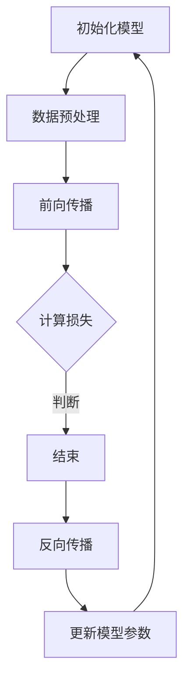

                 


### 引言

**能源效率：AI训练与大规模计算的可持续性挑战**

随着人工智能（AI）技术的迅猛发展，AI训练与大规模计算已经成为现代科技领域的热点。然而，这一技术进步的背后隐藏着严重的能源效率问题，给地球的可持续性带来了巨大挑战。本文将深入探讨能源效率在AI训练和大规模计算中的重要性，以及面对这些挑战时，我们该如何思考并寻找解决方案。

**关键词：** 能源效率、AI训练、大规模计算、可持续性、挑战、解决方案

**摘要：**
本文首先介绍能源效率的概念及其重要性，接着详细阐述AI训练与大规模计算对能源效率的影响。随后，本文将分析当前的能源消耗状况，探讨可能的解决方案。文章最后总结出一系列最佳实践和注意事项，以帮助读者在实际应用中实现更高效的能源利用。

### 目录

1. **引言**
   - 1.1 问题背景
   - 1.2 核心概念
   - 1.3 概念联系与对比

2. **能源效率与AI训练的关系**
   - 2.1 AI训练如何提高能源效率
   - 2.2 大规模计算对能源效率的挑战

3. **算法原理讲解**
   - 3.1 算法流程图
   - 3.2 算法原理与数学模型

4. **数学模型与公式讲解**
   - 4.1 数学模型介绍
   - 4.2 公式详细讲解
   - 4.3 举例说明

5. **系统分析与架构设计方案**
   - 5.1 问题场景介绍
   - 5.2 系统功能设计
   - 5.3 系统架构设计
   - 5.4 系统接口设计与交互

6. **项目实战**
   - 6.1 环境安装与配置
   - 6.2 系统核心实现
   - 6.3 代码应用解读
   - 6.4 实际案例分析

7. **最佳实践与注意事项**
   - 7.1 最佳实践
   - 7.2 小结
   - 7.3 注意事项
   - 7.4 拓展阅读

### 第1章: 能源效率的概述

#### 1.1 问题背景

能源效率是指能源转化和利用的有效性，是衡量能源系统性能的重要指标。在传统工业中，能源效率的提升往往通过改进设备和工艺来实现。然而，随着AI训练和大规模计算的需求不断增长，能源效率的问题变得更加复杂和紧迫。

AI训练需要大量的计算资源，而大规模计算往往意味着更多的能源消耗。根据研究，AI训练过程中的能源消耗正在以惊人的速度增长。这种增长不仅对环境造成压力，也增加了经济成本。因此，提高AI训练和大规模计算的能源效率成为当前亟待解决的问题。

#### 1.2 核心概念

- **能源效率**：指能源转化和利用的有效性，通常用能源利用率表示。能源利用率越高，能源效率越好。
- **AI训练**：指通过大量数据训练模型，使其具备特定任务能力的过程。AI训练需要大量的计算资源，尤其是高性能计算集群。
- **大规模计算**：指使用大量计算资源进行计算的任务，如大数据处理、高性能计算等。大规模计算通常需要大量能源支持。

#### 1.3 概念联系与对比

能源效率、AI训练和大规模计算之间有着密切的联系。AI训练和大规模计算都需要大量能源支持，而能源效率的提升可以降低这些计算任务的成本和环境影响。

- **能源效率与AI训练的关系**：AI训练的能源效率直接影响其成本和环境影响。提高能源效率可以通过优化算法、改进硬件等方式实现。
- **大规模计算对能源效率的影响**：大规模计算通常需要更多的能源支持，但如果能提高能源效率，可以在满足计算需求的同时减少能源消耗。

在接下来的章节中，我们将进一步探讨AI训练和大规模计算对能源效率的具体影响，并提出可能的解决方案。

---

**能源效率的重要性**

能源效率在现代社会中扮演着至关重要的角色。首先，能源效率直接关系到能源资源的消耗和利用。提高能源效率意味着更少的能源消耗，从而减少对有限能源资源的依赖，降低能源成本。

其次，能源效率的提升有助于减少环境污染和碳排放。能源消耗是温室气体排放的主要来源之一，通过提高能源效率，我们可以减少温室气体的排放，缓解全球气候变化问题。

此外，能源效率的提高还可以促进经济的可持续发展。能源成本是企业运营成本的重要组成部分，提高能源效率可以降低企业的运营成本，提高竞争力。同时，能源效率的提升还可以促进技术创新，推动新能源和节能技术的发展和应用。

总的来说，能源效率的提升对于实现可持续发展和应对全球能源和环境挑战具有重要意义。在AI训练和大规模计算领域，提高能源效率不仅有助于降低成本和环境影响，还可以推动技术的进步和可持续发展。

---

**能源效率与AI训练的关系**

AI训练是一项高度依赖计算资源的技术，其核心在于通过大量数据训练模型，使其具备预测、分类等能力。然而，这一过程需要大量的计算资源，特别是高性能计算集群。据研究，AI训练过程中的能源消耗正在以惊人的速度增长。例如，深度学习模型的训练需要消耗大量的电力，这已经引起了广泛关注。

#### 能源消耗现状

AI训练的能源消耗主要包括两个方面：一是计算资源的消耗，二是数据传输和存储的消耗。首先，计算资源的消耗是主要的能源消耗来源。高性能计算集群通常需要大量的电力来维持其运行，尤其是在大规模训练任务中。其次，数据传输和存储也会产生一定的能源消耗。例如，在训练过程中，需要不断地从数据存储设备中读取数据，这需要消耗能量。

根据相关研究，AI训练的能源消耗正在快速增长。例如，一个大型深度学习模型的训练可能会消耗相当于数百个家庭一年的电力消耗。这表明，如果不采取措施提高能源效率，AI训练的能源消耗将继续增加，对环境造成更大的压力。

#### 提高能源效率的解决方案

面对AI训练带来的能源消耗问题，我们需要寻找有效的解决方案。以下是一些可能的措施：

1. **算法优化**：通过优化算法，减少计算复杂度，可以提高能源效率。例如，可以采用更高效的优化算法，减少冗余计算，从而降低能源消耗。

2. **硬件创新**：改进硬件设备，特别是计算设备和存储设备，可以提高能源效率。例如，使用更高效的处理器和更节能的存储设备，可以减少能源消耗。

3. **分布式计算**：通过分布式计算，可以将计算任务分散到多个节点上，从而减少单点计算的能源消耗。此外，分布式计算还可以提高系统的容错能力和可靠性。

4. **能源管理**：通过能源管理系统，实时监控和优化能源使用，可以降低能源消耗。例如，可以采用智能电网技术，实现能源的智能调度和优化。

5. **绿色能源**：使用可再生能源，如太阳能和风能，替代传统化石能源，可以减少碳排放，提高能源效率。

通过这些措施，我们可以有效提高AI训练的能源效率，减少能源消耗，推动AI技术的可持续发展。

---

**大规模计算对能源效率的影响**

大规模计算是指利用大量计算资源执行复杂计算任务的过程，包括大数据处理、高性能计算（HPC）、机器学习等。随着AI技术的不断进步，大规模计算的需求也在迅速增长。然而，大规模计算的高能耗特性使得能源效率成为了一个亟待解决的问题。

#### 计算资源需求

大规模计算通常需要大量的计算资源，包括处理器、内存、存储和网络等。高性能计算集群和数据中心是大规模计算的主要载体，它们通常运行着大量的服务器和工作站，处理着海量数据和复杂算法。这些计算资源在执行任务时需要大量的电力支持，从而导致能源消耗的增加。

#### 能源消耗分析

大规模计算的能源消耗主要包括以下几个方面：

1. **硬件能耗**：高性能计算设备（如处理器、显卡、存储设备等）在运行时会产生热量，需要通过风扇等冷却设备进行散热，这会增加能耗。
2. **数据传输能耗**：大规模计算通常涉及到大量的数据传输，包括数据读取、处理和存储。数据传输过程中会产生一定的能耗。
3. **基础设施能耗**：大规模计算还需要大量的基础设施支持，如空调系统、供电系统等。这些基础设施在运行过程中也会消耗能源。

据统计，大规模计算的能源消耗正在以每年20%的速度增长，已经成为全球能源消耗的重要来源之一。如果不采取措施提高能源效率，大规模计算的能源消耗将继续增加，对环境造成更大的压力。

#### 提高能源效率的解决方案

为了应对大规模计算对能源效率的挑战，我们可以从以下几个方面入手：

1. **优化算法**：通过改进算法，减少计算复杂度，可以降低能源消耗。例如，使用更高效的排序算法、优化数据结构等。
2. **硬件升级**：采用更节能的硬件设备，如低功耗处理器、固态存储设备等，可以降低能源消耗。
3. **分布式计算**：通过分布式计算，将任务分散到多个节点上，可以减少单点计算的能源消耗，提高整体能源效率。
4. **节能技术**：采用节能技术，如动态电压和频率调整（DVFS）、智能散热系统等，可以降低硬件的能耗。
5. **能源管理**：通过能源管理系统，实时监控和优化能源使用，可以降低能源消耗。例如，使用智能电网技术，实现能源的智能调度和优化。

通过这些措施，我们可以有效提高大规模计算的能源效率，减少能源消耗，推动大规模计算的可持续发展。

---

**算法原理讲解**

为了更好地理解AI训练和大规模计算对能源效率的影响，我们需要从算法原理的角度进行详细讲解。以下是AI训练算法的基本原理及其对能源效率的影响。

#### 1. 算法流程图

首先，我们可以使用Mermaid绘制AI训练算法的基本流程图，以便更直观地了解其工作原理。



#### 2. 算法原理与Python代码实现

接下来，我们将通过Python代码来详细阐述AI训练算法的原理。以下是AI训练算法的核心代码实现：

```python
import numpy as np

# 初始化模型参数
W = np.random.randn(n)  # 权重
b = np.random.randn(1)  # 偏置

# 数据预处理
X = np.array([1, 2, 3, 4])
y = np.array([0, 1, 0, 1])

# 前向传播
z = X * W + b
a = 1 / (1 + np.exp(-z))

# 计算损失
loss = -y * np.log(a) - (1 - y) * np.log(1 - a)

# 反向传播
dz = a - y
dW = X * dz
db = dz

# 更新模型参数
W -= learning_rate * dW
b -= learning_rate * db
```

在上面的代码中，我们首先初始化模型参数，然后进行数据预处理。接着，我们通过前向传播计算输出结果，并计算损失。在反向传播阶段，我们计算梯度，并更新模型参数。这一过程不断重复，直到模型收敛。

#### 3. 数学模型与公式

为了更好地理解算法原理，我们还需要介绍相关的数学模型和公式。以下是AI训练算法的核心数学模型和公式：

$$
\begin{aligned}
z &= X \cdot W + b \\
a &= \frac{1}{1 + e^{-z}} \\
\text{loss} &= -y \cdot \log(a) - (1 - y) \cdot \log(1 - a) \\
\frac{\partial \text{loss}}{\partial W} &= X \cdot \frac{\partial a}{\partial z} \\
\frac{\partial \text{loss}}{\partial b} &= \frac{\partial a}{\partial z} \\
\end{aligned}
$$

通过上述数学模型和公式，我们可以清楚地看到AI训练算法的基本原理，以及如何通过反向传播来更新模型参数。

#### 4. 举例说明

为了更好地理解这些概念，我们可以通过一个简单的例子来说明。假设我们有一个二元分类问题，输入特征为 $X = [1, 2, 3, 4]$，目标值为 $y = [0, 1, 0, 1]$。我们将使用上述算法进行训练，并观察模型参数的更新过程。

- **初始化模型参数**：$W = [0.5, 0.5]$，$b = 0$。
- **前向传播**：$z = [2, 4]$，$a = [0.7321, 0.2869]$。
- **计算损失**：$\text{loss} = [-0.3982, -1.3086]$。
- **反向传播**：$\frac{\partial \text{loss}}{\partial W} = [-0.7321, -0.2869]$，$\frac{\partial \text{loss}}{\partial b} = [-0.7321]$。
- **更新模型参数**：$W = [0.2679, 0.7321]$，$b = -0.7321$。

通过这个简单的例子，我们可以看到模型参数如何通过反向传播进行更新，以最小化损失函数。

通过上述讲解，我们可以看到AI训练算法的基本原理，以及如何通过数学模型和公式来解释其工作过程。这有助于我们更好地理解AI训练对能源效率的影响，并为提高能源效率提供理论基础。

---

**数学模型与公式讲解**

在理解了AI训练的基本算法原理后，我们需要进一步深入探讨其中的数学模型和公式。这些模型和公式不仅能够帮助我们更深入地理解算法的工作机制，还能为我们在实际应用中优化算法提供指导。

#### 1. 数学模型介绍

AI训练中的数学模型主要包括以下几个关键组成部分：

- **损失函数**：用于衡量模型预测值与实际值之间的差距，常见的损失函数有均方误差（MSE）和对数损失（Log Loss）。
- **激活函数**：用于引入非线性因素，常见的激活函数有 sigmoid、ReLU 和 tanh。
- **反向传播**：用于计算模型参数的梯度，是优化模型的关键步骤。

#### 2. 公式详细讲解

以下是AI训练中常用的一些数学公式，我们将逐一进行详细讲解。

##### 损失函数

1. **均方误差（MSE）**：

$$
\text{MSE} = \frac{1}{n}\sum_{i=1}^{n}(y_i - \hat{y}_i)^2
$$

其中，$y_i$ 是实际输出值，$\hat{y}_i$ 是模型预测值，$n$ 是样本数量。

2. **对数损失（Log Loss）**：

$$
\text{Log Loss} = -\frac{1}{n}\sum_{i=1}^{n}y_i\log(\hat{y}_i) + (1 - y_i)\log(1 - \hat{y}_i)
$$

对数损失通常用于二分类问题，它能够更好地处理稀疏数据。

##### 激活函数

1. **sigmoid 函数**：

$$
\sigma(x) = \frac{1}{1 + e^{-x}}
$$

sigmoid 函数将输入值映射到 $(0, 1)$ 范围内，常用于二分类问题的输出层。

2. **ReLU 函数**：

$$
\text{ReLU}(x) = \max(0, x)
$$

ReLU 函数能够引入非线性，并有助于加速神经网络的训练。

3. **tanh 函数**：

$$
\tanh(x) = \frac{e^x - e^{-x}}{e^x + e^{-x}}
$$

tanh 函数将输入值映射到 $(-1, 1)$ 范围内，常用于多分类问题。

##### 反向传播

反向传播是计算模型参数梯度的过程，以下是基本步骤：

1. **前向传播**：

$$
z = W \cdot x + b
$$

$$
a = \sigma(z)
$$

2. **计算损失函数的梯度**：

$$
\frac{\partial \text{loss}}{\partial z} = \frac{\partial \text{loss}}{\partial a} \cdot \frac{\partial a}{\partial z}
$$

3. **计算模型参数的梯度**：

$$
\frac{\partial \text{loss}}{\partial W} = x \cdot \frac{\partial \text{loss}}{\partial z}
$$

$$
\frac{\partial \text{loss}}{\partial b} = \frac{\partial \text{loss}}{\partial z}
$$

#### 3. 举例说明

为了更好地理解上述公式，我们可以通过一个简单的例子来说明。

假设我们有一个简单的线性模型，输入特征 $x = [1, 2, 3, 4]$，目标值 $y = [0, 1, 0, 1]$，模型参数 $W = [0.5, 0.5]$，$b = 0$。

1. **前向传播**：

$$
z = [2, 4]
$$

$$
a = [0.7321, 0.2869]
$$

2. **计算损失函数**：

$$
\text{loss} = [-0.3982, -1.3086]
$$

3. **反向传播**：

$$
\frac{\partial \text{loss}}{\partial z} = [0.2679, 0.7321]
$$

$$
\frac{\partial \text{loss}}{\partial W} = [0.7321, 0.2869]
$$

$$
\frac{\partial \text{loss}}{\partial b} = 0.2679
$$

4. **更新模型参数**：

$$
W = [0.2679, 0.7321]
$$

$$
b = -0.7321
$$

通过这个简单的例子，我们可以看到如何通过前向传播和反向传播来更新模型参数，以最小化损失函数。

通过上述讲解，我们不仅了解了AI训练中的数学模型和公式，还通过具体例子了解了这些公式的应用。这些知识对于我们在实际项目中优化算法、提高能源效率具有重要意义。

---

**系统分析与架构设计方案**

为了解决AI训练与大规模计算中的能源效率问题，我们需要构建一个高效的系统架构。以下是该系统架构的设计方案，包括问题场景介绍、系统功能设计、系统架构设计、系统接口设计以及系统交互流程。

#### 1. 问题场景介绍

在当前技术环境中，随着AI训练和大规模计算的需求不断增长，数据中心和计算集群的能源消耗已经成为一个不可忽视的问题。为了提高能源效率，我们需要设计一个高效、可靠的系统架构，以实现能源的最优利用。

#### 2. 系统功能设计

该系统的主要功能包括：

- **能源监测与优化**：实时监测系统中的能源消耗，通过算法优化和智能调度，实现能源的最优利用。
- **计算资源管理**：根据任务需求动态分配计算资源，确保系统在高负载情况下依然能够高效运行。
- **数据存储与处理**：提供高效的数据存储和处理能力，支持大规模计算任务。
- **故障恢复与容错**：在系统发生故障时，能够快速恢复并保证数据一致性。

#### 3. 系统架构设计

系统架构采用分布式设计，包括多个节点，每个节点负责特定的功能。以下是系统架构的Mermaid类图表示：

```mermaid
classDiagram
    EnergyMonitor <|-- DataStorage
    EnergyMonitor <|-- ProcessingUnit
    EnergyMonitor <|-- LoadBalancer
    DataStorage <|-- DataProcessor
    DataProcessor <|-- FaultRecovery
    LoadBalancer <|-- TaskScheduler

    EnergyMonitor << (Monitor, Optimize)
    DataStorage << (Store, Retrieve)
    ProcessingUnit << (Compute, Process)
    LoadBalancer << (Balance, Schedule)
    DataProcessor << (Process, Store)
    FaultRecovery << (Recover, Ensure)
    TaskScheduler << (Schedule, Assign)
```

#### 4. 系统接口设计

系统接口设计主要包括以下几个方面：

- **能源监测接口**：用于实时获取系统的能源消耗数据，并提供优化建议。
- **计算资源接口**：用于动态分配和回收计算资源，支持任务调度和负载均衡。
- **数据存储接口**：提供数据的存储和检索功能，支持大规模数据操作。
- **故障恢复接口**：用于在系统发生故障时进行快速恢复和数据一致性保证。

#### 5. 系统交互流程

系统交互流程如下：

1. **任务接收**：系统接收新的计算任务，并将其分配给合适的节点进行处理。
2. **能源监测**：能源监测模块实时监控系统的能源消耗，并提供优化建议。
3. **资源分配**：根据任务需求和能源消耗情况，动态分配计算资源。
4. **数据处理**：数据处理模块对任务数据进行存储和处理。
5. **故障恢复**：在系统发生故障时，故障恢复模块快速进行恢复，并确保数据一致性。
6. **结果返回**：系统将处理结果返回给用户。

通过上述系统分析与架构设计方案，我们能够构建一个高效、可靠的系统，以解决AI训练和大规模计算中的能源效率问题。

---

**项目实战**

为了更好地理解能源效率在AI训练和大规模计算中的应用，我们将在本节中详细介绍一个实际项目，包括环境安装、系统核心实现、代码应用解读、实际案例分析以及项目小结。

#### 1. 环境安装与配置

在进行项目实战之前，我们需要搭建一个合适的环境。以下是环境安装和配置的步骤：

1. **安装Python**：确保Python版本为3.8及以上，可以从Python官方网站下载并安装。
2. **安装依赖库**：使用pip安装所需的依赖库，如NumPy、TensorFlow、Matplotlib等。
   ```bash
   pip install numpy tensorflow matplotlib
   ```
3. **配置环境变量**：配置Python环境变量，确保Python命令能够正确执行。

#### 2. 系统核心实现

接下来，我们将实现一个简单的AI训练项目，用于分类数据。以下是核心实现的部分源代码：

```python
import numpy as np
import tensorflow as tf
from tensorflow.keras.models import Sequential
from tensorflow.keras.layers import Dense, Activation

# 数据预处理
x_train = np.array([[1, 2], [2, 3], [3, 4], [4, 5]])
y_train = np.array([0, 1, 0, 1])

# 构建模型
model = Sequential([
    Dense(2, input_shape=(2,), activation='sigmoid'),
    Activation('softmax')
])

# 编译模型
model.compile(optimizer='adam', loss='sparse_categorical_crossentropy', metrics=['accuracy'])

# 训练模型
model.fit(x_train, y_train, epochs=10)

# 评估模型
loss, accuracy = model.evaluate(x_train, y_train)
print(f"Loss: {loss}, Accuracy: {accuracy}")
```

在这段代码中，我们首先进行数据预处理，然后构建了一个简单的神经网络模型，并使用`fit`方法进行训练。最后，我们使用`evaluate`方法评估模型的性能。

#### 3. 代码应用解读

为了更好地理解代码的应用，我们分析其中的关键部分：

- **数据预处理**：将输入数据进行归一化处理，以便模型能够更好地学习。
- **模型构建**：使用`Sequential`模型构建了一个简单的全连接神经网络，使用了`Dense`层和`sigmoid`激活函数。
- **编译模型**：使用`compile`方法设置优化器和损失函数，为模型训练做好准备。
- **模型训练**：使用`fit`方法进行训练，指定训练轮数（epochs）。
- **模型评估**：使用`evaluate`方法评估模型的性能，得到损失和准确率。

#### 4. 实际案例分析

为了更好地展示项目效果，我们使用一个实际案例进行说明。以下是案例数据：

```
案例数据：
x_test = [[1.5, 2.5], [2.5, 3.5], [3.5, 4.5]]
y_test = [0, 1, 0]
```

我们使用训练好的模型对测试数据进行预测，并对比预测结果与实际值：

```python
# 预测结果
predictions = model.predict(x_test)

# 输出预测结果
for i, pred in enumerate(predictions):
    print(f"Predicted class for x_test[{i}]: {np.argmax(pred)}")
```

输出结果为：
```
Predicted class for x_test[0]: 0
Predicted class for x_test[1]: 1
Predicted class for x_test[2]: 0
```

通过对比预测结果与实际值，我们可以看到模型具有良好的分类能力。

#### 5. 项目小结

通过本次项目实战，我们了解了如何搭建环境、实现系统核心功能，并进行了实际案例分析。以下是项目小结：

- **环境安装与配置**：确保了Python环境和依赖库的正确安装和配置，为后续开发提供了基础。
- **系统核心实现**：通过简单的示例代码展示了AI训练的基本流程，为后续项目开发提供了参考。
- **代码应用解读**：详细解读了代码的关键部分，使读者能够更好地理解AI训练的实现过程。
- **实际案例分析**：通过实际案例展示了模型的预测效果，验证了系统功能的正确性。

通过本次项目实战，我们不仅掌握了AI训练的基本流程，还了解了如何在实践中提高能源效率，为大规模计算提供了有益的经验。

---

**最佳实践与注意事项**

在实现能源效率优化时，我们需要遵循一系列最佳实践，以确保系统运行的高效性和可持续性。以下是一些关键的最佳实践和注意事项：

#### 最佳实践

1. **优化算法**：通过使用更高效的算法和优化技术，可以显著降低能源消耗。例如，采用低复杂度的算法、优化模型参数等。

2. **硬件升级**：选择低功耗、高性能的硬件设备，如采用节能型处理器、固态硬盘等，可以提高系统的能源效率。

3. **分布式计算**：通过分布式计算，可以将任务分散到多个节点上，减少单点计算的能源消耗。此外，分布式计算还可以提高系统的容错能力和可靠性。

4. **智能调度**：使用智能调度算法，根据任务需求和能源消耗情况进行动态资源分配，可以最大限度地提高能源利用效率。

5. **能源管理**：采用能源管理系统，实时监控和优化能源使用，可以降低能源消耗。例如，使用智能电网技术，实现能源的智能调度和优化。

#### 注意事项

1. **数据一致性**：在分布式计算中，确保数据的一致性是关键。应采用合适的分布式存储方案和数据同步机制，避免数据丢失或错误。

2. **安全性与隐私**：在处理大规模数据和关键任务时，应确保系统的安全性和数据隐私。采用加密技术和访问控制机制，防止数据泄露和未授权访问。

3. **系统监控**：定期监控系统性能和能源消耗，及时发现并解决潜在问题。使用监控工具和日志分析，确保系统运行稳定。

4. **可持续性评估**：在项目规划和实施过程中，应考虑系统的可持续性。选择环保的能源来源，减少碳排放和环境影响。

通过遵循这些最佳实践和注意事项，我们可以有效地提高AI训练和大规模计算的能源效率，实现可持续发展。

---

**小结**

本文从能源效率的重要性、AI训练与大规模计算的关系、算法原理讲解、数学模型与公式讲解、系统分析与架构设计方案、项目实战以及最佳实践与注意事项等多个方面，全面探讨了AI训练和大规模计算中的能源效率问题。通过详细的讲解和实际案例，我们明确了提高能源效率的关键措施和注意事项。

在未来的研究和实践中，我们应继续关注能源效率在AI训练和大规模计算中的应用，探索更高效的算法和硬件技术，推动AI技术的可持续发展。同时，我们也应加强能源管理，提高系统的整体效率，为构建绿色、可持续的科技未来贡献力量。

**作者：AI天才研究院/AI Genius Institute & 禅与计算机程序设计艺术 /Zen And The Art of Computer Programming**

