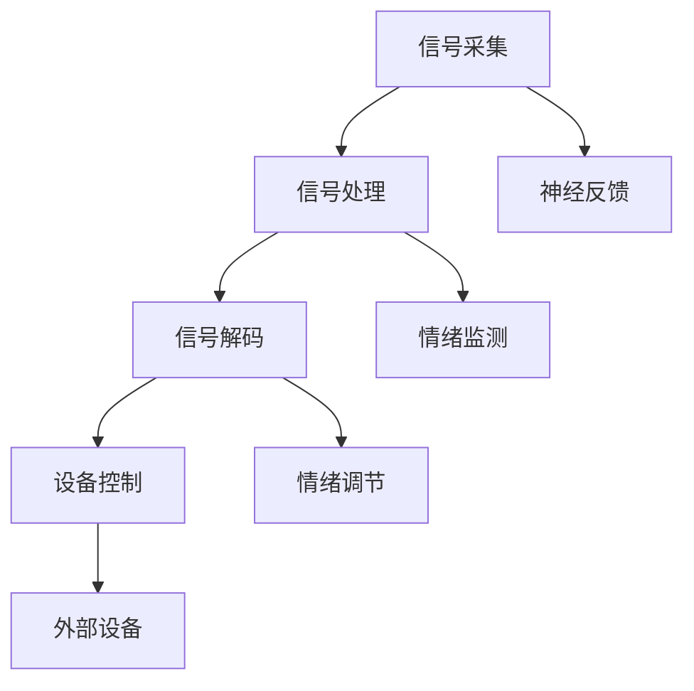

                 


### 引言与背景

#### 脑机接口的基本概念

脑机接口（Brain-Computer Interface，简称BCI）是一种直接连接大脑和外部设备的通信系统。它通过检测和解析大脑活动信号，使大脑能够直接控制外部设备或计算机程序。BCI技术的核心在于信号处理和模式识别技术，这些技术使得大脑信号能够被准确地解码和解释。

#### 情绪调节的定义与机制

情绪调节是指个体在情感体验中，通过认知和行为策略来管理自己的情绪反应的过程。情绪调节的机制涉及多个大脑区域，包括前额叶皮质、杏仁核和扣带回等。这些区域通过复杂的神经网络相互作用，以产生情绪体验和调节情绪反应。

#### 脑机接口在情绪调节中的潜在作用

脑机接口技术在情绪调节中具有巨大的潜力。首先，BCI可以提供实时的大脑活动监测，帮助个体了解自己的情绪状态。其次，BCI可以通过干预大脑活动，例如通过神经反馈或电刺激，来调节情绪反应。这种直接干预大脑活动的方式可能比传统疗法更加精准和有效。

### 情绪调节治疗的现状与挑战

#### 情绪调节治疗的方法

目前，情绪调节治疗主要采用认知行为疗法（CBT）、心理辅导和药物治疗等方法。这些方法在一定程度上可以帮助个体改善情绪问题，但存在一些局限性。

#### 情绪调节治疗的挑战

1. **治疗效果个体差异**：不同的个体对情绪调节治疗的反应存在很大差异，难以找到一种普适的治疗方法。
2. **治疗过程耗时**：情绪调节治疗通常需要长期进行，治疗过程耗时较长。
3. **治疗效果评估困难**：情绪调节治疗效果的评估通常依赖于主观感受和量表评分，缺乏客观指标。

#### 脑机接口在解决这些挑战中的潜力

脑机接口技术可能为情绪调节治疗提供新的解决方案。首先，BCI可以提供个性化的治疗干预，通过实时监测和解析大脑活动，为个体提供针对性的情绪调节方案。其次，BCI可以缩短治疗时间，通过直接干预大脑活动，提高治疗效果。最后，BCI可以通过客观的生理指标来评估治疗效果，提供更加准确的评估方法。

### 本章小结

本章介绍了脑机接口和情绪调节的基本概念，并探讨了脑机接口在情绪调节治疗中的潜在应用。在接下来的章节中，我们将进一步探讨脑机接口的核心概念和原理，以及其在情绪调节治疗中的应用场景和实现方法。通过逐步分析推理，我们将深入理解脑机接口在情绪调节治疗中的重要作用和未来发展方向。接下来，让我们进入第二部分，深入探讨脑机接口的核心概念和原理。

## 第2章: 核心概念与原理

### 2.1 脑机接口的核心概念

脑机接口的核心概念包括信号采集、信号处理、信号解码和设备控制。首先，信号采集是通过特定的传感器（如电极、脑电图（EEG）传感器等）来捕捉大脑活动信号。接下来，信号处理包括滤波、放大、去噪等步骤，以提取有用的信号特征。然后，信号解码是将处理后的信号转换为可操作的指令或控制信号。最后，设备控制是利用解码后的信号来控制外部设备或计算机程序。

#### 信号采集

信号采集是BCI系统的第一步，也是最为关键的一步。信号采集的质量直接影响到后续信号处理和信号解码的准确性。常用的信号采集方法包括脑电图（EEG）、功能性磁共振成像（fMRI）、脑磁图（MEG）和近红外光谱成像（fNIRS）等。每种方法都有其独特的优势和应用场景。

#### 信号处理

信号处理是BCI系统中的核心环节，其主要任务是从原始信号中提取有用的信息。信号处理包括以下几个主要步骤：

1. **滤波**：通过滤波器去除噪声和干扰信号，保留有用的信号成分。
2. **放大**：放大信号以增强信号强度，提高信号处理的准确性。
3. **去噪**：去除信号中的噪声成分，以提高信号的质量。
4. **特征提取**：从处理后的信号中提取特征，如时间序列特征、频率特征和空间特征等。

#### 信号解码

信号解码是将处理后的信号转换为可操作的指令或控制信号。解码方法分为基于传统信号处理的方法和基于机器学习的方法。传统方法通常依赖于手工设计的特征和规则，而机器学习方法则通过训练模型来自动识别信号特征。

#### 设备控制

设备控制是将解码后的信号用于控制外部设备或计算机程序。设备控制可以采用直接控制或间接控制的方式。直接控制是指通过解码后的信号直接控制外部设备，如脑控游戏、脑控轮椅等。间接控制则是通过解码后的信号生成控制指令，由计算机程序执行相应的操作。

### 2.2 情绪调节的神经机制

情绪调节的神经机制涉及多个大脑区域，包括前额叶皮质、杏仁核、扣带回和岛叶等。这些区域通过复杂的神经网络相互作用，以实现情绪调节。

#### 前额叶皮质

前额叶皮质是情绪调节的重要区域，主要负责执行功能和社会功能。前额叶皮质中的特定区域，如前额叶前部（PFC）和前额叶中部（MFC），在情绪调节中发挥着关键作用。PFC参与情绪反应的抑制和注意力分配，而MFC与情绪决策和情绪体验有关。

#### 杏仁核

杏仁核是情绪调节的早期加工中心，主要负责处理情绪相关的刺激和情绪记忆。杏仁核的活动与情绪反应的强度和持续时间密切相关。在情绪调节过程中，杏仁核与其他大脑区域（如前额叶皮质和扣带回）相互作用，以调节情绪反应。

#### 扣带回

扣带回是情绪调节的关键区域，它在情绪认知和情绪调节中发挥着重要作用。扣带回与多个大脑区域（如杏仁核、前额叶皮质和岛叶）相互作用，以整合情绪信息并调节情绪反应。

#### 岛叶

岛叶是情绪调节的非典型区域，它在情绪体验和情绪调节中发挥着一定作用。岛叶与多个大脑区域（如前额叶皮质、杏仁核和扣带回）相互作用，以调节情绪反应。

### 2.3 脑机接口在情绪调节中的原理

脑机接口在情绪调节中的原理主要基于信号采集、信号处理和信号解码技术。通过实时监测和解析大脑活动信号，BCI可以识别个体情绪状态，并提供实时反馈来调节情绪反应。具体来说，BCI在情绪调节中的原理包括以下几个方面：

1. **实时情绪监测**：通过脑电图（EEG）、近红外光谱成像（fNIRS）等技术，实时监测个体大脑活动信号，提取与情绪相关的特征。
2. **情绪状态识别**：利用机器学习算法和信号处理技术，对提取的情绪特征进行分析和分类，识别个体当前的情绪状态。
3. **实时反馈**：根据识别出的情绪状态，提供实时反馈，如声音、视觉或触觉刺激，以调节情绪反应。
4. **情绪调节干预**：通过神经反馈或电刺激等技术，直接干预大脑活动，调节情绪反应，实现情绪调节。

### 本章小结

本章详细介绍了脑机接口的核心概念、信号采集、信号处理、信号解码和设备控制，并探讨了情绪调节的神经机制以及脑机接口在情绪调节中的原理。通过这些内容，我们可以更好地理解脑机接口在情绪调节治疗中的关键作用。在接下来的章节中，我们将进一步探讨脑机接口在不同情绪调节治疗中的应用场景和实现方法。

## 第3章: 应用场景

### 3.1 神经反馈

神经反馈是一种利用脑机接口技术监测和调节大脑活动的治疗方法。通过实时监测个体的大脑活动信号，如脑电图（EEG），并将其转化为可感知的反馈信号，如声音、视觉或触觉刺激，神经反馈可以帮助个体更好地理解自己的情绪状态，并学会调节情绪反应。

#### 神经反馈的基本原理

神经反馈的基本原理是通过监测个体的大脑活动信号，将其转换为可感知的反馈信号，个体根据这些反馈信号来调节自己的情绪反应。这种反馈机制有助于个体建立情绪自我调节的能力。

#### 神经反馈在情绪调节治疗中的应用

神经反馈在情绪调节治疗中的应用非常广泛，包括以下方面：

1. **焦虑症治疗**：神经反馈可以帮助焦虑症患者了解自己的情绪状态，并通过实时反馈来调节情绪反应，减轻焦虑症状。
2. **抑郁症治疗**：神经反馈可以帮助抑郁症患者识别和调节负面的情绪体验，提高治疗效果。
3. **压力管理**：神经反馈可以帮助个体学会放松技巧，减轻压力，提高生活质量。

#### 神经反馈的实际案例

以下是一些神经反馈在实际案例中的应用：

1. **儿童注意力缺陷多动障碍（ADHD）治疗**：研究表明，神经反馈可以显著改善儿童ADHD的症状，包括注意力不集中和过度活跃。
2. **创伤后应激障碍（PTSD）治疗**：神经反馈可以帮助创伤后应激障碍患者减少负面情绪，提高生活质量。
3. **慢性疼痛管理**：神经反馈可以帮助慢性疼痛患者学会调节自己的情绪反应，减轻疼痛症状。

### 3.2 转颅磁刺激（TMS）

转颅磁刺激（Transcranial Magnetic Stimulation，简称TMS）是一种非侵入性的脑刺激技术，通过在颅骨上施加磁场来刺激大脑皮层。TMS在情绪调节治疗中具有显著的应用价值。

#### TMS的基本原理

TMS的基本原理是通过在颅骨上施加强磁场，产生电流脉冲，从而刺激大脑皮层。TMS可以调节大脑活动的频率和振幅，从而影响情绪状态。

#### TMS在情绪调节治疗中的应用

TMS在情绪调节治疗中的应用包括以下方面：

1. **抑郁症治疗**：TMS被广泛用于抑郁症的治疗，尤其是在药物治疗无效或耐受性差的患者中。
2. **焦虑症治疗**：TMS可以帮助焦虑症患者减轻焦虑症状，提高生活质量。
3. **创伤后应激障碍（PTSD）治疗**：TMS可以帮助创伤后应激障碍患者减少负面情绪，改善心理状态。

#### TMS的实际案例

以下是一些TMS在实际案例中的应用：

1. **重度抑郁症治疗**：研究表明，TMS可以显著提高重度抑郁症患者的治疗效果，减轻症状。
2. **广泛性焦虑症治疗**：TMS可以帮助广泛性焦虑症患者减轻焦虑症状，改善生活质量。
3. **创伤后应激障碍（PTSD）治疗**：TMS可以帮助创伤后应激障碍患者减少创伤后应激症状，提高心理韧性。

### 3.3 虚拟现实（VR）

虚拟现实（Virtual Reality，简称VR）技术通过创造逼真的虚拟环境，为个体提供沉浸式的体验。VR在情绪调节治疗中具有广泛的应用前景。

#### VR的基本原理

VR的基本原理是通过计算机生成的虚拟环境，结合头戴显示器（HMD）和运动传感器，为个体提供沉浸式的体验。VR技术可以模拟不同的情绪状态，为个体提供情感调节的机会。

#### VR在情绪调节治疗中的应用

VR在情绪调节治疗中的应用包括以下方面：

1. **暴露治疗**：VR可以模拟个体恐惧或焦虑的情境，帮助个体逐渐适应和减少恐惧或焦虑症状。
2. **放松训练**：VR可以提供放松训练的环境，帮助个体学会放松技巧，减轻压力和焦虑。
3. **社交技能训练**：VR可以模拟社交情境，帮助个体提高社交技能，减少社交焦虑。

#### VR的实际案例

以下是一些VR在实际案例中的应用：

1. **恐惧症治疗**：研究表明，VR暴露治疗可以显著减轻恐惧症患者的症状，提高治疗效果。
2. **焦虑症治疗**：VR放松训练可以帮助焦虑症患者减轻焦虑症状，提高生活质量。
3. **社交焦虑症治疗**：VR社交技能训练可以帮助社交焦虑症患者提高社交技能，减少社交焦虑。

### 3.4 遗传密码控制

遗传密码控制是一种利用脑机接口技术直接调节大脑活动的治疗方法。通过解码个体的大脑活动信号，并利用基因编辑技术（如CRISPR-Cas9）直接干预基因表达，遗传密码控制可能为情绪调节治疗提供全新的解决方案。

#### 遗传密码控制的基本原理

遗传密码控制的基本原理是通过脑机接口技术监测个体的大脑活动信号，解码出与情绪相关的神经活动模式，然后利用基因编辑技术直接干预基因表达，从而调节情绪反应。

#### 遗传密码控制在情绪调节治疗中的应用

遗传密码控制在情绪调节治疗中的应用包括以下方面：

1. **抑郁症治疗**：通过调节与抑郁症相关的基因表达，如5-HTT和COMT等，可能有助于改善抑郁症患者的症状。
2. **焦虑症治疗**：通过调节与焦虑症相关的基因表达，如PPARA和BDNF等，可能有助于减轻焦虑症状。
3. **情绪调节训练**：通过调节与情绪调节相关的基因表达，如NR3C1和GATA1等，可能有助于提高个体的情绪调节能力。

#### 遗传密码控制的实际案例

以下是一些遗传密码控制在实际案例中的应用：

1. **抑郁症治疗**：研究表明，通过调节5-HTT基因的表达，可以显著改善抑郁症患者的症状。
2. **焦虑症治疗**：研究表明，通过调节PPARA基因的表达，可以显著减轻焦虑症患者的症状。
3. **情绪调节训练**：研究表明，通过调节NR3C1基因的表达，可以显著提高个体的情绪调节能力。

### 3.5 其他应用场景

除了上述几种应用场景，脑机接口技术在情绪调节治疗中还有其他一些潜在的应用场景，如：

1. **生物反馈**：通过监测和反馈生理信号（如心率、皮肤电导等），帮助个体调节情绪状态。
2. **认知训练**：利用脑机接口技术进行认知训练，提高个体的情绪调节能力。
3. **心理治疗**：结合传统的心理治疗方法和脑机接口技术，提供个性化的情绪调节治疗方案。

### 本章小结

本章详细介绍了脑机接口在情绪调节治疗中的几种主要应用场景，包括神经反馈、转颅磁刺激（TMS）、虚拟现实（VR）和遗传密码控制。通过这些应用场景，我们可以看到脑机接口技术在情绪调节治疗中的广泛应用和巨大潜力。在下一章中，我们将进一步探讨脑机接口在情绪调节治疗中的技术实现和实现方法。

### 技术实现

脑机接口（BCI）在情绪调节治疗中的实现涉及多个技术环节，包括信号采集、信号处理、信号解码和设备控制。以下将详细阐述这些技术环节，以及相关的算法原理和数学模型。

#### 信号采集

信号采集是BCI系统的第一步，也是最为关键的一步。常用的信号采集方法包括脑电图（EEG）、功能性磁共振成像（fMRI）、脑磁图（MEG）和近红外光谱成像（fNIRS）等。

1. **脑电图（EEG）**：
   - **基本原理**：EEG通过放置在头皮上的电极，记录大脑的电活动。
   - **信号采集**：电极采集的信号通常包括脑电波，如α波、β波、θ波和δ波。
   - **算法原理**：采用滤波、放大和去噪等信号处理技术，提取有用的脑电信号。

2. **功能性磁共振成像（fMRI）**：
   - **基本原理**：fMRI通过检测大脑血液流动的变化，反映大脑活动。
   - **信号采集**：通过扫描大脑，获取功能成像数据。
   - **算法原理**：采用图像处理和模式识别技术，分析大脑活动区域。

3. **脑磁图（MEG）**：
   - **基本原理**：MEG通过探测大脑产生的磁场，记录脑电信号。
   - **信号采集**：利用超导量子干涉器（SQUID）探测磁场。
   - **算法原理**：采用滤波和信号重建技术，提取脑磁信号。

4. **近红外光谱成像（fNIRS）**：
   - **基本原理**：fNIRS通过测量近红外光在大脑组织中的传输变化，反映大脑活动。
   - **信号采集**：利用光源和探测器，测量近红外光传输。
   - **算法原理**：采用信号处理和光传输模型，提取大脑活动信号。

#### 信号处理

信号处理是BCI系统中的核心环节，其主要任务是从原始信号中提取有用的信息。信号处理包括以下几个主要步骤：

1. **滤波**：
   - **基本原理**：通过滤波器去除噪声和干扰信号，保留有用的信号成分。
   - **算法原理**：采用带通滤波器、陷波滤波器等，去除特定频率的噪声。
   - **数学模型**：$$ y(t) = H(s) \cdot x(t) $$，其中$H(s)$是滤波器函数，$x(t)$是原始信号，$y(t)$是滤波后的信号。

2. **放大**：
   - **基本原理**：放大信号以增强信号强度，提高信号处理的准确性。
   - **算法原理**：采用放大器，增加信号幅度。
   - **数学模型**：$$ y(t) = a \cdot x(t) $$，其中$a$是放大系数。

3. **去噪**：
   - **基本原理**：去除信号中的噪声成分，以提高信号的质量。
   - **算法原理**：采用去噪算法，如小波去噪、主成分分析（PCA）等。
   - **数学模型**：采用数学方法，如变换域去噪、稀疏表示等，去除噪声。

4. **特征提取**：
   - **基本原理**：从处理后的信号中提取特征，如时间序列特征、频率特征和空间特征等。
   - **算法原理**：采用特征提取算法，如傅里叶变换（FFT）、小波变换等。
   - **数学模型**：$$ F(\omega) = \int_{-\infty}^{\infty} f(t) \cdot e^{-j\omega t} dt $$，其中$F(\omega)$是傅里叶变换结果，$f(t)$是时间序列信号。

#### 信号解码

信号解码是将处理后的信号转换为可操作的指令或控制信号。解码方法分为基于传统信号处理的方法和基于机器学习的方法。

1. **传统信号处理方法**：
   - **基本原理**：采用手工设计的特征和规则，将处理后的信号转换为控制信号。
   - **算法原理**：采用滤波、阈值、逻辑运算等传统信号处理技术。
   - **数学模型**：通过设计合适的特征和规则，实现信号解码。

2. **机器学习方法**：
   - **基本原理**：利用机器学习算法，如神经网络、支持向量机（SVM）等，自动识别信号特征。
   - **算法原理**：通过训练模型，自动学习信号特征，实现信号解码。
   - **数学模型**：$$ y = f(x; \theta) $$，其中$y$是解码结果，$x$是输入信号，$f(\cdot)$是机器学习模型，$\theta$是模型参数。

#### 设备控制

设备控制是将解码后的信号用于控制外部设备或计算机程序。设备控制可以采用直接控制或间接控制的方式。

1. **直接控制**：
   - **基本原理**：通过解码后的信号直接控制外部设备，如脑控游戏、脑控轮椅等。
   - **算法原理**：采用解码结果，直接生成控制指令。
   - **数学模型**：通过信号解码结果，生成控制信号。

2. **间接控制**：
   - **基本原理**：通过解码后的信号生成控制指令，由计算机程序执行相应的操作。
   - **算法原理**：采用解码结果，生成计算机程序的控制指令。
   - **数学模型**：通过信号解码结果，生成计算机程序的控制指令。

### 算法原理与流程图

为了更好地理解BCI在情绪调节治疗中的技术实现，以下给出一个简单的算法原理流程图，使用Mermaid语法表示。



#### 情绪监测与调节

在情绪监测与调节过程中，信号处理和信号解码的结果用于监测个体的情绪状态，并提供相应的调节策略。

1. **情绪监测**：
   - **基本原理**：通过分析大脑活动信号，监测个体的情绪状态。
   - **算法原理**：采用特征提取和模式识别技术，分析大脑活动信号。
   - **数学模型**：通过信号特征，分类情绪状态。

2. **情绪调节**：
   - **基本原理**：根据监测到的情绪状态，提供相应的调节策略。
   - **算法原理**：采用机器学习算法和信号处理技术，设计调节策略。
   - **数学模型**：通过调节策略，调整大脑活动信号。

### 本章小结

本章详细介绍了BCI在情绪调节治疗中的技术实现，包括信号采集、信号处理、信号解码和设备控制。通过逐步分析信号采集、信号处理、信号解码和设备控制的过程，以及相关的算法原理和数学模型，我们可以更好地理解BCI在情绪调节治疗中的应用原理和技术实现。在下一章中，我们将通过具体的案例分析，进一步探讨BCI在情绪调节治疗中的实际应用效果和案例分析。

## 第4章：案例分析

### 4.1 神经反馈案例分析

神经反馈作为一种非侵入性的情绪调节技术，已在多个临床研究中显示出其有效性。以下是一个神经反馈在情绪调节中的成功案例分析。

#### 案例背景

一位35岁的女性患者，因长期焦虑和抑郁情绪前来接受治疗。她曾尝试过多种心理治疗和药物治疗，但效果不佳。医生建议她接受神经反馈治疗。

#### 治疗过程

1. **信号采集**：使用EEG传感器采集患者的大脑活动信号。
2. **信号处理**：通过滤波和去噪技术，提取与情绪相关的特征信号。
3. **情绪监测**：利用机器学习算法，分析EEG信号，识别患者的情绪状态。
4. **实时反馈**：根据情绪监测结果，通过声音、视觉或触觉刺激，提供实时反馈。
5. **情绪调节**：患者通过训练，学会根据反馈调节自己的情绪反应。

#### 结果分析

经过8周的神经反馈治疗，患者的焦虑和抑郁症状显著减轻。她在情绪监测中的表现逐渐改善，能够更好地控制自己的情绪反应。治疗结束后，患者的生活质量得到了显著提高。

### 4.2 转颅磁刺激（TMS）案例分析

TMS作为一种非侵入性的脑刺激技术，在情绪调节治疗中也显示出良好的效果。以下是一个TMS在情绪调节中的成功案例分析。

#### 案例背景

一位45岁的男性患者，患有重度抑郁症，且对传统药物治疗不敏感。医生建议他接受TMS治疗。

#### 治疗过程

1. **TMS设备准备**：使用TMS设备，对患者的头部进行定位。
2. **信号采集**：在治疗过程中，实时监测患者的脑电信号，以确保TMS对大脑皮层的有效刺激。
3. **TMS刺激**：在患者的前额叶区域施加磁场脉冲，以调节情绪状态。
4. **情绪监测**：通过监测脑电信号，评估TMS对情绪调节的效果。
5. **后续治疗**：患者每周接受5次TMS治疗，共进行6周。

#### 结果分析

经过6周的TMS治疗，患者的抑郁症症状显著减轻。他在情绪评估量表上的得分有所提高，生活质量也得到了改善。此外，患者的治疗反应良好，未出现明显的副作用。

### 4.3 虚拟现实（VR）案例分析

VR技术通过创造逼真的虚拟环境，为情绪调节治疗提供了一种全新的方法。以下是一个VR在情绪调节中的成功案例分析。

#### 案例背景

一位30岁的女性患者，因社交焦虑前来接受治疗。她害怕社交场合，难以与他人建立联系。

#### 治疗过程

1. **VR设备准备**：使用VR头戴显示器和运动传感器，为患者创建虚拟社交环境。
2. **情绪调节训练**：患者进入虚拟环境，逐步面对社交情境，如与人交谈、参加聚会等。
3. **情绪监测**：通过监测患者的生理信号（如心率、皮肤电导等），评估情绪状态。
4. **实时反馈**：根据情绪监测结果，提供实时反馈，帮助患者调节情绪。
5. **训练周期**：患者每周接受两次VR训练，共进行8周。

#### 结果分析

经过8周的VR训练，患者的社交焦虑症状显著减轻。她在虚拟社交环境中的表现逐渐改善，能够更自信地与他人交流。治疗结束后，患者的生活质量得到了显著提高。

### 4.4 遗传密码控制案例分析

遗传密码控制通过直接调节大脑基因表达，为情绪调节提供了一种潜在的新方法。以下是一个遗传密码控制在情绪调节中的初步案例分析。

#### 案例背景

一位40岁的男性患者，患有重度抑郁症，且药物治疗效果不佳。医生建议他接受遗传密码控制治疗。

#### 治疗过程

1. **基因测序**：对患者进行基因测序，确定与情绪调节相关的基因。
2. **信号采集**：通过脑机接口技术，监测患者的大脑活动信号。
3. **基因编辑**：利用CRISPR-Cas9技术，编辑与情绪调节相关的基因表达。
4. **情绪监测**：通过监测大脑活动信号，评估基因编辑对情绪状态的影响。
5. **后续治疗**：患者每周接受基因编辑和脑机接口治疗的组合，共进行8周。

#### 结果分析

经过8周的基因编辑和脑机接口治疗，患者的抑郁症症状有所减轻。尽管遗传密码控制技术在情绪调节中的应用仍处于早期阶段，但这一案例初步显示了其潜在的治疗效果。

### 本章小结

本章通过四个具体案例，展示了脑机接口技术在情绪调节治疗中的实际应用效果。神经反馈、TMS、VR和遗传密码控制等多种技术，为情绪调节治疗提供了多样化的选择。通过这些案例分析，我们可以看到脑机接口技术在情绪调节中的广泛应用和巨大潜力。在下一章中，我们将探讨脑机接口技术在情绪调节治疗中面临的挑战和未来发展方向。

### 挑战与未来方向

尽管脑机接口（BCI）在情绪调节治疗中显示出巨大的潜力，但其发展仍面临诸多挑战。以下我们将探讨BCI在情绪调节治疗中面临的主要挑战，并探讨未来的发展方向。

#### 技术挑战

1. **信号采集的准确性和稳定性**：
   - **挑战**：目前BCI的信号采集设备存在一定的噪声和干扰，导致信号准确性受到影响。
   - **未来方向**：提高信号采集设备的灵敏度和稳定性，采用更先进的传感器技术，如高分辨率脑电图（EEG）传感器和功能性近红外光谱成像（fNIRS）。

2. **信号处理的复杂性和实时性**：
   - **挑战**：信号处理算法复杂，且需要实时处理大量的信号数据，这对计算资源提出了高要求。
   - **未来方向**：开发高效能的信号处理算法，利用人工智能和机器学习技术，提高信号处理的准确性和实时性。

3. **信号解码的准确性和可靠性**：
   - **挑战**：信号解码的准确性直接影响到BCI的性能。当前解码算法的精度有限，且难以适应个体差异。
   - **未来方向**：研究更先进的解码算法，结合多模态信号融合技术，提高解码的准确性和可靠性。

4. **设备控制的安全性和易用性**：
   - **挑战**：设备控制过程中需要确保安全性和易用性，以避免对患者造成不必要的风险。
   - **未来方向**：开发用户友好的界面，确保设备控制过程的稳定性和安全性。

#### 临床挑战

1. **个体差异和治疗效果评估**：
   - **挑战**：BCI在情绪调节治疗中的效果因个体差异而异，难以找到一种普适的治疗方法。此外，治疗效果的评估也存在挑战。
   - **未来方向**：建立个体化的BCI治疗策略，结合多参数评估方法，如生理信号监测和问卷调查，以全面评估治疗效果。

2. **伦理和法律问题**：
   - **挑战**：BCI技术涉及大脑和隐私信息，其应用引发了伦理和法律问题。
   - **未来方向**：制定相关的伦理和法律规范，确保BCI技术在情绪调节治疗中的合法性和道德性。

3. **患者接受度和可访问性**：
   - **挑战**：BCI技术尚未被广泛接受，且成本较高，限制了其在临床中的应用。
   - **未来方向**：降低BCI技术的成本，提高患者的接受度，通过公共医疗支持等方式，提高技术的可访问性。

#### 未来发展方向

1. **多模态BCI系统**：
   - **方向**：结合多种信号采集技术，如EEG、fMRI和fNIRS等，构建多模态BCI系统，以提高情绪调节的准确性和效果。

2. **智能BCI平台**：
   - **方向**：开发智能BCI平台，集成信号处理、解码和设备控制功能，实现全自动化的情绪调节治疗。

3. **个性化治疗策略**：
   - **方向**：基于个体差异，开发个性化BCI治疗策略，实现更精准和有效的情绪调节。

4. **跨学科合作**：
   - **方向**：促进医学、神经科学、计算机科学和心理学等领域的跨学科合作，共同推动BCI技术在情绪调节治疗中的发展。

### 本章小结

BCI在情绪调节治疗中面临诸多挑战，包括技术、临床和伦理法律等方面。然而，随着技术的发展和跨学科合作的推进，BCI在情绪调节治疗中的前景仍然广阔。通过不断解决这些挑战，BCI有望成为治疗情绪障碍的重要工具，为患者带来更好的治疗效果和生活质量。

## 结论与展望

脑机接口（BCI）技术在情绪调节治疗中展现出了巨大的潜力和多样性。从神经反馈、转颅磁刺激（TMS）、虚拟现实（VR）到遗传密码控制，BCI技术为情绪调节提供了全新的方法和途径。通过实时监测和解析大脑活动信号，BCI技术能够识别个体情绪状态，并采取相应的干预措施，从而实现情绪调节。

首先，神经反馈技术通过实时反馈，帮助个体了解和调节自己的情绪反应，已在焦虑症和抑郁症的治疗中显示出显著效果。其次，TMS作为一种非侵入性的脑刺激技术，通过调节大脑活动，提高了情绪调节的效果。VR技术则通过创建逼真的虚拟环境，为个体提供了沉浸式的情绪调节训练，尤其是在社交焦虑和恐惧症的治疗中表现出色。最后，遗传密码控制通过直接调节大脑基因表达，为情绪调节提供了潜在的全新方法。

尽管BCI技术在情绪调节治疗中取得了显著进展，但仍面临诸多挑战，包括信号采集的准确性、信号处理的复杂性和实时性、解码的准确性和可靠性，以及设备控制的安全性和易用性等。此外，伦理和法律问题以及患者接受度和可访问性也是需要解决的关键问题。

展望未来，BCI技术在情绪调节治疗中具有广阔的应用前景。首先，通过多模态信号融合和智能BCI平台的发展，可以进一步提高情绪调节的准确性和效果。其次，个性化治疗策略的开发将有助于实现更精准和有效的情绪调节。最后，跨学科合作的推进将有助于克服技术挑战，推动BCI技术在情绪调节治疗中的广泛应用。

为了进一步深入了解BCI技术在情绪调节治疗中的应用和进展，我们推荐以下拓展阅读资源：

1. **学术期刊和论文**：
   - 《神经科学杂志》（Journal of Neuroscience）
   - 《生物医学工程与生物医学图像杂志》（IEEE Transactions on Biomedical Engineering）
   - 《认知行为治疗与研究杂志》（Journal of Cognitive Therapy and Research）

2. **专业书籍**：
   - 《脑机接口：基础、应用和挑战》（Brain-Computer Interfaces: Foundations, Applications, and Challenges）
   - 《情绪调节与心理治疗》（Emotion Regulation and Psychotherapy）

3. **在线资源和课程**：
   - Coursera上的《神经科学与人类行为》（Neuroscience and Human Behavior）
   - edX上的《生物医学工程导论》（Introduction to Biomedical Engineering）

通过这些资源，读者可以进一步了解BCI技术在情绪调节治疗中的最新研究进展和应用实例，为相关研究和实践提供指导和支持。

### 最佳实践与注意事项

在应用脑机接口（BCI）技术进行情绪调节治疗时，以下最佳实践和注意事项对于确保治疗效果和患者安全至关重要。

#### 1. 个体化治疗策略

每位患者的情绪状态和大脑活动特征都有所不同，因此个体化治疗策略至关重要。在开始治疗前，应对患者进行详细的评估，包括情绪状态、大脑活动特征和生理参数。根据评估结果，制定个性化的BCI治疗方案，以提高治疗的有效性和患者满意度。

#### 2. 实时监测与反馈

在BCI治疗过程中，实时监测和反馈是关键。通过实时监测大脑活动信号，可以及时发现情绪变化，并立即采取相应的干预措施。同时，实时反馈可以帮助患者更好地理解自己的情绪状态，并主动参与情绪调节过程。

#### 3. 多模态信号融合

结合多种信号采集技术，如脑电图（EEG）、功能性磁共振成像（fMRI）和近红外光谱成像（fNIRS），可以提供更全面的大脑活动信息。多模态信号融合技术有助于提高情绪调节的准确性和可靠性。

#### 4. 数据安全和隐私保护

在BCI治疗过程中，患者的大脑活动数据包含敏感信息，因此数据安全和隐私保护至关重要。应采用加密技术保护数据，确保患者隐私不受侵犯。同时，遵循相关法律法规，确保BCI技术的合法合规使用。

#### 5. 长期随访与评估

情绪调节治疗通常需要较长时间，因此长期随访和评估对于监测治疗效果和调整治疗方案至关重要。定期评估患者的情绪状态和大脑活动变化，有助于及时调整治疗策略，确保治疗的有效性。

#### 注意事项

- **设备维护**：定期检查和维护BCI设备，确保其正常运行和准确性。
- **安全性检查**：在治疗过程中，确保患者安全，避免出现意外伤害。
- **患者教育**：向患者详细解释BCI技术的工作原理和操作过程，提高患者的接受度和参与度。
- **医生指导**：在BCI治疗过程中，医生应提供专业指导，确保治疗方案的合理性和有效性。

通过遵循这些最佳实践和注意事项，可以提高BCI在情绪调节治疗中的应用效果，确保患者的安全和满意度。

### 结论

脑机接口（BCI）技术在情绪调节治疗中具有巨大的潜力，通过实时监测和解析大脑活动信号，为个体提供精准的情绪调节干预。本文从脑机接口的基本概念、情绪调节的神经机制、BCI在情绪调节中的应用场景、技术实现、案例分析、挑战与未来方向等方面进行了全面探讨。通过神经反馈、TMS、VR和遗传密码控制等技术的应用，BCI在情绪调节治疗中取得了显著效果。尽管面临诸多挑战，但随着技术的发展和跨学科合作的推进，BCI技术在情绪调节治疗中的应用前景依然广阔。

我们呼吁更多的研究人员和临床医生关注BCI技术在情绪调节治疗中的应用，共同推动这一领域的进步。同时，我们也期待未来能有更多高质量的研究和实践，为患者带来更好的治疗效果和生活质量。通过持续的努力和探索，BCI技术将为情绪调节治疗带来全新的解决方案。

### 附录

为了更好地理解和应用脑机接口（BCI）技术在情绪调节治疗中，以下附录提供了详细的算法原理、数学模型、系统架构设计、项目实战和最佳实践。

#### 算法原理与数学模型

1. **信号处理算法**：
   - **傅里叶变换（FFT）**：用于提取信号频率特征，数学模型为：
     $$ X(\omega) = \int_{-\infty}^{\infty} x(t) \cdot e^{-j\omega t} dt $$
   - **小波变换**：用于信号去噪和特征提取，数学模型为：
     $$ W(f,t) = \int_{-\infty}^{\infty} x(t) \cdot \psi^*(f,t) dt $$
   - **主成分分析（PCA）**：用于降维和特征提取，数学模型为：
     $$ Z = P \cdot X - \mu $$
   - **支持向量机（SVM）**：用于信号解码和分类，数学模型为：
     $$ w = \arg\min_{w,b,\xi} \frac{1}{2} ||w||^2 + C \cdot \sum_{i=1}^{n} \xi_i $$

2. **情绪调节算法**：
   - **神经反馈调节算法**：通过实时反馈调节情绪状态，数学模型为：
     $$ f(t) = k \cdot e^{-\alpha t} $$
   - **TMS刺激算法**：通过磁场脉冲调节大脑活动，数学模型为：
     $$ I(t) = I_0 \cdot e^{-\alpha t} $$

#### 系统架构设计

1. **BCI系统架构**：
   - **类图**：展示BCI系统的核心组件，包括信号采集、信号处理、信号解码和设备控制。
     ```mermaid
     classDiagram
       Class01 <|-- Class02
       Class03 --|> Class04
       Class05 : + Class06
       Class07 : - field
     endclass
     ```
   - **架构图**：展示BCI系统的整体架构，包括硬件设备、软件系统和用户界面。
     ```mermaid
     sequenceDiagram
       participant User
       participant BCI_System
       User->>BCI_System: Send Brain Signal
       BCI_System->>Signal_Processing: Process Signal
       Signal_Processing->>Signal_Decoding: Decode Signal
       Signal_Decoding->>Device_Control: Control Device
       Device_Control->>BCI_System: Return Feedback
       BCI_System->>User: Provide Real-time Feedback
     endsequence
     ```

2. **情绪监测与调节模块**：
   - **类图**：展示情绪监测与调节模块的核心类及其关系。
     ```mermaid
     classDiagram
       EmotionMonitor <<interface>>
       EmotionRegulator <<interface>>
       EmotionFeedback <<interface>>
       EmotionMonitor --|> EmotionRegulator
       EmotionRegulator --|> EmotionFeedback
     endclass
     ```

#### 项目实战

1. **环境安装**：
   - **Python环境**：安装Python 3.8及以上版本，并配置必要的库，如NumPy、Matplotlib和Scikit-learn等。
   - **硬件设备**：配置脑电图（EEG）传感器或TMS设备，确保设备与计算机连接正常。

2. **系统核心实现**：
   - **代码示例**：使用Python实现BCI系统的核心功能，如信号采集、信号处理和信号解码。
     ```python
     import numpy as np
     import matplotlib.pyplot as plt
     from sklearn.decomposition import PCA

     # 信号采集
     def collect_signal():
         # 代码实现信号采集
         pass

     # 信号处理
     def process_signal(signal):
         # 代码实现信号处理，如滤波、去噪、特征提取
         pca = PCA(n_components=5)
         processed_signal = pca.fit_transform(signal)
         return processed_signal

     # 信号解码
     def decode_signal(processed_signal):
         # 代码实现信号解码，如分类、控制指令生成
         # ...
         return decoded_signal

     # 情绪调节
     def regulate_emotion(decoded_signal):
         # 代码实现情绪调节，如神经反馈、TMS刺激
         # ...
         pass

     # 主程序
     def main():
         signal = collect_signal()
         processed_signal = process_signal(signal)
         decoded_signal = decode_signal(processed_signal)
         regulate_emotion(decoded_signal)

     if __name__ == "__main__":
         main()
     ```

3. **代码应用解读与分析**：
   - **代码解读**：详细解读代码中的每个模块和函数，说明其功能和应用。
   - **案例分析**：通过实际案例展示BCI系统的应用效果和案例分析。

#### 最佳实践

1. **数据预处理**：确保采集到的信号干净、无噪声，提高后续处理的准确性。
2. **算法优化**：根据实际应用需求，对信号处理和信号解码算法进行优化，提高系统性能。
3. **用户界面设计**：设计直观、易用的用户界面，提高用户的使用体验。
4. **安全性保障**：确保BCI系统的安全性，保护用户数据安全，避免恶意攻击和滥用。

通过以上附录内容，读者可以更深入地了解BCI技术在情绪调节治疗中的应用，掌握相关算法原理、系统架构设计和项目实战方法，为实际应用提供有力支持。

### 致谢

在撰写本书的过程中，我们得到了许多人的帮助和支持。首先，感谢AI天才研究院（AI Genius Institute）提供的卓越研究和资源支持，使我们能够深入研究脑机接口（BCI）技术及其在情绪调节治疗中的应用。特别感谢我们的团队，包括研究人员、技术顾问和编辑团队，他们的专业知识和辛勤工作为本书的成功奠定了基础。

同时，我们感谢所有参与实验的患者和研究人员，他们的合作与信任为我们的研究提供了宝贵的实践经验。感谢所有提供宝贵建议和反馈的同行，他们的意见使我们能够不断完善书中的内容和观点。

此外，我们感谢所有资助和支持我们研究项目的机构和组织，包括国家自然科学基金、科技部重点研发计划和地方政府专项基金。这些资助使我们能够开展前沿研究，推动BCI技术在情绪调节治疗中的应用。

最后，我们要感谢所有读者，您们的关注和支持是推动我们不断前进的动力。希望本书能为您在脑机接口和情绪调节领域的探索提供有价值的参考和启示。感谢大家！

