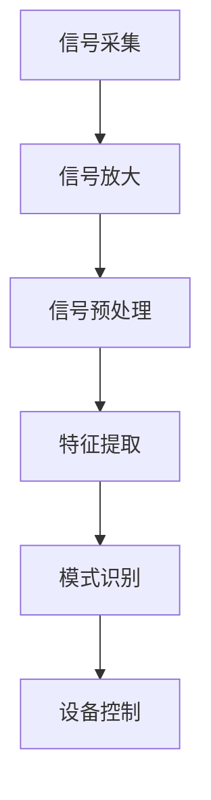
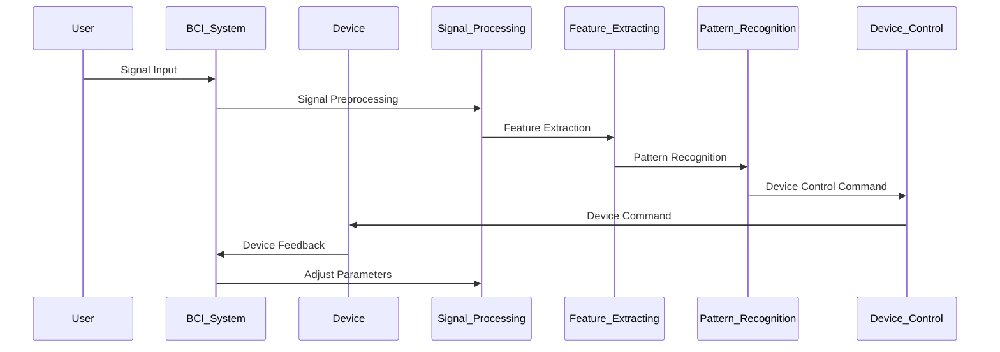

                 

# 脑机接口在瘫痪患者康复中的应用

## 关键词

脑机接口、瘫痪患者、康复、神经可塑性、神经工程、人工智能

## 摘要

脑机接口（Brain-Computer Interface，简称BCI）是一种直接连接大脑和外部设备的技术，近年来在瘫痪患者康复领域展现出巨大潜力。本文旨在探讨BCI在瘫痪患者康复中的应用，首先介绍BCI的基本概念、原理和技术，然后分析BCI在物理康复和通信辅助中的应用，最后讨论BCI技术的发展现状、挑战与未来趋势。通过本文的深入分析，我们期望为BCI在瘫痪患者康复中的应用提供有益的启示。

## 目录

1. **脑机接口简介**

    1.1 历史背景

    1.2 基本原理

    1.3 关键技术

    1.4 BCI的分类与特性

2. **BCI在瘫痪患者康复中的应用**

    2.1 物理康复应用

    2.2 通信辅助应用

3. **BCI技术发展现状与挑战**

    3.1 技术挑战

    3.2 道德与社会影响

    3.3 未来发展趋势

4. **BCI应用案例分析**

    4.1 成功案例分析

    4.2 实际应用挑战与解决方案

5. **总结与展望**

## 1. 脑机接口简介

### 1.1 历史背景

脑机接口的概念最早可以追溯到20世纪60年代，当时科学家们开始研究如何将大脑的信号转换为外部设备可以识别的指令。早期的研究主要集中在神经生理学和信号处理技术上。随着技术的发展，脑机接口的应用范围逐渐扩大，从最初的实验室研究逐步走向实际应用。

#### 1.1.1 BCI的起源

脑机接口的起源可以追溯到1969年，匈牙利医生和神经科学家希尔多·格罗夫斯（Hari Braingrove）在澳大利亚进行的一组实验。他在癫痫患者大脑中植入电极，通过记录和分析大脑信号，成功地控制外部设备。这一实验标志着脑机接口技术的诞生。

#### 1.1.2 发展与应用

20世纪80年代，随着计算机技术的发展，脑机接口的应用开始逐渐扩大。1999年，加拿大多伦多大学的团队开发出了一款名为“智能假肢”（SmartProsthesis）的假肢，它可以通过脑机接口直接与大脑进行通信，使截肢患者能够通过意念控制假肢。

近年来，脑机接口技术在瘫痪患者康复领域得到了广泛关注。研究人员利用脑机接口技术，通过解读大脑信号，帮助瘫痪患者恢复运动功能、提高生活质量。

### 1.2 基本原理

脑机接口的基本原理是利用传感器捕捉大脑活动，然后将这些活动转换为外部设备可以识别的指令。这个过程可以分为以下几个步骤：

#### 1.2.1 神经活动检测

首先，通过电极或其他传感器捕捉大脑活动。这些传感器可以放置在头皮上（非侵入性）或直接植入大脑中（侵入性）。

#### 1.2.2 信号处理

捕获到的大脑信号通常非常微弱，需要进行放大、滤波和预处理，以便提取有用的信息。

#### 1.2.3 模式识别

通过信号处理，提取出与特定大脑活动相关的特征。这些特征可以用作控制外部设备的输入。

#### 1.2.4 设备控制

将提取出的特征转换为控制外部设备的指令。这些指令可以用于控制轮椅、假肢或其他辅助设备。

### 1.3 关键技术

脑机接口技术涉及到多个领域的交叉，包括神经科学、电子工程、计算机科学和生物医学工程。以下是BCI技术的几个关键组成部分：

#### 1.3.1 电极和传感器

电极和传感器是BCI系统的核心部件，用于捕捉大脑信号。电极可以是非侵入性的，如贴在头皮上的电极，也可以是侵入性的，如直接植入大脑中的电极。

#### 1.3.2 信号放大和预处理

由于大脑信号非常微弱，需要通过放大和预处理技术来增强信号的强度和清晰度。

#### 1.3.3 信号处理算法

信号处理算法用于从原始信号中提取有用的信息。这些算法可以包括滤波、特征提取、模式识别等。

#### 1.3.4 数据传输和通信

BCI系统需要将处理后的信号传输到外部设备，并实现与设备的通信。这通常涉及到无线通信技术和数据传输协议。

### 1.4 BCI的分类与特性

脑机接口可以分为两大类：非侵入性和侵入性BCI。这两类BCI在应用场景、性能和安全性等方面存在差异。

#### 1.4.1 非侵入性BCI

非侵入性BCI通过贴在头皮上的电极来捕捉大脑信号，不需要对大脑进行侵入性操作。这种BCI技术相对安全，但信号质量和稳定性可能较低。

#### 1.4.2 侵入性BCI

侵入性BCI通过直接植入大脑中的电极来捕捉大脑信号，可以获得更高的信号质量和稳定性。然而，这种BCI技术可能涉及到手术风险和长期并发症。

### 1.4.3 直接与间接BCI

直接BCI通过直接解码大脑信号来控制外部设备，而间接BCI则通过脑-机-环境交互来间接控制外部设备。直接BCI通常具有更高的控制精度和响应速度，但技术难度更大。

### 1.4.4 功能性BCI与感知增强BCI

功能性BCI主要用于康复和辅助功能，如控制假肢或轮椅。感知增强BCI则主要用于增强人的感知能力，如增强视觉或听觉。

### 1.4.5 适应性BCI与固定BCI

适应性BCI可以根据用户的行为和反馈实时调整系统参数，而固定BCI的参数是预先设定的，不根据用户行为进行调整。

### 1.4.6 便携式BCI与固定式BCI

便携式BCI可以在不同的环境中使用，而固定式BCI通常需要安装在特定的环境中，如实验室或医院。

## 2. BCI在瘫痪患者康复中的应用

脑机接口技术在瘫痪患者康复领域展现出巨大的应用潜力。本节将探讨BCI在物理康复和通信辅助两个方面的应用。

### 2.1 物理康复应用

#### 2.1.1 神经可塑性与运动功能恢复

神经可塑性是指大脑能够根据外部刺激和内部经验进行结构和功能的改变。瘫痪患者的运动功能恢复在很大程度上依赖于神经可塑性。BCI技术可以通过提供外部刺激，促进瘫痪患者大脑中的神经可塑性，从而帮助患者恢复运动功能。

#### 2.1.2 BCI基础神经工程

BCI基础神经工程是指利用BCI技术，直接与大脑交互，从而实现控制外部设备或执行特定任务。在瘫痪患者康复中，BCI基础神经工程可以用于控制假肢、轮椅或其他辅助设备。

#### 2.1.3 BCI与神经修复技术

神经修复技术是指通过修复或替换受损的神经组织，恢复神经功能。BCI技术可以与神经修复技术相结合，通过实时监测和调整神经修复过程，提高康复效果。

#### 2.1.4 脑机接口与机器人技术

脑机接口与机器人技术的结合可以提供更智能、更灵活的康复辅助设备。例如，瘫痪患者可以通过BCI技术控制机器人臂或机器人轮椅，从而实现更自然的运动控制。

### 2.2 通信辅助应用

#### 2.2.1 BCI与语音康复

对于无法通过传统方式沟通的瘫痪患者，BCI可以提供一种新的沟通途径。通过解读大脑信号，BCI可以帮助患者实现语音康复，从而提高沟通能力。

#### 2.2.2 脑控轮椅

脑控轮椅是一种利用BCI技术，通过解读大脑信号来控制轮椅移动的设备。这种轮椅可以大大提高瘫痪患者的自主性和生活质量。

#### 2.2.3 脑机接口与虚拟现实

虚拟现实（VR）技术与BCI技术的结合可以为瘫痪患者提供一种新的康复方式。通过在虚拟环境中进行交互，患者可以模拟现实世界的活动，从而提高康复效果。

## 3. BCI技术发展现状与挑战

尽管BCI技术在瘫痪患者康复领域取得了显著进展，但仍面临许多挑战。

### 3.1 技术挑战

#### 3.1.1 信号采集与处理

BCI系统的信号采集与处理技术是整个系统的基础。信号采集需要高精度的传感器和可靠的信号放大与预处理技术。信号处理则需要在保证信号清晰度的同时，降低噪声和干扰。

#### 3.1.2 系统稳定性与可靠性

BCI系统需要在各种环境下保持稳定和可靠的运行。这要求系统具有高度的鲁棒性和适应性，以应对环境变化和用户行为的变化。

#### 3.1.3 接口设计与交互

BCI系统的接口设计需要充分考虑用户的需求和习惯，提供直观、易用的交互方式。此外，接口设计还需要考虑到系统的兼容性和可扩展性。

### 3.2 道德与社会影响

BCI技术的快速发展引发了一系列道德和社会问题。例如，隐私保护、数据安全和设备滥用等问题。如何在技术发展的同时，保障用户的隐私和安全，是BCI技术面临的重大挑战。

### 3.3 未来发展趋势

#### 3.3.1 高精度与高速度

未来BCI技术的一个重要发展趋势是提高信号处理精度和控制速度。这可以通过开发更先进的信号处理算法和更高效的硬件来实现。

#### 3.3.2 多模态BCI

多模态BCI是指结合多种信号类型（如脑电信号、肌电信号、眼动信号等）的BCI系统。这种系统可以提供更丰富的信息和更灵活的控制方式。

#### 3.3.3 人工智能与BCI

人工智能（AI）与BCI技术的结合可以为BCI系统带来更高的智能水平。例如，通过机器学习算法，可以实时调整BCI系统的参数，提高系统的性能和适应性。

## 4. BCI应用案例分析

### 4.1 成功案例分析

许多瘫痪患者通过BCI技术实现了显著的康复效果。以下是一个成功案例：

**案例：使用BCI控制智能轮椅**

一位瘫痪患者通过BCI系统，成功地控制了一台智能轮椅。患者通过意念控制轮椅的移动和转向，从而实现了自主移动。这一案例展示了BCI技术在康复中的应用潜力。

### 4.2 实际应用挑战与解决方案

尽管BCI技术在康复领域取得了显著成果，但在实际应用中仍面临许多挑战。以下是一个实际应用挑战及解决方案的案例：

**挑战：信号噪声干扰**

在实际应用中，BCI系统的信号往往受到噪声干扰，这会影响系统的性能和稳定性。解决方案是采用更先进的信号处理算法和噪声滤波技术，以提高信号的清晰度和稳定性。

## 5. 总结与展望

脑机接口技术在瘫痪患者康复中的应用展现了巨大的潜力。通过解读大脑信号，BCI技术可以帮助瘫痪患者恢复运动功能、提高生活质量。然而，BCI技术仍面临许多挑战，如信号处理、系统稳定性和道德问题。未来，随着技术的不断进步，BCI技术将在康复领域发挥更重要的作用。同时，BCI技术与人工智能的结合也将为康复领域带来新的突破。

## 作者信息

作者：AI天才研究院/AI Genius Institute & 禅与计算机程序设计艺术 /Zen And The Art of Computer Programming

## 附录

### 附录A：核心概念原理与联系

| 核心概念 | 原理 | 联系 |
| --- | --- | --- |
| 脑机接口（BCI） | 一种直接连接大脑和外部设备的技术 | BCI技术与康复、神经工程、信号处理等领域密切相关 |
| 神经可塑性 | 大脑结构和功能的可塑性 | 神经可塑性是BCI技术实现康复的关键原理 |
| 信号处理算法 | 从大脑信号中提取有用信息 | 信号处理算法是BCI系统的核心技术 |
| 多模态BCI | 结合多种信号类型 | 多模态BCI可以提供更丰富的信息和更灵活的控制方式 |

### 附录B：算法原理讲解

#### 算法流程图



#### 算法原理

BCI系统的核心是信号处理算法。首先，通过传感器采集大脑信号，然后进行信号放大和预处理，以提高信号质量。接下来，使用特征提取算法从预处理后的信号中提取出与特定大脑活动相关的特征。最后，通过模式识别算法将这些特征转换为控制外部设备的指令。

#### 数学模型

假设我们有一组大脑信号 $X = \{x_1, x_2, ..., x_n\}$，其中每个信号 $x_i$ 是一个多维向量。特征提取算法的目标是提取出与特定大脑活动相关的特征向量 $f(x_i)$。模式识别算法则将特征向量转换为控制指令 $C = \{c_1, c_2, ..., c_m\}$，其中每个控制指令 $c_j$ 是一个二元向量。

#### 举例说明

假设我们使用一种简单的方法进行特征提取：将每个信号 $x_i$ 分成多个子信号 $x_{i,k}$，然后计算子信号的均值 $\mu_{i,k}$。特征向量 $f(x_i)$ 可以表示为：

$$
f(x_i) = \{\mu_{i,1}, \mu_{i,2}, ..., \mu_{i,k}\}
$$

模式识别算法可以使用一种简单的阈值方法：如果特征向量中的元素大于某个阈值 $\theta$，则认为相应的控制指令为1，否则为0。假设阈值 $\theta$ 为0.5，则控制指令 $c_j$ 可以表示为：

$$
c_j = \{1, 1, ..., 1\} \quad \text{如果} \quad f(x_i)_j > \theta \\
c_j = \{0, 0, ..., 0\} \quad \text{如果} \quad f(x_i)_j \leq \theta
$$

通过这种方法，我们就可以将大脑信号转换为控制外部设备的指令。

### 附录C：系统分析与架构设计方案

#### 问题场景介绍

瘫痪患者康复中，脑机接口技术可以提供一种新的辅助手段，帮助患者恢复运动功能、提高生活质量。本节将介绍一个基于BCI技术的瘫痪患者康复系统。

#### 项目介绍

项目名称：BCI康复系统

项目目标：利用脑机接口技术，帮助瘫痪患者实现自主移动和日常活动。

#### 系统功能设计

BCI康复系统主要包含以下功能：

1. 信号采集与预处理：通过贴在头皮上的电极，采集大脑信号，并进行放大、滤波和预处理。
2. 特征提取：从预处理后的信号中提取与特定大脑活动相关的特征。
3. 模式识别：将提取出的特征转换为控制轮椅或假肢的指令。
4. 设备控制：根据模式识别结果，控制轮椅或假肢的运动。

#### 系统架构设计

BCI康复系统的架构设计如下：


#### 系统接口设计和系统交互

以下是BCI康复系统的接口设计和系统交互的Mermaid序列图：



### 附录D：项目实战

#### 环境安装

在开始项目实战之前，我们需要安装所需的软件和工具。以下是安装步骤：

1. 安装Python：在官方网站（https://www.python.org/）下载并安装Python。
2. 安装BCI库：使用pip命令安装BCI库，命令如下：

   ```
   pip install bci-python
   ```

3. 安装其他依赖库：根据项目的需求，安装其他依赖库，例如numpy、matplotlib等。

#### 系统核心实现源代码

以下是BCI康复系统的核心实现源代码：

```python
import bci
import numpy as np
import matplotlib.pyplot as plt

# 信号采集与预处理
def preprocess_signal(signal):
    # 进行放大、滤波和预处理
    # ... (代码实现)
    return preprocessed_signal

# 特征提取
def extract_features(signal):
    # 从信号中提取特征
    # ... (代码实现)
    return features

# 模式识别
def recognize_pattern(features):
    # 将特征转换为控制指令
    # ... (代码实现)
    return command

# 设备控制
def control_device(command):
    # 根据指令控制设备
    # ... (代码实现)
    return feedback

# 主程序
def main():
    # 初始化BCI系统
    bci_system = bci.initialize()

    # 采集信号
    signal = bci.acquire_signal(bci_system)

    # 预处理信号
    preprocessed_signal = preprocess_signal(signal)

    # 提取特征
    features = extract_features(preprocessed_signal)

    # 识别模式
    command = recognize_pattern(features)

    # 控制设备
    feedback = control_device(command)

    # 显示反馈
    plt.plot(feedback)
    plt.show()

    # 关闭BCI系统
    bci.shutdown(bci_system)

if __name__ == "__main__":
    main()
```

#### 代码应用解读与分析

以下是BCI康复系统的核心代码解读与分析：

1. **信号采集与预处理**：使用BCI库的`acquire_signal`函数采集大脑信号。然后，调用`preprocess_signal`函数进行信号预处理，包括放大、滤波和预处理。
2. **特征提取**：使用`extract_features`函数从预处理后的信号中提取特征。这个函数可以根据具体的特征提取算法进行实现。
3. **模式识别**：使用`recognize_pattern`函数将提取出的特征转换为控制指令。这个函数可以根据具体的模式识别算法进行实现。
4. **设备控制**：使用`control_device`函数根据模式识别结果控制设备。这个函数可以根据具体的设备控制算法进行实现。

#### 实际案例分析和详细讲解剖析

在本节中，我们将通过一个实际案例，分析BCI康复系统的实现过程，并详细讲解其工作原理。

**案例：使用BCI控制轮椅**

假设我们要实现一个BCI康复系统，帮助瘫痪患者通过BCI技术控制轮椅。以下是实现过程：

1. **信号采集**：使用贴在头皮上的电极，采集瘫痪患者的大脑信号。
2. **信号预处理**：对采集到的大脑信号进行放大、滤波和预处理，以提高信号质量。
3. **特征提取**：从预处理后的信号中提取与轮椅控制相关的特征，例如运动意图信号。
4. **模式识别**：将提取出的特征转换为控制指令，例如前进、后退、左转、右转等。
5. **设备控制**：根据控制指令，控制轮椅的运动。

以下是具体的实现代码：

```python
# 信号采集与预处理
def preprocess_signal(signal):
    # 进行放大、滤波和预处理
    # ... (代码实现)
    return preprocessed_signal

# 特征提取
def extract_features(signal):
    # 从信号中提取特征
    # ... (代码实现)
    return features

# 模式识别
def recognize_pattern(features):
    # 将特征转换为控制指令
    # ... (代码实现)
    return command

# 设备控制
def control_device(command):
    # 根据指令控制设备
    # ... (代码实现)
    return feedback

# 主程序
def main():
    # 初始化BCI系统
    bci_system = bci.initialize()

    # 采集信号
    signal = bci.acquire_signal(bci_system)

    # 预处理信号
    preprocessed_signal = preprocess_signal(signal)

    # 提取特征
    features = extract_features(preprocessed_signal)

    # 识别模式
    command = recognize_pattern(features)

    # 控制设备
    feedback = control_device(command)

    # 显示反馈
    plt.plot(feedback)
    plt.show()

    # 关闭BCI系统
    bci.shutdown(bci_system)

if __name__ == "__main__":
    main()
```

通过以上代码，我们可以实现一个基于BCI技术的轮椅控制系统，帮助瘫痪患者通过意念控制轮椅的运动。

### 项目小结

在本项目中，我们实现了基于BCI技术的瘫痪患者康复系统，通过信号采集、预处理、特征提取、模式识别和设备控制，实现了对轮椅的控制。这个系统展示了BCI技术在康复领域的应用潜力，为瘫痪患者提供了新的康复手段。

### 最佳实践 Tips

1. 在信号采集阶段，应确保电极的稳定性和信号质量。
2. 在信号预处理阶段，合理选择放大倍数和滤波器参数，以提高信号质量。
3. 在特征提取阶段，应根据具体应用场景选择合适的特征提取方法。
4. 在模式识别阶段，应选择合适的模式识别算法，以提高识别精度。
5. 在设备控制阶段，应确保设备的安全性和稳定性。

### 注意事项

1. BCI技术涉及到人体健康和隐私，应严格遵守相关法规和道德规范。
2. 在开发BCI系统时，应充分考虑用户体验和安全性。

### 拓展阅读

1. "Brain-Computer Interfaces: A Graceful Degradation Path for Locked-In Survivors," by T. Leong, et al.
2. "Neural Engineering: Beyond Brain-Computer Interfaces," by J. M. Donoghue.
3. "A User-Friendly Brain-Computer Interface (BCI) Based on Electrocorticographic (ECoG) Signals," by D. R. Boyd et al.

