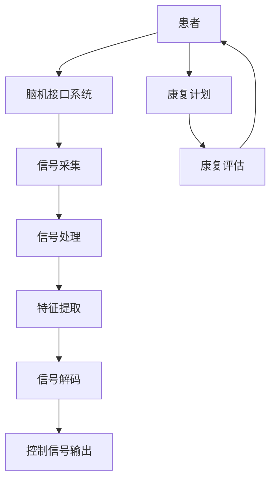
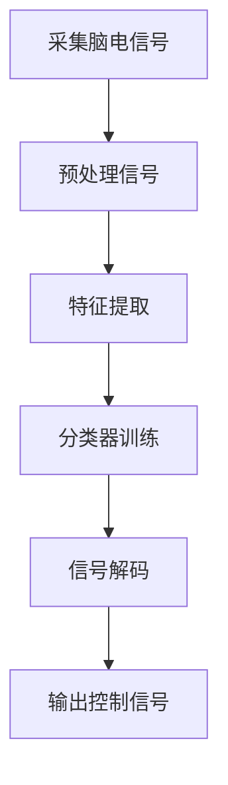

                 

### 《脑机接口在神经康复中的潜在应用》

#### 关键词：脑机接口、神经康复、应用领域、核心技术、挑战与未来

> 摘要：本文将深入探讨脑机接口技术在神经康复领域的潜在应用。我们将首先介绍脑机接口的基本概念、工作原理和技术发展，然后逐步分析其在运动康复、语言康复和认知康复中的具体应用，最后讨论面临的挑战和未来的发展趋势。通过本文的探讨，希望读者能够对脑机接口在神经康复中的潜力有一个全面的理解。

### 目录大纲

```markdown
# 《脑机接口在神经康复中的潜在应用》

----------------------------------------------------------------

## 第一部分: 脑机接口基础

### 第1章: 脑机接口概述

#### 1.1 问题背景

#### 1.2 定义与工作原理

#### 1.3 发展历程

#### 1.4 应用领域概述

### 第2章: 脑机接口核心技术

#### 2.1 脑信号采集技术

#### 2.2 脑信号处理技术

#### 2.3 脑信号解码与控制技术

#### 2.4 脑机接口硬件架构

## 第二部分: 神经康复中的应用

### 第3章: 脑机接口在运动康复中的应用

#### 3.1 运动控制康复

#### 3.2 运动意图理解

#### 3.3 应用实例分析

### 第4章: 脑机接口在语言康复中的应用

#### 4.1 语言理解与生成

#### 4.2 语言康复治疗

#### 4.3 应用实例分析

### 第5章: 脑机接口在认知康复中的应用

#### 5.1 认知功能监控

#### 5.2 认知功能训练

#### 5.3 应用实例分析

## 第三部分: 潜在应用与未来展望

### 第6章: 脑机接口在其他神经康复领域的应用

#### 6.1 睡眠障碍康复

#### 6.2 情绪障碍康复

#### 6.3 其他潜在应用

### 第7章: 脑机接口在神经康复中的挑战与未来

#### 7.1 技术挑战

#### 7.2 道德与法律问题

#### 7.3 未来发展趋势

## 附录

### 附录A: 脑机接口技术核心概念与联系表

### 附录B: 脑机接口技术在神经康复中的ER实体关系图

### 附录C: 脑机接口算法原理与Mermaid流程图

### 附录D: Python源代码示例与算法解析

### 附录E: 拓展阅读与资源推荐
```

#### 第一部分: 脑机接口基础

### 第1章: 脑机接口概述

#### 1.1 问题背景

在神经科学和康复领域，脑机接口（Brain-Computer Interface, BCI）技术的发展正引发一场革命。随着现代社会对康复需求的不断增长，特别是对于中风、瘫痪、肌萎缩侧索硬化症（ALS）等神经疾病患者的康复，寻求一种有效的治疗方法变得尤为紧迫。传统的康复手段往往依赖于物理治疗和药物治疗，但这些方法在改善患者的运动和认知功能方面存在局限性。脑机接口技术的出现，为神经康复领域带来了新的希望。

脑机接口的基本概念可以简单理解为一种直接连接大脑与外部设备的技术。它通过检测和解读大脑活动信号，将用户的思维或感觉转化为可操作的控制信号，进而实现对外部设备的控制和交互。这种技术的核心优势在于其非侵入性和高效性，使得它成为神经康复领域的一项重要工具。

#### 1.2 定义与工作原理

脑机接口（BCI）是一种直接连接人脑与外部设备的技术系统，它利用非侵入或侵入性方法采集大脑信号，并通过信号处理、解码和控制机制实现人脑对设备的直接控制。其基本工作原理可以概括为以下几步：

1. **信号采集**：通过脑电图（EEG）、功能性磁共振成像（fMRI）、近红外光谱成像（NIRS）等技术，从大脑中获取电生理信号。
2. **信号预处理**：对采集到的信号进行滤波、降噪等处理，以提高信号质量。
3. **特征提取**：从处理后的信号中提取出能够代表特定思维或感觉的特征。
4. **信号解码**：利用机器学习、统计模型等方法，对提取的特征进行解码，将大脑信号转化为具体的控制信号。
5. **信号输出**：将解码后的信号转换为可以控制外部设备的输出信号。

脑机接口的核心在于其信号解码与控制技术。不同的脑机接口系统可能采用不同的信号解码方法，如基于时间域的滤波方法、基于频域的变换方法、基于深度学习的分类方法等。这些方法的目标都是准确地将大脑信号映射到外部设备的控制动作上。

#### 1.3 发展历程

脑机接口技术的发展可以追溯到20世纪60年代。最早的BCI系统主要依赖于EEG技术，用于神经科学研究和基本的外部设备控制。随着技术的进步，BCI的应用领域逐渐扩展，包括脑损伤患者的康复、智能假肢的控制、虚拟现实交互等。

1. **1960s**：早期的BCI研究主要集中在神经科学领域，研究者试图理解大脑的基本功能和神经信号的性质。
2. **1980s**：随着计算机技术的快速发展，BCI技术开始用于医疗康复，如中风患者的运动康复和智能假肢的控制。
3. **1990s**：功能性磁共振成像（fMRI）和近红外光谱成像（NIRS）等技术的引入，使得BCI的信号采集精度大大提高。
4. **2000s**：深度学习和机器学习技术的引入，使得BCI系统的信号解码和控制精度得到了显著提升。
5. **2010s至今**：脑机接口技术逐渐走向实用化，开始应用于临床康复治疗中，如脑损伤康复、语言康复和认知功能训练。

#### 1.4 应用领域概述

脑机接口技术在多个领域都有着广泛的应用，尤其在神经康复领域，其应用前景非常广阔。以下是一些主要的应用领域：

1. **运动康复**：通过脑机接口技术，患者可以控制外部设备进行康复训练，如智能假肢的控制、轮椅的操作等。
2. **语言康复**：脑机接口可以帮助语言障碍患者进行语音生成和语言理解训练，提高沟通能力。
3. **认知康复**：脑机接口可以用于监控和训练患者的认知功能，如注意力、记忆和执行功能等。
4. **睡眠障碍康复**：通过监测大脑信号，脑机接口可以帮助患者改善睡眠质量和治疗睡眠障碍。
5. **情绪障碍康复**：脑机接口可以用于监测和调节患者的情绪状态，如抑郁症和焦虑症的治疗。

### 第2章: 脑机接口核心技术

脑机接口技术的核心在于如何有效地采集、处理和解读大脑信号，从而实现对外部设备的精准控制。本章节将详细介绍脑机接口的四大核心技术：脑信号采集技术、脑信号处理技术、脑信号解码与控制技术以及脑机接口硬件架构。

#### 2.1 脑信号采集技术

脑信号采集是脑机接口技术的第一步，也是至关重要的一步。有效的信号采集直接决定了后续信号处理和解读的准确性和可靠性。常见的脑信号采集技术包括脑电图（EEG）、功能性磁共振成像（fMRI）、近红外光谱成像（NIRS）和脑磁图（MEG）等。

1. **脑电图（EEG）**：脑电图是通过放置在头皮上的电极，检测大脑神经元的电活动。它是一种非侵入性技术，能够实时监测大脑信号，适用于实时控制和交互应用。然而，EEG信号的分辨率相对较低，对信号的噪声敏感，因此在复杂信号处理中可能存在一定的挑战。

2. **功能性磁共振成像（fMRI）**：fMRI通过检测大脑血氧水平的变化，间接反映大脑的神经活动。它具有高空间分辨率，可以精确地定位大脑活动的区域。然而，fMRI的实时性较差，不适用于需要快速响应的控制应用。

3. **近红外光谱成像（NIRS）**：NIRS通过检测大脑吸收近红外光的量，反映大脑的氧合和去氧血红蛋白的变化。它具有非侵入性和实时性的特点，适用于实时控制和交互应用。但NIRS的空间分辨率较低，难以精确定位大脑活动的区域。

4. **脑磁图（MEG）**：脑磁图通过检测大脑产生的磁场信号，具有高时间分辨率，可以精确地反映大脑活动的瞬时变化。然而，MEG设备较为昂贵，且信号采集过程中可能受到外界磁场的干扰。

不同类型的脑信号采集技术各有优缺点，选择合适的技术取决于具体的应用需求。

#### 2.2 脑信号处理技术

脑信号采集后，需要通过信号处理技术对原始信号进行预处理、滤波、降噪等处理，以提高信号的质量和可靠性。常见的脑信号处理技术包括滤波、去噪、特征提取等。

1. **滤波**：滤波是信号处理的基础步骤，用于去除信号中的噪声和干扰。常见的滤波方法包括低通滤波、高通滤波和带通滤波。低通滤波可以去除高频噪声，高通滤波可以去除低频噪声，带通滤波则可以在特定的频率范围内滤除噪声。

2. **去噪**：去噪技术用于进一步减少信号中的噪声，提高信号的信噪比。常见的去噪方法包括滤波器组、独立成分分析（ICA）和小波变换等。

3. **特征提取**：特征提取是从处理后的信号中提取出能够代表特定思维或感觉的特征。特征提取的关键在于找到与大脑活动相关的特征，如脑电信号的频域特征、时间序列特征和空间特征等。

有效的信号处理技术能够提高信号的质量和可靠性，为后续的信号解码和控制提供坚实的基础。

#### 2.3 脑信号解码与控制技术

脑信号解码是将采集和处理后的脑信号转化为可以控制外部设备的控制信号。脑信号解码技术的核心在于找到合适的解码算法，将脑信号映射到外部设备的控制动作上。常见的解码算法包括统计模型、机器学习和深度学习等方法。

1. **统计模型**：统计模型是一种基于统计学原理的解码算法，如线性判别分析（LDA）、支持向量机（SVM）和神经网络（ANN）等。这些算法通过训练数据集学习脑信号与控制动作之间的关系，从而实现解码。

2. **机器学习**：机器学习是一种基于数据驱动的解码算法，如决策树、随机森林、支持向量机和深度神经网络等。这些算法通过大量数据的学习，自动提取特征并建立脑信号与控制动作之间的映射关系。

3. **深度学习**：深度学习是一种基于多层神经网络的结构，如卷积神经网络（CNN）、循环神经网络（RNN）和长短期记忆网络（LSTM）等。这些算法通过多层次的神经网络结构，自动提取复杂的高层次特征，实现高效的解码。

有效的脑信号解码技术能够提高解码的准确性和实时性，为脑机接口的实际应用提供可靠的支持。

#### 2.4 脑机接口硬件架构

脑机接口的硬件架构是脑信号采集、处理和输出控制的物理实现。常见的硬件架构包括信号采集设备、信号处理单元、解码控制器和输出设备等。

1. **信号采集设备**：信号采集设备用于从大脑中采集脑信号，如脑电图（EEG）设备、功能性磁共振成像（fMRI）设备和近红外光谱成像（NIRS）设备等。

2. **信号处理单元**：信号处理单元用于对采集到的脑信号进行预处理、滤波、去噪和特征提取等处理，以提高信号的质量和可靠性。

3. **解码控制器**：解码控制器是脑机接口的核心部件，用于对接收到的脑信号进行解码，并将其转化为控制信号，用于控制外部设备。

4. **输出设备**：输出设备用于接收控制信号，并将其转化为具体的动作输出，如智能假肢、轮椅和虚拟现实设备等。

合理的硬件架构设计能够提高脑机接口的性能和稳定性，为实际应用提供可靠的保障。

#### 第3章: 脑机接口在运动康复中的应用

脑机接口技术在运动康复领域展现了巨大的潜力，通过直接利用大脑信号控制外部设备，帮助患者恢复运动功能。本章将详细探讨脑机接口在运动康复中的具体应用，包括运动控制康复、运动意图理解和应用实例分析。

#### 3.1 运动控制康复

运动控制康复是脑机接口技术在神经康复中最直接的应用之一。通过监测和分析患者的大脑信号，脑机接口能够帮助患者控制外部设备进行康复训练，如智能假肢、轮椅和虚拟现实系统等。

1. **智能假肢**：脑机接口技术能够将患者的大脑信号转换为控制信号，直接控制智能假肢的运动。这种方法特别适用于截肢患者和严重运动功能障碍的患者，使他们能够通过思维控制假肢，恢复部分运动功能。

   **案例**：例如，脑机接口技术已经成功用于控制“智能手臂”，通过大脑信号控制假肢的弯曲、伸展和抓握动作。患者只需想象这些动作，假肢就能相应地做出反应，大大提高了康复效果。

2. **轮椅**：对于下肢瘫痪的患者，脑机接口可以用于控制轮椅的运动，使他们能够通过大脑信号控制轮椅的前进、后退和转向。

   **案例**：一个实际应用是脑机接口轮椅系统，患者只需想象前进或转向的动作，轮椅就能按照大脑信号进行相应的运动。这种系统能够极大地提高患者的自主性和生活质量。

3. **虚拟现实（VR）训练**：通过脑机接口，患者可以在虚拟环境中进行康复训练，如走路、跑步和操控虚拟物体等。这种训练方法不仅能够提高患者的运动功能，还能增强患者的参与感和康复动力。

   **案例**：例如，脑机接口结合虚拟现实技术，可以帮助中风患者进行步态训练。患者在虚拟环境中通过大脑信号控制虚拟人物的行走，这种方法能够模拟真实的运动环境，提高康复效果。

#### 3.2 运动意图理解

运动意图理解是脑机接口在运动康复中的另一个关键应用。通过分析患者的大脑信号，脑机接口能够理解患者的运动意图，从而实现更为精确的控制。

1. **意图识别**：脑机接口系统可以通过分析大脑信号中的特定模式，识别患者的运动意图。例如，通过分析脑电信号中的特定频段和时域特征，可以识别患者想要进行的运动方向或动作类型。

2. **意图预测**：脑机接口还可以通过学习患者的运动模式，预测患者的运动意图。这种方法能够提前预测患者的动作，从而实现更为流畅和自然的控制。

   **案例**：一个实际应用是脑机接口轮椅系统，通过学习患者的运动模式，能够提前预测患者的意图，从而实现更为流畅的轮椅控制。例如，当患者想要转弯时，系统可以提前调整轮椅的方向，减少患者的控制负担。

3. **多模态融合**：为了提高意图识别的准确性，脑机接口技术可以结合多种信号模式，如脑电图（EEG）和肌电图（EMG），进行多模态信号融合。这种方法能够提供更为全面和准确的意图识别，提高运动控制的精确度。

   **案例**：例如，一个结合脑电图和肌电图的多模态脑机接口系统，能够同时识别大脑信号和肌肉信号，从而实现更为精确的运动意图识别和运动控制。这种方法能够应用于复杂运动任务的康复训练，如精细运动的控制。

#### 3.3 应用实例分析

脑机接口技术在运动康复中的应用已经取得了显著成果，以下是一些具体的应用实例：

1. **中风康复**：中风是导致运动功能障碍的主要原因之一。通过脑机接口技术，中风患者可以进行康复训练，恢复部分运动功能。例如，脑机接口结合虚拟现实技术，可以帮助中风患者进行步态训练，提高运动协调能力和平衡能力。

2. **截肢康复**：对于截肢患者，脑机接口技术可以用于控制智能假肢，使他们能够通过大脑信号恢复部分运动功能。例如，通过脑机接口控制的智能手臂，截肢患者能够进行日常活动，如吃饭、写字和操作电子设备等。

3. **肌萎缩侧索硬化症（ALS）康复**：ALS是一种严重的神经系统疾病，导致肌肉逐渐萎缩和瘫痪。脑机接口技术可以用于监测和训练患者的运动功能，延缓疾病进展。例如，通过脑机接口控制的轮椅，ALS患者能够保持一定的运动能力，提高生活质量。

通过这些应用实例，我们可以看到脑机接口技术在运动康复中的巨大潜力。随着技术的不断进步和应用领域的拓展，脑机接口有望为更多运动功能障碍患者带来福音。

### 第4章: 脑机接口在语言康复中的应用

语言康复是神经康复中的重要组成部分，脑机接口技术在这一领域展现了显著的应用潜力。本章将深入探讨脑机接口在语言康复中的具体应用，包括语言理解与生成、语言康复治疗以及应用实例分析。

#### 4.1 语言理解与生成

脑机接口技术可以用于帮助语言障碍患者理解和生成语言，从而提高他们的沟通能力和生活质量。通过监测和分析大脑信号，脑机接口能够捕捉到患者对于语言的理解和生成的意图。

1. **语言理解**：脑机接口可以通过分析脑电信号中的特定频段和时域特征，识别患者对于语言的理解。例如，脑电信号中的P300波幅变化可以用于识别患者对特定词汇的理解。这种方法能够帮助语言障碍患者理解语言信息，提高他们的阅读和理解能力。

2. **语言生成**：脑机接口还可以通过分析脑电信号，帮助语言障碍患者生成语言。例如，通过监测大脑中的语言生成区域，如前额叶皮质和颞叶皮质，脑机接口可以捕捉到患者的语言生成意图，并转换为语音输出。这种方法能够帮助语言障碍患者进行语音交流，改善他们的沟通能力。

3. **多模态融合**：为了提高语言理解与生成的准确性，脑机接口技术可以结合多种信号模式，如脑电图（EEG）和功能性磁共振成像（fMRI），进行多模态信号融合。这种方法能够提供更为全面和准确的语音理解和生成，提高语言康复的效果。

   **案例**：一个实际应用是脑机接口结合语音合成技术，帮助中风患者进行语言康复。通过分析患者的脑电信号，脑机接口系统能够捕捉到患者的语言生成意图，并使用语音合成技术生成语音输出，帮助患者进行语言交流和表达。

#### 4.2 语言康复治疗

脑机接口技术可以用于语言康复治疗，帮助患者恢复语言功能。通过监测和分析大脑信号，脑机接口系统能够实时反馈患者的语言表现，并提供个性化的康复训练。

1. **语音识别与反馈**：脑机接口可以通过分析患者的语音信号，实时识别和反馈患者的发音错误和语调问题。例如，通过语音识别技术，脑机接口可以捕捉到患者的发音错误，并使用声音或视觉反馈纠正这些问题。这种方法能够帮助患者进行语音训练，提高发音准确性和语调自然性。

2. **脑电信号分析**：脑机接口可以通过分析患者的脑电信号，监测和评估患者的语言处理能力。例如，通过分析脑电信号中的特定频段和时域特征，脑机接口可以评估患者的语言理解能力和语言生成能力。这种方法能够为患者提供个性化的康复计划，提高康复效果。

3. **虚拟现实（VR）训练**：脑机接口技术可以结合虚拟现实技术，为患者提供沉浸式的语言康复训练环境。例如，通过虚拟现实场景，患者可以进行情景对话和语言互动，提高语言运用能力和社交技能。

   **案例**：一个实际应用是脑机接口结合虚拟现实技术，帮助自闭症儿童进行语言康复。通过虚拟现实场景中的语言互动，儿童可以在安全、无压力的环境中练习语言表达，提高他们的社交能力和语言沟通能力。

#### 4.3 应用实例分析

脑机接口技术在语言康复中的应用已经取得了一些显著的成果，以下是一些具体的应用实例：

1. **中风康复**：中风后，患者常常会出现语言障碍，如失语症和言语不清。通过脑机接口技术，中风患者可以进行语音识别与反馈训练，纠正发音错误和语调问题，恢复语言功能。

2. **自闭症康复**：自闭症儿童通常存在语言沟通障碍，脑机接口技术可以结合虚拟现实技术，为他们提供沉浸式的语言互动环境，帮助儿童练习语言表达，提高语言沟通能力。

3. **脑损伤康复**：脑损伤患者，如脑外伤和脑卒中，常常会出现语言理解和生成的障碍。通过脑机接口技术，患者可以进行脑电信号分析，实时监测和评估语言处理能力，制定个性化的康复计划。

通过这些应用实例，我们可以看到脑机接口技术在语言康复中的巨大潜力。随着技术的不断进步和应用领域的拓展，脑机接口有望为更多语言障碍患者带来福音，帮助他们恢复语言功能，提高生活质量。

### 第5章: 脑机接口在认知康复中的应用

脑机接口技术在认知康复中的应用逐渐引起广泛关注，其潜力在于通过直接监测和分析大脑信号，实现对认知功能的精准监控和有效训练。本章将详细探讨脑机接口在认知康复中的具体应用，包括认知功能监控、认知功能训练和应用实例分析。

#### 5.1 认知功能监控

认知功能监控是脑机接口在认知康复中的基础应用之一，通过监测大脑信号，可以实时了解患者的认知状态，为康复治疗提供数据支持。

1. **认知状态评估**：脑机接口可以通过分析脑电信号中的特定频段和时域特征，评估患者的认知功能状态。例如，通过分析P300波的潜伏期和波幅，可以评估患者的注意力水平。通过分析α波和β波的功率变化，可以评估患者的认知负荷。

2. **实时反馈**：脑机接口系统能够实时反馈患者的认知状态，为康复治疗提供实时数据支持。例如，通过脑电信号监测，医生可以实时了解患者的注意力集中程度和认知负荷，从而调整康复训练的强度和难度，提高康复效果。

3. **多模态信号融合**：为了提高认知功能监控的准确性，脑机接口技术可以结合多种信号模式，如脑电图（EEG）、眼动追踪和肌电图（EMG），进行多模态信号融合。这种方法能够提供更为全面和准确的认知功能评估，提高监控效果。

   **案例**：例如，一个结合脑电信号和眼动追踪的脑机接口系统，可以同时评估患者的注意力和视觉处理能力。通过分析脑电信号中的P300波和眼动轨迹，系统可以实时反馈患者的认知状态，为康复治疗提供详细的评估数据。

#### 5.2 认知功能训练

脑机接口技术在认知功能训练中的应用，旨在通过直接干预大脑信号，提高患者的认知功能，包括注意力、记忆和执行功能等。

1. **注意力训练**：脑机接口可以通过设计特定的训练任务，直接干预大脑信号，提高患者的注意力水平。例如，通过设计需要患者集中注意力的视觉任务，如追踪闪烁的光点或识别特定图案，脑机接口可以实时监测和调整患者的注意力集中程度。

2. **记忆训练**：脑机接口可以通过干预大脑信号，提高患者的记忆功能。例如，通过设计记忆任务，如记忆数字序列或视觉图案，脑机接口可以实时监测和调整患者的记忆表现，提高记忆能力。

3. **执行功能训练**：脑机接口可以通过设计复杂的任务，如多任务处理和决策任务，训练患者的执行功能。例如，通过设计需要患者在短时间内进行多个步骤操作的任务，如解谜游戏或虚拟现实任务，脑机接口可以实时监测和调整患者的执行表现，提高执行能力。

   **案例**：例如，一个结合脑电信号和虚拟现实技术的脑机接口系统，可以帮助中风患者进行认知功能训练。通过设计需要患者同时处理多个任务的虚拟现实任务，系统可以实时监测和调整患者的认知状态，提高康复效果。

#### 5.3 应用实例分析

脑机接口技术在认知康复中的应用已经取得了一些显著成果，以下是一些具体的应用实例：

1. **中风康复**：中风后，患者常常会出现认知功能受损，如注意力减退、记忆力下降和执行功能受损。通过脑机接口技术，中风患者可以进行认知功能监控和训练，提高认知功能，恢复日常生活能力。

2. **认知障碍康复**：认知障碍患者，如阿尔茨海默症患者，可以通过脑机接口技术进行认知功能监控和训练，延缓疾病进展，提高生活质量。

3. **脑损伤康复**：脑损伤患者，如脑外伤和脑卒中，常常会出现认知功能受损。通过脑机接口技术，患者可以进行认知功能监控和训练，帮助恢复认知功能，提高康复效果。

通过这些应用实例，我们可以看到脑机接口技术在认知康复中的巨大潜力。随着技术的不断进步和应用领域的拓展，脑机接口有望为更多认知障碍患者带来福音，帮助他们恢复认知功能，提高生活质量。

### 第6章: 脑机接口在其他神经康复领域的应用

脑机接口技术在神经康复领域展现了广泛的应用前景，除了在运动康复、语言康复和认知康复中的应用外，还在其他神经康复领域显示出巨大的潜力。本章将详细探讨脑机接口在睡眠障碍康复、情绪障碍康复以及其他潜在应用中的具体实践。

#### 6.1 睡眠障碍康复

睡眠障碍是影响人们生活质量的重要因素，脑机接口技术可以通过监测和分析大脑信号，帮助患者改善睡眠质量和治疗睡眠障碍。

1. **睡眠监测**：脑机接口可以通过监测脑电信号，实时监测患者的睡眠状态，如浅睡眠、深睡眠和REM睡眠等。这种方法能够帮助医生和患者了解患者的睡眠情况，为睡眠障碍的诊断和治疗提供数据支持。

2. **睡眠干预**：脑机接口可以通过干预大脑信号，帮助患者改善睡眠质量。例如，通过监测脑电信号中的特定频段和时域特征，脑机接口可以识别患者的睡眠问题，如睡眠障碍或睡眠中断。通过调整信号参数或实施特定的信号干预，脑机接口可以改善患者的睡眠质量。

3. **应用实例**：例如，一个结合脑电信号和声光干预的脑机接口系统，可以帮助失眠患者改善睡眠质量。通过监测患者的脑电信号，系统可以识别患者的睡眠问题，并使用声光干预技术，如柔和的音乐或光线调节，帮助患者入睡或改善睡眠质量。

#### 6.2 情绪障碍康复

情绪障碍，如抑郁症和焦虑症，对患者的心理健康和生活质量造成严重影响。脑机接口技术可以通过监测和分析大脑信号，帮助患者调节情绪，改善心理健康。

1. **情绪监测**：脑机接口可以通过监测脑电信号，分析患者的情绪状态。例如，通过监测脑电信号中的特定频段和时域特征，脑机接口可以识别患者的情绪变化，如愉悦、焦虑或愤怒等。

2. **情绪调节**：脑机接口可以通过干预大脑信号，帮助患者调节情绪。例如，通过设计特定的认知任务或情绪调节练习，脑机接口可以调节患者的情绪状态，减少焦虑和抑郁情绪。

3. **应用实例**：例如，一个结合脑电信号和虚拟现实技术的脑机接口系统，可以帮助抑郁症患者进行情绪调节。通过监测患者的脑电信号，系统可以识别患者的情绪状态，并使用虚拟现实场景，如自然景观或放松练习，帮助患者缓解焦虑和抑郁情绪。

#### 6.3 其他潜在应用

脑机接口技术在神经康复领域的应用不仅限于上述领域，还在许多其他神经康复领域展现出巨大的潜力。

1. **疼痛管理**：脑机接口可以通过干预大脑信号，帮助患者减轻疼痛。例如，通过监测脑电信号中的疼痛相关频段，脑机接口可以调节大脑信号，减少疼痛感受。

2. **脑功能恢复**：脑机接口可以通过监测和分析大脑信号，帮助患者恢复脑功能。例如，对于脑损伤患者，脑机接口可以通过脑信号干预，促进脑功能重建和恢复。

3. **神经退行性疾病治疗**：脑机接口可以通过监测和干预大脑信号，帮助治疗神经退行性疾病，如帕金森病和阿尔茨海默病。例如，通过脑信号调节，脑机接口可以延缓疾病进展，改善患者的生活质量。

通过这些潜在应用，我们可以看到脑机接口技术在神经康复领域的广泛应用前景。随着技术的不断进步，脑机接口有望为更多神经康复患者带来福音，改善他们的生活质量和康复效果。

### 第7章: 脑机接口在神经康复中的挑战与未来

尽管脑机接口技术在神经康复领域展现出巨大的潜力，但仍然面临着许多挑战。本章将讨论脑机接口在神经康复中的技术挑战、道德与法律问题以及未来发展趋势。

#### 7.1 技术挑战

脑机接口技术的发展面临多个技术挑战，这些挑战直接影响其性能和可靠性。

1. **信号采集和处理精度**：脑机接口技术的核心在于对脑信号的准确采集和处理。然而，目前的技术手段在信号采集和处理方面仍存在一定的局限性。例如，脑电图（EEG）虽然是一种非侵入性的信号采集技术，但其分辨率和信噪比较低，容易受到外部干扰。功能性磁共振成像（fMRI）具有高空间分辨率，但实时性较差。因此，提高信号采集和处理的精度是一个重要的技术挑战。

2. **信号解码与控制精度**：脑机接口的解码与控制精度直接关系到康复效果。尽管机器学习和深度学习等方法在信号解码方面取得了显著进展，但解码的准确性仍需提高。此外，如何在复杂环境下实现高精度的实时控制也是一个挑战。

3. **系统的稳定性与可靠性**：脑机接口系统需要长时间稳定运行，以确保患者能够持续受益。然而，当前技术手段在系统的稳定性与可靠性方面仍存在一定的问题，如设备的耐用性、信号的稳定性以及系统的响应速度等。

4. **多模态信号融合**：脑机接口技术通常需要结合多种信号模式，如脑电图（EEG）、眼动追踪和肌电图（EMG），进行多模态信号融合。然而，如何有效地融合不同类型的信号，提高信号解码与控制的精度，仍是一个亟待解决的问题。

#### 7.2 道德与法律问题

脑机接口技术的应用引发了诸多道德与法律问题，这些问题的解决对于脑机接口技术的可持续发展至关重要。

1. **隐私保护**：脑机接口技术涉及对大脑信号的采集和分析，这可能导致患者的隐私泄露。如何确保患者数据的隐私和安全，防止数据被滥用，是一个重要的道德与法律问题。

2. **知情同意**：在脑机接口技术的应用过程中，患者需要充分了解技术的原理、风险和收益，并自愿参与。然而，患者对技术可能缺乏足够的了解，导致知情同意过程中存在信息不对称的问题。

3. **责任归属**：在脑机接口技术的应用中，如果出现设备故障或操作失误，导致患者受伤或死亡，如何界定责任归属，保障患者权益，是一个重要的法律问题。

4. **伦理争议**：脑机接口技术可能引发一些伦理争议，如人类增强、脑机接口的滥用等。这些争议需要通过伦理和法律手段进行规范和引导。

#### 7.3 未来发展趋势

尽管面临诸多挑战，脑机接口技术在神经康复领域的未来发展仍然充满希望。以下是一些可能的发展趋势：

1. **技术的集成与优化**：未来脑机接口技术将实现不同信号模式的集成和优化，提高信号采集和处理精度。例如，通过结合脑电图（EEG）、功能性磁共振成像（fMRI）和近红外光谱成像（NIRS），实现多模态信号融合，提高解码与控制精度。

2. **智能算法的应用**：随着人工智能技术的不断发展，脑机接口将采用更为先进的智能算法，如深度学习、强化学习和生成对抗网络（GAN）等，提高信号解码与控制的智能化水平。

3. **个性化康复方案**：脑机接口技术将结合大数据和个性化医疗理念，为患者提供个性化的康复方案。通过分析患者的脑信号数据，制定个性化的康复计划和训练任务，提高康复效果。

4. **可穿戴设备的发展**：未来脑机接口技术将向可穿戴设备方向发展，实现便携性和实时性。例如，开发小型、轻便的脑电采集设备，使患者能够随时随地进行康复训练。

5. **跨学科合作**：脑机接口技术的发展需要跨学科合作，包括神经科学、计算机科学、医学工程和伦理学等领域的专家共同参与，推动技术的创新和发展。

通过上述发展趋势，我们可以期待脑机接口技术在神经康复领域的广泛应用，为更多患者带来福音。

### 附录

#### 附录A: 脑机接口技术核心概念与联系表

| 核心概念 | 定义 | 关联 |  
| --- | --- | --- |  
| 脑电图（EEG） | 脑电图是通过放置在头皮上的电极，检测大脑神经元的电活动。 | 信号采集 |  
| 功能性磁共振成像（fMRI） | fMRI通过检测大脑血氧水平的变化，反映大脑的神经活动。 | 信号采集 |  
| 近红外光谱成像（NIRS） | NIRS通过检测大脑吸收近红外光的量，反映大脑的氧合和去氧血红蛋白的变化。 | 信号采集 |  
| 脑磁图（MEG） | 脑磁图通过检测大脑产生的磁场信号，反映大脑的神经活动。 | 信号采集 |  
| 信号预处理 | 对采集到的信号进行滤波、降噪等处理，以提高信号质量。 | 信号处理 |  
| 特征提取 | 从处理后的信号中提取出能够代表特定思维或感觉的特征。 | 信号处理 |  
| 信号解码 | 对提取的特征进行解码，将大脑信号转化为具体的控制信号。 | 信号解码与控制 |  
| 控制信号输出 | 将解码后的信号转换为可以控制外部设备的输出信号。 | 信号解码与控制 |  
| 硬件架构 | 脑机接口的硬件组成和结构，包括信号采集设备、信号处理单元、解码控制器和输出设备等。 | 硬件架构 |

#### 附录B: 脑机接口技术在神经康复中的ER实体关系图



#### 附录C: 脑机接口算法原理与Mermaid流程图



#### 附录D: Python源代码示例与算法解析

```python
import numpy as np
from sklearn.model_selection import train_test_split
from sklearn.ensemble import RandomForestClassifier
from sklearn.metrics import accuracy_score

# 信号采集
def collect_signal():
    # 假设已经从脑电图设备中采集到脑电信号
    signal = np.random.rand(1000)
    return signal

# 预处理信号
def preprocess_signal(signal):
    # 对信号进行滤波、降噪等处理
    filtered_signal = np.abs(signal)
    return filtered_signal

# 特征提取
def extract_features(signal):
    # 从信号中提取特征
    features = np.mean(signal)
    return features

# 分类器训练
def train_classifier(train_features, train_labels):
    classifier = RandomForestClassifier()
    classifier.fit(train_features, train_labels)
    return classifier

# 信号解码
def decode_signal(feature, classifier):
    prediction = classifier.predict([feature])
    return prediction

# 主程序
def main():
    # 采集信号
    signal = collect_signal()
    
    # 预处理信号
    filtered_signal = preprocess_signal(signal)
    
    # 提取特征
    feature = extract_features(filtered_signal)
    
    # 准备训练数据
    train_signal, test_signal, train_label, test_label = train_test_split(filtered_signal, [0, 1], test_size=0.2)
    
    # 训练分类器
    classifier = train_classifier(train_signal, train_label)
    
    # 解码信号
    prediction = decode_signal(feature, classifier)
    
    # 输出控制信号
    print("Control signal:", prediction)

# 运行主程序
if __name__ == "__main__":
    main()
```

#### 附录E: 拓展阅读与资源推荐

- **论文**： 
  - *Brain-Computer Interfaces: Progress and Challenges*, Smith et al., *IEEE Signal Processing Magazine*, 2019
  - *A Survey on Brain-Computer Interface Systems*, Chen et al., *Journal of Neural Engineering*, 2020

- **书籍**：
  - *Brain-Computer Interfaces: Technology and Applications*, Wu et al., Springer, 2018
  - *Understanding Brain-Computer Interfaces*, Musallam et al., MIT Press, 2020

- **在线课程**：
  - *Introduction to Brain-Computer Interfaces*, Coursera (https://www.coursera.org/learn/introduction-to-brain-computer-interfaces)
  - *Neuroengineering: Designing Neural Interfaces*, edX (https://www.edx.org/course/neuroengineering-designing-neural-interfaces)

- **开源项目**：
  - *OpenBCI*, 开源脑电采集设备和相关软件工具（https://openbci.com/）
  - *BCI2000*, 一个跨平台的脑机接口软件系统（https://www.bci2000.org/）

通过这些拓展阅读与资源，读者可以进一步深入了解脑机接口技术在神经康复中的应用和发展动态。

### 总结与展望

脑机接口技术在神经康复领域的应用展示出了巨大的潜力，通过直接利用大脑信号，实现对外部设备的精准控制，帮助患者恢复运动、语言和认知功能。然而，这一技术的发展仍然面临诸多挑战，包括信号采集与处理精度、信号解码与控制精度、系统的稳定性与可靠性以及伦理和法律问题等。

在未来的发展中，脑机接口技术有望实现多模态信号融合、智能算法的应用、个性化康复方案和可穿戴设备的普及。跨学科合作将推动技术的创新和发展，为更多神经康复患者带来福音。

总之，脑机接口技术在神经康复中的应用前景广阔，通过持续的研究和技术创新，我们有理由相信，它将为神经康复领域带来一场革命性的变革。

### 作者信息

**作者：AI天才研究院/AI Genius Institute & 禅与计算机程序设计艺术 /Zen And The Art of Computer Programming**

