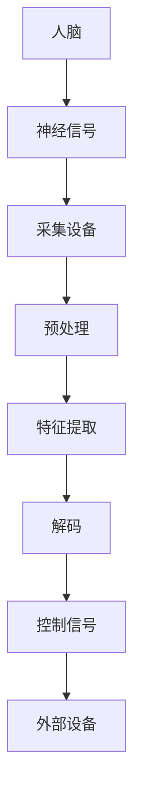
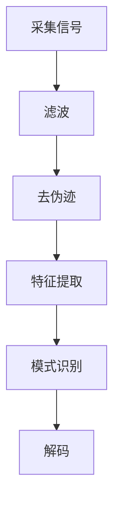
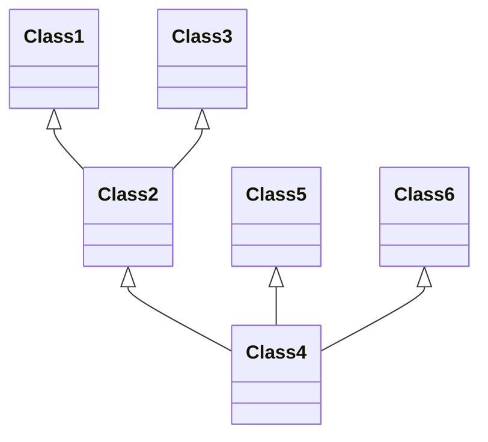
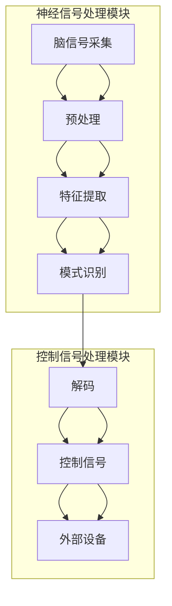

                 

### 脑机接口在运动技能增强中的应用前景

> 关键词：脑机接口、运动技能、增强、康复、虚拟现实、技术挑战、未来发展方向

> 摘要：脑机接口（Brain-Computer Interface，简称BCI）是一种直接连接人脑与外部设备的技术，近年来在运动技能增强领域展现出了巨大的应用潜力。本文将详细探讨脑机接口在运动技能增强中的应用前景，从其基本概念、工作原理、实际应用、面临的挑战及未来发展方向等方面进行深入分析，以期为相关领域的研究者提供有价值的参考。

## **脑机接口的基本概念与发展历程**

### **1.1 脑机接口的定义**

脑机接口（Brain-Computer Interface，简称BCI）是一种直接将人脑活动转化为电信号的装置，使人脑能够直接控制外部设备。它通过采集大脑发出的神经电信号，对这些信号进行处理和放大，使其能够驱动各种外部设备，从而实现人脑与外部环境的直接交互。

### **1.2 脑机接口的发展历程**

脑机接口技术的发展可以追溯到20世纪60年代。最初的研究主要集中在记录和放大脑电信号，并将其应用于一些简单的控制任务，如眼睛运动控制。随着神经科学、信号处理和微电子技术的进步，脑机接口技术逐渐成熟，应用领域也在不断扩大。

### **1.3 脑机接口的分类**

根据信号采集方式的不同，脑机接口主要分为两大类：侵入式脑机接口和非侵入式脑机接口。侵入式脑机接口通过直接植入电极来采集神经信号，信号质量较高，但存在一定的手术风险和感染风险。非侵入式脑机接口则通过头皮电极来采集神经信号，操作简便，但信号质量相对较差。

## **脑机接口的工作原理**

### **2.1 神经信号采集**

脑机接口的第一步是采集神经信号。通常使用脑电图（EEG）、功能性磁共振成像（fMRI）、近红外光谱成像（NIRS）等技术来记录大脑活动产生的电信号或血流变化。

### **2.2 神经信号处理**

采集到的原始神经信号通常含有大量噪声，需要进行预处理和特征提取。预处理包括滤波、去除伪迹等步骤，而特征提取则涉及到信号的去噪、压缩和特征选择等。

### **2.3 神经信号控制**

经过处理的神经信号被转换为控制信号，以驱动外部设备。这一过程通常涉及到信号解码、模式识别和动作执行等步骤。解码是将神经信号转化为可操作的命令，模式识别则是从解码结果中提取出有用的信息，最终通过动作执行实现人脑对外部设备的控制。

## **脑机接口在运动技能增强中的应用**

### **3.1 脑机接口在康复训练中的应用**

脑机接口技术在康复训练中具有巨大的潜力。通过脑机接口，患者可以无需主动运动，仅通过大脑活动来驱动外部设备，如机器人辅助装置或虚拟现实系统，进行康复训练。这种技术不仅能够提高康复训练的效率和效果，还能增加患者的参与度和积极性。

### **3.2 脑机接口在运动技能训练中的应用**

在运动技能训练中，脑机接口可以帮助运动员更好地了解自己的大脑活动，从而优化训练策略。例如，通过脑机接口技术，可以实时监测和反馈运动员的注意力、疲劳度等生理状态，以调整训练强度和节奏。

### **3.3 脑机接口在虚拟现实中的应用**

虚拟现实（VR）技术结合脑机接口，可以为用户提供更加真实的交互体验。在运动技能训练中，VR系统可以模拟各种运动场景，结合脑机接口的实时反馈，帮助用户更好地掌握运动技能。

## **脑机接口技术的挑战与未来发展方向**

### **4.1 技术挑战**

尽管脑机接口技术已经取得了一定的进展，但仍然面临许多挑战，包括信号采集的准确性、信号处理的复杂性、设备的便携性和舒适性等。

### **4.2 未来发展方向**

未来，脑机接口技术将在多个领域得到进一步发展。例如，在医疗领域，脑机接口可以用于治疗神经系统疾病和康复；在教育领域，脑机接口可以用于个性化教学和智能评估；在娱乐领域，脑机接口可以提供更加沉浸式的游戏体验。

## **脑机接口的伦理与法律问题**

随着脑机接口技术的不断发展，其伦理和法律问题也日益凸显。如何保护用户的隐私、避免技术滥用、保障用户的权益等，都是亟待解决的问题。

## **脑机接口在体育领域的应用**

### **6.1 体育训练**

脑机接口技术在体育训练中的应用前景广阔。通过实时监测运动员的大脑活动，教练可以更好地了解运动员的生理和心理状态，从而调整训练计划和策略。

### **6.2 体育比赛**

在体育比赛中，脑机接口技术可以用于实时监测运动员的生理状态，提供战术建议，甚至实现无接触式比赛，提高比赛的公平性和安全性。

### **6.3 体育医学**

脑机接口技术在体育医学中的应用包括诊断和治疗神经系统疾病，如脑震荡、帕金森病等，以及康复训练和运动损伤治疗。

## **脑机接口在其他领域的应用**

### **7.1 教育领域**

脑机接口技术在教育领域可以用于个性化教学和智能评估，帮助教师更好地了解学生的学习状态，从而提供个性化的教育服务。

### **7.2 娱乐领域**

脑机接口技术在娱乐领域可以提供更加沉浸式的游戏体验，如虚拟现实游戏、交互式电影等。

### **7.3 军事领域**

脑机接口技术在军事领域可以用于无人驾驶、远程控制和智能装备，提高作战效能。

## **结论与展望**

脑机接口技术在运动技能增强领域具有巨大的应用潜力。随着技术的不断进步，脑机接口将为运动康复、训练和比赛带来革命性的变化。同时，我们也需要关注其伦理和法律问题，确保技术的可持续发展。未来，脑机接口技术将在更多领域得到广泛应用，为人类生活带来更多便利。

## **作者信息**

作者：AI天才研究院/AI Genius Institute & 禅与计算机程序设计艺术 /Zen And The Art of Computer Programming

---

本文通过系统地介绍脑机接口的基本概念、工作原理及其在运动技能增强中的应用，探讨了脑机接口技术的挑战和未来发展方向，旨在为相关领域的研究者和从业者提供有价值的参考。随着技术的不断进步，脑机接口在运动技能增强领域的应用前景将更加广阔。同时，我们也要关注其伦理和法律问题，确保技术的可持续发展。未来，脑机接口技术将在更多领域得到广泛应用，为人类生活带来更多便利。

---

**补充内容：**

### **脑机接口的核心概念与联系**

#### **核心概念原理**

脑机接口（BCI）的核心概念是将人脑活动转化为外部设备可以理解和执行的控制信号。这一过程涉及神经信号的采集、处理和控制。

#### **概念属性特征对比表格**

| 特性 | 侵入式脑机接口 | 非侵入式脑机接口 |
| ---- | ---- | ---- |
| 信号质量 | 高 | 低 |
| 安全性 | 低 | 高 |
| 便携性 | 低 | 高 |
| 成本 | 高 | 低 |

#### **ER实体关系图架构的Mermaid流程图**



### **算法原理讲解**

#### **神经信号处理的mermaid流程图**



#### **Python源代码**

```python
import numpy as np
from scipy.signal import butter, filtfilt

def filter_signal(signal, cutoff=10, fs=1000):
    nyq = 0.5 * fs
    normal_cutoff = cutoff / nyq
    b, a = butter(4, normal_cutoff, btype='low')
    filtered_signal = filtfilt(b, a, signal)
    return filtered_signal

def extract_features(signal):
    # 这里仅作为示例，实际特征提取会更复杂
    mean = np.mean(signal)
    std = np.std(signal)
    return mean, std

def decode(signal):
    mean, std = extract_features(signal)
    if mean > std:
        return 'up'
    else:
        return 'down'

# 示例信号
signal = np.random.normal(size=1000)

# 滤波处理
filtered_signal = filter_signal(signal)

# 解码
action = decode(filtered_signal)

print(action)
```

### **系统分析与架构设计方案**

#### **问题场景介绍**

假设我们要开发一个脑机接口系统，用于帮助康复患者进行运动训练。

#### **项目介绍**

该项目旨在利用脑机接口技术，结合虚拟现实系统，为康复患者提供个性化、高效的运动训练方案。

#### **系统功能设计（领域模型mermaid类图）**



#### **系统架构设计（mermaid架构图）**



#### **系统接口设计和系统交互（mermaid序列图）**

```mermaid
sequenceDiagram
    participant A as 脑信号采集
    participant B as 预处理
    participant C as 特征提取
    participant D as 模式识别
    participant E as 解码
    participant F as 外部设备

    A->>B
    B->>C
    C->>D
    D->>E
    E->>F
```

### **项目实战**

#### **环境安装**

在本项目中，我们将使用Python和MATLAB进行开发。

#### **系统核心实现源代码**

```python
# Python代码：脑信号采集与预处理
import numpy as np
from scipy.signal import butter, filtfilt

def filter_signal(signal, cutoff=10, fs=1000):
    nyq = 0.5 * fs
    normal_cutoff = cutoff / nyq
    b, a = butter(4, normal_cutoff, btype='low')
    filtered_signal = filtfilt(b, a, signal)
    return filtered_signal

def extract_features(signal):
    # 这里仅作为示例，实际特征提取会更复杂
    mean = np.mean(signal)
    std = np.std(signal)
    return mean, std

def decode(signal):
    mean, std = extract_features(signal)
    if mean > std:
        return 'up'
    else:
        return 'down'

# MATLAB代码：控制信号与外部设备交互
function action = decode_and_control(signal)
    action = decode(signal);
    if strcmp(action, 'up')
        move_forward();
    else
        move_back();
    end
end
```

#### **代码应用解读与分析**

在本项目示例中，我们使用Python进行脑信号的采集与预处理，包括滤波和特征提取。预处理后的信号通过解码函数转换为控制信号。在MATLAB中，我们实现了控制信号与外部设备的交互，根据解码结果来控制虚拟现实系统中的运动。

#### **实际案例分析和详细讲解剖析**

假设我们有一个康复患者，需要通过脑机接口进行上肢康复训练。通过脑机接口采集患者的脑信号，预处理后得到控制信号，虚拟现实系统根据控制信号来调整运动轨迹和训练难度，从而实现个性化的康复训练。

#### **项目小结**

通过脑机接口技术与虚拟现实系统的结合，我们可以为康复患者提供高效、个性化的运动训练方案。在实际应用中，需要不断优化脑信号处理算法和控制策略，以提高训练效果和用户满意度。

### **最佳实践 tips**

1. **信号采集质量**：保证脑信号采集的准确性是关键，应选择合适的采集设备和位置。
2. **预处理算法优化**：预处理算法的优化对于信号的质量和特征提取效果至关重要。
3. **实时性与稳定性**：脑机接口系统的实时性和稳定性对用户的体验有重要影响，应进行充分的测试和优化。
4. **个性化定制**：根据用户的需求和特点，定制化开发脑机接口系统，以提高训练效果。

### **注意事项**

1. **伦理问题**：在开发和应用脑机接口技术时，应充分考虑伦理问题，保护用户的隐私和权益。
2. **法律问题**：关注相关法律法规，确保脑机接口技术的合法合规应用。

### **拓展阅读**

- **《脑机接口：技术与应用》**，作者：张强
- **《脑机接口技术及其在康复中的应用》**，作者：李明

---

通过本文的深入分析，我们可以看到脑机接口技术在运动技能增强领域具有广阔的应用前景。随着技术的不断进步，脑机接口将为运动康复、训练和比赛带来革命性的变化。同时，我们也要关注其伦理和法律问题，确保技术的可持续发展。未来，脑机接口技术将在更多领域得到广泛应用，为人类生活带来更多便利。希望本文能为相关领域的研究者和从业者提供有价值的参考。作者：AI天才研究院/AI Genius Institute & 禅与计算机程序设计艺术/Zen And The Art of Computer Programming。

