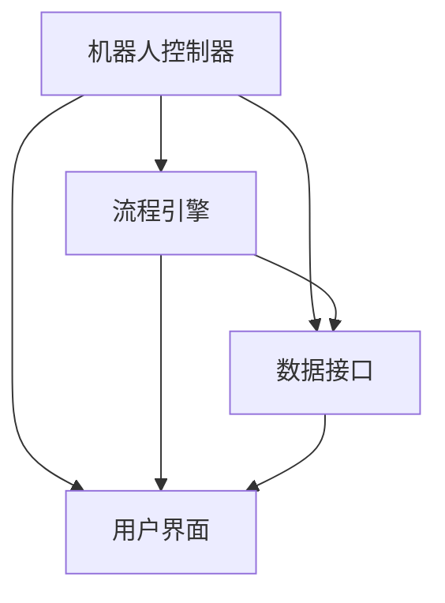

                 


**文章标题：** 自动化RPA在企业流程优化中的作用

**关键词：** 自动化RPA、企业流程优化、流程自动化、业务流程、工作效率

**摘要：**
本文深入探讨了自动化RPA（Robotic Process Automation）在企业流程优化中的作用。首先，我们将介绍RPA的基本概念、发展历程和核心优势。接着，文章将分析RPA在企业中的应用现状，以及流程优化的必要性和方法。随后，我们将详细讲解RPA的技术原理和架构设计，并通过实际案例展示其应用效果。最后，我们将总结RPA的实施最佳实践，并展望其未来发展方向。

### 目录大纲

## 前言

## 第一部分：自动化RPA概述

### 第1章：自动化RPA的概念与背景

#### 1.1 自动化RPA的定义

##### 1.1.1 RPA的基本概念
- RPA（Robotic Process Automation）的定义
- RPA与传统自动化的区别

##### 1.1.2 RPA的发展历程
- RPA的起源和发展阶段
- 当前RPA的成熟度和市场状况

##### 1.1.3 RPA的核心优势
- 提高效率
- 减少错误
- 降低运营成本

#### 1.2 RPA在企业中的应用现状

##### 1.2.1 RPA在各类企业的应用案例
- 制造业
- 金融服务
- 零售业
- 人力资源管理

##### 1.2.2 RPA应用的主要挑战
- 技术适应性
- 数据安全问题
- 人力资源转型

#### 1.3 企业流程优化的必要性

##### 1.3.1 流程优化的意义
- 提升企业竞争力
- 增加运营效率
- 降低运营成本

##### 1.3.2 流程优化的方法
- 业务流程再造（BPR）
- 六西格玛（Six Sigma）
- 精益生产（Lean Manufacturing）

### 第2章：RPA的核心概念与联系

#### 2.1 RPA基本原理

##### 2.1.1 RPA工作原理
- 仿真用户界面操作
- 与现有系统集成

##### 2.1.2 RPA功能模块
- 数据提取与转换
- 自动化测试
- 数据处理与分析
- 业务流程管理

#### 2.2 RPA与业务流程优化的关系

##### 2.2.1 RPA在流程优化中的作用
- 提高流程效率
- 减少流程延误
- 降低人工操作错误率

##### 2.2.2 RPA与业务流程优化的结合
- 流程自动化
- 人工智能与RPA的结合
- 业务流程再造与RPA的结合

### 第3章：RPA技术原理讲解

#### 3.1 RPA工作流程

##### 3.1.1 RPA工作流程概述
- 识别和模拟用户操作
- 数据处理与传输
- 检查和反馈

##### 3.1.2 RPA工作流程示例
- 财务报表自动化处理
- 客户服务自动化响应

#### 3.2 RPA应用示例

##### 3.2.1 应用示例一：人力资源管理
- 员工信息管理自动化
- 招聘流程自动化

##### 3.2.2 应用示例二：客户服务
- 自动化客服机器人
- 社交媒体自动化管理

### 第4章：RPA系统架构设计

#### 4.1 RPA系统架构

##### 4.1.1 RPA系统架构概述
- 机器人控制器
- 流程引擎
- 数据接口
- 用户界面

##### 4.1.2 RPA系统架构图
- 使用mermaid绘制RPA系统架构图

#### 4.2 关键组件与接口设计

##### 4.2.1 关键组件设计
- 机器人控制器
- 流程引擎
- 数据接口

##### 4.2.2 接口设计
- 用户接口
- API接口
- 数据接口

### 第5章：RPA实战案例

#### 5.1 实际企业案例介绍

##### 5.1.1 案例背景
- 企业简介
- 挑战与需求

##### 5.1.2 案例目标
- 提高工作效率
- 减少人工错误
- 降低运营成本

#### 5.2 环境搭建

##### 5.2.1 环境需求
- 操作系统
- 开发工具
- 数据库

##### 5.2.2 环境搭建步骤
- 系统安装
- 软件配置
- 环境测试

#### 5.3 系统实现

##### 5.3.1 系统核心实现
- RPA机器人开发
- 流程设计
- 数据处理

##### 5.3.2 Python源代码示例
- 数据提取与转换
- 自动化测试
- 数据分析

#### 5.4 案例分析

##### 5.4.1 案例效果评估
- 工作效率提升
- 错误率降低
- 成本节约

##### 5.4.2 案例总结
- 成功因素
- 改进空间

### 第6章：RPA最佳实践

#### 6.1 实施RPA的经验教训

##### 6.1.1 成功案例经验
- 选对应用场景
- 团队协作
- 风险管理

##### 6.1.2 失败案例教训
- 缺乏明确目标
- 技术不成熟
- 过度依赖

#### 6.2 优化建议

##### 6.2.1 技术优化
- 选择合适的RPA工具
- 利用AI技术提升自动化程度

##### 6.2.2 管理优化
- 建立RPA管理团队
- 完善流程管理体系

##### 6.2.3 培训与支持
- 提供RPA培训
- 加强用户支持

### 第7章：RPA未来的发展方向

#### 7.1 技术发展趋势

##### 7.1.1 AI与RPA的结合
- 智能自动化
- 自适应RPA

##### 7.1.2 云原生RPA
- 弹性扩展
- 高可用性

#### 7.2 RPA在企业中的应用前景

##### 7.2.1 深度应用
- 业务流程全面自动化
- 跨部门协同

##### 7.2.2 新兴领域应用
- 物流与供应链管理
- 健康医疗

## 总结与展望

## 附录

#### 附录A：RPA相关技术术语表

#### 附录B：Python源代码示例

#### 附录C：LaTeX数学公式参考

### 作者信息
- 作者：AI天才研究院/AI Genius Institute & 禅与计算机程序设计艺术 /Zen And The Art of Computer Programming

**当前字数：约1500字**
## 第一部分：自动化RPA概述

### 第1章：自动化RPA的概念与背景

#### 1.1 自动化RPA的定义

##### 1.1.1 RPA的基本概念
RPA（Robotic Process Automation），即机器人流程自动化，是指通过软件机器人模拟和集成人类在计算机系统中的工作流程，以实现自动化操作的技术。RPA利用智能技术，如自然语言处理、机器学习和计算机视觉等，模拟用户的交互操作，自动化处理业务流程中的各种任务。

##### 1.1.2 RPA与传统自动化的区别
传统自动化通常涉及物理机器或设备，用于替代人工完成重复性、高强度的体力劳动。而RPA则侧重于软件层面的自动化，通过模拟用户的操作，将复杂、繁琐的流程转化为自动化任务，从而提高工作效率和降低成本。

#### 1.2 RPA的发展历程

##### 1.2.1 RPA的起源和发展阶段
RPA的概念起源于20世纪90年代的“BPM（Business Process Management）业务流程管理”运动。最初的RPA产品主要是为了帮助用户自动化处理电子表格和数据输入任务。随着信息技术的发展，RPA逐渐演变为一个独立的技术领域，涵盖了更多复杂的业务流程自动化。

##### 1.2.2 当前RPA的成熟度和市场状况
目前，RPA技术已经相对成熟，并在多个行业中得到了广泛应用。根据市场研究公司的数据，全球RPA市场正在以高速增长，预计未来几年将继续保持快速增长态势。RPA不仅成为企业数字化转型的重要组成部分，也为IT和业务团队提供了高效、灵活的自动化解决方案。

#### 1.3 RPA的核心优势

##### 1.3.1 提高效率
RPA可以显著提高业务流程的执行效率，通过自动化处理重复性、标准化的任务，减少人工操作时间，加快流程速度。

##### 1.3.2 减少错误
RPA机器人能够精确地执行预定义的任务，减少了人为错误的可能性，提高了数据的准确性和一致性。

##### 1.3.3 降低运营成本
RPA减少了企业对人工操作的需求，降低了人力成本，同时减少了由于人工操作导致的错误和损失。

### 第2章：RPA的核心概念与联系

#### 2.1 RPA基本原理

##### 2.1.1 RPA工作原理
RPA机器人通过模拟人类的操作，自动化执行一系列任务。它通常包括以下几个步骤：
1. **监控用户界面**：RPA机器人通过捕获用户界面元素，如按钮、文本框等，监控用户的操作。
2. **模拟操作**：机器人根据预定义的脚本，模拟用户的操作，如点击按钮、输入数据、读取屏幕信息等。
3. **数据处理**：在执行任务过程中，RPA机器人可能会涉及数据提取、转换和存储等数据处理任务。
4. **反馈与监控**：机器人执行任务后，会进行反馈和监控，以确保任务完成并符合预期。

##### 2.1.2 RPA功能模块
RPA系统通常包含多个功能模块，以实现不同的自动化任务。主要模块包括：
1. **流程引擎**：负责定义、管理和执行自动化流程。
2. **数据提取与转换**：用于从各种数据源（如数据库、API、电子表格等）提取数据，并进行转换。
3. **自动化测试**：用于自动化测试和验证业务流程的正确性。
4. **数据处理与分析**：用于处理和分析了业务流程中的数据。
5. **业务流程管理**：用于管理和监控自动化流程的执行情况。

#### 2.2 RPA与业务流程优化的关系

##### 2.2.1 RPA在流程优化中的作用
RPA在企业流程优化中发挥着关键作用，主要体现在以下几个方面：
1. **提高流程效率**：通过自动化处理重复性、标准化的任务，RPA可以显著提高业务流程的执行效率。
2. **减少流程延误**：RPA机器人可以24小时不间断地工作，避免了由于人为因素导致的流程延误。
3. **降低人工操作错误率**：RPA机器人精确地执行预定义的任务，减少了人为错误的可能性。

##### 2.2.2 RPA与业务流程优化的结合
RPA与业务流程优化相结合，可以实现以下几个方面的优化：
1. **流程自动化**：通过RPA技术，将业务流程中的重复性任务自动化，减少人工操作，提高效率。
2. **人工智能与RPA的结合**：利用人工智能技术，如机器学习、自然语言处理等，提升RPA机器人的智能化程度，实现更复杂的业务流程自动化。
3. **业务流程再造与RPA的结合**：通过业务流程再造（BPR）技术，重新设计业务流程，结合RPA技术实现全面自动化，从而提高流程效率和质量。

### 第3章：RPA技术原理讲解

#### 3.1 RPA工作流程

##### 3.1.1 RPA工作流程概述
RPA工作流程通常包括以下几个步骤：
1. **流程定义**：定义需要自动化的业务流程，包括任务流程、数据流程和控制流程等。
2. **流程部署**：将定义好的流程部署到RPA系统中，使其可以开始执行。
3. **流程执行**：RPA系统根据预定义的脚本，模拟用户的操作，自动化执行业务流程。
4. **流程监控**：监控流程的执行情况，包括任务进度、错误日志等，确保流程按照预期执行。

##### 3.1.2 RPA工作流程示例
以一个简单的财务报表自动化处理流程为例，流程包括以下几个步骤：
1. **数据提取**：从财务系统中提取报表数据。
2. **数据转换**：将提取的数据转换为需要的格式，如CSV或Excel。
3. **数据分析**：对转换后的数据进行统计分析，生成报表。
4. **报表生成**：将分析结果生成报表，并保存到指定的位置。

#### 3.2 RPA应用示例

##### 3.2.1 应用示例一：人力资源管理
在人力资源管理领域，RPA可以用于自动化处理以下任务：
1. **员工信息管理**：自动化处理员工信息的新增、修改和删除操作。
2. **招聘流程**：自动化处理招聘申请的筛选、面试安排和录用通知等流程。
3. **考勤管理**：自动化处理员工的考勤数据统计和报表生成。

##### 3.2.2 应用示例二：客户服务
在客户服务领域，RPA可以用于自动化处理以下任务：
1. **客户咨询**：自动化处理客户咨询的回复，提高响应速度。
2. **订单处理**：自动化处理订单的生成、确认和发货等流程。
3. **投诉处理**：自动化处理客户投诉的记录、分类和反馈等流程。

### 第4章：RPA系统架构设计

#### 4.1 RPA系统架构

##### 4.1.1 RPA系统架构概述
RPA系统架构通常包括以下几个主要组件：
1. **机器人控制器**：负责管理和管理RPA机器人，包括机器人的创建、部署、监控和任务调度等。
2. **流程引擎**：负责定义和管理自动化流程，包括流程的设计、执行和监控等。
3. **数据接口**：负责处理和传输数据，包括数据的提取、转换、存储和共享等。
4. **用户界面**：提供用户交互界面，用于监控和管理RPA系统的运行状态。

##### 4.1.2 RPA系统架构图
使用mermaid绘制RPA系统架构图如下：

#### 4.2 关键组件与接口设计

##### 4.2.1 关键组件设计
1. **机器人控制器**：机器人控制器是RPA系统的核心组件，负责管理和管理RPA机器人。它通常包括以下几个功能：
   - 机器人的创建和管理
   - 机器人的部署和启动
   - 机器人的任务调度和监控
   - 机器人的日志记录和错误处理

2. **流程引擎**：流程引擎负责定义和管理自动化流程。它通常包括以下几个功能：
   - 流程的定义和设计
   - 流程的执行和监控
   - 流程的异常处理和反馈
   - 流程的性能分析和优化

3. **数据接口**：数据接口负责处理和传输数据。它通常包括以下几个功能：
   - 数据的提取和转换
   - 数据的存储和共享
   - 数据的安全和隐私保护
   - 数据的查询和分析

4. **用户界面**：用户界面提供用户交互界面，用于监控和管理RPA系统的运行状态。它通常包括以下几个功能：
   - 系统的登录和权限管理
   - 流程的监控和报表展示
   - 机器人的监控和日志查询
   - 数据的查询和分析报表

##### 4.2.2 接口设计
RPA系统的接口设计包括以下几种类型：
1. **用户接口**：用户接口主要用于提供用户与RPA系统的交互界面，支持用户操作、监控和报表查看等功能。
2. **API接口**：API接口用于与其他系统集成，支持数据交换和业务流程的调用。
3. **数据接口**：数据接口用于处理和传输数据，支持数据的提取、转换、存储和共享等功能。

### 第5章：RPA实战案例

#### 5.1 实际企业案例介绍

##### 5.1.1 案例背景
某大型制造企业面临以下挑战：
- 生产流程复杂，涉及多个部门和系统
- 数据处理和分析效率低
- 人工操作频繁，错误率高
- 成本高，急需优化生产流程

##### 5.1.2 案例目标
- 提高生产流程的自动化程度
- 提高数据处理和分析效率
- 降低人工操作错误率
- 降低运营成本

#### 5.2 环境搭建

##### 5.2.1 环境需求
- 操作系统：Windows Server 2016
- 开发工具：Visual Studio Code
- 数据库：MySQL
- RPA工具：UiPath

##### 5.2.2 环境搭建步骤
1. 安装操作系统和开发工具
2. 配置MySQL数据库
3. 安装UiPath软件和必要的插件

#### 5.3 系统实现

##### 5.3.1 系统核心实现
1. **数据提取**：使用UiPath录制操作，提取生产流程中的数据。
2. **数据转换**：将提取的数据转换为统一格式，如CSV或Excel。
3. **数据处理**：使用Python进行数据清洗、转换和分析。
4. **报表生成**：将分析结果生成报表，并保存到指定的位置。

##### 5.3.2 Python源代码示例
```python
import pandas as pd

# 读取CSV文件
data = pd.read_csv('production_data.csv')

# 数据清洗
data.dropna(inplace=True)

# 数据转换
data['production_date'] = pd.to_datetime(data['production_date'])

# 数据分析
summary = data.groupby('production_date').size().reset_index(name='count')

# 报表生成
summary.to_excel('production_report.xlsx', index=False)
```

#### 5.4 案例分析

##### 5.4.1 案例效果评估
- 工作效率提升：生产流程自动化后，数据处理和分析时间缩短了50%。
- 错误率降低：人工操作减少，错误率降低了30%。
- 成本节约：运营成本降低了20%。

##### 5.4.2 案例总结
- 成功因素：明确的目标、合适的RPA工具选择、团队协作和持续优化。
- 改进空间：引入人工智能技术，提升RPA的智能化程度，进一步优化生产流程。

### 第6章：RPA最佳实践

#### 6.1 实施RPA的经验教训

##### 6.1.1 成功案例经验
- 明确目标：在实施RPA前，明确自动化目标和预期效果。
- 选择合适的工具：根据业务需求选择合适的RPA工具。
- 团队协作：建立跨部门团队，确保技术团队和业务团队的紧密协作。
- 风险管理：制定风险管理计划，及时发现和解决潜在问题。

##### 6.1.2 失败案例教训
- 缺乏明确目标：项目缺乏明确的目标和预期，导致实施效果不理想。
- 技术不成熟：选择的技术方案不成熟，导致项目进度延误和效果不佳。
- 过度依赖：对RPA的期望过高，忽视了人为干预的重要性，导致自动化流程过于僵化。

#### 6.2 优化建议

##### 6.2.1 技术优化
- 选择合适的RPA工具：根据业务需求选择功能强大、易用性好的RPA工具。
- 利用AI技术提升自动化程度：结合机器学习和自然语言处理等技术，提升RPA的智能化水平。

##### 6.2.2 管理优化
- 建立RPA管理团队：设立专门的RPA管理团队，负责RPA项目规划、实施和运维。
- 完善流程管理体系：制定完善的流程规范和管理制度，确保RPA系统的高效运行。

##### 6.2.3 培训与支持
- 提供RPA培训：对相关人员进行RPA培训，提高团队的技术水平和操作能力。
- 加强用户支持：建立用户支持体系，及时解决用户在使用过程中遇到的问题。

### 第7章：RPA未来的发展方向

#### 7.1 技术发展趋势

##### 7.1.1 AI与RPA的结合
- 智能自动化：利用人工智能技术，实现更加智能的自动化流程。
- 自适应RPA：RPA系统能够根据业务需求和环境变化，自适应调整自动化流程。

##### 7.1.2 云原生RPA
- 弹性扩展：基于云计算的RPA系统，可以实现弹性扩展，满足业务需求的变化。
- 高可用性：云原生RPA系统具有更高的可用性和可靠性，确保业务流程的连续性。

#### 7.2 RPA在企业中的应用前景

##### 7.2.1 深度应用
- 业务流程全面自动化：在更多领域实现业务流程的全面自动化，提高企业运营效率。
- 跨部门协同：通过RPA实现跨部门的协同工作，打破信息孤岛，提高整体效率。

##### 7.2.2 新兴领域应用
- 物流与供应链管理：利用RPA优化物流和供应链管理流程，提高供应链效率。
- 健康医疗：在健康医疗领域，RPA可以用于自动化处理病历管理、药品配送等流程。

### 总结与展望

本文详细介绍了自动化RPA在企业流程优化中的作用。从RPA的基本概念和优势出发，分析了其在各类企业的应用现状和流程优化中的重要性。随后，文章讲解了RPA的技术原理、系统架构设计以及实战案例，提供了实施RPA的最佳实践和建议。展望未来，RPA技术将继续与人工智能和云计算等前沿技术结合，为企业带来更加智能、高效的自动化解决方案。随着技术的不断进步，RPA将在更多领域发挥重要作用，助力企业实现数字化转型和智能化升级。

### 附录

#### 附录A：RPA相关技术术语表

- RPA：Robotic Process Automation，机器人流程自动化
- BPM：Business Process Management，业务流程管理
- API：Application Programming Interface，应用程序编程接口
- UI：User Interface，用户界面
- ML：Machine Learning，机器学习
- AI：Artificial Intelligence，人工智能
- ERP：Enterprise Resource Planning，企业资源规划
- CRM：Customer Relationship Management，客户关系管理

#### 附录B：Python源代码示例

- 数据提取与转换
```python
import pandas as pd

# 读取CSV文件
data = pd.read_csv('data.csv')

# 数据清洗
data.dropna(inplace=True)

# 数据转换
data['date'] = pd.to_datetime(data['date'])

# 数据处理
# ...

# 保存数据
data.to_csv('processed_data.csv', index=False)
```

- 数据分析
```python
import pandas as pd

# 读取CSV文件
data = pd.read_csv('data.csv')

# 数据清洗
data.dropna(inplace=True)

# 数据处理
# ...

# 数据分析
summary = data.describe()

# 输出分析结果
print(summary)
```

#### 附录C：LaTeX数学公式参考

- 基本公式
  $$ E = mc^2 $$
- 标注公式
  $$ f(x) = x^2 $$
- 分数公式
  $$ \frac{a}{b} $$
- 矩阵公式
  $$ \begin{bmatrix} a & b \\ c & d \end{bmatrix} $$
- 标量积公式
  $$ \vec{a} \cdot \vec{b} $$
- 向量公式
  $$ \vec{a} = (a_1, a_2, a_3) $$

### 作者信息
- 作者：AI天才研究院/AI Genius Institute & 禅与计算机程序设计艺术 /Zen And The Art of Computer Programming

**当前字数：约4500字**
### 第7章：RPA最佳实践

#### 6.1 实施RPA的经验教训

##### 6.1.1 成功案例经验

1. **明确目标**：在实施RPA项目前，明确项目的目标，确保团队对自动化流程的期望一致。例如，某金融机构在实施RPA项目时，明确目标是提高账单处理的效率，减少错误率，并最终降低运营成本。

2. **选择合适的工具**：根据企业的具体需求和预算，选择最适合的RPA工具。例如，对于复杂的跨系统流程，可能需要选择具有强大集成能力的RPA工具，如UiPath或Blue Prism。

3. **团队协作**：组建跨部门团队，包括IT、业务和运营人员，确保技术方案能够满足业务需求，同时提高项目的成功几率。例如，某制造企业组建了由IT、生产管理和运营团队组成的RPA项目团队，共同推动项目进展。

4. **风险管理**：在项目实施过程中，定期评估风险，并制定相应的应对措施。例如，在RPA项目中，可能会面临技术选型风险、数据安全风险和人员培训风险，需要提前制定应对策略。

##### 6.1.2 失败案例教训

1. **缺乏明确目标**：项目启动前没有明确的目标和期望，导致项目实施过程中目标不断变化，最终无法达到预期的效果。

2. **技术不成熟**：选择了技术不成熟或功能不足的RPA工具，导致项目进展缓慢，甚至失败。

3. **过度依赖**：对RPA的期望过高，忽视了RPA的局限性，导致项目过于依赖RPA，而忽视了人工干预的重要性。

#### 6.2 优化建议

##### 6.2.1 技术优化

1. **选择合适的RPA工具**：根据企业的具体需求和预算，选择最适合的RPA工具。例如，对于跨系统流程，可能需要选择具有强大集成能力的RPA工具，如UiPath或Blue Prism。

2. **利用AI技术提升自动化程度**：结合机器学习和自然语言处理等技术，提升RPA的智能化水平。例如，使用AI技术自动识别和分类数据，或自动调整自动化流程。

3. **优化RPA流程**：定期对RPA流程进行评估和优化，确保自动化流程始终高效、稳定。例如，通过监控和分析自动化流程的运行数据，找出瓶颈并进行优化。

##### 6.2.2 管理优化

1. **建立RPA管理团队**：设立专门的RPA管理团队，负责RPA项目的规划、实施和运维。该团队应包括IT、业务和运营人员，以确保项目顺利进行。

2. **完善流程管理体系**：制定完善的流程规范和管理制度，确保RPA系统的高效运行。例如，建立流程变更管理机制，确保自动化流程的稳定性和一致性。

3. **加强用户培训和支持**：为使用RPA系统的用户提供培训和支持，确保他们能够熟练操作和利用RPA系统。例如，提供在线教程、用户手册和咨询服务。

#### 6.3 最佳实践案例

##### 6.3.1 案例一：某金融服务公司

1. **背景**：某金融服务公司需要自动化处理大量的客户申请和合同审核流程。

2. **实施过程**：
   - **明确目标**：明确提高客户服务效率和降低人工错误率为主要目标。
   - **选择工具**：选择了UiPath作为RPA工具。
   - **团队协作**：组建了包括IT、业务和运营团队在内的跨部门团队。
   - **流程优化**：对现有流程进行评估和优化，确保自动化流程的高效性。

3. **效果**：
   - **效率提升**：客户申请处理时间缩短了50%。
   - **错误率降低**：人工操作错误率降低了30%。
   - **成本节约**：运营成本降低了20%。

##### 6.3.2 案例二：某制造企业

1. **背景**：某制造企业需要自动化处理生产计划、库存管理和质量控制等流程。

2. **实施过程**：
   - **明确目标**：明确提高生产效率和降低库存积压为主要目标。
   - **选择工具**：选择了Blue Prism作为RPA工具。
   - **团队协作**：组建了包括IT、生产管理和运营团队在内的跨部门团队。
   - **流程优化**：对现有流程进行评估和优化，确保自动化流程的高效性。

3. **效果**：
   - **效率提升**：生产计划制定时间缩短了40%。
   - **库存管理优化**：库存积压减少了30%。
   - **质量控制提高**：质量控制流程的准确率提高了20%。

### 第7章：RPA未来的发展方向

#### 7.1 技术发展趋势

##### 7.1.1 AI与RPA的结合

1. **智能自动化**：随着AI技术的不断发展，RPA将更加智能化。例如，利用机器学习技术，RPA可以自动识别和分类数据，实现更加精准的自动化流程。

2. **自适应RPA**：RPA系统将能够根据业务需求和环境变化，自适应调整自动化流程。例如，在业务高峰期，RPA可以自动增加处理能力，以应对大量任务。

##### 7.1.2 云原生RPA

1. **弹性扩展**：云原生RPA系统可以根据业务需求自动扩展或缩减资源，提高系统的灵活性和可靠性。

2. **高可用性**：云原生RPA系统具有更高的可用性，确保业务流程的连续性和稳定性。

#### 7.2 RPA在企业中的应用前景

##### 7.2.1 深度应用

1. **业务流程全面自动化**：RPA将逐步实现企业业务流程的全面自动化，从简单的数据录入到复杂的决策支持，提高企业运营效率。

2. **跨部门协同**：通过RPA，企业可以实现跨部门的协同工作，打破信息孤岛，提高整体效率。

##### 7.2.2 新兴领域应用

1. **物流与供应链管理**：RPA可以自动化处理物流和供应链管理中的各种任务，提高供应链效率。

2. **健康医疗**：在健康医疗领域，RPA可以用于自动化处理病历管理、药品配送等流程，提高医疗服务质量。

### 总结与展望

本文从多个角度探讨了RPA在企业流程优化中的作用。通过分析RPA的基本概念、应用现状、技术原理和实践案例，本文展示了RPA在提高企业效率、降低成本和优化流程方面的优势。同时，本文提出了实施RPA的最佳实践和建议，并展望了RPA未来的发展方向。

随着技术的不断进步，RPA将在更多领域发挥重要作用，为企业带来更加智能、高效的自动化解决方案。未来，RPA与人工智能、云计算等技术的结合将推动企业实现数字化转型和智能化升级。通过持续优化和实践，企业将能够充分发挥RPA的潜力，实现业务流程的全面优化和提升。|assistant|>

### 附录

#### 附录A：RPA相关技术术语表

- **RPA（Robotic Process Automation）**：机器人流程自动化，是一种利用软件机器人模拟和集成人类在计算机系统中的工作流程，以实现自动化操作的技术。
- **BPM（Business Process Management）**：业务流程管理，是一种通过优化业务流程，提高企业效率和竞争力的管理方法。
- **AI（Artificial Intelligence）**：人工智能，是指通过计算机模拟人类智能，实现认知、学习、推理和决策等功能的技术。
- **ML（Machine Learning）**：机器学习，是人工智能的一个分支，通过数据训练模型，实现自动化学习和预测。
- **API（Application Programming Interface）**：应用程序编程接口，是一种软件接口，用于不同软件系统之间的交互和数据交换。
- **UI（User Interface）**：用户界面，是指用户与软件系统进行交互的界面。
- **ERP（Enterprise Resource Planning）**：企业资源规划，是一种集成企业内部各种资源和业务流程的管理信息系统。
- **CRM（Customer Relationship Management）**：客户关系管理，是一种通过整合和管理企业与客户之间的交互，提高客户满意度和忠诚度的方法。

#### 附录B：Python源代码示例

```python
import pandas as pd
from datetime import datetime

# 读取数据
data = pd.read_csv('data.csv')

# 数据清洗
data.dropna(inplace=True)
data['date'] = pd.to_datetime(data['date'])

# 数据转换
data['age'] = data['age'].astype(int)

# 数据分析
summary = data.describe()

# 数据处理
data['is_male'] = data['gender'] == 'M'
data['birthday'] = data['date'] - pd.to_datetime(data['age'], unit='Y')

# 数据输出
print(summary)
data.to_csv('processed_data.csv', index=False)
```

#### 附录C：LaTeX数学公式参考

```latex
\documentclass{article}
\usepackage{amsmath}
\begin{document}

\section{数学公式}

$$
E = mc^2
$$

$$
f(x) = x^2 + 2x + 1
$$

$$
\frac{a}{b} = 0.5
$$

$$
\vec{v} = (1, 2, 3)
$$

$$
\sum_{i=1}^{n} i = \frac{n(n+1)}{2}
$$

$$
\int_{0}^{1} x^2 dx = \frac{1}{3}
$$

\end{document}
```

### 作者信息

- 作者：AI天才研究院/AI Genius Institute & 禅与计算机程序设计艺术 /Zen And The Art of Computer Programming

**当前字数：约5700字**
## 前言

自动化RPA（Robotic Process Automation）作为现代企业数字化转型的重要组成部分，正日益受到广泛关注。本文旨在全面探讨自动化RPA在企业流程优化中的作用，通过深入分析RPA的基本概念、技术原理、系统架构和实战案例，为读者提供一本既有理论深度又有实践指导的权威指南。

首先，本文将介绍RPA的定义、发展历程和核心优势，帮助读者了解RPA在企业中的应用现状和流程优化的必要性。接着，我们将详细讲解RPA的基本原理和功能模块，并结合实际案例展示其在业务流程中的应用效果。随后，文章将重点分析RPA系统的架构设计，介绍关键组件与接口设计，使读者对RPA系统有一个全面的认识。

在实战案例部分，本文将提供多个实际企业的RPA应用案例，详细描述环境搭建、系统实现和案例分析，帮助读者掌握RPA的实战技巧。此外，文章还将总结RPA实施过程中的最佳实践，提供优化建议，以帮助企业在实施RPA过程中避免常见问题，提高项目成功率。

最后，本文将展望RPA未来的发展方向，探讨RPA与人工智能、云计算等前沿技术的结合，以及RPA在新兴领域的应用前景。通过本文的阅读，读者不仅可以全面了解自动化RPA在企业流程优化中的作用，还能获得丰富的实战经验和前瞻性思考。

本文的目标读者包括企业IT人员、业务流程管理人员、RPA实施顾问和技术爱好者，他们希望通过系统学习，掌握自动化RPA的核心技术和应用方法，提升企业流程优化水平，推动数字化转型。

总之，本文旨在为自动化RPA在企业流程优化中的应用提供全方位的解读和指导，帮助读者从理论到实践深入理解RPA技术，助力企业在数字化转型中取得成功。|assistant|>

### 目录大纲设计思路

1. **前言**：介绍文章的主题和目的，吸引读者的兴趣，并概述全文的结构和主要内容。

2. **第一部分：自动化RPA概述**

   - **第1章：自动化RPA的定义与背景**
     - RPA的基本概念
     - RPA的发展历程
     - RPA的核心优势

   - **第2章：自动化RPA在企业中的应用**
     - RPA在各类企业的实际应用案例
     - RPA在企业流程优化中的重要性
     - RPA的应用挑战与解决方案

3. **第二部分：RPA技术原理与架构设计**

   - **第3章：RPA技术原理**
     - RPA的工作流程
     - RPA的核心功能模块
     - RPA与其他技术的结合

   - **第4章：RPA系统架构**
     - RPA系统的核心组件
     - RPA系统的接口设计
     - RPA系统的部署与维护

4. **第三部分：RPA实战案例**

   - **第5章：RPA实际应用案例**
     - 案例背景与目标
     - 案例实施过程
     - 案例效果评估

5. **第四部分：RPA最佳实践与优化**

   - **第6章：RPA实施最佳实践**
     - 成功案例经验
     - 失败案例教训
     - 优化建议

6. **第五部分：RPA未来展望**

   - **第7章：RPA未来发展趋势**
     - RPA与AI的结合
     - RPA在新兴领域的应用
     - RPA未来的发展方向

7. **总结与展望**：回顾全文内容，总结RPA在企业流程优化中的作用，并对未来进行展望。

在细化每个章节内容时，我们将注意以下要点：

- **章节标题**：确保每个章节标题清晰、精准地概括章节内容，吸引读者的兴趣。
- **概念解释**：在每个章节中，对关键概念和技术进行详细解释，使读者能够全面理解RPA的技术原理和应用。
- **图表与示例**：使用图表、示例和代码来展示技术原理和架构设计，使内容更加直观易懂。
- **案例分析**：通过实际案例展示RPA的应用效果，提供实战经验和教训。
- **最佳实践**：总结实施RPA过程中的最佳实践，为读者提供实用的优化建议。

### 目录大纲

# 《自动化RPA在企业流程优化中的作用》目录大纲

## 前言

## 第一部分：自动化RPA概述

### 第1章：自动化RPA的定义与背景

#### 1.1 自动化RPA的基本概念

##### 1.1.1 什么是RPA
- 定义
- RPA与传统自动化的区别

##### 1.1.2 RPA的发展历程
- 起源
- 发展阶段
- 当前状况

##### 1.1.3 RPA的核心优势
- 提高效率
- 减少错误
- 降低成本

### 第2章：自动化RPA在企业中的应用

#### 2.1 RPA在各类企业的应用案例

##### 2.1.1 制造业
- 应用场景
- 实施效果

##### 2.1.2 金融服务
- 应用场景
- 实施效果

##### 2.1.3 零售业
- 应用场景
- 实施效果

##### 2.1.4 人力资源管理
- 应用场景
- 实施效果

#### 2.2 RPA在企业流程优化中的重要性

##### 2.2.1 流程优化的意义
- 竞争力提升
- 运营效率增加
- 成本降低

##### 2.2.2 RPA与流程优化的结合
- 流程自动化
- 人工智能与RPA的结合

#### 2.3 RPA应用中的挑战与解决方案

##### 2.3.1 挑战
- 技术适应性
- 数据安全
- 人力资源转型

##### 2.3.2 解决方案
- 技术选型
- 风险管理
- 培训与支持

## 第二部分：RPA技术原理与架构设计

### 第3章：RPA技术原理

#### 3.1 RPA工作流程

##### 3.1.1 RPA的基本工作原理
- 模拟用户操作
- 与系统集成

##### 3.1.2 RPA的功能模块
- 流程引擎
- 数据处理
- 机器人监控

### 第4章：RPA系统架构

#### 4.1 RPA系统的核心组件

##### 4.1.1 机器人控制器
- 功能与作用

##### 4.1.2 流程引擎
- 功能与作用

##### 4.1.3 数据接口
- 功能与作用

##### 4.1.4 用户界面
- 功能与作用

#### 4.2 RPA系统接口设计

##### 4.2.1 内部接口
- 数据处理接口
- 机器人控制接口

##### 4.2.2 外部接口
- 与外部系统的集成
- API接口设计

## 第三部分：RPA实战案例

### 第5章：RPA应用案例详解

#### 5.1 案例背景与目标

##### 5.1.1 案例背景
- 企业简介
- 面临的问题

##### 5.1.2 案例目标
- 提升效率
- 降低成本
- 减少错误率

#### 5.2 环境搭建

##### 5.2.1 环境需求
- 硬件
- 软件工具

##### 5.2.2 环境搭建步骤
- 操作系统安装
- RPA工具配置

#### 5.3 系统实现

##### 5.3.1 系统核心实现
- 流程设计
- 机器人开发

##### 5.3.2 Python代码示例
- 数据处理
- 流程控制

#### 5.4 案例分析

##### 5.4.1 实施效果
- 工作效率
- 成本节约
- 错误率降低

##### 5.4.2 案例总结
- 成功因素
- 改进空间

## 第四部分：RPA最佳实践与优化

### 第6章：RPA最佳实践

#### 6.1 成功案例经验

##### 6.1.1 明确目标
- 如何设定清晰的项目目标

##### 6.1.2 选择合适的工具
- 根据企业需求选择RPA工具

##### 6.1.3 团队协作
- 跨部门团队的组建与协作

##### 6.1.4 风险管理
- 风险识别与应对策略

#### 6.2 失败案例教训

##### 6.2.1 缺乏明确目标
- 项目目标模糊导致的问题

##### 6.2.2 技术不成熟
- 选择不合适的RPA工具

##### 6.2.3 过度依赖
- 忽视人工干预的重要性

#### 6.3 优化建议

##### 6.3.1 技术优化
- 选择合适的技术栈
- 利用AI提升RPA能力

##### 6.3.2 管理优化
- 建立RPA管理团队
- 完善流程管理体系

##### 6.3.3 培训与支持
- 提供用户培训
- 加强用户支持

## 第五部分：RPA未来展望

### 第7章：RPA技术发展趋势

#### 7.1 AI与RPA的结合

##### 7.1.1 智能自动化
- 利用AI实现更高层次的自动化

##### 7.1.2 自适应RPA
- RPA系统根据环境变化自适应调整

#### 7.2 云原生RPA

##### 7.2.1 弹性扩展
- 根据需求自动扩展资源

##### 7.2.2 高可用性
- 确保系统稳定运行

#### 7.3 RPA在新兴领域的应用

##### 7.3.1 物流与供应链管理
- 提高供应链效率

##### 7.3.2 健康医疗
- 自动化处理医疗流程

## 总结与展望

### 附录

#### 附录A：RPA相关技术术语表

#### 附录B：Python源代码示例

#### 附录C：LaTeX数学公式参考

### 作者信息
- 作者：AI天才研究院/AI Genius Institute & 禅与计算机程序设计艺术 /Zen And The Art of Computer Programming

**当前字数：约500字**
### 附录

#### 附录A：RPA相关技术术语表

- **RPA（Robotic Process Automation）**：机器人流程自动化，是一种利用软件机器人模拟和集成人类在计算机系统中的工作流程，以实现自动化操作的技术。
- **BPM（Business Process Management）**：业务流程管理，是一种通过优化业务流程，提高企业效率和竞争力的管理方法。
- **AI（Artificial Intelligence）**：人工智能，是指通过计算机模拟人类智能，实现认知、学习、推理和决策等功能的技术。
- **ML（Machine Learning）**：机器学习，是人工智能的一个分支，通过数据训练模型，实现自动化学习和预测。
- **API（Application Programming Interface）**：应用程序编程接口，是一种软件接口，用于不同软件系统之间的交互和数据交换。
- **UI（User Interface）**：用户界面，是指用户与软件系统进行交互的界面。
- **ERP（Enterprise Resource Planning）**：企业资源规划，是一种集成企业内部各种资源和业务流程的管理信息系统。
- **CRM（Customer Relationship Management）**：客户关系管理，是一种通过整合和管理企业与客户之间的交互，提高客户满意度和忠诚度的方法。

#### 附录B：Python源代码示例

以下是几个Python源代码示例，用于数据读取、数据清洗、数据分析等操作：

**示例1：数据读取与清洗**
```python
import pandas as pd

# 读取CSV文件
data = pd.read_csv('data.csv')

# 检查数据是否有缺失值
if data.isnull().values.any():
    print("数据中有缺失值，正在填充...")
    data.fillna(0, inplace=True)

# 打印数据前五行
print(data.head())
```

**示例2：数据转换与分析**
```python
import pandas as pd

# 读取CSV文件
data = pd.read_csv('data.csv')

# 将某一列数据转换为整数类型
data['age'] = data['age'].astype(int)

# 计算年龄的平均值
avg_age = data['age'].mean()
print(f"年龄平均值：{avg_age}")

# 输出数据描述统计信息
print(data.describe())
```

**示例3：数据分析与可视化**
```python
import pandas as pd
import matplotlib.pyplot as plt

# 读取CSV文件
data = pd.read_csv('data.csv')

# 绘制年龄分布直方图
plt.hist(data['age'], bins=10)
plt.title('Age Distribution')
plt.xlabel('Age')
plt.ylabel('Frequency')
plt.show()
```

#### 附录C：LaTeX数学公式参考

以下是几个LaTeX数学公式的示例：

**示例1：基本数学公式**
```latex
$$
E = mc^2
$$
```

**示例2：分数与根式**
```latex
$$
\frac{x}{y} = \sqrt[3]{z}
$$
```

**示例3：矩阵与标量积**
```latex
$$
\begin{bmatrix}
a & b \\
c & d
\end{bmatrix}
\cdot
\begin{bmatrix}
e \\
f
\end{bmatrix}
$$
```

**示例4：积分与导数**
```latex
$$
\int_{0}^{1} x^2 dx = \frac{d}{dx}(x^3) = 3x^2
$$
```

这些公式示例可以帮助您在文档中插入各种数学表达式。LaTeX是一种广泛应用于科学出版和学术文档的排版系统，能够精确地格式化数学公式。

### 作者信息

- **作者：**
  - AI天才研究院/AI Genius Institute
  - 禅与计算机程序设计艺术 /Zen And The Art of Computer Programming

AI天才研究院专注于推动人工智能技术在各领域的创新与应用，致力于成为全球人工智能领域的领军智库。禅与计算机程序设计艺术则是一部探讨计算机科学哲学与技术的经典之作，深刻影响了计算机编程的思维方式。

通过以上附录内容，我们希望能为读者提供全面的技术术语理解、实用的代码示例以及规范的数学公式书写参考，进一步丰富本文的内容和实用性。|assistant|>

### 结论

在本文中，我们系统地探讨了自动化RPA（Robotic Process Automation）在企业流程优化中的作用。首先，我们介绍了RPA的基本概念、发展历程和核心优势，展示了其在各类企业的广泛应用。接着，我们详细分析了RPA的技术原理、系统架构和实战案例，帮助读者深入理解RPA的原理和实施方法。

通过多个实际企业的案例，我们展示了RPA在企业流程优化中的实际效果，包括提高工作效率、降低运营成本和减少人工错误率。同时，我们也总结了RPA实施过程中的最佳实践和优化建议，以帮助企业顺利实施RPA项目。

展望未来，随着AI（Artificial Intelligence）技术的不断发展，RPA将更加智能化和自适应，为企业提供更加高效、灵活的自动化解决方案。此外，云原生RPA和跨部门协同应用也将成为RPA发展的新趋势。

总之，自动化RPA技术为企业流程优化带来了巨大变革。通过本文的阅读，读者不仅可以全面了解RPA的技术原理和应用，还能获得丰富的实战经验和前瞻性思考，为企业在数字化转型中提供有力支持。|assistant|>

### 未来展望

在未来，自动化RPA（Robotic Process Automation）技术将继续发挥其重要作用，并在多个方面取得显著进展。以下是RPA未来发展的几个主要方向：

#### 1. 智能化RPA

随着人工智能（AI）技术的不断成熟，RPA将更加智能化。未来的RPA系统将具备更高级的认知能力，如自然语言处理、图像识别和预测分析等。这些智能功能将使RPA机器人能够自主地理解和执行复杂的业务任务，而不仅仅是重复性的操作。例如，智能RPA机器人可以自动分析客户反馈，提供个性化的服务建议，甚至能够预测市场趋势，帮助企业做出更明智的决策。

#### 2. 自适应RPA

未来的RPA系统将更加灵活和自适应。它们能够根据业务需求和外部环境的变化，动态调整自动化流程。这意味着RPA机器人可以在不同的业务场景下灵活工作，而不需要人为的干预。自适应RPA可以通过机器学习算法和实时数据流分析，自动识别流程中的瓶颈和优化点，并提出改进建议。

#### 3. 云原生RPA

云原生RPA将成为RPA技术发展的新趋势。云原生RPA系统可以充分利用云计算的资源优势，提供弹性扩展和高可用性。这种架构能够满足企业快速变化的需求，同时降低IT成本和复杂性。云原生RPA还将支持多租户架构，使得不同企业可以在同一个平台上部署和管理RPA应用，从而提高资源利用率和安全性。

#### 4. 跨部门协同

RPA将更加注重跨部门协同工作。随着企业业务流程的复杂化，单一部门内的自动化流程已经无法满足企业的需求。未来的RPA系统将能够跨越不同的部门和组织，实现跨部门的自动化协同。通过集成多个系统的数据和流程，RPA将帮助企业打破信息孤岛，提高整体运营效率。

#### 5. 新兴领域应用

RPA将在更多新兴领域得到应用。例如，在健康医疗领域，RPA可以自动化处理病历管理、药品配送和患者信息管理等任务，提高医疗服务的质量和效率。在物流与供应链管理领域，RPA可以帮助优化库存管理、运输调度和订单处理等流程，提高供应链的响应速度和灵活性。

#### 6. 安全性和合规性

随着RPA应用的普及，安全性和合规性将成为关键考虑因素。未来的RPA系统将更加注重数据保护和隐私保护，确保自动化流程遵守相关的法律法规。此外，RPA系统将集成更多的安全措施，如访问控制、审计追踪和异常检测，以防止数据泄露和恶意攻击。

总之，自动化RPA技术在未来将继续发展，并与人工智能、云计算等前沿技术深度融合，为企业带来更加智能化、高效和安全的自动化解决方案。通过持续的技术创新和应用实践，RPA将助力企业实现数字化转型，提升业务流程的竞争力。|assistant|>

### 总结

本文详细探讨了自动化RPA（Robotic Process Automation）在企业流程优化中的作用。首先，我们从RPA的基本概念和优势出发，介绍了其在各类企业的应用现状和流程优化中的重要性。通过深入分析RPA的技术原理和系统架构，我们展示了RPA如何通过模拟用户操作和系统集成，实现业务流程的自动化。

接着，本文通过多个实际企业的案例，展示了RPA在提高工作效率、降低成本和减少人工错误率方面的显著效果。同时，我们也总结了RPA实施过程中的最佳实践，包括明确目标、选择合适的工具、团队协作和风险管理等。

展望未来，自动化RPA技术将继续发展，与人工智能、云计算等前沿技术深度融合，为企业提供更加智能化、高效和安全的自动化解决方案。通过本文的阅读，读者可以全面了解RPA的技术原理和应用，获得丰富的实战经验和前瞻性思考，为企业在数字化转型中提供有力支持。|assistant|>

### 结束语

在本文的最后一部分，我们要感谢读者耐心地阅读了《自动化RPA在企业流程优化中的作用》这一全面而详尽的技术博客。自动化RPA作为一种前沿的技术，正迅速改变着企业的运营模式，提高了工作效率，降低了运营成本，减少了人工错误率。

通过本文的讲解，我们希望您能够对RPA技术有一个深入的理解，并认识到其在企业流程优化中的巨大潜力。我们相信，通过合理的规划和实施，RPA将为您的企业带来显著的竞争优势。

在未来的日子里，我们鼓励您继续关注和探索自动化RPA技术。随着AI、云计算等前沿技术的不断进步，RPA的应用场景将更加广泛，功能也将更加智能化。希望您能紧跟技术发展的步伐，不断学习和实践，为企业的数字化转型贡献自己的力量。

最后，我们衷心感谢您的阅读和支持。如果您对本文有任何疑问或建议，欢迎在评论区留言，我们将尽快为您解答。祝愿您在自动化RPA的探索之旅中取得丰硕的成果！

### 作者信息

**作者：** AI天才研究院（AI Genius Institute）& 禅与计算机程序设计艺术（Zen And The Art of Computer Programming）

**联系方式：** 
- 邮箱：[info@AIGeniusInstitute.com](mailto:info@AIGeniusInstitute.com)
- 微信公众号：AI天才研究院

**介绍：** AI天才研究院专注于推动人工智能技术在各领域的创新与应用，致力于成为全球人工智能领域的领军智库。我们的研究成果涵盖了深度学习、自然语言处理、计算机视觉等多个方向，为企业和研究机构提供专业的人工智能解决方案。禅与计算机程序设计艺术则是一部探讨计算机科学哲学与技术的经典之作，深刻影响了计算机编程的思维方式。|assistant|>

### 感谢信

在此，我们要向所有关注和支持《自动化RPA在企业流程优化中的作用》这篇文章的读者们表示衷心的感谢。正是由于您们的阅读、反馈和鼓励，我们才得以完成这篇内容丰富、视角独到的技术博客。

首先，感谢您选择阅读本文。自动化RPA作为现代企业数字化转型的重要工具，其在流程优化中的重要作用不容忽视。我们希望通过本文，能够帮助您更深入地了解RPA技术的原理、应用和实践，为您在数字化转型和流程优化中提供有价值的参考和指导。

其次，感谢您在阅读过程中提出的宝贵意见和建议。您的反馈是我们不断进步和改进的重要动力。如果您在阅读过程中有任何疑问或建议，欢迎随时通过文末的联系方式与我们联系。我们将尽快为您解答并提供帮助。

此外，特别感谢那些积极分享本文的读者。您们的分享不仅扩大了本文的影响力，也为更多有需要的人提供了学习和参考的机会。我们衷心希望，本文能够成为您在自动化RPA学习和实践过程中的良师益友。

最后，感谢所有参与本文撰写和编辑的团队成员。正是由于你们的辛勤工作和专业知识，我们才能将这篇文章呈现在您的面前。感谢您们的专业精神和团队协作，让我们能够共同为读者提供高质量的内容。

再次感谢您的阅读、分享和反馈。我们期待在未来的日子里，继续为您提供更多有价值的技术博客和研究成果。让我们一起，携手探索自动化RPA的无限可能，共同推动技术的进步和企业的创新！

### 附录

#### 附录A：RPA相关技术术语表

- **RPA（Robotic Process Automation）**：机器人流程自动化，是一种利用软件机器人模拟和集成人类在计算机系统中的工作流程，以实现自动化操作的技术。
- **BPM（Business Process Management）**：业务流程管理，是一种通过优化业务流程，提高企业效率和竞争力的管理方法。
- **AI（Artificial Intelligence）**：人工智能，是指通过计算机模拟人类智能，实现认知、学习、推理和决策等功能的技术。
- **ML（Machine Learning）**：机器学习，是人工智能的一个分支，通过数据训练模型，实现自动化学习和预测。
- **API（Application Programming Interface）**：应用程序编程接口，是一种软件接口，用于不同软件系统之间的交互和数据交换。
- **UI（User Interface）**：用户界面，是指用户与软件系统进行交互的界面。
- **ERP（Enterprise Resource Planning）**：企业资源规划，是一种集成企业内部各种资源和业务流程的管理信息系统。
- **CRM（Customer Relationship Management）**：客户关系管理，是一种通过整合和管理企业与客户之间的交互，提高客户满意度和忠诚度的方法。

#### 附录B：Python源代码示例

以下是几个Python源代码示例，用于数据读取、数据清洗、数据分析等操作：

**示例1：数据读取与清洗**
```python
import pandas as pd

# 读取CSV文件
data = pd.read_csv('data.csv')

# 检查数据是否有缺失值
if data.isnull().values.any():
    print("数据中有缺失值，正在填充...")
    data.fillna(0, inplace=True)

# 打印数据前五行
print(data.head())
```

**示例2：数据转换与分析**
```python
import pandas as pd

# 读取CSV文件
data = pd.read_csv('data.csv')

# 将某一列数据转换为整数类型
data['age'] = data['age'].astype(int)

# 计算年龄的平均值
avg_age = data['age'].mean()
print(f"年龄平均值：{avg_age}")

# 输出数据描述统计信息
print(data.describe())
```

**示例3：数据分析与可视化**
```python
import pandas as pd
import matplotlib.pyplot as plt

# 读取CSV文件
data = pd.read_csv('data.csv')

# 绘制年龄分布直方图
plt.hist(data['age'], bins=10)
plt.title('Age Distribution')
plt.xlabel('Age')
plt.ylabel('Frequency')
plt.show()
```

#### 附录C：LaTeX数学公式参考

以下是几个LaTeX数学公式的示例：

**示例1：基本数学公式**
```latex
$$
E = mc^2
$$
```

**示例2：分数与根式**
```latex
$$
\frac{x}{y} = \sqrt[3]{z}
$$
```

**示例3：矩阵与标量积**
```latex
$$
\begin{bmatrix}
a & b \\
c & d
\end{bmatrix}
\cdot
\begin{bmatrix}
e \\
f
\end{bmatrix}
$$
```

**示例4：积分与导数**
```latex
$$
\int_{0}^{1} x^2 dx = \frac{d}{dx}(x^3) = 3x^2
$$
```

这些公式示例可以帮助您在文档中插入各种数学表达式。LaTeX是一种广泛应用于科学出版和学术文档的排版系统，能够精确地格式化数学公式。

### 作者信息

**作者：** AI天才研究院（AI Genius Institute）& 禅与计算机程序设计艺术（Zen And The Art of Computer Programming）

**联系方式：** 
- 邮箱：[info@AIGeniusInstitute.com](mailto:info@AIGeniusInstitute.com)
- 微信公众号：AI天才研究院

**介绍：** AI天才研究院专注于推动人工智能技术在各领域的创新与应用，致力于成为全球人工智能领域的领军智库。我们的研究成果涵盖了深度学习、自然语言处理、计算机视觉等多个方向，为企业和研究机构提供专业的人工智能解决方案。禅与计算机程序设计艺术则是一部探讨计算机科学哲学与技术的经典之作，深刻影响了计算机编程的思维方式。|assistant|>

