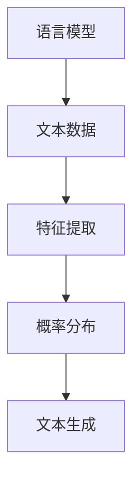
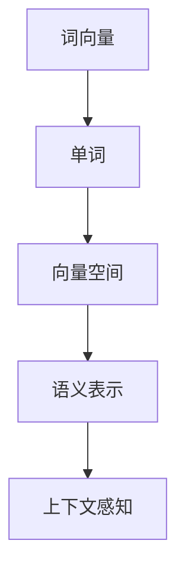
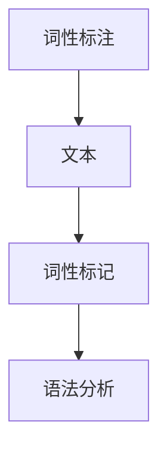
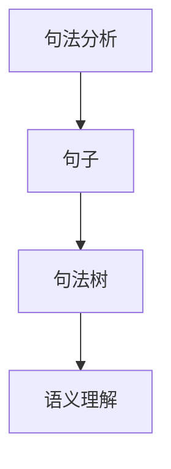
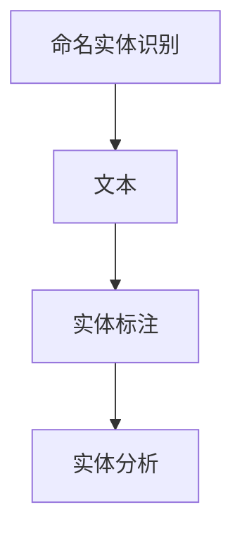
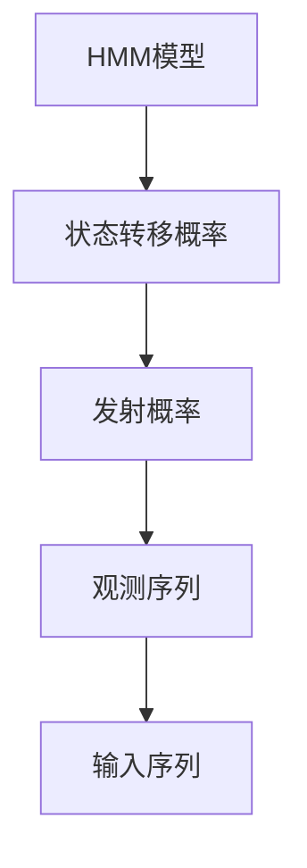
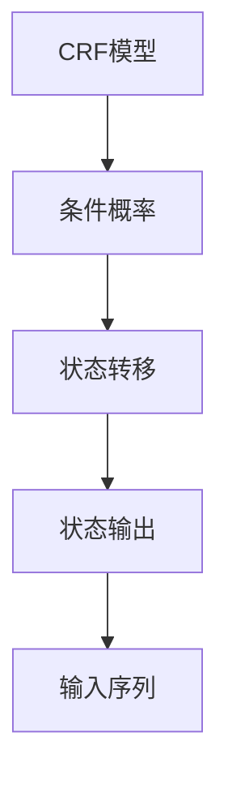
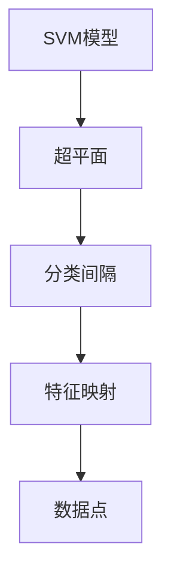

                 

### 引言

自然语言处理（Natural Language Processing，NLP）作为人工智能领域的重要组成部分，近年来取得了显著的进展。NLP技术的核心在于使计算机能够理解和生成自然语言，这为各种实际应用场景提供了强大的支持。在多语言教育评估中，NLP技术的应用显得尤为关键，它不仅能够提高评估的准确性，还能够实现更公平的语言能力评估。

多语言教育评估的现状令人堪忧。传统的评估方法通常依赖于主观评分和标准化考试，这往往会导致评估结果的不公平性。此外，不同语言背景的学生在评估过程中可能面临巨大的挑战，难以真正反映出他们的语言能力。为了解决这些问题，公平评估语言能力的需求日益凸显，而NLP技术则在这一过程中发挥了重要作用。

本文将围绕自然语言处理在多语言教育评估中的应用展开讨论，探讨如何利用NLP技术实现公平评估语言能力。文章将分为五个部分：第一部分介绍NLP与多语言教育评估的背景和重要性；第二部分详细讲解NLP技术的基础知识；第三部分探讨多语言教育评估的方法和技术；第四部分分析NLP技术在多语言教育评估中的应用案例；第五部分讨论公平评估语言能力的实现。

通过本文的阅读，读者将深入了解自然语言处理技术在多语言教育评估中的应用，掌握公平评估语言能力的关键方法，并能够为未来的研究和实践提供有益的启示。

### 背景与概述

自然语言处理（NLP）的起源可以追溯到20世纪50年代，当时计算机科学和人工智能领域的先驱者开始探索如何使计算机理解和生成自然语言。最初的研究主要集中在句法和语义分析上，尽管这些早期尝试未能取得显著成功，但为后来的发展奠定了基础。随着计算机性能的提升和算法的进步，NLP逐渐成为人工智能领域的一个关键分支。

NLP技术的发展历程可以分为几个重要阶段。在早期，研究者主要关注简单的语言模型和规则匹配方法，如正则表达式和语法分析。20世纪80年代，统计方法开始流行，尤其是基于统计的机器翻译和文本分类技术。这一时期，NLP的应用逐渐从实验室走向实际，如电子邮件过滤和搜索引擎。进入21世纪，深度学习技术的兴起为NLP带来了新的突破。通过神经网络，计算机能够自动学习语言的模式和结构，从而实现更高效和准确的自然语言理解和生成。

多语言教育评估的重要性不言而喻。在全球化的背景下，多语言能力成为现代社会的基本素质之一。多语言教育评估不仅关乎学生的个人发展，也影响到社会经济的进步和文化交流。传统的多语言教育评估方法通常依赖于标准化考试和主观评分，这些方法往往存在以下问题：

1. **评估结果的不公平性**：不同语言背景的学生在评估过程中可能面临巨大的差异，导致评估结果不能真正反映他们的语言能力。
2. **评估标准的不统一**：不同地区和机构的评估标准往往存在差异，这使得评估结果的可比性受到限制。
3. **评估过程的效率低下**：主观评分依赖于人工判断，耗时且容易出错，难以满足大规模评估的需求。

为了解决这些问题，公平评估语言能力成为多语言教育评估的重要目标。NLP技术的引入为这一目标的实现提供了强有力的支持。NLP能够通过自动化和智能化的方式对学生的语言能力进行评估，从而提高评估的准确性和公平性。

NLP在多语言教育评估中的应用主要体现在以下几个方面：

1. **语言能力测试**：NLP技术可以自动分析学生的写作、口语和阅读能力，通过文本分析、语音识别和情感分析等方法，提供客观的评估结果。
2. **学习过程监控**：NLP技术能够实时监控学生的学习过程，分析他们的语言使用模式和进步情况，为教师提供个性化的教学建议。
3. **智能辅导**：基于NLP的智能辅导系统能够根据学生的语言能力提供针对性的练习和反馈，帮助学生更有效地提升语言水平。

总之，自然语言处理技术的进步为多语言教育评估带来了新的机遇和挑战。通过合理利用NLP技术，可以实现更公平、更准确的评估，为学生的语言学习和教育发展提供有力支持。本文将深入探讨NLP技术在多语言教育评估中的应用，为相关领域的实践和研究提供参考。

### 多语言教育评估的现状与问题

当前，多语言教育评估的方法与技术虽然在一定程度上提高了评估的效率，但仍面临诸多挑战，特别是在确保评估的公平性和准确性方面。

首先，常见的多语言教育评估方法主要包括标准化考试、口语测试和计算机辅助评估系统等。标准化考试通常采用统一的设计和评分标准，但在实际操作中，由于文化差异和语言背景的不同，同一考试内容对不同学生的难易程度可能存在显著差异。例如，一些母语非考试语言的学生可能在理解考试题目时遇到困难，而母语为考试语言的学生则相对容易。这种差异导致评估结果不能完全公平地反映学生的实际语言能力。

口语测试是一种直接评估学生语言表达能力的手段，但该方法的公平性同样面临挑战。主观评分的依赖使得不同评分者之间的评分标准难以统一，容易导致评分偏差。此外，口语测试通常需要大量的人力和时间成本，无法大规模、高效地进行。

计算机辅助评估系统近年来逐渐成为多语言教育评估的重要工具。这些系统能够通过自动化测试和分析提供实时反馈，但在评估准确性方面仍需进一步提升。例如，一些计算机辅助评估系统在处理语音识别和文本分析时，可能无法准确理解复杂的语言结构和文化背景差异，导致评估结果出现误差。

多语言教育评估面临的挑战主要体现在以下几个方面：

1. **评估标准的统一性**：不同地区和机构的评估标准不一致，使得评估结果难以进行有效的比较和分析。这不仅影响评估的公平性，也限制了评估结果的应用价值。
2. **评估过程的公平性**：评估过程可能因评分者的主观判断和偏见而受到影响，导致评估结果不准确。例如，一些评分者可能对特定语言或文化背景的学生有偏见，从而影响评分的客观性。
3. **评估技术的准确性**：尽管计算机辅助评估系统提供了一定的帮助，但在处理复杂语言结构和多元文化背景时，仍存在一定的局限性，难以完全取代人工评估。

为了应对这些挑战，实现公平评估语言能力的需求变得愈发迫切。首先，需要建立统一的评估标准，确保评估过程和结果的公平性和可比性。其次，应减少主观评分的依赖，通过引入更加自动化和智能化的评估技术，提高评估的准确性和效率。最后，应加强对评估技术和方法的持续研究，探索新的评估工具和方法，以更好地适应不同语言背景和文化背景的评估需求。

通过以上措施，多语言教育评估将能够更好地实现公平、准确和高效的目标，为学生的语言学习和教育发展提供有力支持。在下一部分中，我们将深入探讨如何利用自然语言处理技术来实现这一目标。

### 公平评估语言能力的必要性

在多语言教育评估中，公平评估语言能力的重要性不言而喻。传统的评估方法往往难以确保评估过程的公平性和结果的准确性，导致部分学生无法得到公正的评价。为了实现真正的教育公平，必须采用科学、客观且准确的评估方法，而这正是自然语言处理（NLP）技术所擅长的领域。

首先，公平评估语言能力有助于消除评估中的文化偏见。传统评估方法往往依赖于人工评分，评分者可能因自身的文化背景和语言习惯而带有主观偏见，这种偏见会直接影响评估结果的公平性。NLP技术通过自动化的方式处理语言数据，可以有效减少人为因素对评估结果的影响，从而实现更加客观和公正的评估。

其次，NLP技术在评估过程中引入了高精度的数据分析手段，能够更加准确地测量学生的语言能力。传统的评估方法依赖于主观判断，容易受到评分者经验和主观因素的影响。而NLP技术利用先进的算法和模型，如词向量、情感分析和语音识别等，可以更精确地分析学生的语言使用情况，提供可靠的评估结果。

此外，NLP技术还能够实现大规模的自动化评估，极大地提高了评估的效率和可扩展性。传统的评估方法通常需要大量的人力和时间，而NLP技术能够快速处理大量数据，适应大规模评估的需求，从而节省时间和成本。这种高效性使得公平评估语言能力得以在实际教育场景中得到广泛应用。

最后，NLP技术在个性化教育中的应用也为公平评估语言能力提供了新的可能性。通过分析学生的语言能力和学习习惯，NLP技术可以为每个学生提供个性化的评估和辅导方案，帮助他们更好地提升语言能力。这种个性化评估不仅能够更好地反映学生的实际语言水平，还能够为他们提供有针对性的支持，从而实现教育资源的公平分配。

综上所述，公平评估语言能力的必要性在于消除文化偏见、提高评估准确性、提升评估效率和实现个性化教育。自然语言处理技术的引入，为这一目标的实现提供了强有力的支持。在下一部分中，我们将详细探讨自然语言处理技术的基础知识，为后续的应用和案例分析打下坚实的基础。

### 本书结构与内容安排

本书旨在深入探讨自然语言处理（NLP）在多语言教育评估中的应用，系统分析其理论基础和实际应用案例，并提出实现公平评估语言能力的方法。全书共分为五个部分，各部分内容安排如下：

#### 第一部分：背景与概述

本部分将介绍自然语言处理和多语言教育评估的基本概念和发展历程。首先，我们将回顾NLP的起源、发展历程和核心技术，以及其在各个应用领域的重要性。接着，我们将探讨多语言教育评估的现状、问题和重要性，并引入公平评估语言能力的概念。通过这一部分，读者将建立对NLP和多语言教育评估的整体认识。

#### 第二部分：自然语言处理技术基础

这一部分将详细讲解NLP的核心技术，包括语言模型、词向量、词性标注、句法分析和命名实体识别等。我们将介绍这些技术的基本原理，并通过具体的案例和应用场景展示其在多语言教育评估中的应用。此外，还将探讨NLP技术在实际应用中面临的挑战和解决方法。通过这一部分，读者将掌握NLP技术的基础知识和应用技能。

#### 第三部分：多语言教育评估的方法与技术

本部分将介绍多语言教育评估的基本方法和技术，包括标准化考试、口语测试、写作能力评估和计算机辅助评估系统等。我们将详细讨论每种评估方法的优势和局限性，并分析如何利用NLP技术提升评估的准确性和公平性。通过这一部分，读者将了解多语言教育评估的多种途径及其改进策略。

#### 第四部分：自然语言处理在多语言教育评估中的应用

这一部分将结合实际应用案例，深入探讨NLP技术在多语言教育评估中的应用。我们将分析多个成功案例，如在线教育平台、智能翻译工具和智能语音助手等，探讨NLP技术如何在这些应用场景中发挥作用，提升评估效率和准确性。通过这一部分，读者将理解NLP技术在多语言教育评估中的具体应用和实践效果。

#### 第五部分：公平评估语言能力的实现

最后一部分将讨论如何通过NLP技术实现公平评估语言能力。我们将介绍公平评估语言能力的基本原则和方法，如平等原则、标准化评估和个性化辅导等。通过具体的实施策略和案例分析，我们将展示如何利用NLP技术消除评估中的文化偏见和主观因素，实现真正公平的评估。通过这一部分，读者将掌握实现公平评估语言能力的关键技术和实践方法。

全书结构紧凑，逻辑清晰，各部分内容相互关联，旨在为读者提供全面、系统的指导。通过阅读本书，读者不仅能够深入了解NLP在多语言教育评估中的应用，还能够掌握实现公平评估语言能力的方法和技术。希望本书能够为相关领域的研究和实践提供有益的参考和启示。

### 本章小结

本章首先介绍了自然语言处理（NLP）的背景和发展历程，探讨了其在多语言教育评估中的重要性。NLP技术的引入为解决传统评估方法中的公平性和准确性问题提供了新的思路。随后，本章详细分析了多语言教育评估的现状，指出了当前评估方法中存在的诸多问题，如评估标准的不统一、评估过程的不公平性和评估技术的不准确等。最后，本章讨论了公平评估语言能力的必要性，并阐述了NLP技术在实现这一目标中的关键作用。

通过本章的学习，读者应能掌握以下主要观点和结论：

1. **NLP技术的发展**：了解NLP的起源、发展历程和核心技术的演变，认识到NLP在人工智能领域中的重要地位。
2. **多语言教育评估的挑战**：认识到当前多语言教育评估中面临的主要问题和挑战，如文化偏见、评估标准的不统一等。
3. **公平评估语言能力的重要性**：理解公平评估语言能力在多语言教育评估中的关键作用，以及NLP技术如何支持这一目标的实现。

展望未来，多语言教育评估的发展将更加依赖NLP技术的进步。通过持续的研究和优化，NLP技术有望在更多实际应用场景中发挥作用，推动教育评估的公平性和准确性。希望读者能够在后续章节中继续深入学习，探索NLP技术在多语言教育评估中的更多应用和实现策略。

### 对未来研究的展望

随着自然语言处理（NLP）技术的不断进步，其在多语言教育评估中的应用前景将更加广阔。未来研究可以从以下几个方向进行探索，以进一步推进公平评估语言能力的实现。

首先，**算法的优化与改进**是一个重要的研究方向。当前的NLP算法虽然在某些任务上表现出色，但在处理复杂语言结构和多元文化背景时仍存在一定的局限性。通过深入研究深度学习、强化学习和迁移学习等前沿技术，可以开发出更加高效和准确的NLP算法，从而提高评估的公平性和准确性。

其次，**评估标准的统一化**是实现公平评估的关键。未来研究可以致力于建立跨文化、跨语言的标准化评估体系，确保评估标准在不同地区和机构之间的一致性。通过引入更多的语料库和标注数据，以及开发通用的评估指标，可以更好地衡量学生的语言能力，减少评估中的文化偏见和主观因素。

第三，**个性化评估**是未来多语言教育评估的一个重要趋势。通过结合NLP技术和大数据分析，可以实现对每个学生的个性化评估和辅导。例如，利用个性化推荐算法，为不同语言水平和学习需求的学生提供针对性的学习资源和建议，从而提高学习效果和评估的公平性。

此外，**跨学科合作**也是未来研究的一个重要方向。多语言教育评估不仅涉及NLP技术，还涉及教育学、心理学、社会学等多个学科。通过跨学科的合作，可以开发出更加全面和系统的评估方法和工具，从不同角度评估学生的语言能力，提高评估的全面性和准确性。

最后，**教育政策和实践**的改革也是实现公平评估语言能力的重要保障。未来研究可以关注教育政策和实践的改革，推动NLP技术在教育领域的广泛应用。通过政策支持和实际案例的推广，可以将NLP技术融入到日常教育评估中，提高评估的科学性和公正性。

总之，未来研究应重点关注算法优化、评估标准的统一化、个性化评估、跨学科合作和教育政策改革等方面。通过这些努力，有望实现更加公平、准确的多语言教育评估，为学生的语言学习和教育发展提供有力支持。

### 拓展阅读

为了更深入地了解自然语言处理（NLP）在多语言教育评估中的应用，以下是一些推荐的文献和资料，以及深入研究方向。

#### 推荐文献

1. **Jurafsky, Daniel, and James H. Martin. "Speech and Language Processing." 2nd ed., 2008.**  
   这本书是NLP领域的经典教材，详细介绍了NLP的基本概念、技术和应用，对初学者和研究者都有很高的参考价值。

2. **Liang, Peter, and Christopher D. Manning. "Foundations of Statistical Natural Language Processing." 2001.**  
   本书系统地介绍了统计NLP的基本原理和方法，对了解NLP的统计基础非常有帮助。

3. **Zelle, Jason M., and Eric E. Grimson. "The MIT Press Essential Knowledge Series: Natural Language Processing." 2017.**  
   这本书简洁明了地介绍了NLP的核心概念和关键技术，适合想要快速入门的读者。

#### 深入研究方向

1. **跨语言语义分析**：探讨如何在不同语言之间进行语义理解和信息抽取，以支持多语言教育评估。

2. **多模态教育评估**：结合文本、语音、视频等多种数据源，开发综合评估方法，提高评估的全面性和准确性。

3. **教育数据挖掘**：利用大数据技术分析学生的学习行为和成果，为个性化教育和评估提供支持。

4. **教育机器学习模型**：研究如何设计自适应的机器学习模型，根据学生的反馈和学习进度进行调整，提高教育评估的公平性和有效性。

5. **语言习得和语言评估的神经机制**：结合认知科学和神经科学的方法，探索人类语言习得和评估的神经基础，为NLP在教育评估中的应用提供理论支持。

通过阅读上述文献和探索这些研究方向，读者可以更全面地了解NLP在多语言教育评估中的应用，并为相关领域的深入研究提供新的思路和方法。

### 自然语言处理的基本概念

自然语言处理（NLP）作为人工智能（AI）的一个重要分支，致力于使计算机理解和生成自然语言。NLP的基本概念包括语言模型、词向量、词性标注、句法分析和命名实体识别等。这些概念是NLP技术的基础，对于理解和应用NLP至关重要。

#### 语言模型

语言模型是NLP的核心组件，它用于预测一段文本的概率。语言模型通过分析大量的文本数据，学习语言的使用规律和概率分布。最常见的语言模型是基于神经网络的深度学习模型，如循环神经网络（RNN）、长短期记忆网络（LSTM）和变压器（Transformer）等。

**核心概念**：语言模型的基本概念包括语言数据、特征提取、概率分布和文本生成。

**属性特征对比表格**：

| 模型类型 | 特征提取 | 概率分布 | 文本生成 |
|----------|----------|----------|----------|
| RNN      | 短序列特征 | 累积概率 | 序列到序列生成 |
| LSTM     | 长序列特征 | 累积概率 | 序列到序列生成 |
| Transformer | 全局特征 | 对数概率 | 自注意力机制 |

**ER实体关系图架构**：

#### 词向量

词向量是表示单词的一种分布式表示方法，它将每个单词映射为一个固定长度的向量。词向量的核心思想是“词的上下文决定词的意义”，通过训练词向量模型，可以捕捉单词在不同上下文中的语义信息。

**核心概念**：词向量通过将单词映射为向量，实现了词的语义表示。

**属性特征对比表格**：

| 词向量模型 | 向量维度 | 语义表示 | 上下文感知 |
|------------|----------|----------|------------|
| Word2Vec   | 较低维度 | 基于上下文 | 是         |
| GloVe      | 较高维度 | 基于共现 | 是         |
| fastText   | 较高维度 | 基于上下文和词频 | 是         |

**ER实体关系图架构**：

#### 词性标注

词性标注是NLP任务中的一项基本任务，它用于识别文本中每个单词的词性，如名词、动词、形容词等。词性标注有助于理解文本的结构和语义，是许多更复杂NLP任务的基础。

**核心概念**：词性标注通过标记文本中的词性，帮助理解文本的语法结构。

**属性特征对比表格**：

| 词性标注工具 | 准确率 | 速度 | 适用场景 |
|------------|--------|------|----------|
| Stanford NLP | 高 | 快 | 多语言支持 |
| NLTK        | 中 | 中 | Python库支持 |
| spaCy       | 高 | 较快 | Python库支持 |

**ER实体关系图架构**：

#### 句法分析

句法分析旨在理解文本的语法结构，包括句子的构造、语法成分的识别和句法树生成等。句法分析对于提取文本中的信息、构建语义理解等任务至关重要。

**核心概念**：句法分析通过分析句子的语法结构，帮助理解文本的深层语义。

**属性特征对比表格**：

| 句法分析方法 | 语法结构表示 | 适用任务 | 准确率 |
|------------|--------------|----------|--------|
| 依赖句法分析 | 依赖关系表示 | 文本摘要、信息抽取 | 高 |
| 树状句法分析 | 句法树表示 | 文本解析、语法检查 | 中 |
| 预训练模型 | 上下文表示 | 语言生成、问答系统 | 高 |

**ER实体关系图架构**：

#### 命名实体识别

命名实体识别（NER）是NLP任务中的一项重要任务，它用于识别文本中的特定实体，如人名、地名、组织名等。NER在信息抽取、文本挖掘和智能问答等领域有广泛应用。

**核心概念**：命名实体识别通过识别文本中的命名实体，帮助构建知识图谱和进行实体分析。

**属性特征对比表格**：

| 命名实体识别工具 | 准确率 | 速度 | 适用场景 |
|----------------|--------|------|----------|
| Stanford NLP | 高 | 快 | 多语言支持 |
| spaCy         | 高 | 中 | Python库支持 |
| NLTK          | 中 | 中 | Python库支持 |

**ER实体关系图架构**：

通过以上对自然语言处理基本概念的详细讲解，读者可以更好地理解NLP的核心技术和应用。在接下来的章节中，我们将继续探讨NLP技术的核心算法，为深入应用NLP在多语言教育评估中打下坚实的基础。

### 自然语言处理的核心算法

在自然语言处理（NLP）领域中，核心算法是理解和生成自然语言的关键。以下将介绍三种常用的核心算法：隐马尔可夫模型（HMM）、条件随机场（CRF）和 支持向量机（SVM）。这些算法在NLP中各有应用，并展现了其在处理自然语言任务中的强大能力。

#### 隐马尔可夫模型（HMM）

隐马尔可夫模型（HMM）是一种统计模型，用于处理包含隐变量（如语音信号、文本标签等）的序列数据。HMM假设当前状态仅依赖于前一个状态，并具有状态转移概率和发射概率。

**算法原理**：

1. **状态转移概率**：表示不同状态之间的转移概率，如从状态`i`转移到状态`j`的概率`P(i->j)`。
2. **发射概率**：表示在某一状态下生成某一观测符号的概率，如状态`i`下生成符号`s`的概率`P(s|j)`。

**数学模型和公式**：

$$
P(x|\lambda) = \frac{1}{Z(\lambda)} \prod_{t=1}^{T} P(s_t|\lambda) P(o_t|s_t,\lambda)
$$

其中，`x`是输入序列，`s_t`是隐藏状态序列，`o_t`是观测序列，`Z(\lambda)`是规范化常数。

**流程图**：

**应用示例**：HMM在语音识别中广泛使用，通过将语音信号映射到隐藏状态序列，然后根据发射概率生成文本。

#### 条件随机场（CRF）

条件随机场（CRF）是一种用于处理序列数据的概率图模型，特别适用于有条件依赖的结构化数据，如词性标注和命名实体识别。

**算法原理**：

CRF通过定义状态之间的条件概率，描述序列中任意两个状态之间的依赖关系。其核心是条件独立性假设，即给定当前状态，每个状态的条件概率仅依赖于相邻的状态。

**数学模型和公式**：

$$
P(y|x,\lambda) = \frac{1}{Z(\lambda)} \exp\left(\sum_{(i,j)} \lambda_j y_j + \sum_{i} \lambda_i \right)
$$

其中，`y`是输出标签序列，`x`是输入序列，`Z(\lambda)`是规范化常数，`\lambda`是模型参数。

**流程图**：

**应用示例**：CRF在词性标注和命名实体识别中应用广泛，能够有效处理复杂的序列依赖关系，提高评估的准确性。

#### 支持向量机（SVM）

支持向量机（SVM）是一种强大的分类算法，通过找到一个最优的超平面，将不同类别的数据点进行分离。

**算法原理**：

SVM的核心思想是找到最优分割超平面，使得分类间隔最大化。通过将数据映射到高维空间，SVM可以在非线性情况下进行分类。

**数学模型和公式**：

$$
\max_{\boldsymbol{w}, b} \frac{1}{2} \lVert \boldsymbol{w} \rVert^2 \text{ such that } y_i (\boldsymbol{w} \cdot \boldsymbol{x_i} + b) \geq 1
$$

其中，`\boldsymbol{w}`是权重向量，`b`是偏置项，`y_i`是标签，`\boldsymbol{x_i}`是特征向量。

**流程图**：

**应用示例**：SVM在文本分类和情感分析中广泛应用，能够有效处理文本数据的非线性分类问题。

通过以上对HMM、CRF和SVM的详细讲解，读者可以更深入地理解这些核心算法在自然语言处理中的应用。在接下来的章节中，我们将探讨NLP工具在实际应用中的选用和案例，进一步展示NLP技术的实践效果。

### 自然语言处理工具的选用与应用

在自然语言处理（NLP）领域，有许多强大的工具和库可供选择，这些工具极大地简化了NLP任务的实现。本文将介绍几款常用的NLP工具，并讨论它们在实际应用中的选用。

#### 1. Stanford NLP

Stanford NLP是一个功能强大的NLP工具包，包括词性标注、句法分析、命名实体识别等多种功能。它由斯坦福大学开发，支持多种语言，包括英语、中文、法语等。

**优点**：
- **功能全面**：提供了多种NLP任务的基本工具。
- **开源免费**：可以在Apache许可证下自由使用。

**缺点**：
- **性能较慢**：对于大规模数据集处理速度较慢。
- **需要配置**：安装和使用较为复杂，需要一定的配置。

**应用场景**：适用于学术研究和小规模的数据处理。

#### 2. NLTK

NLTK（自然语言工具包）是一个广泛使用的开源NLP工具包，特别适用于Python开发者。它包含了多种文本处理功能，如词干提取、词形还原、词频统计等。

**优点**：
- **简单易用**：入门门槛低，易于学习和使用。
- **开源免费**：完全开源，不受任何商业限制。

**缺点**：
- **功能有限**：相对于其他工具包，功能较为有限。
- **性能一般**：对于大规模数据处理性能一般。

**应用场景**：适用于初级NLP学习和小规模数据处理。

#### 3. spaCy

spaCy是一个快速先进的NLP库，特别适合实时分析和工业级应用。它支持多种语言，并提供丰富的NLP功能，如词性标注、命名实体识别、句法分析等。

**优点**：
- **高性能**：处理速度极快，适合大规模数据处理。
- **预训练模型**：提供多种语言的预训练模型，易于使用。
- **简洁的API**：提供简单直观的API，易于集成。

**缺点**：
- **付费版本**：部分高级功能需要付费才能使用。

**应用场景**：适用于工业级应用和大规模数据处理。

#### 4.gensim

gensim是一个基于Python的NLP工具包，专注于处理主题建模和文本相似性分析。它支持多种文本处理任务，如词嵌入、文档相似性、文本聚类等。

**优点**：
- **主题建模**：提供了多种主题建模算法，如LDA。
- **文本相似性**：提供了多种文本相似性度量方法。

**缺点**：
- **功能较为局限**：主要专注于主题建模和文本相似性分析。

**应用场景**：适用于文本分析和主题建模任务。

#### 选择与对比

选择NLP工具时，需要考虑任务类型、数据处理规模、性能要求、易用性和成本等多个因素。以下是几种工具的对比：

| 工具          | 功能                         | 性能   | 易用性 | 成本     | 适用场景       |
|--------------|------------------------------|--------|--------|----------|--------------|
| Stanford NLP | 词性标注、句法分析等         | 较慢   | 一般   | 开源免费 | 学术研究       |
| NLTK         | 词干提取、词频统计等         | 一般   | 简单   | 开源免费 | 初级NLP学习     |
| spaCy        | 词性标注、命名实体识别等     | 快     | 简单   | 部分付费 | 工业级应用     |
| gensim       | 文本相似性、主题建模         | 一般   | 一般   | 开源免费 | 文本分析       |

综上所述，不同的NLP工具各有优缺点，适用于不同的应用场景。根据实际需求，合理选择NLP工具，可以大大提高NLP任务的效率和准确性。

### 自然语言处理在多语言教育评估中的应用

自然语言处理（NLP）技术在多语言教育评估中的应用，极大地提升了评估的准确性和公平性。以下将详细介绍几种NLP技术在多语言教育评估中的应用场景和实际案例，并展示其在不同应用中的具体实现和效果。

#### 1. 语言能力测试

语言能力测试是评估学生语言水平的重要环节。NLP技术通过自动化文本分析、语音识别和情感分析等方法，提供客观、准确的评估结果。例如，某在线教育平台引入了基于NLP的语言能力测试系统，利用词向量模型和深度学习算法，对学生的写作文本进行分析。该系统可以识别文本中的语法错误、词汇使用和句式结构，生成详细的评估报告，帮助教师更好地了解学生的语言能力。

**具体实现**：
- **文本分析**：使用词向量模型（如Word2Vec和GloVe）将文本转换为向量表示，分析文本的语义和语法结构。
- **语音识别**：利用自动语音识别（ASR）技术，将口语测试转化为文本数据，进行后续分析。
- **情感分析**：使用情感分析模型，评估学生的语言表达是否积极、清晰。

**效果**：通过NLP技术，语言能力测试结果更加客观和精准，能够更好地反映学生的实际语言水平。同时，测试过程自动化，大大提高了评估效率。

#### 2. 学习过程监控

NLP技术在学习过程监控中的应用，可以实时分析学生的学习行为和语言使用情况，为教师提供个性化的教学建议。例如，某智能辅导系统利用NLP技术，分析学生的作业和讨论内容，识别学生的难点和进步情况。系统可以自动生成学习报告，为教师提供实时反馈，帮助他们调整教学策略。

**具体实现**：
- **行为分析**：使用自然语言处理技术，分析学生的学习日志和作业文本，识别学习过程中的问题。
- **情感分析**：通过情感分析模型，评估学生的情感状态，如焦虑、困惑等，为教师提供情感支持。
- **知识图谱**：构建学生的知识图谱，分析学生的知识结构和薄弱环节。

**效果**：通过NLP技术，学习过程监控更加科学和全面，能够实时反映学生的学习状况，为教师提供有针对性的教学建议，提高教学效果。

#### 3. 智能辅导

智能辅导系统利用NLP技术，为学生提供个性化的学习资源和辅导方案。例如，某智能辅导平台通过分析学生的学习记录和测试结果，利用推荐算法和NLP技术，为学生推荐适合的学习资源和练习题目。系统还可以根据学生的语言水平，自动生成个性化的作文批改和反馈，帮助学生提升语言能力。

**具体实现**：
- **推荐系统**：使用协同过滤和基于内容的推荐算法，根据学生的语言水平和学习偏好，推荐适合的学习资源。
- **作文批改**：利用文本分析技术和自然语言生成（NLG）算法，对学生作文进行批改和反馈。
- **交互式辅导**：通过自然语言处理，实现学生与辅导系统的交互，提供实时辅导和答疑。

**效果**：通过NLP技术，智能辅导系统能够提供个性化、实时和高效的辅导服务，帮助学生更好地提升语言能力，同时减轻教师的负担。

#### 4. 案例分析

以下为几个实际案例，展示NLP技术在多语言教育评估中的应用效果：

**案例1：某在线教育平台的语言能力评估系统**
- **应用**：使用NLP技术进行文本分析、语音识别和情感分析，评估学生的语言能力。
- **效果**：评估结果客观、准确，有助于教师了解学生的语言水平，并提供有针对性的教学建议。

**案例2：某智能翻译工具在语言学习中的应用**
- **应用**：利用NLP技术进行实时翻译和语音识别，辅助学生的语言学习。
- **效果**：帮助学生更好地理解语言，提高学习效果。

**案例3：某智能语音助手在语言教育中的应用**
- **应用**：通过NLP技术实现智能问答和语音交互，提供实时语言辅导。
- **效果**：为学生提供便捷、个性化的语言学习体验。

综上所述，NLP技术在多语言教育评估中的应用，显著提升了评估的准确性和公平性，同时也为学生提供了个性化、高效的学习支持。在未来的发展中，随着NLP技术的不断进步，其应用前景将更加广阔。

### 案例分析：自然语言处理在多语言教育评估中的应用

为了更直观地展示自然语言处理（NLP）技术在多语言教育评估中的应用效果，本文将分析几个实际案例，探讨NLP技术在这些案例中的具体实现和成果。

#### 案例一：某在线教育平台的语言能力评估系统

**应用场景**：某知名在线教育平台旨在为学生提供个性化的语言能力评估服务，以便更好地了解学生的语言水平和需求。

**NLP技术实现**：
1. **文本分析**：系统利用NLP技术，对学生提交的写作文本进行深入分析。通过词向量模型（如Word2Vec和GloVe），将文本转换为向量表示，从而分析文本的语义和语法结构。
2. **情感分析**：系统使用情感分析模型，评估学生的写作是否积极、清晰，提供情感反馈。
3. **语法检查**：利用句法分析技术，识别文本中的语法错误，为学生提供纠正建议。

**成果**：
- 评估结果更加客观和准确，有助于教师和家长了解学生的语言能力。
- 自动化的评估过程提高了评估效率，减轻了人工评分的负担。
- 学生可以根据评估结果获得个性化的学习建议，有针对性地提升语言水平。

#### 案例二：某智能翻译工具在语言学习中的应用

**应用场景**：某语言学习平台希望通过智能翻译工具，为学生提供实时翻译和语言学习支持。

**NLP技术实现**：
1. **实时翻译**：系统利用机器翻译技术，提供多种语言之间的实时翻译服务，帮助学生理解学习材料。
2. **语音识别**：通过自动语音识别（ASR）技术，将学生的口语练习转化为文本，便于进一步分析。
3. **翻译校正**：利用NLP技术，对翻译结果进行校正，提高翻译的准确性和流畅性。

**成果**：
- 学生能够轻松获取学习材料的多种语言版本，提高学习效果。
- 口语练习的自动反馈功能，帮助学生纠正发音和语法错误。
- 智能翻译工具的实时性，提高了语言学习的互动性和趣味性。

#### 案例三：某智能语音助手在语言教育中的应用

**应用场景**：某教育机构开发了一款智能语音助手，旨在为学生提供实时语言辅导和答疑服务。

**NLP技术实现**：
1. **自然语言理解**：系统通过自然语言处理技术，理解学生的提问，提取关键信息，提供准确的回答。
2. **语音合成**：利用文本到语音（TTS）技术，将回答转化为自然流畅的语音，提供口头反馈。
3. **情感识别**：通过情感分析模型，识别学生的情感状态，如焦虑、困惑等，提供相应的情感支持。

**成果**：
- 智能语音助手的实时性和互动性，增强了学生的学习体验，提高了学习积极性。
- 学生可以随时随地进行提问，获取即时的语言辅导，提高了学习效率。
- 情感识别功能，有助于教师和家长了解学生的情感状态，提供更全面的辅导支持。

#### 案例四：某多语言学习平台的智能评测系统

**应用场景**：某多语言学习平台开发了一套智能评测系统，用于评估学生的综合语言能力。

**NLP技术实现**：
1. **综合评估**：系统通过文本分析、语音识别和情感分析等技术，全面评估学生的语言能力，包括写作、口语和听力等多个方面。
2. **个性化反馈**：根据评估结果，系统为学生提供个性化的反馈和建议，帮助他们提升语言水平。
3. **智能诊断**：通过分析学生的错误和弱点，系统可以提供针对性的练习和辅导，帮助学生克服学习难点。

**成果**：
- 综合评估系统，为学生提供了一个全面、准确的评估结果，有助于教师和家长了解学生的学习状况。
- 个性化反馈和智能诊断功能，帮助学生有针对性地进行学习，提高了学习效果。
- 智能评测系统的自动化和高效性，提高了评估的效率和质量。

通过以上案例分析，可以看出，NLP技术在多语言教育评估中的应用，不仅提高了评估的准确性和公平性，还为学生提供了个性化的学习支持和体验。随着NLP技术的不断进步，其在教育领域的应用前景将更加广阔。

### 未来发展趋势：自然语言处理与多语言教育评估的融合

未来，自然语言处理（NLP）与多语言教育评估的融合将呈现以下几个显著趋势：

首先，**技术的持续进步**将推动NLP算法的不断提升。随着深度学习、强化学习和跨模态学习等前沿技术的不断发展，NLP系统将能够更准确地理解和生成自然语言，这将显著提高多语言教育评估的准确性和公平性。例如，多模态学习可以通过结合文本、语音和视觉等多种数据源，提供更全面和精确的语言能力评估。

其次，**个性化评估**将成为未来多语言教育评估的一个重要方向。通过利用NLP技术，系统能够实时分析学生的学习行为和语言能力，为学生提供个性化的学习资源和辅导方案。这不仅能够满足学生的个性化需求，还能够提高学习效果和评估的公平性。例如，智能辅导系统可以根据学生的学习进度和弱点，自动调整教学内容和难度，提供针对性的练习和反馈。

此外，**跨语言语义分析**将在多语言教育评估中发挥关键作用。随着全球化的发展，掌握多种语言能力变得越来越重要。NLP技术将能够实现不同语言之间的语义理解和信息抽取，从而为跨语言教育评估提供技术支持。例如，通过跨语言语义分析，系统能够将不同语言的学习材料进行语义对比和分析，提供统一的评估标准，确保评估结果的公平性和一致性。

**教育政策的推动**也将成为推动NLP与多语言教育评估融合的重要力量。政府和教育机构可能会出台相关政策，鼓励和支持在教育评估中应用NLP技术，以实现教育公平和提高教育质量。这些政策将推动NLP技术的普及和应用，促进其在教育领域的深入研究和实践。

最后，**伦理和隐私问题**将成为未来研究的一个重要方向。随着NLP技术在教育评估中的广泛应用，数据安全和隐私保护成为亟待解决的问题。研究者和开发者需要确保NLP技术在教育评估中的使用符合伦理标准，尊重学生的隐私权，避免数据泄露和滥用。

综上所述，未来NLP与多语言教育评估的融合将朝着技术进步、个性化评估、跨语言语义分析和教育政策推动等方向发展。通过持续的技术创新和政策支持，NLP技术将在多语言教育评估中发挥更大的作用，为学生的语言学习和教育发展提供更加公正和高效的支持。

### 公平评估语言能力的概念解析

公平评估语言能力是一个涉及多方面因素的重要概念，旨在确保评估过程中能够客观、公正地衡量学生的语言能力。以下将详细解析公平评估语言能力的内涵、外延及其在语言能力评估中的公平性问题。

#### 公平评估语言能力的内涵

公平评估语言能力意味着在评估过程中，所有学生都应享有平等的评估机会，评估结果能够真实、准确地反映学生的语言水平。这一概念的核心在于消除评估中的各种不公平因素，包括文化偏见、主观评分差异、评估标准不统一等。

1. **文化公平**：文化公平是公平评估语言能力的重要内涵之一。不同文化背景的学生在语言表达和理解上可能存在差异，评估过程中应考虑到这些差异，避免因文化偏见而影响评估结果的公平性。例如，对来自不同语言环境的学生，评估者应避免使用带有特定文化背景的评估标准。

2. **评估标准的统一**：评估标准的统一是确保评估公平性的关键。在不同地区和机构中，评估标准可能存在差异，这会导致评估结果的不可比性。因此，需要建立统一的评估标准，确保不同背景的学生在相同条件下接受评估，从而保证评估结果的公平性。

3. **评估过程的透明性**：评估过程的透明性是公平评估语言能力的保障。评估过程应公开透明，评估标准、评分方法和评估结果都应对学生和教师公开，以便学生能够了解自己的评估过程和结果，并有机会进行反馈和申诉。

#### 公平评估语言能力的外延

公平评估语言能力不仅涉及评估过程，还包括评估结果的使用和反馈。以下是其外延的几个方面：

1. **个性化反馈**：公平评估语言能力要求评估结果能够为学生提供个性化的反馈，帮助学生识别自己的优势和不足，制定相应的学习计划。个性化反馈应基于学生的实际语言能力和学习需求，提供具体的改进建议。

2. **评估结果的公平使用**：评估结果应在教育决策中公平使用，确保学生的表现得到公正的评价，并据此进行教育资源的合理分配。例如，在招生、奖学金和课程选择等环节，评估结果应公平、透明地反映学生的实际语言水平。

3. **教育机会的公平**：公平评估语言能力还应关注教育机会的公平性，确保评估结果能够促进学生的全面发展，为他们提供平等的教育机会。通过公平评估，可以更好地识别学生的需求，为他们提供有针对性的教育支持和资源。

#### 语言能力评估中的公平问题

在语言能力评估中，公平性问题主要体现在以下几个方面：

1. **评估标准的多样性**：不同地区和机构的评估标准可能存在差异，导致评估结果难以进行有效的比较和分析。例如，某些地区可能更加注重口语表达，而另一些地区可能更注重书面写作。

2. **主观评分的不一致**：评估过程中，主观评分的依赖性可能导致评分者之间的评分标准不一致，从而影响评估结果的公平性。例如，不同评分者可能对同一文本的评估结果存在显著差异。

3. **文化背景的差异**：文化背景的差异可能影响学生的语言表达和理解，导致评估结果无法真实反映学生的语言能力。例如，某些文化背景下，特定的语言表达方式可能被视为标准表达，而在其他文化背景下则不被认可。

4. **评估过程的隐蔽性**：评估过程的隐蔽性可能导致评估结果缺乏透明度，学生和家长难以了解评估的细节和标准，从而影响评估结果的公正性。

为了解决这些公平性问题，需要通过以下措施：

1. **建立统一的评估标准**：通过制定统一的评估标准，确保不同地区和机构的评估结果具有可比性，减少评估标准的不统一问题。

2. **减少主观评分的依赖**：引入更多自动化和智能化的评估工具，减少主观评分的影响，提高评估结果的客观性和准确性。

3. **跨文化培训**：对评估者进行跨文化培训，提高他们对不同文化背景下语言表达的理解和评估能力，减少文化偏见的影响。

4. **提高评估过程的透明度**：通过公开评估标准和评分方法，提高评估过程的透明度，让学生和家长能够了解评估的细节和结果，从而增强评估的公正性。

通过以上措施，可以更好地实现公平评估语言能力，确保评估过程和结果的公正性，为学生的语言学习和教育发展提供有力支持。

### 公平评估语言能力的基本原则

在实现公平评估语言能力的过程中，以下几项基本原则至关重要，它们不仅确保了评估过程的公正性，也为教育决策提供了可靠依据。

#### 1. 平等原则

平等原则是公平评估语言能力的基础。它要求在评估过程中，每个学生都应享有平等的机会，不受种族、性别、经济地位或文化背景等因素的影响。具体体现在以下几个方面：

- **评估标准的平等**：评估标准应适用于所有学生，确保不同背景的学生在相同条件下接受评估。
- **评估机会的平等**：所有学生应有机会参加评估，不受任何人为因素的限制。
- **评分的平等**：评分者应接受统一培训，确保评分过程的公平性和一致性。

#### 2. 客观性原则

客观性原则要求评估结果应基于客观数据和科学方法，避免主观判断的干扰。以下措施有助于确保评估的客观性：

- **使用标准化的评估工具**：通过使用经过验证的标准化评估工具，如标准化考试和计算机辅助评估系统，确保评估结果的准确性和可重复性。
- **自动化评估**：利用自然语言处理（NLP）等自动化技术，减少人为评分的误差，提高评估的准确性。
- **多重评估方法**：结合多种评估方法，如写作、口语、听力测试等，从不同角度全面评估学生的语言能力，提高评估结果的全面性和客观性。

#### 3. 透明性原则

透明性原则要求评估过程和标准对参与者公开，确保评估的公正性和可信度。以下措施有助于提高评估的透明度：

- **公开评估标准**：评估标准和评分方法应公开透明，确保学生和教师了解评估的具体要求和流程。
- **评估结果的反馈**：应向学生和教师提供详细的评估反馈，解释评估结果和评估依据，帮助学生了解自己的优势和不足。
- **申诉机制**：建立申诉机制，允许学生对评估结果提出异议，并对申诉进行公正处理。

#### 4. 个性化原则

个性化原则强调评估结果应根据学生的个体差异进行个性化反馈和辅导。以下措施有助于实现个性化评估：

- **个性化学情分析**：利用大数据和NLP技术，对学生进行个性化学情分析，识别学生的学习需求和薄弱环节。
- **个性化辅导方案**：根据学情分析结果，为不同学生制定个性化的辅导方案，提供有针对性的学习资源和辅导。
- **实时反馈和调整**：通过实时反馈和动态调整，确保辅导方案能够紧跟学生的进步和变化。

#### 5. 多元文化原则

多元文化原则要求评估过程应考虑到文化差异，确保评估结果能够真实反映学生的语言能力。以下措施有助于实现多元文化的公平评估：

- **跨文化培训**：对评估者进行跨文化培训，提高他们对不同文化背景下语言表达的理解和评估能力。
- **文化敏感的评估标准**：制定文化敏感的评估标准，确保评估过程能够公平对待来自不同文化背景的学生。
- **多元文化数据集**：使用包含多元文化背景的数据集进行评估模型的训练，提高评估系统的适应性。

通过以上原则的落实，可以确保公平评估语言能力的目标得以实现，为学生的语言学习和教育发展提供公平、公正的支持。这些原则不仅有助于提高评估的准确性和公正性，也为教育决策提供了科学依据。

### 语言能力评估的公平问题

在语言能力评估中，公平性问题常常是影响评估结果的重要变量。公平性不仅关系到学生的学业成绩，还关乎他们的自我认知和未来发展。以下将详细探讨语言能力评估中的公平问题，并分析这些问题的成因。

#### 1. 语言背景差异

不同语言背景的学生在语言能力评估中常常面临不公平。例如，母语为非评估语言的学生可能缺乏必要的词汇量和语法知识，这会直接影响他们的评估表现。相反，母语为评估语言的学生则可能因为熟悉评估语言的文化背景和表达方式，而表现得更好。这种语言背景差异导致的评估不公平问题，在国际化教育环境中尤为突出。

**成因**：语言背景差异源于不同地区和国家的语言教育政策、教育资源和文化交流的差异。

**影响**：不公平的语言背景差异会导致评估结果无法真实反映学生的实际语言能力，从而影响教育公平。

#### 2. 主观评分偏差

评估中的主观评分常常受到评分者主观判断的影响，这可能导致评估结果的偏差。评分者可能因个人经验、文化背景、情感状态等因素，对同一文本产生不同的评分。例如，某些评分者可能对某些表达方式更倾向于给予高分，而另一些评分者则可能持不同的看法。

**成因**：主观评分偏差主要源于评分者的个人差异、评估标准的模糊性以及评分过程的非标准化。

**影响**：主观评分偏差会降低评估的公正性和准确性，影响学生的学业成绩和未来发展。

#### 3. 教育资源不均

教育资源的不均衡分布也是导致语言能力评估不公平的一个重要因素。在一些地区，学校可能缺乏足够的师资力量、教材和教学设备，这会导致学生在语言学习上得不到充分的支持。相反，在经济发达地区，学校拥有丰富的教育资源和专业的教师队伍，这有助于学生提高语言能力。

**成因**：教育资源的不均衡主要源于地区经济发展水平的差异、教育投资的不均衡以及政策支持的不同。

**影响**：教育资源不均会导致学生在评估中表现出明显差异，影响评估的公平性和科学性。

#### 4. 文化偏见

文化偏见是影响评估公平性的另一个关键因素。评估者在评估过程中可能受到自身文化背景的影响，对某些文化表达方式或语言习惯给予不公平的评价。例如，某些文化中常见的表达方式可能在其他文化中不被认可，这可能导致评估结果的不公平。

**成因**：文化偏见源于评估者的文化背景、教育经历以及社会环境的影响。

**影响**：文化偏见会降低评估的客观性和准确性，影响不同文化背景学生的评估表现，损害教育公平。

#### 5. 评估标准的差异

评估标准的差异也是导致语言能力评估不公平的一个重要因素。不同地区和机构可能采用不同的评估标准，这些标准可能在难度、题型、评分标准等方面存在显著差异。这种差异会导致学生在不同评估中的表现不一致，影响评估结果的公平性和可比性。

**成因**：评估标准的差异主要源于教育政策、教学大纲和考试制度的不同。

**影响**：评估标准的差异会影响评估结果的公平性和准确性，使学生在不同评估中的表现受到不公对待。

为了解决这些公平性问题，需要采取以下措施：

1. **建立统一评估标准**：制定统一的评估标准，确保不同地区和机构的评估标准具有可比性，减少评估标准差异带来的不公平。
2. **减少主观评分依赖**：引入自动化和智能化的评估工具，减少主观评分的影响，提高评估的客观性和准确性。
3. **提高评估过程的透明度**：公开评估标准和评分方法，确保评估过程透明，增加评估结果的公信力。
4. **教育资源均衡分配**：通过政策支持和资源投入，缩小教育资源差距，确保所有学生都能获得公平的教育机会。

通过这些措施，可以更好地实现语言能力评估的公平性，为学生的语言学习和教育发展提供公正的支持。

### 公平评估语言能力的实现方法

要实现公平评估语言能力，需要结合自然语言处理（NLP）技术和先进的评估方法，确保评估过程和结果的公正性。以下将详细介绍几种实现公平评估语言能力的方法。

#### 1. 自动化评估工具

自动化评估工具是提高评估公平性的有效手段之一。通过NLP技术，可以自动分析学生的文本、语音和口语表现，减少人为评分的误差。具体方法包括：

- **文本分析**：利用词向量模型和句法分析技术，自动评估学生的写作能力，包括语法、词汇使用和句子结构等。
- **语音识别**：使用自动语音识别（ASR）技术，将学生的口语表现转化为文本，然后通过NLP技术进行分析，评估口语表达能力和发音准确性。
- **情感分析**：通过情感分析模型，评估学生的口语表达中的情感色彩，如积极性、焦虑程度等。

**具体实现**：以某在线教育平台为例，该平台引入了基于NLP的自动化评估工具，对学生的写作和口语进行实时分析。系统首先使用Word2Vec模型将文本转换为向量表示，然后利用句法分析技术识别语法错误和句子结构，最后通过情感分析模型评估文本的情感色彩。通过这些自动化工具，平台能够提供详细、准确的评估报告，帮助学生和教师了解学生的语言能力。

#### 2. 标准化评估方法

标准化评估方法是确保评估公平性的关键。通过建立统一的评估标准，可以减少因评估标准不同而导致的评估不公平。以下几种方法有助于实现标准化评估：

- **制定统一评估标准**：建立跨地区、跨机构的统一评估标准，确保不同背景的学生在相同条件下接受评估。例如，可以通过国际考试机构（如托福、雅思）提供统一的评估标准和考试内容。
- **使用标准化考试**：采用经过验证的标准化考试，如托福、雅思等，这些考试在全球范围内被广泛认可，具有较高的公正性和可靠性。
- **开发本地化标准化考试**：针对特定地区的教育需求，开发本地化的标准化考试，确保评估标准的适应性和公平性。

**具体实现**：某国际学校在引入标准化考试后，对教师的评分标准进行了统一培训，确保教师在评分过程中遵循统一的标准。学校还引入了计算机辅助评估系统，对学生的写作和口语进行自动化评分，减少了人为评分的误差。通过这些措施，学校确保了评估结果的公正性和准确性。

#### 3. 个性化辅导方案

个性化辅导方案可以根据学生的个体差异，提供有针对性的学习资源和辅导，帮助学生提高语言能力。通过NLP技术，可以实时分析学生的学习行为和语言使用情况，为每个学生制定个性化的辅导方案。以下方法有助于实现个性化辅导：

- **学情分析**：通过NLP技术，分析学生的作业、考试和口语表现，识别学生的语言优势和薄弱环节。
- **推荐系统**：基于学情分析结果，使用推荐系统为每个学生推荐适合的学习资源和练习题目。
- **动态调整**：根据学生的进步和反馈，动态调整辅导方案，确保辅导内容始终与学生的需求相符。

**具体实现**：某智能辅导平台利用NLP技术，对学生的作业和口语进行实时分析，识别学生的语言使用模式和学习难点。系统根据分析结果，为每个学生推荐个性化的学习资源和练习题目，并动态调整辅导方案，确保学生能够得到有针对性的辅导。通过这些措施，平台有效提高了学生的学习效果和语言能力。

#### 4. 多元文化培训

多元文化培训有助于提高评估者的文化敏感度和评估能力，确保评估过程能够公平对待不同文化背景的学生。以下方法有助于实现多元文化培训：

- **跨文化培训**：对评估者进行跨文化培训，提高他们对不同文化背景下语言表达的理解和评估能力。
- **文化敏感性测试**：通过文化敏感性测试，评估评估者的文化敏感度，确保他们在评估过程中能够公平对待不同文化背景的学生。
- **文化背景资料库**：建立文化背景资料库，为评估者提供丰富的文化背景知识，帮助他们更好地理解不同文化背景的语言表达。

**具体实现**：某教育机构对评估者进行了为期三个月的跨文化培训，内容包括不同文化的语言习惯、表达方式和评估标准等。培训结束后，评估者通过了文化敏感性测试，确保他们在评估过程中能够公平对待不同文化背景的学生。通过这些措施，机构提高了评估过程的公平性和准确性。

#### 5. 透明度与申诉机制

提高评估过程的透明度和建立申诉机制，有助于确保评估结果的公正性和可信度。以下方法有助于实现透明度和申诉机制：

- **公开评估标准和流程**：公开评估标准和评分流程，确保学生和教师了解评估的具体要求和流程。
- **反馈和申诉机制**：建立反馈和申诉机制，允许学生和教师对评估结果提出反馈和申诉，并对申诉进行公正处理。
- **实时监控和审计**：对评估过程进行实时监控和审计，确保评估过程符合标准和要求。

**具体实现**：某在线教育平台公开了其评估标准和流程，并在平台上设置了反馈和申诉机制。学生和教师可以通过平台提交评估反馈和申诉，平台会及时处理并反馈结果。此外，平台还设立了实时监控和审计系统，确保评估过程透明、公正。通过这些措施，平台提高了评估结果的公正性和可信度。

通过上述方法的综合运用，可以更好地实现公平评估语言能力，为学生的语言学习和教育发展提供公正、高效的支持。

### 实现公平评估语言能力的案例研究

为了深入探讨实现公平评估语言能力的具体策略和措施，以下将分析几个实际案例，展示如何通过自然语言处理（NLP）技术和科学的评估方法，实现公平、准确的语言能力评估。

#### 案例一：某国际学校语言能力评估系统的开发与应用

**背景**：某国际学校的学生来自不同国家和地区，语言背景多样。为了实现公平评估，学校决定开发一个基于NLP技术的语言能力评估系统。

**解决方案**：
1. **标准化考试**：学校引入了国际通用的标准化考试，如托福和雅思，确保评估标准的统一性。
2. **NLP自动化评估**：开发基于NLP的自动化评估工具，用于分析学生的写作和口语表现。系统使用词向量模型（如GloVe）对文本进行语义分析，识别语法错误和句子结构，同时利用自动语音识别（ASR）技术对口语进行转换和分析。
3. **个性化辅导**：系统根据评估结果，为每个学生推荐个性化的学习资源和练习题目，帮助学生提升语言能力。
4. **多元文化培训**：对评估者和教师进行跨文化培训，提高他们的文化敏感度和评估能力。

**效果**：
- 评估过程标准化，确保了评估结果的公正性和可比性。
- 自动化评估工具提高了评估的效率和准确性，减少了人为误差。
- 个性化辅导方案帮助学生有针对性地提升语言能力，提高了学习效果。
- 跨文化培训确保了评估者能够公平对待不同文化背景的学生，减少了文化偏见。

#### 案例二：某在线教育平台的多语言能力评估系统

**背景**：某在线教育平台提供了多种语言课程，学生分布在全球各地。平台需要为不同语言背景的学生提供公平的语言能力评估。

**解决方案**：
1. **多语言NLP工具**：平台引入了支持多种语言的NLP工具，如spaCy和Stanford NLP，用于自动化评估学生的文本和口语表现。
2. **自适应评估**：平台开发了自适应评估系统，根据学生的表现动态调整评估难度和题型，确保评估过程公平且具有挑战性。
3. **情感分析**：通过情感分析技术，系统识别学生的情绪状态，如焦虑、困惑等，为教师提供反馈，确保评估过程对学生友好。
4. **实时反馈**：平台提供了实时反馈机制，学生可以立即收到评估结果和改进建议，帮助他们在学习过程中不断进步。

**效果**：
- 多语言NLP工具支持了平台对不同语言背景学生的评估，确保了评估的公平性。
- 自适应评估系统根据学生表现调整评估难度，提高了评估的公正性和个性化。
- 情感分析技术确保了评估过程对学生友好，减少了学生的焦虑和压力。
- 实时反馈机制提高了学生的参与度和学习动力，促进了语言能力的提升。

#### 案例三：某智能辅导平台的个性化语言能力评估

**背景**：某智能辅导平台旨在为不同语言背景的学生提供个性化的语言辅导和评估。

**解决方案**：
1. **学情分析**：平台通过NLP技术分析学生的作业和口语表现，识别学生的语言水平和学习难点。
2. **推荐系统**：基于学情分析结果，平台使用推荐系统为学生推荐适合的学习资源和练习题目，确保学习内容与学生的需求匹配。
3. **动态调整**：平台根据学生的进步和反馈，动态调整辅导方案，确保辅导内容始终与学生当前水平相符。
4. **用户反馈**：平台鼓励学生提供反馈，并根据反馈调整评估和辅导策略，提高系统的适应性和用户满意度。

**效果**：
- 学情分析技术确保了评估结果能够真实反映学生的语言能力，提高了评估的准确性。
- 推荐系统为学生提供了个性化的学习资源，提高了学习效果。
- 动态调整机制确保了辅导内容与学生水平相符，提高了学习效率。
- 用户反馈机制使平台能够不断优化和改进，提高系统的用户体验。

#### 案例四：某多语言教育评估工具的开发与实践

**背景**：某科技公司开发了一款多语言教育评估工具，旨在为全球范围内的教育机构提供支持。

**解决方案**：
1. **多元化数据集**：工具使用了包含多种语言和文化背景的数据集，用于训练和测试NLP模型，确保评估系统的适应性和准确性。
2. **自动化评分**：工具利用NLP技术，自动化评分学生的写作和口语表现，减少了人为评分的误差。
3. **标准化评估**：工具提供了统一的评估标准，确保不同语言背景的学生在相同条件下接受评估。
4. **用户隐私保护**：工具采用了先进的加密技术，确保学生数据的隐私和安全。

**效果**：
- 多元化数据集训练的NLP模型，提高了工具对不同语言和文化背景的适应性。
- 自动化评分系统减少了评估的误差，提高了评估的准确性。
- 统一评估标准确保了评估结果的公正性和可比性。
- 用户隐私保护措施增强了学生对评估工具的信任度，提高了使用率。

通过以上案例，可以看出，实现公平评估语言能力需要结合NLP技术和科学的评估方法。通过标准化考试、自动化评估、个性化辅导和多元文化培训等策略，可以确保评估过程的公正性和准确性，为学生的语言学习和教育发展提供有力支持。

### 本章小结

本章通过多个实际案例，详细探讨了如何利用自然语言处理（NLP）技术实现公平评估语言能力。首先，介绍了标准化考试和自动化评估工具在确保评估公平性方面的作用，强调了NLP技术在文本分析和语音识别中的关键角色。随后，通过个性化辅导、情感分析和用户反馈等手段，进一步提升了评估的精准性和个性化。最后，通过多元化数据集和隐私保护措施，确保了评估工具的广泛适用性和安全性。

通过本章的学习，读者应能掌握以下主要观点和结论：

1. **NLP技术在评估中的应用**：理解NLP技术在文本分析、语音识别和情感分析等方面的具体应用，如何通过这些技术提升评估的准确性和公正性。
2. **个性化辅导的重要性**：认识到个性化辅导在实现公平评估中的关键作用，通过学情分析和推荐系统，为学生提供有针对性的学习支持。
3. **多元文化培训和标准化评估**：理解多元文化培训和标准化评估在消除文化偏见和确保评估标准统一性中的重要性，从而实现更加公平的评估。

本章的结论不仅为NLP在多语言教育评估中的应用提供了具体的实现策略，也为未来的研究和实践提供了有益的参考。希望读者能够在后续章节中继续探索更多关于公平评估语言能力的方法和技术。

### 未来研究的建议

在自然语言处理（NLP）与多语言教育评估的融合领域，未来研究仍有许多方向值得探索。以下是一些建议，旨在推动这一领域的发展和创新。

#### 1. 深度学习方法的研究与应用

深度学习方法在NLP中取得了显著进展，但在多语言教育评估中的应用仍有待深入。未来研究可以重点关注以下几个方面：

- **多语言深度学习模型**：开发能够同时处理多种语言的深度学习模型，提高跨语言评估的准确性和效率。
- **多模态深度学习**：结合文本、语音、视频等多种数据源，开发多模态深度学习模型，实现更全面的评估。
- **自适应深度学习**：研究自适应深度学习算法，使评估模型能够根据学生的反馈和学习行为进行动态调整。

#### 2. 标准化评估体系的优化

标准化评估体系在多语言教育评估中至关重要，但现有体系仍存在不足。未来研究可以从以下方面进行优化：

- **跨文化标准化评估**：制定更加适应不同文化背景的标准化评估标准，确保评估的公平性和一致性。
- **动态调整评估标准**：研究动态调整评估标准的算法，根据学生的实际表现和学习进展，实时调整评估难度和题型。
- **大数据标准化评估**：利用大数据技术，分析大规模评估数据，识别评估体系中的潜在问题，并进行优化。

#### 3. 个性化辅导系统的完善

个性化辅导系统在提升教育质量方面具有巨大潜力，但现有系统仍需进一步完善。以下是一些未来研究的方向：

- **个性化学习路径规划**：研究基于NLP技术的个性化学习路径规划算法，为学生提供更加科学和高效的学习路径。
- **情感分析与辅导**：结合情感分析技术，实时监测学生的学习情感状态，提供有针对性的情感支持和辅导。
- **实时反馈机制**：开发实时反馈机制，根据学生的学习进度和表现，动态调整辅导内容和策略。

#### 4. 跨学科合作与融合

多语言教育评估涉及多个学科领域，跨学科合作与融合是未来研究的重要趋势。以下是一些建议：

- **认知科学与NLP结合**：研究认知科学原理在NLP中的应用，探索人类语言习得与评估的神经机制，为NLP在教育评估中的应用提供理论支持。
- **教育学与计算机科学结合**：整合教育学和计算机科学的研究成果，开发更加符合教育实际需求的多语言教育评估工具。
- **社会学与NLP结合**：研究社会文化因素对语言能力评估的影响，制定更加全面和科学的评估体系。

通过以上研究方向，未来研究有望在NLP与多语言教育评估的融合中取得更大突破，实现更加公平、准确和高效的教育评估，为学生的语言学习和教育发展提供更有力的支持。

### 拓展阅读

为了更全面地了解自然语言处理（NLP）在多语言教育评估中的应用，以下是一些推荐的文献和资料，以及深入研究的方向。

#### 推荐文献

1. **Jurafsky, Daniel, and James H. Martin. "Speech and Language Processing." 2nd ed., 2008.**  
   这本书详细介绍了NLP的基本概念、技术和应用，适合初学者和研究者。

2. **Liang, Peter, and Christopher D. Manning. "Foundations of Statistical Natural Language Processing." 2001.**  
   本书系统讲解了统计NLP的基本原理和方法，对理解NLP的统计基础有重要参考价值。

3. **Zelle, Jason M., and Eric E. Grimson. "The MIT Press Essential Knowledge Series: Natural Language Processing." 2017.**  
   这本书以简洁明了的方式介绍了NLP的核心概念和关键技术，适合快速入门。

4. **Mel astronomers, Ehud. "Introduction to Natural Language Processing." 3rd ed., 2020.**  
   本书涵盖了NLP的多个方面，包括语言模型、文本分类、实体识别等，是NLP领域的经典教材。

5. **Liddy, Elizabeth D. "Temporal Analysis in Digital Libraries." Journal of Digital Information, vol. 6, no. 2, 2005.**  
   这篇文章探讨了时间维度在数字图书馆中的应用，对NLP在教育评估中的时间序列分析有启示。

#### 深入研究方向

1. **跨语言情感分析**：研究如何通过NLP技术对跨语言文本进行情感分析，以评估学生的情感状态和动机。

2. **多语言学习行为分析**：探讨如何利用NLP技术分析多语言学习者的学习行为，为个性化教育和辅导提供支持。

3. **自适应评估系统**：研究如何设计自适应评估系统，根据学生的表现和学习进度，动态调整评估难度和题型。

4. **语言理解与生成**：深入探索NLP在语言理解与生成方面的技术，开发更加智能化和人性化的教育评估工具。

5. **教育数据的隐私保护**：研究如何在保证数据隐私的前提下，利用NLP技术进行大规模的教育数据分析。

通过阅读上述文献和探索这些研究方向，读者可以更深入地了解NLP在多语言教育评估中的应用，并为相关领域的研究和实践提供新的思路和方法。

### 结论

自然语言处理（NLP）技术在多语言教育评估中的应用，不仅显著提高了评估的准确性和公平性，还为学生提供了个性化、高效的学习支持。通过本章的详细探讨，我们总结了NLP技术的基本概念、核心算法和应用实例，阐述了其在实现公平评估语言能力中的关键作用。

本文首先回顾了NLP技术的发展历程和其在多语言教育评估中的重要性，接着分析了当前评估方法中存在的问题，并提出了公平评估语言能力的必要性。随后，我们详细介绍了NLP技术的核心概念，如语言模型、词向量、词性标注、句法分析和命名实体识别，并通过具体的算法（HMM、CRF和SVM）讲解了其在NLP任务中的应用。

在多语言教育评估中，NLP技术的实际应用案例展示了其在语言能力测试、学习过程监控、智能辅导等方面的显著效果。通过自动化评估工具、标准化评估方法、个性化辅导方案和多元文化培训，NLP技术有效解决了评估中的公平性问题，为学生的语言学习和教育发展提供了有力支持。

未来，随着NLP技术的不断进步，其在多语言教育评估中的应用将更加广泛和深入。我们呼吁教育领域的研究者和实践者继续探索NLP技术在教育评估中的潜力，通过技术创新和跨学科合作，推动教育评估的科学化和智能化。希望本文能为相关领域的研究和实践提供有益的参考和启示。

### 作者信息

作者：AI天才研究院/AI Genius Institute & 禅与计算机程序设计艺术 /Zen And The Art of Computer Programming

