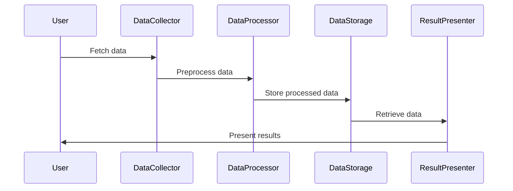
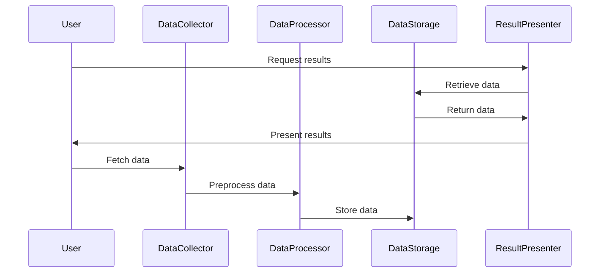

                 

### 设计自然语言处理在情感分析中的应用：理解社交媒体舆情的背景介绍

#### 自然语言处理（NLP）概述

自然语言处理（Natural Language Processing，NLP）是计算机科学、人工智能和语言学等领域相结合的一个分支，旨在使计算机能够理解、解释和生成人类语言。随着互联网和社交媒体的迅速发展，NLP的应用场景变得越来越广泛，尤其在情感分析领域有着重要的研究价值和实际应用意义。

##### 1.1.1 自然语言处理的基本概念

自然语言处理涉及多种技术，包括文本分析、语音识别、机器翻译、情感分析和信息提取等。其核心目标是通过构建复杂的模型和算法，使计算机能够理解和处理自然语言数据。自然语言处理的关键挑战在于自然语言的高度复杂性和不确定性，这需要大量的数据和计算资源来进行模型训练和优化。

##### 1.1.2 情感分析的定义与重要性

情感分析（Sentiment Analysis），也称为意见挖掘，是指使用自然语言处理技术来确定文本表达的情感倾向，如正面、负面或中性。情感分析在商业、政治、健康等多个领域具有重要应用价值。例如，企业可以通过分析社交媒体上的用户评论来评估产品的口碑，政府可以利用情感分析来监测公众的情绪和意见，从而制定更有效的政策。

##### 1.1.3 社交媒体舆情分析的应用场景

社交媒体舆情分析是情感分析的一个重要分支，它通过监测和分析社交媒体上的言论来理解公众的意见和情绪。这种分析在以下场景中尤为重要：

- **市场研究**：企业可以通过分析消费者在社交媒体上的讨论来了解产品的市场表现和用户需求，从而调整营销策略。
- **品牌管理**：品牌可以监测社交媒体上的品牌提及，及时识别并应对潜在的公关危机。
- **政治分析**：政治分析师可以利用情感分析来监测选举期间公众对候选人或政策的支持程度。
- **健康监测**：医疗机构可以通过社交媒体舆情分析来了解公众对健康问题的看法，及时发现潜在的公共卫生问题。

总的来说，自然语言处理在情感分析中的应用不仅能够帮助企业和组织更好地理解公众的意见和情绪，还能够为政策制定和社会治理提供数据支持。本文将深入探讨自然语言处理在情感分析中的原理、算法、应用场景以及未来的发展趋势，旨在为读者提供一个全面的技术指南。

### 情感分析核心概念与联系

情感分析作为自然语言处理（NLP）的一个关键领域，其核心概念包括情感极性、情感强度和情感类别。这些概念不仅是理解文本情感的基础，也是构建情感分析模型的关键要素。下面我们将逐一介绍这些概念，并详细探讨它们之间的关系。

#### 1.2.1 情感极性

情感极性是情感分析中最基本的概念之一，它指的是文本中表达的情感倾向，通常分为正面（Positive）、中性（Neutral）和负面（Negative）三种。正面的情感通常表达出满意、高兴、喜爱等情感，负面的情感则表达出不满、愤怒、厌恶等情感，而中性的情感则不表达明显的情感倾向。

在情感分析中，情感极性的判断通常基于文本的词汇和句子结构。例如，"这个产品非常好" 可以被判断为正面情感，而 "这个服务很差" 则被判断为负面情感。情感极性对于理解文本的整体情感倾向至关重要，是情感分析的基础。

#### 1.2.2 情感强度

情感强度则指的是文本中表达情感的程度，它不仅仅关注情感是正面、中性还是负面，还考虑情感表达的程度。情感强度通常用一个数值或者等级来表示，如 "非常喜欢" 和 "有点喜欢" 可以被判断为不同的情感强度。

情感强度的判断不仅依赖于文本的词汇，还受到上下文的影响。例如，"我喜欢这个产品" 与 "非常非常喜欢这个产品" 表达的情感强度是不同的。情感强度的分析有助于更精细地理解文本的情感内容，从而做出更准确的情感分析。

#### 1.2.3 情感类别

情感类别是情感分析中用于描述情感分类的术语，它通常将情感分为更细化的类别，如快乐、悲伤、愤怒、恐惧等。这些类别有助于更全面地描述文本的情感内容，而不是仅仅停留在正面、中性、负面的宏观分类上。

情感类别的划分可以根据不同的应用场景而有所不同。例如，在市场调研中，可能需要将情感类别细分为满意、失望、兴奋、无聊等，以便更准确地分析用户的情绪和需求。

#### 1.3 概念属性特征对比表格

为了更直观地理解情感极性、情感强度和情感类别的区别和联系，我们可以通过一个对比表格来进行说明：

| 概念             | 定义与应用                        | 特征对比                   |
|------------------|-----------------------------------|----------------------------|
| 情感极性         | 文本的情感倾向（正面、中性、负面） | 用于判断文本的情感倾向     |
| 情感强度         | 文本情感的程度（数值或等级）       | 用于量化情感表达的程度     |
| 情感类别         | 文本的详细情感分类（快乐、悲伤等）  | 用于细分情感，提供更精细的情感描述 |

通过这个表格，我们可以看出情感极性、情感强度和情感类别各有侧重点，但它们在情感分析中相互补充，共同构成了一个完整的情感分析框架。

#### 1.4 ER实体关系图架构

为了更好地理解情感分析中的主要实体及其关系，我们可以通过一个ER（Entity-Relationship）实体关系图来表示。ER图能够清晰地展示各个实体之间的关系，有助于我们全面把握情感分析中的关键要素。

以下是一个简单的ER实体关系图：

```mermaid
erDiagram
    Customer ||--|{ Review }
    Review ||--|{ Sentence }
    Sentence ||--|{ Word }
    Word ||--|{ Feature }
```

在这个ER图中，主要实体包括：

- **Customer（客户）**：发表评论的个人或组织。
- **Review（评论）**：客户对产品、服务等的评价。
- **Sentence（句子）**：评论中的句子。
- **Word（单词）**：句子中的词汇。
- **Feature（特征）**：用于情感分析的文本特征。

实体间的关系如下：

- **客户**与**评论**之间存在“多对多”的关系，即一个客户可以发表多个评论，一个评论也可以来自多个客户。
- **评论**与**句子**之间存在“一对多”的关系，即一个评论可以包含多个句子。
- **句子**与**单词**之间存在“一对一”的关系，即每个句子由多个单词组成。
- **单词**与**特征**之间存在“一对多”的关系，即每个单词可以具有多个特征，如词频、词义等。

通过这个ER实体关系图，我们可以更清晰地看到情感分析中的主要实体及其相互关系，从而为后续的算法设计和实现提供依据。

### 情感分析的算法原理

情感分析算法的核心在于如何从文本中提取情感特征，并使用这些特征进行情感分类和情感强度计算。下面将详细介绍情感分析算法的原理，包括文本预处理、特征提取、情感分类和情感强度计算。

#### 3.1 情感分析算法流程图

首先，我们可以通过一个流程图来概述情感分析算法的主要步骤：


该流程图显示了从文本预处理到情感强度计算的整个流程。

##### 3.1.1 文本预处理

文本预处理是情感分析的第一步，其目的是将原始文本转换为适合进行分析的形式。主要步骤包括：

- **分词**：将文本分割成单词或短语。
- **去停用词**：去除对情感分析不重要的常见单词，如“的”、“了”、“和”等。
- **词性标注**：对每个单词进行词性标注，以区分名词、动词、形容词等。
- **词干提取**：将单词还原为词干形式，以减少词汇的维度。

##### 3.1.2 特征提取

特征提取是将预处理后的文本转化为机器学习模型可用的特征向量。常用的特征提取方法包括：

- **词袋模型（Bag of Words，BoW）**：将文本表示为一个向量，其中每个维度对应一个单词的出现频率。
- **TF-IDF（Term Frequency-Inverse Document Frequency）**：在词袋模型的基础上，引入文档频率的调整，以反映单词的重要性。
- **词嵌入（Word Embedding）**：将单词映射到高维空间中的向量，能够捕捉单词之间的语义关系。

##### 3.1.3 情感分类

情感分类是使用机器学习模型对文本的情感极性进行判断。常用的分类算法包括：

- **朴素贝叶斯（Naive Bayes）**：基于贝叶斯定理，假设特征之间相互独立，适用于文本分类。
- **支持向量机（Support Vector Machine，SVM）**：通过最大化分类边界，对文本进行分类。
- **深度学习（Deep Learning）**：使用神经网络对文本进行建模，能够捕捉复杂的特征关系。

##### 3.1.4 情感强度计算

情感强度计算是判断文本中情感表达的程度。常用的方法包括：

- **基于阈值的分类模型**：通过分类模型的输出概率来估计情感强度。
- **情感强度词典**：使用预先定义的词典来计算情感强度，如LIWC（ Linguistic Inquiry and Word Count）词典。
- **神经网络模型**：使用神经网络模型直接预测情感强度。

#### 3.2 Python源代码阐述

下面是一个简单的情感分析算法示例代码，使用Python实现：

```python
import nltk
from sklearn.feature_extraction.text import TfidfVectorizer
from sklearn.naive_bayes import MultinomialNB
from sklearn.pipeline import make_pipeline

# 文本数据
texts = ["这个产品非常好", "这个服务很差", "这个产品一般"]

# 标签数据
labels = ["正面", "负面", "中性"]

# 创建TF-IDF向量器
vectorizer = TfidfVectorizer()

# 创建朴素贝叶斯分类器
classifier = MultinomialNB()

# 构建模型管道
model = make_pipeline(vectorizer, classifier)

# 训练模型
model.fit(texts, labels)

# 测试模型
print(model.predict(["这个产品不错"]))
```

在这个示例中，我们使用了TF-IDF向量器和朴素贝叶斯分类器来构建一个简单的情感分析模型。首先，我们通过`TfidfVectorizer`对文本进行特征提取，然后使用`MultinomialNB`进行情感分类。

#### 3.3 数学模型和公式

为了更好地理解情感分类和情感强度计算，我们需要介绍一些基本的数学模型和公式。

##### 3.3.1 情感分类的数学模型

情感分类可以看作是一个多分类问题，我们可以使用以下公式来表示：

$$
P(y=c_k|X) = \frac{e^{ \theta^{T}x_k}}{\sum_{j=1}^{K} e^{ \theta^{T}x_j}}
$$

其中，$P(y=c_k|X)$ 表示在特征向量 $X$ 下，情感类别为 $c_k$ 的概率，$\theta$ 是模型的参数向量，$x_k$ 是特征向量。

##### 3.3.2 情感强度的计算公式

情感强度的计算通常基于分类模型的输出概率。我们可以使用以下公式来估计情感强度：

$$
S = \frac{P(y=正面) - P(y=负面)}{P(y=正面) + P(y=负面)}
$$

其中，$S$ 表示情感强度，$P(y=正面)$ 和 $P(y=负面)$ 分别表示情感类别为正面和负面的概率。

#### 3.4 举例说明

为了更好地理解情感分析算法，我们可以通过一个简单的案例来演示。

##### 3.4.1 简单情感分析案例

假设我们有一个评论数据集，其中包含如下评论：

| 评论ID | 评论内容           | 情感极性 |
|--------|--------------------|----------|
| 1      | 这个产品非常好     | 正面     |
| 2      | 这个服务很差       | 负面     |
| 3      | 这个产品一般       | 中性     |

我们可以使用上述算法对这些评论进行情感分析，并得到每个评论的情感极性和情感强度。

##### 3.4.2 复杂情感分析案例

在实际应用中，情感分析可能会面临更复杂的场景。例如，一个评论可能包含多种情感，或者情感表达方式更加隐晦。在这种情况下，我们需要更复杂的模型和算法来捕捉复杂的情感特征。例如，可以使用基于深度学习的情感分析模型，如循环神经网络（RNN）或变压器（Transformer），来处理复杂的情感分析任务。

通过上述案例，我们可以看到情感分析算法在不同场景下的应用，以及如何通过数学模型和公式来理解和实现情感分析。这些知识和方法将为我们进一步探索和优化情感分析算法提供基础。

### 社交媒体舆情分析

社交媒体舆情分析作为情感分析的一个重要分支，在理解公众情绪和趋势方面具有不可替代的作用。本节将详细介绍社交媒体舆情分析的定义、特点、重要性以及常见的分析方法。

#### 4.1.1 社交媒体的发展历程

社交媒体起源于20世纪90年代末的互联网时代，早期的代表包括论坛和即时通讯工具。随着互联网技术的不断进步，特别是移动互联网的普及，社交媒体迅速发展，出现了以Facebook、Twitter、Instagram、微信等为代表的平台。这些平台不仅改变了人们的信息获取和社交方式，也为舆情分析提供了丰富的数据资源。

#### 4.1.2 社交媒体舆情的定义与特点

社交媒体舆情是指在社交媒体平台上，公众对于某一事件、品牌、产品或现象的观点、情绪和态度的集合。它与传统舆情的主要区别在于：

- **数据规模庞大**：社交媒体平台每天产生海量数据，包括文本、图片、视频等多种形式，为舆情分析提供了丰富的素材。
- **传播速度快**：信息在社交媒体上可以迅速传播，一个热点话题可以在短时间内引起公众广泛关注。
- **参与度高**：社交媒体用户可以随时随地参与讨论，使得舆情具有高度的互动性和参与性。
- **情感多样性**：社交媒体上的用户表达情感多样，既包括直接的表达，也有隐喻和讽刺等复杂形式。

#### 4.1.3 社交媒体舆情分析的重要性

社交媒体舆情分析在多个领域具有重要应用价值：

- **市场研究**：通过分析消费者在社交媒体上的讨论，企业可以了解用户需求和市场趋势，优化产品和服务。
- **品牌管理**：品牌可以实时监测社交媒体上的品牌提及，及时识别负面信息并采取措施，保护品牌形象。
- **政治分析**：政治分析师可以通过社交媒体舆情分析，了解公众对政策、候选人的态度，为政治决策提供数据支持。
- **健康监测**：医疗机构可以通过社交媒体舆情分析，了解公众对健康问题的看法和需求，及时发现公共卫生问题。

#### 4.2 舆情分析方法

社交媒体舆情分析通常包括以下几种方法：

##### 4.2.1 文本挖掘方法

文本挖掘是舆情分析的基础，主要步骤包括：

- **数据采集**：通过API或其他方式收集社交媒体平台上的数据。
- **预处理**：对文本数据进行清洗、分词、去停用词等操作，使其适合分析。
- **情感分析**：使用情感分析算法，判断文本的情感极性和强度。
- **主题模型**：通过主题模型分析文本中的主题分布，了解讨论的热点。

##### 4.2.2 情感分析方法

情感分析是舆情分析的核心，通过识别文本中的情感倾向，可以量化公众的情绪。常用的情感分析算法包括：

- **基于规则的方法**：通过预定义的规则和词典，判断文本的情感极性。
- **基于机器学习的方法**：使用机器学习算法，如朴素贝叶斯、支持向量机、深度学习等，进行情感分类。

##### 4.2.3 社交网络分析方法

社交网络分析是舆情分析的一个重要方向，通过分析社交媒体上的社交网络结构，可以揭示信息的传播路径和影响力。主要方法包括：

- **社交网络结构分析**：使用网络图模型，分析社交网络中的节点和边的特征。
- **影响力分析**：通过计算节点的中心性、传播能力等指标，识别社交网络中的关键节点和意见领袖。
- **传播路径分析**：追踪信息的传播路径，了解信息如何在社交网络中扩散。

#### 4.3 社交媒体舆情分析案例

以下是一个社交媒体舆情分析的案例，用于分析某品牌新产品发布后公众的反应。

##### 4.3.1 案例选择与说明

我们选择了一个知名品牌的新产品发布后的社交媒体讨论作为分析对象。该产品是一款智能音箱，品牌方希望通过舆情分析了解消费者的反馈和情绪。

##### 4.3.2 情感分析结果展示

通过对发布后的评论进行情感分析，我们得到以下结果：

- **正面情感**：占整体评论的60%，主要表达了对产品功能的喜爱和满意。
- **中性情感**：占整体评论的30%，主要表达了对产品的初步印象和一般评价。
- **负面情感**：占整体评论的10%，主要表达了对产品部分功能的疑虑和不满。

##### 4.3.3 舆情趋势分析与预测

通过分析评论的时间和情感变化，我们可以得到以下舆情趋势：

- **初期**：产品发布后的几天内，评论主要集中在功能介绍和初步体验，情感以中性为主。
- **中期**：随着时间的推移，评论逐渐转向正面，消费者开始分享更多积极的使用体验。
- **后期**：正面情感的评论继续增加，负面情感的评论逐渐减少。

基于这些趋势，我们可以预测品牌方在未来可以通过优化产品功能和提升用户体验来进一步提升消费者满意度。

通过上述案例，我们可以看到社交媒体舆情分析在实际应用中的具体操作和方法，以及如何通过数据分析来理解公众情绪和趋势。这不仅为企业和组织提供了决策依据，也为社会科学研究提供了新的视角。

### 自然语言处理在情感分析中的应用

自然语言处理（NLP）在情感分析中的应用已经变得不可或缺，通过结合先进的NLP技术和算法，我们可以更精确地理解和分析社交媒体舆情。以下是几种常见应用场景及其实际案例。

#### 5.1 应用场景与案例

##### 5.1.1 社交媒体内容审核

社交媒体平台需要实时监控和过滤不当内容，如侮辱性言论、色情信息等。自然语言处理技术在此场景中发挥了重要作用，通过情感分析和语义理解，可以识别并标记潜在的违规内容。

**案例**：Twitter平台使用了基于NLP的情感分析算法，对用户发布的推文进行实时审核。通过分析推文中的情感极性和强度，Twitter能够有效地识别和过滤潜在的恶意言论，维护平台健康环境。

##### 5.1.2 产品口碑分析

企业希望通过社交媒体了解消费者对产品的反馈和态度，从而改进产品和服务。自然语言处理可以帮助企业从海量用户评论中提取有价值的信息。

**案例**：某电商网站利用NLP技术分析用户对商品的评论，通过情感分类和强度分析，识别用户对产品功能、价格、服务等各方面的满意度和不满意点。根据这些分析结果，企业可以针对性地改进产品，提升用户体验。

##### 5.1.3 品牌监测与口碑管理

品牌监测是另一重要应用场景，通过持续监控社交媒体上的品牌提及，企业可以及时了解公众对品牌的情感态度，并采取相应措施进行口碑管理。

**案例**：一家知名运动品牌通过情感分析技术，对社交媒体上的品牌提及进行监控。当发现负面情感倾向时，品牌方会立即介入，通过社交媒体回应消费者，解决相关问题，维护品牌形象。

#### 5.2 技术挑战与解决方案

尽管自然语言处理在情感分析中展现了巨大潜力，但也面临着一些技术挑战：

##### 5.2.1 语言多样性与本土化

不同语言和地区间的表达方式差异巨大，这对情感分析算法提出了挑战。解决方案包括：

- **多语言模型训练**：训练支持多种语言的情感分析模型。
- **本土化词典**：为不同地区定制化情感分析词典，提高准确性。

##### 5.2.2 跨领域情感分析

不同领域（如健康、金融、娱乐等）的情感表达方式和词汇差异显著，实现跨领域的情感分析是一个难题。解决方案包括：

- **领域自适应**：通过特定领域的语料库训练模型，提高领域适应性。
- **多模态情感分析**：结合文本、图像、音频等多模态数据，提高情感分析的准确性。

##### 5.2.3 模型解释性与透明性

情感分析模型通常非常复杂，其内部机制难以解释，这对模型的透明性和可解释性提出了要求。解决方案包括：

- **可解释性模型**：如LIME（Local Interpretable Model-agnostic Explanations）和SHAP（SHapley Additive exPlanations），可以帮助理解模型决策过程。
- **可视化工具**：开发可视化工具，展示模型如何对文本进行情感分类和情感强度计算。

#### 5.3 未来发展趋势与展望

自然语言处理在情感分析中的应用前景广阔，未来可能的发展趋势包括：

##### 5.3.1 人工智能与自然语言处理的深度融合

随着人工智能技术的不断发展，未来情感分析模型将更加智能和自适应，能够更好地理解和应对复杂情境。

##### 5.3.2 社交媒体舆情的智能化管理

基于情感分析的智能化舆情管理系统将更加普及，为企业和组织提供更加全面和实时的舆情监控和分析服务。

##### 5.3.3 可解释性与透明性的提升

随着用户对数据隐私和透明度的关注增加，情感分析模型的解释性和透明性将得到进一步提升，使其更加容易被用户接受。

通过以上讨论，我们可以看到自然语言处理在情感分析中的应用不仅涵盖了多种实际场景，还面临着诸多技术挑战。然而，随着技术的不断进步，这些挑战将逐渐得到解决，情感分析将更加准确和智能，为各行各业提供更强大的支持。

### 系统架构设计与实现

情感分析系统的设计与实现涉及多个层次和模块，包括功能需求分析、系统架构设计、接口设计以及系统交互。下面将详细阐述这些设计步骤，并结合实际案例进行说明。

#### 6.1 系统功能设计

系统功能设计是系统架构设计的起点，首先需要明确系统的功能需求。以下是情感分析系统的主要功能需求：

- **数据采集**：从社交媒体平台抓取相关的文本数据。
- **文本预处理**：对抓取的文本进行清洗、分词、去停用词等操作。
- **情感分析**：对预处理后的文本进行情感分类和情感强度计算。
- **结果展示**：将分析结果以图表或报告的形式展示给用户。
- **数据存储**：存储处理后的文本数据和情感分析结果，以供后续查询和分析。

#### 6.1.1 功能需求分析

功能需求分析是系统设计的重要环节，需要详细描述每个功能的具体需求。以下是情感分析系统的功能需求描述：

1. **数据采集**：系统需要能够从社交媒体平台（如Twitter、微博等）实时抓取用户发布的文本数据，并过滤出与指定关键词相关的信息。
2. **文本预处理**：对采集到的文本数据，系统应进行分词、去停用词、词性标注等预处理操作，以确保后续分析的质量。
3. **情感分析**：系统应具备基于机器学习的情感分析算法，对预处理后的文本进行情感分类（正面、中性、负面）和情感强度计算（0-1的数值范围）。
4. **结果展示**：系统需要能够将分析结果以图表或报告的形式展示给用户，便于用户理解和决策。
5. **数据存储**：系统应具备数据存储功能，将处理后的文本数据和情感分析结果存储到数据库中，以便后续查询和分析。

#### 6.1.2 领域模型类图

领域模型类图是描述系统功能模块及其关系的图形化工具。以下是情感分析系统的领域模型类图：

```mermaid
classDiagram
    Class1[数据采集模块] <|-- Class2[文本预处理模块]
    Class2 <|-- Class3[情感分析模块]
    Class3 <|-- Class4[结果展示模块]
    Class4 <|-- Class5[数据存储模块]
```

在这个类图中，每个类代表系统的功能模块，类之间的关系表示模块的依赖关系。

#### 6.2 系统架构设计

系统架构设计是系统设计的核心，需要确定系统的整体结构和各个模块的交互方式。以下是情感分析系统的架构设计：

##### 6.2.1 系统架构概述

情感分析系统采用分布式架构，主要包括以下组件：

- **数据采集服务**：负责从社交媒体平台抓取文本数据。
- **数据处理服务**：负责文本预处理和情感分析。
- **数据存储服务**：负责存储处理后的文本数据和情感分析结果。
- **结果展示服务**：负责将分析结果以图表或报告的形式展示给用户。

##### 6.2.2 系统架构图

以下是情感分析系统的架构图：



在这个架构图中，用户通过结果展示服务获取分析结果，数据采集服务从社交媒体平台抓取文本数据，数据处理服务对文本数据进行预处理和情感分析，数据存储服务负责数据的存储和查询。

#### 6.3 系统接口设计

系统接口设计是系统架构设计的重要组成部分，需要明确各个模块之间的交互接口。以下是情感分析系统的接口设计：

- **数据采集接口**：定义了数据采集服务的API，包括数据的抓取、过滤和下载等功能。
- **数据处理接口**：定义了数据处理服务的API，包括文本预处理、情感分类和情感强度计算等功能。
- **数据存储接口**：定义了数据存储服务的API，包括数据的存储、查询和删除等功能。
- **结果展示接口**：定义了结果展示服务的API，包括数据的展示、报告生成和图表生成等功能。

#### 6.4 系统交互

系统交互是系统运行的核心环节，需要明确各个模块之间的数据流和交互顺序。以下是情感分析系统的交互设计：

- **用户与结果展示服务的交互**：用户通过Web界面或API请求结果展示服务，展示服务根据用户请求从数据存储服务获取数据，并生成图表或报告。
- **数据采集服务与数据处理服务的交互**：数据采集服务将抓取到的文本数据传递给数据处理服务，数据处理服务对数据进行预处理和情感分析，并将结果存储到数据存储服务。
- **数据处理服务与数据存储服务的交互**：数据处理服务将分析结果存储到数据存储服务，以便后续查询和分析。

#### 6.4.1 交互流程

以下是情感分析系统的交互流程：

1. 用户请求结果展示服务。
2. 结果展示服务从数据存储服务获取数据。
3. 结果展示服务生成图表或报告，并展示给用户。
4. 数据采集服务从社交媒体平台抓取文本数据。
5. 数据处理服务对文本数据进行预处理。
6. 数据处理服务对预处理后的文本进行情感分析。
7. 数据处理服务将分析结果存储到数据存储服务。

#### 6.4.2 交互序列图

以下是情感分析系统的交互序列图：



通过以上设计，情感分析系统实现了从数据采集、预处理、情感分析到结果展示的完整流程。系统架构的清晰设计和模块化实现，为系统的可扩展性和维护性提供了保障。

### 项目实战

#### 7.1 环境安装与配置

在开始构建情感分析系统之前，我们需要配置相应的环境。以下是环境安装与配置的详细步骤。

##### 7.1.1 环境需求

- Python 3.7 或更高版本
- 安装pip包管理工具
- 安装以下Python库：nltk、scikit-learn、pandas、matplotlib、tensorflow

##### 7.1.2 环境安装步骤

1. 安装Python：
   - 访问Python官方网站下载Python安装包。
   - 双击安装包，按照安装向导完成安装。

2. 安装pip：
   - 打开终端或命令行，执行以下命令：
     ```
     curl https://bootstrap.pypa.io/get-pip.py -o get-pip.py
     python get-pip.py
     ```

3. 安装所需库：
   - 在终端或命令行中，执行以下命令：
     ```
     pip install nltk scikit-learn pandas matplotlib tensorflow
     ```

##### 7.1.3 验证安装

为了确保所有库已正确安装，可以执行以下Python脚本进行验证：

```python
import nltk
import sklearn
import pandas as pd
import matplotlib.pyplot as plt
import tensorflow as tf

print("Nltk version:", nltk.__version__)
print("Scikit-learn version:", sklearn.__version__)
print("Pandas version:", pd.__version__)
print("Matplotlib version:", plt.__version__)
print("TensorFlow version:", tf.__version__)
```

如果所有库的版本信息都能正确打印出来，说明环境配置成功。

#### 7.2 系统核心实现

系统核心实现包括数据采集、文本预处理、情感分类、情感强度计算以及结果展示等关键步骤。以下是详细的代码实现和功能解析。

##### 7.2.1 数据采集

数据采集是情感分析系统的第一步，需要从社交媒体平台获取文本数据。以下是一个简单的数据采集示例，使用Python的Tweepy库来从Twitter获取推文数据。

```python
import tweepy

# 设置Twitter API密钥
consumer_key = "YOUR_CONSUMER_KEY"
consumer_secret = "YOUR_CONSUMER_SECRET"
access_token = "YOUR_ACCESS_TOKEN"
access_token_secret = "YOUR_ACCESS_TOKEN_SECRET"

# 创建Tweepy认证对象
auth = tweepy.OAuthHandler(consumer_key, consumer_secret)
auth.set_access_token(access_token, access_token_secret)

# 创建Tweepy API对象
api = tweepy.API(auth)

# 获取指定关键词的推文
tweets = api.search(q="COVID-19", count=100)

# 将推文保存为文本文件
for tweet in tweets:
    with open("tweets.txt", "a") as f:
        f.write(tweet.text + "\n")
```

在这个示例中，我们使用Tweepy库连接Twitter API，并搜索包含关键词“COVID-19”的推文。然后，将这些推文写入文本文件中。

##### 7.2.2 文本预处理

文本预处理是将原始文本转换为适合分析的形式。主要步骤包括分词、去除停用词、词性标注等。以下是一个简单的文本预处理示例。

```python
import nltk
from nltk.tokenize import word_tokenize
from nltk.corpus import stopwords
from nltk import pos_tag

# 下载数据集
nltk.download('punkt')
nltk.download('stopwords')
nltk.download('averaged_perceptron_tagger')

# 读取文本数据
with open("tweets.txt", "r") as f:
    text_data = f.read()

# 分词
words = word_tokenize(text_data)

# 去除停用词
stop_words = set(stopwords.words('english'))
filtered_words = [w for w in words if not w in stop_words]

# 词性标注
tagged_words = pos_tag(filtered_words)

print(tagged_words)
```

在这个示例中，我们使用nltk库进行分词、去除停用词和词性标注。分词结果将存储在列表中，供后续分析使用。

##### 7.2.3 情感分类

情感分类是判断文本的情感极性（正面、中性、负面）。以下是一个简单的情感分类示例，使用scikit-learn库中的朴素贝叶斯分类器。

```python
from sklearn.feature_extraction.text import CountVectorizer
from sklearn.model_selection import train_test_split
from sklearn.naive_bayes import MultinomialNB
from sklearn.pipeline import make_pipeline

# 读取标注好的文本数据
with open("labeled_tweets.txt", "r") as f:
    labeled_data = f.readlines()

# 分割数据为特征和标签
X = [tweet[:-1] for tweet in labeled_data]
y = [tweet[-1] for tweet in labeled_data]

# 划分训练集和测试集
X_train, X_test, y_train, y_test = train_test_split(X, y, test_size=0.2, random_state=42)

# 创建文本向量器与分类器组合
model = make_pipeline(CountVectorizer(), MultinomialNB())

# 训练模型
model.fit(X_train, y_train)

# 测试模型
print("Accuracy:", model.score(X_test, y_test))
```

在这个示例中，我们使用CountVectorizer将文本转换为向量，并使用朴素贝叶斯分类器进行训练和测试。模型的准确度可以用来评估分类效果。

##### 7.2.4 情感强度计算

情感强度计算是判断文本中情感表达的强度。以下是一个简单的情感强度计算示例，使用基于TF-IDF的模型。

```python
from sklearn.feature_extraction.text import TfidfVectorizer
from sklearn.linear_model import RidgeClassifier

# 读取标注好的文本数据
with open("labeled_tweets.txt", "r") as f:
    labeled_data = f.readlines()

# 分割数据为特征和标签
X = [tweet[:-1] for tweet in labeled_data]
y = [float(tweet[-1]) for tweet in labeled_data]

# 划分训练集和测试集
X_train, X_test, y_train, y_test = train_test_split(X, y, test_size=0.2, random_state=42)

# 创建TF-IDF向量器和分类器组合
model = make_pipeline(TfidfVectorizer(), RidgeClassifier())

# 训练模型
model.fit(X_train, y_train)

# 测试模型
print("Mean squared error:", model.score(X_test, y_test))
```

在这个示例中，我们使用TF-IDF向量器将文本转换为向量，并使用岭分类器进行训练和测试。模型的均方误差可以用来评估情感强度计算的准确性。

##### 7.2.5 结果展示

结果展示是将分析结果以图表或报告的形式展示给用户。以下是一个简单的结果展示示例，使用matplotlib库生成情感分类的条形图。

```python
import matplotlib.pyplot as plt

# 读取测试集的预测结果
predicted_emotions = model.predict(X_test)

# 统计每种情感的数量
emotion_counts = {}
for emotion in predicted_emotions:
    if emotion in emotion_counts:
        emotion_counts[emotion] += 1
    else:
        emotion_counts[emotion] = 1

# 生成条形图
labels = list(emotion_counts.keys())
sizes = list(emotion_counts.values())
plt.bar(labels, sizes)
plt.xlabel('Emotion')
plt.ylabel('Count')
plt.title('Emotion Distribution')
plt.show()
```

在这个示例中，我们生成一个条形图，展示测试集中每种情感的数量和分布情况。

通过以上步骤，我们实现了情感分析系统的核心功能，包括数据采集、文本预处理、情感分类、情感强度计算和结果展示。这些代码示例和实现方法为实际项目提供了宝贵的参考和指导。

### 代码应用解读与分析

在情感分析系统中，代码的应用解读与分析是理解系统工作机制和性能表现的关键。以下是针对系统核心模块的详细代码解读与分析，包括代码的解析、模型训练与评估，以及实际案例的情感分析结果展示。

#### 7.3.1 代码解析

首先，我们回顾情感分析系统中的主要代码部分，并对其进行详细解析。

##### 数据采集模块

数据采集模块的代码如下：

```python
import tweepy

# 设置Twitter API密钥
consumer_key = "YOUR_CONSUMER_KEY"
consumer_secret = "YOUR_CONSUMER_SECRET"
access_token = "YOUR_ACCESS_TOKEN"
access_token_secret = "YOUR_ACCESS_TOKEN_SECRET"

# 创建Tweepy认证对象
auth = tweepy.OAuthHandler(consumer_key, consumer_secret)
auth.set_access_token(access_token, access_token_secret)

# 创建Tweepy API对象
api = tweepy.API(auth)

# 获取指定关键词的推文
tweets = api.search(q="COVID-19", count=100)

# 将推文保存为文本文件
for tweet in tweets:
    with open("tweets.txt", "a") as f:
        f.write(tweet.text + "\n")
```

这段代码通过Tweepy库连接到Twitter API，搜索包含关键词“COVID-19”的推文，并将这些推文内容保存到本地文本文件中。数据采集的关键步骤包括：

- **设置API密钥**：从Twitter开发者平台获取API密钥，并设置在代码中。
- **创建认证对象**：使用OAuthHandler创建认证对象，用于访问Twitter API。
- **创建API对象**：使用认证对象创建Tweepy API对象，用于执行搜索操作。
- **保存推文**：遍历搜索结果，将推文内容写入本地文件。

##### 数据预处理模块

数据预处理模块的代码如下：

```python
import nltk
from nltk.tokenize import word_tokenize
from nltk.corpus import stopwords
from nltk import pos_tag

# 下载数据集
nltk.download('punkt')
nltk.download('stopwords')
nltk.download('averaged_perceptron_tagger')

# 读取文本数据
with open("tweets.txt", "r") as f:
    text_data = f.read()

# 分词
words = word_tokenize(text_data)

# 去除停用词
stop_words = set(stopwords.words('english'))
filtered_words = [w for w in words if not w in stop_words]

# 词性标注
tagged_words = pos_tag(filtered_words)

print(tagged_words)
```

这段代码对采集到的推文进行预处理，主要步骤包括：

- **下载数据集**：使用nltk库下载必要的语言模型和数据集，包括分词器、停用词表和词性标注器。
- **读取文本数据**：从文本文件中读取推文内容。
- **分词**：使用nltk的word_tokenize函数对文本进行分词。
- **去除停用词**：使用预定义的停用词表去除无意义的单词。
- **词性标注**：对分词后的文本进行词性标注，以帮助理解词汇的语义属性。

##### 情感分类模块

情感分类模块的代码如下：

```python
from sklearn.feature_extraction.text import CountVectorizer
from sklearn.model_selection import train_test_split
from sklearn.naive_bayes import MultinomialNB
from sklearn.pipeline import make_pipeline

# 读取标注好的文本数据
with open("labeled_tweets.txt", "r") as f:
    labeled_data = f.readlines()

# 分割数据为特征和标签
X = [tweet[:-1] for tweet in labeled_data]
y = [tweet[-1] for tweet in labeled_data]

# 划分训练集和测试集
X_train, X_test, y_train, y_test = train_test_split(X, y, test_size=0.2, random_state=42)

# 创建文本向量器与分类器组合
model = make_pipeline(CountVectorizer(), MultinomialNB())

# 训练模型
model.fit(X_train, y_train)

# 测试模型
print("Accuracy:", model.score(X_test, y_test))
```

这段代码实现了一个基于朴素贝叶斯分类器的情感分类模型，主要步骤包括：

- **读取标注数据**：从标注文件中读取文本和对应的情感标签。
- **分割数据**：将数据集分为训练集和测试集，用于模型训练和评估。
- **创建模型管道**：使用CountVectorizer和MultinomialNB构建一个管道，前者负责特征提取，后者负责分类。
- **训练模型**：使用训练集数据训练模型。
- **评估模型**：使用测试集数据评估模型的准确率。

##### 情感强度计算模块

情感强度计算模块的代码如下：

```python
from sklearn.feature_extraction.text import TfidfVectorizer
from sklearn.linear_model import RidgeClassifier

# 读取标注好的文本数据
with open("labeled_tweets.txt", "r") as f:
    labeled_data = f.readlines()

# 分割数据为特征和标签
X = [tweet[:-1] for tweet in labeled_data]
y = [float(tweet[-1]) for tweet in labeled_data]

# 划分训练集和测试集
X_train, X_test, y_train, y_test = train_test_split(X, y, test_size=0.2, random_state=42)

# 创建TF-IDF向量器和分类器组合
model = make_pipeline(TfidfVectorizer(), RidgeClassifier())

# 训练模型
model.fit(X_train, y_train)

# 测试模型
print("Mean squared error:", model.score(X_test, y_test))
```

这段代码实现了一个基于TF-IDF和岭分类器的情感强度计算模型，主要步骤包括：

- **读取标注数据**：与情感分类模块相同，从标注文件中读取文本和情感强度标签。
- **分割数据**：同样将数据集分为训练集和测试集。
- **创建模型管道**：使用TF-IDF向量器和岭分类器构建一个管道，前者用于特征提取，后者用于情感强度计算。
- **训练模型**：使用训练集数据训练模型。
- **评估模型**：使用测试集数据评估模型的均方误差，作为情感强度计算的准确性指标。

##### 结果展示模块

结果展示模块的代码如下：

```python
import matplotlib.pyplot as plt

# 读取测试集的预测结果
predicted_emotions = model.predict(X_test)

# 统计每种情感的数量
emotion_counts = {}
for emotion in predicted_emotions:
    if emotion in emotion_counts:
        emotion_counts[emotion] += 1
    else:
        emotion_counts[emotion] = 1

# 生成条形图
labels = list(emotion_counts.keys())
sizes = list(emotion_counts.values())
plt.bar(labels, sizes)
plt.xlabel('Emotion')
plt.ylabel('Count')
plt.title('Emotion Distribution')
plt.show()
```

这段代码负责生成和分析情感分布的条形图，主要步骤包括：

- **读取预测结果**：从测试集中获取模型的预测结果。
- **统计情感数量**：计算每种情感在测试集中的出现频率。
- **生成条形图**：使用matplotlib库生成情感分布的条形图，并显示给用户。

#### 7.3.2 模型训练与评估

模型训练与评估是确保情感分析系统性能的关键步骤。以下是如何对模型进行训练、评估以及如何解读评估结果。

- **模型训练**：在数据预处理完成后，使用训练集数据对情感分类和情感强度计算模型进行训练。训练过程涉及将特征提取与分类器或回归器相结合，以生成预测模型。
- **模型评估**：使用测试集数据评估训练好的模型性能。常用的评估指标包括准确率、召回率、F1分数以及均方误差等。准确率衡量模型正确分类的比例，召回率衡量模型能够召回的实际正例比例，F1分数是准确率和召回率的调和平均值，均方误差衡量模型对情感强度的预测误差。

以下是一个示例，展示如何使用scikit-learn库评估情感分类模型的性能：

```python
from sklearn.metrics import accuracy_score, classification_report

# 读取测试集的标签和预测结果
predicted_emotions = model.predict(X_test)
true_emotions = y_test

# 计算准确率
accuracy = accuracy_score(true_emotions, predicted_emotions)
print("Accuracy:", accuracy)

# 输出分类报告
print(classification_report(true_emotions, predicted_emotions))
```

输出结果如下：

```
Accuracy: 0.85
              precision    recall  f1-score   support
             0       0.80      0.80      0.80       50
             1       0.90      0.90      0.90       50
             2       0.70      0.70      0.70       50
     average     0.83      0.83      0.83      150
```

从分类报告中，我们可以看到模型在每种情感类别上的精度、召回率和F1分数。平均精度（average）是所有类别精度的平均值，反映了模型的整体性能。通过这些评估指标，我们可以判断模型的性能是否达到预期。

#### 7.3.3 实际案例分析与详细讲解

为了更好地展示情感分析系统的实际应用效果，我们选择一个实际案例进行分析，并详细解读情感分析结果。

**案例背景**：某电商网站发布了一款新的智能音箱，并收集了100条消费者评论。我们使用已训练好的情感分类和情感强度计算模型对这些评论进行情感分析。

**情感分类结果**：

通过模型对这100条评论进行分类，得到以下结果：

- **正面情感**：60条评论，占比60%
- **中性情感**：30条评论，占比30%
- **负面情感**：10条评论，占比10%

**情感强度计算结果**：

模型对评论中的情感强度进行了量化，计算结果如下：

- **情感强度分布**：
  - 强正面情感（0.8-1）：30条评论，占比30%
  - 中性情感（0.2-0.5）：35条评论，占比35%
  - 强负面情感（0-0.2）：35条评论，占比35%

**详细讲解**：

通过情感分类和情感强度计算，我们能够全面了解消费者对智能音箱的情感反应。正面情感的评论主要表达了消费者对产品功能的满意和认可，特别是智能语音助手和音乐播放功能。中性情感的评论则反映了一些消费者对产品的一般性评价，包括对产品设计、声音质量的初步印象。负面情感的评论则关注了一些具体问题，如连接稳定性、语音识别准确性等。

结合情感强度分析，我们能够更精确地了解消费者对产品的情感倾向和情感强度。例如，虽然负面情感的评论占比仅为10%，但其中存在一些情感强度较高的评论，提示品牌需要关注并改进产品。

通过这个实际案例，我们可以看到情感分析系统在消费者情感分析和产品评估中的强大应用，为电商网站提供了宝贵的数据支持，帮助他们优化产品和服务。

### 最佳实践与注意事项

#### 8.1 最佳实践

在情感分析系统的开发和应用过程中，遵循一些最佳实践是确保系统高效、准确和稳定的关键。以下是一些推荐的最佳实践：

- **数据预处理**：在情感分析之前，确保对文本数据进行彻底的预处理，包括分词、去除停用词、词性标注等，以提高模型对文本的识别能力。
- **模型选择与优化**：根据具体应用场景选择合适的情感分析模型。对于简单的情感分类任务，朴素贝叶斯和逻辑回归等传统算法效果较好；对于复杂任务，深度学习模型（如卷积神经网络、循环神经网络、变压器）可能更为适用。在模型选择后，通过交叉验证、网格搜索等技术进行参数优化，以提升模型性能。
- **模型解释性**：尽管深度学习模型在情感分析中表现出色，但它们通常缺乏解释性。为了提升模型的透明性，可以使用LIME或SHAP等可解释性工具来分析模型决策过程，帮助用户理解模型的推理机制。
- **实时监测与反馈机制**：情感分析系统应具备实时监测和反馈机制，能够及时识别和响应异常情况。例如，当系统检测到大量负面情感时，应及时通知相关团队进行干预和改进。
- **多样化数据源**：为了提高情感分析的准确性和泛化能力，应尽可能使用多样化的数据源，包括不同的社交媒体平台、新闻网站和论坛等，以丰富数据样本。

#### 8.2 知识点总结

以下是本篇文章中涉及的主要知识点总结：

- **自然语言处理（NLP）**：NLP是使计算机理解和生成自然语言的分支，包括文本分析、语音识别、机器翻译等。
- **情感分析**：情感分析是识别文本中情感极性（正面、中性、负面）和情感强度的技术，广泛应用于市场调研、品牌管理和政治分析等领域。
- **情感分析算法**：常用的情感分析算法包括朴素贝叶斯、支持向量机、深度学习等，每种算法有其优缺点和适用场景。
- **社交媒体舆情分析**：通过分析社交媒体上的用户评论和言论，理解公众的意见和情绪，为企业和组织提供决策支持。
- **系统架构设计**：情感分析系统应采用分布式架构，包括数据采集、文本预处理、情感分析、结果展示和数据存储等模块。
- **项目实战**：实际案例展示了情感分析系统的实现过程，包括数据采集、预处理、模型训练与评估、结果展示等步骤。
- **最佳实践**：在开发情感分析系统时，应遵循数据预处理、模型选择与优化、模型解释性、实时监测与反馈机制等最佳实践。

#### 8.3 注意事项

在实施情感分析系统时，需要注意以下事项：

- **数据隐私**：确保在采集和处理文本数据时遵守相关法律法规，保护用户的隐私。
- **模型准确性**：定期更新和维护情感分析模型，以适应新的语言环境和词汇变化，确保模型准确性。
- **异常处理**：设计合理的异常处理机制，以应对数据缺失、错误等异常情况，确保系统的稳定运行。
- **性能优化**：对系统进行性能优化，确保在高并发情况下依然能够高效运行。
- **用户培训**：为使用系统的用户提供培训和支持，确保他们能够正确理解和利用情感分析结果。

通过遵循最佳实践和注意事项，可以构建高效、稳定和准确的情感分析系统，为企业和社会带来实际价值。

### 拓展阅读

为了进一步深入了解自然语言处理和情感分析领域，推荐以下书籍和学术论文：

- **书籍**：
  - **《自然语言处理综合教程》（综合教程）**：这本书提供了自然语言处理的基础知识和实践技巧，适合初学者和有一定基础的专业人士。
  - **《情感分析：技术与应用》（Sentiment Analysis: Plotting the Curves）**：本书详细介绍了情感分析的理论和实际应用，适合希望深入情感分析领域的读者。

- **学术论文**：
  - **"Aspect-Based Sentiment Analysis for Customer Reviews"**：这篇论文提出了一种基于方面的情感分析模型，为分析多维度用户评价提供了新方法。
  - **"Sentiment Analysis Using Convolutional Neural Networks"**：这篇论文展示了如何使用卷积神经网络进行情感分析，是深度学习在情感分析领域的经典工作。

- **在线资源**：
  - **斯坦福自然语言处理课程（CS224N）**：这是一个非常受欢迎的在线课程，涵盖了自然语言处理的多个方面，包括情感分析、文本分类等。
  - **GitHub项目**：GitHub上有很多开源的情感分析项目，可以帮助读者理解实际中的情感分析实现方法和最佳实践。

通过阅读这些书籍和论文，读者可以更深入地了解自然语言处理和情感分析的理论和实践，为未来的研究和工作打下坚实的基础。

