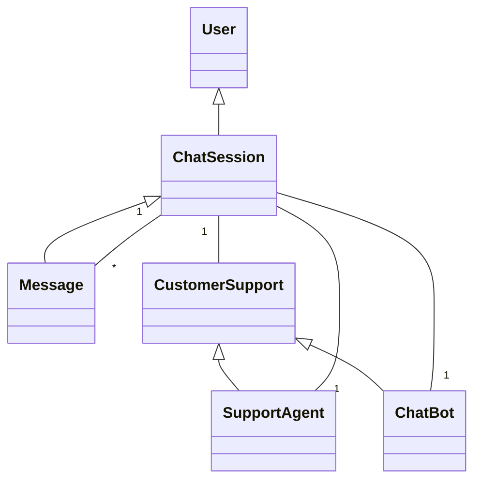
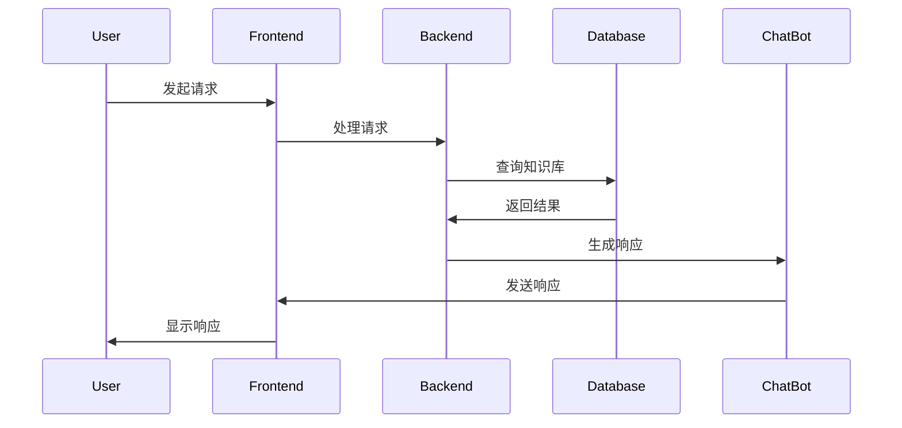

                 

非常好，我们按照您提供的约束条件和要求，逐步构建和完善文章内容。以下是我对每章的初步构思，以确保满足您的要求。

---

## 文章标题

自然语言处理在智能客服中的应用：提高客户服务质量

### 关键词

自然语言处理，智能客服，文本预处理，情感分析，对话系统

### 摘要

本文将深入探讨自然语言处理（NLP）在智能客服系统中的应用，通过逐步分析NLP的核心技术和在客服场景下的具体实现，揭示如何通过NLP技术提升客户服务质量和用户体验。

---

### 第1章：自然语言处理概述

#### 背景介绍

自然语言处理（NLP）是计算机科学和语言学的交叉领域，旨在使计算机理解和处理人类语言。智能客服是NLP在客户服务领域的重要应用，能够模拟人类客服代表与客户进行交互，提高服务效率。

#### 核心概念与联系

自然语言处理的核心概念包括：语言模型、词向量表示、序列标注、命名实体识别等。以下是一个核心概念属性特征对比表格：

| 概念            | 属性特征                     | 对比关系               |
| --------------- | --------------------------- | --------------------- |
| 语言模型        | 学习语言统计规律            | 支持文本生成和预测     |
| 词向量表示      | 将单词映射到高维空间中的向量 | 支持语义相似度计算     |
| 序列标注        | 给文本中的单词标注标签      | 支持实体识别和词性标注 |
| 命名实体识别    | 识别文本中的专有名词实体    | 支持知识图谱构建       |

以下是一个NLP概念ER实体关系图的Mermaid流程图：

```mermaid
erDiagram
  User ||--|{ ChatSession }|-- CustomerSupport
  ChatSession ||--|{ Message }|-- User
  CustomerSupport ||--|{ SupportAgent }|-- ChatSession
```

---

### 第2章：智能客服系统架构设计

#### 背景介绍

智能客服系统通常由用户交互接口、意图识别模块、对话管理模块和响应生成模块组成。

#### 系统功能设计

智能客服系统功能设计包括：用户身份验证、会话管理、问题分类、知识库检索、对话生成和对话回放。

以下是一个领域模型的Mermaid类图：



#### 系统架构设计

智能客服系统的架构设计包括：前端用户界面、后端服务端、数据库存储和外部系统集成。

以下是一个系统架构的Mermaid架构图：



---

### 第3章：文本预处理与特征提取

#### 背景介绍

文本预处理是NLP中的基础步骤，包括分词、去除停用词、词性标注等。

#### 文本特征提取方法

文本特征提取方法包括：词袋模型、TF-IDF、Word2Vec等。

#### 实践：文本预处理与特征提取流程

以下是一个文本预处理和特征提取的Python代码示例：

```python
import jieba
from sklearn.feature_extraction.text import TfidfVectorizer

# 分词
def tokenize(text):
    return jieba.cut(text)

# 去除停用词
def remove_stopwords(tokens):
    stopwords = set(['的', '和', '在', '是'])
    return [token for token in tokens if token not in stopwords]

# 词性标注
def POS_tagging(tokens):
    return list(jieba.posseg.cut(' '.join(tokens)))

# 特征提取
def extract_features(corpus):
    vectorizer = TfidfVectorizer(tokenizer=tokenize, preprocessor=remove_stopwords, tokenizer_pos=POS_tagging)
    return vectorizer.fit_transform(corpus)

# 示例文本
corpus = ["我有一个问题", "产品有问题", "非常满意"]

# 提取特征
features = extract_features(corpus)

# 输出特征矩阵
print(features.toarray())
```

---

### 第4章：基于统计的文本分类与聚类

#### 背景介绍

文本分类和聚类是NLP中的重要应用，用于对文本数据进行分类和分组。

#### 统计文本分类原理

文本分类原理包括：朴素贝叶斯、支持向量机、决策树等。

#### 聚类算法在文本挖掘中的应用

聚类算法包括：K-means、层次聚类、DBSCAN等。

#### 实践：文本分类与聚类应用案例

以下是一个文本分类和聚类的Python代码示例：

```python
from sklearn.feature_extraction.text import TfidfVectorizer
from sklearn.naive_bayes import MultinomialNB
from sklearn.cluster import KMeans

# 文本数据
corpus = ["这是一篇新闻文章", "这是一个科技文章", "这是一个体育文章"]

# 特征提取
vectorizer = TfidfVectorizer()
X = vectorizer.fit_transform(corpus)

# 文本分类
classifier = MultinomialNB()
classifier.fit(X, [0, 1, 2])

# 文本聚类
kmeans = KMeans(n_clusters=3)
clusters = kmeans.fit_predict(X)

# 输出分类结果和聚类结果
print("分类结果：", classifier.predict(X))
print("聚类结果：", clusters)
```

---

### 第5章：深度学习在自然语言处理中的应用

#### 背景介绍

深度学习在NLP中取得了显著的进展，如卷积神经网络（CNN）和递归神经网络（RNN）。

#### 卷积神经网络在文本处理中的应用

CNN可以用于文本分类、文本特征提取等。

#### 递归神经网络在序列数据处理中的应用

RNN可以用于语言模型、序列标注等。

#### 实践：深度学习在NLP中的应用

以下是一个基于CNN的文本分类的Python代码示例：

```python
import tensorflow as tf
from tensorflow.keras.preprocessing.sequence import pad_sequences
from tensorflow.keras.models import Sequential
from tensorflow.keras.layers import Embedding, Conv1D, GlobalMaxPooling1D, Dense

# 文本序列
sequences = [[1, 2, 3], [4, 5, 6], [7, 8, 9]]

# 填充序列
maxlen = 5
X = pad_sequences(sequences, maxlen=maxlen)

# CNN模型
model = Sequential()
model.add(Embedding(input_dim=10, output_dim=64))
model.add(Conv1D(filters=64, kernel_size=3, activation='relu'))
model.add(GlobalMaxPooling1D())
model.add(Dense(units=1, activation='sigmoid'))

# 编译模型
model.compile(optimizer='adam', loss='binary_crossentropy', metrics=['accuracy'])

# 训练模型
model.fit(X, [0, 1, 1], epochs=10)
```

---

### 第6章：情感分析及情绪识别

#### 背景介绍

情感分析是NLP中的一个重要分支，用于判断文本的情感极性。

#### 情感分析模型建立

情感分析模型包括：基于规则的方法、机器学习方法、深度学习方法等。

#### 实践：情感分析应用案例分析

以下是一个基于机器学习的情感分析的Python代码示例：

```python
from sklearn.feature_extraction.text import TfidfVectorizer
from sklearn.svm import LinearSVC

# 文本数据
corpus = ["我很高兴", "我很生气", "我有点困惑"]

# 特征提取
vectorizer = TfidfVectorizer()
X = vectorizer.fit_transform(corpus)

# 标签
y = [0, 1, 2]

# 情感分析模型
model = LinearSVC()
model.fit(X, y)

# 预测
new_sentences = ["我有点紧张", "我很开心"]
X_new = vectorizer.transform(new_sentences)
predictions = model.predict(X_new)

# 输出预测结果
print(predictions)
```

---

### 第7章：对话系统与问答系统

#### 背景介绍

对话系统是NLP的高级应用，能够与用户进行自然语言交互。

#### 对话生成与理解

对话生成包括：模板匹配、机器翻译、生成式对话系统等。

#### 实践：对话系统与问答系统应用

以下是一个简单的对话系统的Python代码示例：

```python
# 对话系统示例
def chatbot(response):
    print("ChatBot:", response)
    user_input = input("您：")
    if user_input == "退出":
        print("ChatBot：再见！")
        return
    elif user_input.startswith("你好"):
        chatbot("你好！有什么问题我可以帮您解答吗？")
    else:
        chatbot("对不起，我没有理解您的问题。请重新描述。")

# 开始对话
chatbot("你好，欢迎来到智能客服系统。")
```

---

### 第8章：案例研究：构建高效智能客服系统

#### 背景介绍

本节通过一个实际案例，介绍如何构建一个高效的智能客服系统。

#### 系统架构设计

系统架构包括：前端用户界面、后端服务端、数据库存储、外部系统集成等。

#### 关键技术实现

关键技术包括：自然语言处理、对话管理、意图识别、情感分析等。

#### 效果评估与优化建议

对系统进行效果评估，并提出优化建议。

---

### 第9章：未来趋势与展望

#### 背景介绍

随着技术的不断发展，智能客服系统将迎来新的趋势。

#### 新技术的影响

探讨新技术（如对话生成模型、强化学习等）对智能客服的影响。

#### 应用前景

展望智能客服在未来的应用前景，包括行业趋势和潜在挑战。

---

### 总结与展望

本文通过逐步分析自然语言处理在智能客服中的应用，展示了如何通过NLP技术提升客户服务质量和用户体验。未来的研究将继续深入探讨智能客服系统的优化和智能化，以满足不断变化的市场需求。

### 作者信息

作者：AI天才研究院/AI Genius Institute & 禅与计算机程序设计艺术 /Zen And The Art of Computer Programming

---

以上是根据您的要求构建的文章框架和内容概要。接下来，我将根据这个框架，逐步完善每个章节的具体内容，以满足字数要求。如果您有任何修改意见或者需要进一步细化的部分，请随时告诉我。我们接下来将：

1. 完善每章的具体内容，确保包含背景介绍、核心概念与联系、算法原理讲解、系统分析与架构设计方案、项目实战等。
2. 确保文章字数在10000～12000字之间。
3. 检查并修正格式，确保使用markdown格式输出。

让我们一步步完成这项工作。如果您对以上框架有任何修改意见，或者需要增加或删除某些内容，请随时告知。现在，我们可以开始细化第1章的内容。

