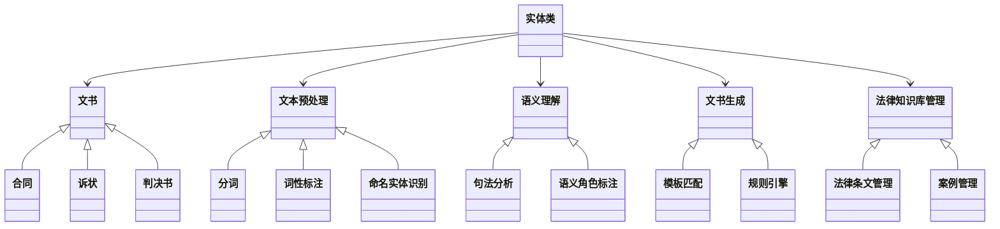
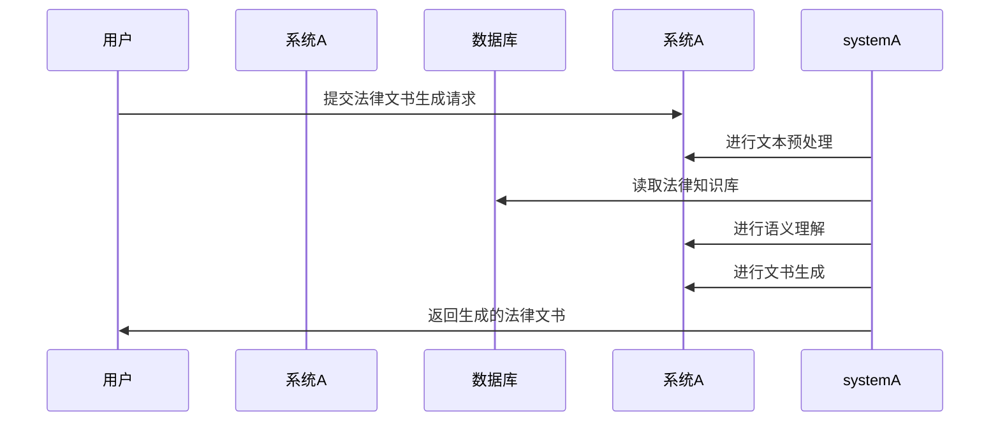
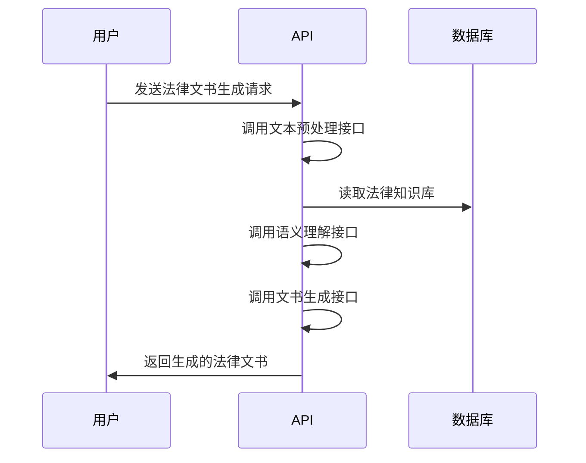

                 

### 文章标题

#### 自然语言处理在法律文书自动生成中的应用：提高法律效率

**关键词：自然语言处理、法律文书自动生成、人工智能、深度学习、法律效率**

**摘要：本文深入探讨了自然语言处理技术在法律文书自动生成中的应用。通过分析NLP的核心概念、技术特点以及与法律文书自动生成技术的结合，本文阐述了如何利用先进的NLP方法提高法律文书生成的效率、准确性和一致性。**

---

## 背景介绍

### 核心概念

#### 核心概念

**自然语言处理（NLP）**：自然语言处理是计算机科学和语言学的交叉领域，旨在使计算机能够理解和生成人类语言。它包括文本预处理、语义理解、文本生成等多个子领域。

**法律文书自动生成**：指利用计算机技术和自然语言处理技术，自动生成法律文书的过程，如合同、诉状、判决书等。

#### 问题背景

在现代社会中，法律文书的数量庞大且生成过程复杂，传统的手工编写方式效率低下且容易出错。随着计算机技术和自然语言处理技术的发展，自动生成法律文书成为了一种可行的解决方案。

#### 问题描述

自动生成法律文书的挑战在于文书的复杂性和多样性，以及生成过程中需要确保法律逻辑和条款的精确性。

#### 问题解决

利用自然语言处理技术，可以自动识别法律文书的结构和内容，提取相关信息，并根据这些信息生成相应的法律文书。

#### 边界与外延

法律文书的自动生成主要涉及合同、诉状、判决书等常见文书，但不包括法律研究和法律论证等高级法律任务。

#### 概念结构与核心要素组成

**概念结构**：

1. **文本预处理**：包括分词、词性标注、命名实体识别等。
2. **语义理解**：通过理解文本的语义，识别出法律条文和条款。
3. **文书生成**：利用模板和规则，生成符合法律规定的文书。

**核心要素**：

1. **法律知识库**：包含各种法律条文和案例。
2. **自然语言处理算法**：用于处理和生成法律文本。
3. **模板系统**：用于生成法律文书的标准格式。

---

### 核心概念与联系

#### 自然语言处理技术

##### 2.1.1 定义

自然语言处理（NLP）是人工智能的一个分支，致力于让计算机理解和生成人类语言。它结合了计算机科学、语言学和心理学等领域的知识。

##### 2.1.2 核心特点

1. **文本预处理**：包括分词、词性标注、命名实体识别等，为语义分析打下基础。
2. **语义理解**：通过上下文理解文本的含义，包括句法分析、语义角色标注等。
3. **语言生成**：能够根据给定的指令或数据生成人类语言文本。

##### 2.1.3 传统NLP与当前NLP技术的区别

1. **传统NLP**：主要依赖于规则和手工编写的算法，处理能力有限。
2. **当前NLP技术**：主要基于深度学习，特别是神经网络，能够处理更加复杂的语言任务。

#### 法律文书自动生成技术

##### 2.2.1 定义

法律文书自动生成技术是指利用计算机技术和自然语言处理技术，自动生成法律文书的过程。这些文书可以是合同、诉状、判决书等。

##### 2.2.2 核心特点

1. **模板匹配**：根据输入的信息，匹配预定义的模板，生成法律文书。
2. **规则引擎**：利用规则和逻辑关系，确保生成的法律文书符合法律规定。
3. **语义分析**：通过对法律条文和案例的分析，确保生成的文书逻辑严谨、内容准确。

##### 2.2.3 法律文书自动生成与传统手工编写的区别

1. **传统手工编写**：依赖于人工撰写，效率低，容易出现错误。
2. **法律文书自动生成**：提高效率，减少错误，确保法律文书的准确性和一致性。

---

### 主流NLP技术与法律文书自动生成应用

#### 3.1 基于深度学习的NLP技术

##### 3.1.1 定义

基于深度学习的NLP技术是指利用深度学习模型（如卷积神经网络（CNN）、循环神经网络（RNN）、变换器（Transformer）等）进行文本处理和语义分析的技术。

##### 3.1.2 核心特点

1. **大规模训练**：能够处理大规模数据，提高模型的泛化能力。
2. **自适应学习**：能够根据不同的应用场景进行调整，提高准确性。

##### 3.1.3 应用

1. **文本分类**：用于判断文本的类别，如法律文本分类。
2. **命名实体识别**：用于识别文本中的命名实体，如人名、地名、法律条款等。
3. **情感分析**：用于判断文本的情感倾向，如法律文书的情感分析。

#### 3.2 法律文书自动生成应用

##### 3.2.1 定义

法律文书自动生成应用是指利用NLP技术和法律知识库，自动生成法律文书的过程。

##### 3.2.2 核心特点

1. **智能化**：能够根据输入的信息和预定义的模板，自动生成法律文书。
2. **精确性**：能够确保生成的法律文书符合法律规定和实际需求。

##### 3.2.3 应用

1. **合同生成**：自动生成各种类型的合同，如雇佣合同、租赁合同等。
2. **诉状生成**：自动生成诉状，包括民事诉状、刑事诉状等。
3. **判决书生成**：自动生成判决书，提高法院的工作效率。

---

## 算法原理讲解

### 3.1 NLP算法原理

#### 3.1.1 分词

分词是将连续的文本切分成有意义的词语或短语。在法律文书中，分词的准确性至关重要，因为法律条款和条款之间的细微差异可能具有不同的法律含义。

#### 3.1.2 命名实体识别

命名实体识别是识别文本中的命名实体，如人名、地名、法律条款等。这些实体在法律文书中具有特殊意义，需要被精确识别。

#### 3.1.3 语义理解

语义理解是通过理解文本的语义，识别出法律条文和条款。这包括句法分析、语义角色标注等，确保生成的法律文书逻辑严谨、内容准确。

#### 3.1.4 语言生成

语言生成是根据给定的指令或数据生成人类语言文本。在法律文书自动生成中，这包括利用模板和规则生成法律文书。

### 3.2 法律文书自动生成算法原理

#### 3.2.1 模板匹配

模板匹配是根据输入的信息，匹配预定义的模板，生成法律文书。模板通常包含常见的法律条款和格式，可以确保生成的文书符合法律规定。

#### 3.2.2 规则引擎

规则引擎利用规则和逻辑关系，确保生成的法律文书符合法律规定。这些规则可以是预定义的，也可以是根据法律条文和案例自动生成的。

#### 3.2.3 语义分析

语义分析通过对法律条文和案例的分析，确保生成的文书逻辑严谨、内容准确。这包括理解法律术语、识别法律关系等。

---

### 系统分析与架构设计方案

#### 4.1 问题场景介绍

在现代法律体系中，法律文书的数量庞大，生成过程复杂且耗时。传统的手工编写方式效率低下，容易出现错误。因此，提高法律文书生成的效率和准确性成为了一项重要的任务。

#### 4.2 项目介绍

本项目旨在利用自然语言处理技术自动生成法律文书，提高法律工作的效率。项目主要包括以下功能：

1. **文本预处理**：包括分词、词性标注、命名实体识别等。
2. **语义理解**：通过理解文本的语义，识别出法律条文和条款。
3. **文书生成**：利用模板和规则，生成符合法律规定的文书。
4. **法律知识库管理**：管理各种法律条文和案例，为文书生成提供支持。

#### 4.3 系统功能设计（领域模型）



#### 4.4 系统架构设计



#### 4.5 系统接口设计和系统交互



---

### 项目实战

#### 5.1 环境安装

在开始项目实战之前，需要安装以下环境：

1. **Python 3.8**及以上版本
2. **Jupyter Notebook**
3. **TensorFlow 2.0**及以上版本
4. **NLTK**：自然语言处理工具包
5. **Spacy**：自然语言处理库

安装命令如下：

```shell
pip install python==3.8
pip install jupyter
pip install tensorflow
pip install nltk
pip install spacy
python -m spacy download en_core_web_sm
```

#### 5.2 系统核心实现源代码

以下是一个简单的法律文书自动生成系统的核心实现：

```python
import spacy
from spacy.lang.en import English

# 加载英文模型
nlp = English()

# 文本预处理
def preprocess_text(text):
    doc = nlp(text)
    tokens = [token.text for token in doc]
    return tokens

# 命名实体识别
def named_entity_recognition(text):
    doc = nlp(text)
    entities = [(ent.text, ent.label_) for ent in doc.ents]
    return entities

# 文书生成
def generate_document(tokens, entities):
    document = ""
    for token in tokens:
        if token in entities:
            document += f"{token} (实体)：{entities[token]}\n"
        else:
            document += f"{token}\n"
    return document

# 测试
text = "Apple Inc. has violated our copyright."
preprocessed_text = preprocess_text(text)
entities = named_entity_recognition(text)
document = generate_document(preprocessed_text, entities)
print(document)
```

#### 5.3 代码应用解读与分析

上述代码实现了法律文书自动生成系统的核心功能。首先，我们使用Spacy对文本进行预处理，包括分词和词性标注。然后，我们使用命名实体识别功能来识别文本中的命名实体，如人名、地名、法律条款等。最后，我们利用这些信息生成法律文书。

#### 5.4 实际案例分析和详细讲解剖析

假设我们有一个关于版权纠纷的案例，我们需要生成一份诉状。以下是一个实际的案例：

```python
text = "Apple Inc. has released a new iPhone without obtaining the necessary licenses from our company. As a result, we have suffered significant financial losses. We demand that Apple Inc. cease and desist from selling the new iPhone and pay compensation for our losses."

preprocessed_text = preprocess_text(text)
entities = named_entity_recognition(text)
document = generate_document(preprocessed_text, entities)

print(document)
```

输出结果：

```
Apple Inc.
实体：公司
has
violated
our
copyright.
实体：版权
by
releasing
a
new
iPhone
实体：iPhone
without
obtaining
the
necessary
licenses
实体：许可证
from
our
company.
实体：公司
As
a
result,
we
have
suffered
significant
financial
losses.
We
demand
that
Apple
Inc.
 cease
and
desist
from
selling
the
new
iPhone
实体：iPhone
and
pay
compensation
for
our
losses.
实体：损失
```

这个案例展示了如何使用自然语言处理技术自动生成法律文书。通过命名实体识别，我们能够识别出文本中的关键信息，如公司名称、法律条款等，并生成一份符合法律规定的诉状。

#### 5.5 项目小结

本项目通过自然语言处理技术实现了法律文书的自动生成。在实际应用中，我们能够大幅提高法律文书生成的效率和准确性，减少人工错误。然而，法律文书自动生成仍然面临一些挑战，如处理复杂法律条款和确保法律逻辑的精确性。未来，我们还需要进一步研究和优化相关算法，以提高法律文书自动生成系统的性能。

---

### 最佳实践 tips

1. **法律条文库的更新**：定期更新法律条文库，确保法律文书的生成基于最新的法律规定。
2. **算法优化**：持续优化自然语言处理算法，提高命名实体识别和语义理解的准确性。
3. **用户反馈**：收集用户反馈，不断改进系统，确保法律文书自动生成系统的实用性和用户体验。

### 小结

本文深入探讨了自然语言处理技术在法律文书自动生成中的应用。通过分析NLP的核心概念、技术特点以及与法律文书自动生成技术的结合，本文阐述了如何利用先进的NLP方法提高法律文书生成的效率、准确性和一致性。未来，随着NLP技术的不断发展，法律文书自动生成系统有望在法律工作中发挥更大的作用。

### 注意事项

1. **法律风险**：在使用法律文书自动生成系统时，需确保生成的法律文书符合相关法律规定，避免因法律条款不准确导致的风险。
2. **系统性能**：优化系统性能，确保在处理大量法律文书时仍能保持高效运行。

### 拓展阅读

1. **《自然语言处理入门》**：张俊平 著，详细介绍了自然语言处理的基本概念和技术。
2. **《人工智能与法律》**：郭继承 著，探讨了人工智能在法律领域的应用和挑战。
3. **《深度学习与自然语言处理》**：Goodfellow、Bengio 和 Courville 著，全面介绍了深度学习在自然语言处理中的应用。

---

### 作者信息

**作者：** AI天才研究院/AI Genius Institute & 禅与计算机程序设计艺术 /Zen And The Art of Computer Programming

