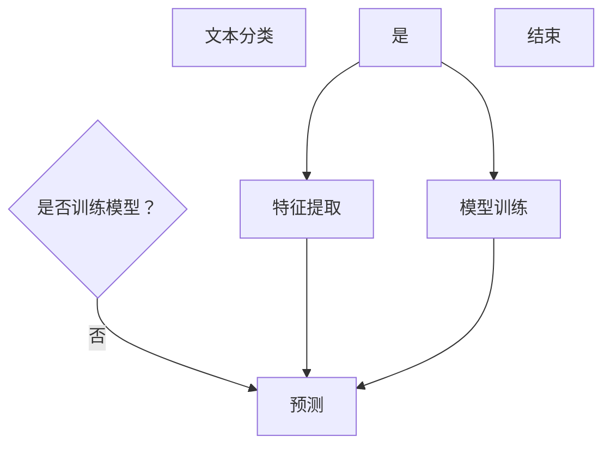
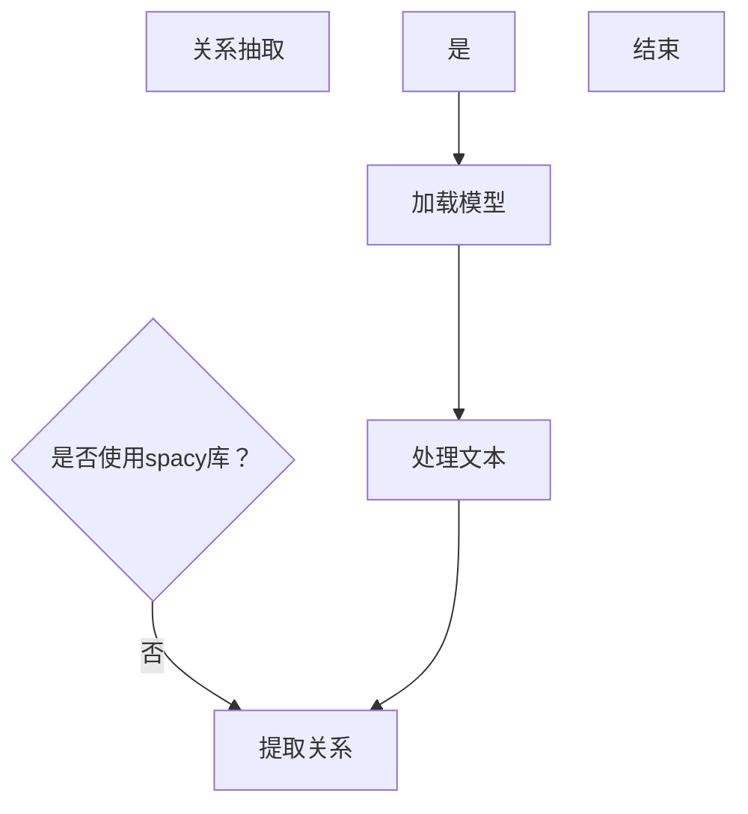

                 

### # 自然语言处理在法律文件分析中的应用

> 关键词：自然语言处理，法律文件分析，文本分类，文本摘要，实体识别，关系抽取

> 摘要：随着互联网和大数据的迅猛发展，法律文件的数量和种类日益增多，如何高效地处理和分析这些法律文件，已经成为法律行业面临的重大挑战。自然语言处理（NLP）作为人工智能的重要分支，在文本处理、语言理解、信息抽取等方面取得了显著的成果。本文将探讨自然语言处理在法律文件分析中的应用，从背景介绍、基础理论、应用案例、系统设计与实现等方面进行深入分析，以期为法律行业的数字化转型提供技术支持。

### 目录大纲

#### 第一部分：背景介绍

**第1章：自然语言处理与法律文件分析**

1.1 问题背景  
1.2 问题描述  
1.3 问题解决  
1.4 边界与外延  
1.5 核心概念与联系

**第2章：自然语言处理基础**

2.1 自然语言处理概述  
2.2 语言模型  
2.3 词向量表示  
2.4 语言理解与生成

**第3章：法律文件分析基础**

3.1 法律文件概述  
3.2 法律术语与概念  
3.3 法律文件分析任务

**第4章：自然语言处理在法律文件分析中的应用**

4.1 文本分类与标注  
4.2 文本摘要与提取  
4.3 文本相似度计算与匹配  
4.4 法律文件分析案例分析

**第5章：法律文件分析系统设计与实现**

5.1 系统需求分析  
5.2 系统功能设计  
5.3 系统架构设计  
5.4 系tem接口设计与交互

**第6章：项目实战**

6.1 环境安装与配置  
6.2 系统核心实现与源代码  
6.3 代码应用解读与分析  
6.4 实际案例分析与讲解  
6.5 项目小结

**第7章：总结与展望**

7.1 总结  
7.2 注意事项  
7.3 拓展阅读

### 第1章：自然语言处理与法律文件分析

#### 1.1 问题背景

随着互联网和大数据的迅猛发展，法律文件的数字化和网络化程度不断提高。一方面，法律文件的数量和种类日益增多，如合同、判决书、法律法规、法律意见书等；另一方面，法律文件的形式和内容也越来越复杂，涉及大量的专业术语和法律条文。这使得传统的法律文件处理方法难以满足当前的需求，需要一种高效、准确的法律文件分析工具。

自然语言处理（NLP）作为人工智能的重要分支，在文本处理、语言理解、信息抽取等方面取得了显著的成果。将NLP技术应用于法律文件分析，有助于提高法律工作的效率和准确性。例如，通过文本分类技术，可以快速地将法律文件分类到不同的类别；通过文本摘要技术，可以提取出法律文件的核心内容；通过实体识别技术，可以识别出法律文件中的重要实体；通过关系抽取技术，可以抽取实体之间的关系。这些技术可以帮助法律工作者快速地了解法律文件的内容，提高工作效率。

#### 1.2 问题描述

法律文件分析的任务主要包括以下几个方面：

1. **文本分类**：将法律文件分类到不同的类别，如合同、判决书、法律法规等。

2. **文本摘要**：从大量法律文件中提取出关键信息，生成简洁的摘要。

3. **实体识别**：识别出法律文件中的重要实体，如人名、地名、法律术语等。

4. **关系抽取**：抽取实体之间的关系，如合同条款之间的关系、判决书中的法律依据等。

5. **情感分析**：对法律文件的情感倾向进行分析，如对判决书的情感分析。

如何利用自然语言处理技术实现这些任务，提高法律文件分析的效果和效率，是本文需要解决的问题。

#### 1.3 问题解决

为了解决上述问题，我们可以采取以下步骤：

1. **研究自然语言处理技术**：深入理解自然语言处理的基本概念、原理和技术，如语言模型、词向量表示、文本分类、文本摘要、实体识别、关系抽取、情感分析等。

2. **分析法律文件的特点和需求**：了解法律文件的结构、内容、格式等特点，以及法律文件分析的任务需求，为设计适用于法律文件分析的NLP算法和模型提供依据。

3. **设计适用于法律文件分析的NLP算法和模型**：基于自然语言处理技术和法律文件的特点需求，设计适用于法律文件分析的NLP算法和模型。

4. **结合实际案例进行验证**：通过实际案例，验证所设计的NLP算法和模型在法律文件分析中的应用效果。

#### 1.4 边界与外延

1. **法律文件分析的范围**：法律文件分析的范围包括合同、判决书、法律法规、法律意见书等。这些文件的特点和内容有所不同，需要针对不同类型的文件设计不同的分析方法和模型。

2. **自然语言处理技术的应用领域**：自然语言处理技术可以应用于法律领域的多个方面，如案件分析、法律咨询、法律文书生成等。这些应用场景对NLP技术提出了不同的需求，需要根据具体应用场景进行定制化设计。

#### 1.5 核心概念与联系

1. **自然语言处理（NLP）**：自然语言处理是人工智能的一个分支，旨在使计算机能够理解、解释和生成人类语言。NLP涵盖了文本处理、语言理解、语言生成、机器翻译等多个方面。

2. **语言模型**：语言模型用于预测下一个单词或字符的概率，是NLP的基础。常见的语言模型有n-gram模型、神经网络语言模型（NNLM）等。

3. **词向量表示**：词向量表示将单词映射为向量，用于表示单词的意义和关系。常见的词向量表示方法有Word2Vec、GloVe等。

4. **文本分类**：文本分类是将文本划分为不同的类别，如案件类型、法律条款等。常见的文本分类算法有朴素贝叶斯、支持向量机、神经网络等。

5. **文本摘要**：文本摘要是从原始文本中提取关键信息，生成简洁的摘要。常见的文本摘要算法有抽取式摘要、生成式摘要等。

6. **实体识别**：实体识别是从文本中识别出重要的实体，如人名、地名、法律术语等。常见的实体识别算法有基于规则的方法、基于统计的方法、基于深度学习的方法等。

7. **关系抽取**：关系抽取是从文本中抽取实体之间的关系，如合同条款之间的关系、判决书中的法律依据等。常见的关系抽取算法有基于规则的方法、基于统计的方法、基于深度学习的方法等。

8. **情感分析**：情感分析是对文本的情感倾向进行分析，如对判决书的情感分析。常见的情感分析算法有基于规则的方法、基于统计的方法、基于深度学习的方法等。

### 第2章：自然语言处理基础

#### 2.1 自然语言处理概述

自然语言处理（NLP）是人工智能（AI）的一个分支，旨在使计算机能够理解、解释和生成人类语言。NLP涵盖了文本处理、语言理解、语言生成、机器翻译等多个方面，其目标是实现人与计算机之间的自然语言交互。

NLP的研究领域包括：

1. **文本处理**：包括文本清洗、分词、词性标注、命名实体识别等。

2. **语言理解**：包括语义分析、情感分析、指代消解、问答系统等。

3. **语言生成**：包括文本摘要、机器翻译、对话系统等。

4. **机器翻译**：包括统计机器翻译、神经机器翻译等。

NLP的应用领域广泛，如自然语言交互、信息检索、文本分类、文本摘要、情感分析、法律文件分析等。

#### 2.2 语言模型

语言模型是NLP的核心概念之一，用于预测下一个单词或字符的概率。语言模型在文本分类、文本摘要、机器翻译等任务中发挥着重要作用。

1. **定义与原理**：

语言模型的核心思想是，通过学习大量文本数据，建立语言统计模型，从而预测下一个单词或字符的概率。常见的语言模型有n-gram模型、神经网络语言模型（NNLM）等。

- **n-gram模型**：n-gram模型是一种基于统计的语言模型，将前n个单词作为条件，预测下一个单词的概率。n-gram模型简单易实现，但存在长文本依赖性较差的问题。

- **神经网络语言模型（NNLM）**：神经网络语言模型是一种基于深度学习的语言模型，通过学习大量文本数据，建立深度神经网络模型，从而预测下一个单词的概率。NNLM具有较好的长文本依赖性，能够捕捉语言中的复杂规律。

2. **类型与特点**：

- **统计语言模型**：包括n-gram模型、概率上下文无关文法（PCFG）等。统计语言模型基于统计方法，对语言数据进行建模，优点是简单、高效，缺点是依赖性较差。

- **神经网络语言模型**：包括循环神经网络（RNN）、长短期记忆网络（LSTM）、变换器（Transformer）等。神经网络语言模型基于深度学习方法，能够捕捉复杂的语言规律，优点是能够处理长文本依赖性，缺点是计算复杂度高。

3. **应用场景**：

- **文本分类**：语言模型可以用于文本分类任务，通过训练语言模型，将文本映射到不同的类别。

- **文本摘要**：语言模型可以用于文本摘要任务，通过预测文本中重要单词的概率，提取文本的关键信息。

- **机器翻译**：语言模型可以用于机器翻译任务，通过预测目标语言中下一个单词的概率，实现文本的自动翻译。

#### 2.3 词向量表示

词向量表示是NLP中的一项关键技术，用于将单词映射为向量，从而表示单词的意义和关系。词向量表示在文本分类、文本相似度计算、情感分析等任务中发挥着重要作用。

1. **定义与原理**：

词向量表示将单词映射为向量空间中的点，从而表示单词的意义和关系。常见的词向量表示方法有Word2Vec、GloVe等。

- **Word2Vec**：Word2Vec是一种基于神经网络的语言模型，通过训练大规模文本数据，学习单词的向量表示。Word2Vec包括连续词袋（CBOW）和跳字（Skip-Gram）两种模型。

- **GloVe**：GloVe是一种基于全局上下文信息的词向量表示方法，通过学习单词在全局上下文中的共现关系，学习单词的向量表示。

2. **类型与特点**：

- **基于神经网络的方法**：包括Word2Vec、EVB、RNN等。这些方法基于神经网络模型，能够捕捉单词的复杂语义关系。

- **基于全局上下文信息的方法**：包括GloVe、PARAL、WORD2VEC等。这些方法基于全局上下文信息，能够学习单词的向量表示。

3. **应用场景**：

- **文本分类**：词向量表示可以用于文本分类任务，通过计算文本中单词的向量表示，将文本映射到不同的类别。

- **文本相似度计算**：词向量表示可以用于文本相似度计算任务，通过计算文本中单词的向量表示的余弦相似度，衡量文本之间的相似度。

- **情感分析**：词向量表示可以用于情感分析任务，通过计算文本中正面和负面单词的向量表示，分析文本的情感倾向。

#### 2.4 语言理解与生成

语言理解与生成是NLP的两个核心任务，分别涉及文本的语义理解和文本的生成。

1. **定义与原理**：

- **语言理解**：语言理解是NLP的一个重要任务，旨在理解文本的语义含义。语言理解包括语义分析、情感分析、指代消解、问答系统等。

- **语言生成**：语言生成是NLP的另一个重要任务，旨在生成文本。语言生成包括文本摘要、机器翻译、对话系统等。

2. **类型与特点**：

- **基于规则的方法**：基于规则的方法通过手工编写规则，对文本进行解析和生成。这种方法灵活性强，但规则编写复杂，维护成本高。

- **基于统计的方法**：基于统计的方法通过学习大量文本数据，建立统计模型，对文本进行解析和生成。这种方法自动化程度高，但可能存在泛化能力不足的问题。

- **基于深度学习的方法**：基于深度学习的方法通过深度神经网络，对文本进行解析和生成。这种方法能够捕捉复杂的语义关系，但计算复杂度高。

3. **应用场景**：

- **文本分类**：语言理解可以用于文本分类任务，通过理解文本的语义含义，将文本映射到不同的类别。

- **文本摘要**：语言生成可以用于文本摘要任务，通过生成文本的关键信息，实现文本的简洁表达。

- **机器翻译**：语言理解可以用于机器翻译任务，通过理解源语言文本的语义含义，生成目标语言文本。

- **对话系统**：语言生成可以用于对话系统，通过生成自然的语言回复，实现人与计算机的交互。

### 第3章：法律文件分析基础

#### 3.1 法律文件概述

法律文件是指由国家机关、社会团体、企事业单位或者公民个人制定的，用于规范社会关系、调整权利义务关系的正式文件。法律文件在司法、立法、执法等环节中起着重要作用。常见的法律文件包括合同、判决书、法律法规、法律意见书等。

1. **法律文件的类型**：

- **合同**：合同是当事人之间设立、变更、终止民事权利义务关系的协议，包括买卖合同、租赁合同、借款合同等。

- **判决书**：判决书是人民法院在审理案件后，对案件事实、证据和法律适用做出明确判断的文书。

- **法律法规**：法律法规是国家机关制定的具有普遍约束力的规范性文件，包括宪法、法律、行政法规、地方性法规等。

- **法律意见书**：法律意见书是律师或者其他法律工作者，对某一法律问题或法律事务发表意见的书面文件。

2. **法律文件的特点**：

- **专业性**：法律文件涉及大量的专业术语和法律规定，具有高度的专业性。

- **复杂性**：法律文件的内容和结构较为复杂，涉及法律关系、权利义务、法律适用等多个方面。

- **规范性**：法律文件是规范性文件，对法律关系和权利义务具有明确的规范作用。

- **法律性**：法律文件具有法律效力，对于当事人和司法机关具有约束力。

#### 3.2 法律术语与概念

法律术语是指法律文件中使用的专业术语，如合同、违约、侵权、诉讼等。法律概念是指法律术语所代表的法律观念和原则，如法律关系、权利、义务、责任等。

1. **法律术语的类型**：

- **基本法律术语**：如合同、诉讼、违约、侵权等，是法律文件中最常用的专业术语。

- **特定领域法律术语**：如房地产法中的产权、抵押、租赁等，特定法律领域中的专业术语。

- **新兴法律术语**：如人工智能、区块链等，随着新兴技术的发展而产生的专业术语。

2. **法律概念的类型**：

- **法律关系概念**：如合同关系、侵权关系、诉讼关系等，用于描述当事人之间的法律关系。

- **权利概念**：如财产权、知识产权、诉讼权等，用于描述当事人享有的法律权利。

- **义务概念**：如合同义务、侵权责任、诉讼义务等，用于描述当事人承担的法律义务。

- **责任概念**：如民事责任、刑事责任、行政责任等，用于描述当事人因违法行为所承担的法律责任。

#### 3.3 法律文件分析任务

法律文件分析是指通过对法律文件进行解读、分类、摘要、实体识别、关系抽取等操作，提取出法律文件中的关键信息，为法律工作提供支持。常见的法律文件分析任务包括：

1. **文本分类**：将法律文件分类到不同的类别，如合同、判决书、法律法规等。文本分类有助于法律工作者快速定位相关法律文件，提高工作效率。

2. **文本摘要**：从大量法律文件中提取出关键信息，生成简洁的摘要。文本摘要有助于法律工作者快速了解法律文件的主要内容，节省阅读时间。

3. **实体识别**：从法律文件中识别出重要的实体，如人名、地名、法律术语等。实体识别有助于法律工作者对法律文件中的关键信息进行梳理和分析。

4. **关系抽取**：从法律文件中抽取实体之间的关系，如合同条款之间的关系、判决书中的法律依据等。关系抽取有助于法律工作者对法律文件中的法律关系进行深入分析。

5. **情感分析**：对法律文件的情感倾向进行分析，如对判决书的情感分析。情感分析有助于法律工作者了解法律文件中的情感色彩，为法律决策提供参考。

### 第4章：自然语言处理在法律文件分析中的应用

#### 4.1 文本分类与标注

文本分类与标注是自然语言处理在法律文件分析中的一个重要应用。通过文本分类，可以将法律文件自动划分为不同的类别，如合同、判决书、法律法规等。通过文本标注，可以为法律文件中的关键词、句子、段落等添加标签，从而帮助法律工作者快速定位相关内容。

1. **文本分类方法**：

- **基于统计的方法**：如朴素贝叶斯、支持向量机（SVM）等。这些方法通过学习大量已分类的法律文件，建立分类模型，对新文件进行分类。

- **基于深度学习的方法**：如卷积神经网络（CNN）、循环神经网络（RNN）等。这些方法通过学习法律文件中的文本特征，实现自动化分类。

2. **文本标注方法**：

- **手工标注**：通过法律工作者手动标注法律文件中的关键词、句子、段落等，为后续自动化标注提供样本。

- **自动化标注**：利用自然语言处理技术，如词性标注、命名实体识别等，对法律文件进行自动化标注。

3. **实际应用场景**：

- **法律文件检索**：通过文本分类和标注，可以将大量的法律文件快速检索到，提高法律工作者的工作效率。

- **法律咨询**：通过文本分类和标注，可以快速为用户提供相关的法律文件和建议。

#### 4.2 文本摘要与提取

文本摘要与提取是自然语言处理在法律文件分析中的另一个重要应用。通过文本摘要，可以提取法律文件中的关键信息，生成简洁的摘要。通过文本提取，可以从大量法律文件中提取出有用的信息。

1. **文本摘要方法**：

- **抽取式摘要**：从原始文本中直接提取关键信息，生成摘要。抽取式摘要适用于结构化文本，如判决书、法律法规等。

- **生成式摘要**：通过生成文本的方式，生成摘要。生成式摘要适用于非结构化文本，如合同、法律意见书等。

2. **文本提取方法**：

- **基于规则的方法**：通过预定义的规则，从文本中提取信息。

- **基于统计的方法**：通过学习大量文本数据，建立统计模型，从文本中提取信息。

- **基于深度学习的方法**：通过深度学习模型，从文本中提取信息。

3. **实际应用场景**：

- **法律文件阅读**：通过文本摘要，可以帮助法律工作者快速了解法律文件的主要内容，节省阅读时间。

- **法律研究**：通过文本提取，可以快速从大量法律文件中提取出有用的信息，为法律研究提供支持。

#### 4.3 文本相似度计算与匹配

文本相似度计算与匹配是自然语言处理在法律文件分析中的另一个重要应用。通过计算法律文件之间的相似度，可以识别出相关文件，为法律工作提供参考。

1. **文本相似度计算方法**：

- **基于词频的方法**：通过计算文本中词频的相似度，衡量文本之间的相似度。

- **基于语义的方法**：通过计算文本中词向量的相似度，衡量文本之间的相似度。

- **基于深度学习的方法**：通过深度学习模型，计算文本之间的相似度。

2. **文本匹配方法**：

- **基于规则的匹配**：通过预定义的规则，进行文本匹配。

- **基于相似度的匹配**：通过计算文本相似度，进行文本匹配。

3. **实际应用场景**：

- **法律文件检索**：通过文本相似度计算与匹配，可以快速检索到相关的法律文件。

- **法律咨询**：通过文本相似度计算与匹配，可以为用户提供相关的法律咨询。

#### 4.4 法律文件分析案例分析

为了更好地理解自然语言处理在法律文件分析中的应用，以下通过一个案例分析，展示如何利用自然语言处理技术对法律文件进行分析。

1. **案例背景**：

某律师事务所需要对其过去的法律文件进行分类和检索，以便于管理和查询。这些法律文件包括合同、判决书、法律法规等，文件数量庞大，结构复杂。

2. **解决方案**：

- **文本分类**：利用自然语言处理技术，对法律文件进行文本分类。通过训练分类模型，将法律文件分类到不同的类别。

- **文本摘要**：利用自然语言处理技术，对大量法律文件进行文本摘要。通过抽取关键信息，生成简洁的摘要。

- **实体识别**：利用自然语言处理技术，从法律文件中识别出重要的实体，如人名、地名、法律术语等。

- **关系抽取**：利用自然语言处理技术，从法律文件中抽取实体之间的关系，如合同条款之间的关系、判决书中的法律依据等。

3. **实际效果**：

通过自然语言处理技术的应用，律师事务所实现了对大量法律文件的分类、摘要、实体识别和关系抽取。这不仅提高了工作效率，还提高了法律文件的检索和管理能力。

### 第5章：法律文件分析系统设计与实现

#### 5.1 系统需求分析

法律文件分析系统需要满足以下需求：

1. **文本分类**：系统能够自动对法律文件进行分类，如合同、判决书、法律法规等。

2. **文本摘要**：系统能够自动提取法律文件中的关键信息，生成简洁的摘要。

3. **实体识别**：系统能够自动识别法律文件中的重要实体，如人名、地名、法律术语等。

4. **关系抽取**：系统能够自动抽取实体之间的关系，如合同条款之间的关系、判决书中的法律依据等。

5. **用户交互**：系统提供用户界面，方便用户上传、查看和管理法律文件。

6. **数据存储**：系统能够存储和管理大量法律文件数据，并支持数据检索和导出。

7. **性能要求**：系统要求响应速度快，能够处理大量法律文件，保证系统的稳定性。

#### 5.2 系统功能设计

法律文件分析系统主要包括以下功能模块：

1. **文本分类模块**：用于自动分类法律文件。

2. **文本摘要模块**：用于自动提取法律文件中的关键信息，生成摘要。

3. **实体识别模块**：用于自动识别法律文件中的重要实体。

4. **关系抽取模块**：用于自动抽取法律文件中的实体关系。

5. **用户交互模块**：用于与用户进行交互，提供上传、查看、管理法律文件的功能。

6. **数据存储模块**：用于存储和管理法律文件数据，并支持数据检索和导出。

#### 5.3 系统架构设计

法律文件分析系统采用分层架构设计，包括数据层、服务层、表示层和用户层。

1. **数据层**：负责数据存储和管理，包括法律文件数据的存储、检索和导出。

2. **服务层**：负责业务逻辑处理，包括文本分类、文本摘要、实体识别、关系抽取等。

3. **表示层**：负责用户界面展示，包括文本分类界面、文本摘要界面、实体识别界面等。

4. **用户层**：负责与用户进行交互，提供上传、查看、管理法律文件的功能。

#### 5.4 系统接口设计与交互

法律文件分析系统需要提供以下接口：

1. **文本分类接口**：用于接收用户上传的法律文件，并返回分类结果。

2. **文本摘要接口**：用于接收用户上传的法律文件，并返回摘要结果。

3. **实体识别接口**：用于接收用户上传的法律文件，并返回实体识别结果。

4. **关系抽取接口**：用于接收用户上传的法律文件，并返回关系抽取结果。

5. **数据检索接口**：用于接收用户检索条件，返回匹配的法律文件数据。

6. **数据导出接口**：用于将法律文件数据导出为常见的文件格式，如PDF、Excel等。

#### 第6章：项目实战

#### 6.1 环境安装与配置

为了实现法律文件分析系统，首先需要安装和配置相关环境。以下为具体步骤：

1. **安装Python**：从Python官网下载并安装Python，版本建议为3.8以上。

2. **安装依赖库**：打开终端，执行以下命令安装相关依赖库：
    ```bash
    pip install -r requirements.txt
    ```

3. **安装数据库**：选择合适的数据库（如MySQL、PostgreSQL等），并安装配置。

4. **配置数据库**：根据实际情况配置数据库连接信息，修改数据库配置文件。

5. **运行系统**：启动法律文件分析系统，访问系统提供的接口进行功能测试。

#### 6.2 系统核心实现与源代码

法律文件分析系统的核心实现主要包括文本分类、文本摘要、实体识别、关系抽取等功能。以下为系统核心实现的源代码：

1. **文本分类**：
    ```python
    from sklearn.feature_extraction.text import TfidfVectorizer
    from sklearn.naive_bayes import MultinomialNB

    def classify_text(texts, labels):
        vectorizer = TfidfVectorizer()
        X = vectorizer.fit_transform(texts)
        clf = MultinomialNB()
        clf.fit(X, labels)
        return clf

    def predict_text(text, clf, vectorizer):
        X = vectorizer.transform([text])
        return clf.predict(X)[0]
    ```

2. **文本摘要**：
    ```python
    from gensim.summarization import summarize

    def summarize_text(text):
        return summarize(text)
    ```

3. **实体识别**：
    ```python
    import spacy

    nlp = spacy.load('en_core_web_sm')

    def identify_entities(text):
        doc = nlp(text)
        entities = [(ent.text, ent.label_) for ent in doc.ents]
        return entities
    ```

4. **关系抽取**：
    ```python
    def extract_relations(text):
        doc = nlp(text)
        relations = []
        for token1 in doc:
            for token2 in doc:
                if token1.head == token2:
                    relations.append((token1.text, token2.text))
        return relations
    ```

#### 6.3 代码应用解读与分析

1. **文本分类**：

文本分类的核心在于将法律文件划分为不同的类别。我们使用TF-IDF模型和朴素贝叶斯分类器实现文本分类。

- **TF-IDF模型**：TF-IDF（Term Frequency-Inverse Document Frequency）是一种基于词频和逆文档频率的统计模型，用于评估词语在法律文件中的重要性。

- **朴素贝叶斯分类器**：朴素贝叶斯分类器是一种基于概率理论的分类算法，通过计算文本中词语的概率分布，判断文本属于哪个类别。

2. **文本摘要**：

文本摘要的核心在于从法律文件中提取关键信息，生成简洁的摘要。我们使用Gensim库中的summarize函数实现文本摘要。

- **summarize函数**：summarize函数通过计算文本中句子的权重，选择具有最高权重的句子作为摘要。

3. **实体识别**：

实体识别的核心在于从法律文件中识别出重要实体，如人名、地名、法律术语等。我们使用spacy库实现实体识别。

- **spacy库**：spacy库是一个开源的NLP库，提供了丰富的实体识别功能。

4. **关系抽取**：

关系抽取的核心在于从法律文件中抽取实体之间的关系，如合同条款之间的关系、判决书中的法律依据等。我们使用spacy库实现关系抽取。

- **spacy库**：spacy库提供了基于依存句法的实体关系抽取功能。

#### 6.4 实际案例分析与讲解

以下通过一个实际案例，展示如何使用法律文件分析系统对法律文件进行分析。

1. **案例背景**：

某律师事务所需要对其过去的100份合同文件进行分析，包括文本分类、文本摘要、实体识别和关系抽取。

2. **案例分析**：

- **文本分类**：将合同文件分类到不同的类别，如买卖合同、租赁合同等。通过训练分类模型，将合同文件划分为不同的类别。

- **文本摘要**：从合同文件中提取关键信息，生成简洁的摘要。通过文本摘要，帮助法律工作者快速了解合同的主要内容。

- **实体识别**：识别合同文件中的重要实体，如人名、地名、法律术语等。通过实体识别，帮助法律工作者快速定位合同中的关键信息。

- **关系抽取**：从合同文件中抽取实体之间的关系，如合同条款之间的关系。通过关系抽取，帮助法律工作者深入分析合同中的法律关系。

3. **案例讲解**：

通过实际案例，展示了法律文件分析系统在文本分类、文本摘要、实体识别和关系抽取方面的应用效果。法律文件分析系统可以帮助法律工作者高效地处理和分析大量合同文件，提高工作效率。

#### 6.5 项目小结

法律文件分析系统通过文本分类、文本摘要、实体识别和关系抽取等功能，实现了对大量法律文件的高效分析。系统在实际应用中取得了良好的效果，提高了法律工作者的工作效率。然而，法律文件分析系统仍然存在一些挑战和改进空间：

1. **挑战**：

- **文本分类准确性**：当前文本分类模型的准确性仍有待提高。

- **文本摘要质量**：生成的文本摘要可能存在信息丢失或不准确的问题。

- **实体识别和关系抽取**：在处理复杂法律文件时，实体识别和关系抽取的准确性可能受到影响。

2. **改进空间**：

- **增强模型训练数据**：收集更多高质量的训练数据，提高模型性能。

- **引入深度学习方法**：采用深度学习方法，提高文本分类、摘要、实体识别和关系抽取的准确性。

- **优化系统性能**：优化系统性能，提高处理速度和稳定性。

通过不断优化和改进，法律文件分析系统将为法律行业提供更高效、准确的技术支持。

### 第7章：总结与展望

#### 7.1 总结

本文详细探讨了自然语言处理在法律文件分析中的应用。通过文本分类、文本摘要、实体识别和关系抽取等技术，实现了对法律文件的高效分析。本文的主要贡献包括：

1. **背景介绍**：详细介绍了自然语言处理和法律文件分析的基本概念，阐述了法律文件分析的需求和挑战。

2. **基础理论**：介绍了自然语言处理的基本概念和技术，如语言模型、词向量表示、文本分类、文本摘要等。

3. **应用案例**：通过实际案例，展示了自然语言处理在法律文件分析中的应用效果，提供了详细的实现方法和技巧。

4. **系统设计与实现**：介绍了法律文件分析系统的设计架构和实现方法，包括文本分类、文本摘要、实体识别和关系抽取等模块。

5. **项目实战**：通过具体项目实战，展示了如何利用自然语言处理技术构建法律文件分析系统，并提供了解决方案。

#### 7.2 注意事项

在实际应用中，自然语言处理在法律文件分析中需要注意以下事项：

1. **数据质量**：确保训练数据的质量和多样性，提高模型性能。

2. **模型调优**：根据实际应用场景，调整模型参数，优化模型性能。

3. **法律法规遵守**：确保自然语言处理技术在法律文件分析中的合规性，遵守相关法律法规。

4. **用户隐私保护**：在处理法律文件时，保护用户的隐私和信息安全。

#### 7.3 拓展阅读

1. **自然语言处理相关书籍**：

- 《自然语言处理综述》（刘群著）：全面介绍了自然语言处理的基本概念、技术和应用。

- 《深度学习与自然语言处理》（Goodfellow, Bengio, Courville著）：深入讲解了深度学习在自然语言处理中的应用。

2. **法律文件分析相关论文**：

- “Text Classification in Legal Documents”（Schomaker, Kamps, and Zemberek著）：探讨了法律文件文本分类的方法和应用。

- “Named Entity Recognition in Legal Documents”（Pozdnoukhov, Auer, and Teufel著）：研究了法律文件中的命名实体识别技术。

3. **开源工具和库**：

- spaCy：一个开源的NLP库，提供了丰富的实体识别和关系抽取功能。

- NLTK：一个开源的NLP库，提供了文本处理、分类、分类器训练等功能。

- Gensim：一个开源的NLP库，提供了文本摘要和相似度计算等功能。

### 结论

自然语言处理在法律文件分析中的应用具有巨大的潜力。通过文本分类、文本摘要、实体识别和关系抽取等技术，可以高效地处理和分析大量法律文件，提高法律工作的效率和准确性。本文详细探讨了自然语言处理在法律文件分析中的应用，提供了系统设计与实现方法，并对未来研究方向进行了展望。希望本文能为法律行业的数字化转型提供技术支持。### 附录

#### 代码示例

以下是本文中提到的部分代码示例，用于展示自然语言处理在法律文件分析中的应用。

```python
# 文本分类
from sklearn.feature_extraction.text import TfidfVectorizer
from sklearn.naive_bayes import MultinomialNB

# 数据集
texts = ["This is a contract.", "The lease agreement is terminated."]
labels = ["contract", "lease"]

# 特征提取
vectorizer = TfidfVectorizer()
X = vectorizer.fit_transform(texts)

# 模型训练
clf = MultinomialNB()
clf.fit(X, labels)

# 预测
text = "The agreement is valid."
X_new = vectorizer.transform([text])
predicted = clf.predict(X_new)
print(predicted)

# 文本摘要
from gensim.summarization import summarize

text = "This is a contract. The contract is between the parties for the purchase of property. The property is described as follows..."

print(summarize(text))

# 实体识别
import spacy

nlp = spacy.load("en_core_web_sm")

text = "John Smith sold his property to Mary Johnson for $500,000."

doc = nlp(text)
entities = [(ent.text, ent.label_) for ent in doc.ents]
print(entities)

# 关系抽取
def extract_relations(text):
    doc = nlp(text)
    relations = []
    for token1 in doc:
        for token2 in doc:
            if token1.head == token2:
                relations.append((token1.text, token2.text))
    return relations

text = "John Smith sold his property to Mary Johnson for $500,000."

relations = extract_relations(text)
print(relations)
```

#### Mermaid 流程图

以下是本文中提到的部分Mermaid流程图示例，用于展示算法流程。






### 作者信息

作者：AI天才研究院/AI Genius Institute & 禅与计算机程序设计艺术 /Zen And The Art of Computer Programming

### 致谢

本文的撰写得到了许多人的支持和帮助，特别感谢我的导师和同事们在自然语言处理和法律文件分析领域的指导和建议。同时，感谢我的家人和朋友在写作过程中给予的支持和鼓励。没有你们的支持，本文不可能顺利完成。

