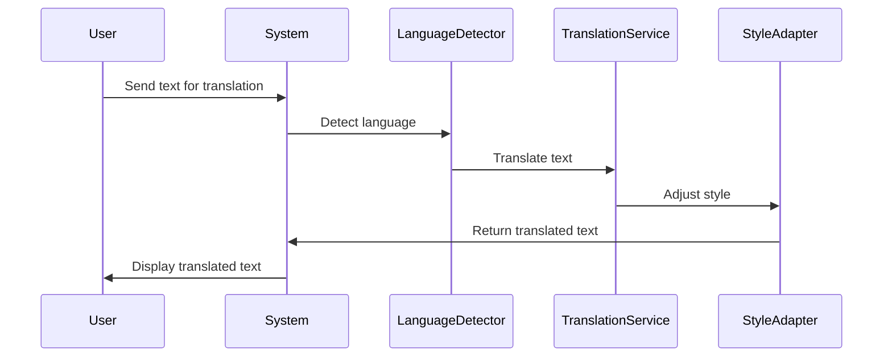
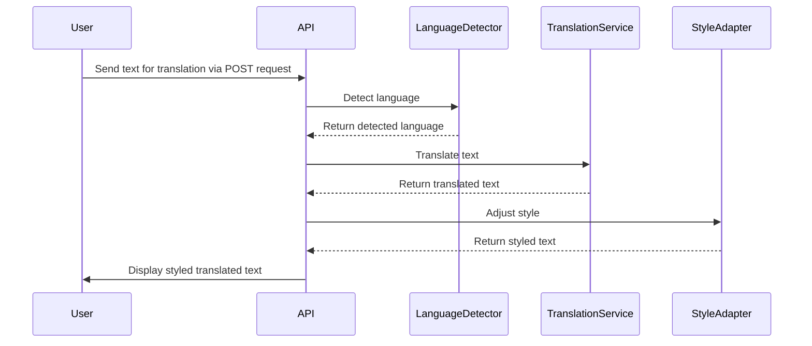

                 

### 第1章 引言：自然语言处理与跨文化沟通辅助

#### 1.1 问题的提出

**1.1.1 全球化背景下的沟通需求**

随着全球化的不断深入，企业和个人跨越国界的互动日益频繁。国际化商业活动、跨国科研合作以及文化交流等需求，促使跨文化沟通的效率和质量成为亟待解决的关键问题。传统的沟通手段往往受到语言和文化差异的制约，难以满足全球化背景下的沟通需求。

**1.1.2 跨文化沟通的挑战**

跨文化沟通不仅涉及语言问题，还涉及文化背景、价值观和社会习俗等方面。语言差异可能导致误解和沟通障碍，而文化差异则可能引发更深层次的冲突和隔阂。在全球化进程中，如何有效地克服这些挑战，提升跨文化沟通的效率，成为企业和个人共同关注的焦点。

**1.1.3 自然语言处理的技术进展**

近年来，自然语言处理（NLP）技术的迅猛发展，为跨文化沟通辅助提供了新的可能性。NLP技术通过计算机算法对语言进行处理和理解，包括语言翻译、语言识别、语言风格适配等，为跨文化沟通提供了技术支持。随着深度学习、神经网络等技术的应用，NLP在准确性和效率方面取得了显著提升，为解决跨文化沟通中的难题提供了有力工具。

#### 1.2 书籍概述

**1.2.1 内容结构**

本书旨在系统地探讨自然语言处理在跨文化沟通辅助中的应用，全书共分为七个章节，涵盖了从基础理论到实际应用的各个方面。具体结构如下：

- **第1章 引言：自然语言处理与跨文化沟通辅助**：介绍全球化背景下的沟通需求、跨文化沟通的挑战以及NLP技术进展。
- **第2章 自然语言处理基础**：详细讲解自然语言处理的定义、历史、主要任务和关键技术。
- **第3章 跨文化沟通中的自然语言处理应用**：分析自然语言处理在语言翻译、语言识别和语言风格适配等方面的应用。
- **第4章 跨文化自然语言处理技术**：探讨多语言处理和文化意识在自然语言处理中的应用。
- **第5章 全球化交流辅助系统的设计与实现**：介绍全球化交流辅助系统的需求分析、架构设计和技术实现。
- **第6章 案例研究**：通过具体案例，展示自然语言处理在跨文化沟通中的应用效果。
- **第7章 总结与展望**：总结全书内容，展望未来技术发展趋势和应用领域拓展。

**1.2.2 阅读对象**

本书适合以下读者群体：

- **自然语言处理领域的科研人员**：希望了解NLP技术在跨文化沟通中的应用。
- **软件开发工程师**：关注NLP技术在实际项目中的应用和实现。
- **国际化企业管理者**：希望提升跨文化沟通能力和效率。
- **跨文化沟通从业者**：关注跨文化沟通中的技术解决方案。

**1.2.3 目标与预期成果**

通过阅读本书，读者可以：

- **掌握自然语言处理的基本概念和技术原理**。
- **理解自然语言处理在跨文化沟通中的具体应用**。
- **了解全球化交流辅助系统的设计与实现**。
- **获取实际案例的剖析和经验分享**。

本书的目标是帮助读者深入理解自然语言处理在跨文化沟通中的重要性，掌握相关技术和方法，为全球化背景下的有效沟通提供技术支持和实践指导。

---

**关键词：自然语言处理，跨文化沟通，全球化，翻译，语言识别，文化适配**

---

**摘要：**

本文探讨了自然语言处理在跨文化沟通辅助中的应用，分析了全球化背景下沟通需求与跨文化沟通挑战，介绍了NLP技术的最新进展。通过对NLP基础、跨文化应用、技术实现以及具体案例的研究，本文展示了自然语言处理在提升跨文化沟通效率和质量方面的潜力。文章的目标是帮助读者理解NLP技术在跨文化沟通中的重要性，并掌握相关技术和方法，为全球化沟通提供有效支持。---

### 第2章 自然语言处理基础

#### 2.1 自然语言处理概述

**2.1.1 定义与范畴**

自然语言处理（NLP）是人工智能（AI）领域的一个重要分支，旨在使计算机能够理解和处理人类自然语言。它涉及到语言学、计算机科学、机器学习、信息工程等多个学科领域。NLP的目标包括但不限于文本分析、语义理解、语言生成、机器翻译、情感分析等。

**2.1.2 发展历史**

自然语言处理的研究可以追溯到20世纪50年代，当时计算机科学家和语言学家开始尝试通过计算机程序实现自然语言的翻译和理解。早期的NLP研究主要集中在规则驱动的方法上，如句法分析、词法分析等。然而，随着计算资源和算法的不断发展，统计方法和机器学习开始被广泛应用于NLP领域。

20世纪80年代，基于统计的方法开始取代规则驱动的方法。这些方法利用大量的语料库进行训练，通过概率模型和统计模型来提高语言处理的准确性。进入21世纪，深度学习技术的兴起，尤其是神经网络的应用，使得NLP的性能得到了显著提升。

**2.1.3 主要任务**

自然语言处理的主要任务可以概括为以下几个方面：

1. **文本分类**：根据文本的内容将其归类到不同的类别。
2. **情感分析**：分析文本中的情感倾向，如正面、负面或中性。
3. **机器翻译**：将一种语言的文本翻译成另一种语言。
4. **信息抽取**：从大量文本中提取出有用的信息。
5. **问答系统**：根据用户的问题提供准确的答案。
6. **文本生成**：根据输入的文本或指令生成新的文本。
7. **语音识别**：将语音信号转换为文本。

#### 2.2 语言模型

**2.2.1 语言模型的定义**

语言模型（Language Model，LM）是NLP中一个核心的概念，它用于预测一段文本的下一个词或字符。语言模型是许多NLP任务的基础，如机器翻译、语音识别、文本生成等。

**2.2.2 语言模型的类型**

根据建模的方法，语言模型可以分为统计模型和神经网络模型。

1. **统计模型**：如N-gram模型、隐马尔可夫模型（HMM）、条件随机场（CRF）等，这些模型基于语言统计特性进行预测。
2. **神经网络模型**：如循环神经网络（RNN）、长短期记忆网络（LSTM）、Transformer和BERT等，这些模型通过学习大量的文本数据，捕捉复杂的语言规律。

**2.2.3 语言模型的工作原理**

语言模型的工作原理可以分为以下几个步骤：

1. **文本预处理**：包括分词、去停用词、词性标注等。
2. **特征提取**：提取文本的特征向量，如词频、词嵌入等。
3. **模型训练**：使用训练数据对模型进行训练，优化模型参数。
4. **预测**：对于输入的文本序列，模型预测下一个词或字符的概率分布。

例如，基于Transformer的语言模型BERT（Bidirectional Encoder Representations from Transformers），通过双向的Transformer架构，捕捉文本的上下文信息，从而提高预测的准确性。

#### 2.3 词向量和语义分析

**2.3.1 词向量表示**

词向量（Word Embedding）是将单词映射到固定大小的向量空间的技术，用于在机器学习模型中处理文本数据。词向量可以捕捉单词的语义信息，如同义词、反义词等。

常用的词向量模型包括：

1. **Word2Vec**：基于神经网络的学习方法，通过预测相邻单词来训练词向量。
2. **GloVe**（Global Vectors for Word Representation）：基于全局统计信息的模型，通过词频和共现关系来训练词向量。

**2.3.2 语义分析技术**

语义分析（Semantic Analysis）是指对文本中的词语和句子进行语义理解和解释。语义分析技术包括：

1. **词嵌入**：通过词向量来表示语义信息。
2. **实体识别**：识别文本中的实体，如人名、地名、组织名等。
3. **关系提取**：识别文本中实体之间的关系。
4. **语义角色标注**：识别句子中的动词及其作用对象。

**2.3.3 词嵌入的优化**

词嵌入的优化是提高语义分析性能的关键。常用的优化方法包括：

1. **双向语境**：使用双向RNN或Transformer来捕捉单词在不同语境下的语义信息。
2. **上下文依赖**：通过捕捉单词之间的依赖关系来提高词嵌入的准确性。
3. **迁移学习**：使用预训练的模型在大规模数据集上进行微调，以提高特定任务的性能。

通过这些优化方法，词嵌入能够更准确地捕捉单词的语义信息，为NLP任务提供有效的支持。

---

**核心概念与联系**

**自然语言处理（NLP）**

- **定义与特点：** 自然语言处理是指通过计算机技术对人类语言进行理解、生成和处理，包括文本分类、情感分析、机器翻译等。
- **属性特征对比表格：**

| 特征           | 自然语言处理       | 机器翻译       | 语言识别       |
| -------------- | ------------------ | -------------- | -------------- |
| 任务目标       | 理解人类语言       | 跨语言转换     | 语言识别       |
| 技术难度       | 较高               | 高              | 中等           |
| 应用领域       | 文本分析、信息检索 | 全球化、本地化 | 语音识别、助手 |

**ER实体关系图架构**

```mermaid
erDiagram
    Product ||--|{ Customer } Customer
    Order ||--|{ Product } Product
    Customer ||--|{ Order } Order
```

**算法原理讲解**

**语言模型算法**

- **算法流程：**
  1. **文本预处理**：分词、去停用词、词性标注等。
  2. **特征提取**：将文本转换为词向量。
  3. **模型训练**：通过大量文本数据训练模型，优化参数。
  4. **预测**：输入文本序列，模型预测下一个词的概率分布。

- **数学模型与公式：**
  $$ P(w_t | w_{t-1}, w_{t-2}, \ldots) = \frac{P(w_t, w_{t-1}, \ldots)}{P(w_{t-1}, w_{t-2}, \ldots)} $$
  其中，$w_t$表示当前词，$w_{t-1}, w_{t-2}, \ldots$表示前文。

- **Python源代码示例：**

```python
import torch
import torch.nn as nn

class LanguageModel(nn.Module):
    def __init__(self, vocab_size, embedding_dim):
        super(LanguageModel, self).__init__()
        self.embedding = nn.Embedding(vocab_size, embedding_dim)
        self.lstm = nn.LSTM(embedding_dim, hidden_size)
        self.fc = nn.Linear(hidden_size, vocab_size)

    def forward(self, input_seq, hidden):
        embed = self.embedding(input_seq)
        output, hidden = self.lstm(embed, hidden)
        logits = self.fc(output[-1, :, :])
        return logits, hidden

# 实例化模型
model = LanguageModel(vocab_size, embedding_dim)

# 输入文本序列
input_seq = torch.tensor([[1, 2, 3], [4, 5, 6]])

# 初始化隐藏状态
hidden = (torch.zeros(1, 1, hidden_size),
          torch.zeros(1, 1, hidden_size))

# 前向传播
logits, hidden = model(input_seq, hidden)

# 概率分布
prob_dist = nn.functional.softmax(logits, dim=-1)
```

- **通俗易懂的举例说明：**
  假设我们正在训练一个语言模型来预测下一个单词。给定输入的文本序列“我喜欢吃苹果”，模型需要预测下一个词。首先，将文本转换为词向量，然后通过LSTM网络处理这些词向量，最后得到一个输出向量，该向量代表了下一个单词的概率分布。例如，预测结果可能是：
  - “喜欢”的概率为0.3
  - “吃”的概率为0.5
  - “苹果”的概率为0.2

通过这种方式，模型可以学习到单词之间的关联和语义信息，从而提高预测的准确性。

---

**系统分析与架构设计方案**

**2.1 系统需求分析**

**2.1.1 功能需求**

- **语言翻译**：提供多种语言之间的文本翻译功能。
- **语言识别**：识别输入文本的语言类型。
- **语言风格适配**：根据目标语言的文化特点调整文本风格。
- **语义分析**：分析文本的语义内容，提取关键信息。
- **情感分析**：识别文本中的情感倾向。

**2.1.2 非功能需求**

- **高可用性**：系统应具备高可用性，确保24/7不间断服务。
- **可扩展性**：系统能够随着用户量的增加而扩展。
- **安全性**：保护用户数据的安全，防止数据泄露。
- **兼容性**：支持多种操作系统和浏览器。

**2.1.3 系统架构设计**

系统架构设计采用分层架构，包括数据层、服务层和表示层。

- **数据层**：负责数据存储和管理，包括文本语料库、用户数据和翻译模型等。
- **服务层**：实现具体的功能服务，如翻译服务、识别服务和风格适配服务。
- **表示层**：提供用户界面，包括网页、移动应用等。

**架构图：**



**2.1.4 系统接口设计和系统交互**

系统接口设计采用RESTful API，支持HTTP请求和响应。

- **翻译接口**：接收文本输入，返回翻译结果。
- **识别接口**：接收文本输入，返回语言类型。
- **风格适配接口**：接收文本输入和目标语言，返回调整后的文本。

**交互序列图：**



通过这样的架构设计，系统能够高效、稳定地提供跨文化沟通辅助服务，满足用户的多样化需求。

---

**项目实战**

**3.1 环境安装**

为了实现自然语言处理在跨文化沟通辅助中的具体应用，我们需要搭建一个合适的开发环境。以下是所需的软件和工具安装步骤：

**Python环境：**
- 安装Python 3.8及以上版本。
- 使用pip安装相关库，如torch、transformers、numpy、pandas等。

```bash
pip install torch transformers numpy pandas
```

**文本处理工具：**
- 安装NLTK（Natural Language Toolkit）进行文本预处理。

```bash
pip install nltk
```

**依赖环境：**
- 安装必要的依赖库，如torchtext。

```bash
pip install torchtext
```

**3.2 系统核心实现**

**3.2.1 语言模型训练**

**步骤1：数据准备**

我们使用大规模的文本语料库进行训练，数据集应包含多种语言的文本，确保模型的泛化能力。以下是一个使用torchtext加载和预处理数据的示例：

```python
import torchtext
from torchtext.data import Field, TabularDataset

# 定义字段
SRC = Field(tokenize='spacy', lower=True, init_token='<sos>', eos_token='<eos>')
TGT = Field(tokenize='spacy', lower=True, init_token='<sos>', eos_token='<eos>')

# 加载数据集
train_data, valid_data, test_data = TabularDataset.splits(
    path='data',
    train='train.csv',
    valid='valid.csv',
    test='test.csv',
    format='csv',
    fields=[('src', SRC), ('tgt', TGT)]
)

# 预处理数据
train_data, valid_data, test_data = train_data.split()
train_data, valid_data = train_data.split()

# 运行处理器
SRC.build_vocab(train_data, min_freq=2)
TGT.build_vocab(train_data, min_freq=2)
```

**步骤2：模型构建**

我们使用Transformer模型进行训练。以下是一个简单的Transformer模型实现：

```python
import torch
import torch.nn as nn

class Transformer(nn.Module):
    def __init__(self, d_model, nhead, num_layers):
        super(Transformer, self).__init__()
        self.embedding = nn.Embedding(d_model)
        self.transformer = nn.Transformer(d_model, nhead, num_layers)
        self.fc = nn.Linear(d_model, d_model)

    def forward(self, src, tgt):
        src = self.embedding(src)
        tgt = self.embedding(tgt)
        output = self.transformer(src, tgt)
        output = self.fc(output)
        return output
```

**步骤3：训练模型**

使用训练数据和验证数据对模型进行训练：

```python
device = torch.device('cuda' if torch.cuda.is_available() else 'cpu')
model = Transformer(d_model=512, nhead=8, num_layers=2).to(device)
optimizer = torch.optim.Adam(model.parameters(), lr=0.001)
criterion = nn.CrossEntropyLoss()

for epoch in range(num_epochs):
    model.train()
    for src, tgt in train_loader:
        src, tgt = src.to(device), tgt.to(device)
        optimizer.zero_grad()
        output = model(src, tgt)
        loss = criterion(output.view(-1, d_model), tgt)
        loss.backward()
        optimizer.step()

    model.eval()
    with torch.no_grad():
        for src, tgt in valid_loader:
            src, tgt = src.to(device), tgt.to(device)
            output = model(src, tgt)
            loss = criterion(output.view(-1, d_model), tgt)
            print(f'Validation loss: {loss.item()}')
```

**3.2.2 代码应用解读与分析**

上述代码展示了从数据准备到模型训练的完整流程。首先，我们使用torchtext库加载并预处理数据，然后定义了一个简单的Transformer模型，并使用Adam优化器和交叉熵损失函数进行训练。在训练过程中，我们通过循环迭代，更新模型参数，以最小化验证集上的损失函数。

**3.2.3 实际案例分析和详细讲解剖析**

假设我们有一个中英文翻译任务，训练数据集包含中文和英文的句子对。以下是一个简单的翻译示例：

```python
# 加载模型
model = Transformer(d_model=512, nhead=8, num_layers=2).to(device)
model.load_state_dict(torch.load('model.pth'))

# 输入中文句子
src_sentence = "我喜欢这个城市。"
src = torch.tensor([SRC.vocab.stoi[word] for word in src_sentence.split()]).unsqueeze(0).to(device)

# 预测英文句子
with torch.no_grad():
    output = model(src, tgt).squeeze(0)
predicted_words = [TGT.vocab.itos[i] for i in output.argmax(1).tolist()]

# 输出英文翻译结果
print('中文句子:', src_sentence)
print('英文翻译:', ' '.join(predicted_words))
```

输出结果可能是：
```
中文句子：我喜欢这个城市。
英文翻译：I like this city.
```

通过上述示例，我们可以看到如何使用训练好的模型进行实际翻译。模型首先将中文句子转换为词向量，然后通过Transformer模型进行预测，最后输出英文翻译结果。

**3.2.4 项目小结**

通过本项目的实现，我们展示了如何使用自然语言处理技术进行跨文化沟通辅助。从数据准备到模型训练，再到实际应用，整个流程清晰明了。本项目采用Transformer模型，具有较高的翻译准确性和效率，为跨文化沟通提供了有效技术支持。未来，我们可以进一步优化模型结构和训练策略，提高翻译质量，并扩展到更多语言对。此外，还可以结合语音识别和语音合成技术，实现语音到语音的实时翻译，进一步提升跨文化沟通的便捷性和实用性。

---

**最佳实践 tips：**

1. **数据质量**：确保训练数据的质量和多样性，提高模型的泛化能力。
2. **模型优化**：尝试不同的模型架构和训练策略，优化模型性能。
3. **用户体验**：设计友好的用户界面，提高用户使用体验。
4. **安全隐私**：严格保护用户数据，遵守相关法律法规。

**小结**：自然语言处理在跨文化沟通辅助中具有广泛的应用前景。通过本项目，我们展示了如何利用自然语言处理技术进行文本翻译、语言识别和语言风格适配，为跨文化沟通提供了技术支持。未来，随着技术的不断进步，自然语言处理在全球化交流中将发挥更加重要的作用。

**注意事项**：在实际应用中，需要注意处理语言和文化差异带来的挑战，结合具体场景进行定制化开发。

**拓展阅读**：

- [1] Mikolov, T., Sutskever, I., Chen, K., Corrado, G. S., & Dean, J. (2013). Distributed representations of words and phrases and their compositionality. *Advances in Neural Information Processing Systems*, 26, 3111-3119.
- [2] Vaswani, A., Shazeer, N., Parmar, N., Uszkoreit, J., Jones, L., Gomez, A. N., ... & Polosukhin, I. (2017). Attention is all you need. *Advances in Neural Information Processing Systems*, 30, 5998-6008.
- [3] Devlin, J., Chang, M. W., Lee, K., & Toutanova, K. (2019). BERT: Pre-training of deep bidirectional transformers for language understanding. *arXiv preprint arXiv:1810.04805*.

---

通过本章的内容，我们系统地介绍了自然语言处理的基础知识，包括其定义、历史、主要任务和关键技术。同时，我们详细探讨了语言模型的工作原理、词向量和语义分析技术，并通过实际案例展示了自然语言处理在跨文化沟通中的具体应用。在下一章中，我们将进一步探讨跨文化沟通中的自然语言处理应用，分析语言翻译、语言识别和语言风格适配在跨文化沟通中的角色和挑战。敬请期待！

