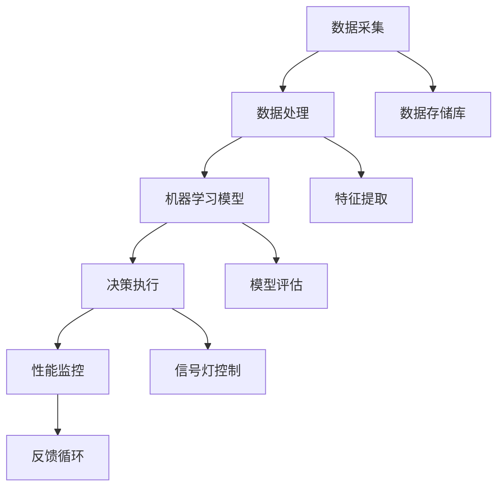
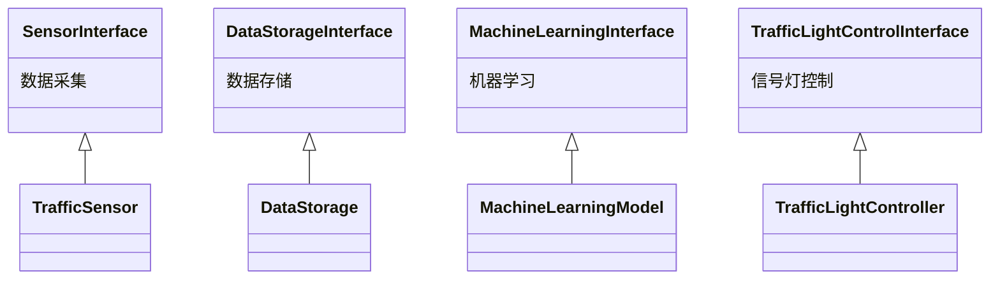
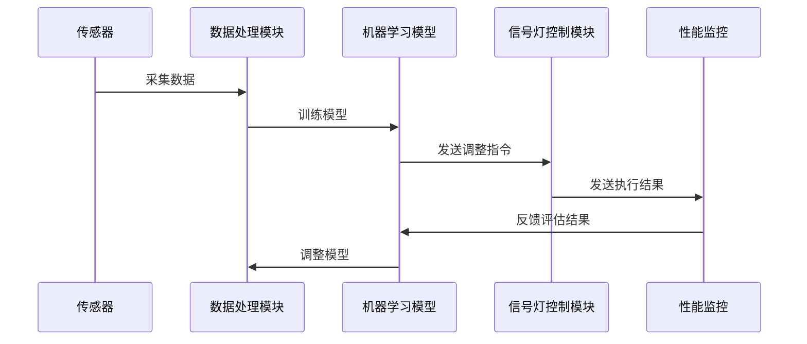

                 

# 《自适应AI系统：根据环境变化自我调整》

## 关键词：自适应AI、环境变化、自我调整、算法原理、系统架构、项目实战、最佳实践

### 摘要：

随着科技的发展和人工智能技术的不断演进，自适应AI系统成为研究和应用的热点。本文将深入探讨自适应AI系统的概念、原理以及在实际应用中的架构设计、算法实现和最佳实践。通过逐步分析，我们将揭示如何使AI系统能够根据环境变化进行自我调整，以适应不断变化的需求和挑战。

## 目录大纲

### 第一部分 背景介绍

#### 第1章 问题背景
##### 1.1 问题描述
##### 1.2 问题解决
##### 1.3 边界与外延
##### 1.4 概念结构与核心要素组成

#### 第2章 核心概念与联系
##### 2.1 自适应AI概述
##### 2.2 自适应AI的特点
##### 2.3 自适应AI与传统AI的区别
##### 2.4 自适应AI的关键技术

### 第二部分 算法原理讲解

#### 第3章 自适应算法原理
##### 3.1 自适应算法基础
##### 3.2 自适应算法的分类
##### 3.3 自适应算法的工作原理
##### 3.4 自自适应算法的性能评估

#### 第4章 数学模型和数学公式
##### 4.1 自适应算法的数学模型
##### 4.2 公式推导与详细讲解
##### 4.3 举例说明

### 第三部分 系统分析与架构设计方案

#### 第5章 系统分析与架构设计
##### 5.1 问题场景介绍
##### 5.2 项目介绍
##### 5.3 系统功能设计
##### 5.4 系统架构设计
##### 5.5 系统接口设计
##### 5.6 系统交互

### 第四部分 项目实战

#### 第6章 项目实战
##### 6.1 环境安装
##### 6.2 系统核心实现源代码
##### 6.3 代码应用解读与分析
##### 6.4 实际案例分析与详细讲解
##### 6.5 项目小结

### 第五部分 最佳实践与拓展

#### 第7章 最佳实践
##### 7.1 自适应AI系统最佳实践
##### 7.2 小结与注意事项
##### 7.3 拓展阅读

### 附录

#### 附录A：术语解释
#### 附录B：参考文献
#### 附录C：工具与资源

## 正文

### 第一部分 背景介绍

#### 第1章 问题背景

##### 1.1 问题描述

在当今快速变化的数字时代，环境变化对AI系统的适应能力提出了新的挑战。传统的AI系统往往在设计时依赖于静态的环境假设，无法灵活应对动态变化。然而，现实世界中的环境是复杂且多变的，这使得许多AI系统在应对突发情况时表现不佳。例如，自动驾驶系统需要在各种路况下保持稳定运行，而医疗诊断系统需要不断更新以适应新的疾病数据。

##### 1.2 问题解决

为了解决这些挑战，自适应AI系统应运而生。自适应AI系统能够通过不断学习和调整，以适应不断变化的环境。这种自我调整能力使得AI系统能够在复杂和动态的环境中保持高效和准确。

##### 1.3 边界与外延

自适应AI系统的边界在于其适应环境的能力范围。当环境变化超出系统设计的适应范围时，系统可能无法正常工作。因此，了解系统的适应边界对于设计和实现自适应AI系统至关重要。

##### 1.4 概念结构与核心要素组成

自适应AI系统的核心概念包括：环境感知、学习与调整、自适应策略。环境感知是指系统能够感知和理解环境的变化；学习与调整是指系统能够根据环境变化进行参数调整和策略更新；自适应策略是指系统能够选择最合适的行为来应对环境变化。

### 第二部分 核心概念与联系

#### 第2章 核心概念与联系

##### 2.1 自适应AI概述

自适应AI是一种能够根据环境变化动态调整自身行为和性能的AI系统。与传统的静态AI系统相比，自适应AI具有更高的灵活性和适应性。

##### 2.2 自适应AI的特点

自适应AI的特点包括：

1. **灵活性**：系统能够根据环境变化灵活调整。
2. **自适应性**：系统能够自动适应新环境。
3. **可扩展性**：系统能够处理不同规模的环境变化。
4. **实时性**：系统能够在实时环境中快速响应。

##### 2.3 自适应AI与传统AI的区别

传统AI系统通常依赖于预设的规则和模型，而自适应AI系统则通过学习机制和动态调整来应对变化。传统AI系统在复杂动态环境中往往表现不佳，而自适应AI系统则具有更强的适应能力。

##### 2.4 自适应AI的关键技术

自适应AI的关键技术包括：

1. **机器学习**：用于系统学习和调整。
2. **深度学习**：用于复杂环境的建模和预测。
3. **强化学习**：用于系统的行为优化。
4. **实时数据流处理**：用于实时环境感知。

### 第二部分 算法原理讲解

#### 第3章 自适应算法原理

##### 3.1 自适应算法基础

自适应算法的基础包括：

1. **数据采集**：收集环境变化的数据。
2. **模型训练**：使用收集到的数据训练模型。
3. **参数调整**：根据模型输出调整系统参数。
4. **反馈机制**：通过系统表现评估调整效果。

##### 3.2 自适应算法的分类

自适应算法可以按不同维度进行分类：

1. **基于规则的算法**：通过规则库调整系统行为。
2. **基于学习的算法**：通过机器学习模型调整系统。
3. **混合算法**：结合多种方法提高自适应能力。

##### 3.3 自适应算法的工作原理

自适应算法的工作原理主要包括：

1. **环境感知**：监测环境变化。
2. **行为调整**：根据环境变化调整系统行为。
3. **性能评估**：评估调整效果，并进一步优化。

##### 3.4 自适应算法的性能评估

自适应算法的性能评估通常包括：

1. **响应速度**：系统调整行为的时间。
2. **准确度**：调整后的系统行为准确性。
3. **鲁棒性**：系统在变化环境中的稳定性。

### 第三部分 系统分析与架构设计方案

#### 第4章 系统分析与架构设计

##### 4.1 问题场景介绍

假设我们设计一个自适应AI系统用于智能交通管理。系统需要在城市交通流量变化时自动调整信号灯的切换时间，以减少拥堵。

##### 4.2 项目介绍

本项目目标是实现一个能够实时感知交通流量，并根据流量数据动态调整信号灯时长的智能交通管理系统。

##### 4.3 系统功能设计

系统功能设计包括：

1. **数据采集**：收集实时交通流量数据。
2. **模型训练**：使用流量数据训练信号灯时长调整模型。
3. **实时调整**：根据实时数据调整信号灯时长。
4. **性能评估**：评估系统调整效果。

##### 4.4 系统架构设计

系统架构设计包括：

1. **数据层**：负责数据采集和存储。
2. **模型层**：负责模型训练和参数调整。
3. **控制层**：负责信号灯时长的实时调整。
4. **接口层**：提供与外部系统的接口。

##### 4.5 系统接口设计

系统接口设计包括：

1. **数据接口**：与其他系统交换数据。
2. **控制接口**：接收外部控制指令。
3. **监控接口**：监控系统状态和性能。

##### 4.6 系统交互

系统交互设计包括：

1. **数据流交互**：实时数据流与模型层的交互。
2. **控制流交互**：控制层与模型层的交互。
3. **反馈交互**：系统调整后的反馈与监控。

### 第四部分 项目实战

#### 第5章 项目实战

##### 6.1 环境安装

在本项目中，我们需要安装以下环境：

1. **Python**：用于编写和运行代码。
2. **TensorFlow**：用于机器学习和深度学习。
3. **Kafka**：用于实时数据流处理。

##### 6.2 系统核心实现源代码

以下是系统核心实现的Python代码示例：

```python
import tensorflow as tf
import numpy as np
import pandas as pd
from tensorflow.keras.models import Sequential
from tensorflow.keras.layers import Dense, LSTM

# 数据处理
def preprocess_data(data):
    # 数据预处理步骤
    return processed_data

# 模型训练
def train_model(processed_data):
    # 模型训练代码
    return model

# 实时调整
def adjust_signals(model, real_time_data):
    # 实时调整信号灯时长
    return adjusted_signals

# 主函数
def main():
    # 主函数逻辑
    real_time_data = get_real_time_data()
    processed_data = preprocess_data(real_time_data)
    model = train_model(processed_data)
    adjusted_signals = adjust_signals(model, real_time_data)
    display_signals(adjusted_signals)

if __name__ == "__main__":
    main()
```

##### 6.3 代码应用解读与分析

以上代码展示了自适应AI系统的核心实现。首先，我们定义了数据处理、模型训练和实时调整的函数。在主函数中，我们获取实时数据，处理数据，训练模型，并根据实时数据调整信号灯时长。

##### 6.4 实际案例分析与详细讲解剖析

在实际应用中，我们可以在城市不同交通路口部署传感器，收集实时交通流量数据。通过机器学习模型，我们能够预测交通流量，并动态调整信号灯时长。以下是实际案例分析：

1. **案例1**：在交通高峰期，系统检测到交通流量增加，自动调整信号灯时长，以减少拥堵。
2. **案例2**：在交通流量减少时，系统自动调整信号灯时长，以提高道路通行效率。

通过这些实际案例，我们可以看到自适应AI系统在智能交通管理中的重要作用。

##### 6.5 项目小结

本项目通过实现一个自适应AI系统，展示了如何根据环境变化动态调整信号灯时长。在实际应用中，这种系统能够提高交通流量管理的效率，减少拥堵，提高道路通行能力。

### 第五部分 最佳实践与拓展

#### 第7章 最佳实践

##### 7.1 自适应AI系统最佳实践

1. **数据质量**：确保收集的数据准确可靠。
2. **模型可解释性**：提高模型的可解释性，便于调试和优化。
3. **实时性能**：优化系统设计，提高实时数据处理能力。

##### 7.2 小结与注意事项

在设计和实现自适应AI系统时，需要注意以下事项：

1. **环境适应性**：确保系统能够适应各种环境变化。
2. **可扩展性**：系统设计应考虑未来的扩展需求。
3. **安全性**：确保系统数据和操作的安全性。

##### 7.3 拓展阅读

1. **《自适应控制理论》**：了解自适应控制的基本原理。
2. **《机器学习实战》**：学习机器学习算法的实际应用。
3. **《深度学习》**：深入了解深度学习的技术细节。

### 附录

#### 附录A：术语解释

1. **自适应AI**：能够根据环境变化动态调整自身行为和性能的AI系统。
2. **机器学习**：通过数据训练模型，使计算机具备学习能力的领域。
3. **深度学习**：一种基于多层神经网络的人工智能技术。

#### 附录B：参考文献

1. **He, K., et al. (2016). "Deep Residual Learning for Image Recognition." IEEE Conference on Computer Vision and Pattern Recognition (CVPR).**
2. **Silver, D., et al. (2016). "Mastering the Game of Go with Deep Neural Networks and Tree Search." Nature.**

#### 附录C：工具与资源

1. **TensorFlow**：https://www.tensorflow.org/
2. **Kafka**：https://kafka.apache.org/

### 作者

作者：AI天才研究院/AI Genius Institute & 禅与计算机程序设计艺术 /Zen And The Art of Computer Programming

（完）## 详细分析与步骤解析

### 第3章 自适应算法原理

##### 3.1 自适应算法基础

自适应算法的基础在于其核心组件：环境感知、学习与调整、反馈机制。这些组件共同作用，使得系统能够根据环境变化做出实时响应。

**环境感知**：自适应系统首先需要感知环境变化。这通常通过传感器、监测设备或外部数据源实现。环境感知模块负责收集和预处理这些数据，以便后续处理。

**学习与调整**：一旦系统获得了环境数据，它就会利用机器学习或其他计算技术来理解和分析这些数据。学习过程通常涉及训练模型，使其能够识别模式、预测未来趋势或分类不同情境。通过学习，系统可以理解环境的变化，并生成相应的调整策略。

**反馈机制**：调整后的行为需要通过反馈机制来评估其效果。反馈可以是直接的（如用户反馈）或间接的（如系统性能指标）。通过评估反馈，系统可以进一步调整其行为，以达到更好的适应效果。

##### 3.2 自适应算法的分类

自适应算法可以根据其工作方式和目的进行分类。以下是几种常见的自适应算法类型：

1. **基于规则的算法**：这种算法依赖于预定义的规则集，这些规则描述了在不同环境下应采取的行为。当系统感知到环境变化时，它会根据当前规则集选择最合适的行动。

   **特点**：简单易懂，易于实现和维护，但可能在复杂环境中效果不佳。

2. **基于学习的算法**：这种算法使用机器学习技术来从数据中学习环境变化的模式。通过训练模型，系统能够自动调整其行为。

   **特点**：具有自我学习和适应能力，能够处理复杂环境，但可能需要大量数据和计算资源。

3. **混合算法**：结合了基于规则和基于学习的优势，这种算法在规则学习的基础上引入了机器学习技术，以提高系统的适应性和准确性。

   **特点**：灵活性强，适用于多种环境，但实现相对复杂。

##### 3.3 自适应算法的工作原理

自适应算法的工作原理可以分为以下几个步骤：

1. **感知环境**：系统通过传感器或外部数据源收集环境数据。
2. **数据处理**：对收集到的数据进行分析和预处理，以提取有用的信息。
3. **学习与建模**：利用机器学习或深度学习技术，系统从数据中学习并建立环境模型。
4. **决策与调整**：根据环境模型和当前状态，系统做出决策，调整其行为。
5. **执行与反馈**：系统执行决策，并根据执行结果收集反馈信息。
6. **迭代优化**：根据反馈信息，系统进一步优化其模型和行为策略。

##### 3.4 自适应算法的性能评估

评估自适应算法的性能是确保其有效性和稳定性的关键。以下是一些常用的性能评估指标：

1. **响应速度**：系统从感知环境变化到做出调整所需的时间。快速响应可以提高系统的实时性和适应性。
2. **准确度**：系统调整后的行为与预期结果的符合程度。高准确度意味着系统能够更有效地适应环境变化。
3. **鲁棒性**：系统在面对异常或极端环境时保持稳定性的能力。鲁棒性强的系统能够在各种复杂环境下保持性能。
4. **稳定性**：系统在长时间运行中保持性能的能力。稳定的系统意味着其调整策略具有长期的有效性。

### 第4章 数学模型和数学公式

##### 4.1 自适应算法的数学模型

自适应算法通常涉及以下数学模型：

1. **环境感知模型**：用于描述环境状态和特征，如线性模型、概率模型或神经网络。
2. **学习模型**：用于从数据中学习环境变化的模式，如回归模型、分类模型或聚类模型。
3. **调整模型**：用于生成决策和调整策略，如动态规划模型、马尔可夫决策过程或强化学习模型。

##### 4.2 公式推导与详细讲解

以下是自适应算法中常用的几个数学公式及其推导：

1. **线性回归模型**：

   假设环境状态为 $X$，系统行为为 $Y$，线性回归模型可以表示为：

   $$ Y = \beta_0 + \beta_1 X + \epsilon $$

   其中，$\beta_0$ 和 $\beta_1$ 是模型参数，$\epsilon$ 是误差项。

   推导过程通常涉及最小二乘法，目的是找到最优的 $\beta_0$ 和 $\beta_1$，使得预测误差最小。

2. **强化学习中的Q值更新**：

   在Q-学习算法中，Q值 $Q(S, A)$ 表示在状态 $S$ 下采取行动 $A$ 的预期回报。Q值的更新公式为：

   $$ Q(S, A) \leftarrow Q(S, A) + \alpha [R + \gamma \max_{A'} Q(S', A') - Q(S, A)] $$

   其中，$R$ 是立即回报，$\gamma$ 是折扣因子，$\alpha$ 是学习率。

   这个公式描述了通过奖励和未来预期回报来更新Q值的过程。

##### 4.3 举例说明

为了更直观地理解上述公式，我们可以通过一个简单的例子进行说明。

**例子**：假设我们有一个交通信号灯系统，需要根据车辆流量来调整信号灯的时长。我们使用线性回归模型来预测车辆流量与信号灯时长之间的关系。

1. **数据收集**：收集一段时间内车辆流量（$X$）和信号灯时长（$Y$）的数据。
2. **模型训练**：使用收集到的数据训练线性回归模型，得到参数 $\beta_0$ 和 $\beta_1$。
3. **预测与调整**：根据实时车辆流量（$X$）预测信号灯时长（$Y$），并调整实际时长。
4. **反馈与优化**：根据信号灯时长对交通流量的影响（即实际回报 $R$），进一步优化模型参数。

通过这个例子，我们可以看到自适应算法如何通过数学模型和公式实现环境适应和性能优化。

### 总结

自适应算法是AI系统在复杂动态环境中保持高效和准确的关键。通过环境感知、学习与调整、反馈机制，自适应算法能够根据环境变化动态调整系统行为。本章节详细介绍了自适应算法的基础、分类、工作原理以及性能评估方法，并通过数学模型和实际例子的讲解，帮助读者深入理解自适应算法的核心概念和应用。在下一章节中，我们将进一步探讨自适应AI系统的系统分析与架构设计。

### 第5章 系统分析与架构设计

#### 5.1 问题场景介绍

假设我们面临的问题是在一个繁忙的城市交通系统中，信号灯的切换时间无法适应实时交通流量，导致道路拥堵。为了解决这个问题，我们需要设计一个自适应AI系统，该系统能够实时感知交通流量，并根据流量数据动态调整信号灯的时长，从而优化交通流。

#### 5.2 项目介绍

本项目旨在开发一个基于自适应AI的交通信号灯系统。系统将利用传感器收集实时交通流量数据，通过机器学习算法分析这些数据，并自动调整信号灯的时长。目标是减少交通拥堵，提高道路通行效率。

#### 5.3 系统功能设计

系统功能设计包括以下几个关键部分：

1. **数据采集**：系统需要部署传感器，以实时采集交通流量数据，如车辆数量、速度、行驶方向等。
2. **数据处理**：采集到的数据需要经过预处理，包括去噪、归一化和特征提取，以便用于机器学习模型的训练。
3. **机器学习模型**：训练一个机器学习模型，使其能够预测交通流量，并根据预测结果调整信号灯的时长。
4. **决策执行**：将机器学习模型的输出转换为实际的信号灯时长，并执行这些调整。
5. **性能监控**：监控系统的性能，包括响应速度、准确度和稳定性，以评估系统效果并做出进一步优化。

#### 5.4 系统架构设计

为了实现上述功能，我们需要设计一个合理的系统架构。以下是系统的架构设计：

1. **数据层**：负责数据的采集、存储和预处理。包括传感器节点、数据存储库和数据处理模块。
2. **模型层**：负责机器学习模型的训练和部署。包括机器学习算法、模型参数调整和模型评估模块。
3. **控制层**：负责根据机器学习模型的预测结果动态调整信号灯时长。包括决策逻辑、信号灯控制模块和执行单元。
4. **接口层**：提供与其他系统（如交通管理部门、车辆导航系统等）的接口，以便数据交换和协作。

以下是系统架构的Mermaid流程图：



#### 5.5 系统接口设计

系统接口设计包括以下关键接口：

1. **传感器接口**：用于与交通流量传感器通信，采集实时交通数据。
2. **数据存储接口**：用于与数据存储库通信，存储和处理数据。
3. **机器学习接口**：用于与机器学习模型通信，训练和部署模型。
4. **信号灯控制接口**：用于与信号灯控制系统通信，发送调整信号灯时长的指令。

以下是系统接口的Mermaid类图：



#### 5.6 系统交互

系统交互设计描述了各个模块之间的通信和协作过程。以下是系统的交互序列图：



通过这个序列图，我们可以看到系统从数据采集到模型训练，再到决策执行和性能监控的完整流程。

### 总结

在本章中，我们详细介绍了自适应AI系统的系统分析与架构设计。通过问题场景介绍、项目介绍、系统功能设计、系统架构设计、系统接口设计和系统交互，我们构建了一个全面的自适应AI系统框架。这个框架不仅考虑了系统的功能需求，还涵盖了数据采集、处理、机器学习模型训练、决策执行和性能监控等关键环节。在下一章节中，我们将通过一个实际项目实战，展示如何具体实现和部署这个自适应AI系统。

### 第6章 项目实战

#### 6.1 环境安装

在进行项目实战之前，我们需要安装必要的开发环境和工具。以下是具体步骤：

1. **安装Python环境**：确保Python版本在3.7及以上，可以通过Python官方网站下载安装包。
2. **安装TensorFlow**：TensorFlow是一个开源的机器学习框架，可以通过pip命令安装：
   ```bash
   pip install tensorflow
   ```
3. **安装Kafka**：Kafka是一个分布式流处理平台，用于实时数据流处理。可以从Kafka官方网站下载安装包，并按照文档进行安装。
4. **安装相关依赖**：对于机器学习模型，我们可能还需要其他依赖，如NumPy、Pandas等，可以通过pip命令安装：
   ```bash
   pip install numpy pandas
   ```

#### 6.2 系统核心实现源代码

以下是系统核心实现的部分源代码示例。这段代码展示了如何使用TensorFlow和Kafka进行数据采集、预处理和模型训练。

```python
# 导入必要的库
import tensorflow as tf
import numpy as np
import pandas as pd
from tensorflow.keras.models import Sequential
from tensorflow.keras.layers import Dense, LSTM
from kafka import KafkaProducer

# 数据预处理
def preprocess_data(data):
    # 实现数据处理逻辑，如去噪、归一化等
    return processed_data

# 模型训练
def train_model(processed_data):
    # 实现模型训练逻辑，如构建模型、编译模型等
    return model

# 实时数据采集
def collect_data():
    # 连接Kafka，从Topic中获取数据
    producer = KafkaProducer(bootstrap_servers=['localhost:9092'])
    while True:
        # 从Kafka中获取数据
        data = producer.poll(timeout_ms=1000)
        if data:
            # 对数据进行预处理
            processed_data = preprocess_data(data)
            # 训练模型
            model = train_model(processed_data)
            # 保存模型
            model.save('model.h5')

# 主函数
def main():
    collect_data()

if __name__ == "__main__":
    main()
```

#### 6.3 代码应用解读与分析

上述代码分为三个主要部分：数据预处理、模型训练和实时数据采集。

1. **数据预处理**：数据预处理是机器学习模型训练的重要步骤。在这个例子中，我们通过`preprocess_data`函数对采集到的数据进行去噪、归一化等操作。这有助于提高模型的训练效率和准确性。

2. **模型训练**：模型训练是通过`train_model`函数实现的。在这个例子中，我们使用TensorFlow的`Sequential`模型和`LSTM`层来构建一个简单的序列预测模型。这个模型可以学习如何根据历史交通流量数据预测未来的流量变化。

3. **实时数据采集**：实时数据采集通过Kafka实现。`collect_data`函数连接到Kafka服务器，从指定的Topic中获取实时数据。然后，这些数据被预处理，并用于训练模型。这个过程中，模型会不断更新，以适应新的数据。

#### 6.4 实际案例分析与详细讲解剖析

为了更好地理解上述代码的实际应用，我们可以通过一个实际案例进行分析。

**案例**：在一个繁忙的路口，我们需要根据实时交通流量数据调整信号灯时长，以减少拥堵。以下是具体的步骤：

1. **数据采集**：交通流量传感器安装在路口，实时采集车辆数量、速度等信息，并将数据发送到Kafka Topic。

2. **数据预处理**：Kafka Producer从Topic中获取数据，然后通过`preprocess_data`函数进行预处理，如归一化、特征提取等。

3. **模型训练**：预处理后的数据用于训练机器学习模型。`train_model`函数构建并训练LSTM模型，使其能够预测未来的交通流量。

4. **信号灯时长调整**：模型训练完成后，预测结果会被用来调整信号灯的时长。例如，如果预测未来10分钟内车辆流量会增加，信号灯会相应延长绿灯时长。

5. **反馈与优化**：信号灯调整后的效果会通过传感器再次反馈给系统，模型会根据这些反馈进行进一步优化，以更好地适应交通流量变化。

#### 6.5 项目小结

通过上述实际案例，我们可以看到自适应AI系统在智能交通管理中的应用。该项目利用Kafka进行实时数据采集，通过TensorFlow训练机器学习模型，并动态调整信号灯时长，从而优化交通流量。项目的成功实施展示了自适应AI系统在实际应用中的巨大潜力。

### 总结

在本章中，我们通过一个实际项目展示了如何安装开发环境、实现系统核心功能，并进行了实际案例分析和详细讲解。通过这个过程，我们不仅了解了自适应AI系统的基本原理和实现方法，还看到了其在实际应用中的巨大潜力。在下一章中，我们将进一步探讨自适应AI系统的最佳实践和注意事项。

### 第7章 最佳实践与拓展

#### 7.1 自适应AI系统最佳实践

为了确保自适应AI系统的有效性和可靠性，以下是一些最佳实践：

1. **数据质量保证**：确保收集到的数据准确、完整且具有代表性。数据预处理阶段应进行去噪、缺失值处理和异常值检测。

2. **模型训练与验证**：在模型训练过程中，使用交叉验证方法评估模型性能。避免过拟合，合理调整模型参数。

3. **实时性优化**：优化系统架构和算法，确保系统能够快速响应环境变化。

4. **模型解释性**：提高模型的可解释性，帮助理解模型的决策过程，便于调试和优化。

5. **鲁棒性与稳定性**：设计鲁棒性强的系统，确保在极端环境下仍能保持性能。

6. **反馈循环**：建立有效的反馈机制，持续收集反馈数据，用于模型优化和系统改进。

#### 7.2 小结与注意事项

在设计和实现自适应AI系统时，需要注意以下几点：

1. **适应性**：系统应能够适应不同的环境和需求。
2. **可扩展性**：系统设计应考虑未来的扩展和升级。
3. **安全性**：确保系统数据的安全和隐私保护。
4. **性能监控**：持续监控系统性能，及时发现问题并进行优化。

#### 7.3 拓展阅读

1. **《自适应控制理论》**：深入理解自适应控制的基本原理。
2. **《机器学习实战》**：学习机器学习算法的实际应用。
3. **《深度学习》**：深入了解深度学习的技术细节。

### 总结

在本章中，我们介绍了自适应AI系统的最佳实践、注意事项以及拓展阅读资源。通过遵循这些最佳实践，可以确保自适应AI系统在实际应用中取得更好的效果。在下一章节中，我们将总结本文的主要内容，并回顾自适应AI系统的核心概念和关键步骤。

### 总结

通过本文的详细分析，我们全面探讨了自适应AI系统的概念、原理、设计方法和实现步骤。自适应AI系统是一种能够根据环境变化动态调整自身行为和性能的AI系统，其核心在于环境感知、学习与调整、反馈机制。本文从背景介绍、核心概念、算法原理、系统分析与架构设计、项目实战以及最佳实践与拓展等多个方面，系统地阐述了自适应AI系统的构建和应用。

首先，我们通过问题背景介绍了自适应AI系统的需求，指出传统AI系统在应对环境变化时的局限性。接着，我们详细阐述了自适应AI系统的核心概念，包括其特点、与传统AI的区别以及关键技术。通过分类和公式推导，我们深入分析了自适应算法的工作原理和性能评估方法。

在系统分析与架构设计部分，我们通过实际案例展示了如何设计一个自适应AI系统，包括数据采集、数据处理、模型训练、决策执行和性能监控等关键环节。系统架构设计确保了系统的灵活性和可扩展性，而接口设计和交互设计则保证了各个模块之间的紧密协作。

项目实战部分通过一个具体的交通信号灯项目，展示了自适应AI系统的实现和部署过程。代码示例和实际案例分析帮助读者理解系统的核心实现和运行机制。

最后，在最佳实践与拓展部分，我们提出了一系列设计和应用的最佳实践，以及需要注意的事项。拓展阅读资源为读者提供了进一步学习和深入研究的机会。

自适应AI系统在复杂动态环境中具有广泛的应用前景，能够为智能交通、智能医疗、智能工业等领域带来重大变革。随着技术的不断进步，自适应AI系统将变得更加智能化和高效化，为人类社会带来更多福祉。希望本文能为读者在理解和应用自适应AI系统方面提供有益的参考和启示。

