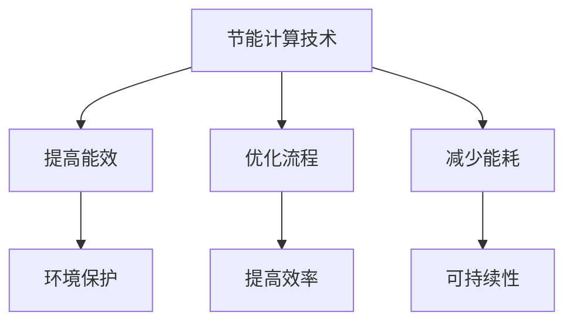

                 

### 第一部分：节能计算技术概述

#### 第1章：背景与概念

**1.1 节能计算技术的问题背景**

**问题描述**：随着全球经济的快速发展，能源消耗日益增加，能源短缺和环境污染问题日益严重。节能计算技术应运而生，旨在通过优化计算过程和算法，减少能源消耗，实现可持续发展。

**问题解决**：节能计算技术通过改进计算方法、优化数据传输、降低硬件功耗等多种手段，有效减少计算过程中的能源消耗。此外，它还能帮助识别并优化能源浪费，提高能源利用率。

**边界与外延**：节能计算技术主要应用于数据中心、云计算、工业制造、建筑能耗管理等领域。其外延还涉及新能源利用、可再生能源整合等方面。

**1.2 节能计算技术的核心概念**

**概念定义**：节能计算技术（Energy-Efficient Computing Technology）是指通过优化计算资源利用、改进算法和硬件设计，实现计算任务在低能耗、低排放的情况下高效完成的技术。

**核心要素**：
- **计算资源优化**：通过负载均衡、任务调度等手段，提高计算资源利用率。
- **算法改进**：优化现有算法，开发新算法，以减少计算复杂度和能源消耗。
- **硬件设计**：设计低功耗、高能效的计算硬件，如GPU、FPGA等。

**概念属性特征对比表格**

#### 第2章：节能计算技术的历史与发展

**2.1 节能计算技术的起源与发展**

**起源**：节能计算技术的概念最早可以追溯到20世纪70年代，当时随着计算机技术的快速发展，能源消耗问题逐渐显现。早期的节能计算主要侧重于硬件能效的提升。

**发展阶段**：
- **初步探索阶段（20世纪70年代至90年代）**：节能计算技术开始得到关注，主要研究如何在现有硬件上实现节能。
- **快速发展阶段（21世纪初至今）**：随着计算技术的进步和可持续发展理念的普及，节能计算技术取得了显著进展。数据中心、云计算等领域的节能计算应用逐渐普及。

**2.2 节能计算技术的现状与趋势**

**现状**：当前，节能计算技术已经广泛应用于数据中心、云计算、工业制造、建筑能耗管理等多个领域。各国政府和企业也加大了对节能计算技术的研发和应用力度。

**趋势**：
- **技术深化**：节能计算技术将继续向深度和广度发展，涵盖更多应用领域，如边缘计算、物联网等。
- **创新驱动**：随着人工智能、量子计算等新兴技术的崛起，节能计算技术将迎来新的发展机遇。
- **市场潜力**：节能计算技术市场潜力巨大，预计未来几年将保持高速增长。

### 结论

通过本章的介绍，我们可以看到节能计算技术在解决能源消耗、环境保护等问题上具有重要意义。随着技术的不断进步，节能计算技术将在未来发挥更加关键的作用，推动社会可持续发展。在接下来的章节中，我们将进一步探讨节能计算技术的具体应用领域和关键技术。

