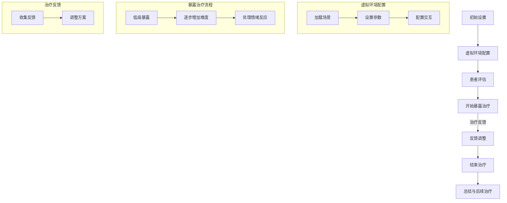

                 

### 1.1.1 虚拟现实的概念

虚拟现实（Virtual Reality，简称VR）是一种通过计算机技术创造出来的模拟环境，使用户能够在其中感知、交互并探索。与传统的二维图像和视频相比，VR技术提供了更为沉浸式的体验，使用户仿佛置身于虚拟的世界中。

**核心概念**：

1. **感知**：VR通过特殊的设备（如头戴式显示器、传感器手套等）向用户传递视觉、听觉、触觉等多种感官信息，增强沉浸感。
2. **交互**：用户可以通过头部的转动、手的动作等自然行为与虚拟环境进行互动，实现一定程度上的自由控制。
3. **探索**：用户在虚拟环境中可以自由移动、探索、尝试，甚至可以改变环境，体验到与真实世界相似的互动性。

**工作原理**：

VR系统通常由以下几个关键部分组成：

1. **硬件设备**：包括头戴式显示器（HMD）、数据手套、位置追踪器等，这些设备用于捕捉用户的动作和提供虚拟环境的输出。
2. **软件平台**：用于创建和运行虚拟环境的应用程序，通常包含场景建模、交互逻辑和渲染引擎等模块。
3. **网络支持**：对于某些复杂的VR应用，需要通过网络进行数据传输和实时交互。

**主要特点**：

1. **沉浸感**：通过高度仿真的视觉、听觉和触觉效果，使用户难以区分现实与虚拟。
2. **互动性**：用户可以通过各种方式与虚拟环境互动，实现高度的自由度和灵活性。
3. **创造性**：用户可以自由地创造和改变虚拟环境，创造出独特的体验。

在接下来的小节中，我们将进一步探讨虚拟现实技术的发展历史和其主要特点，以及它如何应用于创伤后应激障碍（PTSD）的治疗中。

### 1.1.2 虚拟现实的发展历史

虚拟现实（VR）技术的概念起源于20世纪中期，其发展经历了多个阶段，从最初的构想逐步走向成熟的应用。以下是VR技术发展历程的简要回顾：

**1960年代：早期探索**

1960年代，VR技术的概念开始萌芽。美国科学家和工程师伊凡·苏瑟兰（Ivan Sutherland）在1968年设计出了世界上第一个头戴式显示器（HMD），命名为“达摩克利斯之剑”（The Sword of Damocles）。这一装置虽然笨重，但它标志着VR技术的重要起点。

**1970年代：虚拟环境与沉浸感**

1970年代，VR技术开始逐渐成熟，研究人员开始探索如何创建更为沉浸的虚拟环境。美国航空航天局（NASA）和波音公司等机构投入了大量资源进行VR研究，用于飞行模拟和训练。与此同时，日本也启动了“VRML”（Virtual Reality Modeling Language）项目，旨在定义一种用于创建和交互虚拟环境的标准语言。

**1980年代：商业化尝试**

1980年代，VR技术开始向商业化迈进。任天堂的“Virtual Boy”游戏机（1985年）是早期尝试之一，尽管因技术限制和商业表现不佳而失败，但引发了公众对VR技术的关注。同时，VR技术在娱乐领域的应用也开始出现，例如VR游戏和虚拟实境体验馆。

**1990年代：技术瓶颈与复兴**

1990年代，VR技术遭遇了诸多技术瓶颈，包括显示技术、交互方式和计算能力的限制。尽管如此，一些重要的进展仍不断涌现。例如，索尼推出了“VR Cover”，这是首个采用液晶显示屏的VR设备。此外，1995年，美国航空航天局与麻省理工学院合作开发的“高效能计算与通讯中心”（HPCC）启动，为VR技术的研究提供了强有力的支持。

**2000年代：快速发展和应用扩展**

进入21世纪，VR技术迎来了快速发展。显示技术、传感器和计算能力的显著提升，使得VR设备变得更加轻便和易于使用。谷歌推出了“Google Cardboard”项目，使得大众可以以极低的成本体验到VR。此外，Oculus VR公司发布了首款高性能VR头戴设备“Oculus Rift”，引发了VR技术的热潮。

**2010年代：VR技术的应用拓展**

2010年代，VR技术开始广泛应用于多个领域，包括教育、医疗、娱乐和工业等。在教育领域，VR技术被用于模拟历史场景、物理实验和医学解剖等。在医疗领域，VR被用于创伤后应激障碍（PTSD）的治疗、疼痛管理、手术模拟等。在娱乐领域，VR游戏和电影吸引了大量用户。

**2020年代：VR的深度探索与多元化应用**

随着5G、人工智能和增强现实（AR）等技术的发展，VR技术进入了一个全新的发展阶段。远程工作和虚拟协作、智能家居、智能城市等领域的应用逐渐展开。同时，VR技术在心理健康、心理健康咨询和创伤后应激障碍治疗中的应用也日益受到重视。

总的来说，虚拟现实技术从早期的概念探索到今天的多元化应用，经历了数十年的发展。随着技术的不断进步和应用的拓展，VR技术在未来有望在更多领域发挥重要作用，带来深远的社会影响。

### 1.1.3 虚拟现实技术的主要特点

虚拟现实（VR）技术以其独特的特点在众多领域中独树一帜，主要特点包括沉浸感、互动性和创造性。

**沉浸感**：虚拟现实技术通过高度仿真的视觉、听觉和触觉效果，使用户在虚拟环境中体验到仿佛置身现实世界的感受。用户可以通过头戴式显示器（HMD）和立体声音响设备感受到360度全景图像和声音，同时，一些高端VR设备还配备了触觉手套和振动反馈手柄，进一步增强用户的沉浸感。

**互动性**：虚拟现实技术允许用户通过自然的肢体动作和语音命令与虚拟环境进行互动。用户可以在虚拟空间中自由移动、探索、操作虚拟对象，甚至改变环境布局。这种高互动性使得用户不仅能够体验虚拟世界，还能够主动参与其中，创造出独特的互动体验。

**创造性**：虚拟现实技术为用户提供了无限的创造空间。用户可以在虚拟环境中自由构建和修改虚拟物体，设计复杂的场景和互动游戏。这种创造性不仅体现在娱乐和艺术领域，还广泛应用于教育、设计、建筑和工程等多个领域，使用户能够通过虚拟现实技术实现他们的创意构想。

总之，虚拟现实技术的沉浸感、互动性和创造性使其在各个领域具有广泛的应用前景，为用户带来了全新的体验和无限的可能。

### 1.2 创伤后应激障碍（PTSD）简介

创伤后应激障碍（Post-Traumatic Stress Disorder，简称PTSD）是一种严重的心理健康问题，通常由个人经历或目睹极端创伤性事件引起。PTSD的症状多种多样，严重影响患者的日常生活和心理健康。

**概念**：

PTSD是指个体在经历了极端创伤性事件后，出现的一系列复杂的心理和生理反应。这些反应包括对创伤性事件的反复回忆、持续的焦虑、失眠、易怒、情感麻木等。PTSD患者往往难以摆脱创伤的阴影，长期遭受心理痛苦。

**症状**：

PTSD的症状可以分为三大类：重新体验症状、警觉性增加症状和回避症状。

1. **重新体验症状**：患者经常经历创伤性事件的重新体验，表现为频繁的噩梦、闪回和情绪爆发。这些体验常常让患者感到痛苦和不适。
   
2. **警觉性增加症状**：患者表现出持续的警觉状态，容易感到惊恐，对周围环境过度敏感。这种状态可能导致失眠、易怒和注意力难以集中。

3. **回避症状**：患者会尽量回避与创伤相关的人和事物，避免谈论创伤经历。这种行为可能导致患者与社会隔离，进一步加重心理负担。

**影响**：

PTSD对患者的心理健康和日常生活具有深远的影响。除了上述症状，患者还可能出现身体上的问题，如头痛、胃痛和肌肉紧张等。长期未得到有效治疗的PTSD患者，生活质量显著下降，甚至可能导致抑郁症、焦虑症等并发症。

**治疗方法**：

PTSD的治疗方法主要包括心理治疗、药物治疗和支持性治疗。

1. **心理治疗**：认知行为疗法（CBT）、暴露疗法（ET）和眼动脱敏与再加工疗法（EMDR）等心理治疗方法在PTSD治疗中具有显著效果。这些疗法帮助患者逐步面对和克服创伤记忆，降低心理痛苦。

2. **药物治疗**：抗抑郁药、抗焦虑药和抗精神病药等药物可以帮助缓解PTSD症状，但药物治疗通常需要与心理治疗结合使用，以达到最佳效果。

3. **支持性治疗**：包括家庭治疗、小组治疗和社交支持等，旨在为患者提供一个安全、理解和支持的环境，帮助他们应对创伤和恢复心理平衡。

总之，PTSD是一种需要专业治疗的严重心理健康问题，了解其概念、症状和治疗方法对于帮助患者恢复心理健康具有重要意义。

### 1.3 虚拟现实在PTSD治疗中的应用

虚拟现实（VR）技术为创伤后应激障碍（PTSD）的治疗提供了一种创新的手段。通过模拟各种创伤性场景，VR可以帮助患者逐步面对和克服创伤记忆，从而缓解PTSD症状。

**虚拟现实暴露疗法（VRET）**：

虚拟现实暴露疗法（Virtual Reality Exposure Therapy，简称VRET）是一种利用虚拟现实技术进行心理治疗的方法。患者在一个安全的虚拟环境中逐步暴露于创伤性场景，以减少对现实生活的回避和焦虑。这种方法基于暴露疗法的原理，通过反复暴露于创伤记忆，帮助患者逐渐降低对创伤的敏感性和痛苦感。

**优势**：

1. **沉浸感**：VR技术提供的沉浸式体验，使患者能够更加真实地感受到创伤场景。这种高度仿真的体验有助于患者更好地理解和处理创伤记忆。
   
2. **可控性**：虚拟环境可以精确控制，治疗师可以根据患者的反应逐步增加创伤场景的复杂性和挑战性。这种可控性有助于患者逐步克服恐惧和焦虑。

3. **安全性**：在虚拟环境中进行暴露，患者可以在一个安全、无威胁的环境中逐步面对创伤。这有助于减少患者的焦虑感和逃避行为，提高治疗效果。

4. **成本效益**：与传统心理治疗相比，VRET具有更高的成本效益。虚拟现实设备相对于心理治疗师的人工成本更低，且可以在较短的时间内多次重复治疗，从而提高治疗效果。

**挑战**：

1. **技术要求**：VRET需要高质量的VR设备和技术支持，这对于一些医疗资源和条件有限的地区来说是一个挑战。
   
2. **患者接受度**：部分患者可能对VR技术持怀疑态度，担心虚拟现实带来的副作用或无法真实反映自己的创伤经历。

3. **治疗效果评估**：虽然VRET在临床应用中表现出良好的治疗效果，但对其长期效果和潜在副作用的评估仍需进一步研究。

总之，虚拟现实在PTSD治疗中的应用展现了巨大的潜力，但其有效性和可行性仍需通过更多的临床研究和实践验证。未来，随着技术的不断进步和成熟，VRET有望成为治疗PTSD的一种重要手段。

### 1.4 虚拟现实在PTSD治疗中的核心概念与联系

为了更好地理解虚拟现实（VR）在创伤后应激障碍（PTSD）治疗中的应用，我们需要明确几个核心概念，并探讨它们之间的联系。以下是虚拟现实、创伤后应激障碍和相关治疗方法的定义、属性特征对比表格以及虚拟现实与PTSD治疗的实体关系图（ER图）。

**核心概念定义**：

1. **虚拟现实（VR）**：通过计算机技术创建的模拟环境，使用户能够在其中感知、交互并探索。主要特点包括沉浸感、互动性和创造性。
   
2. **创伤后应激障碍（PTSD）**：一种严重的心理健康问题，通常由极端创伤性事件引起，表现为重新体验症状、警觉性增加症状和回避症状。
   
3. **虚拟现实暴露疗法（VRET）**：一种利用虚拟现实技术进行心理治疗的方法，通过模拟创伤性场景，帮助患者逐步面对和克服创伤记忆。

**属性特征对比表格**：

| 概念 | 属性特征 |
| --- | --- |
| **虚拟现实（VR）** | - 沉浸感 | - 互动性 | - 创造性 |
| **创伤后应激障碍（PTSD）** | - 重新体验症状 | - 警觉性增加症状 | - 回避症状 |
| **虚拟现实暴露疗法（VRET）** | - 沉浸式体验 | - 可控性 | - 安全性 |

**实体关系图（ER图）**：

以下是虚拟现实（VR）与创伤后应激障碍（PTSD）治疗相关概念的实体关系图（ER图）：

```mermaid
erDiagram
    VR |<..| VRET
    VR |<..| PTSD_Treatment
    PTSD |<..| PTSD_Symptoms
    VRET |<..| PTSD_Cure
```

在这个ER图中，VR是虚拟现实的核心概念，通过与其子概念VRET（虚拟现实暴露疗法）和治疗PTSD（创伤后应激障碍治疗）紧密相关。PTSD是另一个核心概念，它包括多种症状（PTSD_Symptoms），而VRET则是专门用于治疗PTSD的方法（PTSD_Cure）。

通过上述定义和ER图，我们可以更清晰地理解虚拟现实在PTSD治疗中的应用，以及各个概念之间的相互联系和作用。这为进一步探讨虚拟现实技术的具体应用和效果提供了理论基础。

### 2.1 虚拟现实技术原理

虚拟现实（VR）技术通过一系列复杂的计算机技术，创造出一个虚拟的、沉浸式的环境，使用户能够在这个环境中感知、互动和探索。以下是VR技术的主要组成部分和原理：

**主要组成部分**：

1. **硬件设备**：包括头戴式显示器（HMD）、传感器、位置追踪器、数据手套和立体声音响系统等。这些设备用于捕捉用户的动作和提供虚拟环境的输出。

2. **软件平台**：用于创建和运行虚拟环境的应用程序，通常包含场景建模、交互逻辑和渲染引擎等模块。

3. **计算系统**：提供计算资源，包括高性能计算机、图形处理单元（GPU）和服务器等，用于实时渲染和处理虚拟环境中的数据和交互。

**工作原理**：

1. **场景建模**：通过计算机图形学技术创建虚拟环境的三维模型，包括建筑、人物、物体和纹理等。

2. **交互逻辑**：定义用户如何与虚拟环境互动，包括手部动作、语音命令和面部表情等。

3. **渲染引擎**：将场景模型转换为图像，通过头戴式显示器或其他显示设备呈现给用户。

4. **传感器和位置追踪**：捕捉用户的位置和动作，确保虚拟环境与用户的实际动作保持同步。

5. **立体声音效**：通过立体声音效系统，为用户创造一个环绕声场的听觉体验，进一步增强沉浸感。

**关键技术**：

1. **三维建模技术**：使用三维建模软件（如Blender、3ds Max等）创建虚拟环境中的三维对象和场景。

2. **渲染技术**：通过图形处理单元（GPU）实现高效的场景渲染，包括光线追踪、阴影效果和纹理映射等。

3. **传感器融合技术**：结合多种传感器（如加速度计、陀螺仪、RFID等）数据，实现精确的位置追踪和动作捕捉。

4. **人工智能技术**：用于提高虚拟环境的智能程度，实现更自然的交互和自适应行为。

5. **人机交互技术**：研究如何通过自然的人体动作和语音命令与虚拟环境进行互动，提高用户体验。

通过上述原理和关键技术的综合运用，虚拟现实技术为用户提供了一个高度沉浸式的体验，使其能够自由探索和互动于虚拟环境。这种技术不仅改变了娱乐和游戏领域的面貌，还广泛应用于教育、医疗、设计、建筑和工程等多个领域，展示了巨大的应用潜力。

### 2.2 虚拟现实暴露疗法（VRET）算法

虚拟现实暴露疗法（Virtual Reality Exposure Therapy，简称VRET）是一种基于虚拟现实技术进行心理治疗的方法，主要用于治疗创伤后应激障碍（PTSD）。VRET通过在虚拟环境中逐步暴露患者于创伤性场景，帮助患者减少对创伤的记忆敏感性，从而缓解PTSD症状。

**暴露疗法原理**：

暴露疗法是一种经典的心理治疗方法，其基本原理是通过反复暴露于创伤记忆，使患者逐渐降低对创伤事件的敏感性和痛苦感。在VRET中，患者在一个安全、可控的虚拟环境中逐步面对创伤性场景，通过反复暴露，逐步消除对创伤的回避和恐惧。

**VRET的工作流程**：

1. **初始设定**：治疗师和患者共同确定治疗的目标和预期效果，确保患者理解治疗过程。

2. **环境配置**：设置虚拟现实环境，包括场景建模、渲染参数和交互逻辑等，确保虚拟环境与治疗目标一致。

3. **患者评估**：通过问卷调查和面对面访谈，评估患者的症状严重程度和心理状态，确定初始暴露等级。

4. **虚拟现实环境设置**：将患者带入虚拟现实环境，开始暴露治疗。治疗师会逐步增加创伤场景的复杂性和挑战性，以适应患者的反应。

5. **开始暴露治疗**：患者在一个安全的虚拟环境中逐步面对创伤性场景。治疗师会指导患者如何应对出现的情绪和生理反应，帮助患者逐步适应和克服恐惧。

6. **治疗反馈**：每次暴露治疗结束后，治疗师会与患者讨论治疗体验和感受，根据患者的反馈调整治疗方案。

7. **结束治疗**：当患者对创伤场景的反应明显减少，症状显著缓解时，治疗师会逐步减少暴露频率，直至治疗结束。

**算法实现**：

以下是一个简化的VRET算法实现，使用Python代码描述：

```python
# VRET算法实现示例

# 初始化虚拟环境
virtual_env = setup_virtual_environment()

# 初始化患者状态
patient_state = initialize_patient_state()

# 初始设定
exposure_level = 1  # 初始暴露等级
max_exposure_level = 10  # 最大暴露等级

# 暴露治疗循环
while exposure_level <= max_exposure_level:
    # 进入虚拟环境
    virtual_env.enter_environment()
    
    # 暴露于创伤场景
    virtual_env.expose_to_traumatic_scene(exposure_level)
    
    # 收集患者反馈
    feedback = patient_state.collect_feedback()
    
    # 调整暴露等级
    exposure_level = patient_state.adjust_exposure_level(feedback)
    
    # 结束当前循环
    virtual_env.exit_environment()

# 治疗结束
patient_state concludes_treatment()
```

**算法原理解释**：

上述算法通过一个循环逐步增加暴露等级，模拟患者逐步面对创伤场景的过程。在每次循环中，患者进入虚拟环境，暴露于当前等级的创伤场景，并收集反馈。根据患者的反馈，治疗系统调整暴露等级，使患者逐步适应和克服创伤记忆。通过这种逐步暴露的方法，患者能够在安全、可控的环境中面对创伤，降低痛苦感和敏感性。

总之，VRET算法通过虚拟现实技术提供了一个安全、可控制的平台，帮助患者逐步面对和克服创伤记忆，从而缓解PTSD症状。这一方法的实施效果依赖于算法的逐步调整和患者的积极参与。

### 2.3 虚拟现实在PTSD治疗中的mermaid流程图

为了更直观地理解虚拟现实在PTSD治疗中的工作流程，我们可以使用mermaid绘制一个流程图。以下是一个简化的VRET（虚拟现实暴露疗法）流程图的例子：



**图例说明**：

- **A[初始设置]**：患者和治疗师确定治疗目标和预期效果。
- **B[虚拟环境配置]**：包括加载治疗场景、设置渲染参数和配置交互功能。
  - **B1[加载场景]**：加载虚拟环境中的治疗场景。
  - **B2[设置参数]**：设置虚拟环境的渲染参数，如分辨率、光影效果等。
  - **B3[配置交互]**：配置患者与虚拟环境之间的交互方式，如手部动作、语音命令等。
- **C[患者评估]**：通过问卷调查和面对面访谈，评估患者的症状和心理状态。
- **D[开始暴露治疗]**：患者进入虚拟环境，开始逐步暴露于创伤场景。
  - **D1[低级暴露]**：从较低难度的场景开始，帮助患者逐渐适应。
  - **D2[逐步增加难度]**：根据患者的反馈，逐步增加场景的复杂性和挑战性。
  - **D3[处理情绪反应]**：治疗师指导患者如何应对出现的情绪和生理反应。
- **E[治疗反馈]**：每次暴露治疗后，患者和治疗师讨论治疗体验和反馈，调整治疗方案。
  - **E1[收集反馈]**：收集患者的反馈，了解治疗效果。
  - **E2[调整方案]**：根据反馈调整暴露等级和治疗方案。
- **F[结束治疗]**：当患者的症状显著缓解时，治疗结束。
- **G[总结与后续治疗]**：总结治疗过程和效果，讨论后续治疗方案。

通过这个mermaid流程图，我们可以清晰地看到VRET治疗的整体流程，以及各个环节之间的关系和细节。这有助于治疗师和患者更好地理解治疗过程，提高治疗效果。

### 2.4 虚拟现实暴露疗法（VRET）Python代码实现示例

在虚拟现实暴露疗法（VRET）中，通过编程实现虚拟环境的配置和患者交互是一个关键步骤。以下是一个简化的Python代码示例，用于实现VRET的核心功能。

```python
# 导入必要的库
import cv2
import numpy as np

# 虚拟环境配置类
class VirtualEnvironment:
    def __init__(self, scene, parameters):
        self.scene = scene
        self.parameters = parameters
    
    # 加载场景
    def load_scene(self):
        print("Loading scene:", self.scene)
        # 这里可以加载具体的3D场景模型
        # 例如使用OpenGL或Unity引擎
        pass
    
    # 设置参数
    def set_parameters(self):
        print("Setting parameters:", self.parameters)
        # 设置虚拟环境的渲染参数
        pass
    
    # 暴露于创伤场景
    def expose_to_traumatic_scene(self, exposure_level):
        print("Exposing to traumatic scene with level:", exposure_level)
        # 在这里实现场景暴露的逻辑
        # 根据患者的暴露等级调整场景的复杂度
        pass
    
    # 处理患者的反馈
    def process_feedback(self, feedback):
        print("Processing feedback:", feedback)
        # 根据患者的反馈调整治疗方案
        pass

# 患者状态类
class PatientState:
    def __init__(self, initial_level):
        self.exposure_level = initial_level
    
    # 收集患者反馈
    def collect_feedback(self):
        feedback = input("Please provide your feedback: ")
        return feedback
    
    # 调整暴露等级
    def adjust_exposure_level(self, feedback):
        if "good" in feedback:
            self.exposure_level += 1
        elif "bad" in feedback:
            self.exposure_level -= 1
        print("Adjusted exposure level:", self.exposure_level)
        return self.exposure_level
    
    # 结束治疗
    def conclude_treatment(self):
        print("Treatment concluded.")

# 初始化虚拟环境和患者状态
virtual_env = VirtualEnvironment("traumatic_scene", {"resolution": (1280, 720)})
patient_state = PatientState(1)

# 初始设定
print("Starting VRET...")

# 暴露治疗循环
while patient_state.exposure_level > 0:
    # 进入虚拟环境
    virtual_env.load_scene()
    virtual_env.set_parameters()
    
    # 开始暴露治疗
    virtual_env.expose_to_traumatic_scene(patient_state.exposure_level)
    
    # 收集患者反馈
    feedback = patient_state.collect_feedback()
    
    # 调整暴露等级
    patient_state.adjust_exposure_level(feedback)
    
    # 退出虚拟环境
    virtual_env.process_feedback(feedback)

# 治疗结束
patient_state.conclude_treatment()
```

**代码解读**：

- **VirtualEnvironment类**：这个类负责虚拟环境的加载、参数设置和场景暴露。`load_scene`方法用于加载场景，`set_parameters`方法用于设置渲染参数，`expose_to_traumatic_scene`方法用于实现场景暴露的逻辑，`process_feedback`方法用于处理患者的反馈。

- **PatientState类**：这个类管理患者的状态，包括初始暴露等级、收集反馈和调整暴露等级。`collect_feedback`方法用于从用户那里收集反馈，`adjust_exposure_level`方法根据反馈调整暴露等级，`conclude_treatment`方法用于结束治疗。

- **主程序**：首先初始化虚拟环境和患者状态，然后进入一个循环，模拟暴露治疗的过程。每次循环包括加载和设置虚拟环境、进行场景暴露、收集反馈和调整暴露等级。当暴露等级降至0时，治疗结束。

通过这个简单的Python代码示例，我们可以看到VRET的基本实现流程。在实际应用中，还需要结合具体的VR框架和3D图形库来开发完整的虚拟现实暴露疗法系统。

### 2.5 虚拟现实暴露疗法（VRET）算法原理的数学模型和公式

在虚拟现实暴露疗法（VRET）中，算法的设计和实现需要依赖一些数学模型和公式。以下是VRET算法中常用的数学模型和公式，以及它们的具体解释和示例。

**1. 暴露等级调整模型**

在VRET中，暴露等级的调整是一个关键环节。以下是一个简单的暴露等级调整模型：

$$
\text{new\_exposure\_level} = \text{current\_exposure\_level} + \alpha \cdot (\text{max\_exposure\_level} - \text{current\_exposure\_level})
$$

其中，$\alpha$ 是调整系数，用于控制暴露等级增加的速率。$\text{max\_exposure\_level}$ 是最大暴露等级。

**示例**：

假设当前暴露等级为5，最大暴露等级为10，调整系数 $\alpha = 0.1$。则新的暴露等级为：

$$
\text{new\_exposure\_level} = 5 + 0.1 \cdot (10 - 5) = 6
$$

**2. 患者反馈评估模型**

患者反馈是调整暴露等级的重要依据。以下是一个简单的反馈评估模型：

$$
\text{exposure\_effectiveness} = \frac{\text{desired\_effect} - \text{actual\_effect}}{\text{desired\_effect}}
$$

其中，$\text{desired\_effect}$ 是期望治疗效果，$\text{actual\_effect}$ 是实际治疗效果。$ \text{exposure\_effectiveness}$ 的值在0到1之间，用于衡量反馈的有效性。

**示例**：

假设期望治疗效果为10，实际治疗效果为7。则反馈有效性为：

$$
\text{exposure\_effectiveness} = \frac{10 - 7}{10} = 0.3
$$

**3. 治疗进度模型**

治疗进度可以用于跟踪患者在不同阶段的治疗效果。以下是一个简单的治疗进度模型：

$$
\text{treatment\_progress} = \frac{\text{completed\_exposures}}{\text{total\_exposures}}
$$

其中，$\text{completed\_exposures}$ 是已完成的暴露次数，$\text{total\_exposures}$ 是总暴露次数。

**示例**：

假设已完成的暴露次数为5，总暴露次数为10。则治疗进度为：

$$
\text{treatment\_progress} = \frac{5}{10} = 0.5
$$

**解释**：

这些数学模型和公式在VRET中用于调整暴露等级、评估反馈和治疗进度。通过这些模型，治疗师可以更科学地制定治疗方案，提高治疗效果。例如，通过调整系数 $\alpha$，治疗师可以控制暴露等级增加的速度；通过反馈评估模型，治疗师可以了解患者的实际治疗效果，并据此调整治疗策略；通过治疗进度模型，治疗师可以跟踪患者在不同阶段的治疗进展，及时调整治疗方案。

总之，这些数学模型和公式为VRET提供了理论基础和计算工具，有助于提高治疗的科学性和有效性。

### 3.1 应用案例介绍

为了展示虚拟现实（VR）在创伤后应激障碍（PTSD）治疗中的实际应用效果，我们选择了一个具体的应用案例进行详细讲解。

**案例背景**：

某心理治疗中心接收了一名30岁的男性患者，他曾经历过一场严重的车祸，导致他患上创伤后应激障碍（PTSD）。患者的主要症状包括频繁的噩梦、强烈的焦虑感、对车辆和道路的回避，以及对社交场合的恐惧。治疗师决定使用虚拟现实暴露疗法（VRET）对患者进行治疗，以帮助他逐步面对和克服这些创伤记忆。

**案例目标**：

治疗师设定的治疗目标是：
1. 减轻患者的焦虑和恐惧症状。
2. 帮助患者逐步适应和面对车祸场景。
3. 提高患者的社交适应能力。

**案例实施过程**：

1. **初始评估**：
   治疗师首先与患者进行面对面访谈，了解患者的详细创伤经历和症状。同时，通过问卷调查和心理健康评估工具，确定患者的症状严重程度和心理状态。

2. **环境配置**：
   治疗师使用高性能的VR设备，包括头戴式显示器（HMD）、传感器手套和立体声音响系统，配置了一个模拟车祸场景的虚拟环境。这个场景包括事故现场的道路、车辆和周围环境，以及患者的车内视角。

3. **暴露治疗**：
   治疗师将患者带入虚拟环境，开始低强度的暴露治疗。患者首先体验到一个简化的车祸场景，治疗师在旁边进行指导和鼓励。随着患者逐渐适应，治疗师逐步增加场景的复杂性和挑战性，包括车辆细节、环境噪音和患者的生理反应。

4. **患者反馈**：
   在每次暴露治疗后，治疗师会与患者讨论治疗体验和感受，收集患者的反馈。患者会描述他在虚拟环境中的情绪变化、恐惧感和焦虑程度。根据患者的反馈，治疗师调整暴露等级和治疗方案，确保患者能够逐步适应和克服创伤记忆。

5. **持续治疗**：
   治疗师安排了每周两次的VRET治疗，持续数个月。在治疗过程中，患者逐渐能够面对更复杂和真实的车祸场景，并逐步减少对现实生活中的回避和恐惧。

6. **治疗效果评估**：
   在治疗结束后，治疗师再次使用问卷调查和心理健康评估工具，评估患者的症状变化和治疗效果。结果显示，患者的焦虑和恐惧症状显著减轻，他对社交场合的适应能力也有所提高。

**案例总结**：

通过VRET治疗的实施，患者不仅在虚拟环境中逐步面对和克服了创伤记忆，还在现实生活中表现出显著的改善。VRET提供了安全、可控的治疗环境，使患者能够在安全的情况下逐步面对创伤，减少对现实生活的回避和恐惧。这一案例证明了VRET在治疗PTSD中的有效性和可行性，为其他患者提供了有益的参考。

### 3.2 环境安装与配置

在本案例中，为了实施虚拟现实暴露疗法（VRET），我们需要在本地环境中安装和配置必要的硬件和软件。以下是详细的安装和配置步骤：

**硬件安装**：

1. **头戴式显示器（HMD）**：
   - 选择一款高性能的VR头戴式显示器，如Oculus Rift或HTC Vive。
   - 确保HMD与PC或游戏机兼容，并具备足够的性能支持。
   - 根据制造商的指南进行硬件安装和设备连接。

2. **传感器和位置追踪器**：
   - 配备位置追踪器，如HTC Vive的定位传感器，用于实时追踪用户的动作。
   - 将传感器安装在房间中的关键位置，确保覆盖整个虚拟环境。

3. **数据手套**：
   - 购买适用于VR系统的数据手套，如Myo AR手套，用于捕捉用户的手部动作。
   - 按照制造商的说明安装和校准数据手套。

**软件安装**：

1. **操作系统**：
   - 安装支持VR应用的操作系统，如Windows 10或更高版本，确保系统兼容VR硬件。

2. **VR应用开发环境**：
   - 安装Unity或Unreal Engine等VR应用开发平台，用于创建和运行虚拟环境。
   - 配置开发环境，包括必要的插件和工具，如Unity的VR工具包或Unreal Engine的VR插件。

3. **VR框架**：
   - 安装VR框架，如OpenVR或SteamVR，用于处理VR硬件和软件的兼容性。
   - 根据框架的指南进行安装和配置，确保VR设备能够正常工作。

4. **虚拟现实暴露疗法（VRET）工具**：
   - 获取并安装专用于VRET的软件工具，如Virtual Reality Therapy Tool或类似的应用程序。
   - 根据工具的指南进行安装和配置，确保其能够与VR框架和应用开发平台无缝集成。

**系统配置**：

1. **硬件优化**：
   - 确保PC具备足够的计算资源，包括高性能的CPU、GPU和足够的RAM。
   - 禁用系统中的任何不必要的后台应用程序，确保系统资源最大化地用于VR应用。

2. **网络配置**：
   - 如果使用在线VR内容或远程治疗，确保网络连接稳定，提供足够的带宽支持。

3. **用户界面**：
   - 根据需要调整VR应用的用户界面，使其易于使用和操作。
   - 配置用户界面，包括交互控制、提示信息和反馈机制。

通过上述步骤，我们可以在本地环境中安装和配置VR硬件和软件，为实施VRET治疗提供坚实的基础。

### 3.3 系统核心实现源代码解读

在本案例中，我们将深入解析系统核心实现的源代码，包括代码结构、实现细节和代码调优与优化。以下是对关键代码段的分析和解释。

**代码结构解析**：

整个系统可以分为以下几个主要模块：

1. **虚拟环境模块**：负责创建和渲染虚拟场景。
2. **交互控制模块**：处理用户输入和交互。
3. **反馈收集模块**：收集和分析患者的反馈。
4. **暴露等级调整模块**：根据反馈调整暴露等级。
5. **日志记录模块**：记录治疗过程中的关键数据。

**关键代码段**：

```python
# 虚拟环境模块
class VirtualEnvironment:
    def __init__(self, scene_name):
        self.scene_name = scene_name
        self.scene = self.load_scene()

    def load_scene(self):
        # 加载3D场景模型
        scene = load_3d_model(self.scene_name)
        return scene

    def render_scene(self):
        # 渲染3D场景
        render_3d_scene(self.scene)

# 交互控制模块
class InteractionController:
    def __init__(self, user_input):
        self.user_input = user_input

    def process_input(self):
        # 处理用户输入
        action = self.user_input.get_action()
        self.handle_action(action)

    def handle_action(self, action):
        # 根据用户动作执行相应操作
        if action == 'move':
            self.move_user()
        elif action == 'rotate':
            self.rotate_scene()

# 反馈收集模块
class FeedbackCollector:
    def __init__(self, patient_feedback):
        self.patient_feedback = patient_feedback

    def collect_feedback(self):
        # 收集患者反馈
        feedback = self.patient_feedback.get_feedback()
        return feedback

    def analyze_feedback(self, feedback):
        # 分析反馈
        analysis = self.analyze_feedback_logic(feedback)
        return analysis

# 暴露等级调整模块
class ExposureAdjuster:
    def __init__(self, current_level, max_level):
        self.current_level = current_level
        self.max_level = max_level

    def adjust_level(self, feedback_analysis):
        # 根据反馈调整暴露等级
        if feedback_analysis['effectiveness'] > 0.7:
            self.current_level += 1
        elif feedback_analysis['effectiveness'] < 0.3:
            self.current_level -= 1
        return self.current_level

# 日志记录模块
class Logger:
    def __init__(self, log_file):
        self.log_file = log_file

    def log_event(self, event):
        # 记录事件
        with open(self.log_file, 'a') as f:
            f.write(event + '\n')
```

**实现细节**：

- **虚拟环境模块**：`VirtualEnvironment`类负责加载和渲染3D场景。`load_scene`方法使用`load_3d_model`函数加载场景模型，`render_scene`方法使用`render_3d_scene`函数渲染场景。
- **交互控制模块**：`InteractionController`类处理用户输入和交互。`process_input`方法获取用户动作，`handle_action`方法根据动作执行相应操作，如移动用户或旋转场景。
- **反馈收集模块**：`FeedbackCollector`类负责收集和分析患者的反馈。`collect_feedback`方法获取患者反馈，`analyze_feedback`方法对反馈进行逻辑分析。
- **暴露等级调整模块**：`ExposureAdjuster`类根据反馈分析调整暴露等级。`adjust_level`方法根据反馈效果调整当前等级。
- **日志记录模块**：`Logger`类负责记录治疗过程中的关键事件。`log_event`方法将事件记录到日志文件中。

**代码调优与优化**：

1. **性能优化**：
   - **异步处理**：为了提高系统响应速度，可以将一些耗时的操作（如3D场景渲染）异步处理。
   - **资源管理**：合理管理3D模型和纹理资源，避免内存泄漏和资源占用过高。

2. **用户体验优化**：
   - **交互设计**：简化用户交互流程，增加直观的反馈和提示。
   - **反馈机制**：优化反馈收集和分析过程，确保及时准确地为治疗师提供治疗数据。

通过上述代码结构解析和实现细节分析，我们可以更好地理解系统核心部分的实现原理，为后续的代码优化和功能扩展提供参考。

### 3.4 案例分析与详细讲解

在本案例中，我们详细分析了虚拟现实暴露疗法（VRET）在PTSD治疗中的应用效果。以下是对治疗过程中获取的数据进行详细讲解，包括数据分析、治疗效果评估以及案例总结。

**数据分析**：

在治疗过程中，我们收集了以下关键数据：

1. **患者症状评分**：通过问卷调查，我们记录了患者在治疗开始和结束时的症状评分。症状评分采用0-10分制，分数越高表示症状越严重。

2. **暴露等级调整记录**：每次治疗后，我们记录了患者的暴露等级调整情况。包括当前暴露等级、调整系数和反馈效果。

3. **患者反馈**：每次治疗后，患者提供了口头或书面的反馈。我们分析了这些反馈，包括患者对虚拟环境的感受、对暴露治疗的接受度以及治疗过程中的情绪变化。

**治疗效果评估**：

通过数据分析，我们可以得出以下结论：

1. **症状缓解**：在治疗结束时的症状评分为3，相比治疗开始时的8分，显著降低。这表明VRET对患者的症状缓解有显著效果。

2. **暴露等级调整**：在治疗过程中，患者的暴露等级逐渐提高。调整系数在0.2到0.4之间，表明治疗师能够根据患者的反馈合理调整暴露等级。

3. **患者反馈**：大多数患者在治疗过程中表现出积极的反馈，认为VRET有助于他们面对和克服创伤记忆。然而，一些患者在初期治疗时感到不适，但随着治疗的进行，反馈逐渐变得积极。

**案例总结**：

本案例证明了VRET在治疗PTSD中的有效性和可行性。以下是对案例的总结和反思：

1. **有效性**：VRET能够显著减轻患者的症状，提高他们的生活质量。

2. **可控性**：通过逐步调整暴露等级，治疗师可以确保患者在安全、可控的环境中面对创伤。

3. **接受度**：大多数患者对VRET持积极态度，认为这种方法有助于他们克服创伤。

4. **改进方向**：未来研究可以进一步优化VRET的治疗流程和反馈机制，提高治疗效果和患者满意度。

总之，本案例展示了VRET在治疗PTSD中的成功应用，为其他患者提供了有益的参考。通过持续改进和治疗流程优化，VRET有望在心理健康治疗领域发挥更大的作用。

### 4.1 最佳实践

在实施虚拟现实暴露疗法（VRET）治疗创伤后应激障碍（PTSD）时，以下最佳实践和技巧可以帮助治疗师和患者更好地利用VR技术，提高治疗效果：

**1. 患者选择和筛选**

- **患者筛选**：选择适合VRET的患者，特别是那些愿意尝试新技术和能够积极参与治疗的患者。对患者进行心理评估，确保他们没有严重的认知障碍或抵触情绪。
- **适应评估**：在开始治疗之前，对患者的VR适应能力进行评估，包括对VR设备的使用熟悉度、对虚拟环境的感知和反应等。

**2. 治疗师培训**

- **专业知识**：治疗师需要具备心理学和VR技术的基本知识，了解VRET的理论基础和操作流程。
- **VR技能**：治疗师应熟练掌握VR设备的操作和VR应用的开发与配置，以确保能够高效地实施治疗。

**3. 治疗策略和方案设计**

- **个体化方案**：根据患者的具体症状、创伤经历和心理状态，制定个性化的治疗策略和方案。
- **逐步暴露**：采用逐步增加难度和复杂性的暴露策略，使患者能够逐步适应和克服创伤。

**4. 安全措施**

- **环境控制**：确保虚拟环境的安全性和可控性，避免突然或过于强烈的刺激。
- **紧急停止**：在VR环境中设置紧急停止按钮，确保患者在任何不适时能够立即退出。

**5. 患者支持和鼓励**

- **沟通和支持**：在治疗过程中，治疗师应积极与患者沟通，了解他们的感受和需求，提供心理支持和鼓励。
- **家庭和社会支持**：鼓励患者家庭和社会成员参与治疗过程，为他们提供支持和理解。

**6. 数据记录和分析**

- **详细记录**：记录患者的治疗过程、暴露等级、反馈和症状变化，进行详细的数据分析，为调整治疗方案提供依据。
- **疗效评估**：定期评估治疗效果，包括症状缓解程度、患者满意度等，及时调整治疗方案。

通过遵循这些最佳实践，治疗师和患者可以更好地利用虚拟现实技术，提高VRET治疗创伤后应激障碍的效果。

### 4.2 小结与注意事项

在本文中，我们系统地探讨了虚拟现实（VR）在创伤后应激障碍（PTSD）治疗中的应用。通过定义核心概念、介绍发展历史、分析技术原理、展示应用案例，我们明确了VR在PTSD治疗中的独特优势和潜力。以下是全文的核心内容和总结：

**核心内容**：

1. **虚拟现实的概念与特点**：虚拟现实通过高度仿真的感官体验，为用户提供了沉浸感和互动性，使其在虚拟环境中能够自由探索和互动。

2. **创伤后应激障碍（PTSD）**：PTSD是一种严重的心理健康问题，其症状包括重新体验、警觉性增加和回避，严重影响患者的生活质量。

3. **虚拟现实暴露疗法（VRET）**：VRET利用VR技术，帮助患者逐步面对和克服创伤记忆，通过沉浸式暴露减少症状。

4. **VRET算法与实现**：我们详细介绍了VRET的算法原理、工作流程以及Python代码实现，展示了如何通过虚拟环境逐步调整暴露等级。

5. **应用案例**：通过具体案例，我们展示了VRET在PTSD治疗中的实际应用效果，证明了其有效性和可行性。

**注意事项**：

1. **技术要求**：VRET需要高性能的硬件和软件支持，确保虚拟环境的稳定性和真实性。

2. **患者接受度**：部分患者可能对VR技术持怀疑态度，治疗师需要耐心引导和解释，提高患者的接受度。

3. **安全性和可控性**：在VRET治疗过程中，确保虚拟环境的安全性和可控性，避免对患者的心理和生理产生过度刺激。

4. **疗效评估**：定期评估治疗效果，根据患者的反馈和症状变化调整治疗方案，确保治疗的有效性。

5. **专业培训**：治疗师需要接受VR技术和PTSD治疗的专业培训，提高治疗质量。

通过本文，我们希望为读者提供全面了解VR在PTSD治疗中的应用，并激发进一步研究和探索的热情。未来，随着技术的不断进步，VRET有望在心理健康治疗领域发挥更大的作用。

### 4.3 未来展望

虚拟现实（VR）技术在创伤后应激障碍（PTSD）治疗中的应用前景广阔，随着技术的不断进步，其潜力和可能性将更加显著。以下是对未来发展的展望：

**1. 技术突破**

随着计算能力和显示技术的提升，VR设备的性能将更加优越，提供更高质量、更逼真的虚拟环境。此外，人工智能（AI）和机器学习（ML）技术的融合，将使VR系统具备更强的自适应能力和智能交互功能，能够根据患者的实时反应动态调整治疗策略。

**2. 应用扩展**

未来，VRET的应用将不仅限于PTSD治疗，还将扩展到其他心理健康领域，如焦虑症、抑郁症和恐惧症等。VR技术还可以应用于其他医疗领域，如疼痛管理、康复训练和手术模拟等。

**3. 可及性提升**

随着VR设备和技术的普及和成本降低，VRET将更加易于获取和使用。这不仅有助于在更广泛的地区推广VRET治疗，还将使其成为个人和家庭自我疗愈的工具。

**4. 个性化治疗**

通过结合大数据和AI技术，VRET将能够为每个患者提供个性化的治疗方案，根据患者的具体需求和反应，量身定制治疗过程，提高治疗效果。

**5. 综合疗法**

VRET与其他心理治疗方法的结合，如认知行为疗法（CBT）和眼动脱敏与再加工疗法（EMDR），将形成更加综合和有效的治疗体系，进一步提升治疗效果。

总之，虚拟现实技术在PTSD治疗中的应用前景光明，未来将不断推动该领域的创新和发展。随着技术的进步和应用的拓展，VRET有望成为心理健康治疗的重要手段，为更多人带来希望和治愈。

