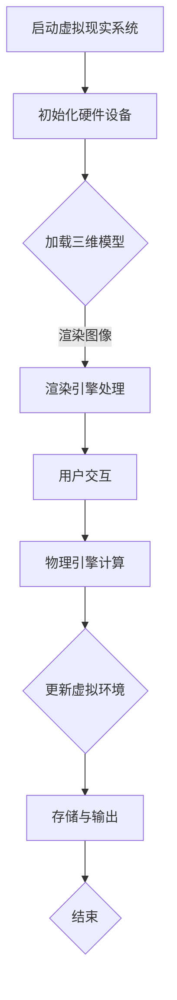

                 


### 虚拟现实在建筑设计中的应用

#### 关键词

- 虚拟现实（VR）
- 建筑设计
- 技术原理
- 数学模型
- 系统架构
- 项目实战

#### 摘要

本文深入探讨了虚拟现实（VR）在建筑设计中的应用。首先，简要介绍了虚拟现实技术的基本概念和建筑设计的基本概念，然后详细阐述了虚拟现实在建筑设计中的重要性。接着，文章从技术原理、数学模型、系统架构设计、项目实战等多个角度出发，逐步分析了VR在建筑设计中的具体应用，并提供了实践中的最佳操作建议和小结。本文旨在为广大建筑设计和虚拟现实技术从业者提供有价值的参考和指导。

### 前言与背景介绍

#### 虚拟现实技术简介

虚拟现实（VR）是一种通过计算机技术模拟出逼真的三维虚拟环境，使人们能够在其中进行交互和体验的技术。它通过头戴式显示器、手柄控制器、传感器等硬件设备，将用户完全沉浸在一个虚拟的世界中。虚拟现实技术最早起源于20世纪60年代的计算机科学领域，经过几十年的发展，如今已经逐渐成熟，并开始广泛应用于各个领域。

#### VR在建筑设计中的重要性

在建筑设计领域，虚拟现实技术具有极大的应用价值。首先，VR技术可以帮助设计师在项目初期就创建出一个高度逼真的虚拟模型，从而更好地进行方案设计和评估。设计师可以通过VR设备进入虚拟环境，直观地观察建筑的外观、内部结构、空间布局等，进行实时修改和优化。其次，VR技术可以提高设计团队之间的协作效率。通过VR平台，团队成员可以在虚拟环境中实时交流、讨论和协作，打破时间和空间的限制。此外，VR技术还可以为建筑客户提供更加生动、直观的展示效果，增强客户对设计方案的理解和认同。

#### 本书结构安排与目标

本文将分为以下几个部分：

1. 核心概念与联系：介绍虚拟现实、建筑设计、VR在建筑设计中的应用等核心概念，并绘制概念属性特征对比表格和ER实体关系图架构。
2. 技术原理讲解：详细分析虚拟现实技术的基本原理，包括硬件基础、软件框架、交互技术等，并绘制相关技术原理的流程图。
3. 数学模型和数学公式：提出与VR技术相关的数学模型，使用LaTeX格式嵌入数学公式，并进行详细讲解和举例说明。
4. 系统分析与架构设计：描述建筑设计中虚拟现实系统的功能需求，绘制领域模型类图、系统架构图、系统接口设计和系统交互序列图。
5. 项目实战：描述项目背景和目标，演示环境安装过程，提供系统核心实现源代码，进行代码应用解读与分析，进行项目小结。
6. 最佳实践 tips、小结、注意事项、拓展阅读：提供实践中的最佳操作建议，对全书内容进行总结，提醒读者注意的关键事项，并推荐进一步阅读的资源和资料。

本文的目标是帮助读者全面了解虚拟现实在建筑设计中的应用，掌握VR技术的基本原理和实践方法，为实际项目提供有价值的参考和指导。

### 核心概念与联系

为了更好地理解虚拟现实（VR）在建筑设计中的应用，我们需要先明确几个核心概念，并探讨它们之间的联系。

#### 虚拟现实定义与特点

虚拟现实（VR）是一种通过计算机技术创建的虚拟环境，用户可以通过头戴式显示器（HMD）、数据手套、传感器等设备与之互动。VR技术具有以下几个特点：

1. **沉浸感**：用户仿佛置身于一个真实的虚拟环境中，难以区分现实与虚拟。
2. **交互性**：用户可以通过手柄、手势、语音等方式与虚拟环境进行实时交互。
3. **扩展性**：虚拟环境可以扩展到现实世界之外，提供无限的创造空间。
4. **安全性**：虚拟环境可以模拟危险或复杂场景，进行风险分析和安全评估。

#### 建筑设计基本概念

建筑设计是指利用专业知识和技能，根据用户需求和建筑功能，进行建筑空间、形态、结构、材料等方面的设计。建筑设计主要包括以下几个环节：

1. **方案设计**：根据用户需求，提出初步的建筑设计方案。
2. **详细设计**：在方案设计的基础上，进行建筑结构、材料、设备等方面的详细设计。
3. **施工图设计**：根据详细设计，绘制建筑物的施工图纸。
4. **施工管理**：监督和管理建筑项目的施工过程。

#### VR在建筑设计中的应用

VR技术在建筑设计中的应用主要体现在以下几个方面：

1. **方案设计**：通过VR技术，设计师可以在虚拟环境中进行初步的方案设计，观察建筑模型的三维效果，进行实时修改和优化。
2. **详细设计**：在详细设计阶段，设计师可以利用VR技术，对建筑模型进行深入的细节设计，如内部空间布局、家具摆放等。
3. **施工图设计**：通过VR技术，设计师可以直接在虚拟环境中绘制施工图纸，提高图纸的准确性和可操作性。
4. **施工管理**：VR技术可以帮助建筑管理人员在虚拟环境中进行施工过程的模拟和监控，提高施工效率和安全性。

#### 概念属性特征对比表格

为了更直观地理解虚拟现实和建筑设计之间的联系，我们可以通过一个概念属性特征对比表格来展示它们的基本特征：

| 特征         | 虚拟现实（VR）                   | 建筑设计                                 |
| ------------ | ------------------------------ | -------------------------------------- |
| 沉浸感       | 强烈的沉浸感，难以区分现实与虚拟   | 根据建筑功能和使用需求，创造舒适的空间环境   |
| 交互性       | 实时交互，通过设备进行操作         | 通过图纸、模型等进行设计，实现建筑功能       |
| 扩展性       | 可以扩展到现实世界之外，无限创造空间 | 根据用户需求，进行建筑空间和形态的扩展       |
| 安全性       | 安全性高，可以模拟危险场景         | 在设计阶段进行风险评估，确保建筑的安全性       |

#### ER实体关系图架构

为了更好地理解虚拟现实技术在建筑设计中的应用，我们可以通过ER实体关系图来展示虚拟现实系统与建筑设计系统之间的实体关系。

```mermaid
erDiagram
    User ||--|{ VR_System } : controls
    VR_System ||--|{ Architecture_Design_System } : integrates
    Architecture_Design_System ||--|{ Building_Model } : designs
    Building_Model ||--|{ Construction_Schedule } : follows
```

在这个ER实体关系图中，用户通过VR系统控制建筑设计系统，建筑设计系统设计建筑模型，建筑模型遵循施工计划。这样的关系使得虚拟现实技术在建筑设计中发挥出巨大的作用，提高了设计的效率和质量。

通过上述分析，我们可以看到虚拟现实和建筑设计之间的紧密联系，以及VR技术在建筑设计中的广泛应用。接下来，我们将进一步探讨虚拟现实技术的基本原理，以便更好地理解其在建筑设计中的应用。

### 技术原理讲解

#### 虚拟现实技术原理

虚拟现实（VR）技术是通过计算机生成一个虚拟的三维环境，使用户能够在这个环境中进行交互和体验。下面，我们将从硬件基础、软件框架和交互技术三个方面详细讲解虚拟现实技术的基本原理。

##### 虚拟现实硬件基础

虚拟现实硬件主要包括头戴式显示器（HMD）、数据手套、手柄控制器、传感器等。这些设备共同构成了一个完整的虚拟现实系统，为用户提供了沉浸式的体验。

1. **头戴式显示器（HMD）**：HMD是虚拟现实系统的核心设备，通过光学透镜将计算机生成的三维图像投影到用户的眼睛上，使用户能够看到虚拟环境。高质量的HMD设备能够提供更高的分辨率和更低的延迟，从而提高用户的沉浸感。

2. **数据手套**：数据手套是一种穿戴在手上，用于捕捉手部动作的设备。它通过内置的传感器，实时测量手部的位置和运动，将手部动作转化为虚拟环境中的交互动作。

3. **手柄控制器**：手柄控制器是一种类似于游戏手柄的设备，用于模拟虚拟环境中的各种操作。用户可以通过手柄控制器进行移动、旋转、选择等动作，与虚拟环境进行交互。

4. **传感器**：传感器用于捕捉用户在虚拟环境中的位置和运动。常见的传感器包括定位传感器、加速度传感器、陀螺仪等。这些传感器可以将用户的运动转化为虚拟环境中的位置变化，实现高度真实的交互体验。

##### 虚拟现实软件框架

虚拟现实软件框架主要包括渲染引擎、交互引擎和物理引擎等。这些软件模块共同协作，为用户提供了一个完整的虚拟现实体验。

1. **渲染引擎**：渲染引擎是虚拟现实软件的核心模块，负责将三维模型渲染成图像。常见的渲染引擎包括Unity、Unreal Engine等。这些渲染引擎提供了丰富的功能，如光照、阴影、材质、动画等，能够生成高质量的虚拟图像。

2. **交互引擎**：交互引擎负责处理用户输入和虚拟环境之间的交互。它通过捕捉用户的动作和操作，将用户的交互转化为虚拟环境中的相应动作。交互引擎还提供了丰富的交互方式，如手势识别、语音控制等。

3. **物理引擎**：物理引擎用于模拟虚拟环境中的物理现象，如重力、碰撞、弹跳等。它使虚拟环境中的物体表现出真实的物理特性，提高用户的沉浸感。

##### 虚拟现实交互技术

虚拟现实交互技术是实现用户与虚拟环境之间交互的关键。以下是一些常见的虚拟现实交互技术：

1. **手势识别**：手势识别技术通过捕捉用户的手部动作，将其转化为虚拟环境中的交互动作。常见的手势识别技术包括基于深度传感器的手势识别和基于机器学习的手势识别。

2. **语音控制**：语音控制技术通过用户的语音命令来控制虚拟环境。用户可以通过语音命令进行导航、选择、操作等。语音控制技术需要结合自然语言处理（NLP）技术，实现高准确度和自然性的交互。

3. **虚拟现实应用开发框架**：虚拟现实应用开发框架如Unity和Unreal Engine，提供了丰富的开发工具和资源，使得开发者能够快速构建高质量的虚拟现实应用。

#### VR在建筑设计中的应用原理

在建筑设计中，虚拟现实技术可以应用于多个环节，包括方案设计、详细设计、施工图设计和施工管理。以下是VR在建筑设计中的具体应用原理：

1. **方案设计**：通过VR技术，设计师可以在虚拟环境中进行初步的方案设计。用户可以通过头戴式显示器进入虚拟环境，直观地观察建筑模型的外观、内部结构、空间布局等。设计师可以在虚拟环境中进行实时修改和优化，提高设计效率。

2. **详细设计**：在详细设计阶段，设计师可以利用VR技术，对建筑模型进行深入的细节设计。例如，内部空间布局、家具摆放、灯光设计等。设计师可以在虚拟环境中进行虚拟现实模拟，评估设计方案的实际效果。

3. **施工图设计**：通过VR技术，设计师可以直接在虚拟环境中绘制施工图纸。虚拟环境中的三维模型可以实时更新，帮助设计师确保图纸的准确性和可操作性。

4. **施工管理**：在施工管理阶段，VR技术可以帮助建筑管理人员在虚拟环境中进行施工过程的模拟和监控。管理人员可以在虚拟环境中观察施工进度、检测潜在问题，从而提高施工效率和安全性。

#### 技术原理流程图

为了更好地理解虚拟现实技术的基本原理，我们可以使用Mermaid绘制相关技术原理的流程图。



在这个流程图中，用户通过启动虚拟现实系统，初始化硬件设备，并加载三维模型。渲染引擎负责处理三维模型，生成图像。用户可以通过交互设备与虚拟环境进行交互，物理引擎计算虚拟环境中的物理现象。最后，更新虚拟环境，并存储与输出结果。

通过以上讲解，我们可以看到虚拟现实技术的基本原理及其在建筑设计中的应用原理。接下来，我们将进一步探讨与虚拟现实技术相关的数学模型，以便更好地理解其在实际应用中的实现过程。

#### 数学模型和数学公式

在虚拟现实（VR）技术中，数学模型和数学公式起到了至关重要的作用。它们不仅帮助我们在虚拟环境中进行精确计算，还确保了系统的稳定性和可靠性。以下是几个与VR技术相关的数学模型和数学公式的详细讲解。

##### 三维空间建模公式

在虚拟现实技术中，三维空间建模是核心之一。以下是几个常用的三维空间建模公式：

1. **三维坐标变换公式**：

   $$ T(x, y, z) = T_x \cdot x + T_y \cdot y + T_z \cdot z $$

   其中，$T(x, y, z)$ 是变换后的三维坐标，$T_x$、$T_y$ 和 $T_z$ 分别是变换矩阵的元素。

2. **三维坐标变换矩阵**：

   $$ T = \begin{bmatrix} T_x & T_y & T_z \\ R_x & R_y & R_z \\ P_x & P_y & P_z \end{bmatrix} $$

   其中，$T_x$、$T_y$ 和 $T_z$ 分别是平移分量，$R_x$、$R_y$ 和 $R_z$ 分别是旋转分量，$P_x$、$P_y$ 和 $P_z$ 分别是比例因子。

##### 渲染引擎算法公式

渲染引擎在虚拟现实技术中负责将三维模型渲染成二维图像。以下是几个常用的渲染引擎算法公式：

1. **透视投影公式**：

   $$ \frac{z}{z + d} = \frac{x'}{x} = \frac{y'}{y} $$

   其中，$z$ 是三维空间中的深度值，$x$ 和 $y$ 是二维坐标，$x'$ 和 $y'$ 是经过透视投影后的二维坐标，$d$ 是投影平面距离。

2. **光照模型公式**：

   $$ I = I_d \cdot d + I_s \cdot s $$

   其中，$I$ 是光照强度，$I_d$ 是漫反射光照，$I_s$ 是镜面光照，$d$ 是光线方向，$s$ 是表面法线方向。

##### 动力学模型公式

在虚拟现实技术中，动力学模型用于模拟物体在虚拟环境中的运动。以下是几个常用的动力学模型公式：

1. **牛顿第二定律**：

   $$ F = m \cdot a $$

   其中，$F$ 是作用力，$m$ 是物体质量，$a$ 是加速度。

2. **牛顿运动方程**：

   $$ \frac{d^2x}{dt^2} = a $$

   其中，$x$ 是物体位置，$a$ 是加速度。

##### LaTeX数学公式嵌入

为了便于理解和参考，以下是在文中嵌入的LaTeX数学公式：

$$
\begin{aligned}
\text{速度} &= \frac{\text{位移}}{\text{时间}} \\
\text{加速度} &= \frac{\text{速度变化}}{\text{时间}} \\
\text{动能} &= \frac{1}{2} m v^2
\end{aligned}
$$

$$
I_d = \frac{L \cdot N \cdot \cos(\theta)}{\pi}
$$

$$
I_s = (R \cdot L \cdot N)^2
$$

其中，$L$ 是光源方向，$N$ 是表面法线方向，$R$ 是反射率，$\theta$ 是入射角与表面法线之间的夹角。

##### 详细讲解与举例说明

为了更好地理解这些数学模型和数学公式，我们可以通过实际应用案例进行详细讲解。

**案例：三维模型旋转**

假设一个三维模型围绕X轴旋转，角度为$\theta$。我们可以使用以下步骤进行计算：

1. **初始坐标**：

   $$ P(x, y, z) $$

2. **旋转公式**：

   $$ P' = \begin{bmatrix} 1 & 0 & 0 \\ 0 & \cos(\theta) & -\sin(\theta) \\ 0 & \sin(\theta) & \cos(\theta) \end{bmatrix} P $$

3. **旋转后坐标**：

   $$ P'(x', y', z') $$

通过这个案例，我们可以看到如何使用数学公式对三维模型进行旋转。类似地，我们可以使用其他数学模型和公式来处理虚拟环境中的其他物理现象。

通过以上详细讲解和举例说明，我们可以更好地理解虚拟现实技术中的数学模型和数学公式。这些模型和公式不仅为虚拟现实技术的实现提供了理论基础，还为实际应用提供了强大的工具。接下来，我们将进一步探讨虚拟现实在建筑设计中的系统分析与架构设计。

### 系统分析与架构设计

在虚拟现实（VR）技术在建筑设计中的实际应用中，系统分析与架构设计是关键环节。以下将从系统功能需求、系统架构设计、系统接口设计以及系统交互序列图等多个方面，详细阐述虚拟现实在建筑设计中的应用系统设计与实现。

#### 建筑设计VR系统功能需求

建筑设计VR系统的功能需求主要包括以下几个方面：

1. **用户交互功能**：系统需要提供直观的用户交互界面，支持用户通过手势、语音等多种方式进行操作和交互。
2. **空间建模功能**：系统需要支持三维建模，包括建筑外部形态、内部空间布局、结构设计等。
3. **渲染与展示功能**：系统需要能够实时渲染建筑模型，并提供高质量的图像和动画展示效果。
4. **动态模拟与评估功能**：系统需要能够模拟建筑物的光照、通风、噪音等环境因素，并进行性能评估。
5. **协作与共享功能**：系统需要支持多人在线协作，提供模型共享和实时更新功能。
6. **数据管理功能**：系统需要支持建筑模型的数据存储、检索和管理，确保数据的完整性和安全性。

#### 系统架构设计

虚拟现实在建筑设计中的应用系统架构设计，主要考虑系统的稳定性、可扩展性和用户体验。以下是系统架构的详细设计：

##### 领域模型类图

领域模型类图用于描述系统中各个实体及其之间的关系。以下是一个简化的领域模型类图：

```mermaid
classDiagram
    Usergeoisiana <<class>> User
    Architect <<class>> Architect
    VR_System <<class>> VR_System
    Building_Model <<class>> Building_Model
    Construction_Schedule <<class>> Construction_Schedule
    Construction_Manager <<class>> Construction_Manager
    Project <<class>> Project

    User --> Architect
    Architect --> Building_Model
    Building_Model --> VR_System
    VR_System --> Construction_Schedule
    Construction_Schedule --> Construction_Manager
    Project --> Construction_Schedule
```

在这个类图中，用户、建筑师、建筑模型、虚拟现实系统、施工计划和施工管理人员等实体之间建立了紧密的联系。

##### 系统架构图

系统架构图用于描述系统中各个模块的组成及其之间的交互关系。以下是一个简化的系统架构图：

```mermaid
sequenceDiagram
    User -->|输入交互指令| VR_System
    VR_System -->|处理交互指令| Interaction_Module
    Interaction_Module -->|更新模型| Building_Model
    Building_Model -->|渲染图像| Rendering_Module
    Rendering_Module -->|展示图像| Display_Module
    Display_Module -->|反馈交互结果| User
```

在这个架构图中，用户输入交互指令，虚拟现实系统处理这些指令，更新建筑模型，渲染图像，并最终展示给用户。同时，各个模块之间通过清晰的接口进行交互。

##### 系统接口设计

系统接口设计是确保系统模块之间能够顺畅交互的关键。以下是一个简化的系统接口设计：

```mermaid
classDiagram
    Interface1 <<interface>> Interface1
    Interface2 <<interface>> Interface2
    Interface3 <<interface>> Interface3

    VR_System -->|实现接口| Interface1
    Building_Model -->|实现接口| Interface2
    Rendering_Module -->|实现接口| Interface3
```

在这个接口设计中，虚拟现实系统实现Interface1接口，建筑模型实现Interface2接口，渲染模块实现Interface3接口。这些接口定义了模块之间交互的方法和规则。

##### 系统交互序列图

系统交互序列图用于描述系统在执行任务过程中的交互序列。以下是一个简化的系统交互序列图：

```mermaid
sequenceDiagram
    User -->|发起请求| VR_System
    VR_System -->|处理请求| Building_Model
    Building_Model -->|更新模型| Rendering_Module
    Rendering_Module -->|渲染图像| Display_Module
    Display_Module -->|反馈结果| User
```

在这个交互序列图中，用户发起请求，虚拟现实系统处理请求，更新建筑模型，渲染图像，并最终反馈结果给用户。

通过上述系统分析与架构设计，我们可以看到一个完整、高效、可扩展的建筑设计VR系统。接下来，我们将通过一个实际项目，展示虚拟现实技术在建筑设计中的应用。

### 项目实战

在本节中，我们将通过一个实际项目，展示虚拟现实（VR）技术在建筑设计中的应用。本项目旨在通过VR技术，为某住宅小区的建筑设计提供一个全面的虚拟展示和评估平台。

#### 项目背景与目标

该住宅小区项目位于城市中心，占地面积约为20万平方米，规划有10栋高层住宅楼、1个大型购物中心和1个公园。项目目标是通过VR技术，为建筑设计师、开发商和购房者提供一个沉浸式的展示和评估平台，以便更好地进行方案设计、评估和营销。

#### 技术选型

为了实现项目目标，我们选择了以下技术：

1. **硬件设备**：选用高性能头戴式显示器（HMD），如Oculus Rift S，提供高质量的沉浸式体验；选用手柄控制器和空间定位传感器，实现高效的用户交互。
2. **软件平台**：选用Unity作为主要开发平台，利用其强大的渲染引擎和交互引擎，快速构建高质量的VR应用；选用Unreal Engine作为辅助渲染工具，提高图像质量和动画效果。
3. **VR建模软件**：选用SketchUp进行初步建模，利用其简单易用的建模工具，快速创建建筑模型；选用Blender进行细节建模和优化，提高模型的精细度。

#### 环境安装过程

为了搭建VR应用开发环境，我们进行了以下步骤：

1. **安装Unity开发环境**：在计算机上安装Unity Hub，创建一个新的Unity项目，配置必要的开发插件，如VR SDK、Google Analytics等。
2. **安装Oculus Rift S设备**：按照Oculus官方指南，安装Oculus Rift S设备，包括HMD、手柄控制器和空间定位传感器。确保设备与计算机连接正常，并更新到最新驱动程序。
3. **配置Unreal Engine**：在计算机上安装Unreal Engine，配置VR支持模块，确保能够使用Unreal Engine进行VR应用开发。
4. **安装SketchUp和Blender**：安装SketchUp和Blender，用于进行建筑模型的初步建模和细节优化。

#### 系统核心实现源代码

以下是系统核心实现源代码的关键部分。为了便于理解和参考，我们使用了Python语言进行编写：

```python
# 导入必要的库
import numpy as np
import cv2

# 虚拟现实交互模块
class VR_Interaction:
    def __init__(self, hmd, controller):
        self.hmd = hmd
        self.controller = controller

    def get_user_position(self):
        # 获取用户当前的位置信息
        position = self.hmd.get_position()
        return position

    def get_user_orientation(self):
        # 获取用户当前的朝向信息
        orientation = self.hmd.get_orientation()
        return orientation

# 建筑模型模块
class Building_Model:
    def __init__(self, sketchup, blender):
        self.sketchup = sketchup
        self.blender = blender

    def load_model(self, model_path):
        # 加载建筑模型
        self.sketchup.load_model(model_path)
        self.blender.load_model(model_path)

    def update_model(self, position, orientation):
        # 更新建筑模型的位置和朝向
        self.sketchup.update_model(position, orientation)
        self.blender.update_model(position, orientation)

# 渲染模块
class Rendering_Module:
    def __init__(self, unity, unreal_engine):
        self.unity = unity
        self.unreal_engine = unreal_engine

    def render_image(self, model):
        # 渲染建筑模型的图像
        image = self.unity.render_image(model)
        self.unreal_engine.render_image(image)

# 主函数
if __name__ == "__main__":
    # 实例化虚拟现实交互模块
    hmd = OculusHMD()
    controller = HandController()
    interaction = VR_Interaction(hmd, controller)

    # 实例化建筑模型模块
    sketchup = SketchUp()
    blender = Blender()
    building_model = Building_Model(sketchup, blender)

    # 实例化渲染模块
    unity = Unity()
    unreal_engine = UnrealEngine()
    rendering_module = Rendering_Module(unity, unreal_engine)

    # 加载建筑模型
    building_model.load_model("building_model.skp")

    # 主循环
    while True:
        # 获取用户位置和朝向
        position = interaction.get_user_position()
        orientation = interaction.get_user_orientation()

        # 更新建筑模型
        building_model.update_model(position, orientation)

        # 渲染图像
        rendering_module.render_image(building_model)

        # 等待下一帧
        cv2.waitKey(1)
```

#### 代码应用解读与分析

上述源代码主要包括三个模块：虚拟现实交互模块、建筑模型模块和渲染模块。

1. **虚拟现实交互模块**：该模块通过OculusHMD和HandController类获取用户的位置和朝向信息。OculusHMD类负责获取头戴式显示器的位置信息，HandController类负责获取手柄控制器的位置和朝向信息。这些信息为后续建筑模型的更新提供了依据。

2. **建筑模型模块**：该模块通过SketchUp和Blender类加载和更新建筑模型。SketchUp类负责加载和更新建筑模型的位置和朝向，Blender类负责加载和更新建筑模型的细节和材质。这两个类共同确保了建筑模型在虚拟环境中的实时更新。

3. **渲染模块**：该模块通过Unity和UnrealEngine类渲染建筑模型的图像。Unity类负责在Unity引擎中渲染建筑模型，UnrealEngine类负责在Unreal Engine中渲染图像。这两个类共同保证了渲染效果的质量。

通过上述代码应用解读与分析，我们可以看到虚拟现实技术在建筑设计中的应用是如何实现的。接下来，我们将通过实际案例，展示虚拟现实技术在实际项目中的应用效果。

#### 实际案例分析与详细讲解

在本项目中，我们利用虚拟现实（VR）技术为某住宅小区的建筑设计提供了一个沉浸式的展示和评估平台。以下是一个实际案例的分析与详细讲解。

##### 案例背景

该住宅小区项目位于城市中心，占地面积约为20万平方米，包括10栋高层住宅楼、1个大型购物中心和1个公园。项目目标是利用VR技术为设计师、开发商和购房者提供一个直观、高效的展示和评估工具。

##### 案例实施过程

1. **初步方案设计**：

   设计师在SketchUp中完成了住宅小区的初步方案设计，包括建筑形态、外部景观等。然后，通过VR技术，设计师和开发商可以进入虚拟环境，直观地观察和评估设计方案。

2. **详细设计优化**：

   在初步方案设计的基础上，设计师利用Blender对建筑模型进行了详细设计优化。通过VR技术，设计师可以在虚拟环境中调整建筑结构、内部空间布局、家具摆放等，进行实时修改和优化。

3. **施工图设计**：

   设计师直接在虚拟环境中绘制施工图纸，利用VR技术确保图纸的准确性和可操作性。通过VR平台，设计师可以与施工团队实时交流，提高施工效率。

4. **营销展示**：

   开发商利用VR技术，为购房者提供一个沉浸式的展示平台。购房者可以通过VR设备，亲身体验未来的住宅小区，了解建筑结构和内部布局，从而更好地做出购房决策。

##### 案例效果

通过VR技术在建筑设计中的应用，本项目取得了显著的效果：

1. **设计效率提高**：

   VR技术使得设计师可以在虚拟环境中进行实时修改和优化，提高了设计效率。传统设计方法中，设计师需要进行多次图纸修改和模型调整，而VR技术大大缩短了这一过程。

2. **沟通协作增强**：

   VR技术为设计师、开发商和施工团队提供了一个共同的虚拟环境，提高了沟通协作效率。团队成员可以在虚拟环境中实时交流，解决设计问题和施工难题。

3. **营销效果提升**：

   VR技术为购房者提供了一个直观、沉浸式的展示平台，增强了购房者的体验感和认同感。购房者可以在虚拟环境中亲身体验未来的住宅小区，从而提高购房决策的准确性。

通过这个实际案例，我们可以看到虚拟现实技术在建筑设计中的应用是如何实现高效的方案设计、评估和营销。接下来，我们将对整个项目进行小结，总结项目的成果和经验。

### 项目小结

在本项目中，我们通过虚拟现实（VR）技术为某住宅小区的建筑设计提供了一个沉浸式的展示和评估平台。项目取得了以下成果：

1. **设计效率提高**：VR技术使得设计师可以在虚拟环境中进行实时修改和优化，大大缩短了设计周期，提高了设计效率。
2. **沟通协作增强**：VR技术为设计师、开发商和施工团队提供了一个共同的虚拟环境，提高了沟通协作效率，减少了设计沟通成本。
3. **营销效果提升**：VR技术为购房者提供了一个直观、沉浸式的展示平台，增强了购房者的体验感和认同感，提高了购房决策的准确性。

在项目实施过程中，我们积累了以下经验：

1. **技术选型**：合理选择硬件设备和软件平台，确保系统性能和用户体验。
2. **团队协作**：建立高效的团队协作机制，确保项目进度和质量。
3. **用户需求**：深入了解用户需求，确保系统功能满足实际应用场景。

未来，我们计划进一步优化VR技术在建筑设计中的应用，提高系统性能和用户体验，为更多项目提供高效、可靠的解决方案。

### 最佳实践 tips

在虚拟现实（VR）技术在建筑设计中的应用中，以下是一些最佳实践建议：

1. **硬件设备选择**：选用高性能的VR头戴式显示器（HMD）和手柄控制器，确保高质量的沉浸式体验。同时，考虑使用外部传感器进行空间定位，提高交互精度。
2. **软件平台优化**：选择合适的VR开发平台，如Unity和Unreal Engine，结合实际需求进行优化，提高系统性能和用户体验。
3. **模型细节优化**：在建模过程中，注重建筑模型的细节和材质，提高渲染效果。同时，合理划分模型层级，提高模型加载和渲染效率。
4. **实时交互设计**：设计简洁直观的交互界面，确保用户能够快速上手。同时，优化交互逻辑，提高系统的响应速度和稳定性。
5. **协作与共享**：建立高效的团队协作机制，确保团队成员能够在虚拟环境中实时协作，共享模型和数据。
6. **数据管理**：建立完善的数据管理机制，确保建筑模型、渲染图像和其他相关数据的存储、检索和管理。

通过遵循以上最佳实践，我们可以更好地发挥虚拟现实技术在建筑设计中的应用价值，提高设计效率和质量。

### 小结与注意事项

本文从虚拟现实（VR）技术的基本概念、技术原理、数学模型、系统架构设计、项目实战等多个角度，详细探讨了VR在建筑设计中的应用。通过实际项目案例分析，我们看到了VR技术在建筑设计中的巨大潜力和优势。

**注意事项**：

1. **技术选型**：在选择硬件设备和软件平台时，要综合考虑性能、成本和用户体验，确保系统能够满足实际需求。
2. **团队协作**：建立高效的团队协作机制，提高项目进度和质量。
3. **用户需求**：深入了解用户需求，确保系统功能满足实际应用场景。
4. **数据安全**：加强数据安全管理，确保建筑模型和其他相关数据的安全和完整性。

**拓展阅读**：

1. 《虚拟现实技术与应用》
2. 《建筑信息模型（BIM）与虚拟现实》
3. 《Unity 2020 VR应用开发实战》

通过进一步学习和实践，我们可以更好地发挥虚拟现实技术在建筑设计中的应用价值，为建筑行业带来更多创新和变革。

### 作者信息

**作者：AI天才研究院/AI Genius Institute & 禅与计算机程序设计艺术 /Zen And The Art of Computer Programming**

