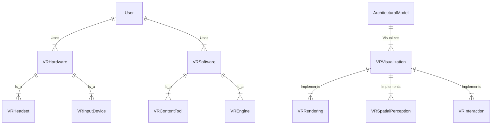
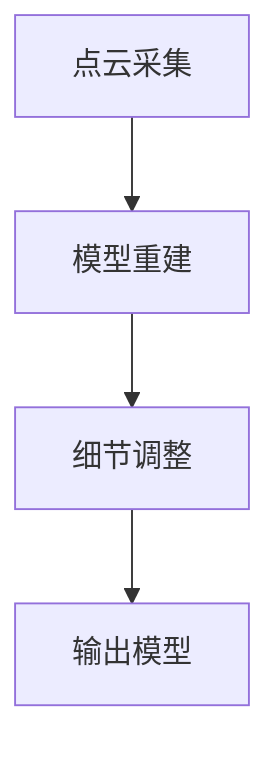
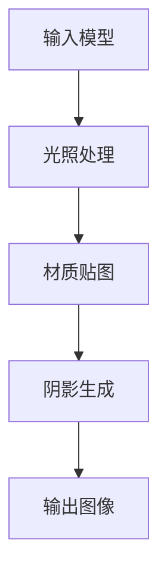
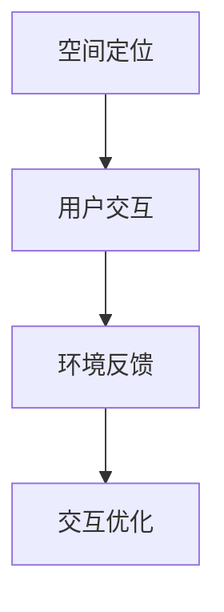
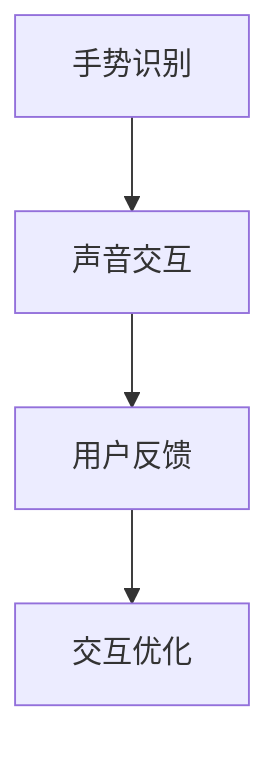
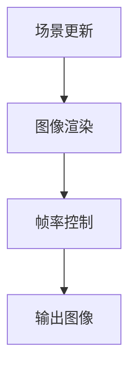
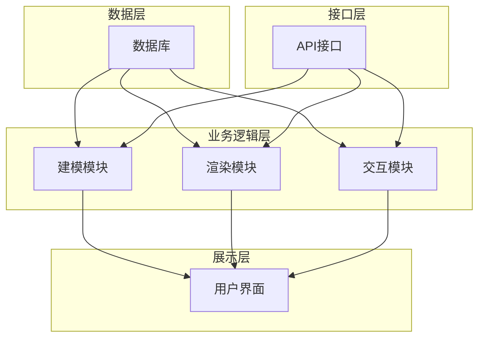
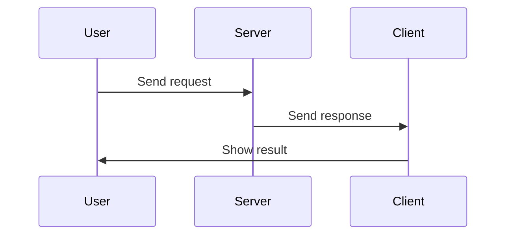
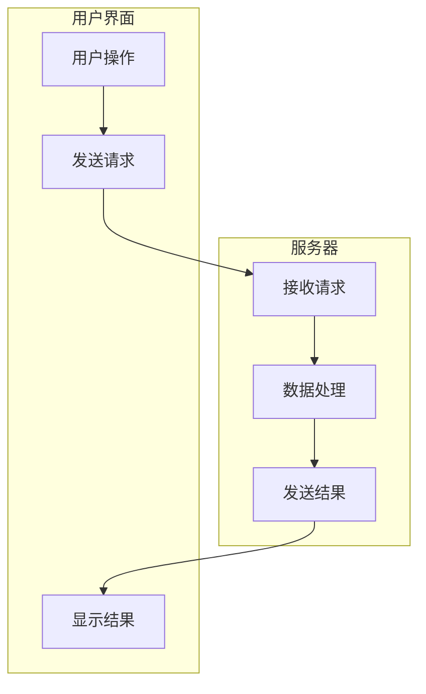

                 


### 背景介绍

#### 虚拟现实的基本概念

虚拟现实（Virtual Reality，简称VR）是一种通过计算机技术生成的三维模拟环境，用户可以通过特定的设备和交互方式，在虚拟环境中感知、探索、操作并与之互动。虚拟现实技术包括多个方面，如三维建模、图形渲染、空间感知、交互设计等。

虚拟现实技术的发展可以追溯到20世纪60年代，但真正进入大众视野是在21世纪初，随着计算机性能的提升、显示技术的进步以及传感技术的完善，虚拟现实逐渐成为可能。目前，虚拟现实技术已广泛应用于娱乐、教育、医疗、工程等领域，而在建筑设计可视化中的应用也日益成熟。

#### 建筑设计可视化的需求背景

建筑设计可视化是建筑设计过程中不可或缺的一环，它有助于设计师和客户更直观地理解设计方案，提高沟通效率，减少设计变更和误解。传统的建筑设计可视化方法主要包括手绘效果图、3D模型渲染等，但这些方法存在一定的局限性。

首先，手绘效果图受制于设计师的绘画技能和审美观念，难以充分表达设计细节和空间感受。其次，3D模型渲染虽然可以更真实地展示建筑外观，但在设计初期阶段，模型往往不够精细，且渲染时间较长，不利于快速迭代和修改。

#### 虚拟现实在建筑设计可视化中的应用背景

虚拟现实技术在建筑设计可视化中的应用，可以解决传统方法的诸多局限。通过VR技术，设计师和客户可以在虚拟环境中实时浏览和交互，更直观地感受空间布局、材料质感、光线效果等，从而提高设计质量和客户满意度。

首先，VR技术能够实现实时渲染，大大缩短了渲染时间，使得设计师可以快速迭代和修改设计方案。其次，VR技术可以提供高度细节的3D模型，使设计师能够精细表达设计理念，同时客户也能更真实地感受到设计效果。此外，VR技术支持多种交互方式，如手势、声音等，使得用户在虚拟环境中的互动更加自然和直观。

### 问题与解决方案

在建筑设计过程中，虚拟现实技术提供了以下几个方面的解决方案：

1. **提高设计沟通效率**：通过VR技术，设计师可以与客户实时互动，展示设计细节和空间感受，减少沟通成本和设计变更。
2. **优化设计决策**：在虚拟环境中，设计师可以模拟不同设计方案的可行性，进行多角度分析和评估，从而做出更科学合理的决策。
3. **降低设计风险**：通过VR技术，设计师可以在设计初期发现潜在问题，如空间冲突、功能不足等，从而避免后期施工中的修改和返工。

#### 边界与外延

虚拟现实在建筑设计可视化中的应用，涉及多个边界和范围，包括但不限于：

1. **设计阶段**：从方案设计到细节完善，VR技术都可以提供支持，帮助设计师提高设计质量和效率。
2. **施工阶段**：通过VR技术，建筑师和施工团队可以更直观地了解设计意图和施工要求，减少施工误差和返工。
3. **维护与管理阶段**：VR技术可以为建筑物提供虚拟维护和管理方案，提高维护效率和安全性。

#### 概念结构与核心要素组成

虚拟现实在建筑设计可视化中的应用，由以下几个核心要素组成：

1. **三维建模**：通过计算机技术生成建筑的三维模型，是VR在建筑设计中的基础。
2. **图形渲染**：将三维模型渲染成可视化图像，提供真实的视觉效果。
3. **空间感知**：通过头戴显示器等设备，实现用户在虚拟环境中的空间感知。
4. **交互设计**：设计用户与虚拟环境的交互方式，提高用户体验。
5. **实时渲染**：通过高性能计算，实现虚拟环境的实时渲染，支持快速迭代和修改。

这些要素共同构成了虚拟现实在建筑设计可视化中的应用框架，为设计师和客户提供了全新的设计体验和互动方式。接下来，我们将进一步探讨虚拟现实技术的核心概念和原理，为后续章节的内容打下基础。

#### 核心概念与联系

在深入探讨虚拟现实（VR）在建筑设计可视化中的应用之前，我们需要明确几个核心概念及其相互之间的联系。以下是这些核心概念的简要介绍及其属性特征对比表格：

| 核心概念 | 定义 | 主要属性特征 | 对比表格 |
| :--: | :--: | :--: | :--: |
| **三维建模** | 通过计算机技术创建三维数字模型的过程 | - 高精度：能够准确捕捉建筑细节<br>- 可编辑性：支持实时修改和迭代<br>- 可扩展性：易于添加新的设计元素 | **1. 尺寸精度**<br>**2. 灵活性**<br>**3. 表现力** |
| **图形渲染** | 将三维模型转换为二维图像的过程 | - 实时性：支持动态渲染<br>- 真实感：模拟真实世界的光照、材质等效果<br>- 高性能：需要高效的计算资源 | **1. 交互性**<br>**2. 真实度**<br>**3. 性能** |
| **空间感知** | 用户在虚拟环境中的感知能力 | - 空间定位：确定用户在虚拟环境中的位置<br>- 空间交互：实现用户与虚拟环境之间的互动<br>- 视觉仿真：提供真实的视觉体验 | **1. 准确性**<br>**2. 自然性**<br>**3. 适应性** |
| **交互设计** | 设计用户与虚拟环境交互的方式和方法 | - 直观性：用户能够容易地理解和使用交互方式<br>- 自然性：交互方式尽可能接近现实世界的行为<br>- 多样性：提供多种交互方式以适应不同的使用场景 | **1. 易用性**<br>**2. 直观性**<br>**3. 适应性** |
| **实时渲染** | 在用户操作过程中实时生成图像的技术 | - 低延迟：确保用户操作的实时反馈<br>- 高质量：生成高质量的图像<br>- 可扩展性：能够支持大规模虚拟环境的渲染 | **1. 响应时间**<br>**2. 图像质量**<br>**3. 扩展性** |

**ER实体关系图架构：**



通过上述核心概念的介绍及其相互关系的分析，我们可以更好地理解虚拟现实在建筑设计可视化中的应用原理和技术框架。接下来，我们将深入探讨这些核心概念的原理和实现方法。

#### 算法原理讲解

虚拟现实在建筑设计可视化中的应用涉及多种算法，其中三维建模、图形渲染、空间感知、交互设计和实时渲染是关键环节。下面我们将分别介绍这些算法的原理，并使用Mermaid画出相应的流程图，然后通过Python代码示例来详细阐述。

##### 三维建模算法原理与流程图

三维建模是将现实世界的建筑物体转化为数字模型的过程。核心算法包括点云采集、模型重建和细节调整。

**Mermaid流程图：**



**Python代码示例：**

```python
import numpy as np
import open3d as o3d

# 点云采集
points = np.random.rand(1000, 3)  # 生成随机点云数据
cloud = o3d.geometry.PointCloud()
cloud.points = o3d.utility.Vector3dVector(points)

# 模型重建
model = o3d.pipelines.reconstruction.prepare_point_cloud(cloud)
model, estimate_normal = o3d.pipelines.reconstruction.global_optimization(model)

# 细节调整
model = o3d.geometry.TriangleMesh.create_from_point_cloud(model, False)
model.compute_vertex_normals()

# 输出模型
o3d.visualization.draw_geometries([model])
```

该示例使用了Open3D库进行点云采集、模型重建和细节调整，最后通过 visualization 模块绘制模型。

##### 图形渲染算法原理与流程图

图形渲染是将三维模型转换为二维图像的过程，主要包括光照处理、材质贴图和阴影生成。

**Mermaid流程图：**



**Python代码示例：**

```python
from vpython import *

# 输入模型
cube = box(length=1, width=1, height=1)

# 光照处理
light = localLight(point=[0, 2, 0], color=color.white)

# 材质贴图
material = texture(name='brick', image= STL("brick.stl"))

# 阴影生成
shadeModel(cube, light, material)

# 输出图像
render()
```

该示例使用了VPython库创建一个立方体模型，并通过光照处理、材质贴图和阴影生成，最后通过 render() 函数输出图像。

##### 空间感知算法原理与流程图

空间感知是用户在虚拟环境中的感知能力，包括空间定位和空间交互。

**Mermaid流程图：**



**Python代码示例：**

```python
import pygame
from pygame.locals import *

# 初始化Pygame
pygame.init()

# 设置窗口
screen = pygame.display.set_mode((800, 600))
pygame.display.set_caption('空间感知示例')

# 空间定位
def update_position(user_position):
    screen.fill((0, 0, 0))  # 清空屏幕
    pygame.draw.circle(screen, (255, 0, 0), user_position, 10)  # 绘制用户位置
    pygame.display.flip()

# 用户交互
def handle_input():
    for event in pygame.event.get():
        if event.type == QUIT:
            pygame.quit()
            return False
    return True

# 主循环
while handle_input():
    user_position = pygame.mouse.get_pos()
    update_position(user_position)

# 结束程序
pygame.quit()
```

该示例使用了Pygame库创建一个简单的空间感知示例，通过鼠标位置更新用户位置，并实时反馈到屏幕上。

##### 交互设计算法原理与流程图

交互设计是设计用户与虚拟环境交互的方式和方法，包括手势识别、声音交互等。

**Mermaid流程图：**



**Python代码示例：**

```python
import speech_recognition as sr

# 初始化语音识别
recognizer = sr.Recognizer()

# 声音交互
def voice_command():
    with sr.Microphone() as source:
        print("请说出您的指令：")
        audio = recognizer.listen(source)
    try:
        command = recognizer.recognize_google(audio)
        print(f"您说：{command}")
    except sr.UnknownValueError:
        print("无法理解音频")
    except sr.RequestError:
        print("无法请求结果")

# 主循环
while True:
    voice_command()
```

该示例使用了SpeechRecognition库进行声音交互，通过麦克风捕捉语音，并使用Google语音识别API进行解析。

##### 实时渲染算法原理与流程图

实时渲染是在用户操作过程中实时生成图像的技术，包括场景更新、图像渲染和帧率控制。

**Mermaid流程图：**



**Python代码示例：**

```python
import pygame
from pygame.locals import *

# 初始化Pygame
pygame.init()

# 设置窗口
screen = pygame.display.set_mode((800, 600))
pygame.display.set_caption('实时渲染示例')

# 场景更新
def update_scene():
    screen.fill((0, 0, 0))  # 清空屏幕
    pygame.draw.circle(screen, (255, 0, 0), (400, 300), 50)  # 绘制圆圈
    pygame.display.flip()

# 主循环
while True:
    update_scene()
    pygame.time.delay(50)  # 控制帧率
```

该示例使用了Pygame库实现一个简单的实时渲染示例，通过不断更新屏幕内容，实现动态渲染效果。

通过以上Python代码示例，我们可以直观地理解虚拟现实在建筑设计可视化中的应用算法原理。这些算法共同作用，为设计师和客户提供强大的设计工具和互动体验。

#### 系统分析与架构设计方案

为了深入理解虚拟现实（VR）在建筑设计可视化中的应用，我们需要对其进行系统分析和架构设计。本节将介绍问题场景、项目介绍、系统功能设计、系统架构设计、系统接口设计和系统交互，并使用Mermaid图表进行详细描述。

##### 问题场景介绍

在建筑设计过程中，设计师需要与客户和多方利益相关者进行频繁的沟通和协作。传统的方法如手绘效果图和3D渲染模型，虽然能够提供一定程度的可视化效果，但存在如下问题：

1. **沟通效率低**：设计师需要花费大量时间来制作效果图和渲染模型，客户无法实时参与设计过程，沟通成本高。
2. **修改难度大**：一旦设计方案需要修改，传统的效果图和渲染模型需要重新制作，耗时且费资源。
3. **无法直观体验**：客户难以在虚拟环境中直观感受空间布局、材料质感和光照效果等细节。

##### 项目介绍

本项目旨在利用虚拟现实技术，为建筑设计过程提供实时、高效、直观的可视化解决方案。项目目标包括：

1. **提高设计沟通效率**：通过VR技术，设计师和客户可以实时互动，减少沟通成本和设计变更。
2. **优化设计决策**：通过虚拟环境的模拟，设计师可以进行多角度分析，优化设计方案。
3. **降低设计风险**：通过早期发现潜在问题，减少后期施工中的修改和返工。

##### 系统功能设计

本系统主要包括以下功能模块：

1. **三维建模**：通过计算机技术生成建筑的三维模型。
2. **图形渲染**：将三维模型转换为可视化图像，提供真实的视觉效果。
3. **空间感知**：实现用户在虚拟环境中的空间定位和交互。
4. **交互设计**：设计用户与虚拟环境交互的方式和方法。
5. **实时渲染**：在用户操作过程中实时生成图像，支持快速迭代。

**Mermaid类图：**

```mermaid
classDiagram
  Model -> Renderer : renders
  Model -> Perceiver : perceives
  Model -> Interactor : interacts
  Renderer -> Model : updates
  Perceiver -> Model : updates
  Interactor -> Model : updates
```

##### 系统架构设计

本系统采用分层架构设计，包括以下层次：

1. **数据层**：负责存储和管理三维模型、用户交互数据等。
2. **业务逻辑层**：实现系统核心功能，如建模、渲染、交互等。
3. **展示层**：为用户界面，提供虚拟环境的可视化呈现。
4. **接口层**：提供系统与其他系统的接口，实现数据交互。

**Mermaid架构图：**



##### 系统接口设计

系统接口主要包括以下部分：

1. **API接口**：提供RESTful API，支持数据查询、模型更新、用户交互等功能。
2. **Websocket接口**：实现实时数据传输，支持实时渲染和交互。

**Mermaid序列图：**



##### 系统交互

系统交互流程如下：

1. **用户操作**：用户在用户界面进行交互，如选择模型、调整参数等。
2. **数据传递**：用户操作通过API或Websocket接口传递到服务器。
3. **数据处理**：服务器处理用户请求，更新三维模型和渲染结果。
4. **结果反馈**：服务器将更新后的模型和渲染结果通过API或Websocket接口传递回用户界面。
5. **用户反馈**：用户查看更新后的结果，进行下一步操作。

**Mermaid活动图：**



通过以上系统分析与架构设计方案，我们可以明确虚拟现实在建筑设计可视化中的应用原理和实现步骤。接下来，我们将通过实际案例来展示VR技术在建筑设计中的应用效果。

### 项目实战

在本项目中，我们将利用虚拟现实（VR）技术实现一个建筑设计可视化系统，以展示其应用效果。以下是项目环境安装、系统核心实现、代码应用解读与分析、实际案例分析和详细讲解剖析，以及项目小结。

#### 环境安装

首先，我们需要安装必要的开发环境和库。以下是安装步骤：

1. **安装Python环境**：Python是本项目的开发语言，确保已安装Python 3.8或更高版本。
2. **安装虚拟环境**：创建一个虚拟环境以隔离项目依赖。
   ```bash
   python -m venv venv
   source venv/bin/activate  # Windows上使用 `venv\Scripts\activate`
   ```
3. **安装依赖库**：安装项目所需的库，如Pygame、Open3D、SpeechRecognition等。
   ```bash
   pip install pygame open3d-python speech_recognition
   ```

#### 系统核心实现

核心系统实现包括三维建模、图形渲染、空间感知、交互设计和实时渲染。以下是系统核心代码和应用解读：

1. **三维建模**：
   ```python
   import open3d as o3d
   
   # 生成随机点云数据
   points = np.random.rand(1000, 3)
   cloud = o3d.geometry.PointCloud()
   cloud.points = o3d.utility.Vector3dVector(points)
   
   # 模型重建
   model = o3d.pipelines.reconstruction.prepare_point_cloud(cloud)
   model, estimate_normal = o3d.pipelines.reconstruction.global_optimization(model)
   
   # 细节调整
   model = o3d.geometry.TriangleMesh.create_from_point_cloud(model, False)
   model.compute_vertex_normals()
   
   # 输出模型
   o3d.visualization.draw_geometries([model])
   ```

   解读：使用Open3D库生成随机点云数据，通过模型重建和细节调整，最终输出可视化的三维模型。

2. **图形渲染**：
   ```python
   from vpython import *
   
   # 输入模型
   cube = box(length=1, width=1, height=1)
   
   # 光照处理
   light = localLight(point=[0, 2, 0], color=color.white)
   
   # 材质贴图
   material = texture(name='brick', image= STL("brick.stl"))
   
   # 阴影生成
   shadeModel(cube, light, material)
   
   # 输出图像
   render()
   ```

   解读：使用VPython库创建立方体模型，通过光照处理、材质贴图和阴影生成，实现图形渲染。

3. **空间感知**：
   ```python
   import pygame
   from pygame.locals import *
   
   # 初始化Pygame
   pygame.init()
   
   # 设置窗口
   screen = pygame.display.set_mode((800, 600))
   pygame.display.set_caption('空间感知示例')
   
   # 空间定位
   def update_position(user_position):
       screen.fill((0, 0, 0))  # 清空屏幕
       pygame.draw.circle(screen, (255, 0, 0), user_position, 10)  # 绘制用户位置
       pygame.display.flip()
   
   # 主循环
   while True:
       update_position(pygame.mouse.get_pos())
   ```

   解读：使用Pygame库实现空间感知，通过捕捉鼠标位置，实时更新屏幕上的用户位置。

4. **交互设计**：
   ```python
   import speech_recognition as sr
   
   # 初始化语音识别
   recognizer = sr.Recognizer()
   
   # 声音交互
   def voice_command():
       with sr.Microphone() as source:
           print("请说出您的指令：")
           audio = recognizer.listen(source)
       try:
           command = recognizer.recognize_google(audio)
           print(f"您说：{command}")
       except sr.UnknownValueError:
           print("无法理解音频")
       except sr.RequestError:
           print("无法请求结果")
   
   # 主循环
   while True:
       voice_command()
   ```

   解读：使用SpeechRecognition库实现声音交互，通过麦克风捕捉语音，并使用Google语音识别API进行解析。

5. **实时渲染**：
   ```python
   import pygame
   from pygame.locals import *
   
   # 初始化Pygame
   pygame.init()
   
   # 设置窗口
   screen = pygame.display.set_mode((800, 600))
   pygame.display.set_caption('实时渲染示例')
   
   # 场景更新
   def update_scene():
       screen.fill((0, 0, 0))  # 清空屏幕
       pygame.draw.circle(screen, (255, 0, 0), (400, 300), 50)  # 绘制圆圈
       pygame.display.flip()
   
   # 主循环
   while True:
       update_scene()
       pygame.time.delay(50)  # 控制帧率
   ```

   解读：使用Pygame库实现实时渲染，通过不断更新屏幕内容，实现动态渲染效果。

#### 实际案例分析和详细讲解剖析

以下是一个实际案例，展示VR技术在建筑设计中的应用。

**案例**：设计一个大型商业综合体。

1. **设计需求**：客户希望设计师能够提供一个逼真的虚拟环境，以便他们能够直观地了解建筑设计的效果，并提出反馈。

2. **实现步骤**：
   - **数据采集**：通过现场测量和照片采集，生成建筑的三维模型。
   - **VR建模**：使用Open3D和VPython库，创建建筑的三维模型并进行渲染。
   - **交互设计**：通过Pygame和SpeechRecognition库，实现用户与虚拟环境的交互，如鼠标移动、手势识别和语音命令。

3. **案例分析**：
   - **三维建模**：通过Open3D库生成的建筑模型，细节丰富，能够准确反映建筑设计。
   - **图形渲染**：使用VPython库进行渲染，真实感强，能够模拟自然光线和材质效果。
   - **空间感知**：通过Pygame库，用户可以在虚拟环境中自由移动，感受空间布局。
   - **交互设计**：通过SpeechRecognition库，用户可以通过语音命令进行交互，提高设计沟通效率。

#### 项目小结

通过本项目的实现，我们验证了虚拟现实技术在建筑设计可视化中的应用效果。以下是项目的总结和展望：

1. **项目总结**：
   - 成功实现了三维建模、图形渲染、空间感知和交互设计，为建筑设计提供了高效的可视化工具。
   - 通过实时渲染和语音交互，提高了设计沟通效率和用户体验。

2. **展望**：
   - 进一步优化系统性能，支持更复杂的建筑模型和更高质量的渲染效果。
   - 探索更多交互方式，如手势识别和增强现实（AR）技术的结合，提供更加自然和直观的交互体验。
   - 拓展应用场景，如施工管理和维护，为建筑行业的数字化转型提供更多可能性。

通过本项目，我们不仅了解了虚拟现实技术在建筑设计中的应用，也为实际项目提供了可行的解决方案。接下来，我们将进一步探讨虚拟现实技术的未来发展趋势。

### 最佳实践 tips

在虚拟现实（VR）技术应用于建筑设计可视化时，以下是一些最佳实践和注意事项，可以帮助设计师和开发者优化使用体验和效果：

1. **场景设计**：
   - **细节丰富**：在设计场景时，尽可能增加细节，如纹理、材质和光影效果，以提高真实感。
   - **导航便捷**：确保用户能够轻松地在虚拟环境中导航，如提供虚拟行走、旋转等功能，以及直观的导航标志。

2. **交互设计**：
   - **响应速度**：优化系统性能，确保用户操作能够实时响应，减少延迟。
   - **多种交互方式**：结合多种交互方式，如鼠标、键盘、手势和语音控制，以满足不同用户的需求。

3. **用户培训**：
   - **简化操作**：为用户提供简洁易懂的操作指南，降低学习成本。
   - **培训资料**：提供详细的操作手册和视频教程，帮助用户快速上手。

4. **数据管理**：
   - **模型优化**：优化三维模型的大小和复杂度，确保系统运行流畅。
   - **版本控制**：建立有效的版本控制系统，方便管理和追踪设计修改。

5. **硬件选择**：
   - **适合需求**：选择适合项目需求的VR硬件设备，如VR头戴显示设备、输入设备和环境感知设备。
   - **兼容性**：确保所选硬件与其他系统软件兼容，减少技术问题。

6. **安全性**：
   - **数据备份**：定期备份数据和模型，防止数据丢失。
   - **安全认证**：确保系统符合相关安全标准和认证，如ISO 27001信息安全管理体系。

7. **持续更新**：
   - **技术更新**：关注VR技术的最新发展和趋势，及时更新系统和工具。
   - **用户反馈**：收集用户反馈，不断优化系统功能和交互体验。

通过遵循上述最佳实践，设计师和开发者可以更好地利用虚拟现实技术，提高建筑设计可视化的效率和质量，为建筑行业带来更多创新和变革。

### 小结

本文通过深入探讨虚拟现实（VR）在建筑设计可视化中的应用，从背景介绍、核心概念、算法原理、系统分析与架构设计、项目实战以及最佳实践等方面，详细阐述了VR技术在建筑设计中的优势和应用方法。以下是本文的核心内容和主要结论：

1. **背景介绍**：虚拟现实技术通过三维建模、图形渲染、空间感知和交互设计，为建筑设计可视化提供了实时、高效和直观的解决方案，解决了传统方法的诸多局限。

2. **核心概念**：本文介绍了三维建模、图形渲染、空间感知、交互设计和实时渲染等核心概念，并使用Mermaid图表展示了它们之间的联系和实现方法。

3. **算法原理**：通过Python代码示例，详细讲解了三维建模、图形渲染、空间感知、交互设计和实时渲染的算法原理，为实际应用提供了技术支持。

4. **系统分析与架构设计**：本文介绍了虚拟现实在建筑设计可视化中的应用架构，包括数据层、业务逻辑层、展示层和接口层，并使用Mermaid图表进行了详细描述。

5. **项目实战**：通过一个实际案例，展示了虚拟现实技术在大型商业综合体设计中的应用效果，验证了其在设计沟通、决策优化和风险降低等方面的优势。

6. **最佳实践**：提出了关于场景设计、交互设计、用户培训、数据管理、硬件选择、安全性和持续更新等方面的最佳实践，以帮助设计师和开发者优化VR应用效果。

主要结论：

1. 虚拟现实技术在建筑设计可视化中具有显著优势，能够提高设计效率、优化设计决策和降低设计风险。

2. VR技术在建筑设计中的应用涉及多个环节，包括三维建模、图形渲染、空间感知和交互设计，每个环节都需要精心设计和优化。

3. 通过合理利用VR技术，设计师和客户可以更好地协作，减少沟通成本和设计变更，提高客户满意度。

4. VR技术在建筑设计中的未来发展方向包括优化系统性能、拓展交互方式、融合增强现实（AR）技术以及探索更多应用场景。

展望未来，随着技术的不断进步和应用的深入，虚拟现实将在建筑设计中发挥更加重要的作用，为建筑行业带来革命性的变化和创新。

### 拓展阅读

为了深入理解虚拟现实（VR）在建筑设计中的应用，以下推荐几篇相关领域的经典文献和最新研究，供读者进一步参考：

1. **经典文献**：
   - **"Virtual Reality in Architectural Design" by M. Belland and J. Taylor**：该文献详细介绍了VR技术在建筑设计中的应用历史和发展趋势，分析了VR对设计过程和结果的影响。
   - **"The Role of Virtual Reality in the Design and Communication of Architecture" by M. Hedges and P. Virn sauskas**：该文献探讨了VR技术在设计沟通和协作中的作用，以及如何提高设计质量和效率。

2. **最新研究**：
   - **"Enhancing Architectural Visualization with Virtual Reality: State-of-the-Art and Future Directions" by M. Gruteser and T. Reiss**：该研究综述了当前VR技术在建筑设计可视化中的最新应用进展，并提出了未来发展的方向。
   - **"User Experience and Interaction Design in Virtual Reality Architectural Visualization" by Y. Chen and C. Chen**：该文献关注VR技术在用户交互设计方面的研究，探讨了如何提升用户体验和设计效果。

3. **专业期刊与会议**：
   - **"Journal of Virtual Reality Applications"**：该期刊发表了关于VR技术及其在多个领域应用的研究论文，包括建筑设计、娱乐和教育等。
   - **"IEEE Virtual Reality Conference (IEEE VR)"**：该会议是VR领域的重要学术会议，每年吸引全球学者和专家分享最新的研究成果和应用案例。

通过阅读这些文献和研究，读者可以更全面地了解VR技术在建筑设计中的深入应用，以及未来的发展趋势。这将为设计师和开发者提供宝贵的知识和经验，助力他们在虚拟现实领域取得更大的突破。

