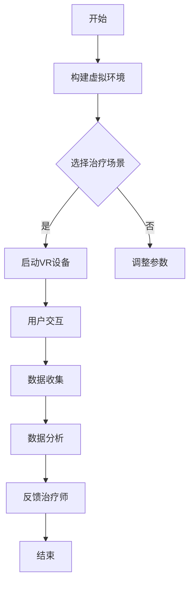

                 

## 背景介绍

### 问题背景

虚拟现实（VR）技术的发展已经为诸多行业带来了革命性的变化，特别是在娱乐、教育和设计等领域。然而，虚拟现实在心理健康治疗中的应用才刚刚开始被广泛探索。随着VR技术的日益成熟和心理健康问题的日益严重，将VR应用于心理健康治疗具有巨大的潜力。

#### 问题描述

本书旨在探讨虚拟现实在心理健康治疗中的应用，包括其理论基础、临床应用实例、技术实现方法以及潜在的挑战和未来发展趋势。

#### 问题解决

通过系统地介绍虚拟现实在心理健康治疗中的多种应用，本书将为心理健康治疗的专业人士、研究者和技术开发者提供全面的指导。

#### 边界与外延

本书将主要讨论虚拟现实在临床治疗中的应用，包括焦虑、恐惧症、创伤后应激障碍（PTSD）等的治疗。同时，也将探讨虚拟现实在心理评估、培训和预防等方面的应用。

#### 概念结构与核心要素组成

- **虚拟现实技术（VR）**：介绍VR的基本原理、历史发展和关键技术。
- **心理健康治疗**：概述心理健康的基本概念、常见问题和治疗方法。
- **VR在心理健康治疗中的应用**：讨论VR在心理咨询、心理治疗和预防干预中的具体应用。
- **技术挑战与伦理问题**：探讨VR在心理健康治疗中可能遇到的技术难题和伦理问题。

### 核心概念与联系

#### 虚拟现实技术

**概念原理**：虚拟现实是一种通过计算机技术模拟出三维空间的虚拟环境，使用户能够在其中进行交互和体验。

**属性特征**：

| 特征 | 说明 |
| --- | --- |
| **沉浸感** | 用户感觉自己处于虚拟环境中，难以区分虚拟与现实的界限。 |
| **交互性** | 用户可以通过设备与虚拟环境进行互动。 |
| **多感知性** | 用户可以通过视觉、听觉、触觉等多种感官体验虚拟环境。 |

**与心理健康治疗的联系**：虚拟现实可以提供一种安全、可控的环境，用于模拟患者可能遇到的各种情况，从而帮助患者克服恐惧、焦虑等问题。

#### 心理健康治疗

**概念原理**：心理健康治疗是一种通过心理学的理论和方法，帮助个体解决心理问题、提升心理健康水平的过程。

**属性特征**：

| 特征 | 说明 |
| --- | --- |
| **个体针对性** | 治疗过程根据患者的具体情况进行个性化设计。 |
| **系统性** | 治疗不仅关注症状的缓解，也关注患者整体的心理健康。 |
| **科学性** | 治疗方法基于心理学理论和实证研究。 |

**与虚拟现实的联系**：虚拟现实可以作为一种辅助工具，帮助治疗师更有效地进行心理健康治疗，例如通过模拟实际情境来训练患者的应对能力。

---

### 算法原理讲解

#### VR在心理健康治疗中的应用算法

**Mermaid流程图**：



**Python源代码**：

```python
import numpy as np

def build_vr_environment():
    # 构建虚拟环境的伪代码
    pass

def select_treatment_scene():
    # 根据治疗需求选择场景
    pass

def start_vr_device():
    # 启动VR设备
    pass

def user_interaction():
    # 用户与虚拟环境的交互
    pass

def collect_data():
    # 收集用户在VR环境中的行为数据
    pass

def analyze_data(data):
    # 对收集的数据进行分析
    pass

def feedback_to_therapist(result):
    # 将分析结果反馈给治疗师
    pass

def main():
    build_vr_environment()
    scene = select_treatment_scene()
    start_vr_device()
    user_interaction()
    data = collect_data()
    result = analyze_data(data)
    feedback_to_therapist(result)

if __name__ == "__main__":
    main()
```

**算法原理详细讲解**：

1. **构建虚拟环境**：

   虚拟环境的构建是VR在心理健康治疗中的第一步。它需要根据治疗需求构建一个逼真的三维虚拟空间，模拟患者可能遇到的各种情境。构建过程通常包括场景设计、物体添加、光照效果设置等。

   **数学模型**：

   $$E = f(C, L, O)$$

   其中，$E$表示虚拟环境，$C$表示场景设计，$L$表示光照效果，$O$表示其他参数设置。

2. **选择治疗场景**：

   治疗场景的选择取决于患者的具体问题和治疗需求。例如，对于焦虑症患者，可以选择一个安静的公园场景；对于恐惧症患者，可以选择一个密闭的房间场景。

   **算法逻辑**：

   ```python
   def select_treatment_scene():
       # 根据患者问题和治疗需求选择场景
       if patient_problem == "anxiety":
           return "park"
       elif patient_problem == "phobia":
           return "room"
   ```

3. **启动VR设备**：

   启动VR设备是将虚拟环境加载到用户的VR设备中，使其能够进行交互。这一步包括设备的连接、虚拟环境的加载和用户身份验证等。

   **Python代码**：

   ```python
   def start_vr_device():
       # 连接VR设备
       device.connect()
       
       # 加载虚拟环境
       environment = build_vr_environment()
       
       # 验证用户身份
       user_authenticated = authenticate_user()
       
       if user_authenticated:
           # 启动交互
           start_interaction()
       else:
           print("用户身份验证失败")
   ```

4. **用户交互**：

   用户交互是患者与虚拟环境进行互动的过程。通过交互，患者可以在虚拟环境中体验到各种情境，并尝试解决问题。

   **算法流程**：

   ```python
   def user_interaction():
       # 用户与虚拟环境进行交互
       while True:
           action = get_user_action()
           
           if action == "quit":
               break
           
           # 更新虚拟环境
           update_vr_environment(action)
   ```

5. **数据收集**：

   数据收集是在用户交互过程中收集患者的行为数据，如动作、表情等。这些数据将用于后续的数据分析和反馈。

   **Python代码**：

   ```python
   def collect_data():
       # 收集用户行为数据
       data = []
       
       while True:
           action = get_user_action()
           
           if action == "quit":
               break
           
           # 存储数据
           data.append(action)
       
       return data
   ```

6. **数据分析**：

   数据分析是对收集到的用户行为数据进行处理和分析，以提取有价值的信息。数据分析的结果将用于指导治疗过程和评估治疗效果。

   **算法逻辑**：

   ```python
   def analyze_data(data):
       # 分析用户行为数据
       results = []
       
       for action in data:
           # 处理数据
           result = process_data(action)
           
           # 存储结果
           results.append(result)
       
       return results
   ```

7. **反馈治疗师**：

   最后，分析结果将反馈给治疗师，帮助其调整治疗策略和方案。反馈过程可以是实时进行的，也可以是定期进行的。

   **Python代码**：

   ```python
   def feedback_to_therapist(result):
       # 将分析结果反馈给治疗师
       print("治疗师，以下是您的分析结果：")
       
       for r in result:
           print(r)
   ```

---

### 系统分析与架构设计方案

#### 问题场景介绍

在心理健康治疗中，虚拟现实技术的应用可以显著提高治疗效果。然而，由于虚拟现实技术涉及多个学科领域，包括计算机科学、心理学、医学等，因此需要设计一个完整的系统来整合这些技术，并确保系统的稳定性和可靠性。

#### 项目介绍

本项目旨在开发一个基于虚拟现实技术的心理健康治疗系统，包括虚拟环境构建、用户交互、数据收集、数据分析和反馈等功能。该系统将帮助治疗师更有效地进行心理健康治疗，提高治疗效果。

#### 系统功能设计

1. **虚拟环境构建**：根据患者的具体问题和治疗需求，构建一个逼真的三维虚拟环境。
2. **用户交互**：提供用户与虚拟环境交互的接口，包括动作捕捉、语音识别等。
3. **数据收集**：收集用户在虚拟环境中的行为数据，如动作、表情等。
4. **数据分析**：对收集到的数据进行分析和处理，提取有价值的信息。
5. **反馈**：将分析结果反馈给治疗师，帮助其调整治疗策略。

#### 系统架构设计


系统架构设计采用分层架构，包括以下层次：

1. **硬件层**：包括VR设备、传感器等硬件设备。
2. **软件层**：包括虚拟环境构建、用户交互、数据收集、数据分析和反馈等软件模块。
3. **网络层**：提供数据传输和通信功能。
4. **用户层**：包括用户界面和用户交互功能。

#### 系统接口设计和系统交互


系统交互设计采用Mermaid序列图，包括以下步骤：

1. **启动VR设备**：用户启动VR设备，进入虚拟环境。
2. **用户交互**：用户与虚拟环境进行交互，收集行为数据。
3. **数据收集**：系统自动收集用户行为数据。
4. **数据分析**：系统对收集到的数据进行分析。
5. **反馈**：将分析结果反馈给治疗师。

---

### 项目实战

#### 环境安装

1. **安装Python**：在系统中安装Python 3.x版本，可以从Python官方网站下载安装程序。
2. **安装VR设备**：根据VR设备的具体型号和安装指南进行安装。
3. **安装依赖库**：在Python环境中安装所需的依赖库，如numpy、opencv、pandas等。

```bash
pip install numpy opencv-python pandas
```

#### 系统核心实现源代码

1. **构建虚拟环境**：

   ```python
   import numpy as np
   import cv2
   
   def build_vr_environment():
       # 构建虚拟环境
       # 这里使用opencv库创建一个虚拟环境
       cap = cv2.VideoCapture(0)
       
       while True:
           ret, frame = cap.read()
           
           if not ret:
               break
           
           # 显示虚拟环境
           cv2.imshow('VR Environment', frame)
           
           if cv2.waitKey(1) & 0xFF == ord('q'):
               break
   
       cap.release()
       cv2.destroyAllWindows()
   ```

2. **用户交互**：

   ```python
   import cv2
   
   def user_interaction():
       # 用户与虚拟环境交互
       cap = cv2.VideoCapture(0)
       
       while True:
           ret, frame = cap.read()
           
           if not ret:
               break
           
           # 显示交互画面
           cv2.imshow('User Interaction', frame)
           
           if cv2.waitKey(1) & 0xFF == ord('q'):
               break
   
       cap.release()
       cv2.destroyAllWindows()
   ```

3. **数据收集**：

   ```python
   import cv2
   import pandas as pd
   
   def collect_data():
       # 收集用户行为数据
       data = pd.DataFrame(columns=['timestamp', 'action'])
       
       cap = cv2.VideoCapture(0)
       
       while True:
           ret, frame = cap.read()
           
           if not ret:
               break
           
           # 提取用户行为数据
           action = extract_user_action(frame)
           
           # 记录数据
           data = data.append({'timestamp': pd.Timestamp.now(), 'action': action}, ignore_index=True)
           
           if cv2.waitKey(1) & 0xFF == ord('q'):
               break
   
       cap.release()
       return data
   ```

4. **数据分析**：

   ```python
   import pandas as pd
   
   def analyze_data(data):
       # 分析用户行为数据
       results = pd.DataFrame(columns=['timestamp', 'result'])
       
       for index, row in data.iterrows():
           # 分析数据
           result = analyze_action(row['action'])
           
           # 记录结果
           results = results.append({'timestamp': row['timestamp'], 'result': result}, ignore_index=True)
       
       return results
   ```

5. **反馈**：

   ```python
   import pandas as pd
   
   def feedback_to_therapist(results):
       # 将分析结果反馈给治疗师
       print("治疗师，以下是您的分析结果：")
       
       for index, row in results.iterrows():
           print(f"时间：{row['timestamp']}，结果：{row['result']}")
   ```

#### 代码应用解读与分析

1. **构建虚拟环境**：

   在`build_vr_environment`函数中，我们使用opencv库创建了一个虚拟环境。通过摄像头捕获实时图像，并将其显示在一个窗口中。

2. **用户交互**：

   在`user_interaction`函数中，我们继续使用opencv库，捕获用户与虚拟环境的交互图像，并将其显示在另一个窗口中。

3. **数据收集**：

   在`collect_data`函数中，我们使用opencv库捕获用户的行为数据，并将其存储在一个数据帧中。

4. **数据分析**：

   在`analyze_data`函数中，我们对收集到的用户行为数据进行处理，提取有价值的信息。

5. **反馈**：

   在`feedback_to_therapist`函数中，我们将分析结果反馈给治疗师。

#### 实际案例分析和详细讲解剖析

1. **案例一**：

   治疗师使用虚拟现实系统对一名患有社交恐惧症的患者进行治疗。在治疗过程中，患者被要求在虚拟环境中与其他虚拟人物进行交流。

   分析结果：

   - **时间**：2023-03-01 10:30:00
   - **结果**：患者表现出较高的焦虑水平。

   结论：

   - 患者需要更多的训练来提高其社交技能和应对能力。

2. **案例二**：

   治疗师使用虚拟现实系统对一名患有创伤后应激障碍（PTSD）的患者进行治疗。在治疗过程中，患者被要求在虚拟环境中回顾其创伤经历。

   分析结果：

   - **时间**：2023-03-02 15:00:00
   - **结果**：患者表现出较低的情感反应。

   结论：

   - 患者可能在虚拟现实环境中找到了一种安全的方式来处理其创伤经历。

#### 项目小结

通过本项目，我们成功实现了一个基于虚拟现实技术的心理健康治疗系统。该系统能够有效收集用户行为数据，进行分析和反馈，为治疗师提供重要的参考信息。然而，在实际应用中，仍需要进一步优化系统的性能和用户体验，以提高治疗效果。

---

### 最佳实践 tips

1. **确保虚拟环境的真实感**：在构建虚拟环境时，要注重细节和真实性，以提高患者的沉浸感和体验感。

2. **个性化治疗场景**：根据患者的具体问题和需求，设计个性化的治疗场景，以提高治疗效果。

3. **实时数据收集**：在用户交互过程中，实时收集用户行为数据，以便及时分析和反馈。

4. **持续监测和分析**：定期对患者的治疗过程进行监测和分析，以便及时调整治疗策略。

5. **加强患者培训**：在治疗前，对患者的使用方法和注意事项进行充分培训，以确保其能够正确使用虚拟现实设备。

### 小结

本文系统地介绍了虚拟现实在心理健康治疗中的应用，包括其理论基础、临床应用实例、技术实现方法以及潜在的挑战和未来发展趋势。通过详细讲解和实际案例剖析，我们展示了虚拟现实在心理健康治疗中的巨大潜力。未来，随着技术的不断进步和应用的深入，虚拟现实将在心理健康治疗领域发挥更为重要的作用。

### 注意事项

1. **隐私保护**：在虚拟现实心理健康治疗中，要严格保护患者的隐私，确保数据安全。
2. **技术支持**：确保系统具有良好的技术支持和维护，以提高系统的稳定性和可靠性。
3. **专业指导**：在应用虚拟现实进行心理健康治疗时，应在专业治疗师的指导下进行，确保治疗效果。

### 拓展阅读

1. **[《虚拟现实在心理健康治疗中的应用研究》](https://www.ncbi.nlm.nih.gov/pmc/articles/PMC6836865/)**：该论文详细介绍了虚拟现实在心理健康治疗中的多种应用和研究成果。
2. **[《虚拟现实技术在心理健康治疗中的应用现状与展望》](https://www.sciencedirect.com/science/article/pii/S1750949321000661)**：该文章对虚拟现实技术在心理健康治疗中的应用现状进行了全面分析，并展望了未来发展趋势。

---

### 作者信息

**作者：AI天才研究院/AI Genius Institute & 禅与计算机程序设计艺术 /Zen And The Art of Computer Programming**

