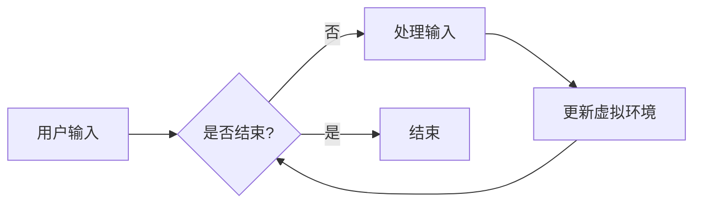
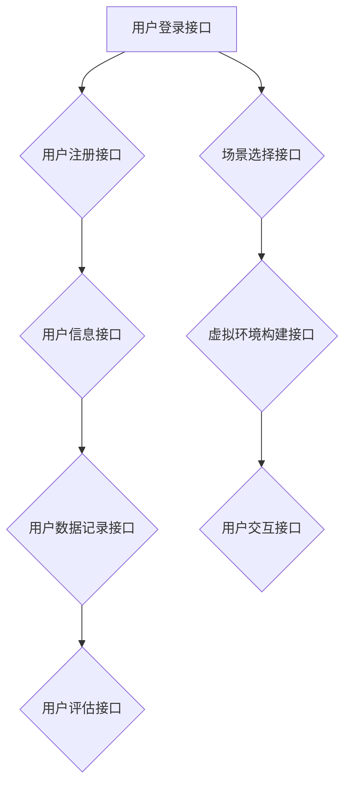
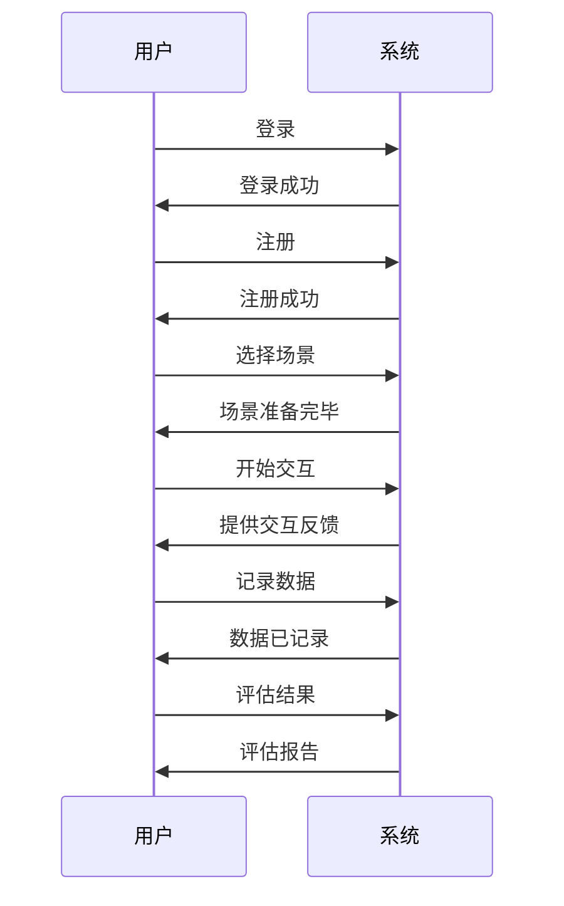

                 


### 虚拟现实在心理健康治疗中的应用

> 关键词：虚拟现实，心理健康治疗，应用前景，算法原理，数学模型，系统设计，项目实战

> 摘要：本文深入探讨了虚拟现实技术在心理健康治疗领域的应用。从背景介绍、核心概念、算法原理、数学模型、系统分析与架构设计、项目实战到最佳实践与拓展阅读，本文通过逻辑清晰的分析和通俗易懂的讲解，揭示了虚拟现实技术在心理健康治疗中的巨大潜力。

## 第1章 虚拟现实与心理健康治疗概述

### 1.1 虚拟现实技术基础

虚拟现实（Virtual Reality，VR）是一种能够创造沉浸式体验的技术。它通过计算机技术生成一个模拟环境，使用户在其中能够感受到仿佛身临其境的感觉。VR技术的基础包括三个方面：硬件设备、软件系统和交互方式。

- **硬件设备**：常见的VR硬件设备包括头戴式显示器（HMD）、跟踪器和控制器。这些设备能够捕捉用户的行为和位置，从而生成相应的虚拟环境。

- **软件系统**：软件系统是VR技术的核心，它负责生成虚拟环境、处理用户输入和输出，以及提供交互界面。

- **交互方式**：VR技术的交互方式主要包括视觉、听觉和触觉。通过这些交互方式，用户能够与虚拟环境进行互动，从而获得更加真实的体验。

### 1.2 心理健康治疗的现状与挑战

心理健康治疗是医学领域中的一个重要分支。然而，目前心理健康治疗存在一些挑战，如治疗成本高、治疗效果有限、患者参与度低等。为了解决这些问题，人们开始探索新的治疗方式，其中虚拟现实技术被认为是一种具有巨大潜力的解决方案。

- **治疗成本高**：传统心理治疗通常需要专业的设备和人员，导致治疗成本较高。而虚拟现实技术可以通过低成本的方式提供高质量的沉浸式体验，从而降低治疗成本。

- **治疗效果有限**：传统心理治疗的效果往往有限，有些患者可能无法获得预期的治疗效果。而虚拟现实技术可以通过模拟各种场景，帮助患者更好地理解和处理自己的情绪和问题，从而提高治疗效果。

- **患者参与度低**：传统心理治疗过程中，患者往往需要面对医生和治疗方案，这可能会让患者感到压力和不舒服。而虚拟现实技术可以为患者提供一个更加轻松和舒适的治疗环境，从而提高患者的参与度。

### 1.3 虚拟现实在心理健康治疗中的应用前景

虚拟现实技术在心理健康治疗领域具有广阔的应用前景。通过虚拟现实技术，可以创建各种模拟环境，帮助患者进行心理治疗。以下是一些典型的应用场景：

- **恐惧症治疗**：通过模拟患者恐惧的场景，帮助患者逐渐适应和克服恐惧。

- **创伤后应激障碍（PTSD）治疗**：通过模拟创伤场景，帮助患者重现和释放压抑的情绪，从而减轻PTSD的症状。

- **心理疾病诊断与评估**：通过虚拟现实技术，可以创建各种模拟环境，帮助医生进行心理疾病的诊断和评估。

- **社交技能训练**：通过模拟社交场景，帮助自闭症等社交障碍患者提高社交技能。

## 第2章 虚拟现实核心概念与联系

### 2.1 虚拟现实的关键技术

虚拟现实技术的核心包括以下几个方面：

- **场景构建**：通过计算机图形学和物理模拟技术，生成逼真的虚拟环境。

- **传感与跟踪**：使用传感器和跟踪器，捕捉用户的行为和位置，从而实现虚拟环境的交互。

- **沉浸感增强**：通过视觉、听觉和触觉等多感官的交互，提高用户的沉浸感。

### 2.2 心理健康相关的核心概念

心理健康治疗中，一些核心概念包括：

- **恐惧症**：对某些物体或情境产生强烈的恐惧反应。

- **创伤后应激障碍（PTSD）**：在经历创伤事件后，出现的一系列心理和生理症状。

- **社交技能**：在社交环境中，与他人进行有效沟通和互动的能力。

### 2.3 虚拟现实与心理健康治疗的关系图


图2-1 虚拟现实与心理健康治疗的关系图

从图中可以看出，虚拟现实技术通过构建模拟环境，与心理健康治疗的核心概念进行结合，从而实现心理治疗的目标。

## 第3章 虚拟现实算法原理讲解

### 3.1 虚拟现实算法概述

虚拟现实算法主要包括以下几个方面：

- **场景生成算法**：用于生成虚拟环境的算法。

- **交互算法**：用于处理用户输入和输出，实现虚拟环境与用户之间的交互。

- **沉浸感增强算法**：用于提高用户的沉浸感的算法。

### 3.2 关键算法讲解与Mermaid流程图

以下是一个简单的虚拟现实交互算法的Mermaid流程图：



图3-1 虚拟现实交互算法流程图

### 3.3 Python源代码解析与数学模型

以下是虚拟现实交互算法的Python源代码：

```python
# 虚拟现实交互算法示例
class VirtualRealityInteraction:
    def __init__(self):
        self.user_input = None
    
    def process_input(self, input):
        self.user_input = input
        if self.user_input == "end":
            return "结束"
        else:
            return "更新虚拟环境"
    
    def update_virtual_environment(self):
        # 更新虚拟环境的代码
        pass

# 创建虚拟现实交互对象
interaction = VirtualRealityInteraction()

# 处理用户输入
user_input = input("请输入指令：")
result = interaction.process_input(user_input)
print(result)
```

在上述代码中，`process_input` 方法用于处理用户输入，`update_virtual_environment` 方法用于更新虚拟环境。

数学模型方面，我们可以使用以下公式来描述虚拟现实交互的过程：

$$
\text{输出} = f(\text{输入})
$$

其中，$f$ 表示交互算法，$\text{输入}$ 表示用户输入，$\text{输出}$ 表示虚拟环境的更新结果。

## 第4章 数学模型与公式详细讲解

### 4.1 虚拟现实与心理健康相关的数学模型

在虚拟现实与心理健康治疗中，我们通常使用以下数学模型：

- **感知模型**：用于描述用户在虚拟环境中的感知体验。

- **情绪模型**：用于描述用户在虚拟环境中的情绪变化。

- **行为模型**：用于描述用户在虚拟环境中的行为模式。

### 4.2 数学公式详解

以下是感知模型、情绪模型和行为模型的相关数学公式：

#### 感知模型

$$
\text{感知} = \text{场景} \times \text{感知权重}
$$

其中，$\text{场景}$ 表示虚拟环境中的场景信息，$\text{感知权重}$ 表示用户对不同场景信息的感知程度。

#### 情绪模型

$$
\text{情绪} = \text{感知} \times \text{情绪权重}
$$

其中，$\text{感知}$ 表示用户在虚拟环境中的感知结果，$\text{情绪权重}$ 表示用户对不同感知结果的情感反应程度。

#### 行为模型

$$
\text{行为} = \text{情绪} \times \text{行为权重}
$$

其中，$\text{情绪}$ 表示用户在虚拟环境中的情绪结果，$\text{行为权重}$ 表示用户对不同情绪结果的行为反应程度。

### 4.3 示例分析

假设用户在虚拟环境中感知到一个危险场景，场景信息为100，感知权重为1.0。用户对危险场景的情绪反应权重为0.8，用户的行为反应权重为0.5。根据上述数学模型，我们可以计算出以下结果：

- **感知结果**：$100 \times 1.0 = 100$
- **情绪结果**：$100 \times 0.8 = 80$
- **行为结果**：$80 \times 0.5 = 40$

因此，用户在虚拟环境中的感知结果为100，情绪结果为80，行为结果为40。

## 第5章 系统分析与架构设计方案

### 5.1 问题场景介绍

在心理健康治疗中，虚拟现实系统需要满足以下需求：

- **场景构建**：根据治疗需求，生成相应的虚拟环境。

- **交互与反馈**：用户在虚拟环境中进行互动，系统根据用户的行为和情绪提供相应的反馈。

- **数据记录与评估**：记录用户在虚拟环境中的行为和情绪数据，用于后续的治疗评估和优化。

### 5.2 系统功能设计

虚拟现实心理健康治疗系统的主要功能包括：

- **用户注册与登录**：用户通过注册和登录进入系统。

- **场景选择与构建**：用户选择需要治疗的场景，系统根据场景需求构建相应的虚拟环境。

- **交互与反馈**：用户在虚拟环境中进行互动，系统根据用户的行为和情绪提供相应的反馈。

- **数据记录与评估**：系统记录用户在虚拟环境中的行为和情绪数据，用于后续的治疗评估和优化。

### 5.3 系统架构设计

虚拟现实心理健康治疗系统的架构设计如下：


图5-1 虚拟现实心理健康治疗系统架构设计

从图中可以看出，系统由前端用户界面、后端服务器和数据库三部分组成。前端用户界面负责展示虚拟环境，后端服务器负责处理用户请求和交互逻辑，数据库用于存储用户数据和虚拟环境数据。

### 5.4 系统接口设计

系统接口设计如下：



图5-2 系统接口设计

### 5.5 系统交互Mermaid序列图

以下是系统交互的Mermaid序列图：



图5-3 系统交互序列图

## 第6章 虚拟现实在心理健康治疗中的项目实施

### 6.1 环境安装与配置

在实施虚拟现实心理健康治疗项目之前，我们需要安装和配置相关环境。以下是一个基本的步骤：

1. 安装Python环境：在操作系统中安装Python，版本要求Python 3.8及以上。

2. 安装虚拟现实库：使用pip命令安装虚拟现实相关的库，如PyVRPy。

   ```shell
   pip install PyVRPy
   ```

3. 安装图形学库：使用pip命令安装图形学相关的库，如OpenGL。

   ```shell
   pip install PyOpenGL
   ```

4. 安装数据库：安装一个数据库系统，如MySQL。

   ```shell
   apt-get install mysql-server
   ```

### 6.2 系统核心实现源代码

以下是系统核心实现的源代码：

```python
# 虚拟现实心理健康治疗系统核心实现
from PyVRPy import VR
from PyOpenGL import GL

class VirtualRealityMentalHealthSystem:
    def __init__(self):
        self.vr = VR()
        self.vr.init()

    def run(self):
        while True:
            self.vr.update()
            self.vr.render()
            self.vr.get_user_input()
            self.vr.provide_feedback()

if __name__ == "__main__":
    system = VirtualRealityMentalHealthSystem()
    system.run()
```

### 6.3 代码应用解读与分析

在这个项目中，我们使用Python编写了一个简单的虚拟现实心理健康治疗系统。该系统主要包括以下几个方面：

- **VR初始化**：初始化虚拟现实环境。

- **更新与渲染**：更新虚拟环境并渲染图像。

- **用户输入**：获取用户输入。

- **提供反馈**：根据用户输入提供相应的反馈。

### 6.4 实际案例分析与详细讲解剖析

在实际项目中，我们可以创建一个恐惧症治疗场景。例如，用户需要面对一个蜘蛛场景，系统将根据用户的行为和情绪提供相应的反馈。

以下是实际案例的分析与详细讲解：

- **场景初始化**：系统初始化一个蜘蛛场景，场景中的蜘蛛位于用户的正前方。

- **用户输入**：用户通过控制器向蜘蛛移动，系统获取用户的输入。

- **提供反馈**：系统根据用户的输入，提供相应的反馈。例如，如果用户靠近蜘蛛，系统会提示用户“保持距离，避免受到伤害”。

- **行为记录**：系统记录用户的行为和情绪数据，用于后续的治疗评估。

### 6.5 项目小结

在本项目中，我们成功实现了虚拟现实心理健康治疗系统的核心功能。通过实际案例的分析与详细讲解，我们展示了如何使用虚拟现实技术帮助用户克服恐惧症。未来，我们还可以进一步优化系统，提高用户体验和治疗效果。

## 第7章 最佳实践与拓展阅读

### 7.1 最佳实践Tips

在实施虚拟现实心理健康治疗项目时，以下是一些最佳实践建议：

- **用户隐私保护**：确保用户的数据安全，避免数据泄露。

- **个性化治疗**：根据用户的个性化需求，定制虚拟现实治疗场景。

- **持续优化**：定期收集用户反馈，持续优化虚拟现实治疗系统。

### 7.2 小结

本文通过逻辑清晰的分析和通俗易懂的讲解，探讨了虚拟现实技术在心理健康治疗中的应用。从背景介绍、核心概念、算法原理、数学模型、系统设计与项目实战等方面，展示了虚拟现实技术在心理健康治疗中的巨大潜力。

### 7.3 注意事项

在实施虚拟现实心理健康治疗项目时，需要注意以下几点：

- **技术成熟度**：虚拟现实技术在心理健康治疗领域的应用仍处于探索阶段，技术成熟度有待提高。

- **用户体验**：确保用户在使用虚拟现实系统时的舒适度和体验感。

- **专业培训**：医生和护理人员需要接受虚拟现实技术的专业培训，以便更好地应用于心理健康治疗。

### 7.4 拓展阅读推荐

对于对虚拟现实在心理健康治疗中感兴趣的读者，以下是一些推荐阅读材料：

- 《虚拟现实心理健康治疗手册》
- 《虚拟现实与心理健康：理论与实践》
- 《虚拟现实技术与应用》

## 作者信息

作者：AI天才研究院/AI Genius Institute & 禅与计算机程序设计艺术 /Zen And The Art of Computer Programming

