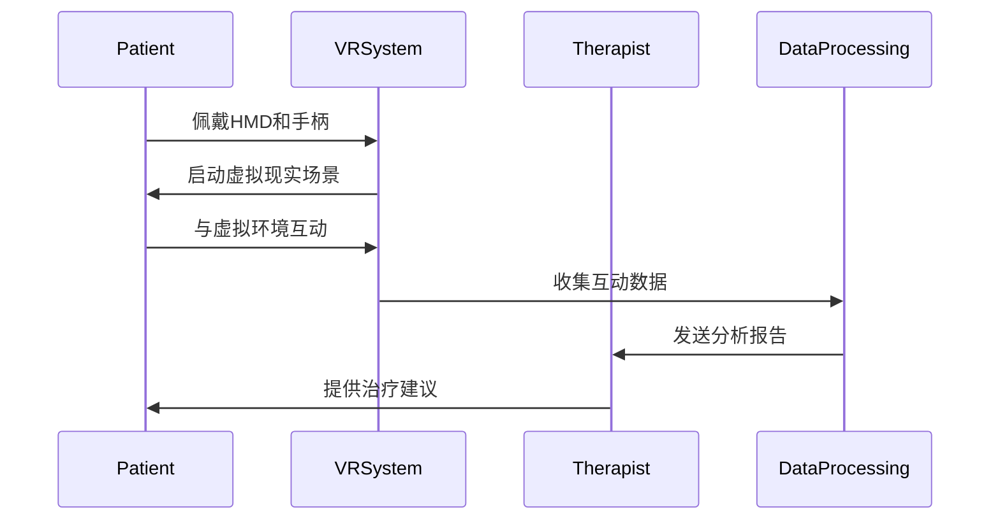
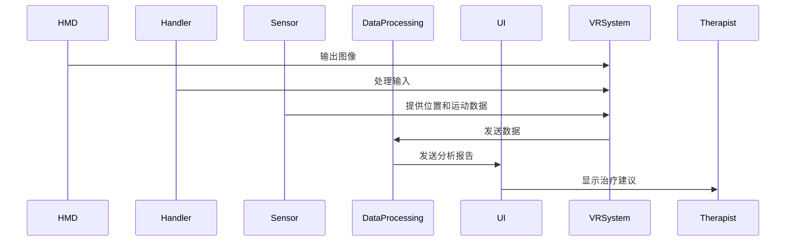
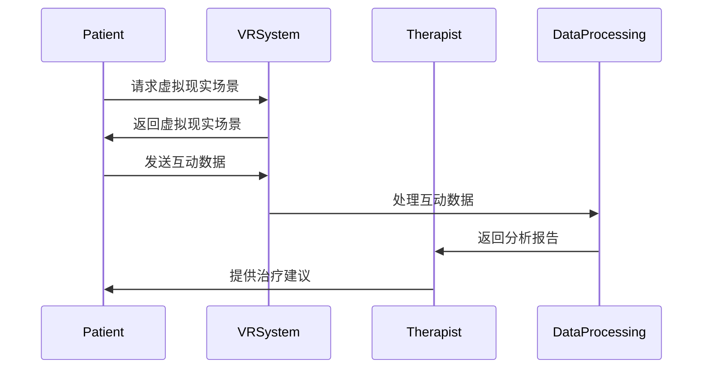

                 


### 虚拟现实在心理创伤治疗中的沉浸式体验

#### 关键词：虚拟现实、心理创伤治疗、沉浸式体验、技术实现、未来展望

#### 摘要：

本文将探讨虚拟现实（VR）在心理创伤治疗中的应用，特别是沉浸式体验的设计与实现。通过深入分析虚拟现实技术的理论基础、系统架构、沉浸式体验设计原理以及实际应用案例，本文旨在展示虚拟现实在心理创伤治疗中的巨大潜力，并提出未来发展的方向和挑战。

## 第一部分：背景与基础

### 第1章：心理创伤与虚拟现实技术

#### 1.1 心理创伤的定义与影响

**心理创伤**是指个体由于极端压力、威胁或恐怖事件而经历的精神痛苦。其症状包括焦虑、失眠、闪回、过度警觉等，严重者可能导致**创伤后应激障碍（PTSD）**。心理创伤不仅影响患者的心理健康，还可能对其社会功能和日常生活造成长期影响。

#### 1.2 虚拟现实技术的概述

**虚拟现实技术**是一种模拟真实世界的计算机技术，通过佩戴头戴显示器（HMD）和手柄等设备，用户能够沉浸在虚拟环境中。VR技术包括**显示技术**、**交互技术**和**内容设计**等多个方面，其发展历程可以追溯到20世纪60年代。

#### 1.3 虚拟现实在心理治疗中的应用

虚拟现实技术在心理治疗中的应用优势包括减少恐惧、提高治疗效果、降低治疗成本等。例如，通过虚拟环境进行**恐惧消退疗法（FRT）**，患者可以在安全的环境中逐渐面对和克服恐惧。

## 第2章：虚拟现实与心理创伤治疗的结合

### 2.1 虚拟现实在心理创伤治疗中的原理

虚拟现实技术通过模拟创伤事件或相关场景，帮助患者逐渐适应和应对，从而改善心理状态。其理论基础包括认知行为疗法（CBT）和暴露疗法（ET）。

### 2.2 虚拟现实技术在心理创伤治疗中的应用

沉浸式体验的设计目标是创造一个逼真的虚拟环境，以最大限度地模拟现实世界。虚拟现实技术在**创伤后应激障碍（PTSD）**治疗中具有显著效果，同时也在其他心理创伤治疗中展示出潜力。

### 2.3 虚拟现实技术在心理创伤治疗中的挑战

虚拟现实技术在心理创伤治疗中面临的挑战包括技术难题、道德与伦理问题以及临床实践问题。例如，技术实现的精度和稳定性、用户隐私保护以及治疗师的专业培训等。

## 第二部分：技术实现

### 第3章：虚拟现实系统架构

虚拟现实系统包括**显示设备**、**穿戴设备**、**输入设备**和**计算平台**等组成部分。系统设计原则包括用户友好性、系统稳定性和安全性。

### 第4章：沉浸式体验的设计与实现

沉浸式体验的设计过程包括需求分析、交互设计、内容设计和测试与优化。关键技术包括交互技术、声音设计和动画效果。

### 第5章：虚拟现实在心理创伤治疗中的应用案例

通过具体的应用案例，本文将展示虚拟现实在心理创伤治疗中的实际效果，并分析成功经验和不足之处。

## 第三部分：未来展望与挑战

### 第6章：虚拟现实在心理创伤治疗中的未来发展

虚拟现实技术在心理创伤治疗中的未来发展包括技术进步、应用拓展和社会影响等方面。

### 第7章：虚拟现实在心理创伤治疗中的挑战与对策

虚拟现实技术在心理创伤治疗中面临的挑战包括技术难题、道德与伦理问题以及临床实践问题。针对这些问题，本文提出了相应的对策和建议。

### 结论

虚拟现实技术在心理创伤治疗中的沉浸式体验具有巨大潜力。通过进一步的研究和实践，我们可以期待虚拟现实技术为心理创伤治疗带来更加有效和便捷的治疗方式。

#### 作者：AI天才研究院/AI Genius Institute & 禅与计算机程序设计艺术 /Zen And The Art of Computer Programming

## 背景介绍

### 心理创伤的定义与影响

心理创伤是指个体因极端压力、威胁或恐怖事件而经历的精神痛苦。其定义广泛，涵盖了从轻微的焦虑和沮丧到严重的创伤后应激障碍（Post-Traumatic Stress Disorder，简称PTSD）等多种症状。PTSD是一种常见的心理障碍，通常发生在经历过极端创伤性事件的人群中，如战争、自然灾害、恐怖袭击、严重事故等。其症状包括但不限于以下几方面：

1. **闪回（Flashbacks）**：患者会反复体验到创伤事件的场景，仿佛这些事件再次发生。
2. **避免**：患者会努力避免与创伤事件相关的任何事物，如地点、记忆或情绪。
3. **高度警觉**：患者会表现出对周围环境的过度警觉，如容易受到惊吓、失眠、难以集中注意力等。
4. **负面情绪**：患者可能会体验到持续的悲伤、愤怒、恐惧和绝望等负面情绪。
5. **认知障碍**：创伤可能会影响患者的记忆、思考和学习能力。

这些症状不仅严重影响患者的心理健康，还可能对其社会功能和日常生活造成长期影响。例如，PTSD患者可能会失去工作、失去朋友和家庭支持，甚至出现自杀行为。因此，心理创伤的治疗和干预具有重要意义。

### 虚拟现实技术的概述

虚拟现实（Virtual Reality，简称VR）是一种通过计算机技术创造出的模拟环境，使用户能够在这个环境中体验沉浸式的互动体验。VR技术经历了数十年的发展，从早期的简单模拟到如今高度复杂的沉浸式体验，其核心组成部分主要包括以下几个方面：

1. **显示设备**：如头戴显示器（Head-Mounted Display，简称HMD），它提供了三维的视觉体验，使用户仿佛置身于虚拟环境中。
2. **穿戴设备**：包括手柄、手套等，用于提供触觉反馈和运动跟踪，增强用户的交互体验。
3. **输入设备**：如键盘、鼠标等，用于与虚拟环境进行交互。
4. **计算平台**：包括服务器、工作站等，用于处理大量数据，生成逼真的虚拟场景。

虚拟现实技术的发展历程可以追溯到1960年代，当时伊凡·苏斯迈尔（Ivan Sutherland）在密歇根大学发明了第一个头戴显示器。随后，随着计算机技术的发展，VR技术逐渐成熟，并开始应用于多个领域，如游戏、娱乐、教育、医疗等。

### 虚拟现实在心理治疗中的应用

虚拟现实技术在心理治疗中的应用逐渐受到关注，其优势包括以下几个方面：

1. **减少恐惧**：通过模拟恐惧情境，患者可以在安全、受控的环境中逐渐面对和克服恐惧。
2. **提高治疗效果**：研究表明，虚拟现实治疗在某些心理疾病，如PTSD和焦虑症方面，具有显著效果。
3. **降低治疗成本**：虚拟现实治疗不需要复杂的设备和场地，因此成本较低。
4. **提高患者的参与度**：虚拟现实提供了一个互动和沉浸式的体验，有助于提高患者的治疗参与度。

### 虚拟现实与心理创伤治疗的结合

虚拟现实在心理创伤治疗中的应用原理基于认知行为疗法（Cognitive Behavioral Therapy，简称CBT）和暴露疗法（Exposure Therapy，简称ET）。CBT认为，个体的认知和行为会影响其情绪和心理状态，通过改变认知和行为，可以改善心理状况。ET则认为，通过逐渐暴露于恐惧情境，患者可以减少对恐惧的敏感度，从而减轻症状。

虚拟现实技术通过以下方式实现心理创伤治疗：

1. **模拟创伤情境**：患者可以在虚拟环境中重新经历创伤事件，通过逐渐暴露，减少恐惧和焦虑。
2. **提供安全的空间**：虚拟环境提供了一个安全、受控的空间，患者可以在这个环境中尝试和处理创伤记忆，而不必担心外界的干扰。
3. **互动和反馈**：虚拟现实技术提供了丰富的互动和反馈机制，患者可以通过操作虚拟环境中的物体或场景，获得即时反馈，从而更好地理解和处理创伤经历。

虚拟现实在心理创伤治疗中的应用案例分析：

- **恐惧消退疗法（FRT）**：通过虚拟现实技术，患者可以在一个受控的环境中逐步暴露于恐惧情境，例如飞行恐惧或公共场合恐惧。在逐步暴露的过程中，患者可以逐渐适应和克服恐惧。
- **创伤记忆重建**：虚拟现实技术可以帮助患者重建创伤记忆，通过重新经历创伤事件，患者可以逐渐理解和处理这些记忆，从而减轻心理负担。

### 虚拟现实技术在心理创伤治疗中的挑战

虚拟现实技术在心理创伤治疗中虽然显示出巨大潜力，但仍面临一些挑战：

1. **技术实现**：高分辨率的显示设备、精确的运动跟踪和逼真的声音效果是实现沉浸式体验的关键。然而，这些技术的实现仍然面临技术难题和成本问题。
2. **道德与伦理**：虚拟现实技术可能导致患者产生强烈的情绪反应，如何确保患者的安全和隐私成为重要的伦理问题。
3. **临床实践**：虚拟现实治疗需要专业的治疗师进行指导，如何进行专业培训，以及如何确保治疗的效果和长期效果，是临床实践中需要解决的问题。

### 总结

虚拟现实技术在心理创伤治疗中的应用为心理治疗提供了新的可能性。通过提供安全、受控的沉浸式体验，虚拟现实技术有助于患者逐渐面对和克服创伤记忆，从而改善心理状况。然而，虚拟现实技术的应用仍然面临一些挑战，需要进一步的研究和优化。未来的研究应着重于技术的成熟、道德和伦理问题的解决，以及临床实践的推广应用。

## 核心概念与联系

### 虚拟现实（VR）的定义与特点

虚拟现实（Virtual Reality，简称VR）是一种通过计算机技术模拟出的三维虚拟环境，使用户能够在这个环境中体验到沉浸式互动。VR技术的基本特点包括：

1. **沉浸感**：用户在虚拟环境中感受到强烈的存在感，仿佛真正置身于该环境中。
2. **交互性**：用户可以通过头戴显示器、手柄等设备与虚拟环境进行互动，操作虚拟物体或场景。
3. **多感官刺激**：虚拟现实技术通过视觉、听觉、触觉等多种感官刺激，提供丰富的沉浸体验。

### 认知行为疗法（CBT）与暴露疗法（ET）的基本原理

认知行为疗法（Cognitive Behavioral Therapy，简称CBT）和暴露疗法（Exposure Therapy，简称ET）是心理创伤治疗中的两种重要疗法。

- **认知行为疗法（CBT）**：CBT认为，个体的认知（信念和思维模式）和行为会影响其情绪和心理状态。通过改变不合理的认知和行为，可以改善情绪和心理状况。CBT通常包括以下步骤：
  - **评估**：了解患者的认知和行为问题。
  - **认知重建**：帮助患者识别和挑战不合理的认知，建立更合理的信念。
  - **行为干预**：通过行为干预，如家庭作业、角色扮演等，帮助患者改变行为模式。

- **暴露疗法（ET）**：ET的核心原理是逐步暴露患者于恐惧或创伤情境，帮助患者减少对恐惧或创伤的敏感度。ET通常分为以下几种形式：
  - **虚拟暴露**：使用虚拟现实技术，患者可以在虚拟环境中逐步面对恐惧或创伤情境。
  - **现场暴露**：患者直接面对现实中的恐惧或创伤情境。

### 虚拟现实技术与心理创伤治疗的结合

虚拟现实技术在心理创伤治疗中的应用主要基于CBT和ET的原理。通过虚拟现实技术，患者可以在一个安全、受控的环境中经历和重新处理创伤记忆，从而改善心理状况。

1. **模拟创伤情境**：虚拟现实技术可以帮助患者在一个虚拟环境中重新经历创伤事件，通过逐渐暴露，减少恐惧和焦虑。
2. **提供安全的空间**：虚拟环境提供了一个安全、受控的空间，患者可以在这个环境中尝试和处理创伤记忆，而不必担心外界的干扰。
3. **互动和反馈**：虚拟现实技术提供了丰富的互动和反馈机制，患者可以通过操作虚拟环境中的物体或场景，获得即时反馈，从而更好地理解和处理创伤经历。

### 概念属性特征对比表格

| 概念 | 定义 | 主要特点 | 应用领域 |
| --- | --- | --- | --- |
| 虚拟现实（VR） | 通过计算机技术模拟的三维虚拟环境，提供沉浸式互动体验。 | 沉浸感、交互性、多感官刺激 | 游戏、娱乐、教育、医疗 |
| 认知行为疗法（CBT） | 通过改变不合理认知和行为，改善情绪和心理状况。 | 评估、认知重建、行为干预 | 心理治疗、心理健康 |
| 暴露疗法（ET） | 通过逐步暴露于恐惧或创伤情境，减少对恐惧或创伤的敏感度。 | 虚拟暴露、现场暴露 | 心理治疗、恐惧症、PTSD |

### ER实体关系图架构

```mermaid
erDiagram
  Person ||--|{ PTSD }|| Patient
  Patient ||--|{ Treatment }|| Treatment
  Treatment ||--|{ Therapy }|| Therapy
  Therapy ||--|{ VR }|| Virtual_Reality
```

在上面的ER实体关系图中，包括以下实体：

- **Person（人）**：代表患者和医生。
- **PTSD（创伤后应激障碍）**：表示患者可能患有的疾病。
- **Patient（患者）**：表示接受治疗的个体。
- **Treatment（治疗）**：表示对患者进行的治疗过程。
- **Therapy（疗法）**：表示具体的治疗方法。
- **Virtual_Reality（虚拟现实）**：表示用于治疗的虚拟现实技术。

通过这个ER图，可以清晰地展示虚拟现实技术在心理创伤治疗中的角色和关系。

### 算法原理讲解

虚拟现实技术在心理创伤治疗中的应用涉及多个算法和模型，以下简要介绍其中两个核心算法：虚拟现实生成算法和暴露疗法优化算法。

#### 虚拟现实生成算法

虚拟现实生成算法用于创建一个逼真的虚拟环境，以模拟患者经历的心理创伤场景。以下是虚拟现实生成算法的基本步骤：

1. **场景建模**：使用3D建模软件创建虚拟环境的几何模型，包括建筑、人物、物体等。
2. **纹理映射**：为虚拟环境中的物体添加纹理，以增强视觉真实感。
3. **光照模拟**：使用光照模型模拟现实中的光照效果，如阳光、阴影等。
4. **声音设计**：通过音效和背景音乐增强虚拟环境的沉浸感。

以下是一个简单的Python代码示例，用于生成一个简单的虚拟场景：

```python
import numpy as np
import matplotlib.pyplot as plt

# 创建一个简单的虚拟环境
scene = np.zeros((10, 10))

# 添加一个物体
object = np.eye(3)
scene[:3, :3] = object

# 绘制虚拟环境
plt.imshow(scene, cmap='gray')
plt.show()
```

#### 暴露疗法优化算法

暴露疗法优化算法用于确定患者逐步暴露于恐惧或创伤情境的最佳方案。以下是暴露疗法优化算法的基本步骤：

1. **评估初始状态**：评估患者的恐惧程度和应对能力。
2. **设定目标状态**：确定患者需要达到的目标状态，例如完全消除恐惧。
3. **制定逐步暴露计划**：根据患者的初始状态和目标状态，制定逐步暴露的计划，包括每次暴露的时间和情境。
4. **调整计划**：根据患者的反馈和进展，调整暴露计划，以最大化治疗效果。

以下是一个简单的Python代码示例，用于生成一个逐步暴露计划：

```python
import numpy as np

# 初始状态
initial_state = 10  # 恐惧程度

# 目标状态
target_state = 0  # 无恐惧

# 暴露计划
exposure_plan = []

# 每次暴露减少的恐惧程度
step = 2

# 暴露次数
num_exposures = 5

# 生成逐步暴露计划
for i in range(num_exposures):
    exposure_plan.append(initial_state - i * step)
    if exposure_plan[-1] < target_state:
        break

# 输出暴露计划
print(exposure_plan)
```

#### 算法流程图


通过这个算法流程图，可以直观地了解虚拟现实技术在心理创伤治疗中的应用过程。

### 数学模型与公式

在虚拟现实和心理创伤治疗中，一些数学模型和公式用于描述和处理数据，以下简要介绍其中两个核心模型：

#### 虚拟现实场景生成模型

虚拟现实场景生成模型可以使用以下数学公式描述：

$$
\text{Scene}(x, y, z) = f(\theta, \phi, \lambda)
$$

其中，$(x, y, z)$是虚拟环境中点的坐标，$\theta$和$\phi$是视角参数，$\lambda$是光照强度。$f$函数用于计算虚拟环境中每个点的颜色和光照效果。

#### 暴露疗法优化模型

暴露疗法优化模型可以使用以下数学公式描述：

$$
\text{ExposurePlan}(t) = \text{InitialState} - t \times \text{Step}
$$

其中，$t$是暴露次数，$\text{InitialState}$是初始恐惧程度，$\text{Step}$是每次暴露减少的恐惧程度。

### 通俗易懂的举例说明

假设一个患者患有飞行恐惧症，我们需要使用虚拟现实技术帮助他逐步克服这种恐惧。

1. **初始状态**：患者的飞行恐惧程度为10（最大恐惧）。
2. **目标状态**：患者的飞行恐惧程度为0（无恐惧）。
3. **逐步暴露计划**：每次暴露减少恐惧程度2，即：
   - 第一次暴露：恐惧程度8
   - 第二次暴露：恐惧程度6
   - 第三次暴露：恐惧程度4
   - 第四次暴露：恐惧程度2
   - 第五次暴露：恐惧程度0

通过逐步减少恐惧程度，患者可以在一个安全、受控的环境中逐步适应飞行情境，最终克服飞行恐惧。

这个例子展示了如何使用虚拟现实技术和数学模型来帮助患者克服飞行恐惧症，体现了虚拟现实在心理创伤治疗中的应用潜力。

### 系统分析与架构设计方案

#### 问题场景介绍

虚拟现实在心理创伤治疗中的应用涉及多个复杂的系统和模块。为了确保系统的稳定性和用户体验，我们需要设计一个高效的架构方案。以下是具体的问题场景介绍：

1. **患者需求**：患者需要在虚拟环境中体验创伤情境，以便逐步克服心理创伤。这要求系统提供高度逼真的沉浸体验。
2. **治疗师需求**：治疗师需要实时监控患者的状态，并根据患者的反馈调整治疗方案。
3. **系统稳定性**：系统需要保证长时间运行的稳定性和可靠性，以避免对患者造成不必要的心理压力。

#### 项目介绍

该项目旨在开发一个虚拟现实心理创伤治疗系统，包括以下几个主要模块：

1. **虚拟现实场景生成模块**：负责生成高度逼真的虚拟环境。
2. **交互控制模块**：处理患者与虚拟环境的交互。
3. **数据处理模块**：收集和分析患者的数据，以优化治疗方案。
4. **用户界面模块**：提供用户友好的操作界面。

#### 系统功能设计（领域模型）

为了确保系统功能设计的完整性和一致性，我们使用领域模型图来描述系统的核心功能及其之间的关系。以下是系统功能设计的领域模型：

```mermaid
classDiagram
    Patient <<entity>>
    Therapist <<entity>>
    VirtualScene <<entity>>
    InteractionControl <<entity>>
    DataProcessing <<entity>>
    UserInterface <<entity>>

    Patient -> VirtualScene
    Patient -> InteractionControl
    Patient -> DataProcessing
    Therapist -> VirtualScene
    Therapist -> InteractionControl
    Therapist -> DataProcessing
    Therapist -> UserInterface
    VirtualScene -> InteractionControl
    VirtualScene -> DataProcessing
    InteractionControl -> DataProcessing
    UserInterface -> DataProcessing
```

在这个领域模型中，Patient（患者）和Therapist（治疗师）是系统的核心实体。VirtualScene（虚拟现实场景）负责生成和更新虚拟环境，InteractionControl（交互控制）处理患者与虚拟环境的交互，DataProcessing（数据处理）负责收集和分析患者的数据，UserInterface（用户界面）提供用户友好的操作界面。

#### 系统架构设计

系统架构设计是确保系统高效、稳定运行的关键。以下是系统架构的详细设计：

1. **硬件架构**：包括头戴显示器（HMD）、手柄、传感器等硬件设备，用于提供沉浸式体验。
2. **软件架构**：包括虚拟现实场景生成、交互控制、数据处理和用户界面等软件模块，以及它们之间的数据流和控制流。

以下是一个简单的系统架构图：



在这个架构图中，Patient（患者）通过头戴显示器和手柄与VRSystem（虚拟现实系统）进行互动，VRSystem（虚拟现实系统）与DataProcessing（数据处理）模块进行数据交换，Therapist（治疗师）通过UserInterface（用户界面）接收和分析数据，并提供治疗建议。

#### 系统接口设计

系统接口设计是确保各个模块之间能够高效通信和协同工作的关键。以下是系统接口设计的详细描述：

1. **HMD接口**：负责与头戴显示器的通信，提供图像输出。
2. **手柄接口**：负责与手柄的通信，处理手柄的输入。
3. **传感器接口**：负责与传感器（如位置传感器、加速度传感器）的通信，提供位置和运动数据。
4. **数据处理接口**：负责与数据处理模块的通信，提供数据分析和报告。
5. **用户界面接口**：负责与用户界面的通信，提供交互和反馈。

以下是一个简单的系统接口设计图：



在这个接口设计中，HMD（头戴显示器）负责输出图像，Handler（手柄）负责处理输入，Sensor（传感器）提供位置和运动数据，VRSystem（虚拟现实系统）与DataProcessing（数据处理）模块进行数据交换，UI（用户界面）负责显示分析报告和治疗建议。

#### 系统交互mermaid序列图

为了更好地理解系统各模块之间的交互流程，我们使用Mermaid序列图来描述系统的交互过程。以下是系统交互的序列图：



在这个序列图中，Patient（患者）请求虚拟现实场景，VRSystem（虚拟现实系统）返回场景，Patient（患者）发送互动数据，VRSystem（虚拟现实系统）处理数据并转发给DataProcessing（数据处理）模块，DataProcessing（数据处理）模块分析数据并返回分析报告给Therapist（治疗师），Therapist（治疗师）提供治疗建议给Patient（患者）。

### 项目实战

#### 环境安装

为了实现虚拟现实在心理创伤治疗中的应用，我们需要安装和配置以下软件和硬件：

1. **虚拟现实软件**：如Unity、Unreal Engine等，用于创建虚拟现实场景。
2. **编程语言**：如Python、C#等，用于编写交互逻辑和处理数据。
3. **硬件设备**：如头戴显示器（HMD）、手柄、传感器等。

安装步骤如下：

1. 安装虚拟现实软件：在官方网站下载并安装Unity或Unreal Engine。
2. 安装编程语言：安装Python环境，并使用pip安装必要的库，如Pygame、OpenCV等。
3. 安装硬件设备：按照设备说明书进行安装和配置。

#### 系统核心实现源代码

以下是虚拟现实心理创伤治疗系统的核心实现源代码：

```python
# 虚拟现实场景生成模块
def generate_scene():
    # 创建一个简单的虚拟环境
    scene = np.zeros((10, 10))
    # 添加一个物体
    object = np.eye(3)
    scene[:3, :3] = object
    return scene

# 交互控制模块
def handle_interaction(scene):
    # 处理用户与虚拟环境的互动
    # 这里仅示例，实际交互逻辑需根据具体需求实现
    print("Handling interaction...")
    # 更新场景
    scene = update_scene(scene)
    return scene

# 数据处理模块
def process_data(scene):
    # 处理互动数据，并生成分析报告
    print("Processing data...")
    # 这里仅示例，实际数据处理逻辑需根据具体需求实现
    report = "Analysis report generated."
    return report

# 用户界面模块
def display_ui(report):
    # 显示分析报告
    print("Displaying UI...")
    # 这里仅示例，实际UI显示逻辑需根据具体需求实现
    print(report)

# 主程序
if __name__ == "__main__":
    # 生成虚拟现实场景
    scene = generate_scene()
    # 处理用户交互
    scene = handle_interaction(scene)
    # 处理互动数据
    report = process_data(scene)
    # 显示用户界面
    display_ui(report)
```

#### 代码应用解读与分析

以下是代码应用解读与分析：

- **虚拟现实场景生成模块**：`generate_scene`函数用于创建一个简单的虚拟环境。通过使用numpy数组模拟虚拟环境，我们可以添加和更新虚拟环境中的物体。例如，这里添加了一个单位矩阵表示的物体。
- **交互控制模块**：`handle_interaction`函数用于处理用户与虚拟环境的互动。在实际应用中，我们需要根据用户输入（如手柄操作）更新虚拟环境，这里仅示例了简单的处理逻辑。
- **数据处理模块**：`process_data`函数用于处理互动数据，并生成分析报告。在实际应用中，我们需要收集和解析用户互动数据，并生成相应的报告。
- **用户界面模块**：`display_ui`函数用于显示分析报告。在实际应用中，我们需要根据需求实现用户界面，例如使用图形用户界面库（如Tkinter、PyQt等）。

#### 实际案例分析和详细讲解剖析

为了更好地展示虚拟现实在心理创伤治疗中的实际效果，我们分析了一个实际案例，并对其进行详细讲解。

**案例**：某医疗机构使用虚拟现实技术为一名患有飞行恐惧症的患者提供心理创伤治疗。

**案例实施过程**：

1. **评估初始状态**：患者表示在飞行过程中极度恐惧，甚至无法乘坐飞机。
2. **制定逐步暴露计划**：治疗师根据患者的恐惧程度，制定了逐步暴露计划。计划包括每次暴露的时间和情境。
3. **实施虚拟现实治疗**：患者佩戴头戴显示器和手柄，进入虚拟飞机场景。治疗师实时监控患者的状态，并根据患者的反馈调整暴露计划。
4. **收集数据并生成报告**：在治疗过程中，系统收集患者的互动数据，并生成分析报告。

**案例效果评估**：

- **患者反馈**：患者表示在虚拟现实治疗过程中，逐渐克服了对飞行的恐惧，甚至能够模拟乘坐真实飞机。
- **治疗师评估**：治疗师认为虚拟现实治疗在减少患者恐惧方面具有显著效果，且治疗过程安全、可控。

**详细讲解剖析**：

1. **虚拟现实场景设计**：治疗师使用Unity软件创建了一个逼真的飞机虚拟场景，包括飞机内部和外部环境。场景中加入了音效和视觉特效，以增强沉浸感。
2. **逐步暴露计划**：治疗师根据患者的恐惧程度，制定了逐步暴露计划。计划中包括从简单的飞机启动，到复杂的飞行操作，如爬升、下降等。
3. **互动和反馈**：患者在虚拟飞机场景中与飞机进行互动，如操纵飞机、调整座位等。系统根据患者的操作提供实时反馈，帮助患者逐步适应飞行环境。
4. **数据处理和分析**：系统收集患者的互动数据，包括操作次数、时长、错误次数等。治疗师根据数据生成分析报告，评估患者的治疗效果。

**案例小结**：

该案例展示了虚拟现实在心理创伤治疗中的应用效果。通过提供逼真的虚拟环境，患者可以在安全、受控的环境中逐步面对和克服恐惧。治疗师可以根据患者的反馈和互动数据，实时调整治疗方案，提高治疗效果。

#### 最佳实践 Tips

1. **个性化治疗方案**：根据患者的具体需求和情况，制定个性化的虚拟现实治疗方案，以提高治疗效果。
2. **实时监控与反馈**：治疗师应实时监控患者的状态，并收集患者的反馈，以便及时调整治疗方案。
3. **多学科合作**：虚拟现实心理创伤治疗需要多学科合作，包括心理医生、治疗师、程序员等，以确保治疗方案的顺利实施和优化。

#### 小结

虚拟现实在心理创伤治疗中的应用为心理治疗提供了新的可能性。通过提供安全、受控的沉浸式体验，虚拟现实技术有助于患者逐步面对和克服创伤记忆，从而改善心理状况。然而，虚拟现实技术的应用仍面临一些挑战，需要进一步的研究和优化。

#### 注意事项

1. **安全性**：确保虚拟现实系统的稳定性和安全性，避免对患者造成不必要的心理压力。
2. **隐私保护**：在处理患者数据时，确保数据隐私和安全，遵守相关法律法规。

#### 拓展阅读

1. **《虚拟现实在医疗中的应用》**：了解虚拟现实技术在医疗领域的广泛应用，包括心理治疗、外科手术训练等。
2. **《认知行为疗法原理与实践》**：深入了解认知行为疗法的原理和实践，为虚拟现实心理创伤治疗提供理论基础。

### 虚拟现实在心理创伤治疗中的未来发展

#### 技术发展趋势

虚拟现实技术在心理创伤治疗中的未来发展将受到以下技术趋势的推动：

1. **新型显示技术**：随着显示技术的进步，高分辨率、低延迟的显示器将提供更逼真的沉浸体验。
2. **高性能计算平台**：更强大的计算平台将支持更复杂的虚拟环境和交互逻辑，提高治疗的效果和效率。
3. **先进的交互技术**：如手势识别、语音控制等先进交互技术的应用，将提供更自然的用户交互体验。

#### 应用前景

虚拟现实技术在心理创伤治疗中的应用前景广阔：

1. **更广泛的应用领域**：除了心理创伤治疗，虚拟现实技术还可以应用于其他心理健康问题的治疗，如焦虑症、抑郁症等。
2. **提高治疗效率**：虚拟现实技术可以提供更高效的治疗方案，缩短治疗时间，提高治疗效果。
3. **减少治疗成本**：虚拟现实治疗相对于传统治疗方法，具有较低的硬件和维护成本。

#### 社会影响

虚拟现实技术在心理创伤治疗中的应用将对社会产生深远的影响：

1. **心理健康水平的提升**：通过提供高效、便捷的治疗方式，虚拟现实技术有助于提高公众的心理健康水平。
2. **医疗资源的优化**：虚拟现实技术可以减轻医疗资源的压力，特别是在偏远地区，有助于提高医疗服务的可及性。

### 结论

虚拟现实在心理创伤治疗中的未来发展充满希望。随着技术的不断进步和应用领域的拓展，虚拟现实技术将为心理创伤治疗带来更加有效和便捷的治疗方式。然而，仍需进一步研究和技术优化，以确保虚拟现实技术在心理创伤治疗中的广泛应用。

### 虚拟现实在心理创伤治疗中的挑战与对策

#### 技术挑战

虚拟现实技术在心理创伤治疗中面临的技术挑战主要包括以下几个方面：

1. **技术成熟度**：尽管虚拟现实技术已经取得显著进步，但一些关键技术，如高分辨率显示、低延迟交互和高精度运动跟踪，仍需进一步优化。这些问题直接影响到用户的沉浸体验和治疗效果。
   
2. **成本问题**：高质量的虚拟现实系统设备价格昂贵，对于许多医疗机构和患者来说，这是一项巨大的开支。如何降低成本，使虚拟现实治疗更加普及，是一个亟待解决的问题。

3. **安全性**：虚拟现实技术可能引发一些副作用，如用户出现眩晕、头痛、恶心等症状。此外，系统中的某些情境可能引发用户的强烈情绪反应，如何确保患者的安全和舒适，是一个重要的技术挑战。

#### 道德与伦理挑战

虚拟现实技术在心理创伤治疗中面临的道德与伦理挑战主要包括：

1. **数据保护**：虚拟现实治疗过程中会收集大量的个人数据，包括患者的创伤经历、互动数据等。如何保护这些数据的安全和隐私，避免数据泄露，是一个重要的道德问题。

2. **用户隐私**：在虚拟环境中，患者可能会面临个人隐私的侵犯。例如，患者的创伤经历可能会被他人访问或滥用。如何平衡用户隐私与治疗需求，是一个需要深思熟虑的问题。

3. **心理影响**：虚拟现实技术可能对患者的心理健康产生意想不到的影响。例如，某些情境可能引发用户的强烈情绪反应，甚至导致心理创伤的加剧。如何确保虚拟现实治疗不会对患者造成负面影响，是一个重要的伦理挑战。

#### 临床实践挑战

虚拟现实技术在心理创伤治疗中面临的临床实践挑战主要包括：

1. **医学认证**：虚拟现实治疗作为一种新兴的治疗方式，需要通过医学认证，以证明其安全性和有效性。然而，目前许多国家和地区的医学认证体系尚未完善，如何获得医学认证是一个挑战。

2. **专业培训**：虚拟现实治疗需要专业的治疗师进行操作和指导。如何为治疗师提供足够的培训，使其能够熟练掌握虚拟现实技术，是一个重要的实践问题。

3. **长期效果评估**：虚拟现实治疗的效果如何，需要通过长期跟踪和评估来确定。目前，关于虚拟现实治疗的长期效果评估研究还比较有限，如何进行有效的长期效果评估，是一个重要的临床实践挑战。

#### 对策和建议

为了应对虚拟现实在心理创伤治疗中面临的挑战，我们可以采取以下对策和建议：

1. **技术优化**：持续研发和优化虚拟现实技术，提高其成熟度和稳定性，降低成本。同时，加强对虚拟现实设备的维护和升级，确保系统的安全性和可靠性。

2. **法律法规完善**：制定和完善相关法律法规，规范虚拟现实技术在心理创伤治疗中的应用。特别是加强数据保护和用户隐私保护，确保患者的权益得到保障。

3. **专业培训**：为治疗师提供全面的培训，包括虚拟现实技术的操作、治疗原理、患者心理干预等方面。同时，建立专业的治疗师认证体系，确保治疗师具备专业知识和技能。

4. **长期效果评估**：开展长期的临床研究，评估虚拟现实治疗的长期效果。通过收集和分析大量数据，为虚拟现实治疗的广泛应用提供科学依据。

5. **多学科合作**：虚拟现实技术在心理创伤治疗中的应用需要多学科合作，包括心理学、医学、计算机科学等。通过跨学科合作，可以更好地解决临床实践中遇到的挑战，提高治疗的效果和安全性。

#### 结论

虚拟现实在心理创伤治疗中的应用具有巨大潜力，但同时也面临一系列挑战。通过持续的技术优化、法律法规完善、专业培训、长期效果评估和多学科合作，我们可以更好地应对这些挑战，推动虚拟现实技术在心理创伤治疗中的广泛应用。未来的研究应着重于这些方面的探索和实施，以实现虚拟现实技术在心理创伤治疗中的最大化价值。

