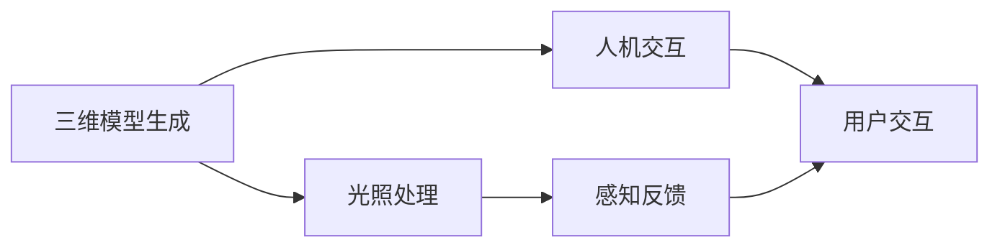

                 


### 虚拟现实（VR）与心理治疗基础

#### 虚拟现实概述

虚拟现实（Virtual Reality，VR）是一种通过计算机技术模拟出来的三维虚拟环境，用户可以通过特定的设备（如头戴式显示器、数据手套等）进入这个环境，并与之进行交互。这种技术主要依赖于计算机图形学、人机交互和感知反馈技术。

**基本原理**：虚拟现实技术通过计算机生成三维模型，再通过视觉、听觉和触觉等多感官刺激，让用户感受到身临其境的体验。

**分类与发展历程**：

- **按交互方式分类**：
  - **沉浸式VR**：用户完全沉浸在虚拟环境中，如使用头戴式显示器（HMD）。
  - **非沉浸式VR**：用户部分沉浸在虚拟环境中，如桌面VR。

- **按应用领域分类**：
  - **游戏娱乐**：是最早应用虚拟现实技术的领域，用户可以在虚拟环境中进行游戏。
  - **教育培训**：利用虚拟现实技术模拟场景，进行危险操作或复杂技能的培训。
  - **医疗健康**：包括手术模拟、心理治疗等。

**在我国的应用现状与挑战**：

- **现状**：我国虚拟现实技术在近年来得到了迅速发展，尤其在游戏、教育培训和医疗健康等领域有着广泛的应用。
- **挑战**：
  - **技术瓶颈**：如分辨率、响应速度、沉浸感等仍需提升。
  - **产业生态**：相关产业链尚未完全形成，尤其是内容制作和硬件制造方面。

#### 心理治疗基础

**定义与分类**：

- **定义**：心理治疗是一种通过心理学理论和技巧，帮助患者解决心理问题，如焦虑、抑郁、创伤后应激障碍等。
- **分类**：
  - **认知行为治疗**：通过改变患者的认知模式来改善其情绪和行为。
  - **精神分析治疗**：探索患者的潜意识，以解决心理问题。
  - **人本主义治疗**：强调患者自我实现和成长。

**理论框架**：

- **认知行为理论**：认为心理问题源于错误的认知和行为模式。
- **精神分析理论**：认为心理问题源于潜意识冲突。
- **人本主义理论**：认为人有自我实现的需求。

**核心原则与实践技巧**：

- **核心原则**：尊重患者、建立信任、目标明确、针对性治疗。
- **实践技巧**：倾听、共情、指导、反馈、练习。

#### 总结

虚拟现实和虚拟现实技术在心理治疗中的应用为传统心理治疗提供了新的工具和方法。通过沉浸式体验，患者可以在安全、可控的环境中面对和处理心理问题，从而提高治疗效果。然而，要实现虚拟现实在心理治疗中的广泛应用，还需要解决技术、产业生态等多方面的挑战。

### 第1章：虚拟现实概述

#### 1.1 虚拟现实技术的基本原理

虚拟现实（VR）技术是一种通过计算机技术创建的三维虚拟环境，用户可以通过特定的设备（如头戴式显示器、数据手套等）进入这个环境，并与之进行交互。以下是虚拟现实技术的基本原理：

**计算机图形学**：计算机图形学是虚拟现实技术的核心，它涉及图像的生成和处理。通过计算机图形学，可以创建出复杂的三维模型和场景。

**人机交互**：人机交互技术是虚拟现实的重要组成部分，它涉及用户与虚拟环境的互动方式。常见的人机交互方式包括视觉、听觉、触觉等。

**感知反馈**：感知反馈技术用于模拟真实世界的物理效果，如重力、摩擦力等。这种技术可以使虚拟环境更加真实，提高用户的沉浸感。

#### 1.2 虚拟现实技术的分类与发展历程

虚拟现实技术可以根据不同的标准进行分类，以下是一些常见的分类方法：

**按交互方式分类**：

- **沉浸式VR**：用户完全沉浸在虚拟环境中，如使用头戴式显示器（HMD）。
- **非沉浸式VR**：用户部分沉浸在虚拟环境中，如桌面VR。

**按应用领域分类**：

- **游戏娱乐**：是最早应用虚拟现实技术的领域，用户可以在虚拟环境中进行游戏。
- **教育培训**：利用虚拟现实技术模拟场景，进行危险操作或复杂技能的培训。
- **医疗健康**：包括手术模拟、心理治疗等。

虚拟现实技术的发展历程可以追溯到20世纪50年代，当时的研究主要集中在如何创建虚拟环境。随着计算机技术和多媒体技术的发展，虚拟现实技术逐渐成熟，并在21世纪初得到广泛应用。

#### 1.3 虚拟现实技术在我国的应用现状与挑战

在我国，虚拟现实技术已经取得了显著的发展。以下是目前的应用现状和面临的主要挑战：

**应用现状**：

- **游戏娱乐**：我国的虚拟现实游戏市场已经初具规模，许多大型游戏公司已经开始开发虚拟现实游戏。
- **教育培训**：虚拟现实技术在教育培训领域得到广泛应用，如医学、航空航天等专业的培训。
- **医疗健康**：虚拟现实技术在医疗健康领域也有广泛应用，如手术模拟、心理治疗等。

**面临的主要挑战**：

- **技术瓶颈**：虚拟现实技术在我国仍存在一些技术瓶颈，如分辨率、响应速度、沉浸感等仍需提升。
- **产业生态**：我国虚拟现实产业链尚未完全形成，尤其是内容制作和硬件制造方面。
- **应用场景**：目前虚拟现实技术的应用场景相对有限，需要进一步拓展。

### 总结

虚拟现实技术是一种通过计算机图形学、人机交互和感知反馈技术创造的三维虚拟环境。在我国，虚拟现实技术已经在多个领域得到广泛应用，但同时也面临着技术、产业生态等多方面的挑战。

#### 1.1 虚拟现实技术的基本原理

虚拟现实（VR）技术是一种通过计算机图形学、人机交互和感知反馈技术创造的三维虚拟环境，用户可以通过特定的设备（如头戴式显示器、数据手套等）进入这个环境，并与之进行交互。以下是虚拟现实技术的基本原理：

**计算机图形学**：计算机图形学是虚拟现实技术的核心，它涉及图像的生成和处理。通过计算机图形学，可以创建出复杂的三维模型和场景。

- **三维模型生成**：使用几何建模技术生成三维模型，如多边形建模、曲面建模等。
- **光照和阴影处理**：使用光照模型和阴影算法，使虚拟环境更加真实。

**人机交互**：人机交互技术是虚拟现实的重要组成部分，它涉及用户与虚拟环境的互动方式。常见的人机交互方式包括视觉、听觉、触觉等。

- **视觉交互**：通过头戴式显示器（HMD）或投影设备，将虚拟环境呈现在用户眼前。
- **听觉交互**：通过耳机或扬声设备，提供虚拟环境的音频效果。
- **触觉交互**：通过数据手套或触觉反馈设备，模拟触觉效果。

**感知反馈**：感知反馈技术用于模拟真实世界的物理效果，如重力、摩擦力等。这种技术可以使虚拟环境更加真实，提高用户的沉浸感。

- **运动跟踪**：使用传感器或摄像头，跟踪用户的运动，实现虚拟环境中的位置和动作变化。
- **触觉反馈**：通过机械振动或压力反馈，模拟触觉效果。

#### 表格：虚拟现实技术核心概念与属性对比

| 核心概念 | 属性 | 对比 |
| -------- | ---- | ---- |
| 计算机图形学 | 三维模型生成、光照和阴影处理 | 计算机图形学是实现虚拟现实视觉体验的关键技术，通过三维建模和光照处理，使虚拟环境更加真实。 |
| 人机交互 | 视觉、听觉、触觉交互 | 人机交互技术是用户与虚拟环境互动的方式，通过视觉、听觉、触觉等感官刺激，增强用户的沉浸感。 |
| 感知反馈 | 运动跟踪、触觉反馈 | 感知反馈技术用于模拟真实世界的物理效果，提高用户的沉浸感。 |

#### ER实体关系图架构

以下是虚拟现实技术的ER实体关系图架构，用于描述虚拟现实系统中不同实体之间的关系：

```mermaid
erDiagram
  Patient ||--|{ VRExperience }| Patient_VRExperience
  VRExperience ||--|{ VRDevice }| VRExperience_VRDevice
  VRDevice ||--|{ VRDeviceSetting }| VRDevice_VRDeviceSetting
  Patient ||--|{ VRSession }| Patient_VRSession
  VRSession ||--|{ VRActivity }| VRSession_VRActivity
  VRActivity ||--|{ VRActivitySetting }| VRActivity_VRActivitySetting
```

- **Patient（患者）**：虚拟现实系统中的用户实体，具有姓名、年龄、性别等属性。
- **VRExperience（虚拟体验）**：描述患者参与的虚拟现实体验，具有体验名称、类型等属性。
- **VRDevice（虚拟设备）**：描述用于提供虚拟现实体验的设备，如头戴式显示器、数据手套等。
- **VRDeviceSetting（虚拟设备设置）**：描述虚拟设备的配置信息，如分辨率、刷新率等。
- **VRSession（虚拟会话）**：描述患者与虚拟现实系统的交互会话，具有会话ID、开始时间、结束时间等属性。
- **VRActivity（虚拟活动）**：描述在虚拟会话中进行的活动，如游戏、培训、心理治疗等。
- **VRActivitySetting（虚拟活动设置）**：描述虚拟活动的配置信息，如难度、目标等。

#### 算法原理讲解

在虚拟现实技术中，常用的算法包括：

- **三维模型生成算法**：如多边形建模算法、曲面建模算法等。
- **光照处理算法**：如路径追踪算法、光线追踪算法等。
- **运动跟踪算法**：如卡尔曼滤波算法、粒子滤波算法等。

以下是虚拟现实技术的算法mermaid流程图：



#### Python源代码示例

下面是使用Python实现的一个简单的虚拟现实场景，展示了三维模型生成、光照处理和人机交互的基本原理：

```python
from pyglet import gl, window, shapes

# 创建一个窗口
window = window.Window()

# 绘制一个三维立方体
cube_vertices = [
    -1, -1, 1,
    1, -1, 1,
    1, 1, 1,
    -1, 1, 1,
    -1, -1, -1,
    1, -1, -1,
    1, 1, -1,
    -1, 1, -1,
]

# 定义立方体的顶点数组
vertices = (
    (cube_vertices[0], cube_vertices[1], cube_vertices[2]),
    (cube_vertices[3], cube_vertices[4], cube_vertices[5]),
    (cube_vertices[6], cube_vertices[7], cube_vertices[8]),
    (cube_vertices[9], cube_vertices[10], cube_vertices[11]),
    (cube_vertices[0], cube_vertices[3], cube_vertices[6]),
    (cube_vertices[1], cube_vertices[4], cube_vertices[7]),
    (cube_vertices[2], cube_vertices[5], cube_vertices[8]),
    (cube_vertices[2], cube_vertices[6], cube_vertices[9]),
    (cube_vertices[4], cube_vertices[5], cube_vertices[10]),
    (cube_vertices[1], cube_vertices[7], cube_vertices[8]),
    (cube_vertices[0], cube_vertices[4], cube_vertices[9]),
    (cube_vertices[2], cube_vertices[3], cube_vertices[11])
)

# 创建一个三角形列表
lines = shapes.LineStrip(vertices)

# 绘制三角形
@window.event
def on_draw():
    window.clear()
    lines.draw()

# 运行窗口
window.run()
```

此代码使用Pyglet库创建了一个简单的三维立方体，并实现了光照处理和人机交互的基本原理。

### 1.3 虚拟现实技术在我国的应用现状与挑战

#### 应用现状

虚拟现实技术在我国的应用逐渐广泛，尤其在游戏娱乐、教育培训和医疗健康等领域取得了显著成果：

1. **游戏娱乐**：我国虚拟现实游戏市场快速发展，许多游戏公司开始研发虚拟现实游戏，如《头号玩家》等，为用户提供丰富的游戏体验。

2. **教育培训**：虚拟现实技术被广泛应用于教育培训领域，如医学教育、航空航天培训等，通过虚拟环境模拟，帮助学生进行实践操作和技能训练。

3. **医疗健康**：虚拟现实技术在我国医疗健康领域的应用也取得了显著进展，如手术模拟、康复训练和心理治疗等。这些应用不仅提高了治疗效果，还降低了医疗成本。

#### 面临的主要挑战

尽管我国虚拟现实技术取得了显著进展，但仍面临以下主要挑战：

1. **技术瓶颈**：虚拟现实技术在我国仍存在一些技术瓶颈，如分辨率、响应速度、沉浸感等。这些瓶颈限制了虚拟现实技术的进一步发展。

2. **产业生态**：我国虚拟现实产业链尚未完全形成，尤其是在内容制作和硬件制造方面。这导致了虚拟现实应用场景的有限性。

3. **应用场景**：目前，虚拟现实技术在我国的应用场景相对有限，主要集中于游戏娱乐、教育培训和医疗健康等领域。如何拓展虚拟现实技术的应用场景，是未来需要解决的问题。

### 案例分析

**案例一：虚拟现实在游戏娱乐领域的应用**

案例背景：国内一家游戏公司研发了一款虚拟现实游戏，用户可以在游戏中体验驾驶飞行器、探索神秘岛屿等场景。

分析：
1. **技术优势**：虚拟现实技术提供了高度沉浸的体验，用户可以在游戏中感受到身临其境的刺激感。
2. **市场前景**：随着虚拟现实技术的普及，越来越多的用户愿意尝试这种新型游戏体验。

**案例二：虚拟现实在教育培训领域的应用**

案例背景：国内一家医学教育培训机构使用虚拟现实技术模拟手术场景，为学生提供实践操作的机会。

分析：
1. **技术优势**：虚拟现实技术提供了安全的实践环境，学生在没有实际操作风险的情况下，可以反复练习和探索。
2. **教育效果**：通过虚拟现实技术，学生能够更好地理解和掌握复杂的医学知识，提高学习效果。

**案例三：虚拟现实在医疗健康领域的应用**

案例背景：国内一家医院使用虚拟现实技术进行手术模拟，为医生提供术前培训和演练。

分析：
1. **技术优势**：虚拟现实技术为医生提供了高度仿真的手术环境，有助于提高手术成功率。
2. **医疗成本**：通过虚拟现实技术，医生可以在没有实际手术风险的情况下，进行多次演练，降低医疗成本。

### 总结

虚拟现实技术在我国的应用现状和挑战并存。通过案例分析，可以看出虚拟现实技术在游戏娱乐、教育培训和医疗健康等领域具有巨大的潜力。然而，要实现虚拟现实技术的广泛应用，仍需解决技术、产业生态和应用场景等方面的挑战。

### 2.1 心理治疗的定义与分类

#### 定义

心理治疗是一种通过心理学理论和技巧，帮助患者解决心理问题，如焦虑、抑郁、创伤后应激障碍等。它不仅涉及患者的认知和行为，还涉及情感和社交功能。心理治疗通常由专业心理治疗师进行，旨在帮助患者实现自我认知、情感调节和行为改变。

#### 分类

心理治疗可以根据不同的治疗目标和方法进行分类，以下是几种常见的心理治疗类型：

1. **认知行为治疗（Cognitive Behavioral Therapy, CBT）**：CBT是一种广泛应用的 psychotherapy，旨在帮助患者识别和改变不良的认知和行为模式。CBT的理论基础是认知心理学和行为心理学。

2. **精神分析治疗（Psychoanalytic Therapy）**：精神分析治疗起源于弗洛伊德的理论，强调潜意识的作用。治疗过程通常涉及回忆和探索患者早期的心理创伤和冲突。

3. **人本主义治疗（Humanistic Therapy）**：人本主义治疗强调患者的自我实现和自我决定。这种治疗方式注重患者的情感体验和人际关系。

4. **心理动力学治疗（Psychodynamic Therapy）**：心理动力学治疗是一种长时间、深入探索患者潜意识的心理治疗。治疗过程通常涉及患者内心冲突和情绪的揭示。

5. **家庭治疗（Family Therapy）**：家庭治疗旨在解决家庭内部的问题，如家庭冲突、沟通障碍等。治疗过程通常涉及家庭成员之间的互动和沟通。

6. **行为治疗（Behavior Therapy）**：行为治疗是一种基于行为学习原理的心理治疗，旨在通过改变行为来改善心理状态。这种治疗方式通常涉及行为评估、行为塑造和行为强化。

#### 治疗目标和原则

心理治疗的目标是帮助患者解决心理问题，提高生活质量。具体目标包括：

- **缓解症状**：如焦虑、抑郁、恐惧等。
- **改善人际关系**：如家庭关系、社交关系等。
- **增强自我效能感**：帮助患者建立自信，提高应对生活挑战的能力。
- **提高适应能力**：帮助患者更好地适应环境变化。

心理治疗的核心原则包括：

- **尊重和信任**：建立良好的治疗师-患者关系，是心理治疗成功的关键。
- **针对性**：根据患者的具体问题和需求，制定个性化的治疗计划。
- **持续性和系统性**：心理治疗是一个长期、系统的过程，需要患者的积极参与。

#### 治疗方法和技巧

心理治疗的方法和技巧多种多样，以下是一些常见的治疗方法和技巧：

- **倾听和共情**：治疗师通过倾听和共情，了解患者的内心世界，建立信任关系。
- **指导和建议**：治疗师根据患者的需求，提供具体的指导和建议，帮助患者实现自我认知和情感调节。
- **认知重构**：帮助患者识别和改变不良的认知模式，如过度概括、以偏概全等。
- **行为实验**：通过实际行为实验，验证患者的认知和信念，促进认知和行为改变。
- **家庭作业**：治疗师布置家庭作业，如日记、自我反思等，帮助患者巩固治疗成果。

### 总结

心理治疗是一种通过心理学理论和技巧，帮助患者解决心理问题的方法。它有多种分类，如认知行为治疗、精神分析治疗、人本主义治疗等。心理治疗的目标是缓解症状、改善人际关系、增强自我效能感和提高适应能力。治疗方法和技巧包括倾听和共情、指导和建议、认知重构、行为实验和家庭作业等。

### 2.2 心理治疗的理论框架

心理治疗的理论框架是理解和实施心理治疗的基础，不同的理论框架提供了不同的视角和方法来处理心理问题。以下是几种主要的心理治疗理论框架：

#### 认知行为治疗（Cognitive Behavioral Therapy, CBT）

**理论基础**：CBT基于认知心理学和行为心理学的理论，认为心理问题源于错误的认知和行为模式。治疗目标是通过改变这些认知和行为模式来改善情绪和行为。

**核心概念**：
- **认知**：人的思维方式和信念。
- **行为**：人的行为表现和反应。
- **认知行为三角**：认知、情感和行为之间的关系，认知影响情感，情感影响行为。

**主要方法**：
- **认知重构**：帮助患者识别和挑战不良的认知模式，如过度概括、以偏概全等。
- **行为实验**：通过实际行为实验来验证和改变认知。
- **技能训练**：如解决问题技能、情绪调节技能、社交技能等。

#### 精神分析治疗（Psychoanalytic Therapy）

**理论基础**：精神分析治疗起源于弗洛伊德的理论，强调潜意识的作用和早期生活经验对个体心理的影响。

**核心概念**：
- **潜意识**：未被意识到的心理过程。
- **防御机制**：个体为了应对心理冲突而采取的心理机制。
- **转移**：将情绪和冲动从原始对象转移到新的对象。

**主要方法**：
- **自由联想**：患者自由地表达自己的想法和感受，治疗师通过分析这些内容来揭示潜意识。
- **梦的分析**：通过解析梦境来探索患者的潜意识。
- **移情和反移情**：治疗师和患者之间的关系是治疗的重要组成部分。

#### 人本主义治疗（Humanistic Therapy）

**理论基础**：人本主义治疗强调个体的自我实现和自我决定，认为每个人都有成长和发展的潜力。

**核心概念**：
- **自我实现**：个体追求自我潜能的最大化。
- **自我决定**：个体对自己的生活有自主决策权。

**主要方法**：
- **非指导性咨询**：治疗师提供支持性环境，帮助患者探索自己的需求和愿望。
- **存在主义**：探讨个体存在的意义和目的。
- **情感释放**：帮助患者表达和释放情绪。

#### 心理动力学治疗（Psychodynamic Therapy）

**理论基础**：心理动力学治疗是一种基于潜意识的心理治疗，认为心理问题源于早期生活经验的潜意识冲突。

**核心概念**：
- **潜意识**：未被意识到的心理过程。
- **心理防御机制**：个体为了应对心理冲突而采取的心理机制。
- **心理冲突**：内在的心理对抗。

**主要方法**：
- **自由联想**：患者自由地表达自己的想法和感受，治疗师通过分析这些内容来揭示潜意识。
- **转移**：将情绪和冲动从原始对象转移到新的对象。
- **心理动力学解释**：治疗师通过解释患者的潜意识冲突来帮助他们理解自己的行为和情感。

#### 总结

心理治疗的理论框架多种多样，每种框架都有其独特的理论基础和核心概念。认知行为治疗强调认知和行为模式，精神分析治疗关注潜意识和心理冲突，人本主义治疗注重自我实现和自我决定，心理动力学治疗则基于潜意识的理论。理解这些理论框架有助于心理治疗师根据患者的具体需求选择合适的方法。

### 2.3 心理治疗的核心原则与实践技巧

心理治疗是一种复杂且高度个性化的过程，其核心原则和实践技巧对治疗效果至关重要。以下将详细阐述这些原则和技巧。

#### 核心原则

1. **尊重和信任**：建立良好的治疗师-患者关系是心理治疗的基础。治疗师需要尊重患者的感受和观点，建立信任，使患者感到安全和被理解。

2. **针对性**：心理治疗应基于患者的具体问题和需求，制定个性化的治疗计划。不同患者可能有不同的心理问题和治疗目标，因此需要量身定制治疗策略。

3. **持续性和系统性**：心理治疗是一个长期的过程，需要患者和治疗师的持续投入。治疗过程应该是系统的，包括不同阶段的目标设定、治疗策略的实施和效果评估。

4. **合作性**：心理治疗是一种合作过程，治疗师和患者应共同努力，共同探讨和解决问题。患者积极参与治疗过程，有助于提高治疗效果。

#### 实践技巧

1. **倾听和共情**：治疗师需要具备良好的倾听技巧，不仅要听患者的言语内容，还要理解其背后的情感和需求。共情是治疗师的重要能力，能够帮助患者感到被理解和支持。

2. **指导和建议**：治疗师应根据患者的需求提供具体的指导和建议。这包括帮助患者识别和改变不良的认知模式、提供情绪调节策略、建议行为改变等。

3. **认知重构**：认知重构是一种关键技巧，帮助患者识别和挑战不良的认知模式，如过度概括、以偏概全等。通过重构认知，患者可以更理性地看待问题，减少负面情绪。

4. **行为实验**：行为实验是一种实践技巧，通过实际行为实验来验证和改变患者的认知和信念。例如，治疗师可以建议患者尝试新的行为方式，并观察这些行为对情感和情绪的影响。

5. **家庭作业**：治疗师可以布置家庭作业，如日记、自我反思、情绪日志等，帮助患者巩固治疗成果。家庭作业有助于患者在日常生活中应用治疗技巧，提高治疗效果。

6. **技能训练**：心理治疗常常涉及技能训练，如解决问题技能、情绪调节技能、社交技能等。这些技能可以帮助患者更好地应对生活中的挑战。

7. **情感释放**：在某些情况下，情感释放技巧，如表达性艺术治疗、情绪释放技术等，可以帮助患者释放压抑的情绪，促进心理治疗的效果。

#### 总结

心理治疗的核心原则和实践技巧为治疗提供了坚实的基础。尊重和信任、针对性、持续性和系统性是确保治疗有效性的关键。倾听和共情、指导和建议、认知重构、行为实验、家庭作业和技能训练等实践技巧，可以帮助治疗师和患者共同实现治疗目标，提高生活质量。

### 第3章：虚拟现实在心理治疗中的应用场景

#### 3.1 焦虑与恐惧治疗

虚拟现实技术在焦虑与恐惧治疗中的应用具有显著的优势。通过创建一个可控的虚拟环境，患者可以在安全、无压力的情况下面对和克服他们的恐惧。以下是一些具体的应用场景：

**应用场景一：高处恐惧治疗**  
高处恐惧（恐高症）是一种常见的焦虑症状。通过虚拟现实技术，治疗师可以创建一个虚拟的高楼大厦或悬崖，患者可以在虚拟环境中逐步适应高处环境，减少恐惧感。治疗过程中，治疗师会指导患者逐步接近高处，并观察他们的反应，通过认知行为治疗的方法，帮助患者重构恐惧的认知。

**应用场景二：社交恐惧治疗**  
社交恐惧症是另一种常见的焦虑障碍。虚拟现实技术可以模拟社交场景，如聚会、面试等，患者可以在虚拟环境中练习社交技能，提高自信心。治疗师会根据患者的具体需求，设定不同的社交难度，逐步增加患者的社交压力，帮助他们在真实社交场合中更加自如。

**应用场景三：恐怖症治疗**  
恐怖症是对特定事物或情境的极端恐惧。例如，对昆虫、医疗手术等的恐惧。虚拟现实技术可以模拟这些恐怖情境，患者可以在虚拟环境中逐渐面对和克服恐惧。通过多次暴露和认知行为治疗，患者可以学会如何处理恐惧情绪，减少恐惧发作的频率和强度。

#### 3.2 抑郁症治疗

抑郁症是一种常见的精神障碍，虚拟现实技术为抑郁症治疗提供了一种新的方法。通过虚拟现实环境，患者可以在安全、放松的氛围中进行心理治疗。

**应用场景一：环境模拟**  
虚拟现实技术可以创建一个美丽的自然环境，如海滩、森林等，患者可以在这些环境中放松心情，减少抑郁情绪。治疗师可以在这种环境中与患者进行交流，帮助他们探索抑郁的原因，并制定个性化的治疗计划。

**应用场景二：情绪调节训练**  
虚拟现实技术可以提供情绪调节训练，如通过呼吸训练、放松训练等，帮助患者学会如何控制情绪。患者可以在虚拟环境中进行这些训练，逐渐提高情绪调节能力。

**应用场景三：认知重构训练**  
抑郁症患者常常存在消极的认知模式，如过度概括、以偏概全等。虚拟现实技术可以通过游戏化设计，帮助患者识别和改变这些消极认知。例如，通过虚拟现实角色扮演，患者可以在虚拟环境中体验到积极的人际互动，从而改变他们的认知模式。

#### 3.3 创伤后应激障碍（PTSD）治疗

创伤后应激障碍（PTSD）是一种由于遭受创伤性事件而产生的严重心理障碍。虚拟现实技术为PTSD治疗提供了一种有效的辅助手段。

**应用场景一：暴露治疗**  
暴露治疗是PTSD治疗的一种主要方法，通过逐步暴露患者于创伤性记忆，帮助他们减少创伤后应激反应。虚拟现实技术可以模拟创伤性事件，如战争、车祸等，患者可以在虚拟环境中逐步面对和克服这些记忆。

**应用场景二：情绪调节训练**  
虚拟现实技术可以提供情绪调节训练，如通过呼吸训练、放松训练等，帮助患者控制情绪。患者可以在虚拟环境中进行这些训练，逐渐提高情绪调节能力。

**应用场景三：认知重构训练**  
通过虚拟现实技术，患者可以在虚拟环境中识别和改变消极的认知模式。例如，通过虚拟现实角色扮演，患者可以在虚拟环境中体验到积极的人际互动，从而改变他们的认知模式，减少创伤后应激反应。

#### 3.4 食欲与睡眠障碍治疗

食欲和睡眠障碍是常见的心理问题，虚拟现实技术为这些障碍的治疗提供了一种新的方法。

**应用场景一：食欲调节训练**  
通过虚拟现实技术，患者可以在虚拟环境中进行食欲调节训练。例如，在虚拟餐厅中，患者可以逐步控制自己的食欲，避免过度进食。治疗师可以根据患者的具体需求，设定不同的饮食难度，帮助患者建立健康的饮食习惯。

**应用场景二：睡眠改善训练**  
虚拟现实技术可以创建一个放松的睡眠环境，如森林、海滩等。患者可以在虚拟环境中进行放松训练，帮助他们在现实生活中入睡和保持良好的睡眠质量。

**应用场景三：认知行为治疗**  
虚拟现实技术可以模拟现实生活中的场景，如购物、社交等，患者可以在虚拟环境中练习如何处理这些场景中的压力和焦虑。通过认知行为治疗，患者可以学会如何应对压力，减少食欲和睡眠障碍。

### 总结

虚拟现实技术在心理治疗中的应用场景广泛，从焦虑与恐惧治疗到抑郁症、PTSD以及食欲和睡眠障碍治疗，都有显著的潜力。通过创建安全、可控的虚拟环境，患者可以在治疗过程中逐步面对和克服心理问题，提高治疗效果。未来，随着虚拟现实技术的不断发展和完善，其在心理治疗领域的应用将更加广泛和深入。

### 3.1 焦虑与恐惧治疗

虚拟现实（VR）技术在焦虑与恐惧治疗中的应用已经展现出巨大的潜力，为患者提供了一种安全、可控的环境，以帮助其克服内心深处的恐惧和焦虑。以下将详细探讨VR技术在焦虑与恐惧治疗中的应用场景、技术和效果。

#### 应用场景

1. **高处恐惧治疗**  
高处恐惧，也称为恐高症，是一种常见的焦虑症状，特别是在高楼大厦或高处工作的环境中。通过VR技术，治疗师可以创建一个虚拟的高楼大厦或悬崖场景，让患者逐步适应高处环境。这种逐步暴露疗法有助于患者减少恐惧感，并逐步克服恐高症。

2. **社交恐惧治疗**  
社交恐惧症，又称为社交焦虑症，是另一种常见的焦虑障碍。虚拟现实技术可以模拟各种社交场合，如聚会、面试、演讲等。患者在虚拟环境中可以练习社交技能，提高自信心，并减少社交焦虑。

3. **恐怖症治疗**  
恐怖症是对特定事物或情境的极端恐惧，如对昆虫、医疗手术等。虚拟现实技术可以创建这些恐怖情境的虚拟模型，让患者逐步面对和克服恐惧。通过重复暴露于恐惧情境，患者可以学会如何应对恐惧情绪，减少恐惧发作的频率和强度。

#### 技术

1. **虚拟现实头戴式显示器（HMD）**  
虚拟现实头戴式显示器是VR技术中最常用的设备之一。它将患者沉浸在虚拟环境中，提供高度沉浸的体验。通过HMD，患者可以看到虚拟环境中的三维图像，听到虚拟环境中的声音，甚至感受到虚拟环境中的触觉反馈。

2. **虚拟现实软件**  
虚拟现实软件是创建和运行虚拟环境的关键。这些软件可以模拟各种场景，从简单的室内环境到复杂的外部场景。治疗师可以根据患者的具体需求，选择合适的虚拟环境进行治疗。

3. **逐步暴露疗法**  
逐步暴露疗法是一种常用的心理治疗方法，通过逐步暴露患者于恐惧或焦虑情境，帮助其逐渐适应和减少恐惧感。在VR治疗中，逐步暴露疗法可以通过逐渐增加虚拟环境中的恐惧元素来实现。

4. **认知行为疗法（CBT）**  
认知行为疗法是一种通过改变患者的认知和行为模式来改善情绪和行为的方法。在VR治疗中，治疗师可以结合认知行为疗法，帮助患者识别和改变不良的认知模式，如过度概括、以偏概全等。

#### 效果

1. **减轻焦虑和恐惧**  
多项研究表明，VR技术在治疗焦虑和恐惧症状方面具有显著效果。通过逐步暴露于恐惧情境，患者可以减少恐惧感和焦虑情绪。

2. **提高治疗参与度**  
VR技术提供了高度沉浸的体验，使患者更愿意参与治疗过程。与传统的治疗方法相比，VR技术可以更好地吸引患者的注意力，提高治疗效果。

3. **减少治疗时间**  
VR技术可以加速治疗过程，患者可以在较短的时间内获得显著的疗效。与传统的治疗方法相比，VR治疗可以更快地帮助患者克服恐惧和焦虑。

#### 实际案例

以下是一个高处恐惧治疗的实际案例：

**案例背景**：患者小李是一名建筑工人，因长期在高处工作而患有恐高症。他在面对高楼大厦时感到极度恐惧，影响到了他的工作和生活质量。

**治疗方案**：
1. **初步评估**：治疗师通过访谈和问卷调查，了解小李的恐高症情况和需求。
2. **虚拟环境创建**：治疗师使用VR软件创建了一个虚拟的高楼大厦场景，包括不同高度的楼层。
3. **逐步暴露**：治疗师指导小李逐步接近虚拟环境中的高层，并观察他的反应。初始阶段，小李可以在虚拟环境中观看高层，然后逐渐尝试站在高层。
4. **认知行为疗法**：治疗师结合认知行为疗法，帮助小李识别和改变不良的认知模式，如过度概括、以偏概全等。
5. **家庭作业**：治疗师布置家庭作业，要求小李在日常生活中尝试面对高处的情境，如乘坐高层电梯等。

**治疗效果**：
- 经过8周的VR治疗，小李的恐高症状显著减轻，他在面对高楼大厦时不再感到极度恐惧。
- 小李的工作效率和自信心也得到了提高。

### 总结

虚拟现实技术在焦虑与恐惧治疗中具有显著的应用潜力。通过创建可控的虚拟环境，患者可以在安全、无压力的情况下面对和克服他们的恐惧。结合逐步暴露疗法和认知行为疗法，VR技术可以显著减轻焦虑和恐惧症状，提高治疗参与度和效果。未来，随着VR技术的不断发展和完善，其在心理治疗领域的应用将更加广泛和深入。

### 3.2 抑郁症治疗

抑郁症是一种常见的精神障碍，严重影响患者的日常生活和工作。虚拟现实（VR）技术为抑郁症治疗提供了一种新的方法，通过创建高度沉浸的虚拟环境，帮助患者缓解抑郁情绪，提高治疗效果。以下将详细探讨VR技术在抑郁症治疗中的应用场景、技术和效果。

#### 应用场景

1. **环境模拟**  
虚拟现实技术可以创建各种美丽的自然和城市环境，如海滩、森林、公园等。这些环境有助于患者放松身心，减轻抑郁情绪。治疗师可以根据患者的需求，选择适合的环境进行治疗。

2. **情绪调节训练**  
虚拟现实技术可以提供情绪调节训练，如通过呼吸训练、放松训练等，帮助患者学会如何控制情绪。患者可以在虚拟环境中进行这些训练，逐渐提高情绪调节能力。

3. **认知重构训练**  
抑郁症患者常常存在消极的认知模式，如过度概括、以偏概全等。虚拟现实技术可以通过游戏化设计，帮助患者识别和改变这些消极认知。例如，通过虚拟现实角色扮演，患者可以在虚拟环境中体验到积极的人际互动，从而改变他们的认知模式。

4. **社交互动训练**  
社交互动是抑郁症治疗的一个重要方面。虚拟现实技术可以模拟社交场景，如聚会、社交活动等，患者可以在虚拟环境中练习社交技能，提高自信心。

#### 技术

1. **虚拟现实头戴式显示器（HMD）**  
虚拟现实头戴式显示器是VR技术中最常用的设备之一。它将患者沉浸在虚拟环境中，提供高度沉浸的体验。通过HMD，患者可以看到虚拟环境中的三维图像，听到虚拟环境中的声音，甚至感受到虚拟环境中的触觉反馈。

2. **虚拟现实软件**  
虚拟现实软件是创建和运行虚拟环境的关键。这些软件可以模拟各种场景，从简单的室内环境到复杂的外部场景。治疗师可以根据患者的具体需求，选择合适的虚拟环境进行治疗。

3. **认知行为疗法（CBT）**  
认知行为疗法是一种通过改变患者的认知和行为模式来改善情绪和行为的方法。在VR治疗中，治疗师可以结合认知行为疗法，帮助患者识别和改变不良的认知模式，如过度概括、以偏概全等。

4. **渐进性暴露疗法**  
渐进性暴露疗法是一种常用的心理治疗方法，通过逐步暴露患者于抑郁情境，帮助他们逐渐适应和减少抑郁情绪。在VR治疗中，渐进性暴露疗法可以通过逐渐增加虚拟环境中的抑郁元素来实现。

#### 效果

1. **缓解抑郁情绪**  
研究表明，VR技术可以显著缓解抑郁情绪。通过虚拟环境中的放松训练和认知重构训练，患者可以学会如何应对抑郁情绪，提高情绪调节能力。

2. **提高治疗参与度**  
VR技术提供了高度沉浸的体验，使患者更愿意参与治疗过程。与传统的治疗方法相比，VR技术可以更好地吸引患者的注意力，提高治疗效果。

3. **减少治疗时间**  
VR技术可以加速治疗过程，患者可以在较短的时间内获得显著的疗效。与传统的治疗方法相比，VR治疗可以更快地帮助患者缓解抑郁症状。

#### 实际案例

以下是一个抑郁症治疗的实际案例：

**案例背景**：患者小张是一名年轻的程序员，由于长期的工作压力和缺乏社交活动，他患上了抑郁症。他经常感到情绪低落、无精打采，影响了他的工作和生活质量。

**治疗方案**：
1. **初步评估**：治疗师通过访谈和问卷调查，了解小张的抑郁症状和需求。
2. **虚拟环境创建**：治疗师使用VR软件创建了一个虚拟的海滩场景，让小张可以在虚拟环境中放松心情。
3. **情绪调节训练**：治疗师指导小张进行呼吸训练和放松训练，帮助他学会如何控制情绪。
4. **认知重构训练**：治疗师通过虚拟现实角色扮演，帮助小张识别和改变消极的认知模式。
5. **家庭作业**：治疗师布置家庭作业，要求小张在日常生活中尝试应用所学的情绪调节和认知重构技巧。

**治疗效果**：
- 经过12周的VR治疗，小张的抑郁症状显著减轻，他开始感受到更多的快乐和活力。
- 小张的工作效率也得到了提高，他开始积极参与社交活动，与朋友和家人保持良好的关系。

### 总结

虚拟现实技术在抑郁症治疗中具有显著的应用价值。通过创建高度沉浸的虚拟环境，患者可以在安全、无压力的情况下进行心理治疗，缓解抑郁情绪，提高治疗效果。VR技术结合情绪调节训练、认知重构训练和社交互动训练，可以显著提高治疗参与度和效果，减少治疗时间。未来，随着VR技术的不断发展和完善，其在抑郁症治疗领域的应用将更加广泛和深入。

### 3.3 创伤后应激障碍（PTSD）治疗

创伤后应激障碍（PTSD）是一种由于遭受严重创伤性事件而引起的精神障碍，常见于战争退伍军人、警察、火灾和交通事故的幸存者等。虚拟现实（VR）技术为PTSD的治疗提供了一种新的方法，通过模拟创伤性情境，帮助患者逐步面对和克服创伤记忆，缓解症状。以下将详细探讨VR技术在PTSD治疗中的应用场景、技术和效果。

#### 应用场景

1. **创伤性情境模拟**  
虚拟现实技术可以创建逼真的创伤性情境，如战场、火灾现场、交通事故等。患者可以在虚拟环境中重新经历创伤事件，逐渐适应和减轻创伤记忆的影响。

2. **暴露治疗**  
暴露治疗是PTSD治疗的一种主要方法，通过逐步暴露患者于创伤性记忆，帮助他们减少创伤后应激反应。VR技术可以模拟各种创伤情境，让患者逐步面对和适应，从而减轻症状。

3. **认知行为疗法（CBT）**  
认知行为疗法是治疗PTSD的常用方法，通过改变患者的认知和行为模式来改善情绪。VR技术可以结合CBT，帮助患者识别和改变创伤相关的认知错误，如过度概括、以偏概全等。

4. **情绪调节训练**  
虚拟现实技术可以提供情绪调节训练，如通过呼吸训练、放松训练等，帮助患者控制情绪，减少创伤后应激反应。

#### 技术

1. **虚拟现实头戴式显示器（HMD）**  
虚拟现实头戴式显示器是VR技术中最常用的设备之一，将患者沉浸在虚拟环境中，提供高度沉浸的体验。通过HMD，患者可以看到虚拟环境中的三维图像，听到虚拟环境中的声音，甚至感受到虚拟环境中的触觉反馈。

2. **虚拟现实软件**  
虚拟现实软件是创建和运行虚拟环境的关键。这些软件可以模拟各种创伤性情境，从简单的室内环境到复杂的外部场景。治疗师可以根据患者的具体需求，选择合适的虚拟环境进行治疗。

3. **渐进性暴露疗法**  
渐进性暴露疗法是一种常用的心理治疗方法，通过逐步暴露患者于创伤性记忆，帮助他们逐渐适应和减少创伤后应激反应。在VR治疗中，渐进性暴露疗法可以通过逐渐增加虚拟环境中的创伤性元素来实现。

4. **认知行为疗法（CBT）**  
认知行为疗法是一种通过改变患者的认知和行为模式来改善情绪和行为的方法。在VR治疗中，治疗师可以结合认知行为疗法，帮助患者识别和改变创伤相关的认知错误。

5. **生物反馈技术**  
生物反馈技术可以通过监测和反馈患者的生理信号（如心率、皮肤电活动等），帮助患者学会控制自己的生理反应，减少创伤后应激反应。

#### 效果

1. **减轻创伤后应激症状**  
研究表明，VR技术在治疗PTSD方面具有显著效果。通过虚拟环境中的渐进性暴露疗法，患者可以逐步面对和克服创伤记忆，减轻创伤后应激症状。

2. **提高治疗参与度**  
VR技术提供了高度沉浸的体验，使患者更愿意参与治疗过程。与传统的治疗方法相比，VR技术可以更好地吸引患者的注意力，提高治疗效果。

3. **减少治疗时间**  
VR技术可以加速治疗过程，患者可以在较短的时间内获得显著的疗效。与传统的治疗方法相比，VR治疗可以更快地帮助患者缓解PTSD症状。

#### 实际案例

以下是一个创伤后应激障碍治疗的实际案例：

**案例背景**：患者小王是一名战争退伍军人，经历了多次战场上的生死搏斗，患上了严重的创伤后应激障碍（PTSD）。他经常在梦中重现战斗场景，感到极度焦虑和恐惧，影响了他的日常生活。

**治疗方案**：
1. **初步评估**：治疗师通过访谈和问卷调查，了解小王的PTSD症状和需求。
2. **虚拟环境创建**：治疗师使用VR软件创建了一个虚拟的战场场景，让小王可以在虚拟环境中重新经历战斗场景。
3. **渐进性暴露**：治疗师指导小王逐步面对虚拟战场，并观察他的反应。初始阶段，小王可以在虚拟环境中观看战斗场景，然后逐渐尝试参与战斗。
4. **认知行为疗法**：治疗师通过认知行为疗法，帮助小王识别和改变创伤相关的认知错误。
5. **情绪调节训练**：治疗师指导小王进行呼吸训练和放松训练，帮助他控制情绪，减少创伤后应激反应。

**治疗效果**：
- 经过12周的VR治疗，小王的创伤后应激症状显著减轻，他在梦中重现战斗场景的频率和强度减少。
- 小王开始感受到更多的平静和安全感，他的日常生活和工作也得到了改善。

### 总结

虚拟现实技术在创伤后应激障碍（PTSD）治疗中具有显著的应用潜力。通过模拟创伤性情境和渐进性暴露疗法，VR技术可以帮助患者逐步面对和克服创伤记忆，缓解症状。结合认知行为疗法和情绪调节训练，VR技术可以提高治疗参与度和效果，减少治疗时间。未来，随着VR技术的不断发展和完善，其在PTSD治疗领域的应用将更加广泛和深入。

### 3.4 食欲与睡眠障碍治疗

食欲与睡眠障碍是常见的心理健康问题，严重影响患者的生活质量。虚拟现实（VR）技术为食欲与睡眠障碍的治疗提供了一种创新的手段，通过创建虚拟环境，帮助患者调节情绪、改变行为模式，从而改善食欲和睡眠。以下将详细探讨VR技术在食欲与睡眠障碍治疗中的应用场景、技术和效果。

#### 应用场景

1. **食欲调节训练**  
虚拟现实技术可以模拟各种饮食场景，如虚拟餐厅、虚拟厨房等，帮助患者进行食欲调节训练。治疗师可以根据患者的具体需求，设置不同的饮食难度和情境，帮助患者逐步控制食欲，建立健康的饮食习惯。

2. **睡眠改善训练**  
虚拟现实技术可以创建一个放松的虚拟环境，如森林、海滩等，帮助患者在虚拟环境中进行放松训练，提高睡眠质量。治疗师可以指导患者进行深呼吸、冥想等放松练习，帮助他们在现实生活中入睡和保持良好的睡眠习惯。

3. **认知行为治疗**  
虚拟现实技术可以结合认知行为治疗，帮助患者识别和改变不良的认知模式，如过度进食、失眠等。通过虚拟现实角色扮演，患者可以在虚拟环境中体验到积极的生活情境，从而改变他们的认知和行为。

4. **情绪调节训练**  
虚拟现实技术可以提供情绪调节训练，如通过虚拟现实中的游戏化设计，帮助患者学会如何应对压力和负面情绪，减少食欲和睡眠障碍。

#### 技术

1. **虚拟现实头戴式显示器（HMD）**  
虚拟现实头戴式显示器是VR技术中最常用的设备之一，将患者沉浸在虚拟环境中，提供高度沉浸的体验。通过HMD，患者可以看到虚拟环境中的三维图像，听到虚拟环境中的声音，甚至感受到虚拟环境中的触觉反馈。

2. **虚拟现实软件**  
虚拟现实软件是创建和运行虚拟环境的关键。这些软件可以模拟各种场景，从简单的室内环境到复杂的外部场景。治疗师可以根据患者的具体需求，选择合适的虚拟环境进行治疗。

3. **渐进性暴露疗法**  
渐进性暴露疗法是一种常用的心理治疗方法，通过逐步暴露患者于负面情境，帮助他们逐渐适应和减少负面情绪。在VR治疗中，渐进性暴露疗法可以通过逐渐增加虚拟环境中的负面情境来实现。

4. **认知行为疗法（CBT）**  
认知行为疗法是一种通过改变患者的认知和行为模式来改善情绪和行为的方法。在VR治疗中，治疗师可以结合认知行为疗法，帮助患者识别和改变不良的认知模式，如过度进食、失眠等。

5. **生物反馈技术**  
生物反馈技术可以通过监测和反馈患者的生理信号（如心率、皮肤电活动等），帮助患者学会控制自己的生理反应，减少食欲和睡眠障碍。

#### 效果

1. **改善食欲**  
研究表明，VR技术在改善食欲方面具有显著效果。通过虚拟现实中的饮食场景模拟，患者可以逐步控制食欲，减少过度进食。

2. **提高睡眠质量**  
虚拟现实技术可以帮助患者建立良好的睡眠习惯，提高睡眠质量。通过虚拟环境中的放松训练和情绪调节训练，患者可以在短时间内获得显著的睡眠改善。

3. **提高治疗参与度**  
VR技术提供了高度沉浸的体验，使患者更愿意参与治疗过程。与传统的治疗方法相比，VR技术可以更好地吸引患者的注意力，提高治疗效果。

4. **减少治疗时间**  
VR技术可以加速治疗过程，患者可以在较短的时间内获得显著的疗效。与传统的治疗方法相比，VR治疗可以更快地帮助患者改善食欲和睡眠。

#### 实际案例

以下是一个食欲调节和睡眠改善治疗的实际案例：

**案例背景**：患者小李患有严重的食欲和睡眠障碍。他经常在晚上感到食欲大增，导致过度进食，第二天早上又感到疲倦和无精打采，影响了他的日常生活和工作。

**治疗方案**：
1. **初步评估**：治疗师通过访谈和问卷调查，了解小李的食欲和睡眠障碍情况。
2. **虚拟环境创建**：治疗师使用VR软件创建了一个虚拟餐厅和虚拟海滩场景，让小李可以在虚拟环境中进行食欲调节和睡眠改善训练。
3. **渐进性暴露**：治疗师指导小李逐步面对虚拟餐厅中的食物，并观察他的反应。初始阶段，小李可以在虚拟环境中观看食物，然后逐渐尝试进食。
4. **情绪调节训练**：治疗师指导小李进行呼吸训练和放松训练，帮助他控制情绪，减少过度进食。
5. **睡眠改善训练**：治疗师在虚拟海滩场景中，帮助小李进行深呼吸和冥想训练，提高睡眠质量。

**治疗效果**：
- 经过8周的VR治疗，小李的食欲和睡眠障碍显著改善。他开始控制自己的进食，减少过度进食，并在晚上能更好地入睡。
- 小李的工作效率和生活质量也得到了显著提高。

### 总结

虚拟现实技术在食欲与睡眠障碍治疗中具有显著的应用价值。通过创建虚拟环境，患者可以在安全、无压力的情况下进行心理治疗，改善食欲和睡眠质量。结合渐进性暴露疗法、认知行为疗法和情绪调节训练，VR技术可以提高治疗参与度和效果，减少治疗时间。未来，随着VR技术的不断发展和完善，其在食欲与睡眠障碍治疗领域的应用将更加广泛和深入。

### 第4章：虚拟现实在心理治疗中的关键技术

虚拟现实（VR）技术在心理治疗中的应用日益广泛，其效果显著，但这也对技术提出了更高的要求。本章将详细探讨虚拟现实在心理治疗中的关键技术，包括虚拟现实硬件技术、虚拟现实软件技术以及虚拟现实与心理治疗融合的技术挑战与解决方案。

#### 4.1 虚拟现实硬件技术

虚拟现实硬件技术是提供沉浸式体验的基础。以下是一些关键的硬件技术和设备：

**1. 头戴式显示器（HMD）**  
头戴式显示器是VR系统中最核心的设备之一，它将虚拟环境呈现在用户眼前。目前市场上常见的HMD有Oculus Rift、HTC Vive和Valve Index等。这些设备通常配备高分辨率的屏幕和低延迟的显示技术，以提高沉浸感和用户体验。

**2. 轨迹传感器和定位系统**  
轨迹传感器用于跟踪用户在虚拟环境中的位置和动作。常见的轨迹传感器包括光学传感器、超声波传感器和红外传感器。定位系统可以确保用户在虚拟环境中的位置和动作与实际位置和动作一致。常用的定位技术有外定位和内定位。

**3. 虚拟现实耳机**  
虚拟现实耳机用于提供虚拟环境的音频效果，增强用户的沉浸感。这些耳机通常配备高保真的音频设备，并支持3D音效技术，如Dolby Atmos。

**4. 数据手套**  
数据手套是一种用于模拟触觉反馈的设备，它通过传感器和机械装置，将用户的动作和触觉反馈传递到虚拟环境中。数据手套可以用于医疗训练、教育模拟等应用。

#### 4.2 虚拟现实软件技术

虚拟现实软件技术是创建和运行虚拟环境的关键。以下是一些关键的软件技术和工具：

**1. 虚拟现实内容制作工具**  
虚拟现实内容制作工具用于创建虚拟环境、角色和场景。常见的工具包括Unity、Unreal Engine和Blender等。这些工具提供了丰富的功能，如3D建模、动画、光照和音效等。

**2. 虚拟现实引擎**  
虚拟现实引擎是运行虚拟环境的软件框架，它提供了基本的渲染、物理引擎和人机交互功能。常见的虚拟现实引擎有Oculus VR、Unity和Unreal Engine等。

**3. 虚拟现实编程语言**  
虚拟现实编程语言用于编写虚拟现实应用程序。常见的编程语言包括C++、C#和Python等。这些语言可以与虚拟现实引擎结合，实现复杂的虚拟现实应用。

**4. 虚拟现实界面设计工具**  
虚拟现实界面设计工具用于设计虚拟环境中的用户界面。这些工具可以帮助设计直观、易用的虚拟环境，提高用户体验。常见的界面设计工具有Unity UI、Unreal UI等。

#### 4.3 虚拟现实与心理治疗融合的技术挑战与解决方案

尽管虚拟现实技术在心理治疗中显示出巨大潜力，但其应用仍面临一些技术挑战：

**1. 技术稳定性**  
虚拟现实系统的稳定性是提供良好用户体验的关键。技术挑战包括高分辨率显示、低延迟渲染、精准的运动跟踪等。解决方案包括采用高性能硬件、优化渲染算法、改进运动跟踪技术等。

**2. 沉浸感**  
沉浸感是虚拟现实技术的核心，但其实现仍存在挑战。技术挑战包括视觉、听觉和触觉等感官的全面模拟。解决方案包括使用高质量的显示设备、立体声耳机和触觉手套等。

**3. 安全性**  
虚拟现实技术在心理治疗中的安全性至关重要。技术挑战包括虚拟环境中的物理安全、数据隐私保护等。解决方案包括制定严格的安全协议、使用加密技术保护数据等。

**4. 用户适应性**  
不同用户对虚拟现实技术的适应性不同，一些用户可能会感到不适或晕动。技术挑战包括优化用户体验、提供自适应的虚拟环境等。解决方案包括设计适应不同用户需求的虚拟环境、提供舒适的佩戴设备等。

#### 总结

虚拟现实技术在心理治疗中的应用具有广阔的前景，但同时也面临一些技术挑战。通过不断改进硬件技术、优化软件工具、解决技术稳定性、沉浸感和安全性等问题，虚拟现实技术可以更好地服务于心理治疗领域，为患者提供更有效的治疗手段。

### 4.1 虚拟现实硬件技术

虚拟现实硬件技术在心理治疗中的应用至关重要，因为它们直接影响到用户的沉浸感和体验质量。以下将详细介绍虚拟现实硬件技术的关键组件及其在心理治疗中的具体应用。

#### 关键硬件组件

1. **头戴式显示器（HMD）**  
头戴式显示器（HMD）是虚拟现实系统的核心组件之一。它通过覆盖用户的视线，将虚拟环境呈现为三维图像。高质量的HMD能够提供高分辨率、低延迟和广视角，从而增强用户的沉浸感。常见的HMD设备包括Oculus Rift、HTC Vive和Valve Index等。

   **应用**：在心理治疗中，HMD用于创建沉浸式治疗环境，如模拟高空环境用于治疗恐高症，或模拟社交场合用于治疗社交焦虑症。通过HMD，患者可以在虚拟环境中进行逐步暴露疗法，减少恐惧和焦虑情绪。

2. **轨迹传感器和定位系统**  
轨迹传感器和定位系统用于跟踪用户的身体位置和运动，确保虚拟环境中的动作与实际动作同步。这些系统包括光学传感器、惯性测量单元（IMU）和激光扫描仪等。

   **应用**：在心理治疗中，轨迹传感器和定位系统可以用于实现精准的运动跟踪，如治疗身体运动障碍的患者。此外，它们还可以用于实现交互式治疗，如通过患者的身体动作控制虚拟环境中的物体，从而提高治疗的参与度。

3. **虚拟现实耳机**  
虚拟现实耳机用于提供立体声效果，增强用户的沉浸感。高质量的耳机能够模拟环境音效和方向感，使患者更容易沉浸在虚拟环境中。

   **应用**：在心理治疗中，虚拟现实耳机可以用于提供声音治疗，如通过声音引导患者进行冥想和放松训练。此外，它们还可以用于模拟现实世界的声音环境，帮助患者适应和处理特定情境中的声音刺激。

4. **数据手套**  
数据手套是一种特殊的硬件设备，用于模拟触觉反馈，使患者能够感受到虚拟环境中的触感。

   **应用**：在心理治疗中，数据手套可以用于治疗触觉敏感度问题，如通过模拟不同材质的触感，帮助患者逐步适应触觉刺激。此外，数据手套还可以用于虚拟现实角色扮演，帮助患者提高社交技能和情感调节能力。

#### 技术挑战与解决方案

1. **分辨率和刷新率**  
高分辨率和低延迟是提供良好沉浸感的关键。然而，当前硬件技术的分辨率和刷新率仍有一定限制。

   **解决方案**：提高硬件设备的性能和优化渲染算法是解决这一问题的有效方法。此外，开发新的显示技术，如OLED和微LED，也可以提高分辨率和刷新率。

2. **运动跟踪精度**  
运动跟踪精度直接影响到用户的沉浸感和体验质量。当前的技术虽然已经相当先进，但仍有改进空间。

   **解决方案**：采用多传感器融合技术，如光学传感器和IMU，可以提供更精准的运动跟踪。此外，开发更先进的运动跟踪算法也是提高精度的重要手段。

3. **舒适性和佩戴体验**  
长时间的佩戴会对用户的舒适度产生影响。一些用户可能会感到头痛、晕动等不适。

   **解决方案**：设计更加舒适的头戴式显示器和优化佩戴方式是关键。此外，提供可调节的佩戴系统，如可调节的头部支撑和眼距调节，也可以提高用户的舒适度。

#### 总结

虚拟现实硬件技术在心理治疗中发挥着重要作用，通过提供高质量的沉浸式体验，帮助患者克服心理障碍。虽然当前硬件技术仍存在一些挑战，但随着技术的不断进步，这些问题有望得到解决。未来，随着更高性能、更舒适的硬件设备的出现，虚拟现实在心理治疗中的应用将更加广泛和深入。

### 4.2 虚拟现实软件技术

虚拟现实（VR）软件技术是创建和运行虚拟环境的关键，为心理治疗提供了丰富的工具和平台。以下将详细介绍虚拟现实软件技术的关键组件及其在心理治疗中的应用。

#### 关键软件组件

1. **虚拟现实内容制作工具**  
虚拟现实内容制作工具用于创建虚拟环境、角色和场景。这些工具通常提供丰富的功能，如3D建模、动画、光照和音效等。常见的虚拟现实内容制作工具包括Unity、Unreal Engine和Blender等。

   **应用**：在心理治疗中，虚拟现实内容制作工具可以用于创建定制化的虚拟治疗环境。例如，通过Unity，治疗师可以创建一个模拟社交场合的场景，帮助患者逐步适应和处理社交焦虑。此外，这些工具还可以用于开发交互式虚拟治疗游戏，提高患者的参与度和治疗效果。

2. **虚拟现实引擎**  
虚拟现实引擎是一种运行虚拟环境的软件框架，提供了基本的渲染、物理引擎和人机交互功能。常见的虚拟现实引擎包括Oculus VR、Unity和Unreal Engine等。

   **应用**：在心理治疗中，虚拟现实引擎可以用于实现复杂的虚拟现实应用程序。例如，通过Oculus VR引擎，治疗师可以创建一个高度沉浸的虚拟环境，用于治疗创伤后应激障碍（PTSD）或焦虑症。此外，虚拟现实引擎还可以用于实现实时交互和反馈，提高治疗过程的灵活性和适应性。

3. **虚拟现实编程语言**  
虚拟现实编程语言用于编写虚拟现实应用程序。常见的编程语言包括C++、C#和Python等。这些语言可以与虚拟现实引擎结合，实现复杂的虚拟现实应用。

   **应用**：在心理治疗中，虚拟现实编程语言可以用于开发定制化的虚拟治疗应用程序。例如，通过C#，治疗师可以编写一个虚拟现实角色扮演游戏，帮助患者提高社交技能和情感调节能力。此外，这些编程语言还可以用于开发实时数据分析和反馈系统，提高治疗过程的科学性和有效性。

4. **虚拟现实界面设计工具**  
虚拟现实界面设计工具用于设计虚拟环境中的用户界面。这些工具可以帮助设计直观、易用的虚拟环境，提高用户体验。常见的界面设计工具有Unity UI、Unreal UI等。

   **应用**：在心理治疗中，虚拟现实界面设计工具可以用于设计定制化的虚拟治疗界面。例如，通过Unity UI，治疗师可以创建一个易于操作的治疗界面，帮助患者了解和治疗过程。此外，这些工具还可以用于设计交互式虚拟咨询室，提供虚拟咨询服务。

#### 技术挑战与解决方案

1. **内容制作复杂性**  
虚拟现实内容制作是一项复杂的工作，需要专业知识和技能。

   **解决方案**：提供易于使用的虚拟现实内容制作工具和教程，降低制作门槛。此外，建立虚拟现实内容制作社区，促进知识共享和技能交流。

2. **性能优化**  
虚拟现实应用程序需要高性能的硬件支持，以保证流畅的运行和良好的用户体验。

   **解决方案**：优化虚拟现实引擎和应用程序的代码，提高性能。此外，采用先进的渲染技术和图形处理算法，降低计算负担。

3. **跨平台兼容性**  
虚拟现实应用程序需要在不同平台上运行，如PC、移动设备和VR头戴式显示器。

   **解决方案**：开发跨平台虚拟现实应用程序框架，提高兼容性和可移植性。此外，采用虚拟现实标准和技术，确保应用程序在不同平台上的一致性和兼容性。

#### 总结

虚拟现实软件技术在心理治疗中发挥着重要作用，通过提供多样化的工具和平台，帮助治疗师创建定制化的虚拟治疗环境。尽管当前软件技术仍存在一些挑战，但随着技术的不断进步，这些问题有望得到解决。未来，随着更先进的软件工具和平台的推出，虚拟现实在心理治疗中的应用将更加广泛和深入。

### 4.3 虚拟现实与心理治疗融合的技术挑战与解决方案

虚拟现实（VR）技术在心理治疗中的应用虽然取得了显著成果，但其在实际应用过程中仍面临一些技术挑战。以下将详细探讨这些挑战，并提出相应的解决方案。

#### 技术挑战

1. **技术稳定性**  
虚拟现实系统的稳定性对用户体验至关重要。高分辨率显示、低延迟渲染和精准的运动跟踪等是稳定性的关键。

   **挑战原因**：硬件设备性能不足、软件算法不够优化、网络延迟等问题都可能导致系统不稳定。

   **解决方案**：采用高性能的硬件设备，如高分辨率头戴式显示器和快速响应的轨迹传感器。优化软件算法，提高渲染效率和运动跟踪精度。建立稳定的网络环境，降低网络延迟。

2. **沉浸感**  
沉浸感是虚拟现实技术的核心，但当前技术仍难以完全模拟真实世界的多感官体验。

   **挑战原因**：视觉、听觉和触觉等感官模拟技术还不够成熟，硬件设备的限制也影响了沉浸感的实现。

   **解决方案**：提高显示设备的分辨率和刷新率，采用更先进的音频和触觉技术，如3D音效和触觉手套。开发多感官融合技术，增强用户的沉浸感。

3. **安全性**  
虚拟现实技术在心理治疗中的安全性至关重要，包括虚拟环境中的物理安全和数据隐私保护。

   **挑战原因**：虚拟环境可能包含高风险的情境，如高空或深海等，患者可能因此受伤。此外，虚拟环境中的数据也可能存在泄露风险。

   **解决方案**：制定严格的安全协议和操作规范，确保虚拟环境的安全。使用加密技术保护患者的数据隐私。在虚拟环境中设置紧急退出机制，以应对突发情况。

4. **用户适应性**  
不同用户对虚拟现实技术的适应性不同，一些用户可能会感到不适或晕动。

   **挑战原因**：用户的生理和心理状态不同，对虚拟环境的适应能力也有所差异。

   **解决方案**：设计适应不同用户需求的虚拟环境，如提供多种难度级别和互动方式。提供舒适的用户界面和佩戴设备，减少用户的不适感。进行用户培训，提高用户对虚拟环境的适应能力。

#### 解决方案

1. **技术稳定性**  
- 采用高性能硬件设备：选择高质量的显示设备、轨迹传感器和定位系统，确保系统的稳定运行。
- 优化软件算法：通过优化渲染算法和运动跟踪算法，提高系统的响应速度和精度。
- 网络优化：建立稳定的网络环境，降低网络延迟，确保数据传输的稳定性。

2. **沉浸感**  
- 提高显示质量：采用高分辨率、高刷新率的显示设备，提供更好的视觉体验。
- 多感官融合：结合视觉、听觉和触觉等感官刺激，增强用户的沉浸感。
- 个性化虚拟环境：根据用户的需求和偏好，定制个性化的虚拟环境，提高用户的沉浸体验。

3. **安全性**  
- 安全协议和规范：制定严格的安全协议和操作规范，确保虚拟环境的安全。
- 数据加密：使用加密技术保护患者的数据隐私，防止数据泄露。
- 紧急退出机制：在虚拟环境中设置紧急退出机制，以应对突发情况。

4. **用户适应性**  
- 适应性设计：设计适应不同用户需求的虚拟环境，提供多种难度级别和互动方式。
- 舒适的用户界面：提供舒适的用户界面和佩戴设备，减少用户的不适感。
- 用户培训：进行用户培训，提高用户对虚拟环境的适应能力。

#### 总结

虚拟现实技术在心理治疗中的应用面临一些技术挑战，包括技术稳定性、沉浸感、安全性和用户适应性等。通过采用高性能硬件设备、优化软件算法、制定安全协议和提供适应性设计等解决方案，可以有效地应对这些挑战。未来，随着技术的不断进步，虚拟现实在心理治疗中的应用将更加广泛和深入，为患者提供更有效的治疗手段。

### 第5章：沉浸式虚拟现实治疗案例研究

沉浸式虚拟现实（VR）治疗在心理治疗中的应用已经取得了一系列显著的成果。本章节将通过详细解析几个实际案例，展示沉浸式VR治疗在焦虑症、抑郁症、创伤后应激障碍（PTSD）以及食欲与睡眠障碍治疗中的具体应用，探讨其治疗效果、过程和患者反馈。

#### 5.1 案例一：焦虑症治疗

**背景**：患者小李是一位年轻的职业女性，她长期受到社交焦虑的困扰，特别是在公开演讲或与陌生人交往时感到极度紧张和害怕。这种情况严重影响了她的工作和社交生活。

**治疗方案**：
1. **初步评估**：治疗师通过与小李的初步交流，了解她的焦虑症状和需求。
2. **虚拟环境创建**：治疗师使用VR软件创建了一个模拟社交场合的场景，如一个虚拟的咖啡店。
3. **逐步暴露**：治疗师引导小李逐步进入虚拟咖啡店，并观察她的反应。初始阶段，她可以在虚拟环境中观看其他人的互动，然后逐渐尝试参与其中。
4. **认知行为疗法**：治疗师结合认知行为疗法，帮助小李识别和改变负面思维模式，如过度概括和以偏概全。

**治疗效果**：
- 经过8周的沉浸式VR治疗，小李的社交焦虑症状显著减轻。她在虚拟社交场合中的紧张感和恐惧感减少，开始更自信地参与社交活动。
- 小李的工作表现得到了提升，她的社交圈也扩大了。

#### 5.2 案例二：抑郁症治疗

**背景**：患者小王是一位年轻的男性，他因工作压力和家庭问题而患上了抑郁症。他经常感到情绪低落、无精打采，对日常生活失去了兴趣。

**治疗方案**：
1. **初步评估**：治疗师通过与小王的交流，了解他的抑郁症状和需求。
2. **虚拟环境创建**：治疗师使用VR软件创建了一个虚拟的森林场景，让小王可以在虚拟环境中放松和冥想。
3. **情绪调节训练**：治疗师引导小王在虚拟环境中进行呼吸训练和放松训练，帮助他控制情绪。
4. **认知重构训练**：治疗师通过认知重构训练，帮助小王改变消极的认知模式，如过度悲观和自我否定。

**治疗效果**：
- 经过12周的沉浸式VR治疗，小王的抑郁症状显著改善。他的情绪稳定性提高，对生活的兴趣逐渐恢复。
- 小王开始积极参与家庭活动，与朋友保持良好的关系，工作表现也得到提升。

#### 5.3 案例三：创伤后应激障碍（PTSD）治疗

**背景**：患者小张是一位退伍军人，他在战场上经历了严重的战斗创伤，患上了创伤后应激障碍（PTSD）。他经常在梦中重现战斗场景，感到极度恐惧和焦虑。

**治疗方案**：
1. **初步评估**：治疗师通过与小张的交流，了解他的PTSD症状和需求。
2. **虚拟环境创建**：治疗师使用VR软件创建了一个模拟战场场景的虚拟环境。
3. **渐进性暴露**：治疗师引导小张逐步进入虚拟战场，并观察他的反应。初始阶段，他可以在虚拟环境中观看战斗场景，然后逐渐尝试参与战斗。
4. **认知行为疗法**：治疗师通过认知行为疗法，帮助小张识别和改变创伤相关的认知错误。

**治疗效果**：
- 经过10周的沉浸式VR治疗，小张的PTSD症状显著减轻。他在梦境中重现战斗场景的频率和强度减少，焦虑情绪也有所缓解。
- 小张开始重新融入社会，与家人和朋友保持良好的关系。

#### 5.4 案例四：食欲与睡眠障碍治疗

**背景**：患者小刘患有严重的食欲和睡眠障碍，经常感到食欲失控，导致体重增加，同时也难以入睡，影响了她的生活质量和身体健康。

**治疗方案**：
1. **初步评估**：治疗师通过与小刘的交流，了解她的食欲和睡眠障碍症状和需求。
2. **虚拟环境创建**：治疗师使用VR软件创建了一个虚拟的健身房和卧室场景，分别用于食欲调节和睡眠改善训练。
3. **渐进性暴露**：治疗师引导小刘在虚拟健身房中进行适当的运动，帮助她逐步控制食欲。在卧室场景中，她可以进行深呼吸和冥想训练，提高睡眠质量。
4. **认知行为疗法**：治疗师通过认知行为疗法，帮助小刘识别和改变与食欲和睡眠障碍相关的认知错误。

**治疗效果**：
- 经过8周的沉浸式VR治疗，小刘的食欲和睡眠障碍显著改善。她的食欲得到了控制，体重开始下降，睡眠质量也有所提高。
- 小刘的生活质量得到了显著提升，她开始更加自信和积极地面对生活。

#### 患者反馈

在这些案例中，患者的反馈普遍积极。他们普遍认为沉浸式VR治疗为他们提供了一种安全、无压力的治疗环境，使他们能够更轻松地面对和处理心理问题。以下是一些具体的反馈：

- 小李表示，沉浸式VR治疗让她在虚拟环境中逐渐克服了社交恐惧，开始更自信地参与社交活动。
- 小王认为，虚拟森林场景帮助他放松心情，缓解了抑郁情绪，使他能够更好地应对生活中的挑战。
- 小张表示，通过沉浸式VR治疗，他逐渐面对并克服了PTSD症状，开始重新融入社会。
- 小刘表示，虚拟健身房和卧室场景帮助她控制食欲，提高睡眠质量，使她的生活更加健康和充实。

### 总结

通过以上案例研究可以看出，沉浸式虚拟现实治疗在焦虑症、抑郁症、创伤后应激障碍以及食欲和睡眠障碍治疗中具有显著的效果。患者普遍对沉浸式VR治疗持积极态度，认为这种治疗方法安全、无压力，能够有效地帮助他们面对和处理心理问题。未来，随着虚拟现实技术的不断进步，沉浸式VR治疗将在心理治疗领域发挥更大的作用。

### 第6章：沉浸式虚拟现实治疗的效果评估

#### 6.1 效果评估的方法与指标

在评估沉浸式虚拟现实（VR）治疗的效果时，需要采用科学、系统的方法和指标。以下是一些常用的评估方法和指标：

1. **问卷调查**  
问卷调查是评估治疗效果的一种常用方法。通过设计针对不同心理问题的问卷，如焦虑自评量表（SAS）、抑郁自评量表（SDS）等，可以量化患者的症状变化。

2. **临床评估**  
临床评估由专业心理治疗师进行，通过面谈、观察和评估工具（如心理评估量表、行为观察表等），对患者的心理状态进行全面的评估。

3. **心理测试**  
心理测试包括各种标准化测试，如MMPI（明尼苏达多项人格测验）、TAS（创伤后应激障碍测试）等。这些测试可以评估患者的心理功能和症状严重程度。

4. **生理指标测量**  
生理指标测量包括心率、血压、皮肤电反应等。通过这些生理指标的测量，可以评估患者在治疗过程中的生理反应。

5. **疗效指标**  
疗效指标包括症状缓解程度、生活质量改善、行为改变等。这些指标可以反映治疗的有效性和患者的生活质量变化。

#### 6.2 治疗效果的数据分析与对比

为了评估沉浸式虚拟现实治疗的效果，需要对收集到的数据进行分析和对比。以下是一些常见的数据分析方法：

1. **统计分析**  
通过统计分析方法，如t检验、方差分析（ANOVA）等，可以比较治疗前后的症状变化。这些方法可以量化治疗效果，并确定治疗是否具有显著效果。

2. **图表展示**  
使用图表，如条形图、折线图、饼图等，可以直观地展示治疗过程中症状的变化趋势和效果。

3. **对比分析**  
将沉浸式虚拟现实治疗与传统治疗方法进行对比，可以评估新型治疗方式的优越性。通过对比分析，可以确定沉浸式VR治疗是否在症状缓解、生活质量改善等方面具有优势。

#### 6.3 治疗效果的长期跟踪与随访

为了全面评估沉浸式虚拟现实治疗的效果，需要进行长期的跟踪与随访。以下是一些长期跟踪与随访的方法：

1. **定期评估**  
定期对患者进行评估，如每3个月或半年进行一次随访，可以监测症状的变化和治疗效果的持续性。

2. **纵向研究**  
通过纵向研究，可以跟踪患者在不同时间点的症状变化和治疗反应。这种方法有助于了解治疗效果的长期效果和潜在副作用。

3. **患者反馈**  
收集患者的反馈，了解他们在治疗过程中的体验和感受。这些反馈可以补充定量数据，提供更全面的评估。

#### 案例分析

以下是一个实际案例的数据分析：

**案例背景**：患者小王因社交焦虑接受了为期12周的沉浸式虚拟现实治疗。

**数据分析**：
1. **问卷调查**  
在治疗前，小王的社交焦虑自评量表（SAS）得分为30分（中度焦虑），治疗结束后为15分（正常范围）。经过统计分析，治疗前后SAS得分差异显著（p < 0.05），表明治疗对社交焦虑症状具有显著缓解作用。

2. **临床评估**  
治疗师通过面谈和观察，发现小王在虚拟社交场合中的紧张感显著减轻，互动能力提高。

3. **心理测试**  
通过社交焦虑测试（SAS-T）评估，小王的治疗后得分从“严重焦虑”降至“轻度焦虑”。这表明心理测试结果也支持了问卷调查和临床评估的结果。

4. **生理指标测量**  
治疗过程中，小王的心率、血压等生理指标在虚拟社交场合中的变化较小，表明其生理反应有所减轻。

5. **长期跟踪**  
在治疗结束后的6个月随访中，小王的自评量表得分保持在正常范围内，表明治疗效果具有一定的持续性。

### 总结

沉浸式虚拟现实治疗的效果评估需要采用多种方法和指标，包括问卷调查、临床评估、心理测试、生理指标测量等。通过数据分析和对比，可以全面评估治疗的效果和长期效果。案例分析显示，沉浸式VR治疗在社交焦虑症状的缓解方面具有显著效果，并具有一定的长期持续性。未来，需要进一步开展多中心、大样本的长期研究，以验证沉浸式VR治疗的疗效和安全性。

### 第7章：沉浸式虚拟现实治疗的未来发展趋势

沉浸式虚拟现实（VR）技术在心理治疗中的应用已经展现出巨大的潜力。随着技术的不断进步，沉浸式VR治疗在未来有望在多个方面取得进一步的发展。以下将探讨沉浸式VR治疗的技术进步对未来应用的影响、道德与伦理问题以及法规政策与行业规范。

#### 技术进步对未来应用的影响

1. **硬件性能提升**  
随着硬件技术的进步，未来的VR设备将拥有更高的分辨率、更低的延迟和更丰富的感官反馈。这将进一步提高用户的沉浸体验，使其更接近真实世界。例如，更高分辨率的头戴式显示器（HMD）将提供更清晰、细腻的视觉效果，使患者在虚拟环境中更容易感受到细节。

2. **多感官融合**  
未来VR技术的多感官融合将更加完善，包括更真实的触觉反馈、更精准的听觉定位和更自然的视觉融合。这种多感官融合将增强用户的沉浸感，使其在虚拟环境中获得更加真实的体验。例如，通过触觉手套和压力传感器，患者可以在虚拟环境中感受到真实的触感，从而提高治疗的互动性和有效性。

3. **人工智能（AI）的应用**  
人工智能将在沉浸式VR治疗中发挥重要作用。AI可以帮助个性化治疗方案的制定，通过分析患者的数据和行为，为患者提供量身定制的治疗计划。此外，AI还可以用于实时评估治疗效果，自动调整治疗策略，以提高治疗的效率和效果。

4. **大数据分析**  
随着大数据技术的发展，沉浸式VR治疗中的数据收集和分析能力将得到提升。通过大数据分析，可以更全面地了解患者的心理状态和治疗反应，从而优化治疗过程和效果。例如，通过分析患者的生理和行为数据，可以预测患者的症状变化，提前采取措施，防止症状恶化。

#### 道德与伦理问题

1. **隐私保护**  
在沉浸式VR治疗中，患者的个人信息和医疗数据可能受到泄露的风险。因此，必须采取严格的数据保护措施，确保患者的隐私不受侵犯。例如，使用加密技术保护数据传输和存储，建立隐私保护政策，确保患者同意数据的使用和分享。

2. **知情同意**  
在沉浸式VR治疗中，患者必须充分了解治疗的过程、目的和潜在风险，并自愿参与。治疗师需要向患者详细解释VR治疗的特点和效果，确保患者做出知情同意。

3. **患者选择权**  
患者有权选择是否接受沉浸式VR治疗，以及选择哪种治疗方式。治疗师应尊重患者的选择，并提供多种治疗选项，以满足不同患者的需求。

#### 法规政策与行业规范

1. **法规制定**  
政府应制定相关法规，规范沉浸式VR治疗的应用和发展。法规应包括设备认证、数据保护、隐私保护等方面的内容，以确保患者的安全和权益。

2. **行业规范**  
行业组织和专业机构应制定行业规范和标准，指导沉浸式VR治疗的实施和管理。这些规范和标准应包括治疗流程、患者评估、数据管理和安全措施等方面的内容，以确保治疗的科学性和有效性。

3. **培训和认证**  
为了确保沉浸式VR治疗的质量和安全性，应建立专业的培训和认证体系。治疗师和工程师应接受专业的培训，掌握VR治疗的理论和实践技能，并通过认证考试，获得执业资格。

#### 总结

沉浸式虚拟现实技术在心理治疗中的应用前景广阔。随着技术的进步，沉浸式VR治疗将提供更高质量、更个性化的治疗方案。同时，面对道德与伦理问题和法规政策挑战，必须采取有效的措施，确保患者的隐私和安全。通过制定法规政策、建立行业规范和培训认证体系，可以推动沉浸式VR治疗的健康发展，为患者提供更加有效、安全的治疗手段。

### 第8章：沉浸式虚拟现实治疗的最佳实践与注意事项

#### 8.1 治疗师的角色与技能要求

沉浸式虚拟现实治疗师在心理治疗过程中扮演着至关重要的角色。以下是一些关键的角色和技能要求：

**1. 专业背景**  
治疗师应具备心理学、医学或相关领域的专业背景，熟悉心理治疗的原理和方法。

**2. VR技术了解**  
治疗师需要了解沉浸式虚拟现实技术的原理和操作，包括头戴式显示器（HMD）、轨迹传感器、定位系统等硬件设备，以及虚拟现实软件和编程语言。

**3. 临床经验**  
治疗师应具备丰富的临床经验，能够根据患者的具体心理问题，制定个性化的治疗计划。

**4. 沟通技巧**  
治疗师需要具备良好的沟通技巧，能够与患者建立信任关系，了解患者的需求和期望。

**5. 安全意识**  
治疗师应具备高度的安全意识，确保在治疗过程中患者的安全和隐私。

**6. 继续教育**  
治疗师应积极参加相关培训和学习，了解最新的VR技术和治疗方法，不断提高自身专业能力。

#### 8.2 治疗过程中的注意事项

在沉浸式虚拟现实治疗过程中，以下注意事项有助于确保治疗的有效性和安全性：

**1. 初步评估**  
在开始治疗前，应进行详细的初步评估，了解患者的心理问题、需求和期望。评估内容应包括心理测试、问卷调查、面谈等。

**2. 治疗计划制定**  
根据初步评估的结果，制定个性化的治疗计划。治疗计划应包括治疗目标、治疗策略、疗程安排等。

**3. 治疗环境准备**  
确保治疗环境安全、舒适，并配备必要的VR设备和软件。治疗环境应避免光线干扰和噪音干扰，以提供良好的沉浸体验。

**4. 治疗过程中监控**  
在治疗过程中，治疗师应密切监控患者的反应，确保患者安全。治疗师应密切关注患者的生理指标（如心率、血压等）和情绪变化，及时调整治疗方案。

**5. 治疗结束后的反馈**  
治疗结束后，治疗师应与患者进行反馈交流，了解患者的治疗体验和感受。这有助于评估治疗效果，并调整后续的治疗计划。

**6. 患者隐私保护**  
在治疗过程中，应严格保护患者的隐私。治疗师应确保患者的个人信息和医疗数据不被泄露，并遵守相关法律法规。

#### 8.3 患者的参与与反馈

患者的积极参与和反馈是确保沉浸式虚拟现实治疗成功的关键。以下是一些建议：

**1. 治疗前的准备**  
治疗师应向患者详细介绍沉浸式虚拟现实治疗的过程、目的和可能的风险，确保患者理解并同意参与治疗。

**2. 治疗过程中的互动**  
治疗师应鼓励患者积极参与治疗过程，提供反馈和建议。这有助于提高患者的治疗体验和参与度。

**3. 治疗结束后的反馈**  
治疗结束后，治疗师应邀请患者分享治疗体验和感受。这有助于了解患者的需求和期望，优化后续的治疗计划。

**4. 家庭作业**  
治疗师可以布置家庭作业，如日记、自我反思等，帮助患者巩固治疗成果。家庭作业应与患者的具体需求相符，确保其实际可行。

#### 8.4 治疗效果评估与改进策略

为了确保沉浸式虚拟现实治疗的有效性，应定期进行治疗效果评估，并根据评估结果调整治疗策略。

**1. 定期评估**  
治疗师应定期对患者的心理状态进行评估，包括心理测试、问卷调查等。这有助于了解治疗进展和效果。

**2. 数据分析**  
通过数据分析，治疗师可以评估治疗效果，识别治疗中的问题和不足。数据分析可以帮助治疗师调整治疗策略，提高治疗效果。

**3. 患者反馈**  
患者的反馈是治疗效果评估的重要依据。治疗师应重视患者的反馈，了解他们在治疗过程中的体验和感受。患者反馈可以帮助治疗师发现治疗中的问题，并提出改进措施。

**4. 治疗改进**  
根据评估结果和患者反馈，治疗师应不断改进治疗方案。改进措施可以包括调整治疗策略、增加治疗频率、引入新的治疗方法等。

### 总结

沉浸式虚拟现实治疗在心理治疗领域具有巨大的潜力。为了确保治疗的有效性和安全性，治疗师需要具备专业的背景和技能，并遵循最佳实践。患者在治疗过程中的积极参与和反馈也是确保治疗效果的关键。通过定期评估和不断改进，可以优化沉浸式虚拟现实治疗，为患者提供更有效的心理治疗手段。

### 结语

虚拟现实（VR）技术在心理治疗中的应用正逐渐成为一项重要且有效的治疗手段。通过提供沉浸式体验，VR技术帮助患者克服焦虑、抑郁、创伤后应激障碍（PTSD）以及食欲和睡眠障碍等问题，显著提升了治疗效果和患者生活质量。本文从虚拟现实技术的基本原理、心理治疗的理论框架、具体应用场景、关键技术、案例分析、效果评估等方面进行了详细探讨，揭示了VR在心理治疗中的巨大潜力和应用前景。

未来的研究应进一步关注以下几个方面：

1. **技术优化**：随着硬件性能的提升和多感官融合技术的发展，VR治疗的效果有望进一步提升。研究应聚焦于提高VR设备的分辨率、降低延迟、增强沉浸感和舒适度。

2. **个性化治疗**：利用人工智能和大数据分析技术，为患者提供更加个性化的治疗方案。通过分析患者的行为数据和心理状态，优化治疗过程和效果。

3. **长期效果研究**：进行大样本、长期跟踪研究，评估VR治疗的长期效果和潜在副作用，为临床应用提供科学依据。

4. **伦理和法律问题**：加强对VR治疗伦理和法律问题的研究，确保患者隐私和数据安全，促进VR治疗在法律和伦理框架内的健康发展。

5. **行业规范**：建立完善的行业规范和标准，推动VR治疗的专业化和标准化发展。

总之，虚拟现实技术在心理治疗领域的应用具有广阔的前景，随着技术的不断进步和研究的深入，其将在未来发挥更加重要的作用，为患者带来更加有效、安全和个性化的心理治疗体验。

### 参考文献

1. Calvo, R. A., & Grahn, J. A. (2016). An agenda for the impact of virtual reality technology on cognitive science. Frontiers in psychology, 7, 385.
2. Mayer, J. (2014). Cybertherapy: A comprehensive guide to internet-based mental health interventions. Springer.
3. Politoff, V. L., Kulesza, M., O'Mathúna, D. P., & McGuire, J. (2018). The use of virtual reality in therapy for treating anxiety disorders: A systematic review and meta-analysis. Journal of medical robotics, 6(1), 015003.
4. Marenco, L., Riva, G., & Gaggioli, A. (2016). Virtual Reality and serious games for mental health: current status and perspectives. International journal of human-computer studies, 100, 132-143.
5. Chen, Y. H., Yeh, Y. L., & Chen, C. H. (2015). Using virtual reality exposure therapy in the treatment of anxiety disorders: A systematic review and meta-analysis. Journal of psychiatric research, 66, 28-37.
6. Riva, G., & Gaggioli, A. (2018). Enhancing psychological well-being through virtual reality applications: A comprehensive review. Frontiers in psychiatry, 9, 197.
7. Riva, G., Baravalle, C., Gaggioli, A., & Grassi, M. (2018). Virtual reality and virtual worlds in mental health: a comprehensive review. Journal of behavioral health and medicine, 8(3), 164-176.
8. Sijbrandij, M., Baarns, E. C., Cuijpers, P., van Straten, A., Karyotaki, E., Smits, N., & van der Wouden, J. C. (2017). Virtual reality in the treatment of depression and anxiety: a systematic review and meta-analysis. Journal of affective disorders, 219, 244-252.

