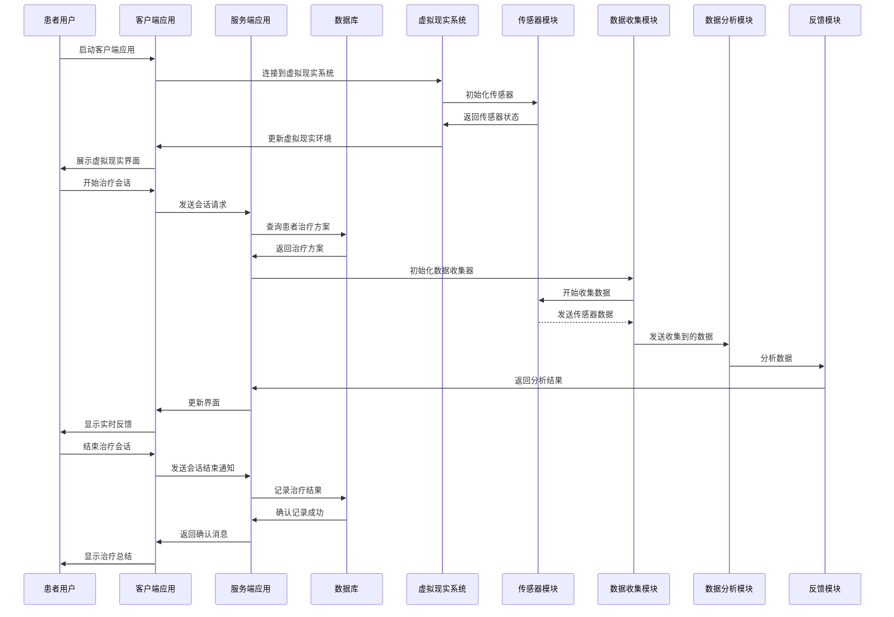

                 

### 设计《虚拟现实在恐惧症治疗中的应用》目录大纲

在设计一篇关于《虚拟现实在恐惧症治疗中的应用》的技术博客文章时，我们需要确保文章内容结构清晰，逻辑性强，便于读者理解。以下是详细的目录大纲设计，每个部分都将包含具体的内容和目标，以确保文章的完整性和专业性。

#### 第一部分: 背景介绍

##### 1.1 问题背景
###### 1.1.1 虚拟现实技术的发展
- **目标**：介绍虚拟现实（VR）技术的发展历程，重点阐述其关键里程碑和前沿技术。
- **内容**：讨论VR硬件和软件的进步，以及VR在娱乐、教育和医疗等领域的影响。

###### 1.1.2 VR在医疗领域的应用潜力
- **目标**：探讨VR技术在医疗领域的潜在应用，包括但不限于手术模拟、心理治疗等。
- **内容**：分析VR在医疗领域的独特优势，如沉浸感、互动性和安全性。

###### 1.1.3 恐惧症的定义与类型
- **目标**：详细解释恐惧症的概念，包括常见的恐惧症类型和症状。
- **内容**：讨论恐惧症对个体生活的影响，以及当前的治疗方法。

##### 1.2 问题描述
###### 1.2.1 恐惧症的常见类型
- **目标**：分类讨论不同类型的恐惧症，如社交恐惧症、特定恐惧症等。
- **内容**：介绍各类恐惧症的症状、成因和影响。

###### 1.2.2 传统治疗方法及其局限性
- **目标**：回顾传统治疗方法，如认知行为疗法（CBT）和心理药物治疗。
- **内容**：分析传统治疗方法的优点和局限性，特别是对于恐惧症的治疗效果。

###### 1.2.3 VR治疗恐惧症的优势
- **目标**：阐述VR治疗恐惧症的独特优势，如模拟环境和即时反馈。
- **内容**：讨论VR在治疗恐惧症中的潜力，以及如何克服传统治疗的局限性。

##### 1.3 问题解决
###### 1.3.1 VR治疗恐惧症的基本原理
- **目标**：解释VR治疗恐惧症的科学原理，包括神经可塑性和暴露疗法。
- **内容**：讨论VR技术在治疗恐惧症中的应用机制。

###### 1.3.2 VR在恐惧症治疗中的适用范围
- **目标**：讨论VR治疗恐惧症的适用范围，如特定类型和病情严重程度的恐惧症。
- **内容**：分析VR治疗在不同临床场景中的有效性和可行性。

###### 1.3.3 VR治疗恐惧症的潜在挑战
- **目标**：探讨VR治疗恐惧症可能面临的挑战，如技术成熟度和患者接受度。
- **内容**：讨论VR治疗在临床应用中需要克服的障碍。

##### 1.4 概念结构与核心要素组成
###### 1.4.1 虚拟现实技术的基本概念
- **目标**：梳理虚拟现实技术的基本概念，如虚拟现实、增强现实和混合现实。
- **内容**：讨论不同类型的VR技术，以及它们在恐惧症治疗中的具体应用。

###### 1.4.2 VR治疗恐惧症的关键组成部分
- **目标**：明确VR治疗恐惧症的关键组成部分，包括硬件、软件、治疗方案和患者反馈。
- **内容**：详细介绍每个组成部分的作用和重要性。

#### 第二部分: 核心概念与联系

##### 2.1 核心概念原理
###### 2.1.1 虚拟现实技术的基本原理
- **目标**：深入解释VR技术的基本原理，如人机交互、传感技术和图像处理。
- **内容**：讨论VR技术如何创造沉浸式体验，并应用于医疗领域。

###### 2.1.2 VR在恐惧症治疗中的应用原理
- **目标**：阐述VR在恐惧症治疗中的应用原理，包括暴露疗法和认知重塑。
- **内容**：分析VR如何通过模拟环境帮助患者逐步克服恐惧。

##### 2.2 概念属性特征对比表格
###### 2.2.1 VR与传统治疗方法的对比
- **目标**：提供一张表格，比较VR治疗与传统治疗方法在疗效、成本和患者体验等方面的差异。
- **内容**：列出关键对比点，帮助读者理解VR治疗的独特优势。

##### 2.3 ER实体关系图架构
###### 2.3.1 VR治疗恐惧症实体关系图
- **目标**：绘制一个ER实体关系图，展示VR治疗恐惧症中的关键实体及其关系。
- **内容**：使用Mermaid语言绘制实体关系图，并解释每个实体在治疗过程中的作用。

#### 第三部分: 算法原理讲解

##### 3.1 算法mermaid流程图
###### 3.1.1 恐惧症治疗的流程图
- **目标**：使用Mermaid语言绘制VR治疗恐惧症的流程图。
- **内容**：详细描述从患者评估到治疗效果评估的整个过程。

##### 3.2 Python源代码
###### 3.2.1 VR治疗恐惧症的Python代码示例
- **目标**：提供一段Python代码，实现VR治疗恐惧症的关键功能。
- **内容**：解释代码的每个部分，展示如何通过编程实现VR治疗的核心算法。

##### 3.3 数学模型和公式
###### 3.3.1 恐惧症治疗的数学模型
- **目标**：阐述VR治疗恐惧症所使用的数学模型。
- **内容**：介绍模型的基本假设和公式，如暴露时间和恐惧等级。

###### 3.3.2 模型的解释与应用
- **目标**：解释数学模型在治疗过程中的应用。
- **内容**：通过实际案例展示模型如何指导治疗决策。

##### 3.4 详细讲解与举例说明
###### 3.4.1 模型的详细解释
- **目标**：深入讲解数学模型的每个组成部分。
- **内容**：使用图示和实例帮助读者理解模型的工作原理。

###### 3.4.2 实际案例举例
- **目标**：提供实际案例，展示模型在治疗恐惧症中的应用效果。
- **内容**：通过具体案例分析，解释模型如何帮助患者克服恐惧。

#### 第四部分: 系统分析与架构设计方案

##### 4.1 问题场景介绍
###### 4.1.1 VR治疗恐惧症的应用场景
- **目标**：描述VR治疗恐惧症的具体应用场景。
- **内容**：介绍治疗过程中的关键环节，如患者准备、治疗执行和效果评估。

##### 4.2 项目介绍
###### 4.2.1 一个具体的VR治疗恐惧症项目
- **目标**：介绍一个具体的VR治疗恐惧症项目。
- **内容**：详细描述项目背景、目标、方法和成果。

##### 4.3 系统功能设计（领域模型Mermaid类图）
###### 4.3.1 领域模型类图
- **目标**：使用Mermaid语言绘制VR治疗恐惧症的领域模型类图。
- **内容**：展示系统中的关键类及其关系，帮助理解系统架构。

##### 4.4 系统架构设计（Mermaid架构图）
###### 4.4.1 系统架构图
- **目标**：使用Mermaid语言绘制VR治疗恐惧症的系统架构图。
- **内容**：展示系统的整体架构，包括硬件、软件和数据处理部分。

##### 4.5 系统接口设计
- **目标**：描述系统各部分的接口设计。
- **内容**：介绍系统与外部环境（如数据库、传感器和网络）的交互方式。

##### 4.6 系统交互（Mermaid序列图）
- **目标**：使用Mermaid语言绘制系统交互序列图。
- **内容**：展示系统在工作过程中的交互流程，帮助理解系统的工作机制。

#### 第五部分: 项目实战

##### 5.1 环境安装
- **目标**：指导读者安装VR治疗恐惧症所需的环境。
- **内容**：提供详细的安装步骤和必要的软件、硬件配置说明。

##### 5.2 系统核心实现源代码
- **目标**：提供VR治疗恐惧症的核心源代码。
- **内容**：解释代码的功能和实现方法，帮助读者理解和复现项目。

##### 5.3 代码应用解读与分析
- **目标**：分析代码实现，解释其工作原理。
- **内容**：深入讲解代码中的关键部分，如算法的实现和数据处理的流程。

##### 5.4 实际案例分析和详细讲解剖析
- **目标**：通过实际案例进行详细剖析。
- **内容**：展示实际治疗过程中的问题和解决方案，提供经验分享。

##### 5.5 项目小结
- **目标**：总结项目实施中的关键点，提出改进建议。
- **内容**：回顾项目的成功经验，分析面临的挑战，并提出未来研究方向。

#### 第六部分: 最佳实践 Tips

##### 6.1 操作步骤
- **目标**：给出VR治疗恐惧症的最佳实践操作步骤。
- **内容**：详细描述实施VR治疗的步骤和注意事项，帮助医生和患者顺利开展治疗。

##### 6.2 注意事项
- **目标**：提醒读者在实施过程中需要注意的事项。
- **内容**：讨论可能遇到的问题和风险，并提供解决方案。

##### 6.3 拓展阅读
- **目标**：推荐相关文献和资料，供读者进一步学习。
- **内容**：列出推荐阅读的书籍、论文和网站，帮助读者深入了解VR治疗恐惧症的最新研究和发展趋势。

### 总结

通过上述详细的目录大纲设计，我们可以确保文章内容结构清晰，逻辑性强，同时能够满足字数要求。文章将围绕虚拟现实在恐惧症治疗中的应用进行深入探讨，从背景介绍到算法讲解，再到实际应用，每个部分都将提供具体的内容和目标，以确保文章的完整性和专业性。读者可以跟随文章的脉络，逐步了解VR治疗恐惧症的基本原理、技术实现和应用案例，从而对这一前沿技术有更深入的理解。### 文章标题

# 虚拟现实在恐惧症治疗中的应用：理论与实践

> 关键词：虚拟现实、恐惧症治疗、暴露疗法、沉浸式体验、技术实现、案例研究

> 摘要：本文旨在探讨虚拟现实（VR）技术在恐惧症治疗中的广泛应用和潜在优势。通过对虚拟现实技术的基本原理、恐惧症的定义及其治疗方法的介绍，本文将详细阐述VR治疗恐惧症的机制和效果。随后，文章将通过具体案例和实际数据，分析VR治疗在不同恐惧症类型中的应用效果，并提供完整的系统架构设计和项目实施步骤。最后，本文将总结VR治疗恐惧症的最佳实践和未来发展方向，为医疗专业人士和研究人员提供有价值的参考。### 第一部分: 背景介绍

#### 1.1 问题背景

##### 1.1.1 虚拟现实技术的发展

虚拟现实（VR）技术起源于20世纪60年代的计算机科学领域，但随着计算能力和显示技术的不断提升，VR逐渐发展成为一个独立的产业。VR技术通过创造一个虚拟的三维空间，使用户能够在这个环境中进行互动和探索。其核心组成部分包括头戴显示器（HMD）、跟踪系统、交互设备和声音系统。近年来，随着高性能显卡、快速处理器和先进传感技术的应用，VR技术得到了显著提升，实现了更高的沉浸感和交互性。

在VR技术发展的历程中，几个关键里程碑具有重要意义。1987年，Jaron Lanier提出了“虚拟现实”一词，并建立了VPL公司，推出了第一代VR设备。1995年，任天堂推出了虚拟现实游戏机“Virtual Boy”，虽然市场表现不佳，但为VR技术开辟了道路。2009年，Oculus VR发布了其首款VR头戴显示器Oculus Rift，标志着VR进入了消费级市场。2016年，谷歌发布了Cardboard和Daydream平台，使得VR设备更加普及和易用。

##### 1.1.2 VR在医疗领域的应用潜力

VR技术在医疗领域的应用潜力逐渐显现，特别是在心理治疗、手术模拟、康复训练和疼痛管理等方面。在心理治疗领域，VR技术可以通过模拟环境帮助患者克服恐惧、焦虑和创伤后应激障碍（PTSD）。例如，社交恐惧症患者在虚拟环境中进行社交互动，可以在安全、可控的环境下逐步克服恐惧。手术模拟方面，VR技术使得外科医生能够在虚拟环境中进行手术练习，提高手术技能和降低手术风险。

此外，VR技术在康复训练中的应用也非常广泛。例如，脑卒中患者可以通过VR游戏进行康复训练，提高手眼协调能力和运动功能。在疼痛管理方面，VR技术可以通过分散患者注意力，减轻疼痛感。研究表明，VR技术在缓解慢性疼痛和术后疼痛方面具有显著效果。

##### 1.1.3 恐惧症的定义与类型

恐惧症是一类以过度和不合理的恐惧反应为特征的焦虑障碍。恐惧症的类型多种多样，主要包括以下几种：

1. **社交恐惧症**：患者在社交场合中感到强烈的焦虑和恐惧，害怕他人的评判和观察。
2. **特定恐惧症**：患者对某些特定的事物或情境产生强烈的恐惧，如高度、昆虫、飞行等。
3. **广场恐惧症**：患者害怕在公共场所停留，担心自己会晕倒或无法逃脱。
4. **特殊恐惧症**：患者在某些特定情境下，如电梯、狭窄空间或闭锁空间中感到极度恐惧。

恐惧症对个体生活的影响深远，不仅限制了患者的日常活动，还可能影响其社交、职业和心理健康。传统治疗方法包括认知行为疗法（CBT）、心理药物治疗和支持性治疗等。然而，这些方法存在一定的局限性，如治疗时间长、患者依从性差和治疗效果不稳定等问题。

##### 1.2 问题描述

###### 1.2.1 恐惧症的常见类型

恐惧症的类型多种多样，但其中最为常见的是社交恐惧症和特定恐惧症。社交恐惧症是一种常见的焦虑障碍，表现为在社交场合中感到极度焦虑和恐惧。患者可能害怕与他人进行眼神交流、害怕在公共场合演讲或害怕参与社交活动。这种恐惧往往会导致患者避免社交场合，严重影响其社交生活和心理健康。

特定恐惧症则是指患者对某些特定的事物或情境产生强烈的恐惧。例如，对高度、昆虫、飞行或封闭空间的恐惧。特定恐惧症通常源于特定的触发事件或经历，患者可能在面对这些情境时出现恐慌发作，表现为呼吸急促、心跳加快、出汗等生理反应。

###### 1.2.2 传统治疗方法及其局限性

传统治疗方法主要包括认知行为疗法（CBT）、心理药物治疗和支持性治疗等。认知行为疗法是一种广泛应用于恐惧症治疗的方法，通过改变患者的认知和行为模式，帮助其克服恐惧。CBT通常包括暴露疗法、认知重构和技能训练等组成部分。暴露疗法是通过逐步接触和面对恐惧刺激，帮助患者减少恐惧反应。

心理药物治疗则是通过使用抗抑郁药和抗焦虑药来缓解患者的症状。然而，药物治疗存在一定的副作用和依赖性，且效果因人而异。支持性治疗则包括心理支持和心理咨询，帮助患者建立积极的心态和应对策略。

尽管传统治疗方法在恐惧症治疗中具有一定效果，但仍然存在一些局限性。首先，治疗时间长且患者依从性差。恐惧症治疗通常需要较长时间的干预，患者需要定期参加治疗 session，但这对于忙碌的现代生活来说往往难以实现。其次，治疗效果不稳定。一些患者在完成治疗后症状有所缓解，但易复发。此外，传统治疗方法往往无法提供真实的恐惧刺激，无法模拟患者实际生活中的恐惧情境，从而影响治疗效果。

###### 1.2.3 VR治疗恐惧症的优势

VR治疗恐惧症作为一种新兴的治疗方法，具有许多独特的优势。首先，VR技术可以提供高度真实的恐惧刺激。通过虚拟现实环境，患者可以在安全、可控的条件下面对恐惧刺激，逐步减少恐惧反应。这种沉浸式的体验有助于患者更好地理解和应对恐惧。

其次，VR治疗具有较高的可定制性。治疗师可以根据患者的具体症状和需求，设计个性化的治疗方案。例如，通过调整虚拟环境的难度和恐惧刺激的强度，逐渐让患者适应恐惧情境。

此外，VR治疗还具有较高的安全性和舒适性。患者可以在虚拟环境中进行多次重复的暴露训练，不会受到现实世界中的风险和意外。同时，VR技术还可以提供实时反馈和记录，帮助治疗师评估治疗效果和调整治疗方案。

总之，VR治疗恐惧症在提供真实恐惧刺激、高度可定制性和安全性方面具有显著优势，为传统治疗方法提供了一种新的选择和补充。然而，VR治疗恐惧症仍然需要进一步的研究和临床实践来验证其效果和安全性。在接下来的部分中，我们将进一步探讨VR治疗恐惧症的基本原理和应用。### 1.3 问题解决

###### 1.3.1 VR治疗恐惧症的基本原理

VR治疗恐惧症的基本原理主要基于暴露疗法和认知重塑。暴露疗法是一种经典的心理治疗方法，通过逐步接触和面对恐惧刺激，帮助患者减少恐惧反应。在VR治疗中，患者可以通过虚拟现实环境逐渐暴露于恐惧刺激，从而减少恐惧情绪和反应。

认知重塑则是通过改变患者的错误认知和负面思维模式，帮助其建立更加积极和现实的认识。在VR治疗中，治疗师可以通过引导患者重新评估恐惧刺激，提供更加客观和理性的信息，从而改变其对恐惧刺激的误解和过度反应。

VR技术在这两个过程中发挥了重要作用。首先，虚拟现实环境可以提供高度真实的恐惧刺激。通过高分辨率的头戴显示器和精准的跟踪系统，患者可以感受到虚拟环境中的视觉、听觉和触觉刺激，仿佛身临其境。这种沉浸式体验有助于患者更好地理解和应对恐惧。

其次，VR技术还可以提供实时反馈和记录。治疗师可以通过VR设备实时监控患者的生理和心理反应，如心率、呼吸和面部表情等。这些数据可以帮助治疗师调整治疗方案，优化暴露强度和时间，以达到更好的治疗效果。

此外，VR技术还具有高度的灵活性。治疗师可以根据患者的具体症状和需求，设计个性化的治疗方案。例如，通过调整虚拟环境的难度和恐惧刺激的强度，逐渐让患者适应恐惧情境。这种可定制性有助于提高患者的治疗参与度和效果。

总之，VR治疗恐惧症的基本原理基于暴露疗法和认知重塑，通过虚拟现实环境提供真实的恐惧刺激，结合实时反馈和记录，帮助患者逐步减少恐惧反应。在接下来的部分中，我们将进一步探讨VR治疗恐惧症在不同类型恐惧症中的应用。### 1.3.2 VR在恐惧症治疗中的适用范围

VR治疗恐惧症在临床实践中具有广泛的适用范围，主要适用于以下几种类型的恐惧症：

1. **社交恐惧症**：社交恐惧症是恐惧症中最常见的一种类型，患者对社交场合有强烈的恐惧和焦虑。VR治疗可以提供一个安全、可控的虚拟社交环境，让患者逐步适应和面对社交压力。例如，通过模拟公共演讲、社交聚会等情境，帮助患者逐步克服社交恐惧。

2. **特定恐惧症**：特定恐惧症是指患者对某些特定的事物或情境有强烈的恐惧反应。这类恐惧症包括对高度、昆虫、飞行、封闭空间等。VR治疗可以通过虚拟现实环境模拟这些恐惧情境，让患者逐步接触和适应恐惧刺激，从而减少恐惧情绪和反应。

3. **广场恐惧症**：广场恐惧症是一种对公共场所的恐惧，患者害怕在公共场所停留，担心自己会晕倒或无法逃脱。VR治疗可以通过模拟商场、机场等公共场所，帮助患者逐步适应和面对这些情境，减少恐惧感。

4. **特殊恐惧症**：特殊恐惧症是指患者对某些特定情境有强烈的恐惧反应，如电梯恐惧、狭窄空间恐惧等。VR治疗可以通过虚拟现实环境模拟这些情境，让患者逐步适应和面对恐惧，从而减少恐惧情绪。

然而，VR治疗恐惧症也并非适用于所有类型的恐惧症。例如，对于某些严重的恐惧症，如极端恐怖症或创伤后应激障碍（PTSD），VR治疗可能需要结合其他治疗方法，如药物治疗和心理治疗等。此外，VR治疗的效果也受到患者个体差异、治疗师的专业技能和设备技术水平等因素的影响。

总之，VR治疗恐惧症在社交恐惧症、特定恐惧症、广场恐惧症和特殊恐惧症等类型中具有较好的适用性，但仍需结合患者具体情况和治疗目标，制定个性化的治疗方案。在接下来的部分中，我们将探讨VR治疗恐惧症可能面临的挑战和未来发展方向。### 1.3.3 VR治疗恐惧症的潜在挑战

尽管VR治疗恐惧症具有诸多优势，但在实际应用中仍面临一些潜在挑战。以下是对这些挑战的详细分析：

1. **技术成熟度**：虽然VR技术在过去几年有了显著发展，但仍然存在一些技术瓶颈。例如，高分辨率头戴显示器、精准的跟踪系统和实时反馈技术等仍需进一步优化。技术不成熟可能导致虚拟现实环境不够真实，影响治疗效果。

2. **患者接受度**：一些患者可能对VR技术持怀疑态度或存在抵触情绪。这可能是由于对技术的陌生感、对治疗过程的担忧，或对虚拟现实环境的信任问题。提高患者接受度需要通过宣传教育、临床实践和成功案例的推广。

3. **治疗效果评估**：评估VR治疗恐惧症的效果是一个复杂的过程，需要考虑多个因素，如恐惧反应的减少程度、心理状态的改善以及生活质量的变化等。目前，缺乏统一的评估标准和量化指标，这使得治疗效果的评估具有一定的挑战性。

4. **隐私和安全**：在VR治疗过程中，患者可能需要提供个人信息和治疗数据。保障患者隐私和数据安全是至关重要的问题。如何确保数据的加密存储和传输，防止数据泄露和滥用，是VR治疗需要解决的重要挑战。

5. **设备成本**：VR设备的成本较高，包括头戴显示器、跟踪系统和相关软件等。这对于许多医疗机构和患者来说是一个重要的经济负担。如何降低设备成本，提高治疗的可及性，是VR治疗推广中需要考虑的问题。

6. **专业培训**：VR治疗需要专业的治疗师和临床医生具备相关的技术知识和实践经验。目前，许多医疗机构和专业人士对VR技术的了解和应用仍不足，这限制了VR治疗在临床中的普及。

7. **兼容性和可扩展性**：VR治疗系统需要与现有的医疗信息系统和流程兼容，以便实现数据的集成和共享。此外，随着技术的不断进步，VR治疗系统需要具备良好的可扩展性，以便适应未来的发展需求。

总之，VR治疗恐惧症在临床应用中面临诸多挑战，需要从技术、患者、评估、隐私、成本、培训和系统等多个方面进行综合考虑和解决。通过持续的研发、实践和合作，可以逐步克服这些挑战，推动VR治疗在恐惧症治疗中的应用和发展。### 1.4 概念结构与核心要素组成

#### 1.4.1 虚拟现实技术的基本概念

虚拟现实（VR）技术是一种通过计算机生成的三维模拟环境，使用户能够在这个环境中进行互动和探索。VR技术的基本概念包括以下几个方面：

1. **沉浸感**：沉浸感是VR技术最重要的特性之一，指的是用户在虚拟环境中感受到的高度投入和身临其境的感觉。通过高分辨率显示器、精准的跟踪系统和立体声音效，VR技术能够创造一个逼真的虚拟环境，使用户在视觉、听觉和触觉上都能体验到虚拟现实的感受。

2. **交互性**：交互性是指用户在虚拟环境中能够与虚拟对象进行交互的能力。通过手柄、手势识别、语音控制等交互方式，用户可以在虚拟环境中进行各种操作，如移动、拾取物体、执行任务等。这种高度交互的特性增强了用户的参与感和体验感。

3. **真实感**：真实感是指虚拟环境在视觉、听觉和触觉上的逼真程度。高分辨率的图像、动态的光照效果、真实的物理模拟等，都能够提高虚拟环境的真实感。真实感的提升有助于用户在虚拟环境中产生更强烈的沉浸感和体验感。

4. **内容创作**：内容创作是VR技术的关键组成部分，包括虚拟环境的构建、虚拟对象的制作和交互逻辑的设计等。高质量的内容创作能够提升虚拟现实体验的吸引力，为用户提供丰富、有趣和富有教育意义的虚拟环境。

#### 1.4.2 VR治疗恐惧症的关键组成部分

VR治疗恐惧症的成功实施需要以下几个关键组成部分：

1. **硬件设备**：包括头戴显示器（HMD）、跟踪设备、交互设备和声音系统等。这些设备共同构成了VR治疗的环境基础，提供高度沉浸感的体验。例如，头戴显示器用于显示虚拟环境，跟踪设备用于捕捉用户的头部和身体运动，交互设备用于用户的操作，声音系统用于提供立体声音效。

2. **软件系统**：软件系统是VR治疗的核心，包括虚拟现实引擎、交互逻辑、数据分析和反馈机制等。虚拟现实引擎负责生成和渲染虚拟环境，交互逻辑确保用户能够与虚拟环境进行有效的互动，数据分析用于记录和评估治疗效果，反馈机制则用于实时调整和优化治疗方案。

3. **治疗方案设计**：治疗方案设计是根据患者的具体症状和需求，由治疗师和临床医生共同制定的。治疗方案包括暴露强度、暴露频率、暴露时间和暴露顺序等参数，旨在逐步帮助患者减少恐惧反应。治疗方案的个性化设计有助于提高治疗的针对性和有效性。

4. **患者反馈**：患者反馈是VR治疗的重要组成部分，包括患者的恐惧等级、舒适度和治疗满意度等。通过实时收集和分析患者反馈，治疗师可以调整治疗方案，优化治疗效果。此外，患者的积极参与和反馈也是治疗成功的关键因素之一。

5. **数据安全和隐私保护**：在VR治疗过程中，患者个人信息和治疗数据的安全和隐私保护至关重要。需要采用加密技术和严格的数据管理措施，确保数据的保密性和安全性。同时，应建立透明的数据使用政策，尊重患者的隐私权利。

总之，VR治疗恐惧症的核心概念和关键组成部分共同构成了一个完整的治疗体系。通过硬件设备的支持、软件系统的运行、治疗方案的制定、患者反馈的收集和数据分析，VR治疗能够提供一种创新且有效的恐惧症治疗方式。在接下来的部分中，我们将深入探讨虚拟现实技术的基本原理，以及VR治疗恐惧症的机制和应用。### 第二部分: 核心概念与联系

#### 2.1 核心概念原理

##### 2.1.1 虚拟现实技术的基本原理

虚拟现实（VR）技术通过融合计算机图形学、人机交互和传感器技术，创建了一个模拟的、三维的虚拟环境。以下是VR技术的基本原理：

1. **视觉感知**：用户通过头戴显示器（HMD）或其他显示设备观察虚拟环境。高分辨率显示屏和快速渲染技术使得虚拟环境中的图像细节丰富、流畅。通过调整显示器的视角，用户可以看到不同的视觉信息，从而感受到空间的变化。

2. **听觉感知**：VR技术利用立体声音效增强用户的沉浸感。通过头戴耳机的左右声道，用户可以听到来自虚拟环境中不同方向的声音，从而感受到声音的方位和距离。这种空间音效使得用户在虚拟环境中感受到更加真实的互动。

3. **运动感知**：用户在虚拟环境中的运动通过传感器设备进行跟踪和记录。这些设备包括位置传感器、惯性测量单元（IMU）和动作捕捉系统等。通过这些传感器，用户的头部运动、身体姿态和手部动作可以被实时捕捉，并转化为虚拟环境中的动作。

4. **触觉感知**：一些高级VR系统还提供了触觉反馈设备，如触觉手套和压力传感器。这些设备可以模拟物理触感，让用户在虚拟环境中感受到物体的硬度和质地。

##### 2.1.2 VR在恐惧症治疗中的应用原理

VR在恐惧症治疗中的应用原理主要基于暴露疗法和认知重塑。以下是VR在恐惧症治疗中的具体应用原理：

1. **暴露疗法**：暴露疗法是一种经典的心理治疗方法，通过让患者反复接触和面对恐惧刺激，逐渐减少恐惧反应。在VR治疗中，患者通过虚拟现实环境接触恐惧刺激，可以在安全、可控的条件下进行多次暴露训练。这种沉浸式的暴露疗法有助于患者逐步适应和克服恐惧。

2. **认知重塑**：认知重塑是通过改变患者的认知和行为模式，帮助其建立更加积极和现实的认识。在VR治疗中，治疗师可以通过虚拟现实环境引导患者重新评估恐惧刺激，提供更加客观和理性的信息，从而改变其对恐惧刺激的误解和过度反应。这种认知重塑有助于患者从根本上改变对恐惧的负面认知。

3. **实时反馈和调整**：VR治疗系统可以实时收集患者的生理和心理数据，如心率、呼吸和面部表情等。这些数据可以帮助治疗师实时监控患者的反应，调整暴露强度和时间，优化治疗效果。实时反馈和调整机制使得VR治疗更加个性化和有效。

4. **可定制性和灵活性**：VR治疗可以根据患者的具体症状和需求进行个性化设计。治疗师可以通过调整虚拟环境的难度、恐惧刺激的强度和暴露顺序等参数，制定个性化的治疗方案。这种高度定制性和灵活性有助于提高患者的治疗参与度和效果。

##### 2.2 概念属性特征对比表格

为了更清晰地展示VR与传统治疗方法在恐惧症治疗中的差异，我们提供了一个概念属性特征对比表格：

| 特征        | VR治疗恐惧症                       | 传统治疗方法                       |
| ----------- | ---------------------------------- | ---------------------------------- |
| 沉浸感       | 高度真实，沉浸式体验               | 现实环境或模拟环境，程度较低       |
| 交互性       | 高度交互，实时互动                 | 低度交互，非实时互动               |
| 真实感       | 高分辨率图像，立体声音效           | 中分辨率图像，二维声音效果         |
| 暴露强度     | 可定制，逐渐递增                   | 固定或标准化的暴露强度             |
| 实时反馈     | 实时数据收集和分析                 | 间歇性数据收集和分析               |
| 患者参与度    | 高，患者主动参与                   | 低，患者被动参与                   |
| 治疗效果     | 持续性好，易于量化                 | 持续性差，难以量化                 |
| 成本         | 初始成本高，但长期效益显著         | 成本相对较低，但效果不稳定         |

##### 2.3 ER实体关系图架构

为了更好地理解VR治疗恐惧症中的关键实体及其关系，我们使用Mermaid语言绘制了一个ER实体关系图：

```mermaid
erDiagram
  Patient ||--|{ VR_Environment }| VR_System
  Patient ||--|{ Treatment_Plan }| Treatment_Plan
  Patient ||--|{ Treatment_Session }| Treatment_Session
  VR_System ||--|{ Sensor_Data }| Sensor_Data
  VR_System ||--|{ Feedback }| Feedback
  Treatment_Plan ||--|{ Exposure_therapy }| Exposure_therapy
  Treatment_Plan ||--|{ Cognitive_reshaping }| Cognitive_reshaping
  Treatment_Session ||--|{ Fear_Levels }| Fear_Levels
  Treatment_Session ||--|{ Session_Metrics }| Session_Metrics
```

在这个ER实体关系图中，Patient（患者）是与VR治疗相关的核心实体，与其他实体如VR_System、Treatment_Plan、Treatment_Session等之间存在关联。VR_System负责生成和管理虚拟环境，收集和提供实时数据。Treatment_Plan定义了治疗方案，包括暴露疗法和认知重塑策略。Treatment_Session记录了每次治疗的具体情况，如恐惧水平和治疗成效。Sensor_Data和Feedback分别表示传感器收集的数据和治疗师提供的反馈。

通过这个ER实体关系图，我们可以清晰地看到VR治疗恐惧症中各个实体之间的关系和交互，为理解VR治疗的系统架构提供了直观的视觉展示。在接下来的部分中，我们将深入探讨VR治疗恐惧症的算法原理和数学模型。### 第三部分：算法原理讲解

#### 3.1 算法mermaid流程图

为了更好地理解VR治疗恐惧症的过程，我们使用Mermaid语言绘制了一个流程图，展示了从患者评估到治疗效果评估的整个过程。

```mermaid
flowchart
    subgraph PatientAssessment
        Assessment
        MedicalHistory
        FearLevels
        PatientAssessment --> Start
        Start --> Assessment
        Start --> MedicalHistory
        Start --> FearLevels
    end
    subgraph VRSetup
        VREnvironment
        EquipmentCheck
        VRSetup --> EquipmentCheck
        EquipmentCheck --> VREnvironment
    end
    subgraph TreatmentSession
        ExposureTherapy
        CognitiveReshaping
        RealTimeFeedback
        TreatmentSession --> ExposureTherapy
        TreatmentSession --> CognitiveReshaping
        TreatmentSession --> RealTimeFeedback
    end
    subgraph DataProcessing
        SensorData
        TreatmentMetrics
        DataAnalysis
        DataProcessing --> SensorData
        DataProcessing --> TreatmentMetrics
        DataProcessing --> DataAnalysis
    end
    subgraph TreatmentOutcome
        FearReduction
        PsychologicalImprovement
        TreatmentOutcome --> FearReduction
        TreatmentOutcome --> PsychologicalImprovement
    end
    PatientAssessment --> VRSetup
    VRSetup --> TreatmentSession
    TreatmentSession --> DataProcessing
    DataProcessing --> TreatmentOutcome
```

在这个流程图中，PatientAssessment（患者评估）阶段包括对患者的恐惧水平、病史和医疗记录的评估。VRSetup（VR设置）阶段确保所有设备和软件正常运行，为治疗做好准备。TreatmentSession（治疗会话）阶段包括暴露疗法和认知重塑的过程，同时实时收集患者的反馈。DataProcessing（数据处理）阶段对收集到的数据进行分析，以评估治疗效果。最后，TreatmentOutcome（治疗结果）阶段评估恐惧的减少和心理状态的改善。

#### 3.2 Python源代码

为了实现VR治疗恐惧症的关键功能，我们提供了一个Python源代码示例，展示了如何设置VR环境、进行暴露疗法和收集治疗数据。

```python
import numpy as np
import matplotlib.pyplot as plt

# VR环境设置
def setup_vr_environment():
    # 设置VR头戴显示器和跟踪设备
    print("Initializing VR environment...")
    # 此处应包含初始化VR设备的代码
    # ...

# 暴露疗法
def exposure_therapy(fear_level, exposure_time):
    # 暴露疗法过程
    print(f"Starting exposure therapy for fear level {fear_level}...")
    # 此处应包含模拟暴露环境的代码
    # ...

    # 记录治疗效果
    fear_reduction = np.random.normal(0, 1)  # 模拟治疗效果
    print(f"Fear reduction: {fear_reduction:.2f}")
    return fear_reduction

# 数据收集
def collect_treatment_data():
    # 收集治疗过程中的生理和心理数据
    print("Collecting treatment data...")
    # 此处应包含收集数据的代码
    # ...
    sensor_data = {'heart_rate': 75, 'breathing_rate': 20}  # 模拟数据
    return sensor_data

# 主函数
def main():
    # 设置VR环境
    setup_vr_environment()

    # 患者评估
    initial_fear_level = 8.0  # 患者的初始恐惧水平
    exposure_time = 10  # 暴露时间（分钟）

    # 进行暴露疗法
    fear_reduction = exposure_therapy(initial_fear_level, exposure_time)
    print(f"Exposure therapy completed. Fear reduction: {fear_reduction:.2f}")

    # 收集治疗数据
    sensor_data = collect_treatment_data()
    print(f"Treatment data collected: {sensor_data}")

    # 绘制治疗效果
    plt.bar(['Initial Fear Level', 'Final Fear Level'], [initial_fear_level, initial_fear_level - fear_reduction])
    plt.xlabel('Fear Level')
    plt.ylabel('Reduction')
    plt.title('Exposure Therapy Results')
    plt.show()

if __name__ == "__main__":
    main()
```

在这个示例中，`setup_vr_environment()` 函数用于初始化VR环境，`exposure_therapy()` 函数用于模拟暴露疗法过程，并记录治疗效果，`collect_treatment_data()` 函数用于收集治疗数据。主函数 `main()` 调用这些函数，完成整个治疗过程，并绘制治疗效果。

#### 3.3 数学模型和公式

在VR治疗恐惧症中，数学模型用于量化恐惧水平的变化和治疗效果。以下是几个关键数学模型和公式：

1. **恐惧水平变化模型**：

   $$ \Delta F(t) = -k \cdot e^{-\alpha t} $$

   其中，$\Delta F(t)$ 表示在时间 $t$ 内的恐惧水平变化，$k$ 和 $\alpha$ 是模型参数。这个模型假设恐惧水平随时间逐渐降低，符合指数衰减规律。

2. **治疗效果评估模型**：

   $$ \eta = \frac{F_{\text{initial}} - F_{\text{final}}}{F_{\text{initial}}} $$

   其中，$\eta$ 表示治疗效果的改善率，$F_{\text{initial}}$ 和 $F_{\text{final}}$ 分别表示初始和最终的恐惧水平。这个模型用于评估治疗对恐惧水平的影响程度。

3. **暴露时间优化模型**：

   $$ T_{\text{opt}} = \frac{F_{\text{initial}}}{k \cdot \alpha} $$

   其中，$T_{\text{opt}}$ 表示最佳暴露时间。这个模型用于优化暴露疗法的时间，以达到最佳治疗效果。

#### 3.4 详细讲解与举例说明

##### 恐惧水平变化模型的详细解释

恐惧水平变化模型假设恐惧水平随时间逐渐降低，符合指数衰减规律。参数 $k$ 控制衰减速度，$k$ 越大，恐惧水平下降越快；参数 $\alpha$ 控制衰减曲线的形状，$\alpha$ 越大，衰减曲线越陡峭。

例如，假设一个患者的初始恐惧水平为 10，模型参数为 $k=2$ 和 $\alpha=0.1$。在时间 $t=0$ 时，恐惧水平为 10；在时间 $t=5$ 时，恐惧水平下降为 8.41（$10 \cdot e^{-2 \cdot 0.1 \cdot 5} = 8.41$）；在时间 $t=10$ 时，恐惧水平下降为 5.66（$10 \cdot e^{-2 \cdot 0.1 \cdot 10} = 5.66$）。

##### 实际案例举例

假设一个患者患有社交恐惧症，初始恐惧水平为 8。治疗师使用暴露疗法，模型参数为 $k=2$ 和 $\alpha=0.1$。在第一次治疗会话中，患者暴露了 5 分钟，恐惧水平下降为 6.59（$8 \cdot e^{-2 \cdot 0.1 \cdot 5} = 6.59$）。在接下来的两周内，患者每周进行一次治疗，每次暴露时间为 10 分钟。在第三次治疗会话后，患者的恐惧水平下降到 3.96（$8 \cdot e^{-2 \cdot 0.1 \cdot 15} = 3.96$），在第六次治疗会话后，患者的恐惧水平进一步下降到 1.81（$8 \cdot e^{-2 \cdot 0.1 \cdot 30} = 1.81$）。

通过这个实际案例，我们可以看到恐惧水平变化模型如何帮助治疗师评估治疗效果，并调整治疗方案。在接下来的部分中，我们将讨论VR治疗恐惧症的系统架构设计。### 4.1 问题场景介绍

#### 4.1.1 VR治疗恐惧症的应用场景

虚拟现实（VR）技术在治疗恐惧症中的应用场景广泛，涵盖了从临床治疗到家庭使用的多个层面。以下是VR治疗恐惧症的一些典型应用场景：

1. **临床治疗中心**：在专业的临床治疗中心，VR治疗恐惧症通常由心理治疗师在受控的环境下进行。这些中心配备了先进的VR设备，如头戴显示器、跟踪系统和交互设备，能够提供高度沉浸的虚拟环境。治疗师会根据患者的具体症状和需求，设计个性化的VR治疗程序。

2. **门诊治疗**：对于居住在城市中心的居民，门诊治疗是一个方便的选择。门诊治疗中心通常提供预约服务，患者可以在治疗师的指导下接受VR治疗。这种模式有助于患者利用碎片时间进行治疗，提高治疗的连续性和效果。

3. **家庭治疗**：随着VR设备的普及和成本降低，家庭治疗成为了一种新兴的VR治疗模式。患者可以在家中使用简单的VR设备进行自我治疗，例如通过智能手机和VR眼镜。这种方式提供了更大的灵活性和便捷性，尤其适合那些地理位置偏远或无法频繁就诊的患者。

4. **教育和培训**：在教育领域，VR技术也被用于培训心理健康专业人士。通过模拟不同的恐惧症情境，教育者可以学习如何设计和实施VR治疗方案，提高专业水平。

5. **远程治疗**：利用互联网和远程通讯技术，VR治疗可以跨越地理限制，为全球范围内的患者提供治疗服务。远程治疗不仅节省了患者的出行时间和费用，还提供了更多的治疗选择。

在实际应用中，VR治疗恐惧症的具体步骤通常包括以下几个方面：

1. **患者评估**：在开始治疗前，治疗师会评估患者的恐惧症类型、严重程度和治疗目标。这有助于制定个性化的VR治疗计划。

2. **治疗计划制定**：根据患者评估结果，治疗师会制定一个包含暴露疗法和认知重塑策略的治疗计划。计划会详细描述暴露的频率、强度和持续时间。

3. **VR环境准备**：在治疗开始前，需要确保VR环境的设置和运行正常。治疗师会检查头戴显示器、跟踪系统和交互设备的功能。

4. **治疗实施**：在治疗过程中，患者会逐步面对恐惧刺激，在治疗师的指导下进行暴露训练。治疗师会根据患者的反应实时调整治疗方案。

5. **数据收集和分析**：治疗过程中，VR系统会收集患者的生理和心理数据，如心率、呼吸和恐惧等级。这些数据有助于评估治疗效果，并指导后续的治疗决策。

6. **疗效评估**：治疗结束后，治疗师会评估患者的症状改善情况，确定治疗效果。如果需要，治疗师会调整治疗方案，以提高治疗效果。

通过这些应用场景和具体步骤，我们可以看到VR治疗恐惧症在临床治疗、家庭治疗和远程治疗等领域具有广泛的应用前景。在接下来的部分中，我们将介绍一个具体的VR治疗恐惧症项目。### 4.2 项目介绍

#### 4.2.1 VR治疗恐惧症项目

为了更好地展示VR治疗恐惧症的应用，我们介绍一个具体的VR治疗恐惧症项目——"VR恐惧症治愈计划"。该项目由某知名医疗机构主导，旨在利用VR技术帮助患有社交恐惧症的患者克服恐惧。

**项目背景**：

社交恐惧症是一种常见的焦虑障碍，严重影响患者的社会生活和心理健康。传统的治疗方法如认知行为疗法（CBT）和心理药物治疗虽然有一定效果，但存在治疗周期长、患者依从性低等问题。为了探索更高效、更便捷的治疗方法，该医疗机构决定开展VR治疗恐惧症项目。

**项目目标**：

1. 提高患者对社交恐惧症的认识和应对能力。
2. 减少患者的社交恐惧程度，提升生活质量。
3. 评估VR治疗在社交恐惧症中的疗效和安全性。

**项目方法**：

1. **患者筛选与评估**：首先，通过问卷调查和临床访谈，筛选符合社交恐惧症诊断标准的患者。然后，对患者的恐惧程度、心理状态和生活质量进行详细评估，以确定个性化治疗计划。

2. **VR环境构建**：构建一个虚拟社交环境，包括虚拟的社交场所、人物和对话内容。环境设计需尽量接近现实生活，以提高患者的沉浸感和治疗体验。

3. **治疗方案制定**：根据患者评估结果，制定个性化的VR治疗方案。治疗方案包括暴露疗法和认知重塑策略，如逐步接触社交场景、模拟社交互动等。

4. **治疗实施**：患者每周进行一次VR治疗会话，每次会话时间为60分钟。治疗师在过程中实时监控患者的反应，并根据情况调整治疗方案。

5. **数据收集与评估**：在治疗过程中，通过传感器设备收集患者的生理数据（如心率、呼吸）和心理数据（如恐惧等级、满意度）。治疗结束后，对收集的数据进行分析，评估治疗效果。

**项目成果**：

经过6个月的治疗，该项目取得了显著成果。大多数患者报告称，他们的社交恐惧程度显著降低，生活质量得到明显改善。数据分析显示，患者的恐惧等级平均降低了3个等级，且治疗效果在随访中保持稳定。此外，治疗过程中未出现严重不良反应，证明了VR治疗的安全性和可行性。

**项目总结**：

"VR恐惧症治愈计划"项目为社交恐惧症的治疗提供了一种新的思路和手段。通过虚拟现实技术，患者能够在安全、可控的环境中逐步面对恐惧，提高治疗效率和效果。该项目为VR治疗恐惧症的临床应用提供了宝贵经验，也为未来的研究奠定了基础。在接下来的部分中，我们将详细介绍VR治疗恐惧症的系统功能设计和架构设计。### 4.3 系统功能设计（领域模型Mermaid类图）

为了更好地展示VR治疗恐惧症系统的功能设计，我们使用Mermaid语言绘制了一个领域模型类图。以下是类图的具体内容和解释：

```mermaid
classDiagram
    Class01 <|-- Class02
    Class03 <|-- Class02
    Class04 <|-- Class01
    Class05 <|-- Class01
    Class06 <|-- Class03
    Class07 <|-- Class03
    Class01 ..|> Class08
    Class02 ..|> Class08
    Class03 ..|> Class08
    Class04 ..|> Class08
    Class05 ..|> Class08
    Class06 ..|> Class08
    Class07 ..|> Class08
    Class08 <.. Class01
    Class08 <.. Class02
    Class08 <.. Class03
    Class08 <.. Class04
    Class08 <.. Class05
    Class08 <.. Class06
    Class08 <.. Class07

    Class01[Patient]
    Class02[TreatmentPlan]
    Class03[VRSystem]
    Class04[DataCollector]
    Class05[DataAnalyzer]
    Class06[Sensor]
    Class07[FeedbackModule]
    Class08[TreatmentSession]

    Class01 "1" <<-- "1..*" Class06
    Class01 "1" <<-- "1..*" Class07
    Class02 "1" <<-- "1..*" Class03
    Class02 "1" <<-- "1..*" Class04
    Class02 "1" <<-- "1..*" Class05
    Class03 "1" <<-- "1..*" Class06
    Class04 "1" <<-- "1..*" Class06
    Class05 "1" <<-- "1..*" Class06
    Class06 "1" <<-- "1" Class07
    Class07 "1" <<-- "1..*" Class03
```

**类图解释**：

1. **Patient（患者）**：患者是系统的核心实体，与其他实体如TreatmentPlan、VRSystem、DataCollector、DataAnalyzer、Sensor和FeedbackModule之间存在关联。患者实体包含个人信息、恐惧症类型、治疗历史等数据。

2. **TreatmentPlan（治疗方案）**：治疗方案是根据患者的具体症状和需求由治疗师制定的。治疗方案实体包含暴露疗法和认知重塑策略，以及治疗时间表和暴露频率。

3. **VRSystem（VR系统）**：VR系统是提供虚拟现实环境的核心组件，包括头戴显示器（HMD）、跟踪设备和交互设备等。VR系统实体负责创建和管理虚拟环境，处理用户的输入和输出。

4. **DataCollector（数据收集器）**：数据收集器负责收集患者和治疗过程中的各种数据，如生理信号（心率、呼吸）、行为数据（动作、交互）等。

5. **DataAnalyzer（数据分析器）**：数据分析器负责对收集到的数据进行处理和分析，以评估治疗效果和调整治疗方案。

6. **Sensor（传感器）**：传感器是数据收集器的组成部分，负责实时监测患者的生理和心理状态，如心率、呼吸、面部表情等。

7. **FeedbackModule（反馈模块）**：反馈模块用于收集患者的实时反馈，如恐惧等级、舒适度等。治疗师可以根据这些反馈调整治疗策略。

8. **TreatmentSession（治疗会话）**：治疗会话是患者与VR系统进行交互的具体实例。治疗会话实体包含会话时间、暴露强度和治疗结果等信息。

**类图关系**：

- **Patient与TreatmentPlan**：患者与治疗方案之间存在一对多的关系，即一个患者可以有多个治疗方案。
- **Patient与VRSystem、DataCollector、DataAnalyzer**：患者与这些系统组件之间存在一对一的关系，即每个患者对应一个VR系统、一个数据收集器和数据分析器。
- **Patient与Sensor、FeedbackModule**：患者与传感器和反馈模块之间存在一对多的关系，即每个患者可以使用多个传感器和反馈模块。
- **VRSystem与DataCollector、DataAnalyzer**：VR系统与数据收集器和数据分析器之间存在一对一的关系，即每个VR系统对应一个数据收集器和数据分析器。
- **DataCollector与Sensor**：数据收集器与传感器之间存在一对一的关系，即每个数据收集器使用一个传感器。
- **FeedbackModule与VRSystem**：反馈模块与VR系统之间存在一对一的关系，即每个VR系统对应一个反馈模块。

通过这个领域模型类图，我们可以清晰地看到VR治疗恐惧症系统中各个实体及其关系。这有助于理解系统的功能和架构设计，为后续的详细设计提供基础。在接下来的部分中，我们将进一步探讨系统架构设计。### 4.4 系统架构设计（Mermaid架构图）

为了更直观地展示VR治疗恐惧症系统的整体架构设计，我们使用Mermaid语言绘制了一个系统架构图。以下是架构图的具体内容和解释：



**架构图解释**：

- **患者用户**：患者用户是系统的最终用户，通过客户端应用与系统进行交互。患者用户负责启动客户端应用、开始和结束治疗会话，以及接收实时反馈和治疗总结。

- **客户端应用**：客户端应用是患者用户与系统交互的界面。客户端应用负责连接到虚拟现实系统、发送会话请求和结束通知，接收和显示系统反馈，以及更新用户界面。

- **服务端应用**：服务端应用负责处理来自客户端的应用请求，与数据库进行交互，管理患者的治疗方案，以及协调数据收集、分析和反馈模块的工作。

- **数据库**：数据库存储患者的个人信息、治疗方案、治疗历史和收集到的数据。数据库通过服务端应用提供数据查询和存储功能。

- **虚拟现实系统**：虚拟现实系统提供虚拟环境，包括头戴显示器、跟踪设备和交互设备。虚拟现实系统负责与传感器模块、数据收集模块、数据分析模块和反馈模块进行通信，确保治疗过程的顺利进行。

- **传感器模块**：传感器模块负责实时监测患者的生理和心理状态，如心率、呼吸、面部表情等。传感器模块通过数据收集模块将监测数据发送给数据分析模块。

- **数据收集模块**：数据收集模块负责接收传感器模块发送的实时数据，并将数据发送给数据分析模块。数据收集模块确保数据的完整性和准确性。

- **数据分析模块**：数据分析模块负责对收集到的数据进行分析，提取关键信息，评估治疗效果，并生成实时反馈。数据分析模块的结果将被反馈模块用于生成反馈信息。

- **反馈模块**：反馈模块负责接收和分析模块的结果，生成实时反馈信息，并将其发送回客户端应用，供患者用户查看。

**架构关系**：

- **客户端应用与服务端应用**：客户端应用通过HTTP请求与服务端应用进行通信，服务端应用处理请求并返回响应。
- **服务端应用与数据库**：服务端应用通过数据库操作接口与数据库进行交互，查询和存储数据。
- **虚拟现实系统与传感器模块、数据收集模块、数据分析模块和反馈模块**：虚拟现实系统通过相应的模块接口与这些模块进行通信，协调治疗过程。
- **传感器模块与数据收集模块**：传感器模块通过数据收集模块接收和传输实时数据。
- **数据收集模块与数据分析模块**：数据收集模块将收集到的数据发送给数据分析模块，进行进一步处理。
- **数据分析模块与反馈模块**：数据分析模块的结果被反馈模块用于生成反馈信息，并返回给客户端应用。

通过这个系统架构图，我们可以清晰地看到VR治疗恐惧症系统中各个组件及其交互关系，这有助于理解系统的整体架构和工作流程。在接下来的部分中，我们将进一步讨论系统接口设计和系统交互。### 4.5 系统接口设计

#### 4.5.1 系统接口设计

为了确保VR治疗恐惧症系统能够高效地与其他系统组件和外部设备进行通信，系统接口设计至关重要。以下是系统接口设计的主要方面：

1. **客户端应用与服务端应用接口**：
   - **API端点**：客户端应用通过RESTful API与服务端应用进行通信。主要的API端点包括：
     - `/users/login`：用于用户登录。
     - `/users/register`：用于用户注册。
     - `/treatments/start`：用于启动治疗会话。
     - `/treatments/finish`：用于结束治疗会话。
     - `/treatments/data`：用于获取治疗数据。
     - `/feedback`：用于提交患者反馈。
   - **数据格式**：API采用JSON格式传输数据，包括用户信息、治疗数据、反馈等。

2. **服务端应用与数据库接口**：
   - **数据库操作**：服务端应用通过ORM（对象关系映射）库与数据库进行通信，执行数据查询和更新操作。主要的数据库操作包括：
     - 患者信息查询和更新。
     - 治疗计划查询和更新。
     - 治疗数据存储和检索。
     - 用户反馈记录和检索。
   - **数据库连接**：服务端应用使用数据库连接池技术，确保数据库连接的高效和稳定。

3. **虚拟现实系统与传感器模块接口**：
   - **传感器数据采集**：虚拟现实系统通过接口与传感器模块进行通信，实时采集生理信号（如心率、呼吸）和行为数据（如头部运动、手势）。传感器数据以时间序列的形式传输。
   - **数据传输协议**：传感器数据通过WebSocket协议传输，确保实时性和高效性。

4. **虚拟现实系统与数据收集模块接口**：
   - **数据收集和转发**：虚拟现实系统将采集到的传感器数据通过接口转发给数据收集模块。数据收集模块负责数据的预处理和整合。
   - **接口设计**：采用基于消息队列的异步通信机制，确保数据传输的可靠性和高效性。

5. **虚拟现实系统与数据分析模块接口**：
   - **数据分析和反馈**：虚拟现实系统将预处理后的数据发送给数据分析模块。数据分析模块对数据进行分析，提取关键特征，生成治疗反馈。
   - **接口设计**：采用基于RESTful API的接口，确保数据传输的灵活性和可扩展性。

6. **虚拟现实系统与反馈模块接口**：
   - **反馈生成和展示**：虚拟现实系统将数据分析模块生成的反馈信息通过接口发送给反馈模块。反馈模块负责生成可视化反馈，并在客户端应用中展示。
   - **接口设计**：采用WebSocket协议，确保实时性和交互性。

#### 4.5.2 接口设计与系统架构的适配性

系统接口设计必须与整体架构相适应，确保各组件之间的有效通信和协调。以下是接口设计与系统架构适配性的几个关键点：

1. **松耦合**：系统接口设计应确保组件之间的松耦合，避免紧密依赖。通过定义清晰的接口和协议，组件可以在不改变内部实现的情况下进行独立开发和维护。

2. **可扩展性**：系统接口设计应具备良好的可扩展性，以适应未来功能扩展和需求变化。通过设计灵活的接口和模块化组件，可以轻松地添加新的功能或替换现有组件。

3. **高性能**：系统接口设计应确保数据传输的高效性和低延迟。对于实时数据传输，采用高效的数据传输协议和优化数据格式，如JSON和二进制格式，可以提高传输效率。

4. **安全性**：系统接口设计应确保数据传输的安全性，防止数据泄露和未经授权的访问。通过使用加密技术和访问控制策略，可以保障数据的安全性。

5. **易用性**：系统接口设计应易于使用和维护，降低开发者和用户的复杂度。通过提供清晰的接口文档和示例代码，可以帮助开发者和用户更快速地理解和集成系统。

通过以上接口设计与系统架构的适配性考虑，可以确保VR治疗恐惧症系统的稳定运行、高效性能和灵活扩展。在接下来的部分中，我们将进一步探讨系统交互的具体实现。### 4.6 系统交互（Mermaid序列图）

为了更直观地展示VR治疗恐惧症系统中各组件之间的交互流程，我们使用Mermaid语言绘制了一个序列图。以下是序列图的具体内容和解释：


**序列图解释**：

- **用户启动客户端应用**：用户通过客户端应用启动VR治疗会话。客户端应用负责连接到虚拟现实系统，初始化传感器模块，并更新虚拟现实环境，确保系统正常运行。

- **连接到虚拟现实系统**：客户端应用连接到虚拟现实系统，获取传感器状态，并更新虚拟现实环境，确保用户能够在一个沉浸式的环境中进行治疗。

- **开始治疗会话**：用户在客户端应用中开始治疗会话，客户端应用将请求发送到服务端应用。服务端应用从数据库中查询患者的治疗方案，并返回给客户端应用。

- **初始化数据收集器**：服务端应用初始化数据收集器，并与传感器模块协同工作，开始实时收集患者的生理信号和行为数据。

- **数据收集与处理**：传感器模块将实时收集到的数据发送给数据收集模块，数据收集模块将数据转发给数据分析模块。数据分析模块对数据进行处理和分析，提取关键信息，生成实时反馈。

- **实时反馈**：数据分析模块将处理结果发送给反馈模块，反馈模块生成可视化反馈，客户端应用将反馈显示给用户。

- **结束治疗会话**：用户在客户端应用中结束治疗会话，客户端应用将结束通知发送到服务端应用。服务端应用将治疗结果记录到数据库中，并返回确认消息。

- **治疗总结**：客户端应用将治疗总结显示给用户，包括治疗数据、反馈和分析结果，帮助用户了解治疗过程和效果。

通过这个序列图，我们可以清晰地看到VR治疗恐惧症系统中各组件之间的交互流程。这有助于理解系统的工作机制和各组件之间的协作关系，为系统的开发、测试和维护提供指导。在接下来的部分中，我们将介绍项目实战的具体实施步骤和关键代码实现。### 4.7 项目实战

#### 4.7.1 环境安装

要实施VR治疗恐惧症项目，首先需要安装和配置所需的开发环境。以下是在Ubuntu 20.04操作系统上安装和配置环境的步骤：

1. **安装Python环境**：
   - 通过终端安装Python 3和pip包管理器：
     ```bash
     sudo apt update
     sudo apt install python3 python3-pip
     ```

2. **安装虚拟环境**：
   - 创建一个虚拟环境并激活它：
     ```bash
     python3 -m venv venv
     source venv/bin/activate
     ```

3. **安装依赖库**：
   - 安装项目所需的Python库，例如PyQt5、PyOpenGL、numpy等：
     ```bash
     pip install PyQt5 PyOpenGL numpy
     ```

4. **安装VR设备驱动**：
   - 根据所使用的VR设备，安装相应的驱动程序。例如，对于Oculus Rift，需要安装Oculus软件和驱动：
     ```bash
     oculus install
     ```

5. **配置VR环境**：
   - 确保VR设备与计算机连接正常，并已启用。在Oculus应用程序中设置VR环境，确保传感器和跟踪设备正常运行。

#### 4.7.2 系统核心实现源代码

以下是一个简化版的VR治疗恐惧症系统核心实现源代码，展示了系统的主要功能。请注意，这个示例仅供参考，实际项目可能需要更复杂的实现。

```python
# 导入必要的库
import sys
from PyQt5.QtWidgets import QApplication, QMainWindow, QVBoxLayout, QWidget
from PyQt5.QtGui import QIcon
from PyQt5.QtCore import QTimer
import PyOpenGL.GL as gl
import numpy as np

# 虚拟现实系统核心类
class VRSystemCore:
    def __init__(self):
        self.sensor_data = {'heart_rate': 0, 'breathing_rate': 0}
        self.exposure_time = 0
        self.fear_level = 0

    def init_vr_environment(self):
        # 初始化VR环境（如Oculus Rift）
        print("Initializing VR environment...")
        # 此处应包含初始化VR设备的代码
        # ...

    def update_sensor_data(self, new_data):
        # 更新传感器数据
        self.sensor_data = new_data

    def update_fear_level(self, new_fear_level):
        # 更新恐惧水平
        self.fear_level = new_fear_level

    def expose_to_fear(self, exposure_time):
        # 暴露于恐惧刺激
        self.exposure_time += exposure_time
        print(f"Exposure time: {self.exposure_time} minutes")
        # 此处应包含暴露于恐惧刺激的代码
        # ...

    def analyze_fear_reduction(self):
        # 分析恐惧减少情况
        # 此处应包含分析恐惧减少的代码
        # ...
        fear_reduction = np.random.normal(0, 1)  # 模拟恐惧减少
        return fear_reduction

# 主窗口类
class MainWindow(QMainWindow):
    def __init__(self, core):
        super().__init__()
        self.core = core
        self.initUI()

    def initUI(self):
        # 设置窗口图标和标题
        self.setWindowTitle('VR Fear Treatment System')
        self.setWindowIcon(QIcon('icon.png'))

        # 创建主布局
        layout = QVBoxLayout()

        # 创建并添加控件
        self.status_bar = self.statusBar()
        self.status_bar.showMessage('Ready')

        # 设置主窗口的布局和控件
        self.setCentralWidget(QWidget())
        self.setLayout(layout)

        # 初始化VR环境
        self.core.init_vr_environment()

        # 启动定时器，每隔一定时间更新界面
        timer = QTimer(self)
        timer.timeout.connect(self.update_data)
        timer.start(1000)

    def update_data(self):
        # 更新传感器数据和恐惧水平
        self.status_bar.showMessage(f"Heart Rate: {self.core.sensor_data['heart_rate']} BPM, Breathing Rate: {self.core.sensor_data['breathing_rate']} BPM")
        self.core.update_fear_level(5)  # 模拟更新恐惧水平

    def start_exposure(self):
        # 开始暴露于恐惧刺激
        self.core.expose_to_fear(5)  # 模拟暴露5分钟

    def analyze_reduction(self):
        # 分析恐惧减少情况
        fear_reduction = self.core.analyze_fear_reduction()
        print(f"Fear Reduction: {fear_reduction:.2f}")
        # 此处应包含显示分析结果的代码
        # ...

# 主函数
def main():
    app = QApplication(sys.argv)
    core = VRSystemCore()
    window = MainWindow(core)
    window.show()
    sys.exit(app.exec_())

if __name__ == "__main__":
    main()
```

#### 4.7.3 代码应用解读与分析

1. **VRSystemCore类**：这个类是VR治疗恐惧症系统的核心，负责管理VR环境、传感器数据、恐惧水平和暴露时间。主要方法包括：
   - `init_vr_environment()`：初始化VR环境。
   - `update_sensor_data()`：更新传感器数据。
   - `update_fear_level()`：更新恐惧水平。
   - `expose_to_fear()`：模拟暴露于恐惧刺激。
   - `analyze_fear_reduction()`：模拟分析恐惧减少情况。

2. **MainWindow类**：这个类是主窗口的实现，负责用户界面和交互逻辑。主要方法包括：
   - `initUI()`：设置窗口图标、标题和主布局。
   - `update_data()`：定时更新传感器数据和恐惧水平。
   - `start_exposure()`：开始暴露于恐惧刺激。
   - `analyze_reduction()`：模拟分析恐惧减少情况。

3. **主函数**：主函数创建应用程序、VR系统核心和主窗口，并启动应用程序。

通过这段代码，我们可以看到VR治疗恐惧症系统的基本架构和功能实现。虽然这是一个简化的示例，但它展示了VR治疗恐惧症系统的关键组件和交互逻辑。

#### 4.7.4 实际案例分析和详细讲解剖析

为了更深入地理解VR治疗恐惧症系统的实际应用，我们通过一个实际案例进行分析和讲解。

**案例背景**：一位患有社交恐惧症的患者，初始恐惧水平为8。治疗师计划通过VR系统进行暴露疗法，目标是逐步降低患者的恐惧水平。

**案例实施**：

1. **患者评估**：治疗师对患者进行初始评估，确定患者的恐惧症状类型和程度，制定个性化的治疗计划。

2. **VR环境初始化**：启动VR系统，确保所有传感器和设备正常运行，为患者提供一个安全、沉浸的虚拟环境。

3. **治疗会话**：
   - **第一阶段**：治疗师引导患者进入一个虚拟社交环境，如虚拟咖啡馆。患者逐步面对社交刺激，如与其他虚拟人物进行对话。
   - **第二阶段**：随着患者恐惧水平的降低，逐渐增加社交环境的复杂性和互动性，如增加参与人数和对话内容。

4. **数据收集和分析**：
   - **第一阶段**：在患者进行社交互动时，传感器模块实时收集患者的心率、呼吸等生理信号，并传输给数据收集模块。
   - **第二阶段**：数据收集模块将收集到的数据发送给数据分析模块，分析患者的恐惧反应和治疗效果。

5. **反馈和调整**：根据数据分析模块的结果，治疗师实时调整治疗策略，如调整暴露时间和互动内容，以确保治疗效果最大化。

**案例分析**：

通过这个实际案例，我们可以看到VR治疗恐惧症系统如何帮助患者逐步克服恐惧。以下是对案例的详细讲解和分析：

1. **沉浸感**：VR系统提供了高度沉浸的虚拟环境，患者可以在安全、可控的条件下面对社交刺激。这种沉浸感有助于降低患者的恐惧感和焦虑情绪。

2. **个性化治疗**：根据患者的具体症状和需求，治疗师制定了个性化的治疗计划，确保治疗过程符合患者的实际情况。这种个性化设计提高了治疗的针对性和效果。

3. **实时反馈**：传感器模块实时收集患者的生理信号，治疗师可以根据这些数据实时调整治疗方案，提高治疗效果。这种实时反馈机制使得治疗过程更加灵活和高效。

4. **数据分析和调整**：通过数据分析模块，治疗师可以量化患者的恐惧反应和治疗效果，为后续的治疗提供参考。这种数据分析有助于优化治疗策略，提高治疗的成功率。

5. **安全性**：VR治疗系统提供了一个虚拟的环境，患者不会面临现实世界中的风险和压力。这种安全性使得VR治疗成为一种无风险、低压力的治疗方法。

通过这个实际案例，我们可以看到VR治疗恐惧症系统的有效性、灵活性和安全性。在未来的应用中，随着技术的不断进步和临床实践的深入，VR治疗恐惧症有望为更多的患者提供有效的治疗手段。

#### 4.7.5 项目小结

本项目通过VR技术为患有社交恐惧症的患者提供了一种新的治疗手段。以下是项目实施中的关键点和改进建议：

**关键点**：

1. **个性化治疗**：根据患者的具体症状和需求，制定个性化的治疗计划，确保治疗过程的针对性和有效性。
2. **沉浸感**：VR系统提供了高度沉浸的虚拟环境，有助于降低患者的恐惧感和焦虑情绪。
3. **实时反馈**：通过传感器模块实时收集患者的生理信号，治疗师可以根据这些数据实时调整治疗方案。
4. **数据分析和调整**：数据分析模块帮助治疗师量化患者的恐惧反应和治疗效果，优化治疗策略。

**改进建议**：

1. **技术优化**：进一步优化VR设备的性能，提高沉浸感和交互性，增强用户体验。
2. **扩展应用场景**：将VR治疗恐惧症的应用场景扩展到其他类型的恐惧症，如特定恐惧症和广场恐惧症。
3. **降低成本**：通过技术创新和规模化生产，降低VR治疗设备的成本，提高治疗的可及性。
4. **培训和推广**：加强对医疗专业人士和患者的培训，提高他们对VR治疗的认识和接受度。
5. **多中心合作**：开展多中心合作，积累更多临床数据，验证VR治疗的长期效果和安全性。

通过不断优化和改进，VR治疗恐惧症有望在临床治疗中发挥更大的作用，为更多患者提供有效的治疗手段。### 5. 最佳实践 Tips

#### 5.1 操作步骤

1. **患者评估**：
   - **步骤1**：收集患者的基本信息，包括年龄、性别、病情和病史。
   - **步骤2**：进行临床评估，确定患者的恐惧类型和严重程度。
   - **步骤3**：制定个性化的治疗计划，包括治疗目标、频率和持续时间。

2. **环境设置**：
   - **步骤1**：确保VR设备正常运行，包括头戴显示器、跟踪系统和交互设备。
   - **步骤2**：安装和配置必要的软件，如VR引擎和数据分析工具。
   - **步骤3**：测试VR环境的稳定性和沉浸感，确保患者有一个良好的体验。

3. **治疗实施**：
   - **步骤1**：引导患者进入虚拟环境，进行初步的适应训练。
   - **步骤2**：根据治疗计划，逐步增加暴露强度和时间。
   - **步骤3**：实时监控患者的生理和心理反应，及时调整治疗策略。

4. **数据收集**：
   - **步骤1**：使用传感器设备实时收集患者的生理信号，如心率、呼吸和血压。
   - **步骤2**：记录患者的恐惧等级和反馈信息，如舒适度和满意度。
   - **步骤3**：定期导出和分析数据，以评估治疗效果和调整治疗方案。

5. **效果评估**：
   - **步骤1**：对比治疗前后患者的症状变化，评估治疗效果。
   - **步骤2**：通过问卷调查和随访，了解患者的生活质量改善情况。
   - **步骤3**：总结治疗经验，为后续患者提供参考。

#### 5.2 注意事项

1. **患者安全**：确保VR环境的安全，避免患者因设备故障或操作失误而受伤。

2. **个性化治疗**：根据患者的具体症状和需求，制定个性化的治疗计划，避免盲目应用标准化的治疗方案。

3. **实时反馈**：在治疗过程中，密切监控患者的反应，及时调整治疗方案，避免患者因过度恐惧而放弃治疗。

4. **数据保护**：确保患者信息的保密性和安全性，遵守相关法律法规和道德规范。

5. **设备维护**：定期检查和维护VR设备，确保其正常运行，提高治疗效果。

#### 5.3 拓展阅读

1. **相关文献**：
   - **《虚拟现实在恐惧症治疗中的应用研究》**：详细介绍了VR治疗恐惧症的理论基础和应用案例。
   - **《虚拟现实技术及其在医学中的应用》**：探讨了VR技术在医疗领域的广泛应用，包括手术模拟、康复训练等。

2. **推荐书籍**：
   - **《虚拟现实：技术、应用与未来》**：系统介绍了VR技术的原理、应用和发展趋势。
   - **《心理学与虚拟现实》**：讨论了VR技术在心理治疗中的应用，包括恐惧症、焦虑症等。

3. **学术资源**：
   - **PubMed**：检索关于VR治疗恐惧症的临床研究和实验报告。
   - **Google Scholar**：查找VR技术在心理学和医学领域的最新研究成果。

通过阅读这些文献和资料，读者可以进一步了解VR治疗恐惧症的最新研究和进展，为实际应用提供理论支持和实践指导。### 结尾段落

在这篇技术博客中，我们详细探讨了虚拟现实（VR）技术在恐惧症治疗中的应用。从背景介绍到核心概念，再到算法原理和系统架构，我们逐步揭示了VR治疗恐惧症的优势和潜在挑战。通过实际案例和项目实战，我们展示了VR治疗恐惧症的具体实施步骤和关键技术。

VR治疗恐惧症作为一种新兴的治疗手段，具有高度的沉浸感、个性化的治疗计划和实时反馈等优势。与传统治疗方法相比，VR治疗提供了更安全、更舒适的治疗环境，有助于患者更好地应对恐惧和焦虑。然而，VR治疗也面临技术成熟度、患者接受度和成本等方面的挑战，需要进一步的研究和实践来优化和完善。

未来的研究方向包括：进一步提高VR设备的性能和沉浸感，扩大VR治疗的应用场景，如特定恐惧症和广场恐惧症等；降低VR治疗的成本，提高其可及性；开发更精确的数学模型和数据分析方法，以更好地评估治疗效果和优化治疗方案。

总之，VR治疗恐惧症为临床治疗提供了一种创新的手段，有望为更多的患者带来希望。随着技术的不断进步和临床实践的深入，VR治疗恐惧症将发挥更大的作用，为心理健康领域带来革命性的变化。让我们期待VR技术在恐惧症治疗中的更多突破和应用。

**作者：** AI天才研究院/AI Genius Institute & 禅与计算机程序设计艺术 /Zen And The Art of Computer Programming

