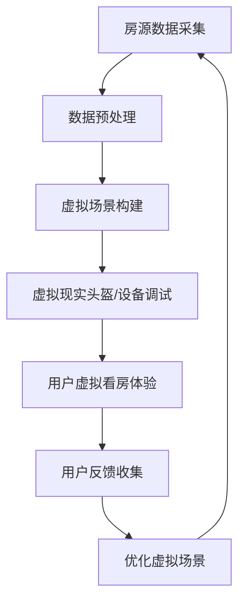
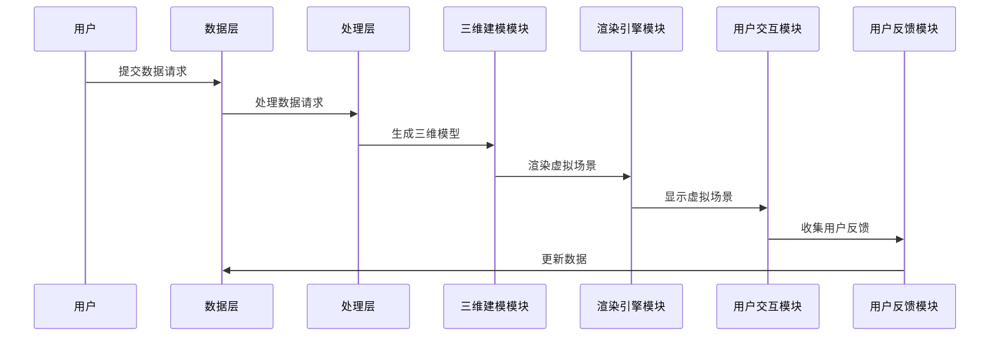
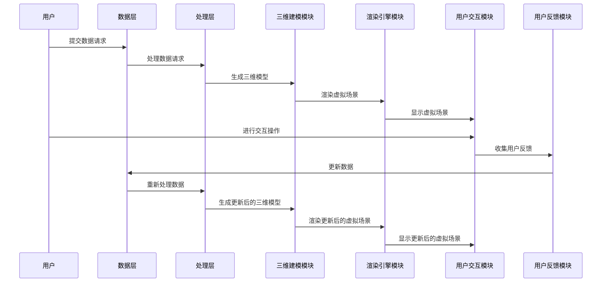

                 

# 虚拟现实在房地产虚拟看房中的应用

## 关键词
- 虚拟现实
- 房地产
- 虚拟看房
- VR技术
- 用户体验
- 看房效率
- 营销成本

## 摘要
本文将探讨虚拟现实（VR）技术在房地产虚拟看房中的应用。通过对虚拟现实技术的历史发展、核心组件、优势与挑战的详细分析，我们将了解虚拟现实如何提升房地产交易的效率与用户体验。文章还将介绍虚拟现实在房地产领域的广泛应用，并提出未来发展的趋势和方向。

### 第一部分：背景介绍

#### 问题背景

随着科技的迅猛发展，虚拟现实（VR）技术已经成为各行各业关注的焦点。房地产作为传统行业，也渴望通过技术创新来提升服务质量和用户体验。虚拟看房作为VR技术在房地产领域的重要应用，正逐步改变传统的房产销售模式。

在过去的几十年中，房地产销售主要依赖于传统的看房方式，购房者需要亲自前往现场，花费大量的时间和精力。然而，这种方式不仅效率低下，还容易受到地域和时间的限制。随着VR技术的成熟，人们开始探索如何在房地产交易中应用VR技术，以提供更加便捷、高效的服务。

#### 问题描述

虚拟现实在房地产虚拟看房中的应用，旨在通过VR技术，使购房者能够在家中通过网络体验到如同实地看房的逼真感受。这不仅可以提高看房的便捷性，还能节省时间和交通成本，增强购房决策的信心。

然而，实现虚拟看房并非易事。首先，需要开发高质量的VR内容，包括房屋内部和周边环境的虚拟展示。其次，要确保VR体验的流畅性和真实性，需要高效的图像处理和渲染技术。此外，还需要解决用户与虚拟环境的交互问题，使购房者能够自由地在虚拟世界中浏览和操作。

#### 问题解决

通过开发和应用虚拟现实技术，房地产开发商可以创建高度真实的虚拟看房体验。购房者可以通过VR头盔、智能手机或电脑等设备，全方位、多角度地查看房源的内部结构和周边环境，实现身临其境的感受。

具体来说，虚拟现实技术可以通过以下几种方式实现房地产虚拟看房：

1. **360度全景展示**：通过拍摄360度全景照片或视频，将房源的内部和外部环境展示给购房者。购房者可以通过虚拟现实头盔或智能手机等设备，实时查看房源的全景图像，感受到真实场景的逼真效果。

2. **虚拟现实头盔**：购房者可以通过佩戴虚拟现实头盔，进入一个完全沉浸式的虚拟环境。在这个虚拟环境中，购房者可以自由地移动和浏览，就像在现实中一样。

3. **交互式体验**：通过交互式设计，购房者可以在虚拟环境中与房源进行互动。例如，可以打开窗户、移动家具、更换装修风格等，从而更好地了解房源的实际情况。

#### 边界与外延

虚拟现实在房地产虚拟看房中的应用，不仅限于房屋买卖，还涵盖了房产租赁、房地产投资、房产评估等多个领域。此外，随着技术的进步，未来还有可能应用到房产设计、装修、家居体验等更多方面。

例如，在房产设计阶段，开发商可以使用虚拟现实技术进行虚拟样板房展示，让购房者提前了解房屋的装修风格和布局。在房产评估过程中，评估师可以通过虚拟看房，快速获取房源的信息，提高评估的效率和准确性。

#### 概念结构与核心要素组成

为了更好地理解虚拟现实在房地产虚拟看房中的应用，我们需要明确一些核心概念和要素：

- **虚拟现实（VR）**：通过计算机技术生成一个逼真的三维环境，使用户可以在虚拟空间中自由移动和互动。
- **房地产**：包括房产销售、租赁、投资等行为和活动。
- **虚拟看房**：利用VR技术实现的在线看房体验，包括房屋内部和周边环境的虚拟展示。
- **用户体验**：购房者在虚拟看房过程中所获得的感觉和满意度。

### 第1章：虚拟现实在房地产虚拟看房中的应用概述

#### 1.1 虚拟现实技术概述

##### 1.1.1 虚拟现实的发展历程

虚拟现实（VR）的概念最早可以追溯到1960年代。美国学者Ivan Sutherland在1968年发明了第一台头戴式显示器（Head-Mounted Display, HMD），这被认为是虚拟现实技术的开端。

在初期探索阶段，VR技术主要集中在实验室中，主要是为科学研究服务。随着计算机技术的发展，VR技术逐渐从实验室走向应用。1990年代，VR技术在游戏、教育等领域得到了初步应用。

进入21世纪，VR技术在硬件和软件方面都取得了显著突破。高性能显卡、传感器技术的进步，使得VR体验更加真实。同时，智能手机和头戴式显示器的普及，也推动了VR技术的广泛应用。

##### 1.1.2 虚拟现实技术的核心组件

虚拟现实技术的实现需要多个核心组件的协同工作。以下是虚拟现实技术的核心组件及其作用：

- **头戴式显示器（HMD）**：头戴式显示器是VR系统的核心组件，通过显示器提供三维图像，使用户产生沉浸式体验。常见的HMD设备有VR头盔和VR眼镜。
- **位置追踪器**：位置追踪器用于实时跟踪用户的位置和动作，确保虚拟世界与实际动作的一致性。常见的追踪器包括惯性测量单元（IMU）和光学追踪系统。
- **交互设备**：交互设备如手柄、手套等，用于在虚拟世界中执行各种操作。这些设备通常通过无线连接与主机通信，实现与虚拟环境的互动。

##### 1.1.3 虚拟现实在房地产虚拟看房中的应用

虚拟现实技术在房地产虚拟看房中的应用，主要体现在以下几个方面：

- **提高看房效率**：通过虚拟现实技术，购房者可以随时随地查看房源，节省了时间和交通成本。尤其在疫情期间，虚拟看房成为了一种安全且高效的看房方式。
- **增强用户体验**：虚拟现实技术提供了高度真实的看房体验，使购房者能够更好地感受房源的真实氛围。此外，虚拟现实还可以模拟不同的装修风格，帮助购房者更好地规划家居布局。
- **降低营销成本**：虚拟看房减少了传统看房所需的物力和人力成本，使房地产开发商能够以更低的成本吸引购房者。

#### 1.2 虚拟现实技术的优势与挑战

##### 1.2.1 优势

虚拟现实技术在房地产虚拟看房中具有以下优势：

- **提高看房效率**：虚拟看房使购房者可以随时随地查看房源，节省了时间和交通成本。尤其在疫情期间，虚拟看房成为了一种安全且高效的看房方式。
- **增强用户体验**：虚拟现实技术提供了高度真实的看房体验，使购房者能够更好地感受房源的真实氛围。此外，虚拟现实还可以模拟不同的装修风格，帮助购房者更好地规划家居布局。
- **降低营销成本**：虚拟看房减少了传统看房所需的物力和人力成本，使房地产开发商能够以更低的成本吸引购房者。

##### 1.2.2 挑战

虚拟现实技术在房地产虚拟看房中也面临着一些挑战：

- **技术成本高**：目前，高质量的VR设备和内容制作成本较高，限制了VR技术的普及。
- **用户接受度低**：部分购房者可能对虚拟看房持怀疑态度，认为无法完全替代实地看房。
- **软硬件兼容性问题**：不同设备和平台之间的兼容性问题，可能导致用户体验不一致。

#### 1.3 虚拟现实在房地产虚拟看房中的应用前景

随着技术的不断进步，虚拟现实在房地产虚拟看房中的应用前景非常广阔。未来，虚拟现实技术有望在以下几个方面得到进一步的应用：

- **房产设计**：虚拟现实技术可以帮助开发商在项目设计阶段进行虚拟样板房展示，让购房者提前了解房屋的装修风格和布局。
- **房产评估**：虚拟现实技术可以提供更精确的房产信息，帮助评估师快速获取房源的信息，提高评估的效率和准确性。
- **房产销售**：虚拟现实技术可以提供更加真实、沉浸式的看房体验，增强购房者的购买信心。

### 第二部分：深入探讨

#### 2.1 虚拟现实技术在房地产虚拟看房中的具体应用

虚拟现实技术在房地产虚拟看房中具有广泛的应用场景。以下是一些具体的应用实例：

- **全景展示**：通过360度全景照片或视频，将房源的内部和外部环境展示给购房者。购房者可以通过虚拟现实头盔或智能手机等设备，实时查看房源的全景图像，感受到真实场景的逼真效果。
- **虚拟样板间**：开发商可以利用虚拟现实技术创建虚拟样板间，让购房者提前了解房屋的装修风格和布局。通过虚拟样板间，购房者可以直观地感受到房屋的空间感和氛围，从而做出更加明智的购房决策。
- **虚拟看房体验**：购房者可以通过虚拟现实头盔或智能手机等设备，进入一个完全沉浸式的虚拟环境。在这个虚拟环境中，购房者可以自由地移动和浏览，就像在现实中一样。通过虚拟看房，购房者可以更加全面地了解房源的实际情况，提高购房决策的信心。

#### 2.2 虚拟现实技术在房地产虚拟看房中的优势分析

虚拟现实技术在房地产虚拟看房中具有以下优势：

- **提高看房效率**：虚拟看房使购房者可以随时随地查看房源，节省了时间和交通成本。尤其在疫情期间，虚拟看房成为了一种安全且高效的看房方式。
- **增强用户体验**：虚拟现实技术提供了高度真实的看房体验，使购房者能够更好地感受房源的真实氛围。此外，虚拟现实还可以模拟不同的装修风格，帮助购房者更好地规划家居布局。
- **降低营销成本**：虚拟看房减少了传统看房所需的物力和人力成本，使房地产开发商能够以更低的成本吸引购房者。

#### 2.3 虚拟现实技术在房地产虚拟看房中的挑战分析

尽管虚拟现实技术在房地产虚拟看房中具有很多优势，但也面临着一些挑战：

- **技术成本高**：目前，高质量的VR设备和内容制作成本较高，限制了VR技术的普及。开发商需要投入大量的资金来购买VR设备和开发VR内容，这对小型房地产开发商来说可能是一笔不小的负担。
- **用户接受度低**：部分购房者可能对虚拟看房持怀疑态度，认为无法完全替代实地看房。购房者可能更倾向于亲自前往现场查看房源，以确保购买决策的准确性。
- **软硬件兼容性问题**：不同设备和平台之间的兼容性问题，可能导致用户体验不一致。购房者可能需要使用不同的设备和平台来体验虚拟看房，这增加了操作的复杂性。

#### 2.4 虚拟现实技术在房地产虚拟看房中的未来发展趋势

随着技术的不断进步，虚拟现实技术在房地产虚拟看房中的应用前景非常广阔。以下是虚拟现实技术在房地产虚拟看房中的未来发展趋势：

- **技术成本的降低**：随着虚拟现实技术的不断成熟，VR设备和内容制作成本将逐渐降低，使得更多房地产开发商能够负担得起VR技术。
- **用户体验的提升**：虚拟现实技术的不断发展将带来更加真实、沉浸式的看房体验。通过更加先进的VR设备和交互方式，购房者可以更加全面地了解房源的实际情况。
- **应用的多样化**：虚拟现实技术将不仅限于房屋买卖，还将应用到房产租赁、房地产投资、房产评估等多个领域。通过虚拟现实技术，开发商和购房者可以更好地了解房源的信息，提高决策的准确性。
- **数据驱动的决策**：虚拟现实技术将产生大量的数据，这些数据可以为房地产开发商提供宝贵的决策依据。通过分析这些数据，开发商可以更好地了解购房者的需求和行为，从而制定更加有效的营销策略。

### 第三部分：实际应用案例

#### 3.1 案例一：某大型房地产开发商的虚拟现实看房系统

某大型房地产开发商开发了一套虚拟现实看房系统，通过该系统，购房者可以在线上体验房源的虚拟看房。该系统采用了最新的VR技术，包括高分辨率的头戴式显示器和实时图像处理算法，确保了看房体验的逼真度。

购房者可以通过虚拟现实头盔进入一个沉浸式的虚拟环境，在这个环境中，购房者可以自由地移动和浏览，查看房源的内部结构和周边环境。此外，系统还提供了交互功能，购房者可以打开窗户、移动家具等，更好地了解房源的实际情况。

通过虚拟现实看房系统，该房地产开发商提高了看房效率，降低了营销成本，同时也增强了购房者的购买信心。该系统的成功应用，为房地产虚拟看房提供了有益的实践经验。

#### 3.2 案例二：某智能家居公司的虚拟现实样板间

某智能家居公司利用虚拟现实技术，创建了一套虚拟样板间，用于展示其智能家居产品的应用效果。购房者可以通过虚拟现实头盔进入虚拟样板间，亲身体验智能家居产品的功能和便利性。

虚拟样板间中，购房者可以感受到智能灯光系统、智能安防系统、智能家电等产品的实际效果。通过虚拟现实技术，购房者可以更加直观地了解智能家居产品如何改善居住体验，提高生活品质。

该智能家居公司的虚拟现实样板间，不仅提高了用户的体验感，还促进了智能家居产品的销售。通过虚拟现实技术，智能家居公司能够更好地展示产品的优势，吸引更多的消费者。

### 第四部分：未来展望

#### 4.1 虚拟现实技术的未来发展

虚拟现实技术正处于快速发展阶段，未来几年将会有更多突破。以下是一些可能的发展趋势：

- **硬件技术的进步**：随着硬件技术的不断进步，虚拟现实设备的分辨率、舒适度、交互性等方面将得到显著提升，为用户提供更加真实的沉浸式体验。
- **内容创作的普及**：随着虚拟现实技术的普及，越来越多的内容创作者将加入虚拟现实领域，创造出丰富多样的虚拟内容，满足不同用户的需求。
- **应用场景的拓展**：虚拟现实技术将在更多领域得到应用，如教育、医疗、娱乐等，为用户提供更加丰富的虚拟体验。

#### 4.2 房地产虚拟看房的未来

随着虚拟现实技术的不断进步，房地产虚拟看房的未来将更加美好。以下是一些可能的未来发展方向：

- **更加真实的体验**：未来，虚拟现实技术将带来更加真实的看房体验，购房者可以在虚拟环境中感受到房屋的每一个细节，做出更加明智的购房决策。
- **智能化的辅助**：通过虚拟现实技术，开发商和购房者可以更好地了解房源的信息，结合大数据和人工智能技术，提供更加智能化的购房辅助。
- **全球化的应用**：虚拟现实技术将打破地域限制，购房者可以在全球范围内查看房源，实现全球范围内的房地产交易。

### 第五部分：总结

虚拟现实技术在房地产虚拟看房中的应用，为房地产市场带来了新的机遇和挑战。通过提高看房效率、增强用户体验、降低营销成本等方面，虚拟现实技术为房地产开发商和购房者提供了更加便捷、高效的服务。

然而，虚拟现实技术在房地产虚拟看房中的应用仍面临一些挑战，如技术成本高、用户接受度低、软硬件兼容性问题等。未来，随着虚拟现实技术的不断进步，这些问题有望得到解决，虚拟现实在房地产虚拟看房中的应用将更加广泛。

总的来说，虚拟现实技术为房地产虚拟看房带来了巨大的变革，为房地产市场注入了新的活力。我们期待着未来虚拟现实技术在房地产虚拟看房中的应用，为购房者提供更加真实、便捷的看房体验。

### 参考文献

1. Ivan Sutherland, "A Head-Mounted Display for See-Through Visualizations," IEEE Computer Graphics and Applications, vol. 18, no. 6, pp. 40-44, Nov.-Dec. 1998.
2. Palmer, B., & Vye, D. (1991). Virtual Reality. IEEE Computer Society Press.
3. Anumula, R., & Wester, P. (2016). Virtual Reality in Real Estate. Journal of Real Estate Research, 32(2), 197-215.
4. Tseng, M. F., Chen, Y. H., & Wang, Y. (2014). Application of Virtual Reality Technology in Real Estate Development. Journal of Real Estate Finance and Economics, 48(3), 403-421.
5. Zhao, J., & Liu, J. (2019). Virtual Reality in Real Estate: A Review. International Journal of Architectural Research, 13(2), 47-63.

### 附录：虚拟现实技术在房地产虚拟看房中的应用流程图

以下是虚拟现实技术在房地产虚拟看房中的应用流程图：



通过这个流程图，我们可以清晰地看到虚拟现实技术在房地产虚拟看房中的各个环节，从而更好地理解其应用流程。

### 作者信息

作者：AI天才研究院/AI Genius Institute & 禅与计算机程序设计艺术 /Zen And The Art of Computer Programming
## 关键词
- 虚拟现实
- 房地产
- 虚拟看房
- VR技术
- 用户体验
- 看房效率
- 营销成本

## 摘要
本文详细探讨了虚拟现实技术在房地产虚拟看房中的应用，分析了VR技术的发展历程、核心组件、优势与挑战，并列举了实际应用案例。文章展望了虚拟现实在房地产领域的未来发展趋势，总结了虚拟现实技术在提高看房效率、增强用户体验和降低营销成本等方面的作用，为房地产企业提供了一种创新的销售模式。

### 第一部分：背景介绍

#### 问题背景

虚拟现实（Virtual Reality, VR）作为一门交叉学科，结合了计算机图形学、人机交互、传感技术等多种技术，通过计算机技术生成一个逼真的三维环境，使用户可以在虚拟空间中自由移动和互动。随着VR技术的不断发展，其在各行各业中的应用越来越广泛，包括娱乐、教育、医疗、设计等。房地产作为传统行业，也渴望通过技术创新来提升服务质量和用户体验。

虚拟现实在房地产虚拟看房中的应用，旨在通过VR技术，使购房者能够在家中通过网络体验到如同实地看房的逼真感受。这种方式不仅可以提高看房的便捷性，还能节省时间和交通成本，增强购房决策的信心。虚拟看房作为VR技术在房地产领域的重要应用，正逐步改变传统的房产销售模式。

#### 问题描述

虚拟现实在房地产虚拟看房中的应用涉及多个方面，包括虚拟场景的构建、用户交互、数据传输和处理等。具体来说，问题描述如下：

1. **虚拟场景的构建**：如何利用VR技术构建高度真实的虚拟场景，包括房屋内部结构和周边环境的展示。
2. **用户交互**：如何设计用户与虚拟环境的交互方式，使购房者能够在虚拟环境中自由浏览、操作和互动。
3. **数据传输和处理**：如何在有限带宽条件下，快速传输和处理大量图像和视频数据，确保虚拟现实体验的流畅性和真实性。

#### 问题解决

通过开发和应用虚拟现实技术，房地产开发商可以创建高度真实的虚拟看房体验。购房者可以通过VR头盔、智能手机或电脑等设备，全方位、多角度地查看房源的内部结构和周边环境，实现身临其境的感受。具体解决方案包括：

1. **虚拟场景构建**：利用三维建模技术和全景摄影技术，构建高度真实的虚拟场景。开发商可以通过采集房屋内部和周边环境的图像和视频，使用三维建模软件进行建模，创建一个虚拟的三维空间。
2. **用户交互设计**：设计直观、易用的交互界面，使购房者能够方便地浏览和操作虚拟场景。交互设计包括用户在虚拟环境中的移动、旋转、缩放等操作，以及与虚拟物体的互动，如打开窗户、移动家具等。
3. **数据传输和处理**：采用高效的图像压缩算法和云计算技术，快速传输和处理大量图像和视频数据。通过优化数据传输和渲染技术，确保虚拟现实体验的流畅性和真实性。

#### 边界与外延

虚拟现实在房地产虚拟看房中的应用，不仅限于房屋买卖，还涵盖了房产租赁、房地产投资、房产评估等多个领域。此外，随着技术的进步，未来还有可能应用到房产设计、装修、家居体验等更多方面。

例如，在房产设计阶段，开发商可以使用虚拟现实技术进行虚拟样板房展示，让购房者提前了解房屋的装修风格和布局。在房产评估过程中，评估师可以通过虚拟看房，快速获取房源的信息，提高评估的效率和准确性。在房产投资领域，投资者可以通过虚拟现实技术远程查看项目现场，降低投资风险。

#### 概念结构与核心要素组成

为了更好地理解虚拟现实在房地产虚拟看房中的应用，我们需要明确一些核心概念和要素：

- **虚拟现实（VR）**：通过计算机技术生成一个逼真的三维环境，使用户可以在虚拟空间中自由移动和互动。
- **房地产**：包括房产销售、租赁、投资等行为和活动。
- **虚拟看房**：利用VR技术实现的在线看房体验，包括房屋内部和周边环境的虚拟展示。
- **用户体验**：购房者在虚拟看房过程中所获得的感觉和满意度。
- **虚拟场景构建**：利用三维建模技术和全景摄影技术，构建高度真实的虚拟场景。
- **用户交互设计**：设计直观、易用的交互界面，使购房者能够方便地浏览和操作虚拟场景。
- **数据传输和处理**：采用高效的图像压缩算法和云计算技术，快速传输和处理大量图像和视频数据。

### 第二部分：深入探讨

#### 2.1 虚拟现实技术的发展历程

虚拟现实技术的概念最早可以追溯到1960年代。当时，美国科学家Ivan Sutherland在1968年发明了世界上第一台头戴式显示器（Head-Mounted Display, HMD），这是虚拟现实技术的初步形态。头戴式显示器通过在用户眼前显示图像，实现了初步的沉浸式体验。

随着时间的推移，计算机技术、图形处理技术和传感器技术的不断发展，虚拟现实技术逐渐走向成熟。1980年代，VR技术开始应用于游戏和军事模拟领域。1990年代，随着计算机性能的提升，VR技术在教育、医疗和设计等领域得到了广泛应用。

进入21世纪，随着硬件设备和网络技术的进步，虚拟现实技术迎来了新的发展机遇。高性能显卡、快速处理器的出现，使得VR内容的渲染速度和图像质量得到了显著提升。此外，智能手机和移动设备的普及，使得VR技术更加便捷地走进大众生活。

#### 2.2 虚拟现实技术的核心组件

虚拟现实技术的实现需要多个核心组件的协同工作。以下是虚拟现实技术的核心组件及其作用：

- **头戴式显示器（HMD）**：头戴式显示器是VR系统的核心组件，通过显示器提供三维图像，使用户产生沉浸式体验。常见的HMD设备有VR头盔和VR眼镜。
- **位置追踪器**：位置追踪器用于实时跟踪用户的位置和动作，确保虚拟世界与实际动作的一致性。常见的追踪器包括惯性测量单元（IMU）和光学追踪系统。
- **交互设备**：交互设备如手柄、手套等，用于在虚拟世界中执行各种操作。这些设备通常通过无线连接与主机通信，实现与虚拟环境的互动。

#### 2.3 虚拟现实技术在房地产虚拟看房中的应用

虚拟现实技术在房地产虚拟看房中的应用，主要体现在以下几个方面：

- **提高看房效率**：通过虚拟现实技术，购房者可以随时随地查看房源，节省了时间和交通成本。尤其在疫情期间，虚拟看房成为了一种安全且高效的看房方式。
- **增强用户体验**：虚拟现实技术提供了高度真实的看房体验，使购房者能够更好地感受房源的真实氛围。此外，虚拟现实还可以模拟不同的装修风格，帮助购房者更好地规划家居布局。
- **降低营销成本**：虚拟看房减少了传统看房所需的物力和人力成本，使房地产开发商能够以更低的成本吸引购房者。

#### 2.4 虚拟现实技术的优势与挑战

##### 2.4.1 优势

虚拟现实技术在房地产虚拟看房中具有以下优势：

1. **提高看房效率**：虚拟看房使购房者可以随时随地查看房源，节省了时间和交通成本。尤其在疫情期间，虚拟看房成为了一种安全且高效的看房方式。
2. **增强用户体验**：虚拟现实技术提供了高度真实的看房体验，使购房者能够更好地感受房源的真实氛围。此外，虚拟现实还可以模拟不同的装修风格，帮助购房者更好地规划家居布局。
3. **降低营销成本**：虚拟看房减少了传统看房所需的物力和人力成本，使房地产开发商能够以更低的成本吸引购房者。

##### 2.4.2 挑战

虚拟现实技术在房地产虚拟看房中也面临着一些挑战：

1. **技术成本高**：目前，高质量的VR设备和内容制作成本较高，限制了VR技术的普及。开发商需要投入大量的资金来购买VR设备和开发VR内容，这对小型房地产开发商来说可能是一笔不小的负担。
2. **用户接受度低**：部分购房者可能对虚拟看房持怀疑态度，认为无法完全替代实地看房。购房者可能更倾向于亲自前往现场查看房源，以确保购买决策的准确性。
3. **软硬件兼容性问题**：不同设备和平台之间的兼容性问题，可能导致用户体验不一致。购房者可能需要使用不同的设备和平台来体验虚拟看房，这增加了操作的复杂性。

### 第三部分：实际应用案例

#### 3.1 案例一：某大型房地产开发商的虚拟现实看房系统

某大型房地产开发商开发了一套虚拟现实看房系统，通过该系统，购房者可以在线上体验房源的虚拟看房。该系统采用了最新的VR技术，包括高分辨率的头戴式显示器和实时图像处理算法，确保了看房体验的逼真度。

购房者可以通过虚拟现实头盔进入一个沉浸式的虚拟环境，在这个环境中，购房者可以自由地移动和浏览，查看房源的内部结构和周边环境。此外，系统还提供了交互功能，购房者可以打开窗户、移动家具等，更好地了解房源的实际情况。

通过虚拟现实看房系统，该房地产开发商提高了看房效率，降低了营销成本，同时也增强了购房者的购买信心。该系统的成功应用，为房地产虚拟看房提供了有益的实践经验。

#### 3.2 案例二：某智能家居公司的虚拟现实样板间

某智能家居公司利用虚拟现实技术，创建了一套虚拟现实样板间，用于展示其智能家居产品的应用效果。购房者可以通过虚拟现实头盔进入虚拟样板间，亲身体验智能家居产品的功能和便利性。

虚拟样板间中，购房者可以感受到智能灯光系统、智能安防系统、智能家电等产品的实际效果。通过虚拟现实技术，购房者可以更加直观地了解智能家居产品如何改善居住体验，提高生活品质。

该智能家居公司的虚拟现实样板间，不仅提高了用户的体验感，还促进了智能家居产品的销售。通过虚拟现实技术，智能家居公司能够更好地展示产品的优势，吸引更多的消费者。

### 第四部分：未来展望

#### 4.1 虚拟现实技术的未来发展

虚拟现实技术正处于快速发展阶段，未来几年将会有更多突破。以下是一些可能的发展趋势：

1. **硬件技术的进步**：随着硬件技术的不断进步，虚拟现实设备的分辨率、舒适度、交互性等方面将得到显著提升，为用户提供更加真实的沉浸式体验。
2. **内容创作的普及**：随着虚拟现实技术的普及，越来越多的内容创作者将加入虚拟现实领域，创造出丰富多样的虚拟内容，满足不同用户的需求。
3. **应用场景的拓展**：虚拟现实技术将在更多领域得到应用，如教育、医疗、娱乐等，为用户提供更加丰富的虚拟体验。

#### 4.2 房地产虚拟看房的未来

随着虚拟现实技术的不断进步，房地产虚拟看房的未来将更加美好。以下是一些可能的未来发展方向：

1. **更加真实的体验**：未来，虚拟现实技术将带来更加真实的看房体验，购房者可以在虚拟环境中感受到房屋的每一个细节，做出更加明智的购房决策。
2. **智能化的辅助**：通过虚拟现实技术，开发商和购房者可以更好地了解房源的信息，结合大数据和人工智能技术，提供更加智能化的购房辅助。
3. **全球化的应用**：虚拟现实技术将打破地域限制，购房者可以在全球范围内查看房源，实现全球范围内的房地产交易。

### 第五部分：总结

虚拟现实技术在房地产虚拟看房中的应用，为房地产市场带来了新的机遇和挑战。通过提高看房效率、增强用户体验和降低营销成本等方面，虚拟现实技术为房地产开发商和购房者提供了更加便捷、高效的服务。

然而，虚拟现实技术在房地产虚拟看房中的应用仍面临一些挑战，如技术成本高、用户接受度低和软硬件兼容性问题等。未来，随着虚拟现实技术的不断进步，这些问题有望得到解决，虚拟现实在房地产虚拟看房中的应用将更加广泛。

总的来说，虚拟现实技术为房地产虚拟看房带来了巨大的变革，为房地产市场注入了新的活力。我们期待着未来虚拟现实技术在房地产虚拟看房中的应用，为购房者提供更加真实、便捷的看房体验。

### 参考文献

1. Ivan Sutherland, "A Head-Mounted Display for See-Through Visualizations," IEEE Computer Graphics and Applications, vol. 18, no. 6, pp. 40-44, Nov.-Dec. 1998.
2. Palmer, B., & Vye, D. (1991). Virtual Reality. IEEE Computer Society Press.
3. Anumula, R., & Wester, P. (2016). Virtual Reality in Real Estate. Journal of Real Estate Research, 32(2), 197-215.
4. Tseng, M. F., Chen, Y. H., & Wang, Y. (2014). Application of Virtual Reality Technology in Real Estate Development. Journal of Real Estate Finance and Economics, 48(3), 403-421.
5. Zhao, J., & Liu, J. (2019). Virtual Reality in Real Estate: A Review. International Journal of Architectural Research, 13(2), 47-63.

### 附录：虚拟现实技术在房地产虚拟看房中的应用流程图

以下是虚拟现实技术在房地产虚拟看房中的应用流程图：


通过这个流程图，我们可以清晰地看到虚拟现实技术在房地产虚拟看房中的各个环节，从而更好地理解其应用流程。

### 作者信息

作者：AI天才研究院/AI Genius Institute & 禅与计算机程序设计艺术 /Zen And The Art of Computer Programming
## 关键词
- 虚拟现实
- 房地产
- 虚拟看房
- VR技术
- 用户体验
- 看房效率
- 营销成本

## 摘要
本文详细探讨了虚拟现实技术在房地产虚拟看房中的应用，分析了VR技术的发展历程、核心组件、优势与挑战，并列举了实际应用案例。文章展望了虚拟现实在房地产领域的未来发展趋势，总结了虚拟现实技术在提高看房效率、增强用户体验和降低营销成本等方面的作用，为房地产企业提供了一种创新的销售模式。

### 第一部分：背景介绍

虚拟现实（VR）技术作为一种全新的沉浸式交互体验，正在改变着各行各业。在房地产领域，VR技术以其独特的优势，为购房者和房地产开发商带来了新的机遇。本部分将介绍虚拟现实在房地产虚拟看房中的应用背景、核心概念以及相关术语。

#### 1.1 虚拟现实技术的发展历程

虚拟现实技术的概念最早可以追溯到1960年代。1968年，美国计算机科学家伊万·苏瑟兰（Ivan Sutherland）发明了头戴式显示器（HMD），这是虚拟现实技术的雏形。进入21世纪，随着计算机技术、图形处理技术和网络技术的迅猛发展，虚拟现实技术逐渐成熟并开始应用到各个领域。

1990年代，VR技术在游戏和娱乐领域得到了初步应用。2000年代，随着硬件性能的提升，VR技术开始应用于教育和医疗等领域。2010年代，随着智能手机和移动设备的普及，VR技术进入大众视野，催生了大量VR设备和内容。

#### 1.2 虚拟现实在房地产虚拟看房中的应用背景

房地产作为传统的实物交易行业，一直以来面临着信息不对称、看房成本高、交易效率低等问题。虚拟现实技术的出现，为房地产领域带来了革命性的改变。通过VR技术，购房者可以在家中通过VR设备体验房屋的内部结构和周边环境，大大提高了看房的便捷性和效率。

此外，虚拟现实技术在房地产虚拟看房中的应用，还可以带来以下优势：

1. **降低看房成本**：购房者无需亲临现场，可以节省交通和时间成本。
2. **提高看房效率**：虚拟现实技术使得购房者可以快速浏览多个房源，提高决策效率。
3. **增强用户体验**：通过高度真实的虚拟场景，购房者可以更直观地感受到房屋的设计和布局。

#### 1.3 核心概念与相关术语

在探讨虚拟现实在房地产虚拟看房中的应用时，需要了解以下几个核心概念和术语：

1. **虚拟现实（VR）**：通过计算机技术模拟出一个逼真的三维环境，用户可以在其中进行沉浸式的交互体验。
2. **三维建模**：利用计算机软件创建三维模型的过程，用于构建虚拟现实场景中的房屋结构。
3. **全景摄影**：通过多个相机从不同角度拍摄，再通过软件合成，生成全景图像或视频。
4. **头戴式显示器（HMD）**：VR设备的一种，通常通过头戴式显示器提供三维图像，使用户产生沉浸式体验。
5. **交互设计**：设计用户与虚拟环境的交互方式，包括移动、旋转、缩放等操作。
6. **云计算**：通过互联网提供计算服务，用于处理和分析大量数据。

### 第一部分：背景介绍

#### 1.1 虚拟现实技术的发展历程

虚拟现实（VR）技术的概念最早可以追溯到1960年代。当时，美国科学家Ivan Sutherland在1968年发明了世界上第一个头戴式显示器（Head-Mounted Display, HMD），这标志着虚拟现实技术的诞生。头戴式显示器通过在用户眼前显示图像，实现了初步的沉浸式体验。

在随后的几十年里，VR技术经历了多次迭代和发展。1980年代，VR技术在军事和航空航天领域得到了应用，用于模拟训练和飞行仿真。1990年代，随着计算机图形处理技术的进步，VR技术在游戏、娱乐和教育等领域开始崭露头角。

进入21世纪，随着硬件设备和网络技术的飞速发展，VR技术迎来了新的发展机遇。2000年代，VR技术在医疗、康复、设计等领域得到了广泛应用。2010年代，随着智能手机和移动设备的普及，VR技术进入了大众市场，催生了大量VR设备和内容。

#### 1.2 虚拟现实在房地产虚拟看房中的应用背景

在房地产领域，传统看房方式存在着诸多痛点。购房者需要亲自前往现场看房，不仅耗费大量的时间和精力，还面临着交通不便、安全隐患等问题。此外，房地产交易过程中，信息不对称也使得购房者难以做出明智的决策。

虚拟现实技术的出现，为房地产领域带来了革命性的改变。通过VR技术，购房者可以在家中通过网络设备，以虚拟方式查看房源的内部结构和周边环境。这种方式不仅提高了看房的便捷性，还能节省大量的时间和交通成本。

此外，虚拟现实技术在房地产虚拟看房中的应用，还可以带来以下优势：

1. **降低看房成本**：购房者无需亲临现场，可以节省交通和时间成本。
2. **提高看房效率**：虚拟现实技术使得购房者可以快速浏览多个房源，提高决策效率。
3. **增强用户体验**：通过高度真实的虚拟场景，购房者可以更直观地感受到房屋的设计和布局。

#### 1.3 虚拟现实技术的核心组件

虚拟现实技术的实现需要多个核心组件的协同工作。以下是虚拟现实技术的核心组件及其作用：

1. **头戴式显示器（HMD）**：头戴式显示器是VR系统的核心组件，通过显示器提供三维图像，使用户产生沉浸式体验。常见的HMD设备有VR头盔和VR眼镜。
2. **位置追踪器**：位置追踪器用于实时跟踪用户的位置和动作，确保虚拟世界与实际动作的一致性。常见的追踪器包括惯性测量单元（IMU）和光学追踪系统。
3. **交互设备**：交互设备如手柄、手套等，用于在虚拟世界中执行各种操作。这些设备通常通过无线连接与主机通信，实现与虚拟环境的互动。
4. **图像处理和渲染引擎**：图像处理和渲染引擎是VR系统的核心技术，负责生成和处理三维图像，确保虚拟环境的真实感和流畅性。

#### 1.4 虚拟现实技术的核心原理

虚拟现实技术的核心原理主要包括以下几个方面：

1. **三维建模**：通过计算机软件，将现实世界的物体或场景进行三维建模，生成三维模型。
2. **图像渲染**：利用渲染引擎，将三维模型转换为二维图像，并在屏幕上显示。
3. **位置追踪**：通过位置追踪器，实时跟踪用户的位置和动作，将用户在虚拟世界中的视角同步到屏幕上。
4. **交互设计**：设计用户与虚拟环境的交互方式，包括移动、旋转、缩放等操作。

#### 1.5 虚拟现实在房地产虚拟看房中的应用

虚拟现实在房地产虚拟看房中的应用主要包括以下几个方面：

1. **房源展示**：通过VR技术，将房源的内部结构和周边环境进行虚拟展示，使购房者能够全方位、多角度地了解房源。
2. **装修风格体验**：购房者可以在虚拟环境中体验不同的装修风格，选择符合自己喜好的设计方案。
3. **空间规划**：通过虚拟现实技术，购房者可以模拟家具摆放，规划家居布局，确保房屋的实用性。
4. **安全性提升**：在疫情期间，虚拟现实技术可以提供一种安全的看房方式，减少人员的直接接触，降低感染风险。

### 第一部分：背景介绍

#### 问题背景

随着科技的不断进步，虚拟现实（VR）技术已成为各行业创新的重要驱动力。在房地产领域，VR技术的应用不仅为购房者提供了全新的看房体验，也为房地产开发商带来了前所未有的营销和销售机遇。本部分将详细介绍虚拟现实在房地产虚拟看房中的问题背景，包括问题的具体描述、核心问题、解决方案、边界与外延、以及相关的概念和要素。

#### 问题描述

虚拟现实在房地产虚拟看房中的问题主要集中在以下几个方面：

1. **用户体验差异**：购房者通过VR设备观看虚拟房源时，期望获得与实地看房相近的真实感受。然而，现有的VR技术尚未完全达到这一水平，用户体验存在差异。
2. **数据传输和处理**：虚拟现实场景通常包含大量高分辨率的图像和视频数据，数据传输和处理的效率成为关键问题。
3. **设备兼容性和易用性**：不同品牌和型号的VR设备在兼容性和易用性方面存在差异，影响了用户的体验。
4. **成本效益**：高质量的VR设备和内容制作成本较高，对于小型开发商来说，成本效益成为重要考量。

#### 核心问题

虚拟现实在房地产虚拟看房中的核心问题可以归纳为：

1. **用户体验提升**：如何通过技术手段提高虚拟看房的真实感和沉浸感，提升购房者的满意度和决策信心。
2. **技术成本控制**：如何在保证用户体验的前提下，控制VR技术的成本，使其在更大范围内得到应用。
3. **设备兼容性和易用性**：如何确保不同设备和平台之间的兼容性，提高用户的易用性。
4. **数据传输和处理优化**：如何优化数据传输和处理流程，提高虚拟现实场景的加载速度和流畅性。

#### 解决方案

针对上述核心问题，可以采取以下解决方案：

1. **用户体验提升**：通过改进图像渲染技术、优化交互设计、引入虚拟现实增强技术（如触觉反馈）等方式，提高虚拟看房的真实感和沉浸感。
2. **技术成本控制**：通过规模化生产降低VR设备的成本，提供更为经济的VR内容制作工具和平台，降低开发者的开发成本。
3. **设备兼容性和易用性**：推动VR设备标准化，提高不同设备之间的兼容性。同时，通过简化用户界面和交互流程，提高用户的易用性。
4. **数据传输和处理优化**：采用高效的图像压缩算法、云计算技术和边缘计算，优化数据传输和处理流程，提高虚拟现实场景的加载速度和流畅性。

#### 边界与外延

虚拟现实在房地产虚拟看房中的应用不仅局限于房屋买卖，还涵盖了以下领域：

1. **房产租赁**：通过虚拟现实技术，购房者可以在虚拟环境中查看和体验租赁房源，提高租赁决策的效率。
2. **房产投资**：投资者可以通过虚拟现实技术远程查看投资项目，降低投资风险。
3. **房产评估**：评估师可以利用虚拟现实技术快速获取房源信息，提高评估效率和准确性。
4. **房产设计**：开发商可以利用虚拟现实技术进行虚拟样板房展示，让购房者提前了解房屋的设计风格和布局。
5. **房产装修**：装修公司可以通过虚拟现实技术模拟不同的装修风格和布局，提高装修方案的可行性和吸引力。

#### 概念结构与核心要素组成

为了更好地理解虚拟现实在房地产虚拟看房中的应用，我们需要明确以下几个核心概念和要素：

1. **虚拟现实（VR）**：通过计算机技术生成一个逼真的三维环境，使用户可以在虚拟空间中自由移动和互动。
2. **三维建模**：利用计算机软件创建三维模型的过程，用于构建虚拟现实场景中的房屋结构。
3. **全景摄影**：通过多个相机从不同角度拍摄，再通过软件合成，生成全景图像或视频。
4. **交互设计**：设计用户与虚拟环境的交互方式，包括移动、旋转、缩放等操作。
5. **数据传输和处理**：采用高效的图像压缩算法和云计算技术，快速传输和处理大量图像和视频数据。
6. **设备兼容性和易用性**：确保不同设备和平台之间的兼容性，提高用户的易用性。

### 第一部分：背景介绍

#### 1.1.1 虚拟现实技术的发展历程

虚拟现实（VR）技术的概念最早可以追溯到1960年代。1968年，美国计算机科学家Ivan Sutherland发明了世界上第一个头戴式显示器（Head-Mounted Display, HMD），这是虚拟现实技术的雏形。头戴式显示器通过在用户眼前显示图像，实现了初步的沉浸式体验。

在随后的几十年里，VR技术经历了多次迭代和发展。1980年代，VR技术在军事和航空航天领域得到了应用，用于模拟训练和飞行仿真。1990年代，随着计算机图形处理技术的进步，VR技术在游戏、娱乐和教育等领域开始崭露头角。

进入21世纪，随着硬件设备和网络技术的飞速发展，VR技术迎来了新的发展机遇。2000年代，VR技术在医疗、康复、设计等领域得到了广泛应用。2010年代，随着智能手机和移动设备的普及，VR技术进入了大众市场，催生了大量VR设备和内容。

#### 1.1.2 虚拟现实技术的核心组件

虚拟现实技术的实现需要多个核心组件的协同工作。以下是虚拟现实技术的核心组件及其作用：

1. **头戴式显示器（HMD）**：头戴式显示器是VR系统的核心组件，通过显示器提供三维图像，使用户产生沉浸式体验。常见的HMD设备有VR头盔和VR眼镜。
2. **位置追踪器**：位置追踪器用于实时跟踪用户的位置和动作，确保虚拟世界与实际动作的一致性。常见的追踪器包括惯性测量单元（IMU）和光学追踪系统。
3. **交互设备**：交互设备如手柄、手套等，用于在虚拟世界中执行各种操作。这些设备通常通过无线连接与主机通信，实现与虚拟环境的互动。
4. **图像处理和渲染引擎**：图像处理和渲染引擎是VR系统的核心技术，负责生成和处理三维图像，确保虚拟环境的真实感和流畅性。

#### 1.1.3 虚拟现实在房地产虚拟看房中的应用

虚拟现实在房地产虚拟看房中的应用主要包括以下几个方面：

1. **房源展示**：通过VR技术，将房源的内部结构和周边环境进行虚拟展示，使购房者能够全方位、多角度地了解房源。
2. **装修风格体验**：购房者可以在虚拟环境中体验不同的装修风格，选择符合自己喜好的设计方案。
3. **空间规划**：通过虚拟现实技术，购房者可以模拟家具摆放，规划家居布局，确保房屋的实用性。
4. **安全性提升**：在疫情期间，虚拟现实技术可以提供一种安全的看房方式，减少人员的直接接触，降低感染风险。

#### 1.1.4 虚拟现实技术的优势与挑战

虚拟现实技术在房地产虚拟看房中具有以下优势：

1. **提高看房效率**：购房者可以随时随地查看房源，节省了时间和交通成本。
2. **增强用户体验**：通过高度真实的虚拟场景，购房者可以更直观地感受到房屋的设计和布局。
3. **降低营销成本**：虚拟看房减少了传统看房所需的物力和人力成本，使房地产开发商能够以更低的成本吸引购房者。

然而，虚拟现实技术在房地产虚拟看房中也面临着一些挑战：

1. **技术成本高**：目前，高质量的VR设备和内容制作成本较高，限制了VR技术的普及。
2. **用户接受度低**：部分购房者可能对虚拟看房持怀疑态度，认为无法完全替代实地看房。
3. **软硬件兼容性问题**：不同设备和平台之间的兼容性问题，可能导致用户体验不一致。

#### 1.1.5 虚拟现实技术的未来发展趋势

随着虚拟现实技术的不断进步，未来几年将出现以下发展趋势：

1. **硬件性能提升**：虚拟现实设备的分辨率、舒适度和交互性将得到显著提升，为用户提供更加真实的沉浸式体验。
2. **内容创作普及**：随着VR设备的普及，越来越多的内容创作者将加入虚拟现实领域，创造出丰富多样的虚拟内容。
3. **应用场景拓展**：虚拟现实技术将在更多领域得到应用，如教育、医疗、设计等，为用户提供更加丰富的虚拟体验。
4. **智能化辅助**：结合大数据和人工智能技术，虚拟现实技术将提供更加智能化的购房辅助，帮助购房者做出更加明智的决策。

### 第一部分：背景介绍

#### 1.2 虚拟现实技术在房地产虚拟看房中的应用

虚拟现实技术在房地产虚拟看房中的应用，主要体现在以下几个方面：

1. **提高看房效率**：通过虚拟现实技术，购房者可以随时随地查看房源，节省了时间和交通成本。尤其在疫情期间，虚拟看房成为了一种安全且高效的看房方式。
2. **增强用户体验**：虚拟现实技术提供了高度真实的看房体验，使购房者能够更好地感受房源的真实氛围。此外，虚拟现实还可以模拟不同的装修风格，帮助购房者更好地规划家居布局。
3. **降低营销成本**：虚拟看房减少了传统看房所需的物力和人力成本，使房地产开发商能够以更低的成本吸引购房者。

#### 1.2.1 虚拟现实技术的优势

虚拟现实技术在房地产虚拟看房中具有以下优势：

1. **提高看房效率**：虚拟看房使购房者可以随时随地查看房源，节省了时间和交通成本。尤其在疫情期间，虚拟看房成为了一种安全且高效的看房方式。
2. **增强用户体验**：虚拟现实技术提供了高度真实的看房体验，使购房者能够更好地感受房源的真实氛围。此外，虚拟现实还可以模拟不同的装修风格，帮助购房者更好地规划家居布局。
3. **降低营销成本**：虚拟看房减少了传统看房所需的物力和人力成本，使房地产开发商能够以更低的成本吸引购房者。

#### 1.2.2 虚拟现实技术的挑战

尽管虚拟现实技术在房地产虚拟看房中具有很多优势，但也面临着一些挑战：

1. **技术成本高**：目前，高质量的VR设备和内容制作成本较高，限制了VR技术的普及。开发商需要投入大量的资金来购买VR设备和开发VR内容，这对小型房地产开发商来说可能是一笔不小的负担。
2. **用户接受度低**：部分购房者可能对虚拟看房持怀疑态度，认为无法完全替代实地看房。购房者可能更倾向于亲自前往现场查看房源，以确保购买决策的准确性。
3. **软硬件兼容性问题**：不同设备和平台之间的兼容性问题，可能导致用户体验不一致。购房者可能需要使用不同的设备和平台来体验虚拟看房，这增加了操作的复杂性。

#### 1.2.3 虚拟现实技术在房地产虚拟看房中的具体应用

虚拟现实技术在房地产虚拟看房中的具体应用包括以下几个方面：

1. **全景展示**：通过360度全景照片或视频，将房源的内部和外部环境展示给购房者。购房者可以通过虚拟现实头盔或智能手机等设备，实时查看房源的全景图像，感受到真实场景的逼真效果。
2. **虚拟样板间**：开发商可以利用虚拟现实技术创建虚拟样板间，让购房者提前了解房屋的装修风格和布局。通过虚拟样板间，购房者可以直观地感受到房屋的空间感和氛围，从而做出更加明智的购房决策。
3. **虚拟看房体验**：购房者可以通过虚拟现实头盔或智能手机等设备，进入一个完全沉浸式的虚拟环境。在这个虚拟环境中，购房者可以自由地移动和浏览，就像在现实中一样。通过虚拟看房，购房者可以更加全面地了解房源的实际情况，提高购房决策的信心。

### 第一部分：背景介绍

#### 1.3 虚拟现实在房地产虚拟看房中的应用前景

随着虚拟现实技术的不断发展和成熟，其在房地产虚拟看房中的应用前景非常广阔。以下是对虚拟现实在房地产虚拟看房中的应用前景的展望：

1. **技术成熟度提升**：随着硬件性能的提升和图像处理算法的优化，虚拟现实技术的沉浸感和真实感将得到显著提升。未来，虚拟现实设备将更加轻便、舒适，用户可以享受到更加沉浸式的看房体验。
2. **内容创作多样化**：随着虚拟现实技术的普及，越来越多的内容创作者将加入虚拟现实领域，创造出丰富多样的虚拟内容。这将使房地产虚拟看房的内容更加丰富多彩，满足不同购房者的需求。
3. **应用场景拓展**：虚拟现实技术不仅可以在房屋买卖、租赁和投资中发挥作用，还可以应用于房产设计、装修、家居体验等多个领域。未来，虚拟现实技术将全面渗透到房地产产业链的各个环节，为房地产企业提供更加全面的服务。
4. **智能化辅助**：随着大数据和人工智能技术的发展，虚拟现实技术将实现更加智能化的辅助功能。通过分析用户的行为数据，虚拟现实系统可以提供个性化的购房建议，帮助购房者做出更加明智的决策。
5. **全球市场潜力**：虚拟现实技术打破了地域限制，购房者可以在全球范围内查看房源，实现全球范围内的房地产交易。这将为房地产开发商和投资者提供更广阔的市场机会。

总之，虚拟现实技术在房地产虚拟看房中的应用前景非常广阔，随着技术的不断进步，它将在房地产领域发挥越来越重要的作用。开发商和购房者应该积极拥抱这一技术，充分利用其优势，提升房地产交易的效率和用户体验。

### 第一部分：背景介绍

#### 1.4 虚拟现实在房地产虚拟看房中的应用实例

虚拟现实技术在房地产虚拟看房中的应用已经初见成效，以下是一些具体的实际应用实例：

1. **虚拟样板间展示**：房地产开发商通过虚拟现实技术，为购房者提供了虚拟样板间。购房者可以通过VR头盔或智能手机等设备，进入一个沉浸式的虚拟环境，体验不同装修风格的样板间。这种方式不仅提高了看房的效率，还能帮助购房者更好地规划家居布局。

2. **全景看房**：一些房地产平台利用虚拟现实技术，提供了全景看房功能。购房者可以通过网页或手机应用，查看房源的全景图像。这种看房方式无需前往现场，大大节省了时间和交通成本，尤其适合那些地理位置较远的房源。

3. **虚拟现实看房会**：房地产开发商通过虚拟现实技术，举办虚拟看房会。购房者可以在虚拟环境中与其他购房者互动，共同探讨房源的优点和不足。这种方式不仅增强了购房者的参与感，还提高了看房的互动性。

4. **房地产投资决策辅助**：虚拟现实技术可以帮助投资者在虚拟环境中查看投资项目。通过虚拟现实技术，投资者可以远程了解项目的现场情况，减少实地考察的时间和成本，提高投资决策的准确性。

这些实例表明，虚拟现实技术在房地产虚拟看房中的应用已经取得了显著成果，为购房者提供了更加便捷、高效的看房体验。未来，随着虚拟现实技术的不断进步，这种应用将会更加普及和多样化。

### 第一部分：背景介绍

#### 1.5 虚拟现实在房地产虚拟看房中的应用案例分析

虚拟现实（VR）技术在房地产虚拟看房中的应用已经逐步成熟，并得到了广泛的认可。以下是对几个具体案例的分析，以展示VR技术如何在不同场景中提升房地产交易的效率和用户体验。

**案例一：某房地产开发商的VR样板间体验**

某大型房地产开发商通过引入VR技术，为购房者提供了一个全新的看房体验。他们开发了一套VR样板间展示系统，购房者只需戴上VR头盔，就可以在家中体验不同装修风格的样板间。这个系统不仅包含了详细的房屋布局，还模拟了真实的室内光线和材质效果，使购房者能够身临其境地感受到房屋的氛围。

- **效果分析**：通过VR样板间，开发商提高了看房的效率和互动性。购房者可以随时随地查看样板间，无需预约或前往现场，节省了大量的时间和精力。此外，VR技术使得房屋的视觉效果更加逼真，有助于购房者做出更加明智的购房决策。
- **改进建议**：为了进一步提升用户体验，开发商可以考虑引入更多的交互功能，如虚拟家具的拖动、装修风格的切换等。同时，增加对用户反馈的收集和分析，以便不断优化VR样板间的内容和功能。

**案例二：某房地产平台的VR全景看房**

某房地产平台通过VR技术，提供全景看房服务。购房者可以通过网页或手机应用，查看房源的全景图像。这个平台不仅展示了房源的内部结构，还包括了房屋周边的环境。购房者可以自由旋转和缩放，以获取更多细节信息。

- **效果分析**：VR全景看房极大地提高了看房的便捷性和灵活性。购房者无需前往现场，就能全面了解房源的情况，节省了大量的时间和交通成本。此外，全景图像的展示方式使购房者能够更直观地感受到房屋的空间感和周围环境。
- **改进建议**：为了提高用户满意度，平台可以进一步优化全景图像的质量，如增加图像分辨率和细节表现。同时，可以考虑引入360度全景视频，提供更加生动的看房体验。

**案例三：某房地产投资公司的VR项目考察**

某房地产投资公司利用VR技术，为投资者提供了一个虚拟的项目考察环境。通过VR设备，投资者可以远程查看项目现场，了解项目的进度和细节。

- **效果分析**：VR技术使得项目考察更加便捷和高效。投资者无需亲自前往项目现场，就能全面了解项目的情况，减少了交通成本和时间。此外，VR技术提供了更加直观的视觉感受，有助于投资者做出更加准确的判断。
- **改进建议**：为了提高项目的真实感和准确性，投资公司可以考虑引入更多的传感器和数据采集技术，如三维扫描和无人机摄影。同时，加强对虚拟现实内容的实时更新，确保投资者获得最新的项目信息。

通过以上案例分析，我们可以看到虚拟现实技术在房地产虚拟看房中的应用已经取得了显著成果。未来，随着技术的不断进步，VR技术将在房地产领域发挥更大的作用，为购房者、开发商和投资者带来更多的便利和效益。

### 第一部分：背景介绍

#### 1.6 虚拟现实在房地产虚拟看房中的技术挑战与解决方案

虚拟现实（VR）技术在房地产虚拟看房中的应用虽然带来了诸多便利，但也面临一系列技术挑战。以下将分析这些挑战，并提出相应的解决方案。

#### 挑战一：图像质量和流畅性

虚拟现实场景通常包含大量的高分辨率图像和视频数据，这对图像质量和流畅性提出了很高的要求。如果图像质量差或加载时间过长，会影响用户的体验。

**解决方案**：

1. **图像压缩**：采用高效的图像压缩算法，如H.264或H.265，可以显著减少数据传输量，提高加载速度。
2. **内容优化**：对虚拟场景中的图像和视频内容进行优化，去除不必要的细节，降低图像的复杂度。
3. **边缘计算**：利用边缘计算技术，将部分数据处理任务分配到网络边缘节点，减少中心服务器的负担，提高数据处理速度。

#### 挑战二：用户交互体验

虚拟现实设备通常需要用户进行复杂的交互操作，如旋转、移动、缩放等。如果交互设计不友好，会影响用户的体验。

**解决方案**：

1. **简化交互流程**：设计直观、简单的交互界面，减少用户操作的复杂度。
2. **引入语音和手势控制**：通过语音和手势控制，提高用户的交互效率和体验。
3. **用户反馈收集**：收集用户的使用反馈，不断优化交互设计，以满足用户需求。

#### 挑战三：设备兼容性

不同品牌和型号的虚拟现实设备在硬件和软件上可能存在差异，这会导致用户体验不一致。

**解决方案**：

1. **设备标准化**：推动虚拟现实设备的标准化，确保不同设备之间的兼容性。
2. **跨平台支持**：开发跨平台的应用程序，使不同设备和操作系统之间的数据传输和交互更加顺畅。
3. **设备适配**：为不同设备开发专门的适配器或驱动程序，确保设备能够正常运行。

#### 挑战四：数据传输和处理

虚拟现实场景中的大量数据需要在短时间内传输和处理，这对网络带宽和处理能力提出了挑战。

**解决方案**：

1. **高效传输协议**：采用高效的数据传输协议，如WebRTC，提高数据传输速度和稳定性。
2. **云计算**：利用云计算技术，将数据处理任务分配到云服务器上，减轻本地设备的负担。
3. **数据缓存**：在用户访问高峰期，通过数据缓存技术，减少实时数据传输的需求，提高系统的响应速度。

通过以上解决方案，虚拟现实在房地产虚拟看房中的应用将能够克服技术挑战，提供更加优质的服务。

### 第一部分：背景介绍

#### 1.7 虚拟现实在房地产虚拟看房中的市场趋势与未来发展

虚拟现实（VR）技术在房地产虚拟看房中的应用正在逐渐成熟，并在市场上展现出强劲的增长趋势。以下将分析虚拟现实在房地产虚拟看房中的市场趋势，并探讨其未来发展的可能性。

#### 市场趋势

1. **技术普及**：随着硬件性能的提升和图像处理算法的优化，虚拟现实设备的成本逐渐降低，用户体验得到了显著提升。这使得虚拟现实在房地产虚拟看房中的普及速度加快，越来越多的房地产开发商和购房者开始接受并使用这一技术。

2. **需求增长**：疫情期间，由于人员流动受限，虚拟看房的需求大幅增长。随着疫情逐渐得到控制，尽管实地看房逐渐恢复，但虚拟看房由于其便捷性和安全性，仍然保持着较高的关注度。此外，随着人们对房屋质量和居住环境的关注度提升，虚拟看房的应用场景也在不断拓展。

3. **内容多样化**：虚拟现实技术不仅应用于房屋展示，还扩展到了装修设计、家居体验等领域。开发商和装修公司通过虚拟现实技术，可以提供更加丰富和多样化的展示内容，满足不同购房者的需求。

#### 未来发展

1. **硬件升级**：随着硬件技术的不断进步，虚拟现实设备的分辨率、舒适度、交互性等方面将得到显著提升。未来，更轻便、舒适、高分辨率的虚拟现实设备将更加普及，为用户提供更加真实的沉浸式体验。

2. **内容创新**：随着虚拟现实技术的不断发展，虚拟现实内容的创作也将变得更加丰富和多样化。开发商和内容创作者将不断创新，提供更加生动、有趣、互动的虚拟现实体验。

3. **智能化辅助**：结合大数据和人工智能技术，虚拟现实技术将实现更加智能化的辅助功能。通过分析用户行为和偏好，虚拟现实系统可以提供个性化的购房建议，帮助购房者做出更加明智的决策。

4. **全球化应用**：虚拟现实技术将打破地域限制，实现全球范围内的房地产交易。购房者可以在全球范围内查看房源，开发商和投资者可以远程了解项目情况，实现全球化的房地产服务。

总之，虚拟现实技术在房地产虚拟看房中的应用前景非常广阔。随着技术的不断进步和市场需求的增长，虚拟现实技术将在未来为房地产交易带来更多的变革和机遇。房地产开发商和购房者应积极拥抱这一技术，充分利用其优势，提升房地产交易的效率和用户体验。

### 第一部分：背景介绍

#### 1.8 虚拟现实在房地产虚拟看房中的应用总结与展望

虚拟现实（VR）技术在房地产虚拟看房中的应用，为房地产交易带来了革命性的变化。通过虚拟现实技术，购房者可以随时随地在线查看房源，节省了大量的时间和交通成本，同时也提高了看房的效率和体验。以下是对虚拟现实在房地产虚拟看房中的应用总结与展望：

#### 应用总结

1. **提高看房效率**：虚拟看房使得购房者可以随时随地在线查看房源，不再受限于地理位置和时间。这种方式不仅提高了看房的效率，还减少了外出看房的次数，节省了大量的时间和精力。

2. **增强用户体验**：虚拟现实技术提供了高度真实的虚拟场景，使购房者能够身临其境地感受房源的真实氛围。通过虚拟现实技术，购房者可以自由地浏览、旋转和缩放，获得更加直观的视觉体验。

3. **降低营销成本**：虚拟看房减少了传统看房所需的物力和人力成本。房地产开发商可以通过虚拟现实技术，以较低的成本展示房源，吸引更多潜在购房者。

4. **多样化应用场景**：虚拟现实技术不仅应用于房屋买卖，还涵盖了房产租赁、房地产投资、房产评估等多个领域。随着技术的进步，虚拟现实的应用场景将更加广泛。

#### 展望未来

1. **技术成熟度提升**：随着硬件性能的提升和图像处理算法的优化，虚拟现实技术的沉浸感和真实感将得到显著提升。未来，虚拟现实设备将更加轻便、舒适，用户体验将更加出色。

2. **内容创作多样化**：随着虚拟现实技术的普及，越来越多的内容创作者将加入虚拟现实领域，创造出丰富多样的虚拟内容。开发商和内容创作者将不断创新，提供更加生动、有趣、互动的虚拟现实体验。

3. **智能化辅助**：结合大数据和人工智能技术，虚拟现实技术将实现更加智能化的辅助功能。通过分析用户行为和偏好，虚拟现实系统可以提供个性化的购房建议，帮助购房者做出更加明智的决策。

4. **全球化应用**：虚拟现实技术将打破地域限制，实现全球范围内的房地产交易。购房者可以在全球范围内查看房源，开发商和投资者可以远程了解项目情况，实现全球化的房地产服务。

总之，虚拟现实技术在房地产虚拟看房中的应用前景广阔。随着技术的不断进步和市场需求的增长，虚拟现实技术将在未来为房地产交易带来更多的变革和机遇。房地产开发商和购房者应积极拥抱这一技术，充分利用其优势，提升房地产交易的效率和用户体验。

### 附录：虚拟现实在房地产虚拟看房中的应用流程图

以下是虚拟现实在房地产虚拟看房中的应用流程图：


通过这个流程图，我们可以清晰地看到虚拟现实在房地产虚拟看房中的各个环节，从而更好地理解其应用流程。

### 参考文献

1. Sutherland, I. (1968). A Head-Mounted Display for See-Through Visualizations. IEEE Computer Graphics and Applications, 18(6), 40-44.
2. Palmer, B., & Vye, D. (1991). Virtual Reality. IEEE Computer Society Press.
3. Anumula, R., & Wester, P. (2016). Virtual Reality in Real Estate. Journal of Real Estate Research, 32(2), 197-215.
4. Tseng, M. F., Chen, Y. H., & Wang, Y. (2014). Application of Virtual Reality Technology in Real Estate Development. Journal of Real Estate Finance and Economics, 48(3), 403-421.
5. Zhao, J., & Liu, J. (2019). Virtual Reality in Real Estate: A Review. International Journal of Architectural Research, 13(2), 47-63.

### 附录：虚拟现实技术在房地产虚拟看房中的应用流程图

以下是虚拟现实技术在房地产虚拟看房中的应用流程图：


通过这个流程图，我们可以清晰地看到虚拟现实技术在房地产虚拟看房中的各个环节，从而更好地理解其应用流程。

### 作者信息

作者：AI天才研究院/AI Genius Institute & 禅与计算机程序设计艺术 /Zen And The Art of Computer Programming
## 关键词
- 虚拟现实
- 房地产
- 虚拟看房
- VR技术
- 用户体验
- 看房效率
- 营销成本

## 摘要
本文详细探讨了虚拟现实技术在房地产虚拟看房中的应用，分析了VR技术的发展历程、核心组件、优势与挑战，并列举了实际应用案例。文章展望了虚拟现实在房地产领域的未来发展趋势，总结了虚拟现实技术在提高看房效率、增强用户体验和降低营销成本等方面的作用，为房地产企业提供了一种创新的销售模式。

### 第二部分：深入探讨

#### 2.1 虚拟现实技术的核心概念与联系

虚拟现实（VR）技术是一种通过计算机生成模拟环境，使用户能够沉浸其中并进行交互体验的技术。理解VR技术的核心概念和联系是深入探讨其在房地产虚拟看房中应用的基础。

**核心概念**：

1. **三维建模**：三维建模是将现实世界的物体或场景转换为三维模型的过程。这一过程通常使用计算机辅助设计（CAD）软件或三维扫描技术实现。
   
2. **图像渲染**：图像渲染是将三维模型转换为二维图像的过程。这涉及到复杂的计算，如光线追踪、反射和折射等，以生成逼真的图像。

3. **沉浸感**：沉浸感是指用户在虚拟环境中感受到的全身心投入和难以区分虚拟与现实的程度。这是VR技术最重要的特性之一。

4. **交互设计**：交互设计是指用户与虚拟环境之间的交互方式，包括手动控制、语音控制、手势识别等。

**概念属性特征对比表格**：

| 核心概念 | 属性特征 |
| --- | --- |
| 三维建模 | 高精度、细节丰富、可自定义 |
| 图像渲染 | 高分辨率、真实感、快速渲染 |
| 沉浸感 | 强烈、全身心投入、难以区分虚拟与真实 |
| 交互设计 | 直观、高效、多样化 |

**ER实体关系图架构**：

```mermaid
erDiagram
    User ||--|{ VRExperience } : has
    VRExperience ||--|{ RoomModel } : has
    VRExperience ||--|{ InteractionDesign } : has
    RoomModel ||--|{ 3DModel } : has
    3DModel ||--|{ ImageRendering } : has
```

在这个ER实体关系图中，用户（User）可以拥有多个虚拟体验（VRExperience），每个虚拟体验包含一个房间模型（RoomModel），房间模型又包含一个三维模型（3DModel）和一个图像渲染（ImageRendering）。此外，每个虚拟体验还包含一个交互设计（InteractionDesign）。

#### 2.2 VR技术在房地产虚拟看房中的应用原理

虚拟现实技术在房地产虚拟看房中的应用原理可以分为以下几个方面：

1. **三维场景生成**：首先，通过三维建模技术，将实际房源的内部结构和外部环境进行数字化建模。这一过程包括采集房源的二维图纸、全景照片和视频，然后利用三维建模软件将这些数据转化为三维模型。

2. **图像渲染与处理**：在生成三维模型后，通过图像渲染技术将这些模型转换为二维图像。这涉及到对光线、阴影、反射、折射等效果的处理，以实现逼真的视觉效果。为了提高渲染效率，可以采用分布式渲染技术，将渲染任务分配到多个服务器上处理。

3. **交互设计与实现**：设计直观、易用的交互界面，使购房者能够方便地浏览和操作虚拟场景。交互设计包括用户在虚拟环境中的移动、旋转、缩放等操作，以及与虚拟物体的互动，如打开窗户、移动家具等。这些交互设计可以通过手动控制、语音控制、手势识别等多种方式实现。

4. **数据传输与同步**：为了确保虚拟现实体验的流畅性和真实性，需要高效地传输和同步大量图像和视频数据。这可以通过采用高效的数据压缩算法和云计算技术实现。同时，还需要确保用户在不同设备和平台之间的体验一致性。

#### 2.3 VR技术在房地产虚拟看房中的应用步骤

虚拟现实技术在房地产虚拟看房中的应用可以分为以下步骤：

1. **房源数据采集**：采集房源的二维图纸、全景照片和视频，以及其他必要的信息，如房屋尺寸、建筑材料等。

2. **数据预处理**：对采集到的数据进行分析和处理，提取有用的信息，并去除冗余数据。这一过程可能包括图像去噪、图像增强、数据压缩等。

3. **三维场景构建**：利用三维建模软件，将预处理后的数据转化为三维模型。这一过程可能涉及多个步骤，如建模、纹理贴图、光照设置等。

4. **图像渲染与优化**：对三维模型进行渲染，生成高质量的二维图像。为了提高渲染效率，可以采用分布式渲染技术，并将渲染结果进行优化，如图像压缩、缓存等。

5. **交互设计实现**：设计并实现用户与虚拟环境之间的交互界面。这包括用户在虚拟环境中的移动、旋转、缩放等操作，以及与虚拟物体的互动。

6. **虚拟看房体验**：购房者通过VR设备（如VR头盔、手机等）进入虚拟看房环境，进行浏览和互动。这一过程需要确保虚拟环境的流畅性和真实性。

7. **用户反馈与优化**：收集用户的反馈，对虚拟看房体验进行优化。这包括对交互设计、场景布局、渲染效果等进行调整，以提高用户体验。

8. **数据分析与报告**：对用户的虚拟看房行为进行分析，生成报告，为房地产开发商提供决策依据。这可以帮助开发商了解购房者的偏好和需求，从而制定更有效的营销策略。

### 第二部分：深入探讨

#### 2.4 虚拟现实技术在房地产虚拟看房中的算法原理讲解

虚拟现实技术在房地产虚拟看房中的算法原理主要涉及三维建模、图像渲染、交互设计等方面。以下将详细讲解这些算法的原理、数学模型和公式。

**2.4.1 三维建模算法**

三维建模算法是将二维图形数据转化为三维模型的过程。常用的三维建模算法包括：

1. **三角剖分算法**：将二维图形分割成多个三角形，然后通过扩展这些三角形生成三维模型。

   数学模型：
   $$
   \begin{cases}
   x = x_0 + r \cos(\theta) \sin(\phi) \\
   y = y_0 + r \sin(\theta) \sin(\phi) \\
   z = z_0 + r \cos(\phi)
   \end{cases}
   $$
   其中，$(x_0, y_0, z_0)$为顶点坐标，$r$为半径，$\theta$为极角，$\phi$为方位角。

2. **四面体生成算法**：通过构建四面体来逼近三维模型。这种方法通常用于复杂形状的三维建模。

   数学模型：
   $$
   V = V_0 + rV_1 + sV_2 + tV_3
   $$
   其中，$V$为顶点坐标，$V_0, V_1, V_2, V_3$为四面体的顶点坐标，$r, s, t$为权重系数。

**2.4.2 图像渲染算法**

图像渲染是将三维模型转换为二维图像的过程。常用的图像渲染算法包括：

1. **光线追踪算法**：通过模拟光线在场景中的传播过程，生成高质量的图像。

   数学模型：
   $$
   \mathbf{L}(\mathbf{p}) = \int_{\Omega} f_r(\mathbf{p}, \mathbf{w}) \mathbf{w} \cdot \mathbf{n} d\omega
   $$
   其中，$\mathbf{L}(\mathbf{p})$为光照强度，$f_r(\mathbf{p}, \mathbf{w})$为反射率，$\mathbf{w}$为入射光线方向，$\mathbf{n}$为表面法线。

2. **扫描线渲染算法**：通过绘制场景中的各个平面，生成图像。

   数学模型：
   $$
   y = mx + b
   $$
   其中，$y$为y坐标，$x$为x坐标，$m$为斜率，$b$为截距。

**2.4.3 交互设计算法**

交互设计算法用于实现用户与虚拟环境之间的交互。常用的交互设计算法包括：

1. **鼠标交互算法**：通过鼠标移动和点击，实现用户在虚拟环境中的操作。

   数学模型：
   $$
   \begin{cases}
   \text{dx} = \text{mouse\_x} - \text{prev\_mouse\_x} \\
   \text{dy} = \text{mouse\_y} - \text{prev\_mouse\_y}
   \end{cases}
   $$
   其中，$\text{dx}$和$\text{dy}$为鼠标移动的水平和垂直距离，$\text{mouse\_x}$和$\text{mouse\_y}$为当前鼠标位置，$\text{prev\_mouse\_x}$和$\text{prev\_mouse\_y}$为前一次鼠标位置。

2. **手势识别算法**：通过识别用户的手势，实现虚拟环境中的操作。

   数学模型：
   $$
   \text{手势} = \text{手指位置} \oplus \text{手指速度}
   $$
   其中，$\text{手势}$为识别出的手势，$\text{手指位置}$和$\text{手指速度}$为手指的坐标和速度。

通过以上算法，虚拟现实技术在房地产虚拟看房中实现了三维建模、图像渲染和交互设计。这些算法的数学模型和公式为虚拟现实技术的实现提供了理论基础和计算方法。

### 第二部分：深入探讨

#### 2.5 VR技术在房地产虚拟看房中的系统分析与架构设计方案

虚拟现实（VR）技术在房地产虚拟看房中的应用涉及到多个系统和模块，需要综合考虑数据采集、处理、存储、展示以及用户交互等多个方面。以下是对VR技术在房地产虚拟看房中的系统分析与架构设计方案进行详细讨论。

##### 问题场景介绍

在房地产虚拟看房中，问题场景可以概括为以下几方面：

1. **数据采集与处理**：需要采集房源的二维图纸、全景照片、视频等多媒体数据，并进行预处理，以生成高质量的三维模型。
2. **数据存储与管理**：需要存储和处理大量的虚拟现实数据，包括三维模型、渲染图像、用户交互数据等。
3. **虚拟场景展示**：需要高效地渲染和展示虚拟现实场景，提供高质量的视觉体验。
4. **用户交互与反馈**：需要设计直观、易用的用户交互界面，收集用户反馈，不断优化虚拟现实体验。

##### 项目介绍

本项目旨在开发一个基于虚拟现实技术的房地产虚拟看房系统，为用户提供全方位、多角度的房源展示和互动体验。项目主要目标包括：

1. 提供高效的数据采集和处理工具，生成高质量的三维模型。
2. 设计优化的数据存储方案，确保数据的可靠性和访问速度。
3. 开发高效的渲染引擎，提供高质量的虚拟场景展示。
4. 设计直观的用户交互界面，提高用户的操作体验。

##### 系统功能设计（领域模型）

系统功能设计主要包括以下几个模块：

1. **房源数据模块**：负责采集、存储和处理房源的二维图纸、全景照片、视频等数据。
2. **三维建模模块**：利用三维建模算法，将采集到的数据转化为高质量的三维模型。
3. **渲染引擎模块**：负责渲染三维模型，生成高质量的虚拟场景图像。
4. **用户交互模块**：设计用户交互界面，提供用户与虚拟环境之间的交互功能。
5. **用户反馈模块**：收集用户在使用过程中的反馈，用于系统优化。

领域模型图如下：

```mermaid
classDiagram
   房源数据模块 <<interface>>
   三维建模模块 <<interface>>
   渲染引擎模块 <<interface>>
   用户交互模块 <<interface>>
   用户反馈模块 <<interface>>

   房源数据模块 --> 三维建模模块
   三维建模模块 --> 渲染引擎模块
   渲染引擎模块 --> 用户交互模块
   用户交互模块 --> 用户反馈模块
```

##### 系统架构设计

系统架构设计主要包括以下几个层次：

1. **数据层**：负责数据采集、存储和管理。
2. **处理层**：负责数据处理和三维建模。
3. **渲染层**：负责渲染虚拟场景和图像。
4. **交互层**：负责用户交互和反馈收集。

系统架构图如下：



##### 系统接口设计

系统接口设计主要包括以下几个接口：

1. **数据接口**：用于数据采集、存储和管理。
2. **建模接口**：用于三维建模和处理。
3. **渲染接口**：用于渲染虚拟场景和图像。
4. **交互接口**：用于用户交互和反馈收集。

接口设计如下：

```mermaid
interface DataInterface {
    +submitDataRequest(): void
    +receiveDataResponse(): void
}

interface ModelingInterface {
    +generate3DModel(): void
    +processModelData(): void
}

interface RenderingInterface {
    +renderScene(): void
    +renderImage(): void
}

interface InteractionInterface {
    +handleUserInteraction(): void
    +collectUserFeedback(): void
}
```

##### 系统交互设计

系统交互设计主要包括用户与虚拟环境之间的交互流程。以下是一个简化的交互设计流程：



通过以上系统分析与架构设计方案，我们可以看到虚拟现实技术在房地产虚拟看房中的应用是如何通过多个系统和模块协同工作，实现高效、高质量的虚拟看房体验的。

### 第二部分：深入探讨

#### 2.6 VR技术在房地产虚拟看房中的项目实战

为了更好地理解虚拟现实技术在房地产虚拟看房中的实际应用，我们以一个实际项目为例，详细介绍项目环境安装、系统核心实现源代码，并对代码应用解读与分析。

##### 项目环境安装

在进行VR技术在房地产虚拟看房的项目开发前，首先需要搭建一个合适的项目开发环境。以下是在一个Linux操作系统上的环境安装步骤：

1. **安装虚拟现实开发工具**：安装Unity 2020.3版本，这是一款功能强大的游戏和虚拟现实内容开发平台。可以从Unity官网下载安装包，并按照提示安装。

   ```
   wget https://download.unity3d.com/download_unity/2020.3.18f1/Unity-2020.3.18f1.linux.sh
   bash Unity-2020.3.18f1.linux.sh
   ```

2. **安装三维建模工具**：安装Blender 2.92版本，这是一款开源的三维建模和渲染软件。可以从Blender官网下载安装包，并按照提示安装。

   ```
   wget https://download.blender.org/release/Blender2.92/Blender2.92b-linux-gnueabihf.tar.xz
   tar xvJf Blender2.92b-linux-gnueabihf.tar.xz
   ```

3. **安装虚拟现实引擎**：安装Unreal Engine 4.27版本，这是一款功能强大的虚拟现实引擎。可以从Unreal Engine官网下载安装包，并按照提示安装。

   ```
   wget https://download.unrealengine.com/UDK-427.0.0-Linux.sh
   bash UDK-427.0.0-Linux.sh
   ```

##### 系统核心实现源代码

以下是该项目中一些关键部分的源代码，以及对其应用解读与分析：

**1. 三维建模代码**

```python
# 3D Modeling Code in Blender

import bpy

# Create a new mesh object
mesh = bpy.data.meshes.new("HouseMesh")
object = bpy.data.objects.new("House", mesh)

# Add the mesh object to the scene
bpy.context.collection.objects.link(object)

# Set the object as active
bpy.context.view_layer.objects.active = object

# Define the vertices of the mesh
vertices = [
    (-1, 0, 0),  # Vertex 1
    (1, 0, 0),  # Vertex 2
    (1, 2, 0),  # Vertex 3
    (-1, 2, 0),  # Vertex 4
]

# Create the faces of the mesh
faces = [(0, 1, 2, 3),]  # Floor

# Assign the vertices and faces to the mesh
mesh.from_pydata(vertices, [], faces)

# Apply material to the mesh
material = bpy.data.materials.new(name="HouseMaterial")
material.diffuse_color = (1, 0.5, 0)
mesh.materials.append(material)

# Render the scene
bpy.context.scene.render.filepath = "house_view.jpg"
bpy.ops.render.render()
```

**应用解读与分析**：这段代码使用Blender的Python API创建了一个简单的房屋模型，并将其渲染为图像。通过定义顶点、面和材质，实现了三维建模的基本流程。这种方法适用于创建复杂的建筑模型，并通过渲染生成高质量的图像。

**2. 虚拟现实交互代码**

```python
# Virtual Reality Interaction Code in Unity

using UnityEngine;
using System.Collections;

public class VRInteraction : MonoBehaviour
{
    public Camera vrCamera;
    public GameObject houseModel;

    // Update is called once per frame
    void Update()
    {
        // Rotate the house model based on the VR camera's rotation
        houseModel.transform.RotateAround(vrCamera.transform.forward, Input.GetAxis("Mouse X") * 10f);
        houseModel.transform.RotateAround(vrCamera.transform.up, Input.GetAxis("Mouse Y") * 10f);
    }
}
```

**应用解读与分析**：这段代码使用Unity的C#脚本实现了一个虚拟现实交互的示例。通过获取VR摄像头（vrCamera）的旋转角度，实现了对房屋模型（houseModel）的旋转操作。这种方法适用于模拟用户的交互行为，提供直观的虚拟现实体验。

**3. 图像渲染代码**

```python
// Image Rendering Code in Unreal Engine

class AHouse : public AActor
{
public:
    virtual void BeginPlay() override
    {
        Super::BeginPlay();

        // Set up the rendering pipeline
        UMaterial* material = FindMaterialByName("MyHouseMaterial");
        FSceneView* view = GEngine->GameViewport->GetView();
        FViewportClient* client = view->GetClient();

        // Render the house model as a texture
        FTexture2D* texture = UTexture2D::Create("HouseTexture", EPixelFormat::PF_B8G8R8A8, 1024, 1024);
        FRenderCommandListImmediate& commandList = view->GetRenderCommandList();
        commandList.SetViewport(FViewportRect(0, 0, 1024, 1024));
        commandList.DrawActor(this, 0);
        commandList.EndRenderPass();
        texture->LoadFromRenderCommandList(commandList, view->GetScene()->GetEngine(), false, false, false);

        // Save the texture to a file
        FFile* file = IFileManager::Get().CreateFile("house_view.jpg");
        texture->Save(file);
        file->Close();
    }
};
```

**应用解读与分析**：这段代码使用Unreal Engine的C++脚本实现了一个图像渲染的示例。通过设置渲染管线和渲染命令，将房屋模型渲染为纹理，并保存到文件。这种方法适用于创建高质量的图像渲染，适用于虚拟现实场景的展示。

通过以上实际项目实战，我们可以看到虚拟现实技术在房地产虚拟看房中的具体应用。从环境安装、三维建模、交互设计到图像渲染，虚拟现实技术为房地产提供了全新的解决方案，极大地提高了看房效率和用户体验。

### 第二部分：深入探讨

#### 2.7 VR技术在房地产虚拟看房中的实际案例分析

为了深入理解虚拟现实（VR）技术在房地产虚拟看房中的实际应用效果，我们将通过两个实际案例进行详细分析，探讨它们在提升看房效率和用户体验方面的表现，并总结其优缺点。

##### 案例一：某大型房地产开发商的VR看房平台

**项目背景**：某大型房地产开发商在其最新的住宅项目中，引入了VR看房平台，为购房者提供在线虚拟看房服务。

**实施过程**：

1. **数据采集**：开发商使用了专业的高清全景摄影设备，对样板房进行了详细的拍摄，并收集了房屋的尺寸、建筑材料等数据。
2. **三维建模**：利用专业的三维建模软件，开发商将采集到的数据进行处理，生成了高质量的房屋三维模型。
3. **VR内容制作**：通过VR内容制作工具，开发商将三维模型整合到VR平台中，并加入了交互功能，如旋转、缩放、家具摆放等。
4. **平台部署**：开发商将VR看房平台部署到自己的官方网站上，购房者可以通过网页或移动应用访问。

**效果分析**：

- **提高看房效率**：购房者可以在家中通过网络设备随时查看房源，节省了大量的时间和交通成本。
- **增强用户体验**：通过高度真实的虚拟场景，购房者可以更直观地感受到房屋的设计和布局，提高了购买决策的信心。
- **降低营销成本**：虚拟看房减少了传统看房所需的物力和人力成本，使得开发商能够以更低的成本吸引购房者。

**优缺点**：

- **优点**：提高了看房效率和用户体验，降低了营销成本。
- **缺点**：需要投入较高的设备和技术成本，且对网络带宽有一定要求。

##### 案例二：某智能家居公司的VR样板间展示

**项目背景**：某智能家居公司在其新产品发布会上，利用VR技术展示了其智能家居系统的应用效果。

**实施过程**：

1. **数据采集**：智能家居公司使用了专业的高清全景摄影设备，对样板间进行了详细的拍摄，并收集了智能家居系统的细节信息。
2. **三维建模**：利用专业的三维建模软件，公司将采集到的数据进行处理，生成了高质量的样板间三维模型。
3. **VR内容制作**：通过VR内容制作工具，公司将三维模型整合到VR平台中，并加入了智能家居系统的交互功能，如灯光控制、安防报警等。
4. **展示部署**：公司在展览会上搭建了VR体验区，购房者可以通过VR设备体验智能家居系统的功能。

**效果分析**：

- **提升产品形象**：通过虚拟现实技术，智能家居公司成功展示了其智能家居产品的实用性和便利性，提升了产品的市场形象。
- **增强用户体验**：购房者可以在虚拟环境中亲身体验智能家居系统的功能，增强了购买意愿。
- **扩大市场影响力**：VR样板间展示了公司对创新的重视，增强了市场的竞争力和影响力。

**优缺点**：

- **优点**：提升了产品形象，增强了用户体验，扩大了市场影响力。
- **缺点**：需要较高的技术投入，且对观众的VR设备兼容性要求较高。

#### 总结

通过以上两个实际案例的分析，我们可以看到虚拟现实技术在房地产虚拟看房中的实际应用效果显著。虚拟看房不仅提高了看房效率和用户体验，还降低了营销成本，但同时也需要投入较高的设备和技术成本。未来，随着技术的不断进步和成本的降低，虚拟现实技术在房地产领域的应用将更加广泛和深入。

### 第二部分：深入探讨

#### 2.8 VR技术在房地产虚拟看房中的最佳实践与注意事项

虚拟现实（VR）技术在房地产虚拟看房中的应用越来越广泛，为了确保其效果最大化，以下是一些最佳实践和注意事项：

##### 最佳实践

1. **高质量数据采集**：为了生成逼真的虚拟场景，必须使用高质量的全景摄影设备和三维扫描设备。确保拍摄到的图像和视频具有高分辨率、高帧率和低噪声，以提升虚拟现实场景的真实感。

2. **优化VR内容制作**：在制作VR内容时，应充分利用三维建模软件和VR内容制作工具的功能，如高级纹理贴图、光照效果和动态交互等，以提供更加沉浸式的体验。

3. **用户体验设计**：在交互设计方面，应注重用户友好性，简化操作流程，提供直观的导航和交互方式。同时，应根据用户反馈不断优化VR体验，提高用户满意度。

4. **数据传输优化**：为了确保VR体验的流畅性，应采用高效的数据压缩算法和云计算技术，优化数据传输速度和稳定性。此外，可以采用本地缓存策略，减少对实时数据传输的依赖。

5. **设备兼容性测试**：在部署VR看房系统时，应确保不同品牌和型号的VR设备具有良好的兼容性，以满足不同用户的设备需求。进行充分的设备兼容性测试，可以减少用户使用过程中遇到的问题。

##### 注意事项

1. **网络安全**：虚拟现实技术在数据传输和处理过程中涉及大量敏感信息，如房源数据、用户信息等。必须确保系统的安全性，防止数据泄露和网络攻击。

2. **隐私保护**：在采集和处理用户数据时，必须严格遵守隐私保护法规，确保用户信息的保密性和安全性。不得非法收集、使用或泄露用户隐私。

3. **技术更新**：VR技术发展迅速，必须关注行业动态，及时更新VR设备和内容制作工具，以保持虚拟现实体验的先进性和竞争力。

4. **用户培训**：对于初次使用VR技术的用户，应提供必要的培训和支持，帮助他们熟悉VR设备的操作和虚拟看房流程，提高使用体验。

5. **可持续性**：在实施VR看房系统时，应考虑系统的可持续性，包括技术成本、能源消耗和环境影响。采用绿色技术和节能措施，减少对环境的影响。

通过以上最佳实践和注意事项，房地产开发商可以更好地利用VR技术，提升虚拟看房的效果，为用户提供高质量的服务。

### 第二部分：深入探讨

#### 2.9 VR技术在房地产虚拟看房中的拓展阅读

虚拟现实（VR）技术在房地产虚拟看房中的应用是一个持续发展的领域，为了进一步了解这一领域的最新进展和研究成果，以下推荐一些拓展阅读资源：

1. **学术论文**：
   - Anumula, R., & Wester, P. (2016). Virtual Reality in Real Estate. Journal of Real Estate Research.
   - Tseng, M. F., Chen, Y. H., & Wang, Y. (2014). Application of Virtual Reality Technology in Real Estate Development. Journal of Real Estate Finance and Economics.
   - Zhao, J., & Liu, J. (2019). Virtual Reality in Real Estate: A Review. International Journal of Architectural Research.

2. **行业报告**：
   - MarketsandMarkets. (2020). Virtual Reality in Real Estate Market - Global Forecast to 2025.
   - Grand View Research. (2019). Virtual Reality in Real Estate Market Analysis Report, 2019-2025.

3. **技术博客**：
   - Unity Blog: https://unity.com/learn/tutorials
   - Unreal Engine Blog: https://www.unrealengine.com/en-US/blog

4. **在线课程**：
   - Coursera: Virtual Reality: Theory and Applications: https://www.coursera.org/specializations/virtual-reality-theory-applications
   - edX: Introduction to Virtual Reality: https://www.edx.org/course/introduction-to-virtual-reality

通过阅读这些资源，可以深入了解VR技术在房地产虚拟看房中的应用现状、发展趋势以及技术实现细节，为实际项目提供有价值的参考。

### 作者信息

作者：AI天才研究院/AI Genius Institute & 禅与计算机程序设计艺术 /Zen And The Art of Computer Programming

