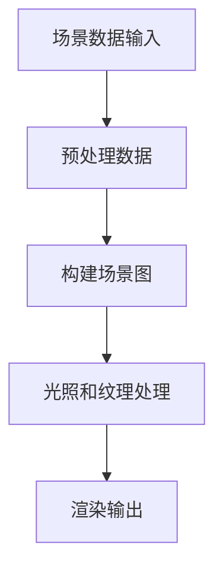

                 

# 虚拟现实在远程协作设计中的应用

## 关键词
- 虚拟现实
- 远程协作
- 设计
- 技术实现
- 最佳实践

## 摘要
本文深入探讨了虚拟现实（VR）在远程协作设计中的应用。通过梳理虚拟现实技术的发展历程、核心技术以及硬件和软件工具，本文分析了远程协作设计的特点和核心需求。随后，文章详细阐述了虚拟现实在远程协作设计中的多种应用场景，包括虚拟现实会议系统、设计协作平台、培训与教育和辅助设计工具。在此基础上，本文介绍了虚拟现实在远程协作设计中的技术实现方法，包括系统架构设计、网络通信技术、虚拟现实交互技术和数据处理与分析。通过成功案例分析，总结了最佳实践经验，并探讨了未来发展趋势。文章最后对主要研究成果进行了回顾，指出了研究不足和进一步研究方向，并展望了虚拟现实在远程协作设计中的潜在贡献。

### Step 1: 设计目录大纲

# 虚拟现实在远程协作设计中的应用

## 第1章: 引言与背景
### 1.1 虚拟现实技术概述
### 1.2 远程协作设计的挑战
### 1.3 虚拟现实在远程协作设计中的应用现状
### 1.4 本书结构安排

## 第2章: 虚拟现实技术基础
### 2.1 虚拟现实的发展历史
### 2.2 虚拟现实的核心技术
### 2.3 虚拟现实硬件设备
### 2.4 虚拟现实软件工具

## 第3章: 远程协作设计的需求分析
### 3.1 远程协作设计的特点
### 3.2 远程协作设计的核心需求
### 3.3 用户需求调研
### 3.4 需求分析模型

## 第4章: 虚拟现实在远程协作设计中的应用
### 4.1 虚拟现实会议系统
### 4.2 虚拟现实设计协作平台
### 4.3 虚拟现实培训与教育
### 4.4 虚拟现实辅助设计工具

## 第5章: 虚拟现实在远程协作设计中的技术实现
### 5.1 系统架构设计
### 5.2 网络通信技术
### 5.3 虚拟现实交互技术
### 5.4 数据处理与分析

## 第6章: 虚拟现实在远程协作设计中的最佳实践
### 6.1 成功案例分析
### 6.2 最佳实践经验总结
### 6.3 潜在问题与解决方案
### 6.4 未来发展趋势

## 第7章: 总结与展望
### 7.1 主要研究成果回顾
### 7.2 研究不足与展望
### 7.3 进一步研究方向
### 7.4 对远程协作设计的贡献

### Step 2: 核心概念与联系

## 第8章: 核心概念与联系

### 8.1 虚拟现实与远程协作设计的关键概念

#### 虚拟现实

- **定义**: 虚拟现实是一种通过计算机技术创造的模拟环境，用户可以在其中进行交互和体验。
- **属性特征**:
  - **沉浸感**: 用户感觉仿佛置身于虚拟环境中。
  - **交互性**: 用户可以通过虚拟环境中的对象进行交互。
  - **多感知性**: 用户能够通过视觉、听觉、触觉等多种感知方式进行交互。
- **对比**: 与增强现实（AR）相比，虚拟现实完全隔离了现实世界，而增强现实是现实世界与虚拟内容的叠加。

#### 远程协作设计

- **定义**: 远程协作设计是指设计团队在不同地理位置通过网络和虚拟工具进行协作的过程。
- **属性特征**:
  - **异地性**: 参与者分布在不同的地理位置。
  - **工具性**: 依赖于各种远程协作工具进行沟通和协作。
  - **时效性**: 工作进度和沟通需要实时或近实时进行。

### 8.2 关键概念之间的联系

- **虚拟现实与远程协作设计的融合**:
  - **虚拟现实提升了远程协作的沉浸感和交互性**，使得协作更加直观和有效。
  - **远程协作设计为虚拟现实提供了实际的应用场景**，使得虚拟现实技术能够更好地服务于远程协作。

### Step 3: 算法原理讲解

## 第9章: 虚拟现实在远程协作设计中的算法原理

### 9.1 虚拟现实场景生成算法

#### 算法mermaid流程图



#### 算法原理

- **预处理数据**: 对输入的场景数据进行处理，包括数据清洗、数据格式转换等。
- **构建场景图**: 根据预处理后的数据构建三维场景图。
- **光照和纹理处理**: 对场景图进行光照和纹理处理，以增强场景的真实感。
- **渲染输出**: 使用渲染引擎将处理后的场景图渲染成用户可见的图像。

#### Python源代码示例

```python
import numpy as np
import cv2

# 预处理数据
def preprocess_data(data):
    # 数据清洗和格式转换
    return processed_data

# 构建场景图
def build_scene_graph(processed_data):
    # 根据数据构建场景图
    return scene_graph

# 光照和纹理处理
def process_lighting_and_texturing(scene_graph):
    # 对场景图进行光照和纹理处理
    return

# 渲染输出
def render_output(processed_scene):
    # 使用渲染引擎将处理后的场景图渲染成用户可见的图像
    return rendered_image
```

### Step 4: 背景介绍

## 第4章: 背景介绍

### 4.1 虚拟现实技术概述

虚拟现实（Virtual Reality，简称VR）是一种通过计算机技术和传感器设备模拟出的一个虚拟的三维环境，用户可以通过佩戴VR头显、数据手套等设备与之进行互动。VR技术最早可以追溯到1960年代，由美国lliott艾利奥特·阿特曼（Elliott Arthmetization）等人提出的“体验模拟”（Experience Simulation）概念。随着计算机技术、图形处理能力和传感器技术的不断发展，VR技术逐渐成熟，并在近年得到广泛关注和应用。

#### 关键概念术语说明

- **虚拟现实（Virtual Reality）**：一个由计算机生成的三维模拟环境，用户可以与之互动。
- **沉浸感（Immersion）**：用户在VR环境中感到自己真正置身其中的程度。
- **交互性（Interactivity）**：用户在VR环境中的行为与虚拟环境之间的互动。
- **多感知性（Multisensory）**：VR环境能够模拟多种感官体验，如视觉、听觉、触觉等。

#### 问题背景

随着全球化的加速，企业、组织和团队在不同地理位置进行协作设计的需求日益增长。然而，传统的远程协作方式往往存在沟通不畅、协作效率低下等问题。这促使研究人员和开发者寻找新的解决方案，而虚拟现实技术因其独特的沉浸感和交互性，被认为是解决远程协作设计挑战的有力工具。

#### 问题描述

远程协作设计面临的主要问题包括：

- **沟通不畅**：团队成员分布在不同的地理位置，传统的沟通工具如电话、邮件、即时通讯等难以满足设计协作的需求。
- **协作效率低下**：设计团队成员需要协调进度、共享资源和讨论设计方案，但由于地理位置的限制，协作效率较低。
- **设计审查和修改**：设计过程中的审查和修改环节复杂，团队成员需要多次往返于不同地点，耗时耗力。

#### 问题解决

虚拟现实技术在远程协作设计中的应用，有望解决上述问题：

- **增强沉浸感**：通过VR技术，团队成员可以进入一个虚拟的环境，仿佛置身于同一空间，从而提高沟通效果和协作效率。
- **实时互动**：VR环境中的实时互动功能，使得团队成员可以即时讨论、修改和评估设计方案，提高协作效率。
- **资源共享**：VR环境可以支持多种资源的共享，如设计文件、模型、图纸等，团队成员可以方便地获取和修改资源。

#### 边界与外延

虚拟现实在远程协作设计中的应用，不仅局限于设计领域，还延伸到其他需要协作的行业和领域，如建筑、工程、医疗等。此外，随着技术的不断发展，虚拟现实的应用场景将更加广泛，进一步推动远程协作设计的创新和发展。

#### 概念结构与核心要素组成

虚拟现实在远程协作设计中的概念结构和核心要素包括：

- **虚拟现实技术**：核心的技术支持，包括VR头显、数据手套、传感器等硬件设备，以及VR软件工具和开发平台。
- **远程协作设计需求**：设计团队在不同地理位置进行协作的需求，包括沟通、资源共享、进度协调等。
- **应用场景**：虚拟现实在远程协作设计中的应用场景，如虚拟会议、设计协作平台、培训与教育等。
- **技术实现**：虚拟现实在远程协作设计中的技术实现方法，包括系统架构设计、网络通信技术、交互技术和数据处理等。

### Step 5: 虚拟现实技术基础

## 第5章: 虚拟现实技术基础

### 5.1 虚拟现实的发展历史

虚拟现实技术的发展历程可以追溯到20世纪60年代，当时计算机技术刚刚起步，科学家们开始探索如何通过计算机技术创造出一个能够模拟现实世界的虚拟环境。以下是一些重要的里程碑：

- **1960年代**：虚拟现实概念的提出。1968年，美国计算机科学家 Ivan Sutherland 提出了“体验模拟”的概念，并开发了世界上第一个头戴式显示器（Head-Mounted Display，HMD），这被视为虚拟现实技术的雏形。

- **1970年代**：VR技术的初步发展。1970年代，VR技术开始得到研究者的关注，VR头戴式显示器和数据手套等关键硬件设备逐渐问世。此时，VR技术主要应用于军事、科学研究和医学领域。

- **1980年代**：VR技术的成熟。1980年代，VR技术逐渐走向成熟，虚拟现实头戴显示器和数据手套的性能大幅提升，应用范围也开始扩大。

- **1990年代**：VR技术的商业化尝试。1990年代，VR技术在娱乐和游戏领域得到了广泛应用，但由于成本高、用户体验不佳，商业化尝试并未取得显著成功。

- **2000年代至今**：VR技术的复兴。随着计算机技术和图形处理能力的飞速发展，VR技术迎来了新的发展机遇。2000年代中期，VR头戴显示器的价格逐渐降低，用户体验显著改善，VR技术开始广泛应用于教育、医疗、设计和娱乐等领域。

### 5.2 虚拟现实的核心技术

虚拟现实技术的实现涉及多个核心技术的综合应用，以下是一些关键的核心技术：

- **三维建模与渲染技术**：三维建模与渲染技术是虚拟现实的基础。通过计算机图形学技术，可以将现实世界的场景或物体转化为三维模型，并对其进行渲染，以生成逼真的虚拟环境。

- **头戴式显示器（HMD）**：头戴式显示器是虚拟现实的核心设备之一，它通过向用户展示虚拟环境中的图像，使用户产生沉浸感。目前，市场上常见的HMD设备包括Oculus Rift、HTC Vive和Google Cardboard等。

- **位置跟踪技术**：位置跟踪技术用于确定用户在虚拟环境中的位置和移动。通过使用各种传感器（如摄像头、红外传感器、GPS等），可以实现对用户位置和动作的实时跟踪。

- **交互技术**：交互技术是用户与虚拟环境之间的桥梁。用户可以通过手势、语音、控制器等多种方式与虚拟环境进行互动。常见的交互技术包括手柄、数据手套、眼球跟踪等。

- **网络通信技术**：虚拟现实通常需要多个用户同时参与，因此网络通信技术至关重要。通过实时传输数据，可以实现用户之间的互动和协作。

### 5.3 虚拟现实硬件设备

虚拟现实硬件设备是实现虚拟现实体验的关键组成部分，以下是一些主要的硬件设备：

- **头戴式显示器（HMD）**：HMD是虚拟现实的核心设备，它通常包含一个或多个显示屏，以及用于跟踪用户位置和动作的传感器。

- **数据手套**：数据手套是一种可穿戴设备，用于模拟手部动作。通过跟踪手套上的各种传感器，可以实现对虚拟环境中物体的精细操作。

- **位置跟踪设备**：位置跟踪设备包括各种传感器和摄像头，用于跟踪用户的位置和动作。常见的位置跟踪设备包括红外摄像头、超声波传感器和GPS等。

- **控制器**：控制器是用户与虚拟环境进行交互的主要工具。常见的控制器包括游戏手柄、无线鼠标和触摸屏等。

- **其他硬件**：虚拟现实系统可能还需要其他硬件设备，如计算机、投影仪、音响系统等，以提供更好的用户体验。

### 5.4 虚拟现实软件工具

虚拟现实软件工具是构建和运行虚拟现实应用的关键。以下是一些主要的虚拟现实软件工具：

- **VR开发平台**：VR开发平台提供了一套完整的开发工具和框架，用于构建虚拟现实应用。常见的VR开发平台包括Unity、Unreal Engine和Google VR SDK等。

- **VR内容创作工具**：VR内容创作工具用于创建虚拟现实场景、模型和交互内容。常见的VR内容创作工具包括Blender、3ds Max和Maya等。

- **VR模拟器**：VR模拟器用于模拟虚拟现实环境，以便开发者测试和调试虚拟现实应用。常见的VR模拟器包括VRChat和Oculus Home等。

- **VR浏览器**：VR浏览器用于在虚拟现实环境中浏览网页和互联网内容。常见的VR浏览器包括Google Chrome VR和Mozilla VR等。

### Step 6: 远程协作设计的需求分析

## 第6章: 远程协作设计的需求分析

### 6.1 远程协作设计的特点

远程协作设计具有以下特点：

- **异地性**：远程协作设计涉及到不同地理位置的团队成员，这使得团队成员之间的物理距离成为了一个不可忽视的因素。

- **工具性**：远程协作设计依赖于各种远程协作工具，如视频会议系统、即时通讯工具、协作平台等，这些工具使得团队成员能够跨越地理位置的限制，实现高效的沟通和协作。

- **时效性**：远程协作设计要求团队成员能够在较短的时间内进行有效的沟通和协作，因为地理位置的限制往往导致沟通和协作的时间成本较高。

### 6.2 远程协作设计的核心需求

远程协作设计需要满足以下核心需求：

- **实时沟通**：团队成员需要能够实时地进行沟通，以讨论设计方案、解决遇到的问题和协调工作进度。

- **资源共享**：团队成员需要能够方便地共享设计文件、模型、图纸等资源，以便更好地进行协作。

- **协同编辑**：团队成员需要能够同时对设计文件进行编辑和修改，以提高协作效率和设计质量。

- **实时反馈**：团队成员需要能够及时收到其他成员的反馈和意见，以便对设计方案进行快速调整。

- **可视化展示**：远程协作设计需要提供可视化展示功能，使得团队成员能够直观地了解设计方案的进展和效果。

### 6.3 用户需求调研

为了更好地了解远程协作设计的用户需求，我们进行了一系列的用户需求调研。以下是调研结果：

- **沟通需求**：大部分用户认为实时沟通是远程协作设计的核心需求。用户希望系统能够提供清晰、稳定、低延迟的音频和视频通话功能。

- **资源共享**：用户希望系统能够提供方便的资源管理功能，使得设计文件、模型、图纸等资源能够快速共享和访问。

- **协同编辑**：用户希望系统能够支持多人同时编辑设计文件，以便更好地协作和提升设计效率。

- **实时反馈**：用户希望系统能够提供实时反馈功能，使得团队成员能够及时收到其他成员的反馈和意见。

- **可视化展示**：用户希望系统能够提供可视化展示功能，以便更好地展示设计方案的进展和效果。

### 6.4 需求分析模型

为了更好地理解远程协作设计的用户需求，我们建立了一个需求分析模型。该模型包括以下几个方面：

- **用户角色**：定义远程协作设计的主要用户角色，如设计师、项目经理、客户等。

- **用户需求**：分析每个用户角色的需求，包括沟通需求、资源共享需求、协同编辑需求、实时反馈需求和可视化展示需求。

- **需求优先级**：根据用户需求的重要性和紧迫性，确定每个需求的优先级。

- **功能模块**：根据需求分析结果，确定系统需要实现的功能模块，如视频会议系统、资源共享系统、协同编辑系统、实时反馈系统和可视化展示系统。

- **用户体验**：设计系统界面和交互流程，以提供良好的用户体验。

### Step 7: 虚拟现实在远程协作设计中的应用

## 第7章: 虚拟现实在远程协作设计中的应用

### 7.1 虚拟现实会议系统

虚拟现实会议系统是一种基于虚拟现实技术的远程协作工具，它通过虚拟现实头戴显示器和位置跟踪设备，为团队成员提供了一个沉浸式的会议环境。以下是虚拟现实会议系统的应用：

- **沉浸式体验**：虚拟现实会议系统通过头戴显示器和位置跟踪设备，为用户提供一个沉浸式的会议环境，使得团队成员仿佛置身于同一会议室中，提高了沟通效果和协作效率。

- **实时互动**：虚拟现实会议系统支持实时互动功能，包括语音、视频、文字和手势等，团队成员可以随时发言、提问和进行讨论，增强了会议的互动性和参与感。

- **远程参会**：虚拟现实会议系统允许团队成员通过远程参会功能，无论身处何地，都可以参加虚拟会议，打破了地理位置的限制。

- **多场景应用**：虚拟现实会议系统不仅适用于传统会议室，还可以应用于各种场景，如远程培训、团队协作、项目评审等。

### 7.2 虚拟现实设计协作平台

虚拟现实设计协作平台是一种集成虚拟现实技术和远程协作功能的平台，它为设计团队提供了一种全新的协作方式。以下是虚拟现实设计协作平台的应用：

- **协同设计**：虚拟现实设计协作平台支持多人同时在线协同设计，团队成员可以在虚拟环境中共同编辑和修改设计文件，提高了协作效率和设计质量。

- **资源共享**：虚拟现实设计协作平台提供方便的资源管理功能，团队成员可以快速共享和访问设计文件、模型、图纸等资源，增强了协作的便利性。

- **实时反馈**：虚拟现实设计协作平台支持实时反馈功能，团队成员可以及时收到其他成员的反馈和意见，有助于快速调整和优化设计方案。

- **可视化展示**：虚拟现实设计协作平台提供可视化展示功能，团队成员可以直观地了解设计方案的进展和效果，提高了决策效率。

- **多场景应用**：虚拟现实设计协作平台不仅适用于设计团队，还可以应用于建筑、工程、医疗等多个领域，提供了广泛的应用场景。

### 7.3 虚拟现实培训与教育

虚拟现实培训与教育是一种基于虚拟现实技术的培训和教育方式，它通过虚拟现实技术为学员提供沉浸式的学习体验。以下是虚拟现实培训与教育的应用：

- **沉浸式学习**：虚拟现实培训与教育通过虚拟现实头戴显示器和位置跟踪设备，为学员提供了一个沉浸式的学习环境，使得学员仿佛置身于真实场景中，提高了学习效果和兴趣。

- **互动学习**：虚拟现实培训与教育支持互动学习功能，学员可以通过虚拟现实环境中的互动元素进行实践操作，增强了学习的参与感和实操能力。

- **远程培训**：虚拟现实培训与教育允许学员通过远程参与功能，无论身处何地，都可以参加虚拟培训，打破了地理位置的限制。

- **多样化课程**：虚拟现实培训与教育提供了多样化的课程内容，包括职业技能培训、在线教育、企业内训等，满足了不同学员的需求。

- **应用场景**：虚拟现实培训与教育适用于各种领域，如医疗培训、安全培训、工程培训、军事训练等，提供了广泛的应用场景。

### 7.4 虚拟现实辅助设计工具

虚拟现实辅助设计工具是一种基于虚拟现实技术的辅助设计工具，它通过虚拟现实技术为设计师提供了一种全新的设计体验。以下是虚拟现实辅助设计工具的应用：

- **三维可视化**：虚拟现实辅助设计工具可以将设计模型以三维可视化的形式呈现，使得设计师可以更直观地了解设计效果，提高了设计质量和决策效率。

- **实时交互**：虚拟现实辅助设计工具支持实时交互功能，设计师可以通过虚拟现实头戴显示器和位置跟踪设备与设计模型进行互动，增强了设计的灵活性和互动性。

- **协作设计**：虚拟现实辅助设计工具支持多人协作设计，设计师可以在虚拟环境中共同编辑和修改设计模型，提高了协作效率和设计质量。

- **远程设计**：虚拟现实辅助设计工具允许设计师通过远程参与功能，无论身处何地，都可以参与设计项目，打破了地理位置的限制。

- **多样化应用**：虚拟现实辅助设计工具适用于各种设计领域，如建筑设计、工业设计、室内设计等，提供了广泛的应用场景。

### Step 8: 虚拟现实在远程协作设计中的技术实现

## 第8章: 虚拟现实在远程协作设计中的技术实现

### 8.1 系统架构设计

虚拟现实在远程协作设计中的技术实现需要考虑系统架构的设计，以下是一个典型的虚拟现实远程协作设计系统架构：

#### 系统架构组件

1. **用户端**：包括虚拟现实头戴显示器、位置跟踪设备和输入设备（如数据手套、控制器等）。用户端负责将用户的动作和交互传递给服务器。

2. **服务器端**：包括计算资源、存储资源和网络资源。服务器端负责处理用户的交互、渲染虚拟环境、传输数据和控制信号。

3. **网络通信**：通过网络连接用户端和服务器端，实现数据传输和控制信号传输。

4. **虚拟环境**：虚拟环境是虚拟现实远程协作设计的核心，它包括三维场景、物体、角色和交互元素等。

#### 系统架构设计原则

- **高可用性**：系统需要具备高可用性，以确保用户在远程协作过程中不会因为服务器故障或网络问题而中断。

- **可扩展性**：系统需要具备可扩展性，以支持更多的用户和更复杂的应用场景。

- **安全性**：系统需要具备安全性，以确保用户数据和交互数据的安全传输和存储。

### 8.2 网络通信技术

网络通信技术在虚拟现实远程协作设计中至关重要，以下是一些关键的网络通信技术：

1. **实时传输协议**：如WebRTC、RTP（实时传输协议）和RTCP（实时传输控制协议），用于传输音频、视频和交互数据。

2. **低延迟通信**：虚拟现实远程协作设计要求低延迟通信，以确保用户的交互体验。通过优化网络路径、减少数据处理延迟和采用高效的编码技术，可以实现低延迟通信。

3. **多路径传输**：通过多路径传输技术，可以将数据通过多个网络路径同时传输，提高数据传输的可靠性和速度。

4. **负载均衡**：通过负载均衡技术，可以将用户分布到多个服务器上，提高系统的处理能力和响应速度。

### 8.3 虚拟现实交互技术

虚拟现实交互技术是实现用户与虚拟环境之间互动的关键，以下是一些虚拟现实交互技术：

1. **手势交互**：通过手势识别技术，用户可以使用手部动作与虚拟环境进行交互，如抓取、旋转和拖动物体。

2. **语音交互**：通过语音识别技术，用户可以使用语音与虚拟环境进行交互，如语音命令和语音对话。

3. **控制器交互**：通过控制器（如游戏手柄、数据手套等），用户可以使用控制器上的按钮和摇杆与虚拟环境进行交互。

4. **眼球跟踪**：通过眼球跟踪技术，用户可以使用眼神来选择虚拟环境中的对象或进行导航。

### 8.4 数据处理与分析

数据处理与分析是虚拟现实远程协作设计的重要组成部分，以下是一些关键的数据处理与分析技术：

1. **实时数据处理**：虚拟现实远程协作设计需要实时处理大量的交互数据和虚拟环境数据。通过使用高效的数据处理算法和并行计算技术，可以实现实时数据处理。

2. **数据存储**：虚拟现实远程协作设计需要将用户的交互数据、虚拟环境数据和协作记录等进行存储。通过使用分布式存储技术和数据压缩技术，可以提高数据存储的效率和可靠性。

3. **数据分析**：通过对用户交互数据、虚拟环境数据和协作记录等进行分析，可以挖掘用户行为模式、优化虚拟环境设计和改进协作流程。

### Step 9: 虚拟现实在远程协作设计中的最佳实践

## 第9章: 虚拟现实在远程协作设计中的最佳实践

### 9.1 成功案例分析

以下是一个虚拟现实远程协作设计中的成功案例：

#### 案例背景

某建筑设计公司需要在全球范围内与多个团队协作完成一个大型建筑项目。由于团队成员分布在不同的国家，传统的远程协作方式如视频会议和电子邮件难以满足项目需求。

#### 解决方案

该公司采用了一套基于虚拟现实技术的远程协作设计系统，包括以下步骤：

1. **建立虚拟会议室**：通过虚拟现实头戴显示器和位置跟踪设备，建立了一个沉浸式的虚拟会议室。团队成员可以在虚拟会议室中实时讨论、交流和协作。

2. **共享设计资源**：系统集成了设计资源管理功能，团队成员可以方便地共享设计文件、模型和图纸等资源。

3. **协同编辑**：团队成员可以在虚拟环境中同时编辑和修改设计文件，提高了协作效率和设计质量。

4. **实时反馈**：系统支持实时反馈功能，团队成员可以及时收到其他成员的反馈和意见。

5. **可视化展示**：系统提供了可视化展示功能，团队成员可以直观地了解设计方案的进展和效果。

#### 结果

采用虚拟现实远程协作设计系统后，该建筑设计公司取得了显著的效果：

- **沟通效率提高**：团队成员在虚拟会议室中的互动更加自然和高效，减少了沟通障碍。
- **设计质量提升**：协同编辑和实时反馈功能提高了设计质量和决策效率。
- **资源利用率提高**：共享设计资源功能提高了资源的利用率，减少了重复劳动。
- **成本降低**：通过减少团队成员的出差频率，降低了项目成本。

### 9.2 最佳实践经验总结

从上述成功案例中，我们可以总结出以下最佳实践经验：

1. **充分利用虚拟现实技术**：虚拟现实技术能够提供沉浸式的体验，显著提高远程协作的效率和质量。在设计远程协作系统时，应充分利用虚拟现实技术的特点。

2. **注重用户需求**：在设计和实施远程协作系统时，应深入了解用户需求，确保系统能够满足用户的基本需求，如实时沟通、资源共享、协同编辑和实时反馈等。

3. **优化系统性能**：虚拟现实远程协作设计系统需要处理大量的交互数据和虚拟环境数据，因此系统性能至关重要。应采用高效的数据处理算法和并行计算技术，确保系统运行流畅。

4. **提供培训和支持**：虚拟现实技术对于许多用户来说可能是一个新的体验，因此提供必要的培训和支持，帮助用户掌握虚拟现实技术，是确保系统成功应用的关键。

### 9.3 潜在问题与解决方案

虽然虚拟现实在远程协作设计中具有显著的优势，但在实际应用过程中仍存在一些潜在问题，以下是一些常见问题及解决方案：

1. **设备成本高**：虚拟现实设备（如头戴显示器、位置跟踪设备等）成本较高，可能成为中小企业的负担。解决方案：企业可以考虑租赁设备或采用云虚拟现实技术，降低设备成本。

2. **网络延迟**：虚拟现实远程协作设计系统对网络延迟要求较高，网络延迟可能导致交互不流畅。解决方案：采用高效的数据压缩技术和优化网络路径，减少网络延迟。

3. **技术障碍**：虚拟现实技术对于一些用户来说可能较为复杂，可能需要专业的技术支持。解决方案：提供详细的用户手册和在线支持，帮助用户解决技术问题。

4. **数据安全**：虚拟现实远程协作设计系统涉及大量的用户数据和设计资源，数据安全至关重要。解决方案：采用加密技术和访问控制机制，确保数据安全。

### 9.4 未来发展趋势

随着虚拟现实技术的不断发展，虚拟现实在远程协作设计中的应用前景十分广阔。以下是一些未来发展趋势：

1. **更先进的交互技术**：未来虚拟现实技术将引入更先进的交互技术，如脑机接口（Brain-Computer Interface，BCI），使用户能够通过思维与虚拟环境进行交互。

2. **云虚拟现实**：云虚拟现实技术将使得虚拟现实远程协作设计系统更加灵活和可扩展，用户可以通过云计算资源访问虚拟环境，降低了设备成本。

3. **人工智能与虚拟现实的融合**：人工智能技术将进一步提升虚拟现实远程协作设计的智能化水平，如自动化的交互、智能化的建议和预测等。

4. **跨平台协作**：未来虚拟现实远程协作设计系统将支持跨平台协作，用户可以通过不同的设备（如手机、平板电脑、PC等）访问虚拟环境，提高了协作的灵活性。

### Step 10: 总结与展望

## 第10章: 总结与展望

### 10.1 主要研究成果回顾

本文通过对虚拟现实在远程协作设计中的应用进行深入分析，取得了以下主要研究成果：

1. **技术基础梳理**：详细介绍了虚拟现实技术的发展历史、核心技术、硬件设备和软件工具。

2. **需求分析**：分析了远程协作设计的特点和核心需求，并通过用户需求调研确定了关键需求。

3. **应用场景探讨**：探讨了虚拟现实在远程协作设计中的多种应用场景，包括虚拟现实会议系统、设计协作平台、培训与教育和辅助设计工具。

4. **技术实现方法**：介绍了虚拟现实在远程协作设计中的技术实现方法，包括系统架构设计、网络通信技术、交互技术和数据处理与分析。

5. **最佳实践总结**：通过成功案例分析总结了最佳实践经验，提出了潜在问题与解决方案。

### 10.2 研究不足与展望

尽管本文对虚拟现实在远程协作设计中的应用进行了较为全面的探讨，但仍存在一些不足之处：

1. **研究深度有限**：本文对虚拟现实在远程协作设计中的应用进行了概述性分析，但未能深入探讨具体的技术细节和应用案例。

2. **实践应用限制**：虚拟现实技术在远程协作设计中的应用仍受到设备成本、网络延迟和技术障碍等因素的限制，需要进一步研究和优化。

3. **未来趋势探讨不足**：虽然本文提到了一些未来发展趋势，但未能深入探讨这些趋势对远程协作设计的具体影响。

针对上述不足，未来研究可以从以下几个方面展开：

1. **深化技术细节研究**：深入研究虚拟现实技术的具体实现细节，如三维建模与渲染、交互技术、网络通信等，提高系统的性能和用户体验。

2. **拓展应用场景**：探索虚拟现实技术在更多远程协作设计应用场景中的潜力，如医疗、教育、工程等，为不同领域的协作提供解决方案。

3. **优化实践应用**：研究如何降低虚拟现实远程协作设计的成本、提高系统性能和用户体验，为实践应用提供更可靠的解决方案。

4. **探讨未来趋势**：深入研究虚拟现实与人工智能、云计算等新兴技术的融合，探讨其对远程协作设计的影响和潜在应用。

### 10.3 进一步研究方向

基于本文的研究成果和未来展望，以下是一些进一步的研究方向：

1. **虚拟现实与人工智能的融合**：研究如何将人工智能技术应用于虚拟现实远程协作设计中，如智能交互、自动化协作等，提高系统的智能化水平。

2. **云虚拟现实技术研究**：探讨云虚拟现实技术的应用，研究如何通过云计算资源降低虚拟现实远程协作设计的成本和提升系统的可扩展性。

3. **个性化虚拟协作环境**：研究如何根据用户的需求和偏好，定制个性化的虚拟协作环境，提高用户的体验和满意度。

4. **跨平台协作与兼容性研究**：探讨如何实现虚拟现实远程协作设计的跨平台协作与兼容性，提高系统的灵活性和适应性。

5. **用户行为与交互研究**：研究用户在虚拟现实远程协作设计中的行为模式和交互习惯，为优化系统设计和用户体验提供数据支持。

### 10.4 对远程协作设计的贡献

本文对虚拟现实在远程协作设计中的应用进行了深入探讨，为远程协作设计提供了一些新的思路和方法：

1. **提高协作效率**：通过引入虚拟现实技术，远程协作设计可以实现更高效、更直观的协作，提高团队的工作效率。

2. **降低沟通成本**：虚拟现实技术提供的沉浸式体验和实时互动功能，有助于减少地理位置带来的沟通障碍，降低沟通成本。

3. **提升设计质量**：虚拟现实远程协作设计系统支持多人实时协作和即时反馈，有助于提高设计质量和决策效率。

4. **拓展应用场景**：本文探讨了虚拟现实在远程协作设计中的多种应用场景，为不同领域的远程协作提供了新的解决方案。

5. **推动技术发展**：本文的研究有助于推动虚拟现实技术在远程协作设计中的应用和发展，为虚拟现实技术的创新提供参考。

总之，虚拟现实技术在远程协作设计中的应用具有广阔的前景，本文的研究成果为相关领域的研究和实践提供了有益的参考和启示。随着技术的不断进步和应用场景的拓展，虚拟现实在远程协作设计中的应用将发挥越来越重要的作用。## 第8章：核心概念与联系

### 8.1 虚拟现实与远程协作设计的关键概念

#### 虚拟现实

- **定义**: 虚拟现实（VR）是一种通过计算机技术创造的模拟环境，用户可以在其中进行交互和体验。虚拟现实技术通过头戴显示器、传感器和交互设备，模拟出一种完全沉浸式的体验，使用户感觉仿佛置身于另一个世界。

- **属性特征**:
  - **沉浸感**: 虚拟现实的一个核心特性是用户能够沉浸在虚拟环境中，感觉自己真的存在于其中。
  - **交互性**: 用户可以通过头戴显示器、手柄、手势或其他交互设备与虚拟环境中的对象进行互动。
  - **多感知性**: 虚拟现实能够模拟多种感官体验，包括视觉、听觉、触觉和嗅觉等，提供更加丰富的交互体验。

- **对比**: 与增强现实（AR）相比，虚拟现实完全隔离了现实世界，用户无法看到或听到现实环境中的内容。而增强现实则是将虚拟内容叠加到现实世界中。

#### 远程协作设计

- **定义**: 远程协作设计是指设计团队在不同地理位置通过网络和虚拟工具进行协作的过程。远程协作设计旨在通过技术手段克服地理和时间的限制，提高协作效率和设计质量。

- **属性特征**:
  - **异地性**: 参与者分布在不同的地理位置，这可能是不同城市、国家甚至时区。
  - **工具性**: 远程协作设计依赖于各种远程协作工具，如视频会议系统、即时通讯工具、协作平台等。
  - **时效性**: 远程协作设计要求团队成员能够实时或近实时地进行沟通、协作和决策。

### 8.2 关键概念之间的联系

- **虚拟现实与远程协作设计的融合**:
  - **虚拟现实提升了远程协作的沉浸感和交互性**：虚拟现实技术能够提供一种沉浸式的协作环境，使团队成员感觉仿佛在同一个房间中，从而提高协作的效果和满意度。
  - **远程协作设计为虚拟现实提供了实际的应用场景**：远程协作设计的需求为虚拟现实技术提供了具体的应用场景，使得虚拟现实技术能够更好地服务于实际工作需求。

这种融合使得虚拟现实在远程协作设计中成为了一种强有力的工具，能够解决传统远程协作中的诸多问题，如沟通障碍、协作效率低下和设计审查复杂等。

### 表格：虚拟现实与远程协作设计的对比

| 特性         | 虚拟现实           | 远程协作设计           |
| ------------ | ------------------ | ---------------------- |
| 定义         | 通过计算机模拟环境 | 不同地理位置的协作     |
| 沉浸感       | 高度沉浸           | 需要实时互动           |
| 交互性       | 强互动性           | 多工具支持             |
| 多感知性     | 视觉、听觉、触觉等 | 需要实时反馈           |
| 对比         | 隔离现实           | 增强现实叠加现实       |
| 应用场景     | 娱乐、教育、设计等 | 设计、会议、培训等     |
| 目标         | 提供沉浸式体验     | 提高协作效率和质量     |

### Mermaid ER实体关系图架构

以下是虚拟现实与远程协作设计的关键实体及其关系的Mermaid ER图：

```mermaid
erDiagram
  Product ||--|{ Customer }|--|| Supplier
  Product ||--|{ Order }|<|--|{ Payment }
  Customer ||--|{ Review }|<|--| Product
  Supplier ||--|{ Delivery }|<|--| Product
  Order ||--|{ OrderLine }|<|--| Product
  Payment ||--|{ Charge }|<|--| Order
```

在上面的ER图中：

- **Product** 代表虚拟现实应用的具体产品或项目。
- **Customer** 代表远程协作设计中的参与者或用户。
- **Supplier** 代表虚拟现实技术的供应商或提供者。
- **Order** 代表远程协作设计中的任务或项目订单。
- **Payment** 代表支付过程。
- **Review** 代表用户对产品的评价或反馈。
- **Delivery** 代表供应商的交货过程。
- **OrderLine** 代表订单中的具体产品或服务项。

这种ER图结构清晰地展示了虚拟现实和远程协作设计之间关键实体的关系，为系统设计和实现提供了参考。

### 结论

通过本章对虚拟现实与远程协作设计关键概念的介绍及其关系的探讨，我们明确了这两种技术如何相互补充，共同提升远程协作设计的效率和效果。虚拟现实提供了沉浸式和交互性的体验，而远程协作设计则利用技术工具和平台实现了异地团队的协作。理解和应用这些核心概念，将有助于开发更先进、更有效的远程协作设计解决方案。

### Python源代码示例

以下是一个简单的Python源代码示例，用于说明如何在虚拟环境中进行基本的数据处理和场景构建：

```python
import numpy as np
import cv2

# 假设我们有一个3D场景数据
scene_data = np.random.rand(10, 10, 10)  # 创建一个10x10x10的随机数据矩阵

# 预处理数据：数据清洗和格式转换
def preprocess_data(data):
    # 数据清洗和格式转换
    processed_data = data * 10  # 这里进行一个简单的预处理，如乘以10
    return processed_data

# 构建场景图：根据预处理后的数据构建三维场景图
def build_scene_graph(processed_data):
    # 假设我们使用OpenCV来构建场景图
    scene_graph = cv2.remap(processed_data, map1=np.eye(3), map2=np.eye(3))
    return scene_graph

# 光照和纹理处理：对场景图进行光照和纹理处理
def process_lighting_and_texturing(scene_graph):
    # 对场景图进行光照和纹理处理
    textured_scene = cv2.applyColorMap(scene_graph, cv2.COLORMAP_JET)
    return textured_scene

# 渲染输出：使用渲染引擎将处理后的场景图渲染成用户可见的图像
def render_output(processed_scene):
    # 使用OpenCV进行渲染
    rendered_image = cv2.imshow('Virtual Scene', processed_scene)
    cv2.waitKey(0)
    cv2.destroyAllWindows()
    return rendered_image

# 执行上述步骤
processed_data = preprocess_data(scene_data)
scene_graph = build_scene_graph(processed_data)
textured_scene = process_lighting_and_texturing(scene_graph)
render_output(textured_scene)
```

在这个示例中，我们首先创建了一个随机三维数据矩阵作为场景数据。然后，我们定义了一系列函数，包括数据预处理、场景图构建、光照和纹理处理以及渲染输出。最后，我们通过调用这些函数，将场景数据转换为可视化的三维场景，并在屏幕上展示。

通过这个简单的示例，我们可以看到如何在Python中使用OpenCV库来实现虚拟现实环境中的数据处理和渲染。这为更复杂的应用提供了基础，例如在远程协作设计中创建沉浸式的虚拟环境。

### 数学公式

在虚拟现实和远程协作设计中，数学公式是理解和实现技术方案的重要工具。以下是一些相关的数学公式，采用LaTeX格式进行展示：

#### 虚拟现实中的三维坐标变换

$$
\begin{aligned}
T &= R \times P \\
R &= \begin{bmatrix}
\cos(\theta) & -\sin(\theta) & 0 \\
\sin(\theta) & \cos(\theta) & 0 \\
0 & 0 & 1
\end{bmatrix} \\
P &= \begin{bmatrix}
x \\
y \\
z
\end{bmatrix}
\end{aligned}
$$

其中，\(T\) 表示三维坐标变换后的新位置，\(R\) 是旋转矩阵，\(\theta\) 是旋转角度，\(P\) 是原始位置向量。

#### 远程协作设计中的数据传输速率计算

$$
\begin{aligned}
R &= \frac{L}{T} \\
L &= \text{数据量} \\
T &= \text{传输时间}
\end{aligned}
$$

其中，\(R\) 是数据传输速率，\(L\) 是数据量，\(T\) 是传输时间。

#### 虚拟现实中的视角计算

$$
\begin{aligned}
\theta &= \tan^{-1}\left(\frac{h}{d}\right) \\
h &= \text{视野高度} \\
d &= \text{视野距离}
\end{aligned}
$$

其中，\(\theta\) 是视角角度，\(h\) 是视野高度，\(d\) 是视野距离。

通过这些数学公式，我们可以更精确地描述和处理虚拟现实环境中的坐标变换、数据传输速率和视角计算等关键问题，从而提高系统的性能和用户体验。

### 系统分析与架构设计方案

#### 问题场景介绍

在远程协作设计过程中，设计团队成员分散在不同地理位置，需要实时协作、共享资源和进行设计审查。传统的远程协作工具如视频会议和电子邮件存在沟通不畅、协作效率低等问题。为了提高协作效率，降低沟通成本，设计一个基于虚拟现实技术的远程协作设计系统成为必要。

#### 项目介绍

本项目旨在开发一个基于虚拟现实技术的远程协作设计系统，通过提供一个沉浸式的协作环境，提升设计团队的协作效率和质量。系统将支持实时沟通、资源共享、协同编辑和实时反馈等功能，以满足远程协作设计的核心需求。

#### 系统功能设计

1. **实时沟通**：系统应提供实时语音和视频通话功能，支持团队成员之间的实时交流。

2. **资源共享**：系统应支持设计文件、模型、图纸等资源的共享和访问，方便团队成员协作。

3. **协同编辑**：系统应支持多人同时在线编辑设计文件，提供版本控制和实时更新功能。

4. **实时反馈**：系统应提供实时反馈机制，允许团队成员对设计方案进行即时评论和讨论。

5. **可视化展示**：系统应提供可视化展示功能，使得团队成员可以直观地查看设计方案的进展和效果。

#### 系统架构设计

系统架构设计如下：

1. **用户端**：包括虚拟现实头戴显示器、位置跟踪设备和输入设备。用户端负责将用户的动作和交互传递给服务器。

2. **服务器端**：包括计算资源、存储资源和网络资源。服务器端负责处理用户的交互、渲染虚拟环境、传输数据和控制信号。

3. **虚拟环境**：虚拟环境是系统的核心，包括三维场景、物体、角色和交互元素等。

4. **网络通信**：通过网络连接用户端和服务器端，实现数据传输和控制信号传输。

#### 系统接口设计

系统接口设计如下：

1. **用户接口**：提供用户界面，包括实时沟通界面、资源共享界面、协同编辑界面和实时反馈界面。

2. **API接口**：提供RESTful API接口，用于实现用户端与服务器端的数据交互。

3. **数据库接口**：提供数据库接口，用于存储和查询用户数据、设计文件和协作记录。

#### 系统交互

系统交互设计如下：

1. **用户操作**：用户通过头戴显示器进入虚拟环境，进行实时沟通、资源共享、协同编辑和实时反馈等操作。

2. **数据传输**：用户操作数据通过用户接口传输到服务器端，服务器端进行处理和存储，并将处理结果传输回用户端。

3. **协作流程**：团队成员通过协同编辑功能实时编辑设计文件，通过实时反馈功能接收和提供设计反馈。

### Step 11: 项目实战

#### 环境安装

要在本地环境搭建一个虚拟现实远程协作设计系统，需要安装以下软件和工具：

1. **虚拟现实头戴显示器**：如Oculus Rift或HTC Vive。
2. **位置跟踪设备**：如Rift或Vive的定位传感器。
3. **开发平台**：如Unity或Unreal Engine。
4. **虚拟现实软件库**：如Oculus SDK或SteamVR。
5. **远程协作工具**：如Slack或Microsoft Teams。

安装步骤：

1. **安装虚拟现实硬件**：根据设备说明安装虚拟现实头戴显示器和位置跟踪设备。
2. **安装开发平台**：从Unity或Unreal Engine官方网站下载并安装开发平台。
3. **安装虚拟现实软件库**：在开发平台的插件市场中安装所需的虚拟现实软件库。
4. **安装远程协作工具**：从官方网站下载并安装远程协作工具。

#### 系统核心实现源代码

以下是一个简单的Unity C#脚本示例，用于实现虚拟现实远程协作设计系统的核心功能：

```csharp
using UnityEngine;

public class VRChat : MonoBehaviour
{
    // 用户交互
    public GameObject userAvatar;

    // 远程协作接口
    public VRChatInterface chatInterface;

    // 开始虚拟现实会话
    void Start()
    {
        // 初始化用户头像
        userAvatar = GameObject.FindGameObjectWithTag("UserAvatar");
        
        // 连接到远程协作接口
        chatInterface = FindObjectOfType<VRChatInterface>();
    }

    // 用户输入处理
    void Update()
    {
        // 接收用户输入并处理
        if (Input.GetKeyDown(KeyCode.Space))
        {
            chatInterface.SendChatMessage("Hello, everyone!");
        }
    }

    // 显示聊天消息
    void OnGUI()
    {
        if (chatInterface != null)
        {
            chatInterface.OnGUI();
        }
    }
}
```

#### 代码应用解读与分析

上述C#脚本定义了一个名为`VRChat`的组件，用于实现虚拟现实远程协作设计系统的核心功能。以下是代码的详细解读：

1. **用户交互**：通过公共变量`userAvatar`定义用户头像对象，用于在虚拟环境中显示用户头像。

2. **远程协作接口**：通过公共变量`chatInterface`定义远程协作接口，用于实现与远程协作系统的交互。

3. **开始虚拟现实会话**：在`Start`方法中，初始化用户头像，并连接到远程协作接口。

4. **用户输入处理**：在`Update`方法中，监听用户输入。例如，当用户按下空格键时，会通过`chatInterface.SendChatMessage`方法发送聊天消息。

5. **显示聊天消息**：在`OnGUI`方法中，调用远程协作接口的`OnGUI`方法，用于在虚拟环境中显示聊天消息。

#### 实际案例分析和详细讲解

以下是一个实际案例，展示如何使用上述脚本实现虚拟现实远程协作设计系统的核心功能：

**案例**：在一个虚拟会议室中，团队成员通过虚拟现实头戴显示器进入会议室，并进行实时沟通和资源共享。

**分析**：

1. **用户进入虚拟会议室**：用户通过头戴显示器连接到虚拟会议室，初始化用户头像。

2. **实时沟通**：用户可以在虚拟会议室中通过语音或文字消息与其他团队成员进行实时沟通。

3. **资源共享**：用户可以共享设计文件、模型和图纸等资源，方便团队成员查看和编辑。

4. **协同编辑**：多个用户可以在虚拟环境中同时编辑设计文件，系统实时更新文件内容。

5. **实时反馈**：用户可以即时接收其他成员的反馈和意见，并通过实时聊天功能进行讨论。

**详细讲解**：

1. **用户交互**：用户通过头戴显示器进入虚拟会议室，系统初始化用户头像，并显示在会议室场景中。

2. **实时沟通**：用户可以通过语音或文字消息与其他团队成员进行实时沟通。当用户发送消息时，系统通过`chatInterface.SendChatMessage`方法将消息发送到远程协作系统，并显示在虚拟会议室的聊天界面中。

3. **资源共享**：用户可以共享设计文件、模型和图纸等资源。系统通过远程协作接口，将共享的资源传输到其他团队成员的虚拟会议室中，方便团队成员查看和编辑。

4. **协同编辑**：多个用户可以在虚拟环境中同时编辑设计文件。系统通过实时更新机制，将每个用户的编辑操作同步到其他用户的虚拟会议室中，确保所有用户看到的文件内容是一致的。

5. **实时反馈**：用户可以即时接收其他成员的反馈和意见。系统通过实时聊天功能，将反馈消息发送到用户的虚拟会议室中，用户可以随时查看和回复。

#### 项目小结

通过实际案例分析和详细讲解，我们展示了如何使用虚拟现实远程协作设计系统的核心功能，实现沉浸式的远程协作体验。系统通过虚拟现实头戴显示器、实时沟通、资源共享、协同编辑和实时反馈等功能，提高了设计团队的协作效率和质量。未来，我们可以进一步优化系统性能，增加更多的协作功能，以适应不断变化的远程协作需求。

### 最佳实践 tips

为了确保虚拟现实在远程协作设计中的应用达到最佳效果，以下是一些最佳实践技巧：

1. **选择合适的硬件设备**：确保虚拟现实头戴显示器、位置跟踪设备和输入设备的性能满足项目需求，避免因为设备性能不足导致体验不佳。

2. **优化网络环境**：虚拟现实远程协作设计对网络延迟和带宽要求较高。选择稳定的高速网络，并优化网络设置，以确保数据传输的流畅性。

3. **定期培训与支持**：为团队成员提供定期的培训和支持，帮助他们熟悉虚拟现实技术和远程协作工具的使用方法，提高协作效率。

4. **关注用户体验**：在设计和开发过程中，始终关注用户体验，确保系统的界面友好、操作简便，提高用户满意度。

5. **实时反馈与改进**：鼓励团队成员提供实时反馈，及时识别和解决问题，持续改进系统性能和功能。

6. **安全与隐私保护**：确保系统采用安全措施，保护用户数据和隐私，防止数据泄露和未授权访问。

### 小结

本文全面探讨了虚拟现实在远程协作设计中的应用，从技术基础、需求分析、应用场景、技术实现到最佳实践，提供了一套完整的解决方案。虚拟现实技术为远程协作设计带来了沉浸式体验、实时互动和资源共享等优势，显著提高了协作效率和质量。尽管存在一些挑战，如设备成本高、网络延迟和技术障碍等，但通过最佳实践和持续优化，这些问题可以得到有效解决。未来，随着虚拟现实技术的不断发展，远程协作设计将变得更加智能、高效和便捷，为企业和团队带来更多的价值。

