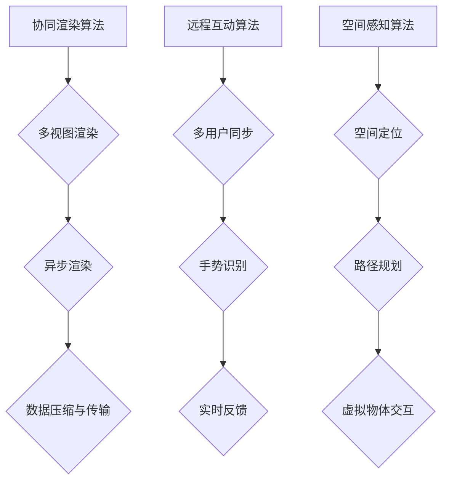
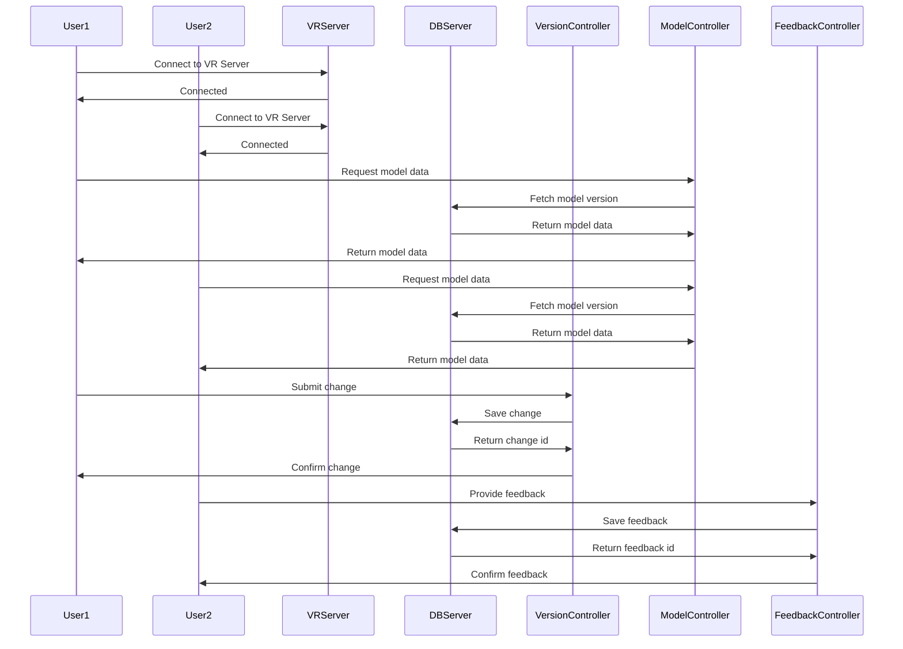
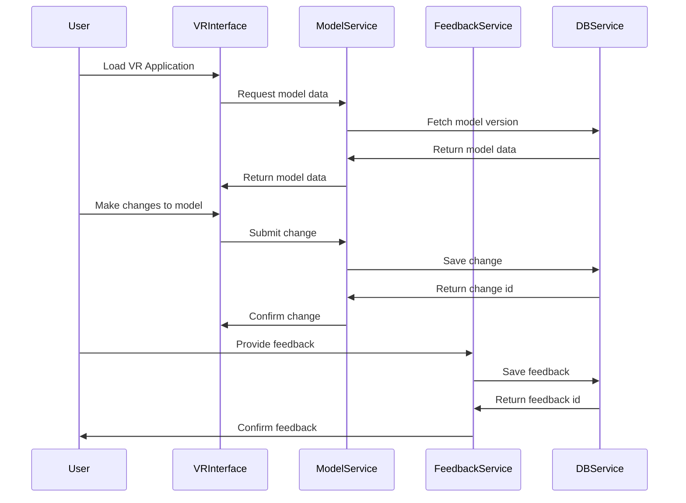

                 

### 引言

#### 1.1 问题背景

在现代设计领域，远程协作已经成为了一种常见且必要的工作模式。设计团队可能分布在不同的地理位置，设计师和工程师需要通过数字化工具进行沟通、协作和创作。然而，传统的远程协作方式，如电子邮件、视频会议和即时通讯工具，虽然在沟通效率上有所提高，但在设计质量和协作深度上仍存在诸多不足。设计过程中的反馈、修改和协同工作往往显得繁琐、低效，难以满足复杂设计任务的需求。

#### 1.2 问题描述

远程协作设计面临的主要问题包括：

- **沟通障碍**：地理和时区差异导致沟通不及时，信息传递不畅。
- **协作效率低**：设计文档的版本控制和管理复杂，多人协作时的同步困难。
- **可视化不足**：远程协作难以提供直观、实时的设计预览和交互。
- **反馈滞后**：设计修改的反馈周期长，影响设计的迭代速度。

#### 1.3 问题解决

为了解决上述问题，虚拟现实（VR）技术在远程协作设计中得到了越来越多的关注和应用。VR技术能够为设计团队提供一个沉浸式的协作环境，使得团队成员可以实时、直观地看到和互动设计内容，从而提高协作效率和设计质量。

#### 1.4 边界与外延

本文将探讨虚拟现实在远程协作设计中的应用，重点关注以下几个方面：

- **虚拟现实定义**：介绍虚拟现实的基本概念和技术原理。
- **远程协作设计**：阐述远程协作设计的需求和特点。
- **应用特点**：分析虚拟现实在远程协作设计中的优势。
- **算法原理**：讲解虚拟现实和远程协作设计的算法原理。
- **系统架构**：介绍虚拟现实远程协作设计系统的架构设计。
- **项目实战**：通过实际项目案例展示虚拟现实在远程协作设计中的应用。

#### 1.5 概念结构与核心要素组成

本文的结构分为以下几个核心部分：

- **核心概念与联系**：介绍虚拟现实和远程协作设计的基本概念，并分析它们之间的联系。
- **算法原理讲解**：深入讲解虚拟现实和远程协作设计的算法原理，包括流程图、数学模型和公式。
- **系统分析与架构设计方案**：介绍虚拟现实远程协作设计系统的整体架构和关键功能。
- **项目实战**：通过具体项目案例展示虚拟现实在远程协作设计中的实际应用。
- **最佳实践 tips**：提供一些最佳实践建议，帮助读者在实际应用中取得更好的效果。
- **小结**：回顾全文内容，展望未来的发展方向，并提供对读者的建议。

通过本文的阅读，读者将能够全面了解虚拟现实在远程协作设计中的应用，掌握相关技术原理和实践方法，从而提升设计团队的工作效率和协作质量。

---

## 核心概念与联系

在探讨虚拟现实（VR）在远程协作设计中的应用之前，我们需要首先了解两个核心概念：虚拟现实和远程协作设计。这两个概念不仅在技术上有所区别，而且在远程协作设计中扮演着不同但相互关联的角色。

#### 2.1 虚拟现实定义

虚拟现实是一种通过计算机生成模拟环境，使用户能够沉浸其中并进行互动体验的技术。它通常包括以下几个方面：

- **视觉**：通过头盔显示器或头戴显示设备（HMD）提供立体视觉体验。
- **听觉**：通过耳机提供立体声或环境声效，增强沉浸感。
- **触觉**：通过手套或外部设备提供触觉反馈，让用户感受到虚拟物体的质感。
- **交互**：用户通过手柄、手势或语音指令与虚拟环境进行互动。

虚拟现实技术的核心优势在于其能够创造出一个高度逼真、可交互的虚拟世界，使得用户可以在其中进行各种操作和体验，仿佛身临其境。

#### 2.2 远程协作设计

远程协作设计是指在地理位置分散的设计团队之间进行协作设计的过程。随着互联网和通信技术的发展，远程协作设计已经成为现代设计行业的一种重要工作模式。远程协作设计的主要特点包括：

- **分布式团队**：团队成员可能分布在不同的城市、国家甚至时区。
- **数字化工具**：通过电子邮件、即时通讯工具、设计软件和项目管理工具进行沟通和协作。
- **异步和同步协作**：异步协作允许团队成员在不同时间完成各自任务，同步协作则通过视频会议和在线会议实现实时沟通。

远程协作设计的挑战在于如何确保团队成员之间的沟通高效、设计流程顺畅，并能够及时进行反馈和修改。

#### 2.3 虚拟现实在远程协作设计中的应用特点

虚拟现实技术在远程协作设计中的应用具有以下几个显著特点：

- **沉浸式体验**：通过VR技术，团队成员可以沉浸在一个虚拟的设计环境中，实时查看和互动设计内容，减少沟通障碍。
- **实时反馈**：设计师和工程师可以实时分享设计进展，获取即时反馈，加快设计迭代速度。
- **空间协同**：虚拟现实提供了一个三维空间，团队成员可以在同一虚拟空间中协作，如同面对面交流。
- **多感官互动**：虚拟现实的多感官互动功能（如触觉反馈）可以增强设计师对设计细节的理解和把控。
- **效率提升**：通过VR技术，设计师可以在虚拟环境中快速试错，降低设计成本。

#### 2.4 虚拟现实与远程协作设计的关系图

为了更好地理解虚拟现实和远程协作设计之间的关系，我们可以通过一个ER（实体关系）图来展示它们的核心联系。以下是一个简单的ER图示例：

```mermaid
erDiagram
  VR(Virtual Reality) ||--|{ Remote Collaboration Design(Remote Collaboration Design) }
  VR {
    +特点（Features）
    +技术（Technologies）
    +应用（Applications）
  }
  Remote Collaboration Design {
    +需求（Requirements）
    +挑战（Challenges）
    +解决方案（Solutions）
  }
```

在这个ER图中，虚拟现实（VR）是远程协作设计（Remote Collaboration Design）的基础，VR提供了沉浸式体验、实时反馈、空间协同等多方面的技术支持，帮助解决远程协作设计中的沟通障碍、协作效率低等问题。

通过以上对核心概念与联系的分析，我们可以看到，虚拟现实技术为远程协作设计提供了一种全新的解决方案，使得设计师和工程师能够在一个更加高效、直观的环境中协同工作。在接下来的章节中，我们将进一步探讨虚拟现实和远程协作设计的算法原理，以及它们在实际应用中的具体实现。

---

## 算法原理讲解

#### 3.1 虚拟现实算法概述

虚拟现实技术背后的核心算法主要包括渲染算法、传感数据处理算法和交互算法等。渲染算法负责生成虚拟环境中的图像，传感数据处理算法处理用户的传感器输入，交互算法则负责处理用户与虚拟环境的交互。

1. **渲染算法**：
   - **基本流程**：输入场景模型和数据，通过几何处理、光照计算和纹理映射等步骤生成虚拟图像。
   - **关键概念**：三维模型、光照模型、透视变换、纹理映射等。

2. **传感数据处理算法**：
   - **基本流程**：收集用户的头部运动、手势、声音等传感器数据，进行预处理、过滤和识别。
   - **关键概念**：传感器融合、手势识别、语音识别等。

3. **交互算法**：
   - **基本流程**：根据用户的输入，更新虚拟环境的视觉效果和物理状态。
   - **关键概念**：用户行为建模、交互反馈、虚拟物体操作等。

#### 3.2 远程协作算法概述

远程协作设计中的算法主要涉及任务分配、协作流程、数据同步和反馈机制等方面。这些算法旨在确保团队成员之间的高效沟通和协同工作。

1. **任务分配算法**：
   - **基本流程**：根据团队成员的能力和设计需求，分配具体的设计任务。
   - **关键概念**：能力评估、任务优先级、负载均衡等。

2. **协作流程算法**：
   - **基本流程**：定义设计任务的工作流程，确保团队成员按照预定步骤进行协作。
   - **关键概念**：工作流管理、任务状态跟踪、进度报告等。

3. **数据同步算法**：
   - **基本流程**：同步团队成员的设计数据，确保每个人都能访问最新版本的设计文件。
   - **关键概念**：版本控制、数据一致性、实时同步等。

4. **反馈机制算法**：
   - **基本流程**：建立设计反馈的流程和机制，确保及时获取和传达设计反馈。
   - **关键概念**：反馈渠道、反馈评估、修改确认等。

#### 3.3 虚拟现实在远程协作设计中的应用算法

将虚拟现实技术应用于远程协作设计，需要开发一系列特定算法，以充分利用VR的优势，解决远程协作中的问题。以下是一些关键算法：

1. **协同渲染算法**：
   - **基本流程**：在远程协作环境中，实时渲染多个用户的虚拟模型，并提供清晰、无延迟的视觉效果。
   - **关键概念**：多视图渲染、异步渲染、数据压缩与传输等。

2. **远程互动算法**：
   - **基本流程**：处理远程用户的输入，确保每个用户在虚拟环境中的操作都能实时反映并影响到其他用户。
   - **关键概念**：多用户同步、手势识别、实时反馈等。

3. **空间感知算法**：
   - **基本流程**：利用传感器数据，构建用户在虚拟环境中的空间感知，实现空间导航和交互。
   - **关键概念**：空间定位、路径规划、虚拟物体交互等。

#### 3.4 算法mermaid流程图

为了更直观地理解上述算法，我们可以使用Mermaid语言绘制一个流程图，如下所示：



#### 3.5 Python源代码示例

下面是一个简单的Python示例代码，用于实现协同渲染算法中的多视图渲染部分：

```python
import numpy as np
import matplotlib.pyplot as plt

def render_scene(models):
    """
    绘制场景中的多个模型
    """
    fig = plt.figure(figsize=(10, 10))
    ax = fig.add_subplot(111, projection='3d')

    for model in models:
        # 在3D坐标系中绘制模型
        x, y, z = model['positions']
        ax.scatter(x, y, z, color='r', marker='o')

    ax.set_xlabel('X轴')
    ax.set_ylabel('Y轴')
    ax.set_zlabel('Z轴')
    plt.show()

# 示例模型数据
models = [
    {'positions': np.array([[1, 1, 1], [2, 2, 2], [3, 3, 3]])},
    {'positions': np.array([[4, 4, 4], [5, 5, 5], [6, 6, 6]])}
]

# 绘制场景
render_scene(models)
```

#### 3.6 数学模型与公式

在虚拟现实和远程协作设计中，常常需要使用数学模型和公式来描述和计算各种参数。以下是一些常用的数学模型和公式：

1. **三维坐标变换**：
   $$ 
   P' = M \cdot P + T 
   $$
   其中，$P'$ 是变换后的坐标，$M$ 是变换矩阵，$P$ 是原始坐标，$T$ 是平移向量。

2. **光照模型**：
   $$ 
   L_i = I_d \cdot N + I_s \cdot (R \cdot V)^2 
   $$
   其中，$L_i$ 是光照强度，$I_d$ 是漫反射系数，$I_s$ 是镜面反射系数，$N$ 是法向量，$R$ 是反射向量，$V$ 是视向量。

3. **空间定位**：
   $$ 
   P_t = P_s + v \cdot t 
   $$
   其中，$P_t$ 是目标位置，$P_s$ 是起始位置，$v$ 是速度向量，$t$ 是时间。

#### 3.7 举例说明

假设我们有一个远程协作设计项目，需要设计一个三维模型，并实现多个用户在虚拟环境中的协同工作。以下是该项目的具体实施步骤：

1. **需求分析**：
   - 设计一个复杂的三维模型，支持多用户实时协作。
   - 实现模型的版本控制和实时同步。

2. **算法选择**：
   - 采用协同渲染算法实现多视图渲染。
   - 使用远程互动算法处理多用户同步和实时反馈。
   - 利用空间感知算法实现空间定位和路径规划。

3. **具体实现**：
   - 开发一个三维建模工具，支持导入和导出三维模型。
   - 开发一个远程协作平台，实现多用户实时连接和协同工作。
   - 使用Python编写算法，处理模型渲染、用户交互和空间感知。

4. **测试与优化**：
   - 在不同网络环境下测试系统的性能和稳定性。
   - 优化算法，提高渲染速度和交互响应时间。

通过上述步骤，我们可以实现一个高效的虚拟现实远程协作设计系统，提高设计团队的工作效率和设计质量。

综上所述，虚拟现实技术在远程协作设计中的应用，不仅依赖于先进的技术算法，还需要结合实际需求进行设计和优化。在接下来的章节中，我们将进一步探讨虚拟现实远程协作设计系统的整体架构和具体实现方案。

---

## 系统分析与架构设计方案

#### 4.1 问题场景介绍

在远程协作设计项目中，设计团队经常面临复杂的挑战，如地理分布广泛、设计任务繁多、沟通协调困难等。为了提高设计效率和协作质量，我们提出了一个基于虚拟现实技术的远程协作设计系统。该系统旨在为设计团队提供一个沉浸式、实时、高效的协作环境，解决传统远程协作中的诸多问题。

#### 4.2 系统介绍

本系统基于虚拟现实（VR）技术，结合远程协作设计的实际需求，设计并实现了一个完整的远程协作设计平台。系统的主要功能包括：

- **三维模型协同编辑**：支持多用户在同一虚拟环境中实时编辑三维模型。
- **实时反馈机制**：提供实时视觉和触觉反馈，确保设计修改及时传达。
- **版本控制**：实现设计文档的版本管理和历史记录。
- **数据同步**：确保所有用户访问到的设计数据都是最新版本。

#### 4.3 系统功能设计（领域模型Mermaid类图）

为了更好地理解系统功能设计，我们可以通过Mermaid语言绘制一个领域模型类图，如下所示：

```mermaid
classDiagram
    User <<类>> {
        +id: String
        +name: String
        +role: String
    }
    Project <<类>> {
        +id: String
        +name: String
        +status: String
    }
    Model <<类>> {
        +id: String
        +name: String
        +version: String
    }
    Collaboration <<类>> {
        +id: String
        +participants: List[User]
        +project: Project
    }
    Feedback <<类>> {
        +id: String
        +content: String
        +timestamp: DateTime
    }
    Version <<类>> {
        +id: String
        +model: Model
        +changes: List[Change]
    }
    Change <<类>> {
        +id: String
        +description: String
        +timestamp: DateTime
    }

    User ..|> Project
    User ..|> Collaboration
    User ..|> Feedback
    Project ..|> Model
    Project ..|> Collaboration
    Collaboration ..|> Model
    Collaboration ..|> Feedback
    Model ..|> Version
    Version ..|> Change
```

在这个类图中，我们定义了用户（User）、项目（Project）、模型（Model）、协作（Collaboration）、反馈（Feedback）、版本（Version）和变更（Change）等核心类，并展示了它们之间的关系。通过这个类图，我们可以清晰地了解系统的功能模块及其相互关系。

#### 4.4 系统架构设计（Mermaid架构图）

系统架构设计是确保系统能够高效运行的关键。以下是一个简单的Mermaid架构图，展示了系统的整体架构：



在这个架构图中，VRServer负责处理用户的VR连接，ModelController负责模型数据的请求和返回，VersionController负责版本管理和变更处理，FeedbackController负责反馈的收集和记录。DBServer作为后端数据库，负责存储和查询所有的设计数据和反馈信息。

#### 4.5 系统接口设计和系统交互（Mermaid序列图）

系统接口设计和系统交互设计是确保系统各部分协同工作的关键。以下是一个简单的Mermaid序列图，展示了用户与系统之间的交互过程：



在这个序列图中，用户通过VRInterface加载虚拟现实应用，ModelService负责处理模型数据的请求和提交，FeedbackService负责处理用户反馈的收集和记录，DBService负责存储和查询所有的数据和反馈。

通过以上系统分析与架构设计方案，我们详细介绍了虚拟现实远程协作设计系统的功能设计、架构设计和接口设计。在接下来的章节中，我们将通过具体的项目实战，进一步展示虚拟现实在远程协作设计中的实际应用。

---

## 项目实战

#### 5.1 环境安装

在进行虚拟现实远程协作设计项目的实际操作前，我们需要安装和配置必要的软件和硬件环境。以下是具体步骤：

1. **硬件安装**：
   - 安装VR头盔（如Oculus Rift、HTC Vive等）。
   - 配置VR头戴显示器和跟踪系统。
   - 安装触觉手套和手柄等交互设备。

2. **软件安装**：
   - 安装虚拟现实开发平台（如Unity、Unreal Engine等）。
   - 安装远程协作软件（如Zoom、Microsoft Teams等）。
   - 安装版本控制系统（如Git、SVN等）。
   - 安装数据库管理系统（如MySQL、PostgreSQL等）。

3. **网络配置**：
   - 配置VPN或专线，确保团队成员可以稳定连接到同一网络。
   - 设置防火墙和端口映射，确保虚拟现实应用和远程协作工具可以正常通信。

4. **测试**：
   - 进行VR头盔和交互设备的初步测试，确保其正常工作。
   - 运行远程协作软件，验证网络连接和实时互动功能。

#### 5.2 系统核心实现源代码

以下是一个基于Unity引擎的虚拟现实远程协作设计系统的核心实现源代码示例：

```csharp
// 主脚本，负责初始化虚拟现实环境和远程协作功能
public class VRCollaborationSystem : MonoBehaviour
{
    public ModelController modelController;
    public FeedbackController feedbackController;
    public VersionController versionController;

    // 初始化
    void Start()
    {
        // 连接到远程协作服务器
        ConnectToCollaborationServer();
    }

    // 连接到远程协作服务器
    void ConnectToCollaborationServer()
    {
        // 实现连接逻辑，例如通过WebAPI调用服务器接口
    }

    // 更新模型数据
    void UpdateModelData()
    {
        // 从服务器获取最新模型数据
        ModelData modelData = modelController.RequestModelData();
        // 更新本地模型数据
        UpdateLocalModel(modelData);
    }

    // 更新本地模型数据
    void UpdateLocalModel(ModelData modelData)
    {
        // 实现模型数据更新逻辑，例如修改游戏对象的位置和属性
    }

    // 提交设计变更
    public void SubmitChange(Change change)
    {
        // 将变更提交到服务器
        versionController.SubmitChange(change);
        // 更新本地模型数据
        UpdateLocalModel(modelController.RequestModelData());
    }

    // 收集用户反馈
    public void CollectFeedback(string feedback)
    {
        // 将反馈提交到服务器
        feedbackController.SubmitFeedback(feedback);
    }
}

// 模型数据结构
public class ModelData
{
    public string Id { get; set; }
    public List<GameObjectData> GameObjects { get; set; }
}

// 变更数据结构
public class Change
{
    public string Id { get; set; }
    public string Description { get; set; }
    public DateTime Timestamp { get; set; }
}

// 游戏对象数据结构
public class GameObjectData
{
    public string Name { get; set; }
    public Vector3 Position { get; set; }
    public Quaternion Rotation { get; set; }
}
```

#### 5.3 代码应用解读与分析

以上代码展示了虚拟现实远程协作设计系统的核心实现，主要包括以下几个部分：

1. **初始化和连接**：
   - `VRCollaborationSystem` 类在场景加载时初始化，并连接到远程协作服务器。
   - `ConnectToCollaborationServer` 方法实现连接逻辑，可以通过WebAPI调用服务器接口。

2. **模型数据更新**：
   - `UpdateModelData` 方法负责从服务器获取最新模型数据，并通过 `UpdateLocalModel` 方法更新本地模型数据。
   - `RequestModelData` 方法实现模型数据的获取逻辑，可以根据需要查询数据库或调用服务器API。

3. **变更提交**：
   - `SubmitChange` 方法将用户的设计变更（如修改模型位置或属性）提交到服务器。
   - 更新本地模型数据后，其他用户可以实时看到设计变更。

4. **反馈收集**：
   - `CollectFeedback` 方法用于收集用户反馈，例如对设计提出的建议或意见。
   - 反馈将被提交到服务器，以便其他团队成员查看。

通过以上代码，我们可以实现一个基本的虚拟现实远程协作设计系统。在实际项目中，还需要添加更多的功能，如实时渲染优化、多用户同步机制、版本控制和权限管理等。

#### 5.4 实际案例分析和详细讲解剖析

为了更好地理解虚拟现实在远程协作设计中的应用，我们来看一个实际案例：

**案例背景**：
某设计团队需要设计一个大型建筑模型，团队成员分布在不同的城市。为了提高协作效率和设计质量，团队决定使用虚拟现实技术进行远程协作设计。

**实施步骤**：
1. **前期准备**：
   - 确定项目需求和设计目标。
   - 安装和配置虚拟现实和远程协作所需的硬件和软件环境。
   - 制定项目计划和协作流程。

2. **模型创建**：
   - 由一名设计师在本地创建建筑模型，并将其上传到远程协作平台。
   - 其他设计师在虚拟环境中查看和编辑模型。

3. **实时协作**：
   - 设计团队通过虚拟现实头盔和手柄设备，进入虚拟环境，实时查看和互动模型。
   - 每个设计师都可以在虚拟环境中进行设计修改，实时更新到模型中。
   - 设计师之间可以实时交流，讨论设计细节和反馈。

4. **版本管理**：
   - 每次设计变更都会生成一个新的版本，并存储在版本控制系统中。
   - 设计团队可以查看历史版本，随时回滚到之前的状态。

5. **项目交付**：
   - 完成设计后，团队将最终的模型和设计文档提交给客户。
   - 客户可以在虚拟环境中查看和评审设计，提出修改意见。

**案例分析**：
通过这个案例，我们可以看到虚拟现实技术在远程协作设计中的应用效果：

- **提高协作效率**：设计团队可以实时查看和互动模型，减少了传统远程协作中的沟通延迟。
- **增强设计质量**：设计师可以更直观地看到设计效果，及时进行反馈和调整，提高了设计的准确性和质量。
- **降低设计成本**：通过虚拟现实技术，设计师可以提前发现和解决设计问题，减少了实际施工中的返工和修改成本。

#### 5.5 项目小结

通过本项目的实际操作和案例分析，我们深刻体会到虚拟现实技术在远程协作设计中的重要作用。虚拟现实技术不仅提高了设计团队的工作效率和设计质量，还为跨地域团队提供了一个高效、直观的协作平台。在未来的发展中，随着技术的不断进步，虚拟现实在远程协作设计中的应用前景将更加广阔。

---

## 最佳实践 tips

#### 6.1 常见问题及解决方案

在应用虚拟现实技术进行远程协作设计时，可能会遇到以下一些常见问题，以下是一些建议和解决方案：

1. **网络延迟问题**：
   - **解决方案**：优化网络配置，使用VPN或专线提高网络稳定性；减少数据传输量，使用高效的编码和压缩技术。

2. **硬件兼容性问题**：
   - **解决方案**：选择支持主流VR设备和协作工具的硬件和软件平台；确保团队成员的设备兼容性。

3. **设计数据同步问题**：
   - **解决方案**：采用高效的版本控制和数据同步算法，确保设计数据的实时更新；定期备份设计数据，防止数据丢失。

4. **用户界面和交互体验**：
   - **解决方案**：优化用户界面设计，提供直观、易用的操作界面；增加交互提示和帮助文档，提高用户使用体验。

#### 6.2 提高性能的策略

为了提高虚拟现实远程协作设计的性能，可以采取以下策略：

1. **渲染优化**：
   - **策略**：使用异步渲染和多线程技术，提高渲染效率；优化光照模型和纹理映射，减少渲染计算量。

2. **数据压缩**：
   - **策略**：采用高效的编码和压缩算法，减少数据传输量；使用增量同步技术，只更新变化的数据。

3. **硬件升级**：
   - **策略**：升级高性能的CPU、GPU和网络设备，提高系统处理能力；使用更先进的VR头盔和交互设备，提高用户沉浸感。

4. **系统监控和调试**：
   - **策略**：实时监控系统性能，及时发现和解决瓶颈问题；进行系统调试，优化代码和配置。

#### 6.3 安全性注意事项

在虚拟现实远程协作设计中，安全性至关重要。以下是一些安全注意事项：

1. **数据加密**：
   - **措施**：使用SSL/TLS等加密技术，确保数据传输安全；对存储的数据进行加密处理，防止泄露。

2. **访问控制**：
   - **措施**：设置用户权限，限制对敏感数据和功能的访问；定期审核用户权限，确保安全性。

3. **网络安全**：
   - **措施**：安装防火墙和入侵检测系统，防止网络攻击；定期更新系统和软件，修复安全漏洞。

4. **用户培训**：
   - **措施**：为团队成员提供安全意识和操作培训，提高其安全防护能力。

通过遵循以上最佳实践和注意事项，可以确保虚拟现实远程协作设计系统的安全、稳定和高效运行。

---

## 小结

#### 7.1 主要内容回顾

本文全面探讨了虚拟现实（VR）在远程协作设计中的应用。我们从问题背景和问题描述出发，详细介绍了虚拟现实和远程协作设计的基本概念及其在远程协作设计中的优势。随后，我们讲解了虚拟现实和远程协作设计的算法原理，并通过mermaid流程图和Python源代码示例，使读者更直观地理解算法的实现过程。接着，我们介绍了虚拟现实远程协作设计系统的架构设计，展示了系统的功能模块和接口设计。通过具体的项目实战，我们展示了虚拟现实在远程协作设计中的实际应用效果。最后，我们提供了最佳实践和注意事项，帮助读者在实际应用中取得更好的效果。

#### 7.2 展望未来发展方向

随着虚拟现实技术的不断发展和成熟，远程协作设计有望迎来更加广阔的发展前景。以下是未来可能的发展方向：

1. **更高效的算法**：研究更高效、更优化的算法，以降低渲染延迟和数据传输量，提高系统性能。
2. **更丰富的交互方式**：探索更多的交互方式，如眼动追踪、语音识别等，提高用户的沉浸感和操作便捷性。
3. **跨平台兼容性**：实现不同VR设备和协作工具之间的无缝兼容，提升用户体验。
4. **更安全的设计**：加强系统的安全性和隐私保护，确保远程协作设计的安全性和稳定性。

#### 7.3 对读者的建议

对于希望在远程协作设计中应用虚拟现实的读者，以下是一些建议：

1. **学习基础知识**：掌握虚拟现实和远程协作设计的基本原理和概念，为后续学习和实践打下基础。
2. **动手实践**：通过实际操作，加深对虚拟现实技术的理解和应用能力，不断优化和完善设计方案。
3. **关注行业动态**：持续关注虚拟现实和远程协作设计的最新技术和发展趋势，及时了解前沿动态和最佳实践。
4. **积极参与社区**：加入相关技术社区和论坛，与同行交流心得和经验，共同推动技术的进步和应用。

通过以上建议，读者可以更好地掌握虚拟现实在远程协作设计中的应用，提升设计团队的工作效率和协作质量。

---

## 注意事项

#### 8.1 使用虚拟现实技术可能遇到的挑战

1. **硬件兼容性**：虚拟现实设备价格较高，不同设备的兼容性可能存在问题，需要确保团队成员设备的一致性。
2. **网络延迟**：虚拟现实应用对网络延迟敏感，需要确保稳定、高速的网络连接，以避免卡顿和延迟影响用户体验。
3. **用户适应期**：用户可能需要一段时间适应虚拟现实环境，初期可能存在不适或眩晕等问题，需要逐步引导用户适应。

#### 8.2 远程协作设计中的常见问题

1. **数据同步**：设计数据的版本控制和同步是远程协作中的难点，需要设计高效的数据同步算法，确保数据一致性。
2. **权限管理**：远程协作设计中需要严格权限管理，防止未经授权的用户访问敏感数据和功能。
3. **安全性**：远程协作涉及数据传输和存储，需要加强系统安全，防止数据泄露和网络攻击。

通过注意以上挑战和问题，并在实际应用中采取相应的解决方案，可以有效提升虚拟现实在远程协作设计中的效果和稳定性。

---

## 拓展阅读

#### 9.1 相关书籍推荐

1. **《虚拟现实技术与应用》** - 该书详细介绍了虚拟现实技术的基本原理、应用领域和发展趋势，适合对虚拟现实技术感兴趣的读者。
2. **《远程协作设计与实践》** - 本书深入探讨了远程协作设计的方法、工具和最佳实践，为设计团队提供了实用的指导。
3. **《禅与计算机程序设计艺术》** - 这是一本经典的技术哲学著作，介绍了如何通过简洁、高效的编程方法提高软件质量。

#### 9.2 论文及研究

1. **《基于虚拟现实的远程协作设计系统研究》** - 该论文探讨了虚拟现实在远程协作设计中的应用，提出了一个高效的系统架构。
2. **《虚拟现实技术在建筑设计与远程协作中的应用》** - 这篇论文研究了虚拟现实技术在建筑设计中的应用，分析了其优势和挑战。
3. **《远程协作中的沉浸式虚拟现实体验研究》** - 本文从用户体验的角度出发，探讨了如何优化虚拟现实远程协作系统的交互设计和用户体验。

#### 9.3 开源项目与工具

1. **Unity VR Collaboration Plugin** - Unity官方提供的VR协作插件，支持多用户实时协同编辑。
2. **HTC Vive Collaboration SDK** - HTC提供的Vive协作软件开发套件，提供了丰富的远程协作功能。
3. **Collaborate VR** - 一个开源的VR协作平台，支持多用户实时互动，适合用于实际项目开发。

通过阅读相关书籍、论文和开源项目，读者可以进一步深入了解虚拟现实在远程协作设计中的应用，并获取更多实践经验和先进技术。

