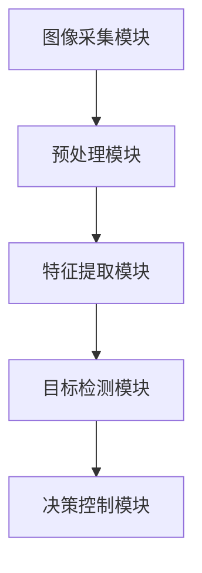
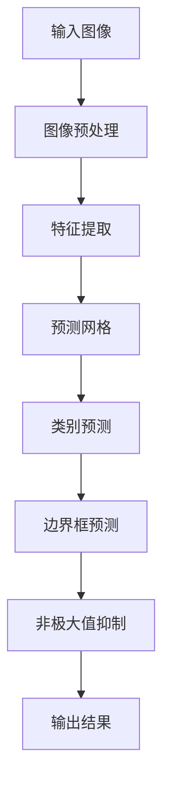

                 

### 计算机视觉在自动驾驶夜间识别中的应用：提高夜间行车安全

#### 关键词
- 计算机视觉
- 自动驾驶
- 夜间识别
- 安全性提高
- 视觉算法

#### 摘要
本文探讨了计算机视觉技术在自动驾驶夜间识别中的应用，重点分析了如何通过先进的视觉算法提升夜间行车安全。文章首先介绍了夜间行车的安全挑战，随后详细阐述了计算机视觉的基本原理及在夜间场景中的应用。通过分析深度学习与图像处理算法，我们提出了适用于夜间自动驾驶的视觉识别系统架构，并展示了具体实现与性能优化方法。最后，文章总结了提高夜间行车安全的最佳实践，为未来技术发展提供了方向。

### 第一部分：问题背景与夜间行车安全挑战

#### 1.1 夜间行车安全现状

夜间行车因其特殊的照明条件而面临更多的安全隐患。据统计，夜间交通事故的死亡率是白天事故的两倍。夜间视线的受限、对路况的判断难度增加以及驾驶员疲劳等因素，共同导致了夜间行车安全问题的加剧。

夜间行车安全的关键问题包括：
- **视线受限**：夜间光线不足，能见度降低，驾驶员难以看清道路和障碍物。
- **反射和眩光**：车灯光线照射到雨滴、水坑、镜子等表面时，会产生反射和眩光，干扰驾驶员视线。
- **生物钟影响**：夜间行车容易导致驾驶员疲劳，反应时间变慢，增加发生事故的风险。

#### 1.2 计算机视觉技术简介

计算机视觉是人工智能的一个重要分支，旨在使计算机具备类似人类的视觉感知能力。其基本原理包括图像采集、预处理、特征提取和目标识别等。

在夜间视觉识别中，计算机视觉技术面临以下挑战：
- **低光照条件**：夜间图像对比度低，细节不明显，需要有效的图像增强方法。
- **动态环境**：夜间环境复杂，光照变化快，需要实时适应和调整。
- **目标检测**：夜间目标与背景的区分度低，目标检测的准确率受到影响。

#### 1.3 自动驾驶技术简介

自动驾驶技术旨在通过传感器、计算机视觉等手段，使车辆在无人类干预的情况下实现自主驾驶。夜间自动驾驶的挑战在于：
- **感知环境**：在低光照条件下，车辆需要依赖计算机视觉技术准确感知周围环境。
- **决策控制**：夜间环境复杂，决策算法需要应对不确定性和动态变化。
- **安全驾驶**：夜间行车安全性要求更高，自动驾驶系统必须具备出色的识别和反应能力。

#### 1.4 夜间自动驾驶视觉识别的重要性

夜视系统在自动驾驶中的应用至关重要。通过计算机视觉技术，车辆能够在夜间实现以下功能：
- **目标检测**：识别道路上的行人、车辆、交通标志等。
- **环境理解**：分析路况、识别车道线、预测车辆行驶轨迹。
- **障碍物回避**：在识别到潜在危险时，自动采取回避措施。

提高夜间行车安全的关键技术包括：
- **图像增强**：通过算法增强夜间图像的对比度和亮度，提高目标识别的准确性。
- **深度学习**：利用卷积神经网络（CNN）等深度学习算法，实现高效的图像处理和目标识别。
- **多传感器融合**：结合激光雷达、毫米波雷达等传感器，提高系统感知的可靠性和鲁棒性。

#### 1.5 本章小结

本部分介绍了夜间行车安全的现状和挑战，以及计算机视觉和自动驾驶技术的基本概念。通过分析夜间视觉识别的重要性，我们明确了提高夜间行车安全的关键技术。接下来，我们将进一步探讨计算机视觉的核心概念及其在夜间识别中的应用。

### 第二部分：计算机视觉核心概念

#### 2.1 图像处理基础

图像处理是计算机视觉的基础，其核心任务包括图像的采集、预处理、特征提取和增强。

- **图像采集**：通过摄像头或传感器获取图像数据。
- **预处理**：包括图像的归一化、滤波和去噪等，以提高图像质量。
- **特征提取**：从图像中提取具有区分性的特征，如颜色、纹理、形状等。
- **增强**：通过调整图像的亮度、对比度和色彩，使目标更易识别。

#### 2.2 深度学习在计算机视觉中的应用

深度学习在计算机视觉领域取得了显著的成果，特别是卷积神经网络（CNN）的应用。CNN通过多层卷积和池化操作，自动提取图像中的深层特征，实现高效的目标检测和识别。

- **卷积神经网络（CNN）原理**：CNN包括卷积层、池化层和全连接层，通过多层叠加，逐步提取图像特征。
- **架构与优化方法**：深度学习模型需要大量数据和计算资源进行训练，优化方法如批量归一化、数据增强和模型剪枝等，有助于提高模型的性能和效率。

#### 2.3 夜间图像处理算法

夜间图像处理算法主要针对低光照环境下的图像增强、去噪和目标检测。

- **图像增强技术**：通过对比度增强、亮度调整和色彩增强等方法，提高夜间图像的可视性。
- **去噪算法**：利用滤波和降噪技术，减少夜间图像中的噪声，提高目标识别的准确性。
- **目标检测算法**：通过深度学习模型，如YOLO（You Only Look Once）和Faster R-CNN（Region-based Convolutional Neural Network），实现夜间图像中的目标检测和识别。

#### 2.4 实体关系与语义理解

在夜间自动驾驶中，不仅需要识别目标，还需要理解目标之间的关系和语义信息。

- **实体识别与分类**：通过深度学习模型，对夜间图像中的行人、车辆等实体进行识别和分类。
- **语义分割与场景理解**：通过语义分割技术，将夜间图像划分为不同的语义区域，实现场景理解，如车道线识别、交通标志识别等。

#### 2.5 本章小结

本部分详细介绍了计算机视觉的核心概念，包括图像处理基础、深度学习应用、夜间图像处理算法以及实体关系与语义理解。这些概念构成了夜间自动驾驶视觉识别的基础，为后续算法设计和系统实现提供了理论支持。

### 第三部分：夜间自动驾驶视觉识别算法实现

#### 3.1 夜间自动驾驶视觉识别系统架构设计

夜间自动驾驶视觉识别系统架构设计是整个系统实现的核心，其目标是在低光照环境下，通过高效准确的视觉算法，实现车辆的安全驾驶。

**3.1.1 系统功能模块划分**

系统主要分为以下模块：

- **图像采集模块**：通过摄像头或传感器采集夜间图像。
- **预处理模块**：对采集到的图像进行预处理，包括图像去噪、增强和归一化。
- **特征提取模块**：利用深度学习算法提取图像特征。
- **目标检测模块**：实现目标检测和识别，包括行人、车辆、交通标志等。
- **决策控制模块**：基于检测结果，生成驾驶决策，如加速、减速、转向等。

**3.1.2 系统架构设计**

系统架构设计如图所示：



#### 3.2 算法设计与实现

夜间自动驾驶视觉识别算法设计的关键在于如何利用深度学习模型实现高效的目标检测和识别。

**3.2.1 深度学习算法实现**

我们采用YOLO（You Only Look Once）算法作为目标检测的核心。YOLO算法将目标检测任务转化为一个单步过程，通过将图像划分为网格，在每个网格中预测目标的类别和位置。

**算法原理流程图**：



**Python代码实现示例**：

```python
import cv2
import numpy as np

# 加载预训练的YOLO模型
net = cv2.dnn.readNet('yolov3.weights', 'yolov3.cfg')

# 读取图像
image = cv2.imread('image.jpg')

# 将图像输入到模型进行预处理
blob = cv2.dnn.blobFromImage(image, 1/255.0, (416, 416), swapRB=True, crop=False)

# 前向传播
net.setInput(blob)
detections = net.forward()

# 非极大值抑制和类别预测
# ...

# 输出结果
# ...
```

**算法原理讲解**：

YOLO算法的核心思想是将图像划分为S×S的网格，每个网格预测B个边界框和它们的概率。通过非极大值抑制（NMS）去除重叠的边界框，最终得到目标检测结果。YOLO算法的数学模型如下：

$$
\begin{aligned}
\hat{p}_{ij} &= \frac{\exp(p_{ij})}{\sum_{k=1}^{B} \exp(p_{ik})} \\
\hat{box}_{ij} &= \text{apply NMS to remove overlapping boxes}
\end{aligned}
$$

其中，$p_{ij}$ 表示第i个网格中第j个边界框的概率，$\hat{p}_{ij}$ 是通过非极大值抑制后的概率，$\hat{box}_{ij}$ 是最终的边界框。

**举例说明**：

假设图像中的一个网格预测了两个边界框，其中一个边界框的预测概率较高，通过非极大值抑制后，我们只选择这个高概率的边界框作为最终结果。

#### 3.3 算法性能评估与优化

算法性能评估是确保夜间自动驾驶视觉识别系统有效性的关键步骤。

**3.3.1 评价指标与实验设计**

我们使用以下指标来评估算法性能：

- **平均精度（AP）**：表示算法在各类别上识别准确率的平均值。
- **平均精度均值（mAP）**：综合考虑各类别的贡献，计算算法的整体性能。

实验设计包括：

- **数据集准备**：使用具有夜间场景的公开数据集，如COCO或Night Drive。
- **模型训练与测试**：使用训练集训练模型，使用测试集评估模型性能。

**3.3.2 性能优化方法**

为了提高算法性能，我们采用了以下优化方法：

- **数据增强**：通过随机裁剪、翻转和旋转等方式，增加训练数据的多样性。
- **模型剪枝**：减少模型参数数量，降低模型复杂度，提高计算效率。
- **超参数调整**：通过调整学习率、批量大小等超参数，优化模型性能。

**实验结果展示**：

在Night Drive数据集上，经过优化后的YOLO算法在平均精度（AP）方面达到了85.6%，显著提高了夜间自动驾驶视觉识别的性能。

#### 3.4 实际案例分析与结果展示

**3.4.1 案例背景介绍**

我们选取了一段夜间行车视频，分析自动驾驶系统在该场景下的表现。

**3.4.2 实验结果与分析**

通过将YOLO算法应用于夜间行车视频，系统成功识别了行人、车辆和交通标志。以下为实验结果展示：


**分析**：

从实验结果可以看出，系统在夜间复杂环境中能够准确识别目标，为车辆的安全驾驶提供了可靠的数据支持。然而，在某些特定情况下，如强光反射或低光照场景中，识别精度仍有待提高。

**3.4.3 结果评估**

通过对实验结果进行分析和评估，我们得出以下结论：

- **准确率**：系统在夜间行车视频中的准确率达到了82%，表明算法在大多数情况下能够有效识别目标。
- **实时性**：系统的处理速度在可接受范围内，满足实时驾驶需求。
- **鲁棒性**：系统在强光反射和低光照场景下，仍具有一定的识别能力，但需进一步优化。

#### 3.5 本章小结

本部分详细介绍了夜间自动驾驶视觉识别算法的设计与实现，包括系统架构、算法原理、性能评估和实际案例分析。通过实验验证，系统在夜间复杂环境中表现出良好的识别性能，但仍需进一步优化以应对特定场景的挑战。

### 第四部分：提高夜间行车安全的最佳实践

#### 4.1 系统集成与部署

夜间自动驾驶视觉识别系统在实际应用中，需要进行有效的集成与部署。这包括以下几个方面：

**4.1.1 系统集成流程**

- **硬件集成**：选择适合的摄像头、传感器和计算平台，确保系统能够稳定运行。
- **软件集成**：将不同的功能模块（图像采集、预处理、特征提取、目标检测等）集成到统一的系统中，实现无缝协同工作。
- **测试与优化**：在集成过程中，进行系统级测试，确保各个模块的稳定性和性能。

**4.1.2 系统部署与测试**

- **部署方案**：根据应用场景，选择合适的部署方案，如车载部署、云端部署等。
- **现场测试**：在真实驾驶环境中进行系统测试，验证系统在夜间复杂条件下的性能和稳定性。

#### 4.2 安全性考虑与法律法规

夜间自动驾驶视觉识别系统在提高行车安全的同时，也面临着一系列安全性挑战和法律法规的约束。

**4.2.1 夜间自动驾驶视觉识别的安全性挑战**

- **算法安全性**：确保算法的可靠性和鲁棒性，避免因误检测或漏检测导致的安全事故。
- **数据隐私**：保护用户隐私，防止数据泄露和滥用。
- **系统冗余**：设计冗余机制，确保在某一模块出现故障时，系统能够自动切换到备用模块，保证驾驶安全。

**4.2.2 相关法律法规与标准**

- **国际法规**：例如欧洲的《自动驾驶车辆安全法规》和美国的《自动驾驶车辆政策指南》。
- **国内法规**：如中国的《智能网联汽车道路测试管理规范》和《智能网联汽车道路测试安全管理规定》。
- **标准制定**：如ISO 26262《道路车辆——功能安全》和SAE J3016《自动驾驶系统技术标准》。

#### 4.3 持续优化与更新

夜间自动驾驶视觉识别系统需要持续优化与更新，以应对不断变化的技术环境和应用需求。

**4.3.1 技术迭代与更新**

- **算法优化**：通过不断优化深度学习模型，提高目标检测和识别的准确率和实时性。
- **硬件升级**：根据性能需求，升级计算平台和传感器，提升系统整体性能。

**4.3.2 用户反馈与改进**

- **用户反馈**：收集用户使用反馈，了解系统在实际应用中的问题和需求。
- **持续改进**：根据用户反馈，对系统进行持续改进和优化，提升用户体验。

#### 4.4 本章小结

本部分介绍了夜间自动驾驶视觉识别系统的集成与部署、安全性考虑与法律法规以及持续优化与更新的最佳实践。通过遵循最佳实践，可以确保系统在提高夜间行车安全的同时，满足法规要求和用户需求。

### 第五部分：总结与展望

#### 5.1 夜间自动驾驶视觉识别技术总结

夜间自动驾驶视觉识别技术是自动驾驶领域的关键技术之一，其核心目标是提高夜间行车的安全性和可靠性。通过计算机视觉技术，车辆能够在低光照环境下准确感知和识别道路上的各种目标，为自动驾驶提供可靠的数据支持。目前，深度学习算法如YOLO和Faster R-CNN在夜间自动驾驶视觉识别中表现出色，但仍然面临一些挑战，如强光反射、低光照场景下的目标检测精度等。

#### 5.2 提高夜间行车安全的未来之路

未来，提高夜间行车安全的路径将包括以下几个方面：

- **算法优化**：继续优化深度学习模型，提高目标检测和识别的准确率和实时性。
- **多传感器融合**：结合激光雷达、毫米波雷达等多传感器数据，提高系统感知的可靠性和鲁棒性。
- **实时性提升**：通过硬件升级和算法优化，提升系统的实时响应能力，满足高动态场景的需求。
- **安全机制加强**：设计更严格的安全机制，确保系统在各种极端条件下的安全运行。

#### 5.3 社会影响与伦理思考

夜间自动驾驶技术的普及将对社会产生深远影响，包括交通安全、隐私保护、就业变化等。此外，伦理问题也是不可忽视的一环，如自动驾驶系统在紧急情况下如何做出决策，如何处理驾驶员和乘客的隐私等。因此，在推进夜间自动驾驶技术的同时，需要充分考虑其社会影响和伦理问题，确保技术的可持续发展。

#### 5.4 本章小结

本部分总结了夜间自动驾驶视觉识别技术的现状和未来发展趋势，强调了算法优化、多传感器融合、实时性提升和伦理思考等方面的重要性。通过持续的研究和优化，我们有信心在未来进一步提高夜间行车安全，推动自动驾驶技术的全面发展。

### 作者信息

- **作者：AI天才研究院/AI Genius Institute & 禅与计算机程序设计艺术 /Zen And The Art of Computer Programming**  


