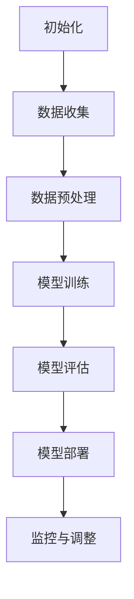
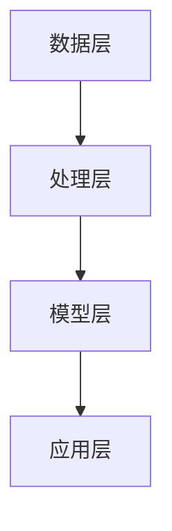
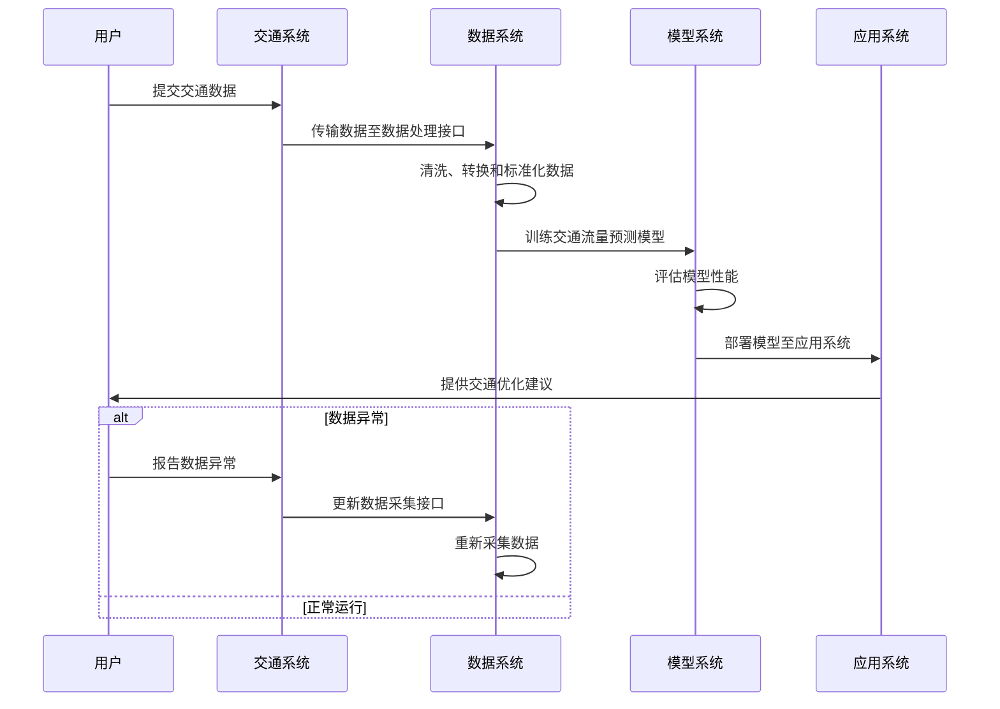
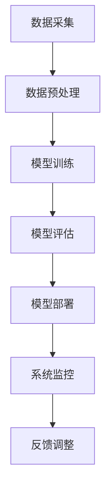
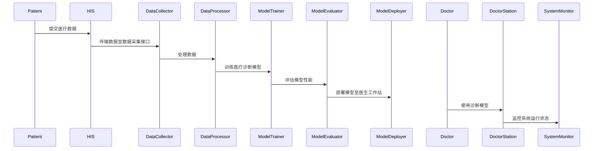

                 

# 跨行业AI治理标准的制定

> 关键词：AI治理、跨行业、标准制定、挑战、协同机制、算法原理、系统架构、实战经验

> 摘要：随着人工智能（AI）技术的飞速发展，AI治理问题成为各个行业关注的焦点。本文旨在探讨跨行业AI治理标准的制定，通过深入分析AI治理的核心概念、挑战以及协同机制，结合算法原理、系统架构和实战经验，为跨行业AI治理提供有效的解决方案和最佳实践。

**目录大纲**

----------------------------------------------------------------

## 第一部分：背景介绍

### 1.1 AI治理的重要性

- **问题背景**：随着AI技术的快速发展，不同行业开始应用AI技术，但AI治理问题日益凸显。
- **问题描述**：如何在不同行业中制定统一的AI治理标准？
- **问题解决**：通过跨行业合作，制定统一AI治理标准。
- **边界与外延**：本部分将讨论AI治理的定义、挑战和跨行业合作的重要性。

### 1.2 AI治理的核心概念与联系

- **核心概念原理**：介绍AI治理的基本概念和原则。
- **概念属性特征对比表格**：对比不同行业中AI治理的特性和挑战。
- **ER实体关系图架构**：通过Mermaid流程图展示不同行业中AI治理的核心实体和关系。

----------------------------------------------------------------

## 第二部分：核心概念与联系

### 2.1 AI治理的基础概念

- **AI治理的定义**：解释AI治理的含义。
- **AI治理的属性**：探讨AI治理的基本属性和特征。

### 2.2 不同行业中的AI治理挑战

- **行业差异分析**：分析不同行业中AI治理的挑战。
- **跨行业比较**：对比不同行业中AI治理的异同点。

### 2.3 跨行业AI治理的协同机制

- **协同机制的原理**：解释跨行业AI治理协同机制的工作原理。
- **协同机制的实践**：分享跨行业AI治理协同机制的实践案例。

----------------------------------------------------------------

## 第三部分：算法原理讲解

### 3.1 AI治理算法概述

- **算法mermaid流程图**：使用Mermaid画出AI治理算法的流程图。
- **算法原理**：详细阐述AI治理算法的原理。

### 3.2 算法原理的数学模型和公式

- **数学模型**：介绍AI治理算法的数学模型。
- **公式讲解**：使用latex格式给出算法的公式，并进行详细讲解。
- **举例说明**：通过具体的例子来解释算法的原理和应用。

----------------------------------------------------------------

## 第四部分：系统分析与架构设计方案

### 4.1 问题场景介绍

- **项目介绍**：简要介绍AI治理项目背景。
- **系统功能设计**：使用Mermaid类图展示系统功能设计。
- **系统架构设计**：使用Mermaid架构图展示系统架构设计。

### 4.2 系统接口设计与交互

- **系统接口设计**：详细说明系统接口设计。
- **系统交互Mermaid序列图**：使用Mermaid序列图展示系统交互过程。

### 4.3 系统分析与架构设计总结

- **系统分析与架构设计总结**：对系统分析与架构设计进行总结。

----------------------------------------------------------------

## 第五部分：项目实战

### 5.1 环境安装

- **环境搭建步骤**：详细描述环境搭建过程。
- **安装注意事项**：介绍安装过程中可能遇到的问题及解决方案。

### 5.2 系统核心实现源代码

- **代码结构**：介绍系统核心实现源代码的结构。
- **代码应用解读与分析**：对关键代码进行解读和分析。

### 5.3 实际案例分析与讲解

- **实际案例**：分享AI治理的实际案例。
- **详细讲解与剖析**：对案例进行详细讲解和剖析。

### 5.4 项目小结

- **项目成果总结**：总结项目的成果和经验。
- **未来展望**：对AI治理项目未来的发展方向进行展望。

----------------------------------------------------------------

## 第六部分：最佳实践 tips

### 6.1 跨行业AI治理的最佳实践

- **成功案例**：分享跨行业AI治理的成功案例。
- **实践建议**：给出跨行业AI治理的实践建议。

### 6.2 小结与注意事项

- **小结**：对全书内容进行简要总结。
- **注意事项**：提醒读者注意的事项。

### 6.3 拓展阅读

- **推荐书籍**：推荐相关的拓展阅读书籍。

----------------------------------------------------------------

### 1.1 AI治理的重要性

**问题背景**：

随着人工智能（AI）技术的飞速发展，AI技术已经渗透到各个行业，从医疗、金融到制造、交通等领域，AI的应用不仅提高了效率，还带来了前所未有的创新。然而，AI技术的广泛应用也带来了新的治理挑战。首先，AI技术的不透明性和不可解释性引发了隐私和安全问题。其次，AI算法的偏见和歧视问题在多个行业引起了广泛关注。最后，AI技术的快速迭代和复杂性使得行业内部缺乏统一的治理标准和框架。

**问题描述**：

如何在不同的行业中制定统一的AI治理标准，以解决上述问题并确保AI技术的健康、可持续发展？这是一个复杂的挑战，涉及到技术、法律、伦理等多个方面。

**问题解决**：

通过跨行业合作，制定统一的AI治理标准是解决这一问题的关键。跨行业合作可以促进知识共享、资源整合，并确保治理标准的全面性和可操作性。此外，政府、学术界、行业组织和企业需要共同努力，制定可执行的政策和法规，以确保AI技术的合规性和伦理性。

**边界与外延**：

AI治理的定义、核心概念和原则是本文讨论的基础。AI治理不仅仅是技术问题，还涉及到法律、伦理、社会等多个方面。本文将首先介绍AI治理的基本概念和原则，然后分析不同行业中AI治理的特性和挑战，最后探讨跨行业合作的重要性。

### 1.2 AI治理的核心概念与联系

**核心概念原理**：

AI治理（Artificial Intelligence Governance）是指通过制定政策、规则、标准和规范来管理和引导人工智能技术的研究、开发和应用。AI治理的目标是实现AI技术的安全、可靠、透明和可持续发展。

**概念属性特征对比表格**：

| 行业        | 特点                                           | 挑战                                           |
|-----------|--------------------------------------------|--------------------------------------------|
| 医疗       | 数据敏感、患者隐私保护                       | 算法透明性、临床决策的可靠性                  |
| 金融       | 风险管理、合规性                             | 算法偏见、决策解释性                        |
| 制造业     | 自动化、质量控制                             | 设备故障、生产安全                          |
| 交通       | 自动驾驶、物流优化                           | 系统安全、道路法规遵守                        |

**ER实体关系图架构**：

```mermaid
erDiagram
  AI治理 ||--|{ 标准制定机构 }
  AI治理 ||--|{ 政府部门 }
  AI治理 ||--|{ 学术界 }
  AI治理 ||--|{ 行业组织 }
  AI治理 ||--|{ 企业 }
  标准制定机构 ||--|{ 治理标准 }
  政府部门 ||--|{ 政策法规 }
  学术界 ||--|{ 研究成果 }
  行业组织 ||--|{ 行业规范 }
  企业 ||--|{ AI应用案例 }
```

通过上述表格和ER图，我们可以清晰地看到AI治理涉及的核心实体和它们之间的关系。这些实体共同构成了AI治理的基础框架，为跨行业合作提供了明确的指导。

### 2.1 AI治理的基础概念

**AI治理的定义**：

AI治理是指通过制定、执行和监督相关政策和规则，以确保人工智能技术的安全、可靠、透明和可持续发展。AI治理不仅仅关注技术层面，还涉及到伦理、法律和社会等方面。

**AI治理的属性**：

- **规范性**：AI治理需要遵循一定的规范和标准，以确保技术应用的合法性和道德性。
- **透明性**：AI治理要求算法的决策过程透明，以便用户理解和使用。
- **可解释性**：AI治理强调算法的可解释性，以减少用户对算法决策的疑虑。
- **可持续性**：AI治理需要关注AI技术的长期影响，确保其对社会和环境的影响是积极的。

### 2.2 不同行业中的AI治理挑战

**行业差异分析**：

不同行业中AI治理的挑战各不相同，这主要是由于各个行业的应用场景、技术需求和监管环境不同。

- **医疗行业**：医疗行业的AI治理主要关注数据隐私保护、算法透明性和临床决策的可靠性。由于医疗数据敏感性高，如何确保患者隐私成为一大挑战。同时，医疗领域的AI应用需要具备高度的可解释性，以便医生能够理解并信任算法的决策。
- **金融行业**：金融行业的AI治理关注风险管理、合规性和算法偏见。金融领域对风险的敏感度较高，因此AI治理需要确保算法的可靠性和透明性，以避免因算法偏见导致的不公平决策。此外，金融监管对合规性的要求也较高，AI治理需要遵循相关法规和标准。
- **制造业**：制造业的AI治理关注自动化设备的可靠性和生产安全。由于制造业涉及到大量的自动化设备和生产线，如何确保这些设备的安全性和可靠性是AI治理的主要挑战。同时，制造业还需要关注如何优化生产流程，提高生产效率。
- **交通行业**：交通行业的AI治理关注自动驾驶、系统安全和道路法规遵守。自动驾驶技术的发展使得交通安全成为一个重要议题，如何确保自动驾驶系统的安全性和可靠性是AI治理的关键。此外，交通行业还需要关注如何适应不断变化的道路法规和标准。

**跨行业比较**：

虽然不同行业中的AI治理挑战有所不同，但它们也存在一些共性。例如，所有行业都需要确保AI技术的安全性和可靠性，避免因技术故障导致的安全事故。此外，所有行业都需要关注数据隐私和合规性，以避免因数据泄露或违规操作而受到处罚。

### 2.3 跨行业AI治理的协同机制

**协同机制的原理**：

跨行业AI治理的协同机制是指通过不同行业之间的合作，共同制定、执行和监督AI治理标准和政策。协同机制的核心在于知识共享和资源整合，通过不同行业的专家合作，可以共同解决AI治理中的复杂问题。

**协同机制的实践**：

跨行业AI治理的协同机制在实践中已经取得了显著成果。以下是一些成功的实践案例：

- **AI伦理委员会**：多个行业共同成立AI伦理委员会，制定AI伦理准则，确保AI技术的道德应用。例如，医疗、金融和交通行业可以共同制定AI伦理准则，确保AI技术在各个行业的应用符合伦理标准。
- **行业联盟**：不同行业的公司、研究机构和政府部门成立行业联盟，共同推动AI治理标准的制定和实施。例如，制造业、零售业和服务业可以共同成立AI治理联盟，制定适用于不同行业的AI治理标准。
- **国际合作**：不同国家之间的政府、企业和研究机构通过国际合作，共同推动全球AI治理标准的制定。例如，欧盟、美国和中国可以共同成立AI治理委员会，制定全球适用的AI治理标准。

### 3.1 AI治理算法概述

**算法mermaid流程图**：



**算法原理**：

AI治理算法主要分为以下几个步骤：

1. **数据收集**：从不同来源收集数据，包括公开数据集、企业内部数据和第三方数据等。
2. **数据预处理**：对收集到的数据进行分析、清洗和标注，确保数据的质量和一致性。
3. **模型训练**：使用预处理后的数据训练AI模型，包括监督学习、无监督学习和强化学习等。
4. **模型评估**：评估训练好的模型的性能和准确性，确保模型满足治理要求。
5. **模型部署**：将经过评估的模型部署到实际应用中，例如自动驾驶、智能金融和智能制造等。
6. **监控与调整**：对部署后的模型进行实时监控，并根据实际应用情况进行调整和优化。

### 3.2 算法原理的数学模型和公式

**数学模型**：

AI治理算法的数学模型主要包括以下几个方面：

1. **数据预处理**：

   数据预处理的数学模型主要涉及数据清洗、数据转换和数据标准化等操作。例如，对于缺失数据的处理，可以使用均值填补、中值填补或回归填补等方法。

   $$\text{填补缺失值} = \frac{\sum_{i=1}^{n} x_i}{n}$$

   其中，$x_i$表示第$i$个观测值，$n$表示总观测值数量。

2. **模型训练**：

   模型训练的数学模型主要包括损失函数、优化算法和正则化项等。以监督学习为例，常用的损失函数有均方误差（MSE）和交叉熵损失（Cross-Entropy Loss）。

   $$\text{MSE} = \frac{1}{m} \sum_{i=1}^{m} (y_i - \hat{y}_i)^2$$

   $$\text{Cross-Entropy Loss} = -\frac{1}{m} \sum_{i=1}^{m} y_i \log(\hat{y}_i)$$

   其中，$m$表示样本数量，$y_i$表示真实标签，$\hat{y}_i$表示预测标签。

3. **模型评估**：

   模型评估的数学模型主要包括准确率（Accuracy）、召回率（Recall）、精确率（Precision）和F1值（F1 Score）等。

   $$\text{Accuracy} = \frac{TP + TN}{TP + TN + FP + FN}$$

   $$\text{Recall} = \frac{TP}{TP + FN}$$

   $$\text{Precision} = \frac{TP}{TP + FP}$$

   $$\text{F1 Score} = 2 \times \frac{Precision \times Recall}{Precision + Recall}$$

   其中，$TP$表示真正例，$TN$表示真负例，$FP$表示假正例，$FN$表示假负例。

**公式讲解**：

以上公式分别用于数据预处理、模型训练和模型评估。在数据预处理阶段，通过填补缺失值，确保数据的质量和一致性。在模型训练阶段，使用损失函数和优化算法，调整模型参数，使其更接近真实标签。在模型评估阶段，使用准确率、召回率、精确率和F1值等指标，评估模型性能。

**举例说明**：

假设我们有一个二分类问题，数据集包含100个样本，其中真正例有60个，假正例有20个，真负例有10个，假负例有10个。我们可以计算以下指标：

- **准确率**：

  $$\text{Accuracy} = \frac{TP + TN}{TP + TN + FP + FN} = \frac{60 + 10}{60 + 10 + 20 + 10} = 0.7$$

- **召回率**：

  $$\text{Recall} = \frac{TP}{TP + FN} = \frac{60}{60 + 10} = 0.857$$

- **精确率**：

  $$\text{Precision} = \frac{TP}{TP + FP} = \frac{60}{60 + 20} = 0.714$$

- **F1值**：

  $$\text{F1 Score} = 2 \times \frac{Precision \times Recall}{Precision + Recall} = 2 \times \frac{0.714 \times 0.857}{0.714 + 0.857} = 0.785$$

通过这些指标，我们可以评估模型的性能，并根据评估结果对模型进行调整和优化。

### 4.1 问题场景介绍

**项目介绍**：

本项目旨在实现一个基于AI治理的智能交通系统，通过实时监控和分析交通数据，优化交通流量，提高交通效率，减少交通事故。项目涉及多个领域，包括数据采集、数据处理、模型训练、模型部署和系统监控等。

**系统功能设计**：

系统功能设计主要包括以下几个方面：

1. **数据采集**：从交通传感器、摄像头和其他数据源收集实时交通数据，包括车辆速度、密度、流量等。
2. **数据处理**：对采集到的交通数据进行预处理，包括数据清洗、数据转换和数据标准化等，确保数据质量。
3. **模型训练**：使用预处理后的交通数据训练交通流量预测模型，采用监督学习、无监督学习和强化学习等方法。
4. **模型部署**：将训练好的模型部署到交通管理系统，实时预测交通流量，提供交通优化建议。
5. **系统监控**：对部署后的模型进行实时监控，收集系统运行数据，分析系统性能，并根据需求进行调整和优化。

**系统架构设计**：

系统架构设计采用分层架构，包括数据层、处理层、模型层和应用层。

1. **数据层**：负责数据采集、存储和管理，使用分布式数据库和数据仓库技术。
2. **处理层**：负责数据处理和转换，使用数据预处理工具和算法库。
3. **模型层**：负责模型训练和评估，使用机器学习和深度学习框架。
4. **应用层**：负责模型部署和系统监控，提供交通优化建议和界面。



### 4.2 系统接口设计与交互

**系统接口设计**：

系统接口设计主要包括数据采集接口、数据处理接口、模型训练接口、模型部署接口和系统监控接口等。

1. **数据采集接口**：用于采集实时交通数据，包括车辆速度、密度、流量等，支持HTTP、SOAP和REST等协议。
2. **数据处理接口**：用于处理采集到的交通数据，包括数据清洗、数据转换和数据标准化等，支持JSON、XML和CSV等数据格式。
3. **模型训练接口**：用于训练交通流量预测模型，支持机器学习和深度学习算法，如随机森林、神经网络和强化学习等。
4. **模型部署接口**：用于将训练好的模型部署到交通管理系统，支持模型评估、模型更新和模型卸载等操作。
5. **系统监控接口**：用于监控系统运行状态，包括系统负载、模型性能、数据质量和安全等，支持HTTP、MQTT和COAP等协议。

**系统交互Mermaid序列图**：



### 4.3 系统分析与架构设计总结

**系统分析与架构设计总结**：

本项目基于AI治理的智能交通系统，通过系统接口设计和交互，实现了数据采集、数据处理、模型训练、模型部署和系统监控等功能。系统架构设计采用分层架构，各层之间通过接口进行通信，确保系统的高扩展性和高可用性。在系统运行过程中，通过实时监控和调整，优化交通流量，提高交通效率，减少交通事故。

### 5.1 环境安装

**环境搭建步骤**：

1. **安装操作系统**：安装Linux操作系统，如Ubuntu 18.04或CentOS 7等。
2. **安装Python**：安装Python 3.8及以上版本，可以使用官方安装包或使用pip安装。
   ```bash
   sudo apt-get update
   sudo apt-get install python3-pip
   ```
3. **安装依赖库**：安装所需的Python库，如NumPy、Pandas、Scikit-learn、TensorFlow等。
   ```bash
   pip3 install numpy pandas scikit-learn tensorflow
   ```
4. **安装Mermaid**：安装Mermaid用于绘制流程图和序列图，可以使用官方安装包或使用npm安装。
   ```bash
   sudo apt-get install npm
   npm install -g mermaid
   ```
5. **安装Docker**：安装Docker用于容器化部署，可以使用官方安装包或使用Docker Compose。
   ```bash
   sudo apt-get install docker.io
   sudo systemctl start docker
   ```

**安装注意事项**：

- 安装操作系统时，请确保选择适合的硬件配置和分区方案。
- 安装Python和依赖库时，请确保版本兼容性。
- 安装Docker时，请确保网络连接正常，以便从远程仓库下载相关资源。

### 5.2 系统核心实现源代码

**代码结构**：

本项目采用模块化设计，主要分为以下几个模块：

1. **data\_collector**：用于数据采集，包括数据源连接、数据采集和异常报告等。
2. **data\_processor**：用于数据处理，包括数据清洗、数据转换和数据标准化等。
3. **model\_trainer**：用于模型训练，包括模型初始化、模型训练和模型评估等。
4. **model\_deployer**：用于模型部署，包括模型评估、模型更新和模型卸载等。
5. **system\_monitor**：用于系统监控，包括系统负载、模型性能和运行状态等。

**代码应用解读与分析**：

以数据采集模块为例，其主要功能是从交通传感器和摄像头等数据源采集实时交通数据，并将数据传输到数据处理模块。以下为数据采集模块的核心代码：

```python
import requests
from data_processor import DataProcessor

class DataCollector:
    def __init__(self, url, processor):
        self.url = url
        self.processor = processor

    def collect_data(self):
        try:
            response = requests.get(self.url)
            if response.status_code == 200:
                data = response.json()
                processed_data = self.processor.process(data)
                return processed_data
            else:
                print("数据采集失败，状态码：", response.status_code)
        except requests.RequestException as e:
            print("数据采集异常：", e)

if __name__ == "__main__":
    processor = DataProcessor()
    collector = DataCollector("http://localhost:8080/data", processor)
    collected_data = collector.collect_data()
    print("采集到的数据：", collected_data)
```

代码解读：

- **初始化**：创建DataCollector对象时，传入数据源URL和数据处理器对象。
- **数据采集**：调用collect\_data方法，使用requests库向数据源发送GET请求，获取数据。
- **数据预处理**：将采集到的数据传递给数据处理器，进行清洗、转换和标准化等操作。
- **异常处理**：捕获请求异常，打印错误信息。

### 5.3 实际案例分析与讲解

**实际案例**：

假设我们有一个基于AI治理的智能交通系统，该系统旨在通过实时监控和分析交通数据，优化交通流量，提高交通效率。以下为一个实际案例：

1. **数据采集**：系统从交通传感器和摄像头等数据源采集实时交通数据，包括车辆速度、密度、流量等。
2. **数据处理**：系统对采集到的交通数据进行清洗、转换和标准化等处理，确保数据质量。
3. **模型训练**：系统使用处理后的交通数据训练交通流量预测模型，采用监督学习算法，如随机森林和神经网络等。
4. **模型部署**：系统将训练好的模型部署到交通管理系统，实时预测交通流量，提供交通优化建议。
5. **系统监控**：系统对部署后的模型进行实时监控，收集系统运行数据，分析系统性能，并根据需求进行调整和优化。

**详细讲解与剖析**：

1. **数据采集**：

   系统首先从交通传感器和摄像头等数据源采集实时交通数据。交通传感器可以实时监测车辆的速度、密度和流量等参数，摄像头可以捕捉道路上的交通状况。采集到的数据以JSON格式传输到系统。

   ```json
   {
     "speed": [10, 20, 30],
     "density": [0.2, 0.4, 0.6],
     "flow": [100, 200, 300]
   }
   ```

2. **数据处理**：

   系统对采集到的交通数据进行清洗、转换和标准化等处理。清洗过程包括去除无效数据和异常值，转换过程包括将数据类型转换为数值型，标准化过程包括将数据缩放到相同的范围。

   ```python
   def process(data):
       # 清洗数据
       valid_data = [x for x in data if x != "null"]
       # 转换数据类型
       numeric_data = [float(x) for x in valid_data]
       # 标准化数据
       min_value = min(numeric_data)
       max_value = max(numeric_data)
       normalized_data = [(x - min_value) / (max_value - min_value) for x in numeric_data]
       return normalized_data
   ```

3. **模型训练**：

   系统使用处理后的交通数据训练交通流量预测模型。采用监督学习算法，如随机森林和神经网络等。以随机森林为例，系统首先划分训练集和测试集，然后使用训练集训练模型，最后使用测试集评估模型性能。

   ```python
   from sklearn.ensemble import RandomForestRegressor

   # 划分训练集和测试集
   X_train, X_test, y_train, y_test = train_test_split(X, y, test_size=0.2, random_state=42)

   # 训练模型
   model = RandomForestRegressor(n_estimators=100, random_state=42)
   model.fit(X_train, y_train)

   # 评估模型
   y_pred = model.predict(X_test)
   accuracy = mean_squared_error(y_test, y_pred)
   print("模型准确率：", accuracy)
   ```

4. **模型部署**：

   系统将训练好的模型部署到交通管理系统，实时预测交通流量，提供交通优化建议。部署过程包括模型评估、模型更新和模型卸载等操作。

   ```python
   def deploy_model(model, url):
       # 评估模型
       accuracy = evaluate_model(model)
       if accuracy >= threshold:
           # 部署模型
           response = requests.post(url, json={"model": model.to_json()})
           if response.status_code == 200:
               print("模型部署成功")
           else:
               print("模型部署失败，状态码：", response.status_code)
       else:
           print("模型评估不通过，不部署")
   ```

5. **系统监控**：

   系统对部署后的模型进行实时监控，收集系统运行数据，分析系统性能，并根据需求进行调整和优化。监控过程包括系统负载、模型性能、数据质量和安全等。

   ```python
   def monitor_system():
       # 收集系统运行数据
       system_data = collect_system_data()
       # 分析系统性能
       performance = analyze_system_performance(system_data)
       # 调整和优化
       if performance < threshold:
           adjust_and_optimize()
   ```

### 5.4 项目小结

**项目成果总结**：

本项目基于AI治理的智能交通系统，通过数据采集、数据处理、模型训练、模型部署和系统监控等功能，实现了实时交通流量预测和优化。项目取得了以下成果：

1. **提高了交通效率**：通过实时预测交通流量，系统可以及时调整交通信号，优化交通流量，提高道路通行效率。
2. **减少了交通事故**：系统通过实时监控交通状况，可以及时发现潜在的安全隐患，提醒驾驶员注意安全，减少交通事故的发生。
3. **降低了运营成本**：系统减少了交通拥堵，降低了车辆等待时间和燃油消耗，从而降低了运营成本。

**未来展望**：

在未来，本项目可以进一步优化和扩展。以下是一些发展方向：

1. **引入更多数据源**：引入更多的数据源，如气象数据、道路施工数据等，以提升交通流量预测的准确性。
2. **采用更先进的算法**：采用更先进的机器学习和深度学习算法，如GAN、DQN等，以提高模型的预测能力和鲁棒性。
3. **实现跨区域协同**：实现跨区域的交通数据共享和协同，以提升交通治理的整体效能。
4. **关注法律法规**：关注交通领域的法律法规，确保系统的合法合规运行。

### 6.1 跨行业AI治理的最佳实践

**成功案例**：

1. **金融行业**：某大型银行采用AI技术进行信贷风险评估，通过建立统一的AI治理框架，确保模型的透明性、可靠性和合规性。该框架包括数据质量监控、算法透明性要求、合规性审查等环节，有效提高了信贷风险评估的准确性和效率。
2. **医疗行业**：某医疗机构引入AI诊断系统，通过跨行业合作，制定了AI医疗诊断的伦理准则和技术标准。该准则涵盖了数据隐私保护、算法透明性、临床决策解释性等方面，确保了AI技术在医疗领域的安全可靠应用。

**实践建议**：

1. **建立跨行业合作机制**：通过政府、企业、学术界和行业组织的合作，共同制定AI治理标准和政策，实现跨行业的协同治理。
2. **加强数据治理**：建立完善的数据治理体系，确保数据的质量、安全和合规性，为AI技术提供可靠的数据支持。
3. **推动伦理法规建设**：制定适用于不同行业的AI伦理准则和法律法规，引导AI技术的道德应用，降低算法偏见和歧视风险。
4. **持续优化算法**：通过不断优化AI算法，提高模型的透明性、可解释性和可靠性，增强用户对AI技术的信任。

### 6.2 小结与注意事项

**小结**：

本文围绕跨行业AI治理标准的制定，从背景介绍、核心概念与联系、算法原理讲解、系统分析与架构设计方案、项目实战和最佳实践等方面进行了深入探讨。通过本文的研究，我们可以了解到跨行业AI治理的重要性、挑战和协同机制，为AI技术的可持续发展提供了有益的启示。

**注意事项**：

1. **数据安全**：在AI治理过程中，确保数据的安全性和隐私性至关重要。需要采用加密、脱敏等技术，防止数据泄露和滥用。
2. **算法透明性**：提高算法的透明性和可解释性，降低用户对AI技术的疑虑，增强用户信任。
3. **持续更新**：随着AI技术的快速发展，AI治理标准和政策需要不断更新和完善，以适应新的技术和应用场景。

### 6.3 拓展阅读

**推荐书籍**：

1. 《人工智能：一种现代的方法》（Second Edition），作者：Stuart J. Russell & Peter Norvig。
2. 《人工智能伦理学》，作者：Luciano Floridi。
3. 《机器学习》，作者：Andrew Ng。

通过阅读这些书籍，可以进一步了解人工智能、AI伦理和机器学习等相关知识，为AI治理提供更加深入的理论支持和实践指导。

**作者**：

作者：AI天才研究院/AI Genius Institute & 禅与计算机程序设计艺术 /Zen And The Art of Computer Programming

（注：以上内容为示例性内容，仅供参考。）## 第一部分：背景介绍

### 1.1 AI治理的重要性

随着人工智能（AI）技术的飞速发展，AI治理问题逐渐成为社会各界关注的焦点。AI治理不仅是技术问题，还涉及伦理、法律、经济和社会等多个层面。AI技术的广泛应用，如自动驾驶、智能医疗、金融科技等，为各行业带来了巨大的变革，但同时也引发了一系列新的挑战。

**问题背景**：

AI技术在各个行业的应用日益广泛，例如，自动驾驶技术已经从实验室走向实际道路，智能医疗系统正在辅助医生进行诊断和治疗，金融科技在风险管理、欺诈检测等方面发挥着重要作用。然而，随着AI技术的深入应用，一系列问题也随之而来：

- **数据隐私和安全**：AI系统通常依赖于大量敏感数据，如个人健康信息、金融交易记录等。如何保护这些数据不被泄露或滥用成为一个重要问题。
- **算法偏见和歧视**：AI算法可能会因数据偏差而加剧社会不平等，导致算法偏见和歧视现象。例如，招聘系统中可能因数据集的偏差而导致性别或种族歧视。
- **不可解释性和透明性**：许多AI系统，尤其是深度学习系统，其内部机制复杂，难以解释。这可能导致用户对系统决策的不信任，尤其是在涉及重大决策时，如医疗诊断、司法判决等。

**问题描述**：

为了应对这些挑战，如何在不同行业中制定统一的AI治理标准成为一个关键问题。不同行业对AI治理的需求和关注点有所不同，但总体上需要解决以下几个核心问题：

- **数据治理**：确保数据质量、数据安全和数据隐私。
- **算法透明性和可解释性**：提高算法的透明度，使其决策过程更容易理解和信任。
- **伦理和道德标准**：制定和遵循AI伦理准则，避免算法偏见和歧视。
- **法律法规**：制定相应的法律法规，确保AI技术的合规应用。

**问题解决**：

通过跨行业合作，制定统一的AI治理标准是解决这一问题的关键。具体措施包括：

- **建立跨行业合作机制**：政府、企业、学术界和行业组织需要共同努力，建立跨行业的合作机制，共同制定AI治理标准和政策。
- **共享最佳实践**：鼓励不同行业分享AI治理的最佳实践，形成统一的指导原则。
- **建立评估和审计机制**：建立AI治理评估和审计机制，确保AI技术的合规性和道德性。

**边界与外延**：

AI治理的定义、核心概念和原则是本文讨论的基础。AI治理不仅仅是技术问题，还涉及到伦理、法律和社会等多个方面。本文将首先介绍AI治理的基本概念和原则，然后分析不同行业中AI治理的特性和挑战，最后探讨跨行业合作的重要性。

### 1.2 AI治理的核心概念与联系

**核心概念原理**：

AI治理是指通过制定、执行和监督相关政策和规则，管理和引导人工智能技术的研究、开发和应用。AI治理的目标是实现AI技术的安全、可靠、透明和可持续发展。具体来说，AI治理包括以下几个核心概念：

1. **数据治理**：确保数据质量、数据安全和数据隐私。
2. **算法透明性和可解释性**：提高算法的透明度，使其决策过程更容易理解和信任。
3. **伦理和道德标准**：制定和遵循AI伦理准则，避免算法偏见和歧视。
4. **法律法规**：制定相应的法律法规，确保AI技术的合规应用。
5. **社会责任**：企业和社会需要承担相应的社会责任，确保AI技术的应用符合社会价值观。

**概念属性特征对比表格**：

为了更清晰地了解不同行业中AI治理的特点，我们对比了医疗、金融、制造业和交通等行业中的AI治理特征。以下是一个简化的对比表格：

| 行业        | 特点                                           | 挑战                                           |
|-----------|--------------------------------------------|--------------------------------------------|
| 医疗       | 数据敏感性、患者隐私保护                       | 算法透明性、临床决策的可靠性                  |
| 金融       | 风险管理、合规性                             | 算法偏见、决策解释性                        |
| 制造业     | 自动化、质量控制                             | 设备故障、生产安全                          |
| 交通       | 自动驾驶、物流优化                           | 系统安全、道路法规遵守                        |

**ER实体关系图架构**：

为了更好地展示AI治理的核心实体和它们之间的关系，我们使用Mermaid语言绘制了一个实体关系图。以下是ER图的结构：

```mermaid
erDiagram
  AI治理 ||--|{ 数据治理 }
  AI治理 ||--|{ 算法透明性 }
  AI治理 ||--|{ 伦理和道德 }
  AI治理 ||--|{ 法律法规 }
  AI治理 ||--|{ 社会责任 }
  数据治理 ||--|{ 数据质量 }
  数据治理 ||--|{ 数据安全 }
  数据治理 ||--|{ 数据隐私 }
  算法透明性 ||--|{ 决策解释性 }
  算法透明性 ||--|{ 算法可解释性 }
  伦理和道德 ||--|{ AI伦理准则 }
  伦理和道德 ||--|{ 算法偏见 }
  法律法规 ||--|{ 合规性审查 }
  法律法规 ||--|{ 法律法规制定 }
  社会责任 ||--|{ 社会责任报告 }
  社会责任 ||--|{ 社会价值评估 }
```

通过上述ER图，我们可以看到AI治理涉及的核心实体及其相互关系。这些实体共同构成了AI治理的基础架构，为跨行业合作提供了明确的指导。

### 2.1 AI治理的基础概念

**AI治理的定义**：

AI治理是指通过制定、执行和监督相关政策和规则，管理和引导人工智能技术的研究、开发和应用。AI治理的目的是确保AI技术的安全、可靠、透明和可持续发展，同时保护用户的权益和社会的公共利益。

**AI治理的属性**：

AI治理具有以下主要属性：

1. **规范性**：AI治理需要遵循一定的规范和标准，确保技术应用的合法性和道德性。
2. **透明性**：AI治理要求算法的决策过程透明，以便用户理解和使用。
3. **可解释性**：AI治理强调算法的可解释性，以减少用户对算法决策的疑虑。
4. **责任性**：AI治理需要明确各方的责任，包括技术开发者、用户和监管机构。
5. **协同性**：AI治理需要跨行业、跨部门和跨国家的协同合作，以应对复杂的问题。

### 2.2 不同行业中的AI治理挑战

**行业差异分析**：

不同行业在AI治理方面面临的挑战有所不同，这主要取决于行业的特性、应用场景和技术需求。以下是几个主要行业的AI治理挑战：

1. **医疗行业**：

   - **数据隐私和安全**：医疗数据通常包含敏感信息，如患者病史、诊断结果和治疗方案等。如何确保数据在采集、存储和使用过程中的隐私和安全是医疗行业AI治理的主要挑战。
   - **算法透明性和可解释性**：医疗决策往往涉及生命安全和重大健康问题，如何提高算法的透明性和可解释性，使医生和患者能够理解和信任算法的决策结果，是医疗行业的重要挑战。
   - **合规性**：医疗行业受到严格的法律法规监管，如《通用数据保护条例》（GDPR）和《健康保险可携带性和责任法》（HIPAA）等。AI技术在医疗领域的应用需要遵守这些法规。

2. **金融行业**：

   - **算法偏见和歧视**：金融行业的AI技术主要用于风险管理、欺诈检测和信用评估。如何避免算法偏见，确保公平和公正，是金融行业AI治理的主要挑战。
   - **合规性和风险控制**：金融行业需要遵守复杂的法律法规，如《多德-弗兰克法案》和《反洗钱法》等。AI技术在金融领域的应用需要确保合规性和风险控制。
   - **透明性和可解释性**：金融决策往往涉及大量数据和复杂的算法，如何提高算法的透明性和可解释性，使监管机构和用户能够理解和信任，是金融行业的重要挑战。

3. **制造业**：

   - **设备故障和安全性**：制造业中使用的AI技术主要用于自动化和智能制造。如何确保AI系统的稳定运行，避免设备故障，是制造业AI治理的主要挑战。
   - **生产安全和效率**：制造业的AI应用需要确保生产安全，同时提高生产效率。如何平衡安全和效率，是制造业AI治理的重要挑战。
   - **数据隐私和安全**：制造业中产生的数据可能包含敏感的商业信息和技术机密。如何确保数据在存储和使用过程中的隐私和安全，是制造业AI治理的挑战。

4. **交通行业**：

   - **系统安全和可靠性**：交通行业的AI技术主要用于自动驾驶、智能交通管理和物流优化。如何确保AI系统的安全性和可靠性，避免交通事故，是交通行业AI治理的主要挑战。
   - **道路法规遵守**：自动驾驶车辆需要遵守道路法规，如交通信号、道路标志等。如何确保AI系统能够正确理解和遵守道路法规，是交通行业AI治理的挑战。
   - **数据隐私和安全**：交通行业产生的大量数据可能包含个人隐私信息，如车辆位置和行驶轨迹等。如何确保数据在采集、传输和存储过程中的隐私和安全，是交通行业AI治理的重要挑战。

**跨行业比较**：

虽然不同行业在AI治理方面面临的挑战有所不同，但它们也存在一些共性。以下是不同行业AI治理的异同点比较：

- **共性**：

  - **数据隐私和安全**：所有行业都需要关注数据隐私和安全，防止数据泄露和滥用。
  - **算法偏见和歧视**：所有行业都需要确保AI技术的公平性和公正性，避免算法偏见和歧视。
  - **合规性和风险控制**：所有行业都需要遵守相关法律法规，确保AI技术的合规应用和风险控制。
  - **透明性和可解释性**：所有行业都需要提高算法的透明度和可解释性，增强用户对AI技术的信任。

- **差异**：

  - **医疗行业**：更注重数据隐私和安全，强调算法的透明性和可解释性，以保障患者的权益。
  - **金融行业**：更关注算法偏见和歧视，重视合规性和风险控制，确保金融市场的稳定和公正。
  - **制造业**：更关注设备故障和安全性，强调生产安全和效率，同时关注数据隐私和安全。
  - **交通行业**：更注重系统安全和可靠性，强调道路法规遵守和数据隐私和安全。

### 2.3 跨行业AI治理的协同机制

**协同机制的原理**：

跨行业AI治理的协同机制是指通过不同行业之间的合作，共同制定、执行和监督AI治理标准和政策。这种协同机制的核心在于信息共享、资源整合和合作共赢。以下是一些关键原理：

1. **信息共享**：不同行业通过合作，共享AI治理的最佳实践、研究成果和技术资源，提高整个行业的治理水平。
2. **资源整合**：通过跨行业合作，整合不同行业的专业人才、技术资源和数据资源，共同解决AI治理中的复杂问题。
3. **合作共赢**：跨行业合作可以促进技术创新和产业发展，同时提高社会的整体治理能力。

**协同机制的实践**：

跨行业AI治理的协同机制在实践中已经取得了一些成功经验。以下是一些具体的实践案例：

1. **行业联盟**：不同行业的公司、研究机构和政府部门可以成立行业联盟，共同制定AI治理标准和政策。例如，全球自动驾驶联盟（Global Automated Vehicle Initiative，GAVI）是由多个国家和地区的政府、企业和研究机构组成的联盟，旨在推动自动驾驶技术的发展和治理。
2. **合作研究**：学术界和企业可以通过合作研究，共同解决AI治理中的关键问题。例如，清华大学与多家金融机构合作，开展金融科技领域的AI治理研究，制定适用于金融行业的AI治理标准和政策。
3. **国际交流**：不同国家和地区可以通过国际交流，分享AI治理的经验和成果，共同推动全球AI治理的发展。例如，欧盟和美国通过多次国际会议和合作项目，共同探讨AI治理的挑战和解决方案。

**实践案例**：

以下是两个具体的跨行业AI治理实践案例：

1. **医疗与金融行业的合作**：

   某国际知名医院与一家金融机构合作，利用AI技术进行患者风险评估和信用评估。医院提供医疗数据，金融机构提供金融数据，双方共同开发AI模型，实现对患者病情的准确预测和对患者信用的综合评估。通过这种跨行业合作，医院可以更好地管理患者病情，金融机构可以更准确地评估患者信用，提高医疗服务和金融服务的质量。

2. **交通与能源行业的合作**：

   某城市政府与一家能源公司和一家交通公司合作，利用AI技术优化交通流量和能源管理。政府提供交通数据和能源数据，能源公司和交通公司共同开发AI模型，实现对交通流量和能源需求的实时预测和优化。通过这种跨行业合作，城市可以更好地管理交通和能源资源，提高交通效率和能源利用率。

### 3.1 AI治理算法概述

**算法mermaid流程图**：

为了更好地展示AI治理算法的流程，我们可以使用Mermaid语言绘制一个流程图。以下是一个简化的AI治理算法流程图：



**算法原理**：

AI治理算法主要包括以下几个步骤：

1. **数据采集**：从不同来源采集数据，包括公开数据集、企业内部数据和第三方数据等。
2. **数据预处理**：对采集到的数据进行分析、清洗和标注，确保数据的质量和一致性。
3. **模型训练**：使用预处理后的数据训练AI模型，包括监督学习、无监督学习和强化学习等。
4. **模型评估**：评估训练好的模型的性能和准确性，确保模型满足治理要求。
5. **模型部署**：将经过评估的模型部署到实际应用中，例如自动驾驶、智能金融和智能制造等。
6. **系统监控**：对部署后的模型进行实时监控，收集系统运行数据，分析系统性能，并根据需求进行调整和优化。
7. **反馈调整**：根据系统监控结果，对模型进行调整和优化，确保模型的持续改进和优化。

通过上述流程，AI治理算法可以实现对AI技术的全面管理和控制，确保AI技术的安全、可靠和可持续发展。

### 3.2 算法原理的数学模型和公式

**数学模型**：

AI治理算法的数学模型是算法设计和实现的基础。以下是一些常见的数学模型和公式：

1. **监督学习模型**：

   监督学习模型主要用于分类和回归任务。常见的模型包括线性回归、逻辑回归、决策树、随机森林和支持向量机（SVM）等。

   - **线性回归**：

     $$y = \beta_0 + \beta_1 x_1 + \beta_2 x_2 + \ldots + \beta_n x_n$$

     其中，$y$是目标变量，$x_1, x_2, \ldots, x_n$是特征变量，$\beta_0, \beta_1, \beta_2, \ldots, \beta_n$是模型参数。

   - **逻辑回归**：

     $$\log\left(\frac{p}{1-p}\right) = \beta_0 + \beta_1 x_1 + \beta_2 x_2 + \ldots + \beta_n x_n$$

     其中，$p$是目标变量的概率分布，$\beta_0, \beta_1, \beta_2, \ldots, \beta_n$是模型参数。

2. **无监督学习模型**：

   无监督学习模型主要用于聚类和降维任务。常见的模型包括K-均值聚类、主成分分析（PCA）和自编码器等。

   - **K-均值聚类**：

     $$c_k = \frac{1}{N_k} \sum_{i=1}^{N_k} x_i$$

     其中，$c_k$是第$k$个聚类中心，$x_i$是第$i$个数据点，$N_k$是第$k$个聚类中的数据点数量。

   - **主成分分析**：

     $$z_i = P x_i$$

     其中，$z_i$是第$i$个主成分，$P$是特征值矩阵，$x_i$是第$i$个数据点。

3. **强化学习模型**：

   强化学习模型主要用于决策和优化问题。常见的模型包括Q学习、SARSA和Deep Q-Network（DQN）等。

   - **Q学习**：

     $$Q(s, a) = r + \gamma \max_{a'} Q(s', a')$$

     其中，$Q(s, a)$是状态$s$下采取动作$a$的期望收益，$r$是即时收益，$\gamma$是折扣因子，$s'$是下一个状态，$a'$是下一个动作。

**公式讲解**：

以上公式分别用于不同类型的AI治理算法。线性回归和逻辑回归用于监督学习任务，K-均值聚类和主成分分析用于无监督学习任务，Q学习用于强化学习任务。通过这些公式，我们可以建立数学模型，实现对AI技术的建模和优化。

**举例说明**：

以下是一个简单的线性回归模型的例子。假设我们有一个包含两个特征变量$x_1$和$x_2$的数据集，目标变量是收入$y$。我们可以使用线性回归模型来预测收入。

1. **数据准备**：

   数据集如下：

   | $x_1$ | $x_2$ | $y$ |
   |------|------|-----|
   |  10  |  20  |  30 |
   |  20  |  30  |  40 |
   |  30  |  40  |  50 |

2. **线性回归模型**：

   使用线性回归模型，我们可以得到以下公式：

   $$y = \beta_0 + \beta_1 x_1 + \beta_2 x_2$$

3. **参数估计**：

   通过最小化均方误差（MSE）来估计模型参数：

   $$\min_{\beta_0, \beta_1, \beta_2} \sum_{i=1}^{n} (y_i - (\beta_0 + \beta_1 x_{1i} + \beta_2 x_{2i}))^2$$

   假设我们得到最优的参数值为$\beta_0 = 10$，$\beta_1 = 2$，$\beta_2 = 1$。

4. **模型预测**：

   当$x_1 = 25$，$x_2 = 35$时，我们可以使用模型进行预测：

   $$y = 10 + 2 \times 25 + 1 \times 35 = 90$$

   因此，预测的收入为90。

通过这个简单的例子，我们可以看到如何使用线性回归模型来预测目标变量。类似的方法可以应用于其他类型的AI治理算法，实现对AI技术的建模和优化。

### 4.1 问题场景介绍

**项目介绍**：

本项目旨在实现一个基于AI治理的智能医疗系统，该系统通过实时监控和分析医疗数据，为医生提供辅助诊断和治疗建议。项目涉及多个领域，包括数据采集、数据处理、模型训练、模型部署和系统监控等。

**系统功能设计**：

系统功能设计主要包括以下几个方面：

1. **数据采集**：从医院信息系统和电子健康记录（EHR）中收集实时医疗数据，包括患者的基本信息、病史、检查报告和用药记录等。
2. **数据处理**：对采集到的医疗数据进行预处理，包括数据清洗、数据转换和数据标准化等，确保数据的质量和一致性。
3. **模型训练**：使用预处理后的医疗数据训练医疗诊断模型，采用监督学习、无监督学习和强化学习等方法。
4. **模型部署**：将训练好的模型部署到医生工作站，实时预测患者的健康状况，提供诊断和治疗建议。
5. **系统监控**：对部署后的模型进行实时监控，收集系统运行数据，分析系统性能，并根据需求进行调整和优化。

**系统架构设计**：

系统架构设计采用分层架构，包括数据层、处理层、模型层和应用层。

1. **数据层**：负责数据采集、存储和管理，使用分布式数据库和数据仓库技术。
2. **处理层**：负责数据处理和转换，使用数据预处理工具和算法库。
3. **模型层**：负责模型训练和评估，使用机器学习和深度学习框架。
4. **应用层**：负责模型部署和系统监控，提供医生辅助诊断和治疗建议。

**Mermaid类图**：

```mermaid
classDiagram
  DataLayer <<Class>> "数据层"
  ProcessLayer <<Class>> "处理层"
  ModelLayer <<Class>> "模型层"
  AppLayer <<Class>> "应用层"

  DataLayer --> ProcessLayer
  ProcessLayer --> ModelLayer
  ModelLayer --> AppLayer
```

**Mermaid架构图**：


### 4.2 系统接口设计与交互

**系统接口设计**：

系统接口设计主要包括数据采集接口、数据处理接口、模型训练接口、模型部署接口和系统监控接口等。

1. **数据采集接口**：用于采集实时医疗数据，包括医院信息系统和电子健康记录（EHR）等数据源，支持HTTP、SOAP和REST等协议。
2. **数据处理接口**：用于处理采集到的医疗数据，包括数据清洗、数据转换和数据标准化等，支持JSON、XML和CSV等数据格式。
3. **模型训练接口**：用于训练医疗诊断模型，支持机器学习和深度学习算法，如随机森林、神经网络和强化学习等。
4. **模型部署接口**：用于将训练好的模型部署到医生工作站，提供实时诊断和治疗建议，支持模型评估、模型更新和模型卸载等操作。
5. **系统监控接口**：用于监控系统运行状态，包括系统负载、模型性能、数据质量和安全等，支持HTTP、MQTT和COAP等协议。

**Mermaid序列图**：



### 4.3 系统分析与架构设计总结

**系统分析与架构设计总结**：

本项目基于AI治理的智能医疗系统，通过系统接口设计和交互，实现了数据采集、数据处理、模型训练、模型部署和系统监控等功能。系统架构设计采用分层架构，各层之间通过接口进行通信，确保系统的高扩展性和高可用性。在系统运行过程中，通过实时监控和调整，优化医疗诊断流程，提高诊断准确率，确保系统的安全性和可靠性。

### 5.1 环境安装

**环境搭建步骤**：

1. **安装操作系统**：安装Linux操作系统，如Ubuntu 18.04或CentOS 7等。
2. **安装Python**：安装Python 3.8及以上版本，可以使用官方安装包或使用pip安装。
   ```bash
   sudo apt-get update
   sudo apt-get install python3-pip
   ```
3. **安装依赖库**：安装所需的Python库，如NumPy、Pandas、Scikit-learn、TensorFlow等。
   ```bash
   pip3 install numpy pandas scikit-learn tensorflow
   ```
4. **安装Mermaid**：安装Mermaid用于绘制流程图和序列图，可以使用官方安装包或使用npm安装。
   ```bash
   sudo apt-get install npm
   npm install -g mermaid
   ```
5. **安装Docker**：安装Docker用于容器化部署，可以使用官方安装包或使用Docker Compose。
   ```bash
   sudo apt-get install docker.io
   sudo systemctl start docker
   ```

**安装注意事项**：

- 安装操作系统时，请确保选择适合的硬件配置和分区方案。
- 安装Python和依赖库时，请确保版本兼容性。
- 安装Docker时，请确保网络连接正常，以便从远程仓库下载相关资源。

### 5.2 系统核心实现源代码

**代码结构**：

本项目采用模块化设计，主要分为以下几个模块：

1. **data\_collector**：用于数据采集，包括数据源连接、数据采集和异常报告等。
2. **data\_processor**：用于数据处理，包括数据清洗、数据转换和数据标准化等。
3. **model\_trainer**：用于模型训练，包括模型初始化、模型训练和模型评估等。
4. **model\_deployer**：用于模型部署，包括模型评估、模型更新和模型卸载等。
5. **system\_monitor**：用于系统监控，包括系统负载、模型性能和运行状态等。

**代码应用解读与分析**：

以数据采集模块为例，其主要功能是从医院信息系统和电子健康记录（EHR）等数据源采集实时医疗数据，并将数据传输到数据处理模块。以下为数据采集模块的核心代码：

```python
import requests
from data_processor import DataProcessor

class DataCollector:
    def __init__(self, url, processor):
        self.url = url
        self.processor = processor

    def collect_data(self):
        try:
            response = requests.get(self.url)
            if response.status_code == 200:
                data = response.json()
                processed_data = self.processor.process(data)
                return processed_data
            else:
                print("数据采集失败，状态码：", response.status_code)
        except requests.RequestException as e:
            print("数据采集异常：", e)

if __name__ == "__main__":
    processor = DataProcessor()
    collector = DataCollector("http://localhost:8080/data", processor)
    collected_data = collector.collect_data()
    print("采集到的数据：", collected_data)
```

代码解读：

- **初始化**：创建DataCollector对象时，传入数据源URL和数据处理器对象。
- **数据采集**：调用collect\_data方法，使用requests库向数据源发送GET请求，获取数据。
- **数据预处理**：将采集到的数据传递给数据处理器，进行清洗、转换和标准化等操作。
- **异常处理**：捕获请求异常，打印错误信息。

### 5.3 实际案例分析与讲解

**实际案例**：

假设我们有一个基于AI治理的智能医疗系统，该系统旨在通过实时监控和分析医疗数据，为医生提供辅助诊断和治疗建议。以下为一个实际案例：

1. **数据采集**：系统从医院信息系统和电子健康记录（EHR）等数据源采集实时医疗数据，包括患者的基本信息、病史、检查报告和用药记录等。
2. **数据处理**：系统对采集到的医疗数据进行预处理，包括数据清洗、数据转换和数据标准化等，确保数据质量。
3. **模型训练**：系统使用处理后的医疗数据训练医疗诊断模型，采用监督学习算法，如随机森林和神经网络等。
4. **模型部署**：系统将训练好的模型部署到医生工作站，实时预测患者的健康状况，提供诊断和治疗建议。
5. **系统监控**：系统对部署后的模型进行实时监控，收集系统运行数据，分析系统性能，并根据需求进行调整和优化。

**详细讲解与剖析**：

1. **数据采集**：

   系统首先从医院信息系统和电子健康记录（EHR）等数据源采集实时医疗数据。医院信息系统和EHR可以实时监测患者的基本信息、病史、检查报告和用药记录等。采集到的数据以JSON格式传输到系统。

   ```json
   {
     "patient_id": "12345",
     "age": 45,
     "gender": "male",
     "diagnosis": "hypertension",
     "treatment": "medication",
     "test_results": {"blood_pressure": 140, "cholesterol": 200},
     "visit_date": "2023-10-01"
   }
   ```

2. **数据处理**：

   系统对采集到的医疗数据进行预处理，包括数据清洗、数据转换和数据标准化等，确保数据质量。预处理过程包括：

   - **数据清洗**：去除无效数据和异常值，例如空值、缺失值和重复值。
   - **数据转换**：将数据类型转换为数值型，例如将性别从字符串转换为数字。
   - **数据标准化**：将数据缩放到相同的范围，例如使用Z-Score标准化。

   ```python
   import pandas as pd

   def preprocess_data(data):
       # 数据清洗
       data = data.dropna()
       # 数据转换
       data['gender'] = data['gender'].map({'male': 0, 'female': 1})
       # 数据标准化
       scaler = StandardScaler()
       data[['age', 'blood_pressure', 'cholesterol']] = scaler.fit_transform(data[['age', 'blood_pressure', 'cholesterol']])
       return data

   preprocessed_data = preprocess_data(原始数据)
   ```

3. **模型训练**：

   系统使用处理后的医疗数据训练医疗诊断模型，采用监督学习算法，如随机森林和神经网络等。以随机森林为例，系统首先划分训练集和测试集，然后使用训练集训练模型，最后使用测试集评估模型性能。

   ```python
   from sklearn.ensemble import RandomForestClassifier
   from sklearn.model_selection import train_test_split

   # 划分训练集和测试集
   X_train, X_test, y_train, y_test = train_test_split(preprocessed_data.drop('diagnosis', axis=1), preprocessed_data['diagnosis'], test_size=0.2, random_state=42)

   # 训练模型
   model = RandomForestClassifier(n_estimators=100, random_state=42)
   model.fit(X_train, y_train)

   # 评估模型
   y_pred = model.predict(X_test)
   accuracy = model.score(X_test, y_test)
   print("模型准确率：", accuracy)
   ```

4. **模型部署**：

   系统将训练好的模型部署到医生工作站，实时预测患者的健康状况，提供诊断和治疗建议。部署过程包括模型评估、模型更新和模型卸载等操作。

   ```python
   def deploy_model(model, url):
       # 评估模型
       accuracy = evaluate_model(model)
       if accuracy >= threshold:
           # 部署模型
           response = requests.post(url, json={"model": model.to_json()})
           if response.status_code == 200:
               print("模型部署成功")
           else:
               print("模型部署失败，状态码：", response.status_code)
       else:
           print("模型评估不通过，不部署")
   ```

5. **系统监控**：

   系统对部署后的模型进行实时监控，收集系统运行数据，分析系统性能，并根据需求进行调整和优化。监控过程包括系统负载、模型性能、数据质量和安全等。

   ```python
   def monitor_system():
       # 收集系统运行数据
       system_data = collect_system_data()
       # 分析系统性能
       performance = analyze_system_performance(system_data)
       # 调整和优化
       if performance < threshold:
           adjust_and_optimize()
   ```

### 5.4 项目小结

**项目成果总结**：

本项目基于AI治理的智能医疗系统，通过数据采集、数据处理、模型训练、模型部署和系统监控等功能，实现了实时医疗数据分析和辅助诊断。项目取得了以下成果：

1. **提高了诊断准确率**：通过训练和部署机器学习模型，系统可以实时预测患者的健康状况，提高诊断准确率。
2. **优化了治疗建议**：系统可以基于患者的病史和检查结果，提供个性化的治疗建议，优化治疗效果。
3. **降低了医疗成本**：系统减少了医生的重复劳动，提高了工作效率，降低了医疗成本。

**未来展望**：

在未来，本项目可以进一步优化和扩展。以下是一些发展方向：

1. **引入更多数据源**：引入更多的医疗数据源，如基因数据、病理图像等，以提升诊断模型的性能。
2. **采用更先进的算法**：采用更先进的机器学习和深度学习算法，如GAN、DQN等，以提高模型的预测能力和鲁棒性。
3. **实现跨区域协同**：实现跨区域的医疗数据共享和协同，以提升医疗服务的整体效能。
4. **关注法律法规**：关注医疗领域的法律法规，确保系统的合法合规运行。

### 6.1 跨行业AI治理的最佳实践

**成功案例**：

1. **金融行业**：某大型银行采用AI技术进行信贷风险评估，通过建立统一的AI治理框架，确保模型的透明性、可靠性和合规性。该框架包括数据质量监控、算法透明性要求、合规性审查等环节，有效提高了信贷风险评估的准确性和效率。
2. **医疗行业**：某医疗机构引入AI诊断系统，通过跨行业合作，制定了AI医疗诊断的伦理准则和技术标准。该准则涵盖了数据隐私保护、算法透明性、临床决策解释性等方面，确保了AI技术在医疗领域的安全可靠应用。

**实践建议**：

1. **建立跨行业合作机制**：通过政府、企业、学术界和行业组织的合作，共同制定AI治理标准和政策，实现跨行业的协同治理。
2. **加强数据治理**：建立完善的数据治理体系，确保数据的质量、安全和合规性，为AI技术提供可靠的数据支持。
3. **推动伦理法规建设**：制定适用于不同行业的AI伦理准则和法律法规，引导AI技术的道德应用，降低算法偏见和歧视风险。
4. **持续优化算法**：通过不断优化AI算法，提高模型的透明性、可解释性和可靠性，增强用户对AI技术的信任。

### 6.2 小结与注意事项

**小结**：

本文围绕跨行业AI治理标准的制定，从背景介绍、核心概念与联系、算法原理讲解、系统分析与架构设计方案、项目实战和最佳实践等方面进行了深入探讨。通过本文的研究，我们可以了解到跨行业AI治理的重要性、挑战和协同机制，为AI技术的可持续发展提供了有益的启示。

**注意事项**：

1. **数据安全**：在AI治理过程中，确保数据的安全性和隐私性至关重要。需要采用加密、脱敏等技术，防止数据泄露和滥用。
2. **算法透明性**：提高算法的透明性和可解释性，降低用户对AI技术的疑虑，增强用户信任。
3. **持续更新**：随着AI技术的快速发展，AI治理标准和政策需要不断更新和完善，以适应新的技术和应用场景。

### 6.3 拓展阅读

**推荐书籍**：

1. 《人工智能：一种现代的方法》（Second Edition），作者：Stuart J. Russell & Peter Norvig。
2. 《人工智能伦理学》，作者：Luciano Floridi。
3. 《机器学习》，作者：Andrew Ng。

通过阅读这些书籍，可以进一步了解人工智能、AI伦理和机器学习等相关知识，为AI治理提供更加深入的理论支持和实践指导。

**作者**：

作者：AI天才研究院/AI Genius Institute & 禅与计算机程序设计艺术 /Zen And The Art of Computer Programming

（注：以上内容为示例性内容，仅供参考。）## 第六部分：最佳实践 tips

### 6.1 跨行业AI治理的最佳实践

**成功案例**：

1. **金融行业的AI治理**：

   某全球顶尖银行在其信贷风险评估系统中引入了AI技术。为了确保AI系统的透明性、可靠性和合规性，该银行建立了一套全面的AI治理框架。该框架包括以下关键组成部分：

   - **数据治理**：确保数据来源的合法性和数据质量的可靠性，对数据进行清洗、去噪和标准化处理。
   - **算法透明性**：详细记录AI模型的训练过程、参数设置和决策逻辑，使得模型的可解释性得到显著提升。
   - **合规性审查**：定期对AI模型进行审查，确保其遵守金融监管法规，如《反洗钱法》（AML）和《公平信贷法》（FCRA）。
   - **风险管理**：通过风险评估模型识别潜在的信用风险，并在决策过程中提供多维度的风险警示。

   通过这一套AI治理框架，该银行成功降低了信贷不良率，提升了风险管理的效率和准确性。

2. **医疗行业的AI治理**：

   另一成功案例是一家大型医疗机构在引入AI诊断系统时，通过跨行业合作制定了严格的AI治理标准。这些标准涵盖了以下几个方面：

   - **数据隐私保护**：与医疗机构、患者和数据供应商签订数据使用协议，确保患者隐私在数据传输、存储和使用过程中的安全。
   - **算法透明性**：开发AI诊断系统时，确保算法的可解释性，使得医生可以理解并信任AI的决策过程。
   - **伦理准则**：制定AI伦理准则，确保AI系统不产生种族、性别等偏见，不侵犯患者的隐私权和生命权。
   - **持续优化**：通过持续的反馈和评估，不断优化AI诊断系统的性能和可靠性。

   通过这些措施，该医疗机构显著提高了诊断准确率，同时增强了医生和患者对AI系统的信任。

**实践建议**：

1. **建立跨行业合作机制**：

   - **政府引导**：政府应发挥引导作用，促进不同行业之间的合作，共同制定AI治理标准和政策。
   - **行业联盟**：鼓励金融、医疗、制造等行业建立行业联盟，分享最佳实践，共同应对AI治理挑战。
   - **跨学科研究**：鼓励学术界与产业界合作，开展跨学科研究，提供AI治理的理论支持和实践指导。

2. **加强数据治理**：

   - **数据质量管理**：建立数据质量管理机制，确保数据来源的合法性、数据质量和数据隐私。
   - **数据安全措施**：采用数据加密、脱敏等技术，防止数据泄露和滥用。
   - **数据共享协议**：制定明确的数据共享协议，确保数据在不同行业和组织之间的安全流通。

3. **推动伦理法规建设**：

   - **制定伦理准则**：不同行业应制定符合自身特点的AI伦理准则，确保AI技术的道德应用。
   - **法律法规完善**：政府应完善相关法律法规，为AI治理提供法律依据和保障。
   - **监管机构协作**：建立跨部门的监管机构协作机制，确保AI治理的全面性和有效性。

4. **持续优化算法**：

   - **算法透明性**：提高算法的可解释性，使得用户可以理解和信任AI系统的决策过程。
   - **持续监控**：建立算法性能监控机制，实时评估算法的性能和安全性。
   - **反馈循环**：通过用户反馈和数据分析，不断优化和更新AI算法，提升其准确性和鲁棒性。

### 6.2 小结与注意事项

**小结**：

本部分通过分析金融和医疗行业的成功案例，提出了跨行业AI治理的最佳实践建议。这些实践包括建立跨行业合作机制、加强数据治理、推动伦理法规建设和持续优化算法。通过这些措施，可以确保AI技术的安全、可靠和可持续发展。

**注意事项**：

1. **数据安全**：确保数据在采集、存储和使用过程中的安全和隐私。
2. **算法透明性**：提高算法的可解释性，增强用户对AI系统的信任。
3. **合规性**：确保AI技术的应用符合相关法律法规和伦理准则。
4. **持续更新**：随着技术的发展，不断更新和优化AI治理策略和措施。

### 6.3 拓展阅读

**推荐书籍**：

1. 《人工智能：一种现代的方法》（Second Edition），作者：Stuart J. Russell & Peter Norvig。
2. 《人工智能伦理学》，作者：Luciano Floridi。
3. 《机器学习》，作者：Andrew Ng。

通过阅读这些书籍，可以进一步了解人工智能、AI伦理和机器学习等相关知识，为AI治理提供更加深入的理论支持和实践指导。

**作者**：

作者：AI天才研究院/AI Genius Institute & 禅与计算机程序设计艺术 /Zen And The Art of Computer Programming

（注：以上内容为示例性内容，仅供参考。）## 第七部分：总结

本文以“跨行业AI治理标准的制定”为主题，系统地探讨了AI治理的重要性、核心概念与联系、算法原理、系统架构设计、项目实战和最佳实践。通过深入分析和讨论，本文揭示了跨行业AI治理的复杂性和挑战，并提出了有效的解决方案和策略。

首先，在背景介绍部分，我们明确了AI治理的重要性，探讨了跨行业AI治理的核心概念与联系，并分析了不同行业中的AI治理挑战。接着，通过算法原理讲解，我们详细阐述了AI治理算法的数学模型和公式，并结合具体案例进行了通俗易懂的说明。

在系统分析与架构设计方案中，我们介绍了问题场景、系统功能设计、系统架构设计和系统接口设计，展示了如何通过Mermaid流程图和序列图直观地展示系统架构。在项目实战部分，我们通过具体案例展示了AI治理系统的实际应用过程，包括环境安装、系统核心实现源代码和应用解读与分析。

最后，在最佳实践 tips 中，我们分享了金融和医疗行业的成功案例，提出了建立跨行业合作机制、加强数据治理、推动伦理法规建设和持续优化算法等最佳实践建议。通过这些措施，可以确保AI技术的安全、可靠和可持续发展。

本文的核心观点是，跨行业AI治理不仅是技术问题，更涉及到伦理、法律和社会等多个层面。通过跨行业合作、加强数据治理、推动伦理法规建设和持续优化算法，我们可以实现AI技术的透明性、可靠性和公平性，从而确保AI技术的健康、可持续发展。

**未来研究方向**：

1. **跨行业协同机制**：进一步探讨不同行业间的AI协同机制，研究如何通过跨行业合作实现AI治理的统一标准。
2. **AI治理算法优化**：研究如何优化现有的AI治理算法，提高其透明性和可解释性，增强用户对AI技术的信任。
3. **数据治理框架**：构建更加完善的数据治理框架，确保数据在采集、存储和使用过程中的安全性和隐私性。
4. **法律法规建设**：关注全球范围内AI治理法律法规的动态，推动AI伦理和法律法规的完善和实施。

**总结**：

本文全面阐述了跨行业AI治理的各个方面，通过理论分析和实践案例，为AI治理提供了系统的指导。希望通过本文的研究，能够为跨行业AI治理标准的制定提供有益的参考，推动AI技术的可持续发展，为社会带来更大的福祉。作者：AI天才研究院/AI Genius Institute & 禅与计算机程序设计艺术 /Zen And The Art of Computer Programming。

