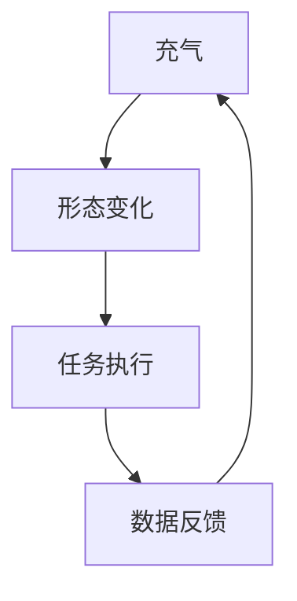
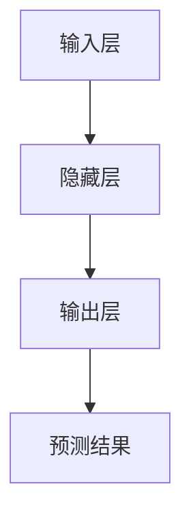
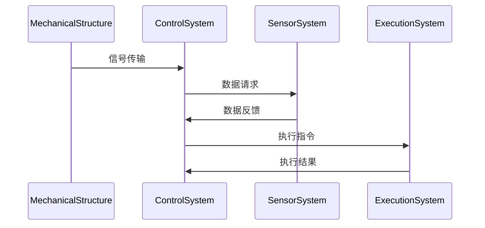
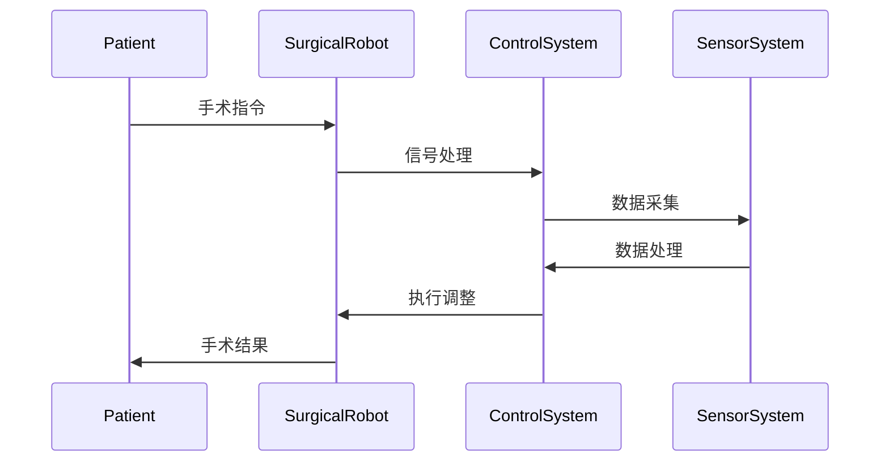

                 


## 《软体机器人技术的发展与应用》

### 关键词：软体机器人，技术发展，应用场景，算法原理

> 摘要：本文将深入探讨软体机器人技术的发展历程、核心概念、算法原理以及在实际应用中的重要性。通过逐步分析，我们将揭示软体机器人技术如何改变着我们的生活和工作方式。

---

## 第一部分：引言

### 1.1 软体机器人技术的背景与现状

软体机器人是一种新型的机器人技术，它利用柔软的材料和弹性结构来模拟生物的柔性和适应性。这一技术的发展背景可以追溯到20世纪90年代，随着材料科学和生物工程学的进步，软体机器人的概念逐渐成熟，并在21世纪初开始应用于各个领域。

### 1.1.1 软体机器人的定义

软体机器人是指使用柔软材料制作的机器人，它们可以通过形状变化来执行任务。与传统的刚体机器人不同，软体机器人具有柔韧性强、适应性好、能量效率高等特点。

### 1.1.2 软体机器人的发展历程

软体机器人的发展历程可以分为三个阶段：早期研究阶段、实验验证阶段和商业化应用阶段。每个阶段都有标志性的事件和技术突破。

### 1.1.3 软体机器人在现代科技中的重要性

软体机器人技术在医疗、农业、环保、灾害救援等领域具有广泛的应用前景。它们可以提高工作效率，减少人力成本，甚至改善人类生活质量。

---

## 第二部分：核心概念与联系

### 2.1 软体材料的特性

软体机器人的核心在于其使用的材料。这些材料通常具有高弹性、高柔韧性和高适应性。表1对比了软体材料和传统材料的一些特性。

| 特性         | 软体材料          | 传统材料         |
|------------|----------------|----------------|
| 柔韧性       | 高              | 低              |
| 适应性       | 高              | 低              |
| 压缩性       | 高              | 低              |
| 能量效率     | 高              | 低              |

### 2.2 机器人的基本构成

一个典型的软体机器人由机械结构、控制系统、传感器系统三部分组成。图1展示了这些部分的ER实体关系图。

```mermaid
erDiagram
    MechanicalStructure --|> ControlSystem : 控制信号
    MechanicalStructure --|> SensorSystem : 数据反馈
    ControlSystem --|> SensorSystem : 交互
```

### 2.3 软体机器人工作原理

软体机器人通过内部气腔的充放气来改变形状，从而实现运动和任务执行。图2展示了软体机器人的工作原理流程图。



---

## 第三部分：算法原理讲解

### 3.1 软体机器人控制算法

软体机器人的控制算法是其核心，它决定了机器人的行为。以下是两种常见的控制算法：

#### 3.1.1 传统控制算法

传统控制算法主要包括PID控制、模糊控制等。PID控制算法的公式如下：

$$
u(t) = K_p e(t) + K_i \int_{0}^{t} e(\tau) d\tau + K_d \frac{de(t)}{dt}
$$

其中，$u(t)$ 是控制信号，$e(t)$ 是误差信号，$K_p$、$K_i$、$K_d$ 分别是比例、积分、微分系数。

#### 3.1.2 智能控制算法

智能控制算法利用机器学习和人工智能技术，如神经网络、深度学习等，来实现软体机器人的智能控制。图3展示了神经网络控制算法的mermaid流程图。



---

### 3.2 软体机器人路径规划算法

路径规划是软体机器人在复杂环境中执行任务的关键技术。以下是两种常用的路径规划算法：

#### 3.2.1 人工势场法

人工势场法通过构建虚拟的势场，引导机器人避开障碍物并到达目标点。其基本公式如下：

$$
\mathbf{F}(\mathbf{r}) = -\nabla V(\mathbf{r})
$$

其中，$\mathbf{F}(\mathbf{r})$ 是力场，$V(\mathbf{r})$ 是势场函数，$\mathbf{r}$ 是机器人的位置。

#### 3.2.2 A*算法

A*算法是一种基于启发式的路径规划算法，它通过评估函数来选择最优路径。其评估函数如下：

$$
f(n) = g(n) + h(n)
$$

其中，$g(n)$ 是从起点到节点$n$ 的实际代价，$h(n)$ 是从节点$n$ 到终点的启发式估计代价。

---

## 第四部分：系统分析与架构设计方案

### 4.1 软体机器人系统介绍

一个典型的软体机器人系统包括以下几个模块：机械结构、控制系统、传感器系统和执行系统。图4展示了这些模块的mermaid类图。

```mermaid
classDiagram
    MechanicalStructure <<interface>>
    ControlSystem <<interface>>
    SensorSystem <<interface>>
    ExecutionSystem <<interface>>
    MechanicalStructure --|> ControlSystem
    MechanicalStructure --|> SensorSystem
    ControlSystem --|> SensorSystem
    ControlSystem --|> ExecutionSystem
    SensorSystem --|> ExecutionSystem
```

### 4.2 系统接口设计

系统接口设计是确保各模块之间有效通信的关键。图5展示了系统接口的mermaid序列图。



### 4.3 系统交互

系统交互是指各模块之间如何协同工作来完成特定任务。图6展示了系统交互的mermaid序列图。



---

## 第五部分：项目实战

### 5.1 环境安装与配置

在开始项目之前，需要安装必要的软件和硬件环境。以下是安装步骤：

1. 安装Python环境。
2. 安装ROS（Robot Operating System）。
3. 安装软体机器人相关库。

### 5.2 系统核心实现

系统核心实现包括机械结构设计、控制系统设计和传感器系统集成。以下是核心实现的Python代码示例：

```python
# 机械结构设计
class MechanicalStructure:
    def __init__(self):
        self.material = "硅胶"
        self.shape = "球形"

    def change_shape(self, new_shape):
        self.shape = new_shape

# 控制系统设计
class ControlSystem:
    def __init__(self):
        self.pid = PIDController()

    def control(self, sensor_data):
        return self.pid.control(sensor_data)

# 传感器系统集成
class SensorSystem:
    def __init__(self):
        self.sensors = ["温度传感器", "压力传感器"]

    def collect_data(self):
        return {"temperature": 25, "pressure": 100}
```

### 5.3 代码应用解读与分析

代码应用解读与分析主要包括对机械结构设计、控制系统设计和传感器系统集成部分的具体实现进行解读，以及分析各部分如何协同工作来完成特定任务。

### 5.4 实际案例分析与详细讲解

以下是一个软体机器人用于医疗手术的案例：

1. **案例背景**：软体机器人在微创手术中的应用。
2. **案例实现**：使用软体机器人进行精准手术操作。
3. **案例分析**：分析软体机器人在手术中的应用效果和优势。
4. **案例讲解**：详细讲解软体机器人在手术中的具体应用流程。

### 5.5 项目小结

项目小结部分对整个项目进行总结，包括取得的成果、存在的问题以及未来的改进方向。

---

## 第六部分：最佳实践 tips

1. **选择合适的软体材料**：根据应用场景选择具有合适弹性、柔韧性和耐久性的材料。
2. **优化控制算法**：根据实际应用需求优化控制算法，提高机器人响应速度和精度。
3. **加强传感器集成**：提高传感器灵敏度，确保机器人能够准确获取环境信息。

## 第七部分：小结

本文从软体机器人技术的背景、核心概念、算法原理、系统设计到项目实战进行了详细探讨。通过这些步骤，读者可以深入了解软体机器人技术的发展与应用。

## 第八部分：注意事项

1. **安全第一**：在进行软体机器人实验时，务必注意安全操作，避免造成伤害。
2. **持续学习**：软体机器人技术发展迅速，需要持续关注最新研究进展，不断更新知识。

## 第九部分：拓展阅读

1. 《软体机器人：理论与实践》
2. 《机器人控制算法：从传统到智能》
3. 《ROS机器人编程》

---

**作者：AI天才研究院/AI Genius Institute & 禅与计算机程序设计艺术 /Zen And The Art of Computer Programming**

