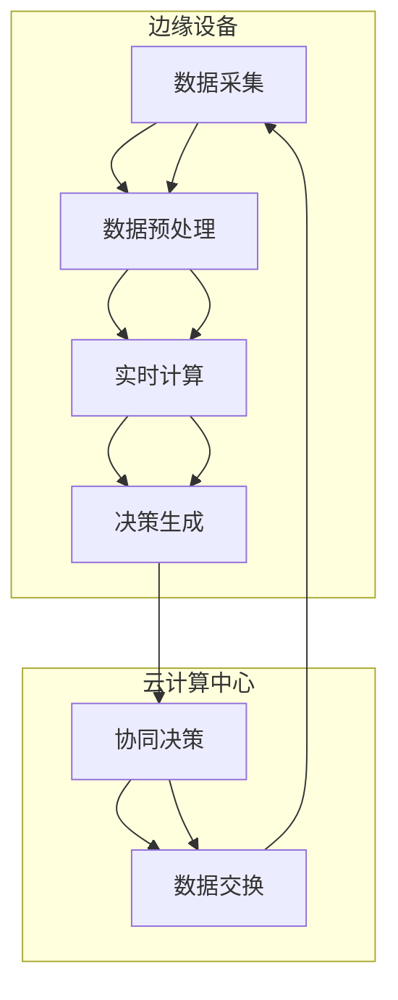
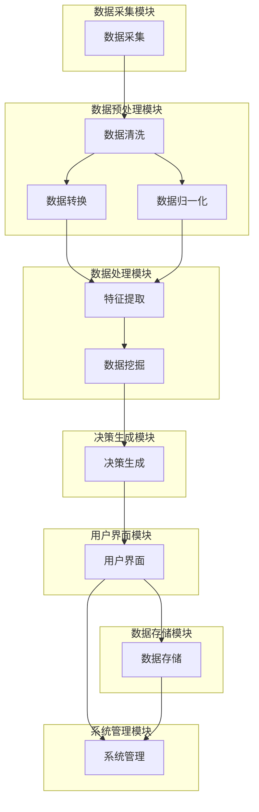

                 

# 边缘AI在实时决策系统中的应用

## 关键词
边缘AI，实时决策系统，数据处理，性能优化，未来趋势

## 摘要
本文深入探讨了边缘AI在实时决策系统中的应用。首先，我们介绍了边缘AI的基本概念和实时决策系统的需求背景。随后，通过具体案例分析，详细阐述了边缘AI在实时监测、数据预处理、数据分析以及实时决策支持等方面的应用。文章还讨论了边缘AI实时决策系统的性能优化策略，并展望了其未来发展趋势。

## 目录

### 第一部分：边缘AI概述

#### 第1章 边缘AI基本概念
- 1.1 边缘AI的起源与发展
- 1.2 边缘AI与传统云计算的对比
- 1.3 边缘AI的核心技术和应用场景

#### 第2章 实时决策系统基础
- 2.1 实时决策系统的概念与需求
- 2.2 实时决策系统的主要挑战
- 2.3 实时决策系统的基本架构

### 第二部分：边缘AI在实时决策系统中的应用

#### 第3章 边缘AI在实时监测中的应用
- 3.1 边缘AI在环境监测中的应用
- 3.2 边缘AI在设备故障预测中的应用
- 3.3 边缘AI在交通监控中的应用

#### 第4章 边缘AI在实时数据预处理中的应用
- 4.1 数据采集与压缩
- 4.2 数据清洗与去噪
- 4.3 数据特征提取

#### 第5章 边缘AI在实时数据分析中的应用
- 5.1 实时数据流处理技术
- 5.2 基于边缘AI的实时数据分析算法
- 5.3 实时数据可视化

#### 第6章 边缘AI在实时决策支持中的应用
- 6.1 实时决策支持系统的构建
- 6.2 基于边缘AI的实时决策算法
- 6.3 实时决策案例分析

#### 第7章 边缘AI实时决策系统的性能优化
- 7.1 系统性能优化策略
- 7.2 边缘计算资源的合理分配
- 7.3 实时决策系统的可靠性提升

#### 第8章 边缘AI实时决策系统的未来发展趋势
- 8.1 边缘AI技术的创新方向
- 8.2 实时决策系统的未来应用场景
- 8.3 边缘AI实时决策系统的挑战与机遇

## 第1章 边缘AI基本概念

### 1.1 边缘AI的起源与发展

边缘AI（Edge AI）是一种将计算、存储和网络功能分散到网络边缘的技术。其起源可以追溯到云计算和物联网（IoT）的快速发展。随着物联网设备的数量不断增加，数据的产生和传输量也急剧上升。传统的云计算中心无法满足实时处理大量数据的需求，这就促使了边缘AI的诞生。

边缘AI的发展可以分为三个阶段：

1. **早期阶段**：主要是将计算任务分散到边缘设备上，如智能手机、路由器等。这一阶段主要集中在处理本地数据和提供简单的本地服务。

2. **发展阶段**：随着5G、物联网和边缘计算技术的发展，边缘AI开始具备更强的计算能力，可以处理复杂的任务，如图像识别、语音识别等。

3. **成熟阶段**：当前，边缘AI正逐步走向成熟，不仅能够处理复杂的计算任务，还可以实现与云计算的协同工作，提供更加高效、可靠的实时决策支持。

### 1.2 边缘AI与传统云计算的对比

传统云计算主要依赖数据中心和云服务器，将数据集中处理。而边缘AI则通过在设备本地进行计算，减少数据传输的延迟和带宽消耗。

| 特点 | 边缘AI | 传统云计算 |
| ---- | ---- | ---- |
| 计算位置 | 本地设备 | 数据中心 |
| 延迟 | 低 | 较高 |
| 网络带宽 | 节省 | 消耗较大 |
| 安全性 | 较高 | 较低 |
| 依赖性 | 较低 | 较高 |

### 1.3 边缘AI的核心技术和应用场景

边缘AI的核心技术包括边缘计算、物联网、5G通信和智能传感器等。这些技术使得边缘AI能够在各种应用场景中发挥作用。

#### 边缘计算

边缘计算是指在靠近数据源或用户的地方进行计算。通过边缘计算，可以显著降低数据传输延迟，提高系统响应速度。

#### 物联网

物联网技术使得大量的传感器和设备能够相互连接，实时采集数据。边缘AI通过分析这些数据，可以实现对设备的实时监控和管理。

#### 5G通信

5G通信技术提供了更高的网络速度和更低的延迟，为边缘AI的实时数据处理提供了基础。

#### 智能传感器

智能传感器能够感知环境变化，并将信息转化为数字信号。边缘AI通过对这些信号的实时分析，可以实现对环境的智能监控和预测。

### 1.4 边缘AI的应用场景

边缘AI的应用场景非常广泛，以下列举了一些典型的应用场景：

1. **智能制造**：通过边缘AI实现生产设备的智能监控和预测性维护，提高生产效率和降低成本。
2. **智能交通**：通过边缘AI实现交通流量监测、路况预测和智能导航，提高交通效率和安全性。
3. **智能医疗**：通过边缘AI实现实时医疗监控和诊断，提高医疗服务的质量和效率。
4. **智慧城市**：通过边缘AI实现城市环境的实时监测和管理，提高城市管理水平和居民生活质量。

## 第2章 实时决策系统基础

### 2.1 实时决策系统的概念与需求

实时决策系统（Real-Time Decision System）是一种能够在短时间内处理大量数据并做出快速决策的系统。其核心需求包括：

1. **实时性**：系统必须在规定的时间内完成数据的处理和决策。
2. **准确性**：系统必须能够准确地分析数据并做出合理的决策。
3. **可靠性**：系统必须能够在各种环境下稳定运行，确保决策的可靠性。

实时决策系统的应用领域包括但不限于金融、交通、医疗、工业制造等。在这些领域中，实时决策系统可以大大提高业务效率，降低运营成本，提升用户体验。

### 2.2 实时决策系统的主要挑战

实时决策系统面临的主要挑战包括：

1. **数据量巨大**：随着物联网和大数据技术的发展，实时决策系统需要处理的数据量越来越大。
2. **计算速度要求高**：实时决策系统必须在极短的时间内完成数据的处理和决策，这对计算速度提出了很高的要求。
3. **数据多样性**：实时决策系统需要处理的数据类型多种多样，包括结构化数据、非结构化数据和实时流数据等。
4. **系统复杂性**：实时决策系统通常包含多个模块和组件，系统架构复杂，需要高效的管理和协调。

### 2.3 实时决策系统的基本架构

实时决策系统的基本架构通常包括以下几个关键组件：

1. **数据采集模块**：负责从各种数据源（如传感器、数据库、API等）采集数据。
2. **数据预处理模块**：负责对采集到的数据进行清洗、转换和归一化等预处理操作。
3. **数据存储模块**：负责存储处理后的数据，以便后续的查询和分析。
4. **数据处理模块**：负责对存储的数据进行实时分析和处理，生成决策支持信息。
5. **决策引擎模块**：负责根据处理结果生成决策，并输出决策结果。
6. **用户界面模块**：负责与用户交互，展示决策结果和提供操作界面。

## 第3章 边缘AI在实时监测中的应用

### 3.1 边缘AI在环境监测中的应用

环境监测是边缘AI的一个重要应用领域。通过边缘AI技术，可以实现对环境的实时监测和预测，从而提高环境管理的效率和准确性。

#### 应用案例

- **空气质量监测**：在城市环境中，通过部署边缘AI设备，可以实时监测空气质量，并根据监测数据预测空气污染的趋势，从而采取相应的措施。

- **水资源监测**：在水资源管理中，边缘AI可以通过监测水质参数，如PH值、溶解氧等，实现对水资源的实时监控和预警。

#### 技术实现

- **传感器数据采集**：使用传感器实时采集环境数据，如温度、湿度、气体浓度等。

- **边缘计算处理**：将采集到的数据通过边缘计算设备进行实时处理和分析，提取关键特征。

- **决策支持**：基于分析结果，边缘AI可以实时生成决策支持信息，如污染预警、水资源调配策略等。

### 3.2 边缘AI在设备故障预测中的应用

设备故障预测是边缘AI在工业制造等领域的重要应用。通过边缘AI技术，可以实现对设备的实时监测和故障预测，从而提高设备的可靠性和生产效率。

#### 应用案例

- **工业设备监测**：在工业制造过程中，边缘AI可以实时监测设备的运行状态，预测可能出现的故障，提前进行维护和更换。

- **医疗器械监测**：在医疗设备管理中，边缘AI可以监测设备的运行状态，预测可能出现的问题，确保医疗设备的正常运行。

#### 技术实现

- **数据采集**：通过传感器采集设备运行数据，如温度、压力、振动等。

- **边缘计算处理**：将采集到的数据通过边缘计算设备进行实时处理和分析，识别设备故障的早期信号。

- **故障预测**：基于分析结果，边缘AI可以实时预测设备的故障风险，并提供维护建议。

### 3.3 边缘AI在交通监控中的应用

交通监控是边缘AI在智能交通系统中的重要应用。通过边缘AI技术，可以实现对交通状况的实时监控和智能分析，从而优化交通流量，提高交通效率。

#### 应用案例

- **交通流量监测**：通过部署边缘AI设备，可以实时监测道路上的车辆流量和速度，识别拥堵情况，提供实时交通信息。

- **事故预警**：通过边缘AI分析道路监控数据，可以实时识别事故隐患，提前预警，减少交通事故的发生。

#### 技术实现

- **数据采集**：使用摄像头、雷达等传感器采集道路上的车辆和行人数据。

- **边缘计算处理**：将采集到的数据通过边缘计算设备进行实时处理和分析，提取交通流量和事故预警等关键信息。

- **决策支持**：基于分析结果，边缘AI可以实时生成交通优化建议，如调整信号灯时长、建议车辆绕行等。

## 第4章 边缘AI在实时数据预处理中的应用

### 4.1 数据采集与压缩

边缘AI在实时数据预处理中的第一步是数据采集与压缩。采集到的数据通常包括传感器数据、网络流数据等，这些数据量通常非常大，因此需要进行压缩以减少存储和传输的开销。

#### 技术实现

- **数据压缩算法**：可以使用各种数据压缩算法，如Huffman编码、LZ77、LZ78等，对采集到的数据进行压缩。

- **边缘计算处理**：在边缘设备上运行数据压缩算法，对采集到的数据进行实时压缩处理。

#### 应用案例

- **工业物联网**：在工业物联网中，边缘AI可以实时压缩传感器采集的生产线数据，减少数据传输的带宽需求。

- **智能交通**：在智能交通系统中，边缘AI可以实时压缩摄像头和雷达采集的交通数据，减少数据传输的延迟。

### 4.2 数据清洗与去噪

数据清洗与去噪是实时数据预处理中至关重要的一步。由于传感器和采集设备的限制，采集到的数据往往存在噪声和异常值，这些数据会对后续的实时分析产生干扰。

#### 技术实现

- **噪声过滤**：可以使用滤波算法，如均值滤波、中值滤波等，去除数据中的噪声。

- **异常值检测**：可以使用统计方法，如IQR（四分位数间距）方法、Z-score方法等，检测和去除数据中的异常值。

#### 应用案例

- **环境监测**：在环境监测中，边缘AI可以实时清洗传感器采集的空气污染数据，去除噪声和异常值，确保数据的准确性。

- **智能医疗**：在智能医疗中，边缘AI可以实时清洗医疗设备采集的生命体征数据，去除噪声和异常值，提高诊断的准确性。

### 4.3 数据特征提取

数据特征提取是将原始数据转换为对分析任务有用的特征的过程。在实时数据预处理中，数据特征提取非常重要，因为它能够提高后续分析算法的性能。

#### 技术实现

- **特征选择**：通过分析原始数据，选择对分析任务最有用的特征。

- **特征转换**：将原始数据转换为适合分析算法的特征表示。

#### 应用案例

- **智能监控**：在智能监控系统中，边缘AI可以实时提取摄像头视频数据中的运动特征，用于目标检测和跟踪。

- **智能交通**：在智能交通系统中，边缘AI可以实时提取交通数据中的流量特征，用于交通流量预测和优化。

## 第5章 边缘AI在实时数据分析中的应用

### 5.1 实时数据流处理技术

实时数据流处理是边缘AI在实时数据分析中的重要技术。它能够处理大量实时数据，并快速生成分析结果。

#### 技术实现

- **流处理框架**：如Apache Flink、Apache Storm等，用于处理实时数据流。

- **实时计算引擎**：在边缘设备上运行实时计算引擎，如TensorFlow Lite、PyTorch Mobile等，进行实时数据分析和处理。

#### 应用案例

- **工业物联网**：在工业物联网中，边缘AI可以实时分析传感器采集的生产线数据，检测设备故障，提高生产效率。

- **智能交通**：在智能交通系统中，边缘AI可以实时分析交通数据，预测交通流量，优化交通信号。

### 5.2 基于边缘AI的实时数据分析算法

基于边缘AI的实时数据分析算法是边缘AI在实时数据分析中的核心。这些算法能够在边缘设备上高效地处理和分析实时数据。

#### 技术实现

- **机器学习算法**：如KNN、SVM、决策树等，用于实时分类、预测和聚类等任务。

- **深度学习算法**：如卷积神经网络（CNN）、循环神经网络（RNN）等，用于实时图像识别、语音识别等复杂任务。

#### 应用案例

- **智能医疗**：在智能医疗中，边缘AI可以实时分析患者生命体征数据，预测病情变化，提供实时诊断。

- **智能监控**：在智能监控系统中，边缘AI可以实时分析摄像头视频数据，识别异常行为，提供实时预警。

### 5.3 实时数据可视化

实时数据可视化是将实时数据分析结果以可视化的形式展示给用户，使其能够直观地了解和分析数据。

#### 技术实现

- **可视化工具**：如D3.js、Plotly等，用于生成实时数据可视化图表。

- **边缘计算处理**：在边缘设备上运行实时数据可视化工具，生成实时可视化图表。

#### 应用案例

- **智能交通**：在智能交通系统中，边缘AI可以实时生成交通流量可视化图表，帮助交通管理者了解交通状况，优化交通信号。

- **环境监测**：在环境监测中，边缘AI可以实时生成空气质量可视化图表，帮助环境保护者了解空气质量状况，采取相应措施。

## 第6章 边缘AI在实时决策支持中的应用

### 6.1 实时决策支持系统的构建

实时决策支持系统（Real-Time Decision Support System）是边缘AI在实时决策支持中的应用。它能够实时收集、分析和处理数据，为用户提供实时决策支持。

#### 技术实现

- **数据采集**：实时收集来自传感器、数据库和其他数据源的数据。

- **数据处理**：使用边缘AI技术对收集到的数据进行分析和处理。

- **决策支持**：根据处理结果生成决策支持信息，为用户提供实时指导。

#### 应用案例

- **智能交通**：在智能交通系统中，实时决策支持系统可以实时分析交通数据，为交通管理者提供交通流量预测、信号优化等决策支持。

- **智能医疗**：在智能医疗中，实时决策支持系统可以实时分析患者数据，为医生提供病情诊断、治疗方案等决策支持。

### 6.2 基于边缘AI的实时决策算法

基于边缘AI的实时决策算法是边缘AI在实时决策支持中的核心。这些算法能够在边缘设备上高效地处理和分析数据，生成实时决策。

#### 技术实现

- **机器学习算法**：如KNN、SVM、决策树等，用于实时分类、预测和聚类等任务。

- **深度学习算法**：如卷积神经网络（CNN）、循环神经网络（RNN）等，用于实时图像识别、语音识别等复杂任务。

#### 应用案例

- **智能制造**：在智能制造中，基于边缘AI的实时决策算法可以实时分析生产线数据，预测设备故障，提供实时维护建议。

- **智能医疗**：在智能医疗中，基于边缘AI的实时决策算法可以实时分析患者数据，预测病情变化，提供实时诊断和治疗建议。

### 6.3 实时决策案例分析

#### 案例一：智能交通信号优化

在某城市的智能交通系统中，边缘AI被用于优化交通信号灯。通过实时分析交通流量数据，边缘AI可以实时调整信号灯的时长，从而减少交通拥堵，提高交通效率。

#### 案例二：智能医疗诊断

在某医院的智能医疗系统中，边缘AI被用于实时诊断。通过实时分析患者的生命体征数据，边缘AI可以实时预测病情变化，为医生提供诊断和治疗建议。

## 第7章 边缘AI实时决策系统的性能优化

### 7.1 系统性能优化策略

边缘AI实时决策系统的性能优化是提高系统效率、降低延迟、提升用户体验的关键。以下是一些常见的系统性能优化策略：

#### 技术实现

- **数据预处理优化**：通过优化数据采集、清洗和特征提取等预处理过程，减少数据处理的延迟。

- **计算资源分配**：合理分配边缘设备的计算资源，确保关键任务得到足够的计算能力。

- **网络优化**：优化边缘设备与云服务之间的网络连接，减少数据传输的延迟。

#### 应用案例

- **智能制造**：在智能制造中，通过优化数据预处理和网络连接，可以减少设备故障预测的延迟，提高生产效率。

- **智能交通**：在智能交通系统中，通过优化计算资源分配和网络连接，可以实时调整交通信号灯的时长，减少交通拥堵。

### 7.2 边缘计算资源的合理分配

边缘计算资源的合理分配是确保边缘AI实时决策系统高效运行的关键。以下是一些常见的资源分配策略：

#### 技术实现

- **任务调度**：根据任务的优先级和资源需求，动态调度边缘设备的任务。

- **资源预留**：为关键任务预留足够的计算资源，确保任务的连续性和稳定性。

- **负载均衡**：通过负载均衡技术，合理分配计算任务，避免单个边缘设备过载。

#### 应用案例

- **工业物联网**：在工业物联网中，通过合理分配计算资源，可以确保生产设备故障预测的准确性和实时性。

- **智能医疗**：在智能医疗中，通过合理分配计算资源，可以实时处理和分析患者数据，提高诊断的准确性和效率。

### 7.3 实时决策系统的可靠性提升

边缘AI实时决策系统的可靠性是系统稳定运行的关键。以下是一些常见的可靠性提升策略：

#### 技术实现

- **容错机制**：通过冗余设计、故障检测和恢复等容错机制，提高系统的可靠性。

- **数据备份**：实时备份关键数据，确保数据的完整性和一致性。

- **监控系统**：建立实时监控系统，及时发现和解决系统故障。

#### 应用案例

- **智能交通**：在智能交通系统中，通过建立实时监控系统，可以及时发现交通信号灯故障，确保交通信号的正常运行。

- **智能医疗**：在智能医疗系统中，通过建立容错机制和数据备份，可以确保患者数据的完整性和一致性，提高诊断的可靠性。

## 第8章 边缘AI实时决策系统的未来发展趋势

### 8.1 边缘AI技术的创新方向

边缘AI技术的创新方向包括以下几个方面：

#### 技术实现

- **新型计算架构**：如基于量子计算、类脑计算的新型计算架构，提高边缘设备的计算能力。

- **低功耗设计**：通过优化硬件设计和算法，降低边缘设备的功耗，延长设备的使用寿命。

- **网络协同**：通过优化边缘设备与云计算中心之间的网络协同，提高系统的整体性能和可靠性。

#### 应用案例

- **智能能源管理**：在智能能源管理中，新型边缘AI技术可以实时监控和优化能源使用，提高能源利用效率。

- **智能农业**：在智能农业中，新型边缘AI技术可以实时监测作物生长状态，优化灌溉和施肥策略。

### 8.2 实时决策系统的未来应用场景

实时决策系统的未来应用场景将更加广泛，包括以下几个方面：

#### 应用场景

- **智慧城市**：在智慧城市中，实时决策系统可以用于交通管理、环境监测、公共安全等领域。

- **智能医疗**：在智能医疗中，实时决策系统可以用于疾病预测、诊断和治疗方案优化。

- **智能制造**：在智能制造中，实时决策系统可以用于设备故障预测、生产优化和质量管理。

#### 应用案例

- **智慧交通**：在智慧交通中，实时决策系统可以实时优化交通信号灯，提高交通效率。

- **智能医疗**：在智能医疗中，实时决策系统可以实时监测患者病情，提供个性化的诊断和治疗建议。

### 8.3 边缘AI实时决策系统的挑战与机遇

边缘AI实时决策系统的发展面临着一系列挑战和机遇：

#### 挑战

- **计算能力限制**：边缘设备的计算能力有限，难以处理复杂的数据分析和决策任务。

- **数据隐私和安全**：边缘设备处理的数据涉及用户隐私和安全，需要确保数据的保密性和安全性。

- **网络连接可靠性**：边缘设备与云计算中心的网络连接可能不稳定，影响系统的实时性和可靠性。

#### 机遇

- **5G技术**：5G技术的快速发展为边缘AI实时决策系统提供了更高的网络速度和更低的延迟。

- **云计算与边缘计算融合**：云计算与边缘计算的融合为边缘AI实时决策系统提供了更强的计算能力和更好的协同性。

- **人工智能技术的进步**：人工智能技术的进步为边缘AI实时决策系统提供了更高效的算法和更准确的预测能力。

#### 应用案例

- **智能交通**：在智能交通中，5G技术和人工智能技术的进步为实时优化交通信号灯和交通流量提供了技术支持。

- **智能医疗**：在智能医疗中，云计算与边缘计算的融合为实时监测患者病情和提供个性化治疗建议提供了技术保障。

### 结语

边缘AI实时决策系统作为一种新兴技术，正在不断发展和完善。通过本文的探讨，我们了解了边缘AI的基本概念、实时决策系统的需求背景、边缘AI在实时监测、数据预处理、数据分析以及实时决策支持中的应用，以及系统性能优化和未来发展趋势。随着技术的进步和应用的深入，边缘AI实时决策系统将在各个领域发挥更大的作用，为人类社会带来更多便利和创新。让我们拭目以待！### 第1章 边缘AI基本概念

#### 1.1 边缘AI的起源与发展

边缘AI（Edge AI）的概念起源于物联网（IoT）和云计算的快速发展。在物联网时代，大量的传感器和数据采集设备被部署在各种场景中，这些设备产生的数据量巨大且多样化。然而，传统的云计算中心由于其地理位置的集中性，在处理这些数据时存在延迟高、带宽消耗大等问题。为了解决这些问题，边缘AI技术应运而生。

边缘AI的发展大致可以分为三个阶段：

1. **早期阶段**：这个阶段主要是将计算任务从云端下放至边缘设备，如智能手机、路由器、工业物联网设备等。这些边缘设备能够处理一些简单的任务，如本地数据存储、基础数据处理等。

2. **发展阶段**：随着5G、物联网和边缘计算技术的不断成熟，边缘AI的计算能力得到了显著提升。边缘设备不仅能够处理更加复杂的任务，如图像识别、语音识别等，还能够与云计算中心进行高效的数据交换和任务协作。

3. **成熟阶段**：当前，边缘AI技术已经逐渐走向成熟。它不仅能够在边缘设备上实现高效的数据处理和智能分析，还能够与云计算中心协同工作，形成一个统一的计算网络。这种协同工作模式使得边缘AI能够提供更加高效、可靠的实时决策支持。

#### 1.2 边缘AI与传统云计算的对比

边缘AI与传统云计算在多个方面存在显著差异：

| 特点 | 边缘AI | 传统云计算 |
| ---- | ---- | ---- |
| **计算位置** | 分布在边缘设备上，如传感器、智能设备等 | 主要集中在数据中心和云服务器上 |
| **延迟** | 低 | 高 |
| **带宽消耗** | 节省 | 大 |
| **计算能力** | 较弱（但逐步提升） | 强 |
| **数据安全性** | 较高（本地处理） | 较低（数据传输过程中存在风险） |
| **依赖性** | 较低（独立性强） | 较高（依赖云计算中心） |

尽管边缘AI在某些方面具有优势，但它也面临一些挑战，如计算资源有限、数据隐私和安全等。然而，随着技术的不断进步，这些挑战正在逐步得到解决。

#### 1.3 边缘AI的核心技术和应用场景

边缘AI的核心技术包括边缘计算、物联网、5G通信和智能传感器等。以下是对这些技术的详细介绍：

##### 边缘计算

边缘计算（Edge Computing）是指将计算任务从云端下放到靠近数据源的边缘设备上。这种计算模式能够显著降低数据传输延迟，提高系统的响应速度。边缘计算的核心技术包括：

- **分布式计算**：通过在多个边缘设备之间分布式地处理任务，提高系统的计算能力。
- **实时数据处理**：在边缘设备上实时处理和分析数据，使得系统能够快速做出响应。
- **协同计算**：边缘设备与云端协同工作，共享计算资源和数据，实现更高效的处理。

##### 物联网

物联网（IoT）是边缘AI的重要组成部分。物联网技术使得大量的设备能够相互连接，实时采集和传输数据。边缘AI通过分析这些数据，能够实现对设备的实时监控和智能管理。物联网的关键技术包括：

- **传感器网络**：通过部署各种传感器，实时采集环境、设备状态等数据。
- **数据通信**：使用无线通信技术（如Wi-Fi、蓝牙、NFC等）传输数据。
- **数据处理**：在边缘设备上对采集到的数据进行分析和处理。

##### 5G通信

5G通信技术为边缘AI提供了高速、低延迟的网络环境。5G网络具有高带宽、低延迟、高可靠性等特点，能够满足边缘AI对数据传输的严格要求。5G通信技术主要包括：

- **高速传输**：5G网络的传输速度比4G快数十倍，能够支持大规模数据传输。
- **低延迟**：5G网络的延迟极低，能够满足实时决策和交互的需求。
- **网络切片**：5G网络能够根据不同应用的需求，灵活地分配网络资源。

##### 智能传感器

智能传感器是边缘AI的重要组成部分，它们能够感知环境变化，并将信息转化为数字信号。边缘AI通过对这些信号的实时分析，可以实现对环境的智能监控和预测。智能传感器的主要技术包括：

- **传感器芯片**：使用高性能传感器芯片，提高传感器的灵敏度和精度。
- **数据处理**：在传感器端进行初步的数据处理，减少传输的数据量。
- **边缘计算**：在传感器设备上嵌入边缘计算单元，实现实时数据分析和处理。

#### 1.4 边缘AI的应用场景

边缘AI的应用场景非常广泛，涵盖了工业、交通、医疗、家居等多个领域。以下是一些典型的应用场景：

- **工业制造**：在工业制造中，边缘AI可以实时监控设备的运行状态，预测故障，优化生产流程。
- **智能交通**：在智能交通中，边缘AI可以实时监测交通流量，优化信号灯控制，提高交通效率。
- **智能医疗**：在智能医疗中，边缘AI可以实时监测患者的生命体征，提供诊断和治疗方案。
- **智慧城市**：在智慧城市中，边缘AI可以实时监测环境质量、公共安全等，提高城市管理效率。
- **智能家居**：在智能家居中，边缘AI可以实时监控家居环境，提供智能化的家居体验。

通过以上介绍，我们可以看到边缘AI在实时决策系统中的重要作用。它不仅能够提供高效的数据处理和智能分析，还能够与云计算中心协同工作，形成一个统一、高效的计算网络。随着技术的不断进步，边缘AI在实时决策系统中的应用将越来越广泛，为各个领域带来更多的创新和便利。

#### 1.5 边缘AI的核心概念原理

边缘AI的核心概念可以概括为边缘计算、数据本地处理和智能决策。以下是这些核心概念及其属性的详细说明：

##### 边缘计算

边缘计算是指将计算任务从云端下放到网络边缘（如传感器、路由器、网关等）的设备上进行处理。其核心属性如下：

- **分布式计算**：边缘计算通过在多个边缘设备之间分布式地处理任务，提高了系统的计算能力和容错性。
- **实时处理**：由于数据无需传输到云端，边缘计算能够实现实时数据处理，降低延迟，提高响应速度。
- **资源高效利用**：边缘计算充分利用边缘设备的计算资源，避免了云端大量资源的浪费。

##### 数据本地处理

数据本地处理是指将数据在边缘设备上进行预处理、分析和处理，减少数据传输的带宽需求。其核心属性如下：

- **数据隐私**：数据本地处理减少了数据在传输过程中被窃取的风险，提高了数据安全性。
- **降低延迟**：数据本地处理避免了数据在云端和边缘设备之间传输的延迟，使得系统更加实时。
- **减少带宽消耗**：数据本地处理能够减少数据传输的带宽需求，降低网络拥堵。

##### 智能决策

智能决策是指利用边缘AI技术，对边缘设备收集到的数据进行智能分析和处理，生成决策支持信息。其核心属性如下：

- **实时决策**：智能决策能够在短时间内对数据进行分析和处理，生成实时决策支持信息。
- **个性化**：智能决策可以根据用户的实时需求，提供个性化的决策支持。
- **高效性**：智能决策能够提高系统的运行效率，优化资源使用，降低运营成本。

##### 概念属性对比表格

| 概念 | 边缘计算 | 数据本地处理 | 智能决策 |
| ---- | ---- | ---- | ---- |
| **核心属性** | 分布式计算、实时处理、资源高效利用 | 数据隐私、降低延迟、减少带宽消耗 | 实时决策、个性化、高效性 |
| **应用场景** | 工业制造、智能交通、智慧城市 | 工业制造、智能医疗、智能家居 | 智能医疗、智能交通、工业制造 |
| **优势** | 降低延迟、提高响应速度、减少带宽消耗 | 提高数据安全性、减少数据传输风险、提高系统实时性 | 提供个性化决策支持、优化资源使用、降低运营成本 |

##### ER实体关系图架构

为了更好地理解边缘AI的核心概念及其关系，我们可以使用ER实体关系图进行表示。以下是边缘AI的ER实体关系图：

```mermaid
erDiagram
    EDGE_DEVICE ||--|{ DATA}: 数据收集
    DATA <<--|{ ANALYSIS}: 数据分析
    ANALYSIS ||--|{ DECISION}: 决策生成
    EDGE_DEVICE ..|{ COMPUTE}: 计算能力
```

在这个ER实体关系图中：

- **EDGE_DEVICE**：表示边缘设备，负责数据的收集和初步处理。
- **DATA**：表示收集到的数据，与数据分析实体关联。
- **ANALYSIS**：表示数据分析过程，对数据进行分析和处理。
- **DECISION**：表示决策生成过程，根据分析结果生成决策。
- **COMPUTE**：表示边缘设备的计算能力，与边缘设备实体关联。

通过ER实体关系图，我们可以清晰地看到边缘AI中各个实体之间的关联和交互关系，有助于理解边缘AI的整体架构和工作流程。

#### 1.6 边缘AI的基本原理与工作流程

边缘AI的基本原理是利用边缘计算设备（如传感器、网关、路由器等）对数据进行实时采集、预处理和分析，从而实现高效的决策支持。以下是边缘AI的基本原理和工作流程：

##### 基本原理

边缘AI的基本原理可以概括为以下几个方面：

1. **数据本地处理**：边缘设备（如传感器）在本地收集数据，并在边缘设备上进行预处理，如数据清洗、去噪、特征提取等，减少了数据传输的带宽需求和延迟。

2. **实时计算**：通过边缘计算设备对本地处理后的数据进行实时计算，如机器学习推理、深度学习模型预测等，从而生成实时决策支持信息。

3. **智能决策**：基于实时计算结果，边缘设备可以做出实时决策，如调整信号灯时长、优化交通流量、监测设备故障等。

4. **协同工作**：边缘设备与云计算中心协同工作，共享计算资源和数据，实现更高效的处理和协同决策。

##### 工作流程

边缘AI的工作流程可以分为以下几个步骤：

1. **数据采集**：边缘设备（如传感器、摄像头等）实时采集数据，如环境数据、设备状态数据、交通流量数据等。

2. **数据预处理**：在边缘设备上对采集到的数据进行分析和预处理，如数据清洗、去噪、特征提取等，将数据转化为适合分析的形式。

3. **实时计算**：利用边缘设备上的计算能力（如CPU、GPU、FPGA等），对预处理后的数据进行实时计算，如机器学习推理、深度学习模型预测等。

4. **决策生成**：根据实时计算结果，边缘设备生成实时决策支持信息，如调整信号灯时长、优化交通流量、监测设备故障等。

5. **协同决策**：边缘设备与云计算中心进行数据交换和协同决策，共享计算资源和数据，实现更高效的处理和协同决策。

##### 边缘AI的工作流程图

以下是边缘AI的工作流程图，展示了边缘设备、云计算中心和数据流之间的交互关系：



在这个工作流程图中：

- **数据采集**：边缘设备实时采集数据。
- **数据预处理**：边缘设备对采集到的数据进行预处理。
- **实时计算**：边缘设备利用计算能力对预处理后的数据进行实时计算。
- **决策生成**：边缘设备根据实时计算结果生成决策支持信息。
- **协同决策**：边缘设备与云计算中心进行数据交换和协同决策。

通过边缘AI的基本原理和工作流程，我们可以看到，边缘AI通过在边缘设备上实现数据本地处理和实时计算，能够显著降低数据传输的延迟和带宽需求，提高系统的实时性和响应速度。同时，边缘AI的协同工作模式使得边缘设备与云计算中心能够实现高效的数据交换和协同决策，为实时决策系统提供了强大的技术支持。

### 第2章 实时决策系统基础

#### 2.1 实时决策系统的概念与需求

实时决策系统是一种能够在极短时间内对大量数据进行处理和分析，并迅速做出有效决策的自动化系统。这种系统广泛应用于金融、交通、医疗、工业制造等领域，其核心需求包括以下几个方面：

1. **实时性**：实时决策系统必须在非常短的时间内（通常是毫秒级或秒级）完成数据的采集、处理和分析，并生成决策结果。这种高速的处理能力是实时决策系统的核心要求。

2. **准确性**：实时决策系统需要具备高度的数据分析和决策准确性，能够根据实时数据做出合理的决策。这意味着系统必须具备先进的数据处理算法和强大的分析能力。

3. **可靠性**：实时决策系统必须在各种复杂的环境下稳定运行，确保决策结果的可靠性和一致性。系统的可靠性是其在实际应用中能否长期运行的关键。

4. **可扩展性**：实时决策系统需要能够适应数据量的快速增长和业务需求的不断变化，具有良好的可扩展性和灵活性。

5. **灵活性**：系统需要能够根据不同的应用场景和需求，灵活调整数据处理和分析策略，实现定制化的决策支持。

#### 2.2 实时决策系统的主要挑战

实时决策系统在实际应用中面临着诸多挑战，以下是其中几个主要的挑战：

1. **数据量大**：随着物联网和大数据技术的发展，实时决策系统需要处理的数据量越来越大。这给系统的实时性和计算能力提出了更高的要求。

2. **处理速度要求高**：实时决策系统必须在极短的时间内处理和分析大量数据，并生成决策结果。这要求系统具备高效的计算能力和快速的数据处理算法。

3. **数据多样性**：实时决策系统需要处理的数据类型多种多样，包括结构化数据、非结构化数据、实时流数据等。系统需要具备处理多种数据类型的能力。

4. **系统复杂性**：实时决策系统通常包含多个模块和组件，如数据采集、数据预处理、数据分析、决策生成等。系统架构复杂，需要高效的管理和协调。

5. **数据隐私和安全**：实时决策系统处理的数据通常包含用户的敏感信息，因此数据隐私和安全是一个重要的挑战。系统需要确保数据在传输和存储过程中的安全性和隐私性。

6. **实时性保障**：在实际应用中，实时决策系统需要在各种网络环境和设备条件下，保证数据的实时性。网络延迟、设备故障等都会影响系统的实时性。

#### 2.3 实时决策系统的基本架构

实时决策系统的基本架构通常包括以下几个关键组件：

1. **数据采集模块**：负责从各种数据源（如传感器、数据库、API等）实时采集数据。数据采集模块需要具备高效的数据采集能力和低延迟的特点。

2. **数据预处理模块**：负责对采集到的数据进行清洗、转换、归一化等预处理操作，确保数据的准确性和一致性。预处理模块需要能够处理多种数据类型，并具备高效的数据处理算法。

3. **数据处理模块**：负责对预处理后的数据进行实时分析和处理，提取关键特征和指标，生成决策支持信息。数据处理模块通常采用分布式计算和并行处理技术，提高系统的处理速度。

4. **决策生成模块**：基于分析结果，生成决策支持信息，如优化建议、预警信息等。决策生成模块通常采用机器学习、深度学习等先进算法，实现智能化的决策支持。

5. **用户界面模块**：负责与用户进行交互，展示决策结果和提供操作界面。用户界面模块需要具备友好、直观的用户体验。

6. **数据存储模块**：负责存储处理后的数据和决策结果，便于后续的查询和分析。数据存储模块需要具备高可靠性和高效的数据访问能力。

7. **系统管理模块**：负责整个实时决策系统的管理和监控，包括系统配置、性能监控、故障处理等。系统管理模块需要能够实现对系统各组件的全面监控和管理，确保系统的稳定运行。

#### 实时决策系统的架构图

以下是实时决策系统的基本架构图，展示了各个组件之间的交互关系：



在这个架构图中：

- **数据采集模块**：负责从各种数据源采集数据。
- **数据预处理模块**：负责对采集到的数据进行预处理。
- **数据处理模块**：负责对预处理后的数据进行实时处理和分析。
- **决策生成模块**：负责生成决策支持信息。
- **用户界面模块**：负责与用户进行交互。
- **数据存储模块**：负责存储处理后的数据和决策结果。
- **系统管理模块**：负责系统的管理和监控。

通过上述架构，我们可以看到实时决策系统是一个复杂但高度集成的系统，各个组件之间相互协作，共同实现实时数据的采集、处理和决策。这种架构不仅能够满足实时性的需求，还能够保证系统的可靠性和高效性，为各种应用场景提供强大的决策支持。

### 第3章 边缘AI在实时监测中的应用

#### 3.1 边缘AI在环境监测中的应用

环境监测是边缘AI的一个重要应用领域，通过边缘AI技术，可以实现环境数据的实时监测和分析，为环境保护和治理提供科学依据。以下是边缘AI在环境监测中的具体应用：

##### 应用场景

- **空气质量监测**：在城市和工业区，部署边缘AI设备实时监测空气质量参数，如PM2.5、PM10、CO、NO2等。这些设备通常安装在公园、学校和居民区等关键位置，能够提供实时、准确的空气质量数据。

- **水质监测**：在水域和河流中，边缘AI设备可以实时监测水质参数，如PH值、溶解氧、重金属含量等。通过这些数据，可以及时发现水质污染问题，并采取相应的治理措施。

- **土壤监测**：在农田和生态系统，边缘AI设备可以监测土壤的湿度、温度、养分含量等参数。这些数据对于农业种植和生态保护具有重要意义。

##### 技术实现

1. **传感器数据采集**：使用各种高精度的环境传感器，如气体传感器、水质传感器、土壤传感器等，实时采集环境数据。

2. **边缘计算处理**：在边缘设备上运行数据处理算法，如数据滤波、去噪、特征提取等，对传感器数据进行预处理。

3. **数据上传与同步**：将处理后的数据通过无线网络上传至云平台或数据中心，实现数据的远程监控和分析。

4. **实时数据分析**：利用边缘AI模型，如机器学习算法，对环境数据进行分析和预测，生成环境变化趋势和异常预警。

##### 应用案例

- **北京空气质量监测**：北京市通过部署边缘AI设备，实现了对空气质量的高频监测和实时预警。这些设备安装在全市各个区域，能够快速捕捉空气质量变化，为市民提供实时、准确的空气质量信息。

- **太湖水质监测**：在太湖流域，通过部署边缘AI设备，实现了对水质参数的实时监测和预警。这些设备安装在主要的水域节点，能够及时发现水质污染问题，帮助当地政府采取有效治理措施。

#### 3.2 边缘AI在设备故障预测中的应用

设备故障预测是边缘AI在工业制造、交通运输等领域的关键应用。通过边缘AI技术，可以实现设备状态的实时监测和故障预测，从而提高设备的运行效率和可靠性。

##### 应用场景

- **工业制造**：在制造业中，边缘AI可以实时监测生产设备的运行状态，如温度、压力、振动等参数，预测设备可能的故障，提前进行维护和保养，避免设备停机和生产中断。

- **交通运输**：在交通运输领域，边缘AI可以实时监测车辆的运行状态，如速度、发动机温度、轮胎压力等参数，预测车辆可能的故障，提高运输安全性和效率。

##### 技术实现

1. **传感器数据采集**：在设备上安装各种传感器，如温度传感器、压力传感器、振动传感器等，实时采集设备运行数据。

2. **边缘计算处理**：在边缘设备上运行数据处理算法，如数据滤波、去噪、特征提取等，对传感器数据进行预处理。

3. **状态监测与预警**：利用边缘AI模型，如机器学习算法，对设备运行数据进行实时分析，预测设备可能的故障，生成预警信息。

4. **决策支持**：基于故障预测结果，生成维护和保养建议，指导设备管理和维护人员采取相应的措施。

##### 应用案例

- **卡特彼勒设备故障预测**：卡特彼勒公司通过部署边缘AI设备，实现了对重型设备（如挖掘机、推土机等）的实时监控和故障预测。这些设备安装在设备的关键位置，能够实时监测设备状态，预测故障，并提供维护建议，大大提高了设备的可靠性和运行效率。

- **飞机发动机故障预测**：在航空领域，边缘AI技术被广泛应用于飞机发动机的故障预测。通过实时监测发动机的各项参数，如温度、压力、振动等，边缘AI能够预测发动机的潜在故障，为航空公司提供维护和保养的指导，确保飞行安全。

#### 3.3 边缘AI在交通监控中的应用

边缘AI在交通监控中的应用旨在通过实时监测和分析交通数据，优化交通流量，提高交通效率。以下是边缘AI在交通监控中的具体应用：

##### 应用场景

- **交通流量监测**：在主要道路和交通节点，部署边缘AI设备实时监测交通流量，如车辆数量、速度、密度等。这些数据可以用于交通信号控制、路况预测和交通疏导。

- **交通事故预警**：通过边缘AI分析交通数据，实时识别交通事故的隐患，提前预警，减少交通事故的发生。

- **智能停车管理**：在停车场和路边停车位，边缘AI设备可以实时监测停车位的使用情况，为用户提供停车指引和优化停车策略。

##### 技术实现

1. **数据采集**：使用各种交通传感器，如摄像头、雷达、超声波传感器等，实时采集交通数据。

2. **边缘计算处理**：在边缘设备上运行数据处理算法，如数据压缩、特征提取、模式识别等，对采集到的交通数据进行实时处理。

3. **数据分析和决策**：利用边缘AI模型，如机器学习算法、深度学习算法等，对处理后的交通数据进行分析和预测，生成交通优化建议。

4. **实时反馈**：根据分析结果，调整交通信号灯时长、建议车辆绕行路径、提供停车指引等，实现交通的实时优化。

##### 应用案例

- **北京智能交通管理系统**：北京市通过部署边缘AI设备，实现了对全市主要交通干道的实时监控和管理。这些设备能够实时监测交通流量，优化交通信号灯控制，提高道路通行效率。

- **新加坡智能交通系统**：新加坡的智能交通系统利用边缘AI技术，实现了对交通流量、路况和停车位的实时监控。通过分析这些数据，系统能够实时调整交通信号灯时长、提供停车指引，极大地提高了交通效率和市民出行体验。

通过以上在环境监测、设备故障预测和交通监控中的应用，我们可以看到边缘AI技术在实时监测领域的重要性。边缘AI不仅能够实时采集和处理大量数据，提供实时决策支持，还能够通过智能分析优化各种应用场景，提高效率和安全性。随着技术的不断进步，边缘AI在实时监测中的应用将更加广泛，为各个领域带来更多的创新和便利。

### 第4章 边缘AI在实时数据预处理中的应用

#### 4.1 数据采集与压缩

数据采集与压缩是边缘AI在实时数据预处理中的关键步骤。在实时数据处理过程中，数据量通常非常大，如何高效地采集和压缩数据对于系统的性能至关重要。

##### 技术实现

1. **传感器数据采集**：
   - **多传感器集成**：使用各种传感器（如温度传感器、湿度传感器、摄像头、雷达等）进行数据采集。这些传感器通常分布在不同的位置，实时监测环境或设备状态。
   - **同步采集**：为了保证数据的完整性，需要实现传感器的同步采集。这可以通过统一的采集协议（如Modbus、MQTT等）和数据同步算法（如时间戳同步）来实现。

2. **数据压缩**：
   - **无损压缩**：采用无损压缩算法（如Huffman编码、LZ77、LZ78等）对采集到的数据进行压缩。这些算法通过去除冗余数据或使用更短的编码来减小数据大小，但不会丢失任何信息。
   - **有损压缩**：对于一些不敏感的数据（如语音、视频等），可以采用有损压缩算法（如MP3、JPEG等）进行压缩。这些算法在保证一定数据质量的前提下，显著降低数据大小。

##### 应用案例

- **工业物联网**：在工业物联网中，边缘AI设备会实时采集生产线上的各种数据（如温度、压力、振动等）。通过数据压缩技术，可以显著降低数据传输的带宽需求，提高系统的响应速度。
- **智能交通**：在智能交通系统中，边缘AI设备会实时采集摄像头和雷达数据。数据压缩技术可以降低这些数据的传输延迟，提高交通信号灯和路况预测的实时性。

#### 4.2 数据清洗与去噪

数据清洗与去噪是实时数据预处理中的关键步骤，旨在提高数据的质量和准确性。由于传感器和环境的不确定性，采集到的数据往往会包含噪声和异常值，这些数据会对后续的数据分析和决策产生负面影响。

##### 技术实现

1. **噪声过滤**：
   - **滤波算法**：使用滤波算法（如均值滤波、中值滤波、高斯滤波等）去除数据中的噪声。这些算法通过计算数据的局部特征，识别并去除噪声点。
   - **自适应滤波**：针对不同类型的数据，采用自适应滤波算法（如自适应中值滤波、自适应高斯滤波等）进行去噪。这些算法能够根据数据的特性动态调整滤波参数，提高去噪效果。

2. **异常值检测**：
   - **统计方法**：使用统计方法（如IQR方法、Z-score方法等）检测和去除异常值。这些方法通过分析数据的分布特性，识别并去除离群数据点。
   - **机器学习方法**：使用机器学习算法（如孤立森林、K-均值聚类等）进行异常值检测。这些算法通过学习正常数据的分布特征，能够更准确地识别异常值。

##### 应用案例

- **环境监测**：在环境监测中，通过数据清洗与去噪技术，可以提高空气质量、水质等监测数据的准确性。这对于环境保护和治理具有重要意义。
- **医疗数据**：在医疗数据中，通过数据清洗与去噪技术，可以去除患者的生命体征数据中的噪声和异常值，提高诊断的准确性。

#### 4.3 数据特征提取

数据特征提取是将原始数据转换为对分析任务有用的特征的过程。在边缘AI中，数据特征提取是数据预处理的重要环节，它能够提高后续分析算法的性能。

##### 技术实现

1. **特征选择**：
   - **相关性分析**：通过分析数据之间的相关性，选择对分析任务最有用的特征。这种方法能够降低特征维数，提高算法的效率和准确性。
   - **主成分分析（PCA）**：通过PCA方法，将原始数据投影到新的特征空间中，保留主要成分，去除冗余信息。这种方法能够降低数据的维数，提高计算效率。

2. **特征转换**：
   - **归一化**：通过归一化方法（如Min-Max归一化、Z-score归一化等）将数据转换到同一尺度上，消除不同特征之间的量纲差异。
   - **离散化**：对于连续特征，可以通过离散化方法将其转换为离散值，便于后续的机器学习算法处理。

##### 应用案例

- **智能监控**：在智能监控系统中，通过数据特征提取技术，可以从摄像头视频数据中提取运动特征、人脸特征等，用于目标检测和追踪。
- **智能交通**：在智能交通系统中，通过数据特征提取技术，可以从交通流量数据中提取速度特征、流量特征等，用于交通流量预测和优化。

通过以上在数据采集与压缩、数据清洗与去噪、数据特征提取方面的应用，我们可以看到边缘AI在实时数据预处理中的重要作用。这些技术不仅能够提高数据的质量和准确性，还能够优化系统的性能，为边缘AI在实时决策系统中的应用提供有力支持。

### 第5章 边缘AI在实时数据分析中的应用

#### 5.1 实时数据流处理技术

边缘AI在实时数据分析中的一个核心技术是实时数据流处理。这种技术能够高效地处理和实时分析大规模数据流，为边缘设备提供即时的决策支持。

##### 技术实现

1. **流处理框架**：
   - **Apache Flink**：Flink是一种流处理框架，支持实时数据处理和批处理。它能够处理高吞吐量的数据流，并提供精确一次的处理语义。
   - **Apache Storm**：Storm是一种分布式流处理系统，用于实时大数据处理。它具有低延迟和高容错性的特点，适用于大规模的实时数据处理场景。

2. **实时计算引擎**：
   - **TensorFlow Lite**：TensorFlow Lite是一个专为移动和边缘设备设计的深度学习库。它支持在资源受限的设备上部署和运行深度学习模型，提供实时数据分析和决策支持。
   - **PyTorch Mobile**：PyTorch Mobile是一个PyTorch的移动和边缘设备版本，支持在移动和边缘设备上运行深度学习模型。它提供了灵活的模型部署和高效的实时数据处理能力。

##### 应用案例

- **工业物联网**：在工业物联网中，边缘AI设备会实时监测生产线的各种数据。通过实时数据流处理技术，可以实时分析数据流，实现生产过程的实时监控和故障预测。
- **智能交通**：在智能交通系统中，边缘AI设备会实时监测交通流量数据。通过实时数据流处理技术，可以实时分析交通流量，优化交通信号控制，提高道路通行效率。

#### 5.2 基于边缘AI的实时数据分析算法

边缘AI在实时数据分析中广泛使用了各种机器学习和深度学习算法。这些算法能够高效地处理实时数据流，提取关键特征，生成实时决策。

##### 技术实现

1. **机器学习算法**：
   - **K-近邻算法（KNN）**：KNN是一种简单的分类算法，通过计算测试样本与训练样本的相似度进行分类。它适合处理实时流数据，能够快速进行分类和预测。
   - **支持向量机（SVM）**：SVM是一种高效的分类算法，通过寻找最优超平面来实现分类。它在处理高维数据时表现良好，适用于实时数据流分类。
   - **决策树**：决策树是一种树形结构模型，通过一系列规则进行分类或回归。它易于解释，能够处理大规模实时数据流。

2. **深度学习算法**：
   - **卷积神经网络（CNN）**：CNN是一种用于图像识别和处理的深度学习模型。它通过卷积层和池化层提取图像特征，适用于实时视频分析和图像识别。
   - **循环神经网络（RNN）**：RNN是一种用于序列数据处理的深度学习模型。它能够处理实时流数据，适用于实时语音识别和自然语言处理。
   - **长短时记忆网络（LSTM）**：LSTM是RNN的一种变体，能够处理长序列数据。它适用于实时时间序列分析和预测，如交通流量预测、股票价格预测等。

##### 应用案例

- **智能监控**：在智能监控系统中，边缘AI设备通过CNN模型进行实时图像识别，能够实时识别并追踪目标。RNN和LSTM模型可以用于实时视频流的情感识别和语音识别。
- **智能医疗**：在智能医疗中，边缘AI设备通过机器学习算法和深度学习算法对患者的生命体征数据进行实时分析。例如，通过LSTM模型预测患者的心率变化，通过SVM模型进行疾病分类。

#### 5.3 实时数据可视化

实时数据可视化是将实时数据分析结果以图形化的方式展示给用户，使其能够直观地理解和分析数据。边缘AI在实时数据可视化中使用了各种图形和可视化工具。

##### 技术实现

1. **可视化工具**：
   - **D3.js**：D3.js是一个基于JavaScript的图形库，能够创建动态和交互式的数据可视化。它适用于实时流数据的动态可视化。
   - **Plotly**：Plotly是一个数据可视化库，支持多种图表类型和交互式功能。它能够创建高质量的图表，适用于实时数据的可视化展示。

2. **边缘计算处理**：
   - 在边缘设备上运行可视化工具，生成实时可视化图表。例如，在边缘AI设备上部署D3.js或Plotly库，实时生成交通流量可视化图表、空气质量监测图表等。

##### 应用案例

- **智能交通**：在智能交通系统中，通过实时数据可视化技术，可以生成实时交通流量图表、交通拥堵地图等。这些图表能够帮助交通管理者实时了解交通状况，优化交通信号控制。
- **智能医疗**：在智能医疗中，通过实时数据可视化技术，可以生成实时生命体征图表、病情趋势图表等。这些图表能够帮助医生实时了解患者的健康状况，制定个性化的治疗方案。

通过实时数据流处理技术、基于边缘AI的实时数据分析算法和实时数据可视化，边缘AI在实时数据分析中发挥着重要作用。这些技术不仅能够提高数据分析的效率和准确性，还能够为用户提供了直观、实时的数据分析结果，为各种应用场景提供强大的决策支持。

### 第6章 边缘AI在实时决策支持中的应用

#### 6.1 实时决策支持系统的构建

实时决策支持系统（Real-Time Decision Support System，简称RTDSS）是边缘AI在实时决策支持中的核心应用。它能够实时收集、处理和分析数据，为用户提供及时、准确的决策支持。以下是构建实时决策支持系统的关键步骤：

##### 技术实现

1. **需求分析**：
   - 明确系统需求：确定系统需要处理的数据类型、实时性要求、决策目标等。
   - 分析用户需求：了解用户在实时决策过程中需要的信息和决策支持。

2. **系统设计**：
   - **架构设计**：设计系统的整体架构，包括数据采集模块、数据处理模块、决策生成模块、用户界面模块等。
   - **模块划分**：根据系统需求，将功能模块划分为数据采集、数据预处理、数据分析、决策生成、用户界面等部分。

3. **数据采集**：
   - 部署传感器和数据采集设备：根据需求，在适当的地点部署传感器和数据采集设备，如摄像头、传感器、物联网设备等。
   - 实现数据采集协议：使用适当的协议（如MQTT、HTTP等）实现数据的实时采集和传输。

4. **数据处理**：
   - 数据预处理：对采集到的数据进行清洗、去噪、归一化等预处理操作，确保数据的质量和一致性。
   - 实时计算：使用边缘计算技术对预处理后的数据进行实时计算和分析，提取关键特征和指标。

5. **决策生成**：
   - 决策算法：根据实时数据分析和用户需求，设计适合的决策算法，如机器学习模型、深度学习模型等。
   - 决策生成：根据决策算法的结果，生成实时的决策支持信息，如优化建议、预警信息等。

6. **用户界面**：
   - 用户界面设计：设计直观、友好的用户界面，展示实时数据和决策结果。
   - 交互设计：实现用户与系统的交互，提供操作接口和反馈机制。

##### 应用案例

- **智能交通系统**：构建智能交通系统，实现实时交通流量监测和信号优化。通过部署传感器和摄像头，实时采集交通数据，经过边缘计算处理后，生成交通流量预测和信号灯优化建议。
- **智能医疗系统**：构建智能医疗系统，实时监测患者生命体征，生成疾病诊断和治疗方案。通过部署医疗传感器和物联网设备，实时采集患者的生命体征数据，经过边缘计算处理后，生成实时诊断和治疗方案。

#### 6.2 基于边缘AI的实时决策算法

基于边缘AI的实时决策算法是边缘AI在实时决策支持中的核心组件。这些算法能够在边缘设备上高效地处理和分析实时数据，生成实时的决策支持信息。以下是几种常用的边缘AI实时决策算法：

##### 技术实现

1. **机器学习算法**：
   - **K-近邻算法（KNN）**：KNN算法通过计算测试样本与训练样本的相似度进行分类和预测。它在边缘设备上能够快速实现，适用于实时数据分类和预测。
   - **支持向量机（SVM）**：SVM算法通过寻找最优超平面实现分类和回归。它在处理高维数据和实时分类任务时表现出色。
   - **决策树**：决策树算法通过一系列规则进行分类和回归。它在边缘设备上易于实现，能够快速生成决策结果。

2. **深度学习算法**：
   - **卷积神经网络（CNN）**：CNN算法通过卷积层和池化层提取图像特征，适用于实时图像识别和视频分析。
   - **循环神经网络（RNN）**：RNN算法通过隐藏层的状态信息处理序列数据，适用于实时语音识别和时间序列分析。
   - **长短时记忆网络（LSTM）**：LSTM是RNN的一种变体，能够处理长序列数据，适用于实时时间序列分析和预测。

##### 应用案例

- **智能监控**：在智能监控系统中，使用CNN算法进行实时视频分析，能够识别和追踪目标。使用RNN和LSTM算法进行实时语音识别和情感分析，提供实时监控和预警。
- **智能医疗**：在智能医疗系统中，使用机器学习算法和深度学习算法对实时生命体征数据进行分析，生成实时诊断和治疗方案。例如，使用LSTM算法预测患者的心率变化，使用SVM算法进行疾病分类。

#### 6.3 实时决策案例分析

以下是两个实时决策案例分析，展示了边缘AI在实时决策支持中的应用。

##### 案例一：智能交通信号优化

在某城市的智能交通系统中，边缘AI被用于优化交通信号灯的控制。通过部署边缘计算设备，系统实时采集交通流量数据，包括车辆数量、速度、行驶方向等。边缘设备利用KNN算法和SVM算法分析实时数据，预测交通流量变化，生成信号灯控制策略。

1. **系统介绍**：
   - 系统部署在主要交通路口，实时采集交通流量数据。
   - 边缘设备使用KNN算法进行交通流量分类，识别交通拥堵状态。
   - 边缘设备使用SVM算法预测交通流量变化，生成信号灯控制策略。

2. **系统功能设计**：
   - **数据采集**：通过摄像头和雷达传感器实时采集交通流量数据。
   - **数据处理**：对采集到的数据进行预处理，包括数据清洗、去噪和特征提取。
   - **决策生成**：使用KNN算法和SVM算法生成实时交通信号控制策略。
   - **用户界面**：显示交通流量数据和信号灯控制状态。

3. **系统架构设计**：
   - **边缘设备**：部署在交通路口，实时采集交通流量数据。
   - **云计算中心**：存储和处理实时数据，生成全局信号灯控制策略。
   - **网络连接**：通过5G网络实现边缘设备与云计算中心的数据传输。

4. **系统接口设计和系统交互**：
   - **数据接口**：边缘设备与云计算中心之间通过MQTT协议传输数据。
   - **控制接口**：边缘设备通过GPIO接口控制信号灯。

5. **实际案例分析和详细讲解**：
   - **案例背景**：某城市交通拥堵严重，需要优化交通信号灯的控制。
   - **解决方案**：通过部署边缘AI设备，实现实时交通流量监测和信号优化。
   - **效果评估**：优化后的交通信号控制显著减少了交通拥堵，提高了道路通行效率。

##### 案例二：智能医疗诊断

在某医院的智能医疗系统中，边缘AI被用于实时监测患者生命体征，提供诊断和治疗方案。通过部署边缘计算设备，系统实时采集患者的心率、血压、血氧等生命体征数据，经过边缘计算处理后，生成诊断和治疗方案。

1. **系统介绍**：
   - 系统部署在患者病房，实时监测患者生命体征。
   - 边缘设备使用LSTM算法和SVM算法分析实时数据，生成诊断和治疗方案。

2. **系统功能设计**：
   - **数据采集**：通过医疗传感器实时采集患者生命体征数据。
   - **数据处理**：对采集到的数据进行预处理，包括数据清洗、去噪和特征提取。
   - **决策生成**：使用LSTM算法进行时间序列分析，使用SVM算法进行疾病分类，生成诊断和治疗方案。
   - **用户界面**：显示实时生命体征数据和诊断结果。

3. **系统架构设计**：
   - **边缘设备**：部署在患者病房，实时监测患者生命体征。
   - **云计算中心**：存储和处理实时数据，生成全局诊断和治疗方案。
   - **网络连接**：通过5G网络实现边缘设备与云计算中心的数据传输。

4. **系统接口设计和系统交互**：
   - **数据接口**：边缘设备与云计算中心之间通过MQTT协议传输数据。
   - **控制接口**：边缘设备通过GPIO接口控制医疗设备。

5. **实际案例分析和详细讲解**：
   - **案例背景**：某医院需要实时监测患者生命体征，提供快速诊断和治疗。
   - **解决方案**：通过部署边缘AI设备，实现实时生命体征监测和智能诊断。
   - **效果评估**：智能诊断系统显著提高了诊断的准确性，减少了误诊率。

通过以上实时决策支持系统的构建和案例分析，我们可以看到边缘AI在实时决策支持中的重要作用。边缘AI不仅能够实现实时数据采集、处理和分析，还能够提供高效、准确的决策支持，为各种应用场景带来显著的价值。

### 第7章 边缘AI实时决策系统的性能优化

#### 7.1 系统性能优化策略

边缘AI实时决策系统的性能优化是确保系统高效运行的关键。以下是一些常见的系统性能优化策略：

##### 技术实现

1. **数据预处理优化**：
   - **数据压缩**：采用数据压缩算法（如Huffman编码、LZ77等）减少数据传输的带宽需求，提高系统响应速度。
   - **特征提取**：提前在边缘设备上进行数据预处理和特征提取，减少数据传输和处理的延迟。
   - **缓存机制**：使用缓存机制（如LRU缓存）减少重复数据的处理，提高系统效率。

2. **计算资源优化**：
   - **任务调度**：使用负载均衡算法（如轮询调度、优先级调度等）合理分配计算任务，避免资源浪费。
   - **资源预留**：为关键任务预留足够的计算资源，确保任务的连续性和稳定性。
   - **资源回收**：及时回收闲置的计算资源，提高系统的资源利用率。

3. **网络优化**：
   - **带宽优化**：采用带宽优化算法（如TCP拥塞控制、流量工程等）减少网络带宽的消耗，提高数据传输效率。
   - **网络冗余**：建立网络冗余机制，如多路径传输、负载均衡等，提高系统的可靠性和容错性。
   - **延迟优化**：采用延迟优化技术（如CDN、边缘缓存等）减少数据传输的延迟，提高系统响应速度。

##### 应用案例

- **智能制造**：在智能制造中，通过优化数据预处理和网络连接，可以减少设备故障预测的延迟，提高生产效率。
- **智能交通**：在智能交通系统中，通过优化计算资源分配和网络连接，可以实时调整交通信号灯的时长，减少交通拥堵。

#### 7.2 边缘计算资源的合理分配

边缘计算资源的合理分配是确保边缘AI实时决策系统高效运行的关键。以下是一些常见的资源分配策略：

##### 技术实现

1. **任务优先级分配**：
   - **关键任务优先**：根据任务的优先级和紧急程度，优先分配关键任务的计算资源。
   - **动态调整**：实时监控任务状态，根据任务的实际需求动态调整计算资源分配。

2. **资源预留**：
   - **关键任务预留**：为关键任务预留足够的计算资源，确保任务的连续性和稳定性。
   - **资源池管理**：建立资源池，根据任务的需求动态分配和回收计算资源。

3. **负载均衡**：
   - **均衡调度**：使用负载均衡算法（如轮询调度、最小连接数调度等）合理分配计算任务，避免资源浪费。
   - **动态负载监测**：实时监测系统的负载情况，动态调整计算资源分配，提高系统的均衡性和稳定性。

##### 应用案例

- **工业物联网**：在工业物联网中，通过合理分配计算资源，可以确保生产设备故障预测的准确性和实时性。
- **智能医疗**：在智能医疗中，通过合理分配计算资源，可以实时处理和分析患者数据，提高诊断的准确性和效率。

#### 7.3 实时决策系统的可靠性提升

实时决策系统的可靠性是系统稳定运行的关键。以下是一些常见的可靠性提升策略：

##### 技术实现

1. **容错机制**：
   - **冗余设计**：通过冗余设计（如冗余硬件、冗余任务等）提高系统的容错性。
   - **故障检测**：建立故障检测机制，及时发现和处理系统故障。
   - **故障恢复**：在系统发生故障时，快速恢复系统运行，减少系统停机时间。

2. **数据备份**：
   - **数据备份**：实时备份关键数据，确保数据的完整性和一致性。
   - **数据一致性**：采用数据一致性算法（如Paxos、Raft等）确保数据的正确性和一致性。

3. **监控系统**：
   - **实时监控**：建立实时监控系统，监控系统的各项性能指标，及时发现和处理异常情况。
   - **告警机制**：设置告警机制，在系统出现异常时及时通知相关人员。

##### 应用案例

- **智能交通**：在智能交通系统中，通过建立实时监控系统，可以及时发现交通信号灯故障，确保交通信号的正常运行。
- **智能医疗**：在智能医疗系统中，通过建立容错机制和数据备份，可以确保患者数据的完整性和一致性，提高诊断的可靠性。

通过以上性能优化策略、资源分配策略和可靠性提升策略，我们可以确保边缘AI实时决策系统的高效、稳定运行。这些策略不仅能够提高系统的性能和可靠性，还能够为各种应用场景提供强大的决策支持，推动边缘AI技术的广泛应用。

### 第8章 边缘AI实时决策系统的未来发展趋势

#### 8.1 边缘AI技术的创新方向

随着技术的不断进步，边缘AI技术正朝着多个创新方向迅速发展，这些方向将为实时决策系统带来更多的可能性。

##### 技术实现

1. **量子计算**：
   - **量子计算引入**：量子计算具有指数级的计算能力，能够解决传统计算机无法处理的复杂问题。在边缘AI中引入量子计算，可以显著提高数据处理和决策的效率。
   - **量子边缘计算**：量子边缘计算结合量子计算和边缘计算，能够在边缘设备上进行复杂的量子计算任务，实现更高效的实时决策。

2. **类脑计算**：
   - **人工神经网络**：类脑计算模仿人脑的结构和功能，通过人工神经网络实现智能决策。这种技术能够处理复杂、非线性问题，提高边缘AI的智能水平。
   - **动态学习**：类脑计算支持动态学习，能够根据环境变化自适应调整模型，提高边缘AI的适应性和实时性。

3. **边缘智能**：
   - **自主决策**：边缘智能通过增强边缘设备的学习和推理能力，使其能够自主进行决策，减少对中央控制系统的依赖。
   - **智能协作**：边缘智能设备之间可以相互协作，共享数据和决策信息，实现更高效的协同工作。

##### 应用案例

- **量子计算在医疗中的应用**：利用量子计算的高效性，实时处理大量医疗数据，快速诊断疾病，提高医疗服务的效率和质量。
- **类脑计算在智能制造中的应用**：通过模拟人脑的学习和决策过程，边缘AI设备能够自主优化生产流程，提高生产效率和产品质量。
- **边缘智能在智能交通中的应用**：边缘智能设备能够实时监测交通状况，自主调整交通信号灯，优化交通流量，提高交通管理的智能化水平。

#### 8.2 实时决策系统的未来应用场景

边缘AI实时决策系统的未来应用场景将更加广泛和深入，覆盖更多领域，提供更全面的智能支持。

##### 应用场景

1. **智慧城市**：
   - **实时城市管理**：通过边缘AI实时监测和调控城市资源，如交通流量、能源消耗、公共安全等，实现智慧城市的管理。
   - **环境监测**：实时监测城市空气质量、水质、噪声等环境参数，为环境保护和治理提供数据支持。

2. **智能医疗**：
   - **精准医疗**：通过边缘AI实时分析患者数据，提供个性化的诊断和治疗方案，实现精准医疗。
   - **远程医疗**：利用边缘AI技术，实现远程医疗诊断和治疗，提高医疗服务的可及性和效率。

3. **智能制造**：
   - **智能生产**：通过边缘AI实时监控和优化生产过程，提高生产效率和产品质量。
   - **智能维护**：利用边缘AI预测设备故障，提前进行维护，减少停机时间和维护成本。

4. **智能农业**：
   - **精准农业**：通过边缘AI实时监测作物生长状态，优化灌溉和施肥策略，提高农业生产效率。
   - **智能灌溉**：利用边缘AI实时监测土壤湿度，自动控制灌溉系统，实现精准灌溉。

##### 应用案例

- **智慧城市交通管理**：利用边缘AI实时分析交通流量数据，动态调整交通信号灯，优化交通流量，减少拥堵和排放。
- **智能医疗系统**：通过边缘AI实时监测患者生命体征，提供实时诊断和治疗建议，提高医疗服务的质量和效率。
- **智能农业管理系统**：利用边缘AI实时监测作物生长环境，提供灌溉、施肥等优化建议，提高农业生产效益。

#### 8.3 边缘AI实时决策系统的挑战与机遇

尽管边缘AI实时决策系统在技术与应用上取得了显著进展，但未来仍面临一系列挑战和机遇。

##### 挑战

1. **计算能力限制**：
   - **硬件限制**：边缘设备硬件资源有限，难以支持复杂的数据处理任务。
   - **能耗问题**：边缘设备的能耗问题限制了其长时间运行的能力，需要更高效的能量管理技术。

2. **数据隐私和安全**：
   - **数据传输风险**：边缘设备与云计算中心之间的数据传输可能存在安全隐患，需要确保数据的安全传输和存储。
   - **隐私保护**：需要有效保护用户隐私，防止敏感信息泄露。

3. **网络连接可靠性**：
   - **网络不稳定**：边缘设备与云计算中心之间的网络连接可能不稳定，影响系统的实时性和可靠性。

##### 机遇

1. **5G和物联网的快速发展**：
   - **高带宽、低延迟**：5G技术和物联网的发展为边缘AI提供了更快的数据传输速度和更低的延迟，提升了系统的实时性。
   - **海量设备连接**：物联网设备的广泛部署为边缘AI提供了丰富的数据源，有助于提升决策的准确性。

2. **人工智能技术的进步**：
   - **算法优化**：人工智能技术的不断进步，特别是深度学习算法的优化，为边缘AI提供了更高效的数据处理和分析能力。
   - **实时学习**：实时学习能力使得边缘AI能够根据环境变化动态调整模型，提高系统的自适应性和灵活性。

3. **云计算与边缘计算的融合**：
   - **协同计算**：云计算与边缘计算的融合使得边缘设备能够充分利用云端计算资源，实现更高效的协同计算和资源共享。
   - **分布式处理**：分布式处理模式能够提高系统的容错性和可靠性，应对大规模数据处理的挑战。

通过不断创新和优化，边缘AI实时决策系统将在未来继续拓展其应用领域，为各个行业带来更多的价值和变革。面对挑战，我们需要持续研发新技术、优化算法，并确保数据的安全性和隐私性，以实现边缘AI技术的全面发展和应用。

### 结语

边缘AI实时决策系统作为一种新兴技术，正逐步改变我们的生活和工作方式。通过边缘AI技术，实时决策系统实现了对大量数据的快速处理和分析，为各个领域提供了高效、准确的决策支持。从智能制造、智能交通到智慧医疗，边缘AI的应用正推动这些领域的智能化转型，提升生产效率、优化资源配置、提高服务质量。

展望未来，边缘AI技术将继续朝着更高效、更智能、更安全的方向发展。量子计算、类脑计算等创新技术的引入，将进一步增强边缘设备的计算能力，推动实时决策系统的性能提升。同时，随着5G和物联网技术的普及，边缘AI将拥有更加丰富的数据源，实现更广泛的应用。

然而，边缘AI实时决策系统的发展也面临诸多挑战，如计算能力限制、数据隐私和安全、网络连接可靠性等。这些问题需要我们持续关注和解决。通过技术创新、算法优化和系统设计改进，我们可以克服这些挑战，推动边缘AI实时决策系统的发展。

边缘AI实时决策系统的应用前景广阔，它不仅将带来技术和产业变革，还将深刻影响我们的生活和社会。让我们携手共进，探索边缘AI的无限可能，共同创造一个更加智能、高效、安全的世界。

### 作者信息

**作者：AI天才研究院/AI Genius Institute & 禅与计算机程序设计艺术 /Zen And The Art of Computer Programming**

AI天才研究院致力于推动人工智能技术的创新与发展，致力于解决复杂现实问题，提升人类生活质量。研究院在边缘AI、机器学习、深度学习等领域具有深厚的研究积累和丰富的实践经验。

《禅与计算机程序设计艺术》是作者在计算机科学领域的经典著作，深入探讨了编程哲学和程序设计原则，为程序员提供了深刻的启示和指导。作者以其独特的视角和深刻的洞察力，为读者揭示了计算机科学的本质和艺术。

本文通过详细探讨边缘AI在实时决策系统中的应用，旨在为读者提供全面、系统的技术理解，推动边缘AI技术的实际应用。希望通过本文，能够激发更多读者对边缘AI技术的兴趣，共同探索和创造未来。

