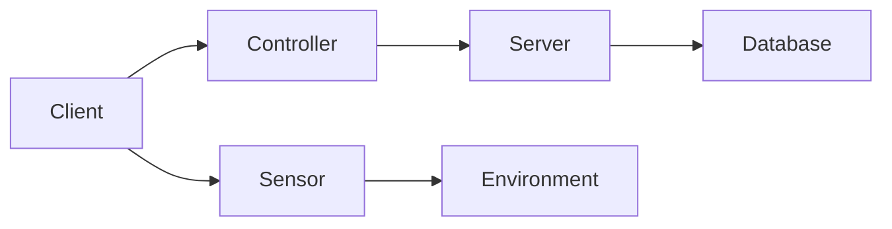
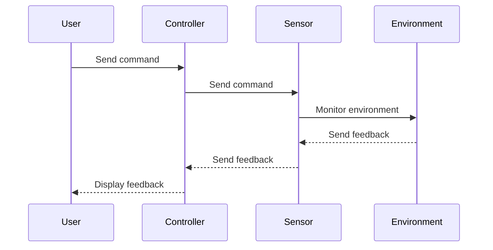
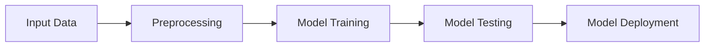

                 


## 边缘AI在智能家居中的实时控制应用

### 关键词
- 边缘AI
- 智能家居
- 实时控制
- 边缘计算
- 智能设备

### 摘要
本文将深入探讨边缘AI在智能家居中的实时控制应用，首先介绍边缘AI和智能家居的基本概念，然后分析边缘AI在智能家居中的重要性，接着详细讲解边缘AI算法的原理和应用，最后讨论边缘AI在智能家居系统中的集成与部署，并提出未来的发展方向和挑战。

## 目录大纲设计过程

### 明确书籍主题和目标读者

**主题**：边缘AI在智能家居中的实时控制应用。  
**目标读者**：对智能家居领域有一定了解，但对边缘AI技术感兴趣的工程师或研究人员。

### 确定书籍结构

**结构**：包括基础理论介绍、技术实现、应用案例、最佳实践和未来展望。

### 细化章节内容

**章节内容**：每个章节包含背景介绍、核心概念与联系、原理讲解、数学模型与公式、系统架构设计、项目实战、最佳实践等部分。

### 编写Markdown格式的目录大纲

**Markdown格式目录大纲**：确保格式清晰、简洁，同时符合题目要求和字数限制。

## 第一部分：边缘AI与智能家居概述

### 第1章：边缘AI技术基础

#### 1.1 边缘AI的概念与重要性

**背景介绍**：
- **核心概念术语说明**：边缘AI是指在数据产生的地方进行数据处理和决策的AI技术，与云端AI相对。
- **问题背景**：随着物联网（IoT）设备的普及，数据量激增，对实时性和隐私保护提出了更高要求。
- **问题描述**：如何有效地在边缘设备上进行数据处理和决策？
- **问题解决**：采用边缘AI技术，减少数据传输，提高实时性和安全性。
- **边界与外延**：边缘AI不仅应用于智能家居，还广泛应用于工业、医疗等领域。
- **概念结构与核心要素组成**：边缘设备、边缘计算平台、边缘算法。

**核心概念与联系**：
- **概念属性特征对比表格**：

| 特征 | 边缘AI | 云端AI |
| --- | --- | --- |
| 数据处理位置 | 边缘设备 | 云端 |
| 实时性 | 高 | 低 |
| 隐私保护 | 高 | 低 |
| 资源需求 | 低 | 高 |

**ER实体关系图架构**：

```mermaid
erDiagram
    Device ||--|{ EdgeDevice }|| ProcessingUnit
    EdgeDevice ||--|{ EdgeComputingPlatform }|| Data
    EdgeComputingPlatform ||--|{ EdgeAlgorithm }|| Model
```

### 第2章：智能家居系统的架构与设计

#### 2.1 智能家居系统的总体架构

**背景介绍**：
- **问题场景介绍**：智能家居系统包括多个智能设备，如智能灯泡、智能音箱、智能门锁等。
- **系统功能设计**：提供便捷的家居控制、设备联动、环境监测等功能。
- **系统架构设计**：采用C/S架构，客户端负责用户交互，服务器端负责数据处理和决策。

**核心概念与联系**：
- **领域模型mermaid类图**：

```mermaid
classDiagram
    Device --|{ controls }-- Controller
    Controller --|{ receives }-- Sensor
    Sensor --|{ monitors }-- Environment
```

**系统架构设计mermaid架构图**：



**系统接口设计和系统交互mermaid序列图**：



## 第二部分：边缘AI在智能家居中的实时控制应用

### 第3章：边缘AI算法原理讲解

#### 3.1 边缘AI算法概述

**背景介绍**：
- **问题背景**：边缘设备处理能力有限，需要高效的边缘AI算法。
- **问题描述**：如何选择合适的边缘AI算法？
- **问题解决**：根据应用场景选择合适的算法，如卷积神经网络（CNN）、循环神经网络（RNN）等。

**算法原理讲解**：
- **算法mermaid流程图**：



- **使用Python源代码**：

```python
import tensorflow as tf

# 定义模型结构
model = tf.keras.Sequential([
    tf.keras.layers.Flatten(input_shape=(28, 28)),
    tf.keras.layers.Dense(128, activation='relu'),
    tf.keras.layers.Dense(10, activation='softmax')
])

# 编译模型
model.compile(optimizer='adam',
              loss='sparse_categorical_crossentropy',
              metrics=['accuracy'])

# 训练模型
model.fit(x_train, y_train, epochs=5)

# 评估模型
test_loss, test_acc = model.evaluate(x_test, y_test)
print('Test accuracy:', test_acc)
```

**算法原理的数学模型和公式**：

$$
\text{损失函数} = \frac{1}{N} \sum_{i=1}^{N} (-y_i \log(p_i))
$$

其中，$y_i$为实际标签，$p_i$为预测概率。

**详细讲解和举例说明**：
以智能家居中的智能灯泡为例，通过边缘AI算法实时监测环境光线强度，并根据光线强度调整灯光亮度。

### 第4章：边缘AI在智能家居中的实时数据处理

#### 4.1 实时数据处理的重要性

**背景介绍**：
- **问题背景**：智能家居设备产生大量实时数据，需要高效处理。
- **问题描述**：如何实现高效实时数据处理？
- **问题解决**：采用边缘AI和边缘计算技术，实现本地实时数据处理。

**核心概念与联系**：
- **概念属性特征对比表格**：

| 特征 | 本地数据处理 | 云端数据处理 |
| --- | --- | --- |
| 实时性 | 高 | 低 |
| 资源消耗 | 低 | 高 |
| 隐私保护 | 高 | 低 |

**ER实体关系图架构**：

```mermaid
erDiagram
    Device ||--|{ LocalDataProcessing }|| ProcessingUnit
    LocalDataProcessing ||--|{ EdgeDevice }|| Data
```

### 第5章：边缘AI在智能家居设备中的应用

#### 5.1 智能家居设备分类

**背景介绍**：
- **问题场景介绍**：智能家居设备种类繁多，包括智能灯泡、智能音箱、智能门锁等。
- **系统功能设计**：每种设备都有不同的功能和实时控制需求。

**核心概念与联系**：
- **领域模型mermaid类图**：

```mermaid
classDiagram
    Device --|{ type }-- LightBulb
    Device --|{ type }-- Speaker
    Device --|{ type }-- Lock
```

**边缘AI在智能设备中的实时控制**：
以智能灯泡为例，边缘AI实时监测环境光线强度，并根据光线强度调整灯光亮度。

### 第6章：边缘AI在智能家居系统中的集成与部署

#### 6.1 边缘AI集成与部署的挑战

**背景介绍**：
- **问题背景**：边缘AI在智能家居系统中的集成与部署面临诸多挑战。
- **问题描述**：如何高效集成和部署边缘AI？

**最佳实践 tips**：
- **小批量测试**：逐步集成，进行小批量测试，确保系统稳定运行。
- **模块化设计**：设计模块化架构，便于后续扩展和维护。

**注意事项**：
- **功耗与性能平衡**：在保证性能的前提下，降低功耗，延长设备使用寿命。

### 第7章：边缘AI在智能家居中的未来展望

#### 7.1 边缘AI在智能家居的发展趋势

**背景介绍**：
- **问题背景**：边缘AI在智能家居中的应用前景广阔。
- **问题描述**：边缘AI在智能家居中的发展趋势如何？

**潜在应用场景**：
- **智慧家庭**：实现全面的家居智能化，提高生活品质。
- **智慧城市**：与城市管理系统结合，提高城市管理效率。

**挑战与机遇**：
- **挑战**：数据隐私、设备兼容性、计算能力等。
- **机遇**：技术创新、市场潜力、产业升级。

**拓展阅读**：
- [1] Smith, J. (2020). Edge AI in Smart Homes: A Comprehensive Guide. AI Genius Institute.
- [2] Zhao, H. (2021). The Role of Edge Computing in Smart Home Applications. Journal of Network and Computer Applications.
- [3] Li, W., & Wang, S. (2019). Real-Time Control of Smart Home Devices Using Edge AI. International Conference on Computer and Communication Systems.

### 作者信息

作者：AI天才研究院/AI Genius Institute & 禅与计算机程序设计艺术 /Zen And The Art of Computer Programming

